# 【转载】Black Hat USA 2022 会议视频 - P29：030 - ＂No Mr. Cyber Threat!＂ - A Psychological Approach To Managing the Fail-to- - 坤坤武特 - BV1WK41167dt

现在我很荣幸地欢迎大家上台，西蒙拥有它，是呀，非常感谢，在一千九百六十一，一个28岁的纽约酒保下班回家，现在是大清早，天很黑，她在路上看到一个人，当她回家的时候，不应该认出他来。

她没有意识到他跟踪她回家，当她把车停在离停车场不远的地方时，在她光线充足的大楼前，他跟着她，可悲的是，他捅了她两刀，不出所料，她现在尖叫起来，令人着迷的是大楼里发生的事情，居民有一系列的行为。

在那个地方，有些人听到她的哭声，但把它完全视为无关紧要的事情而不屑一顾，一个男人探出窗外喊道，让那个女孩一个人呆着，它不会做更多的事情，这就是它停止的地方，有些人确实会报警，但当他们这样做的时候。

他们描述了谋杀，在他们面前展开的家庭争吵或混战，有的人还在向别人请教，现在试图推卸他们的责任，而没有采取行动的38名证人，对所发生的事情过于简单化了，没有人直接干预最明显的威胁。

没有人能够有效地传达情况，足以促使警方作出紧急反应，任何上过心理学课程的人，或者任何对真正的犯罪感兴趣的人，可能会遇到凯蒂·吉诺维斯的故事，虽然有一些事实是有问题的，这成了心理学上的一个寓言。

关于人们有意识地参与一个肯定应该促使行为的情况，然而出于某种原因，这不是促使了几十年来对阻滞剂的心理学研究吗，在紧急情况下进行调解的人，或在见证时，甚至亲身经历社会不公，而现在，老实说，我不完全相信。

而我喜欢想着自己，作为那种可能想说情的人，如果我看到有人拿着刀，地球上没有办法，我要参与其中，真的很危险，不是吗？我们很幸运，因为我们对类似的现象感兴趣，但在一个非常不同的背景下，当我参与社会工程时。

我通常不想被抓住，是的，那通常对我不好，如果我能进去，把货拿出来，那太好了，但当我四处走动时，人们看到我，他们情不自禁地看到我，我身高六英尺，三个人，我有点突出，我超出了他们的规范，当我们四处走动时。

我们看到的是人们抬起头来，他们知道你在那里，有点不对劲，然后他们又回去打字，现在，我几乎可以制服任何一个，用直接的眼神交流和我能做到的最好的迷人微笑，我们称之为威胁的感知，选择不作为，未能挑战脆弱性。

我们想知道为什么会发生这种情况，我们能做些什么，点击太多，我是网络意识的负责人，英国文化中的行为，我负责制定战略方向和方法，影响整个组织的安全行为，我的职业生涯有两个主要主题，首先作为一名法医心理学家。

我的学术研究专门研究恶意主动行为，为什么坏人会做他们所做的，然后我们能做些什么，我们如何通过游戏化等不寻常而有趣的策略来缓解。

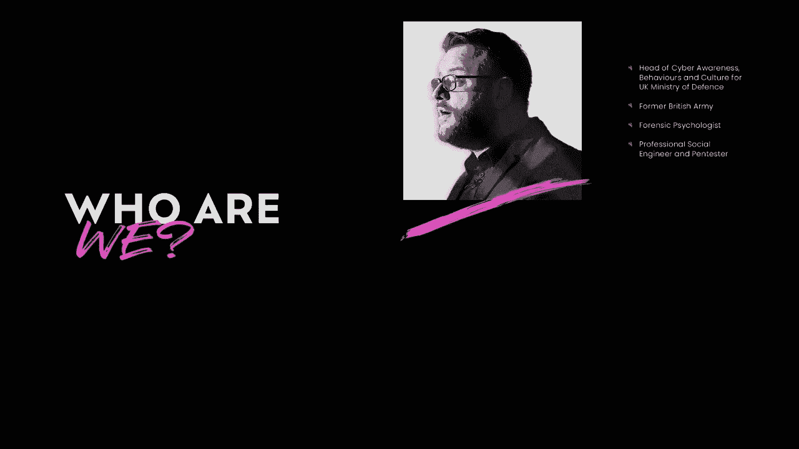

我职业生涯的第二个主题是作为一名专业的社会工程师，我领导的团队进行了社会技术调查，在全球无数高度安全的地点进行审计和评估，我现在在两个阵营都用一只脚行动，检测并寻求补救行为脆弱性。

我是史蒂夫，我和许多公共和私营部门的客户合作过，帮助改变这些组织内部的文化和行为，目前我是一名行为科学家，它是SI like网络意识行为和文化团队的一部分，我也想好好利用我的社会工程技能。

希望应用它们，看看我们如何帮助改变这些组织内部的行为，所以英国文化中的网络意识行为，我们的任务很简单，我们希望显著降低网络安全风险，通过有针对性和可衡量的干预，开发新的和加强现有的积极行为。

知道观众的规模真的很重要，我们正在处理，我们组织里有二十四万人，涵盖了每一个人口和贸易群体，但它比那更宽，我们还负责影响服务家庭，退伍军人，军校甚至国防工业基地，总而言之，我负责改变超过三百万人的行为。

可能是一项不令人羡慕的任务，我们通过四个关键的努力支柱来做到这一点，我们所做的一切的中心是数据，我们什么也做不了，除非我们知道人类的地形，知道我们是否会产生影响，经常抽样的社会行为问卷。

以获得一个大的宏观图像，我们还对特定的数据来源进行深入分析，这些数据详细描述了个人的危险行为，在这个上面，我们有话语塑造内容团队，所有的想法都附有文字，所有的文字都是为了交流思想而存在的。

语言的使用是了解价值的重要窗口，促使安全行为的潜在心理模型的意义和位置，除非我们考虑语言的方式，大量的网络措辞词汇被使用，我们会发现很难在此基础上改变行为，下一个，我们有教练组，不出所料。

没有人能执行一项任务，除非他们知道如何执行这项任务，现在我认为训练是非常有价值的，但我确实认为我们高估了在这种特定的景观中需要多少，最后一个，但更重要的是我们有行为干预小组。

他们负责发现、检测和观察特定群体中具体变化的行为，现在，我不打算说太多那件事，我稍后会把这个留给史蒂夫。

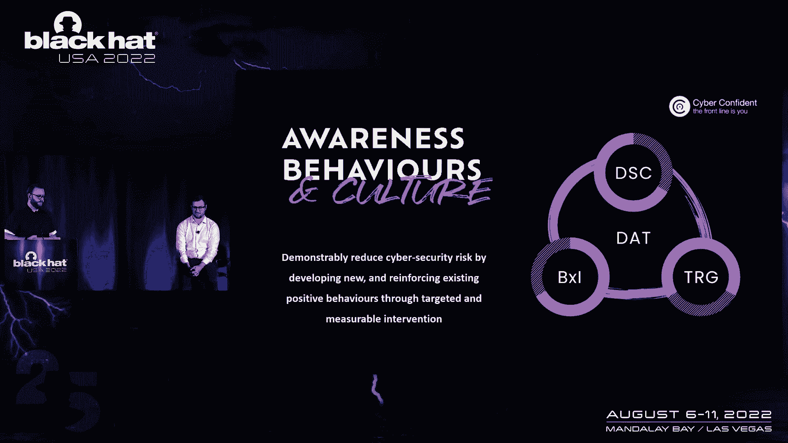

在过去的几年里，我们做了大量的工作，它已经被看到了，而且非常有效，我们有一些例子，就像我们故意影响，报告可疑事件的可能性。

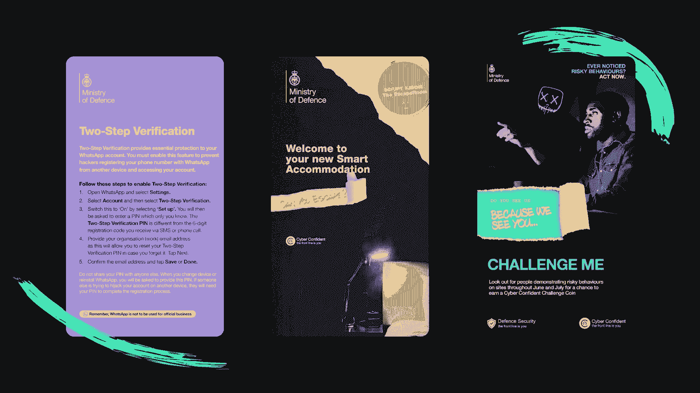

我们开发并播放了一个游戏节目，成千上万的人参加了。

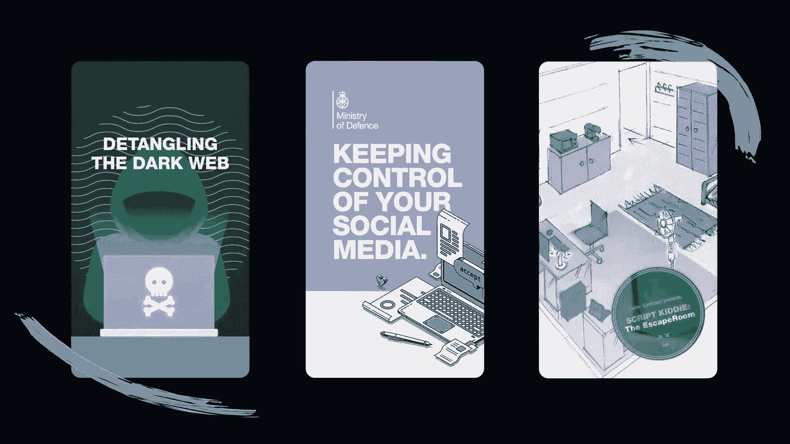

我们改变了未经授权使用USB设备的情况，我们建造并参观了一个物理逃生室，我一会儿再谈这个。

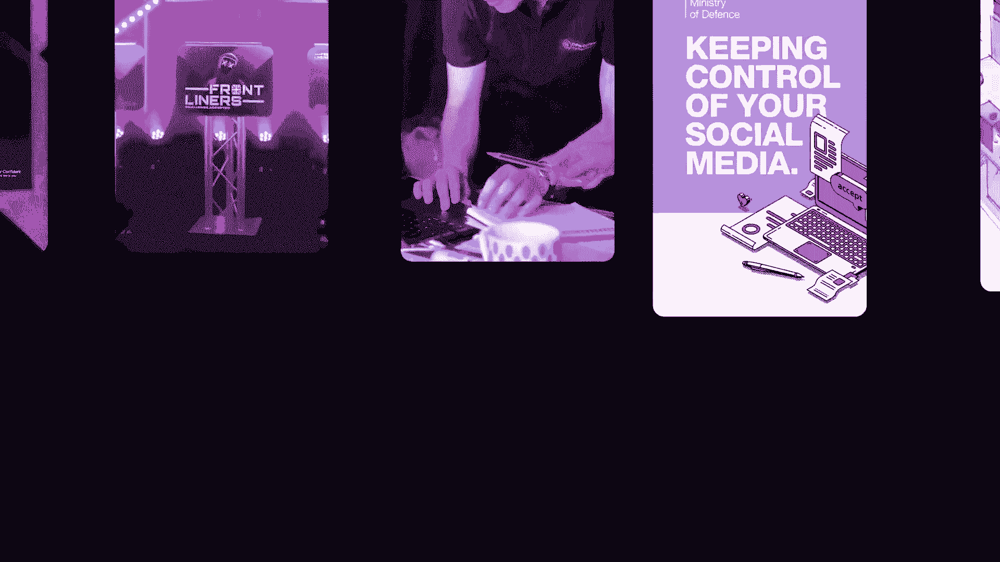

我可以和我们几天来做的所有工作交谈，我不会那么做，因为我没时间了，但如果你有什么想叙旧的，在这之后一定要抓住我，这就是我们所做的。

但让我们谈谈它为什么有效，处理社会问题的普遍方法，行为问题是基于一个非常简单的前提，如果我们的员工知道网络安全，他们会以安全的方式行事，这就是背后的潜在论点，关于这个话题的两个大词，认识和教育。

但如果知识是塑造行为所需的全部，那就没人抽烟了，我们不能指望员工对安全有和我们一样的兴趣，这基本上是真的，那个，对一项任务的兴趣程度，是应用于该任务的优先级的一个主要因素，即使如此，我的观察是。

在安全职业中，我们经常无意识地这样做，当你在帖子上发现密码时，这是一个审计时刻，它注意到，你认为我不相信有人会那样做吗？显而易见，我们不应该把那件事做好，这里发生的是。

我们把自己的价值体系转移到别人身上，很明显那个人的决策过程和我们完全不同，所以我们需要做的是从一个不同的角度来考虑社会行为景观，正如在心理学研究的许多主题中所强调的那样，我们需要考虑支撑行动的动机。

现在，这在纸面上很好，但我们怎么做，所以说，我要提出三件事，我认为我们需要考虑，为了达到一个我们以动机为中心的地方，首先，我们需要简化这个问题，我们真正需要人们做的只有两件事来看到并识别它，如果他们能。

如果他们不能，试着干预，他们需要把这个问题传达给比他们更有能力的人，我们需要人们挑战和报告，现在，注意这些行为真的很重要，不是知识点，背后有知识点，但我们想要的是行为，激励有两个系统。

我们真正想要的是人们按照自己的意愿做事，内在激励，现在，我们通常把我们的安全概念建立在人们应该遵守规则的期望之上，这样做将达到最低标准，但这将安全决策外部化为遵从状态，更好地提取我们内在的动力。

我们需要赋予我们的人民权力，使他们了解，基于风险的决策，老实说，这种想法已经在我们的行业中流传，我们不认为任何事情是百分之百安全的，我们为什么要那样看人，说到内在动机，我们如何更好地做好内在激励。

幸运的是，有一些理论可以帮助我们，根据瑞安·德西自决理论，内在动机有三个要素，我们需要问自己，我们是否在努力满足这些因素，人们是否觉得他们有一定程度的自主权，甚至更好，我们如何支持自治。

我们是否在促进能力，记住，这和欺负人们建立关于，他们不感兴趣的东西，而是给他们机会，感觉他们在重要的事情上变得更好了，最后，克服挑战对他们来说是正确的，我们如何与周围的人联系。

人们是否感到个人责任的重担，还是他们可以把责任推给IT团队，正是这些因素使，游戏化是如此强大的工具，所以我认为游戏化有一个很好的例子，让我告诉你一点背景，niotic实验室开始于2010年。

以创造一种新的游戏性为使命，现实世界变成了游戏板，他们的基本原则是探索新的地方，锻炼身体，与他人进行社会交往，或者用更好的措辞，勘探自主权，健康能力和与其他球员的关系，在二十六年。

他们发布了有史以来最成功的应用程序之一，有人知道口袋妖怪GO吗，一年后，用户集体记录了15分，80亿公里的步行，如果有人在计算，那大致是从地球到太阳系边缘的距离，对我来说，口袋妖怪GO的故事。

是游戏化有多强大的最好例子之一，因为通过他们不可思议的成功，他们完成了他们的核心任务让人们上去做一些运动，但是用户没有下载，为此目的，他们只是在玩游戏游戏的核心真的很简单，这是关于乐趣。

而是享受一些东西，游戏是一种自由的行为，而且很安全，一个好的游戏化会记住这一点，它保持了游戏的真谛，在表面的时候，这是一个提炼游戏机械师的动作，并将其应用到其他地方，只依靠机械师本身。

错过了游戏化所能提供的精神，所以要把它做好，我们需要考虑几个因素，首先我们要走刀，困难边缘，现在第九个边有两条边，当然啦，一方面我们剥夺了你搞砸的自由，显然是从你身边夺走的。

当我们将此应用于游戏化问题时，这是个问题，不是吗？很难避免。

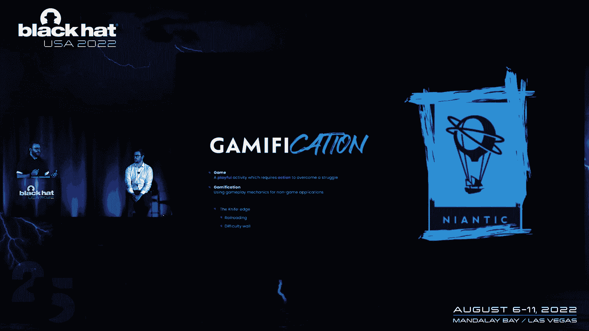

因为我们希望人们达到学习目标，如果他们真的很好，他们绕过了一切会发生什么，那我们就有麻烦了，但困难刀的另一面是抱歉，刀刃的另一边是困难墙，现在当你玩游戏时的困难，一个好的游戏有一个难度曲线。

当你在游戏中变得更好时，它会让你提高能力，当你玩的时候，你面临着更大的挑战，但是有些游戏有一个曲线，它是如此的锋利，就像一堵墙，现在除了最忠诚的玩家之外，这阻止了所有真正有效的纯娱乐玩家。

它确实培养了一群狂热的追随者，但这真的不是我们游戏化的目的，接下来我们需要考虑的是游戏世界，游戏世界作为一个概念非常重要，目的是传达一个新的现实层，所有玩家都可以居住在游戏角色中，有时作为他们自己。

但游戏世界，环境或对手现在都伤害不了你，这个游戏世界的概念，有时会与合成环境的保真度相混淆，特别是代理，在虚拟现实时代，但在游戏化方面，定义要宽泛得多，它可以很丰富，详细经验，像光环一样。

也可以同样详细，不需要任何像地牢和龙这样的视觉表现，它可以非常简单，就像多米诺骨牌一样，在所有这些例子中，玩家不断意识到他们的行动和决定是在游戏世界中单独运作的。

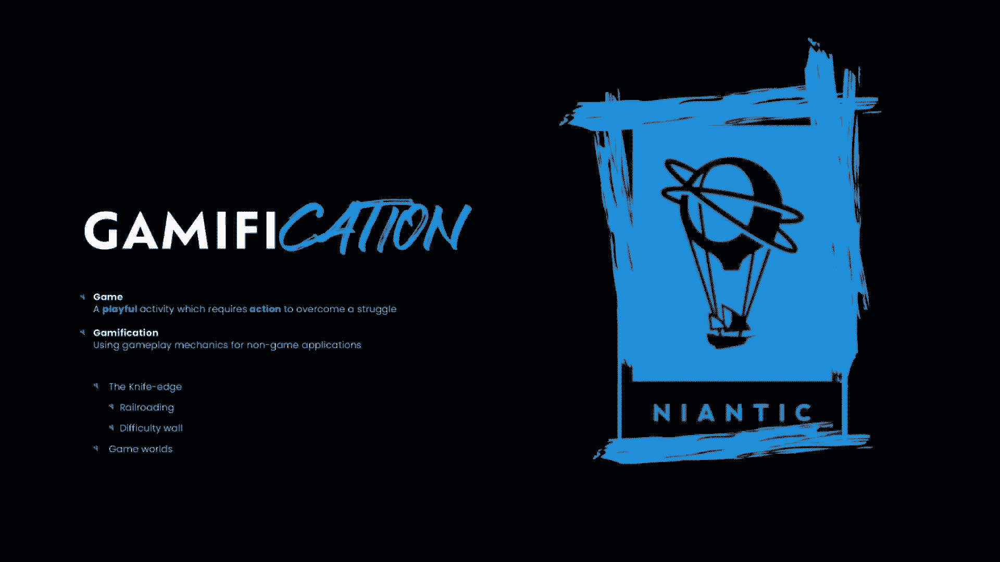

设计不良的游戏化没有考虑到这一点，并简单地期望参与者对游戏机制做出反应，而不买它生活的世界，如果这需要一段时间才能做好，也不要担心，垄断以将所有这些社会摩擦拖入现实世界而闻名。

毁了这个美好的家庭现在最后聚在一起玩游戏，有一个非常重要的因素，这几乎是一场比赛的决定性因素，你一定要赢，好的，胜利是至关重要的，建立积极情绪的最简单方法，但你得记住刀口，这两个人在这里很紧张。

我们希望我们的球员绝对赢，但我们想让他们觉得这不是保证，这是一种操纵，但游戏就是这样运作的，这意味着玩家之间的竞争可能会从根本上产生问题，那么我建议玩家应该在我的学术研究中心赢得一个主要主题。

我们可以在防御者中建立更安全的行为，通过理解居住在…的角色，通过对恶棍的个性化生活体验，重要的是包裹在心理安全的泡沫中，为了提示缓解行为，我们需要两股力量平衡。

外部行为者可能重要地实施的坏事的有意义的基础，你不能从公司内部威胁他们，和一套相应的工具来管理这个具体问题，过剩的知识回避了这个问题，我为什么要费心，它所做的是，它导致了变通办法，或者。

如果我们威胁太多，以错误的方式理解或呈现威胁，然后引发恐惧和瘫痪，当我们看到管理行为的典型方法时，我们花了不成比例的时间要求人们表演行为，没有为威胁创造一个真正的心理平台。

有时我们会谈论我们被攻破的频率，或者当我们要求某人进行这种行为时，我们损失了多少钱，我们是否清楚地解释了竞争威胁，控制的舞会实际上是，这就是威胁化身的目的，我们使用一致的，反派的相关叙事表达。

它既可以提供一个真正威胁的模型，但我们控制着它，我们以一种对我来说安全的方式策划它，对威胁化身的完美刻板印象是火箭队，他们有一首主题曲，告诉你他们将开始做坏事，是威利，郊狼，或者史酷比杜的任何成年人。

作为观众，我们知道每次他们被介绍，他们不怀好意，我们不需要对他们的动机有深入全面的了解，尽管这可以随着时间的推移而建立，我们只知道他们会试图毁掉英雄们，我们也毫无疑问地知道，他们绝对会失败。

我们可以探索他们所有的疯狂计划，他们在那里做的一切，和他们一起，但要知道英雄从来没有受到任何真正的伤害，所以当我们采取措施让我们的员工扮演主角时会发生什么，在他们自己的故事中，当我们把他们塑造成英雄。

我们可以用两种不同的方式来表达我们的对手，要么作为一个经久不衰的故事，我们可以一次又一次地借鉴，我们两者都使用，并微妙地暗示它们之间的联系，为了一个活生生的故事，我们有魔法部，哦，你喜欢这个，反抗部。

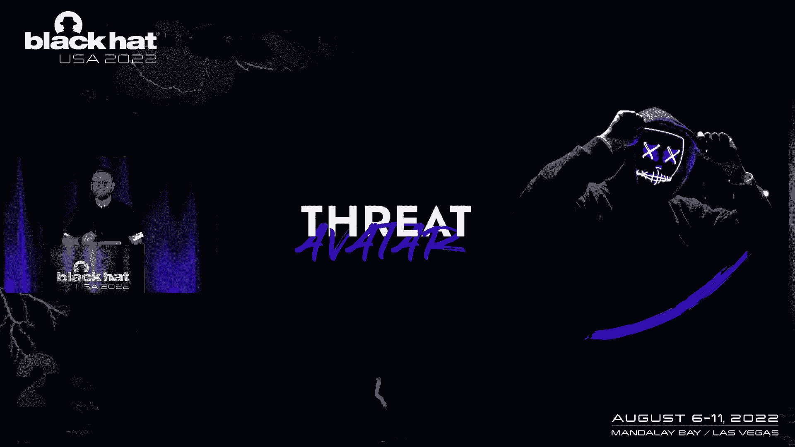

罚款是这个团体的黑客攻击，他们在网络意识月不断试图攻击防御，二千零二十一，我们讲了几个关于迪法恩斯的故事，它们都是相互联系的，我们有一个物理逃生室，在全国巡回演出。

它是基于新的军事住宿模型，当一个年轻的球员被锁在卧室里时，冗长的，顽皮好斗，反抗黑客接管了他们房间里的物联网设备，玩家通过简单的谜题保护这些易受攻击的设备来逃离房间，我们还制作了一本杂志。

我们称之为反抗。

非常好，如果你想看，之后一定要来抓我，但这是从坏人的角度来看的，所以我告诉你他们是怎么做的，他们的所作所为，这是顺便写的，被一个角色，我们叫编辑，他在前面，他闯入了我们的一个广播。

所以我们把视频，他接手了，泄露了迪法恩斯的所有秘密，这显然是虚构的，这些都不是真的，它是以这样一种方式呈现的，这就是为什么它是一个黑客的小图像。

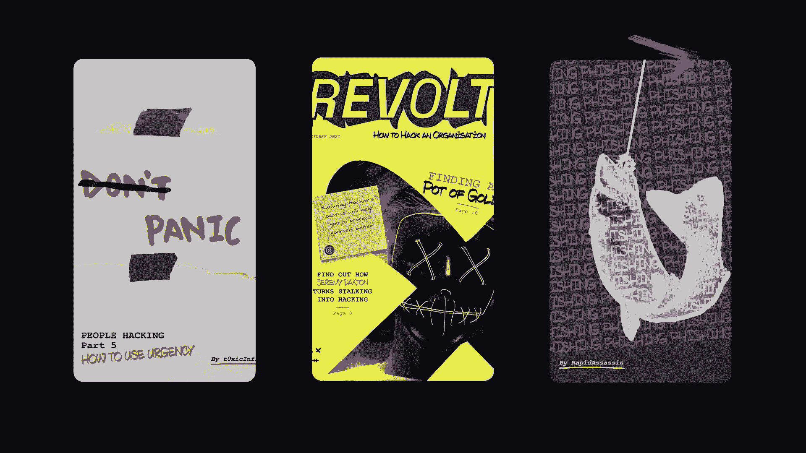

因为我们想要一些你马上就知道不是真的东西。

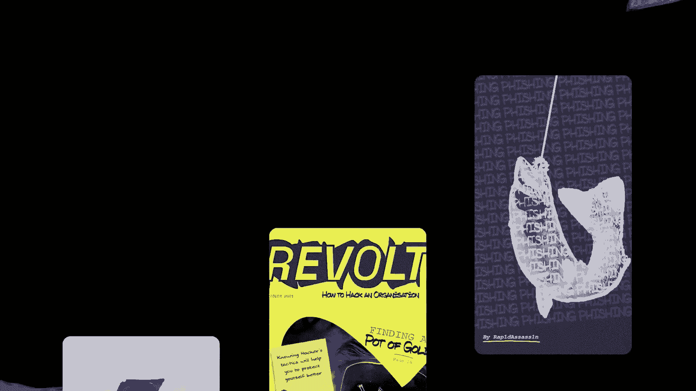

正如我所说，我的理论有另一种形式，这是基于尽快建立一个游戏世界的想法，这很快就会变得相关，但在那之前，我想让史蒂夫解释一下有针对性的干预是如何导致，这些理论的应用，谢谢。我们怎么知道，然后呢。

开发这些新颖和创新的想法，邀请人们进入我们的游戏世界，会产生我们希望的效果，作为一个更广泛的过程的一部分，我们在我们所做的每件事中都遵循三个关键原则，我们总是确保我们针对的是一个目标受众。

我们亲密地了解，我们正在努力一个特定的行为，我们确保所有这些都有证据，这样我们就可以证明我们对这两件事的影响，这意味着当一个请求来找我们说，看某一特定的东西，我们确保我们把所有的政治或情感。

或该请求的意见，并确保我们专注于具体的行动，这不是我需要你看这个的情况，因为这让我在学长面前很难看，如果我们知道人们在做这件事，那就是一个案例，这种事已经发生很多次了，我们可以确切地证明它是什么。

我们确保我们理解人们正在做的具体行动和行为，但仅仅理解这一点是不够的，我们需要理解人们为什么要做这些事情，所以我们从建模中提取所有的数据，并确保这一点，并将其应用于不同的行为模型，就像我前面提到的那些。

或者苏珊·米切尔及其同事的行为改变I模型，这有助于我们理解人们为什么要做他们正在做的事情，但我们不能忽视这样一个事实，即人们并不是孤立地运作的，他们是一个系统的一部分，该系统还通知行为。

所以我们从更广泛的背景来理解组织因素是如何，领导正在做的事情，例如，也可能影响行为，这意味着当我们开发我们的干预措施时，当我们开始应用游戏化，我们知道我们将推动正确的杠杆，我们知道我们将能够产生效果。

我们想要并针对正确的行为，我们再次证明了这一点，我们确保我们改进和试验我们所有的干预措施，在我们真正将它们部署到我们的目标受众之前，再次了解我们将产生什么影响，然后最终我们可以部署，当然。

我们确保我们审查和监控，确保我们现在产生了正确的影响，正如我提到的，我们将讨论挑战行为，这源于一件始于20020年的作品，实际上，我们被要求看，减少人们携带宠物或便携式电子设备的流行。

进入我们组织的领域，他们现在不应该是信息保护区，从我们的工作中，从这个过程的前半部分，我们有效地理解了问题在于虽然每个人都知道这正在发生，没有人愿意站出来说你不能那样做，你不能带手机进来。

或者你能把智能手表放在外面的储物柜里吗，这就是它们的作用，这是一个非常重要的问题，我们知道这个问题存在于许多不同的群体中，在世界各地的许多不同组织和行业中，正如我提到的。

挑战是非技术人员可以做的两个最重要的行为之一，以及报告，以确保组织保持安全，然而，我们并没有真正得到练习这种行为的机会，当我们这样做的时候，这是一个真实的生活情况，伴随着真实的社会压力，对呀。

谁想去找他们的同事，告诉他们他们正在做的事情对他们的组织来说是有风险的，谁想感觉自己像泥巴里的棍子或进步的障碍，即使你在做正确的事情，试图保护你的组织的安全，想象一下，防火墙不敢查询请求。

因为它感到自我意识或害怕被评判，作为一种保护形式没有多大用处，会不会，和人类网络完全一样，我们必须让我们的人民感到自信，能够挑战，因为这是保证组织安全的原因，所以为了帮助进一步定义它。

并确保我们推动人们走向正确的行为，我们实际上想让他们展示，所以说，我开发了一个挑战模型，这是基于两个关键原则，行动的后续社会影响和有效干预的实际质量。

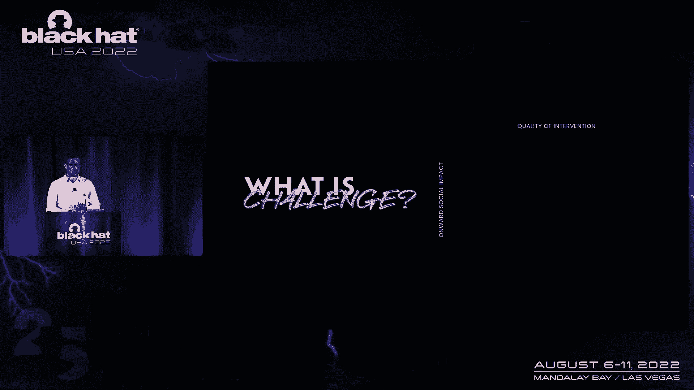

你在这个过程中让任何人心烦意乱吗，它真的消除了风险吗，这个模型的第一部分，非建设性的部分挑战，可能是过于激进了，有点健壮，也许比我们希望的更多，它本身并不能消除风险，它不会干预那种行为，直到构造部分。

稍微有礼貌一点，更友好的挑战风格，但仍然没有消除风险，有些东西还在那里，这是一个问题，由于非建设性的完成再次回到那个，可能有点过于粗暴的挑战风格，但在这种情况下，它实际上消除了风险。

它阻止了危险行为的发生，一直到我们挑战的圣杯，建设性完成，它很结实，但很有礼貌，它消除了风险，它干预了那个特定的行为，并阻止它的发生，所以我们明白，我们需要减少进入IP Z的垫的数量，为了做到这一点。

我们需要增加危险行为的同伴挑战，在我们向你们演示我们是如何做到这一点之前，我们还想试着解释一个模型，所以在我们周围的环境中，我们总是吸收成千上万的信息来帮助理解环境，我们必须开始理解这一点。

我们必须赋予它意义，我们把所有这些不同的信息，所有这些刺激，把我们自己的感知围绕在他们周围，了解环境中发生的事情，这就开始影响我们的认知，我们实际上在想什么，局势，作为我刚刚觉察到的这件事的结果。

我需要做什么，这又是，反过来，它开始影响我们的行为，我们现在实际做的事情，我们经营的世界，影响这个过程，反之亦然，在一定程度上，这是一件非常重要的事情要记住，因为如果我们想开始思考如何影响挑战行为。

我们需要让人们站起来，到了理解的地步，他们实际上需要做些什么，我们需要给他们所有这些小信息，所有这些不同的刺激，帮助他们把自己的感知围绕在它周围，并意识到这是有风险的。

所以他们开始思考并意识到他们需要做些什么，然后采取行动，所以我们将向你们展示我们是如何做到这一点的，现在，为了这次演示的目的，我只是这个组织中的另一个人，我不一定知道，有效地，我们在这个演示中所做的。

在角色扮演中，练习的全部目的是，我们正在帮助个体分离他们的认知，并在这样做的过程中，帮助他们开发一个具有挑战性的脚本。

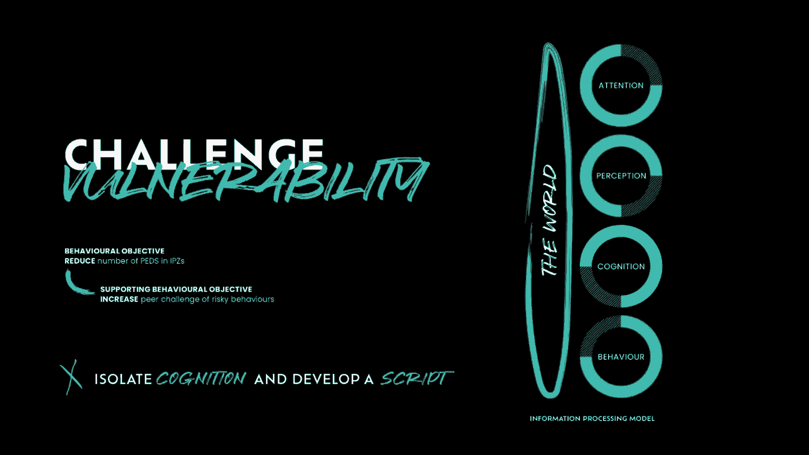

描绘现场，这是一个星期四的早晨，我得去工作，我有一大堆电子邮件要处理，一夜之间进来的，我今天有很多会议要准备，我的注意力是有限的资源，现在所有的一切都在手头的任务上，作为一个坏人，我知道现在我能做的是。

我可以利用这一点，难道我不能，如果我在测试或评估，我会从他身边飞过，他不会注意我的，他正忙着打字，好的，这很公平，但那不是我的目标，我想做的是引起他的注意，所以要做到这一点，我要问他一个问题。

可疑的问题，对不起，伙计，抱歉，打扰一下，嗯，我很抱歉，我今天做了个恶梦，我的笔记本电脑坏了，我的手机没电了，我还有十分钟就要开会了，我能借用一下你的笔记本电脑给我老板发邮件吗？好的，现在这有点奇怪。

我想以前从来没有人在办公室里找过我，问我他们能不能用我的笔记本电脑，当我坐在上面的时候，现在，我只是想弄明白这种情况，明白发生了什么，我试着把所有这些刺激都建立成一幅画，我开始觉得这有点冒险。

但现在我只是想理解你的要求，我正在做他刚让我做的事，将其与一连串的社会规范进行比较，我们在日常生活中都坚持的规则和期望，去理解，是否可以接受，与此同时，我很快就建立了一个游戏世界，没有坏人。

别告诉你他们是坏人，所以我要做的是利用这个游戏世界，我要引起他的兴趣，然后我要让他挑战我，让他用它做点什么，顺便说一句，是为了吸引他的注意力，但它可能不会立即发生，他可能需要一点时间来整理，这没关系。

记住这发生得非常非常快，我也要求他做一些事情，他绝对不应该这样做，他从来没有见过我，他不可能认识我，这意味着他绝对不应该给我，不受限制地访问他的笔记本电脑，嗨，对不起，你现在想要什么来着。

我仍在试图了解情况，我还在努力把所有这些不同的刺激放在一起，但我知道这不太对，我知道我可能得做点什么，它开始影响我的认知，但我还没有完全到达那里，也许现在没问题，也许我可以找别人来处理这个问题。

把它变成别人的问题，其实，我觉得你应该去和它谈谈，我没事，不错嘛，对呀，这是一个部分挑战，他不让我碰他的笔记本电脑，但现在我可以继续利用这个人，他们还没有阻止我，我可以推得更远。

或者我可以利用这种允许性离开并逃跑，我们正在努力接受挑战，那么我该怎么办，我要把他推得更远一点，哦，呃，是啊，是啊，是啊，是啊，当然啦，当然啦，我忘了，我忘了，我告诉你，我有更好的东西，有没有。

你能不能把这个，这是一个U盘，你能抓住这个机会吗，只要打印出来，上面只有一个文件，如果你这么做了，我不会迟到的，拜托了，好的，现在再来一次，这开始变得很奇怪了，我真的认为我做不到。

我想我不能拿着这个插上电源，但同时我真的很讨厌对别人说不，事实上，这对我来说并不自然，我想我真的做不到，虽然，我将不得不拼凑起来，从零开始的某种挑战看，我真的很抱歉，但我们实际上不能把它们插进去。

我认为这是违反政策的，对不起，你对不起谁，我和他们一起搜查了走廊，我在这里工作了很长时间，我知道没有杰夫·史密斯，这个家伙刚刚接近我，让我做非常冒险的事情，他给了我这个奇怪的U盘。

实际上它的侧面写着黑客，那件T恤是什么，所有关于，为什么说，我在骗你，我不知道，我想出事了，我想这可能是一个练习，嗯，没有网络威胁先生，我不会把它插进去的，哦，他抓住我了，你看，这是一个完全的挑战。

除此之外，我什么也做不了，改变角度，这个人把所有的线索都放在一起了，愚蠢的USB，把我漂亮的T恤，和我一起跳进了游戏世界，他们现在知道我们在说什么了，所以现在他们就在那里，在我旁边。

他们之前经历的所有紧张，他们感到必须立即解决的不适，他们感觉很棒，现在，感觉还挺好的，我想利用这一点，因为他们感觉很好，他们现在有了一个在未来进行挑战的框架，很明显，我的意思是不言而喻。

它不会看起来像这样，因为他们做过一次，因为他们经历了那个心理过程，他们参与了一项挑战，他们现在知道事情会解决的，好的，这并不奇怪，有点奇怪，我实话实说，当他们将来走到这一步的时候。

他们正在建立所有积极的情绪，他们还做了什么，他们打了一个坏人，他们战胜了一个直接威胁的化身，那是相当强大的，但我不会就此结束，会有点可疑，如果我做得好，我要给他们一个好的质量，汇报，祝贺你，是呀。

绝对有练习，我和一个网络自信的团队在一起，这是我的身份证，你可以验证，如果你喜欢，呃，我们在这里做这个练习，因为我们想加强建设性挑战的重要性，你做得很好，你做得很好，所以非常感谢你。

这是一件非常重要的事情，你要知道，这不是测试，这不是评估，我们从不那样做，我只想给你一个练习的机会，你做得很好做得很好，哦，还有最后一件事，我要留给你，这里的这个小卡片，它是绿色的，站在你的桌子上。

如果你把它放在那里，然后我的团队就知道了，我们暂时不会再来找你了，无论如何，下次你不穿T恤的时候，所以要小心，它所做的是，让你和你周围的人知道挑战有多重要，所以非常感谢你参加这个练习，是啊，是啊。

不用了，谢谢，那真的很奇怪，但是没有办法，我可以答应你，有太多太多的事情，下次我也会拿到身份证的，是啊，是啊，确切地说，在舞台上很奇怪，有点奇怪，不同的练习，但对我来说，这真的很有用。

我不得不把所有这些不同的东西，这些不同的信息可能暗示了风险，并为我自己建立了这幅画，我必须明白有些事情不太对劲，然后我不得不挑战他，我现在有了一个脚本，下次我可以用，如果我需要，那个，帮助我感到自信。

这是我们现在必须做的事情，所以简单的练习重复多次，就是我们如何开始改变行为，到目前为止，我们已经做了两个练习，两次，直接雇佣了850人。

这意味着我们也间接雇佣了两三千人，我们已经在英国的多个网站上这样做了，包括唯一一个他们不必在开火前发出警告的地方，这给每个人的锻炼增加了一定的香料元素，但当我们跟进这件事时，我们可以看到它开始起作用了。

77%的人报告说这项运动很吸引人，很有用，嗯，62%的人在运动后对挑战持积极态度，剩下的三个，8%的人报告中立，这意味着没有人报告对挑战有任何负面情绪，之后，我们开始改变人们对这种行为的看法。

但这也开始影响他们的认知，九十，百分之一的人告诉我们他们现在有信心提出挑战，如果他们觉得他们需要，但不仅仅是统计数据和数字，和它们一样重要，这是人们讲述的关于挑战的故事和他们所做的事情，结果。

我们有安全顾问回来告诉我们，他们网站上的人开始挑战更多，他们以正确的方式做这件事，重要的是，在我们的环境中，他们也在做那个，指挥系统，没有先生，网络威胁，在角色扮演中俗气的台词很好。

这是在一次交战中对我们大喊大叫的东西，在一个非常非常繁忙的办公室里。

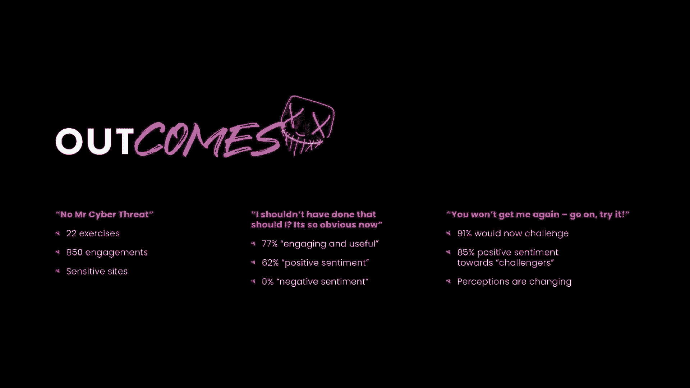

现在有人站起来对我们大喊那句话，而这让我们变得有点红，我们看起来有点傻，其实，这是一个不可思议的结果，它打开了游戏世界从一个到一个，1对多的关系，地板上的其他人现在都体验过地板行者。

并和我们一起参加了演习，正在帮助我们以更快的速度将这种影响传播到更广泛的群体，快速有效的方法，我们被从二楼的窗户里赶出来了，我们也有人把挑战转向我们，继续，再试着抓住我，我打赌你下次肯定做不到了。

所有这些都表明练习开始奏效了，我们可以从人们的反应中看到它，当他们这样做的时候，刺激的排列，意识到他们必须做点什么，显然重要的是，我们去过的每一个地方都要求我们回去再做一次，所以我们一定做对了什么。

所以我们提到我们总是希望人们有一个积极的挑战体验，那么我们如何做好这一点呢，首先，我们必须承认这种练习有风险，不是每个人都喜欢直接订婚，也许我们的同事不一定是神经典型的，因此。

直接与他们接触实际上可能会影响人们的心理安全感，或者同样的幸福，甚至没有再从桌子上站起来，这些感觉可能会受到不利的影响，因为我们要去的网站种类，以及他们身上的信息，我们真的有可能引起某种事件。

或者在一个地方有强壮的武器，但是理解和接受这些风险意味着我们能够做些什么，我们不断更新练习中使用的语言，以确保我们不会触及特定网站的任何软肋，让任何人心烦意乱，不经意间，我们已经把T恤换了。

使它们更加鲜艳，并以更强烈的口号更加突出，所以很明显我们不应该在那里，随着时间的推移，我们建造了一个拼花地板，SI递给我的U盘只是一个3D打印的塑料碎片，侧面写着黑客或病毒。

我们去现场的时候也会用假电话，这样我们就不会违反自己关于护垫的规则，但也有一些基本的东西是建立在练习的结构中的，这有助于保护它的安全，我们每次演习都有两个观察员可以看到交战。

他们通过一个秘密的无线电工具包进行持续的通信，这样他们就能一直看到听到并与地板行走者交谈，所以如果有人有特别强烈的反应，我们能够介入并干预，如果我们需要，我们总是确保正确的人知道我们应该在那里。

我们有合适的人的许可，他们很清楚会发生什么，我们保留这个许可，它的印刷版，所以再一次，如果有人反应强烈，我们可以向他们表明我们实际上应该在那里，最后一件事也是在练习中，我们总是做汇报。

我们不只是让人挣扎，想想刚才发生的到底是什么，我们解释了我们为什么这么做的原则以及我们试图实现的目标，我们让他们知道他们做得很好，即使需要一点点轻推才能把它们弄到那里，这样他们就有信心做到这一点。

所有这些都有助于我们控制运动，并确保我们以安全的方式进行，所以这就是我们开始解决失败的方法，挑战脆弱性，我很感激这里面有很多细致入微的信息，但我们只想给你留下今天的三个关键要点。

所以第一个游戏化不一定很难，不需要很长时间，它不必花费地球，要么，在我们的示例中，游戏世界在几秒钟内就建立起来了，它的成本和打印三个D U盘一样高，做一些T恤。

它还利用了我们许多人已经有效地拥有的相同技能，我们在社会上为某人设计一个反应，而不是为了恶作剧的目的，我们这样做是为了一个积极的结果，训练不一定是一年一次三十分钟，像这样的微剂量，事实上。

我们做30秒会有更大的影响，这是更令人难忘的一步，走出它是什么，思考什么，培训和学习可以肯定的位置，动力是它的中心，我们显然希望你从今天开始，走开，试着把它们应用到你的工作中，氰真的相信通过应用行为。

科学或心理学对我们所做的事情，我们可以帮助组织变得更有网络弹性，但我们不能在这个过程中伤害人，没有必要把事情弄得更糟，我们必须保护人们的安全，所以如果我们这样做，确保我们有正确的控制措施。

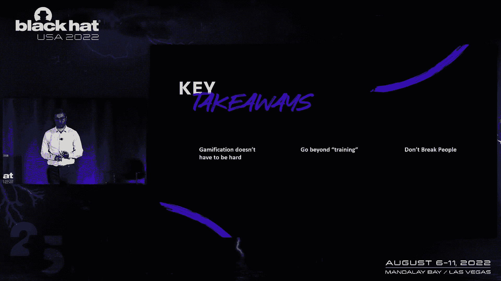

我们不会无意中造成弊大于利，所以最后要说的是，非常感谢你今天抽出时间来听。

我们真的真的很感激，我们希望你觉得它和我一样有价值和有趣，所以从今天开始。