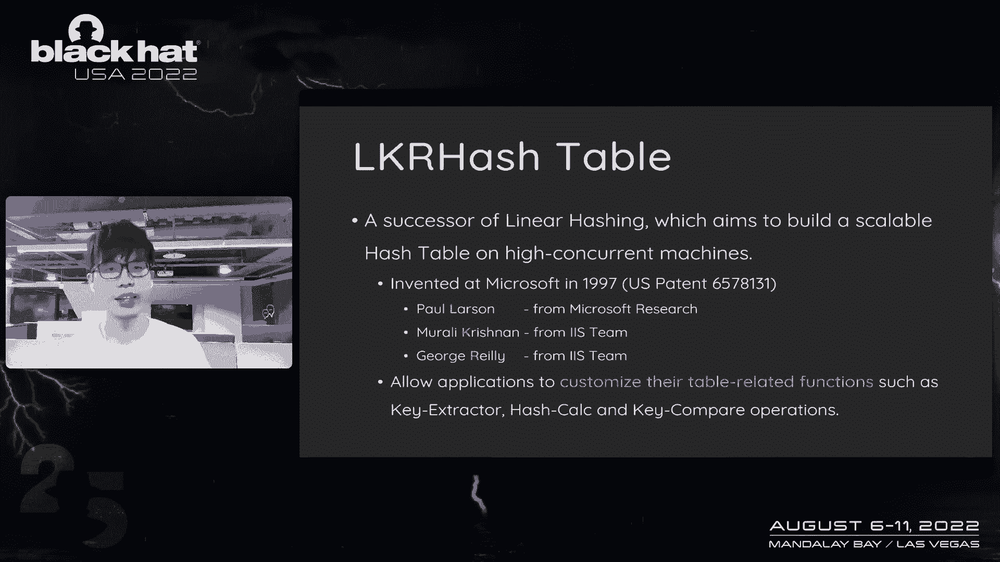
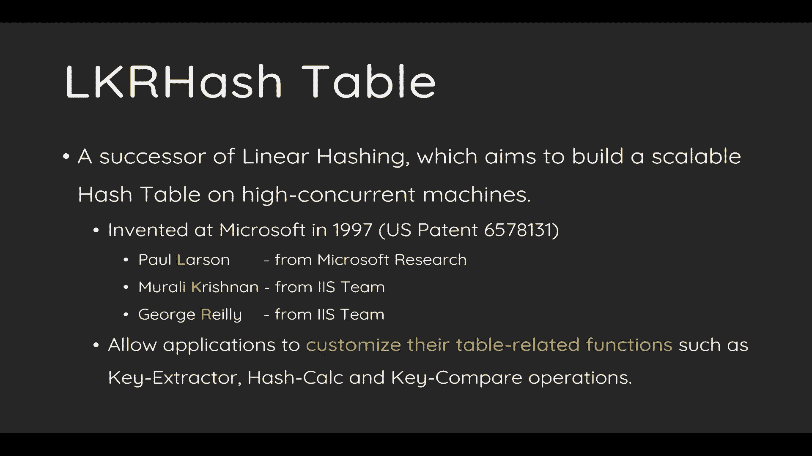
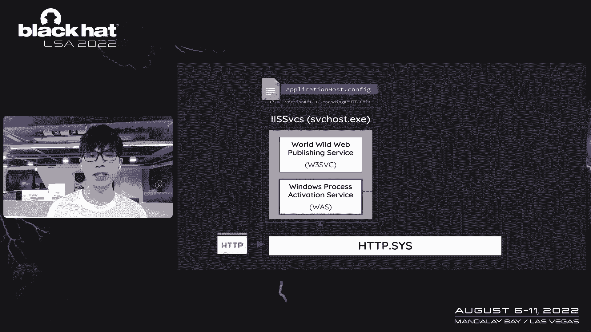
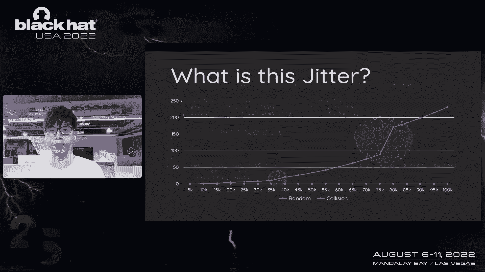
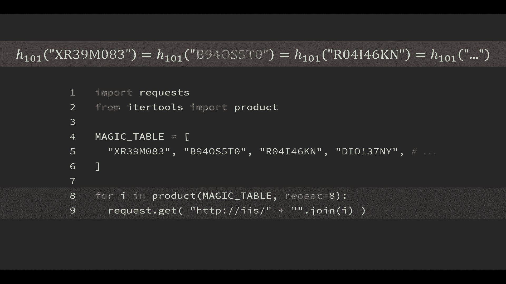
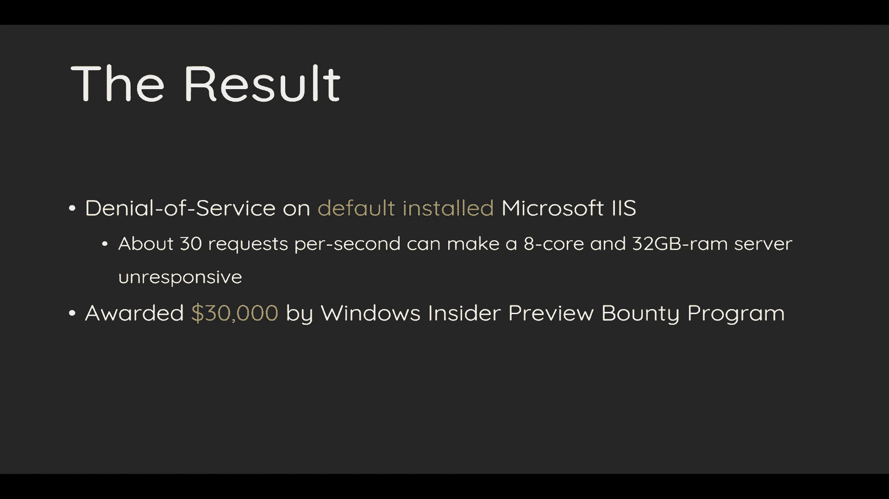
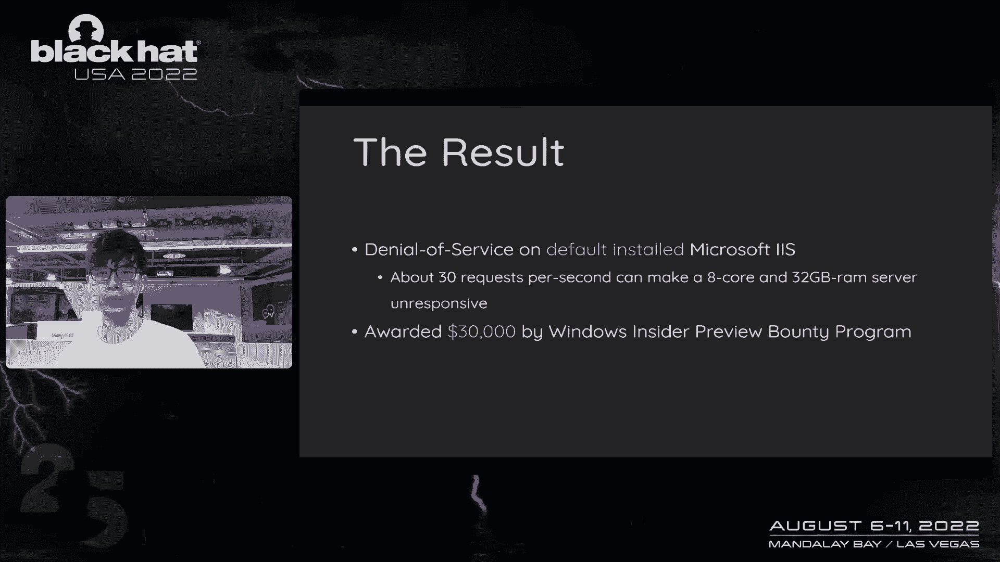
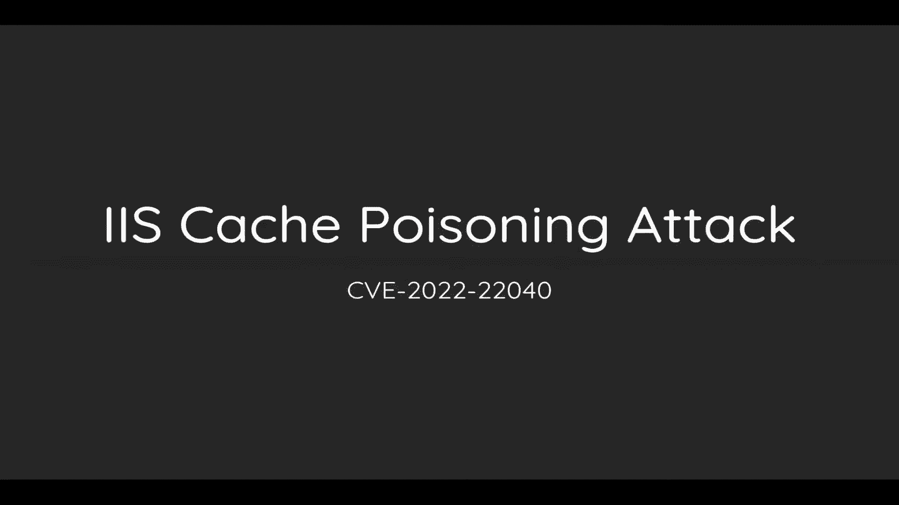
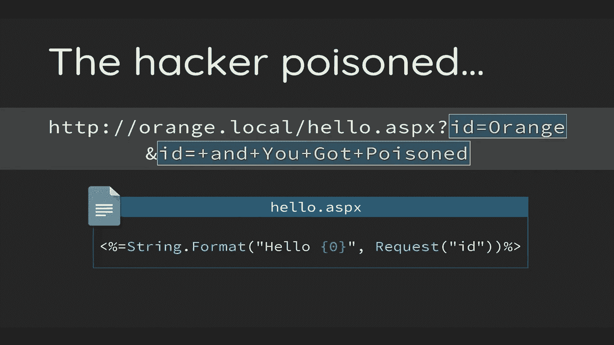
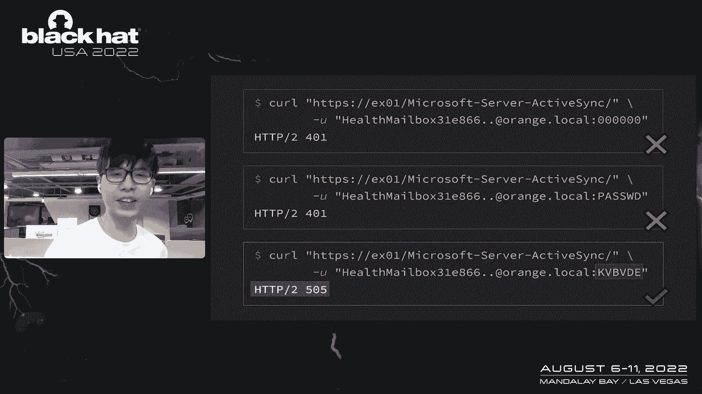

# 【转载】Black Hat USA 2022 会议视频 - P2：002 - Let's Dance in the Cache - Destabilizing Hash Table on Microsoft IIS - 坤坤武特 - BV1WK41167dt

嗨，我希望有一天我们能在拉斯维加斯见面，大约十年前，我在大学的算法课程不及格，但我不是来谈哈希表的，这对我来说是一个很大的成就，一个橘子，今天我的话题就不那么密集了，在缓存中，正在恐吓微软的哈希表。

Iis，在谈话之前，我想给你一个简短的案例，如果有一个由超级安全护照保护的超级秘密区域，只有知道这个长密码才能锁定，所有这些密码，是有效的，可以登录到系统，太神奇了，对呀，我想你心里可能有几个问题。

这是我今天要介绍的攻击之一，你以后会知道细节的，嗨，我是橙色的，现在是Decor的首席安全研究员，我是一名研究人员，专注于Web和应用程序安全，我的工作是发现可能影响世界的最严重的bug和攻击服务。

在坏人之前，我的研究也获得了几个奖项，比如最好的服务器端，县奖励的一部分和章节，和PG冠军一比一，如果你有兴趣，欢迎关注我的推特或稍后与我聊天，这是今天的在线，首先，我们将介绍几个基本概念。

这些概念对于引导您进入Microsoft IIS内部和我们的主题很重要，今天在对IIS内部有了很好的了解后，我们将详细说明我们的研究，然后是三种不同类型的漏洞，也是。

我们将演示如何将这些攻击应用于Microsoft Exchange Server作为展示，当然啦，我们将提供缓解措施，对这些组成部分的建议和今后的工作，那么首先什么是哈希表。

哈希表是计算机科学中最基本的数据结构，它的目的是存储数据，不管数据如何，哈希表可以很好地将数据保存在内存中，哈希表特别擅长处理键值对，并且由于这些好处，可以以高性能操作数据。

哈希表广泛应用于计算机基础设施中，如呃，操作系统，编程语言数据库或Web服务器，编程语言广泛使用哈希表，然而，你不知道，例如数组，所以如果你是一个开发人员，您必须使用哈希表作为内部。

我想这里的每个人都是大学里的好学生，所以我这次跳过了内部的哈希表，至于什么是哈希浮动攻击，我们也不打算谈论这次袭击，只是我们还是给了它很多，因为我相信哈希措辞攻击是最好的任务。

了解攻击者如何滥用哈希表的心态，哈希加载攻击的思想是将所有记录放入同一个桶中，因为哈希算法是公开的，攻击者可以预测其哈希值，让所有的记录都掉进同一个桶里，在攻击者堕落的时候，去广义哈希表。

它可以将数字耙安装到单个链表中，比如说，攻击者在左侧创建了几条恶意记录，中间的哈希函数，将处理耙并将其转换为索引，将第一个耙转换为索引四并放入相应的桶中，第二个也放在同一个桶里。

攻击者可以将所有记录跳转到同一个桶中，该表现在变成了一个链表，所以哈希折叠攻击可以使表始终处于最坏的情况下，这意味着插入n条记录，时间复杂度为n的平方，我们都应该同意n的平方是一个糟糕的表现，好的。

对哈希表有很好的理解，让我们讨论哈希表和IS之间的关系，作为Windows中唯一的Web服务器，iis在x体系结构中广泛使用哈希表来存储信息，例如http页眉，由于这种数据结构的大量使用。

微软从很早的阶段就设计了自己的哈希表实现，以下两个是将在iis中使用的较旧的实现，一个叫做树哈希表，另一个叫做lkr哈希表，树哈希表应该是最常见的，就像教科书中的示例代码一样，它使用链表来解决冲突。

当桌子处于不健康状态时，重新调整桌子，重复是一系列重建过程，它先把桌子放大，重新计算所有记录和复制，然后到他们的新索引作为热，呃，至于用什么哈希函数，我们稍后会进一步讨论。另一张桌子是方舟。

r哈希和实现，以构建一个可伸缩的高并发哈希表，在多下，多评级多核环境，NLK R是创作者姓名的算法，这个实现也是由微软在1999年制定的，它使用另一种更好的算法来解决广泛的重复哈希以提高性能。

创建者花了很多精力来使这个实现可移植，灵活可用的应用程序，应用程序可以定义自己的表。

适应Microsoft多个产品的相关功能，有趣的是，部分创造者也是国税局，是开发人员，应该是，这应该是我们在IIS中发现许多这种实现的原因，现在我们对哈希表有了完整的了解，该是我们深入研究的时候了。

在本节中，我们将展示iis内部并定义我们真正关心的范围，我们将首先扩展我们的心态和想法来发现bug，我们主要关注哈希表的实现及其使用，因为IIS中使用的大多数哈希表都与现金相关，我们还研究和探讨X机制。

因为微软在没有开源的情况下设计了自己的哈希表，实现应该是一个未探索的领域，以发现bug，所以在这种情况下，我们隐藏我们不仅寻找记忆集合，这里还有逻辑错误，我想强调一下bug，简历二千零六三零一七。

这是PHP开始函数中的逻辑错误，哈希表实现没有区分，区分数组的键类型，以便攻击者可以删除具有索引号的任意元素，当我看到这个虫子的时候，它聚集了我，我相信这正是我要找的bug，当然。

我们也寻找算法复杂性问题，如哈希漫游攻击，然而，因为这已经是20年的攻击了，大部分低垂的果实应该消失了，所以在这种情况下，我们在实施上投入了更多的精力，至于用法，我们提到K r哈希被设计成一个可移植的。

灵活易用的算法，可应用于任何情况，约定要求应用程序在初始化期间配置自己的表相关函数，这种可扩展性给了我们更多的机会来发现bug，当我看到这个，我很好奇，这是特殊的功能好，关键计算好吗。

或者函数如何选择正确的记录，当，呃，当碰撞发生时，我对这类问题都很感兴趣，所以在这种情况下，我们更关心耙之间的关系，键和功能，当http请求到来时，内核http首先这样做，我们将首先处理连接并发送请求。

内核轨道，呃，内核跟踪是基于一个活动的是作为工作者，如果没有，它宣布了这项服务，以催生一个新的流程。

首先提升配置以注意流程初始化的几个规范，和从工人过程，这里加载了几个组件，然后工人装载边距，在配置中定义的，默认情况下是IIS，为不同的目的加载几个模块，例如压缩重定向身份验证，和缓存，在所有页边距中。

以下四个是管理Marins之间渔获量的全局渔获量提供商，每种措施负责处理不同的渔获量，例如静态文件的缓存，现金流配置，或Windows令牌的缓存，一旦模块加载完毕，工作者进入请求生命周期。

生命周期是一个事件循环，处理来自请求的所有通知，在一个生命周期中有几个事件，合并可以订阅其有趣的事件来完成其逻辑，合并也可以订阅全球事件，比如说，捕获提供程序订阅事件捕获。

清理和捕获操作来管理模块之间的捕获。

我们的研究不仅仅关注请求生命周期之间的现金，也是全球现金提供者，尤其是这四个是我们的黄金目标，下面的部分是关于我们的研究和盒子，在本节中，我们将首先详细说明我们的想法和我们试图寻找bug的方向。

我们将附上三种不同类型的漏洞来证明我们的想法，在我们的盒子里工作，缓存中毒和呃，身份验证旁路，我们还将讨论如何利用，当然啦，Microsoft Exchange服务器上的真实世界身份验证旁路。

将详细说明和演示，好的，我们要分享的第一个强制转换是哈希浮动DOS，我们想给你一个剧透，微软实现的所有哈希表都受到哈希浮动攻击的影响，树哈希表被defoe攻击，和LK，只有当配置了糟糕的哈希函数时。

r哈希才易受攻击，无论多么脆弱，不等于可开发，除了找到古点，我们还有几个障碍要克服，我们发现你是我的缓存模块似乎是一个很好的目标，此边距的目的是缓存URL的配置，所以现金是本模块中最好的策略策略策略。

在这个空白处，每个http都会触发catch操作，最重要的是边距使用树哈希表，缓存存储也是如此，默认情况下作为一本书，树哈希表听起来不错，这是树哈希表中每一千条新记录的小图表，因为它不是开源的。

我们必须扭转结构，对表进行动态编码以获取数据集，蓝色的线是插入随机记录的类型，橙色的线是有联盟的耙，你应该能弄清楚，这两条线之间有很大的区别，然而周围的紧张呃，三万五千和七万五千很奇怪，叛徒是什么。

所以理论上橙色的线条生长应该是线性的，那么到底是什么让时间平稳地增加。

答案是老调重弹，这是插入操作的一部分，实现首先遍历链接列表以确保没有重复，做它的内部工作，但是在内部操作之后，需要调用函数rehash表，该函数跟踪记录的数量并重新对表进行散列。

如果该数字大于阈值的两倍，阈值是从素数列表中选择的，一旦重复，函数将表放大下一个质数，并将所有记录映射到相应的桶中，这是一次巨大而广泛的行动，这也是图表平稳增长的原因，利用这一点，还有几个问题需要解决。

比如说，我们可以控制多少缓存密钥，或者如何构建薪酬，但是相关性，有效载荷，捕获键中有几个元素，我们唯一可以控制的元素是URL路径，它反映在缓存键的末尾，实现将首先将所有文本转换为上层。

并将密钥发送到哈希函数，哈希函数只是将缓存密钥的每个字节乘以1，零一，有的站起来，该函数还使用nlcg对结果进行加扰，然而，这个哈希函数好吗，这是来自喜欢和非常在他们自己的谈话中的答案，二十八度。

这个乘法是DZB哈希的变体，并且该算法已被证明是可由等价子串排序的，当两个键具有相同的哈希值时。

比如ps和q 2，无论你在他们之前或之后做什么，他们都必须平等，比如说，在你加上一个字母a之后，psa和q 2 a的哈希仍然相等，因为知道，通过知道，这个特点不难理解。

理解两个等效的子字符串可以组合形成不同的键，例如p s p s s q 2，q二，p s和q 2 q 2，它们都共享相同的哈希，因为你可以重复这个字符串很多次，建造，建造有效载荷很容易。

您只需要找到一个具有相同哈希的字段字符串，并将它们组合起来。

所以所有这些都共享相同的哈希值，这对我们的开发很方便，然而，这次攻击有一个致命的流，它太弱了，不能得到关于减速的通知，你一定发送了大约三万五千个请求，至少对于我们一次记录的一个请求来说是这样。

员工太慢了，和，更可笑的是有一个拾荒者，定期回收纪录，清道夫是一个威胁，每三十秒删除一次未使用的记录，每三十秒，这两个障碍使我们的攻击，使我们的攻击不那么实际，克服这一点，我们必须深入研究实现模型。

我们发现了一个有趣的行为可以拯救。

拯救我们的进攻，实现将递归扫描密钥，它有所有新记录的子目录，作为表的所有子目录，比如说，在我们的想象中，URL只会触发一次搜索和一次插入操作，子目录也将被训练为新记录，以便URL将触发多个插入操作。

更有趣的是，所有的新病例都将有一个正常的记录，清道夫对正常记录很好，只有延迟一个接一个而不是一批杀死所有人，所以剩下的唯一问题是如何在这种新的背景下构建联盟，因为所有的副导演，因为。

因为所有子目录都被视为，我们必须构造一个满足以下所有方程的有效载荷，可能很难想象如何实现这一点，通过我们以前的等效特性，但是如果我们把所有的结果映射为零，然后事情就容易多了，乘任何东西都是零。

零加零也是零，所以我们可以满足所有的方程，如果我们将每个子目录的哈希设置为零，这样我们就可以准备一组他们的散列并将攻击放大十倍，至少稍微修改一下，结果是我们可以使服务器无响应。

每秒大约有三十个连接，这不是一个不合理的数字，因为IIS可以处理数千个连接，可以轻松并发地处理数千个连接，因为此bug影响Windows，默认情况下，我们还奖励了大量的Bunty。

让我们看看演示，好的，我们首先仔细检查并确保目标服务器有一个课程，和32千兆字节RA，左下角的窗口是监视IIS状态的脚本，这是一个简单的while循环，每秒钟检查服务器一次，我们先进行随机测试。

我们向IIS发送随机测试，你可以看到负载不到10%，好的，我们现在运行碰撞模式，碰撞，是啊，是啊，好的，大家可以看到，CPU现在处于高负载状态，成绩单被输入，超时循环，铜负荷是百分之百的，呃永远，好的。

这里，我们加快一点速度，好的，大家可以看到，服务器不可用，无法再处理任何请求。

好的，这是我们的演示。

第二个案例是缓存中毒攻击，IIS中有两种类型的响应捕获，一个是内核支持的静态捕获，比如图片，CSS，和JavaScript资源，另一种是动态捕捉，通常用在呃，它通常用于捕捉很少改变的响应，比如说。

网店的产品信息或NCNNS的新闻公告，动态缓存的好处是您可以减少最佳缓存的数量。

动态缓存由http缓存模块处理，并且可以通过输出捕获组件配置捕获，使用缓存，你必须先制定自己的规则，法律可以基于几个对流，例如文件扩展名，绳子，或者GPS标头。

在这里我们为SPX的扩展建立了一个定律，并根据ID捕获结果。

所以接球中毒的根本原因是边缘使用了一个糟糕的传球手，处理珊瑚流，假设你已经制定了法律来捕捉一个特定的，特定参数，边距和后端之间的不一致，可能喜欢AIS捕捉到错误的结果，在现实世界中。

最常见的后端是sp dot net，和一个简单的http参数，对于质量流中的关键污染物，污染可以低于所有污染物，边距仅使用缓存键的第一次出现，然而，SP并没有全部连接在一起，这种不一致。

这种不一致的被动行为导致AIS捕捉到错误的反应，比如说，如果补丁只是根据ID打印出你的名字，攻击者可以通过重复URL上的ID来毒害结果，我只认得现金钥匙上的橙色。

因此，当用户下次访问修补程序时，他被黑了，好的，我们最后一次转换是身份验证旁路，回到我们的开场，一个超级秘密的区域，在IIS的设计下，它受到超强密码的保护，所有这些密码都有效，我想你可能会有几个问题。

并在想，战利品是什么，或者我如何获得这些密码，或者怀疑这一定是一个边缘案件，什么样的场景是脆弱的，第一次锁定是一个昂贵的操作，以不降低性能，iis捕获基于密码的身份验证的所有令牌，默认情况下。

您看到的LK是哈希而不是树哈希表的实现，并配置清除器以每15分钟删除一次未使用的记录，正如我们提到的，好吧，我哈希在初始化期间是高度定制的，该模块定义了几个功能，例如哈希函数，如何从耙中提取密钥的逻辑。

以及如何在碰撞发生时决定哪一个是正确的记录，这是由令牌缓存模块定义的哈希函数，只需使用dj b对用户名和密码进行散列，然后用XO把它们组合在一起，这是一个函数，当碰撞发生时，用来决定哪一个是正确的记录。

函数首先检查两个记录的look on方法是否相等，然后比较他们的用户名，并再次比较用户名，你可能想知道，为什么函数比较用户和两次，我猜IIS的初衷是比较密码，然而，开发人员复制并传递了代码。

但忘了把名字压到可能的地方，这是一个很大的失败，失败可能会增加哈希计算和缓存比较之间的不一致，哈希计算涉及用户名和密码，然而，当碰撞发生时，该表只比较用户名以获得正确的条目。

因为我们可以调整密码的字段来更改哈希，如果哈希，如果哈希击中已经在表中的耙，边缘会直接把它返回地球，因此，您可以重用另一个用户的Logan，使用随机密码的登录令牌，然而，仍然有一些先决条件。

首先每次密码攻击的成功率只有四二十亿，因为哈希是一个32位的整数，另一个是必须有一个成功的外观，但另一个是在我们进攻之前必须有一个成功的伐木，但是，一旦加载完成并将令牌缓存在内存中。

在15分钟的时间窗口内，您有无限次尝试，所以为了让这个bug有更强的可塑性，我们开发了几种中彩票的方法，第一个增强是增加联盟的概率，然后呃，所以说，对于第二次增强。

我们必须找到一种没有用户交互的开发方法，最后是打破十五分钟时间窗口的限制，我们想办法永远抓住令牌，好的，第一个增强是增加概率，正如我们提到的，40亿条可能的记录是一个荒谬的数字。

lk i哈希甚至使用this和lcg使结果更加随机，就因为这个LLC G，我们可以把这个键的空格，因为LCG不是一对一的，在32位整数的键空格下制作，所以一定会有永远不会出现的结果。

我们可以预先计算一个排除，排除哈希值不是的密码，在结果中，这一发展可以减少许多关键统计数据，尽管仍然有十亿个可能的记录，我们把成功率提高了百分之三十，至少，第二个增强是重新获得initi。

有一个叫做连接器的功能通常是，呃，通常用于虚拟主机，因为供应商必须为他们的客户分离作为过程，具有此功能的进程可以在不同的用户联系人下进行，所以在这个特性下，Iwill自动查看您指定的用户。

同时产生新的过程，此令牌也将被缓存，这意味着我们可以重用客户的身份，并且不再等待用户交互，在这种情况下，我们重新获得了最初的D，证明它有效，我们在实验室环境中做了一个测试。

Windows Server每秒可以处理大约一千八百次日志记录尝试，因为每一次尝试都不花钱，你可以整天运行这个，成功率约为百分之二，这已经比你肠子里的ssr高了，龙，你也可以运行更长时间，五天八折。

十二例死亡占百分之五十，跑24次死亡的成功率可以达到100%，我们在实验室环境中复制了，并且可以在大约五天内获得密码，最后一个增强是击败时间窗口，我们的想法在现代软件体系结构中更简单。

看到专利是很常见的，背景恶魔，监视器，健康或几个硬币工作，定期评估内部原料药，所以我们可以断言一个证书与硬币一起被附上的情况，每种香精之间的间隔不到15-15分钟，在这个假设中，令牌将永远缓存，好的。

我知道这很容易，我我知道这很理想，有没有真的猫，当然可以，让我们再谈谈交换服务器，有一种叫做主动监视的服务，默认情况下启用，负责监视所有服务，它每十分钟检查一次OA和现役服务，带有测试凭据的文本。

谢谢你的健康检查，凭据的令牌将永远缓存，您可以尝试任意多个，直到成功登录。

密码也可以用来查看ow a，健康轨迹的帐户有自己的邮箱，我也是，这对进一步开发很有用，例如钓鱼或训练和另一个职位一起，那是我们最后一个案子。

好的，让我们谈谈减轻处罚，呃，今后的工作对于哈希表的设计建议使用伪随机函数，例如IP哈希或高速公路哈希，这可以减少冲突，使攻击者的成本更高，对于现金的设计不一致仍然是王道，就像我们的案子一样，就是今天。

由于过去不同的行为而导致的捕获中毒，由于未支付密码而通过通行证进行身份验证，因为哈希值攻击是，呃，被这个侧面攻击，有几个变通办法可以缓解这些问题，例如输入大小限制或将哈希随机化的状态。

如果解决方案有其局限性，我脑子里还有几个很酷的想法，比如利用计时器的定时攻击来减少关键步骤，然而，因为我很懒，如果您有兴趣的话，我们可以来取货。我的演讲到此结束，如果你有任何问题，这是我的联系方式。

再次感谢你的到来。

