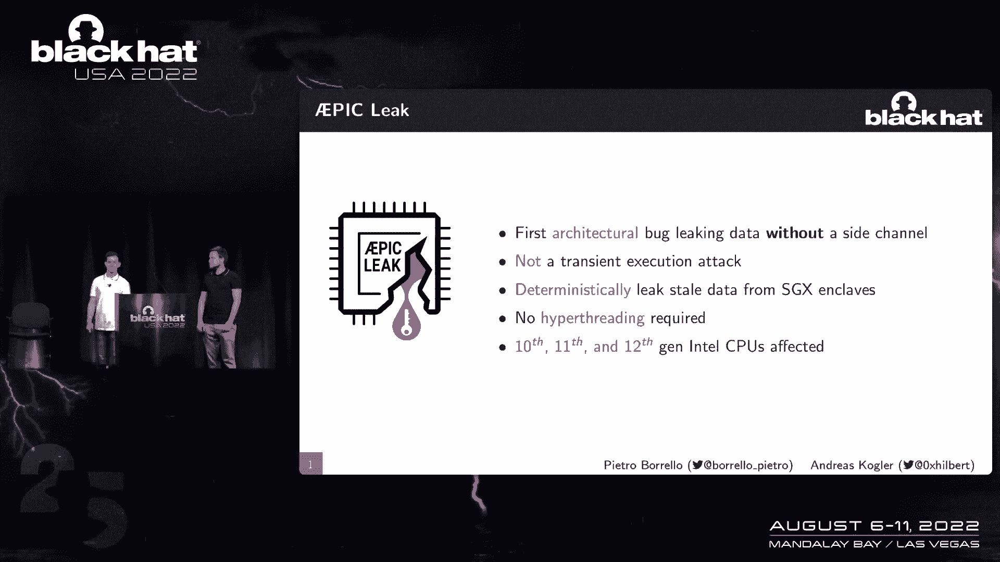
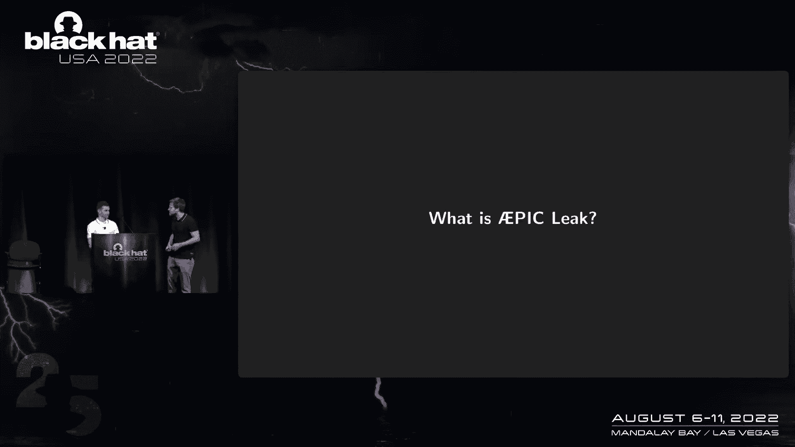
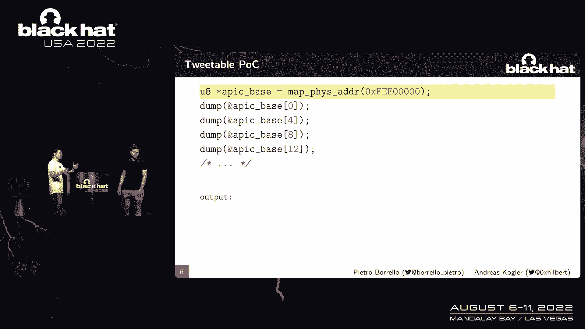
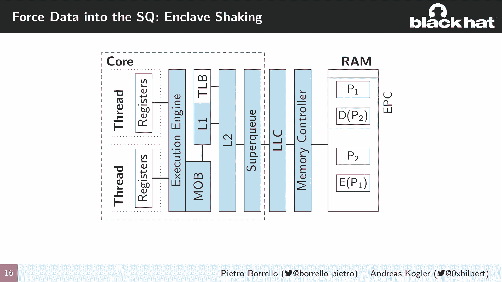
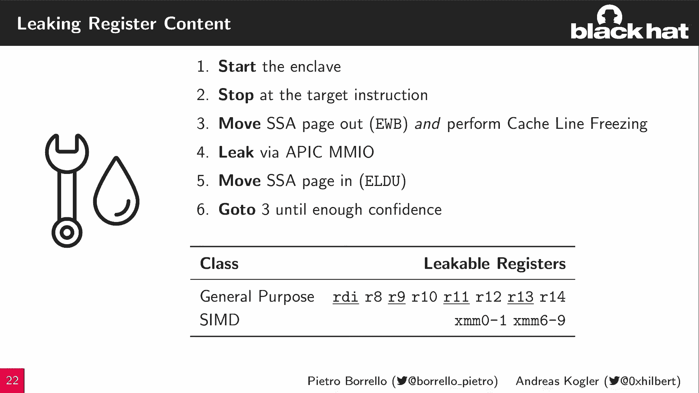
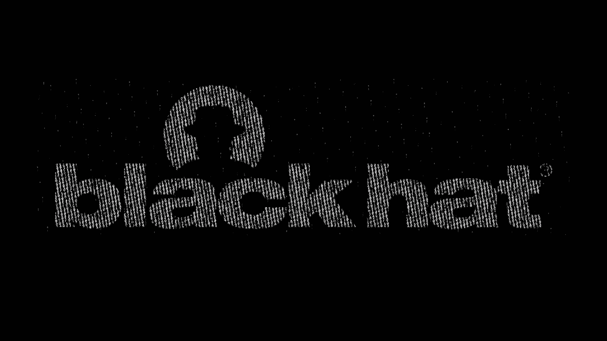
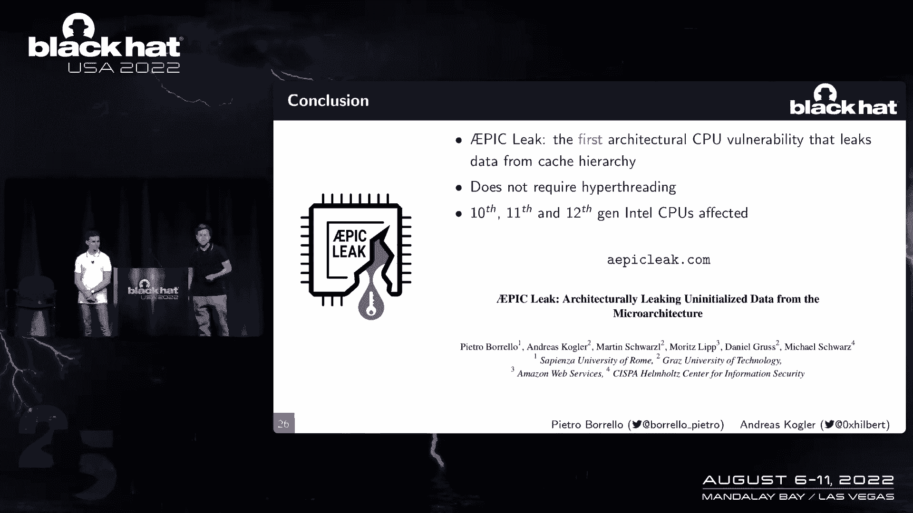

# 【转载】Black Hat USA 2022 会议视频 - P30：031 - AEPIC Leak： Architecturally Leaking Uninitialized Data from the Microarchi - 坤坤武特 - BV1WK41167dt

所以谢谢你的降价，今天我们要向大家介绍，我实际上从微架构中泄露了数据，其实我们骗你，因为那不是标题，今天我们要呈现一个史诗般的点击，实际上从GRA泄漏未初始化的数据，您将见证第一个架构bug。

能够在没有任何侧通道的情况下泄漏陈旧的数据，而且它不是一个短暂的执行攻击，它能够确定地泄露陈旧的数据，从SGS的飞地，而且我们甚至不需要超线程，为了基本的泄漏发生，是啊，是啊。

它的影响就像最近的英特尔CPU一样。

所以名字叫史诗，那么什么是史诗级泄漏，所以我们有史诗般的名字，和组件，那么现代CPU中的史诗组件实际上是什么。

是啊，是啊，所以史诗是CPU中的这个组件负责，生成，接收并生成我的管理，所有的中断，就像现代CPU，我们为每辆车都有一部当地史诗，就像伊娥史诗一样，外部设备，就像你和史诗互动一样，就像史诗寄存器一样。

默认情况下是内存映射的，它们被映射在一个区域上，那是由MSR控制的物理内存，它们都是三个二位，并始终对齐到16个字节，所以如果它只有三个二位，它们总是排列成16个字节，有很多可用空间。

实际上史诗般的范围，真正重要的是，你永远不要访问字节4到15，这就成了我的起源，但是为什么，哦耶，实际上告诉告诉它，哦，如果你读了史诗，内部手册，你可以看到任何咬四二的途径，十五可能导致未定义的行为。

所以等等，英特尔手册上说，如果你访问这些字节，你会得到未定义的行为，是呀，或者不正确的结果，所以让我们试试这个，是呀，所以我们可以简单地喜欢一个p c，我们在那里。

我们绘制了AB的地图，并没有那么快就扔掉它，所以我们让我来解释一下这些台词，让我们再跟着台词走一点，所以在第一行我们可以看到我们映射物理地址，Epic位于虚拟地址空间中的位置，所以我们可以从中阅读。

然后我假设这个从零开始的第一个转储史诗空间，那只是正常的阅读，那是一个有效的寄存器，所以你就像你在流汗一样，所以我们得不到尊重，但让我们继续，让我们继续倾倒史诗，所以我们看到了一些东西。

所以那里发生了什么，所以如果我们访问这些字节，我们得到的4到15个字节，是啊，是啊，就像这是什么在史诗中，如果我们继续倾倒它，就像我们有数据一样，这不是很奇怪吗？所以如果你看看这个内存转储。

我们基本上是通过阅读史诗来生成的，我们可以看到，在前四个字节中，我们总是得到非常史诗般的数据，但是在4到15的字节上，我们得到，是啊，是啊，那是弦，这里发生了什么，我们在体系结构上泄露了状态值。

只要抛弃史诗般的MI起源，所以我可以看到这是数据，因为那显然是弦，单中断源弯曲，或者类似的东西，但如果你看看这里的垃圾场，你呃，那不是绳子，所以什么不是，好的，没有数据说明，这些是说明，是啊，是啊。

那是拆卸，你只看到有效的破坏，史诗里显然没有，但我们读到了，所以我们刚刚恢复了指令，它能够从读取未定义的史诗寄存器中反汇编，准确地说，好的，实际上不是在一个，所以在大多数CPU上，你要么读0。

要么读FS，有时甚至整个CPU挂起或三重假或靴子，但是在英特尔的现代CPU上，像十代十一代和十二代CPU，不是这样的，好的，好的，好的，我看到我们泄露了一些数据，我看到泄露了一些说明。

但我们到底要把指示泄露到哪里去，从，泄漏实际上来自哪里，是啊，是啊，所以我们可以设计简单的实验来试图理解，好的，这些数据是从哪里来的，我们可以像这里有一个CPU的模型，就像，从CPU到内存的所有阶段。

我们可以开始理解并开始尝试理解，比如它是从哪里来的，好的，让我们系统地回顾一下，我们能不能泄露寄存器或执行引擎泄露的数据，是啊，是啊，所以让我们做一个实验，我们只在寄存器中保存数据，所有权利。

我们用它做一个简单的操作，我们没有看到他们没有，所以它不是来自寄存器或执行引擎，所以我一一二，是啊，是啊，所以就像现在我们在谈论记忆和好吧，如果我们访问大量内存，我们看到泄漏。

但是如果我们只访问少量的内存，像这样适合l 1或l 2缓存，我们什么也没看到，好的，我还看到共享哈希怎么办，所以LC甚至RAM或内存子系统通常，是啊，是啊，那也很有趣，如果我们从一个核心访问大量内存。

然后我们看到漏水，但如果我们只从另一个核心访问内存，与我们正在泄漏的那个不同，我们在那里什么也没看到，好的，所以我们系统地检查了所有这些组件，少了什么，我们错过了什么，是啊，是啊，一定是中间的东西。

这就是超级CU，那么超级CU是什么，所以真的很简单，Super Q是L两个缓存和LLC之间的耦合缓冲区，它只是包含了在两个缓存之间传递的所有数据，就像从L工具到LSC，来来回回，所以如果你像。

如果你知道像MD，攻击，他们瞄准的所有东西，像线字段缓冲区是一样的，但是行字段缓冲区在l 1和l 2缓存之间，在这里我们谈论的是L两个现金和有限责任公司的缓存，好的，所以我们现在谈论的是一种互连。

在L 2和LC之间，我们可以泄露通过这种互连的数据，但是我们真的能泄露所有通过连接的数据吗，否，好的，首先，我们谈论的是史诗的未定义偏移，和我，所以每次我们读到平均值的初始值，它变成了蛋黄酱登记册。

我们什么也没看到，所以我们只泄露了四分之三的缓存线，哦，我看得出来，因为16个字节区域中的每一个都有四分之一实际上是有效的史诗寄存器，所以你永远不会泄露，因为你刚刚得到了寄存器的史诗值，是啊，是啊。

还有一些我们无法解释的东西，但在我们所有的实验中，我们总是观察到即使是缓存线，所以如果我们映射，如果从零开始对页中的缓存行进行编号，第一个，第二次，等，您只从零泄漏值，第二个第四个，就是这样。

所以我们可以泄露四分之三的缓存线，现在我们看到我们有这种非常酷的攻击，我们从Superque泄露数据的地方，所以我们可以考虑一下，就像未初始化的内存读取一样，而是在CPU本身，所以它不像在软件层面。

但那是在硬件层面，但我们有一种喜欢，我想说这里的一个问题是利用这一点，我们必须访问史诗般的米奥登记册，问题是只有像操作系统这样的东西才能访问它，所以我的意思是，我们用这个可以攻击什么。

所以实际上英特尔SX来拯救，另一件事是什么，所以在较少的chex是这个环境是软件，软件保护扩展，旨在给你，保护数据上的代码免受特权攻击者攻击的环境，这也包括恶意操作作为操作系统，比如说。

所以对于恶意操作系统，我们可以绘制我所在地区的史诗并访问泄露的数据，那很有趣，但是如何用SX保护内存，所以说，GX的一个关键概念是它透明地加密数据，存储在飞地中的，这是由和悬崖完成的，因为。

这是拉姆的一个小区域，如果向其写入数据，好的，那很有趣，所以我们说的是页面，但这里管理页面的操作系统不是，是呀，这是一个很好的观点，也在SGX中，操作系统仍然负责飞地的页面管理，并进一步。

在每个飞地和HS中，您都有一个特殊的页面，所谓的国家安全区，这个页面的想法是存储寄存器值，你必须安全地存储它们，比如说，如果一个异步的呼吸器想到生命，你可以打断，打断你把寄存器存储在那里的想法。

在将控制流返回给操作系统之前，这是潜在的恶意，哦，那很酷，所以如果我们以SX飞地为目标，我们可以从这个飞地中采样数据，就像我们可以管理飞地一样，然后用一个PER线程来转储史诗。

然后C和舔他们正在使用的值，这还不够，比如我们怎么能泄露有趣的数据，无论如何，我们可以强制我们想要泄露的数据放在超级队列中，并希望保持足够长的时间来舔这些数据，这是一个很好的观点。

这就把我们带到了飞地震动，所以脚踝摇晃使用这两个指令，它们基本上负责从epc页面缓存中取出页面，并将它们带回主内存，这是通过使用evp指令来完成的，这将数据从加密页面带到核心，重新加密。

然后将其存储到主存中，如果你能猜出对应的是什么，是啊，是啊，我想说那是做指示的，然后喜欢从主存中带来页面，握紧它，然后把它放回电脑里，这在这里得到了更多的可视化，如果你看到右边。

我们在GX页面缓存中有一个页面，我们现在可以使用EB将该页面带到核心，重新加密，然后把它放进主存，好的，这很有趣，因为，当我们把这个页面来回带到CPU到内存，然后我们真的让页面通过超级CU。

这样我们就有了页面中的数据，通过我们的超级队列，我们可以准确地泄露，如果你把你的餐馆，来自加密页的反向路由，在我的记忆里，在这种情况下是p2，我们把它带到核心，我们把它解密。

并可以用l do指令将其放回abc页面缓存中，这也通过超级球杆，这样我们就可以瞄准它然后离开它，但是好吧，这还不够，我想要一个很酷的攻击，我们只能控制，就像这里的整页，我想精确地瞄准像克莱恩这样的目标。

这样我们就可以喜欢，比如说，选择我们要在此攻击中泄露的内容，是啊，是啊，那是个很酷的主意，我们也有解决办法。

这叫缓存线冻结，正如我们在一开始提到的，这个线程模型已经足够强大了。

我们可以简单地从超级立方体中采样数据，但我们也可以使用超线程，我们不需要它，但是如果我们用超线程，我们可以增强泄漏推断，那是为什么想想看，超线程和它的兄弟线程共享超级立方体，哦，那很酷。

所以这意味着另一个线程可以影响超级线索中保存的内容，就像用记忆一样，是呀，我们还使用了一个理论，基本上，三个两个字节的零实际上从来没有在零上传输过，q，好的，哇这太酷了，它是如何工作的。

所以让我们来看看，所以在这个动画中，我们在左上角，我们有两个品，弗雷德一号有一个地址，他试图从内存中访问一个秘密值，弗雷德二号也有地址，不同的地址，但是该地址的页偏移量是相同的。

如果弗雷德·奥尼现在试图从那个地址中读取，秘密被加载到超级队列中，最后它在阅读中结束，那很酷，所以我们有超级可爱的秘密，现在，这样我们就可以舔它了，是呀，那基本上不用超帧，好的，但现在发生的事情。

如果弗雷德同时，或在执行第一次秘密访问之后，访问X所在的不同地址，所以X会再次替换超级Q条目，带回L1L两个缓存并转发到不同的读数，等等，现在我们没有更多的秘密了，我们只是毁了我们想留下的东西，是呀。

我们改写了我们的秘密，所以如果我们都用史诗，我们回到访问，所以我们在那里收获不多，然而，如果我们现在看看连环案件，我们在弗雷德一号中再次执行秘密访问，数据通过超级队列传输，现在是两次访问。

该系列所在的地址，一些不同的事情发生了，血清理论说序列在超级立方体中的标记不同，实际上从来没有传播过，所以我们只是标记了超级队列条目，它不包含所有的零，并在最后的阅读中结束，所以这就像是一个优化。

以避免在收银台传递零，我们其实不知道，但是是的，所以如果你现在看看，我们可以看到我们已经冻结了超队列条目中的秘密，我们现在可以做的是我们可以用史诗，未定义的字节，未定义的行字节从超级Q条目中读取该秘密。

好的，哇这太酷了，我想这是一个小集团。

所以史诗集团结合了所有这些技术，我们可以使用飞地抖动将目标页作为千斤顶，飞地通过超级队列，然后冻结那些我们想泄露的缓存行，使用缓存行冻结，这样我们就可以精确地锁定我们想要泄漏的内容。

基本上是史诗般的泄漏，我们可以泄漏每一个偶数偏移量的缓存线的四分之三，我们可以从任何想要针对的SjaEnclave页面中完成此操作，最大和最强的部分之一是我们可以做到这一点，即使没有脚踝跑步。

因为加密的页面在Ancliff空转后仍然存在，这样我们就可以攻击一个和悬崖，即使悬崖没有运行，好的，哇这太酷了，但我们能用这个做什么，所以这就引出了我们在出版物中的两个文本设置。

第一个只是针对数据和代码，所以我们已经看到我们可以泄露数据和代码，你在那里读史诗般的寄存器，这个想法现在很简单，我们开始一个飞地，直到飞地充满了一些秘密数据，哦好吧，然后我们把目标页面移出电脑，好的。

这很好，如果你还记得一开始我们谈到SDX，有一个特别的页面，这个页面是解决方案，如何泄露寄存器内容，所以有区别的想法，所以我们又从悬崖开始，但然后我们等待一个特定的指令。

并强制飞地将其寄存器的内容存储到该特殊页面上，哦，所以都是一样的，然后我们将SSA页面移出，冻结我们要泄漏的缓存行，并通过选择缓存行，然后我们可以选择要泄漏的寄存器，然后扔掉史诗，扔掉我们想泄露的东西。

然后把它准确地移回来，正如你所记得的，有盲点，所以我们实际上有几个地方不能泄露数据，这也映射到寄存器，我们不能从那里泄漏，所以我们有一些通用寄存器，我们只泄露部分内容。

但也有一些我们不能完全泄露的寄存器。

好的，那很有趣，发生了什么事，你知道是什么，演示时间到了，哦，那很酷，你是从飞地漏光的吗，是呀，所以让我们试试这个。

所以我在尝试一些冒险的事情，我连接到我们祖国的一个系统，我在文件夹里有一些东西，所以我们可以看到这里有一个A飞地，所以这是一个飞地，使用A九指令集执行A IS加密，那很有趣。

So and I是一个特殊的指令集，可以容纳六个CPU，其中AS加密和加密步骤在硬件中实现，这真的很像抵抗，就像所有不同的攻击，像侧通道，或者喜欢，也喜欢不同的。

是的在asi指令集中有一条特定的指令是ASN密钥，可以帮助，所以使用这个指令是为了从根键生成圆键，所以如果你不看看飞地，简单地拆开它并搜索该指令，这被称为我们作为提根助手。

我们会在飞地内的某个时候找到它，为了我们的进攻奏效，我们现在知道在飞地的代码执行中，在罗切斯特，xmm，零将是加密的密钥，所以如果我们在那一刻阻止飞地，然后在存储xmm寄存器的偏移量处的ssa页。

它将包含我们要链接的私钥，所以为了执行我们的攻击，我们需要两个组件，首先，我们需要找到这个指令所在的页偏移量，所以在我们的情况下，它是飞地内的第20页，我们还需要知道，嗯，我们必须停止哪个指令。

所以基本上页面上的指令是如何结束的，我不给你看这个，这是页面上的第三条指令，因为一开始就有东西，现在我们只需编辑一个配置，所以我们创建一个配置文件，我们在那里补充说，我们想瞄准杰克飞地的这20页。

我们希望目标是网站页面上的第一个指令，我们想泄露考试M0，所以现在我们可以把飞地包裹起来，精确地阻止它，所以如果我们现在执行我们的攻击程序，是呀，我想面对。

我们可以看到我们直接恢复了加密的AS和Ikey，你看那有多快，这就像表明这不像是传输执行攻击，在那里你必须使用一个侧通道和舔，又吵又慢的东西，这是建筑泄漏，所以你把它扔了，就这样，如果你看看。

如果您将密钥从飞地的实际源代码中转储出来，我们可以看到从字节4到15的关键部分实际上与A匹配，本例中使用的i键，你现在可能想知道，所以我们可以看到XMM C寄存器有这个盲点，然而，如果你仔细想想。

这只是代码中的一个位置，我们已经泄露的地方，秘密钥匙的四分之三，关键是要经历更多的寒冷才能到达那个位置，所以我们可以组合多个泄漏源，以便恢复剩下的四个部分，就像我们在出版物中所做的那样。

所以这让我们回到演示文稿，我可以跳过备份视频，所以我很惊讶它第一次起作用了，是呀，我也很想念，所以让我们谈谈缓解措施，所以我们已经看到我们可以精确地锁定并泄露存储在寄存器中的秘密信息。

我们可以转储和悬崖页，但我们如何防范，是呀，这是一次非常强大的攻击，需要减轻，英特尔为此发布了缓解措施，很明显，好的第一件事是建议禁用史诗般的毛地区，这就像关门一样，字面上的攻击面，如果我们看它。

就像一个顾问，他可能会绘制史诗般的米地区，但显然这还不够，所以在实践中，这种缓解将使x 2 a c，那就像是史诗的更新版本，而且这个也更快，所以强烈推荐，但对于像SGX飞地这样的地方来说，这还不够。

就像恶意操作系统，就像禁用米奥一样，就像绕过这种缓解，所以英特尔也发布了微补丁，这些补丁把超级立方体冲上，喜欢所有的SGX转换，这样你就可以，如果你喜欢，试着把页面移进移出。

那么您将没有要链接的超级队列中的数据，是啊，是啊，和往常一样，有人建议减轻农场的普遍意志规则，基本上是如果你用支票，你也应该禁用超弗雷，为什么，因为如果你现在考虑到这些超级立方体冲洗。

我们只在进出这个HTX飞地时冲洗，超线程仍然可以在这些转换之间运行，并通过超级CU泄露数据，是呀，对感兴趣的人来说也是如此，这是我们在12月发现这次袭击的时间表，就像它被禁止一样，直到昨天它上市。

这让我们得出结论，所以我们已经看到，通过从ABC读取未对齐的内存，我们实际上可以泄露数据和代码，我们已经看到了一些技术，因此，我们可以将这些泄漏扩展到精确的目标缓存行，在墨水页中跳转寄存器甚至数据页。

所以总的来说，我们说，那个史诗联盟是第一个建筑联盟，它能够从超级CU泄露陈旧的数据，它不需要交易，即使我们可以利用其他交易来改善我们的谈话，它的影响就像最近的英特尔CPU一样。

如果你想了解更多关于攻击的信息，你可以去Epiccom，甚至阅读我们将在两天后由UX发表的论文。

