# 【转载】Black Hat USA 2022 会议视频 - P31：032 - A Dirty Little History： Bypassing Spectre Hardware Defenses to Leak Kernel - 坤坤武特 - BV1WK41167dt

大家好，我是皮埃特罗，今天，Enrica，我将介绍我们在绕过光谱方面的最新工作。

对内核数据的硬件防御，所以首先要感谢这个项目背后的人，就像你在这里看到的，是我和恩里科，和我们在一起，马吕斯，赫伯特和克里斯蒂亚诺，我们阿姆斯特丹的BUA集团的一部分，在这个项目中帮助了我们很多。

那么这个项目是关于什么的这个项目是关于光谱的，这是影响大多数现代CPU的漏洞，斯佩克特从一开始就被认为有趣的原因之一，例如，您可能是将数据从内核泄漏到用户空间的漏洞，这完全是无视，主管领域的概念。

那么供应商所做的，当这被发现时是为了释放各种柔软的纳多防御，并为本工作的目的，我们主要集中在防御上，试图走向这种交叉，我们问自己的问题是，这种缓解措施真的有效吗，还有小扰流板，否。

它们并不完全像预期的那样工作，但我们一会儿就到了，那么我们如何分配这项工作呢，我将从演示开始，谈论光谱和它如何工作的一点背景，现在我们谈论这些防御，他们释放了他们，以及如何绕过它们。

之后埃里科会把它捡起来，我们将讨论我们的新原语，这是一个分支历史注入，然后我会谈谈我们如何利用这一点，我们还将进行现场演示，所以希望一切顺利，所以让我们从频谱开始，什么是频谱，正如我所说。

这是它影响大多数现代CPU的时候，特别是它会影响CPU上的特定组件，它是分支预测单元和图片单元，顾名思义就是试图预测不同分支的执行，例如，在本例中，我们有一个条件分支的示例，它试图。

但是从数组的绑定检查器中，这里发生的事情是基于数组索引的值，呃，你就会发现，呃，你将在英国石油公司层面开始建立信心，知道树枝是否通常被拿走，或者不是这样，如果，如果使用x值在边界内，例如，在本例中。

如果零是一个值，好的，这是边界内的值，所以我现在应该把这根树枝和一根和两根一样，发生的情况是，如果您在这个数组的边界之外提供一个值，和你建立了足够信心的人，这个分支通常被拿走，它不在乎这真的不应该发生。

它无论如何都会做的，推测性的，这样您现在就可以执行出界读取，很明显，这在建筑领域没什么大不了的，因为最终你会发现，好的，这不应该发生的，所以我会壁球，这个阅读从来没有发生过。

我要继续做我需要做的任何事情，当出界的时候，但专门用来表演节奏，当你把它和另一种微型攻击结合起来会发生什么，就像一个华而不实的负载，这是一种缓存攻击，所以你能做的是，例如。

将此自动绑定与依赖的AutoBody RE组合，所以我们要做的是，例如，如果位置二十六，你有值三，你能做的就是执行第二个网格，基于第二个数组上的此值，就是你的同花顺，小浴室，这个值将捕获这个缓冲区的值。

以便行缓冲区的条目现在将被缓存，所以之后你可以做的是舔一个秘密数据，您只需对此数组的内存访问进行计时，最终您将对整个数组进行计时，你会发现第一个是真正泄露的，这允许您查看以前不受约束的数据。

这不仅适用于条件分支的情况，而且在间接分支的情况下也是如此，例如，这里，我们将使用一个多态性的例子，解释间接分支预测是如何工作的，在这个例子中，你有两个类，一个猫类和一个狗类。

两者都实现了Speak方法，当您从cat类调用speak方法时，您希望函数执行喵函数，当你从狗狗班出来的时候，你会期望狼的功能，这里发生的是你可以，BPU还可以帮助预测这些分支的截面。

所以当您从cat类调用函数时，在这种情况下，BPU需要弄清楚跳转到哪里并这样做，而不是几个，你有另一个，您有一个表，就像您有一个特定的缓存，称为分支目标缓冲区或BTB，在这种情况下，对于这个函数。

您显然有两个选项，你有两个目标，一只是喵，一只是狼，如果你是从猫班上来的，在这种情况下，喵将是一个正确的预测，所以你会，你将加快执行和工作的BM是预测，这意味着您将推测地执行该函数，然后执行MIA函数。

这有什么问题，问题是你可以利用光谱，你可以建立一个不同的光谱变体，它被称为幽灵V2攻击这种间接的分支，你可以利用这一点的原因，是因为大脑堆栈缓冲区是跨不同上下文的共享资源，在CPU上。

攻击者可以简单地覆盖分支中的条目，具有更有趣目标的目标缓冲区，像泄密这样的功能，秘密就像我们之前讨论的那样，攻击的闪存负载，所以现在发生的是当我们再次调用猫类时，此时的Speak函数，对于那个特定的类。

您希望执行均值函数，但现在你用泄密功能覆盖了它，这意味着您将执行lexer函数而不是mean函数，正如我们所说的，这样你就可以建立一个交叉攻击，这就是你可以在同一个内核上运行不同的应用程序。

您可以在用户和内核之间，甚至在来宾和主机之间进行，因为CPU不知道有不同的上下文，所以你可以想象这是相当可怕的，因为这允许你在所有不同的级别上构建攻击，那么我们下一步怎么办，当CPU供应商发现这一点时。

他们做了什么，想出了各种各样的防御，他们最初是从软件防御开始的，因为它实现得更快，第一个被称为红波林，它所做的只是转换我们这里所有的黑暗CocalReact，用这些大团的指令。

背后的总体想法是试图完全停止投机，因此，在该示例中不执行，您将把它转换为这段代码，这将不允许你对此进行任何猜测，所以你不能再利用光谱了，在这个MD上是非常相似的，它被称为MDR轮询或跳栏者。

这基本上是相同的确切概念，只是不同微架构的一个非常不同的实现，而盔甲，因为不同建筑的生态系统支离破碎，他们有，它们会根据不同的系统做非常奇怪的事情，在另一个，英特尔和诺玛都采取了两种不同的缓解措施。

称为E和CSV II，这种缓解尽管它们在实现上非常不同，我们猜测它们实际上在概念上非常相似，它们背后的想法是你想强制一个预测器模式，直接按顺序隔离，我们这么说是什么意思，一般的想法是。

我们希望按安全域标记BTB条目，所以你可以想象这是，您可以简单地用一个额外的列扩展BTB，其中，您将条目标记为其他用户内核上下文或来宾或主机或其他内容，之后，当您执行从内核上下文跳转时，会发生什么。

例如，在这一点上，该视图将只允许您推测属于内核上下文的两个目标，结果，您可以将此视为基本实现方法，但在投机领域，所以在这里你不能再实施任何攻击，跳回用户定义的函数，所以当我们考虑这个项目时。

我们问的问题是，隔离完成了吗，我们做的第一件事就是看手册，这是CV Two功能的手册，已经在他们的脑海中，这表明攻击者只能爆炸性地控制推测性执行，为了确定方法，所以很明显，当我们开始研究这个问题时。

我们有点困惑，因为这到底意味着什么，所以我们开始考虑如何绕过这些缓解措施，现在我要向你们解释我们是如何做到这一点的，我将从我们的猫和狗的例子开始，我将更多地解释间接分支预测是如何工作的，在CPU上。

所以就像我们说的，这里我们期望cat类执行喵函数，和dog类执行wolf函数，但是从BPU端来看，这两个函数来自相同的方法，所以Speak方法需要执行这两个，这里有一个函数调用。

那么BPU如何区分这两个不同的上下文呢，答案正是这样，预测需要依赖于函数调用的上下文，我们所说的上下文是什么意思，我们只是指以前执行的函数的历史记录，所以说，例如，在这种情况下，如果你是从猫类来的。

您可以预期以前执行的函数，或者条件是类似于cat类函数的东西，接下来是一把新的猫和小猫的第一把剑，这基本上是允许你区分两个中哪一个是，是你在这一点上来自的那个，您可以使用此上下文为BTB生成标记。

在这里你会有一个，你可以看到，因为上下文与猫非常相关，你会假设你应该推测MIO函数，这是如何按顺序工作的，为了实现这一点，您可以用非常不同的方式，但是过去讨论过的许多变体之一是使用。

同时使用余弦和上下文来计算标记，他们建议他们一起拼凑，上下文的所有不同跳转地址进入移位寄存器，所以你可以像南瓜一样，所有这些信息都在一个移位寄存器中，然后将这个值与Speak函数的实际余弦结合起来。

你要做的就是得到移位寄存器的值，余弦另一个哈希函数，现在计算标记，就像你在这里看到的，我们有我们的猫上下文，结果，因为上下文是非常相互依赖的，您将需要推测到新的函数，所以你可以看到这取决于上下文。

但是当你执行模式切换时，它是如何工作的，因此用户和内核空间之间的模式切换，我们的直觉是，用户是准确的内核预测所必需的，好的，我将用这个C的例子来解释为什么，就是这样，例如，在这种情况下。

什么时候执行printf，当您执行printf时，你要做的是一个思科，你想执行一个思科右，写出上下文，的，数据要标出来，我们所做的就是根据这段共享的古老历史发起攻击，然后在BTB中为思科恢复一个新条目。

当您执行不同的功能时，例如，在这一点上变得锋利，你想表演第二个系列，也就是思科读，这应该在BTB中存储另一个条目，但在这种情况下，它将是针对思科RIM的，一般的直觉是这样的。

如果复活节不依赖于用户空间上下文，很难理解您需要跳转到哪个思科，因为Cisco内核入口点完全相同，你只需要一个调度员到不同的思科房东，所以这意味着如果这种缓解不考虑到，也是用户空间的历史记录。

所有的误判都将如此，在我们的情况下，我们希望下次调用printf时，就会觉得，好的，我已经，这是一个，所以我需要推测一个思科对吧，我们用攻击者的心态测试了这个，我们想。

我们可以只使用用户空间历史来控制分支预测吗，所以我们回到我们的思科思科的例子，对吧，但在这种情况下，有两个通用循环和两个通用上下文，所以我们所做的是在用户空间中生成跳转链，我们称之为上下文。

然后我们用一个叫做Cisco A的C代码，这将在BTB中生成推测中情局的条目，然后我们对上下文做同样的处理，称为B，最后我们也混合了一个信息，所以我们会有一个上下文，但接下来我们用B。

就像你在这里看到的，复活节是中情局，但最终你真的想执行CID，这个实验可以告诉你我们的直觉是否正确，然后我们测试了这个，当您执行上下文的历史记录时，其次是思科B，你观察到的是它推测中情局。

所以猜测是基于上下文，原因又是，因为人们会认为在这个用户历史记录中，所以我应该推测思科A，现在这显然是错误的，因为你想推测CIB，但这不是问题，因为最终你可能会执行这个，所以这没什么大不了的。

我们在大多数现代的英特尔ARM上测试了这一点，在MD上测试了M disabu，不管用，因为他们仍然依赖软件防御，像红杆一样在完全停止猜测，但在我们测试的所有内臂上，在这个实验中。

我们可以观察到完美的错误预测，所以让我们试着理解这对这次经历意味着什么，我们基本上展示了用户上下文可以在日历分支中使用，即使有这种新的硬件，这是我们的新原语，我们称之为分支注入。

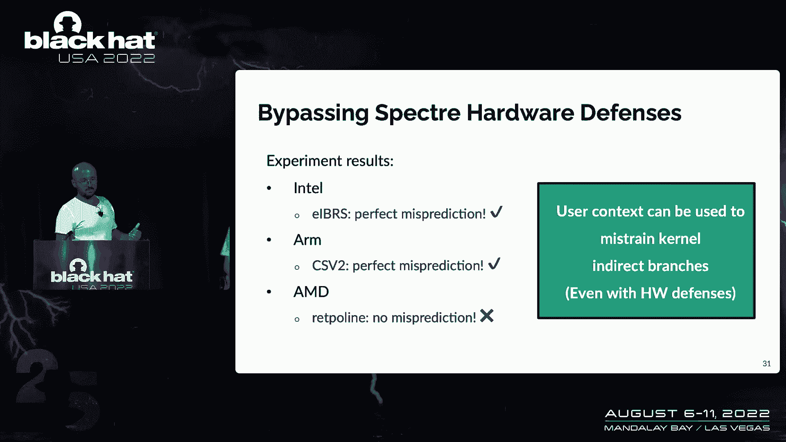

现在要向你解释，我们如何利用这一点来构建一个新的漏洞，或者你的，好的谢谢皮埃特罗，就像刚才彼得罗说的，我们有一个非常简单的原语，现在我们可以控制分支预测，从用户空间注入一些神秘的大炮的过程。

但你可以想象。

我们离建立一个全面的开发还很远，为了达到这一点，我们需要回答两个问题，第一个是我们可以具体执行哪个目标，我的意思是，好的，我们可以在内核的那个分支中预测这一点，但我们可以推测地执行，同样。

我们需要回答相反的问题，好的，内核中有许多不同的分支，我们可以错过哪一个预测，因为这样做，您必须执行分支预测单元的逆向工程，所以CPU内部的硅，而且通常，第一步是看看你可以在网上找到的专利。

然而我们在这些方面很不走运，所以我们没有找到任何有用的东西，所以我们开始做，让我们说，艺术品的经典逆向工程，你可以通过简单地执行一些特定的实验指令来做到这一点。

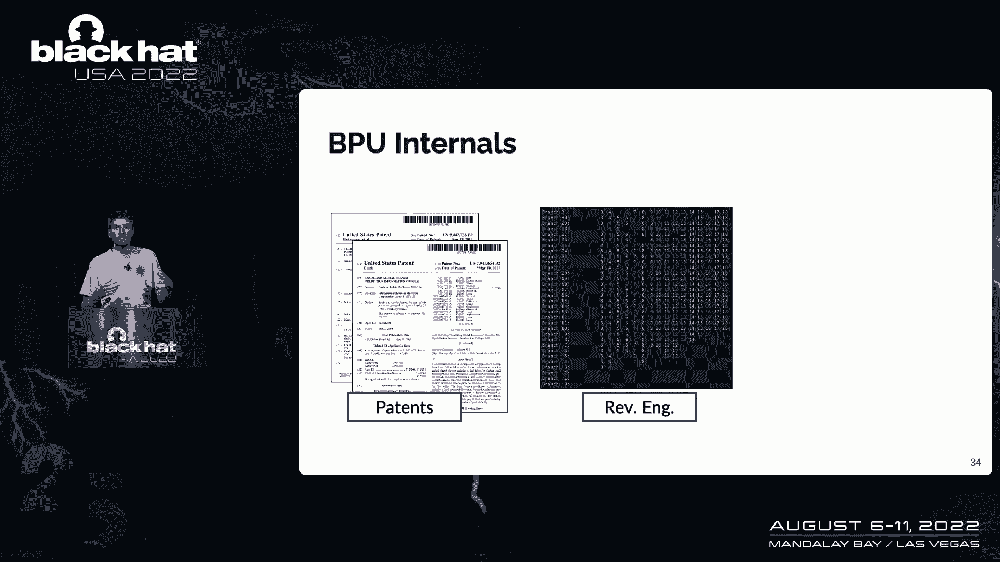

并观察CPU的性能，取决于你对实验的投入，我们一开始很好地在凉棚里找到了一些很好的图案，但最终我们失败了，主要是因为aris变得如此复杂，以至于反转它们是非常困难的，两个月后，我们决定停止这种做法。

因为很难理解分支预测单元的细节，所以我们用这种真正的方法再次失败。

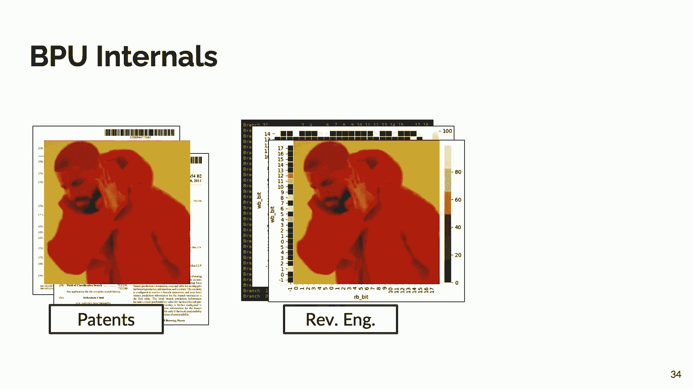

我们的老朋友还剩下什么蛮力，让我们后退一小步来理解为什么好的力方法在这里有效，所以作为一个攻击者，我们只控制历史，好的，这是我们唯一的注射点，如果你回顾一下分支预测单元的可能实现。

我们只控制亮在红色的部分，所以历史，或者基本上是注册表缓冲区的内容，如果我们随机化这些比特，让我们看看会发生什么，我们可以建立一个非常简单的实验，就像你在左边看到的，我们有一个跳跃链。

这是我们生成历史的一个简单技巧，所以你可以从地址铅咖啡馆看到，我们跳到牛肉上，从牛肉到汽车，所以这里的想法是我们正在产生，生成特定历史记录，在这之后，我们将去整个TED分店，总是以目标A结束。

这里的想法是将A与目标A相关联，所以每次分支预测单元都会看到e 3 a，它会说哈，跳到目标是个好主意，然后我们生成一个随机的历史。

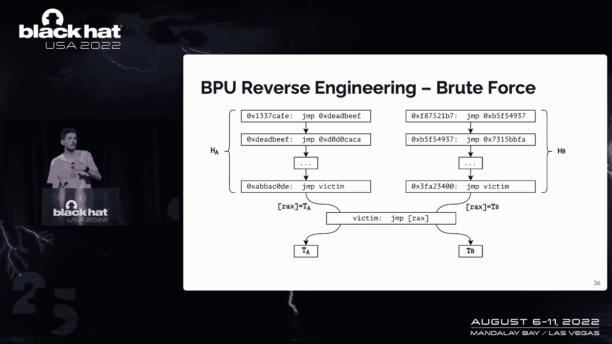

那是历史B，同样，这总是跳转到目标B，就像你在这里看到的，我们的目标是将目标A与目标A和目标B联系起来，如果我们以另一种方式执行这个真调用路径，我们观察并总是称之为来自BPU的预测，这是意料之中的。

因为我们给预测提供了黄金场景，以执行准确的预测，但是如果我们保持左边不变，我们随机化右边的呢，最终我们观察到的是百分之百的误判率。

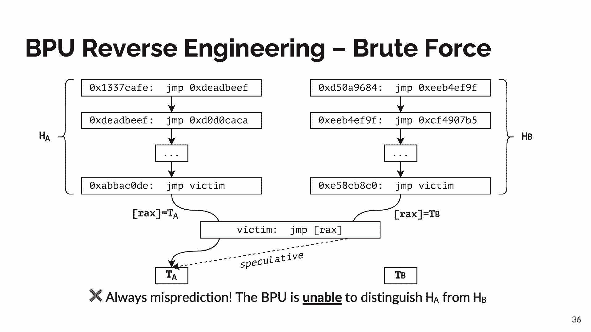

所以换句话说，在硅CPU中，价格预测预测单位不能区分历史A和B，所以你可以清楚地看到值是不同的，但是因为它们是在一个寄存器中散列的，它们会碰撞到相同的值，从CPU的角度来看，它们是一模一样的。

所以这就是为什么他总是执行它的预测，对于我们作为一个攻击者来说，这是完美的，因为只要控制历史B，我们可以准确地进行它的预测，让我们做最后一个小实验，让我们把两条路完全分开，3。

所以我们分店没有多余的存货了，我们有两个，你可以从A先生身上看到，我们总是来瞄准一个3B目标B，这里也令人惊讶地通过随机历史记录B。

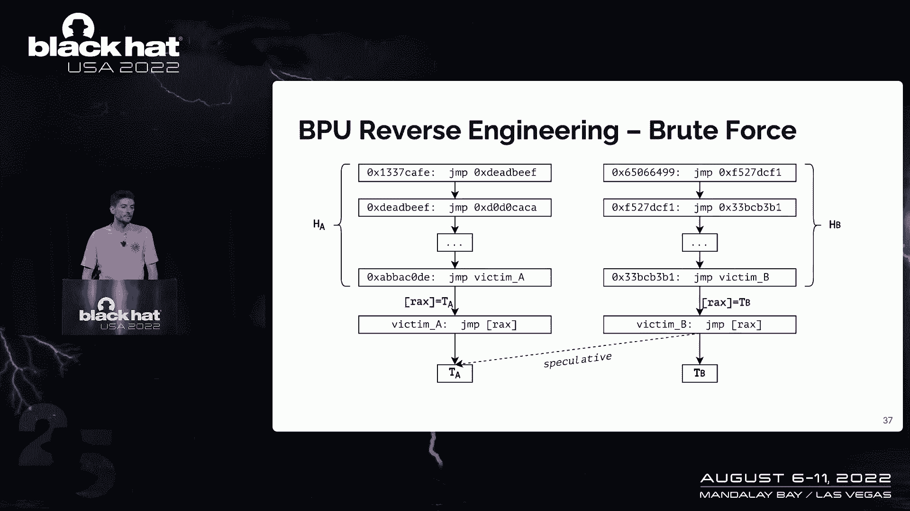

我们设法从整个B分支机构找到了一个针对A的猜测案例，你觉得这很奇怪，因为该代码路径从不执行，从来没有跳过目标，所以这实际上证明了台架预测单元它没有启用，不仅是为了区分历史和B。

但甚至无法区分不同的COSI，作为一个攻击者，这是一个惊人的原始，因为现在你可以错误地预测任何其他分支，并随时猜测，就像完全自由地做任何你想做的事，现在你可能会问，好的，蛮力接近容易。

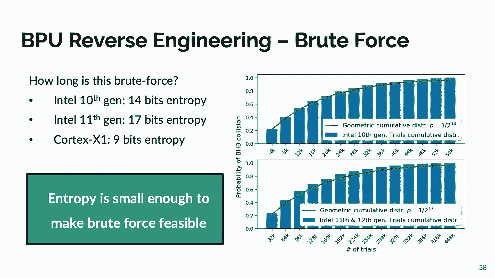

但可能会非常慢，不是不是真的对我们来说是，我们很幸运，这是非常快的执行一个很好的力量接近，也许只是为了给你一些数字，所以你可以在这里看到，这是英特尔切线，如果你尝试四万次，你几乎肯定会发现这种碰撞。

就是做你想做的错误预测，我们还在许多其他建筑上进行了尝试，正如你所看到的，熵很小，我是说最多设置了17位，你可以在不到一分钟几秒钟或足够的时间内打破，通常还好，让我们做一个小的回顾来了解。

我们现在的原始是什么，所以我们的目标是错过，预测内核中的整个分支，假设内核体系结构中的这个分支，只跳转到两个有效目标，目标A和目标B我们再次考虑用我们的防御系统。

所以我们不能再推测使用提供者函数作为攻击者，你的控制力非常有限，只需C代码指令之前的前一条指令，所以我们在执行模式之前只控制历史记录，从用户切换到内核空间，正如我们在英特尔和ARM CPU上演示的那样。

你可以再次以非常精确的方式推测有效的目标，只要控制历史，但最好的是一个内部处理器，在那里你可以猜测你想要的任何东西，这是相当强大的，因为你真的扩大了你的攻击面。

给你一些英特尔Levine的数字，比如说，历史的脉络是由最近被拿走的67个分支组成的，作为一个攻击者，我们只需要控制其中的八个，所以我们甚至可以攻击很深，嵌套在蜡烛的树枝上。

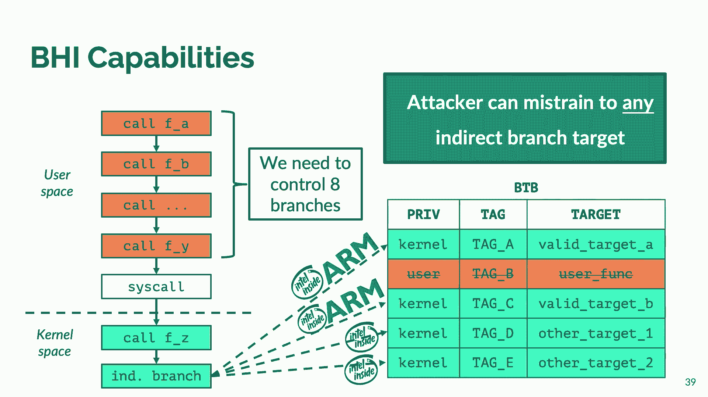

好的，所以我们有我们很好的原始。

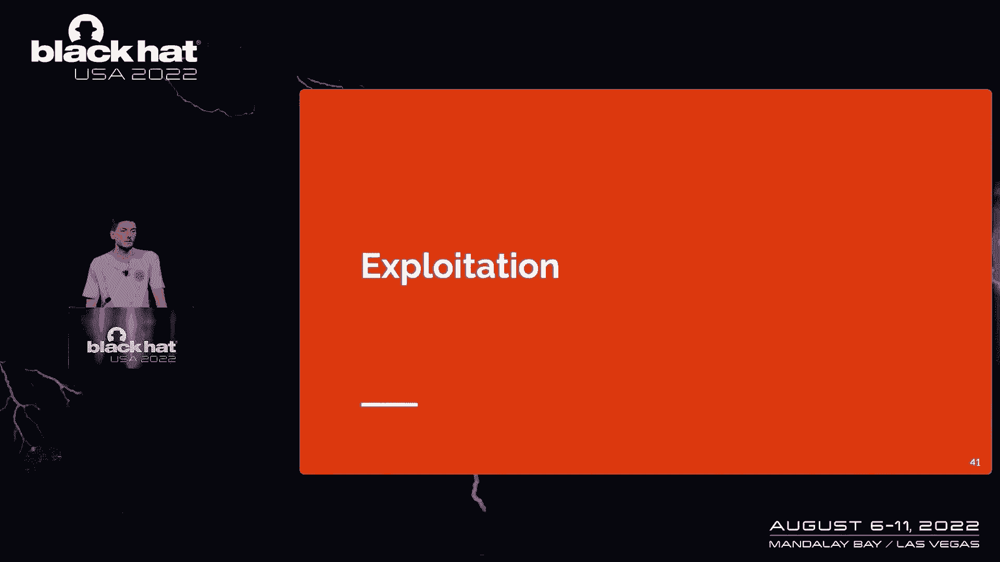

我们怎么能用它做一些有趣的事情，来展示主要的想法，让我们看看和攻击计划，所以第一步是确保我们的小工具或代码，我们想执行，在超越域中存在于分支目标缓冲区中，这样做你只需要，你知道，执行函数代码。

并确保BTB装满了，我们要推测的价值，后来我们做我们之前看到的，简单地说，我们产生了一个随机的谜，我们执行一个思科，任何思科都会没事的。

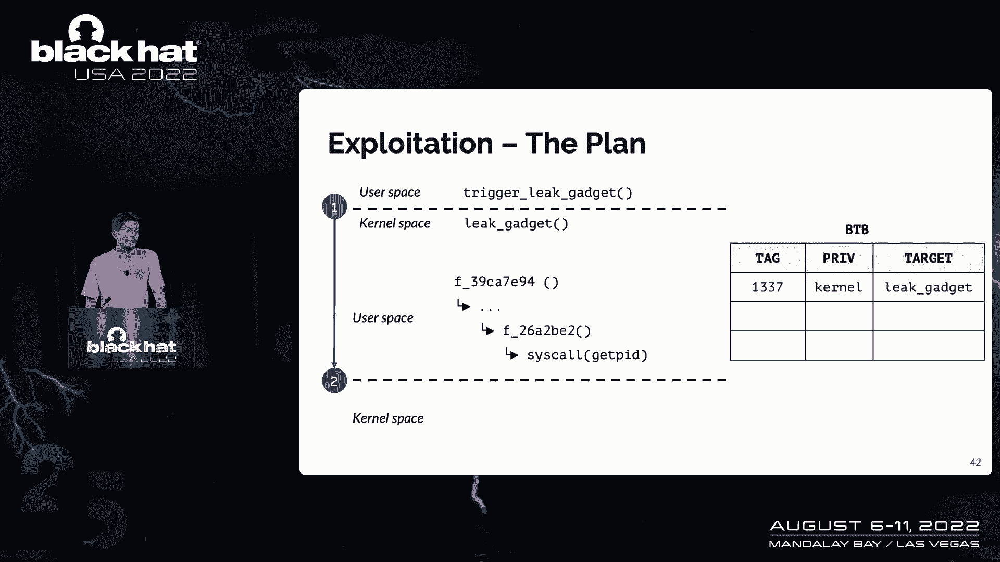

然后一旦我们进入内核空间会发生什么，最好的预测，它会说，哦，我不知道它该跳到哪里，让我们来看看最近的处决，所以来自用户空间的历史记录，我们生成一个标记，假设我们第一次不走运，标签不是我们想要的没问题。

我们要跳去找PD，没问题，我们可以重复这个过程直到我们赢，所以我们再次确保小工具在BTB中，我们再次随机化，另一个标签将是计算机等等，直到最终我们很幸运，我们打破熵，生成完全相同的BTB标签。

这基本上可以让我们推测我们想要的函数，好吧，现在你可以问。

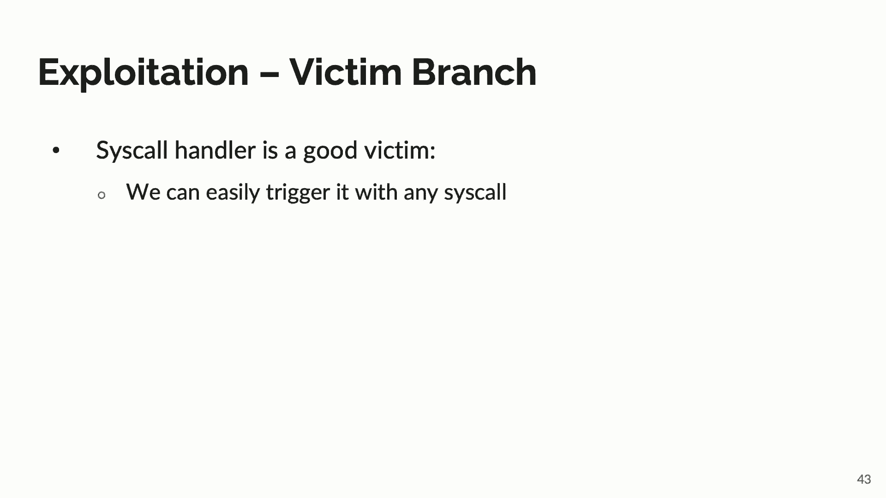

但是为什么我们总是在谈论这个叫做桌子，我的意思是，内核里有很多深色的分支，为什么我们如此关注那个，嗯，主要原因是你可以很容易地在那个分支中执行它，学校会触发它，但实际上最棒的部分是。

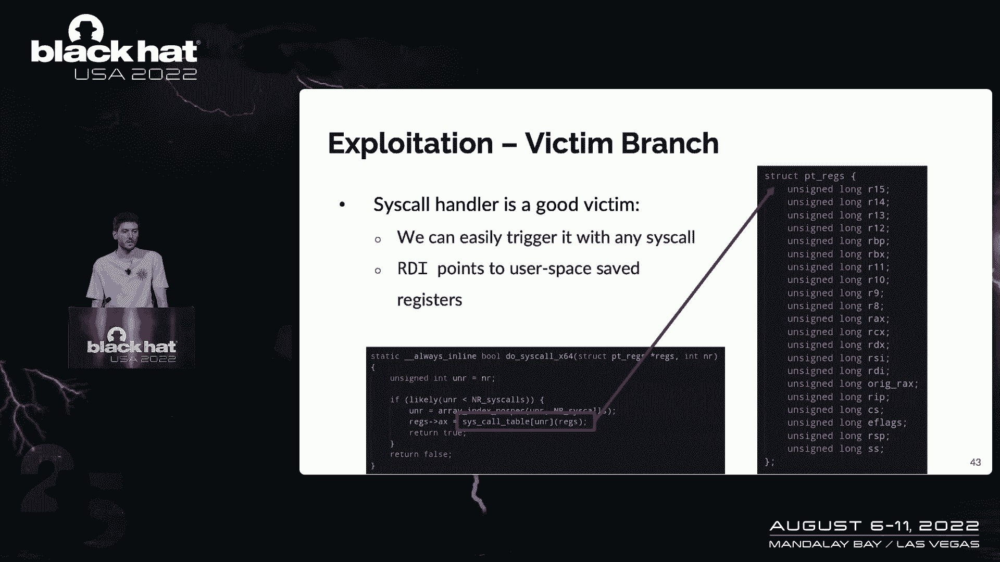

所以作为一个攻击者，我们对内存和寄存器有很大的控制，我们。

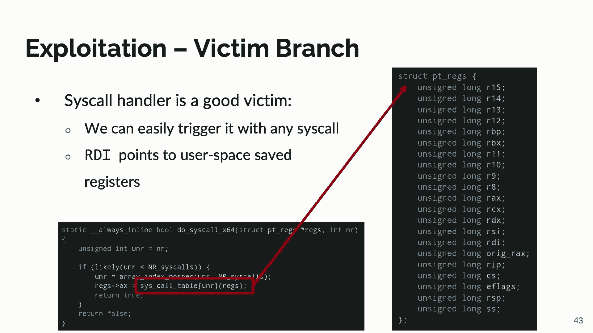

那么最大的挑战就是找到一个小玩意，所以你可以想象内核二进制是巨大的，所以找到我们需要留下的几条指令，至少在缓存中你应该能找到它，这是一个非常乏味的，工作需要很多时间，所以既然我们用蛮力的方法。

为什么我们不应该，为什么我们也要在这里，选择懒惰的方式，你知道的，所以在我们做这个项目的时候，以前的DPF上有一个很好的功能，简而言之，对我们来说，是内核中的一个GTA引擎，我是漂亮的用户可以使用。

是啊，是啊，有点奇怪，我是说，您可以从以前的用户在内核中编写代码，对我们来说，太神奇了，因为你只需要在BPF找一辆车。

在内核中对其调用操作码，直接在内核中的完美小工具，所以这对我们很有帮助，但现在你可能会问什么，等一下，所以内核开发人员允许你在运河中注入光谱小工具，这听起来不安全。

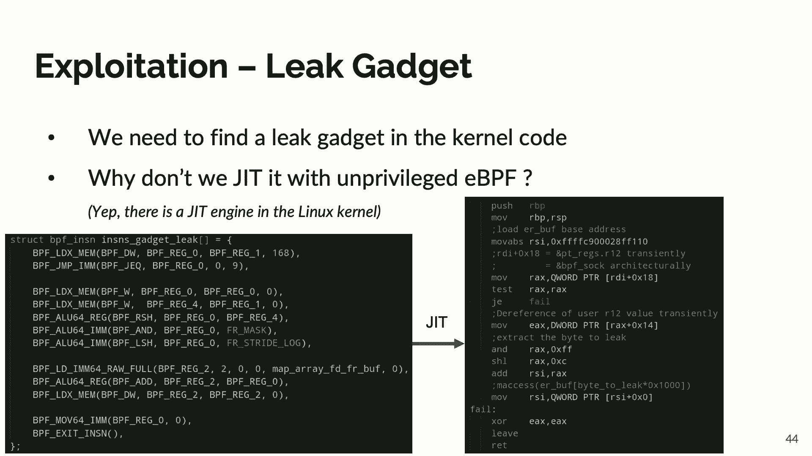

我是说肯定，他们对此提出了缓解建议，这是正确的。

UF对光谱有充分的缓解作用，但是在变体一上，现在你明白为什么了，所以BPF也只是一个工具，在建筑上做一些非常安全的事情，例如，mark属性，根据我们访问的属性，和另一个数组，一切都在向内。

即使在投机领域这里也没有开发的可能。

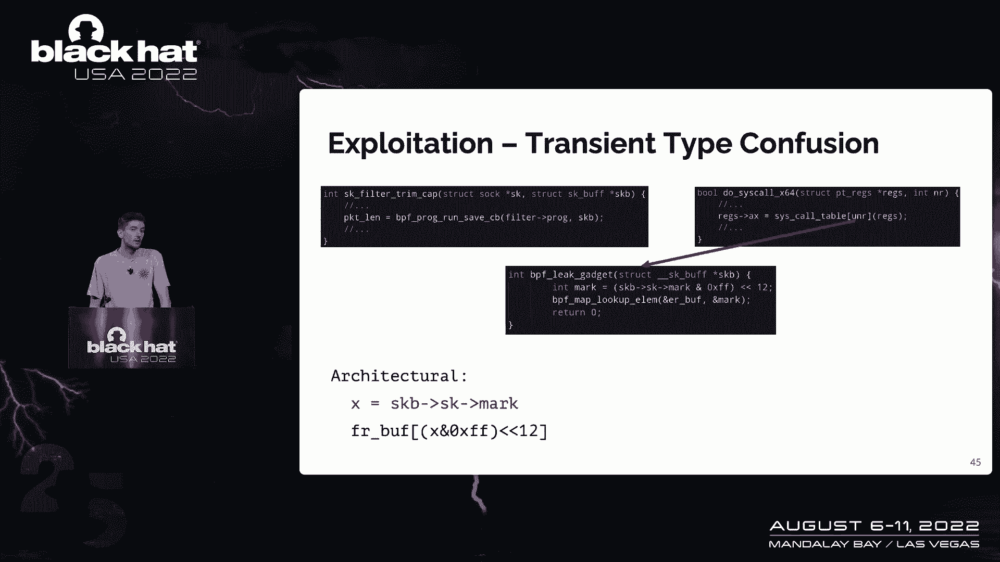

多亏了光谱的变体，我们不再从EVF调度员那里来了，我们是从海上煤炭处理公司来的，从字面上看，有一种转换的混乱正在进行，我们没有访问markoattribute，但我们将寄存器引用到。

我们引用的是任意内存，内核中的其他，然后在缓存中留下一个风险，我们可以用来恢复泄露的数据，里面是翻译的混乱，或者基本上是光谱变体二，真的帮助你绕过频谱缓解。

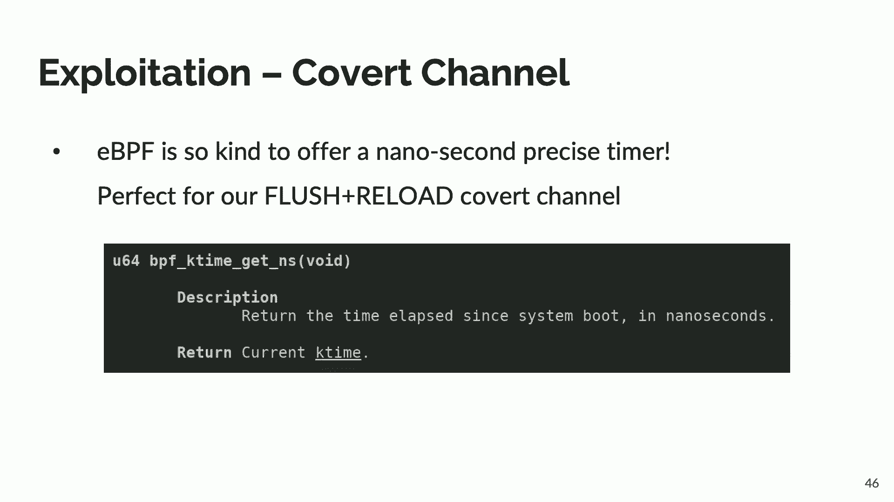

最后一个缺失的部分是我们需要一个精确的计时器来区分腰果和卡什米，我们亲爱的朋友BPF非常好心地提供给我们，所以是的，我们现在什么都可以利用，让我们尝试一个现场演示，这样你就可以想象跑步。

微型火箭攻击，生活不是一个好主意，但我们无论如何都要尝试，所以在这里我连接到一个脆弱的机器，它是一个英特尔切线CPU，正如你所看到的，我们有一个更新的内核，如果我们检查缓解，我们可以看到是脆弱的。

因为我们有一个系统，他们知道这次袭击，所以我们从建立一个驱逐集开始，以确保最好的预测单元会给我们一个很大的窗口，完成之后，哇非常快，所以我们试图找到一个碰撞的历史，你看到你的第二个需要。

现在我们已经点击了当前内存，所以第一步是打破单反，因为我们需要，你知道吗，读取内核中唯一有意义的部分，现在我们已经在线性地扫描内核内存，寻找有趣的东西，在这里我们决定，通常花点时间让我们看看，好的。

我们到了，所以你可以在三十秒内看到，不错嘛，并证明实际上是正确的密码作为根。

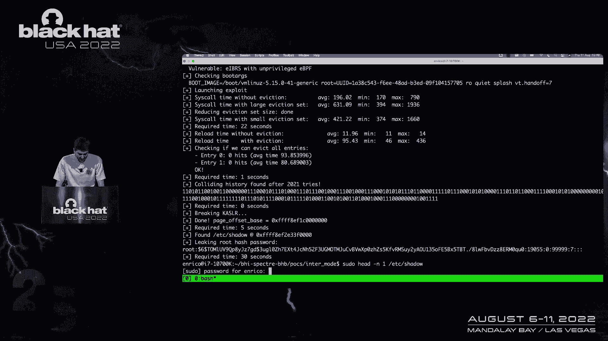

让我们把它打印出来，它搭配得非常好。

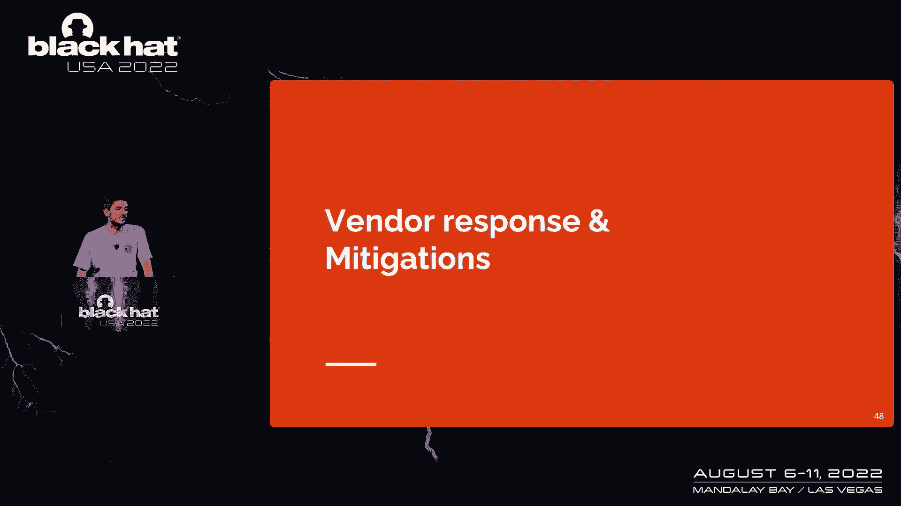

好的，让我们快速结束供应商的响应和缓解，有很多粪便，但总结一下，从切线开始的每一个英特尔CPU都受到影响，所以任何来自IS的新CPU都会受到影响，关于盔甲就有点复杂了，但简而言之。

假设CPU从两年的分支预测单元应该会受到影响，供应商提出的缓解措施呢，所以英特尔主要提出了一个单一的防御措施，即禁用，如果你认为不是一个理想的解决方案，但虫子还在，它不会消失，很快，他们很有希望，也是。

一些主要做同样事情的软件和硬件缓解，在苔藓开关上，比如说，从用户到内核，他们正在清除这个分支历史缓冲区，这样在预测过程中，用户历史记录不再用于预测过程，伤害也完全相同，又略有不同，软件和其他缓解措施。

目标是清除此分支历史缓冲区，和医学博士，正如我们从一开始就说过的，不受影响，因为他们仍然依赖于软件缓解，所以呃，比方说，通过保持软件缓解，他们是安全的，因为他们不选择更快更难或缓解，嗯。

实际上就在我们发布论文的同一天。

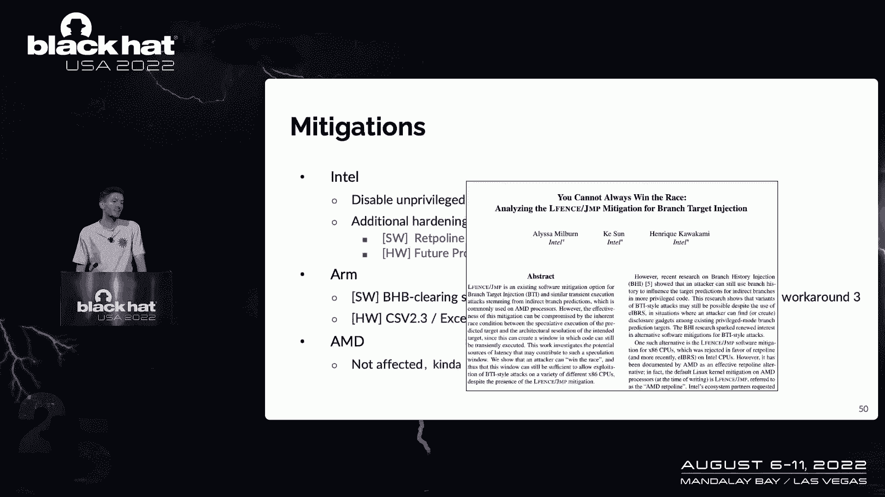

英特尔证明MD的防御被打破了，所以几个月前，同时，英特尔ARM和MD仍然受到斯佩克特·瓦洛的影响，三年后它的发现，是的，是的，一起结束并不是很好。

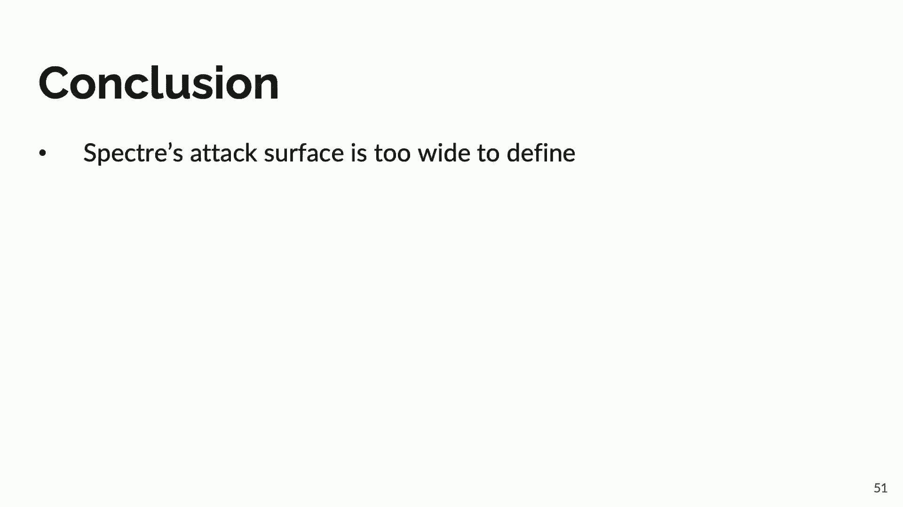

我们看到这些攻击的攻击面太宽，无法定义，这是非常困难的，即使对我们和CPU制造商来说，也是为了保证您免受这种威胁，我们确实认为我们需要更多的主要防御，因为即使在我们进攻之后它们也会释放出，你知道的。

禁用BPF，是啊，是啊，这是个好主意，但你知道虫子还在，也许有一天另一个研究人员会发现另一个小玩意，你知道我们又从零开始了，而是在一个积极的节点上得出结论，此项目期间的正节点，我们真的注意到了。

我们可以和20年前的软件开发做一个比较，写入缓冲区溢出漏洞，我想今天容易多了，用单反相机等，你知道，变得越来越难了，那是，那是我们的谈话，一点艺术史，这里，您可以找到我们的项目页面。

如果你想要更多的国家，我们有报纸，以及利用该漏洞的源代码。

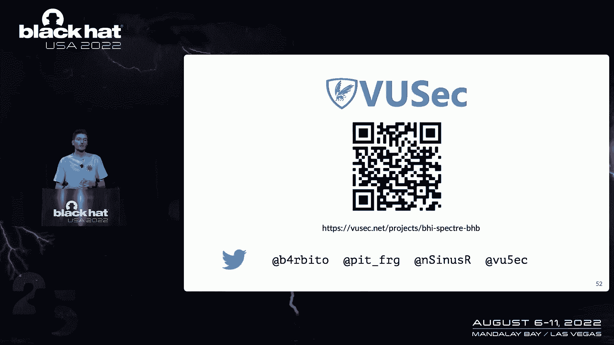