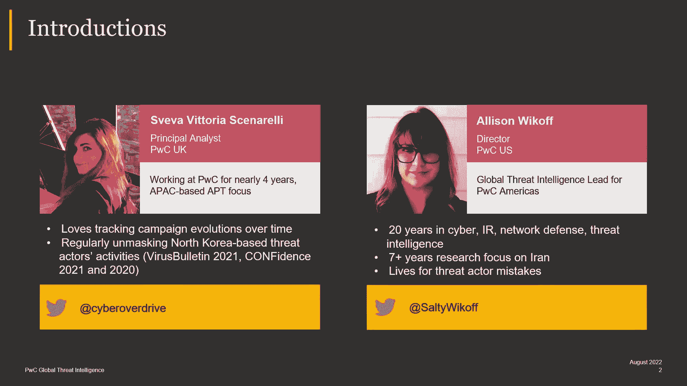
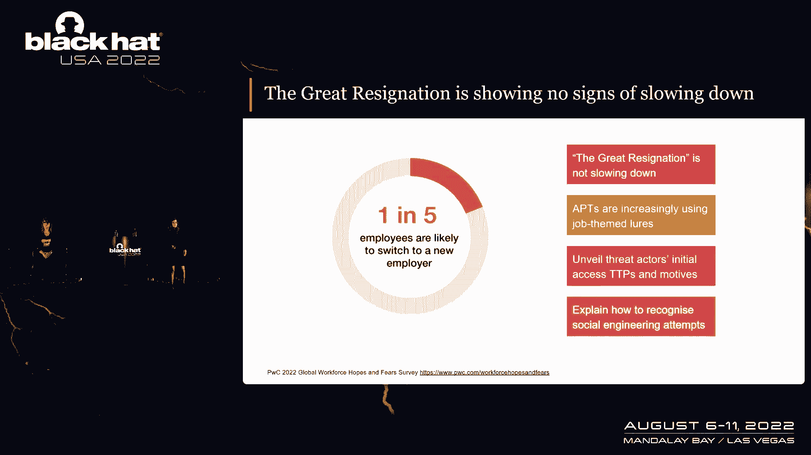
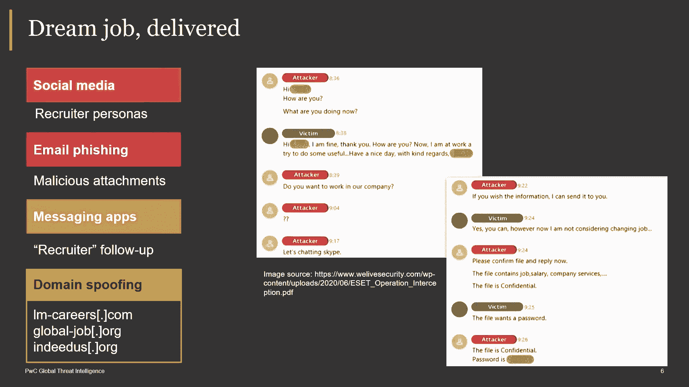
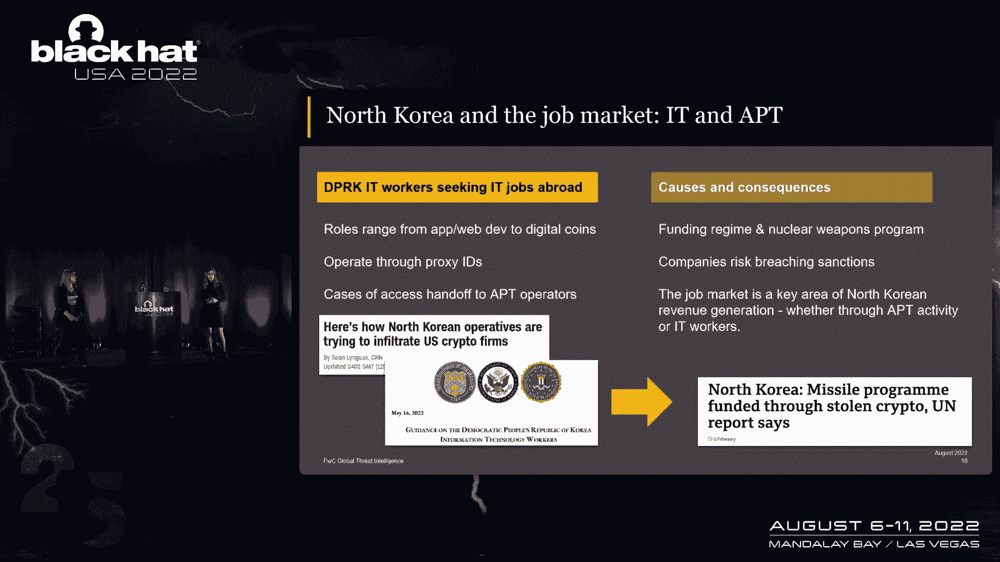
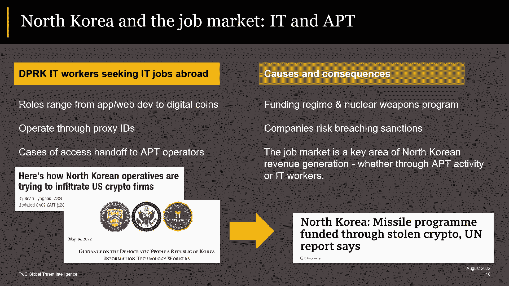
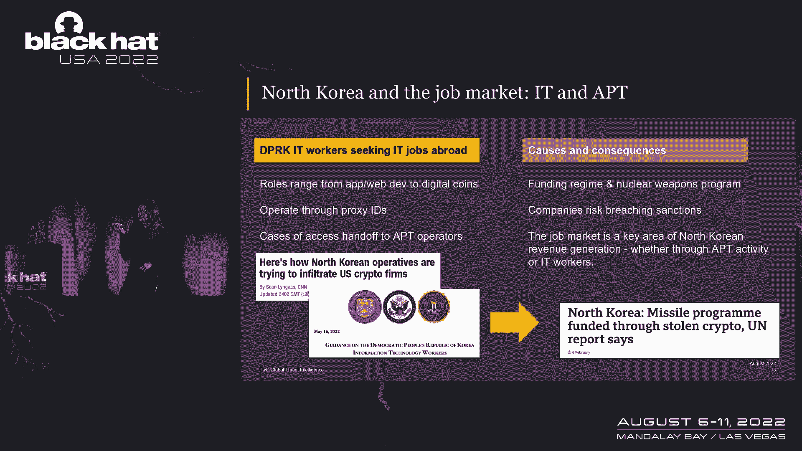
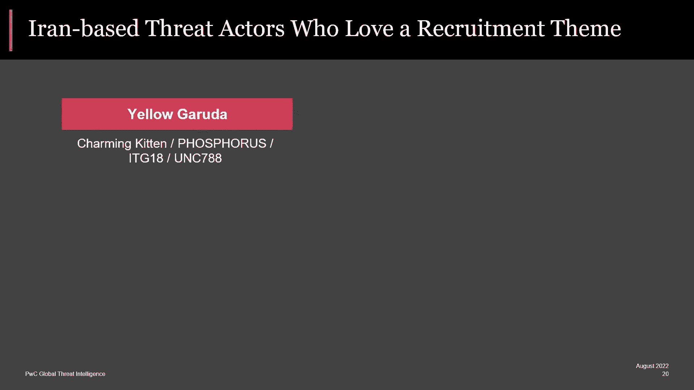

# 【转载】Black Hat USA 2022 会议视频 - P33：034 - Talent Need Not Apply： Tradecraft and Objectives of Job-themed APT Social - 坤坤武特 - BV1WK41167dt

谢谢你邀请我们来这里，能在黑帽公司工作是我的荣幸，今天我们真的很兴奋能和你讨论，我们正在观察的技术，当他们执行以工作为主题的社会工程时使用的高级持续威胁，我是维泰利的父亲。

我是普华永道情报分析师的负责人，我跟踪AP在亚太地区的位置，今天和我一起的是一位非常了解伊朗红色演员的专家，艾莉森·沃夫，我想伊娃刚才叫我恐龙，我是艾莉森·威考夫，我干这一行大约有二十年了。

我职业生涯的后半段一直专注于事件应对和威胁情报，特别关注基于伊朗的威胁，在我丰富的业余时间，我也是哥伦比亚大学的客座讲师，所以我会把它交还给萨博来踢我们。

所以只是为了设置一点上下文，我想请你举手，如果你在过去12个月里换过工作，你们中有多少人，现在，我们所知道的是，还有五分之一的人可能会在接下来的12个月里换工作，你们可能都熟悉伟大的辞职的概念。

这种现象在流行病之后，所以很多人决定他们需要换公司或者完全转行，以及我们所看到的社会背景的网络角度，APS正在利用这一点，并越来越多地使用工作团队诱饵，以及他们厚颜无耻地经营这种活动。

所以我们今天想做的是带你通过几个案例研究，对于正在做这件事的医生来说，它们是工具，技术，程序，以便您可以学习识别这些尝试，也许你的蓝队或红队，在整个演示过程中，可能会学到一些技巧和诀窍。

所以我们要开始谈论普华永道内部跟踪的医生。

作为块阿尔忒弥斯，这是一个在开源中被称为隐藏眼镜蛇的反应堆，政府指的是，和拉撒路集团，我要提醒的是，拉撒路集团是一个有点宽泛的名称，有很多活动被归因于拉撒路，这并不奇怪。

这是一个自2007年以来一直活跃的反应堆，从那以后发生了很大的变化，但就本演示文稿而言，我想和你讨论黑心茶的一个具体活动，这就是所谓的梦想行动，更广泛地说，这是一场以间谍活动为动机的运动。

这是令人难以置信的持续目标航空航天部门，辩方，工业基础，制造业化学部门，从军事机密到知识产权，具有战略意义的机密信息，所以让我们来看看，黑阿耳忒弥斯接近它的初始通道，比如社会工程。

我很难过地报告电子邮件网络钓鱼没有死，我你知道。

我们都希望，不是这样的，黑人卡特曼人确实继续发送电子邮件，对其目标有恶意附件，但在过去的几年里，我们观察到了黑阿尔忒弥斯，人们也转向社交媒体的社会工程，尤其是LinkedIn。

通过建立招聘人员的角色和直接接近目标，所以我们在那里看到的，屏幕上是艺电在这次活动中的一篇报道中分享的一张照片，我们看到威胁演员试图接近受害者，如果我可以以非常专业的方式为一个所谓的招募者，就像嘿。

你知道你怎么样，你现在在干什么，我父母不在家，你想要一份新的理想工作吗，有点像，你知道，我会，很奇怪，受害者就像，哦，你知道，我在工作，我现在不能和你说话，这个医生说不，你愿意来我们公司吗？

问号，有点咄咄逼人的问号，我会说，好的，也许有什么不对劲，但没有，黑阿耳忒弥斯做的也是，它将通过消息应用程序跟踪目标，比如WhatsApp，以确保受害者打开，恶意引诱文档，或者医生发送的恶意可执行文件。

黑人艺人也会建立域名，这可以用于命令和控制其恶意植入物，发送似乎来自合法网站的电子邮件，或者实际上执行Web开发作为初始访问方法，所以让我们来看看，现在闭锁性已经建立了一个这样的领域，如果你看它。

看起来确实是对的，非常突出的求职和申请网站，但是如果你看看域，它确实不是网络，哪个是合法的网站，它确实很好，我第一眼看到的是假的，演员会在这里发布谷歌或甲骨文职位的虚假工作描述，所以真正高调的公司。

当受害者导航到这些链接时，在他们不知道的情况下派来的第三个医生，他们的浏览器会在零天被利用，这是谷歌Chrome中的远程代码执行漏洞，这样它们就会被破坏，像后门一样被传递。

我们不断地被一切数字化的东西轰炸，所以告诉人们，不要点击链接，不要打开附件，喜欢认真，我们都得这么做，但有一点用户意识导致了这里的预防，您被发送的域是否是合法的可以防止妥协。

所以有时即使是仔细检查也很重要，让我们来看看入侵链，而是使用较低的文档，这就是我们在这里的目的，因为我们爱他们，所以在第一个例子中，黑色阿耳忒弥斯将建立一个假的工作规范。

在一家高知名度的公司找到一份出色的工作，它会把它寄给受害者，您知道，在某个时候，它可能会启用宏，当这种情况发生时，受害者将获得一份RTF文档X文档，但是发生了什么，同时。

宏正在引导我们进入入侵的下一阶段，他们可能，比如说，在我们观察到的一个案例中，掉一个底座，六十四，受害者不太可能查看的文件夹中的编码有效负载，在这种情况下是C驱动程序，然后反应堆会确保C2波浪形。

将exe删除到同一文件夹并重命名为seris，然后用来跑，和代码，这个基础六十四斑点，顺便说一句，重命名很有趣，因为这意味着正在做法医的辩护人，不一定知道使用了搜索。

这给我们留下了一个加载程序可执行文件，然后它将连接到另一个远程服务器并提取实际数据，这将是一个功能齐全的后门，你知道，往下拉，呃，查阅他们的档案，执行命令，上传，档案，售票员会确保装载机。

在机器上建立持久性，这样即使在机器重新启动后，反应堆可以进入，这在大多数情况下是由我们通过跑步观察到的黑色艺术品完成的，指向最后阶段的l 3 2 xe，通过计划任务的有效负载，让我们花点时间，所以说。

假设您的电子邮件过滤解决方案，不幸的是这次被骗了，但是这种网络钓鱼邮件，假设您的用户受到了损害，不过没关系，因为初始访问只是初始访问，演员要经历一整条杀戮链，在你完全妥协之前，你可以停止。

所以检测机会的一个例子是监控你的环境，两天AE作为预定任务运行，并指向一条不寻常的肮脏的道路，在你的环境中不应该是正常的，所以你可以监视它，以了解恶意的事情正在发生，让我们看看诱饵文件。

这就是他们的样子，所以他们有那么一点，你知道的，启用内容，因为此文档受到保护，现在这些小文件的美学可能会改变，但帮助我们作为捍卫者的是元数据，所以在其中一些情况下，我们看到很多由黑阿耳忒弥斯建立的文件。

有这个Nikki作者元数据，他们中的许多人都有标记，可以将UU ID转换为三个，两位或六十四位快捷有效载荷，也许他们在做特定的Windows API，混叠，一些变量定义，自定义消息框。

这就是我们可以在宏中找到的所有东西，可以帮助我们作为防守者，寻找更多的活动，甚至在我们的网络上检测到它，其实我应该在这里提一下，那个，与这次谈话有关的活动的所有妥协指标，将在我们的公共GitHub上。

这是在这次演讲的参考中，明天幻灯片发表的时候，所以你们都可以去，你知道的，查看这些文件并构建自己的部分。

到目前为止，有动机的行动，现在我想谈谈，是一个不同的案例研究，这是一个出现的指挥家，我们看到，我们在内部追踪为黑色阿尔坎托，他非常专注于加密货币，你要告诉我，你知道吗，好的，精细密码最近风靡一时。

嗯，我有你所以，众所周知，一直以加密货币交易所为目标，让他们妥协去偷钱，以至于在二十一世纪，因为他们在针对西方银行和加密货币公司方面发挥了作用，为了创收的目的，实际上就在几个月前，三点零公司斧头无限。

上周他们偷走了6。25亿美元，我在推特上被标记了，因为我出版了很多关于黑色阿尔坎托的书，关于这家达菲公司，据说他们妥协了，使用相同的ttps，两周前我说的是黑色阿尔坎托。

这是我们现在要看到的相同的ttps，所以这是积极进行的，它的目标是，它是在金融和加密货币领域，所以要小心，黑色和帐户也是一个开源的危险密码，密码核，密码模拟，所以相当多的名字，正如我们所说。

这是出于经济动机，在社会工程方面，黑阿尔坎托可能会再次进行电子邮件，但这类似于带有链接文件或其他类型文档的系统压缩档案，可能是受密码保护的Word文档，然后是一个链接文件。

这也符合我们在更广泛的领域看到的转变，Mac演员不得不在他们最初的访问技术上改变一点，并使用越来越多的链接文件，ISO文件，MSI安装程序之类的，Black Alcanto还滥用电子邮件的措辞。

所以它可能是字面上的，它的目标是一封电子邮件，同时冒充他们的熟人，这样受害者就像，哦快看，我认识的这个人，分享我转发我，对稳定硬币的分析，那真的很有趣，让我看看，但实际上他们正在妥协。

像Kali Kanto一样，也做社交媒体方法，冒充招聘人员，也许这会诱使受害者更多地询问他们公司的情况，Black Alon也做域名欺骗，我们在这里看到，G萨克斯赫特网络公司。

它是高盛的PO或Dawaincom Dioinvestment，是一家日本风险投资公司，有一个狩猎的机会，我认为真的很有趣，我真的很喜欢用它来寻找更多的黑蚁基础设施。

这位红色演员喜欢通过猪肉注册商注册域名，如果您查看这些域解析到的底层服务器，它们都有非常特殊的阿帕奇组合，服务器标头中的PHP和OpenSSL版本，这样您就可以构建查询并找到更多的基础结构。

所有这些信息都将在我们的GitHub上的国际奥委会中，所以你可以去寻找更多关于入侵链的信息，我们说过这个反应堆会发送一封电子邮件，然后也许有一个点PDF或链接，或者一个点点点链接。

所以你知道受害者认为这很好，这只是一份普通的文件，当他们点击它的时候，他们可能只是收到一份诱饵文件，所以他们是这样的，你知道吗，对加密市场的分析是如此迷人，但在后台。

lnk文件实际上是在调用Mt dot exe，它连接到远程服务器，拉下一个恶意的JavaScript脚本，我们称之为卷心菜加载器，克洛德所做的，在第一个实例中，是在受害者启动文件夹中放置一个链接文件。

确保持久性，然后拉下一系列其他JavaScript有效负载，这些被称为一系列的被覆盖的老鼠，实体安全部门对它们进行了非常详细的描述，在会议上，在病毒公告上说话，他们写了一份关于这件事的家庭报告。

所以请一定要去看看，如果你对这个感兴趣，这些本质上是探查器，他们想确保与他们互动的实际人，不是沙箱，不是研究员，但它实际上是一个感兴趣的目标，在这一点上。

acl手动部署另一个javascript有效负载，卷心菜rc，这是一个功能齐全的后门，你知道吗，上传，下载文件，执行命令，所有的爵士乐，从那里医生可以在网络中横向移动，其他检测机会是您监视您的环境。

比如调用MHz的链接文件，然后你知道，从远程源下拉并执行文件，如果这在你的环境中很常见，这有点奇怪，如果不是确保你在找这个，这不仅仅是这个反应堆特有的，很多医生都用这些ttp。

所以这是一件值得留意的好事，你知道的，请把农场递给我，平底锅有点像鱼在做什么，所以你不想那样，这就是类似关东工作的黑色文件可能是什么样子，所以这是一个有趣的，因为你可以看到医生说。

这是区块链智能组的一个职位，但当你为商业工作时，它说欢迎，实数AG，然后画面被追回来，所以我想，如果你想恶搞一家公司，至少，决定哪一个你不需要，一次给我三个，讨论我们可以用来检测这种活动的元数据。

这些文档实际上链接了文件，有这个非常有趣的领域，它被称为机器ID，所以除非第三个演员把它擦洗干净，您可以使用机器ID元数据对该轨迹所在的所有文档进行集群，建造人们去寻找更多，或在网络上检测它们。

我们谈到的所有启发式，所以像双扩展名文件，调用命令或调用mht的链接文件，所有这些都很有趣，我们的GitHub上有一个Yarrow来检测这样的东西，我也想强调这些文件。

因为就在布莱克·坎托使用这个的几个月前，我们见过黑色的阿耳忒弥斯，因为医生以前提到过，用一个非常相似的，所以你可以看到它们都有相同的结构来说，欢迎当你为工程工作的时候，人类未来的福祉，你有，x y。

本文逐字逐句摘自洛克希德·马丁职业网站，你知道吗，就像阿耳忒弥斯在给摇滚马丁打样一样，但后来黑阿尔坎托拿走了所有这些，并将其用于区块链，情报组什么的，所以你知道，移动团队，这是一个非常有趣的问题。

这是我正在研究的一个，在类似的归属方面，并在澄清黑阿尔卡纳和黑的关系，如果你跟踪这三个演员，你想就此进行对话，我是你的了，你可以晚点再找我们，我们可以聊聊天，否则我再打给你，终于。

我不能不提几个月前发生的事情，所以U，s，经常用假身份，可能通过第三国的代理公司或代理实体，这是为了，你知道的，赚钱，他们可能是应用程序Web开发人员，数码币开发者。

就是这些IT工人经常处于强迫劳动的境地，顾问还说，他们的工资被拿走去资助，你知道你的王冠珠宝或你感兴趣的信息，所以一方面我们知道联合国安理会说所有的资金。

另一方面，你知道，好好想想，如果你是一家公司，一方面，你冒着违反国际制裁的风险，然后在你的网络中，你不会想那样的，所以我想我的一个关键要点是，这是作业标记，所以睁大眼睛，确保你知道你在面试谁。

为一切圣洁的爱，不要打开那些你在LinkedIn上收到的链接，别在那张纸条上打开它们，我要把它交给你。

艾莉森，谢谢伊娃好的，所以让我们继续讨论，我们在中东看到的一些招募。

并通过招募，我是说，招聘um，在我们进入那个之前，让我们谈谈，尽管关于一些真正热爱招募梦想的威胁演员，就基于ROM的威胁行为者而言，因为不只有一个，首先我们有一群普华永道称之为黄色嘉鲁达的人。

它们可能更常见的是迷人的小猫和开源，这是一个非常活跃的团体，但我们今天不打算谈论他们，但他们做的一些招募类型的事情是他们专门针对记者，和其他有工作机会的非常具体的人，无论是会议还是具体的工作本身。

然后我们有一个小组，我们称之为黄色打火机，它们通常被称为龟甲和开源，这个组织成立了假的招聘公司，在社交媒体平台上配备了专门针对美国退伍军人的角色，所以几年前，他们创建了一个假的招聘公司。

专门针对雇用退伍军人，然后我们就有了一个我们称之为黄骨髓的群体，这个团体已经活跃了很多，很多年了，它们通常被称为APT三四石油钻机或钴，吉普赛人和开放源码，像黄色打火机，他们确实运行了很多角色。

或者在各种社交媒体平台上运行过很多角色，再次，声称是来自有效和虚假公司的招聘人员，但我们说的不是这些人中的任何一个，今天，我们说的是一个我们称之为黄色发展13的团体。

对于那些在房间里做基于罗恩的研究的人来说。

我知道这不是一个详尽的清单，这只是亮点，好的。

那么谁是黄色13号，有一些关于他们的开源报道，所以有一份来自Meta的报告，我相信是他们的Q1或者Q2，今年四月发布的报告，这谈到了一些拆除活动，他们为这个小组运行的一些角色所做的。

微软也做了一些工作来降低，嗯，这个小组正在做的一些品牌侵权类型的工作，这是在钡的命名下记录的，这个群体确实与帝国小猫下面的一些报道重叠，对于那些订阅这种威胁和告诉的人来说。

但他们在这个宏伟的计划中活跃了相当长的时间，所以它们大约从1919年就开始了，我们相信他们的间谍活动集中在，我们没有看到任何迹象表明他们一直在进行其他类型的手术，就其目标而言，对于伊朗的运营商来说。

这是相当常见的，所以我们看到的是目标区域，U，s，英国，加拿大，显然在中东的地方，就像以色列，沙特，阿拉伯，然后在俄罗斯和印度也有一些目标，然后是他们再次以特定行动为目标的部门，就伊朗间谍活动而言。

这是一个相当不错的过程，能源技术，运输，半导体，然后我们还看到了一些后勤和海上目标，但我们今天在这里真正要谈论的是他们，他们用的很多假东西，所以这群人真的很喜欢假的东西，这是一个专业术语。

你可以引用我的话，如果你想，嗯，所以他们做了一连串的假事情，我们将专注于人力资源方面，但我确实想涵盖更广泛的操作，就他们创造的所有假东西而言，所以他们又创造了很多被欺骗的公司。

面向我们所说的目标垂直和区域，他们还创建了恶搞的合法招聘公司，既有广义的，也有非常具体的，就他们针对的人的类型而言，但更有趣的是，他们成立了几家假的招聘公司，一个叫做应用人才的项目，它是第一个建立的。

另一个被称为或被称为职业发现者，并沿着这些组织的路线，在过去，他们也设置了一些与他们相关的角色，与我们提到的一些团体合作，他们做了基于角色的社会工程，我们见过那些团体用真人的照片。

在黄色开发十三的情况下，我们实际上认为他们使用人工智能生成的图像，我们稍后会看其中的一些，但是就在你的网络上搜索这个活动而言，截至本周早些时候，申请人才网站，它还在活动，所以如果你担心这些威胁演员。

可能针对你的员工或在你的网络上，我会在我的网络中回顾一下，对于这两个域，我们放在幻灯片上的，同样，这将在演讲后提供，好的，所以你可能想知道为什么，黄色开发十三没有一个美丽的神话生物名字。

与我们谈到的其他一些团体相反，那是因为我们没有完整的入侵链，对于这个特殊的群体，所以他们不是一个团体，我们很乐意遇到我们现有的一些团体，或者冲进自己的群体，所以有一点背景故事。

但我们确实对他们如何使用应用人才有相当好的了解，就其业务而言，嗯，所以这就像很多这样的开始在社交媒体上，我们是这么认为的，我们不确定他们到底是如何将链接传递给特定的受害者的。

但我们知道它们可能有无数种社交方式，我们知道他们在LinkedIn上运行个人资料，他们还在其他一些社交媒体平台上运行它们，但我们确实看到了链接被传递给人们，这将鼓励他们从应用人才网站下载一个zip文件。

受害者打开那个，它推出了一个叫做在线面试EXE的东西，我们都很酷，这是恶意软件，当我们开始对恶意软件本身进行分析时，实际上不是恶意软件，只是一个前任，发生了一些有趣的事情，我们马上就会看到它。

但是在线面试exe实际上会提示用户提供凭据，这不是一个凭据窃取操作，这有几个原因，它逃避沙箱的检测，这个特殊的EXE和两个，它让像萨巴和我这样的人，充分理解整个入侵链的能力。

所以我们认为发生了什么黄色发展13认证受害者，然后有一些有效载荷，那是那是掉了，这将基本上从目标网络中删除东西，一次又一次，如果你担心这个，在你的网络上检查申请人才，但是让我们来看看在线面试EXE。

因为这很有趣，这就是界面的样子，我根本没有挤压或拉动图像，就是这里了，我喜欢人们和我一样喜欢它，当我看到这个时，我很兴奋，嗯，公共沙箱中有哈希，如果你想自己看看，嗯对我来说，我看着这个就像。

第一件事是什么，大家都想点击右键，我知道那是什么感觉，我想和现场的人谈谈，所以我们显然看到了，不幸的是，没有什么有趣的事情发生，但我想让你知道，这不仅仅是像在那里，你可以点击它，它弹出一个聊天面板。

我们没有，我们一点进展都没有，所以接下来，我们把整个面试指南或好东西都看完了，如果你喜欢一次又一次的拼写错误，我们试图导航到，弄清楚在线面试的最终目标是什么，查看我们团队的反馈，因为我们在看，这是哇哦。

这是自制的，这是我们从凭据中得到的提示，这就是我们所得到的，我们确实试着点击了更多，我们收到了几条像这样的错误消息，所以我没有提到的一件事，谢谢。这是我们对一件我没有提到的事情的反应。

是应用人才和职业发现者，两家公司都声称是英国的招聘公司，所以人们会认为，嗯，要么，这个在线面试工具会有一些QA过程，也许是由一个可能以英语为母语的人，请先递过来，那里发生了很多事情，我们不打算去那里。

但是是的，我们真的。

我们真的很喜欢看这个，好的，所以让我们换一下档位，看看这个可怕的工具背后的一些杰出的团队，我从职业发现者那里引用了一句话，我正要读的网站，因为我们再次喜欢这个，这是直接引用。

会帮你找到一份满足你愿望的工作，英国公司，所以我们会，是啊，是啊，我太喜欢了，有点太喜欢了。

我把它放在幻灯片上，对呀，好的，所以我提到了这个黄色的DeV13运行，与他们的操作相关联的少数角色，我们在这个群体中看到的是，在阿比盖尔·沃克的案例中，大多数图像可能是人工智能生成的，啊。

我们认为这是一个真实的女人，她的图像被使用，因此被屏蔽了，因为他们随着时间的推移改变了个人资料图像，阿比盖尔·沃克不是真人，虽然，我非常喜欢这些角色的一点是，尤其是LinkedIn上的。

如果你真的看着他们，他们没有任何意义，所以阿比盖尔·沃克是人力资源信息系统顾问，根据职称，但如果你看看她的简历，她是招聘人员或人事专家，那没有任何意义，当我们看这些简介时，我们总是看到的另一件事。

他们有多少联系，这给了我们一个成功的迹象，他们可能和他们的一些社会工程行动在一起，所以在这种情况下，阿比盖尔有265个连接，还是有点吓人，所有的权利，然后我们有布莱恩·克莱尔。

我不打算指出这些人工智能生成的图像的细节，我们认为他们是假的，但我会给你们一些线索，当你开始看这些背景，眼镜，珠宝，头发，像其中一些是主要的毛巾与人工智能生成的图像，所以布莱恩，布莱恩很棒。

布莱恩的侧写也很棒，这是另一个完全没有意义的公正简介，所以LinkedIn是一个专业的网络，我们会假设人们是出于职业原因在那里的，嗯，我们认为布莱恩可能声称自己是一名招聘人员。

尽管他的职位头衔表明并非如此，如果你想和布莱恩取得联系，这是一个非常粗略的Gmail账户，你可以发电子邮件，没有任何意义，他有很多关系，虽然，这有点令人担忧，他的个人资料活跃了相当长的时间，已经不行了。

所以让我们来见见这个团队，因为他们声称自己在实际的网站上，这是应用人才网站上的屏幕截图，在职业查找器的网站上，这里什么都没有修改，颗粒状的图像和所有又一次，这两个，首先创建了应用人才。

此后不久创建了职业发现者，回到1919年，首先我们有应用人才团队，爱德华·迈尔斯，斯嘉丽·格兰特·詹姆斯·夏普，别担心，我要把照片展示得更近一点，这样我们就可以享受这些实际上的样子，然后我们有。

同样的顺序完全不同的人，这些网站上的另一个相似之处是他们有相同的英国电话号码，所有权利，所以让我们有一点乐趣，专门钻研其中的一些图像，只是为了每个人都能得到一份爱。

还记得我告诉过你的关于观察人工智能生成的人，所以我们有爱德华·迈尔斯的应用人才，然后是职业发现者爱德华·迈尔斯，现在应用人才首先被创造出来，我想他们显然使用了不同的人工智能。

我想说更好的成像软件或者他们决定用于角色的任何东西，职业发现者，其中一些很不错，其中一些很糟糕，斯佳丽来了，应用人才和职业的授予，查找器，记住，我告诉过你的，背景，有时候眼睛，耳朵。

希望人们能用这个看到一些有趣的事情，所有的权利，我们请来了应用人才和职业发现者的詹姆斯·夏普，我实际上认为职业发现者的詹姆斯很不错，你会在我们的图像上看到一个水印，从虚拟机中提取图像，不是从图像本身。

希望大家看得开心，好的，所以这些是两家招聘公司的假人，我还有几个与黄色开发13行动有关的，但不一定是招聘公司，但我认为他们是有趣的例子，如果你想再看一些，人工智能创造的人类。

希望人们注意到一些事情，是啊，是啊，所以让我们把事情解决了，并与本次演讲的人力资源主题和招聘主题保持一致。

当我们想到我们今天所说的，从网络后卫或蓝队红队的角度，嗯，你知道吗，我们真的可以再次继续人力资源招聘的主题，当我们查看威胁行为者的TTP时，尤其是我们今天讲的那些，这真的是他们的简历，他们的技能组合。

他们的简历，就像这些都是我们能做的，我们有多擅长，我们在做，嗯，然后我们就有了目标本身，所以嗯，这给了我们动力，让我们知道他们要做什么，我们读过专注于间谍活动的演员和专注于经济的威胁演员，我们今天讲的。

最后，在我们讨论过的这三个群体的情况下，他们实际上建立了人员网络来帮助执行他们的操作，这真的真的很有趣，但最后让我们把这些外卖提高一个档次，你知道的，威胁行为者正在利用巨大的辞职。

所以黄色13号是一个很好的例子，是呀，他们从1919年开始活跃，但在过去的三年里，我们看到他们更新了他们的网站，特别是在招聘方面，将人才应用到与气候相适应的地方。

所以现在这个网站有很多Covid-19主题页面，它也有一整页或一整页关于远程工作，所以威胁行为者正在关注正在发生的事情，社会工程仍然有效，我知道我们已经厌倦了谈论它，但我们看到它再次进化。

就像我们看到的角色一样，演员接近我们员工的方式，他们在LinkedIn上的WhatsApp上伸出援手，在其他媒介上，他们使用人工智能生成的图像来使他们的角色看起来更合法，我们将继续看到进化。

不仅仅是他们如何接近，但他们是如何交付的，所以微软确实禁用了互联网宏，关于未来的事情，哇太棒了，我们将看到威胁行为者在如何传递恶意软件方面发生转变，虽然在这些网络钓鱼练习中，然后最后，嗯。

你知道我们怎么防御这种东西吗，当我们不拥有员工的社交媒体档案时，所以我们看到，嗯，你知道这些人，或者威胁行为者在我们无法控制的事情上向人们伸出援手，我有点挑战这个房间里的人思考你的组织安全，文化。

你的员工被授权了吗，或者你是否有一种文化，他们可以来找你说嘿，我想我被一个假的招聘人员钓到了，我是说，我个人认识的人不多，很多员工会很乐意去打招呼，我正在找另一份工作，我想我被社会设计了，所有的权利。

所以我想我们有大约三分钟的时间来讨论，或者我们可以搬到扬声器分离室，我们确实有一个GitHub页面，我们今天早上发布了，你就在演讲前做这件事，我们今天就做了，它有我们今天谈到的所有指标，一次又一次。

幻灯片明天早上就可以用了，是的，GitHub链接也将在参考灯下。

当他们出版更多的时候。

