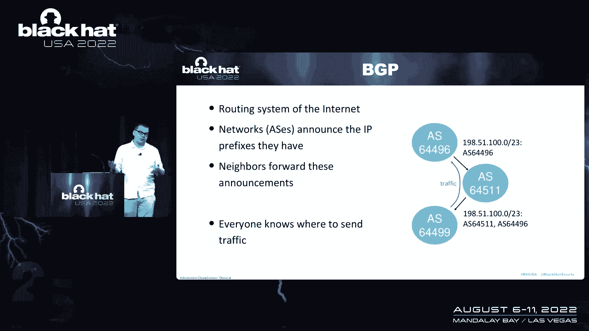
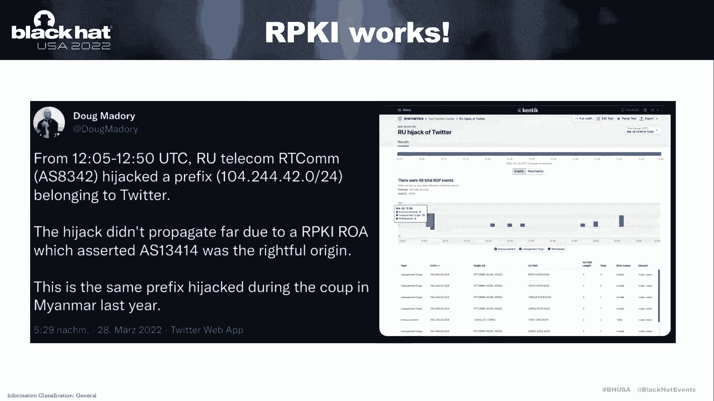
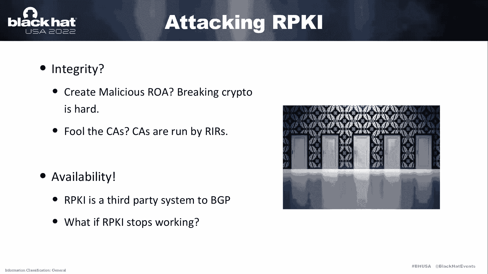
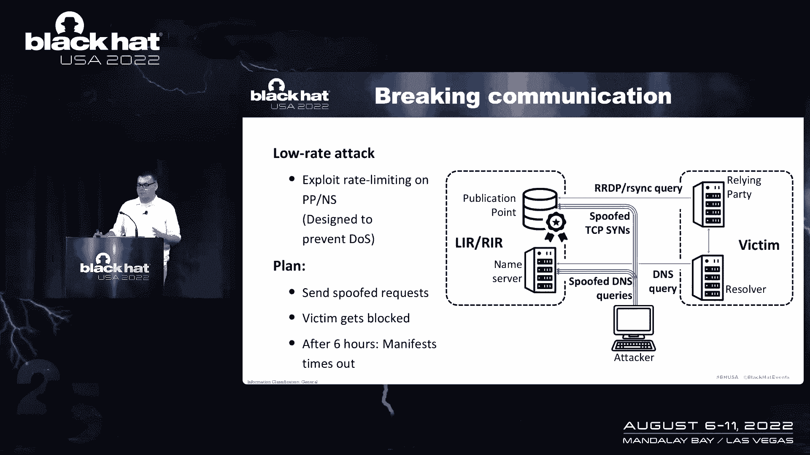
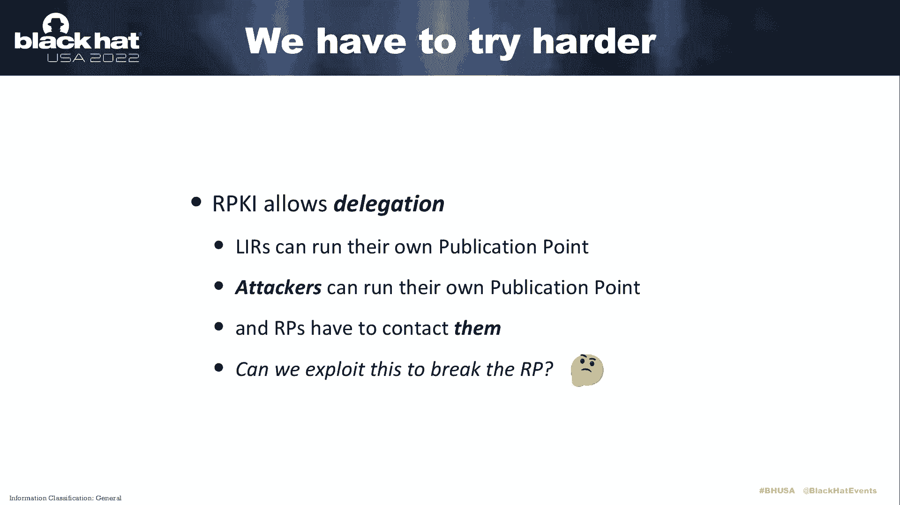
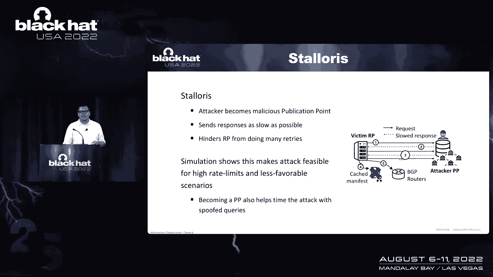
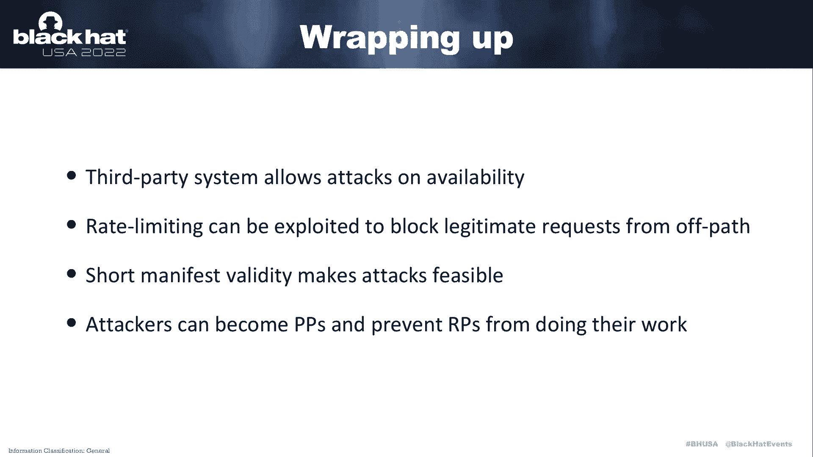
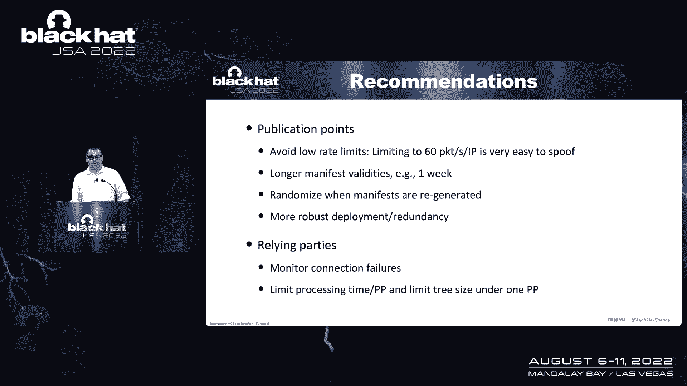

# 【转载】Black Hat USA 2022 会议视频 - P34：035 - Stalloris： RPKI Downgrade Attack - 坤坤武特 - BV1WK41167dt

所以欢迎来到Stellaris RPI降级攻击，我是菲利普艾特纳，基本上这是一篇论文，我们也有合著者，托马斯，多娜·哈亚和米歇尔，谁不在这里，所以我是唯一的主持人，但他们应该被提及，因为我不经常这样做。

我想很快介绍我们的团队，我说我们是五个人的团队，我个人和菲利普·埃说，嗯，网络安全研究员，我刚在，是啊，是啊，我是，我正在努力，我还在国际泳联国家研究中心获得了博士学位，和电话在一起有什么权利。

我们是网络安全、分析和防御部门，我们主要做网络安全，我们专注于路由和DNS安全，所以这次演讲是关于路由安全的，很明显，所以让我们从它开始，首先我们要看一下轮廓，所以我想呈现的是。

我们将研究BGP和BGP安全性，然后我将向您展示资源公钥基础设施，短RPI，因为我想不是每个人都知道它是如何工作的，然后我想向你展示我们对它的降级攻击，很明显这就是标题，最后我们来看看这次攻击的可行性。

以及一些缓解措施，你能做什么来对抗它，对呀，首先让我们看看BGP，边界网关协议，它基本上形成了互联网的路由系统，基本上你有网络，它们被称为自主系统，因为bgp从节点查看它们所以网络内部发生的一切。

BGP不关心，嗯，但是这些网络宣布了IP前缀，他们有，他们有自己的，所以他们的邻居。

然后邻居基本上把这些公告转发给其他网络，最后，每个人都应该知道如何发送流量，所以本质上就像这个例子，你有一些网络，一个网络向另一个网络发送公告，网络转发它，把自己放在路径上。

所以每个人都知道如果我把流量发送到那个网络，网络会把它送到别的地方，然后它应该在某个时候达到目标，嗯对，所以bgp的问题本质上是它是一个旧的互联网系统，因为那时你真的不需要安全。

但本质上从bgp的角度来看，你可以宣布一个前缀，你不拥有，基本上是让一个处于中间位置的人从中获利，有老虎的地方，劫持了亚马逊53号航线，主要和袭击者的所作所为，他们劫持了域名。

把钓鱼的一面放在这个页面上，偷了很多加密货币，如此正确，嗯，解决BGP安全问题和F引入的RPI，它是资源公钥基础设施，顾名思义，它是无限资源的公钥基础设施，这是一种系统的BGP安全方法。

有点像TLS的地方，你有证书和那些证书，将地址块映射到ASMS，自主系统编号，这些证书称为根来源授权，不是杰森，所以你有一个前缀，基本上，证书上说，只有这样才能宣布这个前缀，这些信任的根源。

这个公钥基础设施是RS，资源和区域互联网注册中心，基本上这是有道理的，因为分配地址块，所以基本上如果你，如果RL说你拥有一个地址块，那么您拥有一个地址块，如果你从一个较小的角度来考虑。

因为你不太喜欢路由或BGP，您可以把它想象成从注册表中获得较少的证书，所以与其去问他们，好的，我想要一张证书，就像当你注册域名的时候，你只要拿着证书就行了，这就是它的工作原理。

现在我们假设每个人都在争夺他们的网络和前缀，显然事实并非如此，因为这是一个新的系统，只有三分之一的互联网真正使用它，但我们假设每个人都有，和权利，嗯，那我们就有证书了，但证书只值任何东西。

如果你真的验证了它们，如果您想考虑如何验证证书，有一种天真的方式或一种明显的方式，这意味着基本上你把证书放在信息上，这些信息是由，像TLS一样的证书，是不是，然而，在BGP中，这有点复杂。

因为你真的做不到，这意味着所有的路由器都需要验证所有的证书，通常他们没有处理资源，而且它基本上会扩大BGP公告的规模，因为目前一个公告很小，但是如果你在它旁边放上一千五百字节的证书，它变得更大。

所以真的膨胀了交通，嗯，所以F标准化了，说的是RPTI系统，这是BGP的第三方系统，它基本上有两个基本组件，有真正的存储库，它们被称为发布点，您可以将它们看作是一个充满证书的FTP服务器，然后有依赖方。

那些依赖方基本上从发布点下载所有证书，然后他们验证所有证书并生成有效数组列表，然后他们生成一个列表并将列表推送到路由器，路由器不需要做任何加密，密码学，让我们拿着列表，有一个过滤器列表，基本上。

那是rpi，它实际上是有效的，所以今年，实际上并没有被俄罗斯电信劫持，他们似乎劫持了推特前缀，可能是因为审查制度，这次劫机实际上是通过RPI阻止的，我们的验证，这意味着劫持基本上没有真正影响我们的网络。

是啊，是啊，俄罗斯电信除外，很明显。

假设LPI现在起作用。

我们作为一个攻击者，或者像一个安全研究员，我们想攻击它，如果你想想如何攻击我们的圆周率，你基本上有不同的选择，最明显的是攻击系统的完整性，因此，最明显的攻击是创建恶意RA，为了那个，你必须破解密码。

破解密码很难，所以我们不想那样做，嗯，第二种方法是试图愚弄中情局，你就是这样攻击的，不能少，你可以通过以下方式骗过这个A来给出你的证书，比如说，攻击域验证，这就是问题所在，因为在RPI中，CA是R。

R有关于谁拥有网络块的第一手知识，不像在美国，CA不知道，如果您拥有域，他们可以看到你是否能在RPI中控制它，证书是由一个基本上为您提供资源的人生成的，所以很难骗过他们，因为他们有第一次的知识，嗯。

最后，很明显，因为RPI是一个第三手系统，我们不能把它的可用性，所以本质上的想法是你有BGP，路由器之间的对话，你有RPI，如果你攻击RPI而它停止工作，那么您仍然有BDP路由器。

BGP路由器仍然必须做出决定，但他们没有安全信息作为基础，这就是这篇课文的开头，和一些基本的开始，嗯，基本上，您必须知道RPI是为就地部署而构建的，就像任何互联网系统一样，所以你必须而且必须处理基本上。

因为你会得到一个公告，它还没有用RPG，就像这是60%的互联网，所以这很重要，嗯，在实践中，发生的事情是，本质上如果没有种族，您假设网络还没有部署RPI，所以本质上没有验证发生。

这意味着您接受任何BGP公告，至少从RPI方面来看，可能还有其他BGP过滤器，但我们不认为，所以现在，问题是，依赖方无法真正区分错误或失败，通过下载所有这些攻击连接的证书和攻击。

这就是为什么你不能下载证书的原因，如果他们能下载证书会发生什么本质上是，他们会使用所有的数据，除非它是有效的，而且过期后，假设没有更多的数组和禁用的RPGI保护，所以这形成了我们的攻击计划。

所以我们要做的是，我们想中断中继方和发布点之间的通信，那么重新链接方就无法获取信息，它基本上关闭了我们的PGI，然后我们可以开始我们的BGP劫持，所以这是现在让它工作的基本计划，我们得弄清楚一些细节。

第一个细节是三车道派对是如何工作的，如果他们不能更新东西会发生什么，所以首先要知道的是一套rpicky，或我们的依赖方的临时数据，直到它到期，然而，我们作为我们的证书，它们过期得很慢。

我们测量了我们基本上提取了所有的数组，我们发现他们中的大多数人都有一年的能力，所以我们不能在一年内阻断通信，那不是实际攻击，嗯，然而，有一种叫做清单文件和清单文件的东西。

你基本上可以认为是瓦尔达射线的分配索引，基本上，清单文件旨在防止重播攻击，所以假设您有一个有效期为一年的数组，但现在你把前缀卖给别人，那么数组仍然有效，你可以撤销它，但也没有一个好的搬迁系统。

所以发生的事情是，基本上你把它从清单中删除，这样一来，它基本上就变得无效了，因为它不再被引用了，这可以防止重播攻击，因为现在你不能再使用数组了，嗯，这是一个有效的机制，但是。

这意味着由于这些清单文件的过期时间很短，我们基本上可以用它们来过期数组，因为如果引用超时的清单文件，引用的方式也会超时，和清单文件，我的有效期很短，通常有一天。

所以你只需要在一天内有效地进行阻断通信攻击，实际上是因为这些清单文件是如何生成的，你只需要做六个小时，因为什么，所以大家使用的发布点软件，这叫杀戮，软件的作用本质上是，它只重新生成一个清单文件。

如果它还剩六个小时或更短的有效期，所以你能做的就是攻击你，你可以等这6个小时开始你的技术就在，所以你只需要做六个小时而不是一天。

我们现在知道我们基本上必须中断六个小时的通信，在中继方和发布点之间，现在我们必须弄清楚如何正确地做到这一点，您显然可以进行拒绝服务攻击，但是拒绝服务很吵，它有可能在六个小时内被注意到。

如果他们阻止了您的拒绝服务攻击，那么本质上你，你没有取得任何成就，因为你必须连续六个小时阻止它，否则依赖方更新，则一无所获，所以我们所做的是低速率攻击，特别是我们利用发布点或名称服务器上的速率限制。

服务于域，因此，速率限制是一种机制，旨在防止拒绝服务，基本想法你有费率限制，也就是，比如说，子网和任何超过这个数字的东西都会被扔进垃圾桶，你会收到两千个请求，比如说，你只要服务前一千个。

然后你等到桶被刷新，然后你再做同样的事情，作为攻击者你能做什么，您基本上可以利用这种机制来阻止来自已知来源的通信，恶搞DNS，请求这很容易，因为它是UDP，这样做的目的是阻止受害者。

因为您作为攻击者达到了速率限制，然后受害者就得不到答案了，六小时后我们的想法是因为受害者可以与发布点交流，清单超时，那么RPI中使用速率限制的频率是多少呢，对呀，因为如果你想利用它，它必须存在。

本质上是在真实的发布点中测量的，目前没有那么多，有像大的出版点，由所有的，您也可以拥有或操作自己的发布点，我们稍后会讨论这个问题，嗯，但不管怎样，我们基本上测量了他们是否做DCP作为请求速率限制。

或者如果他们很快做了TCP请求速率限制，我们的结果是，大约一半的公共出版物点这样做，我们没有测试得更高，因为我们没有真正影响服务器，它们拥有大约60%受保护的RPGI，i，p，v，四个空间。

所以基本上发布点，嗯非常低，因为那是最大的数字，我们会认为低，所以我想下一个最大的应该是800，我们测量了，所以现在基本上要考虑可行性，我们会说，好的，所以60%在和平队保护的RPGI空间是限速的。

或者发布点确实有费率限制，所以它很容易受到攻击，在某种意义上，嗯，这是真的，然而，你得想一个例子，从统计上来说，这意味着有效用户的连接成功，大约是10%，因为本质上在发布点。

您还将有一个来自合法合法用户的查询，你会有成千上万的采石场，就可以上桌了，因为我们不知道桶什么时候装满，它控制何时回答查询，或者当你不知道的时候，你基本上可以从统计学上说好吧。

连接成功的机会大约是10%，与之相反的是技术成功的机会基本上是90%，这是一个很好的成功机会，对呀，问题是依赖方会重试，所以他们不只做一个查询，他们确实喜欢如果它不起作用，他们会做另一个查询。

另一个查询，另一个查询，在某个时候它会超时，所以如果你真的想，如果可行的话，我们得考虑所有这些重试，我们必须考虑六个小时的时间，并基本上测量在六个小时内将完成多少次重驱，这就是我们用模拟所做的。

所以基本上我们研究了依赖方的不同实现，我们研究了不同的操作系统和解析器实现，本质上像DNS，解析器执行不同次数的重试，如果他们得不到答案，比如说，解开我们也许只有一个，但也许更束缚我们，嗯，等等。

你还必须考虑现实世界的利率限制，那么我们的模拟，本质上，它表明这种攻击在低速率限制下非常容易，在这种情况下，然后基本上导致了这样的情况，依赖方六小时内得不到答复，因此清单文件将超时，但是。

如果您有更高的费率限制，攻击变得更具挑战性，因为基本上是数字，然后你就进入了真正的拒绝服务攻击的范围，不再是低速率攻击了，所以你可以争辩说它可能会被注意到，因为互联网连接，与目标系统的任何连接，等。

所以攻击起作用了，但它只在某些情况下有效，所以很明显我们想更加努力，对呀，因此，除了低利率攻击之外，我们可以利用这种授权，就像我之前说的。

您可以运行自己的发布点，这是因为它就像一个联邦制，对呀，嗯，他们不想，基本上如果你不使用代表团，然后发布点由眼睛运行，所以您在门户中输入您的信息，你不得不说，好的，我拥有这个前缀，由。

然后为您生成一个CA，并将所有证书放到发布点，一些网络不想使用他们想控制自己的基础设施，这是有道理的，但这意味着本质上因为任何互联网网络都可以拥有自己的发布点，攻击者还可以运行自己的发布点。

他们只需要购买一个IP前缀，这意味着中继方必须联系攻击者，发布点，获取有关攻击者网络的信息，所以它基本上为我们提供了，作为攻击者是与中继方的直接连接，我们要攻击的，嗯，这是对以前情况的升级。

我们只是一个偏离轨道的顾问，但我们真的没有任何联系，我们可以连接到发布点，但这并不允许你允许我们做任何事情，所以问题是，我们能利用这一点来打破依赖方，很明显，因为我问了这个问题，答案是肯定的。

所以这就是我们所说的。

懒猴攻击的名字来源于懒猴，这是对HGDP的攻击，在那里你发送请求非常慢，在露易丝袭击中，基本上，您所做的是攻击者成为恶意发布点，通过在前缀中拥有，去传送门，进入那里，然后如果一个公众。

如果中继方想要获取，至于攻击者网络，您将连接到发布点，发布点基本上会尽可能低地发送响应，但要尽快，所以这个，嗯，重新连接派对不会超时，对呀，有一些限制，但基本上和你一样，你必须发送流量。

好像它的速度超过每秒10千字节或其他什么，然后您也可以膨胀文件大小，所以这种联系一直持续下去，你基本上是在下载随机数据，嗯，这个想法基本上是，这阻碍了依赖方进行多次重试，所以说。

因为它还在更新我们的恶意数据，就是没有用，它不能更新它实际想要的数据，这是关于我们想对其他网络进行BGP劫持，这对我们有什么帮助，或者这基本上让我们作为一个攻击者，它减少了中继方可以对，发布点。

我们对其进行低速率攻击，我们的模拟表明，这基本上有助于攻击，之前的攻击很多，所以它又变得可行了。

就像一个总结，我们展示了RPI作为第三方系统的设计允许攻击其可用性，仅仅因为这是第三方系统，这就出现了一个问题，因为基本上你有一个体面的时间安排，嗯，我向你展示了速率限制机制可以被利用。

阻止来自偏离路径的合法请求，你必须知道中继方的IP地址，我们还没谈过这个，但这是可能的，因为同样的原因，因为Solaris的攻击，您可以为自己运行一个出版物，这意味着你可以看到世界上所有的转播方。

您也可以将它们引用到网络中，他们通过猜测来保护，还通过运行这样的算法，你基本上可以把一个RNA呈现给一个网络，一个RRA到另一个网络，并查看哪些网络受到不同数组的影响，嗯，我们还表明，短验证是短的。

明显的有效性使攻击可行，因为没有清单文件，你将不得不封锁通信一年，这不仅不实用，对，最后，如果费率限制太高，您也可以自己成为发布点，可以防止中继方受到攻击，也可以有选择地做，所以它影响较少的铺设方，嗯。

不做它的工作，所以它本质上忙于处理您的恶意数据，不能经常更新，所以从总结中，我们也有一些建议，很明显你能做什么来对抗攻击，基本上有两组，因此，如果操作发布点，你首先应该避免非常低的利率限制，例如。

如果您有维度的速率限制，对真正的手术来说可能足够了，但从攻击者的角度来看，很容易被恶搞，没有什么我的意思，但这并不像，它不影响任何东西，嗯，对呀，可能足以抵御服务器的数量。

但这基本上使我提出的攻击变得更加困难，那么如果我们考虑清单文件，我们建议您增加有效期，清单文件的有效性，也许从一天到一周，而且应该发生的是当清单再生时随机化，所以攻击者在超时前六个小时不知道。

我需要开始攻击，你应该随机化，所以攻击者基本上必须在整个一周的时间里这样做，他不知道什么时候发生，嗯，最后，我们建议至少一些发布点应该采取更多的部署策略，基本上就像一些发布点，一切都在一个网络中。

以及同一网络上的名称服务器，所以基本上切断了这个网络与互联网的联系，也切断了RPI，如果你在操作一个接力队，我们建议您首先可以监视连接故障，因为它们可以指示攻击，但是也有很多随机连接失败。

因为有人没有重新启动他们的发布点，还是什么原因，所以有很多错误，我是说这是个新系统，也许嗯，但不管怎样，连接失败可以指示这样的攻击，以及依赖方的实施者可以做什么，他们也已经这么做了，在某些方面。

他们应该考虑限制处理时间，他们花在一个出版点上，或者像在一个上面，恶意攻击者存储库，因此攻击者存储库可以，并使其不为其他存储库工作，对呀。

嗯，这就是现在的演示文稿。