# P35：036 - Return to Sender - Detecting Kernel Exploits with eBPF - 坤坤武特 - BV1WK41167dt

下午好，欢迎并感谢大家的加入。

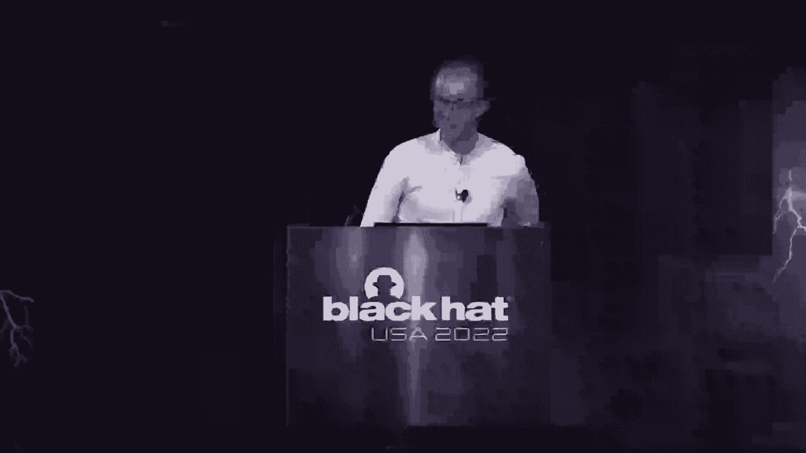

关于用IBF检测内核漏洞的讨论。

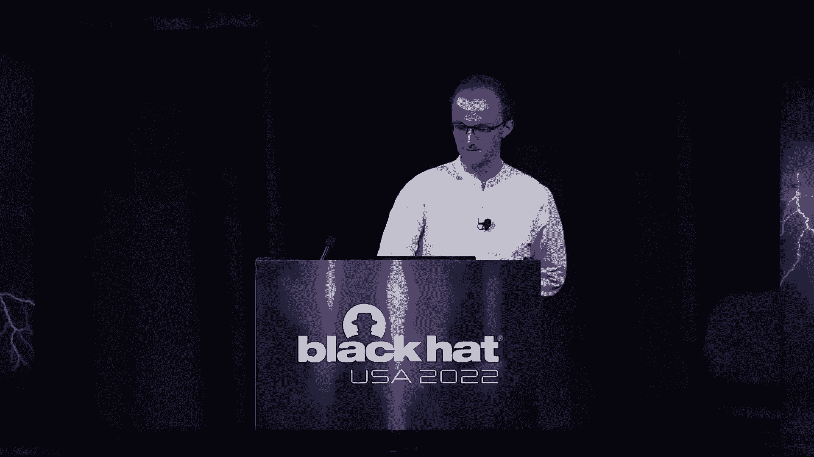

我叫吉佛尔，我是保安，你知道，DataDog的安全工程师，我处理云工作负载，安全小组，因此，CWS利用PPF在运行时检测用户空间中的威胁，我们所做的一切都嵌入到数据中，这意味着，如果你是一种数据狗。

你想尝试适合我们，您所要做的就是更新数据代理，配置好了，2。我们先把今天的议程安排一下，我来给你们介绍一下这次演讲的内容，然后我们将讨论我们将要尝试解决的线程模型，之后呢，我要介绍，对不起。

我首先要谈谈为什么，bpf，所以就像，可能是这次演讲的主要问题之一，为什么要用这种技术来做这种探测，然后我要谈谈哭，So cry是一个开源项目，我今天将发布，所以我们要，你知道的。

我们沿着哭泣提供的功能列表，最后我们要谈谈表演和你所知道的，您需要预期的开销，如果你要在现实世界的环境中部署Cry，所有的权利，所以我很确定这绝对不会令人惊讶。

当我说关键城市是在Linux内核中定期发现的，所以它与Linux无关，就像你知道，在不断更新的软件的生命周期中完全正常，有成千上万的，你知道全世界的用户，但问题是因为这种安全性和手段，担心跟不上。

你知道的，安全更新，部署这些补丁，如果这里有人不得不处理肮脏的管道变异性，你一定会明白我在说什么，整个基础结构中的分级内核需要几周甚至几个月的时间，同时，你没有任何，你知道你知道。

你没有任何东西可以保护你自己，所以基本上昼夜节律意味着，担心监视和预测易受攻击的主机，直到它们能够实际部署升级，这正是这次演讲的目的也正是哭泣试图解决的问题，从技术上来说。

有数百种方法可以利用Linux内核，这一切都只针对三种学习能力，所以第一个是，让我们说，另一辆车能够重定向COM内的执行流，另一个是逻辑错误，所以你知道另一个人能够表演一些东西，但他不是，他不该做的事。

因为你知道开发人员在某个地方犯了一个错误，你知道不能调用正确的访问控制，这个操作实际上是内核允许的，即使它不应该是，最后一个是加上折衷的内核运行时迭代，所以又一次成功地利用了你的内核，他们可能会试图。

你知道Altra内核，这样他们就可以隐藏他们的踪迹，并进一步，你知道的，危及在ON上运行的服务，右边的那个，所以今天的目标是检测和防止BF的这些攻击，嗯，是啊，是啊，够简单对吧，嗯，绝对不是，嗯。

那三个，你知道，图像类型太雄心勃勃了，这将是一个早期的生活，如果我说你知道我能抓住他们中的每一个，嗯，所以我们更现实的做法是，试图让阿卡的生活成为一个活生生的地狱，嗯，所以是的，再次，我们需要非常。

对期望非常现实，以及您实际上可以用BPF做什么，你知道的，在检测内核漏洞的领域。

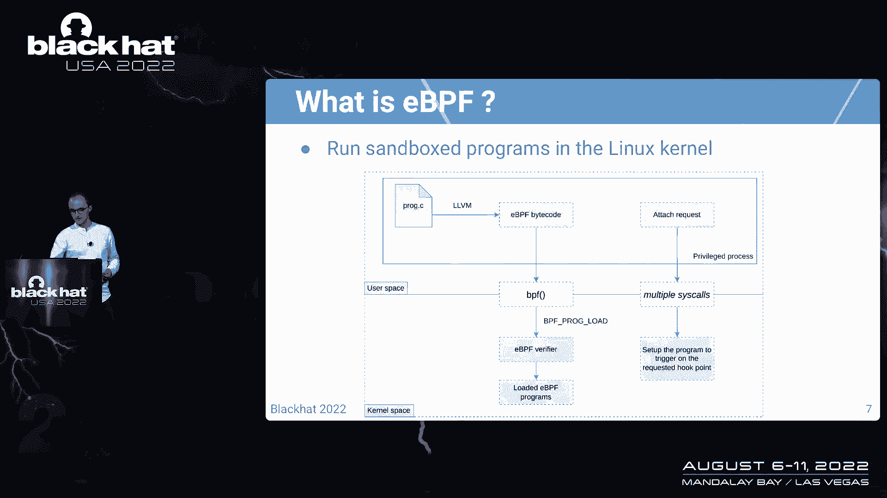

所以我已经谈论BPF有一段时间了，那么什么是BPF，所以简而言之。

BPF是在Linux内核中运行沙箱程序的一种方式，所以想想看，就像你一样，你知道吗，编译成字节码的C程序，并且使用BPF加载到内核中，c分，嗯，所以内核要，你知道的，执行一堆检查，本质上。

目标是确保您的程序是安全的，内核不会压碎，或者因为你的节目而恐慌什么的，然后第二步是实际附加您的VPF程序，到钩点，嗯，所以你有一堆不同的程序类型，一堆钩点，我会在那次谈话中回顾其中的一些，但你要知道。

是啊，是啊，您需要将一个程序附加到钩子点，您的程序实际上被触发。

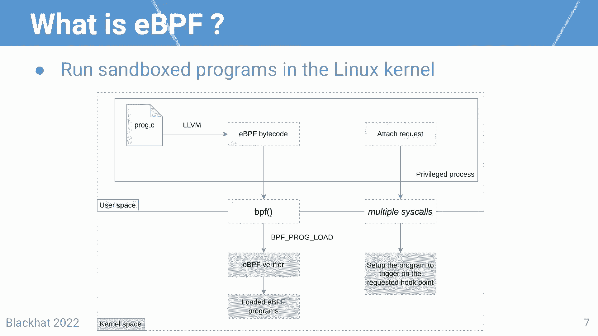

所有的权利，那么为什么PF，为什么这项技术对这类项目有意义，第一点是BF有一个相关的相对广泛的内核支持，取决于您实际使用的BF功能，所以只要你不使用两个花哨的功能，你实际上可以回到，我是说。

你知道你的检测回到四个1核，f的另一个优点是它有一些安全和稳定的保证，内核模块可能没有，它还有一个丰富的功能集，也就是说你有，你知道吗，有很多不同的方法来理解内核在做什么，内核空间中发生了什么，最后。

如果你是，你知道吗，使用足够新的内核，您有一些正确的访问和强制功能，所以总的来说F有一堆，你知道专业人士在努力，对吧，但同时，F做这种检测几乎是个糟糕的主意，它真的像的第一个原因，你知道的。

不太好做内核，他们都利用PF进行检测，是因为检测妥协后的活动是在打一场失败的战斗，所以我们要看看为什么，在某些情况下，BPF不能捕捉，你知道一个预先妥协的漏洞，必须妥协，重点是，是啊，是啊。

如果您依赖于一个受损的内核来实际发射，你知道安全事件，嗯，你不能依赖这些事件，你知道吗，合法可靠，就像他们也可能受到损害一样，BPF不是一个好主意的另一个原因，是因为有几十种方法可以禁用PF程序。

这意味着，为任何东西编写检测也同样重要，你想检测到，它将实际上保护BBS子系统，并确保您知道它实际上仍然启用并仍然工作，当你想让它触发时，它就会触发，最后一点是BPF可能会对基于内核的性能产生重大影响。

但我们以后再谈这个，所有的权利，那么有什么意义呢，嗯，关键是脚本套件是，带着套件开箱即用，努力让A的生活变得更艰难是有价值的，并试图使其更难利用，但尤其是在我们将要讨论的一些非常具体的案例中。

检测和阻止预妥协实际上是可能的，所有的权利，所以这就是为什么今天我要释放哭泣，所以Christ代表内核运行时与BPF的完整性，这是一个开源项目，没有武器支持，但它至少与内核五兼容，十五岁及以上，嗯是的。

所以今天在GitHub上可以买到，所以请随意查看，所以说，而不是浏览一个沸腾的列表，列出哭泣所能提供的所有功能，我实际上要做的是站在攻击者的立场上，试着带你经历另一辆车可能知道的不同步骤。

跟随以便利用流或内核，或者试图绕过我们今天要讨论的任何检测，所有权利，所以让我们来谈谈第一个场景，假设A控制内核执行的下一条指令的地址，所以这是一个非常典型的返回对象编程攻击的例子。

这些攻击通常被用来试图，最终，你知道吗，提升您的权限并获得计算机上的根访问权限，当进程实际上回到用户空间时，所以让我们来看看攻击的不同步骤，看看你知道发生了什么，哭是如何帮助检测这种攻击的。

所以第一步又是，所以编辑可以选择你知道的，这将是内核执行的下一条指令，假设它们跳转到堆栈枢轴，所以堆栈枢轴非常简单，这个想法是编辑将能够选择在哪里，堆栈指针将指向，假设他们可以访问并控制。

或者至少预测一下在那边的EX的地址，重点是，它们实际上会将内核线程的堆栈指向用户空间缓冲区，在这个使用缓冲区中，他们将准备好整个rochain，你一点一点地知道，最终，在某个时候。

他们将执行一个带有控制参数的内核函数。

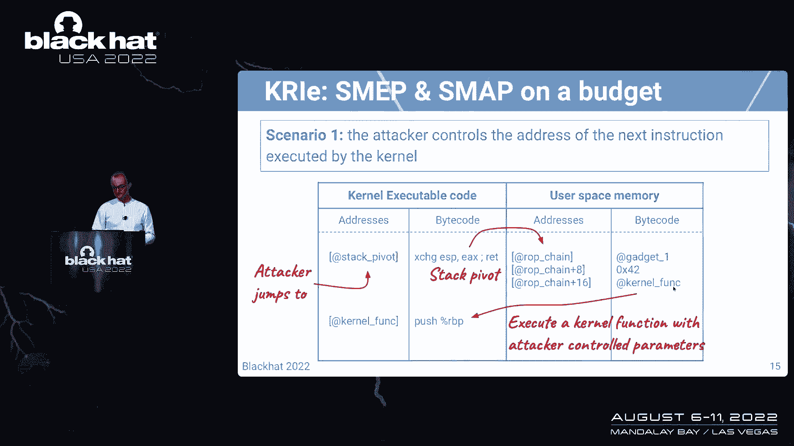

所以在过去的几年里，有几个，我是说，实际上添加了很多功能来防止这些攻击，其中一个叫地图，所以它代表主管模式访问防止，它所做的是，它防止内核线程使用用户空间BU作为其堆栈。

所以基本上我刚才描述的是不可能的，因为啪的一声，地图有点，你知道它是分级的，因为它也在检查地址，但关键是不要跳进堆栈枢轴，我本可以在这里试试的，我本可以直接跳转到用户空间，可执行的。

min和smith会阻止我从内核空间跳到用户空间。

嗯好吧，但为了这次谈话，假设地图和地图被禁用，假设Rockchain最终被更新为调用commit，所以基本上这两个函数所做的就是编写内核，对不起，当前线程的凭据，并最终使当前线程根，好的。

那么我们能为没有地图和地图的机器做些什么，嗯，我想到的第一件事就是把一个K探针，准备一种所以这是干什么的，好的，所以就像在我进入细节之前一样，是一种可以使用的程序，将BPF程序附加到导出的内核符号。

这意味着，每当调用此内核符号时，程序将首先被触发，所以我们可以做的是在那个符号上放一个K Pro，然后检查堆栈指针，帧指针和指令指针实际上指向空间内存。

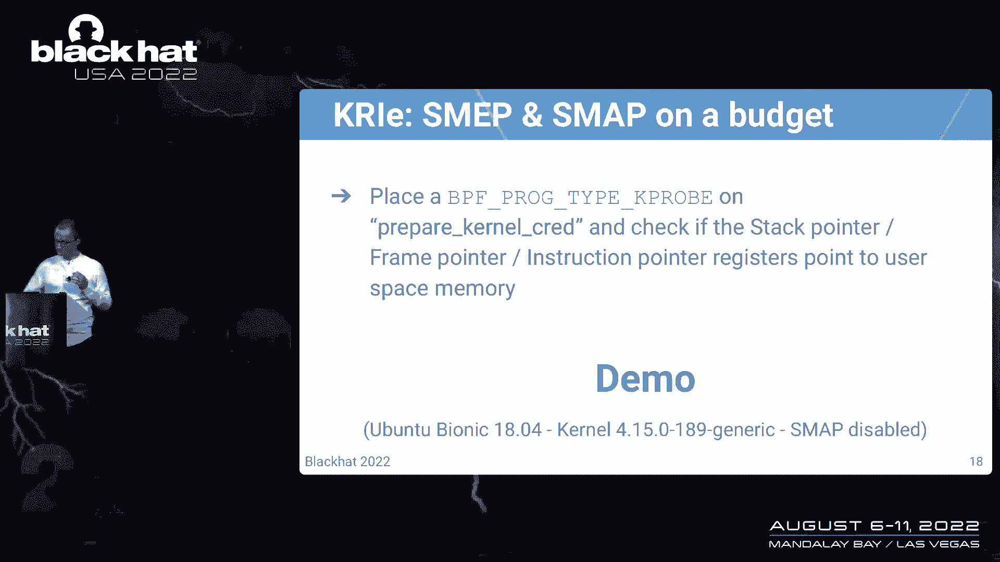

所有的权利，所以你在这里看到的只是。

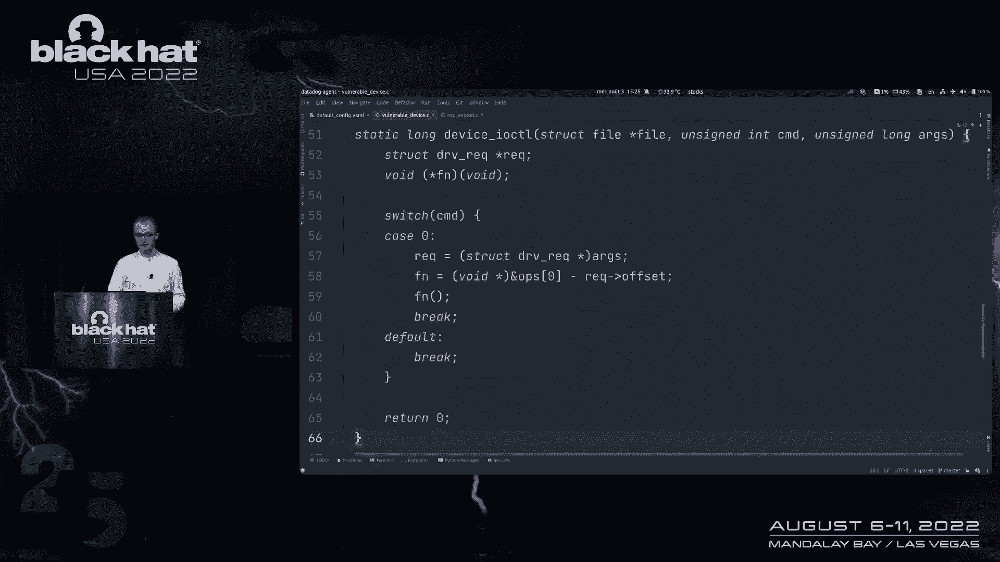

你知道的，所以这是一个管道模块，我必须加载，为了让演示工作，但基本上你可以看到这里，有一个由攻击者实际控制的偏移量，他们可以用这些偏移来，你知道的，在内核中移动到他们想要的任何地方。

并选择下一条指令将是什么，下一个呢，你知道吗，内核要执行的指令将是，所以加载了这个列模块，所以让我们跳进一台机器，然后开始哭泣，给你，然后最终你知道，利用袋子，看看旋转在行动。

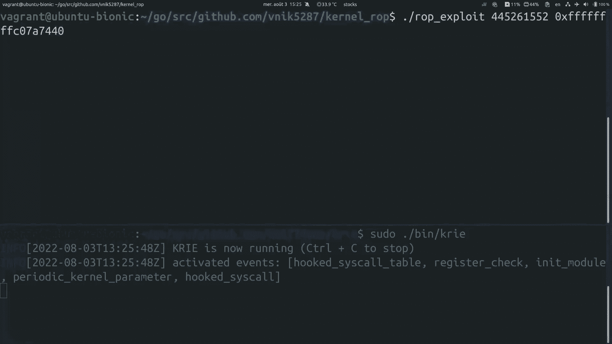

所有的权利，完美，所以我已经配置好了发送所有日志的权利，和所有其他人到DataDog，你实际上可以用任何一种，任何任何日志监控平台，日志是在JSON文件中生成的，这是可以的，是的，是的，如果更新页面。

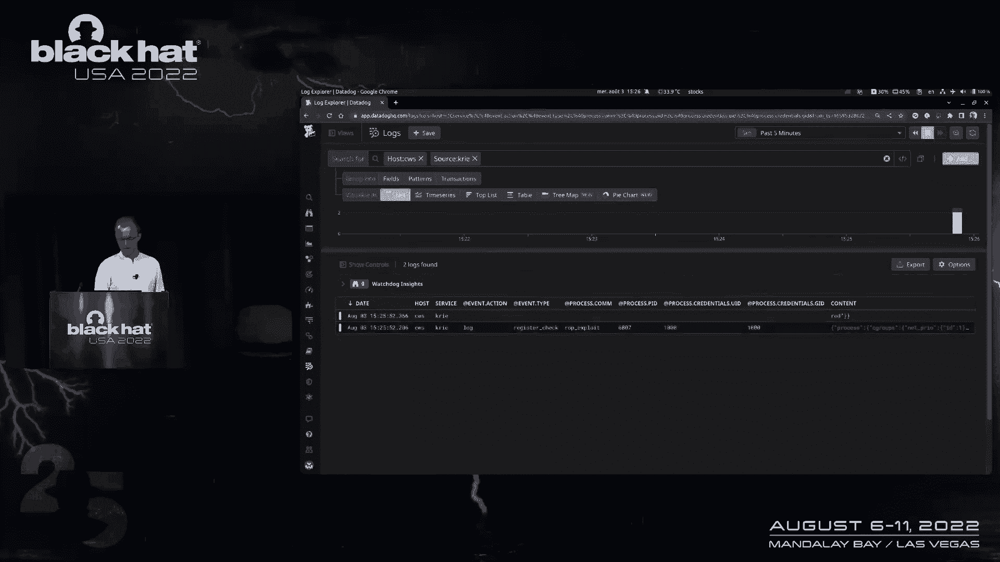

您将看到新日志已发送，这是一个寄存器，检查事件，然后你就有了触发这种检测的过程的上下文，然后最终你会得到，你知道，就像做出预测的钩点，然后您可以清楚地看到这里的侧指针在用户空间中，也就是，你知道的。

发现发生了奇怪的事情。

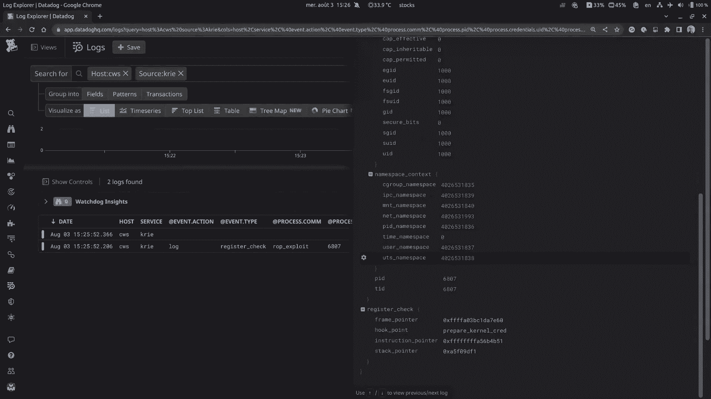

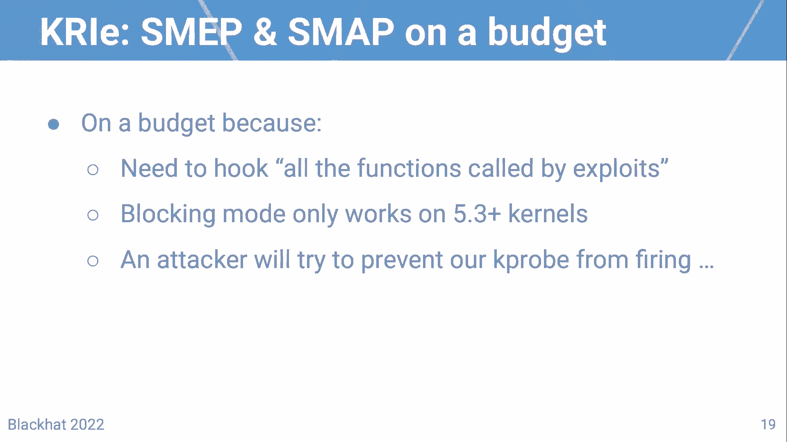

听起来不错，它确实起作用了，但这只是简单地在预算上抓拍和绘制地图，这样做的原因是因为您需要钩住内核调用的所有函数，为此工作的功绩，另一个问题是阻塞模式只适用于五个，三个核加。

这样做的原因是因为如果你真的想阻止这种事情，你要把这个线，你想杀死线程，你需要一个介绍的帮手，其实有三个核，另一个问题是，如果攻击者知道您正在使用K个探针来实际检测到这一点，是啊，好吧。

他们首先要做的就是阻止海角探测器发射，所有的权利，所以继续吧，网络会对，你知道的，使K井失效，据我所知，禁用K探针的主要方法有三种，第一个是使用K个探针使能接口，所以我以后再谈这个。

第二个是用这个城市禁用F跟踪启用，所以这是一个全局杀死开关，对于Linux COMO的所有跟踪子系统，最后一个是杀死实际加载BPF程序的用户空间进程，嗯，让我们尝试诱杀一切正确，我不打算多谈最后一个。

因为这可能是最恶心的选择，可能不是第一个尝试做的，所以我要复习前两个，那么让我们来谈谈第一个，所以K道具启用，是一个全局终止开关，可以解除机器上所有K个探针，嗯，它就会，如果你看看它是如何工作的。

最终它会调用右边和火球钩点，我的意思是符号，你可以自己更新区块链来做到这一点，所以你可以做的是使用你的网络链，最终试图放弃，在跳到漫画跟踪功能之前，你知道所有的K探针，所有的权利。

所以让我们也在上面加上一个K，问题是即使你输入了一个K程序，如果攻击者知道你又在使用K道具，还有一种方法可以绕过K专业人士，即使没有经历痛苦，你知道的一部分，在右手边的球里冷却，你可以。

你知道如何做到这一点只需一次查看自行车代码，在左边你可以看到这是函数的字节码，没有K探针，右边是一个K探针，所以这里发生的事情是，当它来自时，实际上是装载的，字节码被重写为调用到某个地址。

那实际上是K探测器的一个子系统，你知道功能，然后这个子系统会调用你的BPF程序，因此，如果攻击者知道您正在使用它来检查寄存器，他们可以做的是简单地跳转五个字节后，然后就像你知道的那样绕过对键盘的调用。

好吧，再来一次，游戏开始，你下一步做什么，很酷的是K个探针实际上可以添加，你知道，沉迷于多种资产，加上你关心的符号，嗯，从技术上来说，你可以把其中的许多，所以重点是，呃，为了防止他们。

防止攻击者跳过对K探针的调用，您可以做的是加载它们的多个实例，然后再这样做，我是说，在函数内部很远的地方，使曲线永远被阻止，尝试调用函数，所有的权利，这样就可以工作了，但他们还能做什么，你知道的。

通过这个并再次尝试绕过这个，嗯好吧，如果你看看有什么权利启用五球，它实际上是向一个叫做k探测的全局变量写入零还是一，全部设计，所以如果你，我是说，另一个可以尝试直接写1或0来保留道具，所有这些声音。

所以它不一定会禁用已经加载的k个探针，但至少会防止你加载新的，不好的是BPF，你没有办法把任何东西钩对，因为你没有任何符号，您没有任何程序类型能够只是钩住，正在更新的内存，所以你什么都做不好，其实。

几乎，你实际上可以做的是使用一个完美的程序类型，定期检查所有敏感内核参数的值，所以完美事件通常是用来收集。

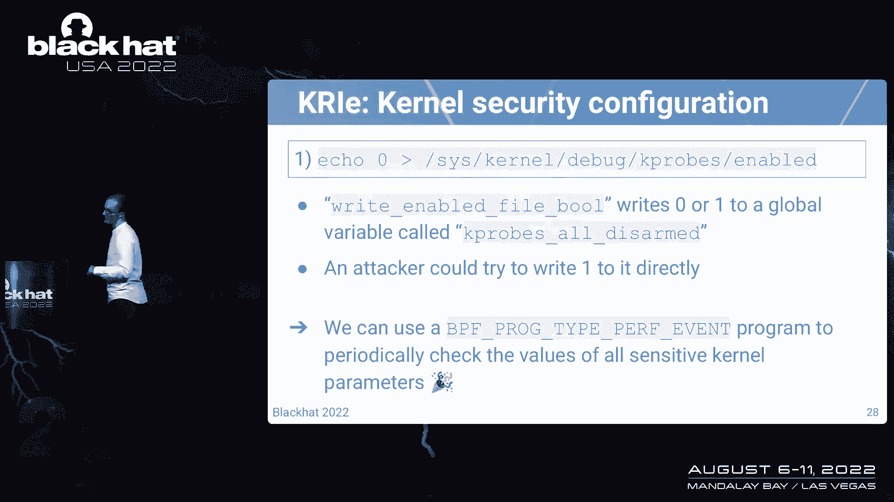

你知道的，进程上的硬件指标，但您实际上可以将其配置为定期触发，所以这就是哭泣的作用。

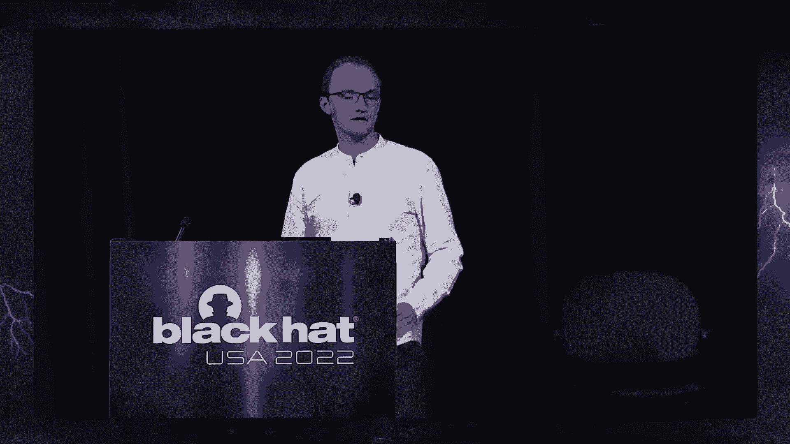

那么让我们来谈谈值得K探测的第二种方式，另一种方法是使用CCL接口，好消息是有一个完整的BPF程序专门用于CL，不幸的是，它是在五个两个内核中添加的，所以如果你想对所有的内核做这些事情，你又得用K路了。

但关键是这种程序类型，您可以实际检测参数何时即将更改，你知道，先发制人地更改值或完全阻止调用，几乎所有敏感数据参数都由DIC检查，所有的权利，所以让我们假设到目前为止你所做的一切都不起作用。

攻击者能够绕过你的检测，最终成为机器上的根，在那之后他们可能会做什么，试图抵制他们的访问，并修改，成为隐藏行踪的运行时，他们通常是使用内核模块，然后在列模块内，试着把这些电话挂在，你知道吗。

更改思科的输出，基本上钩住这些目标的方法，有很多方法可以做到这一点，但主要是基于K探针，或者通过挂钩，这被称为表直接，在过去的几年里，另一件可以做的事情是使用高炉过滤器，试图利用网络流量。

或者他们也可以像，你知道的，根本不使用内核模块，而是使用BPF程序做所有事情，我们去年不得不讨论这个，所以如果你有兴趣，我们我们，你知道我们工作，和一个完整的BF或BF为基础的工作，孩子们，所有的权利。

所以哭所做的因为所有这些实际上是监控一切，我刚才谈到了，所以你知道任何类型的BPF操作都会生成UN，任何类型的常见模块加载或删除事件，任何类型的K注册或设计事件，等等，更重要的是。

在这里查看钩状系统调用的下一个演示执行，所以哭又能察觉到，用定期检查的把戏，对不起，西尔桌被钩住了，只要看一个SY阻碍的地址，如果它在内核文本之外，所以如果是的话，例如，在模块代码内部。

它会触发一个事件，然后如果衣架改变了一段时间，它还会向您展示一个事件，另一种方式，哭的一个很酷的诀窍是它能够察觉到，当一个进程即将执行一个被钩住的sil时，同样，您可以配置权限以记录或终止进程。

他就要这么做了。

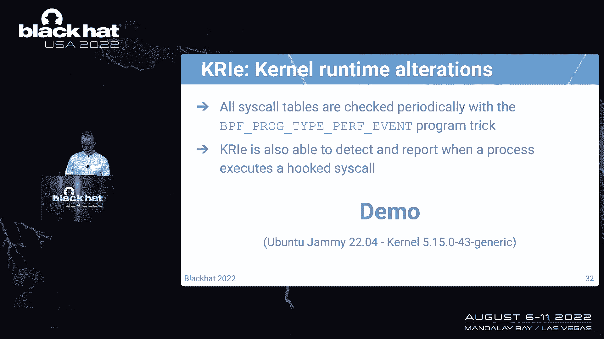

所有的权利，所以再一次，这是内核模块。

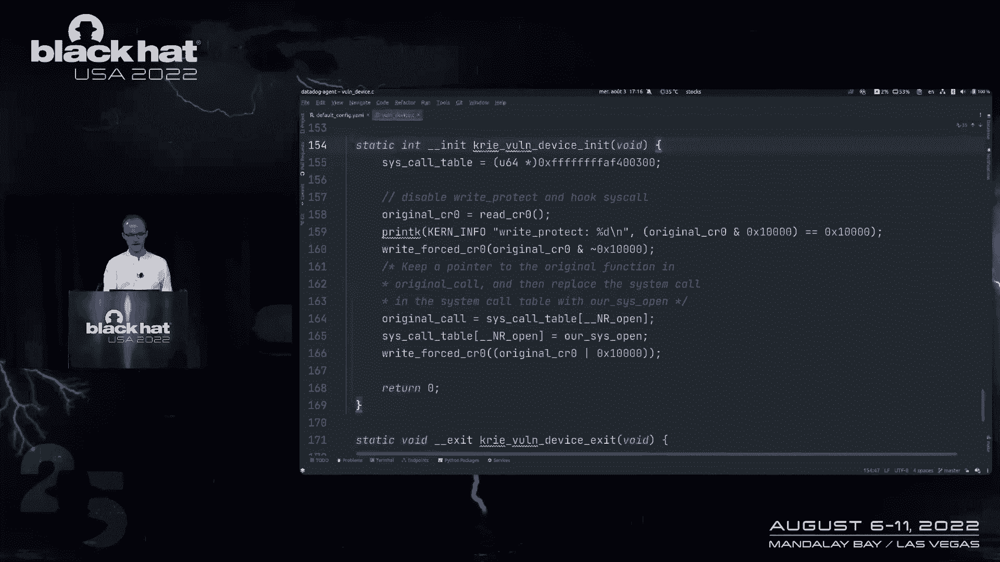

正如你所看到的，它被修改为on in，只是，你知道的，这是一个基本的叫做表钩子的方法，但就像覆盖思科指针一样，成为我们自己的思科安德，然后如果您查看Cry的配置文件，您将看到我已经将其配置为日志。

每当这个叫桌子上钩的时候，也扼杀了我可能试图执行SIL的过程，已经上钩的，所以对于这个演示，我写了一个基本的Web服务器，然后如果你知道，调用图书端点，你会得到一份书单，为了回答这个书单。

服务器必须发出一个开放的，这个电话好吧，所以让我们开始哭泣，然后插入我刚才说的模块，完美，然后让我们跳转到datadog，看看日志是什么，几乎立即产生，所以最终你会得到两个完美的。

所以第一个是init模块，所以很简单，你知道新的型号已经加载了，您有模块的名称和完成它的过程，然后如果你看钩子叫做桌子，你会清楚地看到，你知道开放是所谓的被钩住了，它曾经是x64是开放的。

现在是我们在恶棍设备模块内打开的，所以让我们回到我们的Web服务器，然后就像你知道的，再次发出请求，看看现在调用正在运行会发生什么，完美不出所料，该过程被缩放，您将在。

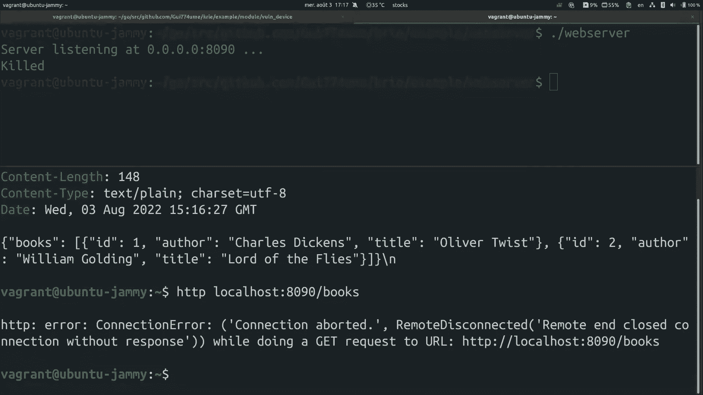

你知道的，在数据湖里好吧，所以检测岩链攻击的另一种方法是控制流完整性，所以CFI是一个很好的，锁定内核中执行流的许多程序的已知特性，通过在运行时对冷站点进行排序，所以它们通常是按时间添加的。

但有时它们也被添加到硬件中，CFI是控制和防止橡胶X的好方法，因为它防止您在内核中跳到任何您想跳的地方，这基本上是机器人码头所做的，不幸的是，这些功能并不总是可用的，特别是，硬件的，就像你知道的。

我们能用PF井做什么，而不是试图锁定所有的呼叫站点，我们可以用BPF做的是锁定控制点之间的跳转，因此钩子点和参数都被检查，基本上这个想法是你不能达到一个低级的功能，首先，链接到凭据更新的思科。

然后通过Linux安全模块，也像你知道的，基本上处理所有货币访问控制的相同界面，所以不幸的是，我没有时间进一步谈论这个，但目标是捕获对敏感函数的恶意调用，以及专门针对访问权限的技术缺陷，所以例子。

比如说，假设您以读取的形式找到该文件，最终你会得到，你知道吗，你最终给它写信，比如说，坏消息是这是一个非常繁琐的过程，它不是自动化的，相反，就像你知道的，不一样，对于这种情况。

很抱歉有任何其他通常或正常的CFI工具，嗯，也像钩子一样，你必须绕着循环工作，钩点限制，因为再一次，并非内核中的所有函数都导出，这意味着你不能到处钩子，技术上使用VF，我也简短地谈到了强制执行。

所以基本上哭了，将尝试在阻塞功能可用时启用它们，所以要么是程序类型，要么是BF助手，我们今天讨论的每一个检测都可以配置为日志块，杀人或偏执，所以这里的日志块几乎是不言自明的，偏执意味着每当上瘾引发。

所有的过程都会再次被杀死，仅当内核上有合适的帮助器时，所有的权利，所以说到性能，所以我使用Linux内核计算时间，来评估哭泣的表现，而这样做的原因是因为它，你知道它产生了很多过程，就像是。

这意味着这是一个很好的哭泣压力测试，正如你所看到的，如果你启用了哭得很好的所有功能，您可以有相当大的CSO开销，总时间高达40%，嗯，然而，如果您只禁用一个检测，它是在运行时检查的，当一个Sysco。

你知道那就要执行了，嗯，这个叫有没有上钩，所以如果你禁用这个钩子和这个描述，你回到不到1%的开销，这是完全可以的，实际上在与其他CFI相同的边距中加载，所有的权利，所以非常感谢，对我来说就是这样。

我想这次谈话的三个要点是我们的抱歉，首先，UBF可以用来编写强大的检测，然而，BF可能不是检测漏洞的理想技术，因为我在谈话中谈到的所有原因，嗯，也更现实，尝试最后的手段，嗯，这不是一个真正的证明策略。

然而，嗯，努力让生活变得更艰难是有价值的，尝试，你知道，只是让利用更难使用，一定要试着从盒子里做出来，开箱即用的套件，脚本失败，孩子们，比如说，所有的权利，所以再一次，存储库是开源的，所以请随意查看。

我倒下了。

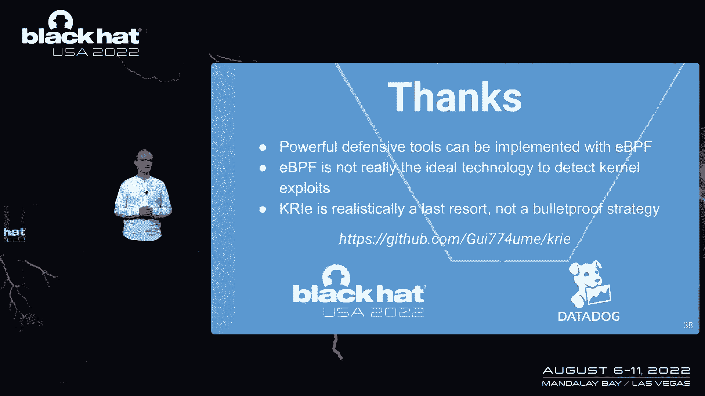

