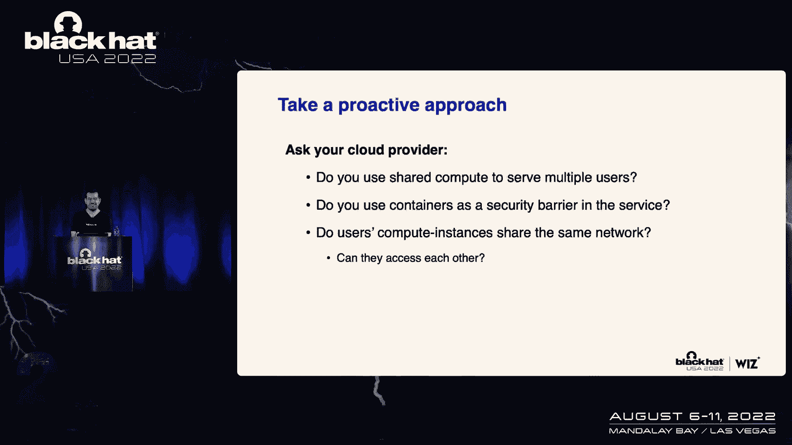

# 【转载】Black Hat USA 2022 会议视频 - P36：037 - Pwning Cloud Vendors with Untraditional PostgreSQL Vulnerabilities - 坤坤武特 - BV1WK41167dt

所以欢迎来到我们今天的会议，我们将讨论独特的漏洞，我们在跨多个云提供商实现流程QL作为托管服务时发现，届会期间，我们将讨论漏洞的技术细节，我们如何利用POSQL中的某些修改，为了得到一个私人的。

以及成本和访问其他客户的其他数据库，我希望在这次会议之后，您将更好地了解一般有多少服务在云中工作，也是关于我们五年前写的开源项目，被整合到一个托管服务中，并向许多客户提供了一些内部服务。

因为进入内部总是很有趣的，以及我们作为团队的巫师如何进行我们的研究，只是一个有趣的事实，你在屏幕上看到的所有大象实际上都是我生成的，这是一个很酷的，你会在会议上看到这些，所以让我们从我们开始。

我的名字是纯粹的，施塔马里和我还是，我们两个都是每周研究小组的，我们试图将开创性的新研究带入云产业，我们想发现和发现新的风险，都是为了保护我们的客户，也是为了与社区分享并在舞台上展示它。

我们有一些值得注意的研究，就像，哦，我的天啊，科斯DB也额外复制品，我们今天要讲的，如此之近，你能告诉我们今天的议程是什么吗？谢谢盾牌，所以在今天的议程中，好吧，首先，从一些动机开始。

是什么真正引导我们研究跨多个云供应商的SQL实现，然后将潜入两个实现漏洞，这是由云供应商引入的存储的修改造成的，缩放发动机，我们还展示了我们是如何利用这种漏洞的，未经授权访问其他客户的数据库，使用服务。

我们吃些外卖结束这一切，所以我们的故事从去年的毯子开始，欧洲，嗯，我的同事们，吉和我出现在舞台上，ksdb，我们展示了几乎是偶然的，通过利用一系列漏洞，我们能够获得对数据库的未经授权的访问。

其他客户的实例，使用AZ的一艘飞船，数据库解决方案，宇宙分贝，所以魔鬼说话，我们坐在酒店大厅里思考，难道KSDB不是一个孤立的案例，还有更多的云服务可能容易受到类似的攻击。

所以基本上是相同级别的谈话我们已经在寻找下一个目标，所以宇宙，db，是分钟服务，这给了我们在共享环境中执行代码的能力，所以我们想找一个类似的服务，一个允许我们在共享环境中执行代码的多服务。

共享环境是由云供应商管理的环境，它实际上保存了多个客户的实例，在我们的研究中，我们发现这是云供应商最挣扎的地方，保持客户实例之间完全隔离，我们希望它是一个数据库作为一种服务。

数据库是任何组织中最重要的组成部分之一，使他们在一天结束时成为攻击者的神圣FA，几乎每一个网络操作的目标都是到达数据库，所以我们觉得，如果我们设法在服务的数据库中找到另一个漏洞，会有很大的影响。

所以我们在找一个数据库，作为一种服务，它能够以未来的形式执行代码，经过几个小时的侦察，寻找这种服务，我们几乎空手而归，显然宇宙分贝是一种特殊的雪花，它在共享环境中实际执行代码的直接能力。

但后来我们认为所有这些数据库服务实际上都是基于开源数据库解决方案的，其中一个数据库解决方案必须具有，这将使我们以一种简单的方式执行代码，显然摆出一个QL，互联网上最流行的数据库引擎之一，一个数据库代理。

正在所有主要的云提供商中使用，实际上有一种通过SQL执行代码的非常简单的方法，您可以执行以下SQL查询，它从创建一个存储命令输出的表开始，通过copy语句执行命令，在这种情况下，我们正在执行id命令。

显示当前运行用户的权限，然后我们查询结果并执行它应该是，这个查询应该给出如下所示的内容，所以接下来我们做的是使用这个确切的SQL查询，并对市场上可用的每个托管SQL执行。

希望他们中至少有一个忘记了这个小把戏，但不幸的是，毫无例外，他们都给了我们同样的老信息，声明我们只是缺乏使用copy语句的特权，为了使用copy语句，需要是超级用户，但我的意思是，论文安全权限模型。

不应该是阻止我们执行代码的东西，我是说这不是真正的安全屏障，找到一个漏洞有多难，这将允许我们将我们的特权提升到超级用户，从而获得执行通信的能力，然后深入了解服务的内部工作，回答这个问题。

我想请你回到舞台上，带你穿过一些非常酷的漏洞，好的，所以我们拍了这个片段，我们在许多云提供商中运行它，大量用于服务的托管处理器，谷歌云计算，特别是云SQL服务，云为客户提供多种开源数据库产品。

我们在Postgres实例中创建了，我们连接它，我们试图执行代码，但没有成功，所以我们做的第一件事就是试着了解我们是谁，我们对数据库有什么权限，所以我们可以看到我们是作为用户运行的。

Postgres和Postgres的使用是云广场的一员，超级可用，我们似乎没有特殊权限，我们绝对是没有权限的低特权用户，这实际上是数据库中的管理员或超级用户，并被谷歌用于管理此实例，我们无法接触到它。

所以我们没有执行代码的权限，我们不是真正的超级，但显然我们可以创建事件触发器，现在，事件，我想在Postgres不一定是危险的操作，您只需创建一个事件触发器。

事件触发器的问题是只有超级用户才能创建事件触发器，这是来自这张截图，来自官方流程，QL文档现在这很奇怪，因为我们在数据库中没有权限，我们不是超级用户，但我们可以创建事件触发器，这是怎么回事。

不仅仅是事件触发器，它还在两个QL中加载扩展，你一定是个超级用户，为了加载大多数扩展，这里我们有一个案例，我们实际上可以加载扩展，这也很奇怪，我们还注意到，我们可以创建一个表。

并将表的所有者更改为另一个用户，将其交给数据库中的另一个用户，甚至与角色无关的用户，这也是非常不默认的行为，我是说，如果你有截图，我们可以创建一个表格，让我们称它为使用Postgres拥有的测试表。

我们实际上可以将所有者更改为我们与之无关的云，这不是默认行为，所以这让我们相信过程QL引擎被修改了，后来我们发现谷歌公开宣布了这一点，他们说您不能创建具有超级用户权限的数据库用户，但是。

您可以使用云创建数据库用户，广场超级用户全部，它有一些超级用户特权，包括获得扩展，获取事件触发器，创建应用程序用户，所以现在我们知道PostgreSQL引擎被修改了，我们并不是一个真正的超级用户。

但我们也不是经常使用，因为我们有一些超级用户功能，这让我们提出了一个非常有趣的研究问题，我们能利用这些能力，谷歌提供给我们的那些独特的功能是为了打破流程或安全模式，并利用这些来提升我们的特权。

所以我们将探索这些功能，吸引我们眼球的是改变桌子的选项，并将表的所有者更改为另一个用户，基本上是在波斯特雷斯，如果我们创建一个表，我们试图将所有者更改为与我们无关的用户，我们应该收到以下错误消息。

即我们必须是角色的成员，在这种情况下，混浊的平底锅最小，但在谷歌，它实际上是有效的，我们设法创建了一个表，并将所有者改为云技能，为了了解这种能力的影响有多大。

我们将对Postgres中的两个非常基本的事情做一个非常简短的回顾，假设我们有一个叫做员工表的表，我们有三张唱片，纯粹的，附近和比尔，并且表由ID列索引，每当我们插入一个新的，每当用户向表中插入新项时。

桌子上有一个新项目，没有Postgres像任何关系数据库一样支持索引，而且它还支持索引函数，这意味着我们可以在某个列上创建索引，每当我们把东西插入桌子，它将根据某个函数的输出进行索引。

所以每次用户在表中安装一些东西时，幕后的索引功能，我们宣布的那个将被处决，表中的新行将被索引，基于该函数的输出，那么这里的潜在风险是什么，我们必须使用执行插入或更新的用户，不仅仅是在某些更新中。

有很多注释实际上执行索引函数，如分析和真空，如果用户在幕后的桌子上执行此操作，将调用一个索引函数，不仅仅是比尔会在我拥有的桌子上做手术，通过使用Postgres，它们还将调用索引函数。

在我们的桌子上执行操作的超级用户也是如此，现在Postgres想面对这个潜在的安全风险，他们希望避免用户意外调用函数的情况，他们不知道，所以他们增加了这些确切问题的缓解，十三年前。

他们决定每当用户对表执行操作时，后台的索引功能将在表所有者的权限下执行，因此，如果超级用户正在对表执行插入，索引函数仍将使用用户Postgres的权限调用，因为用户Postgreare现在桌子上的那个。

也许，你们中的一些人已经知道这种行为将如何被利用，如果我们创建一个表会发生什么，然后改变表的所有者，将刻度云化，我们将创建一个带有索引函数的表，然后我们就换主人，因为谷歌允许我们这样做，那样的话。

如果桌子会归云锅所有，最小超级用户，每次有人在桌子上做手术，如插入或更新索引函数，我们声明将使用云管理权限执行，我们现在要做的就是用一个邪恶的函数替换索引函数，假设我们将用下面的代码创建一个邪恶的函数。

在对表执行操作后执行id命令，可以插入，更新，分析，真空度，我们会得到以下结果，我们实际上能够在谷歌的技能实例上执行代码，这是id命令的输出，这是研究的一部分，我们很兴奋。

我们能够在一个托管实例上获得代码执行，关于谷歌的非管理，我们很兴奋能探索分钟服务的内部环境，我们知道我们可能在一个内部网络中运行，就像一个共享的环境，并且我们在修改后的流程或字段实例的许可下执行代码。

所以我们开始做一些侦察，我们发现我们在一个本地容器里运行，码头集装箱可能在冯机器里运行，我们还注意到，我们有一个与主机共享的网络接口，它是一个与十点共享的名称空间，一个，两个，八个子网，我们找到了证据。

升级漏洞，以获得Docker容器中的根访问权限，然后我们使用根访问来转义容器，并获得对过滤机的根访问权限，从那里我们可以看到控制飞机，管理我们服务的组件，以及其他可以通过本地网络访问的假设规模实例。

后来我们发现这些实际上是我们自己的例子，因为我们在Postgres中选择了高可用性特性，我们得到了一些复制，这实际上是我们自己数据库的复制品，在研究的那一刻，我们收到了来自谷歌的一个非常令人惊讶的O。

他们用一个非常古老的披露线程给我们发了一封电子邮件，我们和他们讨论了另一个弱点，他们说嘿，他们想问，万一是你或你的同事，你们有没有，在云Q上做研究的人，你介意分享一下你的进展吗，如果是这样，那是第一次。

我是说我们做了很多研究，那是我们第一次被抓，所以我们把一切都包起来了，我们写的报告很少，我们和谷歌的朋友分享了它，那时我们对我们的发现感到非常兴奋，我们知道可能还有很多其他供应商我们可以去看看。

如果他们做了类似的修改，也许我们可以找到类似的漏洞，这就引出了下一个例子，Azure PostQL灵活的设置，因为您还提供和管理Postgres，也许他们做了他们做了同样的事情，我们感到幸运的第一件事。

我们只是登录到Azure进程或Qinstance，并试图以直截了当的方式执行代码，就像我们有这个谷歌一样，我们一定是超级用户，或程序执行的PG成员，为了执行代码，就像我们用谷歌做的那样。

和我们在这里做的一样，我们检查我们有哪些任务，所以我们以用户Postgres的身份运行，我们是Azure PG管理的成员，这是一个蓝色的Unico，我们似乎没有很多权限，我们确实有一些规则。

但他们没那么有趣，我们没有队形来执行代码，我们确实有一些特权功能，比如创建事件触发器，此外，我们还可以选择创建一个检查点，无风险操作，但根据伤口，你需要成为超级用户，为了创建检查点，我们和谷歌也是如此。

我们还可以添加扩展，所以Z可能像谷歌一样修改了QL的过程，这实际上是相当惊人的，两个供应商，两个不同的代码库，都想引入相同的功能，但在蔚蓝中，有别的东西有眼睛，他们为我们提供创建权限。

现在Get permission实际上在云管理服务中非常流行，他们倾向于提供这种能力，所有这些信息，但每次你这么做的时候，你必须限制它，因为这是一个非常强大的许可，根据处理器文档。

你必须小心创意世界的特权，这是一个角色，如果角色没有一定的特权，但被允许创造其他目标，它可以很容易地创建另一个具有不同于自己特权的角色，因此，他们认为创造了特权的墙几乎是超级用户，几乎超级用户墙。

所以我们知道我们可以创造，我是说，我们还不知道，但我们相信我们可以创建新的用户并指定唯一的规则，我们可以在Postgres中为新用户提供哪些角色，以下是我们能提供的最强大的墙列表，我们可以给它提供PG。

阅读一些文件，这将允许我们从文件系统中读取文件，美丽，相当强大，我们还可以指定文件的PG权限，这将允许我们将文件写入文件系统，但最后，最有力的许可或最有力的墙，pg执行程序，如果我们有这个权限。

它将允许我们执行代码，所以接下来我们做的事，我们创建了一个新用户，我们叫它詹姆斯，我们指定所有三个特权，领导我们的文件，很多文件，并执行几个程序，而且奏效了，我们实际上能够创建一个新用户。

现在我们有一个叫James的用户，他拥有非常强大的权限，所以接下来我们做的事，我们以用户James的身份登录，我们执行以下SQL查询，现在我们不想，我是说，我们甚至没有直接执行ID命令进行反转。

而且奏效了，我们能够逆转一个管理良好的例子，谷歌也是如此，我们很兴奋，我们有了一个新的侦察环境，去研究，去理解，我们在哪里，从那里我们能做什么，有什么可能性，我们实际上可以利用这个漏洞实现。

现在是邀请尼尔上台的时候了，查看额外的副本漏洞，现在我们获得了成本和对其他客户数据库的访问，谢谢苏，就像你提到的，我要告诉你怎么做，我们能够利用这种漏洞，未经授权访问其他客户的数据库，使用服务。

这是我们开始的地方，我们知道我们在里面奔跑，在某种蓝色改进版的QL里面，在做了一些基本的骗局后，我们意识到我们实际上是在一个专用的码头工人集装箱里运行，这个本地容器实际上运行在一个专用的虚拟机上。

我们执行if命令来查看我们有哪些网络接口，在这里我们了解到我们的虚拟机实际上是两个子网的一部分，这让我们假设，我们实际上是某种蔚蓝内部网络的一部分，但我们仍然不知道这些网络子网是什么。

所以试着回答这个问题，我们实际上使用地图扫描工具，尝试在Azure内部网络中映射主机，这实际上是检查该网络中是否有其他Qinstance，事实证明，在网络中，还有其他212个数据库实例。

意思是我们可以连接到存款QL默认端口五四三二，在这一点上，我们想知道，这些是我们的例子吗，所以我们真的希望不是，首先，我们想证明成本和访问，我们真的希望我们不会为200英镑买单我们会反对。

因为在云中你永远不可能知道所以我们可以直接连接到其他客户数据库，但我们喜欢有资历的人，做任何有意义的行动，所以接下来我们做的是我们几乎在每个，几乎每一个成本和研究。

并且检查虚拟机映像作为托管服务所带来的默认配置，这意味着所有实例都运行相同的映像，配置相同，这意味着它将能够找到可利用的错误配置，它适用于其他客户实例，因此，我们检查ql身份验证配置文件。

我们首先检查了PG培根F，它是POSQL身份验证配置文件，此文件规定谁可以连接到哪个数据库，我们还检查了PG文件，PG文件本质上是PVA文件的扩展名，详细说明更高级身份验证机制的进一步配置。

比通常用户高级一点的身份验证机制，密码认证，所以说，下面是我们在机器上找到的PBA文件的一个简短片段，我们注意到这个文件与默认的文件非常不同，因为这就是真正吸引我们眼球的是三条少的线。

所以为了理解为什么让我们一起传递，所以本质上，这三行表示，为了对复制数据库进行身份验证，我们需要作为复制用户进行身份验证，我们只能通过一组内部子网来做到这一点，其中一个是我们以前见过的十个子网。

该用户的身份验证机制是客户端证书身份验证，这意味着，如果我们想对另一个进程的复制数据库进行身份验证，内部网络中的SCL实例，我们需要提供某种有效的证书，但是有效的证书看起来像什么。

这正是PG标识符发挥作用的地方，pg文件有两个正在使用的正则表达式，以便验证证书主题名称，您可能会注意到，这两个正则表达式实际上都包含某种，某种唯一的标识符。

这实际上是承载Scale实例的虚拟机的主机名，这是每个实例的唯一标识符，这意味着正则表达式实际上因实例而异，而且没有一个证书可以用来进行身份验证，到所有实例，相反，需要为每个新实例颁发新证书，好的。

所以我们将从第二个正则表达式开始，因为这样更容易一点，所以本质上，如果我们提供以rl开头的证书，我只能假设它代表复制，数据库的唯一标识符，我们现在可以向复制用户进行身份验证。

因为只有微软是aac rms域的所有者，他们是唯一能签发这个证书的人，好的，所以很简单，但是当涉及到第一个正则表达式时，事情变得有点复杂，因为它实际上利用了正则表达式匹配组。

这意味着我们要对其进行身份验证的用户的身份，由主题名称的前缀确定，这意味着如果我们提供带有应用程序前缀的证书，我们可以向复制用户进行身份验证，如果我们提供前缀nil也是如此。

我们可以向用户neshear进行身份验证，等等等等，但现在，也许，观众席上的一些老鹰观众，可能会注意到这个正则表达式有点允许，因为它实际上以一张通配符结束，这是一个很容易的错误配置，我们可以利用它。

这意味着虽然我们不是蔚蓝点的所有者，COM域，因此我们不能签发此证书，我们实际上可以获取域的整个主题名称，我们要对其进行身份验证并注册，有我们控制的领域，在这种情况下，与Research。com。

此正则表达式还将验证此主题名称，实际上会让我们对数据库进行身份验证，所以说，如果我们再检查一次PBA，以便对应用程序用户进行身份验证，我们需要在10或我们有的子网中有一个IP地址。

我们需要提供一个有效的证书，我们可以，所以接下来我们要做的是对数据库进行身份验证，令我们惊讶的是，我们得到以下错误消息，声明复制数据库根本不存在，但这没有任何意义。

为什么Azure会为一个不存在的数据库提供特定的配置，所以显然复制数据库不是一个真正的数据库，这是一个伪数据库，连接到这个数据库实际上允许您复制整个qinstance，而不仅仅是一个特定的数据库。

我们可以通过使用一个内置的PostgreSQL实用程序来做到这一点，称为基于PG的备份，所以我们有了开始复制数据库所需的一切，现在在每一个其他演示文稿中，这就是重点，我将向你展示一生的脆弱。

但是作为云漏洞，这个漏洞现在被定位了，所以我不能给你看现场演示，但我会尽我所能说明整个攻击流程，利用插图和动画的魔力，所以我们左边是一个研究员，研究机器，右边是受害者，我们想得到它的机密信息。

受害者有以下房子姓氏以B开头，所以接下来我们要做的是颁发证书，这将使我们能够对数据库上的复制用户进行身份验证，如您所见，我们有一个以复制开头的示例名称，后跟数据库的唯一标识符，这一切都在与研究点下面。

下一个COM域，我们将使用基于PG的备份实用程序，向其提供我们新颁发的证书并连接到应用程序用户，做完之后，我们的机器将实际发送SSL证书并对数据库进行身份验证，我们会得到数据库的完整副本。

及其全部机密信息，所以我们给微软发了一份报告，他们解决问题的速度惊人，在初次报告后4-8小时，漏洞不再可延迟，第一个通过修复过度许可的正则表达式来解决问题，但几天后，他们还禁用了成本网络接入。

这意味着我们的两个开发原语基本上都消失了，他们非常赞赏我们的工作，他们实际上给了我们四万美元的赏金，我想邀请你回到舞台上，带你看一些非常有趣的外卖，所以我们发现了这些漏洞，我们开始向微软和谷歌报告这些。

我们试图理解这些问题的根本原因是什么，我们了解到SQL并不是为多租户蚂蚁管理的服务而构建的，我想它是在大约两五年前建造的，它有一个非常简单的权限模型，你可以成为一个超级用户，在那里你可以做任何事情。

您可以删除文件，写入文件，加载共享库，执行代码，许多危险的操作，可能会危及底层计算机，哦，您可以是低特权用户，这是一个非常简单的权限模型，但它不适合云计算的需要，云提供商无法为客户提供感觉像。

在他们自己的数据库中有管理员，但同时又不冒国王的风险，底层计算机，这就是为什么我们合作的所有CSPS，修改了处理器QL，他们都做了同样的事情，他们想为用户提供管理功能，但同时要做大量的硬化以保护过程。

例如，并且不允许客户执行代码或冒实例的风险，他们用扩展来做这件事，有时使用配置，有时使用代码更改，所以他们实际上保持了自己的Postgre分叉，问题是当他们进行这种修改时，当他们引入新的功能时。

很容易引入漏洞，开放源码项目，基本上我是说，主要是Postgres，在你改变项目之前，你需要对项目的部分有一个非常好的理解，Postgres是一个非常大和非常复杂的项目，在那一刻。

我们明白我们发现的漏洞可能对其他供应商有效，这是一个非常大的问题，这对我们来说是个问题，因为我们真的很想谈论这些问题，我们想写一篇关于它的博客文章，我们想来这里阻止它并把它呈现给你。

但在谷歌和微软修复了这些问题后，我们如何讨论这些问题，知道这些问题实际上可能会影响其他供应商，其他托管流程或QL供应商，所以这就引出了我们的问题，我们如何通知所有这些供应商。

所以首先我们首先向谷歌和微软报告漏洞，我们把它发给了几十个可能易受攻击的供应商，我们还与他们中的许多人合作，了解漏洞，减轻措施，我们还与所有主要的CSPS发起了一个私人小组，在这些问题上进行合作。

并理解像，我们怎样才能一劳永逸地解决这个问题呢？不仅仅是让它更多，让问题更大，因为绝对的部分是大多数供应商，为了修复漏洞，我们披露，他们只是增加了更多的硬化更多的代码更改，对项目后的更多修改。

这对安全不利，这与我们想做的相反，它实际上只是为新的漏洞增加了更多潜在的攻击面，我们认为，解决方案实际上，这是我们在小组里讨论过的事情，这是谷歌的倡议，建议谷歌建议贡献他们自己的硬化，在过程旁边。

QProject官方的，因此，官方项目将为云提供商维护这些郊游和新功能，或者任何想给顾客更多特权的人，不仅仅是一个普通用户，但仍然不是超级用户，所以他们实际上把它写在邮件列表上。

他们提供了哈丁斯和Postscale社区对此进行了真正的辩论，现在，看起来不太好，看起来学校的官方项目不会接受这一点，如果你想跟着它，你可以用，您可以查看邮件列表，这是一个小小的链接，但相信我。

这是邮件列表，我说一个非常好的项目也被伊万买了，Ivan是一个托管管理数据库供应商，他们提供了他们自己的过程规模，这实际上是一个非常好的方法，因为现在，如果有人会发现新的漏洞。

就像我们在那些哈丁里发现的，它会得到一份简历，人们可以在一个地方为所有人修复它，我们认为这是一个非常好的方法，最后我想谈一个不同的话题，也就是隔离，为什么隔离在云中如此重要，隔离为王。

隔离是真正阻止黑客的最好方法，在他们能够在内部环境中站稳脚跟后，我们声明我们从例子开始，我们今天展示了我们可以与其他客户进行网络访问的地方，实例和隔离并不完美，我们实际上有机会。

攻击办公室寻找第二个漏洞，隔离非常非常好的地方，你会发现自己两手空空，现在，关于安装的问题是云提供商有很多托管服务，每个服务都有不同的设计，它有不同的体系结构和不同的隔离机制，我们作为客户。

这对我们作为云客户来说有点说明，我们不知道我们的数据是如何在每个服务中隔离的，现在，Caradders确实分享了一些关于隔离的信息，您可以在文档中查看，通常是为了主计算服务，有时用于无服务器功能。

和短计算容器服务，他们告诉你喜欢直截了当的地方，您将执行您的代码，或者服务将使用，只要计算，这就是地方会，通常，客户更关心，他们分享信息，但他们必须分享更多的信息，他们现在分享的不够，在我们的研究中。

当我们向云提供商披露漏洞时，我们问了他们很多问题，我们想鼓励你，或者云客户有点担心，或者他们想了解数据是如何在云中隔离的，采取更积极的方法并询问您的提供商，所以这通常是我们问的问题。

当我们对供应商进行负责任的披露时，比如说，您可以询问您的云提供商，如果他们在您使用的特定服务中使用共享计算，哦，我是说，仅仅计算是非常危险的，因为他们实际上使用的是相同的操作系统。

并为不同的客户管理工作和工人，因此，如果有人在该服务中发现漏洞，访问其他客户的数据将是非常简单的，也是一个很好的问题是问云Provi，如果他们使用集装箱作为某些服务的安全埋葬，因为集装箱通常会逃逸。

有时很容易遇到配置问题，而且即使容器配置得很好，Linux内核漏洞通常会出现，所以你不希望Linux的漏洞，成为一个客户与另一个客户之间的安全屏障，第三个问题是他们用什么。

客户是否在共享网络中获得相同的计算实例，如果是这样，他们有网络访问吗，因为想象一下如果你问这个问题，微软很久以前关于Azure进程灵活服务器，这些问题会，不仅仅是为了让顾客满意，他们也需要为了回答你。

所以我们需要做他们的家庭作业，所以我们需要去检查和验证服务并了解，如果喜欢，那里是怎么工作的，如果你问这个问题，就可以，可能他们会修好它，他们会去检查，看到有网络接入，他们会想，嗯不错，他们会修好的。

然后我们今天就不会在这里了，呈现跨标准漏洞，所以非常感谢。

