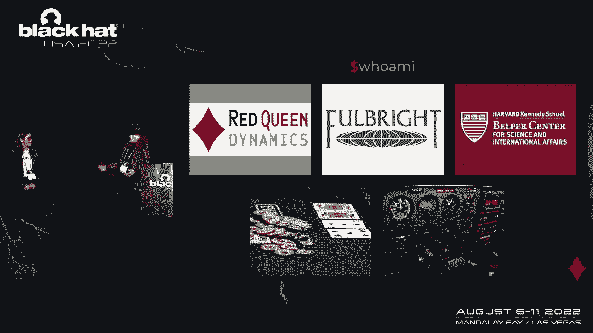
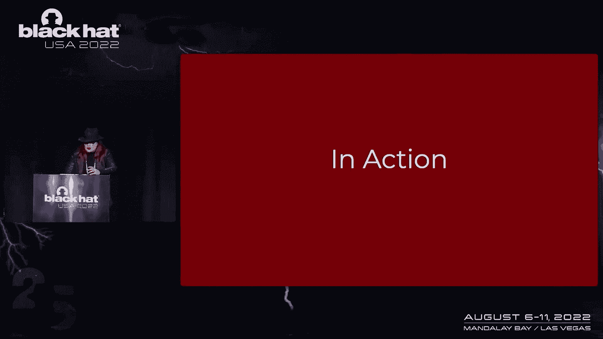
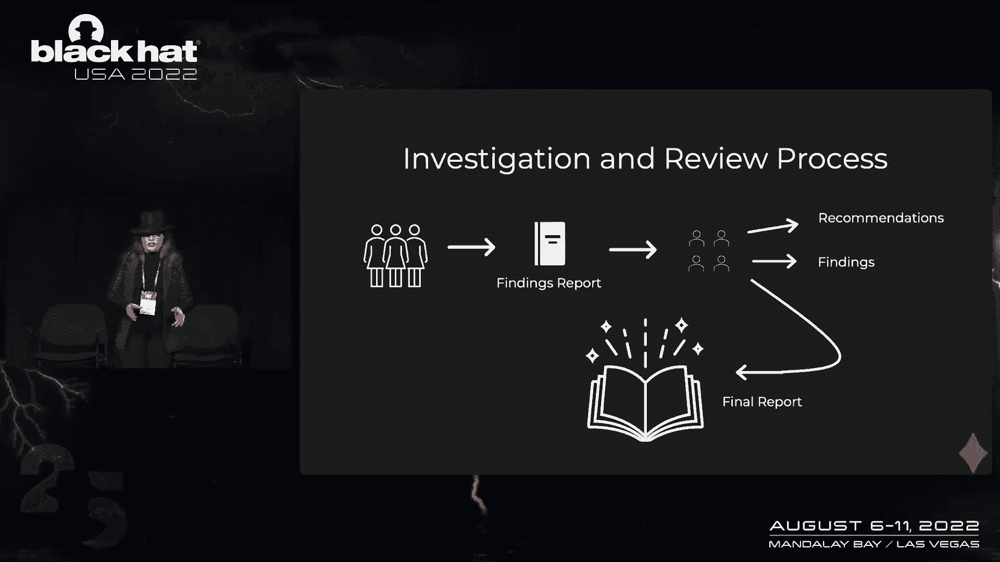
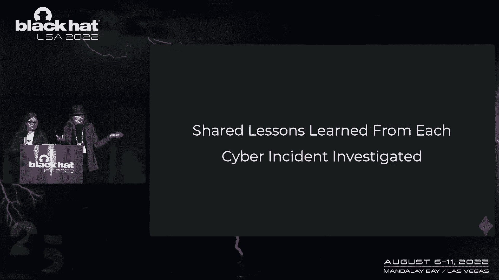
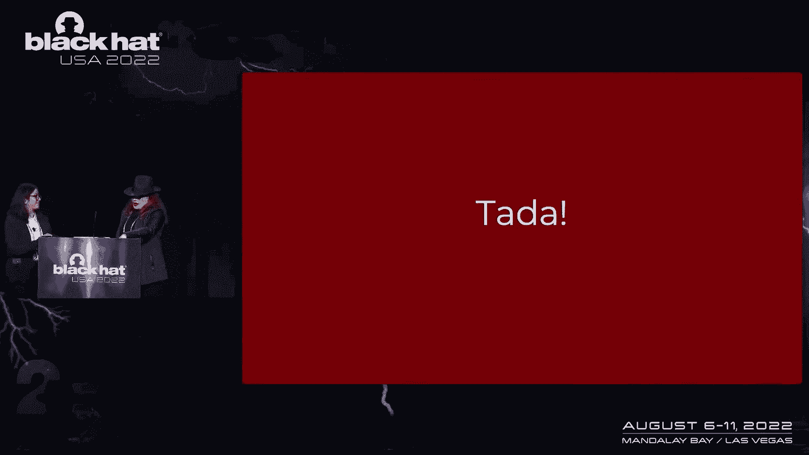

# 【转载】Black Hat USA 2022 会议视频 - P37：039 - No One Is Entitled to Their Own Facts, Except in Cybersecurity？ - 坤坤武特 - BV1WK41167dt

在我们了解自己之前，我们首先要注意的是，我们今天在这里谈论的并不隶属于我们所有的组织，今天所有的内容都是我和塔拉的，所有的权利，所以介绍一下我，我毕业于巴尔的摩的约翰霍普金斯大学。

以东亚研究学士学位进入流行病，经济学与国际研究，和历史上的辅修，嗯，当我毕业的时候，我以为我真的以为我会进入外交政策，我花了一年时间把中国带来，所以中国是我在疫情中的重点。

我在哈佛肯尼迪学院开始攻读公共政策硕士学位，我有一些要求来照顾我的第一年，我和某人一起上了一堂课，你可能知道，布鲁斯·施泰尔，人才在虚拟中不如在虚拟空间中，所以第二年我又回去找他，和他在一起的快乐。

他带着玩具教大家蓝牙设备的危险，我很想稍后再讲这个故事，那个夏天我需要一个实习机会，我碰巧申请了贝拉研究中心的助教奖学金，我就是在那里遇到罗布·阿奇的，他是这个项目的负责人，还有可爱的塔拉。

我对Dunkin'甜甜圈充满热情，但我不是在这里说，很好的咖啡，没人说Dunkin'甜甜圈是一种生活方式，我会在空闲时间死在这座山上，我喜欢编织，我喜欢旅行很酷，我想以前，3。我自我介绍一下。

是想告诉大家，这不仅仅是维多利亚的第一次黑帽子演讲，这不仅仅是她的第一次网络安全演讲，这是她第一次演讲，所以你只能从这里下去，老实说，太神奇了，祝贺维多利亚首次亮相，你好，我叫塔拉•惠勒。

今天下午和大家在一起很愉快，我和红皇后动力公司的首席执行官，合规编排和安全教育公司，我是富布赖特学者，为美国和英国在网络安全方面，当然是在哈佛贝尔弗中心，在那里我遇到了维多利亚。

并开始从事航空经验教训项目，罗布·肯塔基和亚当·肖马克，所以我有一个很好的机会来了解维多利亚，在这个项目上工作，我想我在这里的原因，我喜欢这一切的原因，尤其是风险管理，我既是扑克玩家又是飞行员。

所以这真的击中了我的要害，这个问题，我们如何在组织中管理风险的概念，我喜欢这样做，我是一个巨大的风险书呆子，我想出于某种原因。

所以今天真正让我们聚集在一起的是什么，问题是，为什么像飞机失事这样的网络事件，我想做什么。

告诉你一些这个项目的历史，把它交给维多利亚来解释更多关于我们今天要做的事情，所以在过去的三四十年里，我们一直在用NTSB的类比，这是一个很好的方式来描述调查应该如何产生一个事件的共同历史。

对它的共同叙述，我们在网络安全方面面临的挑战之一，我们不分享历史，我们不会对事故中发生的事情进行全行业的描述，并将其用于未来的经验教训和未来的预防，所以当罗伯和亚当一起创建这个项目时，他们采访了。

然后我们采访了一百多位不同的专家学习航空课程，以及在NTSV进行调查的过程，并开始问这在网络安全中会是什么样子，去年11月，我们发布了从网络事件中学习的报告，一百多页，我们绝对鼓励你现在不要读它。

但肯定很快就会了解更多关于人们的想法，我们如何在网络安全中建立共享的叙事，从一个做得非常非常好的行业吸取这些教训，当飞机失事时，我们很快就明白了为什么，然后第二年，一些新规定出台了。

所有飞行员在做这个项目的过程中都必须处理好。

我们意识到不仅仅是我们不断面临着永久的威胁和攻击，人们还没有真正弄清楚如何重复和改进预防过程，因为我们开始意识到，在网络安全方面，试图保存信息的挑战，秘密，试图让它靠近。

意味着我们永远在打这场艰苦的战斗，向业界和社区传播信息，关于事情是如何发生的，以及我们将来能做什么，这不仅仅局限于一些承包商未能更新支柱箱，这就是Equifax发生的原因，或者有人没有推送B更新。

这就是Wannacry发生的原因，所以我们想问自己，为什么网络调查。

编写这些报告的情况，不像飞机失事，嗯，我们不维护共同的历史，同时也是，我认为这真的很重要，航空业如何调查和了解事件，他们做了什么来防止未来的事情，现在。

我喜欢维多利亚的原因之一是她阅读了Max的每一份文件，在七号上，三个，七起最大撞车事故，NTSV制作的每一份调查报告，和美国联邦航空局，所以报告，书呆子，你能告诉我们更多关于为什么。

以及NTSB是如何创建这类报告的，我们可以从他们身上学到什么，我肯定会怜悯你们所有人，不会把你们拖过黑洞，我去研究这个，但我真的玩得很开心，所以我很乐意多聊天，如果有人也对这类事情感兴趣，嗯。

但这是一个很好的方式来看待我们现在的差异，NTSB对航空事故采取的简化方法，以及我们还没有开发出的那种随意的方法，网络安全是看波音737MAX，NTSB是如何处理的，所以在2018年。

狮航航班首次坠入爪哇海，从雅加达出发后，数据记录告诉我们在短暂的飞行过程中，飞机左右两侧的迎角传感器，我们报告了不同的测量结果，这迫使飞机的机头，它触发了mcast系统，迫使机头下降迫使飞机俯冲。

飞行员反复对抗mcas系统以控制飞机，把鼻子抬起来，但在成功地做了多次后失败了，飞机坠毁了，同样的事情也发生在埃塞俄比亚的航班上，起飞后，平面的节点向下倾得太远，在攻角误判后，从左右传感器。

飞行员多次试图抵消它，最后失败了，飞机坠毁了，联邦航空局宣布航班停飞，印度尼西亚和埃塞俄比亚，运输机构将他们自己的报告联系起来因为这些事件是在国际上发生的，NTSC起辅助作用。

但是NTSB的最终调查报告在这里真的很重要，因为不仅涉及到事件本身的细节，但是波音公司的失败，来解释麦卡斯特系统是如何相互作用的，驾驶舱里有其他警报，以及这些警报会如何分散飞行员的注意力。

使他们无法做出反应，正如建筑所期望的那样，并指责联邦航空局没有注意到故障，和波音公司最初的假设在那些安全程序中试图，一次又一次地做不到完全相同的事情，在事件中间开始听起来很熟悉。

但我们处理这些事件的方式是有区别的，在网络安全方面，以及他们是如何在NTSV和联邦航空局开始处理的，我们一直在很好地处理网络事件，产生了大量的报告，基本上，我们面临的挑战之一是我们已经从政府。

政府报告让私营企业拥有智囊团也能产生这种信息，一号哨兵，这是一个，这是一份参加这次会议的人的名单，对呀，这些人给这个行业提供了很好的信息，但缺乏协调，关于是什么导致和制造了这些事件的总体一致。

所以我们开始让更多的委员会参与进来，专责情报委员会，内部监督和改革。

科学基础和技术，我不知道该怎么解决这个问题，除了走到一起认识到，有办法进行调查，我们不是指事件反应，现在不是我们把电缆从墙上拉出来的时候，每个人都在努力恢复网络，好吧，这是在每个人都喘口气之后。

睡了三四个小时，有机会问这个问题，发生了什么事，我们如何防止这种情况在未来再次发生，这是关于调查发生了什么并产生对原因的理解，以及这种工作需要如何进行，维多利亚亚当和我在过去六个月里所做的。

是创造一个剧本让城市、州和国家政府进行事件调查，设立事件调查委员会，然后进行自己的调查，现在你可能会问这个问题，不要，我们已经有一个了，不要，我们有一个CSR B，答案是，在这份报告生成的同时。

DHS的CSR B正在创建，我们提出的建议，看起来很多，就像CSRB是为了在DHS提供不同的功能而设计的，所以我们在这里稍微调整了一下，而是，城市有一条路，状态，县，部落政府进行事件调查。

这将开始在行业中创造大量的信息，以及我们需要如何开始创建这种板，是三个阶段的调查，就像NTSB做的那样，这是给谁的，我想，你要想象，告诉我们刚刚在医院发生了勒索软件事件，我们把病人救回来了。

我们又恢复了网络，但你有一个月的时间告诉我发生了什么，去调查一下，给我一些关于我们如何防止这种情况在未来再次发生的理解，政府中的那个人不太可能有经验，支持一项重大的网络调查。

这是告诉他们如何做到这一点的剧本，所以维多利亚会告诉你更多关于这看起来像什么，如果只是因为，她是阅读了过去二十年来国家运输安全委员会每一份报告的人。我想告诉你如何吸取这些教训，并将它们实现到这个剧本中。

所以调查的三个阶段，剧本本身是仿照NTSB的航空调查手册制作的，我读了它，你们都不必，调查的开始，是事件发生的时候，那是董事会开会的时候，他们决定一个首字母，负责的调查员，谁将领导调查的技术小组。

在整个调查过程中，它都是一个路标，他们为调查设定了目标，并可能邀请其他缔约方，其他公司派出技术小组成员，并作为调查的当事方，然后我们进入技术调查，我们把技术调查和审查部分分开，创建了两个独立的团队。

所以技术调查是战术性的，配备了一个技术团队，他们是专业人士，每天都这样做，他们是那种会对最初的事件做出反应的人，做整个最初的事件反应，他们将分析报告，从缓解进程中产生的，希望他们能拿到硬件。

而且这些团队成员现在已经完成了，该阶段进入董事会审查，那是在董事会成员召开的会议上，他们查看技术团队生成的报告，他们决定，好的，作为董事会我们会向社区提出什么建议，以便在未来像这样的事件可以减轻。

或者至少通过遵循这些建议来减少伤害，那么这些董事会成员是谁，我们把它分成了四种人，你会想要在黑板上，首先是个人，这些都是在该领域备受尊敬的网络安全专家，他们有独立于其附属组织的可信度。

一个很好的思考方式是，如果你坐在这里，你将来可能会被征召入伍，对不起，对不起，然后我们有公司，这是因为工业在网络安全行业拥有巨大的力量，然而，我们想指出的是，对调查结果有既得利益的公司，比如说。

在攻击过程中使用了软件的公司，你应该回避，如果他们已经是审查委员会的董事会成员，对不起，我们会注意到，我也是，对调查感兴趣的各方有一个时刻，稍后提交资料，如果你是这个行业的公司，或者做出贡献的身体。

至少有一些正在研究的技术，在那种情况下有一个利益问题，最好尽可能保持它是一个无私的奖项，接下来我们有政府机构，常客，如何在网络安全社区中发挥重要作用，所以他们在桌子旁有一个座位，他们有重要的视角要添加。

但他们不应该是整个董事会，他们只是其中的一部分，最后是学术组织，所以它们会很有用，谁是一个技术团队，就像，我说，这些都是专业人士，他们有能力做硬核的类比，事件类比分析，他们提出了一份调查报告。

然后由董事会成员阅读，他们可能没有技术背景，然而类比可能会是他们使用的更有力的东西之一，在创建该报告的过程中，我想在这一点上我们都知道，所以我们在这里要注意的是，我也是，当我们写这个的时候。

我们意识到了一些非常基本的东西，我想我之前给你的类比，城市副经理被要求制作一份报告是很漂亮的，你知道的，情况的典范，大多数人发现自己在，嗯，我们我认为作为一个行业，作为一个社区。

在这一点上知道人们不会对网络安全做什么，直到他们不得不，会有一个沉淀，导致地方或州政府建立，重大网络事件调查委员会，对呀，至少第一个，有人会有东西掉在他们的腿上，他们不知道该怎么办。

所以我们在这个剧本中有危机模式的原因，你会在哈佛贝拉报告中看到它，它将在突出显示的文本中，在以后的降价中，你会看到一点，它也被突出显示了，你们都可以有机会关注，编辑和评论，我的降价需要一些改进。

所以危机模式是小插图，告诉你，如果你是一个从来没有这样做过的人，绝对关键的要点是什么，例如，当我们谈论，谁会被放在木板上，什么，一个会被列入调查委员会的人的品质和特征是。

我在危机模式下给出了一个快速的捷径，快速的捷径是如果你不知道该把谁放在木板上，确保有四个人，你可能是政府的人，已经适合个人了，去看看你当地的Isaacca章节，ISC章节或B面。

因为你可能会在离你一百英里的地方有一个学术组织，去你当地的，信誉良好的学院或大学，问问计算机科学系主任，帮助或推荐大学内部的人，这给了你找到能帮助你的人的快速捷径，对呀，对于大多数从未这样做过的人来说。

好像好像有点，很容易告诉人们，你需要挑选几个不在政府工作的人，但事实是，许多在政府内部进行这种调查的人，他们从来没有想过要问身体以外的人，他们在里面工作，他们不会想到去找我以外的任何人。

他们在市里的哪个部门做这个调查，提出建议是非常重要的，接触外部专家，不仅是为了与工业界联系，并通过学术界提供可信度，但也要确保工业界能提供资源和专业知识。

这通常是在一些最受尊敬的技术和信息安全公司内部发现的，这就是危机模式，你会看到像这样的快速动作，以下是你要采取的十个行动，以下是要回答的十个问题，你需要让五个Y回到过去，为什么为什么。

为什么要避免单点故障，以及人们陷入的根本原因分析思维模式，这就是危机模式。

这是剧本的一部分，那么这在行动中是什么样子的，所有的权利。

所以拿着，比如说，一家大盒子零售店最近成为销售点袭击的受害者，我们不打算指名道姓，你可以自己想象，我们Telstar的那个大盒子会是什么，我丈夫来了，我刚刚想起了我们必须在家里做的这个家装项目，现在。

发生了一起袭击事件，他联系了一群人，警察，终于有人把他送到州长那里，州长把旁边的人转过身来说，好的，谁来处理这个首席书呆子，首席信息官，那是你的工作，弄清楚，首席信息官，危机模式，他们有剧本。

他们开始转向危机模式，第一步是他们开始形成一个板，他们找到网络安全专业人员，他将作为个人，接下来他们会从一个学术组织找到一个人，所以木板是在一起的，他们去了IT后就去找技术团队。

此时董事会上的所有人都通过他们的网络，他们找到受人尊敬的技术专业人士，他们可以在技术团队中服务，然后我们在审查过程中开始实际的调查，技术团队进行分析，他们提出了调查结果报告。

然后将调查结果报告交给董事会审查，在短时间内董事会成员有时间审查调查结果报告，他们聚集在一起，他们提出建议，他们对调查结果进行投票，以包括，在最后报告中，这里有一件事要注意。

为这个技术团队找到人是非常重要的，谁会说话不是书呆子，不是书呆子的翻译过程，翻译矩阵非常重要，我们之前差点说错了，大量使用了类比这个词，而是技术团队中的某个人，他可以向州和地方官员解释。

为什么以及如何发生在每个人屏幕之外的事情在医院变红了，或者有人没有修补盒子，因为在那一刻很容易，对于一个不了解很多过程的人来说，我们会在政府中看到这种反应，就像，我们会要求他们补得更快，伙计。

如果我们能命令每个人更快地修补，现在没有人会在这里，我们都会喝酒的，所以我们的问题是人们不一定明白如何翻译，以一种会导致正确动作的方式，我们见过不懂航空的人，会宣布需要立即发生的事情。

导致过程失败和过程适应的程度，而不是真正理解如何，一个有缺陷的麦卡斯特系统为737MAX工作，又容易了，太简单化了，我们需要不简单思考的人，但可以简单地向人们解释发生了什么。

以及他们如何在这个过程中工作，如果你对为什么会发生这种事的回答，在指指点点，而不是告诉你你在和专家说话的两个神奇的词，看情况，那么你就会有一种情况，技术发现将被埋葬在，无论那一刻发生了什么政治。

这就是为什么保持一个无私是如此重要，有能力的技术团队和董事会，对正在发生的事情和已经发生的事情做出连贯的反应，因此，建议和调查结果需要写得一目了然，英语或任何当地语言，以确保人们理解发生了什么，为什么。

最重要的是，他们如何预防，所有这些都需要进入最终报告，嗯嗯，这份最终报告应该是公众可读的，因为我们希望它尽可能公开和广泛地获得，我们建议托管它，或者梦想的场景是它托管在公共图书馆的网站上。

就像波士顿公共图书馆会主办它，这样每个人都可以访问它，它没有隐藏在某个公司的网站上，绝望地，绝望地，绝望地希望没有连杆发生，这是一份稳定的文件，我们有，我们喜欢图书馆有很多不同的原因，首先。

图书馆的功能比简单的借书要多得多，正如我所想的，我们这些看到我们社区图书馆提供服务的人，在过去的几年里，可以回忆起这一点，但图书馆也是中立的，这在当下非常重要，嗯那个。

我们想要的最终报告必须集中在这样一个想法上，有多种原因，为什么会出现进程故障，和多个地方，您可以为将来修复进程失败，想象一下，例如，我们没有认识到太阳风是失败的，一年半多后又一次。

我们没有一份连贯的政府报告来说明发生了什么，为什么，想象一下每一份报告，每一种事业，对一起网络安全事件的分析归结为，然后将生产服务器的密码设置为Solarwinds，一二三右，我们要避免的是。

这是一个单一的答案，我们试图让人们问背后的五个谎言，第二个问题是什么规则和补偿控制没有到位，有这样的结果，为什么在那之前，预算过程是什么，合规程序，缺乏专门知识或培训，让这些补偿控制或技术过程到位。

没有人抓住它，关注这些过程的人是否缺乏不同的想法，因为如果我们把每一个事件都归结为井，实习生做的，或者承包商没有修补支柱箱，或任何其他形式的根本原因分析单点失败，我们失去了实际发生的所有丰富的东西。

我想这里的每个人都知道这些事件都很复杂，有趣的是迷人的，对于我们这些喜欢研究这些东西并理解它的人来说，我是，我喜欢这个领域，作为一名学生飞行员，我每年都能看到远处的最新规定。

这是联邦航空条例和飞行员指导手册，我明白为什么，以及每年的法规是如何变得更好的，然后我开始亲自负责了解这些，每年我们都在谈论这种工作是如何的，好像磨磨蹭蹭的，但其中有如此的快乐。

当你看到人们终于明白发生了什么，我记得Wannacry发生六个月后，英国的NCSC发布了一份关于Wannacry的非常棒的报告，发生了什么事，事情是怎么发生的，预算过程失败，地理位置，所使用的技术名称。

什么是更新的，什么是没有更新的，缺乏技能和缺乏升级，这在特定的地方造成了它，这是一份漂亮的文件，如果你有机会读它，这绝对是我们想看到的事情。

从这个过程中走出来，这就是我们希望看到的最终报告，那么这对未来应对网络事件的组织意味着什么呢。

我们希望发生的是组织，状态，地方政府采取了这一策略，在全国各地建立了自己的MCV，所以会有多个委员会调查他们附近发生的事件，或者对他们的重要性，我们开发了这个共享的经验教训叙述。

不仅仅是像大型网络安全事件，但是在小的上面，然后我们接受这些，我们吸取教训，我们在此基础上再接再厉，他们传遍了整个社区，我们减轻了这些事件造成的损害，我们防止它们在未来发生，希望我们已经看到。

拥有这些不仅仅是重要的，那些事件调查委员会很早就成立了，虽然是危机模式，我们知道至少第一个几乎所有地方都将处于危机模式，这将是，这将是一个突然的事件，而不是经过深思熟虑的计划。

但我们也真正希望发生的是我们希望，当我们回去研究是什么导致了一个历史性的事件，在一些随着时间的推移发生的更著名的违规行为中，就像，例如，OMB漏洞，对呀，嗯，我们所希望的，当你回去寻找发生了什么。

以及如何防止将来发生这种特殊的事件，对现在发生的事情有一个共同的理解，很难让这个房间里的每个人都同意，一些最基本的事实，世界上存在的最著名的网络攻击，这就是我认为我们要解决的挑战，我个人遇到过这个。

当试图找出何时何地发生了什么时，在世界上一些最重大的事件中，不是佩查，想哭震网，我遇到过一些人，他们认为这没什么，对发生的事情有一个看法，而不是回去看，然后你回去发现再也没有信息了，托管的信息已经消失。

被拉到付费墙后面，一个相当著名的事件是Broadcom对Symantex的收购，白皮书，事情发生得很快，它又被放了回来，但是每个人都依赖于很多白皮书，赛门铁克了不起的人，谁做了很多白皮书，很多。

这是一项严肃的研究，它只是被认为是营销材料，我们现在面临的问题是，我们在这个行业的许多共同历史，是营销随时可能消失的材料，这就是图书馆很棒的原因，这就是为什么我们希望看到这种信息在世界各地可用。

当然至少在美国是这样好吧。

所以我们现在想做的是，我们很乐意呈现，不仅贝尔弗中心就在这上面，非常漂亮，我不是一个视觉上的人，但我听说这个的视觉布局真的很棒，去争取吧，看一看，不仅是我们的网站。

你也可以在我们今天分享的几条推特上看到这一点，它就在哈佛的网站上，但我们也很乐意在接下来的两年里分享这一点，我维多利亚和亚当·肖马克将仁慈地口述，在一个GitHub项目上，这个项目存在于那里。

供任何人使用，这里是剧本的降价版本，请提交拉拽请求，维多利亚将挥舞铁锤，我们正在考虑伪造一个，会很棒的，我们会发现我们可以从社区中学到什么，什么是，在这样的剧本中设置一个板是行不通的。

你对此也有什么想法吗，请做吧，那是我的想法，我花了这么长时间写这个，我希望它能继续存在，这是相当真棒，所以是的，嗯，这一切都不会完美，对呀，就像我们永远无法让这一切变得完美一样，总会有事情发生。

我们现在看到的问题是仍然有组织，截至去年，26%的组织容易受到想要的影响，在二十七年仍然是，我已经筋疲力尽了，我想这个房间里的很多人可能也是，所以我们永远不会让这一切变得完美。

我想对于我们这些目前在组织中的人来说，在财富中的轶事，500家公司或上市公司，我参与了不指名道姓的，我想说平均来说，有四个单独的合理进口，中等或以上，事件调查，如正在进行的事件响应，这种事经常发生。

所以你并不孤单，很多这样的事情总是在发生，然而一旦我们收拾残局，就像我们把垃圾扔了出去，忘记了它曾经发生过，我们一次又一次地制造同样的混乱，我希望人们能从中吸取教训，这不会有任何好转，我也是。

我们现在看到了更复杂的攻击，嗯原谅我，因为我要说AI启用了凭据填充，它有一个技术上的含义，我发誓我不是在用它，那将是营销，但当我在这里谈论这个的时候，我用它的专业术语。

我们正在使用对公开数据的统计分析来更有效地针对网络钓鱼攻击，这是大规模的自动鱼叉捕鱼，这对我来说真的很可怕，这是我们必须提前吸取教训的事情，否则，我是说，我们最终会遇到同样的情况，我们发现自己以前。

如果你做了你所做的，你得到什么，你说对了，任何人都可以为重大网络事件调查做好准备，每个人都应该做好准备，你的社区迟早会需要这个，我想在过去的两个小时里，我收到了三封不同的电子邮件。

就在那些需要帮助应对事故的人中间，勒索软件调查，就像你的LinkedIn收件箱里都塞满了同样的东西，我也是，对呀，需要更多的人知道如何去为自己服务，我们可以创造的知识体系，如果它在图书馆网站上公开存在。

我们不用担心，消失在付费墙后面，这就是为什么我们这么关心它，因为它不会变得不那么复杂，但至少我们可以开始预测未来会是什么样子，所以非常感谢你，以前能来这里真是太棒了，你有话要说，非常感谢，我太高兴了。

我要开始我的公开演讲了，黑帽网络安全，合二为一，很兴奋来到这里，很兴奋看到你所有的要求，拉拽GitHub文档上的请求。

