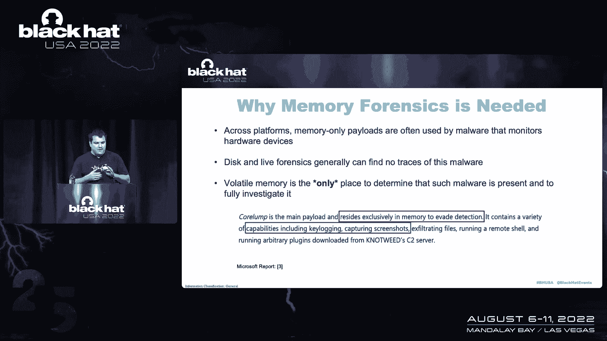
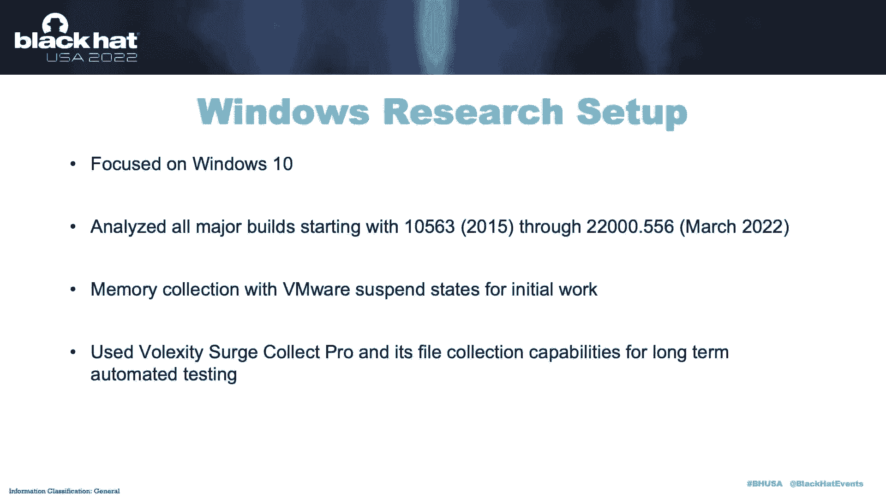
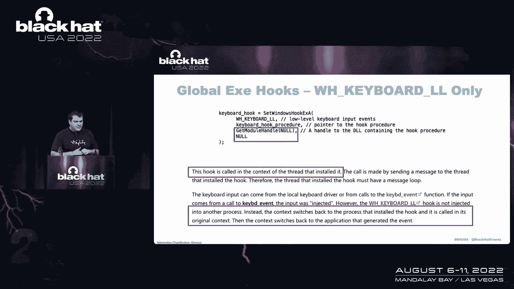
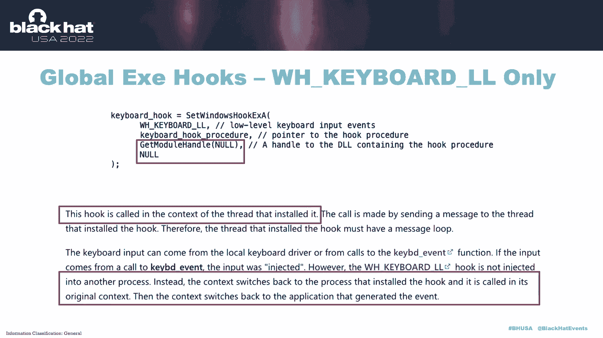
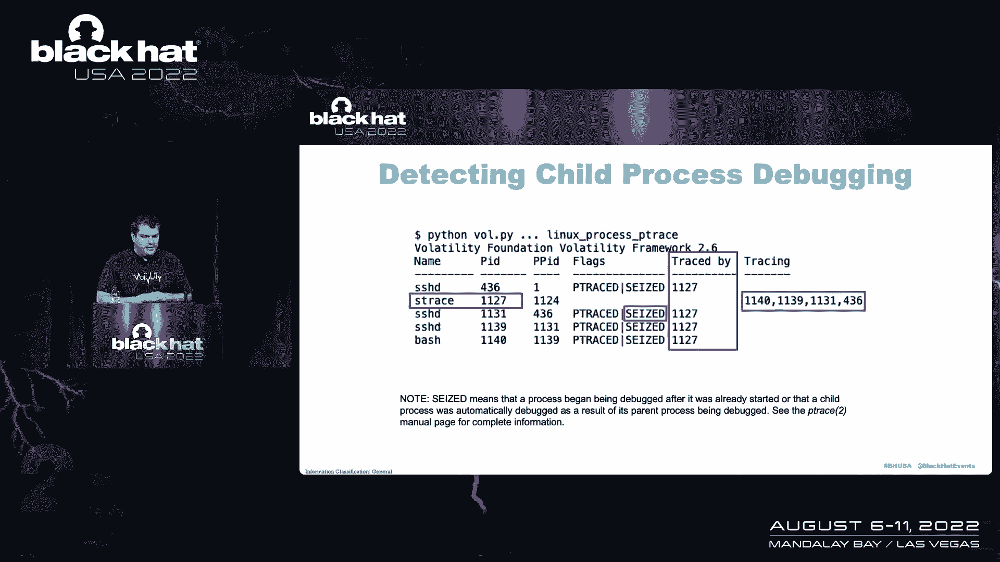
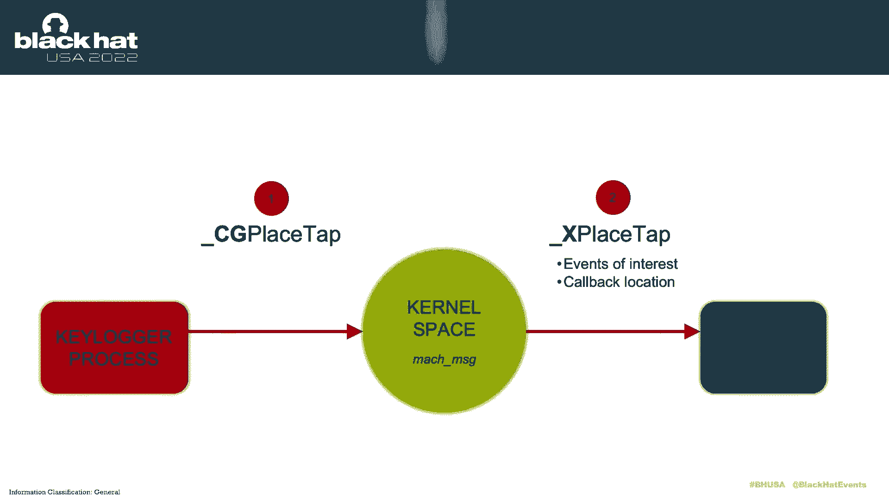
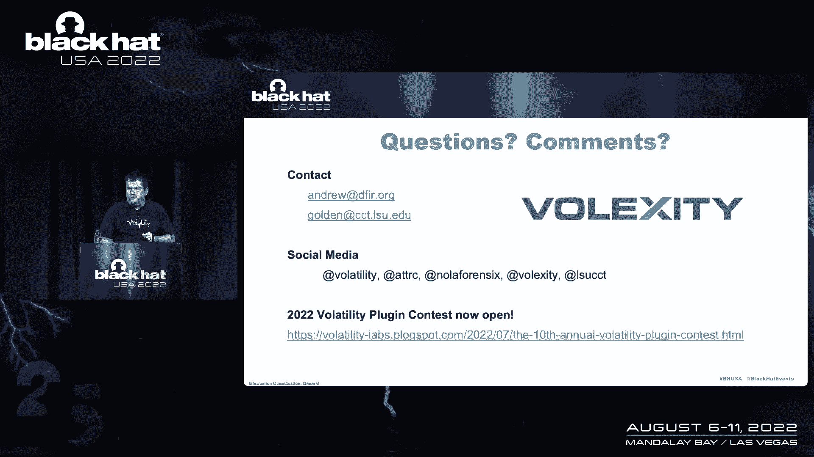

# P38：040 - New Memory Forensics Techniques to Defeat Device Monitoring Malware - 坤坤武特 - BV1WK41167dt

所以感谢大家今天早上的到来，我将向你们介绍，我们小组最新研究的结果，它是为了开发记忆取证技术，让我们自动检测和分析监视，硬件设备，如果你在事件响应领域工作，你可能一直看到这个恶意软件。

我们每天都看到这种情况针对我们的客户，如果您阅读了其他安全供应商的报告。

这几乎是普遍的，当你有一个有动机的威胁组织针对一个组织时，那是不是组织内部的一个研究小组，不管是高管，是否只是一个人，部署在这些机器上的恶意软件将利用对硬件设备的访问，获取真正敏感的信息。

在键盘上键入的一切，用鼠标的所有活动，你会看到麦克风被取样然后音频被运出，摄像机会被记录下来，这是由它制作的静态图片还是视频，所有被发回给那些攻击者的，因此，如果你是一个人，你是一个敌对的外国的目标。

他们的情报部门，你可能不希望你所做的每件事都在离笔记本电脑5英尺的范围内，转移到那些人身上，这样他们就可以利用它，当然，如果你想在组织内部保守秘密，在你的舰队中监控所有这些会让这变得非常困难。

然后我们想做的是把它带到我们的记忆取证，算法，我们的工具，如波动性，可以自动找到这些撕裂，这些内存不足，并使攻击者知道他们是否会使用这些类型的技术，他们很快就会被抓住，但不幸的是。

我们从现有的工作中知道，在我们现有的研究中，在我们工作之前存在和可用的算法要么已经过时，所以他们不支持Windows10或最新的Mac，它们是不完整的，所以我们知道恶意软件可以尝试现有技术的变体。

不会被抓到的，然后其中一些恶意软件的新工作方式是不存在的，所以我们当然可以通过逆向工程之类的东西自己解决这些问题，所以我们才知道我们丢了东西，但我们希望能够大规模自动化。

所以我们需要真正了解它是如何工作的，所以这变成了一个非常重要的研究项目，我们花了两到三个月的时间来进行大量的逆向工程源代码分析，让它工作，但我们想做一个非常彻底的工作。

所以我们从一开始就收集了我们内部的每一份恶意软件报告，以及所有我们可以在网上找到的，我们列了一个API列表，处理恶意软件的子系统会滥用来访问硬件设备，然后我们花了很多。

许多晚上和周末在IDA Pro和其他工具，弄清楚这些API是如何在系统上实现的，然后我们开发了概念验证应用程序，所以我们看到恶意软件在做什么，我们想用一种受控的方式自己实现这一点。

所以我们知道我们的工具在工作，我们想让它成为我们在野外永远不会错过这个恶意软件的地方，前进，然后我们将开发新的波动性插件，所以就像我说的，我们可以用自动化的方式来做这件事，如果你在这个谈话中。

你可能对记忆取证感兴趣，或者可能知道这意味着什么，但如果你不太熟悉它，记忆取证如此重要的原因，我们花了这么多时间在，当你看到现代的攻击和现代的威胁时，使用的有效载荷，启动的工具集，真正重要的部分。

或者在某些情况下，所有的部分都只是内存，所以这意味着没有任何东西被写到磁盘上，如果你重新启动那台机器，你所有的法医证据都消失了，没什么好看的，正如你所想象的，所有从运营商发送的数据都在网络上加密。

所以即使你是一个有完整pcap的地方，那没什么帮助对吧，所以我们希望能够从机器上获得内存样本，然后深入分析，查找此类恶意软件，就像我说的，这种类型的恶意软件一直在使用，整个星期还有其他黑帽会谈。

人们在炫耀他们的新内存框架之类的。

但我在底部的这句话，或者我强调的这张截图，这是一个完美的时机，这真的是在我上周看幻灯片的时候说出来的，我把它加进去了，微软基本上把这家公司赶出了澳大利亚，出售商业间谍软件并被世界各国政府使用的澳大利亚。

真的很有趣，微软就像摧毁了他们一样，把它倒转到每一点，它所拥有的所有能力，但一开始你会看到我用红色突出显示的东西，他们发现并发布的工具集的所有功能都只是内存，所以这是一周前的一个例子。

当你被有动机的演员盯上时，你会被只有内存的恶意软件击中，所以我们又看了看窗户，Linux和Mac，我们从窗户开始，因为我们认为这样做需要最长的时间，这就是我要经历的，首先。

我们把研究重点放在Windows10上，这是我不知道的，大家马上更新，Windows XP将永远存在。

但我们现在在大多数调查中都看到了Windows10，所以我们想确保我们的算法是最新的，所以我们一直追溯到Windows10的第一个稳定版本，通过三月的最新稳定版本，我们有我们的记忆收集工具。

这样我们就可以做我们的研究，然后还保存内存样本，并加载这些概念的证明，这样继续下去，我们知道我们的工具总是有效的，我们看到的第一个恶意软件滥用的API是设置Windows钩子X，多年来。

这一直被Windows上的恶意软件滥用，它的想法和它被如此滥用的原因，它是非常强大的，你的恶意软件所要做的就是调用一个函数，在大多数情况下，当它调用该函数时，它将传递到磁盘上的DLL的路径。

它曾经注入每一个过程，然后恶意软件不必做任何事情，之后，Windows完成了每次进程启动时的所有艰苦工作，DLL被加载，一旦事件被触发，它做了所有艰苦的工作来确保，DLL寄存器的回调被触发。

所以每次按下一个键，每次移动鼠标等等，又是这样，这使得恶意软件非常好，如果您熟悉代码注入，就像，创建远程线程，虚拟Allox，恶意软件不必做这些，操作系统为它做这件事，所以在波动性内部。

我们有一个叫做消息钩子的插件，已经存在了很多年，但它从未在Windows10上正确更新，当我们真正研究设置窗口时，钩子x在野外的用法，我们意识到它有一些变化，我们没有检测到，我将要谈论的其中一个。

我其实不知道，我不认识以前知道这件事的人，所以这是不知道的事情，但我们想探测到所有的东西，所以这是一个查看设置窗口钩子X，恶意软件要设置的参数，第一个是你说，要监视哪个设备，键盘，鼠标等。

然后你必须发送的最后两件事，在大多数情况下，您将把路径发送到DLL，但我们会看到你不必这么做，然后线程ID的最后一个参数说，如果要监视特定线程，所以基本上，如果您只想监视一个应用程序。

或者如果要为特定用户钩住所有进程和应用程序，然后再次发送您想要监视的内容，您的代码在哪里，那将监控它，然后Windows为您处理，这是我们为这项技术开发的概念证明。

你可以看到我们有一个DLL叫做假DL DL，我们有一个函数，它将被注册并调用，每次使用鼠标，我们调用设置窗口，带有该DLL路径的钩子X，对于最后一个参数，我们设置为零，这和空是一样的，因此。

这将影响底部用户桌面上的每个进程，我们看到的是我们有的记忆样本，一旦我们的概念验证加载完毕，它的工作方式，你是在启动这个恶意软件吗，然后从此以后，在应用程序中移动鼠标的任何时候，在本例中。

DLL将被加载，所以我们查了一个记事本，我们打开了一个记事本实例，把鼠标移到里面，取了记忆样本，正如我们所料，记事本过程，现在操作系统加载了我们的DLL，但这不足以自动检测恶意软件。

在大多数进程中都会有几十个DLL，所以你不能只看DLL列表，我们只是在这里这样做，以确保我们的后门加载正确，对不起，所以要真正检测这些钩子，我们必须检查Windows的GUI子系统，正如您所想象的。

这是闭源的，所以当我们说检查，这意味着需要大量的时间来逆向工程，呃，内核中的132K子系统，所以在一个非常高的水平上，当您登录到Windows系统时，该系统将创建一个会话，该会话将创建一个窗口站。

本地机器上的那个，你已经可以尿在系统里了，与台式机相关的是我们需要追踪的两件事，第一个是原子表，它基本上是一组与桌面上发生的事情相关联的字符串，在这种情况下，将有一个字符串用于DLL的完整路径。

用来实现钩子，然后你可以在底部看到，在黑匣子里，有一套钩子，记住API的名称是设置窗口，hokey x，所以这将存储所有监控桌面的应用程序的信息，就像我说的，最初消息钩子插件非常不一致，在大多数情况下。

对Windows10没有产生任何结果，所以我们要做的第一件事就是反转所有的偏移，对于不同的Windows十个版本，但后来我们注意到，当我们这样做的时候，我们没有得到回DLL的路径。

所以记住我们有我们的钩子，知道哪个DLL实际上在实现它，我们得看看原子表，这太令人沮丧了，因为它真的起作用了，我们一开始创建的样本都没有，所以我们说好吧，我们得回到画板上快进。

在Ida Pro呆了几个小时后，这就是你在幻灯片底部看到的，所以对于每一个版本的Windows回到XP，但在十点之前，你有一个叫做用户原子表句柄的东西，那是你的琴弦表，波动性，知道怎么找到它。

然后从Windows10开始，看起来微软刚刚重新实现了整个子系统，所以我们必须通过Ida来解决这个问题，现在我们有另一张桌子可以检查，所以消息hoplug in现在分支正确。

它知道它是在看7号窗口还是10号窗口，我们把那些路找回来，所以现在只需运行插件，即使在最新版本的Windows10上，你得到DLL放置钩子，您得到DLL内部的偏移量，那个钩子在哪里，如果你熟悉波动性。

你知道你可以在那一点上把它提取出来并开始逆转它，设置Windows钩子X的第二个变体，这是一个有点令人震惊的，就像我说的，但一旦我们发现，我找了一堆我认为是专家的人，比如Windows内部和恶意软件。

没人知道这是可能的，所以这个想法是它只适用于低级键盘钩，所以你在钩住键盘，你会得到每一次击键的低级，但是当您调用set windows hook x时，你说我不会给你一条通往钻头的路。

但我仍然想在桌面上钩住每个进程，这真的没有意义，所以你把它叫做，你看上面这里，您给出的dll是您自己的可执行文件，这显然不是可以注入到其他过程中的东西。

我们发现这份文件并不容易找到，但我们最终找到了你在MSDN幻灯片底部看到的东西，这就是真正疯狂的地方，所以微软的意思是，如果您想要本质上的密钥日志，系统上的每个进程，您不必在这些过程中添加任何代码。

您根本不必钩住这些进程，您只需运行自己的进程，然后微软或Windows会做。

发送代码的所有艰苦工作，反正击键，在机器上，你有点明白，如果进程被密钥记录，如果进程有针对它的恶意操作，您可以提取该进程的内存，您可以调试该进程并找到恶意软件，在本例中，键盘记录的所有进程实际上都为零。

任何你能看到的，这一切都在系统上的另一个过程中，所以我不知道还有什么地方会发生这种情况，很奇怪，所以我们想确保我们能检测到它，这是波动性以前得到支持的地方，就像一旦我们让它在Windows10上工作。

但输出不是特别有用，所以我们在这里看到的是三个输出块，大家可以看到，它们之间有空隙，但第一个是全球信息，所以波动性在说嘿，有一个低级键盘钩，那是钩住每一根线，它告诉我们它在哪里的地址。

但它不知道是哪个过程，它在其中是相当无用的，对，你说你在一个桌面上有50个进程，你不会在50个不同的过程中去那个地址，并查找恶意代码，所以我们回去倒车了一会儿，我们发现在每个线程的基础上。

当我说线程的时候，想想过程，所以在每个线程的基础上，有一个标志被设置，如果该进程设置了钩子，所以你在后两个街区看到的是PowerShell，一个是假的，然后对于GUI测试仪。

所有的过程都有一个真正的打印消息钩子以前没有打印过，那就是我们，那是我们解析那面旗子说嘿，有一个全局钩，不是强力外壳，”她说。这是GUI测试仪，你会看到很多，因为这是我们的概念应用验证，所以再一次。

这是一个非常奇怪的边缘案例，这是系统上的关键日志，记忆取证以前对此一无所知，那么set windows hookie x的最后一个变体又是，您可以选择要监视的设备，这不仅仅局限于键盘。

您可以向它发送到DLL的路径，也可以像以前一样发送空，但您将针对特定的线程，这也是一个过程，所以如果你只想在Web浏览器上键入日志，密码管理器，不管是什么，你可以挑那个。

然后你不会让你的代码进入每个过程，网上几乎没有关于这个的文档，所以又一次，在IDA Pro中有更多的时间，如此脱离线程，所以我们之前在两张幻灯片上看到的。

在那里我们看到了一个PowerShell和GUI测试仪，数据结构内部的所有内容，在内存中，它表示有另一种每线程原子表，引号中的原子表，因为它不是一个通用的原子表，它只是存储与该线程关联的dll。

但一旦我们发现了这一点，我们能够更新插件，然后找到这个钩子的变化，就像我之前说的，这种类型的钩子变化根本不知道波动性，当我们第一次让它工作的时候，当我们发现我们必须深入线程时，我们有你在顶部看到的输出。

和模块七，这显然不是通往DLL的路径，那是在说，我知道字符串表的索引是七，但我不知道怎么找到绳子，然后我们计算出了每个线程原子表，您可以在底部看到更新后的输出，我们仍然能够恢复DLL路径，所以现在。

据我们所知，无论如何设置Windows Hokey X用于密钥日志系统，我们可以自动找到它，我们看到的Windows上的第二个API叫做注册原始输入设备，这是执行密钥日志记录的另一种方法。

你的很多EDR系统会寻找设置Windows的调用，钩子X，显然他们并不完美，我很清楚这是可以绕过的，但他们确实做出了努力，所以恶意软件开始使用这个API，而不是实现本质上相同的目标。

当你调用这个API时，你需要使用一些常数，所以你基本上就说我想把一切都钩住，我对键盘很感兴趣，这与只是通过一条路径到一个dll有点不同，不过在这种情况下，你应该告诉它你想瞄准哪个窗口。

所以如果你还记得我们的图片在我们到达用户的桌面之前，然后我们需要看看原子表和钩子来弄清楚，这有点不一样，我们不会重用这些相同的数据结构，然后你在底部看到的是我们概念验证代码的一部分。

我们有回调函数或钩子函数，它被称为W和D proc，我们叫注册班，然后创建与该函数关联的窗口，所以这意味着每次消息被传递到那个窗口时，我们的函数将被调用，一旦我们的密钥记录器激活，在键盘上键入的键。

这是回调函数实现的一部分，您可以看到WM创建，创建窗口时，我们要说注册原始输入设备，所以从此以后，每次在机器上创建窗口时，你打开铬，创建新选项卡，任何创建窗口的应用程序，我们会自动钩住它。

然后当窗口开始产生输入时，也就是有人在键盘上打字，我们可以读出密钥并记录它或通过网络发送它，以前没有对此的记忆法医支持，所以我们发现所有这些相同的数据结构，我们正在获取线程和过程信息。

我们可以检查第二组表格，它会告诉我们所有使用API的过程，这是一个全新的插件，叫做原始输入设备监视器，我们写的是为了实现我们刚才说的，正如你所看到的，它告诉我们。

桌面上的GUI测试都是我们概念验证的过程，窗户的名字是我隐藏的窗户，这样它就会在输出中脱颖而出，我们有钩子所在的地址和进程ID，我们可以从内存中提取可执行文件，然后真正开始弄清楚发生了什么。

所以我们针对Windows的这两个功能，接下来我们看的是Linux，我们一直在处理Linux调查，尤其是在云端我们仍然能看到一些有用的东西这很不幸，是滥用调试设施，所以在Linux上，你有p跟踪功能。

这就是让进程在Linux上进行调试的原因，然后你就有了S的痕迹，这是一个非常流行的工具，可以跟踪应用程序进行的系统调用，如果您不熟悉系统调用，任何时候你想与硬件交互，网络，另一个过程。

您必须进行系统调用才能做到这一点，很明显，通过监视系统调用，您可以监视任何硬件设备，不管那是键盘麦克风，摄像机等，您可以完全禁用此功能，因为这是一个安全威胁，但你可能知道，安全补丁并不普遍应用。

人们没有正确地配置东西，所以我们仍然看到它在野外被虐待，从检测的角度来看，我们希望能够在插件中检测到两个变体，用这个，这就是我们看到的直接调试，因此，如果在调试器下启动进程，在本例中。

我们在gdb下启动cat进程，所以凯特已经在GDB下开始了，也就是调试器，你可以看到进程ID是7，七，八七八八，然后我们写了一个新的插件，叫做Linux Process P Trace。

它将告诉您正在调试的所有进程，您可以在这里的输出中看到，我把它突出显示了，我们在CAT过程中获得GDB，猫的旗子是P追踪的，这告诉你它正在被追踪，然后你可以看到GDB，它在追踪它，七八，就是猫。

所以我们自动报告过程之间的交互，现在是一种极其危险的形式，我们看到了这一点，在现场经常使用调试工具来监视SSH守护进程，所以我们在这里看到的是我们在Linux系统上，SSH守护进程正在运行它四三六。

然后我们用s trs跟踪，显然，您必须是root用户才能调试运行SSH守护进程，所以我们不会重新启动守护进程，这不像当前登录的人，我们只是动态地连接到运行的过程中，所以一旦它在一个终端上运行。

我开了第二个航站楼，我冲进那台机器，你看到的是我登录，所以密码是秘密的，调试器直接读取的密码感叹号，因为为了这个过程，传递该信息的SSH进程，它将通过一个系统调用，所以你马上偷密码。

那么您看到的是我键入netstat命令，一次记录一封信，您可以看到netstat运行的位置，然后如果您熟悉Netstat的工作原理，它将读取procnet下的一些文件，弄清楚哪些连接是活动的，等等。

所以你可以看到这有多危险，对吧，如果使用SSH键，你会得到一点缓刑，但是如果你用密码登录，你有这种类型的恶意软件，您的密码正在实时登录，每次登录，以及您现在运行的所有命令，使情况变得无限糟糕。

你可以想象，如果勒索软件使用密码自动处理这种情况，然后进行横向运动，然后仍然不好，但不像勒索软件在许多环境中那样糟糕，您必须在多个Linux服务器上移动，到达你的最终目的地，所以你通过那些跳跃框。

每次登录，所以你可以想象如果一号盒子被这样的恶意软件破坏了，它得到您登录的密码，然后你去第二个盒子，这可能是您的内部凭据，你登录到远程机器的事实将是关键，也记录了，不管你用多少跳来确保安全。

恶意软件只是在整个过程中访问这些数据，所以这绝对是我们希望能够检测到的东西。

我们写信给CGDB，猫的互动也将为此发挥作用，如果你还记得，它在插头的第一行，我们的SSH守护进程获得了436英镑的报酬，你可以看到它在这里列出，然后追踪并没收，然后您会看到更多的sshd进程。

这些是生成来处理的子进程，当有人登录时，然后一旦您成功地验证了bash，或者你使用的任何一个外壳都会产生，你可以看到这也被调试了，所以如果我们看看S跟踪过程，我们看到现在是十一点二十七分。

跟踪列有它正在攻击的所有PID，或者它在监视，然后如果我们有很多SSH会话正在进行，就像在真正的服务器上一样，PID的数量将永远持续下去，如果你不熟悉Linux，C是什么意思，它在输出中实际上非常重要。

这意味着一个进程正在运行，以及在它仍然处于活动状态时附加到它的调试器，或进程开始时，基本上从一开始就是受害者，因为其父进程正在调试，所以这绝对是我们想重点关注的事情。

我们在Linux中寻找的另一个地方是输入事件，所以对于合法用途来说，这是一个非常方便的功能，它提供的东西很酷，但它也被恶意软件滥用，就像其他一切一样，所以它的工作方式是，如果您查看dev输入。

启用此功能的Linux计算机上的按路径文件夹，如果你有一个Buntu Debian，任何正常的didecro，它会在那里，基本上它制作了一个SIM卡链接文件到那个物理设备，所以在本例中。

我们可以看到键盘类似于事件零，你可以调用一个API，它实际上就像十行代码不断地读取这个设备并拉动那个设备，然后把任何东西送到它那里，它是键盘，所以你要向它发送击键。

所以我们写了一个新的插件来检测使用这个子系统的进程，它被称为Linux输入事件输入事件，你看到这里的输出，所以要注意的一件事是系统的登录守护进程，D要用这个，它在监视你的键盘，这样你就可以登录系统了。

所以这是意料之中的，但后来我们装了，呃，我们并没有真正为这个写我们自己的概念证明，GitHub上有一个名为日志键的项目，这就像是滥用这个子系统的概念证明，所以我们把它加载到虚拟机中，得到了内存示例。

然后你可以看到我们在录，所以在真正的调查中，就像过滤掉系统一样简单，守护进程登录过程，就像我说的，去访问你的钥匙，这样你就可以登录了，然后其他任何事情都肯定是可疑的。

接下来我们看的是Linux的一个特性，从安全的角度来看，这是非常痛苦的，所以我试着在幻灯片中突出显示，这是多么可笑，所以这个想法是你有一个进出控制电话，它是一个子系统，它存在于Windows和Mac上。

和其他操作系统中的代码，所以在应用程序中运行的代码可以要求驱动程序为它做一些事情，因为你可以想象你的过程，所以你可以用这个能力，所以不管出于什么原因，这都没有任何意义，Linux有一个请求，您可以。

为另一个航站楼问好，那不是我的，所以其他人登录了机器，我想在他们的终端输入流中注入一个字符，从Linux术语翻译而来，意思是我想为他们伪造击键，这就像精神上的疯狂，所以当你谷歌这个的时候。

而不是得到任何关于它的文档，前十个链接是关于由此造成的所有漏洞，由此传播的所有攻击，最后打开BSD删除了它，所以他们甚至没有尝试向后兼容，如果你在开放的BSD上打电话，事业要失败了。

但是Linux开发人员拒绝这样做，尤其是在那些共享的环境中，这是一个重大问题，从一个，呃，就像红队的视角，您可以将其用于一个简单的密钥记录器，你在左边看到的是我们概念验证的整个源代码。

我们用Python写的，所以更容易理解你的工作，您是否打开了另一个用户终端的句柄，然后你就会生吃它，这意味着你想处理进入的原始字符，然后你要从终端读取，所以如果你从某人的终端上读取，他们键入了一个键。

你基本上要把钥匙偷出来，那就不好了，因为用户会注意到他们在打字而什么也没发生，屏幕上什么也没有显示出来，所以你要做的就是阅读他们键入的最新字符，然后你用你在IOTL中看到的东西。

调用红色框中突出显示的最后一个内容，我们打电话是想说，嘿嘿，把人物，我只是为用户阅读并重新键入它，所以即使你打字超级快，你不会注意到的，你的角色被偷了，来来回回地重播。

但我们可以完美地记录他们所有的互动，通过SSH或Linux机器上的物理键盘，他们一直在记录密钥，他们永远不会注意到区别，所以我们再次希望能够以自动化的方式检测到这一点。

所以我们写了一个叫做Linux tti句柄的插件，我们在这里说的就像，我说我们在Python中的概念证明，所以我们正在捕捉这样做的Python过程，我们的探测工作方式，你会看到的，如果您阅读插件源代码。

我们看看我们的过程产生的控制台，所以它是为哪个用户产生的，然后我们看看它是否有另一个进程的开放句柄，一开始我们不确定，也许这会有假阳性，或者类似的东西，我们检查了几百个内存样本。

我们很容易从野外获得一切没有一个假阳性，因为你为什么要，你知道的，合法地想监视别人的终端，所以这是一个非常非常，这是一个很好的迹象，表明出了什么问题，然后我运行了ps aux插件。

它向您显示了命令行参数，因为对于进程名，我们只是看到蟒蛇，但如果你看看这些论点，这是GitHub上的另一个项目，称为SSH密钥记录器，滥用此功能，那个有点复杂，我们刚刚分解了功能，所以它适合滑梯。

但我们还在记录，然后我们最后看的是Mac上的Mac，你有所谓的事件水龙头，这意味着你可以点击硬件设备，这样你就可以轻敲键盘，点击鼠标，不管你想瞄准什么，它有点类似于设置窗口，钩子X在你告诉它。

要被调用的函数，当按下一个键时，这样你就可以偷了，但这是Mac内置的，帕特里克·沃德尔有一个很酷的工具，他的一个免费安全工具，当这些注册时，它会监控实时系统，所以我在笔记本电脑上运行这个，二四七。

因为这些很危险，但我们希望能够从内存中检测到它，以及法医视角，对于这个概念证明，我们用了另一个，我们从GitHub获取了另一个项目，并对其进行了修改，以使其在我们的环境中工作得很好，我在底部有链接。

但我们在这里做的是，我们正在设置调用创建点击函数，我们是说我们想监控键盘，我们想监控旗帜和旗帜，旗帜很重要，因为这会告诉你大写锁，一个是换挡键被按住了，因为如果你想偷证件，你需要知道具体的信息。

所以一旦我们的事件点击创建，我们要把它添加到运行循环中，这是Mac的一个非常技术性的部分，这只是说我想钩住每一个过程，所以从这个非常简单的代码，我们的密钥记录器将被放入每个过程中，代码将被放入那里。

从那时起，我们将得到每一个击键可能现在，逆向工程，在那张幻灯片上两分钟内总结出来的东西是极其困难的。

我承担过的最痛苦的逆转任务之一，因为Mac的工作方式与Windows或Linux非常不同，Mac在其xu内核中试图像一个微内核一样，那个，如果你不熟悉，它说内核应该只做最小的最小值。

所有的硬件都应该非常非常小，从安全的角度来看，这很好，但这使得记忆取证和倒车变得非常奇怪，因为，而不仅仅是查看内核，你正在分析的过程，然后你必须去看看其他实际上在做艰苦工作的过程。

在我们处理的任何其他操作系统中都没有类似的东西，所以经过一段时间的倒车，我们发现当你调用CG事件时，创建过程中的函数将是天窗库，这就是要实现很多GUI的东西，然后我们发现它最终会进入CG位置选项卡。

然后在内核里面，所有的一切，它就像两行代码在一个或几个指令中，它所做的就是在内核中调用带有硬编码值的Mac消息，所以你在倒车，你根本不知道这意味着什么，看那个完全没用。

所以我们必须弄清楚另一端到底在哪里，所以我们在天窗图书馆里发现了，对于每个下划线CG函数，也就是进程将要调用的，所以就像钥匙记录器要在里面使用的那样，同一个库是一个以下划线x开头的配套函数，几天后。

当我们发现这一点时，做这件事很容易，因为你看到了被调用的函数，你看到处理程序，所以有了它，我们写了一个插件，可以看到这些调用进入Windows服务器，一旦Windows服务器注册了该。

那么每次按下一个键或使用鼠标，恶意软件感兴趣的东西，它会把它传回内核，返回到正在执行密钥记录器的进程，所以我们意识到这有点有趣，因为我们可以在两个地方找到这种类型的恶意软件。

我们可以查看密钥记录器进程内部，它会有恶意功能，它会有关于它是如何注册的信息，钩住它的钩子，然后我们还可以查看Windows服务器进程，只需获取所有密钥记录器的全局列表，所以不是给你看组装。

我使用反编译器快速查看，但当我们找到正确的函数时，我们意识到x放置轻击。

发生的是内存分配，我把它命名为CG X事件点击，因为我们发现这就是我们在IDA时的数据结构，然后您可以看到，一旦创建了新的数据结构，它指向一个名为cgx事件选项卡主列表的全局变量。

然后主列表指向新选项卡，如果你熟悉编程，链表就是这样设置的，插件在那一点上很简单，所以我们有一个新的插件叫做Mac事件水龙头，它查看Windows服务器进程内部，它找到此事件点击主列表。

然后它就打印出所有的条目，这是另一个在干净的系统上，你不应该有任何密钥记录器，活动的，或者监视其他硬件设备的东西，你为什么，这样你就可以看到，在这种情况下，插件报告，我们找到了一个密钥记录器，PID。

然后它在找什么，所以总之，我们对所有的恶意软件做了相当彻底的分析，它将监视硬件设备并窃取所有数据，我以前提到过，但如果你晚一点进来我想我们只是在一旁聊天，除了幻灯片，你有一些图片和一些数据。

我想他们明天早上出版，你会有这些幻灯片的副本，还有一张白纸，原来是三张，所有项目的五页，截图，所有真正的技术细节，所以如果你想完全深潜，我说过，白皮书上线时查看。

