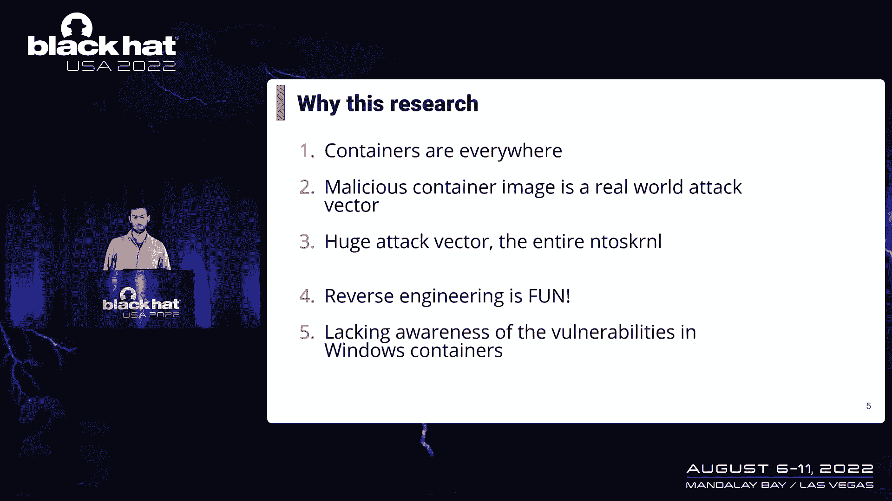
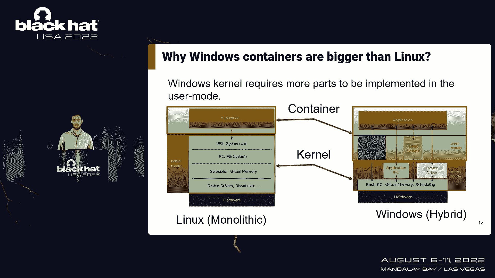
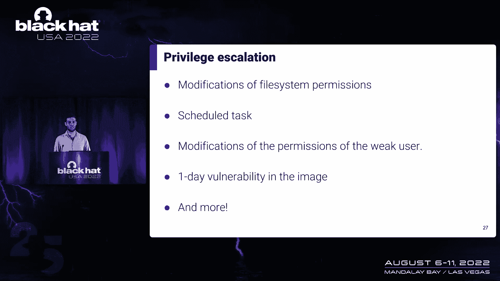
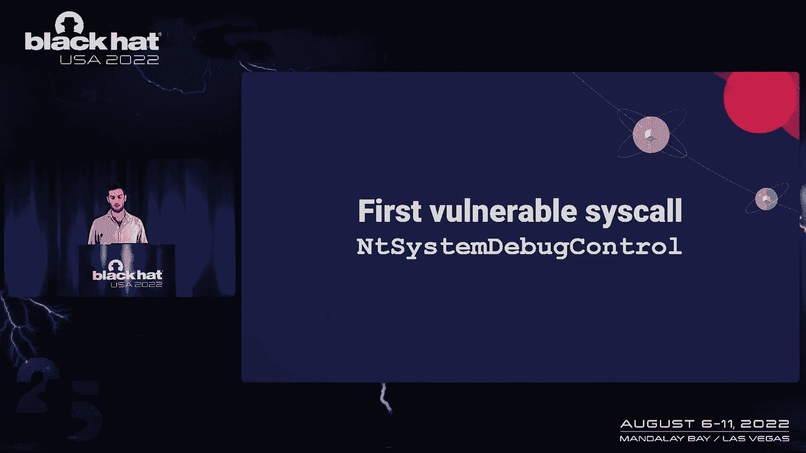
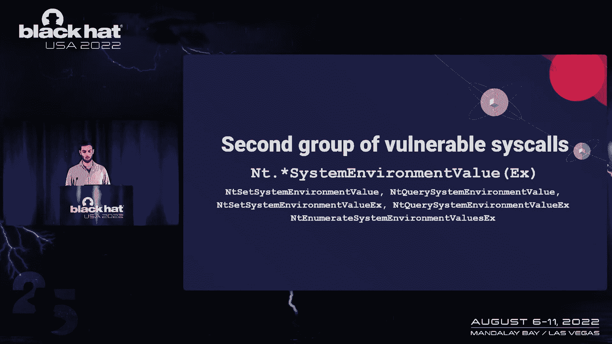
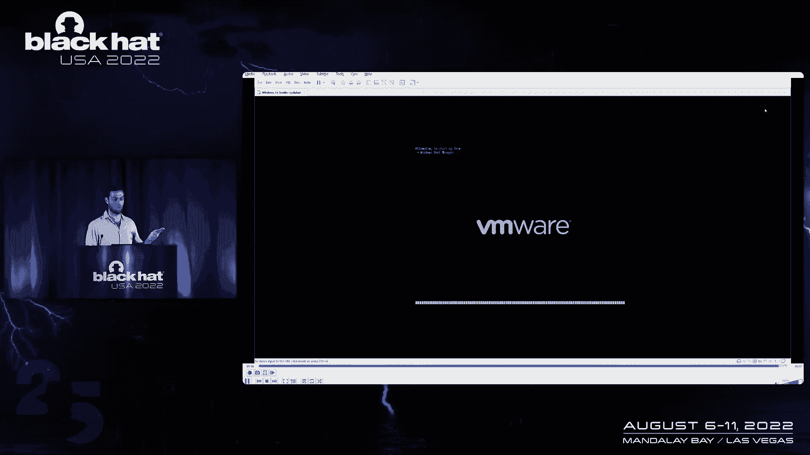
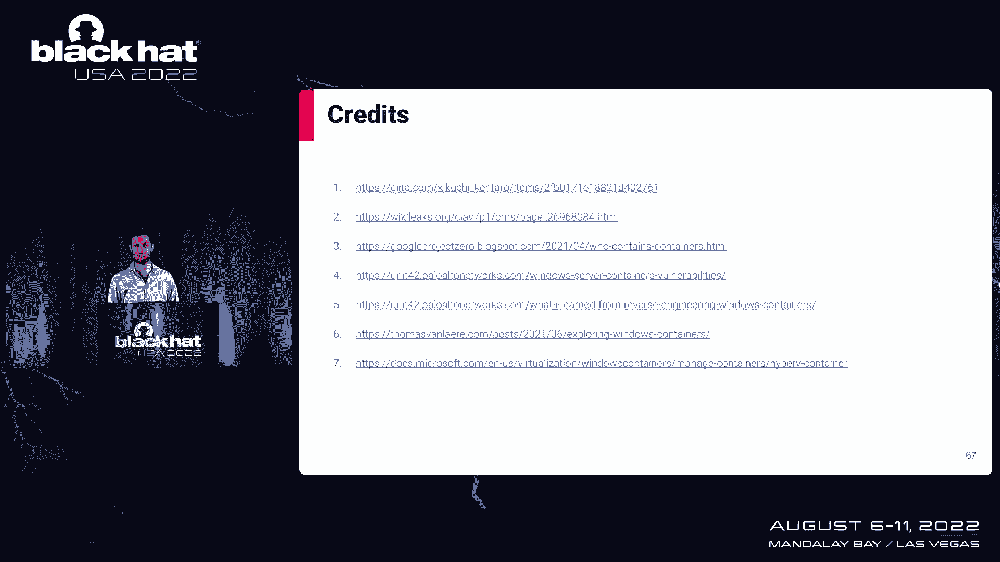

# 【转载】Black Hat USA 2022 会议视频 - P39：041 - The COW (Container On Windows) Who Escaped the Silo - 坤坤武特 - BV1WK41167dt

欢迎来到我的演讲，窗户上的容器，我们逃离筒仓，在这次谈话中，我将演示恶意Windows容器如何影响主机，它在继续运行，我叫罗恩•赛尔，我在网络安全领域工作了七年多，目前。

我是安全桥梁实验室的研究小组组长，我的经验涉及Windows和嵌入式设备的漏洞研究。

所以我要从窗户的背景开始，处理隔离容器，然后我将继续了解如何获得容器内的任何系统，在我获得反系统后，我将展示我使用的方法，为了找到两个可能影响主机的漏洞，之后，我将展示一个包含漏洞链的演示。

我们以问答结束，所以研究的目标是找出攻击者的影响，马上精心制作的窗户容器，它在继续运行，我选择了这个结果，因为到处都是集装箱，这个攻击向量是真实世界的，反向工程Windows内核很有趣。

所以让我们深入到Windows容器中。

容器类似于虚拟机，每个容器都是从容器映像创建的，它包含容器的所有依赖项，比如说，我们将运行的应用程序，文件系统或注册表，容器映像的配置包含所有依赖项，因此，它很容易像VMS一样管理和部署。

在Windows中，可以部署容器，我们是定义隔离过程程度的两种方法，隔离容器和超V隔离容器，超隔离容器与虚拟机非常相似，它们有自己的内核，他们通过超V和，容器不能与容器直接交互，和主人在一起。

它必须通过Hyperv接口，因此越安全，但它附带了计算，进程隔离容器类似于Linux容器，整个容器从用户模型运行，但是进程隔离的容器直接与内核交互，它们通过多个方面与宿主隔离，以验证容器不会影响主机。

内核中很少有缓解措施可以验证，比如说，它防止将驱动程序从容器加载到内核，在这个演示文稿中，我将只关注处理隔离容器，所以当我们在Windows容器中运行任务区时，我们看到很多与石油本身有关的系统处理器。

不像Linux，它不包含容器内的系统进程，这些窗口之间的差异，容器和容器是因为内核本身的体系结构，Linux和Windows容器都只从用户模型运行，以验证容器对成本的影响，Linux容器是单片的，因此。

它的所有基本功能都是在内核本身的计划中实现的，就像Windows一样，它的一些功能是在用户模式下实现的，而其他的是在内核中实现的，因此，Windows容器包含服务系统服务，如SVC主机。

因此，让我们深入研究如何实现过程隔离容器。

Windows容器有两个路径，管理所有集装箱的引擎，比如说，码头工人容器及零件，负责隔离的部分，将容器与主机隔离，我只想把重点放在窗户上，当一个新的Windows容器开始时，它为容器创建一个环境请求。

例如对象，命名空间，文件系统，作业对象，和在容器内运行的创造性过程，窗户，窗户，容器隔离分为三部分，作业对象名称空间，和图层，本演讲将重点讨论绕过作业对象的内核隔离，所以让我们了解什么是作业对象。

在Windows中创建作业对象，很久以前将进程分组为单个单元，并管理资源，比如说，CPU时间，记忆时间，和限制，他们的记忆力有限，等等，但为了支持隔离，作业对象需要转换为筒仓，筒仓提供基本隔离。

但对于需要更多的容器来说是不够的，为了拥有所有这些能力，这个筒仓必须转换成服务器筒仓，所以任何服务器筒仓也是筒仓，在我们把我们的避难所改为避难所后，支持资源重定向，现在我们可以重定向来源，比如说。

登记册，网络和对象管理器，使用来自容器映像而不是来自主机的资源，但这种孤立是不够的，正如我所说，在内核需要减轻危险循环之前，比如说，负载驱动器，如果可以直接从容器装载驱动程序，它是，它不可能那么孤立。

容器可能会逃逸，因此，一些验证被添加到内核中，并验证，如果执行sil l的线程的上下文在容器内，它会阻止请求，不会加载驱动程序，你可以在截图中看到，所以让我们深入研究这个机制，因此。

当内核需要检测当前进程是否被隔离时，例如在容器中，它检查了E中的几个筒仓，线程或进程结构，它们是管道中的结构，代表线程和过程，内核需要检查所有附加到E的作业对象，线程和进程结构，以便验证。

因为可以将多个作业对象附加到单个线程或进程，内核中流的另一个示例，需要验证，如果执行sil的进程是否在容器内，则为进程列表，在这流动中，内核只需跳过容器之外的进程，正因为如此。

当容器内的进程执行的进程较少时，它只获取容器内的进程。

所以在我们了解了容器是如何工作的之后，让我们在容器里安装一个反系统。

使用用户标志运行Docker Run命令时，我们可以定义容器将启动的用户，比如说，容器用户是弱用户，我本以为容器会作为弱用户运行，你可以在幻灯片上看到，容器内的一些处理器正在运行一个系统。

作为容器用户运行的唯一进程是我们启动的CMD，这意味着容器可以与具有系统权限的进程通信，更有趣的是，这个过程是从容器映像本身加载的，我们可以控制这样，无论用户标志指示了什么。

这意味着我们可以获得系统权限，所以让我们了解如何使用这个发现并获得真正的系统权限，为了制作一个容器映像，该映像将运行一个系统，我们总是可以遵循四个简单的步骤。

首先在我们的实验室中使用系统权限启动一个容器，然后我们将创建一个运行卫生系统的服务，开始了，将容器转换为容器映像，以便能够再次部署它，我向你展示的方式并不是我们获得系统权限的唯一方式，我们有多种方法。

我敢肯定比这里显示的还要多，因为我们可以控制图像，这样我们就可以覆盖30号系统，从容器数据加载的两个可执行文件，使用DL侧加载，修改Windows配置，更改注册表，甚至更改我们正在启动的容器用户的权限。

所以我们在容器内获得系统权限，但我们不能对主机做任何我们想做的事情，因为我们仍然是孤立的，我们可以用这个系统做任何我们想做的事情，所以为了了解如何打破孤立。

我们需要了解集装箱泄漏的两个过去的漏洞，每个漏洞表示一种方法，用于查找包含容器中的漏洞，第一种方法是寻找API，微软只是忘了阻止第四单元，两个在对象管理器中发现了一个漏洞。

他们象征性地让容器内的进程访问马的任何硬盘驱动器，这意味着容器可以写入任意文件并控制文件系统，第二种方法是试图绕过微软的缓解措施，詹姆斯肯定，找到了绕过服务器筒仓内核验证的方法。

通过创建一个新的筒仓对象，这不是一个自我，Microsoft在编写了大部分内核API后增加了对容器的支持，因此，我选择寻找第一个寻找API的方法，微软只是忘了屏蔽，在我的研究中，我会关注易受攻击的系统。

但是有五百多个海头骨，每一个都很大，所以我必须找到更好的模式来寻找，所以就像我之前说的，它必须是一个C头骨，第二种检查方法是没有隔离的验证，这意味着微软可能忘记添加它们，第三个比较棘手，检查管理权限。

如果海洋都有管理特权，它需要管理权限，说明SIL的冲击力很高，这意味着我们可以对宿主产生巨大的影响，它可能是一个主要的allic，或者它会影响主机，使其无法再次启动，所以我想写一个脚本来验证这一点。

但是手动很容易，所以我不必，在我建立了这个食谱之后，我的生活变得轻松多了，我开始发现脆弱的Cials，我做了快速分诊，第一个吸引我眼球的功能是反查询系统信息，这个函数在枚举上包含巨大的开关盒。

它包含大约两百个选项，手动反转是不可能的，幸运的是符号，所以我只能选择有趣的价值观，并专注于它们，所以我写了一个小代码，只触发有趣的。

我发现了一个有趣的结果，所以当我调用这个是用枚举调用，此句柄信息的值，它又回到了我身边，内核本身中对象的所有句柄和地址的列表，主机本身上的所有进程，这意味着我们可以看到过程。

在主机上运行的其他容器和进程的想法，但不能使用这些句柄或地址，因为我们不能向进程打开进程，在容器外或复制，他的手柄，所以它是叶科的辅修，这样我们就可以得到主机上所有进程的所有进程，但我想要更多。

所以我继续学习，另外，我发现的这个调用是一个空的系统调试控件。

反系统调试控制与前一个类似，它也有多种选择，取决于枚举值，我看到这个函数叫做多个有趣的函数，例如启用内核调试器，但所有这些选项都被阻止了，并且仅当内核调试器启用时，对不起，只有当它被禁用时。

在干净的Windows机器上，只有两个选项可以工作，是转储用户模式，它不会给我任何实际价值，因为我需要一个开放的手柄，内核转储，这肯定会做错事，所以为了从容器里做一门大炮，我需要填满TRU。

因为bug活动转储控制，它包含两个重要的参数，并导致容器中的一个文件，它很容易，转储和页面控制的标志，它定义了转储的外观，以及它将包含什么，我从网上拿了一个源代码，触发了计数器，转储，我稍微改变了一下。

设法调用了一个内核转储，做一个大炮倾倒，并从容器内读取，所以让我们谈谈我们所做的和旗帜，这些旗帜是无证的，我在这里找到的，有趣的是转储用户空间内存和hyperv页面，我附加了一个带有内核调试器的VM。

尝试用虚拟机进行转储，它奏效了，我设法转储了所有用户mod，Hyper V和我找到的所有标志，但是在干净的窗户机器上，所有的旗帜都起作用了，除了一个转储用户模型，因此，如果启用了内核调试器。

我们可以把L，它包含了所有的过程，Windows中的所有密码，所以如果我们可以倾倒，我们可以访问它，未启用内核调试器，所以让我们了解如何使用内核转储获得密码，所以有多种方法可以得到它们。

第一个是进程列表，我们可以从内核访问，所有的过程和参数，他们可以访问，我们可以访问通过的环境变量，我们可以访问参数，除此之外，我们可以读取和查询所有加载在招待所上的注册表，有时密码也存储在那里。

如果启用了内核调试器，有可能在丢失密码的情况下更容易获得所有密码，和，当然啦，大炮调试器不仅仅是关于密码，我们可以看到很多其他有趣的信息，比如说，ED从库存跟踪的视图事件日志中检测哪些正在运行。

内核内存。

还有更多，我发现的其他漏洞与UI有关，因此，为了了解影响以及我们如何利用这个漏洞，我给了一点背景。

当我们把一个新的窗坑，可能会按照下面的顺序，首先，CPU中的UI加载UI驱动程序和设备，UFI读取环境，为了知道如何继续这本书，然后这两个序列从用户界面传递到窗口，在第三步，窗户开始的地方，引导序列。

窗口从BCD拉出配置，存储在EFI分区上的，然后它包含船，直到窗户满载，让我们把注意力集中在enram存储上，因此NVM包含UI的配置，这些配置不存储在硬盘上，而是在主板上的一个芯片上。

此内存在操作系统窗口和UI本身之间共享，为了访问环境变量，我们需要知道这是好的，唯一标识符及其名称，有趣的envellum变量的两个示例是boot和boot order，boot是一个变量。

它为ui定义如何使用特定的方法进行引导，比如说，从特定文件引导，从硬盘网络引导等，但是顺序定义了引导的顺序，我们是否要定义来自c的输入，它们首先是如何定义的，以此类推，引导变量有时链接到文件系统。

文件系统上的文件，但是这些文件在EFI分区中找到，在三二，这样容器就可以访问它们，所以我们不能用它，UI支持多种类型和标志，变量可以是永久的，也可以是易变的，当可以访问每个变量时，可以标记它，比如说。

仅限木材进入，所以不可能从窗户部分接触到他，还是只能从窗口访问。

介绍完之后，让我们跳转到易受攻击的系统调用组，与枚举API相关的。

我们需要的第一个功能是在主机上列出VM变量，我们在，呃，使用反，然后从，因为不读它们，它把我们引向第二个叫做，一个特定的信封圣经，我们已经知道好的，和微软之前的名字，也没有把这个头骨从容器上挡住。

我们需要的最后一个功能是编写NVRAM变量，所以现在我们可以阅读，写，并列出主机中所有的圣经，所以让我们了解一下我们能用它做什么，在容器被杀死后，重新开始它的所有储存，一些配置被还原，VM存储是永久的。

所以我们可以使用这个存储来存储持久存储，此信息将在容器重新启动之间存储，主机重新启动，因为Enyum变量存储在主板本身，它可以在格式之间保持均匀，额外的影响是我们可以在两个容器之间通信，隔离容器。

两个容器都可以与环境存储通信，这样我们就可以读一种语言，写另一种语言，这让我们找到了他们之间可能的获取数据，但最有趣的影响是引发房子永久拒绝服务，因为用户界面通过了环境圣经，有可能改变其中的一些。

使主机和引导永远是可能的，通过更改输入和引导顺序，不会阻止ufi启动，因为窗户后面，因为UI是备份配置，在UI上闪烁，因此，我必须寻找其他流量，所以在NVRAM中发现的另一个变量是HDP。

向其写入无效值将完成这项工作，并将导致主机永久拒绝服务，仅在引导上读取，所以在改变这个变量之后，主机上什么都不会发生，只有在主机关闭后，它才会像预期的那样关闭，并试着重新启动它，将无法再次加载窗口。

所以我们开始为主人做多少并不重要，不会成功的，但是这个变量只存在于vii上的一些UFile上，如果我们将运行Windows容器在Windows VM运行Rimware机器，比如说。

E六个VMware工作站，Windows VM的UI是易受攻击的组件，所以当我们从容器中写入HGDP变量时，它将导致VMware VM永久拒绝服务，机器的房子不会受到影响。

所以让我们潜入UI中易受攻击的组件，用户界面是由多个部分构建的，易受攻击的是BDS驱动程序，它负责选择从哪个设备启动，BDS的根本原因，DC是它读到国内生产总值是可行的，因为我们用无效的值覆盖了它。

它跳转到断言函数，如果我，l，哪个在哪个上循环，中断引导序列并调用永久拒绝服务，因为用户界面现在无法继续加载窗口，所以让我们跳转到这个演示中的演示，我将展示我的特权。

我在使用恶意Windows容器之前显示的升级，以及我是如何导致Viv永久拒绝服务的。

这里，我要开始一个星期，就像你在这里看到的，用户没有预管理权限，但它附带了一个后台服务，可以读入，读取输入文件，并将输出写入输出，它运行一个系统，如果我使用此功能，为了覆盖环境HDP。

并使用你可以在这里看到的服务，它向变量写入了6次a，那么在重启之前什么都不会发生，所以现在我们需要等待重启。

它会像预期的那样关闭，一切都会顺利的，但是当UI再次尝试加载它并读取这个Anvibarber时，它就会失败，继续，就像你在这里看到的，Wimmer VM在其设置中启动，这个有库存，它不会继续这一步。

所以让我们解释一下这个演示是如何工作的，所以在演示之前，我创建了后门服务，它运行一个系统，它读写输入和输出文件，当我们重写变量时，HDP IT，重新启动机器，它触发永久拒绝服务，减轻这些漏洞并不容易。

没有微软的官方补丁，但我们可以使用很少的变通办法来验证这一点，我们就会知道我们想在这一次面前变得脆弱，这流动，第一个也是最简单的方法是使用超V隔离，不处理隔离容器，但这会让我们付出表演的代价。

另一种方法是只信任您想要的容器映像，并且只使用签名的映像，另一种方法是另一种解决方案是假设任何容器中的任何进程，Windows中的是系统，因此，您应该在IS网络拓扑中定义它。

为了确保没有特权而使用的容器图像扫描，图像中存在升级或恶意内容，我根据容器图像扫描测试了我的容器，它没有检测到以前的升级，但只是在我真正深入他们的网站之后，我发现他们不正式支持。

但它们确实表明图像是干净的，可悲的是，我不能把我的手放在支持Windows的容器图像扫描产品上，集装箱，和以前的升级，微软说，因为只有管理员才能启动容器，这里没有特权升级，以及关于当前转储。

他们说这不是一个漏洞，因为我们需要容器内的系统权限，但他们确实计划将来修好它，关于Anvion的口头攻击，我们可以在容器里读写环境圣经，他们将其定义为中度拒绝服务。

但这不在Windows安全更新的范围内，他们确实计划修复它，关于最后一个，首要的UI变量，hgdp，我们把它当作功能问题，因为它只影响虚拟机本身，它需要它们内部的管理权限，但他们确实计划修复它。

我上传了我使用的所有工具和代码，如何进行权限升级，使用恶意容器映像，如何做Kerdom，我在那里做的修改，以及如何导致父服务和拒绝服务的手册，就像我在这里展示的那样，我要感谢米奇帮我逆转女性UI。

我想把我的研究建立在他们之上的其他研究人员。

感谢您的加入。

