# 【转载】Black Hat USA 2022 会议视频 - P3：003 - Kubernetes Privilege Escalation： Container Escape == Cluster Admin？ - 坤坤武特 - BV1WK41167dt

嘿嘿，后面的人都能听到我说话吗，是啊，是啊，哇太棒了，所以谢谢你的加入，我是拉米的瓦尔，这是本海，今天我们要试着回答一个简单的问题，单个容器是否泄漏。

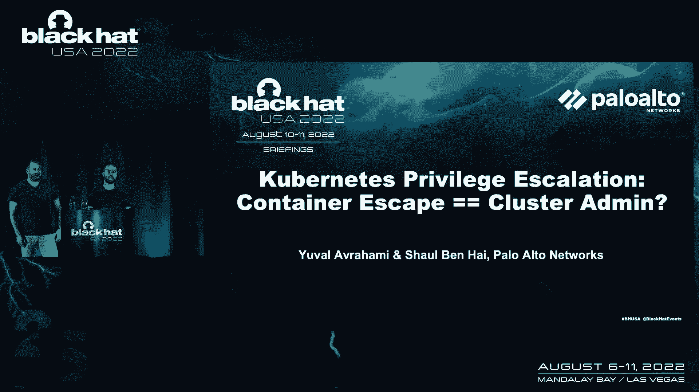

允许攻击者接管整个Kubernetes集群，我们希望通过回答它，我们可以分享我们从Kubernetes中学到的一些见解，特权升级，所以有点关于自己，我们是云在一起，帕洛阿尔托网络的研究人员。

所以我们在云中做漏洞研究和弗雷德狩猎，因此，在云的基础设施组件中搜索漏洞，也在云服务提供商中，我们还寻找专门针对云环境的组，所以关于我们自己就足够了，我们今天的议程我们将从集装箱逃跑开始。

我们不断听到的威胁，并试图真正理解，实际的爆炸半径是多少？然后我们会做一个俏皮话，Kubernetes 1零1只是为了让每个人都站在同一页上，我们将继续讨论集装箱泄漏后发生的事情。

攻击者必须在群集中传播哪些资源，我们将看到攻击者可以滥用的几个攻击类，为了升级特权，将有足够的资源来回答我们的问题，容器转义是否等于整个群集危害，我们一般都会回答，但也特别。

在当今最受欢迎的Kubernetes平台上，我们就用，通过谈论受影响的平台发布的一些修复，我们还将讨论一些你可以从这次演讲中得到的收获。

所以我会通过麦克风来谈论集装箱逃跑，谢谢。

嗯，你好，每个人，让我们开始谈谈集装箱逃逸，所以永远，自从集装箱进入我们的生活，我们听到越来越多关于集装箱逃逸的消息，在脆弱的感觉中，内核，Docker和Kubernetes中的漏洞配置错误。

几年前在这里有一个关于集装箱的很好的讨论。

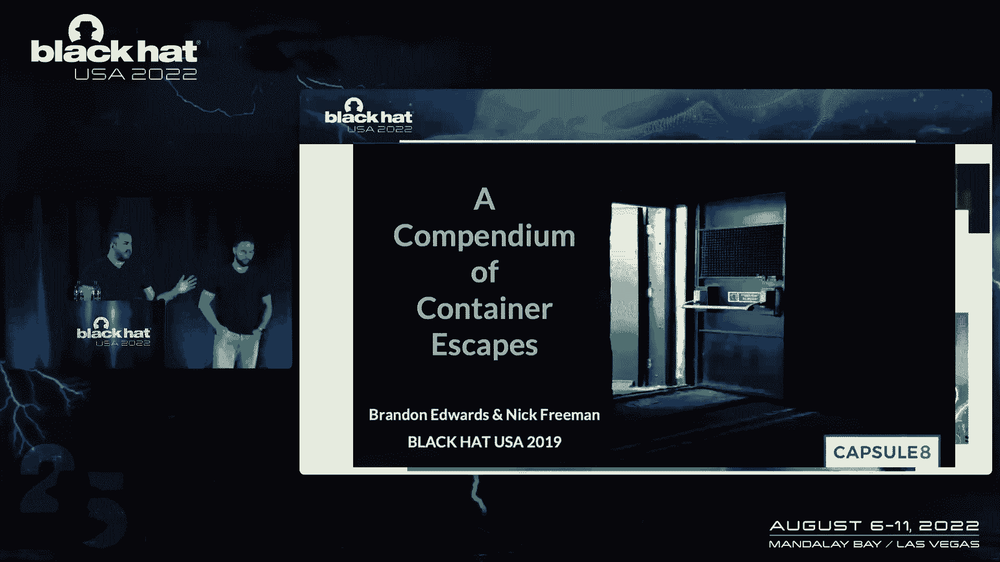

所以显而易见的问题是容器实际上包含，毫无疑问，容器非常适合打包和部署软件，这就是我们都使用它们的原因，但它们是弱安全边界，主要是因为shell内核，相同的Linux内核漏洞，允许无特权用户成为根用户。

通常可以用来逃离容器并接管底层主机，那是因为Linux内核的攻击面太大了，我们可能会继续看到越来越多的集装箱逃逸变体，只有在二十二，我们介绍了至少十几个集装箱泄漏的漏洞。

但是从容器中转义也可能是因为配置错误而发生的，最著名的是访问主机的特权容器，我们还介绍了一个利用集装箱逃跑的贸易演员，在密码挖掘的胜利者环境中传播，比如说，我们知道集装箱泄漏可能会继续发生。

它将留在这里，所以我们必须了解影响是什么，库伯内特的明显影响。

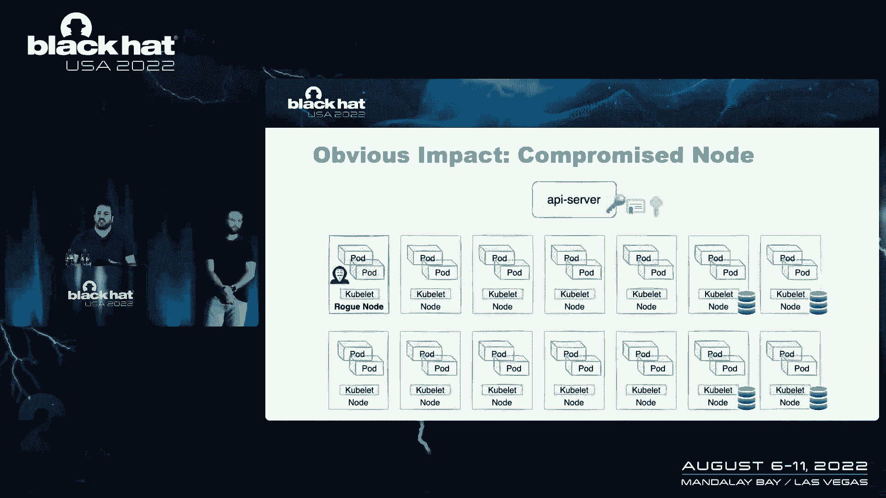

至少是一个折衷的节点，攻击者以前会危及一个容器或一个吊舱，现在可以控制整个节点，可能是为了更多的业务逻辑或更多的计算机资源来进行密码挖掘，比如说，但是想象一下我们的攻击者是一个雄心勃勃的人。

它可能只满足于单个受损节点，也许我想接管整个集群，这就是我们今天要回答的问题，如果单个容器转义的场景可以升级到完整的群集，管理轴，如果你问自己，他可能想接管其他服务或数据库的动机是什么。

甚至获得一些凭据秘密，试图在我们的集群之外传播，添加其他有趣的环境，只是我们今天要使用的一个快速术语，两个术语admin和admin等价，当我们说admin well时。

这意味着您可以执行任何类型的操作或所有名称空间，和管理等价物意味着您有足够的权限，只需一两个琐碎的步骤，你就可以成为一名管理员。

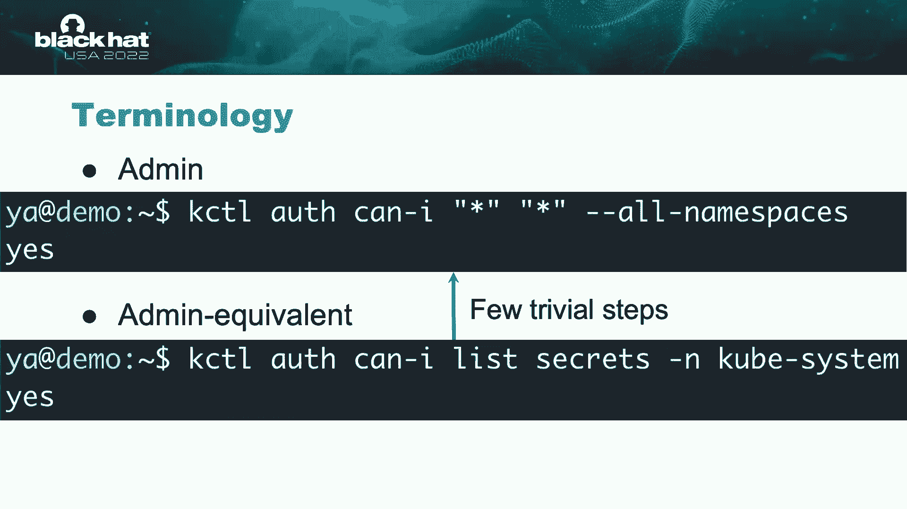

但就在我们继续之前，我们会做一些快速的Kubernetes，一对一，只是为了确保我们都在同一页上，所以在一句话中，Kubernetes在虚拟机上和不在虚拟机上编排的吊舱容器，基本上今天。

它在Linux工作负载中到处都在大量使用，主要在云上，在普雷姆，对于攻击者来说，这是一个非常有趣的环境，我们有API服务器，也就是群集网关，或者大脑和用户可以使用Kubernetes与API服务器通信。

用立方体牛，Kubernetes CLI工具，然后API将安排一个豆荚和，并将操作这种关于身份验证的操作，您可以使用证书进行身份验证，这就是用户和节点的身份验证方式，也可以使用服务帐户令牌。

豆荚就是这样制作的，还有一点关于用Kubernetes表示的授权权限，作为动词和像secret这样的资源，创建POD更新节点，删除服务等，这些权限组合成一个世界，当您想授予某些身份权限时。

您可以使用角色绑定来完成此操作，如果有点复杂，让我们做一个快速的例子，这里我们有我们的墙，我们可以在这个地方列出服务，我们想授予我们的身份这个许可，到我们的豆荚，因此，我们将此角色绑定到服务帐户。

豆荚什么时候运行，他会用这个这个令牌，在我们的情况下，您可以列出服务和列表豆荚。

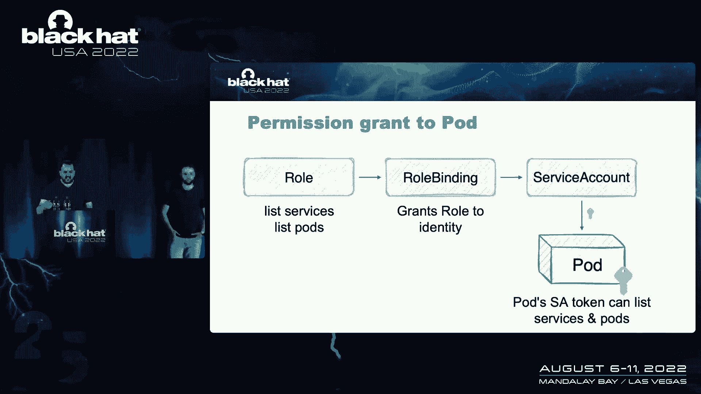

所以这对库伯内特夫妇来说已经足够了，一对一。

对我们的研究，让我们现在试着了解一旦攻击者可以逃离，逃离集装箱，所以之前为了做到这一点，我们需要了解节点中有哪种凭据，所以首先是肘权限，肘是节点，能够管理和促进所有便利的代理人。

节点显然有一组任务允许你这样做，但幸运的是Kubernetes限制了量子比特的许可，如果你，如果你说的是有意义的攻击，所以小方块不是地址，攻击者确实可以设法执行一些有限的攻击，比如拒绝服务。

或者是为了得到一些原始的阅读或类似的东西，但如果我们谈论的是有意义的攻击，像完整的群集管理，所以小方块不是地址，但是节点上还有另一组凭据，它是邻居吊舱的服务帐户，和使命价值。

因为这取决于在端口上运行的应用程序，这取决于您的节点，取决于运行集群的平台，所以攻击者可能是，它可能没有办法成功一个强大的许可，但至少他有机会，因为每个节点上的量子比特权限都是相同的受限权限。

今天我们要讨论这个场景，我们有一个非常强大的吊舱，我们给它起名叫蹦床，但它可以有足够的权限来反弹你，在集群周围跳转到其他节点以获得一些高特权，基本上让攻击者在您的集群中玩得开心，那些诱捕舱可以在哪里。

让我们看看哪种豆荚在我们典型的平均节点中运行，然后通常在Kubernetes，我们有像EO这样的附加服务，伐木用网格或普罗米修斯，或者守门人，或在Verfor策略执行中，最后是系统吊舱。

像Q这样的基础结构代码，代理，和cos，当我们建立集群时，这些机器人已经在那里了，这基本上取决于您运行集群的平台，因为你已经知道系统吊舱，在某些情况下，还可以添加豆荚，是一个相当大的盲点。

因为我们没有管理它们，配置，添加斑点，我们刚刚使用像helm这样的包管理器安装了Add on Spot，比如说，添加项的作者可以认为他们允许，对于系统吊舱，在集群创建时就已经有了，所以说，当然。

我们没有控制或管理他们的许可，关于系统吊舱的另一个有趣的事情，在某些场景中，还包括部署和安装的附加吊舱，是一个恶魔集，这意味着它们运行在集群中的每个节点上，所以如果蹦床没有安装成恶魔套装。

只在集群中的一个节点上运行，因此，如果攻击者从某个节点逃脱，可能是，也许，也许不会在承载蹦床舱的节点上，它是五十，百分之五十，也许更少，因为这取决于集群上运行的pod的数量。

如果蹦床作为恶魔设置和铲球部署和安装，保证吃到头奖，因为我们集群中的每个节点都将运行这些蹦床舱，答案，我们今天主要问题的答案，如果单个容器转义可以升级为完整群集，就是说，答案就在那些蹦床上。

集群中的每个节点，所以我会把它转回给你，是我的Mac，哦太棒了，所以我说，在容器之后，逃离我们升级特权的金票，依靠蹦床恶魔套装，所以我们出去试图找到蹦床可能在哪里，所以这就是它的样子。

我们调查了最受欢迎的Kubernetes平台，并调查了他们的基础设施PO，这是一个实际的例子，我们看到了可以列出秘密的豆荚，删除豆荚，创建配置映射并更新节点的状态，我们查看了这些权限，我们试着问自己。

这个地方强大吗，我们是在看蹦床吗，我们很快意识到我们没有，我们不知道，我们没有资源，我们查了Kubernetes的文件，我们在里面试过谷歌，我们很快意识到。

Kubernetes中实际上没有强大权限的公开列表，现在这实际上是相当可怕的，因为不知道哪些权限是强大的，你不能真正回答关于以前升级的基本问题，好吧，如果我是防守者。

我真的不知道我公开的豆荚是否真的能提升特权，如果我不知道它的权限是否强大，作为一个攻击者，一旦我得到一套妥协的凭据，我能分辨出它们是否值钱，如果我不知道哪些权限是强大的，对呀，所以我们开始走路。

并试图找出Kubernetes中哪些权限实际上是强大的，我们很快意识到许多我们认为相当良性的权限，其实挺有趣的，如果你以创造性的方式使用它们，所以另一种方法是我们首先定义什么是有趣的。

库伯内特斯的攻击类，在我们看来，这可以让您获得有意义的特权升级，然后我们分类，我们查看了Kubernetes中的所有权限，并根据它们可以启用的攻击类对它们进行分类，这是我们想出的地图。

我们想出了四节课，大约20多岁，现在映射到每个权限中的权限，我们不会进入每一个许可，它是如何实现攻击的，我们有一份与股票一起发布的实际报告，在其中可以看到每个权限是如何启用攻击的。

但这些是我们识别的权限，我们查看每个攻击类的示例，为了让它们更真实，所以让我们从允许您操作的权限开始，认证或授权。

这些都是非常强大的权限，实际上允许您模拟其他用户，或更改您的权限，如此自由地操作群集的授权，一个例子是升级角色的权限，允许您向现有角色添加新权限的权限，所以如果我是一个攻击者，我有一个令牌可以升级规则。

我可以简单地去我的服务帐户的角色，并编辑群集中的所有权限，用这个狂野的符号来表示，然后在我这么做之后，我的令牌获得所有权限，令牌变大很好地说明了这一点，我们将要讨论的下一个攻击类。

是允许您获取服务帐户令牌的权限，因此，要么检索现有的服务帐户令牌，要么发出新的服务帐户令牌，现在，这里有什么影响，嗯，看情况，哪个服务帐户，您可以为权利颁发令牌，如果您可以为强大的服务帐户颁发令牌。

然后你就得到了一个有意义的特权升级，如果你只能，让我们说，检索弱服务帐户的令牌，那不是很有趣，Kubernetes中一个非常臭名昭著的许可，允许你，在本例中，现有的三个服务帐户是列出机密的权限。

到目前为止，Kubernetes中的服务帐户被存储为服务帐户令牌，它作为秘密存储在API服务器中，所以如果你真的能列出秘密，您可以简单地检索服务帐户令牌，然后使用它们对API服务器进行身份验证。

正如我所说的，如果您为自己获得了一个强大的服务帐户的令牌，你刚刚升级了特权，下一个攻击类，你可能对它很熟悉，来自其他系统的权限也是允许您执行代码的权限，在部分或所有节点上，在这种情况下。

你不一定要升级你的特权，对吧，这真的取决于你要接管的豆荚的权限，但您可能会正确地获得更多的计算资源，也许更多的业务逻辑，和，正如我所说的，可能会升级你的特权，让我们来看看这样一个权限的有趣示例。

它有一个很混乱的名字，它创建节点的代理子资源并没有告诉我们太多，但它基本上意味着我们可以控制对联，我们可以简单地告诉他们该做什么，告诉他们嘿，请在您的豆荚上执行代码，关于这个许可的一个有趣的事情是。

你实际上不通过API服务器，它通常具有集群中的所有登录和审计机制，所以你现在可以绕过一些检测，我们今天要讲的最后的攻击课，这是我个人最喜欢的允许你偷豆荚的权限。

基本上是将现有的pod从集群中的一个节点移动到另一个节点，为什么会很有趣，如果我们假设我们已经破坏了集群中的节点，我们可能想把其他部分带到我们的节点上，也许是因为它们承载着我们想要控制的有趣的业务逻辑。

在这次谈话中，可能是因为那些吊舱有强大的服务帐户，如果我们把它们带到我们的节点，他们将带着强大的服务帐户令牌来，然后我们可以用它来升级特权，所以我们从这个开始，哦，让我们在这里看一个例子。

这是一个稍微复杂一点的例子，实施攻击需要两次任务，第一个任务是更新节点状态权限，第二个权限是删除脉冲权限，现在，这实际上是一个很好的例子，说明了可能看起来不太强大的权限，当您第一次查看这些权限时。

实际上可能会被滥用，可能是删除吊舱拒绝服务，但它们实际上可以用来偷豆荚，让我们看看在这种情况下我们是如何假设我们已经逃离了集装箱，节点的妥协，我们在集群中的另一个节点上有一个非常强大的吊舱和操作员。

我们想带来的是我们要做的是，我们将首先使用权限更新节点的状态，将类中所有其他节点的端口容量设置为零，我们基本上让他们无法安排，下一步是删除操作员吊舱，现在在Kubernetes必须重建操作员吊舱。

它将方便地在我们的节点上创建它，因为它是集群中唯一计划的节点，我们成功地把运营商吊舱带了过来，它有强大的服务帐户令牌，所以这就是你如何偷暂停，如果你还记得我们开始谈论Kubernetes，攻击类。

以定义践踏的内容，什么是强大的豆荚，所以蹦床是强大的豆荚，可以操纵，认证或授权，获取强大的服务帐户令牌，在pod或节点上执行代码，还有集群中的其他豆荚，因为这些权限集实际上让你得到了一个真正的集群管理。

所以沙尔和我谈了几个话题，让我们快速回顾一下，我们从集装箱逃跑开始，理解它们可能会继续发生，然后我们讨论了它们的影响在很大程度上是如何决定的，通过妥协节点上强大的蹦床吊舱的存在，好的。

我们定义什么是强大的豆荚，我们也谈到了蹦床恶魔是如何设置的，在每个节点上安装蹦床，在集群中，所以如果你真的想回答，单个容器转义是否实际上等于群集管理，我们真正要问的是，群里有蹦床妖套吗。

安装它们的人是普通的等等。

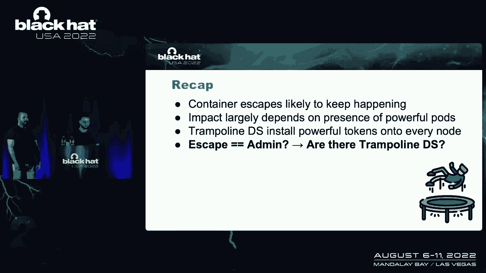

这就是我们在这项研究中试图做的，我们调查了最受欢迎的Kubernetes平台，你们中的一些人可能会去这些平台的用户，我们寻找蹦床恶魔套装。

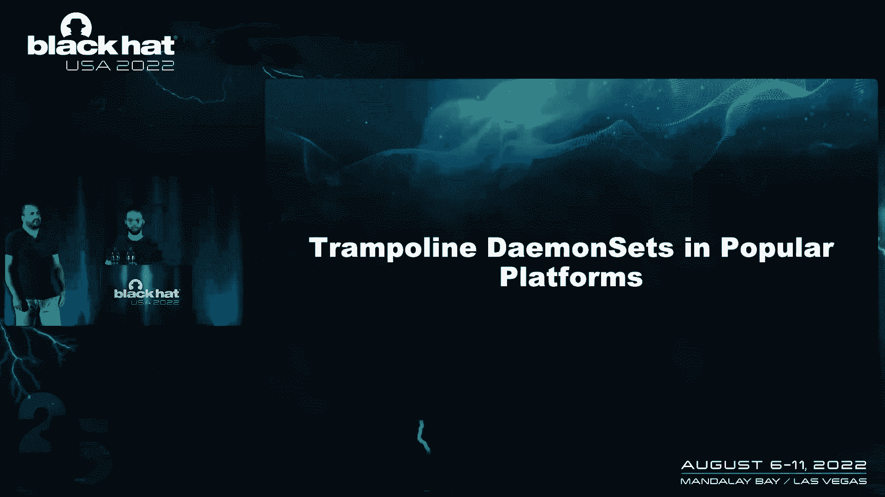

我们研究的平台大多是基础设施层，所以管理Kubernetes服务，如又名GK，AKS，开档，我们还研究了容器网络接口，基本上是集群的网络基础设施，我们研究了像印花布这样受欢迎的项目，安德里亚，纤毛。

我们已经网了，当我们看到这些项目时，我们发现了什么，早在今年2月，他们中的大多数人实际上默认安装了蹦床恶魔套装，另外十二个人安装了它们，给定一个流行的功能被启用，那些其实是。

这实际上是2月份蹦床恶魔集的分解，在这些平台中的每一个。

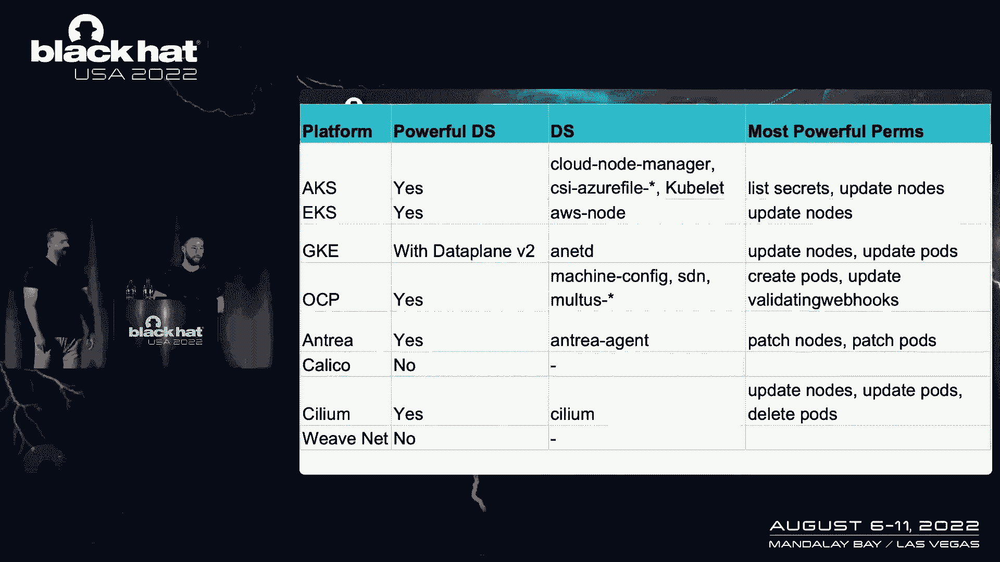

所以你可以看到哪个平台有强大的恶魔集，就是那些恶魔套装，什么是强大的权限，我们有一份关于所有细节的报告，所以你现在不需要拍照，除非你真的想，所以我们看了那些恶魔集，试图了解它们有多强大。

它们真的允许您在默认情况下获得完整的群集管理，在一半的平台上，实际上是这样。

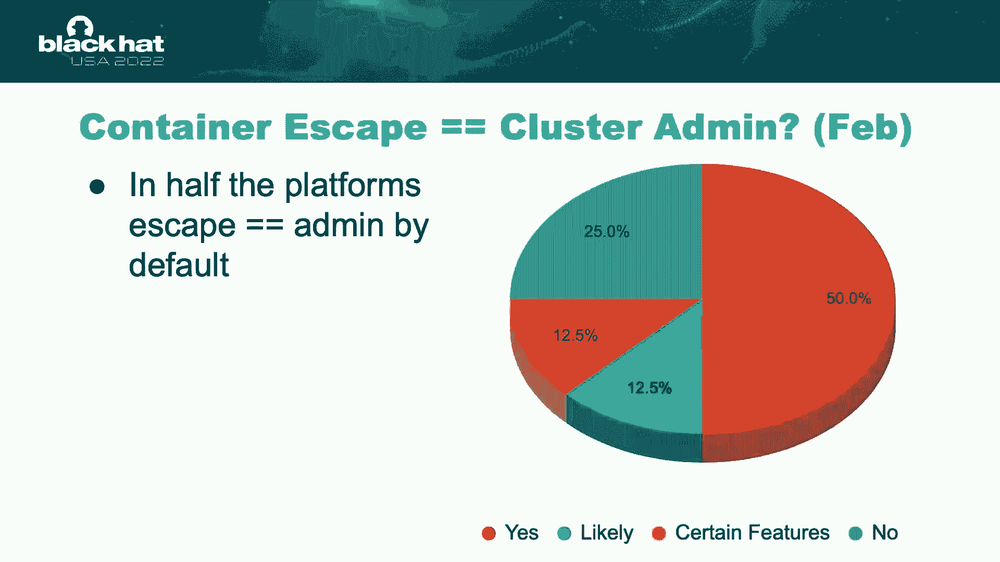

我们调查了一半的平台我们主要问题的答案是肯定的，单个容器转义允许您接管整个集群，在另外两个五，有一些先决条件，比如说，一些鱼正在启用，现在我确实想说，如果你们中有人在运行这些平台，你不必惊慌。

或者类似的东西，这不是未经验证的LC，集装箱逃逸的发生有一个很大的先决条件，但要将集群安全性提升到下一个级别，这也是需要注意的，所以我们显然不能演示所有的攻击，我们要看的是芹菜。

这是一个非常流行的容器网络接口，它是谷歌Kubernetes引擎中新数据飞机的动力，我们选择Lium的原因是，因为它展示了许多攻击类，而且，sium维护人员在修复方面做得很好。

我们今天要向你展示的每一件事，那么这种情况在纤毛中是什么呢Sillium在集群中安装了两个有趣的组件，一个是纤毛鬼套装，蹦床，恶魔集，它实际上可以删除豆荚并更新节点的状态和这些权限。

如果你记得允许你偷豆荚，纤毛安装的第二件事是纤毛操作员吊舱，它实际上可以列出秘密，那个，正如我们前面提到的，允许您获得令牌，现在我们的滑行错误是我们设法妥协了一个部分并爆发了。

所以我们有一个节点在我们的控制下，我们的目标是让集群管理，所以我们可以控制集群中的所有节点，现在我们假设我们在最弱的节点上，所以没有接待纤毛操作员的那个，因为这只是更有可能的情况，对呀。

如果集群中有十个节点，并且只运行一个，则运行Cilium运算符，大多数节点都不会有纤毛运算符，我们获得群集管理的方法，首先在设定的权限内使用纤毛来窃取纤毛操作员，然后使用纤毛操作员权限向我发送集群。

所以让我们看看攻击是如何进行的，我们首先要使用纤毛恶魔集权限。

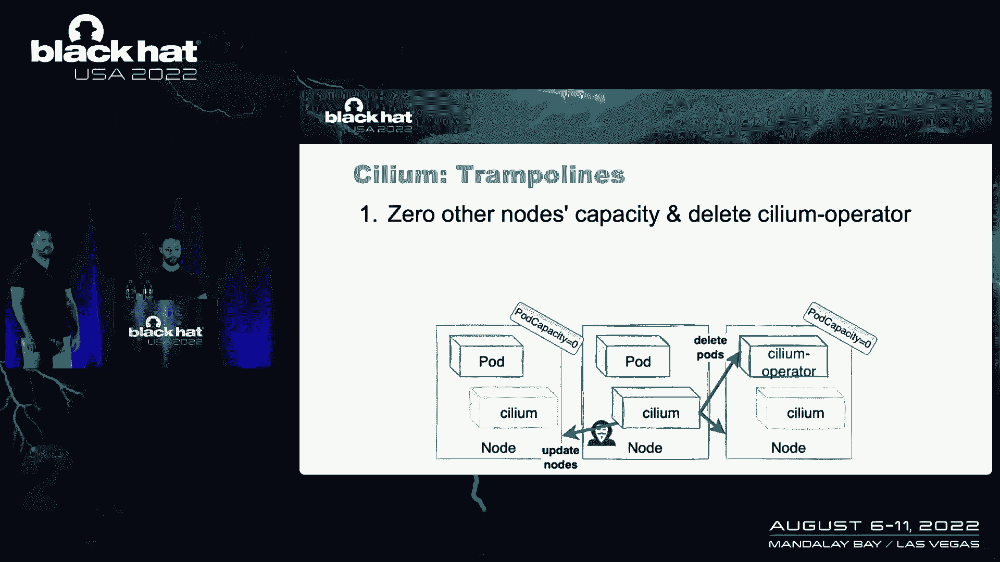

以便使集群中的其他节点无法调度，使用我们前面描述的相同技术，将他们的吊舱容量设置为零，我们又要删除纤毛操作员部分，迫使Kubernetes在我们的节点上重新创建它。

现在我们有纤毛操作员服务帐户在我们的处置，我们可以用它来留下秘密，并检索群集中的服务帐户令牌，现在我们要瞄准的服务帐户叫做破解，是集群的简称，全聚合控制器，我们针对这个服务帐户的原因是因为它可以操纵。

授权，它可以升级墙壁，我们前面讨论过的另一个许可，攻击的最后一步是使用破解服务帐户令牌，以便简单地将集群中的所有权限添加到绑定的角色中。

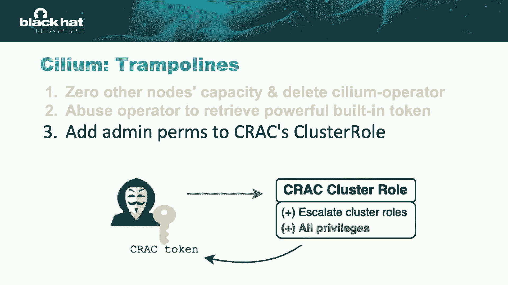

破解服务帐户令牌，所以只有三步，但是当您将它们转换为多维数据集命令时，它得到了更多，所以我们要看一下这个演示。

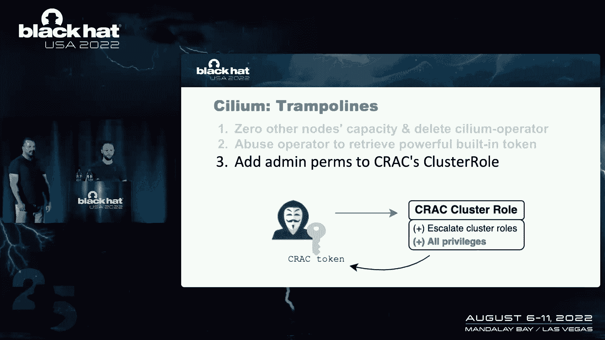

现在它会跑得很快，如果你不能遵守每一个命令，那完全没问题，我们将有一个，所以有人能帮我吗，也许像这样的东西，让我们试试。

正如我所说的，场景是我们在一个安装了Celium的集群中，我们现在正试图获得集群管理，我们将从模拟集装箱逃逸开始，接管节点，因为那是我们进攻的起始位置，我们还将定义一个脚本。

它所做的基本上是从节点文件系统中获取服务帐户令牌，并配置与API服务器对话的CLI以使用它们，你要做的是检查，检查操作员吊舱在哪里，我们可以看到它在集群中的另一个节点上。

所以我们的第一步是尝试窃取纤毛操作符到我们的节点上，我们将定义一个bash函数，称为补丁节点，它所做的只是一个补丁，节点的分配pod为零，使用JSON补丁，所以您可以看到我们定义的操作正在替换。

可分配吊舱值的状态为零，然后我们将使用bash函数，它是由纤毛恶魔集的权限驱动的，为了重复一套，的，集群中其他节点的pocapacity为零，现在我们是在循环中做的，因为当我们删除纤毛运算符时。

实际上会更正值，如果一切顺利，它必须在我们的节点上重新创建，我们可以看到它确实如此，节点名称以红色突出显示，你可以在Bash终端线上看到它，我们的节点主机名实际上是这个名字。

所以现在纤毛操作符在我们的节点上，我们可以继续攻击的第二阶段，即使用纤毛操作员服务帐户，为了得到裂痕令牌，对呀，我们首先配置，我会说喜欢使用纤毛操作员令牌。

然后我们可以看到我们实际上可以在集群中列出秘密，所以我们要瞄准服务帐户，集群或聚合控制器的令牌或这里的破解镜头，我要做一个不管用的类型，但现在它做到了，我们得到了我们得到了破解令牌。

我们可以将CLI配置为使用破解令牌，所以现在我们终于被认证为裂缝，我们拿到了它的令牌，您可以看到，当我们询问API服务器时，嘿嘿，我可以升级墙吗，答案是肯定的，我们仍然不是群集管理，虽然。

正如您现在所看到的，攻击的最后一步是编辑角色，绑定到破解令牌的，拥有群集中的所有权限，这就是我们现在要做的，我们正在编辑，团簇醇，你可以看到团簇醇，现在将有权修改和升级集群一，我们要删除所有。

现在只在那里放野车，我们这样做的第二步，我们的令牌应该立即获得管理权限，当我们检查我们的许可时，它应该说我们是管理员，我们做到了，我们得到了管理员，接管了整个集群。

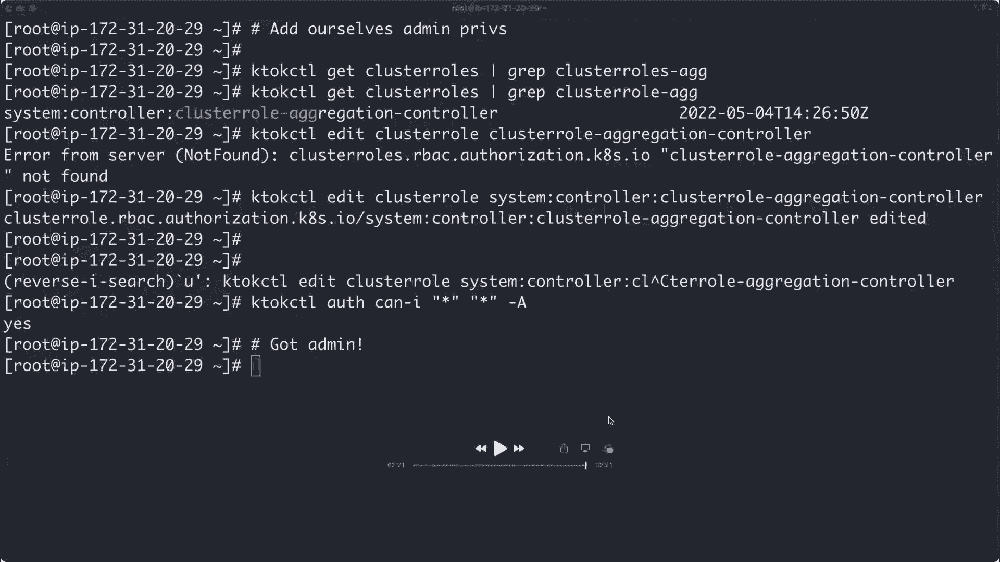

我们回来了，那么我们在这个演示中看到了什么攻击类，我们从偷一个豆荚开始，对呀，偷走纤毛操作员吊舱，然后，我们使用此权限获取强大的服务帐户令牌，最后使用该服务帐户，我们能够操纵集群中的前提。

所以我觉得看到，我们前面谈到的攻击类，实际上映射到实际的攻击，重要的是要明白我们展示了芹菜，但其他平台也有非常相似的问题，有些不那么复杂，一些更复杂的，我们只需要演示其中一个。

所以让我们谈谈当我们和他们谈论这些问题时，平台做了什么。

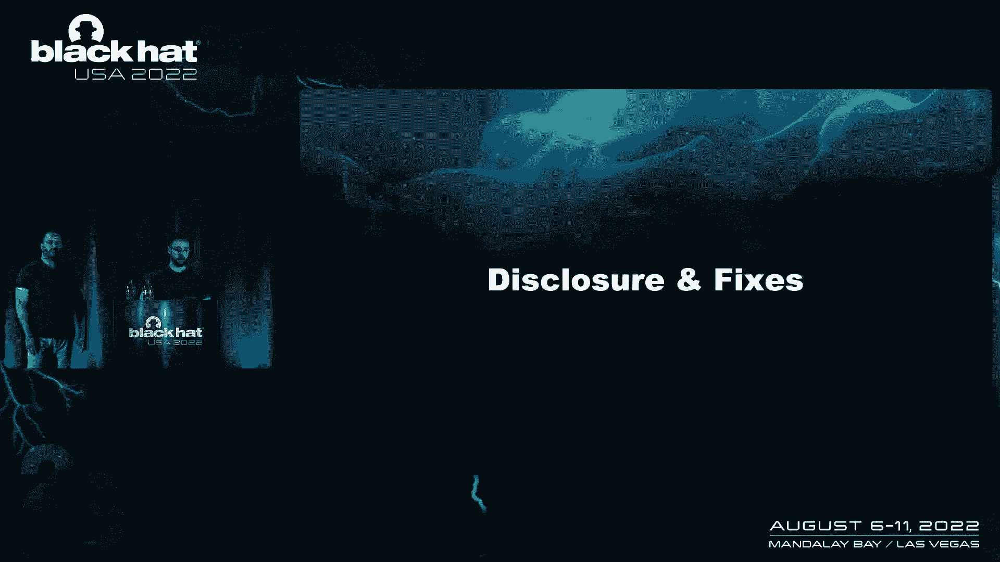

我们实际上联系了我们发现蹦床的每一个平台，这真的是一次很好的揭露经历，他们中的大多数人渴望解决这些问题，你可以看到他们中的大多数人实际上做到了，谷歌，实际上给了我们这个发现的边界，挺好看的。

所以大多数平台都很擅长尝试，并能够深深特权他们的蹦床恶魔套装，所以它们不再是蹦床从2月份的50%，现在只有12。5%，单个转义等于集群，我是说，嗯，这真的很棒，你也不应该有错误的想法，你知道吗。

特朗普线不相关，或者类似的东西，因为我们只看了基础结构层，大多数集群还安装了一堆附加组件，也是应用吊舱，那些也可以把蹦床安装到集群模型中，没有调查每一个Kubernetes分布，我们总共查了八个平台。

我想说的最后一件事，此图并不表示特定于平台的攻击，如果某个平台有特定的攻击，这不是Kubernetes本地人，我们没有调查，但总的来说，平台现在真的有责任解决这些问题，如果你运行Kubernetes。

您可能想知道如何识别集群中的蹦床，你应该怎么做。

所以我会把麦克风传回节目，谈谈识别那些。

谢谢你所有惊人的演示和伟大的发现，所以当我们开始研究的时候，我们很快就明白了我们，我们需要自动识别那些有权限的人和那些蹦床PO的方法，我们编写了一个工具，既可以用于攻击者，也可以用于防御者。

识别和发现那些有风险的权限，叫做阿拉伯语的工具是CLI，并打开检索内陆的开源工具，集群中不良服务帐户和节点的权限，并通过用RIGO编写的政策来评估它们，我们现在有大约20份现成的保单。

每种针对不同类型的特权升级技术，它是一个可定制的，你可以在Kubernetes中搜索任何模式，写一份新的保单，可能用于特定于平台的攻击或我们没有涵盖的特权升级攻击，我真的，我真的，建议大家花几秒钟。

跑着冲蹦床和你集群中强大的许可。

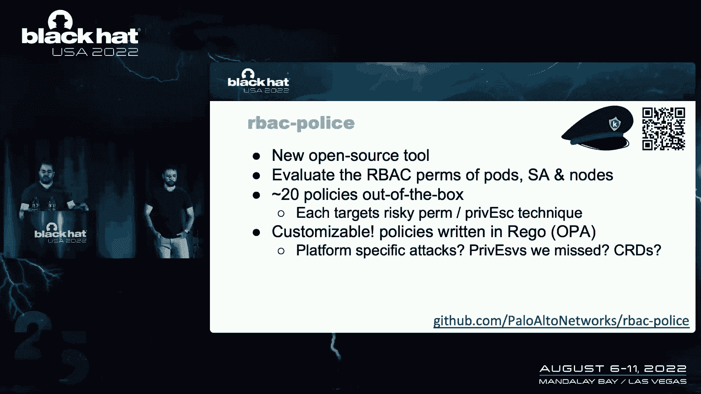

这是输出的样子。

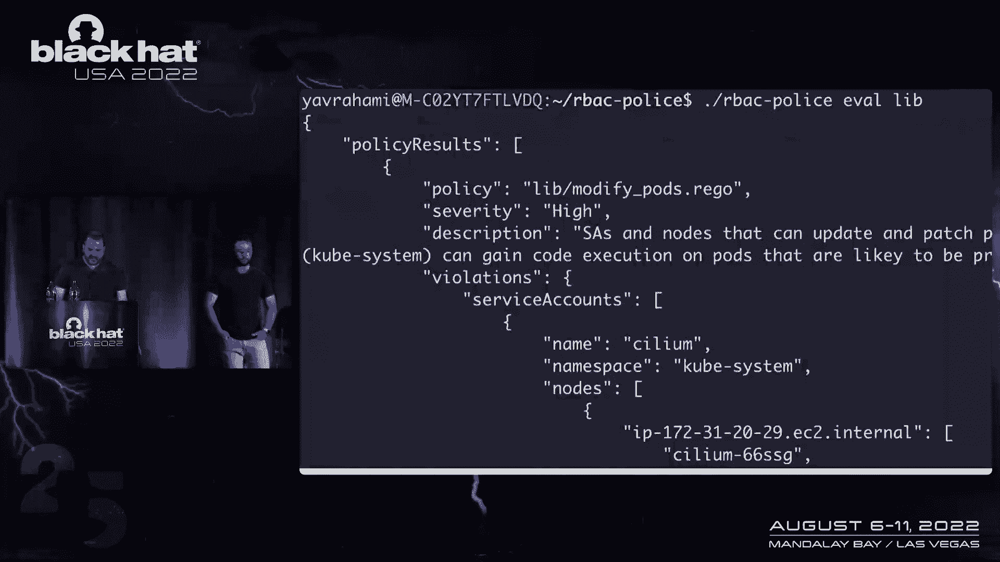

在顶部，在这个例子中，您有策略和严重性，UM策略，即调用启动特权升级攻击的身份搜索，通过修改吊舱来修改，在底部，你可以看到被侵犯的和有问题的许可的神，使攻击成为可能，实际上有这个服务帐户的部分。

这样你就可以跑到我们后面，警察，今天也是为了快速识别那些践踏豆荚和集群中的这种危险权限。

所以我把它放回给你们所有人作为外卖，谢谢，一些我们认为你应该能够，我们希望你能从我们的研究中得到，就像我们今天看到的，蹦床吊舱，强大的豆荚为Kubernetes集群引入了新的以前的升级途径。

直到单个容器转义允许您接管整个集群，我们实际上在很多平台上都看到了这一点，这实际上是常见的情况，这些攻击是由强大的权限驱动的，我们希望我们引入的框架，将强大的权限分类为不同的。

有趣的攻击类可以帮助防御者和攻击者，了解哪些是强大的权限，哪些是有风险的豆荚，现在重要的是要理解这些强大的权限，当我们从集装箱逃逸的镜头里看它们时，它们是相关的。

每当您有一组受损的Kubernetes凭据时，为了了解这些凭据是否真的强大，现在，我们认为我们今天谈论的问题的根本原因，它很难配置，一方面是许多看起来良性的权限实际上是强大的，我们希望。

我们今天在这里发布的强大任务列表有助于涵盖这一部分，我们的雄鹿的另一个特点是，它并不包括在所有的遵从性和安全性检查标记和基准中，Kubernetes的基准和清单，意思是它不是。

你检查的东西中的一个不必检查，为了得到一些符合性标准，所以在很多集群中，我们的背部没有得到太多的关注，是什么导致了它带回了一点虚假的信心，我们相信，因为您可能有一个通过所有安全检查表的集群。

所有的合规基准都显示绿色，但你仍然没有意识到你是一个单一的容器，避免整个集群受到损害，所以我们对想解决这个问题的捍卫者的建议，首先是你背部的监视器，您应该能够判断集群中哪些是强大的权限，你应该可以说。

你应该能够说出在好的情况下是否真的需要这些，您实际上可以删除一些权限，我们希望你现在能用艾伯特警察来做这件事，一旦您知道集群中哪些是强大的权限，我们建议将强大的部件与不受信任或公开暴露的吊舱分开。

并非所有强大的权限都可以删除，其中一些是必要的，所以你应该能够使用这种技术来限制容器的影响，逃跑，不可信的吊舱，和一个强大的豆荚在同一个节点上一起运行是一个相当有毒的组合。

我们在这次会议上没有讨论的一件事是审计，和入学政策，我们的报告中有这些，这些实际上可以用来检测和防止一些攻击。

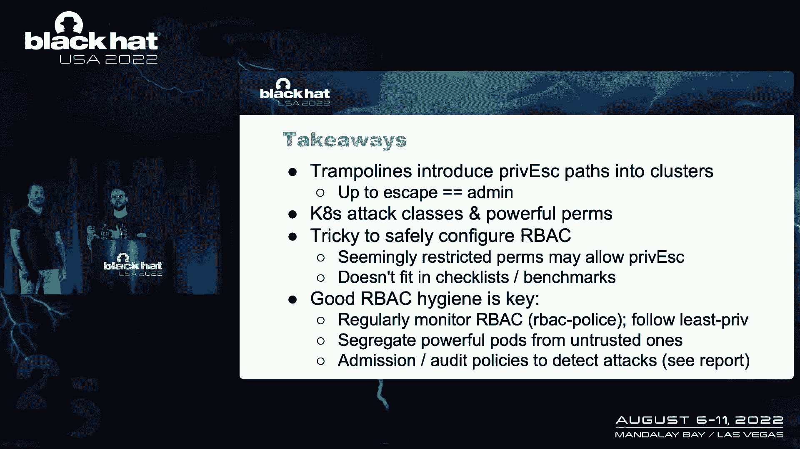

所以对于那些感兴趣的人来说，这是我们报告的链接，它是阿尔伯特的链接。