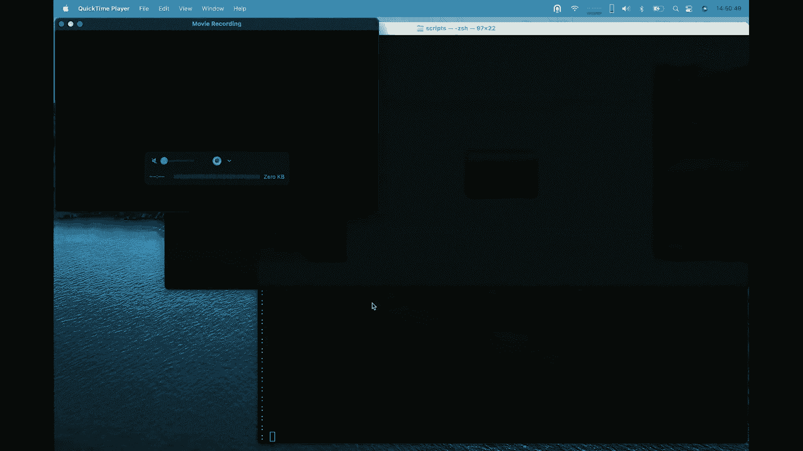

# 【转载】Black Hat USA 2022 会议视频 - P41：044 - Smishmash - Text Based 2fa Spoofing Using OSINT, Phishing Techniques and a - 坤坤武特 - BV1WK41167dt

非常感谢，是啊，是啊，我们今天在这里介绍我们关于两个FA旁路的研究，我们称之为粉碎，因为它真的是技术的混合，它被称为基于文本的，两个脸书，使用OSYN捕鱼技术和燃烧器电话，我们的刻录机。

我们把他们带来了，是啊，是啊，我们带来了一台旧的索尼埃克森和一部900年前的黑客手机，大家都知道，但不幸的是，你在电话服务方面遥遥领先，以至于你禁用了两个和三个，所以他们不在这里工作。

所以我们得用其他方法做演示，但你必须接受我们的文字力量，他们在瑞典工作得很好，在欧洲，在欧洲，他们工作得很好，我们没有时间买更多的现代刻录机，但想法是一样的演示在现代硬件上也是一样的，所以是的。

关于我们，我是托马斯奥利森，我在保安部门工作了很长时间，我也是扇区的创始人，在过去的美好时光里，我经常玩FS，我实际上设法赢得了FCCTF，回到路上，回到过去，所以它不再算数了。

在它变得如此大、复杂和难以赢得之前，我的意思是安全编码和安全开发，除了做黑客，我喜欢攀岩、潜水和摩托车，真正安全的运动，其实，迈克尔，是啊，是啊，大家好，我叫麦克，黑客，也是Fire的联合创始人。

也是撬锁器，也是一个情报收藏家，所以基本上这个谈话，如果你不想参加整个讲座，我将从我们的结论开始。

所以结论基本上是短信，双因子短信，结束，这对我们很多人来说都不是新闻，我在电信业工作，这不是新闻，自从短信出现以来，它就被打破了，它从来没有打算用这样的东西，我们一直在欺骗短信，只要我们一直在黑。

迈克尔有一些很好的故事，是啊，是啊，我有一些很好的例子，一个同事在国外，他收到了当地警方的短信，他的COR有欺诈性指控，所以他打电话给他们，但当然，当你被指控时，当地警方不会发短信。

所以这些技术已经工作多年了，就在现在，我们看到这种武器化的主流采用，但实际的黑客技术一直存在，所以在过去的几年里，有一点设置场景，它开始于你看到的某个日期大约在21617年，但后来它就升级了。

你在媒体和计算机媒体中看到的地方，关于他们如何做的细节很少，就像哇，通过钓鱼接管账户，mishing，他们绕过了两个FA，所以我们很感兴趣，哦，他们清空了账户，灵魂还是数据，或者比特币或者NFTS。

因为这在密码空间中一直很活跃，你可以想象，所以我们想研究一下，他们是怎么做到的，有什么方法，怎么做，他们做得像，你到底需要什么来促进这些攻击，我们能以一种好的方式复制它吗，在演讲的最后，我们将讨论。

我们实际上如何防止这种情况，我们能做些什么来改变它，第一次黑客攻击引起了主要媒体的关注，几年前绕过了前景吗，但当一个研究人员实际上是一个错误的配置或开放端口时，在Exchange服务器上。

进入并更改两个因素身份验证设置，所以那个不算在内，我是说做一个搭桥手术，但你实际上是在黑客攻击Outlook，或多或少地关闭，我认为这是作弊，因为那样实际上就不是，如果我绕过，更多的是配置错误或漏洞。

但如果你看看更现代的黑客，我们有加密通信，所有现代密码交换，例如，在过去的几年里遭到了袭击，损失了数百万，所以我们研究了其中的一些攻击，这个任务的趋势是，我知道推特上有讨论，就像。

我们为什么需要另一个词smishing来形容这个呢？我同意这是它自己的事情，所以我有点反对，我认为钓鱼和钓鱼很不一样。因为我们的大多数网络钓鱼保护机制只适用于电子邮件，和您的内置浏览器。

它实际上不能从应用程序中工作，如果你在，像电报或信号，所有这些链接实际上都会让你，我们在统计上看到的，根据一些研究，不是我们自己的，但就像我们看到发送的mishing链接数量大幅增加一样，去年。

在过去的几周里，你们中有多少人收到过未经请求的短信，是啊，是啊，好像我一周至少有十个，原因是，你的电话号码越来越多地被泄露在泄密盒上，攻击者开始利用这一点，实际上很难验证，这些消息发送者的完整性，因为。

这实际上导致了高达3。5%的目标人群，实际上甚至不明白这次任务攻击的目标，所以出于某种原因，短信和电子邮件仍然有更高的隐含信任，尤其是年长的用户群，因为它就像没有，我收到了警察的短信，就像迈克尔。

好像没有，我要报警，因为警察发短信给我，但我们都知道你可以欺骗电子邮件，你会收到数百封垃圾邮件，我们现在已经到了那个地步，但是市场还没有饱和，所以你仍然有更高的信任，这就是为什么这些攻击有更高的成功率。

这就是为什么我们看到他们如此增加，也为此做出了贡献，我们将在演示中展示，是手机浏览器的功能，这实际上落入了攻击者的手中，哦，这就把我们带到了内部来源，泄露数据的使用，不停地滚动，滚动，滚动。

上周我们的推特被泄露了，我们还没有索引，然而，我们有样本文件，我们有那里的电话号码，所以泄露的电话号码数量正在爆炸式增长，也是在来的路上，我不得不输入我的电话号码，不仅仅是我的电子邮件。

所以有越来越多的泄露的电话号码出来，这确实是迈克尔的强项，是啊，是啊，所以我们所做的是，每个人都知道所有常规的黑客论坛和攻破论坛，他们在那里引导这些凭据和电话号码，而且都在清晰的网站上。

我们把它们组合成一个弹性搜索，在那里它很容易被搜索，我们也一直在收集赎金软件网站最近也增加了，那么这些论坛对你来说是如何工作的呢，是啊，是啊，这里我们有一个网站的例子，他们在那里发布领导凭据。

通常它们都工作得一样，你需要积分才能下载这些狗屎，你通过发布垃圾或发布自己的泄密来获得分数，或支付，大多数可用的漏洞都是我，等在这些网站上公开提供，基本上是免费的，他们总是在，然后我们有泄密文件。

这只是今天的截图，因为我们喜欢与时俱进，这些是他们今天可以下载的公司，是啊，是啊，这是一个赎金软件网站，它显示了哪些公司选择不支付他们的好工作。

当我们做这项研究的时候，我们实际上收到了这么多垃圾邮件，喜欢你想买黑色的与会者名单两万二，所以我们必须这么做，所以我们实际上买了那个列表和索引，作为研究的一部分，花了多少钱？

我们得到了低于一百美元的价格，如果哪里像，如果你和这些人来回发短信，我们花了不到100美元买了黑猫名单上的所有东西，当它去，因为我们也在这项研究的数据集中索引了这一点。

所以是的，是啊，是啊，然后这里，大家可以看到，我们导入到弹性搜索中的一些泄露的凭据，现在大约有五亿，我们稍后会发布这些数据，它现在实际上是现场直播的，我们索引的5亿，是啊，是啊。

我们发现了超过10亿个泄露的电话号码的凭据，我们实际上还没有时间把它们都编入索引，因为它需要很长时间在数据是非常非结构化的。

在某些方面，所以基本上你所有的号码都是我们的，你想看这个的演示吗，我们可以得到一些电话号码，并将它们与电子邮件联系起来。

所以让我们先做那个。

他有一个比我更好的Unix pax，这就是为什么，是啊，是啊，所以让我们从寻找我们可爱的再见开始，在人群中，他总是一个很好的搜索目标，他在所有的漏洞中，我们不导入漏洞，如果布莱恩不是桥的一部分。

不值得进口，是啊，是啊，所以我们在这里看到，P贝塔实验室，领英，领英，刮擦和莱利com，所以我们也可以通过电话号码搜索，这实际上是布莱恩的真实电话号码，所以你可以打电话给他，如果你想，是啊，是啊，请做。

然后我们也可以做反向搜索，我们可以搜索布莱恩的电话号码，看看他在其他电子邮件地址下还登记了哪些泄密，所以这是真实的数据，其实真的很吓人，和反应使可用，像一个试验场，在那里你可以看到你的数据是否被泄露了。

你的电话号码被泄露了，我知道我是被骗了还是也开始进口了，但我们做了很多重要的事情，我稍后会发布链接，它们出现在幻灯片的末尾。

返回演示文稿，我猜该怎么办。

i，所以基本上我们认为的凭据过去只是用户名，密码，哈希，这就是我们所认为的证书，我们现在要做的是说，其实，如果您有用户名，密码和电话，用户名破解密码和您的电话号码。

您有一个很好的机会实际使用这些信息绕过一个，因为很多，两阶段解决方案只允许文本消息，美国的一些银行只允许基于FA的文本，你不能用P或任何更安全的设备，所以在很多地方你别无选择。

所以基本上这意味着我们已经索引了一个总数，你这里有数字，四十八亿，独特的电子邮件密码组合，我们有524个索引电话号码，非常接近十亿，这意味着我们可以把五个中的一个打成平手。

每五个电子邮件地址中的每一个到一个有效的电话号码，这就是对手的攻击范围有多宽，如果你这样做，所以我们研究了其中的一些攻击，我们会很快的，以及官方的回应，是啊，是啊，我们看到一小部分用户报告可疑活动。

但我们将暂停提款，这意味着这不是一个小数字，因为有很多人因为他们损失了很多钱，在这次袭击中，他们失去了加密点，几百个账户四百六十万，我们的研究表明是的，他们成为目标是因为他们有很多法律证书。

所以用户成为目标，因为他们泄露了凭据和电话号码，泄露的电话号码很重要，因为这就是为什么你可以用开放C绕过一个相似的两个，公开报道多起袭击，因为去年NFT超级超级流行，你可以花几百万买一只像素化的猴子。

如此如此出于某种原因，孩子们有价值数百万的像素化猴子人们想偷，所以钓鱼是钓鱼在这个地区袭击很普遍，所以基本上他们所做的，他们做的是发现人们的电话号码实际上做了一个粉碎的攻击，说着嘿，我们升级了合同。

所以你要保护你的像素猴子的安全，您需要升级合同并将其转移到新合同中，实际上他们从Open C一个字一个字地复制邮件，但他指着一份合同，他们执行将他们所有的实体转移到对手身上，哦。

当我们在做这项研究的时候，2。这事是上周发生的，他们也被攻破了，他们所有的联系人和电子邮件都被泄露了，是啊，是啊，是第三方，所以它不是，它不是他们自己的桥梁，但总的来说我们看到了很多桥梁看到了这次袭击。

例如，Coinbase说，为了访问您的帐户，这些第三方需要事先知道电子邮件地址，密码和你的电话号码，这基本上就是我们在这里说的，是啊，是啊，我们可以为五分之一的人到达那里，然而，在那次事件中。

他们还在帐户恢复过程中利用了一些漏洞，这是最常见的愚弄FA的方式，实际上是启动密码重置，然后愚弄了设备，所以帐户恢复，我们观察了五六起不同的袭击，其中两三个是账户恢复，第二个是短信注射，在其中启动登录。

你的一些网站，我的意思是你只需要用户名和密码就可以登录到基本功能，但如果你想转移，那么你需要有一个，所以攻击者在做什么，那就是他们正在发起转移，然后给肇事者发短信说，就像嘿，我们可以演示这个。

你的帐号有问题，输入您的凭据，在中间做一个人攻击，这也很常见，因为你有这些攻击，将Smishing与中间代理中的对手结合起来，所以当人们输入时，你实际上得到了真正的凭据，第四，我们不打算在这里谈太多。

但另一种常见的方法是SEM插孔，或sim克隆或seimport，基本上迈克尔，是啊，是啊，嗯，这在美国很常见，至少你让电话公司把他们的账户换成了另一张SIM卡，或者你可以用假身份证进去买然后说嘿。

我想为Verizon买一个新的订阅，3。你能把我的号码转接过来吗？从另一个男人那里你这么做，但这是众所周知的，但总的来说，帐户恢复过程是非常宽松的，这实际上是我的帐户。

所以如果我进去试着在谷歌上恢复自己的账户，谷歌有世界上最测试的众所周知的帐户恢复过程，因为他们有最多的用户，但即使那样，我也觉得有点放松，你把我电话号码的结尾泄露给我的其他电子邮件地址。

这泄露了很多数据，如果我们也有哑巴，但是是的，让我们笼统地谈谈短信，短信是在1984年发明的，作为GSM规范的一部分，第一条短信是在1992年发出的，然后说，圣诞快乐。

一开始他们在数据包里还留了一些填充物，所以他们还剩下几个角色，那里的一些工程师，就像，我们能用这个做什么，哦，我们可以放入七位ASCI，我们可以在线路上编码并在网络上运行，然后短信基本上诞生了。

它根本不是一个安全协议，字面上，没有任何验证，除了它是七位ASCII，没有发件人验证，没有校验和，没有什么，就像七个位的ASCII，在行上编码，然后拉起来，所以收到一封电报。

或者圣诞老人的短信根据规范同样有效，就像一个电话号码，这就是为什么我们现在看到的，我们收到了所有这些短信，像威瑞森，或者你收到这些短信，就像不是故意的，但这就是协议的使用方式。

所以有几种方法可以通过手机手动发送短信，但通过模式他们和旧手机，我们要在这里演示，但这很好，因为我们没有时间下来，无论如何，但你要相信我们，你可以插上USB电缆，写八十，大约八十条命令。

把它转换成一些询问，把它送走，或者您可以使用API服务，这就是我们要演示的，现在这个。

好的，现场演示总是这样，嗯哼。

所以我们在这里看到的是对手的攻击点，我们看到电话在左边，这是我真正的普通手机，然后我们有一些脚本将使用API提供程序，我们实际上被屏蔽了，不是因为恶搞这个烂摊子，因为那完全没问题，我们被阻止了。

因为我们发送的一些有效载荷，我们被一些供应商坏了，所以我们换了另一个，实际上有数百个供应商在那里你可以，它没有显示在屏幕上，所以我收到了Binance的短信，让我们看看它是否会再次出现，我们再试一次。

你只需要看视频，那我就用这个，我们要试着用一根电缆让你看看这个，否则我们就得去看演示的视频了，你在录音，来吧，来吧，新型电缆联轴器，新短信，所以我点击了Binance文本，我面对ID，我用我的密码。

我们在这里看到的，如果你选择这里的窗口这实际上是在我的海苔里，确实有一个二进制帐户，这是真正的Binance账户，他们在那里发送我的验证码，您的请求和转移，如果这不是，您请注意垃圾邮件电话和短信钓鱼。

所以很明显我们也在做同样的事情，我们在复制他们的文本，基本上说你的账户因可疑活动而被冻结，解锁此手机或您的帐户，请到这边来，很明显域名不会是演示，粉碎网，我们不打算做Binance。

我们建立了自己的密码交换网站，别告我们，这样我们就不会被现场起诉，因为在这样的加密交换中这样做是不好的，这是我的电子邮件，看这里，有一个代码，这实际上是来自Binance的真实短信。

因为我们也在发起一个洛根或转移和繁荣，只要填满它，然后点击下一个，我们不是真的，我们接下来要打的是，我们重定向到，在这种情况下，加密com，因为这适用于他们所有人，在对手一方。

我们实际上得到用户名和令牌，以及实际登录并完成传输的会话令牌，正如你所看到的，其实在电话里很难发现，你实际上是男人和磨坊，被攻击和钓鱼，问题是短信实际上出现了，这里实际上我们有另一个脚本。

所以我们实际上是在给自己发短信，也可以从FIO发短信，这是我们公司的名字，因为耶，你可以从任何地方发送短信，你也可以为谷歌这样做，我们有一些谷歌的样品，我觉得，来自谷歌的Auth消息。

因为他们实际上说来自谷歌的Auth消息，它出现在我的正常Auth消息中，Coinbase正在使用相同的短代码，您帐户上的可疑活动，请验证您的凭据，是啊，是啊，我会一直这么做，拜托了，这些链接，非常好。

如果这里的互联网更快，你会看到现在发生了什么互联网不是超快的，但我们最终会收到请求，你可以从对手的角度看到，在路上，问题，让我再点击一次，让我们看看这个，无法编写来自中间客户端的最后一个响应。

我们可能要播放录音抱歉，再次点击，再次点击，所以他们不会，但在今天早上之前效果很好，所以我们归咎于网络速度，其实，我会说，让我们做视频，是啊，是啊，做那个视频，哦，好的，现在，只是因为我这样做是低速的。

所以基本上如果我们在这里有更快的速度会发生什么，实际的预填充实际上会覆盖条形图如果你再次显示手机，所以这里发生的是我预先填写的登录凭据，到谷歌，所以我要用黑猫去找任何，我的谷歌验证码很小。

这里实际上是预先填满的，让我们停下来，所以这里发生的是我从谷歌获得的证书，这些是真正的凭据，实际上是在代码中预先填写的，即使我要去找中间的一个人，而不是预定的地点，因为它们来自同一个被欺骗的来源。

所以我现在登录，现在我们会得到一个错误，因为我被重定向到SE域，我没有这个演示的证书，但正如你在这里看到的，我们已经在对手那边有令牌了，所以我登录了我的谷歌账户，没有真正的TFA代码。

和代理中间的那个人在一起，所以是的，很抱歉演示有点电缆和缓慢的互联网，但这就是我的想法，如果你把自己投入到学期中，这就是人们所做的。

然后我们发现如果你是专业的，如果你是个大对手，你没有蹩脚的代码，然后你进入你著名的中文网站，你花160美元买硬件，你可以买一个定制的硬件，为你做所有这些短信拉屎，你甚至可以买更大的钻机。

比如大规模的攻击，你可以同时插入64张SIM卡，用蛮力把这些赶走，有趣的是，它们实际上是由像你也可以从80个命令中改变，e，i，e，数字，就像您发送的硬件数字一样，所以你完全不能被跟踪。

你也可以将MSC发送器发送到这些设备上你喜欢的任何地方。

这个你可以从eBay上订购，有趣的是，他们中的一些人实际上在他们的营销材料中，看看那个截图，他们实际上是在用，像十年，您的谷歌验证码，所以这是一个众所周知的秘密，这是可能的，又不是没人听说过。

他们实际上是在用这种方式营销，所以我们刚才展示的想法是，我们有一个鱼使用者，对手在中间，TLS设置，但我们仍然可以做到这一点，所以好吧，我们随着时间的推移。

但我只想说一些关于防止这种情况的结束语，我们已经看到了几个真正有针对性的方面来防止这种情况，有几种方式Recaptcha似乎是最常见的，因为在那里你可以从哪个站点设置一个cookie，雷卡卡可以来。

所以你知道，至少作为用户的您会看到这一点，如果你在中间，在雷卡查有一支箭，一些站点正在用云前cookie进行保护，你可以用类似的方法，你很可能用核心来保护，我们正在用这个做一些实验。

在API服务之间正确设置核心中心，大家都习惯了这个粗糙的星星，像到处一样，每个人都喜欢，是啊，是啊，当然啦，是啊，是啊，那很好，但是你可以通过正确的核心设置来防止这些类型的攻击，所以有办法防止这些攻击。

所以我们完全公布了我们在这方面所做的所有研究数据，在一个S三桶下面，所以你拍一张这张幻灯片的照片，因为这是我们能想到的最好的，因为我们想尽快或尽可能晚地发布它，将尽可能多的数据放入此转储文件中。

转储文件大约是五六十次，所以这就是为什么我们把它放在三桶上，因为它是一个批号和电子邮件散列在其中，所以一个散列，这样你就可以，其实你可以自己搜，所以这五分之一的关键收获。

电子邮件帐户可以绑定没有电话号码，短信没有内置的安全性，他们可以被欺骗，在手机上很难发现假瞄准镜，因为手机实际上隐藏了你要去哪里的酒吧，手机会自动填充TOA令牌，帮助你的正确的，好的，谢谢大家。

我们又要为下一次简报做准备了。

