# 【转载】Black Hat USA 2022 会议视频 - P42：045 - Scaling the Security Researcher to Eliminate OSS Vulnerabilities Once and - 坤坤武特 - BV1WK41167dt

所以我们要做一些凯蒂在上次演讲中所做的事情，我要邀请后面的所有人站出来，这是我们很长时间以来的第一次演讲，尤其是这是Covid，所以我们邀请你站出来，我们不咬人，我们保证，所以嗯，呃。

欢迎扩展安全研究员，消除开放源码安全漏洞，我的名字是乔纳森·卢，呃，我是一名软件安全工程师，软件安全研究员，我是人类安全局第一个丹·卡明斯基研究员，我是GitHub明星和GitHub安全大使。

你可以在Jlightu的推特上联系我，你也可以在Jlightu的GitHub上找到我，我要把它交给我的副议长，帕特里克，是啊，是啊，我叫帕特里克，方式，我为自己工作，我是公开重写团队的成员。

我做软件已经二十多年了，是的，是的，很高兴能和你们一起工作，今天，嗯这么简短的免责声明，我是由GitHub赞助的，我们还在讨论一个可供出售的SaaS产品，但是我们讨论的所有工具、技术和过程都是免费的。

供开放源码用作安全研究人员，嗯，这项工作得到了新的丹·卡明斯基奖学金的支持，嗯，对于那些不知道的人。

丹丹最出名的是，他在2008年发现了DNS中的一个漏洞，然后默默地在整个行业工作来修复，很遗憾，我从来没有机会见到丹。

他去年不幸去世了，丹·卡明斯基奖学金是为了庆祝丹的记忆和遗产而创建的，通过资助开源工作，帮助世界变得更美好、更安全，如果您对满足这些限制的项目感兴趣，或者你知道的是试图在那个领域做些什么。

Human目前正在接受二十二的申请，丹·卡明斯基研究员或二十三，嗯，所以这个故事从一个简单的漏洞开始。

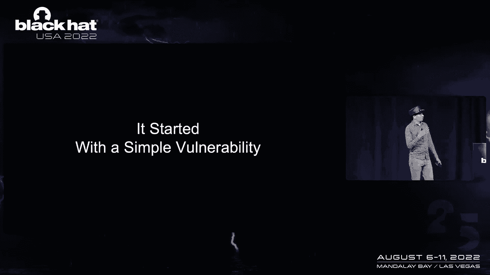

这就是，它是在gradle构建文件中使用http，这就是这个漏洞很重要。

因为，如果您使用http来解决依赖关系，在Gradle或Maven构建文件中，你把你的身材留给一个在中间攻击的人，并使您的工件被恶意攻击者修改，你在Java生态系统中，至少。

没有对下载的工件进行额外的身份验证或验证。

这个漏洞不仅仅存在于Maven或抱歉中，在年级，它也存在于Maven构建文件中，这是下载依赖项的示例，用于编译器和测试依赖项，这意味着代码将在您的Cicd管道中执行。

这是它被用来上传构建中的工件的一个例子，这通常就结束了通过网络暴露的凭据。

当我开始查看开源项目时，这个漏洞无处不在，它是在春天阿帕奇的项目中，红帽子，科特林，喷气大脑，詹金斯，分级，时髦，弹性的，日食，更多的神谕，所有这些开源项目，由这些维护的所有开源项目。

这些嗯组织很容易受到这种影响，我联系了Maven Sonotype，Maven Sonotype是Java系统的工件服务器，它们是蟒蛇生态系统的关键，Java生态系统的NPM。

他们告诉我在1919年的一月或六月，他们25%的流量仍在使用http，而不是https来解决依赖关系，那么我们怎么解决这个问题，我们怎么，怎么，1。你是怎样处理这事，广泛的共同安全，想影响整个生态系统。

我在1月15日提出了一项倡议，Java生态系统中所有主要的工件服务器，是否会放弃对http的支持，转而只支持https？我又联系了Maven Central，他们说，在我们之后，我们的揭露。

很多博客文章，百分之二十我们还在使用http，即使在我们发出所有的沟通之后，所以你可以想象一月份可能会发生什么，在2020年1月15日，坏掉的软件，到处都是坏软件，但我们止住了出血，呃。

但是其他存储库呢，这些只是Java生态系统中最常用的存储库，其他公司在自己的服务器上托管JAR工件，那些不在这个列表中，嗯，那么我们如何修复其他容易受到这种攻击的开源项目呢，我说，让我们试着把它修好。

让我们做批量发电，因此，首先你需要如何识别哪些项目是脆弱的，所以我这样做的方法是编写一个代码来查询，给我一个易受攻击的项目列表，这是这里的查询，这是一个非常简单的，嗯。

代码QL是GitHub的代码查询语言，当你每次建造它的时候，有一个开放源码项目的提交，coql尝试构建该项目并构建数据库，和安全研究人员一样开放，我们可以大规模地对代码QL运行查询。

目前有十万个开源项目使用QL构建数据库，对于此查询，GitHub安全实验室赏金给我。

两千三百美元的赏金，然后在这上面，我取了查询列表，是GitHub提供给我的结果列表，我说让我们去生成拉请求，所以我用Python写了一个机器人，它是GitHub Hub CLI的包装器。

它有一个讨厌的正则表达式，还有很多从GitHub的速率限制器反弹的逻辑。

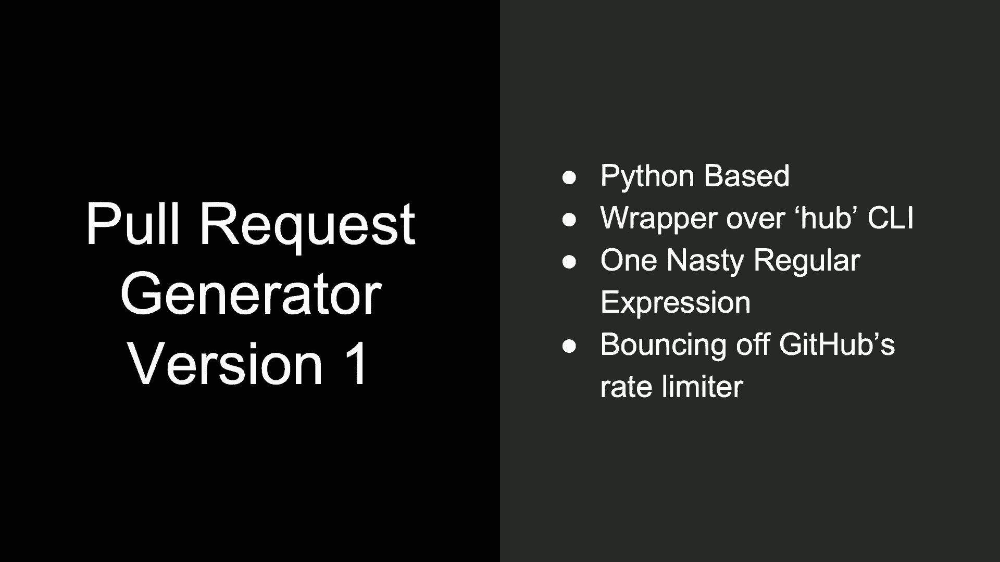

这就是逻辑，这下面其实是个发动机。

但这是一个很高的水平，我们用来生成拉请求的逻辑，这是一个讨厌的正则表达式，我们必须使用正则表达式的原因是因为如果你使用，嗯，如果使用XML解析器修复XML文件，中解析XML时。

然后你在做完修改后把它倒回去，它以XML解析器转储的格式出现，不是以进来的格式，所以你最终会产生这些巨大的差异，大多数维护者不愿意接受的你，因为它肯定修复了安全漏洞，但它看起来不像他们最初的代码。

所以他们不愿意接受，但是正则表达式的问题是，如果您使用正则表达式来解决问题。

现在你有两个问题，嗯，但它起作用了，嗯，这是我的拉请求饲料。

呃，对于此漏洞，这是差异的一个例子，您可以看到http被https所取代，你知道文件中有很多不同的地方。

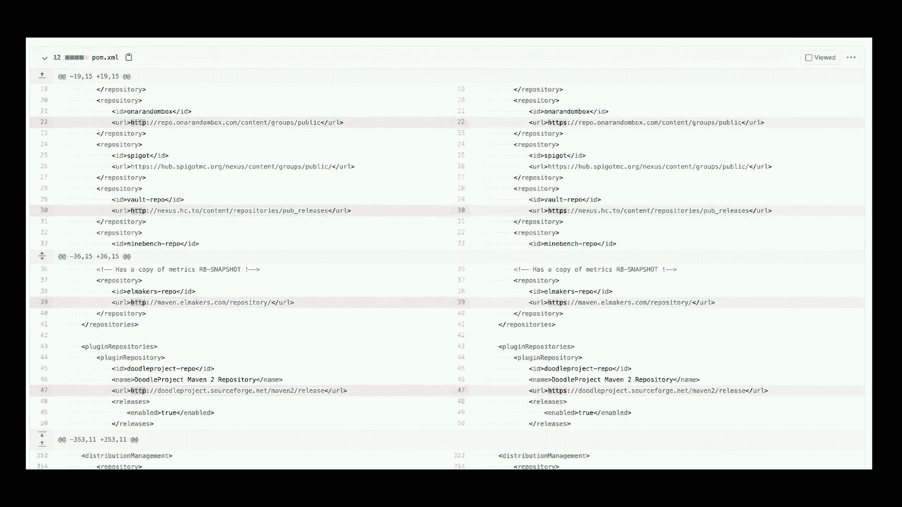

对于这个项目我产生了一千五百九十六个请求，截至二十二年，大约有40%的合并率，也就是，你知道吗，相当可靠，为此，GitHub安全实验室赏金，我，另外4000美元用于大规模修复此漏洞。

我迷上了大块陆壳产生的想法，这是我的GitHub贡献图，二十块二十块，呃，这是我产生的大量媒体的两个高峰，嗯，它是，你知道，只是只是，你知道看到撞击很酷，你可以拥有，所以我有个问题，这不是问题所在。

问题是我追松鼠，我喜欢查看和阅读漏洞披露，当我读到漏洞披露时，我可以利用我在漏洞披露中发现的知识，我可以说我想知道这还在哪里，我可以找到那些漏洞，我可以找到很多，有太多的漏洞，我发现当我这么做的时候。

太多开源安全漏洞，这并不是说，开放源码比封闭源代码更不安全，只是我更容易找到，这是一个名为Zipp Slip的漏洞的示例。

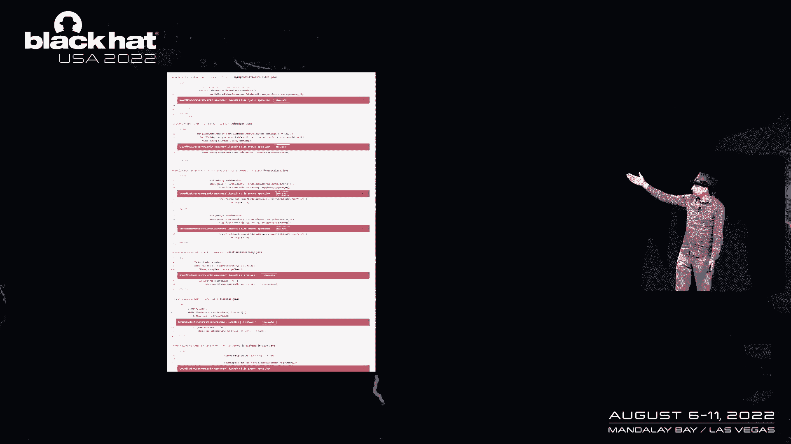

我可以支付这是一个代码的结果，ql查询，我可以翻阅结果，我可以像这样滚动一页又一页的结果，识别并指向源代码中的确切位置，开源软件中存在ZIP漏洞的地方。

所以我需要一个解决这个问题的办法。

我需要自动化，所以在这一点上，我想把它交给乔纳森，或者对不起帕特里克，讨论大规模的自动化精确转换，是啊，是啊，乔纳森有一个挑战，他肯定发现了很多弱点，他想修复这个世界，而是二十二十。

他尝试使用XML解析器，他为了一个简单的改变得到了一个巨大的差异，你知道，这让我想起了软件工程师，我们是专业的汽车制造商，我是说，我们就是这么做的，我们自动化任务，我们中的一些人已经做了很长时间了。

但现在是二十二，我们仍然不能自动化我们自己的任务，带有中断更改或框架升级的依赖项升级，我们仍在艰难地经历更新的痛苦过程，但幸运的是现在是22我们有一个解决方案，我很幸运，我开始使用开放重写项目。

简而言之，开放重写是一个框架和一个用于询问和转换的API，源代码的编译器语法表示，那么语法表示是什么呢，所以编译器把这个东西叫做抽象语法树。

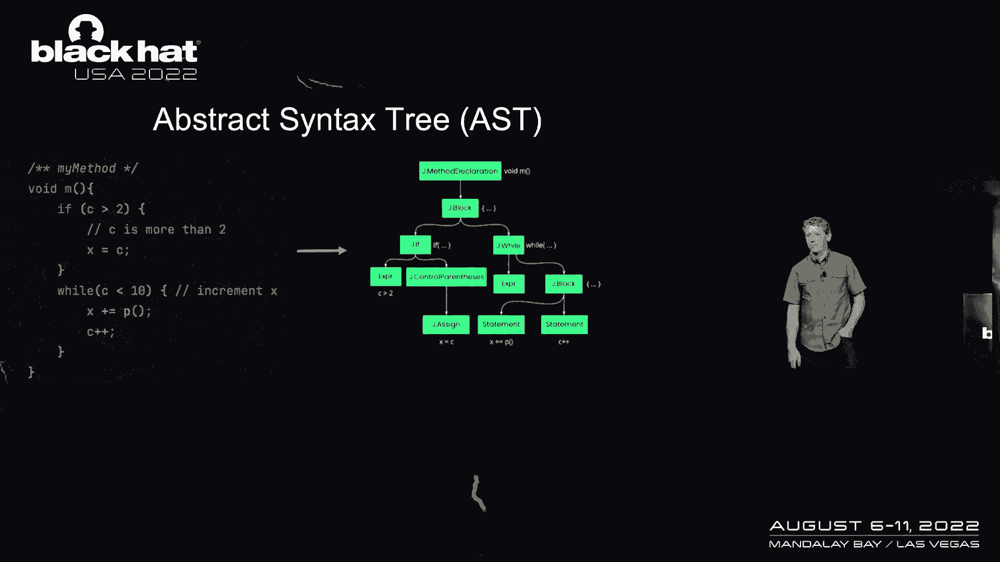

如果你看着它，你可以看到嘿，我可以用那棵树做点什么，对呀，我是一名软件工程师，我打赌我可以自动化我需要做的修复，有一个问题，虽然，以及Jonathan使用XML解析器的经验。

那就是编译器的抽象语法树是最小的，没有制表符或空格，没有评论，它只有单一级别的类型信息，为了能够使用这个，需要一些工作，为了一个转变，这将通过代码审查，这是第一批，第一个挑战是解决了开放重写。

这是创建一个保存ASD的格式，所以当打开重写解析器时，就是审问和建造，使用编译器构建抽象语法树，它正在将该进程与源文件同步，所以树的每个节点都有它的前缀，它很烂修复。

它的空白，它的评论和很酷的事情是它能够喜欢，检测，整个源集的样式，它允许像乔纳森这样的人写食谱，做一个改造，并使其对源文件正确，它会有制表符或空格，它会在新的生产线上有大括号。

乔纳森不必进去更新每一个差异，具有正确的格式，开放重写框架能够为他处理这一点。

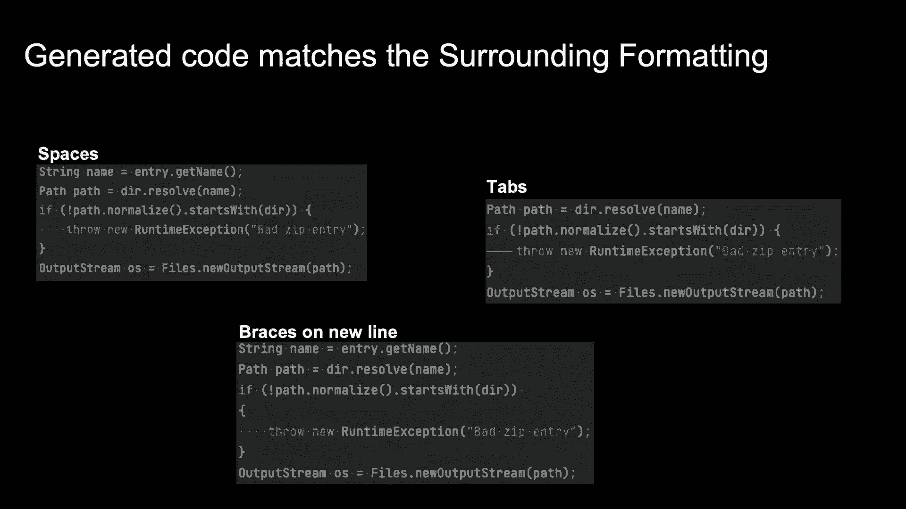

还有一个问题，尽管您需要完整的类型信息，正如我提到的编译器源代码树，这是最低限度的，它有单级类型信息，但是您真的需要知道每个节点的类型的全部深度，对呀，所以您有一个日志信息语句，是j的对数吗，对于j。

它是返回日志吗，为了真正使用这个框架并进行精确的转换，这很关键，因为你不能造成伤害，您需要有完整的类型属性，所以说，打开重写也解决了这个问题，开放重写抽象语法树既是语法上的，也是，语义感知。

这是一张很棒的照片，一边是编译器的语法树，在另一边，您可以将打开的重写为，如果没有另外6000个节点，我们必须删除，只是为了让它看起来像什么，除了一个线团，所以如果你看看那个，所有的权利，乔纳森有。

他有他的格式，他有他喜欢的类型，但现在他需要修改一下，是啊，是啊，即使是一个简单的，即使是一段简单的代码也是一个令人惊讶的复杂的ASD，如果我们要让乔纳森成功高效，我们需要一个模板引擎，他是个编码员。

他不是一个在A中的ASR权利，他一会儿就会在这里谈论一个弱点，他在修拉链，他需要把这个简单的条件语句插入到代码中，所以公开重写团队我们低下头，我们看到我们有一个模板引擎，允许程序员用他们的母语构建树。

它有类型替换，所以你可以替换参数，如果你注意到那里有很少的格式。

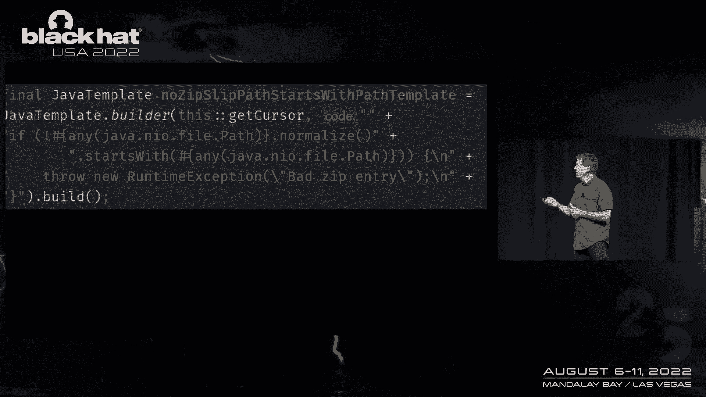

开放重写框架将为您处理所有的格式化，所以如果你把它粘在一个形式上，在带有选项卡的文件中，它将是制表符间距的，接下来是一个坐标系。

你需要能够把它插入正确的地方，所以在这里您可以定义您的模板，你可以说嘿，在此语句之后插入，这是我想替换的参数，所以有两个简单的语句，乔纳森能够检测到一个漏洞，定义修复，完美地插入属于它的空间。

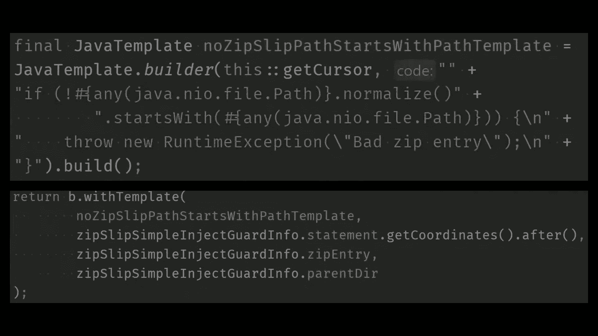

这里只是一个快速的例子，说明他能够在规模上做什么。

然后我会把它传给乔纳森，打开的解锁提供了什么，我们还可以用这个修复哪些漏洞，我要和你谈谈三个不同的安全漏洞，临时目录劫持，部分路径遍历和拉链滑动，以及露天率是如何让我们大规模修复这些漏洞的。

所以第一个漏洞是一个叫做温度的漏洞，临时目录劫持，它的存在是因为UNIX上的系统临时目录，类似系统在所有用户之间共享。

这就是漏洞，漏洞是存在的，因为它是在Java中创建一个临时目录，嗯，通过创建一个临时文件购买，调用delete然后调用mader，人们这么做的原因是因为在Java之前。

没有在Java中创建临时目录的API，所以很多旧代码都使用这种模式，如果你在堆栈上查找，如何创建临时临时目录，你会无意中得到这个漏洞，所以这个漏洞，此代码易受攻击的原因是因为存在竞争条件。

删除和MA之间存在竞争条件，因为当您创建临时文件时，你叫删除，本地文件系统上的另一个用户可以看到删除，然后与Java进程赛跑以创建dev目录，如果他们打败了Java进程制造者就不会失败。

它返回false，所以解决办法是把它扔好，你会看到一个不完美的修复是把制造者扔进，如果检查，然而，这不是，它还没有完全，这不是最好的解决办法，因为当你用mader的时候，它使用默认值。

你的名字和你的名字，将创建一个对所有其他本地用户公开和可见的目录，因此，您仍然容易受到临时目录信息泄露的影响，因此，正确的修复方法是将其替换为创建临时目录，这是一个在Java中引入的API。

爪哇一点七很老了，它已经存在很长时间了，这是一个安全的API。

对于这种脆弱性，我有不少简历，我确实报告了很多地方，但我说好，有比我能报告的更多，让我们尝试进行轮询请求生成，所以对于这个漏洞，我在开放源码中生成了64个轮询请求来修复此漏洞。

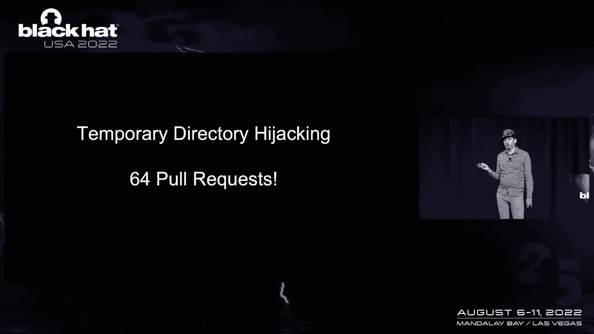

这是差异的一个例子。

您可以看到删除的删除，制造商的移除，我们用这条线代替它，这条线不再脆弱，转换可能会更复杂，你看，我们删除了这些不再需要的块，只留下这一行，这都是使用开放重写。

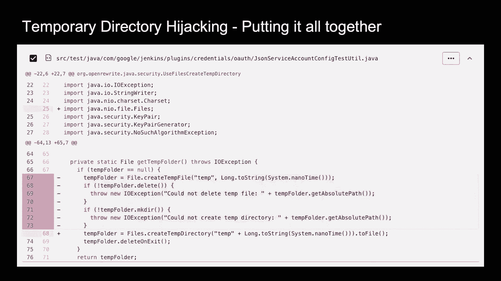

在第二个自动漏洞中，我想和你谈谈一个叫做部分路径遍历的漏洞，嗯，让我们假设本地文件系统上有两个用户，你想，您希望编写防止用户访问用户sam之外的内容的逻辑，但你也有。

系统上还有一个用户叫Samantha，所以说，部分路径遍历允许攻击者访问同级目录，前缀相同的，所以在这个例子中。

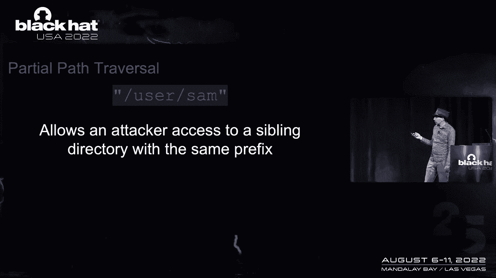

用户Sam和用户Samantha共享相同的前缀。

这是一个易受攻击的代码，它很脆弱，因为当你在Java中有一个新文件时，你叫它得到规范路径，您会注意到返回的字符串丢失了，文件中最初的尾随斜杠。

所以当你看这个逻辑时，脆弱性，让我们假设您有一个用户sam，您有一个用户提供了恶意值，进来用户点斜杠萨曼莎，当你调用它时，得到规范路径，它使路径规范化，它变成了用户萨曼莎·巴兹。

它确实从用户斜杠SAM开始，所以我们的守卫被绕过了，因此，这个漏洞的修复是以原始示例的这个例子为例，你的一个选择是重新添加路径分隔符，但你还在和弦比较，有更好的解决办法。

更好的解决方案是使用Java的双路径对象，首先不是比较字符串。

但是比较这些路径对象，那么我们如何找到这个漏洞。

嗯，首先我们去找它，我们从调用开始寻找Java字符串，然后我们在之前和之后寻找这个get规范路径调用，但我们也想找到当我们找到这个漏洞的位置，文件传递分隔符不存在的地方。

因为我们不想修复代码中不易受攻击的地方，没那么容易吧，开发人员将以许多不同的方式编写代码，如果开发人员编写这样的代码怎么办，他们把它提取到一个变量中，或者他们将参数提取到变量，还是你，他们修复漏洞。

但是在提取的变量中，你如何用自动化来检测这一点，和你一起看演出。

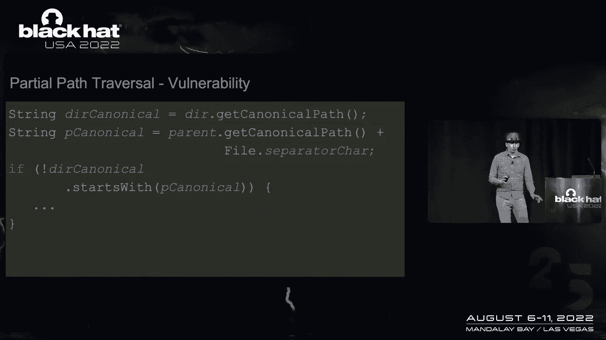

你知不知道这是易受攻击的，我们需要数据流分析。

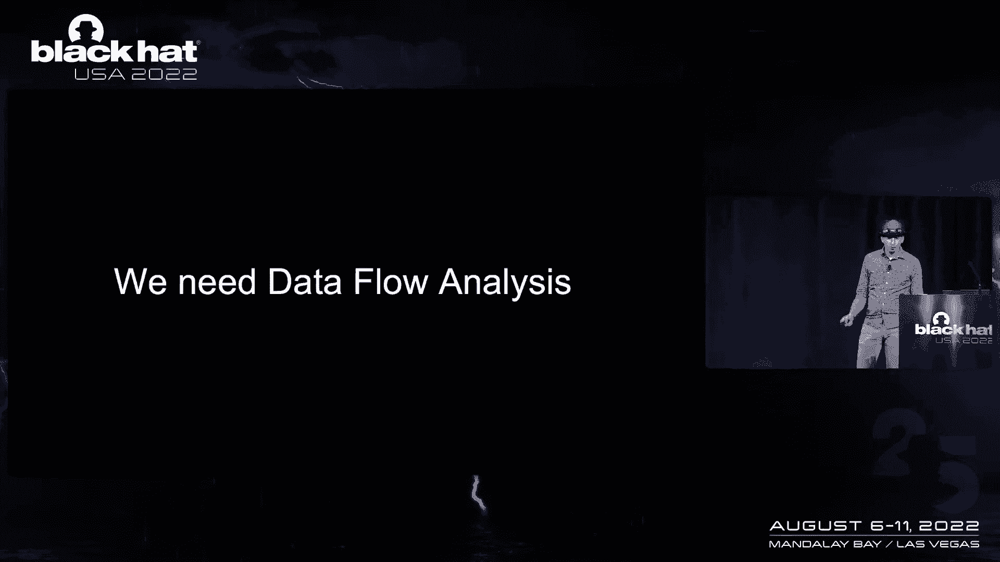

数据流分析允许我们确定运行时变量可能是什么，例如，我们可以回头看，看到这个get规范路径被分配给这个变量，并流向那个用途，也是为了另一个论点，也会发生，数据流不仅仅是，你知道吗，一步到位。

它可以通过多个步骤和更复杂的呼叫链进行操作。

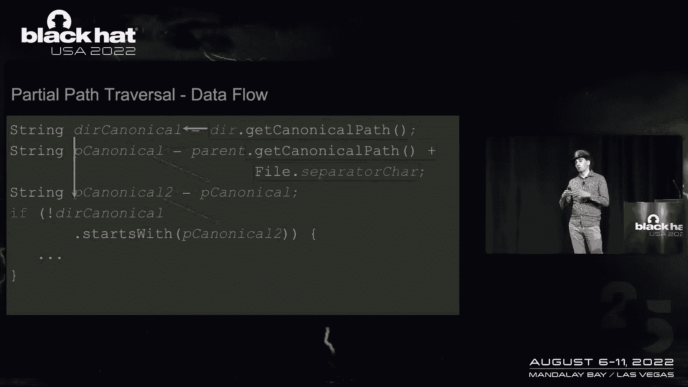

嗯，数据流允许我们发现难以发现的漏洞，并防止假阳性。

这是数据流API，如果你写了任何代码QL，我知道你们大多数人可能没有，但是如果你写了任何代码QL，我为之创建的数据流API，这与代码QL非常相似。

你可以很容易地在这两者之间来回翻译你的知识，这是修复的一个示例，您可以看到文件获取父文件，我们把它拉回到新的生产线上，我们正在修复和修复这个漏洞。

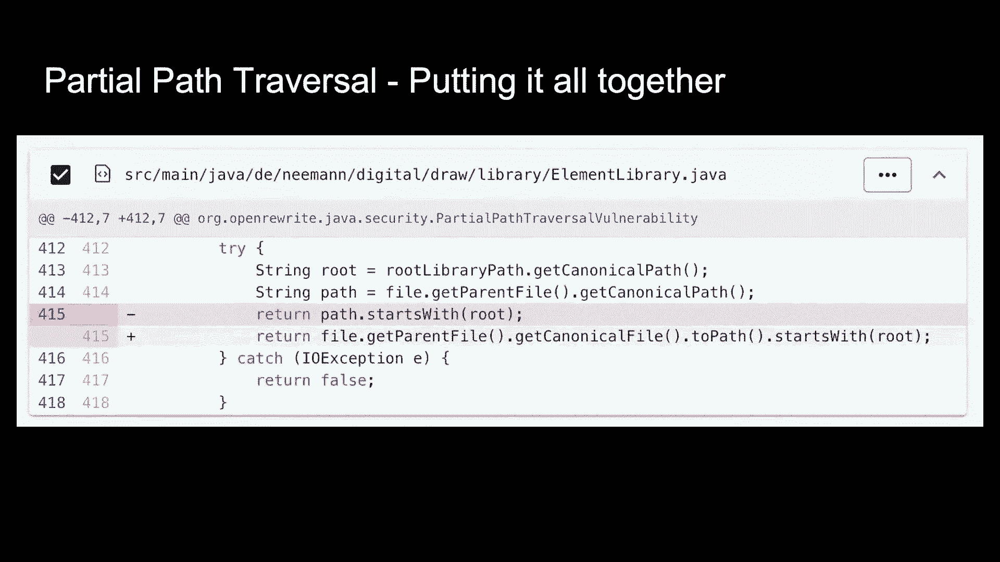

我想和你们谈谈的第三个弱点，关于你的一切都是拉链拉链，zip zip是一个旧漏洞，它最初是在很多年前的Frack杂志上讨论过的，嗯，但是SNCC对这个漏洞做了一些研究，最近他们在2018年做了一些研究。

发现了一堆容易滑落的项目，并报告了此漏洞，不幸的是，他们发现的一些修复方法，他们报告说修复有些不完整，正如我在我所做的一些工作中发现的那样，zip从根本上说是一个路径遍历漏洞，解压缩zip文件时。

因为zip文件是zip内容的条目名称。

这是ip在Java中的幻灯片，漏洞的存在是因为这一点点逻辑，从zip条目中获取名称。

那个值，它可以是路径遍历有效载荷，正在流向创建一个新目录，因此这可能导致远程代码执行，因为您可以解压缩zip文件的内容，可执行文件上的条目，就像垃圾箱一样。

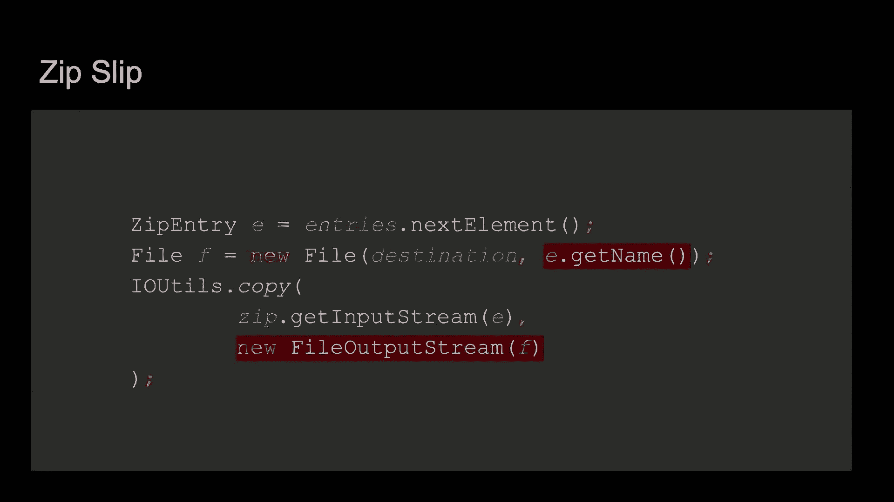

这可能导致远程代码执行，拉链滑动很复杂，而且修复起来很复杂，它复杂的原因是，因为您需要添加此保护以防止此漏洞，所以问题是这不仅是一个有效的修复，但这也是这也是一个有效的修复，你如何确定，一次又一次。

我们不想修复不存在的漏洞，因此您需要检测漏洞的存在，或者如果它不存在，也不存在，修复不存在的漏洞，那么我们如何确定这是否得到了充分的保护，答案是，我们需要控制流分析，这在开放重写中也不存在。

所以我们加了，嗯，它让我们确定这个逻辑。

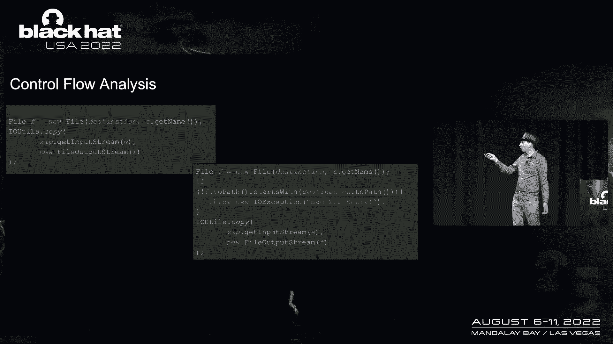

这个警卫在不在，并帮助我们确定是否修复漏洞。

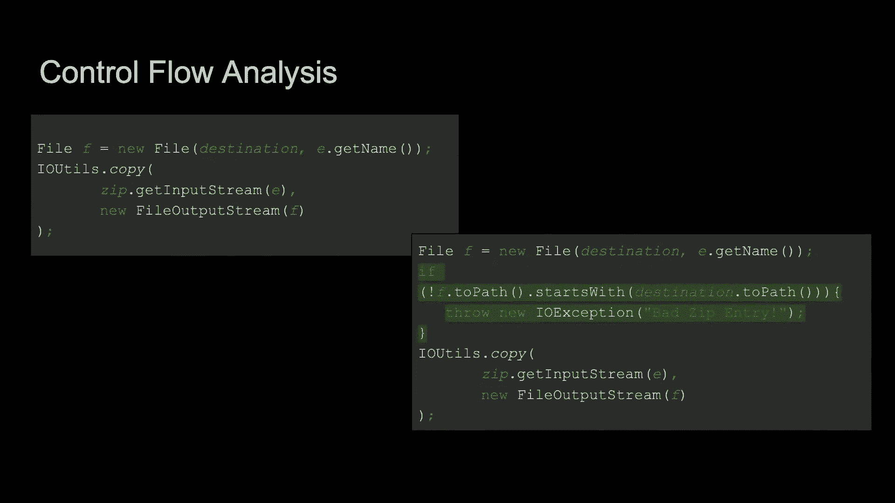

这是控制流分析，这张图是由我出色的实习生沙姆创建的，以展示，它让它创建一个图形，显示，有基本方块的地方，它由将要同时发生的操作序列组成，然后是条件节点，在有点的地方。

逻辑会跳到哪里，和拉链，在这种情况下。

如果我们把拉链，如果我们建立控制流分析图，我们可以看到，通过遍历控制流图来适当地防止这种情况，因为当它是假的时候，从调用开始，或者当它，是啊，是啊，当它是假的，那个逻辑不会，脆弱的逻辑将无法到达。

这让我们知道漏洞不存在，我们不需要修复它。

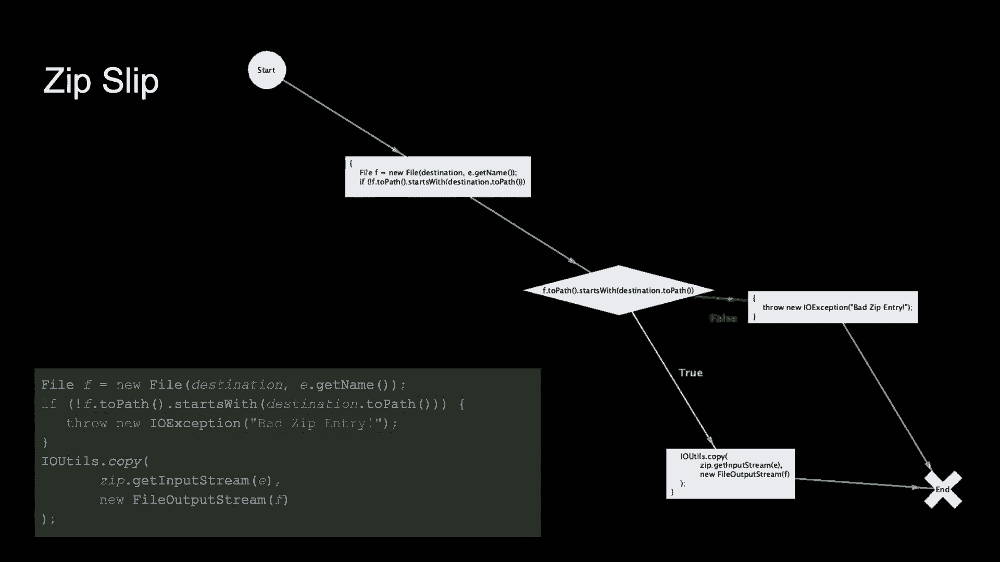

所以当我们把这一切放在一起，所有这些技术，数据流分析，控制流分析，我们能够修复开源中的Zipp滑动，这是我们为之生成的修复的一个示例，其中一个项目，这是另一个我们也清理文件构造函数的地方。

当我们在工作的时候，只是为了，你知道的，成为优秀的开发人员。

然后耶，所以在这一点上，我想和你们谈谈极地生成的复杂本质，但如果你有安全漏洞，我们会给你一个拉请求，这是极地印刷机产生的一个问题，我们面临的一个问题是生成拉请求的速度有多快，呃，如果要生成轮询请求。

你必须做三件不同的事情，文件中有i o get操作和GitHub API调用，我是免费的，基本上它在你的机器上，it操作在github上是免费的，github api调用是有速率限制的。

所以你必须考虑你在做多少，所以你做的第一件事，查看源代码分支并将diff fork应用于存储库，这是第一个被称为GitHub的API，我们正在阅读GitHub上的存储库，这很重要，因为如果你分叉十个。

数百人，成千上万的项目最终会有名称冲突，您需要将其重命名为一个不冲突的名称，点击器有点烦躁，你按下零钱，然后在GitHub上创建一个拉请求，为此，我们有三个API调用GitHub，对于他们中的每一个人。

除此之外，还有额外的利率限制，在这些上面，他们记录了一些，你必须处理，嗯，所以如果观众中有谁来自GitHub，嗯，让我作为安全研究员的生活轻松多了，嗯，但我们走了这么远，我们已经检测到漏洞。

我们检测到了，我们已经修复了代码，并将其修复在代码中，以与开发人员风格相匹配的方式修复代码，我们绕过了费率限制，我们如何为所有的存储库做到这一点，我要把球传给帕特里克，嗯，你永远不会从鸭子那里知道。

他是个很谦逊的人，嗯，但他没有提到的是控制流和数据流并不存在，在乔纳森和沙姆之前公开重写，这些家伙，他们低下头，他们需要数据流和控制流，这并不容易，但他们，他们成功了，他们低下头，他们努力工作。

并代表社区，我们肯定要感谢他们的努力，所以下一步是对的，他有他的，他收到了他的投票请求，他能喜欢，在成千上万的项目中发现这些漏洞，Moderne为开源项目提供免费服务，到目前为止。

它已经吸收了大约7000个项目，嗯，你可以运行它的800多个食谱中的任何一个，大规模转换或查询软件，生成和更新拉请求，所以你知道，我将在安全上下文中提到框架迁移，这里。

它是能够自动化代码转换的伟大之处之一，让我们采取，比如说，a j单位，四到五的迁移和弹簧引导一到二。

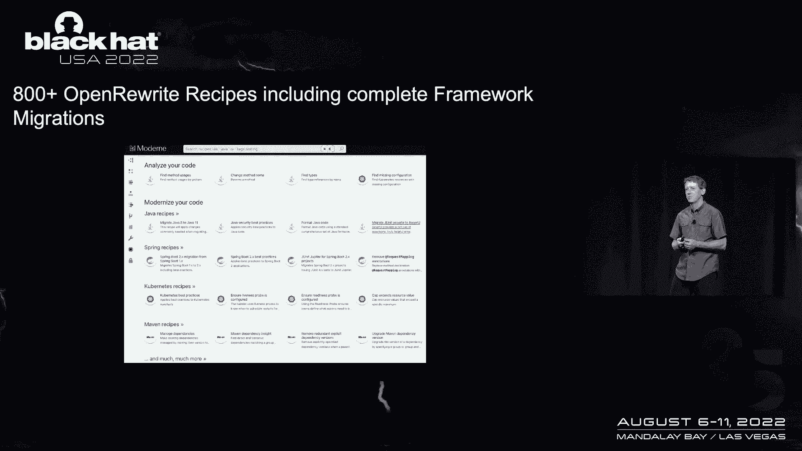

为了安全，你需要把你的应用从春季开机1号转到春季开机2号，为了从斯普林伍德一号跳板到二号跳板，你得从四点到五点从斤走，我不知道你是否经历过这个过程，但很乏味，有大量的突破性变化，因此，利用开放重写框架。

我们能够构建完整的框架迁移，这样您就可以让您的项目在当前的情况下是安全的，所以无论如何。

回到我在Madea将为开源项目提供服务，乔纳森已经能够利用它大规模地构建投票请求，所以他可以用他的拉链食谱，他的临时文件目录食谱，它会穿过，它会检测到变化，并实际构建这些格式化良好的拉请求。

所以给你一个例子，这是如何进行的，乔纳森经营他的食谱，他会说，好的，我有这些变化，我要建立我的拉请求，他要经历，他要建一堵墙格式化的信息，他要签署他的退出请求，给它一个gpg键，说嘿。

去比赛并构建拉请求，并将这些发送给所有的维护人员，所以这就是乔纳森能够利用的，这是他们工作的最后一步，他们的安全配方、控制流和数据流。

说完我就把它还给乔纳森。

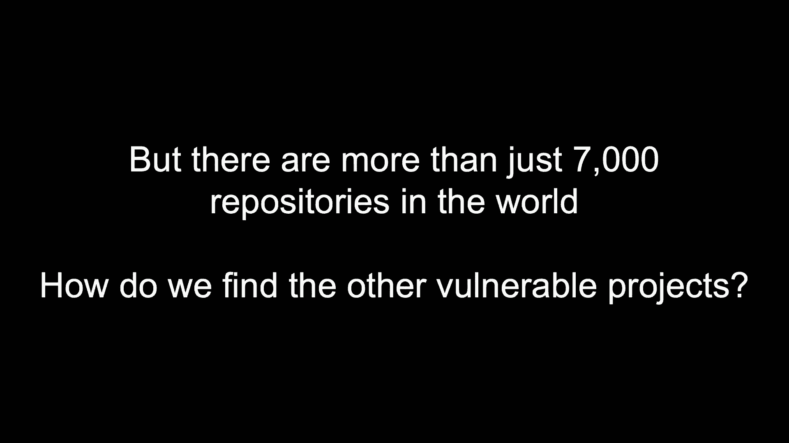

但是世界上有七千多个仓库，对呀，嗯，打开索引这些项目是很棒的，但还有更多的漏洞，那么我们如何识别其他易受攻击的项目，所以把它带回到我们谈论的，在我想再次谈论代码QL之前，嗯，你可以写一个代码，一个查询。

为您提供易受攻击的项目列表，代码QL索引超过十个，十万个开源项目和三万五千个Java项目，因此，您可以编写一个查询，并对所有这些项目运行它，并找到易受攻击的项目，这会给你一个项目列表，你可能想要。

它们是需要修复的好候选项，然后将该列表贡献给这个存储库。

这将使开放重写和现代，意识到这一点，这些项目，这样你就可以使用，你可以写食谱来修复那些要修复的。

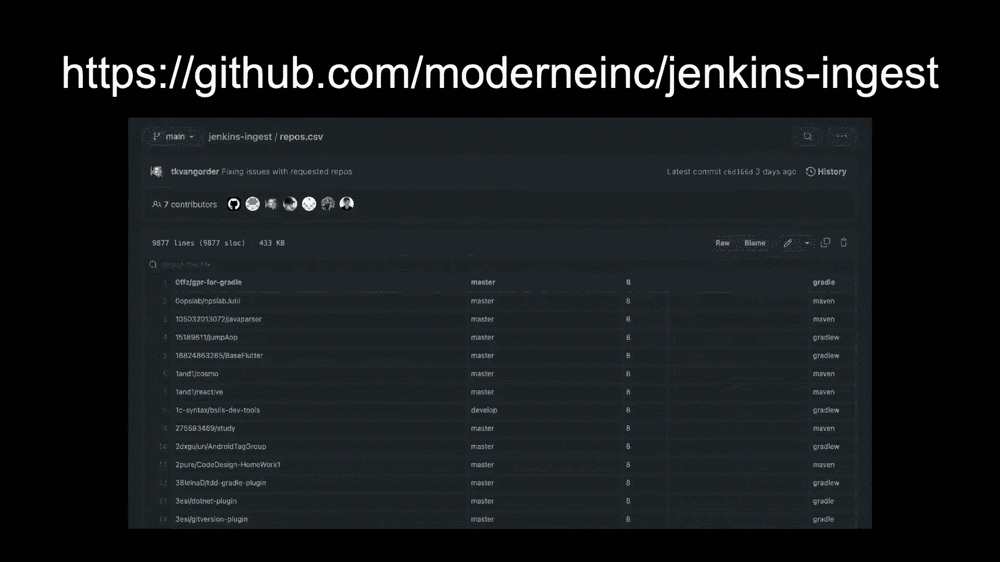

那些项目中的漏洞。

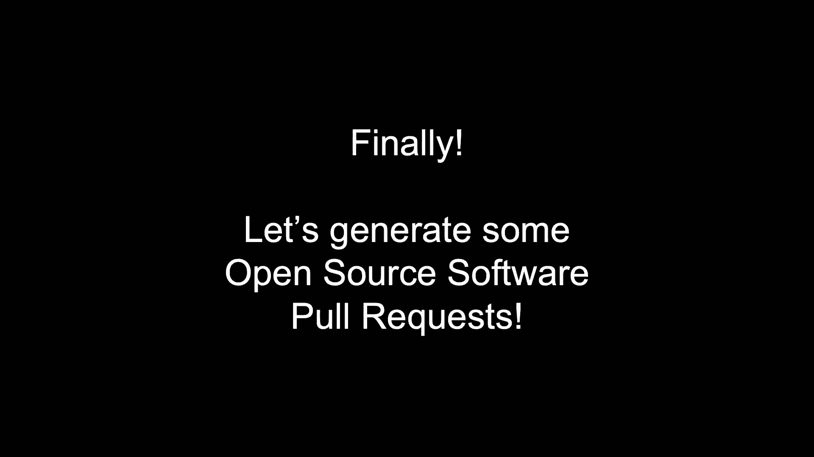

所以最后，用所有这些部分，让我们去生成一些投票请求，这就是我所做的，嗯，在所有这些不同的项目中，我已经产生了相当多的拉请求，最后三个是我们在，并因今年的工作而成为可能，至于我在22年中生成的新的拉请求。

已经有五个以上了，这份清单上有五百九十一个这样的项目，作为C，数组主机名，或者对不起，我们的主机名，数组溢出，这一个实际上是由GitHub安全实验室团队完成的，使用我写的Python机器人。

但剩下的都是我生成的，以及所有这些其他项目，我已经生成了超过5000个对我名字的拉拽请求。

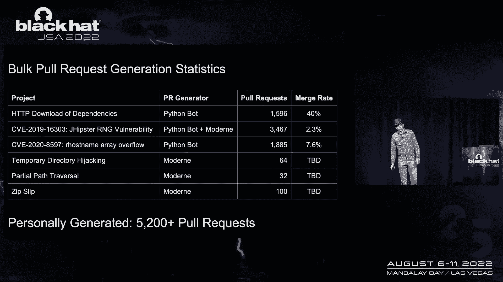

一个项目是不高兴的接受者，我今年做的三个拉请求，这是一个Perforce项目，其实，嗯，所以你可能会从简历中看到一些简历。

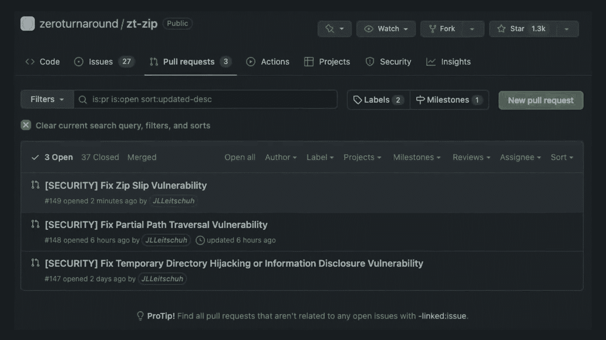

这是我的贡献图，我的GitHub贡献图，嗯，为了二十二，你可以看到贡献，你知道的，与当年剩余时间相比的捐款数量，只是你知道，所以我想谈谈关于一代消息传递的一些最佳实践，您正在与维护人员交互。

你在做这件事的过程中，你在和真人互动，开发人员向他们报告bug是非常正常的，但不一定是安全漏洞，嗯，安全漏洞，就像安全漏洞就像你告诉维护人员，你不仅写错了代码，但您也可能使您的最终用户面临风险。

这对这些人更敏感一点，你需要，对于维护人员来说，您需要意识到这一点，这是一句伟大的谚语，所有软件问题都是人，伪装的问题，这是非常真实的，在这种情况下，你需要考虑与你互动的人，你在报道什么，你揭露的漏洞。

所以我也要跳过几节课，在那一课之上，在所有提交的文件上签名，这是一个签名关闭提交的示例，你想这么做的原因是一个。

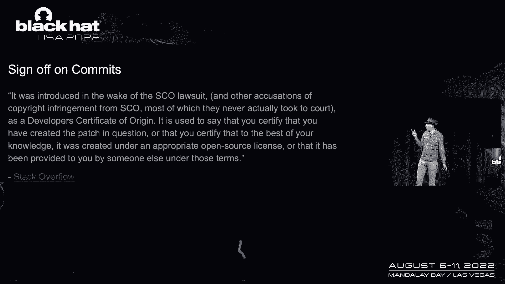

呃，有一堆针对开源维护者的诉讼，亚达亚达亚达TLDR。

律师，嗯，如果你不，你会被邪恶的龙官僚拒绝你的拉请求。

第二课，在你的提交中成为一个好的GPG标志，这就是它的样子，如果你不这样做，你可能会被冒充，就像莱纳斯·托瓦尔在GitHub上过几次，ccom是与安全相关的提交消息的标准化格式，这就是它的样子，有点。

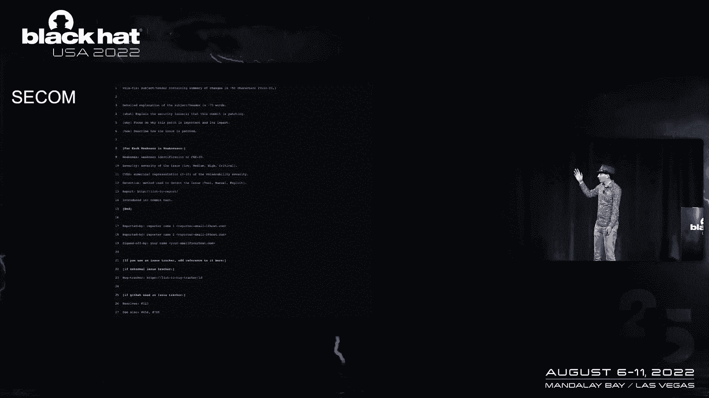

我建议没有足够的时间在这里讨论这件事，我建议查一下，这是一种很好的结构化的说法。

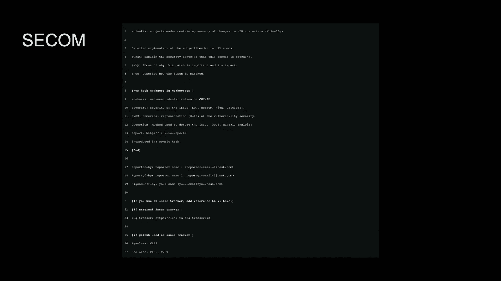

提交中的漏洞是什么，在提交历史记录中，第四课，使用您的个人GitHub帐户进行，这是任何熟悉GitHub愤怒的人。

独角兽，这是我20年来的个人资料，我弄坏了我的GitHub个人资料，这样做，显然是什么东西产生了这个，很多拉请求，可以打破你的账户，嗯然后嗯，第五课与GitHub协调，在生成轮询请求之前伸出援手，嗯嗯。

让他们知道你要这么做，这样你就不会被禁止，基本上，嗯，然后我是一个教训，考虑影响，我在报道后不久就收到了这一期，我开始生成拉请求，我用协调披露这个词，因为我你知道我们前进，这不是负责任的披露。

关于坐标披露，但不管你用什么术语，答案是否定的，这是对安全漏洞的全面披露，所以你需要意识到，那个，重要吗，你需要，你需要清楚消息传递，所以维护者可以做一些可操作的事情，但你需要意识到。

你可能会在一个组织上浪费一天，一个团队，一群人，在比例尺上，您可以使用此技术修复安全漏洞，如果替代方案根本不修复它们，因为他们人太多了，权衡是值得的，下降的日子是不利的，潜在的开放源码项目的传播。

试图修复这些漏洞，所以我想给你们一个最后的结论，作为安全研究人员，我们知道这些脆弱的，但我们很抱歉，我们对社会有义务，我们知道这些漏洞就在那里，我们在笔试报告中看到过，我们自己写的。

我们在开源项目中发现了它们，我们一次又一次地看到他们，这些漏洞是旧的，他们不应该，我们不应该处理同样的旧弱点，一次又一次，一次又一次，每年我们都应该寻找新的东西，我们在浪费时间和精力，和我们雇主的钱。

这样做，有一个州引用了GitHub的一句话，每五百名开发人员，你有一个安全研究员，统计数据，我们的胜算很大，开发人员正在开发和编写的漏洞的数量，我们没有足够的人来修理这些东西，来识别他们，举报他们。

就是伸缩性不好，和，所以我认为，这种体再生技术是最好的方法，扩展我们的数学知识，科学，技术和安全漏洞，在开源世界中产生最大的积极影响，和我们组织的安全，所以为了这个，我给你最后一句丹·卡明斯基的话。

这是从他的推特个人资料，它一直存在到今天，我们可以把它修好，我们有技术，好的，我们需要创造这种技术，所有的权利，政策人员正在玩弄技术，放轻松，所以我想给你留下一些声音片段，这是一种非常强大的语言。

你可以用它做一些很酷的事情，为开放做出贡献，重写，部署人员大规模修复并加入GitHub安全实验室，在松弛的通道处打开，您可以讨论要修复的漏洞，在世界上产生真正积极的影响，最重要的是，我没有列在上面。

但是如果你想参与开源安全并讨论这些问题，加入GitHub安全，对不起，考虑加入Linux基金会，开源安全基金会，每周都有关于开源安全的活跃对话，嗯，我想感谢人类，我的雇主现代人使这成为可能，这项技术。

这一切，还有莉迪亚·朱利亚诺，演讲者，黑帽扬声器，教练，他帮助把这个演示变成了现在的样子，向我的实习生展示了壮观的图像和我们投入的工作，把它放在一起控制发生的事情。

