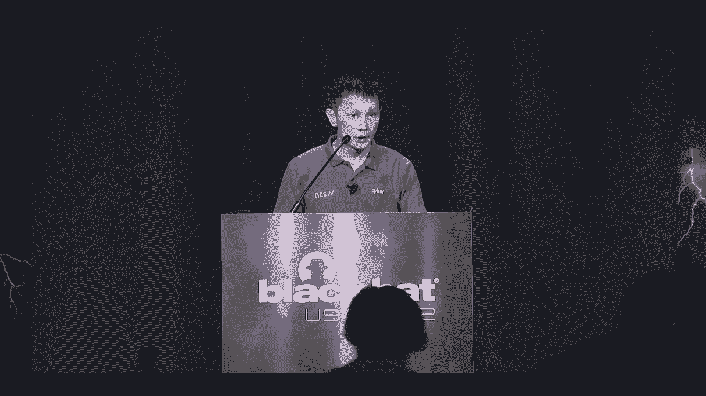

# P43：046 - RollBack - A New Time-Agnostic Replay Attack Against the Automotive Remote - 坤坤武特 - BV1WK41167dt

 [MUSIC PLAYING]。

 Hi， ladies and gentlemen。 Hope you enjoy your lunch。

 And thank you for coming back here for our talk。 We are a group of researchers based in Singapore。

 My name is Hoon Wei。 I represent NCS。 It's a digital and technology service provider。 And everyone。

 the cybersecurity R&D team。 And with me is my collaborator， Levi。 We used to work for NCS。

 And it's now a senior research scientist with ASDAR。

 which is a national research institute in Singapore。 And before I start。

 I just want to acknowledge and thank， the NUS NCS research lab for supporting our works。

 In the first half of last year， there。

 were 124 car thefts， including 42 luxury cars， occur in a city in Canada called Oakville。

 The city has only about a couple of hundreds of thousands， of residents。

 And that's quite a lot of car thefts for a relatively small city。

 More than 50% of the car thefts involve killers technology， targeting a broad range of cars。

 including Lexus， Range Road World， Ford， and et cetera。

 And in a separate incident in April this year， a warning statement was issued to the public of a mid-aucer。

 in Northern Ireland。 After six cars were stolen without using the original car， keys。

 basically the car owners still had keys with them。

 And there are more such incidents reported in the media。

 These days， it's feasible to steal a car， without even physically breaking into the car。

 without having access to a car key or alerting the car owner。 The increase-- the rise of car theft。

 has been reported not just in the public media， but also by automotive driven industry forums。

 such as Automise， which is a global community， for sharing intelligence about emerging automotive。

 cyber security risk。 India annual threat assessment report。

 one of their key judgment was that the risk of killers car， theft will continue to rise。

 In general， there are two types of threat， against killers' entry systems。

 non-intrusive and intrusive。 The non-intrusive types usually involve。

 eavesdropping or manipulation of radio signals， without having access or making changes。

 to the underlying components of the killers' entry systems。 For example。

 an attacker could use very simple signal jamming， to prevent a lock command from reaching a car。

 so that the car remains unlocked。 The other examples are relay and replay attacks。

 And there are some differences between the two。 Relay attacks is usually performed real time。

 with the intention to extend the boundary of communication。

 range between a car and its corresponding key form。 On the other hand。

 replay attacks is usually performed offline。 The attacker first captured a signal。

 and then will only replay it at a later time。 Attack on key management and cryptographic algorithms。

 are more intrusive， as they require direct access， to the in-veh network， for example。

 ODB port or ECUs。 Furthermore， these are usually more sophisticated and delicate。

 They require more expensive， potentially more expensive， devices and technology。

 and also deep knowledge， and cryptanalysis and reverse engineering skills， set as well。

 In this talk， we're going to focus on non-intrusive replay， attacks。

 If you do a quick search on replay attacks on cars， these are probably some of the recent headlines。

 that you would find。 There was an article about a hack on Honda vehicle published。

 earlier this year by Blaping Computer。 Two researchers discovered a hack that allowed them。

 to unlock Honda Civic。 What's interesting about this was that they showed that quotes。

 transmitted by a key form can be flipped， to perform a different function。 For example。

 the quote corresponding to a lock command， can be turned into an unlock command by flipping some。

 of the beats in the quotes。 Separately， another article which was published very recently。

 just a few weeks ago， also targeting Honda cars。 Two researchers discovered that a Honda car can also。

 be unlocked by signing commands in a consecutive sequence。 And by the way。

 no offense to those who work for Honda。 This is just based on what I found。 In fact。

 I'm a great supporter of Honda， because I own a Honda address。

 But please don't hack or steal my car。 It's a very old one。 So why does our findings matter？

 We started our research on this topic about 15， 69 years ago by trying to replicate some of the previously。

 reported replay attacks。 In doing so， we had our initial discovery around August。

 last year when we observed an unusual behavior that a car can。

 be unlocked using or by replaying two consecutive unlock， signals within five seconds。

 Two signals and it has to be within five seconds。 We thought that there was quite an interesting finding。

 As researchers， we wanted to know if it is repeatable， and can be generalized。

 So we tried that on more cars in the next few months， but we didn't make much progress。

 The breakthrough came subsequently in one of our car tests。

 that we carried out sometime in March this year。 When we discovered that a car can also be unlocked using。

 more than two consecutive unlock signals。 And not necessarily within a specific time window。

 And what was really exciting was that in addition。

 we also discovered other act time metrics that work across， different car makes and models。

 So now our findings become very interesting because we show。

 that it's more than a simple replay attack。 It's about different ways and variations of how we can use。

 or we can replay signals using different attack parameters。

 I'm just giving you a teaser for now if you are interested， in details of this stay tuned。

 Another interesting observation we made was that， we found that all findings seem to be consistent with some。

 assessment performed by Touchum Research。

 So a UK based company that provides security assessment， on vehicle technologies。

 So a couple of years ago they assessed 13 new cars。

 on whether they have commonly accepted security measures。

 in place including resistance against digital car tests。 So in comparison to our findings。

 those that were rated poor， or basic India assessment tend to also be vulnerable。

 to our road back attack。 And on the contrary， those that are rated superior。

 in the assessment also tend to be safe against road back。

 And as far as responsible disclosure is concerned， we reached out to two of the affected key。

 for chief manufacturers and one of them， got back to us and we had a very good discussion with him。

 which then led us to give a sharing session， with all of the affected car OEMs via auto-isac。

 And since then we will tell that the relevant car vendors。

 and their respective suppliers have started their investigation， into the good cause。

 And with that I'm going to hand over to Levy， who did an amazing job to bring this research。

 to the next level from where we began。 He's going to walk through video on Discovery and Journey。

 by sharing the details of findings， including how we have adapted our research strategy。

 along the way。 Thank you， Huong Wei， for the quick introduction。

 So let me quickly go into the details。 Let me first talk about rolling codes。

 a system that has been designed more than 20 years ago。 It's quite prevalent。

 And the reason why it was defined to actually prevent， any replay attack。

 But the reason why you're here is to see that it's still not， 100% sufficient。

 So the way how it works is quite easy。 So every time you press an on-load button on your key fob。

 basically every signal is unique。

 So you won't find any two signals， emitted from the key fob， which looks the same。

 And the way how it works is that when you press the button， there's a counter in the key fob。

 and there's also a counter at the car。 And every time the signal is received by the car。

 it also increases the counter for the next future use。 And if all these counters are in sync。

 it means that everything is OK and the car unlocks。 But there is a safety， provisioning， feature。

 embedded into the system because of accidental button presses。

 Because this is something that usually happens。 You just have a kid playing around with your key fob。

 or just accidentally your pocket comes to life， and then presses a button。 And of course。

 outside of the vicinity of the vehicle。 For these purposes， there is a provision made in the system。

 So it's basically allowed to do so。 So the key fob can be in a more advanced state regarding。

 the counters compared to the vehicle itself。 And basically， when you go again to your vehicle。

 with your key fob， which has had the advanced counters， you just send it again a new signal。

 and they will be resynchronizing again， and everything works as it should be working。

 So now from this， you can already imagine that basically。

 there is some sort of a straightforward exploit。

 into this， because if an attacker can capture， those accidental button presses， then eventually。

 you can take those signals and you can go to the vehicle。 And then， basically。

 it's a straightforward exploit。 So you can get access to those future codes。

 and then you can access to the vehicle。 But the thing is that the reason why most of the vendors do not。

 really care about it is because obtaining， such future codes are extremely difficult。

 especially if you want to target someone。 It's might easy to prank your friend or your mom。

 You go to a coffee shop， you pay your friend a couple of coffee， goes out to the restroom。

 and then you take the key， for it from the table and record the signal。 That's fine。 But normally。

 it's extremely difficult to get them。 And the thing is that recently--， I mean。

 we keep saying recently， but it was almost seven years。

 ago when there was this famous， or I would say， infamous attack called Rho Jam， which was basically。

 using a careful sequence of signal jamming， capturing。

 and replaying to lure the victim into a situation， where you can get those future codes easily。

 And the thing is that even the author of it， who was semi-compile--。

 I think that guy is much more famous than we are--， but the thing is that even he said。

 and many other researchers， said that that attack is not a hack。

 So it's not something like breaking an encryption key， or something。

 It's just basically converts this safety provisioning， feature into an exploit。

 So the way how it works-- let me quickly also go through that。

 because it's easier to understand first how it works。 And then when I talk about our attack。

 it will be much more easier to see how similar it is。

 or how much it differs from this Rho Jam attack。

 So Rho Jam attack is basically you have a small device。

 that nowadays you can get even less than $30 US。 And what that device can do is basically it can capture signals。

 it can jam the frequency van， and it can also， replace signals。

 And the way how it is deployed is basically it acts as a man。

 in the middle proxy between the key fob and the car。

 So this device is something that you hide in a hidden spot， near to the vehicle。

 And then it has a clear reception of the signals， and it can also jam the frequency van。

 So the way how it works is that you， the owner， come back to your parking lot where you left your car。

 you press the unload button once because you， want to get onto your car。

 And then this Rho Jam device sits in between the car and you。

 And then basically jams your frequency van， which makes the car unable to receive the signal。

 And at the same time， what it does， is that it also captures the signal。

 And then since the vehicle won't react because the signal was， jammed， is that what do we do？

 We are just human beings。 We just accept maybe the button was not working。

 or there was a lousy signal reception。 So we just press the button again。

 And then what the device is doing is basically the same。

 So we are still keep jamming the frequency van。 We are still capturing the consecutive second outlook。

 signal。 But here comes the catch because at the same time。

 then we played a previously captured signal。

 And then basically the vehicle will act as intended。 We， the owner。

 just assume that there was indeed a lousy， signal reception。 Everything is fine。

 I anyway want to drive away my car。 So I'm not going to think about why it was not working。

 for the first time。 I'm just happy it was working for the second time。

 So then the thing is that the attacker is now basically， having that future code。

 which is now turned as unlock signal， to and then it basically follows the victim。

 until a point when the victim will leave the vehicle again。

 locks it and go home or just do the grocery， whatever。

 And then the attacker can come and instruct this device， or whatever other means。

 But the thing is that when we're playing this second， outlook signal about he or she captured。

 then he will have access to the car。 OK， so now let's see how our attack， which is kind of like。

 capturing the same name but because of how it works， we turn this roll back。

 It's a time agnostic resynchronization attack。

 And the way how it works， I'm going to go to the same example。

 just to make a good comparison to roll back。 So basically the setup is similar。

 So we have a device which can capture jam and replace signals。 And the way how it works。

 the first step is basically the， same。 So you go to your vehicle， you try to unlock it。

 you press the button， but nothing happens because we are。

 jamming the signal and we're also capturing your unlock， signal。

 And what happens next is already something that is different。

 from roll jam is that for the second time we don't really。

 care about whether the vehicle receives that second， signal or not。

 The only purpose why we jam for the first time is because we。

 want you to press the button twice to capture two signals。

 But we don't care whether the vehicle receives it or the， vehicle can be unlocked， doesn't matter。

 And if I just continue this doesn't matter kind of approach。

 the thing is that we even let the vehicle to be used as， normal。 So you can keep using your key fob。

 you can lock it， unlock it， lock it， unlock it as many times as you want。 I'm the attacker。

 I don't have to follow you to the next spot， to see when will you leave again your vehicle attended。

 It doesn't matter。 The thing what I can do is basically you just， I wait for。

 the right moment where you leave your vehicle unattended。

 and then I just get my two unlock signals that I captured， before and I replay it and it's done。

 Basically for some reason the vehicle or most of the vehicle。

 get unlocked and then you have access to the car。 So the way and why do we call it rollback and what are the。

 advantages compared to roll jam。 So why rollback？ I don't know how familiar you are with some old。

 traditional database systems but rollback is a mechanism。

 in traditional database systems when basically before。

 committing all your changes you can issue this rollback。

 command which basically goes back to your previous， checkpoint。

 So that's why we are calling it rollback because we've seen。

 that when we are replaying these signals these kind of。

 rolling code counters are rolling back to a previous state。

 And then from there again all the signals that should be， invalid already start to work again。

 So basically this is a quick example to see so what you。

 can see on the image is that we have five signals and all。

 the five signals have been emitted from the key form and， also received by the vehicle。

 So in the time we are somewhere here at the end。 So the last unlock signal was received the vehicle act as。

 intended and whatever and we also have all the signals just， to be sure。

 And then according to how the rolling code system works。

 it means that all these signals are invalid and cannot be， work again。

 What we can do is that if I'm actually captured the。

 signals and I replay these two signals here the first two。

 one what we've seen is that basically we are rolling back。

 the rolling codes to the state which was encoded in the， second signal that we've replayed。

 And of course according to again how rolling code。

 system works those two signals will be invalid again but。

 eventually all the signals that were basically after that。

 point which should be already invalidated starts to be。

 valid again just because we roll back it's kind of like a。

 time machine we just roll back everything。 And that's why we call our attack time agnostic and the。

 thing is that just because of this feature unlike to roll。

 jam basically we can launch this attack at any time in the。

 future so I don't have to follow you I just capture your。

 two signals or three signals whatever I'm going to talk。

 about that later and I can launch my attack any time。

 And the thing is that I can also launch it as many times as I。

 want so it's very easy for the attacker I just capture your。

 signals once and I can basically relaunch it indefinitely， against your vehicle。

 So that's why we call it kind of like more effective than。

 roll jam but as you will see at the end of our presentation。

 about the results while roll jam is something that is。

 tricks with the technology so it basically breaks all rolling。

 code base systems our attack is something that is probably。

 affecting 70% of the vehicles but this is just about the set of。

 vehicles that we tested so we don't know the exact numbers but。

 for some for now we at least found some vehicles that are not， actually susceptible to attack。

 And on the other hand we also seen that there are different。

 systems in a system which basically means that we have。

 different variants of roll back and the properties that this。

 attack has is basically one of the first properties which is。

 very important is that how many signals I have to capture to， get access to your car。

 This is a very important is it just two signals or there are。

 some cars that might require you to capture three signals or。

 five signals and why is it important because capturing two。

 signals is probably not as difficult as finding someone。

 who will press the button five times for instance consecutively。

 because that's very suspicious so it's a very important feature。

 The other thing is that what we have also seen that once you。

 capture the signals do those signals have to be really。

 strictly consecutive or is it okay if you just capture two。

 signals let's say one on Monday and one on Friday and in between。

 maybe the owner was using the key for 100 times doesn't matter。

 And the third property what is important is the time frame。

 it's not that important though because you can really play around with the time。

 frame but the time frame here defines how fast， I have to replay these captured signals。

 And the variants that we see is basically we identified four variants。

 so far so it doesn't mean that we only have four maybe there are more in the。

 wild but we just didn't found it。 The first one which I really have to。

 emphasize is that that's particularly alarming because the first one。

 requires only two signals to be captured and the sequence part。

 lose means that those signals don't have to be consecutive which means that I just。

 follow you once you press the unlock signal on Monday and then。

 I see you again next next week you come to the work and then I again。

 capture your unlock signal and by just replaying those two I can。

 basically access your vehicle so I'm really reducing the chance。

 basically of being caught when I'm capturing your signals。

 And the rest are basically a little bit more difficult in terms of。

 how many signals you have and how consecutive the signals have to be and， all these things。

 So before getting into the details I have， to make a disclaimer so we haven't done any real attempts in the。

 wild and we always remove those signals that we captured。

 except two cases when we were trying to prove at least for ourselves。

 the time-agnostic feature of rollback that I just mentioned before。

 and the other thing I have to emphasize that just like rollback any kind of。

 replay attack by default doesn't make any harm to your vehicle。

 I don't want to say this to just rush home and try our attack on your。

 own vehicle but it's something that doesn't make any harm to the car。

 Sometimes you might get logged out by having your key。

 for the band for a while but eventually by using the physical case you can。

 always get access to your car and then do some recent。

 transition tricks without basically bringing your car to the workshop so it's。

 not a big thing。 So the the evaluation we have done is quite。

 limited for now so we basically had access to a couple of。

 Japanese cars mostly or like Asian cars。 No wonder why they're coming from。

 Southeast Asia。 So basically what we can make here is some kind of a blurry。

 conclusion still so what we have identified at least the vehicles that。

 we found vulnerable the age doesn't matter because this is。

 something that most people will think about it。 Yeah you found a vulnerability。

 that might affect some old vehicle。 I just bought my。

 car two years ago so that's probably not affected but this is not what we have， seen。

 So we have seen a 10 plus year old car or even two years old car。

 that were acting in the same way and being vulnerable to the attack。

 The other thing is that the drive train also doesn't matter so you cannot say。

 that okay I'm driving a hybrid or I'm driving an electric car which probably。

 means there are more electronic systems inside of it。 There are some。

 any software or some further measures that might prevent this。

 No the remote keyless entry system is probably the same doesn't matter how。

 your vehicle is basically made and the most important part is that all of the。

 popular Asian cars that we have tested are affected and actually some of these。

 cars are also very popular in the US and all around the world。

 so that's why it's quite important and we've seen that like old tested Mazda。

 Honda and Kia vehicles were vulnerable and for some reason we found that。

 Toyota is not so who is driving a Toyota then you you don't have to go home。

 and try this because at least the Toyotas that we had access to， they were not vulnerable at all。

 The other thing what we tried to find is， okay I forgot to mention that some of the details on the slides are。

 purposely obscured but it's going to be released soon probably a couple of weeks。

 later after Black Hat to release reveal what are the models that we have。

 tested but we are still in kind of like in the middle of the。

 some clearance process so we cannot reveal those models for now。

 and also not the RKE manufacturers but what we have identified that。

 manufacturer 2 and manufacturer 3 these are the keyfold manufacturers。

 I mean if you have some sort of knowledge about vehicles you might。

 can guess who are they but they are very prevalent ones and then。

 these two manufacturers are basically affected and they only require two。

 signals and most of the vehicles from which are using actually a key fob。

 from manufacturer 1 were also affected and most of the vehicles require actually。

 three signals so this is already something that I was。

 referring to in my previous slides so some vehicles need more than two。

 signals so most of vehicles need three signals， and home the vehicles for some reason needs five signals it's something like。

 already a countermeasure but then Y5 and why does it work with 5。

 and as you can see Toyota is using a key fob from a manufacturer 4。

 so it's not affected at all but I have to emphasize that。

 not the key fob itself is vulnerable in this in this scenario so the key fob is。

 just emitting the signals the main logic is basically the receiving part。

 and usually the key fob manufacturer is not the one who is making the receiving。

 part in the vehicle now I have a demo just because。

 I talked anyway too much so let's see how our attack works in the reality。

 okay fine so now here we are going to present our attack roll backwards。

 so this is a quite new much that to headtrack vehicle。

 we have the key fob here so this is now I'm just showing you that the key fob is。

 itself the key fob belongs to the vehicle so if I press the open。

 you can see now it's open the flashing lights are there and I can also close it。

 and then now I close you can see that the mirrors are holding。

 and I can reopen it again so this is the key fault that belongs to the vehicle。

 and now what we are going to do is to record the keyfob signals。

 actually a few keyfob signals and we will see whether we can unlock the vehicle。

 by just replaying those old keyfob signals which we of course shouldn't be able to。

 do so so now so this is a quick and true I wanted to。

 fast-forward it but basically that we are using is a quite commodity of the shelf。

 devices so I have a laptop I have a hack RF connected to my laptop true USB。

 and then basically this is like so we see the window you can start now I'm going to do。

 just before the unlock signals so now I'm not jamming any signal whatever it。

 is the car and car scenario so I have access the keyfob。

 so I just record one hook unlock and another unlock。

 and another unlock and let's say I also record a few more。

 I don't mind let's say five unlocks okay yeah so now it's also again fast-forward。

 a bit because sometimes saving the signals takes some time but。

 don't worry he's just just saving the view is to replay the signals I put the keyfob。

 here so I'm not touching the keyfob there is no any， extra trick in the background so what I'm。

 what I'm going to do is to replay the signals and now you can see that the。

 vehicle is closed because the mirrors are folded okay so。

 I'm just replaying the signals and what we are going to see here is that when I。

 replay the third signal this one then the rolling。

 whole system will be resumftinizing back to the previous state。

 and then the vehicle view unlock and every further unlock signals here。

 will also work you will also see this from the flashing light， so now I will replay the signals。

 where the blue bar indicates the current status， so now we replay the first signal and then the second signal。

 and now the third signal and now I pause it so now you see that the vehicle。

 actually unlocked the mirrors came off so the vehicle is left。

 and now all these two signals if I play further， then you will see from the flashing lights that it still works。

 so it's still unlocked too and it's still unlocked again so now we are。

 back to the original state where we actually left with the keyfob。

 but I can still replay again all these signals to see whether we can do the。

 resumftinization again so now if I start again what we。

 should expect that of course these first three signals won't work。

 because now in the time they are somewhere here， but let's see again so I replay the first one nothing happens。

 the second one and then the third one and then it's again looks the flashing。

 signals are here and it's people are okay so now what I'm going to see。

 and show you that now I start to use the keyfob， so the keyfob is of course belonging to the owner so we。

 we still have to begin to use the keyfob as usual。

 so now I can just lock the vehicle I'm just leaving it or I'm just。

 unlocking again I open the door of course I can sit in I can drive away it doesn't。

 matter and then I again brought back my vehicle if this is still a。

 frustrating scenario or I just brought back my car to my own parking lot at my。

 home and I just want the vehicle and then I go away I leave the keyfob on the。

 top of the vehicle to just see so the victim went away and now we。

 again we come back we have all the previously captured signals。

 which is still the old signal we captured back in the past。

 so we don't need any more signals to be captured we just only need the。

 scattering process once and now I just like try to reopen the vehicle again so。

 I again focus on the on the on the mirrors of course and now we。

 will play our old signals the one two and for the third time it's going to open。

 and then the mirrors are unfolded and I have access to the vehicle。

 so yeah this is how it thank you it's not over yet it's not over yet。

 so there is something new that we also found after submitting our our talk to。

 blackhead is that our attack rollback is also instruction agnostic。

 which means that it doesn't really matter what kind of signal you capture。

 so you don't even have to focus whether it's an unlock signal or not。

 so the thing is that we confirm this to musta and also for kia and we're going。

 to show you a video about that so it doesn't matter what kind of。

 signal that you have it's just to be usually consecutive if that's the。

 scenario which makes everything even more easier if you thought that it's。

 already very easy to do now you even have less things to do if you are in。

 taker so basically the victim goes to the parking lot again。

 and then presses the log button and usually you anyway press the log button。

 twice because the first log button is something that is a silent lock。

 and then you press it again just to see whether the flashing lights are on and。

 then the vehicle hunks anyway to double confirm that okay you have left your。

 car adequately closed and then basically i have already two。

 signals and then i just wait for you to finish your grocery you come back。

 and you are going to all of the car and now i just realized when i rented the car。

 here that basically if i press the yellow button white。

 once it only opens my side door my driving door， but my vyphus complaining all the time why am i not leaving uh。

 getting her inside so i always had to press the envelope button twice anyway。

 so just because of these extra safety measures it's basically making our cars。

 even more vulnerable to our attack so we can easily profit out of it。

 and i just also want to take a note about car sharing and car renting so。

 it's even much more easier right because if it's a car sharing scenario。

 then you can easily have access to the key from anyway so i can record the。

 signal and later on i just let someone else to use the vehicle。

 but using the website or whatever services the car sharing。

 things are providing us i can basically keep track of the vehicles and i can go。

 and i'll look at whenever i want and the thing is that。

 our attack is just about unlocking the vehicle but in a car sharing scenario。

 the key fob is also usually kept inside a car， so i just replay my two signals and then i can go later on and i basically。

 not just have access to the car but i can easily steal the car。

 of course there are probably some other measures， from the car sharing company but it's not the last we are going to test this one。

 whether our attack is actually agnostic to the instruction。

 embedded in the signals so the main question here is that。

 is it only the matter of the rolling code and the counters。

 or also it depends on what is the instruction in the signals。

 so now we can see that this vehicle is open， and normally we we're only talking about our lock signals in the beginning we。

 were always focusing on the unlock signals we wanted to capture。

 unlock signals only but for the sake of the， attacker it's actually easier to capture a lock signal。

 and an unlock signal because this is how we usually use the vehicle。

 so this is what we're going to test so the vehicle is still。

 unlocked now what i'm going to do is that i'm using the key fob。

 i will record the signal a lock signal first because that's the usual scenario。

 when i just left the car in the parking lot so i then i go away。

 and then i actually like imitating the scenario when the victim comes back and。

 unlocks the vehicle because he or she wants to drive the vehicle away。

 so this is what we're going to do so now i capture a lock signal。

 that is a lock signal you can see that the mirrors are folded and the vehicle is。

 now unlocked and then i capture an unlock signal， so it's two different signals and i don't capture any more signals because we。

 know that for this vehicle we only need two signals。

 so now i'm going to be played this but first i have to save so it's a， lock and unlock。

 i'll just save it again it takes quite some seconds okay i have it。

 so now i just love the vehicle at least to， to get the rolling system to be triggered at least once。

 and eventually i'm going to unlock it again so we have basically a lock signal。

 here and an unlock signal i just removed the space here。

 for the sake of time so let's see what will happen。

 so now we replay the lock signal and the unlock signal。

 and you can see that the vehicle has been unlocked。

 so yeah the mirrors again came off the emergency lights were flashing。

 and reconnects the vehicle so basically to prove that。

 this vehicle and it actually applies for the master vehicle as well。

 that it only requires two signals or the master vehicle requires three signals。

 but the whole attack is agnostic to the instruction in the signal so it。

 doesn't matter if it's a lock or an unlock signal they are using the same。

 rolling code we just only have to replay those consecutive signals。

 and it will work okay that was the second video so。

 let's talk about the root cause and the mitigation。

 which is basically still something that are the missing pieces of the puzzle。

 so even though we uh contacted some of the vendors and they got back to us we。

 had some sessions uh with with them but basically the。

 root cause now is still unknown and the thing is that most of these things are。

 anyway proprietary so we simple researchers don't really have access to。

 that and to be honest we don't have the knowledge for now。

 to tear down the vehicle and get access to that specific ECU and see really how it。

 works so now we are kind of like doing some， black box testing in this uh in this research at this stage。

 but we try to find something that might be the reason but it's still just a。

 might a very big might because as i mentioned all of that are。

 proprietary so you don't have access to it but there is a key for learning。

 process which is basically standardized or at least released by one of the key。

 for manufacturer which is microchip so now you know。

 that out of the four that i was referring to in my previous table one of。

 them is microchip and they have some kind of documentation when you。

 have this key for learning process it's basically a process when you。

 lost your key for when you get a new one from a from a dealership。

 and then you want that key for to be learned to your vehicle to make it。

 too usable so the thing how what we've seen is that basically there are some。

 steps you don't really have to focus all the steps in this flow chart but there。

 are some steps that are quite in line with how we are doing so you can see。

 that there is a one unlock signal or whatever， and then there is a second button press and at the end there is the key for。

 synchronization process on the other hand you see a lot of other boxes。

 which are not quite in line how our attack rollback works。

 because normally as you can see you somehow uh sorry this one。

 you somehow have to enter into the learning mode and once you learn the。

 key for to the vehicle it automatically exits from the mode so。

 it's either some of the vehicles are in the learning mode forever i don't know。

 maybe can be a thing the other thing is that also there is no。

 indication about the time frame how fast you have to press the buttons when you're。

 learning the key fob the vehicle reaction is also not。

 part of the specification once you are learning a key fob。

 will the vehicle really act according to the button you're pressing we don't。

 know and the other thing we don't know is that no one really。

 learn a key fob to the vehicle if you already have the key fob itself so what。

 happens basically when you're learning an already existing key fob to the vehicle。

 it's also not part of the specification but at least it's something that mimics。

 how our attack works uh what about the mitigation so i。

 usually say something like a general advice that works against jamming attacks if。

 you are just very precautious and you always watch when you press a button how。

 the vehicle reacts that's okay but rollback as i， mentioned doesn't need jamming at all so it's kind of like a passive listener。

 and just because of the time agnostic feature you won't be able to uh basically。

 prevent it so probably the best thing to do is uh do some additional measure to。

 the system not only use rolling code but use some time stamps or whatever。

 to make it more uh uh i mean less susceptible to your attack。

 so the three main takeaways of our talk is basically that we showed that this is。

 this attack called rollback and we showed it by capturing and we're playing a。

 couple of signals and uh we can basically re-synchronize the rolling code system。

 and i can also unlock your vehicle and uh we proved it that many agian cars are。

 basically vulnerable and it doesn't matter what instructions are in the key fob。

 the other thing is that unlike rojam our attack is basically does not require。

 signal jamming at all you can only capture the signal once。

 uh and then you can use it indefinitely basically for live。

 i would say uh and the capture signals uh yeah as i just mentioned you can。

 replay it as at any time in the future and as many times as required so。

 it's uh you're almost like the owner of the car at some point。

 and the third most important part is what's just basically about my previous。

 slide that we still don't know the rukos so please don't rush into to ebay and buy。

 a hacareff on your own and then and you know use this knowledge that you just。

 gain here and then play around in the parking lot uh but there's no。

 explicit mitigation for the time being uh but probably。

 there could be some measures that might be uh implementing in the future but。

 now we don't know this so for that i'm like to uh finish our talks thanks for。

 for joining us and i would like to also thank again for our co-authors from。

 nus we'll take part and now we are ready to take questions。

