# 【转载】Black Hat USA 2022 会议视频 - P44：049 - Process Injection： Breaking All macOS Security Layers With a Single Vulner - 坤坤武特 - BV1WK41167dt

谢谢，欢迎加工注射，用单个漏洞破坏所有宏安全层。

如果您是Mac开发人员，并且使用Xcode，您可能已经注意到，如果使用最新的Xcode版本创建一个新项目，在您的应用程序的应用程序模板中有一个新方法，委派，应用支持，安全，可恢复状态，现在在这次谈话中。

我将描述导致这一变化的脆弱性，以及我们如何利用这一点进行沙箱逃逸，最后绕过SIP，首先，关于我的一点，我是塔玛塔，我是测试公司的安全研究员，BE是荷兰的一家保安公司，提供笔试等服务。

事故反应和安全行动中心，但和我的同事丹·凯普一起，我们是研究部，这意味着我们不为客户工作，但相反，我们寻找经常使用的漏洞和系统，或者突然间你更受欢迎，让世界更安全一点。

所以你可能从我们这里看到的所有工作都是零点击，我们在去年展示的远程代码执行漏洞，当它今年在迈阿密上映时，有五个弱点，我们的网站上有一些关于这些的文章，如果你想更多地了解他们，我今天要讲的是宏观安全。

这对我来说有点专长，嗯，我一生都是Mac用户，所以这是一个系统，我知道的最多，所以说，嗯，这也是这种能力的起源，这个演示文稿将由三个部分组成，首先，我将稍微描述一下MEA安全模型。

因为很多人并不真正理解，和当前的安全模型，然后第二部分将介绍我发现的胶卷流动性，然后第三部分将演示如何应用该漏洞，以三种不同的方式，正如我所说，逃离沙箱，最后绕过SIP，所以宏观安全模型。

截至当前最新版本，埃特马科斯。

蒙特雷，来描述一下，我将首先谈谈unix linux安全模型，就像以前在macos上一样，它背后的基本思想是用户是安全边界，但过程不是，所以你可以看到这个文件，任何犯规都有一个所有者作为一个群体。

有这九个标志来确定所有者或组，或者每个人都可以阅读，尝试执行，如果你想把D汉堡附加到另一个过程中，那么一般情况下需要有一些过程，它们需要作为相同的用户运行，根用户是一个例外。

根用户可以读取以修改所有文件，它基本上可以访问内存中的任何数据，甚至内核和其他进程中的任何数据，根用户可以使用任何数据，这是Mac OS的安全模型，但自从引入系统完整性保护后，情况就不再如此了。

这是在2015年随着El Capitan发布而引入的，这是来自WWDC的演示文稿，他们在那里宣布了这一点。

SIP最初的基本想法是做两件事，首先，在根用户和内核之间引入一个安全层，其次，保护系统不被修改，即使是根用户，因此，仅仅拥有根访问权限已经不足以完全危及系统，苹果想这么做的原因是。

在Mac上获得root访问权限通常非常简单，如果你更清楚，因为大多数用户都是管理员用户，因此，如果您只是提示用户输入密码，以执行某些操作，更新系统之类的，很容易让用户输入密码。

这就是苹果推出SIP的原因，它被称为无根的另一个名字，很多人认为。

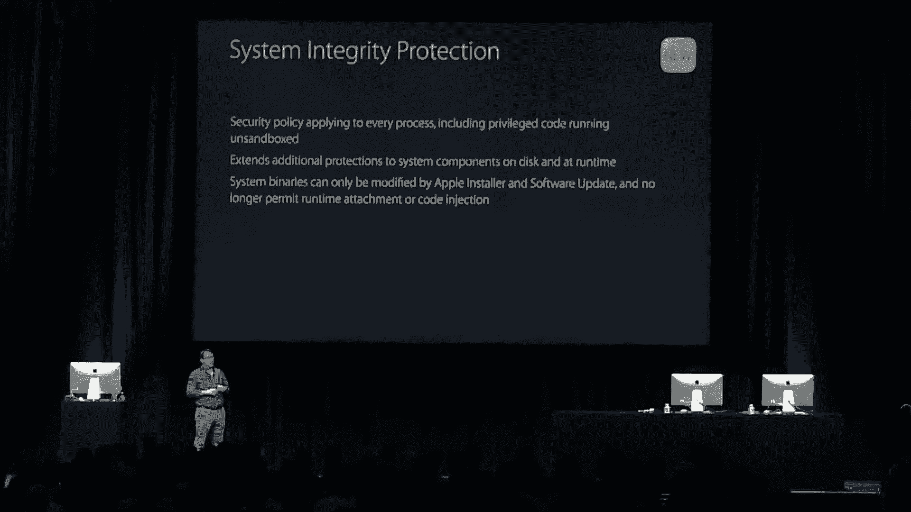

苹果将从人们手中夺走一个根用户，就像他们在iPhone上做的那样，但这不是真正需要的，它的名字是什么意思，这意味着根的力量较小。

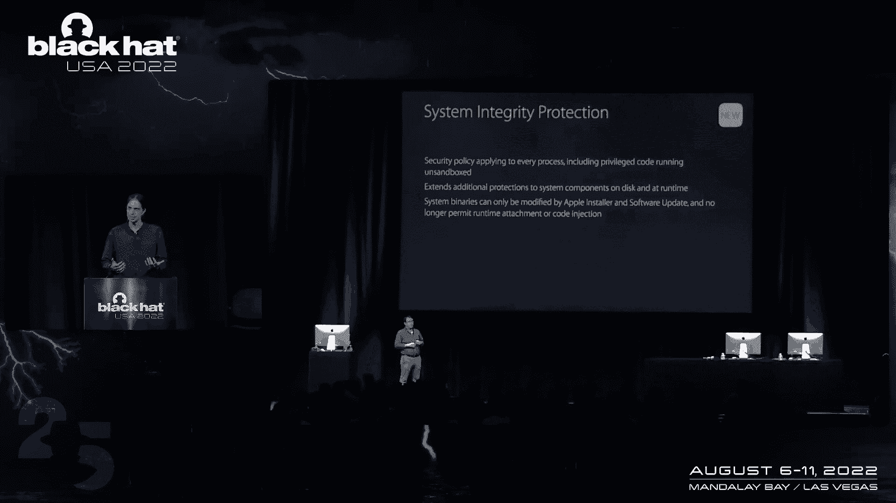

这就是它背后的想法，所以工作方式是你现在需要执行危险操作的权利，为应用程序生成代码签名时，因此，对于许多会危及系统或内核的危险操作，您现在需要一个特定的权限来这样做。

所以苹果仍然可以使某些可执行文件能够更新系统，因为耶，您仍然需要安装更新，但这不再只是任何根的可能，根用户修改这些文件，多年来在发行中，自从，苹果还将SIP的保护扩展到了系统的其他部分，因此。

即使调试任何应用程序现在都受到限制，你不能把D汉堡附在任何东西上，除非他们特别允许，还有一个有趣的特性是文件轴受限的数据错误。

我这里有一个例子，所以苹果认为你的电子邮件数据库非常敏感，您的消息数据库或Safari历史记录也以同样的方式受到保护，这意味着你不能只看到那里有什么文件，即使是根用户也不能这样做。

即使割草机在你的Mac上，并且有根用户权限，它不能只是阅读你的电子邮件，但是，当然啦。

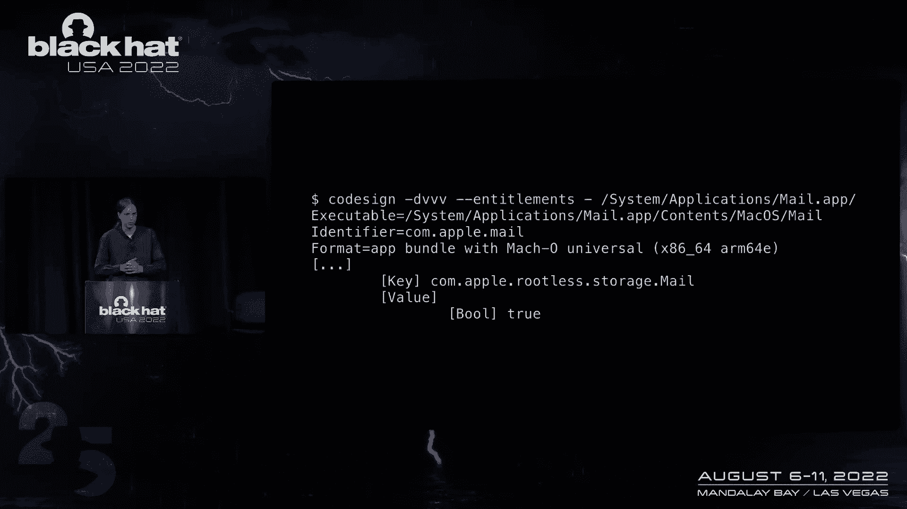

邮件本身需要能够访问这些文件，否则就没用了，所以邮件有一个特定的权限，允许您访问这些文件，这是常见的苹果无根邮件存储。

但没有别的，所以通过这种方式，现在过程突然变成了安全边界。

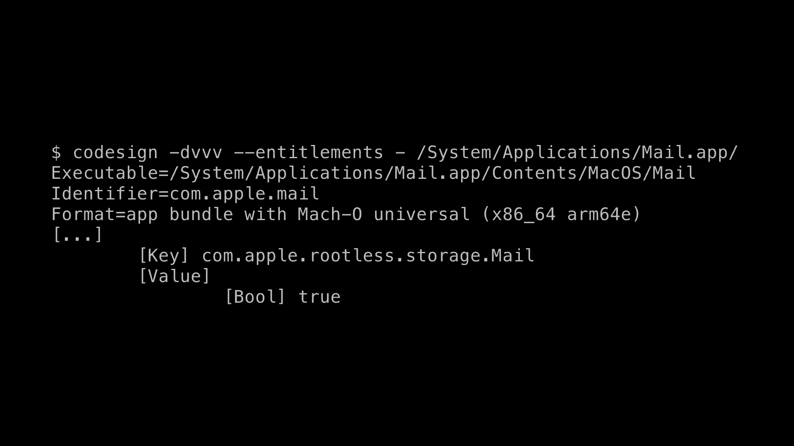

和，这也意味着有新类型的漏洞，我们需要考虑的是，其中一个重要的是过程注射，它基本上是一个进程作为另一个进程执行代码的能力，所以系统认为它是进程B，但代码实际上是由进程a指定的，在Windows上。

你有这些技术，比如DLL劫持，用狼牙棒做类似的事情，是啊，是啊，这不可能真的是一个严重的安全问题，如果您能够进入一个不同的进程，当苹果推出SIP时，如幻灯片右侧所示，对于那些受保护的程序。

许多可能导致进程注入的技术被禁用，所以苹果考虑了很多如何让这个安全边界真正发挥作用，也适用于第三方应用程序，苹果推出了所谓的强化运行时，以防止某些过去可能注入代码的技术，像动态链接器，环境变量。

以及库验证，它基本上可以防止类似的技术，如DLL劫持。

但对于Mac OS来说，但是梅罗斯已经很老了，大型和成熟的，所以系统的很多部分是以前写的，安全模型发生了变化，是啊，是啊，不可能真正重新考虑整个系统和这个新的安全模型，所以说，可能还有漏洞。

可用于将代码注入其他应用程序，第三方应用程序通常会有这些进程注入漏洞，嗯，比如说，滥用所谓的DCC，基本上是权限提示，以获取，如果应用程序想第一次使用网络摄像头，许多第三方开发人员不知道安全模型。

所以每当你发现这样的漏洞，你必须完全解释安全模型，有可能利用他们的应用程序窃取网络摄像头数据，你也可以经常做一个短信，比如将应用程序降级到旧版本，并且仍然使用应用程序具有的权限，但这些都是事件。

这些都是偶然的漏洞，当然，有一个进程注入漏洞要好得多，你可以到处申请，这正是我所发现的，所以双十一，三个，这基本上意味着任何基于应用程序的应用程序都被抛出到角色中，这个漏洞所在的位置是安全状态特性。

所以当你在电脑上拍摄的时候，有这个复选框，如果你想重新打开窗户，说您下次登录时已经打开，这被称为安全状态或内部持久UI，还有一些事情，比如如果你有一个不安全的文件，你还没救它，但你放下你的Mac。

然后你再启动它，它可以恢复不安全文档的内容，这在很大程度上是自动工作的，因此应用程序开发人员不需要选择加入，但是倡导者会自动看到，哦，有一个保存状态，我要恢复它，重新打开这些窗户。

但是第三方开发人员可以扩展它，比如说，如果他们有自己的文档格式，那么他们可能有自己的对象，他们希望存储在保存的状态下，并且该状态存储在库中，在应用程序状态文件夹中，这里基本上有两个重要的文件。

首先要列出的窗口，这基本上是应用程序中打开的所有窗口的列表，他们每个人都有一个加密密钥，然后是数据数据文件。

据我所知，这是一种独特的格式，在其他任何地方都没有使用，这些记录中的每一个都对应于一个窗口，从获胜者那里得到这个文件，现在我不知道为什么这是加密的，因为文件就在旁边，它们之间没有权限差异，也没有诚信。

检查密文，所以我不知道为什么它被加密了，但显然是，我发现的漏洞，这里加密的这个对象是序列化的，使用非安全序列化器，所以非安全编码，现在能力的序列化在C Sharp和Java中非常常见。

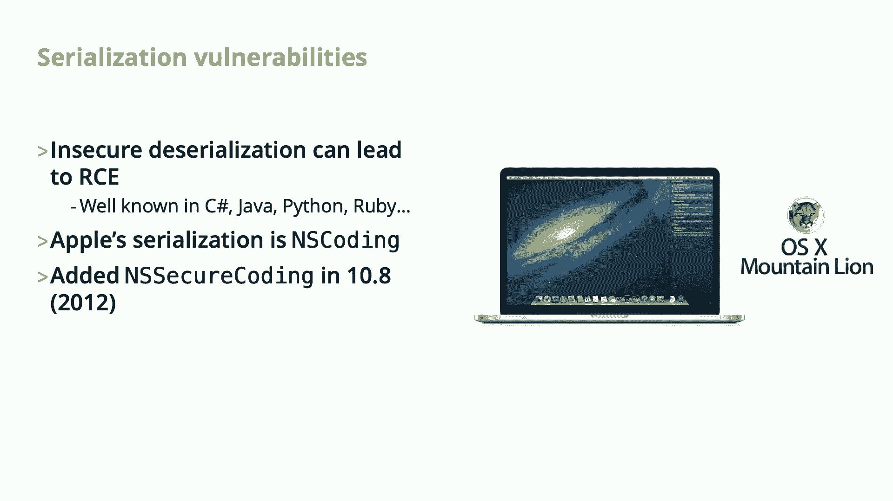

因为蟒蛇和红宝石，也很容易利用它，用苹果序列化格式获得代码执行还没有真正讨论过，就我所能找到的这些类型的漏洞，所以苹果的格式被称为NIS编码，但苹果在10。8秒内增加了一个安全版本和一个安全编码。

也就是十年前，安全编码已经解决了许多序列化漏洞的问题，是啊，是啊，它会导致许多序列化漏洞，所以不是先创建对象，然后检查它是否是，这就是导致这些漏洞的原因，因为到那时对象已经存在了。

也许在它的构造函数或析构函数中做一些事情，在检查对象的ti时创建对象。

所以安全版本差异的例子，首先创建对象，然后你检查它的类型，这很危险，因为当你检查它的幻灯片时，对象已存在，可能做了什么，不安全的版本，你解码对象，但前提是它是这个类或这几个类的。

安全编码在Mac OS中非常常见，它也经常在不同的安全层之间使用，然后将这些大物体发送到它甚至与图像一起使用，因此，如果您向另一个用户发送安全序列化对象的消息，所以在安全序列化格式方面有很多研究。

不安全的版本在这类联系人中不经常使用，所以苹果一直很擅长确保，它的使用方式不会导致漏洞，在这种情况下，是啊，是啊。

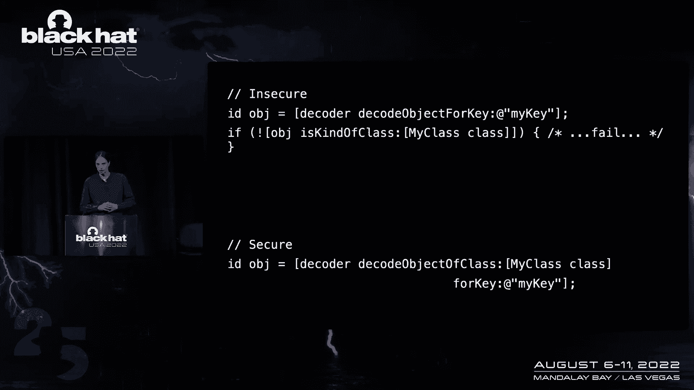

有可能，那么这允许的攻击是什么，所以你能做的就是，可以为具有恶意序列化对象的应用程序创建新状态，您可以将其写入其他应用程序的目录，然后您可以要求系统启动您的另一个应用程序，然后当应用程序运行时。

它会自动泛化该对象，然后耶，我们可以在另一个应用程序中执行代码，这也意味着我们有，我们可以使用其他应用程序的权利或权限，所以我找到了这个，然后就好了，我写什么对象，我能找到别人做过的事吗。

所以有一个著名的项目，为什么Java的Social A里奥使用文明漏洞，也是为什么C夏普的串行点网，但是是的，没有类似的项目，c，我还查了几个谷歌项目零白色提示，他们利用序列化，但在所有这些情况下。

都是安全序列化，使用非常特定的漏洞，这些现在都修好了，所以我不能再应用这些技术了，所以我必须真正弄清楚，是啊，是啊，从头构造此对象链以利用此问题，所以说，我是怎么做到的，然后我看了所有的编码器功能。

寻找一些有用的东西，令我惊讶的是，许多可序列化的类没有实现安全编码，但它们也往往没有那么有趣，因为他们唯一做的就是，然后真的没有其他功能可以访问，所以我发现我可以使用的第一步是规则编辑器。

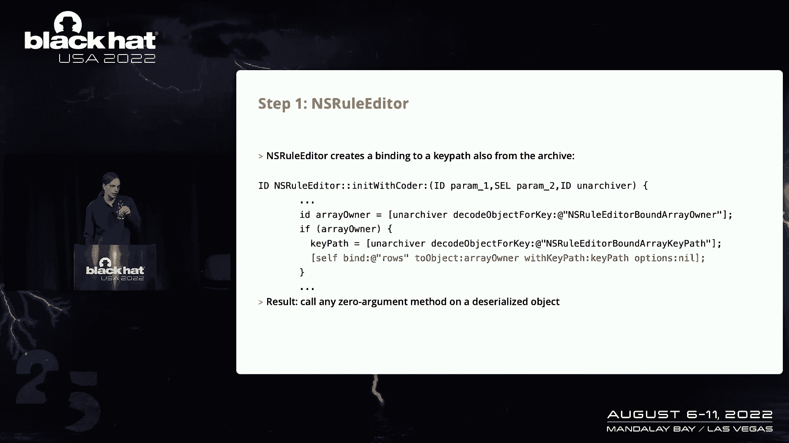

我希望它是可读性的，所以它的作用是从存档中获得一个对象，它从存档中获得一个密钥路径，然后它使用该键路径创建到该对象的绑定，所以绑定就像是Mac OS中的一种反应式编程技术，这意味着你可以，是啊，是啊。

您可以直接将视图连接到模型，而不必使用控制器，嗯，还有一件事，你需要指定键路径，并确定要绑定到的属性，例如，如果您有一个人可能绑定到他们的名字来创建一个字段，那个键路径基本上可以是任何方法。

即使它不是财产，所以您可以绑定到任何方法，只要它没有参数，所以你可以绑定到，对象上的任意零参数方法，所以有了这门课，我现在可以调用方法，没有任何争论，然后下一步是自定义图像换行，它从存档中获取一个对象。

然后是选择器，选择器基本上就像客观C方法的函数指针，但它还没有使用它们，它只是储存它们，但是当您对该对象调用Draw时，它将调用它获得的对象上的选择器，所以如果我们把这个和上一步结合起来。

也可以调用零参数方法，我们现在可以在自定义图像换行上调用Draw方法来执行任何方法，虽然我们没有任何控制权，然而，在争论中，它把自己作为第一个论点，任何其他参数都将是碰巧在这些寄存器中的随机数据。

但这是一个非常强大的原始数组，因为你可以用很多不同的函数。

现在我必须跳过几个步骤，因为时间的原因，也是披露的原因，但是呃，我将在这里总结一下步骤，所以我们可以先调用那些串行参数方法，然后我们可以调用任何方法，然后我们使用一个技巧来创建其他不是，呃，实现编码器。

所以我们通常是不可序列化的，让我用同样的技巧在这些对象上调用零参数方法，然后是另一个技巧，在这些对象上调用任意方法，这基本上足以在这个过程中评估苹果脚本，因为如果我们，比如说，会攻击雄性，把它们抄下来。

我们可以产生一个反向外壳，做类似的事情，所以这是一个很好的成功，但在我们想利用的一个例子中，这还不够，我们真的希望在另一个进程中有基本上等价于本机代码执行，但这很棘手，因为正如我提到的。

没有硬化的运行时，运行时的艺术是为了让这些攻击变得更加困难，因此，它阻止我们创建可读的内存页，变量和可执行，所以不允许及时编译器，您可以看到库验证，所以我们不能只加载DLL或动态库之类的。

环境变量在这里不有用，但也被挡住了，我们怎么才能解决这个问题我找到的解决方案是，我可以加载苹果签名的Python框架，然后我可以导入C类型模块，然后用它，我基本上可以评估相当于本机代码的代码。

只需调用C函数，创建结构，诸如此类的东西，但现在我只能创建客观的C对象，但我想打电话给Python，Python框架没有任何可以使用的目标C接口，所以我不得不为此找到一些中间步骤。

我用的是Apple脚本目标C桥，它基本上和苹果脚本相似，但它将目标C运行时桥接到Apple脚本中，我注意到的是，就是，时间的艺术不允许你加载库，没有苹果签名的，但是通过使用C的Apple脚本。

脚本不需要签名，这允许我创建客观的C对象，调用方法调用C函数，这很有用，因为这在以前是不可能的，但还是有一个缺点，我不能创建任何指向非客观C对象的指针，我不能创建任何结构或使用C字符串。

因为运行时不是Apple脚本，目标C不允许，但我可以调用C函数，所以我浏览了Python框架导出的所有Finch，但所有这些都需要一个字符指针，因为她需要通过一条路。

或者您想要计算的实际Python代码，我无法用苹果脚本生成这些字符指针，目标c，但后来我发现了一个非常整洁但丑陋的技巧来做到这一点，我可以用0和null和no通过main调用，因为它的零等于零。

这是允许的，这意味着进程现在的行为就像它是Python一样，就像你会在壳里正常发射一样，这意味着这将在另一个进程中启动此Repl，所以在标准输入上，我可以把所有的Python代码。

如果你是如何喝酒的粉丝，苹果脚本或目标C是，那么您真的应该看看Apple脚本的Objective C桥。

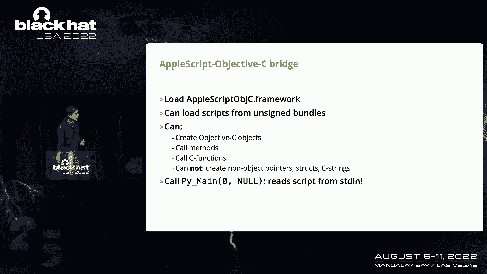

因为它是，即使比这两者都要好，这就是调用函数的方式，你需要抢劫一切并告诉当前的应用程序。

然后呢。

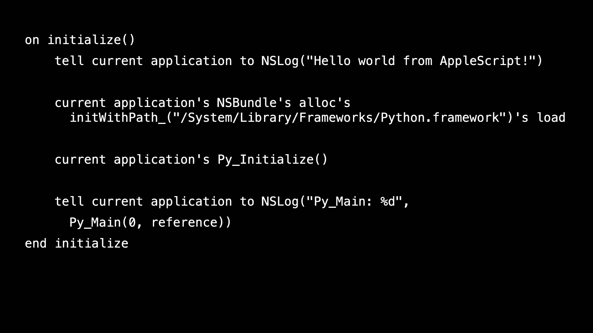

并将其与一个基本上传递给它的新引用一起使用。

所以总结一下。

我可以用Apple脚本目标C桥评估Apple脚本，它可以评估Python，它可以导入C类型，我可以执行代码，这基本上相当于应用程序中的本机代码，我可以创造支柱，我可以创建字符指针，我可以调用C函数。

是啊，是啊，我刚刚绕过了严格的运行时限制，现在可以执行进程中的任何代码，C类型的好处是它可以工作，即使有所有这些限制，如果你看看，比如说，您可以创建绑定以查看。

但是您经常需要编译一些中间代码到创建者绑定，然后库验证不允许，所以现在要开发，对于该漏洞可以应用的三种不同方式，首先呢，逃离沙箱，去做那件事，我需要解释一下这是怎么回事，所以这是一个开放的面板。

看起来真的很无聊，嗯，你经常看到它，如果你使用Mac OS，嗯，但实际上技术上相当复杂，因为如果您有一个沙箱应用程序，那么应用程序就无法列出磁盘上的所有文件，但是如果你想打开一个文件，会很不方便。

如果应用程序调用，知道你有什么文件，在你打开东西之前，所以苹果实施的方式，这就是窗口现在是应用程序的一部分，但是内容是用不同的过程绘制的，如果你是一个Web开发人员。

你可能熟悉iFrames有点像同样的想法，所以有这个打开和打开安全面板服务，把里面的东西，然后当用户选择一个文件并单击打开时，该面板将向应用程序提供对该文件的临时访问权，这样应用程序就可以读写该文件。

事实证明，打开或安全面板从相同的文件中借出其保存的状态。

作为应用程序本身，它猜测这是因为您可能想要调整面板的大小，然后你可能会关闭你的电脑，宽面板打开，所以它需要记住这个面板和应用程序的不同组合的两种状态，但我不能完全肯定，所以我们如何攻击它很简单。

我们只需将保存的状态写入自己的应用程序目录，我们会触发打开的面板，然后我们在一个非沙箱过程中执行代码，所以本质上我们已经逃离了同一个盒子，并且漏洞的这一部分比其他部分更早被修复。

所以这个是在十一点三固定的，它不再与打开的面板共享此目录，所以不再可能做同样的事情。

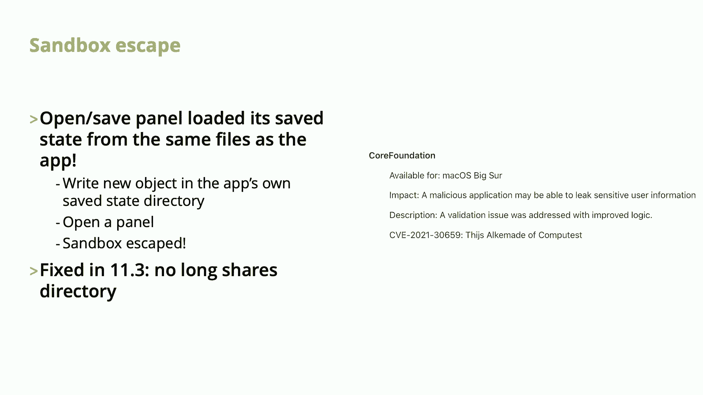

为此，我运用了别人发现的技巧，所以这是所有获胜的逻辑书中的一个，由埃利亚斯·莫拉特邀请，有一个特定的权利，com Apple dot私人授权服务，苹果软件，这种权利意味着，没有任何授权。

甚至没有向用户发出任何通知，它有一个安装后脚本，因此，运行到试图从磁盘运行命令的安装的脚本，你也安装吧，所以通常你会把它安装到你的Mac OS磁盘上，然后它会从那里运行一个命令。

但您可以将其安装到当前连接到Mac的任何磁盘上，这样您就可以创建一个新的RAM，要运行到该磁盘的脚本的磁盘或磁盘映像，剧本是这么写的，因为没有检查这实际上是一个Mac OS安装盘。

您可以将其安装到空磁盘映像中，并且挂载一个磁盘或磁盘映像不需要工作权限，这样我们就可以挂载磁盘，问这个，因为它是苹果的签名，这是允许的，然后运行此帖子安装脚本，它以根权限运行。

最后绕过SIP文件系统限制，并为此，我基本上想，确保绘制了此漏洞的全部影响，所以我看了所有安装在Mac OS上的可用应用程序，这可能有一个权利，我可以使用，他们甚至在那里看了看。

就像Mac的大测试版安装磁盘映像，在那里我注意到这个macos更新系统应用程序，这是一个非常强大的权利，而不是苹果点根点安装的遗传，这基本上意味着它可以访问任何受zip保护的文件，给他们读或写。

当然邮政许可仍然适用，所以你不能随便给任何东西写信，它也是可遗传的，这是一个不错的奖金，因为我们可以产生一个反向的外壳，在这个过程中，我们不需要在Python上费心，现在我们能用这个做什么，比如说。

我们可以阅读电子邮件或消息数据库，或者所有用户的Safari历史记录，我们可以允许自己使用网络摄像头，或用户的麦克风，而无需用户批准，我们也可以在系统中坚持得很好。

因为我们可以把自己写到一个受保护的位置，因为例如，覆盖更多删除工具，然后当应用程序准备好时，我们就会启动，下一个开始，嗯，苹果很难把我们移除，或者基本上苹果可以用任何消防扫描仪把我们带走。

或者类似的东西不能把我们带走，最后，我们还可以让内核扩展未经用户批准，所以正常情况下，安装新的内核扩展时，您得到这个提示，它通常真的需要点击几次才能批准，一个新的内核扩展。

但是我们可以只写到批准的内核扩展的数据库，然后我们会自动加载它，现在我们仍然需要一个有效签名的内核扩展和内核扩展，签署证书很难得到，苹果不赞成它，所以要得到一个并不容易，但您可能可以找到薄膜或内核扩展。

只要有可文件性的任何内核扩展，我们可以加载它并利用它，然后我们将有完整的内核代码执行，但即使没有，我们已经可以访问所有受zip保护的文件，所以即使到目前为止，我们基本上已经完全妥协了。

我有这个视频来演示这次袭击，这是在Mac OS 12。03上，我想沙箱逃脱仍然有效，首先证明，呃，应用程序真的是沙箱，所以它在这里经历了三个不同的步骤，这个还挺快的，完美升级稍微慢一点。

因为它需要挂载磁盘映像，然后执行安装，你在桌面上看到它的底部，可能会让它变得更微妙一点，但没费心，然后现在zip旁路应该在shell中产生，正如你所看到的，它是一个根壳。

但也是为了证明我们还绕过了zip文件系统的限制，并转到系统策略配置目录，这是经过批准的内核扩展存储的地方，所以这是一个非常敏感的目录，大家可以看到，我们可以在这里创建一个新文件，那么这个是怎么修好的呢。

和，所以用那种新方法，我展示了启动苹果，第三方开发人员可以表明他们的应用程序只支持安全对象，为其安全状态进行安全反序列化，苹果已经在他们自己的所有应用程序中启用了这一点。

现有应用程序可能希望将自定义对象存储在它们的状态中，所以这就是为什么需要这种微妙的方法，因为如果苹果对所有应用程序都启用此功能，那么该对象将中断，嗯，我不完全清楚它是否还可以利用，如果呃。

应用程序不尝试使用该功能，嗯我完全，呃，用发行版测试了一下，呃，这是在12月向苹果报告的，第四和二十，然后他们很早就修复了沙箱逃逸在4月的11点3分，然后我们介绍了修复，随着宏观蒙特雷的发布，现在。

我以为一周前，他们没有将此修复后传给辛·卡塔琳娜，因为它最初不在发行说明中，或者在苹果的安全建议中，但上周我在写幻灯片，我注意到他们把它加到卡塔琳娜号上了，中的发行说明，五月所以卡塔琳娜从十月释放。

我已经错过了，但是在大服务器发布节点还没有更新，所以它没有列在那里，但上周我收到了一封来自苹果的自发电子邮件，祝贺你的黑帽子演讲，你能告诉我们你要谈什么吗？我们也许能提供反馈，所以我问，嗯。

就在两个小时前，或者类似的东西，他们告诉我应该把它固定在大R里，我没有足够的时间来验证这一点，所以我不知道，据说它在两个旧版本中都是固定的，就这样结束，mac os在进程之间有安全边界。

这些对系统的安全性非常重要，这些进程注入漏洞现在可以用来打破这些边界，CCE 22 1 3 8 7 3是能力的过程注入，事实上，我们利用这个漏洞逃离沙箱，然后绕过zip文件系统限制。

定在2021年10月，现在这里和麦加的一些关键外卖，安全性不断增加越来越多的安全层，越来越多地防御恶意软件的攻击，但是在一个已建立的系统中添加这些新层是相当困难的。

因为所有这些部分都是在这些新的安全要求之前编写的，在任何时候都很难调查整个系统，任何时候你做出这样的改变，所以在有任何攻击服务之前编写的代码，这里不一定是攻击服务，因为您可以攻击其他应用程序。

这里也有一个重要的点，我认为如果你增加更多的层，攻击者的平均水平可能不会增加，如果你能用同样的bug绕过所有这些层，或者你可以找到跳过某些层的技巧，最后你有一些参考资料，是啊，是啊，我用的所有东西。

苹果的文件和，呃，从，呃，现在，如果你想阅读更多关于这一点的信息，我们将发布此漏洞的报告，在接下来的几天里有更多的技术细节。

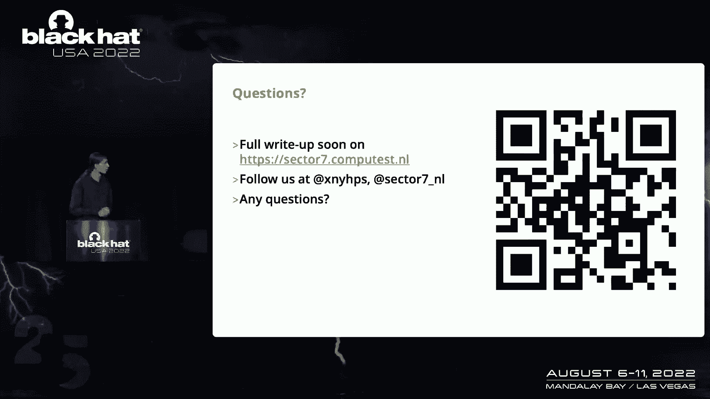

但如果你现在有任何问题。

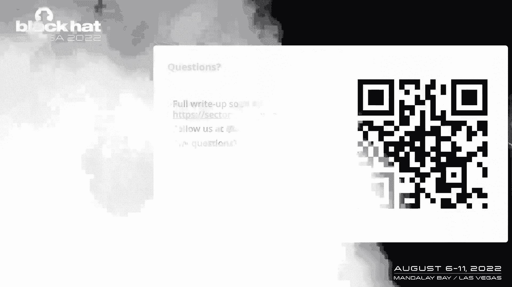