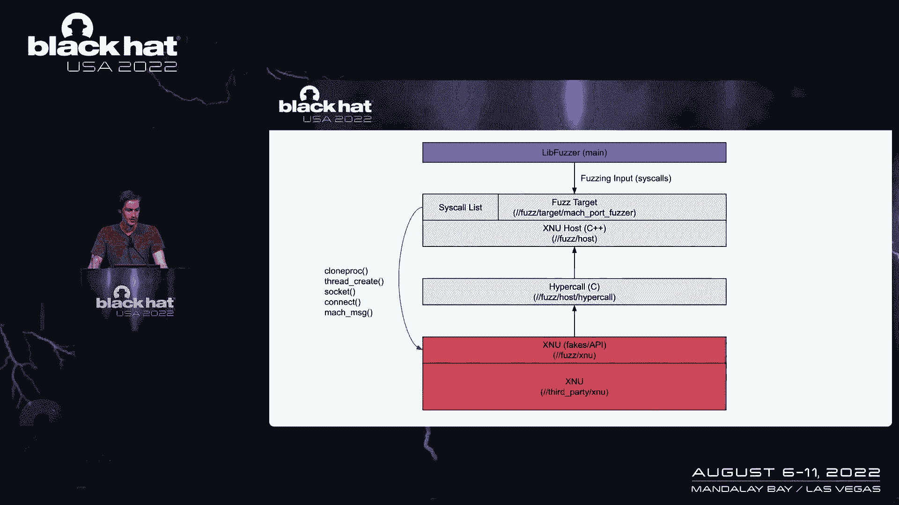
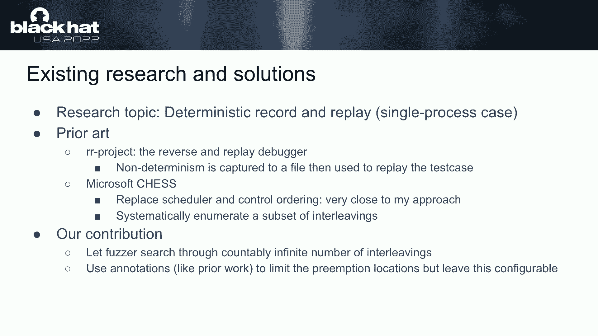
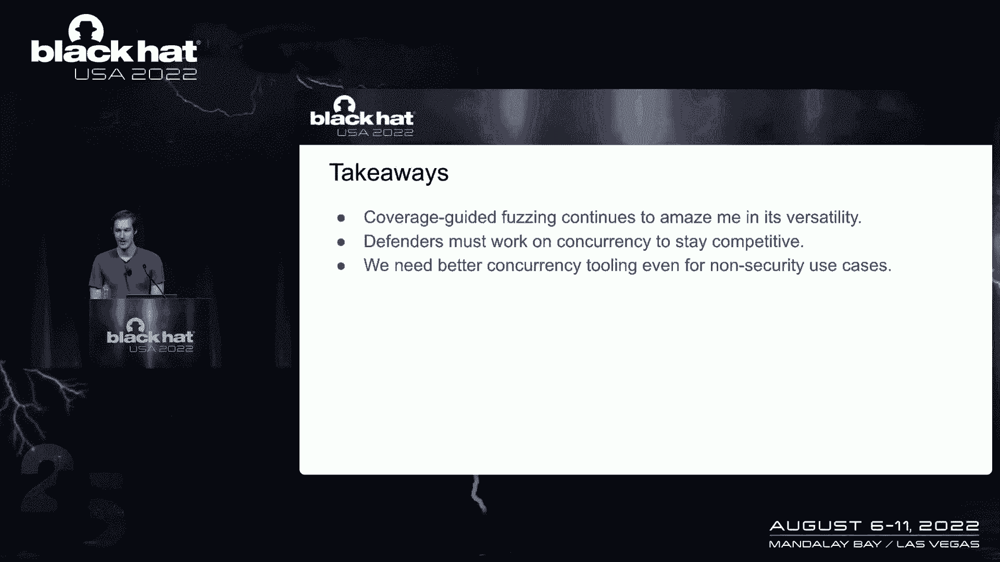

# 【转载】Black Hat USA 2022 会议视频 - P45：050 - Catch Me If You Can： Deterministic Discovery of Race Conditions with Fuzzi - 坤坤武特 - BV1WK41167dt

现在我很荣幸地欢迎内德威廉姆森上台，所有的权利，你好酷，它起作用了，事不宜迟，让我们开始吧，这个演讲叫抓我。

如果你能有点陈词滥调，其他人在他们的一次演讲中也有同样的短语，非常抱歉，但我们将讨论种族条件，今天起毛，所以简单介绍一下我，我已经在谷歌零点项目做了几年的研究员了，呃，作为我的研究兴趣。

浏览器IPC内核作为我的，我想我的研究目标，所以这次谈话，我会，关于这个主题，我将谈论与模糊相关的研究，然后我们如何将其应用于iOS上的内核模糊，所以我想从，你知道的。

这次演讲主要是关于解决种族条件下的模糊问题，更广泛地说，这只是关于如何处理比赛条件，作为一个经常使用嗡嗡声的人，我很有偏见，但只是为了介绍问题，这里只是一个小片段。

我收集了我的团队在过去几年里报告的一些bug，然后几个这样的，我想其中一个安卓活页夹虫子和脏牛，我只是放在那里，所以只是为了让你熟悉，也许还有一些更有名的虫子，但本质上这些虫子，真的，你知道吗。

这是我们只是继续变成的东西，这是我们需要解决的问题，但是我们没有什么好的工具，随着时间的推移，我想我如何解决这个问题，并为发现这些问题带来一些自动化，不依靠运气或纯粹的人类独创性，所以是的。

这就是他们很难找到的问题，所以我们真的没有更好的方法来找到他们，比静态分析或审计，我认为这是非常相似和相关的，所以一个人类作家到今天，意识到在某个地方有可能出现竞争条件，或者至少要意识到一些特定的模式。

然后也许写一个静态分析，可能就像语法树上的匹配器，找到已知错误模式发生的特定情况，但我们真的没有一个好的方法来找到，一般的竞态bug，也许我不应该笼统地说。

但是我们只是没有一个自动化的方法来为bug做这件事，当我们看到它像，我们知道当它崩溃时，有一个问题，但我们没有办法真正搜索这些虫子，根本不知道我们在找什么，所以这是根本问题。

而模糊处理实际上通常很擅长解决这类问题，您不一定需要知道您正在寻找的bug的形式，你只需要知道你试图侵犯的财产，所以出于安全原因，你知道，我们主要把内存安全视为。

但是早些时候的队友Yvonne做了一个关于XPP节Fuzzing的演讲，在那里，他试图破坏解析器之间的一致性，所以这不仅仅是内存损坏，但总的来说，Fuzzing很擅长说，你知道的，给我一个财产。

给我一种与这个程序交互的方法，我会试着找到侵犯该属性的测试用例，对于比赛条件或时间问题来说，这实际上是一件非常好的事情，因为我们可能会说，如果我们看到免费后的使用，你知道这是由种族条件引起的。

我们不需要明白这是怎么发生的，我们只是我们知道如果它设法触发它，模糊可以观察到它，但问题是你实际上是如何，实际解决这个问题，我们必须首先介绍调度是如何工作的，别担心，我给我一个概述。

因为当我开始这个项目时，我不记得这些是如何工作的，所以这是一种快速的概述，所以我想有两个，在调度类型上有一种重要的分区，你可以，考虑一下我们能测试好什么，不能测试好什么。

所以我们可以很好地测试的是协同调度，这就是我从这个小演示开始的地方，那么协作调度看起来如何，所有的线程都在相互合作，他们明确地屈服了，所以说，在这种情况下，我们在线程一中开始执行，这将继续下去。

在某个时候，这条线说我准备屈服，这将发送到调度程序，在这一点上，调度器可以决定，好的，我要么切换回第一线程，然后继续或转到线程二，在这种情况下，我们将进入第二个线程，并一直执行到底部，没有收益声明。

然后这个线程终止，我们回到调度程序，然后日程安排员说好的，在这个小示例中，只有线程一可以运行，所以我们就去那里继续，所以现在，如果我们看看先发制人的调度是如何工作的，其实很相似，所以我们有同样的例子。

继续往前走，有一些明显的产量，也许我们被锁堵住了，也许我们只是真的屈服了，你知道的，这是一些平台上的CIS调用，转到调度器，同样的事情发生了，但在这种情况下，在执行线程二的某个时候。

我们得到一个计时器中断，或者发生其他情况，抢占此线程，所以这导致我们回到调度器，调度器再次面临决策，从这两个可运行的线程中，我该跑哪一个，在这里，它可能会决定继续线程一，然后继续这个结束。

然后我们过来做第二个线程，所以重要的一点是，如果有关于，或者两个线程之间是否有任何安全问题或假设，不尊重，事实上，这些抢占可能发生在任何地方，那么我们可能会有一个bug。

所以我们希望能够用模糊来解决这个问题，现在有趣的是，我想我的哲学是，我总是试着从一些我知道效果很好的东西开始，然后慢慢地添加到它上面，加强或扩大我能做的，所以这就是为什么我开始合作调度。

你可能会注意到这些本质上非常相似，它们都有一个执行上下文，这只是线程的一种通用说法，可以阻止或屈服于调度程序，唯一的区别是先发制人，有这个附加属性，在哪里，在任何时候，你都会有这些产量。

这些产量只是由中断引起的，或者其他可能与之相关的条件，但这是模糊的一个问题，因为这很难控制，它也会导致指数级的爆炸，所以合作调度的好消息是它很容易，协同调度，因为它是按顺序运行的，如果你想想第一个例子。

没有随机收益率弹出，只是这一切都很明确，所以只要你在运行程序，如果您有一个确定性的调度器，完全没有随机性，您可以一遍又一遍地运行相同的测试用例，事实证明，这是我在2018年利用的东西。

当我做铬沙箱逃脱时，利用，我想在那一点上我意识到，哦，这里有些有趣的东西，但你知道也许多线程永远行不通，但至少当您有不同的任务异步运行时，这种合作的事情，对绒毛的需求真的没有问题，所以再一次。

当我们进入先发制人的调度时，大多数程序存在的地方，或者我们想模糊的许多程序存在的地方，这是超级难建模的东西，就像，说你有多个核心，你知道线程同时运行，甚至是单个核心，这些随机的抽筋和切换。

我们在这里真的无法控制，即使我们做到了，我们仍然要在每一个指令上搜索这个指数搜索空间，再一次用我们今天拥有的工具，如果我们运气好碰到虫子，不能保证它会繁殖，所以我们只能祈祷也许我们撞到了什么，嗯。

这发生在我身上，我刚刚偶然发现了赛况bug，但我一直困扰着他们是不可预测的，只是为了让它更清楚一点，我最初的作品从1918年到大约20年，我会处理这个问题，通过手工将先发制人的目标转换为合作目标。

所以这意味着，每当我在起毛的时候，背景中有一个垃圾收集线程，我只是不会产生那条线，我只会运行主线程，最后我会说好，让我们随机运行垃圾收集并调用该函数，但总是只有一个线程在运行，所以好的是。

这是超级容易实现的，就像不同模糊项目的黑客方式，我在安卓NFC上用过这个，因为线程模型足够简单，我可以用一个合作的调度器代替它，但问题出在更大的目标上，有更复杂的现实世界，嗯，安卓的真实世界。

但你知道世界其他地方，它变得非常困难，因为我们不能支持阻塞，如果你只是不产生一个线程，你不做工作，那根线会在这个非常粗粒度的高水平上做，我们只是没有办法处理，说你打电话给某个系统调用，你在起毛。

它的阻隔效果也很好，没有背景工作的概念，就像现在，你是背景工作，必须发生其他事情，所以我有了这个想法，为什么不，我至少尝试创建一个确定性线程库，所以至少我可以产生多个线程，他们真的不会跑。

实际上是平行的，它们都在一个CPU上，但至少我可以在它们之间切换绕过阻塞问题，所以要实现这一点，我想得很好，好的，让我们做已经有效的事情，我们只用一根线，你知道我们已经在一个CPU上运行了多线程程序。

对于测试来说，这是一个合理的假设，我们需要中断任何与日程安排有关的事情，和多种上下文，所以在这种情况下，这基本上是与线程或同步原语相关的任何内容，像互斥体，读写锁，条件变量，然后我们创建自己的调度器。

它拥有所有这些上下文，所以我们将拥有存在的线程，哪些是可以运行的，互斥体和同步原语将与调度器交互，让它知道我的线程阻塞了，等待另一个线程完成，所以如果我们有这些组件，我们至少可以把所有的。

与多线程相关的事情，然后我们可以使这个确定性只是为了测试到目前为止，这里没什么新鲜事，但我想我开始做的项目，称为并发，但还是有点TBD怎么命名，我不知道，但它粘住了，所以本质上我所做的是。

我创建了这些组件来帮助我解决这个问题，第一个是遗嘱执行人，它本质上提供了创建，在线程或上下文之间删除和切换，然后是一个调度器，它将查看这些可运行的上下文，说你知道你在后台产生了一堆线程。

然后您拥有调度器对象，你只是说帮我做一堆工作，直到没有线程可运行，然后这样我们就可以在后台生成一堆线程，为了一项模糊的工作，然后一直跑到他们完成，然后再做一些操作，得到一些更多的工作。

立方体和一种不断循环，幻灯片上没有很好地突出显示，但是调度程序项目符号下面的第二行，使用fuzzer数据随机化可运行任务的顺序，这真的是这里的一个大见解，所以我们不仅仅是，或者我想在我的铬时代。

当我在做合作绒毛的时候，我会做的一件事是每当调度人员有选择的时候，选择某个可运行的任务来运行，我意识到，哦，我们为什么不，如果遗嘱执行人的模式允许的话，我们为什么不试着在它们之间随机切换呢。

而不是按顺序做，所以我把这个想法包括在这里，因此，调度器不仅跟踪可运行的内容，在它们之间切换，但不是纯粹为了，每当我们有选择的时候，我们将随机选择一个任务使其能够运行，或者不是麦格勒诺布尔。

而是切换到它，再说一遍，这是一种小细节，我们真的不需要做注释，语义学，而这一切，但本质上我们需要支持，yield和block作为告诉调度器的基本方法，哪些线程是可运行的。

所以这还没有真正解决优先购买权的问题，一开始我真的没有希望处理这个问题，我想得很好，如果我至少能做某种确定性的调度器，那么我的绒毛就可以复制了，也许我可以到处乱搞时间表，找点东西。

优先购买权实际上是收益，所以我最初并没有意识到这一点，我一开始就表现出来了，但如果我们已经不得不支持块状和屈服，积极的研究者，可能会把他们自己的产量插入几个地方，所以即使先发制人。

所有的东西都在跑进一个街区，或者一次跑一个街区，如果我们在几个有趣的地方屈服，也许我们可以让Fuzzer在这些区域切换联系人，看看是否有竞态bug，所以这就是，我想这提出了一个问题，就像。

这是一个有意义的想法吗，你能关掉所有的随机抢占，选择几个地方来做吗，并找到一个有用的bug，所以我看着一个虫子，我真的希望，我可以找到我没有试图找到这个bug，但是我在2020年就考虑过这个问题。

我看到这个bug报告进入了Android bug赏金，我相信，这是内核的用户模式，我想RCE特权，冲突升级，我认为被利用的弱点，这取决于比赛条件，所以我看了补丁的描述，这是直接来自Linux更改日志。

我不知道你怎么样，但当我看着这个，我以为，哦耶，不肯定是这个太复杂了，一个Fuzzer怎么能复制这个，你知道，但后来我看到了差异，我意识到这看起来很简单，我想我在想的是。

如果我不知道Binder里已经有虫子了，什么注释，收益率声明可能有什么，我已经能够添加，所以如果你看看这个差异，所发生的一切就是你在顶部有这个函数，他们拿了一把锁，让一些工作排队，然后解锁并返回工作。

在补丁中，他们表明问题是这个W类型的字段，那是工作的一部分变得无效，看起来W变量在锁被释放后被释放了，所以看起来，哦，您只需要在一个地方先发制人就可以找到这个bug，或者在一个抢占点周围搜索。

这是在第一个函数中解锁proc之后，所以我回头看了看这个描述，意识到尽管所有的复杂性，他们在那里解释这种虫子是如何产生的，Fuzzer需要做的一切，至，找到，这个问题是在我假设的那两个地方先发制人。

这个锁，当我们在下一行发布它时，您可以看到第一个粗体语句，我们在第二个线程中获得，所以我们在做一些事情，然后在第一个线程中，我们完成了这项工作，然后我们切换到第二个线程，线程来释放我们正在查看的节点。

然后打开锁，然后线程一不需要获取它，但它只是继续运行，我意识到关键路径紧随这两个内部进程时钟的发布之后，所以你知道这是我真正洞察到的地方，你知道这是一个至关重要的bug。

你知道我们没有工具来找到这样的东西，但只需要一次抢先，这是在一个似乎很明显的地方的先发制人，你知道你有一个非常重要的子系统，在两个地方用一把锁，3。我认为做出这样的猜测并不是没有道理的。

一个安全研究员可以说，给了一个可以处理这种情况的模糊器，我想让我们在每个锁之前和之后先发制人，让我们先发制人，也许在几个地方，然后它真的是一个相当小的搜索空间，所以这就是洞察力。

我们真的需要比我们想象的更少的先发制人，我花了很长时间才明白这里发生了什么，因为大部分都是直觉和实验，但当我和更了解，我从泄漏消毒剂的作者那里得到了这句很棒的台词，或者他说。

像无种族程序这样的东西没有明显的行为差异，当优先购买权发生在Sinc点之间时，就像那是什么，这只是意味着如果程序员做对了，如果您只有锁定周围的优先购买权，这足以看到一切可能出错的地方，所以你知道。

不要太担心理解这一点，但本质上有某种核心直觉，比如在这些区域周围放置锁，bug将在哪里显现，或者很有可能，所以我想，好的，那可能很好，然后如果一个研究人员对那口井持怀疑态度。

他们可以在其他地方为自己撒一些产量，没有问题，所以这就是我开始真正实现这个的地方，通过用这个新项目扩展我现有的iOS内核Fuzzer，最初的袜子起毛器项目，我就是这么叫这个iOS内核模糊器的。

看起来是这样的，基本上我用肢体蜂鸣器作为引信引擎，你真的可以用任何东西，但是lib Fuzzer所做的是，它为您收集覆盖率并变异测试用例，类似于AFL，以及它生成原型的输入类型，描述系统调用序列的消息。

你知道与一个测试用例相关的其他事情，然后它将这些输入输入到这个模糊目标函数，然后我们用红色调用内核，这些系统调用按顺序，然后这个项目实际上是一个完全基于用户的模糊器，所以如果你用了什么。

如果你不熟悉像Gvisor这样的东西，或类似的，像基于用户空间，类似于内核的容器化，这就是我们在这里所做的，因此，与其使用完整的虚拟机管理程序，我们只是在用户空间中运行一切。

然后在Gvisor中这样做的时候，发生的事情是当您的程序试图创建一个系统调用时，它进入一些Go代码，为您处理系统调用，你不必去内核，所以这很相似，但是对于虚拟机管理程序来说。

所以在iOS内核中试图访问硬件，它只是被重定向到这个超调用接口，这都是在用户空间中处理的，所以这样做的结果是，我刚把整个用户空间的蜂鸣器，我希望我能多谈谈这件事，我想这里不是每个人都知道这件事。

但不幸的是，我只是没有时间详述细节，所以这是现有的项目，因此要添加确定性线程支持，允许我做阻塞系统调用，我添加了这个并发代码库，所以这个做的是，我有这个额外的计划者和执行者，所以如果我想。

或者如果内核想在内部创建线程，它们实际上被捕获并发送到这个Hypercall接口，这是通过我谈到的调度器组件来处理的，然后最终这些内核线程只是在用户空间中由我的。

但重要的一点是调度器也可以访问模糊器数据，所以在右边你会看到箭头向上，得到随机数，所以这表明，每当调度程序在，在可运行线程数之间切换，它现在就会得到一个号码，我是说也许将来会更聪明，但现在它就像N。

把那个给我，它会说我有十个可运行的线程，给我一个1到10之间的数字，它将从测试用例中提取这个数字，所以模糊器可以变异，然后改变时间表，所以现在我们在模糊地前进，有点两轴。

您有CIS调用本身和与这些CIS调用相关的数据，内核中单个线程的正常操作，但是现在你有了这个额外的轴，Fuzzer可以改变给定测试用例的时间表，所以为了让你对这看起来像什么有更具体的了解。

这是Fuzzer的数据模型，这只是一个Protobuf消息，所以在当前实例化中，或者任何当前版本的Fuzzer，我有三个线程，每个线程执行不同的系统调用，然后有一个简单的字节字段，它提供调度器数据。

所以在这三个线程中的每一个，他们得到了一个指向这些原型的指针，对于它们从这些不同的线程处理的不同命令，我们开始运行，然后日程安排员只是说，好的，线程一、二、三开始是可运行的，让我们运行它们。

他们会执行一些系统调用，在某个时候，他们可能会阻止产量，或者可能会终止，因此，最终如果我们让调度程序运行到它为空，我们将运行一切，有趣的是你知道，如果这些事情中的任何一个导致创建一些背景线程。

或者运行所有这些都将被交织和模糊，以及三组syscall线程，为什么三个原来是两个，但我在一个过程中有两个线程，然后我决定用另一个线程添加一个额外的进程来捕获，像跨进程竞争条件，这听起来很聪明。

但这是它看起来的样子，它真的只是有我的小日程安排的事情，这是一个相当简单的项目，然后拦截IOS内核中x和u中的互斥体，我们只是有一个看起来像这样的东西，所以我只是把这些调用转发给我的虚拟互斥体。

它与我的调度器一起工作，处理产量和块调用，但在锁定之前和之后，我也有这些额外的收益率，放生之后，抓住我之前提到的关于锁定的这些问题，所以我们可以跳过这个，但本质上对于每个测试用例，我分叉一个过程。

然后在其中创建线程运行然后终止进程，所以如果事情完全出错，它都包含在一个单一的进程中，所以当我开始运行这个，我很快就遇到了一个免费bug后的使用，这很有趣，因为它是在IPC中的。

这是一个最近很有趣的领域，所以我看了看这是Fuzzer产生的测试用例，我对此没有影响，它完全是从模糊器里出来的，所以我不知道他是放大了还是怎么的，是啊，是啊，所以我有一个更好的格式，但正如你所看到的。

它相当有条理，但我所做的只是说，以下是系统调用，下面是模拟消息的数据结构，那些包含这个标题，其中有这些枚举，它有这些表示端口的字段，所以我只是做了一点描述，这足以在免费后使用。

所以如果我们看看更容易阅读的表示，发生的事情是，我们在第一个线程中的线程为零，我们创建了两个应答端口，有点像文件描述符，那么模拟消息重写和模拟消息是一回事，他们只是在传递一个信息，因此。

第一条消息发送到远程端口端口1，来自端口2的消息，也收到了这样的，如果您在选项下看到，上面写着发送和接收，我们正在为港口制定发送费率，所以如果你不知道模拟，那个，我想我甚至不知道。

当我发现这个测试用例时，这一切意味着就像一个，当我们有这些回复端口时，我们被允许在他们身上接收信息，但我们不允许从他们那里发送信息，因为有特殊的端口，有人可以用它回复我们，所以这是干什么的。

这实际上是一种迂回的方式，模糊器意识到，哦，如果我创建回复端口，我把这个信息发给自己，我可以给自己这个额外的权利，所以人类绝对不会这么做，他们只会打电话说，创建模拟端口，它附带了两种权利。

但只是为了表明这是随机的，毛茸茸的人只是偶然进入了这个模式，找到一个虫子就足够了，所以真正的bug出现在接下来的两条消息中，因此，在第一个线程中，我们将发送一条消息到端口，从港口到。

我们正在复制和移动我们在这个端口上发送消息的权利，还有一条很奇怪的信息，然后从我们发送的另一个线程，现在我们有权从一号端口发送，我们把消息从端口1发送到端口2，我不知道这是否有意义。

而是因为我们把它送到这里，但无论如何，我们创建了一个，让我们看看，所以我们做一个动作收到，所以在这条消息中，我们从端口一发送到端口二，我们正在移动我们在端口2接收消息的权利，我想我不知道这很困惑。

但这就是重点，所以它找到了一种方法来提高最后两条模拟消息，所以我在我的项目中添加了一个特殊的打印功能，根据您在哪个线程中，所以我在窃听器发生的地方到处都放了些指纹，正如你所看到的。

这实际上变成了一个交错表，就像你会看到一个人类骑着的，所以我们可以看到，模拟消息是从线程0和线程1调用的，在这里，不知何故，我们最终以两次写入的方式复制。

所以我想这就是我们从同一个端口向一个端口发送消息的地方，然后在这里我们做这个动作的地方接受操作，它删除了两个引用，所以参考文献是三二二一，在这里，我们最终放弃了一个引用，并释放，然后我们又很好地解放了。

这是一个真正的争用条件bug，很有趣，真正有趣的是，它让我想起了我的队友，伊恩一个月前发现的，所以当我看他的报告时，他，很清楚地解释了实际问题是什么，他是。

他说你基本上知道当你从一个端口向一个端口发送消息时，X和U认为很好，这两个都是同一个端口，这样我们第一次就可以做手术了，然后如果失败了，我们返回，如果成功的话，我们继续。

它认为我们已经在同一个港口成功了，它不可能不会再次成功，所以他们忽略了这里的返回值，事实证明，从另一个线程中，你实际上可以做这个奇怪的动作，接收东西，我想打破这个假设，所以你可以在这两个电话之间赛跑。

这使得这一切都失败了，但他们没有意识到，然后事情就变得混乱了，这是伊恩发给苹果公司的手写信息，这就是他们修理它的方法，根据本报告，正如你所看到的，它很相似，我想他在向自己传达一个信息。

或从一个端口到同一端口，然后我们也有这个接收到的正确的破坏与一个移动接收，他有不同的方法做这件事，但实际上是同一个bug，而且很有趣，因为我听到有人说这个bug是一个bug的例子，你用绒毛找不到的。

我会同意这一点，如果事情不是发生在那天，我听到有人这么说，所以不指名道姓，但有趣的是，我想是，呃，如果你继续运行它，然后在新的X新代码上，呃不停止工作，所以现在在模拟信息之外，IPC世界。

让我们去BSD网络，相同的设置，无特殊，你知道意识，只是这个让你解锁的把戏，呃我们最后看到了另一个简单的虫子，所以在线程一中，我们调用socket并设置sock opt，在线程二中，我们称之为断开X。

有趣的是，这其实和袜子木偶虫是一样的，我几年前报告过，相同的三个系统，只是碰巧在这之前有一个确定性的bug，在哪里，如果您设置了某个选项并断开连接，免费后有一些用户，现在在设置不同的选项之间有一场竞赛。

调用流转移令牌并断开与另一个线程的连接，所以，在这里我把它转录成C+，再加上你知道这有点难读，但本质上，我创建了一个套接字，然后产生了一个新的线程，我只是断开插座上的连接，然后从第一个线程，嗯。

发送这个包，然后你知道有一个免费的条件，有趣的是，我对这种数据包格式一无所知，我不知道什么是流量转移，我所做的只是用随机数据和覆盖指南打电话给set sock off，Fuzzing非常强大。

因为你可以用这些内容创建这个结构，它会到达这个代码路径，然后它意识到断开连接很有趣，然后它意识到也许是偶然的，哦，这个特定的订单免费用完了，就开始到处弹出来，这就是我得到的恐慌，正如你所看到的。

这是一个建于22年2月的内核，所以就在几个月前，这是一个真正的应用程序沙箱，让内核免费使用，它是完全确定地发现的，你知道，我可以运行这个测试用例5000次，它会以同样的方式崩溃，每次都很简单地用手转录。

你知道，我们从，你知道，思考，至少对我来说，认为这是不可能的，在它的中间，我和人相撞，到最后，我开始发现新的东西，有可能其他人知道这个bug，但至少就公共源代码而言，至少当时最新的iOS版本是他们的。

我到底做了什么。

我只是从对我来说有意义的事情开始，就这样向前向前，就像怎么没人这么做过，这里有什么有趣的东西吗？我是，我在观察什么，所以我和很多人谈过，我做了很多研究，试图理解这是如何适应现有的工作的，事实证明。

这是一个真正的小调整，确定性记录与回放，这是一种人们写论文的研究，就像一个非常广阔的空间，是的，是的，事实证明，我只是在它上有一点扭曲，这与安全和模糊有关，所以我认为有几个很有代表性的例子是R项目。

它是Mozilla的可逆调试器，你知道很多公司都有可逆调试器，所以如果你想想什么是可逆调试，这意味着您运行一个测试用例，并将所有的不确定性捕获到某个文件中，然后当您重新运行测试用例时。

你需要能够重播你观察到的一切，所以，很抱歉能重播，这就是你如何逆转，所以你不是真的倒车，你有点回到了你之前的地方，所以如果你想一想，如果我们运行一个程序试图捕捉竞争条件，然后我们输出一些文件很好。

他说我们必须专门运行并使该文件发生，为我们创造，为什么不把这个文件随机化，为什么不自己创建这个文件，这就是我在这里所做的事情，所以另一件有趣的事情是微软国际象棋。

这是另一个我认为可能已经有十年历史的项目，在那里他们做着同样的事情，我真的不敢相信这是多么相似，你有一根线，替换调度器，所以你控制它，你关闭优先购买权，你有几个同步点，它是互斥体旁边的产量。

但这里的区别是，他们试图系统地列举给定事物的所有交错，所以在第一个例子中，在那里我展示了活页夹的东西，他们可能会说，让我们在这个解锁后增加一个产量，然后我们将测试所有线程的每一个可能的交织，所有这些点。

看看有没有窃听器，所以这实际上是有效的，可能在这样的程序上工作，但问题是，当您想将其扩展到整个内核时，你有BSD模拟，你知道你有数百万行代码，很难猜测把事情安排在哪里，我想这不是正确的说法。

我也在猜测在哪里抢占先机，而是系统地测试每一个可能的指数数的交织，在一个特定的地方，我只是说这里有一个探索一切的方法，毛茸茸的可以继续试着为我做这件事，所以你知道，概括地说，我想这两个贡献。

我认为这里真的很新奇，或者我们现在有了这个，我们现在让一个模糊器控制，这部分不是很新，但是我们缩小了注释范围，对不起，我们在哪里做产量，所以注释就像屈服和阻塞之类的。

所以它只发生在我们认为虫子可能发生的几个地方，我的模型有点像Ida Pro，如果A研究人员有能力，只允许他们表达他们想表达的，所以只要我们能给安全研究人员这个工具，他们有很好的假设。

对竞态bug的良好直觉，他们应该可以用它来代表他们进行实验，因此，到目前为止，这一领域的未来工作，我没有做任何事情来通知Fuzzer关于这些不同的线程，所以它不明白，也许在那个活页夹里，就像，哦。

这两条线靠得很近，这有点有趣，使用相同的数据，我们应该在这里交错，没有，我真的不敢相信这一切都奏效了，但不知何故，我认为正在发生的是报道，引导引信工作得很好，随机时间表足以，你知道的。

如果您随机构建一个测试用例，并使用覆盖率来增长它，导引引信，实际上很有可能，您最终会得到两个线程做相互关联的工作，所以模糊者可能会注意到，哦，如果我在这个线程中做事情，但在另一个线程中，我变异了。

这影响了这个线程，它可能删除了我试图使用的东西，这有点有趣，所以警察在建造这个东西，一路走来，它接近于一个随机时间表可能会触发的状态，特定的交错，那是童车，但本质上，我想我有，你知道吗，我有个主意。

我做了，实现能够复制现有的工作并发现新的bug，所以基本上可以说我认为这个项目作为一个研究项目是成功的，这只是一个运输的问题，所以在，我想这些事情通常是这样的，它还没有准备好装运，所以项目会有初稿。

零GitHub，嗯，该项目已经是开源的，我们很快就会添加这个多线程引信组件，可能在下周左右，一旦我们合并了几个最终的改进，我想我没时间了，所以我们就到此为止吧，但是是的，基本上是一个覆盖指南。

绒毛是惊人的，我们需要在并发性方面做更多的工作，而不仅仅是为了安全，我们需要更好的并发工具，也没那么难，我想是的，这是我的外卖，所以是的，谢谢。每个人，我想我们没时间了。

所以我们可能得在外面做问题。

