# P46：051 - CastGuard： Mitigating Type Confusion in C++ - 坤坤武特 - BV1WK41167dt

 [MUSIC]。

 >> All right， thanks for coming out here， listening to me talk today。

 I'm going to be talking about a mitigation that we built at Microsoft and。

 are now rolling out called CastGuard。 Before I talk about exactly how CastGuard works， great。

 my clicker won't work now。 Okay， yeah， I just want to talk a little bit about the problems face that we're。

 working in。 Because when you hear people talk about building mitigations。

 oftentimes they're talking about one or two things。

 They're either talking about building mitigations that kill exploit techniques。

 or they're talking about building mitigations that kill bugs。 And at Microsoft。

 we've certainly spent a lot of time working on both of these。 But in recent years。

 we've not been quite as excited about building mitigations， that kill exploit techniques。

 Primarily because there's very ambiguous long term value。

 these sort of mitigations are typically far enough away from the bugs themselves。

 that you can work around the mitigations。 And the trade offs that you end up making with these sorts of mitigations。

 are just getting increasingly uglier and uglier。 There's lots of performance concerns。

 compatibility concerns。 And so it's kind of unclear how many more opportunities there are。

 to really build meaningful impactful exploit mitigations。

 And that's why we've been working a lot more recently on killing bugs。

 And we've been working on killing bugs in a number of different ways。 Sandboxing。

 removing attack surface， eliminating vulnerability classes。

 which is one of the things I'm going to be talking about today。

 Or just investigating safer programming languages， things like Russ。 Just C#， et cetera。

 But even though we're investigating all this stuff。

 we realize that we are still going to have lots of privileged CNC++ code for quite a while。

 And so we need something to do for that code because we don't want to just leave it out there unprotected。

 And when it comes to memory safety vulnerabilities specifically in CNC++。

 there's four big buckets that are responsible for most of the bugs we end up seeing。

 There are spatial safety issues like buffer overflows。 There's uninitialized memory。

 There is type confusion， and there's use after free bugs。

 And this graph here is really just to illustrate that type confusion。

 is a predominant bug category for us。 I kind of highlighted it in red here。

 but it's this big blue category here。 In the past year or two， we haven't seen quite as many。

 of those bugs。 But in general， we do see quite a few type confusion issues come through year after year。

 Now， I'm not endorsing necessarily any of the technologies on this slide。

 but I just want to illustrate that for some of these different bug classes。

 there are solutions out there。 Maybe those solutions aren't necessarily easy to deploy or even possible to deploy。

 But there is a lot of research being done for how we can deterministically mitigate。

 a lot of these bug classes。 But type confusion is one where there is not a whole lot of research。

 into or practical solutions from my perspective into how do you deterministically。

 mitigate this bug class in a way that you can just broadly roll out the mitigation。

 across large amounts of code。 And the issue with type confusion is really that it comes in so many different flavors。

 And unlike a lot of other types of memory safety issues where there's a clear contract。

 that's being violated， like in the case of use after freeze。

 you're using an object after it has been deallocated。 So there's a contract you're breaking。

 In the case of type confusion， you're not really breaking any clear contract。

 You're really just misinterpreting data。 Maybe you downcast something incorrectly and then you use fields of a validly allocated。

 and in-bounds object， but you're just using fields that aren't actually what you think， they are。

 Similar thing with unions。 You might use the wrong field of a union， but it is live memory。

 It is an in-bounds memory access。 You're just interpreting it wrong。

 So it's hard to generically solve type confusion because it really comes down to understanding。

 the program or intent。 If you want to mitigate it。

 you need to understand is the developer actually accessing data in， the correct way or not。

 And that's very difficult。 And type confusion is particularly concerning because it gives really strong primitives to。

 attackers and it allows you to bypass some of the mitigations like memory tagging， for， example。

 that I mentioned on the previous slide。 Also could potentially allow you to work around cherry or other hardware solutions that people。

 are working on。 And so it is a fairly important bug class to do research into。

 So what I'm going to talk today about is Caskard。 And Caskard aims at solving illegal static downcasts。

 And so I thought maybe we should just make sure everyone is on the same page about what。

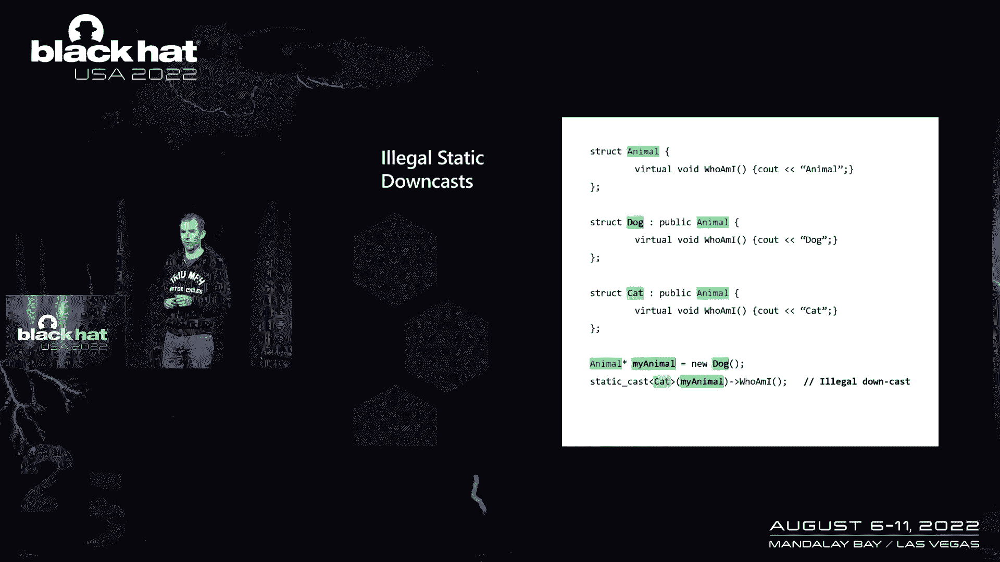

 is an illegal static downcast。 So in C++， you can build class hierarchies that have inheritance。

 And in this example here， you might create a dog object and you upcast it to be the point。

 of that dog object is stored in an animal pointer。 And then you downcast it to be a cat。

 But a cat is not a dog。 So that's an illegal static downcast。

 You casted this base pointer down to the wrong derived type。

 And some of you that are familiar with C++ might be thinking， well， hey， you don't even。

 need to give this talk because there's already a solution for this problem。

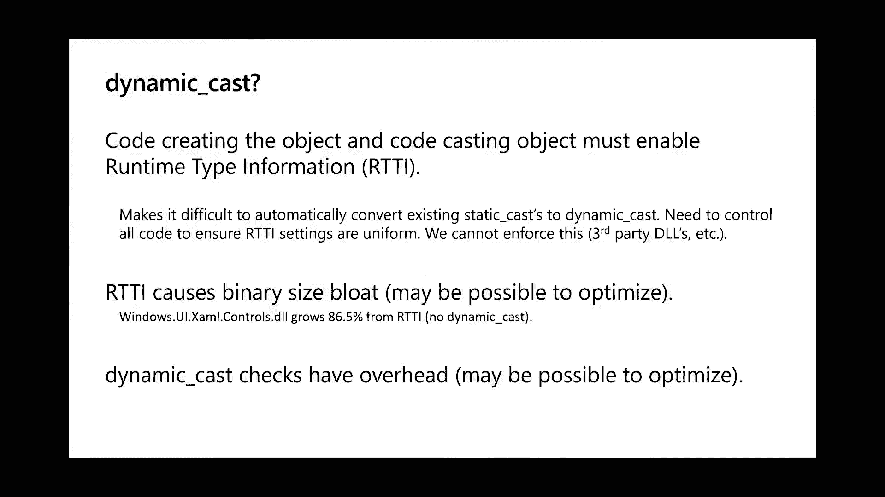

 Just use dynamic cast。 It's part of the C++ language and that will do checking for you when you do downcasts。

 But the issue is that dynamic cast is a very hard thing to just generically apply to a。

 huge code base because in order for dynamic cast to work， the code that creates the object。

 needs to enable runtime type information or RTTI。 And on an operating system like Windows。

 we have no control over large amounts of the， code that runs on the platform。

 And so we can't enforce that they turned RTTI on。 And if you try to dynamic cast an object that was created without RTTI。

 your program， ends up crashing。 And so dynamic cast is very difficult or really impossible to just deploy at scale across。

 a huge code base。 RTTI itself is not used by many people because it causes lots of binary size bloat。

 Like in one of our DLLs， for example， turning RTTI on is over an 80% binary size regression。

 That's huge。 You're almost doubling the size of your binaries by turning this on。

 And dynamic cast checks themselves also have a lot of overhead。

 And when we're talking about doing downcasts in C++， this is an operation that is typically， free。

 There is no code generation that happens when you do a downcast。

 It just changes how the compiler allows you to interpret that data。 And so dynamic cast。

 having a lot of overhead， can be kind of problematic。 And just as an example。

 there's a lot of assembly here。 Obviously， we can't actually read this assembly。 It's way too small。

 But I just did a test to see what actually gets executed when you do a dynamic cast on。

 a very simple class hierarchy。

 Single inheritance class hierarchy。 You have 12 stores， 30 loads， 12 jumps。

 and two calls that end up being made。 And that's in the happy path where the cast is going to succeed。

 So this is a tremendous amount of code that ends up running。

 And it might be possible for us to do some work on the dynamic cast implementation and。

 optimize some of it away。 But you still end up with this dependency on RTTI that you can't get out of。

 So that brings us to CastGuard。

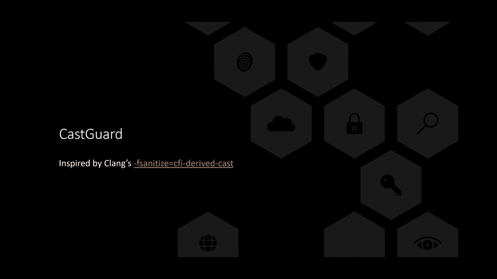

 And I just want to call out that this is actually inspired from a clang feature that FCANITIZED。

 CFI derived cast feature。 We took that feature as inspiration and just really optimized it like crazy。

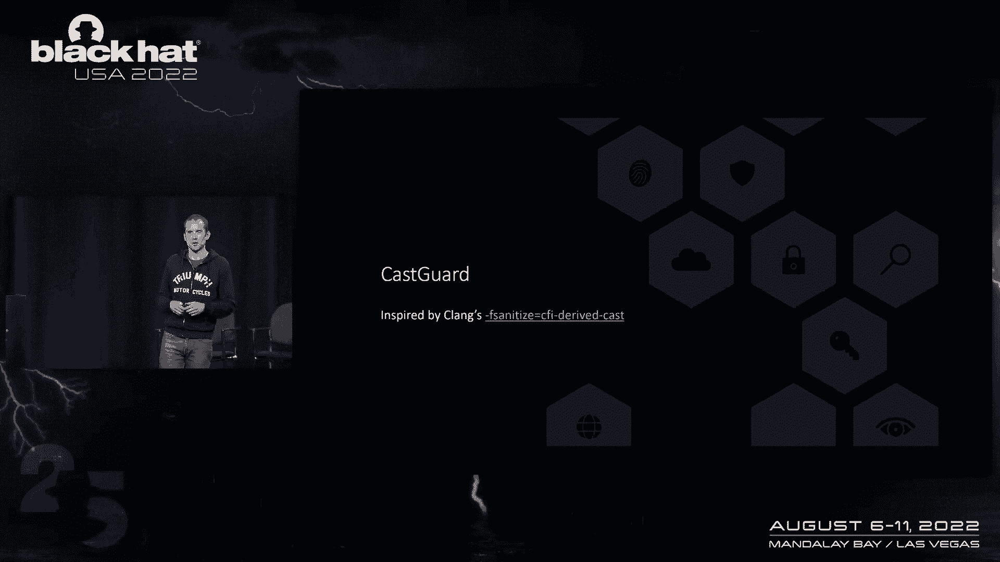

 And that's what I'm here to talk about。 So here's the concept。

 If you want to protect against illegal static downcasting， you need some way to identify。

 what the type of the object is that is being downcasted。 You don't know what it is statically。

 It can pile time so you need to be able to check it runtime。

 But we can't add identifiers into objects generically because that changes the object， layout。

 And so it's an ABI breaking change。 It's similar to requiring RTTI。

 But for objects that already have virtual functions， those objects already have an identifier。

 which is the Vtable pointer that the object contains。

 We can actually use that to uniquely identify objects。

 And so now that we have an identifier that is just already baked into objects， that actually。

 gives us a way that we could do checks on downcasts to see if they're legal or not without breaking。

 the ABI。 And so that allows us to just automatically convert all of the existing static downcasts。

 that we have in our code into castguard protected downcasts。

 So I am not like a C++ language lawyer or anything。

 I don't know how C++ people necessarily talk about some of this terminology。

 But for the sake of this presentation， I want to tell you how I talk about the code that。

 we're going to be looking at。 So I call the type that you are downcasting to the left-hand side type。

 And I call it the left-hand side type because it's on the left-hand side of the expression。

 Very creative， right？ And I call it the right-hand side type。

 the type that you statically declare the right-hand， side of the expression to be。 So in this case。

 we're downcasting something that is statically declared as an animal to， be a cat。

 So I would say the right-hand side type is animal。

 And then the underlying type is the actual type of the object that you're casting。

 And we don't know that statically at compile time。 You can only know that at runtime。

 So Cascard has a few requirements that it's useful to discuss before we talk about how。

 the mitigation works just so you aren't left wondering。

 Code needs to be compiled with LinkTime code generation because we need a full world view。

 of all the code in the binary to actually understand all the different objects in play。

 and all the different casts that are going on。 The objects obviously need to have a V table because that's the identifier that we're using。

 We also assume that the object itself is valid。 So if you have another memory safety vulnerability。

 like you have a buffer overflow and you're， able to use that to corrupt an object。

 Cascard isn't going to provide you protection anymore。

 because Cascard isn't the first vulnerability in play。

 Cascard is really just designed to protect against vulnerabilities where the issue itself。

 is that you're just doing a bad downcast。 So if you're able to corrupt memory in other ways before you get to a cast。

 all bets are。

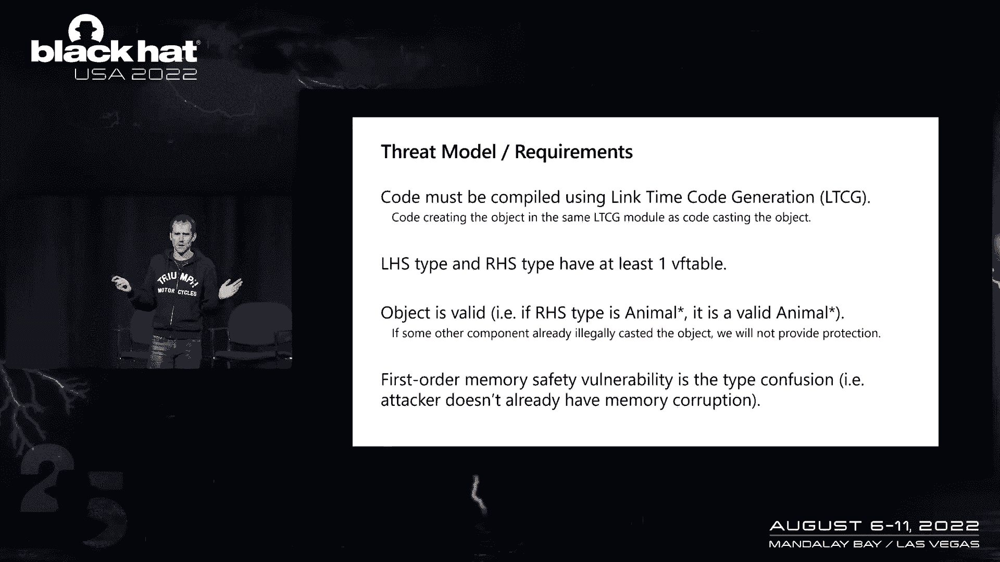

 off。 Let's talk about how Cascard works。 The best way to explain how Cascard works I think is just to look at examples of what。

 we actually do。

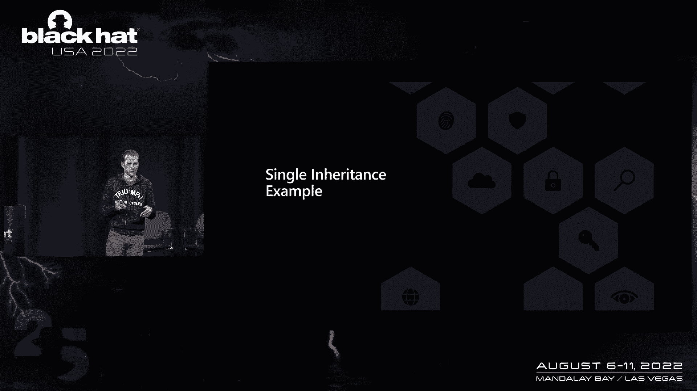

 So what does the compiler know？ If you look at a piece of code like this。

 the compiler knows that it's a static downcast。 And even if you didn't actually use static cast。

 you just did a C-style cast where you， just used parentheses and put the type that you want to cast to。

 the compiler actually， still knows that it's a static downcast。 So we track that。

 We know where the Vtable pointer in the object is and we know where the Vtable themselves。

 are going to get laid out in the binary。 So we know that cats Vtable is at offset 500 in the binary or dogs Vtable is at offset。

 1000 in the binary。 We know where everything is。

 And if you look at how an object is laid out in C++， what you end up seeing here is that。

 in the case of the base object here in this diagram A， the way that an A object is laid。

 out is you'll have the AVtable pointer at the beginning of the object and then you have。

 A's member variables that come after that Vtable pointer。

 And very important to C++ having good performance is that when you inherit from A， really all。

 that happens is that the next object down the chain， B for example， just has a copy of A。

 right at the beginning of it。 And then any new member variables that B introduces just get tacked onto the end。

 And if you look at the Vtable itself for object B， it will start with all of the virtual functions。

 that A introduced。 And this is what allows you to do upcasts and downcasts in C++ without actually requiring。

 code， like new code generation to be added to the binary。

 You can take that same pointer and interpret it as an A or as a B because the layout is。

 structured so that sort of thing works。 If you have a B pointer。

 the A member variables are at a fixed offset in that pointer。

 So with Cascard since we're using Vtables as a way to identify the object， you really。

 need to think about things in terms of the Vtable view of the world。

 This was like one of the biggest， like， cognitive shifts for me to wrap my head around。

 I kept trying to think about checking for the validity of casts just in terms of the。

 classes that were in play。 But I really needed to be thinking about what are the Vtables in play。

 And so if you have a class hierarchy， like the one on the left here， the Vtable hierarchy。

 would be on the right and I have the mangled names that the compiler uses but this hierarchy。

 effectively looks identical to the normal class hierarchy because this is a very simple single。

 inheritance case。 But the compiler does track Vtables just like classes。

 So the compiler knows this is the base Vtable。 This BV table inherits from A。

 the CV table inherits from B。 The compiler tracks all these， relationships。

 And so conceptually if you want to do a cast check， it's actually not extremely complicated。

 You end up building a table kind of in your head about， hey， if I want a downcast to something。

 of type C， what would the， what Vtables would a type C be allowed to have？

 And the Vtables that a type C would be allowed to have are C's Vtable and then anything that。

 inherits from C。 And in this example， and this is the example that I'm going to use。

 going for all the rest of the slides is I'm going to be downcasting to something of type， C。

 The Vtables that are allowed are C， E， and F。 So there's three Vtables that an object。

 of type C would be allowed to have。 So you can build a check pretty easily for this。

 If the compiler sees a static cast and it's a downcast of something of type C， all you're。

 really doing is you're going to read the Vtable out of that object。

 First you need to check if the object is null。 You're allowed to always static downcast to null pointer。

 So if the object is null， you let the cast happen。 If the object isn't null。

 you read the Vtable pointer out of it。 And then you check is this Vtable pointer， the CVtable。

 the EVtable or the FVtable。 And if it is， then the cast is allowed to succeed。

 But you probably look at this and you think， okay， this would be an absolute performance， disaster。

 right？ What if you had a class hierarchy with like a thousand different classes in it and you。

 have to sit there just chugging along through every different Vtable that might be allowed？

 This would be way worse than dynamic cast。 So clearly， this isn't actually a scalable solution。

 It's just to help us understand the concept。 So if we want to build a scalable solution。

 we need to get a little bit trickier。 So the first thing that we're going to do is we're going to lay out all the Vtables that。

 might be used in one of these cast checks together。

 And I put them inside of a region in the binary that I just call the cast guard Vtable region。

 Very creative naming。 One thing that I would like to call out is that the cast guard Vtable region starts with。

 a global variable and ends with a global variable。

 So there's a global variable called cast guard Vtable start and a global variable called。

 cast guard Vtable end。 And those will be important a couple slides later。

 but just remember that for now。 So we don't give any particular ordering to these Vtables。

 We just kind of shove them all together in this region。 And then we're going to create some bitmaps。

 So this is the same diagram that I had before。 It's just on， it just illustrates， you know。

 on the left hand side of the diagram is the， type that you're casting to。

 And then you get a check mark for any Vtable that's allowed for that type。

 And then on the left hand side of the slide， I have the order that these different Vtables。

 are laid out。 So A， B， C， D， E， F， G， H。 That's the order that we decided to lay the Vtables out in。

 But once we know what Vtables are allowed for any particular type， we go and we start。

 building bitmaps。 And you build one bitmap for every type that you might downcast to。

 And the way that you create the bitmap is first you need to choose what I call the base Vtable。

 And the base Vtable is just going to be the Vtable that is closest to the beginning of。

 the binary that is allowed for that particular cast。

 So in this example that I've been using where we're downcasting to something of type C， the。

 Vtable that is closest to the beginning of the binary is the CVtable。 So that will be our base。

 And then you compute the offset between that base Vtable and all the other Vtables that。

 are allowed for the cast。 So one offset will be zero because the CVtable is allowed for the cast。

 right？ But any other Vtable， so E and F， you compute the offsets。

 And then you end up constructing a bitmap。 And here's what the bitmap ends up looking like for the CVtable is every index in that。

 bitmap in this case represents an 8 byte offset from the base。

 And you put a one in there if that particular offset is legal to cast and you put a zero。

 if that particular offset is illegal to cast。 And so when you want to use this bitmap。

 what you end up doing at runtime is you compute， the difference， the delta。

 between that base Vtable， which we know statically at compile， time。

 the base Vtable will be the CVtable。 You compute the delta between that and the objects Vtable that you read at runtime。

 And you figure out how many bytes apart are these things。

 And then depending on the alignment of the bitmap， in this case the bitmap， every index。

 in the bitmap represents 8 bytes。 So we shift out some of the low bits of that delta。

 And now we have an offset or an ordinal。 And you can use that to go and look up in the bitmap to see。

 hey， is this bit a one or， a zero。 And you end up doing this for all of the different types that you might downcast to。

 So you don't need to create a bitmap if some particular type is never downcast to。

 There's no reason because the bitmap will never be referenced。

 It's just going to take up space in the binary。 Another thing worth noting is that in these examples。

 I have each bit in the bitmap representing， an 8 byte offset。

 But it doesn't need to be an 8 byte offset。 If your Vtable's are really big。

 then we can go and make the， you know， each bit in the。

 bitmap represents 64 bytes or 128 bytes or however many bytes we want to。 So it's totally flexible。

 Okay so there's a lot of code here now but basically this is just the improved check。

 where rather than having a big if statement that kind of loops through every single possible。

 Vtable to check for validity， instead what we're doing is we just， we compute the delta。

 between the base Vtable and the objects Vtable at runtime， shift out some bits to compute， an index。

 We do a range check to make sure that index is actually in bounds of the bitmap。

 If the index is so big that it's not even in bounds of the bitmap， then you know the。

 cast is illegal。 And if it is in bounds， then you do the bit test。 And if the bit is a one。

 the cast is allowed。 If it's a zero， the cast isn't allowed。 So this is a lot better。

 This cast check ends up scaling pretty well。 It doesn't matter how many Vtables you have really。

 It still is a pretty constant time operation that you're doing。

 But it turns out we can actually do even better than this。

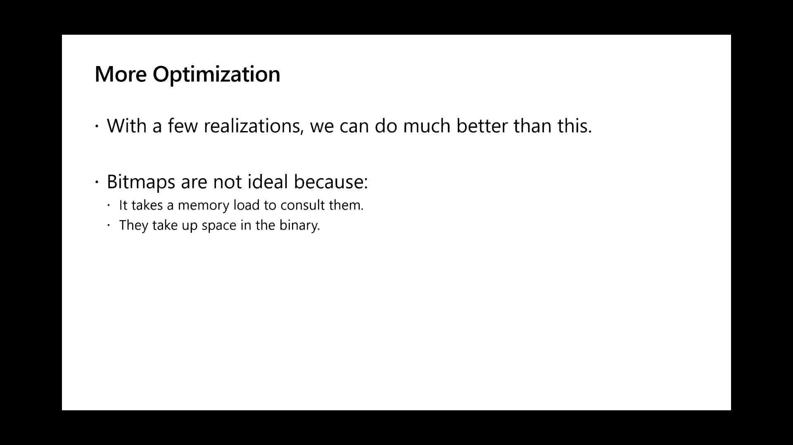

 The bitmap is still not perfect because bitmap requires an extra memory load that you're， doing。

 And it's a memory load that might be in memory that isn't super hot。 So it could take time。

 Okay so if we want to do better， then instead of laying the Vtables out using just a random。

 ordering， we're actually going to lay the Vtables out using a depth first ordering。

 So it's kind of like a depth first search I guess， but we're not actually searching for， anything。

 But you lay out the AV table and then the BV table CE。 Go back up F， go back up to B。

 DV table G and then H。 So we lay the Vtables out in this order。

 And you might have a bunch of different Vtable hierarchies in your binary。

 And the order that different hierarchies are laid out relative to one another doesn't， matter。

 It just matters how the Vtables in any particular hierarchy are laid out relative to the other。

 Vtables in that hierarchy。 Okay so then once again。

 you might go ahead and just kind of intuitively you create bitmaps。

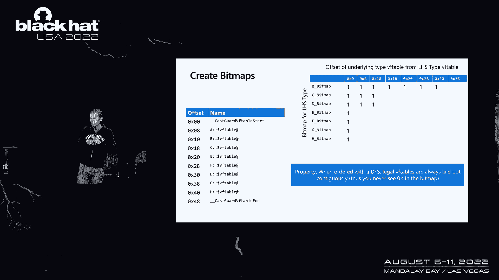

 But one of the things that you end up noticing when we create the bitmaps this time is that。

 when you lay the Vtables out using this depth first ordering， you never have a situation。

 where you have two Vtables that are legal for a cast and a Vtable that's not legal for。

 the cast in between them。 All Vtables that are legal for any particular cast are laid out linearly next to one another。

 And because they're laid out next to one another， you don't actually need to look up。

 in the bitmap to see if the bitmap is a one or a zero。 If the range check passed in that example。

 then you would know that the bitmap itself， contains a one， right？

 So you don't even need to look at the bitmap。 And you can actually take this even further and you can say you don't even need to compute。

 the ordinal。 You don't need to do that shift operation on the offset between the base Vtable and the。

 objects Vtable。 You can just do a range check。 So in the example that I've been using where we're downcasting to an object of type C。

 we can see so we have the CV table here， E and F。 And so we can just say if the delta between the base Vtable C and the objects Vtable is。

 16 bytes or less， then that would mean that you must have either an E， a C， an E or an， F。

 And so the cast is allowed to succeed。 And this is what this ends up looking like in C pseudo code。

 You read the Vtable pointer。 You compute the offset and then you just compare is this offset greater than 16 if it is then。

 fail。 Otherwise， succeed。 Very， very， very simple check here。

 And we don't introduce any real extra memory loads。

 The only memory load that we're doing in this check is just reading the Vtable pointer。

 But given that you're using an object that has a Vtable， that cache line is probably， hot anyways。

 So it doesn't really cost us much to read it。

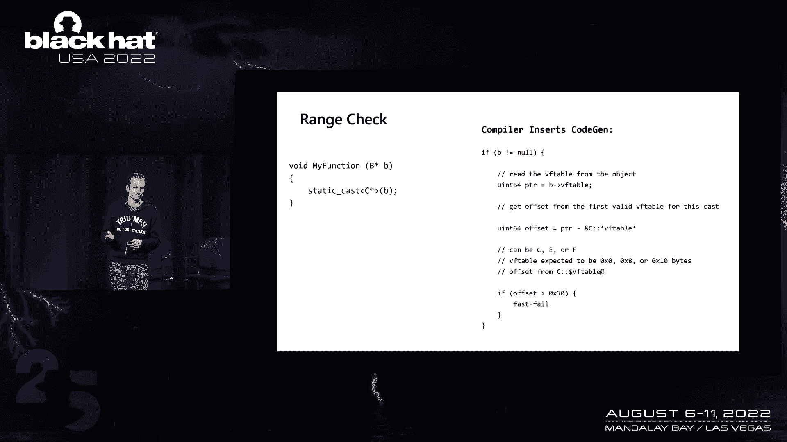

 Now some of you might be thinking， wait a second。 If somebody had corrupted this object already and they made it so that the Vtable。

 the offset， that you compute is like nine bytes， it passes your range check even though it's not。

 even pointing at the start of any Vtable in that region。

 It's like pointing into the middle of one of the Vtables。

 But you got to remember that our threat model is that no memory corruption has happened to。

 this point。 We're assuming that the object is valid。 And if the object is valid。

 then you would never compute an offset of nine bytes because， that's just nonsense。

 So we don't actually need to worry about this。 The range check is a completely legal optimization for us to do。

 Another thing that you might be wondering is， well， what happens if this object was created。

 in a completely different binary and then you're casting it？

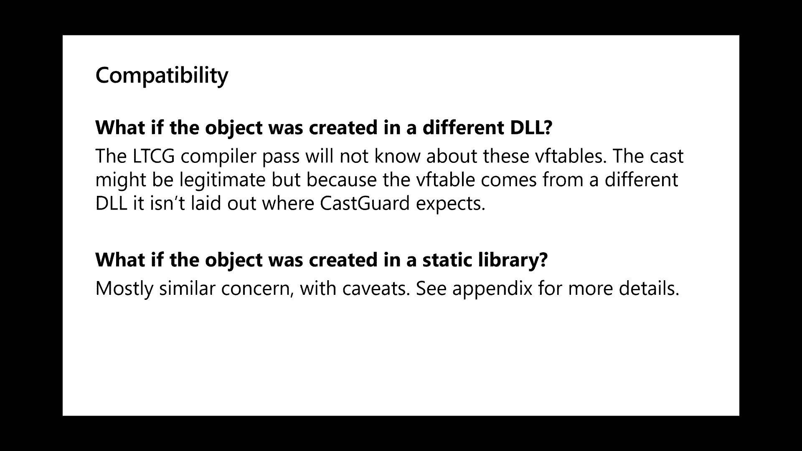

 When you go and you do this check to say， hey， what's the offset between the base Vtable。

 and my current binary and the Vtable that this object has， that offset is going to be， huge。

 And there are millions of bytes because the object isn't a completely different binary。

 And so this is where those global variables that I talked about before come into play。

 What we actually end up doing is we say， if you fail the range check， your offset is too， big。

 then we do a second check to see， is the Vtable pointer that the object contains。

 is that within our binary's cast guard region？ And if it isn't within our binary's cast guard region。

 then we assume， oh， so this Vtable， must be from a different binary。 And we can't check that。

 We can't do a security check on that because it's from a different binary。

 And so we just fail open in that case。 But in Windows。

 most of the objects that our binaries are using are not really getting。

 crossed across binary boundaries like this。 Or even in the case of comm objects。

 they might get passed across binary boundaries， but。

 you're not really supposed to static cast comm objects yourself。

 You're supposed to use query interface。 And the query interface code lives in the binary that created the object。

 So it's pretty uncommon for us to have casts happening on an object that was not actually。

 created inside of your binary。 So for the most cases that we see。

 we can correctly do-- like we can do secure cast checks。

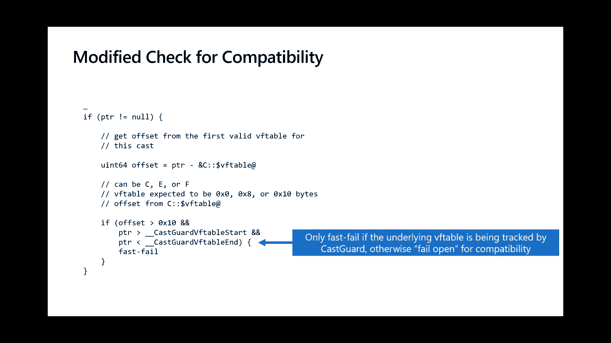

 We don't need to worry about the object coming from another binary。

 So this fail open application compatibility check is not a big deal for us。 And， you know。

 I included the final assembly that this compiles down to just so you can。

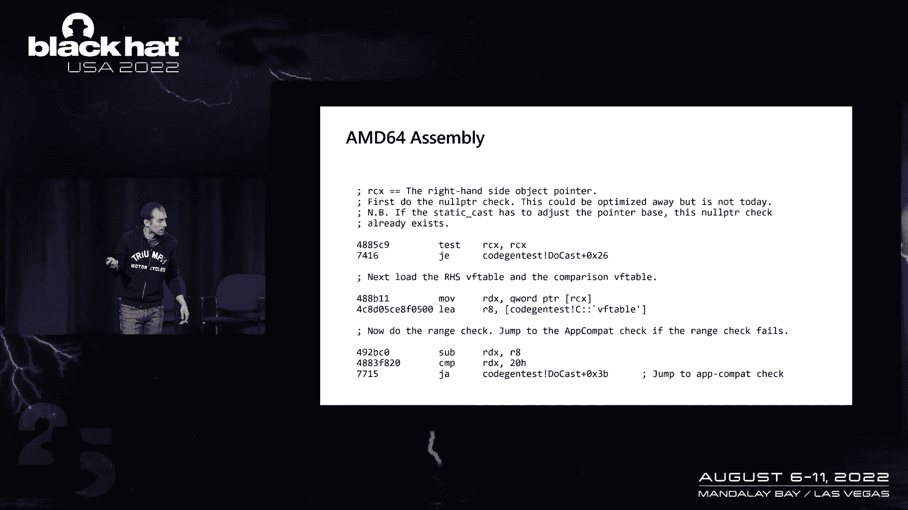

 see how minimal this really is。 It's seven instructions total to do a cast check here。

 There's one memory load， a couple branches。 The code speculates very well。

 The app compat check is not contained in this assembly because we don't expect it to be。

 hit very often。 So we actually put that out of line。 We don't put it in the hot path of a function。

 We'll just jump to it if it actually is needed。

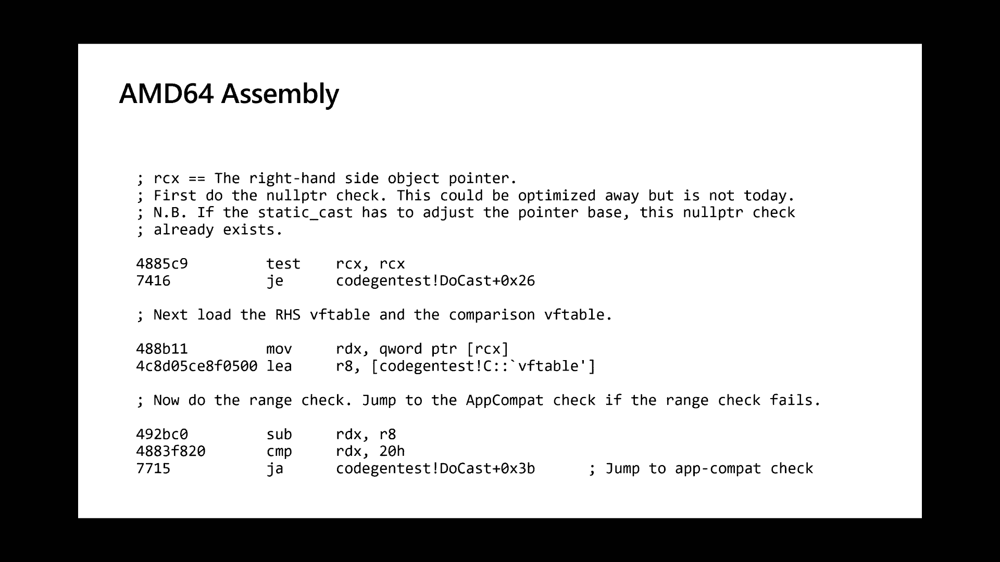

 Okay， what about multiple inheritance？

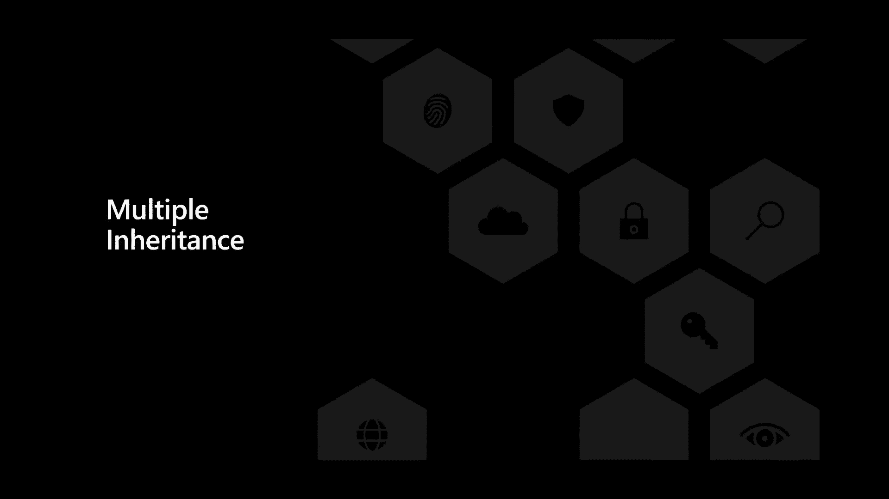

 So multiple inheritance seems really scary at first because you have a second parent。

 But the thing that you have to remember is the V table view of the world。

 So when you have multiple inheritance， you actually have two completely separate V table。

 hierarchies。 You have a V table hierarchy that chains back to each of your base classes。

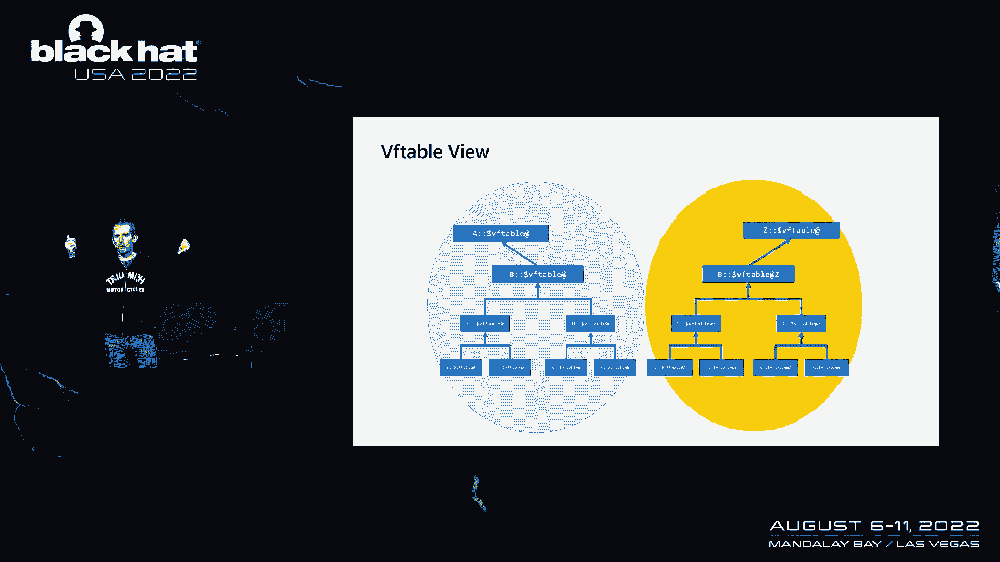

 And if you look at how the objects themselves are laid out， you'll see that the two base。

 classes A and Z， they're laid out effectively how you would expect。 They have their V table。

 they have their member variables。 And anything that inherits from both of them。

 once again it has a copy of both the A and， Z object。 So object B， for example。

 it has an A and Z object， which means it has two different， V tables。

 One chaining to the A hierarchy， one chaining to the Z hierarchy。

 And so when you encounter multiple inheritance， really the only question that you need to。

 ask yourself is which V table hierarchy should I use here？

 If your right hand side type is an A object， then it's only guaranteed to have one V table。

 And so that's the V table that you need to do your cast checks with。

 And if the right hand side type is a Z object， again it's only guaranteed to have one V table。

 It might have more than one V table， but it's only guaranteed to have one because it's a， Z。

 And if it is anything else， if it's a B or a C or a D or any of these objects that do。

 have multiple V tables， then you can use either V table。

 It doesn't matter which one you use for the cast check。

 What we do is we use the V table that is closest to the beginning of the binary just because。

 it minimizes code size。 You don't need to do math on the pointer in order to read the V table out of the object。

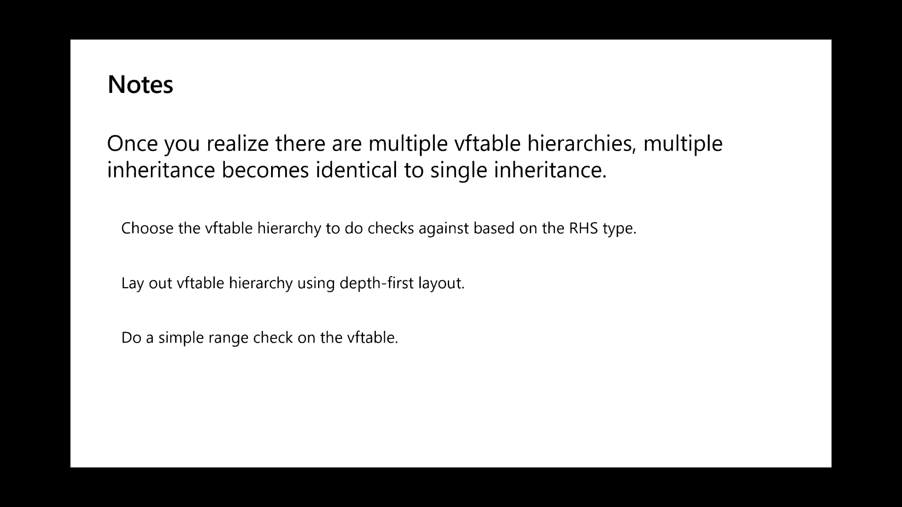

 So the point here though is really that multiple inheritance seems scary， but it's actually。

 effectively identical to single inheritance。 We still do range checks。

 It still optimizes extremely well。 You just need to be diligent about which V table am I going to use or which V table hierarchy。

 am I going to use for the cast check。 There's one final thing which is virtual based inheritance。

 but I don't have time to talk。

 about it because it is very complicated C++ feature。

 What I will say though is that virtual based inheritance is the one case where we actually。

 need to use bitmap checks sometimes。 You can't always handle them with range checks。

 So that's why I spent the first part of this talk talking about how the bitmap checks were。

 I've included a bunch of information on this in the appendix of the slides so you can check。

 it out once the slides go online。

 Okay， so I had a few interesting things that I discovered when we were working on Cascard。

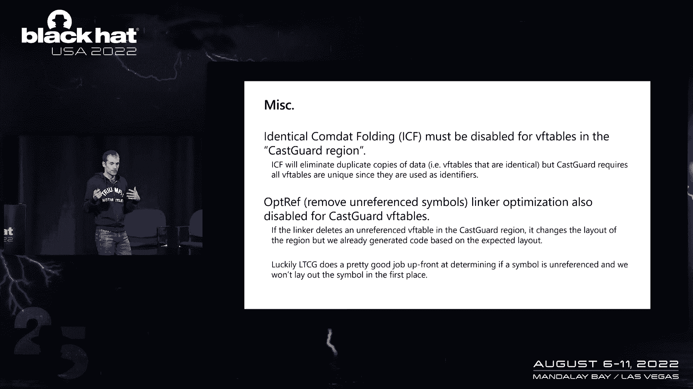

 So the first thing is that Cascard does not play super nicely with every single optimization。

 that there is out there。 One optimization that the linker has is called identical com。

folding or ICF。 And really all that the linker is doing here is saying hey you have two read only pieces。

 of data that are the same。 I don't need to include two read only pieces of data that are the same in the binary。

 I'm just going to include it one time and everyone can reference that single copy。

 But with Cascard that's kind of a problem because we're using the V tables as a way。

 to uniquely identify objects and so we don't want all the V tables to be merged into like。

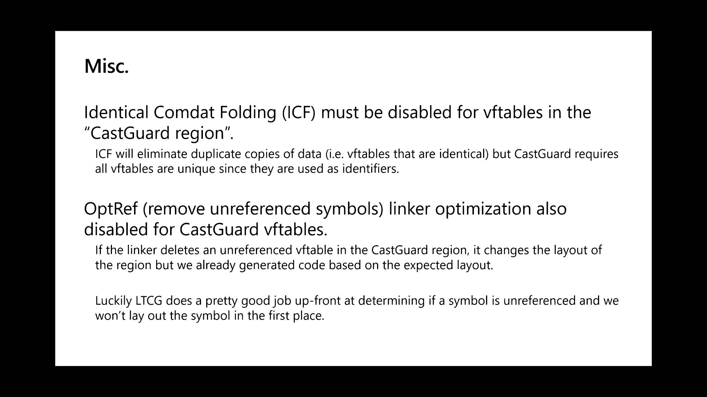

 one single copy because then we can't uniquely identify objects anymore。

 And so any V table that is laid out in the Cascard region we turn ICF off for。

 If the V table is not going to be used in a Cascard then it can still be ICF'd by the。

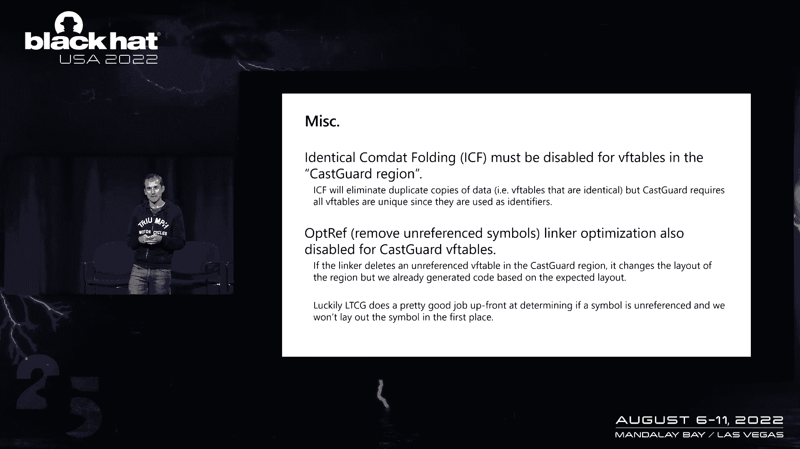

 linker。 We don't care about it。 But if it is going to be used in a Cascard， no ICF。

 And that actually brings me to this really interesting programming pattern called CRTP。

 or the curiously recurring template pattern。 This is a pattern that is used a lot in some Windows binaries。

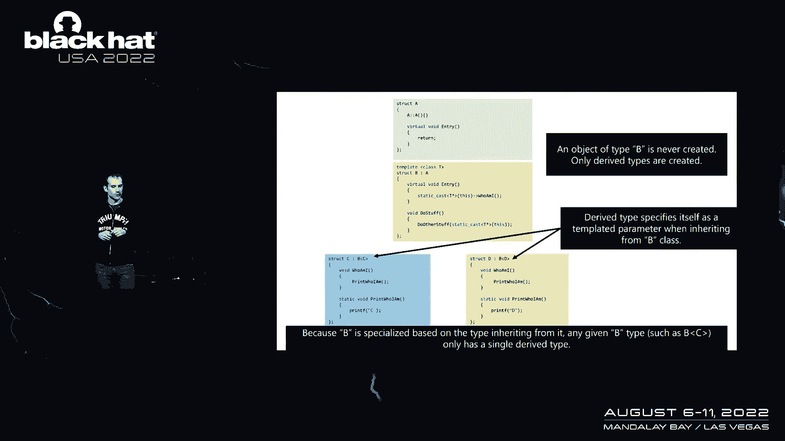

 And the gist of this programming pattern really is just that you might have a base class。

 and it has a virtual function。 And then you have a class in the middle and I call it class B in this example。

 And the interesting thing about class B is that it takes a template parameter and the。

 template parameter is a class type。 And anything that inherits from class B such as C in this example passes its own type as。

 that template parameter。 So you're inheriting from your parent but you're actually passing your own type as the。

 template parameter your parent。 It's kind of weird。

 And what class B ends up doing is it will do things like static cast to that type it， was passed。

 Which ends up being a static downcast。 It will static downcast to the thing that derived from it。

 Important thing to realize with this programming pattern is that if you look at the class diagram。

 in source code it looks like there's only one class B。

 But if you look at it from the compiler's perspective， each of those specialized versions。

 of B is actually a unique class。 And it has a unique V table。

 So why does cast card have issues with this？

 Well it really comes down to the identical combat folding stuff that I was talking about， before。

 So without cast card enabled you might have functions like there's this do stuff function。

 here and I realize it's hard to read but all the do stuff function does effectively is。

 it does a static downcast。 And static downcasts normally have no code generation。

 And so all of these different do stuff functions for each specialized version of class B they。

 compile to the exact same assembly。 And so the linker looks at that and merges it all into one。

 But when you put cast card checks on these downcasts suddenly you have type specific downcast checks。

 in all of the different functions。 And those functions can now no longer be merged together because one version is doing。

 a cast check for downcasting to C， one of them is doing a check for D， etc。 So you get more code。

 And then the other reason this caused an issue is because these most derived classes C and。

 D for example they do not change any of the virtual functions which means that their virtual。

 function tables are identical to their parents virtual function table。

 And so again the linker would merge those but with cast card on those V tables are used。

 in cast checks so we do not allow identical combat folding to happen。

 And so some of our win our T binaries when we compiled with cast card ended up getting。

 20% bigger which is unacceptable for us。 We're calling that out explicitly。

 But we can actually optimize this away really well because what we realized was that these。

 different specialized versions of B they're never actually created directly。

 You only create the most derived types in source code。

 And because those different B classes are never created directly there's no reason to include。

 their V tables in the cast checks at all because you know that no one would ever have that， V table。

 The objects never created。 So if we're doing a downcast and we currently have something that's a B specialized by C and。

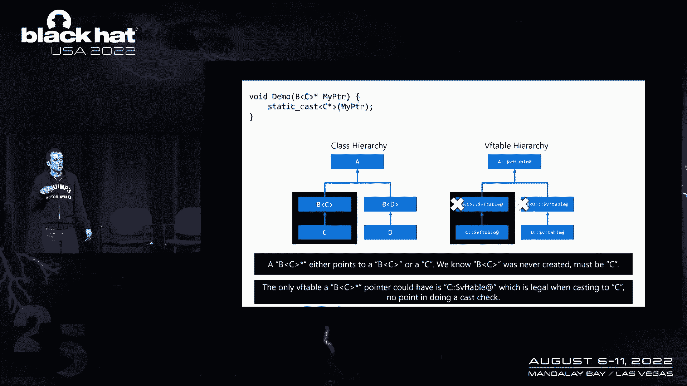

 we're downcasting it to just be a C the most derived type。

 Well we know that if you currently have a pointer that's a B specialized by C there's。

 only two different classes that it could be。 It could be that B specialized by C class or it could be the most derived class the C class。

 But as I just mentioned we actually know that it couldn't actually be a B specialized by。

 C the compiler knows that class was never created at all。

 So the only thing that that could actually be is a C。

 And you're downcasting to a C and so we could just statically prove that the cast is safe。

 We know that the only underlying object you could have as a C and you're casting to a。

 C so you're good to go。 Cast guard cannot provide。

 There's nothing for cast guard to do there so there's no reason to put a check in place。

 And because we don't have to put a cast guard check in place we can now continue doing the。

 identical COMDAT folding on all of those do stuff functions。

 And the V tables themselves aren't referenced by cast guard checks anymore so they can be。

 optimized away by the linker as well。 In the case of these WinRT binaries that we have in windows that heavily use the CRTP programming。

 pattern we're actually able to statically prove away every single cast check in the binary。

 So we went from a 20% binary size regression to 0%。 There's no more cast checks at all。

 It's just statically proven safe。 And something else that was interesting is that Clang CFI and XFG which is a technology。

 that Microsoft has been working on that's similar to Clang CFI。

 They also caused really big optimization issues with the CRTP programming pattern。

 On the same binary that had a 20% regression with cast guard XFG had a 43% binary size regression。

 And so we went and made some changes to XFG to make it not care about these template parameters。

 to classes so we kind of weakened the security of it so that we could eliminate this 43% binary。

 size regression。 Clang， I don't think the Clang folks are aware of this programming pattern。

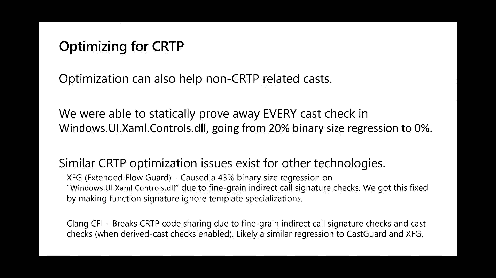

 So if you use Clang CFI on CRTP you'll probably get a lot of binary size bloat。

 So at the end of the day performance with cast guard is great。

 The spec benchmarks show no regression。 It's a super。

 super minimal amount of instructions that we're adding to binaries。 It optimizes well。

 it speculates well。 So we're really not concerned about the performance。 The size impact is tiny。

 it's under 1% typically。 If your component doesn't do casting。

 static downcasting then you won't have any binary， size regression。 So very easy for us to roll out。

 Future possibilities that you could use for this sort of technology。

 And I'm not committing to anything。 These are just ideas that we have。

 We could possibly introduce a strict mode for cast guard where we could say we're not doing。

 app compat checks， we only expect this object to be created in the binary and so it better。

 have been created in the binary。 If it was created by a different binary we just crash。

 We could also have a strict mode if we wanted that always does bitmap checks and if you。

 always do bitmap checks then you might be able to be more resilient even if someone corrupts。

 your object。 Maybe。 You could also potentially use cast guard as a way to accelerate dynamic cast。

 Now dynamic cast is a huge amount of code but you could potentially just use cast guard。

 checks for these downcasts and then if the cast guard check fails then you could just。

 go and do a full dynamic cast check and decide you know should dynamic cast really fail this。

 or not。 But again these are just ideas。 Nothing that we're committing to doing。

 What I do want you all to take away from this though is that it is possible to do really。

 really performant checks on downcasts like the state of the art with dynamic cast is。

 it doesn't need to go that slow。 We can go way faster and have better type safety in C++ and this stuff matters because。

 type confusion is a super important bug class and especially in the face of hardware mitigations。

 that a number of different companies are working on type confusion vulnerabilities are。

 going to be a lot more important going forward。 For people that are interested Hyper-V is currently flighting in the windows insider。

 preview builds with cast guard enabled。 It is currently enabled in what we call telemetry mode so it won't actually fast fail the process。

 it just logs telemetry for us。 But cast guard is such a compatible technology that we actually have had zero telemetry mode。

 failures with it and so we have switched it on to enforcement mode it just hasn't reached。

 the flighting yet。 And we are working on rolling this out to additional windows components in the future。

 and so you can keep your eyes open if you're interested in it。

 Hyper-V was the first one but there will be more to come。

 And finally I just want to acknowledge that I'm up here talking about this technology and。

 I certainly did a lot of work on this technology but I am not the only one that worked on this。

 technology。 We had a lot of people contribute to this project from windows， visual studio and MSRC。

 and of course we were inspired by the the Clang at sanitize CFI derived cast so none。

 of this stuff would be possible without the help from everyone who is involved in the。

 project and everyone who inspired the project。 I am out of time so I do not have time for questions here but I do have time for questions。

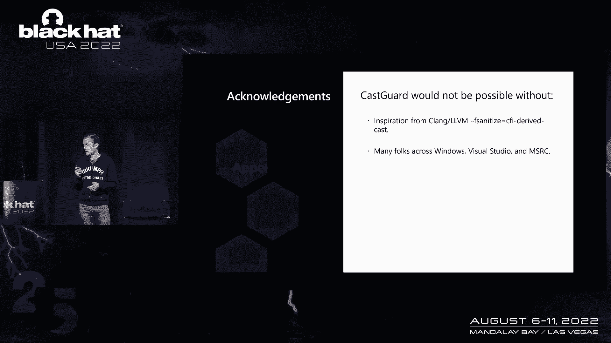

 in the side room that they'll be setting up so if you'd like to chat more let's just take。

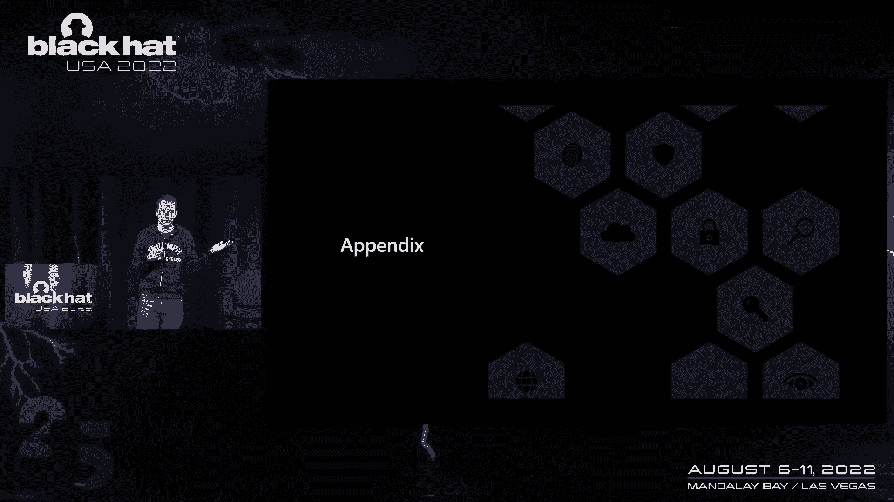

 it over there。 Thanks for your time。 [Music]。