# 【转载】Black Hat USA 2022 会议视频 - P47：052 - Calculating Risk in the Era of Obscurity： Reading Between the Lines of Sec - 坤坤武特 - BV1WK41167dt

你好，每个人，谢谢你今天早上来参加我们的谈话，这是在默默无闻的空气中计算风险，阅读安全建议的字里行间，就像我说的，我叫布莱恩·戈登，我是趋势微公司脆弱性研究的高级主管，我也运行零日倡议。

它代表着世界上最大的供应商，不可知论bug赏金程序，我们还和我一起组织和裁决一对一的黑客比赛，今天是达斯汀，儿童，我们与ZDI的高级沟通经理，他也是我们的首席牧场主，我们今天在这里讨论补丁本身的安全性。

以及当前供应商的做法如何不可避免地给企业带来风险，而不是通过软件更新来降低风险，我要把它交给达斯汀，他会开始，哈喽大家好，我叫达斯汀，我太在乎安全补丁了。

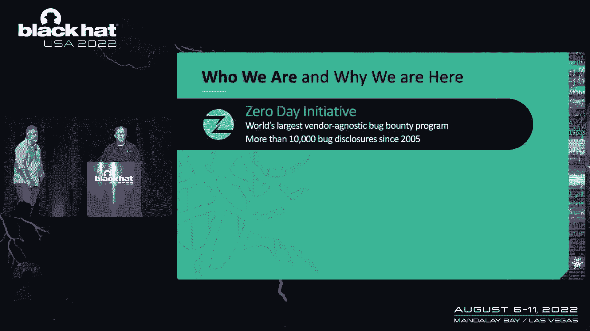

这实际上是我的一种疾病，你可能从2008年1月起就听说过补丁星期二，我星期二做了每一个补丁，除了两个，一个是联邦陪审团的职责，另一个是我妹妹的婚礼，奇怪的是，没有一个人为我改变日期。

所以我为什么这么在乎，是因为一次又一次的学习，研究表明贴补丁是你能做的最好的事情之一，以帮助保护您的企业并降低事件和违规的风险，我以前在微软的NSRC工作，并帮助生产补丁。

这意味着我在某个时候重新启动了你的电脑，我的错，3。我现在要当面向你道歉，今天我每月写一个补丁博客，谈论Adobe和Microsoft的最新更新。

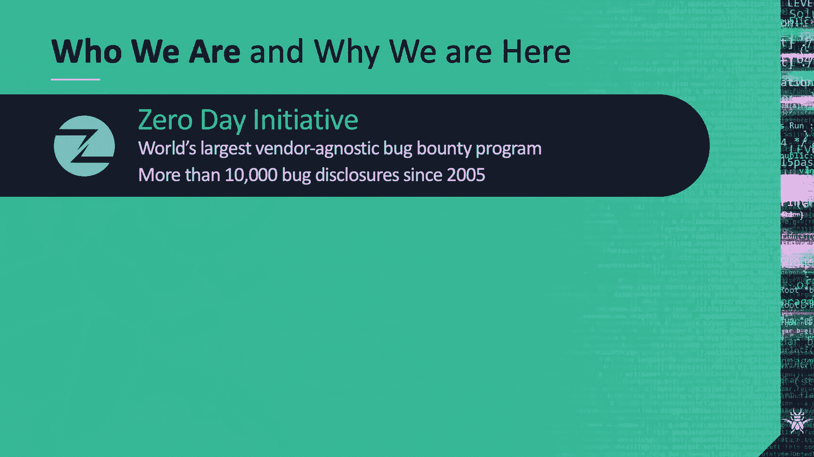

在ZDI这里，我们有一个独特的观点，如何不同的供应商在不同的部门，开发和生产贴片，自2005年以来，我们已经披露了一万多个漏洞，给整个行业的供应商，所以当谈到bug泄露时，我们从丰富的经验出发。

在过去的几年里，我们注意到一个令人不安的趋势，这是补丁质量的下降和围绕安全更新的通信减少，现在，如果你在这个房间里，你可能已经知道为什么打补丁很重要了，我不是要侮辱你，说修补它。

我们知道这并不总是可行的，我也知道估计风险是CSOS的主要角色之一，CSOS与IT领导力，当供应商现在发布有缺陷的补丁时，真正的问题就出现了，正如我们将在这次演讲中演示的那样，不准确或不完整。

有关这些补丁的信息可能会导致企业误判风险，有缺陷的补丁也可能是利用骑手的福音，因为结束日比零日更容易使用，但是虫子很难找到，除非是这个月的第二个星期二，然后微软说这里有120个，哦说这里有五十个。

你知道那很好，到了企业开始依赖第三方的地步，或者开发自己的补丁优先级，而不是依赖供应商的建议或其他行业标准，看，伙计们，我知道，我们都是三下，我们人手不足，我们资金不足，压力很大，对吧，因此。

资源分配不当可能导致风险增加，妥协的机会增加，那么让我们从企业如何计算风险开始，安全补丁的一些问题可能会导致误判，现在，这不是一个关于CVSS是否，或者不是一个伟大的工具，那是另一种说法，然而。

企业往往只看CVSS的基础得分，确定修补优先级，这可能导致资源被花在，不太可能被利用的bug，首先，CVSS是由已知有偏见的人计算的，无论他们走到哪里，他们都带着这些偏见，因此。

这导致了供应商如何感知风险的差异，这可以调整CVSS得分的上升或下降，比如说，亚马逊Linux的一个bug被评为9。8分，因此，它可以将http头中的敏感数据暴露给无意中的主机，然而。

基于真实世界的因素，站得住脚，把它评为五点九，那么谁是正确的，你对哪一个采取行动，我其实不知道那个，另一个问题是CVSS并没有真正考虑可开发性，或者一个漏洞是否可能在野外使用，和塞纳研究所进行的研究。

弗吉尼亚理工大学兰德研究所，已经表明，只有五个，0。5%的公开漏洞被实际检测到，二维码导致了这项研究，CVSS不会告诉你这个bug是否存在于15个系统中，或者在一千五百万个系统中。

它没有说它是否在一个公开访问的服务器中，对这群人来说最重要的是，它没有说，该bug是否存在于对您的企业至关重要的系统中，最后，每个CVSS锡都不是CVSS锡。

电子邮件服务器（如XM或Exchange）中的远程未经身份验证的代码执行bug，这会引起很多人的兴趣，然而，像松鼠邮件这样的电子邮件服务器中的远程未经身份验证的代码执行bug。

它可能不会引起那么多的关注，请注意，这不是松鼠餐的代言，默默无闻的安全性仍然很差，在CDI我们看到了另一个问题，这是供应商将多个bug报告组合成一个CVE，然而，普遍的看法是。

CV代表了一个单一的独特漏洞，CVE规则可能不是这样写的，但这种感觉是存在的，到底有什么问题，如果你有十个右，或UAF或反序列化bug，为什么不将它们合并成一个bug报告到一个cve中呢？好吧。

这又归结为感知，这可能会扭曲您的风险计算，所以如果你看一个产品，你会看到十个CB在一定的时间内打补丁，你可能会从这个新产品中得出一个风险计算的结论，然而，如果你知道这十个CVE是基于一百多个bug报告。

你可能会得出不同的结论，实际上，它归结为企业，误判CVE的严重程度，因为他们没有工具来理解代码问题的密度，所以这里有一个例子，今年早些时候，我们从许多树液虫中买了四个。

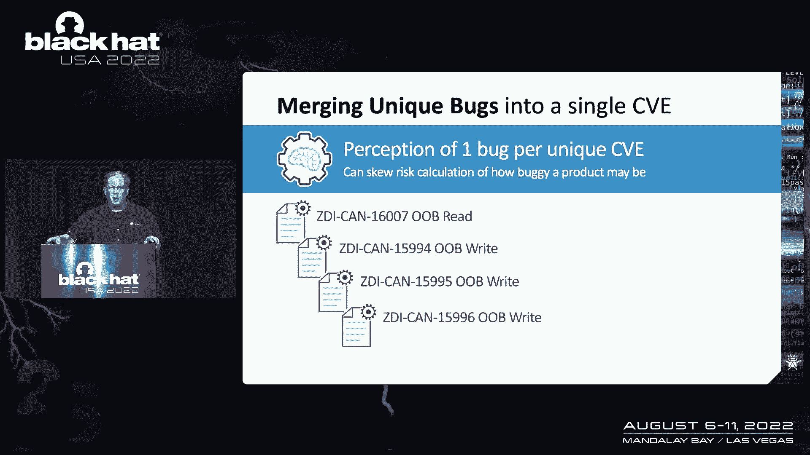

一个OB品种和三个UB权利，并向他们报告，当树液修补它们时，他们分配了这张CD，所以如果你看看他们的网站，如果你能找到它，浏览他们的网站有点困难，你会找到这个单独的cbe来做这些报告。

但是如果你看看我们的网站，您将看到单个CVE的这四个bug报告，您的风险计算可能会根据这些知识而改变，至少，这是你要考虑的另一个数据点，为了时间的利益，我只想提一下电子证书。

因为S和滑冰社区是最严重的罪犯，我是说最好的例子，这对我们来说是非常常见的，报告几十个bug，这些bug最终在最近的一次披露中被合并在一起，我们向先进技术披露了50多个漏洞，主要是SQL注入。

这是有道理的，但这50多份报告最终变成了三个独特的C。

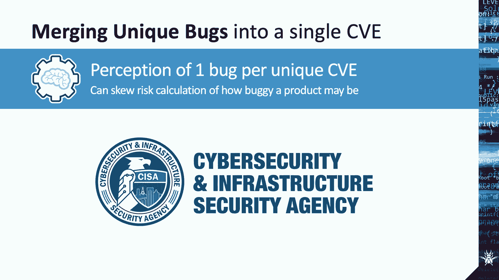

然后是模糊或完全从安全建议中删除信息，在二十世纪末，微软决定从其安全更新指南中删除执行摘要，通知用户CVSS现在就足够了，更改已经从确定风险所需的bug中删除了上下文，比如说，转储，随机存储器。

或者圆周率，CVSS没有注意到对于安全功能绕过，什么被绕过了，可能性有多大。

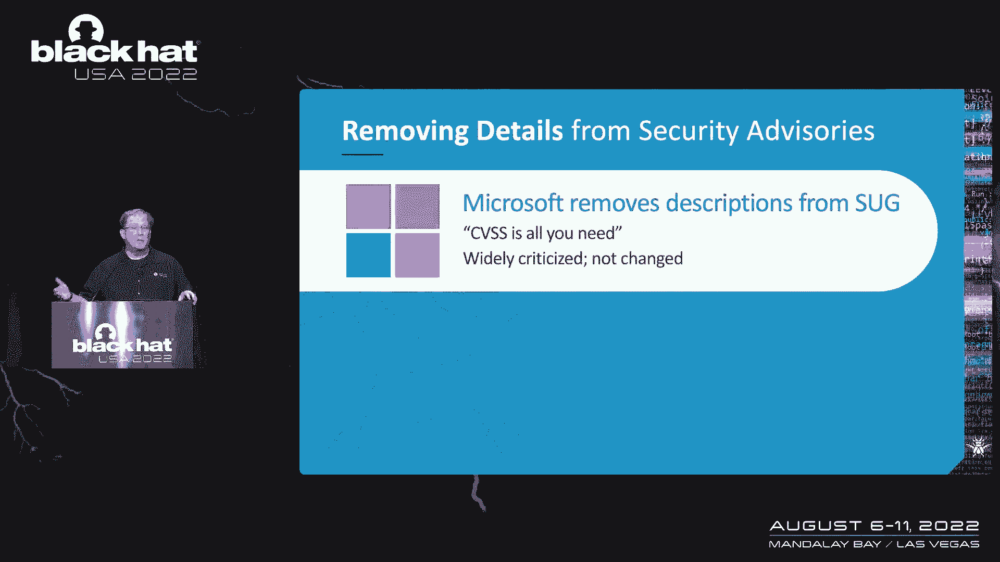

CVSS没有注意到，还有一个有趣的情况，CVSS得分并不经常，并不完全符合微软的关键重要程度评级系统，所以说，比如说，上星期二，他们有一个重要的严重错误，CVSS为9。8，米特说这现在很关键。

如果您只是先部署关键的bug，你注意哪一个它们都来自微软，这样两者都应该是权威的，呃，现在一些信息已经开始返回到这些写作中，但它不一致，质量不同，尽管几乎普遍批评这一变化，这里有一个例子。

这是一个DNS bug在2020年的执行摘要，我故意把它剪掉，因为我们真的不需要检查bug是什么，但是这里有一个来自2002年的DNS bug，但实际上，这种变化是在微软多年后发生的。

删除或模糊有关其更新的信息，他们曾经产生明确的指导，告诉管理员，每个月修补了多少个bug，现在，你得自己数，这实际上是我为我的博客做的最难的事情之一，就是数数，有多少简历，你会惊讶的，我弄错了多少次。

我甚至脱掉袜子，我有点想告诉，他们曾经很清楚地告诉你，有多少bug受到主动攻击，或众所周知的，这是企业首先寻找的东西之一。

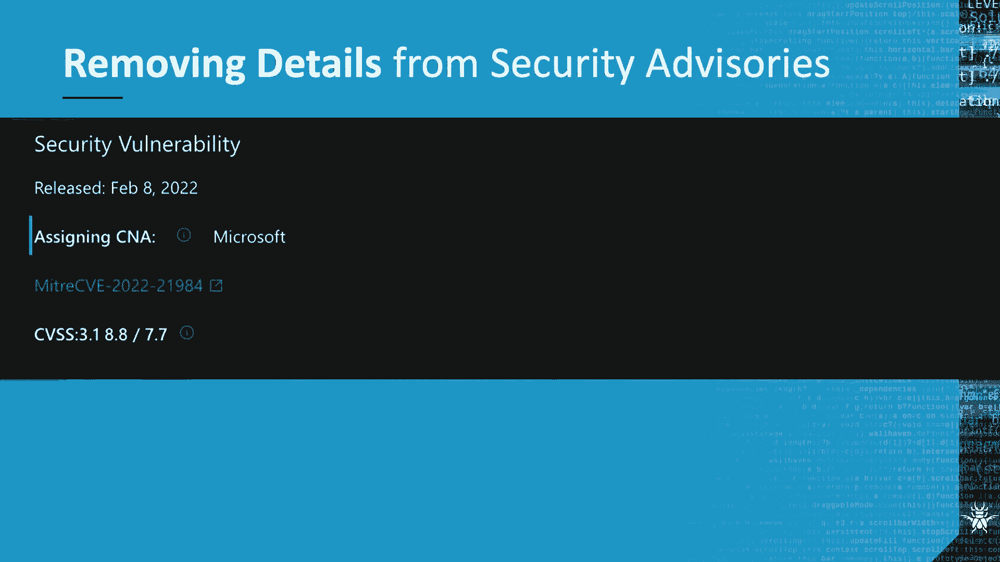

信息仍然可用，是呀，但它现在深埋在公告中，这个月有121份简历被修补，很难把它们都挖出来找，哪些是受到主动攻击的，而是，人们现在会依赖其他信息来源，我的博客，其他博客和新闻文章。

而不是来自供应商的权威信息，以帮助确定风险和查看，微软在这方面并不孤单，我不在这里，只是为了打他们，许多供应商在发布更新时甚至不提供CVE，他们只是说修复了几个安全问题，严重程度是多少？可开发性如何？

它们根本没有提供上下文，我们最近甚至有一个小贩特别对我们说，我们不发布关于安全问题的公开建议，这是一个大胆的举动，棉花，我们将看看这对一些供应商来说是如何工作的，在付费墙或支持合同后面提供咨询。

进一步掩盖他们对潜在客户的风险，很少有供应商真正提供任何关于可开发性的指导，从某种意义上说，这是可以理解的，因为寻找可开发性真的很难，然而，理解可利用性是估计bug风险的关键组成部分，机会有多大。

严重的发声虫实际上在野外被利用，我有，我需要动用紧急资源来部署这个补丁，还是我的正常程序就足够了，你看，向补丁自动化的推进，已经剥夺了许多企业判断其系统风险的能力，因此，企业现在投资第三方工具。

不仅仅用于补丁管理，但是对于补丁优先级，对API的推动，驱动的漏洞报告导致所有bug在纸上看起来几乎相同，但是并不是所有的bug都等于错误引用综合症，如果所有的bug都是特殊的，那么没有bug是特别的。

所以我们，作为一个行业，必须仔细研究API驱动的漏洞报告模型的结果，并扪心自问，它是否起到了作用，还是对自动化的追求让我们处于比以前更糟糕的状态，但不仅仅是补丁的交流方式。

让我们来谈谈补丁本身的一些问题，最坏的情况是我们所说的安慰剂贴片，那是从供应商发布补丁的时候，或者根本不进行代码更改，或者不进行有效的代码更改，无论哪种方式，bug仍然可以访问，该bug仍然存在。

并可用于威胁演员，只是现在他们已经被告知了，如果你认为我们在开玩笑说补丁根本没有改变，可惜我们不是，不仅仅是一个供应商，它可能发生的原因有很多，但它发生了，这并不新鲜，我们在ZI已经讨论了很多年了。

就像虫子一样，太好了，我们补了两次，那也是一个不同的谈话，点击二维码查看它的YouTube视频，但这里有一个最近在先进技术网络访问方面的例子，这是一款很受欢迎的滑冰产品，根据他们的网站。

它为用户提供了一个跨平台，跨浏览器，数据访问经验，和一个基于html5技术的用户界面，所以我们购买了一个目录遍历bug，它可能导致代码执行，根本原因是二七十一I的实施，Web服务进程中的八进制。

打了补丁之后，研究人员提交了另一个绕过该漏洞的bug，这是一个目录遍历bug，可能导致代码执行，问题是由于二七十一的实施，Idol和Web服务流程，在那个补丁发布后。

一位zdi分析师在补丁中没有发现任何代码更改。所以我们再次报告了一个目录遍历bug，它可能导致代码执行，由于实现了二七十一i八进制和Web服务流程，至少我们不用买第三个窃听器，是我们的一个分析师发现的。

虽然这对供应商来说很尴尬，企业正因此遭受真正的后果，所以对于一个人来说，我们知道补丁被逆转并成为利用，所以安慰剂补丁会通知威胁演员这个bug，而企业则处于比以前更脆弱的状态，因为在补丁不存在之前。

因为他们没有足够的防御来保护自己，企业还必须旋转资源来部署补丁和您使用的任何演算，这说明部署补丁的成本，如果需要做三次，那是成本的三倍，我不是数学天才，但三个比一个大，我了解到，在某个地方。

他们的坏补丁会让你花很多钱，即使它从未被利用，然后经常会有补丁只断一个点，这是Adobe杂技演员的一个例子，我们不需要在这里钻研太多的超级技术，只需知道我们为数组设置的值非常大，并最终导致整数溢出。

导致堆分配不足，当数据写入缓冲区时，会导致缓冲区溢出，换句话说，打开PDF获得拥有，我们希望Adobe能修复，通过将某一点上的任何值设置为坏，但那不是我们看到的，这是研究人员提交给我们的概念证明。

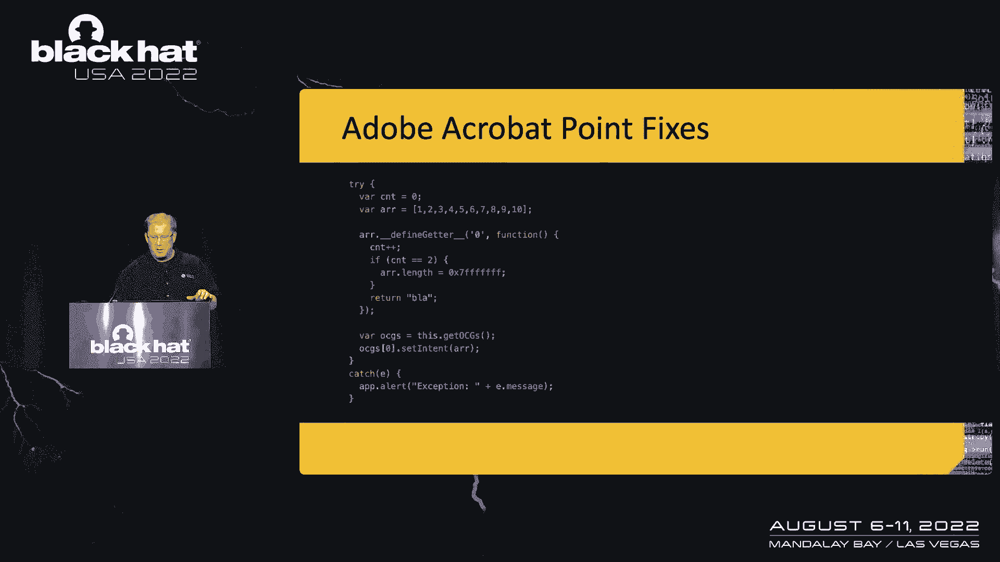

挺好的，这么好，事实上，那个土坯几乎把它扔进了它的补丁里，寻找特定的值，现在研究人员也注意到了这一点，在补丁公开后的一个小时内，是呀，60分钟内，他们说，嘿，我们绕过了补丁，这是我们的新POC。

所以我们买了这个虫子，你能看出区别吗，你现在能发现吗是的，它们只是更改了指定数组的值并重新触发溢出，导致再次执行代码，最后一个补丁引入了数学来计算指定的数组长度是否实际上是一个有效值，那个起作用了。

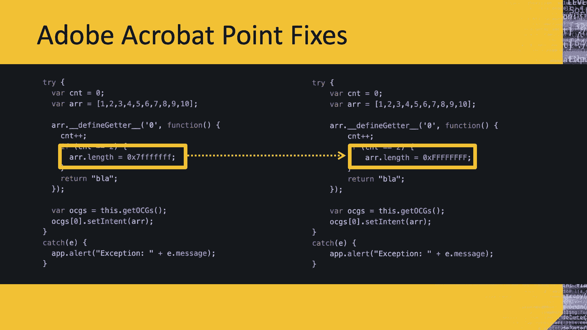

但重播不仅仅是电视节目，它们也发生在安全补丁中，一个很好的例子，微软sharepoint，这些总是从供应商发布bug开始，我想为此感谢他们，由于供应商运输的虫子，我成年后一直在从事有报酬的工作。

我很感激，在这种情况下，研究人员在远程代码执行bug中发现了一个bug，和所有支持的SharePoint版本，并把这个bug卖给了我们，第二天我们向微软报告了这件事，我们有120天的披露时间表。

他们几乎用了所有这些来制作他们的第一个版本，二月十二日，现在我写了很多博客，我写了很多关于很酷的虫子的博客，这是一个非常酷的虫子，所以我和匿名研究员一起写了一个关于这个的博客，在补丁星期二。

我的鼠标移动到按钮上点击发布，当我收到研究员惊慌失措的电子邮件时，说着，不要发表博客，补丁可以很容易地绕过，所以我们再次购买了这个bug，并向微软报告了修补程序规避，他们发布了补丁2的第二个版本。

八天后，我们花了两个四个小时来观察补丁，这次所以我没有发表太糟糕的东西，又把我们的博客推出去了，就像我说的，这是一个非常酷的虫子，所以我们很可能知道，主动攻击来了，两天后我们发现了它们，现在的问题是。

如果您只有此更新的第一O版，您没有完全免受主动攻击，顺便说一句，这也是针对联合国的攻击行为，有趣的是，在主动攻击被发现后，修订三出炉，免得你以为我们是来说别人坏话的。

让我们来谈谈一个bug和趋势微顶一个，而且是的，那是我袖子上的潮流微标志，空手道和，就像它一样，医生治愈你自己，所以我们在顶点买了一个特权升级bug，由于权限不正确而导致的一个安全产品。

它被这个CVE解决了，在那个补丁发布后，研究人员报告了一个特权升级bug，这是由于权限不正确，他很容易就绕过了补丁，它现在被这个CVE解决了，如果你一直在注意并注意到幻灯片上的空白空间。

你可能可以预测接下来会发生什么，这是正确的，他卖给我们第三个特权升级窃听器，由于权限问题绕过了CVE，我们现在给我们补了一份简历，这不是最坏的情况，因为我们把这个作为一个案例研究给我们的开发人员，并说。

你看，以下是我们如何合作开发更全面的补丁，所以希望我们在未来少看到这种情况，任何其他例子，达斯汀，为什么是的，我有收据，还有很多其他的例子，不幸的是，这只是一个四十分钟的谈话。

但这只是其他CB的一个小样本，不完整或有其他缺陷的，每一个都代表着更多，事实上现在在我们的节目中，我们购买的虫子的10%到20%，是错误或不完整补丁的直接结果，如果你觉得微软的简历很眼熟。

那是七月份打的补丁，根据微软，被奥地利威胁行为者用来传播潜艇，在补丁发布后的一两天内零恶意软件，我们的一名研究人员，西蒙·扎克伯格，能够绕过那个补丁，继续开采，事实上，他绕过了上一批大约10%的东西。

是的，是啊，是啊，西蒙是个很棒的家伙，吓人，太厉害了。

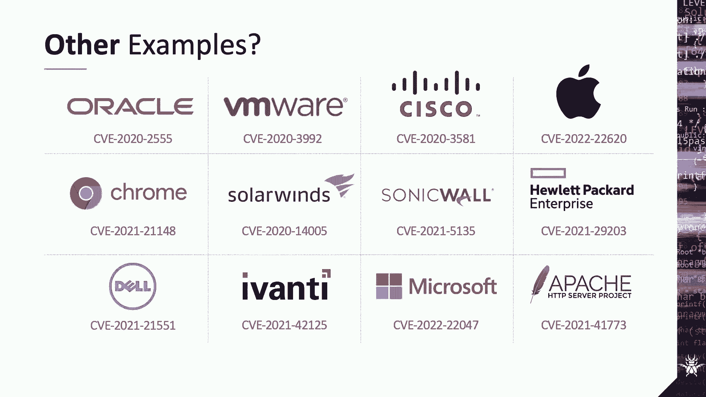

所以我们已经向微软报告了我们等待的事情，所以我要把这个交给布莱恩，谁来谈谈打补丁的行业，是呀，现在对我们来说幸运的是，补丁，修补程序创造就业机会，对呀，我们都在这个行业工作了很长时间，因为补丁正在发生。

漏洞正在被发现，但大多数人都不知道，实际上周围有一个家庭手工业，实际分析、反转和武器化补丁，这个行业存在并能够运作的部分原因，是由于实际安全更新本身的间歇性质量，所以让我们来看看这个行业。

并向您展示它如何实际影响企业本身的风险，现在，就像我们说的，有几个不同的领域，人们在看补丁，我们要讨论的第一个显然是第三方补丁管理，在外面组团，像管理引擎这样的公司，阿凡蒂探索案。

还有许多其他工具提供了实际帮助企业管理补丁部署的工具，他们在看补丁版本，试图确保，您可以将这些补丁部署到企业中，但他们并没有深入到实际的补丁本身，然后有一些小组在那里对补丁进行最终分析。

这意味着他们对威胁情报的发展进行了反向工程，作为一种服务，我们在趋势微上这样做，我们对很多出来的补丁进行逆向工程，事实上，我们有一个完整的团队，只是像出埃及记和Flexera这样的公司，原Secuna。

在某种程度上也做那种工作，当然还有笔试，和红队社区正在关注补丁，这样他们就可以真正开发概念和利用的证明，他们可以集成到他们的工具中，因此，一旦部署了实际的补丁，企业就可以自己测试它们。

所以当你谈论构建MeExploreg模块时，更新画布，同样，这些公司正试图将最新的bug集成到他们的工具中，这是理所当然的，因为这些人也在做，犯罪要件，他们正在努力将bug添加到他们的BAC工具链中。

他们的勒索软件，他们利用它，尽管勒索软件使用零日漏洞并不常见，在很大程度上，他们正在使用有公共补丁可用的末日漏洞，我们实际上在攻击性社区看到了这一点，几年前黑客团队入侵的时候。

里面有几个电子邮件链在谈论哪些补丁即将发布，哪些供应商不擅长实际打补丁，这样他们就可以监控将要发生的事情，并重新开发工具以实际发布他们的开发工具包，现在当我们讨论时间表时，人们最常谈论的是修复的时间。

他们正在寻找，当bug被报告给供应商时，他们花了多长时间来解决这个问题，当然，这绝对重要，但这不是唯一需要考虑的时间表，第一个需要考虑的时间线是修补的时间，在您的企业中实际推出补丁需要多长时间。

你怎么确定，你实际上可以把它们推广到你的整个企业，你能比外面的逆向工程师做得更快吗，他们正在分析这个补丁并开发一个漏洞，你确定你能在这个过程中打败他们吗，时不时啊，从补丁到我可以真正变成一个漏洞。

它可以小到四个，八小时，我们一会儿会在这里讨论一个案例研究，然而，当分析补丁时，很少努力实际估计要利用的时间，因为这总是一个估计，但既然我们知道我们都是资源有限的，对我们来说，理解有多重要。

如果那个虫子现在真的要被武器化，大多数供应商不提供关于可利用性的信息，微软实际上试图用他们的漏洞索引来解决这个问题，但这已经不再真正有用了，由于累积更新，原本，先部署，我的想法是。

您将优先考虑一个重要的类bug，这可能会在一个关键的类上被利用，不太可能是的bug，但从那时起，安全补丁实际上是累积的，今天，你很少把一个补丁应用到一个组件上，您将为许多简历应用每月的修复汇总，因此。

您必须处理更新中的所有bug，因此，叫x i 1是没有意义的，当整个更新应该被视为XI One时，如果里面只有一个，现实是风险评估将在发布后改变，不是优先级的bug可以很快成为高优先级。

当集成到攻击工具包或勒索软件中时，或者当漏洞被释放时，在线企业应该在周二关注补丁之外的补丁，正如我在上一张幻灯片中看到的，确保资源仍然适当地用于普遍存在的风险，当威胁发生变化时，景观企业应转移资源。

以满足需求和战斗，最新风险，不仅仅是最新公布和命名的漏洞，又一次，补丁管理和风险计算应该是一个oa循环，我们实际上在观察威胁中发生了什么，园林景观，引导你的资源，并决定何时部署它，就像我们说过的。

开发的时间实际上减少了很多，这里有一个案例研究，从我们最近的Pone到一个比赛，如果你不知道什么是朋，这是我们一年举办三次的黑客比赛，在春季活动中，我们通常在温哥华举行，它专注于企业工具和应用程序。

包括Punto 21中的Web浏览器，一次攻击有一个特别的奖励，可以同时利用镀铬和边缘，浏览器在单个攻击中，我们这样做，因为这两个浏览器实际上都是基于Chrome的源代码，我们只是想看到一个能在，都是。

是啊，是啊，所以这就是我们这么做的原因，实际上有一个团队能够做到这一点，但在向供应商报告此bug后，发生了一个有趣的情况，在这种情况下，谷歌，所以说，当然这个世界上的一切。

这一切都始于bug和供应商运送bug，所以非常感谢，谢谢你让我们在一个拥有布鲁诺团队的过程中受雇，keith和nicholas bum从数据流安全开始，使用了一个超不匹配的bug来实际利用Chrome。

渲染器进程和微软边缘，同时使用相同的漏洞，非常酷的东西开箱即用，5。他们成功的演示为他们在比赛中赢得了十万美元的奖金，既然它很容易拥有，我们立即把bug和信息交给谷歌谷歌团队，这样他们就可以开始修复。

现在修复程序已经签入开放源码，V8 JavaScript引擎源代码库，但它还没有集成到官方的基于铬的下游浏览器中，在那一点上，这是计划在几天后，在整合发生之前，一名安全研究人员能够反向工程代码修复。

铬团队推出的开源组件，他利用这些信息建立并发布了一个漏洞，并在GitHub上发布，在集成可能很快发生之前有效地消除了这个bug，老实说，这很棒，谷歌团队随后在4月13日发布了他们的补丁，微软发布了。

几天后他们吃了那个补丁，但是其他基于铬的Web应用程序仍然很脆弱，如果他们没有使用上游修复，我会说，在这个阶段，集成铬应用的补片间隙问题是重要的，从福克斯PDF阅读器到每一台智能电视。

到支持Web的扬声器，到家庭自动化设备，甚至对汽车，名单还在继续，但那是不同的谈话，当然，因为我们知道这一点，我们实际上不得不从PTO Own中删除智能电视，因为我们收到了大量的意见书。

只需使用N铬和一个铬bug利用链，现在不同的垂直公司将采取不同的方法来处理补丁，这些差异对最终用户来说确实很重要，有些人遵循传统的补丁周二风格发布，即使它们不是在补丁星期二发生的，像微软这样的公司。

土坯，甲骨文，思科，和，在某种程度上，苹果，这种预测性的披露允许人们自己计划补丁的发布，还有一些人采取了更敏捷的方法，在这些情况下，他们专注于根据需要快速释放，他们有最少的文档和发行说明，很少集成。

测试，像云技术这样的东西，谷歌的一些技术属于这一类，这使得公司显然能够更快地对其环境的动态风险做出反应，但对于用户来说，更新何时到来是不可预测的，你有时会在像这里这样的舞台上看到它，停电。

在谈话进行到一半时弹出更新，还有一些人在空中展开他们的补丁，供应商将补丁运送到，比如手机或汽车这些是我想到的设备类型，它们通常是在每个地区的基础上推出的，因此您可能不会收到实际更新，取决于您的地理位置。

您最终可能容易受到公开披露的bug的攻击，即使你认为你更新了，这往往很难说，因为他们做的文档更少，基本上从等式中删除了用户控件，事实上，每次我们犯错都会发生这种事，一个到一个事件，因为我们在采购。

活动聚焦物联网和移动设备，我们从世界各地购买设备，根据我们购买的地区，他们有不同的更新，让这些设备达到最新的补丁级别实际上是非常具有挑战性的，然后是这些供应商的ICS社区，他们通常首先关注客户部署。

然后进行公开披露，即使他们透露了，大部分文档实际上都在付费墙后面，毕竟，这是一个认为许可协议的行业，深度防御措施，这不是玩笑，虽然这种方法可能适用于供应商，它从等式中删除CV的值。

因为没有真正的公众协调，然后我们进入了最困难的披露情况之一，我们必须处理的，去年秋天可怕的多供应商漏洞披露，我拥有奥斯汀，当我们收到他们的报告时，一个西方数字大众设备中出现了一个bug。

确定bug本身的原因是在一个开源产品中，叫做网络谈话，Neta谈话库，这是一个核心部件，用于许多NAS设备和许多其他设备，提供苹果文件共享，当我们向西部数据披露这个漏洞时，他们正确地聘请了CERCC。

以便帮助通知和响应过程，一旦库维护者实际发布了修复程序，这花了一些时间，因为该库实际上不再维护，他们发布更新，但后来，它必须与所有实际使用该修复程序的不同供应商一起使用，在这种情况下。

实际上有200个不同的供应商在那个披露线程上，试图确保他们将集成他们的Neatoc库，以及他们的产品，那么所有的供应商都应该等待披露吗，当每个人都固定。

因为这将有效地造成一个供应商可以阻碍其他供应商的情况，在他们的产品中发布他们的修复程序，而是，小贩经常匆匆忙忙，匆忙整合修复，有些人迟到了，你最终会陷入一个修复可用的情况。

但也许您的供应商还没有将修复集成到他们的产品中，形成明显的补丁缺口，对供应链的误解，当识别出新的受影响系统时，一些系统集成商面临的风险导致补丁集成缓慢，如果维护人员不知道他们的软件材料清单。

修复可能根本不会到来，在这个特定的例子中，Western Digital只是简单地将图书馆从他们的产品中删除，然而，其他供应商，如Synology和QNAP，最终暴露于多个基于网络的代码执行漏洞。

现在有众所周知的公开功绩，当补丁发布时，它把聚光灯照在一个组件上，就像按晚餐铃一样，说嘿，每个人，在这个攻击面上有一个bug，你可能从来没有想过，或者有一种新的开发技术可以用于其他产品。

或者存在在整个产品线上共享的错误代码，但那是不同的谈话，当补丁真正发布时，我们倾向于认为风险会降低，但在许多情况下，当补丁发布时，风险实际上会增加，它是，它这个，让攻击者知道这个区域有问题。

就像我们以前看到的那样可以被利用，攻击确实在补丁发布后48小时内开始，这是假设补丁实际上从一开始就完成了，企业最终可能会有一种虚假的安全感，如果他们相信他们通过应用贴片减轻了风险，但相反。

补丁是不完整的，你仍然有风险，或者它在多个供应商之间共享，补丁只适用于一些，当然，j的log就是一个很好的例子，这种虫子从二千零一三年就存在了，直到去年12月才披露，二千零二十一，八个月后。

我们仍然在那里发现了易受攻击的log 4j实例，仍然在为J组件查找未打补丁日志的bug，而且是的，这是贝壳般的logo的真正日志，太神奇了，配上这个看起来很棒，我要把它交给达斯汀。

他们将谈论决定性的风险和要求改进，所以一旦我们到了这个，我们先了解这个，我们通常被问到的第一个问题是为什么会发生这种情况，有很多原因，但实际上，它归结为我们已经确定的几个具体点，对许多人来说。

这是一个从持续工程转向产品开发的重点，供应商争相发货并关闭bug报告，或在发布前未能正确测试，在很多情况下，他们只是没有适当的资源来创建全面的修复，对于报告的漏洞，有简单的人为错误人们确实会犯错误。

这些错误最终会成片地结束，然而，在QA测试中也存在技能差距，部分原因是该行业在维护测试人员方面真的没有投资，这样的娜拉做的第一件事之一，作为微软的首席执行官，他取消了许多QA职位。

声明让开发人员测试和修复bug通常是有意义的，而不是一个单独的测试人员团队，许多其他人也跟随他的脚步，要么减少质量保证，要么将负担转嫁给开发人员，结果，各组织中存在的安全专业知识已经转移到其他领域。

帮助扩大而不是缩小技能差距，最后，当涉及到他们的通信时，供应商认为透明没有好处，这是关于他们产品的安全性，以及是否没有沟通、误导性或不完整的沟通，他们根本看不到投资的回报，他们想让我们相信他们。

相信我们，当他们不是很值得信任的时候，这是很难做到的，那你呢，因为企业应该从中吸取教训，首先要明白，由于供应商的做法有缺陷，企业不再清楚地了解其网络面临的真正风险，不管是CVSS收视率的问题。

或者操纵CVE来掩盖风险，或缺乏明确的供应商指导，企业真的不再有一个简单的方法来量化他们系统的风险，有缺陷或不完整的补丁正在花费你真正的钱，不仅仅是新的补丁正在推出，企业需要支出，他们已经是有限的资源。

重新部署他们已经安装的补丁，企业最终把钱花在第三方和其他工具上，只是为了处理偶尔的噩梦，即补丁管理，最值得注意的是，很多时候，当一个补丁增加而不是减少风险时。

利用计数器的时间往往远远少于部署计数器的时间，即使你是一个非常成熟和纪律严明的企业，一个不完整的补丁只是告诉攻击者bug在哪里，那么我们能做什么呢，你能做些什么来帮助，这是首先要明白你要捍卫什么。

我的意思是这是无情的在你的资产发现，当涉及到被动指纹和网络检测时，你得知道你要保护什么，你必须知道如何隔离它，如果你在开发一种产品，确保您了解您的软件模仿材料，并确保更新是集成的，其次。

你可能觉得自己在讨论中声音不大，但你的钱包代表你大声说话，现在，我不指望有五个执照的人就这么放弃，微软或Linux，因为补丁不好，然而，它确实为您提供了一个向供应商反馈的途径，尤其是在决定新的供应商时。

包括在您的AH RFPS中，你们的修补政策是什么，你的安全建议是什么样子的，你会感到惊讶的，你得到和没有得到的答案，终于明白，从安全补丁中进行风险管理，必须超过每月的第二个星期二，这意味着要注意修改。

和监测威胁情况，以证明概念和利用释放，因为这些可以极大地改变风险，现在，我们ZI想做一些事情来激励供应商，做得更好一点，我们考虑了很多选择，其中一些比其他的更严重，我们只考虑了零，当。

所有作为失败补丁进来的bug，我们想了想，耻辱之墙，或者一些神奇的象限，我们可以把供应商推到，我们想到了区块链和NFT，不是真的，有人可能在营销方面做了，但归根结底，最终。

我们激励供应商的最合理和最实际的方法是，减少我们对bug的披露时间表，由不完整或有缺陷的补丁造成的，这是我们作为供应商为数不多的领域之一，我们过去已经看到缩短时间表是有效的。

所以我们也想在这里使用这个策略，布莱恩会告诉你确切的细节，所以说，我们决定做的是，减少我们认为存在的bug的披露时间表，不完整或有缺陷的补丁造成的，作为提醒，我们目前在ZDI的披露时间表是120天。

我们想做的是采取分层的方法，取决于bug本身的严重程度和失败的补丁实际工作的方式，第一层是30天的时间线，这将是关键的，类修补程序发布时容易规避的bug，在这些情况下。

你基本上可以考虑补丁本身受到主动攻击，因为供应商已经透露了bug中的bug的确切位置，第二层是六十天，这将用于严重程度高和严重的bug，其中补丁至少提供一定程度的保护，在这些情况下。

我们实际上没有检测到或期望积极的利用，但是当这个bug被披露时，风险计算再次改变了，最后一层是九十天，这些数字不是一成不变的，我知道有些人会说他们实际上是七天，或者90天，但这是我们失败补丁的起点。

我们正在积极跟踪零日倡议计划中失败的补丁，这些时间表可以随时更新，根据我们在整个行业看到的情况，我们也看到其他团体在谈论这个问题，最值得注意的是项目零报告，在野外使用的不完全不变虫子的类似发现。

我们鼓励所有报告漏洞的组织采用类似的时间表，对于失败的补丁，我们今年有望披露100多个漏洞，所以说，我们将有很多机会收集关于这个问题的度量标准，并希望随着时间的推移看到改进，但当然。

现在这是一个不同的谈话，一个案例研究是CV 2 2 2 2 2 0 4 7，就是本地特权升级，如果我们今天收到那个窃听器，我们实际上会缩短披露时间，因为它的补丁实际上失败了。

现在一些最后的想法只是总结一下，不完整和有缺陷的补丁绝对被用于野外，威胁行为者，这不是意见，这是基于我们从竞争对手那里看到的数据和东西，不管你有没有意识到，不良斑块被积极地在野外使用或在野外开发。

它确实会影响您的企业，我们认为政策调整应该以真实数据为基础，这就是我们如何定义我们的披露时间表，我们将来会以此为基础编辑我们的时间表，你还需要在此基础上进行风险计算，最后，是呀，我知道。

我在重复自己的话，但我认为这很重要，您的风险评估必须超越周二的第二个补丁，看看当前的威胁景观，寻找，或对补丁的修订，等待概念证明发布，并明白一旦这些事情发生，你必须改变你的方法，即使在补丁发布后。

你可以在网上找到我们，达斯汀，请在网上找到我们，我们在ZI得到了推特。

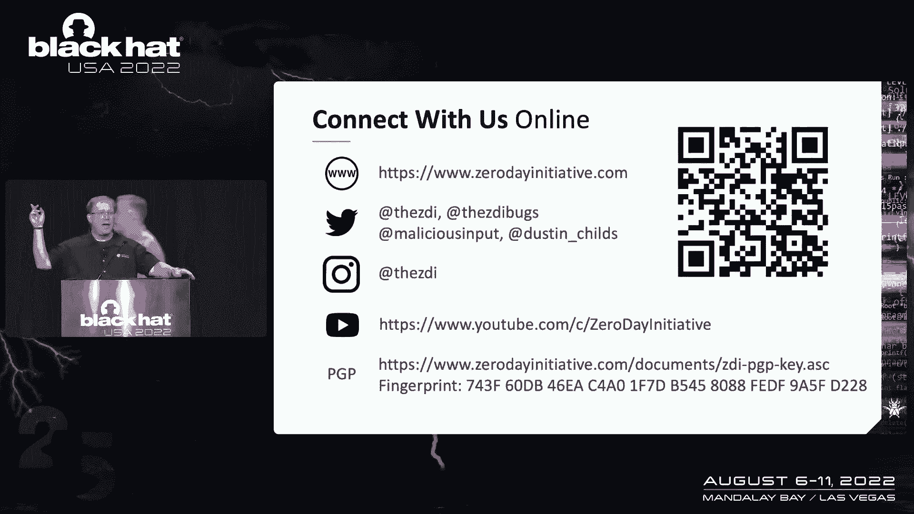

Bugs对我们来说是一个新的推特句柄，那是推特，只是很高的建议，CVSS，日或零日，我们现在在克身上，呃，我的孩子们对此很兴奋，欢迎来到二十七，如果你也在那里找到我们，我会在九月份开始一个补丁网络直播。

你可以在我们的YouTube上找到，那将是周三的补丁，在那里我只是快速地复习东西，嘿，我们在找虫子，如果你有虫子卖，我们得到了，我们有钱买，所以这是我们的PGP。

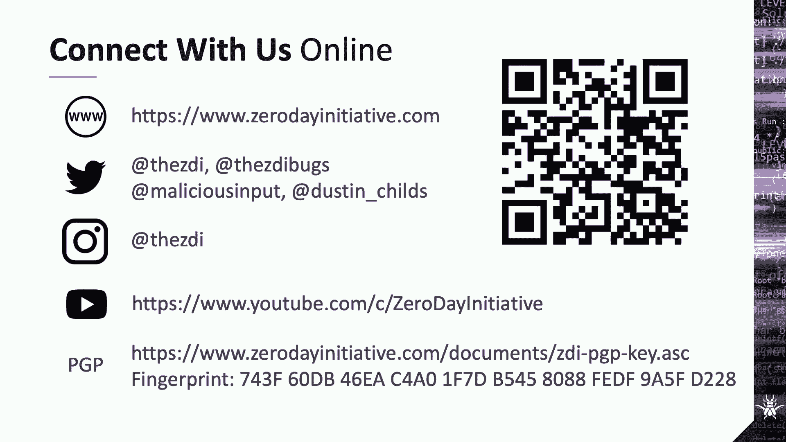

信条不要给他们发明文电子邮件，那我们就不能买了，嗯，你现在知道了，那些补丁有问题，有时肯定会对这些补丁进行反向工程，看看外面发生了什么，也许那里有一些现金可以找到，但是你看，我们要去包扎室。

我们来得正是时候，所以我想感谢你的时间和关注，如果你有任何问题，请在南太平洋加入我们，南海，在某物的南面。

跟着我们到那里。