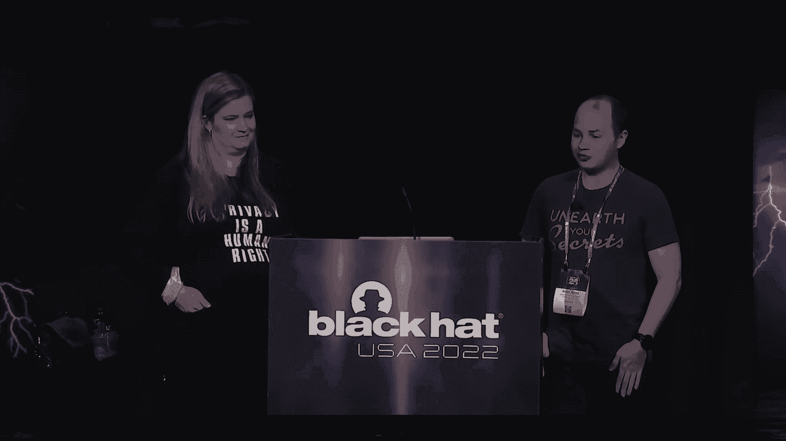
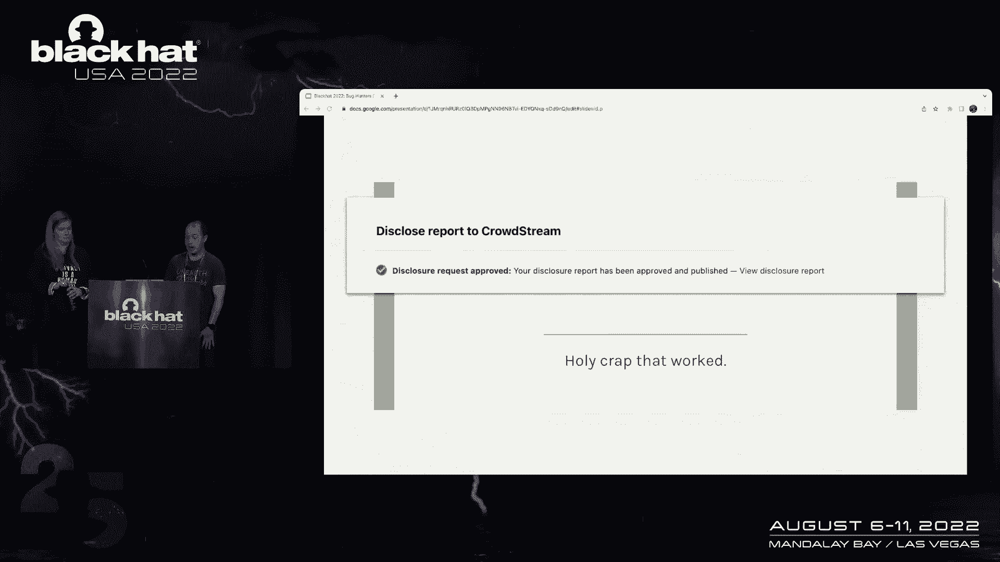
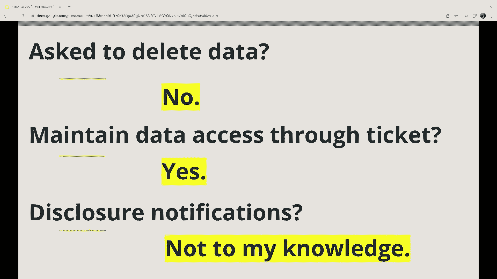
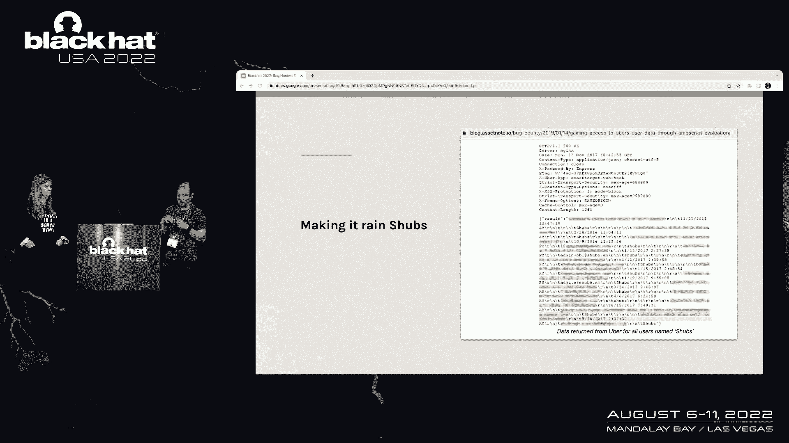
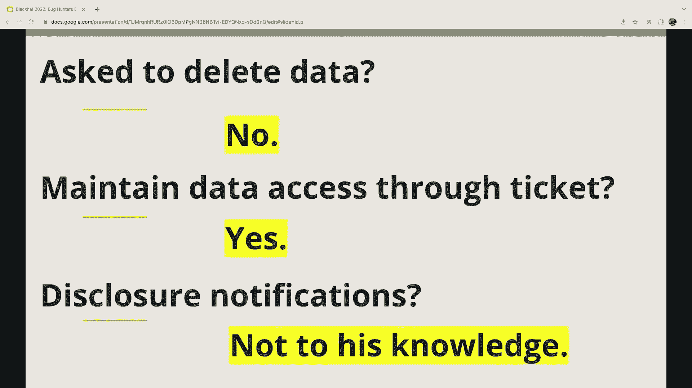

# 【转载】Black Hat USA 2022 会议视频 - P48：053 - Bug Hunters Dump User Data. Can They Keep it？ Well They're Keeping it Anyw - 坤坤武特 - BV1WK41167dt

在我们开始之前，只是出于好奇，如果你能举起你的手，如果你要么经营窃听器赏金，或者以某种形式参与了窃听器赏金，好像有一半的观众都举手了，我认为我们要为他们一半的观众，没有举手的。

你可能无意中参与了某种形式的窃听器赏金，通过另一个安全测试人员的研究，我们将通过几个例子来概述，所以先喜欢，为什么我们有资格谈论这个。

我们是谁，我叫迪伦，我是一名安全研究员，我是一个捕虫人，我有一段时间是虫子人群的前100名，但那是几年前的事了，我共同创立了一家名为松露安全的公司，它建立在一个名为松露猪的开源工具之上。

我兼职做安全研究，对着黑帽子说话，这是我第二次也可能是第三次在def con或black hat演讲，大家好，我是惠特尼，我是律师，但我不是你的律师，我和各个公司的安全团队合作得很密切。

我工作了这么多年，我在电子艺界帮助建立了协调漏洞披露计划，我支持我现在的安全团队在桑拿浴室参加我们的各种窃听器赏金计划，所以总的来说，如果你看看大多数bug赏金程序，他们说不要碰其他用户的数据。

就像他们说的，尽量不要碰其他用户的数据，他们说只能用自己的账户测试，不要让其他用户参与您的测试，所以这是优步禁止窃听器政策的一个例子，他们在那里，他们概述了，在其中一个要点中。

你可以看到这是非常常见的语言，它实际上在很多不同的程序中，他们说，确保您只是在测试数据，不要访问他人的数据，所以这次谈话是关于数据隐私和bug赏金的，嗯，我们处于一个很好的位置。

我们已经告诉我们的黑客不要接触不属于他们的数据，然后呃，我想我们应该很好，是啊，是啊，我们很好，如此接近，我们几乎有了它，嗯好吧，我是说这是给我的，当我在测试的时候，我不小心引起了一些问题，嘿嘿。

惠特尼听着，我在测试一个程序，做他们的虫子赏金，我不小心访问了一些我不该访问的数据，我只是想核实一下，也许我的邻居友好的律师在这里有什么我应该做的吗，这次事故会给我带来麻烦吗？哦，这是个好问题。

你为什么不告诉我发生了什么事，是啊，是啊，所以我在测试这种叫做盲目交叉站点脚本的漏洞，基本上我只是用一些JavaScript替换了我的用户名，我把它扔进了一个系统，忘记了这件事。

然后那个JavaScript，它所做的是，如果有人不安全地执行JavaScript，通过不安全地呈现我的用户数据，它会截图那个页面是什么，它会把那一页的副本发给我，所以发生的事情是。

有人访问了一个管理页面，该页面不安全地呈现用户数据，它有整个系统中每个用户的列表，所有这些都被截图发给了我，我不小心得到了每个人的用户数据副本，哦哦，你向节目透露了一切吗，是啊，是啊，是啊，是啊，是啊。

是啊，所以我肯定附上了所有的截图，我带他们走过我所做的所有步骤，我是百分之百透明的，每一步都很棒，因为你告诉他们你有一些数据，您是否删除了您拥有的数据副本，否，我还没有那样做，那是我应该做的事吗？是啊。

是啊，程序不是，要求您删除您拥有的所有数据，不不，他们从没问过我，实际上现在我在想，删除所有这些数据可能有点复杂，它是它就像一个喜欢，它是，这不是超级简单，哦有趣复杂，怎么样是的嗯那么怎么样。

当我做测试的时候，实际上有几个系统，这可能会导致用户数据的副本最终出现在，就像几个不同的地方，一些第三方系统，我控制的一些系统，这不仅仅是一份数据副本，哦不，听起来数据到处都是，到处都是，什么系统。

你怎么能把它们都列出来，哦耶，是啊，是啊，是啊，是啊，我觉得我们能挺过去，好的，所以基本上员工浏览到了管理页面，这就是数据开始的地方，然后我使用第三方测试系统XSS Hunter来管理，像截图之类的。

我在笔记本电脑上说过，截图发给了过剩猎人，不是我管理的，它是由喜欢的人管理的，是啊，是啊，然后他在AWS中运行，所以我们有像AWS一样的，有副本的，这个随机的人有一个副本，然后又给我发了一份截图。

所以我想我的电子邮件提供商有一个副本，然后我下载了一份副本到我的硬盘上，所以我的备份硬盘上有另一个副本，然后我把所有这些都连接到bug跟踪系统上，所以bug跟踪系统中有另一个副本，我想就这些了，哇哦。

好吧嗯，让我们尽可能地删除数据，如果你的备份不滚下来，尝试删除备份，一些第三方，其中已捕获数据，允许您删除数据，哦哦，这是个好问题，我来看看，所以看起来XSS Hunter有一个按钮，上面写着删除。

但没有类似的服务条款或类似的东西，所以我实际上不知道它是否在删除后端的数据，当我点击那个按钮时，嗯，然后bug平台本身实际上没有删除按钮，所以我不认为，我有能力删除那个副本。

但我绝对可以删除硬盘上的副本，我可以删除备份的副本，我可能会删除Gmail副本，因为Gmail的服务条款说删除数据，当您单击该按钮时，嗯，这件事和公司解决了吗，你知道吗，他们关闭了票并修复了漏洞吗。

所以呃是的，他们他们关闭了票，但我仍然可以拿到票，实际上现在我在想，我的bug平台帐户，嗯，就像我在滚动我的一些旧提交，我发现那里，在我的帐户中实际上还有其他例子，我无意中访问了用户数据。

看起来所有那些旧票，我仍然可以登录他们，仍然可以访问这些数据，就像没有一个被清除出bug系统一样，尽管前阵子票已经订好了，哇哦，我不得不想象其他虫子猎人也有这个问题，他们是不是，嗯，我可以问，我知道。

我认识几个朋友，他们是一些多产的虫子猎人，结果我和几个朋友谈过，我知道他们是很好的虫子猎人，他们中百分之百的人说他们的虫子，人群账号和黑客一号账号登录时完全一样，他们只是有一大堆不同的隐私问题。

这些问题已经存在了很多年，他们仍然可以访问这些问题，他们可以下载数据，是啊，是啊，是啊，是啊，是啊，是啊，尽管问题已经结束了一段时间，他们仍然可以访问他们附在票上的数据。

也许是因为这些bug跟踪系统有能力要求公开披露，我是说这些例子已经够多了，也许如果我们要求他们所有人，他们中的一些人可能会让我们谈论这个，并分享其中的一些例子，我是说这并不完全是，嗯。

你知道他们可能会说不，但我的意思是我们可以尝试，和，然后我们可以有具体的例子，这样我们就可以和其他人分享，给这个带来一些可见性，嗯，哦耶，那没用，呃，所以他们，他们，他们不允许我们公开谈论这件事，好的。

好吧，看，有更多的研究人员和更多的票，如果我们继续要求，最终我们会找到一些允许我们公开谈论这些问题的程序，我没想到，好的，好像有个程序员，我也是，这实际上将让我们公开谈论这些问题，嗯，那很酷，整洁。

好的，所以我想打破第四堵墙，嗯，这些请求大多被拒绝了，绝大多数节目不希望我们谈论隐私，影响的泄漏，批准这些请求的少数公司中，我们只是想给这些公司一个巨大的呼喊，允许我们公开谈论这些问题。

我们绝不是想让这些公司蒙羞，因为这些是允许我们透明的，这些公司中的绝大多数实际上拒绝了这一请求。

所以话虽如此，这里有一个现实世界中发生这种情况的例子，我在试笔，的确，求职公司和那边的一个开发商跑了一个小地方，他们笔记本电脑上的素描笔记本。

他们编写了自己的自定义HTML来对他们的一些用户进行一些研究，所以他们在本地吸引了一大群用户，嗯笔记本，它可能是在成千上万的用户的订单上，他们不安全地渲染这些用户和盲目的跨站点脚本火，截图被发送上来。

我不小心得到了一大堆圆周率或个人数据，我不是故意要进入的，但我有一份副本，这里有趣的是，当我们要求公开谈论这个问题时，嗯，他们说，当然可以，没问题，只要确保你有任何截图，你编辑了任何个人信息。

这是超级有趣的，因为他们有点自我意识到，我仍然可以通过这张票访问数据，尽管这个问题几年前就结束了，在本例中，所以三个基本问题，这里有人要求我删除数据，否，我是否通过票证保持对数据的访问，是呀。

然后是否有关于这些数据的公开披露或通知，渗漏，嗯，据我所知不是。

所以如果他们给所有受影响的人发了电子邮件，我可能会收到一封电子邮件，好的，所以这里有另一个例子，嗯，这个是谷歌的，嗯，基本上非常相似的情况，一个员工在当地写的剧本上做了一个小测试，他们把车停了下来。

在本例中，数以万计的用户记录，在这种情况下，他们不安全地提供了同样的交易，截图被发送到XSS Hunter，我不小心得到了，数以万计的用户记录的副本，那么在这种情况下我被要求删除我的数据副本，是呀。

在这种情况下，它使用谷歌的问题跟踪器，因为他们不使用第三方问题跟踪器，在谷歌的问题跟踪器中，仍然能够登录并访问该数据，他们做任何通知吗，据我所知，不会再发生了，我的邮件在里面，所以这就是故事。

直到几天前，当我和他们分享幻灯片的高级副本时，我们收到了这封电子邮件，说我们实际上要改变我们的一些过程，你能删除你的数据副本吗，这个问题大概是两年前的事了，在那两年里，我从来没有被要求删除我的副本。

所以我可以拿到票，等，嗯，但就在几天前，作为这次谈话的结果，谷歌实际上正在内部改变他们的流程，他们将删除附在门票上的数据，这是相当整洁的，好的，我要和大家分享的最后一个例子。

All是另一家有着类似故事的相当大的重要公司，尽管它影响的用户记录要少得多，当他们得到幻灯片的高级副本时，他们真的改变了主意，他们初步允许我们谈论这件事，然后在零点，他们说，其实。

我们对你公开分享这件事感到不舒服，他们说，拜托了，你知道，删除有关这本书的任何信息，和其他人非常相似的故事，但不能，我不能谈这个，好的，所以我们谈到了其他一些研究人员，那是怎么回事？嗯。

我联系了几个我认识的拥抱测试者，我说嘿，你们中有人有可以公开分享的故事吗，你知道那些，同样地，这些故事中的大多数都不能公开分享，但我确实找到了两位研究人员，他们确实有已经公开报道过的虫子。

他们已经得到了许可，它确实影响了用户数据，所以嗯，他们说，是啊，是啊，去吧，第一个是通过一个五味子，他叫胖子，他在做一些针对优步的测试，他发现他可以访问其他用户的数据，通过放大器脚本中的bug。

所以他试图投票，基本上喜欢他的用户，把他的名字Chubbs，但事实证明，这个名字并不像他想象的那样独特，他最终找到了每个在用户数据中任何地方都有shbs这个词的人，所以他问了那个名字。

然后回来的一大群人只是有胖乎乎的，在他们的用户数据中的任何地方，他无意中得到了一堆用户记录，嗯，这是他的博客文章，他把它放在资产笔记上，你可以看到他已经编辑了用户数据。

但我在原票上问他，它被编辑了吗，还是你有原始数据，他说原始票上有原始数据，我说，好的，嗯，你被要求删除它了吗，他说不行。

我就像，好的，嗯，你喜欢，就像，我是说，是啊，是啊，我还可以登录，那是几年前的事了，但你知道，我可以，我还可以登录我的旧票，然后我问，好的，嗯，他们有没有通知其他羊，据我所知，他就像。

这里发生的唯一公开披露是，我在博客上做的，另一个她没有，类似的故事在这里与另一个多产的虫子Bouner，萨姆·库里，我向他伸出手，问他有没有什么故事，他说，是啊，是啊，我刚才写了一篇关于星巴克的文章。

在那里我可以访问1亿个客户记录，所以也许这个标题有点点击诱饵我问他，你真的访问了1亿条记录吗，他说不，我是说，我证明了我可以，但我实际上并没有访问1亿条记录，我访问了，你知道的。

也许有五六个人的唱片不是我的，这是来自这五六条记录的一堆信息，我问了他同样的问题，但在我得到他的答案之前，我只想在这里打个电话，如果不明显的话，我一直在用多莉来增强这次演讲中的一些意象。

我觉得这个特别好，基本上是咖啡里溢出的数字数据，我觉得这是一张很酷的照片，但我问他，你删除了数据的副本吗，或者您被要求删除数据副本，他说不，我说如果你今天登录票，它是否还有你测试的五六个未编辑的数据。

他答应了，我说有没有披露通知，向受影响的人发出，他说，你不知道，除了写，他在博客上做的，所以我认为这里的要点是这些不是一次性的例子，这些漏洞赏金中的隐私泄露实际上真的很常见。

对于我们可以公开分享的每一个例子，有一百个例子不能公开分享，所以我想是我们开始谈论这件事的时候了，看看我们能做些什么来减少其中一些的影响，那么为什么会发生像，为什么我们会有这些漏洞，嗯，有时是意外。

对呀，就像我之前使用跨站点脚本的示例一样，嗯，通常在测试盲交叉站点脚本时，你不知道那个有效载荷会呈现在哪里，你把它扔进一个系统，有时它在另一个系统中出现，你真的不知道截图会是什么。

有不同的方法来测试盲交叉站点脚本，但总的来说，一些最流行的方法可能会意外导致数据泄露，嗯，所以这是很常见的，但另一件事是像，有时这不是意外，对呀，就像有时研究人员，嗯走了额外的一步。

因为他们要么觉得他们必须证明自己的影响力，或者因为老实说，在这张截图中，窃听器赏金中的特里尔要求他们多走一步，在这个例子中是一个真实的截图，我从我的问题跟踪器中提取，上面说，嗯。

你知道可以接触到这个东西，这还不够，请表明敏感数据实际上可以从中泄露出来，就像你如何做到这一点，而不访问，嗯，所以我想在这两个维度中，就像第一个泄密的动机。

这些敏感数据只是因为如果研究人员能显示出更多的影响，通常他们得到更多的报酬，嗯，这就是设置窃听器赏金的方式，bug的影响力就越大，研究人员得到的报酬越多，从而证明他们可以访问他人的数据。

他们可能会表现出更大的影响力，并试图获得更多的报酬，另一个激励来自三色，这个更有趣一点，我想特里尔经常被淹没，一大堆垃圾提交，基本上是整个互联网上的人说，我发现了一些窃听器，我发现了这个东西什么的。

其中绝大多数实际上都不是有效的bug，分诊感到疲劳，他们磨损了，如果他们真的把这些提交的每一个都放在地面上，这将需要比他们一天更多的时间，所以他们经常会回复所有这些提交，嘿，你能给我更多的信息吗。

你能把那个bug向前推一步吗，你能再给我看一点吗，这样我就可以更快地解决这些问题，因为进来的垃圾太多了，所以这是两个主要的激励因素，无论是分诊还是研究人员，这可能会导致一些隐私问题。

然后你知道就像我们之前提到的，非常感谢那些允许我们公开谈论它的公司，但对于这些公司中的每一个，还有数百个永远不允许我们公开谈论他们，除此之外，还有一个复杂的联系宇宙，甚至没有运行，窃听器赏金。

有这些数据泄露，他们甚至没有得到通知，因为他们没有一个机制来拥有披露的途径，嗯，所以你知道这里有几件事要叫，首先，我们确实相信bug奖励是改变的积极力量，经营的公司。

窃听器赏金比不这样做的公司处于更好的位置，这里要喊的另一件事是，我们绝不是要羞辱，我们谈过的任何一家公司，因为有更多的公司永远不会谈论这些事情，因为他们不想公开谈论他们，以同样的方式。

我认为记者刊登点击诱饵抓住你的文章是很常见的，每当一家公司谈论内部事件时，嗯，这里有一个例子，如果人们不知道，黑客一号为自己的基础设施运行自己的窃听器赏金，所以他们是一家像其他公司一样的公司。

他们有内部服务需要保护，像其他公司一样，除了他们一直倡导透明的精神，他们有什么虫子，他们会公开谈论他们，他们认为这是该行业最好的长期方向，所以他们总是公开谈论他们的虫子，这很好，但它回来咬他们。

因为每次他们做一些点击诱饵抓住你的文章就会出来说，嗯，看看发生的坏事，嗯，所以重新构建那篇文章可能是什么样子的，可能是说，黑客，一个支持透明度和股票，其他公司不会分享的内部事件，所以你为什么要关心，嗯。

你知道数据似乎无处不在，我们能做些什么呢，我们能解决这个问题吗，答案可能是我们永远不会达到完美，但我们可以采取渐进的步骤向前迈进，所以这里有一个你应该关心这个的原因，我说的是XSS猎人。

作为第三方测试服务，那只是一个家伙维护的，嗯好吧，我碰巧认识的那个人，所以说，我刚给他打了电话，我说有多少数据泄露到你的系统中，你能把你的数据库截图发给我吗，所以我有一个想法，这在整个行业有多大。

这是截图，是一分，66TB的数据是盲目的，已发送到此服务的跨站点脚本截图，我的意思是，在这个中心弱点上有大量的数据，嗯同样作为这次谈话的结果，我意识到我在bug系统中的用户帐户没有启用两个因素，嗯。

这意味着如果有人登录我的账户，嗯，你知道这样做的门槛比可能的要低得多，这可能是许多其他研究人员的情况，可能很多研究人员，在没有真正强化的身份验证模式的情况下运行他们的帐户。

如果这些研究人员可以接触到许多有许多不同隐私问题的门票，嗯，你可以看到这可能是一个问题，所以我们可以看出这是一种趋势，所以让我们试着清理一些，让我们拿一些有毒的废物来做一点。

让我们从一个窃听器赏金计划开始，如果你建造它，你得做最坏的打算，所以你不能去建立一个虫子赏金计划，而不确保你首先建立了基础，您必须准备好接收漏洞来解决问题，在贵公司和像我这样的律师一起工作。

如果您可以访问您的um中的一个或其他利益相关者，所以我是个律师，我已经说过了，但我不是你的律师，所以这些都不应该被解释为法律建议，如果你从我的谈话中拿走了什么，和律师谈谈，它不在那里，没那么可怕。

我们是来帮忙的，嗯，虽然我们不能达到完美，有很多预防的机会，基本数据治理原则，数据生命周期，最佳实践将帮助您实现这一目标，您必须将bug赏金程序视为一系列数据生命周期，因此。

让我们与隐私和合规团队密切合作，以确保您正在建立一个窃听器赏金计划与这一点，让我们走过我们可以做小的地方，迪伦概述的每个领域的渐进进展和步骤，在他的例子中，所以首先，与项目中的研究人员一起制定政策。

要求研究人员在提取数据之前停下来，并正确地坚持下去，如果得到报酬的动机，只有当你要求他们提取额外的数据时，你不知道那会是什么样子，你需要为这对你的公司可能意味着的后果做好准备，你的法律义务。

作为一家公司，可能进行违规通知，这是一个内部，你需要和你的法律团队一起做的检查，嗯，想想你的端到端程序是什么样子的，以及数据可能泄露的地方，并在与利益相关者沟通时考虑到这一点，你的法律团队第一次听说。

当你有问题时，你的虫子赏金计划不应该是，所以告诉他们，向他们解释你在做什么，在这个领域有很多新律师，谁是，如果你和他们一起工作，你会有很多经验，他们会帮你建立一个更好的窃听器赏金计划。

所以让我们从员工笔记本电脑开始，首先，所以即使是内部发生的，你需要确保你在考虑内部应用程序的安全性，也要确保你每次都正确地考虑角色和责任，3。我是公司里的第一人，每当有人喜欢，您需要访问此数据吗。

我就像，亲爱的上帝，否，我不想成为导致潜在违规或问题的人，给我临时访问权限，不管是什么，好好想想，这个人需要访问成千上万的记录吗，他们需要访问所有的数据吗，定制访问控制，因此，现在，那是个大问题。

但从长远来看，这会有所帮助，并防止更大的泄漏发生，第二次，当我们看到像XSS Hunter这样的平台和其他平台时，知道他们收集了什么数据，所以作为一个研究员，当你经历，意识到什么可能会在其他地方结束。

因为一家公司可能会来找你，说数据在哪里，谁有，因为我自己也问这些问题，当我和窃听器赏金计划的人一起工作时，你删了吗，所以保持跟踪，所以你准备好回答这些问题了，即使答案是否定的，我不知道我是否能删除它。

或者在这个节目里，我没有能力修复它，等，所以你可以回去删除相关数据，所以说，如果可能的话，你不会把数据发送到，你不想让数据去Gmail这个，这是一个明显的，但这让我很震惊。

有多少次人们只是通过电子邮件发送东西，嗯事实上，我被要求把我的社会保障寄过来的次数，电子邮件令人担忧，但不要把东西放在电子邮件里，只是避开它，如果你能删除电子邮件，所以你没有副本。

如果您正在考虑如何共享数据，和一家公司在一起，你知道的，将其粘贴在G驱动器链接中并共享链接，这样数据就不会在各种电子邮件系统中永久化，因为你要把它发送到电子邮件的保安那里，如果没有窃听器赏金计划。

现在我们有数据在谁知道有多少邮箱，因为这封电子邮件可能已经被转发给你硬盘里的整个安全团队，你知道作为一个问题，当然又来了，这是一个明显的，但不要下载任何东西到你的机器上，如果可能的话。

你知道如果你必须这么做，当你这样做的时候删除它，提交后删除它，嗯，最后备份，有一个很好的，呃，备份上的数据保留，让它滚下来，实施数据保留策略或现货，将其从备份中删除，如有需要，我讨厌从备份中删除斑点。

我从来不喜欢碰备份，他们是紧急情况，所以对备份的良好保留，真的是这里最好的赌注，最后是平台，我们喜欢平台，但他们需要更好地给他们的客户，在程序中进行数据治理的能力，嗯，您当前无法删除附件。

在门票被关闭后，很难自动将研究人员从门票中删除，这些平台是个人数据和客户漏洞的宝库，如果泄露，这可能会产生重大后果，公司也是如此，如果您使用平台，请他们考虑，允许您设置数据保留策略。

以便对数据有更多的控制权，所以我们不只是在少数几个账户中增加越来越多，就像迪伦的，在那里它成为个人数据的宝库，最后，还有很多我们没有提到的数据可以流动的地方，所以这只是一个特殊的场景。

数据可能会泄露到这么多其他地方，所以我的意思是，这个数据流应该是什么样子我们说过研究人员使用多余的亨特，引起了一大堆问题，然后还有其他几个第三方系统参与其中，我觉得。

也许平台本身有机会操作自己的测试基础设施，能够合并bug平台内的所有测试数据，他们可以完全访问数据治理，甚至更好的可用性，比如按下票务按钮对研究人员来说也更容易，现在研究人员还没有做测试所需的东西。

在很多情况下，他们可能不够复杂，无法支撑自己的基础设施，所以他们不得不出去寻找这些第三方，与bug奖金无关的，然后他们无意中参与了测试，也许另一件要喊出来的事情是，这也是一般安全测试的一个问题。

不管是公司的笔试器还是窃听器赏金，但我们至少可以解决，也许百分之八十，通过整合bug平台并让它们运行自己的测试基础结构，我真的希望我们能看到平台在这个领域的发展，会产生很大的影响，嗯。

所以也许你们中的一些人在这里明白，法律义务是什么，我相信这是每个人都想知道的，这就是我来这里的原因，我想知道，如果我会被起诉，好消息，我要给你一个非常典型的法律答案，这取决于，嗯，没有一个清晰的切口。

这就是你逃避法律责任的方式，你没事，嗯，所以让我们快速刷新一下，非常高水平的bug，法律上的赏金，所以在美国，结果，它在过去被用来对付安全研究人员，嗯，一般来说，窃听器赏金是在这样的想法下运作的。

什么是授权的，所以通过询问和有一个程序，你允许个别研究人员被授权潜在地黑客攻击你的系统，以CFAA允许的方式，如果你是真诚地黑客，但诚信线真的真的会有所不同，取决于当前的情况。

所以在这里深思熟虑是很重要的，因为当人们互相生气时，法律问题就会发生，那只是人们觉得没有被听到，如果他们觉得你没有来到谈判桌前和他们交谈，这是法律开始发挥作用的原因之一，我们不想让它在那里。

所以这里有一些我推荐的资源，你知道，如果你有任何问题或想知道更多，但又一次，聘请你的法律团队，你还有什么问题吗？或者如果你是一个研究员，你知道有很多资源，你知道，最佳实践的种类，和。

我希望你能把这些一般指导方针中的一些，我即将给，那么法律义务是什么，那是每个人都想知道的，嗯，这里有一些公司外卖，以确保提取的任何数据，不得对个人或客户造成任何潜在损害，嗯，那通常是当有人这么做的时候。

我得做违规通知，最终归结为，嗯，你知道的，对个人是否有潜在的伤害，这是欧盟的标准，这通常是引发许多违规通知的原因，我们没有相同的标准，在美国这里，它必须是特定类型的数据，其实，我们生活在一个五三的国家。

违约通知制度，我说五个三个维尔京群岛，波多黎各等，嗯，但要确保数据，你知道数据不会在任何系统上持久存在，所以你需要问研究员嘿，请删除数据，并以书面形式向我确认您已删除数据，你需要这样做。

你需要确保你正在减轻任何潜在的伤害，因为，与法律分析有关的，你是否必须做违规通知，事实是没有人想被这些数据伤害，我们想保留它，这个节目不错，所以一定要确保，如果你被要求删除数据，你真的这么做了。

所以沿着这些线，一些研究人员的外卖说它不喷它，告诉公司漏洞，不要将数据拉到各种第三方系统，你的硬盘，您的备份驱动器，如果公司说哎呀，你删除了所有的数据副本了吗，别说是你干的，如果这不是真的。

撒谎在这里对你没有帮助，诚实和真实要好得多，嘿，这是我认为数据的地方，我已经删除了所有我可能删除的数据，这里可能有一份副本，但我你知道，我不能肯定，我保证那些公司会和你一起解决这个问题，或者关闭票。

因此，嗯，如果您使用其他第三方系统提取数据，删除它，我们之前谈过这个，但这对确保，当你在建立你的工具库的时候，你知道数据可能会去哪里，以及如何相应地管理这些数据，最后是你知道的平台。

使您的客户能够更多地控制他们在产品中的数据，嗯，你知道的，允许程序设置强制，黑客的两个FA取得了巨大的成功，显然，嗯，实施时，我们希望看到这一点得到更广泛的应用，然后最后准确地谈论你的隐私做法。

在您的隐私声明或隐私政策中，如果你不使用平台，还在想你是如何再次共享数据的，到那个电子邮件示例，真的要确保你没有把数据喷得到处都是，所以我们想让你从中得到的一般收获是，我们喜欢虫子赏金。

我们喜欢允许我们谈论它的公司，我们不想让他们蒙羞，但我们希望现在能进行下一个层次的对话，窃听器赏金更普遍，它们是公司分类和协调漏洞的必备条件，我们真的想达到两点零，并为数据可能泄露的用户提供更好的服务。

所以听起来如果我惹恼了一家公司，我可能会被起诉，但尽量不要惹恼任何人，那基本上就是我们要降落的地方，但他们可能不会看到你，好的，是啊，是啊，我希望我没有惹恼任何公司，嗯，非常感谢。

