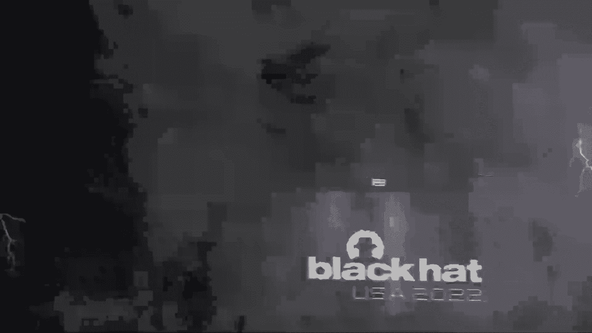
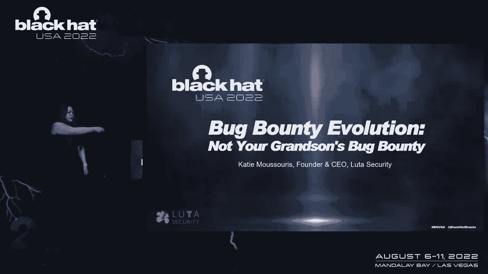
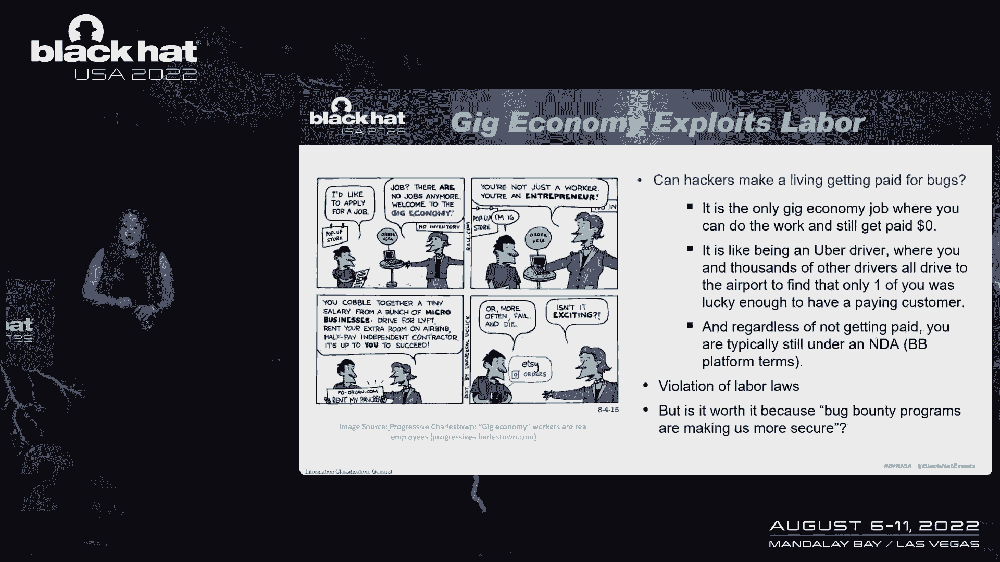
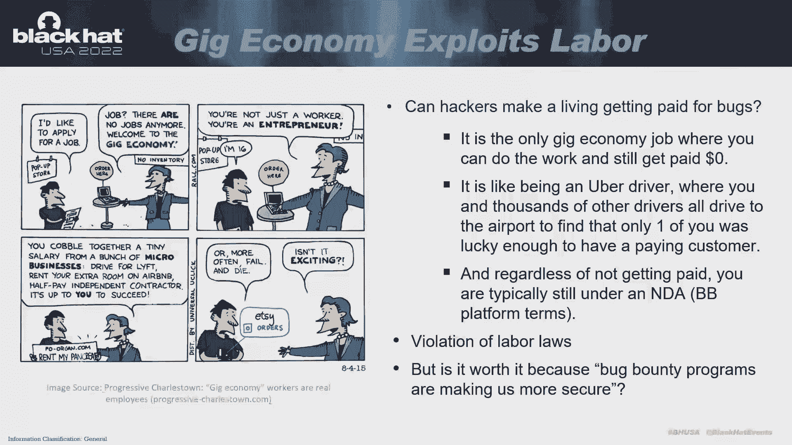
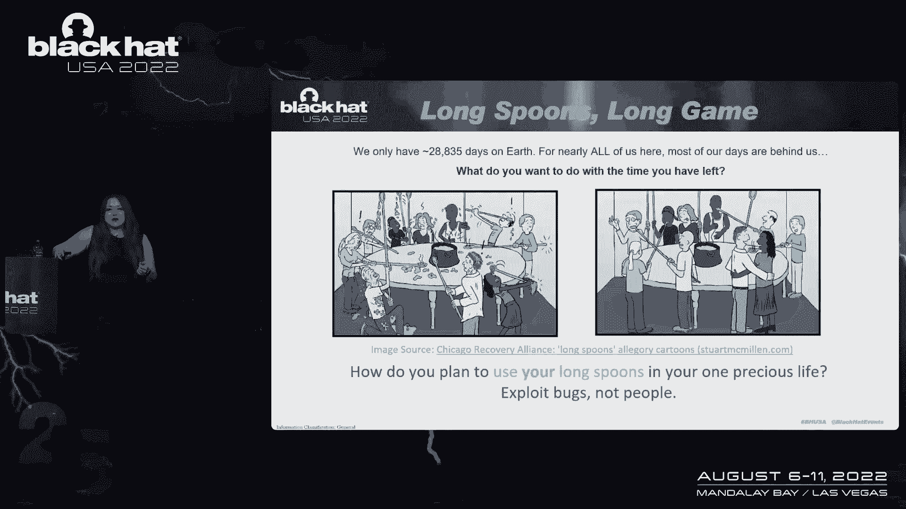
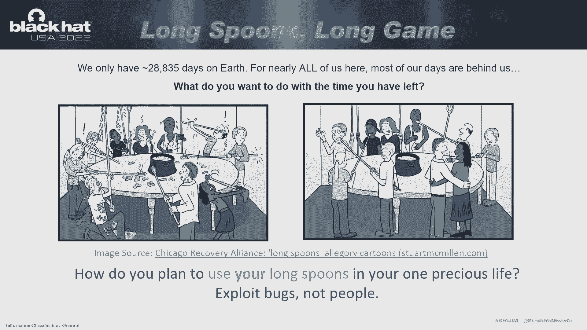

# 【转载】Black Hat USA 2022 会议视频 - P49：054 - Bug Bounty Evolution： Not Your Grandson's Bug Bounty - 坤坤武特 - BV1WK41167dt

好的，谢谢大家的到来，非常感谢。

我能请你帮个大忙吗？我想看看你们的脸，如果你们都能站起来靠近我一点，那会让我感觉好多了，因为我们已经很久没有在一起了，我真的想近距离看到你们的笑脸，所以请现在就来填写，我为我们道歉，开始有点晚。

就像它一样，如果我们在这里参加黑客会议，我想这是一个专业的黑客会议，亲爱的我的心，对我很重要，不仅仅是虫子赏金，我们对待彼此的方式，所以我感谢你和我一起踏上这段旅程。

让我们开始吧，所以这不是你孙子的窃听器赏金，他们说点击器可以工作，他们告诉我遥控器能用。

他们保证这个遥控器能用。显然它不起作用，我们只好这样做了，那么大多数人是如何度过他们的一生的呢，有很多时间睡觉，事实证明，大量的时间工作，你得把其他的东西都塞进去，有趣的吃性。

把一切爱好都投入到剩下的时间里，你已经离开了，黑客，把时间花在不同的地方，我不知道，这是寓言式的体验，但本质上我们花在睡觉和做其他事情上的时间很少而不是黑客，我是个黑客，我的一生。

我妈妈不得不把我家所有的螺丝刀都搬走，我发现黄油刀也一样管用，所以我一直在寻找创造性的想法，或者解决问题和新想法的创造性方法，你们中间有多少人知道长勺子的比喻，好的，我要给你们讲长汤匙的寓言。

所以设置就是你在那里看到的，这是一张太大的桌子，够不着中间的食物，但每个人都有长长的勺子，这样他们就可以接触到食物，但是当他们试图养活自己的时候，欢闹和悲剧接踵而至，人们又苦又饿。

那么这与系统动力学有什么关系呢，嗯，你们中一些熟悉我以前工作和研究的人，知道我们生活在复杂的系统中，把它想象成蝴蝶效应，这里的一点影响在其他地方会产生深远的影响，就是试图回答这个问题。

我们应该在虫子上比黑市出价高吗，对呀，那是一个可行的策略吗，这个问题最初是以我所理解的形式向我提出的，丹·格尔在《窃听器赏金》中应用于我们的行业，当他发表主旨演讲时，所以我在研究中所做的一件事。

同事们研究了脆弱性经济的系统动力学，开拓市场，并试图回答这个问题，你能支付更高的价格，出价超过进攻市场吗，我喜欢这么叫它，因为黑市暗示着很多不酷的东西，但也暗示这是非法的，违法市场不违法。

这不应该是非法的是有理由的，但我可以在问答中讨论，如果你真的很好奇，然而，我们在研究中确实回答了这个问题，的，尝试收购脆弱市场是否有意义，通过提高价格，事实证明，杠杆是最不有效的杠杆。

无法从防御中翻转平衡，或者从进攻到防守，我们发现最有效的杠杆不是价格，实际上是你是否能弥合模具缺口，在不识别漏洞方面，但识别可开发性，因为很多工具都是相似的，然而，可开发性将决定其对进攻市场的价值。

第二，国防市场试图修复它的紧迫性，所以让我们进入谈话本身，哦，现在点击器工作了，但它是反向工作的，等等好的，倒退总比完全不工作好，那么我们在这次简报中要讨论什么，我们要谈谈，我看到的一些问题。

在过去十年的现代虫子赏金中，我们将介绍昆虫赏金的简史，和黑客和组织应得的一些bug，在这个市场的两边都有更好的结果，以及黑客下一步的一些想法，对于组织和整个安全行业来说，我们还有一个惊喜要宣布。

我们会告诉你这一切，长勺故事的笑点，那么我们一直观察到的问题是什么，你知道我很相信赏金，我喜欢虫子赏金，我不能撒谎，但事实是他们没有兑现他们的伟大承诺，我们想让黑客远离监狱，让他们得到报酬。

但理想情况下是稳定的宜居工资，我们也想帮助建立网络，明天的劳动力管道，不幸的是，它没有兑现所有这些承诺，但我想还是有希望的，因为为什么我们知道为什么没有一个适合所有人的尺寸，这里的关键是组织成熟度。

你知道你可以告诉一个组织你想知道的关于他们的安全漏洞的一切，但如果他们没有能力修复它们，并始终如一地修复它们，他们总是落后，和其他优先事项总是比安全优先事项更优先，所以我们真正需要做的是。

围绕着这个市场的每一方不断发展的成熟度来组织，从系统动力学的角度来考虑，所以让我们谈谈一些解决方案，这次演讲可能会引出一些有趣的问题，我会尽量在最后留出时间回答问题，但我们确实起步有点晚。

所以我会尽我所能，好的，到目前为止，虫子赏金发生了什么，嗯，每个人都知道他们不是从黑五角大楼开始的，他们实际上在很多很多年前就开始了，唐·努斯出版书时的概念，他会为任何错误支付十六进制美元，那本书里有。

所以严格来说，这不是关于软件错误，是关于任何一种虫子的，可能是编辑问题或错别字，然后在1995年，Mozilla为安全漏洞提供了500美元的窃听器赏金，这是第一批真正的安全漏洞奖励之一。

在虫子赏金的阳光下什么也没发生，直到谷歌为了赏金而复活了这个想法，它们当时是全新的，他们这样做是完全有意义的，为什么他们没有一个遗留代码库来支持，他们想尝试在更短的时间内暴露尽可能多的虫子。

当他们还在尽可能地制造铬的时候，所以他们不仅提供昆虫赏金风险很低，但这几乎是当时窃听器赏金的三倍，2010年的同一年，他们又把价格提高到三千多美元。所以突然间，我们能否出价高于黑市的问题。

进攻市场突然变得更加可行，每个人都开始问我当时谁在微软工作，微软什么时候开始为漏洞买单？嗯，不幸的是，公开发誓他们永远不会为漏洞买单，这在当时是有充分理由的，即使是现在。

它们仍然是世界上最大的脆弱性报告接收漏斗，可能是世界上，坦白说，他们收到超过25万到30万条非垃圾邮件信息，人们试图免费向微软报告漏洞的一年，所以你为什么要把钱挂在这样的消防水管前。

他们不知道我们有办法组织窃听器赏金，使双方都受益，所以当我在2013年创建微软的bug赏金时，我们推出的不仅仅是世界上任何行业供应商中最高的窃听器赏金，在我们发射时。

我们考虑到了具体的战略安全目标和结果，我们已经免费得到虫子了，所以我们开始研究当我们得到这些虫子的时候，在产品的测试期结束后，我们得到了一些bug，为什么因为黑客唯一能得到的是十点空中字体。

他们的名字在公告中的信用，所以很不幸，他们会在整个测试期保留自己的漏洞，接收漏洞报告的最佳时间，他们会给我们带来大量的病例，就在产品出了测试版之后，所以我当时给E队的建议是，安息吧，因特网探索者。

你是下载Chrome的绝佳工具，但我当时对E的负责人说的是，您可以调整您的工程bug修复工作，随着世界上窃听器猎人的安全发现，如果你在测试期开始时放一个bug赏金。

我们可以把交通转移到对双方都有利的时间。他们得到一点钱，你在尽可能早的时间得到虫子，使您正在修复的bug数量最大化，我们绝对扭转了趋势，这是将昆虫赏金带入现代的关键之一。

十万美元的窃听器赏金给了我的朋友，詹姆斯·福肖，这在，当时在业内，它不仅仅是在寻找概念的证明，最新漏洞，它在寻找一种全新的开采技术，因为这些是平台需要最长时间来适应的事情，所以说。

突然有了一个可行的市场，所以在2013年微软窃听器赏金推出后，就在那时我们看到了这个系列，所以就在那时他们得到了巨大的推动，大推，就在那时我加入了他们中的一个，用，我们将要解决的巨大希望。

我们看到的所有这些问题，所以我被邀请去哈佛肯尼迪学院做客座演讲，麻省理工学院斯隆学校，在观众席上的是我的朋友迈克尔·苏迈尔，他当时是网络安全政策的负责人，我被要求向五角大楼做简报，两年后。

我们不仅推出了美国第一个窃听器赏金计划，但我们推出了第一个项目，在其系统中查找bug，那是一个不朽的时间点，之后呢，自从我们看到这么多组织加入窃听器赏金马车以来，但还没准备好就有这么多。

在他们解决之前有这么多，实际修复漏洞所需的内部进程，所以我不知道你们中有多少人在推特上关注我，但前几天我决定用我的生命来决定，从Lyft到无人驾驶，我拍了几张照片，但我以为会有一辆没有人的车出现。

里面有两个人，司机和观察者帮助整个体验，你看到他们通过AI ML在额外的bug发现上投入越来越多，等，我在这里告诉你的是，不仅你知道，我们的无人驾驶车辆离有用和真正的无人驾驶还很远，我们也还在那个状态。

帮助您解决这些过程问题，看看你真正需要训练的人来做这项工作，那么我们发现的最常见的三件事是什么，我们观察到，在观看虫子赏金和骨骼揭露节目的过程中，在这个行业长大，因此。

脆弱性协调成熟度模型是我开发的一个免费框架，基于对理解关键的五个能力领域的观察，弱点在哪里，这些领域的基本最低能力是什么，为了在不断涌入的漏洞中生存，您可能不一定能够选择正确的披露，这是一个。

这是一个不稳定和半不可预测的工作流程，并处理它，你必须在这些领域有能力，那么我们观察到了什么关于什么是最重要的能力，这些bug赏金程序成功或失败的关键预测因素，同时组织承诺，你必须致力于修复bug。

你不会相信我们看到有多少组织在表演，我所说的虫子赏金肉毒杆菌，对呀，他们发起了一项窃听器赏金，它甚至可能是私人模式，他们勾选了一个框，说他们有一个，他们真的使用这个平台，保密条款来锁定所有这些bug。

他们可能会为此付出代价，但他们没有把它们修好，因此，在这个级别上没有组织承诺来实际修复bug，那到底是什么，这是否归结为更多的工程师，嗯，你知道微软有几个工程师，我会说，但每个月的第二个星期二。

我们可以看到更多的工程师没有成功，这样你就没有bug或更少的bug，有加工件，作用和职责，甚至一些内部缺失的工具，这不仅仅是安全开发生命周期的问题，它实际上是关于处理漏洞报告。

使用您从运行这些程序中获得的度量，并具有该形状，你的智慧不仅仅是反应，而是你将来如何进行证券投资，我注意到的是，我不是故意的，这是个意外，完全意外发生，发生的事情是，我试图报告一个漏洞，我花了几个星期。

甚至找到正确的接触点，他们对我没有反应，即使我这么做了，直到我不得不给他们发一段我自己的视频，介绍脆弱性应对的五个阶段，悲伤，这样他们就可以克服否认，愤怒，你知道吗，讨价还价等等，并获得接受。

这样我们就可以一起工作了，我还得给他们发一段我的视频，通过脆弱性披露的国际标准，和漏洞处理过程，解释我是合著者和联合编辑，我今天要去拜访他们，如果他们没有回应，所以你不应该威胁要公开披露。

你当然不应该成为两个CO中的一个，ISO标准的编辑们如何做到这一点以引起组织的注意，当我试图向俱乐部报告这些漏洞时，我发现了什么，他们有一个虫子赏金，这是私人的，我拒绝了，为什么。

因为我不接受要求我保持沉默的披露条款，如果他们不修好它，所以我只是向他们解释不，我们将留在电子邮件中，你知道我会给你，你知道有合理的时间来修复它，很乐意测试您的修复程序，但我们是，你知道吗。

除非你有工程上的理由推迟，我会的，我会把这件事公之于众，因为我发现了俱乐部的漏洞，基本上最终成为一个沉默的倾听者或干扰者，甚至被版主，因为你是隐形的，我把它叫做鬼怪版的女妖轰炸，然后呃，你知道吗。

我把它叫做其他合理的东西，哦，恶作剧者，类似的东西，无论如何，重点是我试图告诉他们他们有一个有缺陷的接收过程，他们想把我拖进一个赏金计划，事实上，当我终于和一个人说话时，它是创始人之一，我问他。

你知道的，为什么这个bug一开始就存在，你知道这是一个基本的会议和验证问题，你知道应该在你的测试中出现，你知道这是，很明显，您在安全开发生命周期中缺少了一些部分，他说不，我们正在安全地建造它。

我们有一个虫子赏金计划，我说你知道你有多少保安，他说好，它是，它是，它其实是，是我在处理，所以他们有一只独角兽，当时正在接受收购的估值公司，推特，为了40亿美元，是飘来飘去的数字。

我还发现他们公司的员工比我公司的少，所以这就是那种观众，我们都很兴奋要开始赏金，但他们不一致地使用它们，他们缺乏一些基本的能力领域，在某些情况下，他们只是缺乏人类，当我在微软的时候，不仅仅是微软的律师。

但有外部律师。

但快速发生集体诉讼的风险相对较低，零工经济因Rideshare应用程序而闻名，送货应用程序，等，这些公司花了大量的钱游说，反对他们所在地区的公平劳动做法，我想提醒我们行业的一件事是。

如果我们想不出不同的更好的方法来从事零工。

这样更公平，我们的行业将屈服于成功推动的同样的力量，穿越Rideshare，司机和零工经济的所有其他领域，那么我为什么要启动一个虫子赏金计划，我很关心劳动，因为我们构建这些的方式，他们还是赢了。

为大家赢，对呀，我们以一种很少有bug冲突的方式做事，对呀，所以虫子赏金的问题是，你可以找到和其他人完全相同的bug，但如果你不是第一个报案的，你得零分，那肯定比Lyft或Uber更糟糕，对呀。

至少当他们接受搭车的时候，他们做工作，他们会得到报酬，昆虫赏金猎人可不是这样，所以我们有一种方法来构造这些东西，我们有一个问题集，不适合，更多利用bug，所以在这个行业里，值得吗，虽然。

人们是否从经济中得到了足够的东西来让它变得值得，因为虫子赏金让我们更安全，没那么多，你们中有多少人听说过一个大硬币库，窃听器赏金支出就像25万美元从硬币基地出来，这件事发生在今年早些时候，那是一大笔钱。

一定是一只大虫子，这是一个没有身份验证的API，那么他们为什么要花25万美元在一种非常明显的虫子上呢，本应在其他地方防止的，为什么我们没有注意到作为一个行业，这些基本的bug是越来越高的，支出总额。

很多安全剧院进行得很好，虫子赏金有很多好能量，对呀，足以证明他们让我们很容易，来解释一个做得好的虫子赏金的好处，我对他们感激不尽，因为他们让这么多黑客参与了，想着他们也许能这样谋生。

但这种强大的力量和这种影响力真的把我们引向了黑暗的一面，没有纪律，报告的bug数量不断增加，我们看到越来越多的重复报告，因为低垂的果实没有得到照顾，适当的内部bug赏金程序。

他们自己不能解决一个组织缺乏承诺的问题，或缺乏安全，担任专门角色的人，这些不是最初编写错误代码的开发人员，你不能就这么解决这个问题，添加更多开发人员，有一些安全过程是特定于我所说的，虫子的内部消化系统。

你得了虫子消化不良，有很多这些虫子赏金程序，那么下一步是什么，劳动力市场有更好的前进方向，为了更好的安全结果，我们还将宣布一笔赏金，所以我要告诉你一些消息，你可以马上使用，首先呢。

我不认为窃听器赏金需要NDA，为什么，因为他们只是一个付费的，谢谢你在漏洞披露过程中，我为什么要签NDA，对，但这是一个公平的合同，那么我们如何在我们所做的工作中混合这些模型来使它获胜，等式双方都赢。

当我加入微软的时候，已经有一个叫做探戈的程序了，所以我们今天在工作中仍然称之为探戈，这意味着，你知道的，探戈是一种亲密的舞蹈，一对一，也许探索某类漏洞或交付，你知道在持续的基础上。

他们在合同下发现的任何东西，这是对NDA的合理使用，因为研究人员肯定会得到报酬，现在，你开始好好思考，他们得到报酬，即使他们什么也找不到，不是我们一直在实施的方式，所以让重复成为你的指南。

你们中的任何一个运行窃听器赏金程序并让研究人员提交一个窃听器获得报酬，然后提交一个类似的bug，复制品，但在不同的端点上，把手举起来，所以我们看看这类案件，对我们来说，很明显，这位研究人员有一种方法。

甚至可能是一个工具，他们实际上可以指出，并识别不同端点上同一漏洞的所有实例，所以我们向他们伸出援手，我们问他们，你对有限的时间开放吗，约束笔测试合同，简单地枚举该bug的所有实例。

在您现在可以找到的所有端点上，虽然理论上他们赚的钱可能比他们每个人单独得到的钱少，大多数bug Bunny程序不会为每一个单独支付费用，充其量他们会付钱，你知道的，也许第一对夫妇。

然后就说剩下的都是复制品，我们不会再付钱给你了，还有一个问题是黑客什么时候得到报酬，所以这解决了一些问题，市场双方都受益，双方都走开了，得到他们需要的和他们想要的，所以是的，为什么不呢？顺便说一句。

两者都是，那个模因，那是那个迷因中真正长大的女演员，所以我在这里说的是，这个行业肯定需要成长，这一直是一个错误的二分法说，你只能有很多眼睛在研究这个问题，如果你做了，臭虫赏金明智。

或者你只能有一个安全的bug赏金来运行，如果你把NDAS强加得很好，我认为有一种混合模式，我们已经成功了，每一个派对都快乐地离开了，结果更可预测，双方都有更有效的结果，这是你知道的，老实说。

我们应该做全面的，所以这里有更多的新闻你现在可以用，大多数组织在我们进去的时候都数不清，我们问他们，我们正在做一个漏洞协调成熟度，当我们这样做的时候，他们不会数数，我们问他们有多少安全漏洞，他们在说。

我们有这么多，你知道，bug人群案例或黑客案例，我就像对的，那么有多少人认为一个根本原因，你知道有多少人不得不重新开放，你知道的，等等，他们发现当我们问他们这些看似基本的指标时，他们没有计算的问题。

他们一直在寻找解决办法，对呀，所以你应该考虑的度量，无论你是在考虑启动一个全面的披露计划还是bug赏金，或者你已经在跑一次了，看着你的同时修复，你修复危重病例平均需要多长时间，和较低严重程度的病例。

现在有多少个副本，他们不会告诉你每个错误的重复率，那有什么关系，为什么这对我们很重要，因为有多少个人发现者能够识别，同样的bug应该告诉你它有多容易被发现，以及它的潜在可利用性。

所以我们假设它是一个低严重度的bug，但是很多研究人员都在报告，这应该会增加您修复该bug的紧迫性，这应该会改变您的响应时间，应该把完成工作的相关关键放在上下文感知的角度，这又是虫子赏金的东西。

服务提供商和平台现在没有做，这就是为什么组织和政府不断来找我们让他们解决这个问题，并找出我们如何才能更有效率，停止追逐，打虫子，所以您应该考虑的其他有用的度量标准，在您的组织中。

案件必须重新审理的频率是多少，这表明你不明白根本原因，或应用全面修复或测试修复，等权利，这是探戈的另一个机会，比如说，如果你有一个研究人员带着旁路回来解决你的问题，你再试一次，他们带着另一个旁路回来。

同一根本原因的病例百分比，这为您确定了重新培训开发人员的机会，也许在您的开发生命周期中引入不同的工具，你错过了太多的效率，仅仅因为你没有数据，最后，错误修复真的是一场接力赛，你需要知道是谁在放下接力棒。

当你开始实际测量这些结果时，以及在这个过程中停滞不前的一些地方，或者不得不打官司重做，那时你可以识别，你知道吗，是这个产品团队人手不足，或者他们需要更多的训练，是这个还是这个，这边的这个组织。

我们认为我们给了他们足够的复制步骤和信息，但显然我们不是，作为安全从业者，我们需要提升我们的游戏，以帮助开发人员理解，不幸的是，随着这些平台的老化，我们注意到，你知道的。

一开始分诊和任何延误都没有真正的区别，我们在这一点上看到了很大的分歧，随着越来越多的这些程序变得商品化，为他们放下接力棒，想念他们的SAS，不准确，分类那些会使你的程序不能有效工作的事情。

也让你在研究人员中名声不好，你试图与之整合的，好的，所以你现在有了度量标准，你是做什么的，你知道的，我经常说我们有点像豪斯医生，我们根据bug给出诊断，我们看到bug的数量、类型和严重程度。

和你的虫子的趋势，因此，了解漏洞处理过程更加重要，此时此刻理解它更重要，比你花了多少虫子赏金，甚至你有多少虫子，因为你要找的趋势是，你需要从许多低垂的果实，很多重复的，容易发现的漏洞，到越来越少。

更复杂，很难找到，需要更高的技能，因为这表明您在安全实践中变得更加成熟，所以打开Pentas合同，尤其是对一些有工具的虫子赏金猎人来说，你自己的探戈节目，这也是一种潜在的识别人才的方法，但要明白。

知道还不到成功的一半，当我在2000年初还是一个enttester的时候，我厌倦了，因为我们年复一年地回来，一季又一季，我们基本上可以改变报告上的数据，所有的窃听器都还开着，为什么呢。

因为他们内部没有足够的人担任不同的安全角色，解决这些问题，并在未来的软件开发中系统地消除它们，我要说的另一件事是在28年的科普中，微软安全咕噜声，科学界十大最差工作之一，在大象之间。

输精管切除师和鲸鱼粪便研究员，就在中间很准确，我们有T恤，太神奇了，但网络计划，其中一些关键流程角色的员工自然减员，当我们试图为组织配备人员并为他们填补空白时，关于这些关键的内部安全程序经理角色。

我们告诉他们看，你可以，其实，如果你想，我们的合同中有一条与禁止偷猎相反的条款，你只要把徽章的颜色翻过来，你知道一旦我们订婚结束，我们为什么要这么做，因为我们知道这是科学界最糟糕的工作之一。

会有很高的减员率，所以一旦人们真的擅长这些工作，几年后，他们想继续前进，所以在你自己的网络员工中为此做好计划，不要试图让您的开发人员戴上所有这些bug赏金帽子，程序管理帽，等等，因为你会发现。

关于运行窃听器赏金计划的18个月或两年标记，内部，程序会在自身的重量下崩溃，所以你要明白，修复bug本身就是治疗潜在安全问题的症状，修复您的过程是治疗方法，并预测您的过程需要帮助的地方。

所以我们很高兴地宣布一件事，我最近在白宫参加了一个网络劳动力和教育峰会，我不知道你能不能在那张照片里看到我，那次峰会有什么有趣的，他们宣布了网络安全学徒冲刺吗，所以联邦政府，州和地区政府。

所以我有学徒计划，他们与公司合作的地方，他们和他们一起培养学徒，这些公司的学徒制，这样你就可以雇佣和培训明天的劳动力，我们已经开始了真正创造，网络劳动力学徒问题，这正是我们一直以来不得不雇佣的方式。

然后我们训练他们，因为你知道吗，没有多少人想再做这份工作，一旦他们有了它，所以没有大量的劳动力可供选择，但是有一群人需要网络安全方面的经验，不能胜任我们经常看到的工作列表，需要十年的专家经验。

这是我们要宣布的另一件事，我们从一开始就是一个自举的初创公司，我确实玩弄了获得风投现金的想法，谁需要另一个，其中一个，他们不明白的是，我想建立一个更广泛的劳动力平台，那么我们现在在做什么。

事实是我们确实首尾相连，管理bug赏金服务，我们在哪里，并指导他们，以获得我们客户需要的深思熟虑的安全结果，但是我们从来没有在销售和营销上花过一美元，我是说，拜托，奖励是我的事，对吧，所以事实是。

只要你收介绍费不违法，我们向任何了解的人提供介绍费，我们正在做的事情的概念，知道有一个组织迫切需要这种帮助，成熟实际上很重要你今天在哪里，在你的程序中，你可能会飞得很高，但当关键人员离开时。

您的进程可能会崩溃，所以你实际上必须深思熟虑地建立成熟，并随着时间的推移保持这种成熟，窃听器赏金太棒了，但它们不能用作肉毒杆菌，掩盖你的内部安全缺陷，你的内心一定要漂亮，所以不要孤立地使用它们。

当你没有安全人员来处理这些问题时，不要使用它们，你可以用，你可以有一个完整的披露计划，我不是说，你知道的，不听社区的，也没有办法报告VA，只是说窃听器赏金，试图通过保密协议来控制结果不是方法。

风投不是坏人，就像我们所有人一样，就像小林丸，你知道的，规则不是让我们大多数人赢的，所以我们必须改变规则，我们是黑客对吧，或者至少我们中的一些人是，最后就是，我们应该有意识地努力为bug找到更多的漏洞。

最后我向你保证了长勺游戏的结束，所以寓言是这样说的。

有另一个房间有完全相同的设置，但完全相同的设置，每个人的行为都不一样，他们在互相喂食，天堂和地狱的区别，我们有所有的工具，你的勺子很长，你的日子可能很短。

