# P50：055 - Malware Classification With Machine Learning Enhanced by Windows Kernel Em - 坤坤武特 - BV1WK41167dt

是啊，是啊，呃，今天我们将建造，特别是我们如何用内核仿真遥测来增强已知的技术，如此简短的路线图是我们触及的，让我们说，公共空间中已知的技术，主要基于对恶意软件文件的静态分析。

然后我们简单地触及我们的局限性，以及为什么这不能为ml算法提供完整的图像，然后耶，我们将过渡到混合方法，我们将具体介绍后面的技术，比如AI建模嵌入和One D卷积，你需要知道安全。

我想我在人工智能技术方面没有太多的背景，所以我们将简要介绍它们，因隶属关系而作出的免责声明，因为我是微软的软件工程师，这项研究并不代表MD的功能，以防万一会有相关性，这是一个单独的团队工作，是的，是的。

到目前为止，我们知道它没有反映出，这更像是一项公共研究，我们正在为这一领域的已知技术做出贡献，从我们很久以前就知道的ml如何为我们的分类工作开始，对人工智能研究来说五年前是一个巨大的时代。

有一个伟大的工作由研究人员在endgame最初发布，后来被弹性获得，他们现在维护这个项目，它叫琥珀，它基本上描述了一种从PE文件中提取特征的方法，可移植可执行文件作为字节块，它是开源的，你可以看一下它。

它捕获了大约十几种类型，从P文件中提取有价值的信息，用于熵导入的类似部分，字节直方图，等，这有其自身的局限性，事实上，这个特征提取方案非常有效。

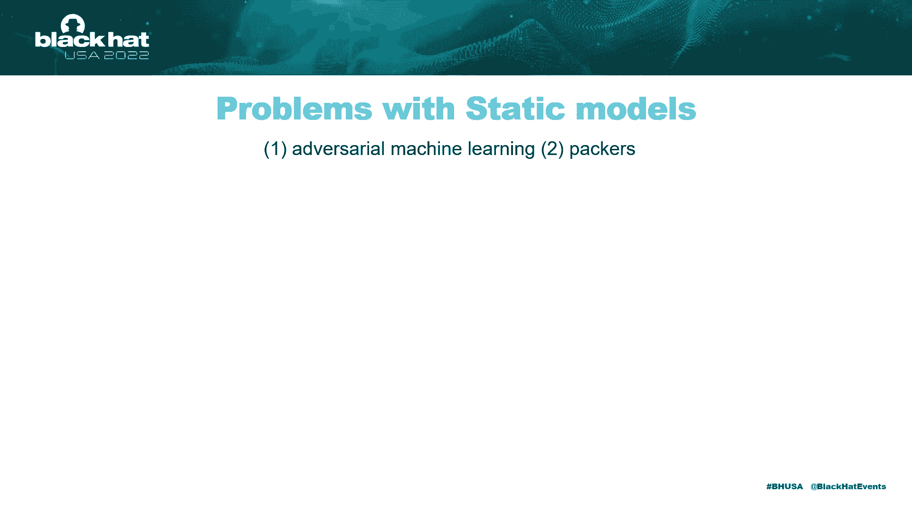

如果我们向将军申请，让我们说，恶意软件威胁景观，然而，有办法绕过这是如何工作的，这就像对计算机视觉领域的承认一样，回到2014年，逃避攻击是在更早的时候提出的，和一只鸭子在一起。

它的基本工作原理是我们修改ml模型的输入，以巧妙的方式，我们产生扰动，它完全搞砸了ML模型的行为，在这篇原始论文中提出的例子中，我们看到看似随机的噪音，可以完全规避图像分类器的功能。

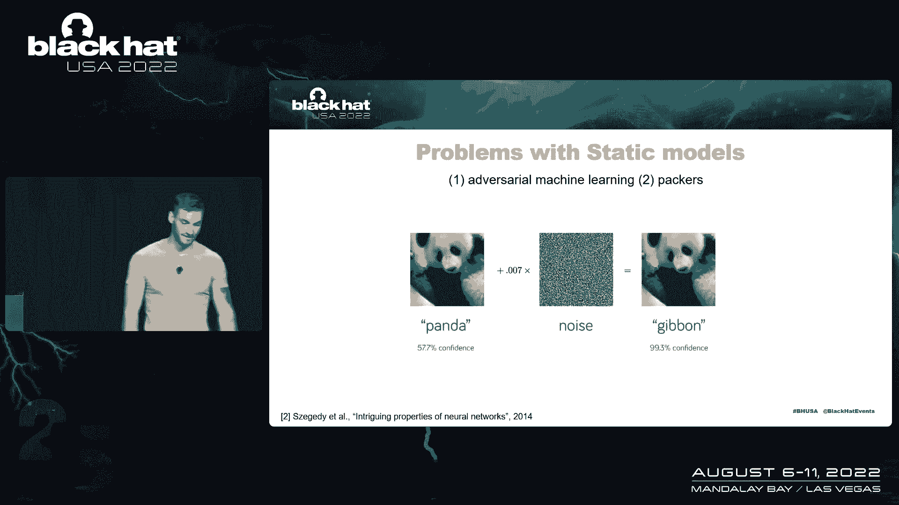

那么这也适用于恶意软件中的ml世界，例如，卡加里大学有一个小组，我发表了一个部分注射的攻击，喜欢当你添加，已编译的恶意软件，它这个，事实上，用具有逃漏率的分类器来逃避它的静态分类器。

静态分类器的第二个问题是封隔器，恶意软件似乎是一样的，因为静态分类器提取的许多属性，恶意软件分发，所以在ML适用性的这个阶段，我们可以从这里走向何方，至少在公共空间。

我们知道供应商以封闭的专有形式进行一些动态分析，但是公共知识和公共白皮书讨论了大多数静态适用性，动态的以原型的方式限制在几千个样本，我们从静态分析工具中的恶意软件样本来看，像P工作室，人类分析师。

它通过揭穿器进行动态分析，通过恶意软件的调色，在受控环境中，我们吸收产卵过程，我们吸收命令行和，网络连接，所有这些都为恶意软件的功能提供了额外的见解，这些东西的大部分，字节，但它可能会被混淆，它可以是。

是啊，是啊，它是在运行时提取的，或将动态分析应用于ML世界的能力，我们考虑为此使用模拟器，为什么，因为在虚拟机中引爆恶意软件代价高昂，你需要奖励污染的环境，你需要重新开机，全像操作系统内核，这需要时间。

它需要计算资源，幸运的是，我们有一个很棒的模拟器，感谢Mandient团队的研发，他们做得很好，保持速度，易于开发，开发它，它基本上允许在四行代码中获得动态遥测，事实上。

他们自己的数据科学团队在这个方向上做研究，一些见解发表在去年的AMAS上，所以如果你对他们的工作感兴趣，你可以看看这个参考资料，所以我们从地下酒吧的模拟中得到的，基本上相同的信息只是纯粹用Python。

文件访问是，我们可以获得写入文件的数据，又有记忆片段了，内存段内容，是的，是的，很棒的工具，不仅用于ML的自动分析，但对于手动二来说，我们如何处理这些数据，我们基本上呈现这个模型。

它从不同的角度模拟P可移植可执行文件，首先呢，我们保留琥珀色的静态特征是因为它们很棒，我们不知道在这个方向上丢弃我们所知道的是什么，他们在那里，他们做得很好，以及一般的恶意软件分发，然而。

我们增加了额外的武器，一只手臂专注于API调用，基本上，我们从仿真报告中提取一系列API调用，这是最近的路，比方说，表示恶意软件在系统上的作用，除此之外，我们来看看恶意软件是不是恶意软件。

但是任何P文件在执行时都位于系统中，所以我们从野外收集这些数据，并用于分析我们的系统作为上下文参数，因为有一种可移植可执行文件的行为模式，有一个上下文部分表示环境。

所有这三个臂基本上都是作为特征提取器工作的，最终在人工智能世界中提供这些邪教代表，他们挤出128维的数据表示，并提供给后期的模型，我们称之为元模型，它实际上执行分类，它从所有三个臂获得输入。

从这些表现中可以看出，这是恶意软件还是良性软件，我们用来评估这个模型的数据集如下所示，它围绕着训练集，验证集由大约10万个样本组成，超过三百GB的数据，测试集是在获得训练集后三个月收集的。

评估模型在规避中的表现，一片长着翅膀的红色风景由大约27500个样本组成，标签是由专业的威胁情报小组使用手动和自动化工具分配的，而单一标签清洁代表了一个良性的软件，而所有其他标签都是恶意的，它是。

DataSet不能很好地概括所有恶意软件时间类型，对模型的分析并不那么重要，因为耶，我们就会，我们将只关注这些标签，只是为了分析模型是如何工作的，如果你想考虑这些想法来建立一个更普遍的。

不要选择特定的标签，选择尽可能多的数据，你可以洗干净，干净，标签相对来说更像是体积来平衡恶意软件，两种类型的数据，我们通过模拟器传递了这个数据集，这可能需要大量的资源来通过VMS，但是是的。

在相对较快的模拟器中并不完美，它们只创建或模拟实际内核的一个子部分，某些API调用不存在或未实现，因此，有些模拟是空气的，然而，当我们吸收模仿时，错误率不是那么普遍，它们仍然很适合我们的分析。

我们从哪里出发，我们有一个文件路径，我们有一个API调用作为顶点序列，什么问题基本上是一样的，从ml建模的角度，就是这些序列，第一个编码为uf 8字节，并形成整数向量，API调用可以用它们进行编码。

只是人工标签地图喜欢，具体，All表示特定整数，因此，我们得到基本相同的输入数据，当然啦，表示不同的信息，然后这些序列被传递到嵌入层，什么是嵌入，什么是嵌入，那些来了，呃。

从NLP自然语言处理到人工智能技术世界，我们已经看到嵌入的令牌，当它们扩展到嵌入的向量空间时，基本上它的作用，它采取了一个狭窄的序列，代表了一个更宽的维度，这些扩展的值有有趣的性质，比如说，训练后。

相似的令牌出现在相似的区域，这个扩展向量空间的相似区域，例如，城市，这些身体部位，你的感觉停留在同一区域，因此，后面的这些层可以掌握令牌的大致含义，大概类似的事情也发生在，例如，API调用空间。

其中可用于注入线程中捕获的shell的API调用序列，有不同的方法来做到这一点，它们可以在扩展的嵌入中驻留在类似的向量空间中，这只是猜测，我们没有验证这不是那么简单，但大概会发生这样的事情。

值传递到下一层，也就是卷积，卷积层，卷积层，那些来自计算机视觉领域的卷积被使用，从图像中提取特征，例如，中间的这个过滤器将从图像模型中提取垂直线，然后对输入数据执行筛选器的卷积，那些是二维卷积。

我们用一维的，因为它们应用于输入序列的一维，当我思考一维卷积时，我脑海中浮现的是心跳，其中一维卷积层，可以很容易地掌握心跳中所代表的模式，类似的事情是在肮脏的道路上做的，例如。

一维卷积可以得到克和克的输入，比如点txe或c反斜杠win，以后可能会被后面的层用于实际的，后面的层是紫色的结构中的层基本上是完全连接的神经网络，我想这是，就像现在每个人都听到的那样。

这些只是神经元在输入和输出之间建立非线性函数，事实上，我们使用全连接神经网络作为我们的元模型，我也是，这是一种建立复杂决策边界的方法，或者从输入到输出中提取有价值的数据，这些是我们模型的结果，再次强调。

这是在培训三个月后收集的数据上完成的，以及如何阅读这张热图，轴表示假阳性率，连同十万个恶意样本，你将不被允许推送任何带有瀑布假警报的毫升型号，因为我们拥有的最宝贵的时间是人类分析师的时间。

我们不能放过他们的分析或假警报，因此我们将重点关注，例如，这是一个代表非常非常的专栏，我们给模型的非常低的假阳性要求，我们可以部署多个模型，它们的预测非常准确，但检出率低。

这基本上类似于我们在基于规则或基于签名的方法中所使用的方法，他们只在特定的情况下开火，所以我们这里有的，如果我们看不同的模型或手臂，那么我们仍然看到琥珀是国王，对呀，因为它从静态中提取了如此多的属性。

静态字节阻塞，这也是一种艺术状态，我们都知道，现在毫无疑问，这是一个很好的工具，如何申请和获得一个快速的分类皇后，我们在API调用上看到了令人惊讶的糟糕的仿真性能，这表明我们仍然可以改进这个组件，是的。

是的，我们一会儿就会摸到这个，但从我们的角度来看，最令人惊讶的是，但我们看到了元模型的出现模式，为此输入数据提供附加值的能力，例如，在这里，我们看到文件通过和拆除只给我们大约4-3%，嗯。

如果我们一起使用样本就会被检测到，如果没有样本重叠，甚至更少，但是如果我们把它们一起使用，并在上面应用元模型，我们把它提高到77，所以它超过了30%，而不是单独使用它们，它甚至比这种艺术状态还要好。

琥珀本身的广泛提取，至少20%，只是从文件传递和API调用序列，所以我们已经可以捕捉到77%的数据，这是我们通常可能看不到的东西，从男性的角度来看，它可以建立启发式，我们甚至不，我们不知道。

只要给出一个数据，只是不同类型的属性，只是不同类型的喜欢的角度，它会为它计算出健谈的组件，在这种情况下，它可能需要文件路径的一部分和一些外观，几个API调用，并看到这些是恶意软件的代表。

而良性的则有相同的API调用，没有这部分的文件传递或类似的东西，当然，当它们三个一起使用时，我们得到了相当好的检出率，如此低的假阳性要求，在十万个样本中只有一个错误的触发。

所以这个模型已经以这种原型的方式，可以作为类似的部件之一部署在生产中，到手动分析员的警报解决方案，它仍然有14%的真负，但它们可以用其他方法捕获，对呀，我们需要重复我们的探测，但是是的。

关于对抗性恶意软件行为的简要说明，我们就是这样读这个图的，它显示了两个模型，让我们只关注像橙色的酒吧，代表琥珀模型，Y刻度是对数的，所以当我们建造它的时候，以及来自我们测试集的对抗性恶意软件数据集。

我们已经看到一千多个样本在纯模型本身上闪烁其词，当我们添加了去除，这一千个样本中只有一百个处于回避状态，比如这些攻击的逃逸率下降了90%。

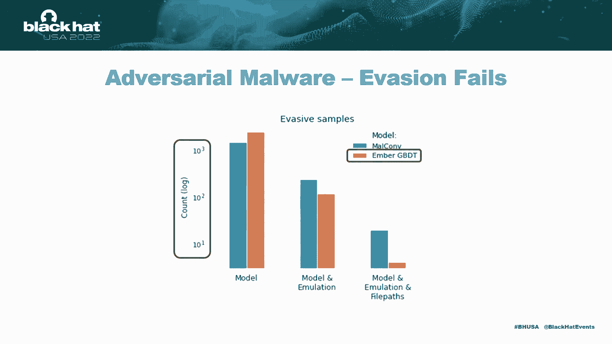

我们特别知道我们测试了切片和注射攻击，当我们应用文件路径时，这次袭击基本上没有成功。我们证明了这一点，如果对手想在对抗模型中使用技术，他们应该适应一些，一些扰动愚弄了复杂启发式的动态部分。

对未来工作的一些想法，正如我们所看到的，仿真部分只是一个原型，性能相对较差，如果您直接与假阳性要求下的其他型号进行比较，我们可以考虑如何改进API调用模型本身，但我们可以添加更多有效的数据。

我们刚才说的，以前的网络连接，登记册，操纵，文件系统此，所有这些，报告的这些部分可以建模，不要垄断或喜欢在这方面的方法。

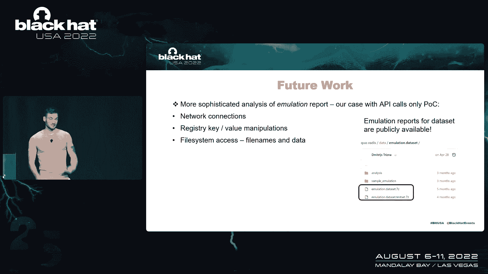

我们公开发布仿真数据集，如果你想的话就去贴膜，和他们一起玩，这些是两个数据集的JSON报告，不幸的是，由于隐私政策，我们不能发布P示例，但是仿真报告是匿名的，所以是的，如果你想往这个方向玩。

只是觉得自由，你现在有数据了，可以使用上下文意识的额外来源，就像填补了我们的认知空白。

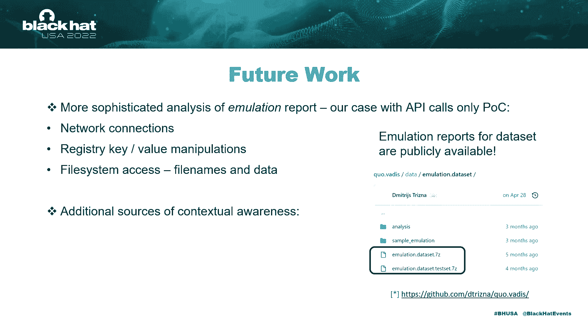

我们可以为模型添加一些有价值的信息，分离它仍然无法捕获的14%，例如，父进程，这些数据很难获取，也许在某些情况下，但对于安全运营中心来说，或者是的，威胁猎人，很容易的数据，你也可以试着给它建模。

另一个是Web的标记和下载源。

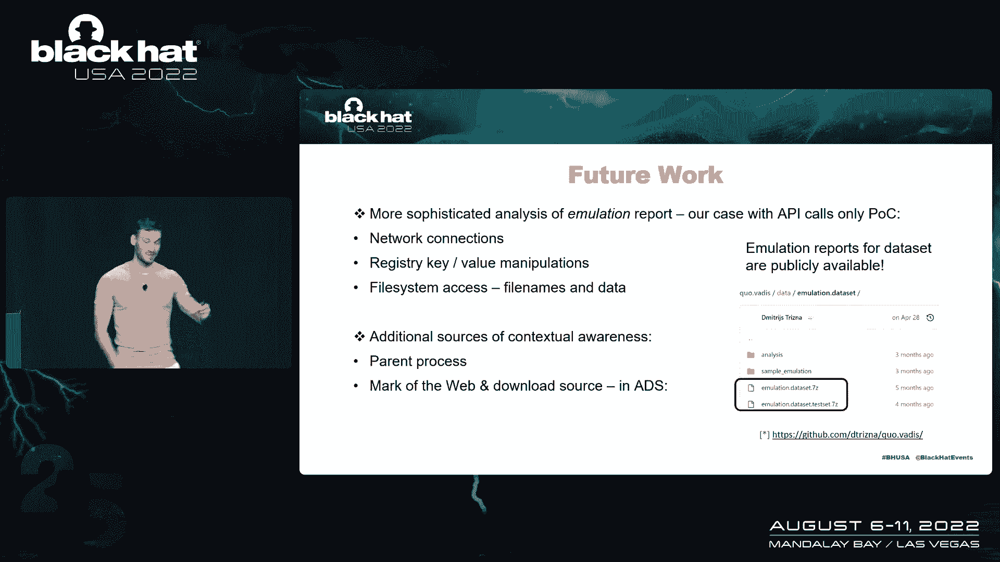

当然啦，你知道吗，或者像数字法医专家，这里将指出你可以从广告中获取这些信息，每个文件的流，对，你可以把它作为启发式的一部分，真正有价值的部分，所以这些只是一些想法，如果你受到启发并想继续。

从我们的角度来看，这些都是有希望的方向。

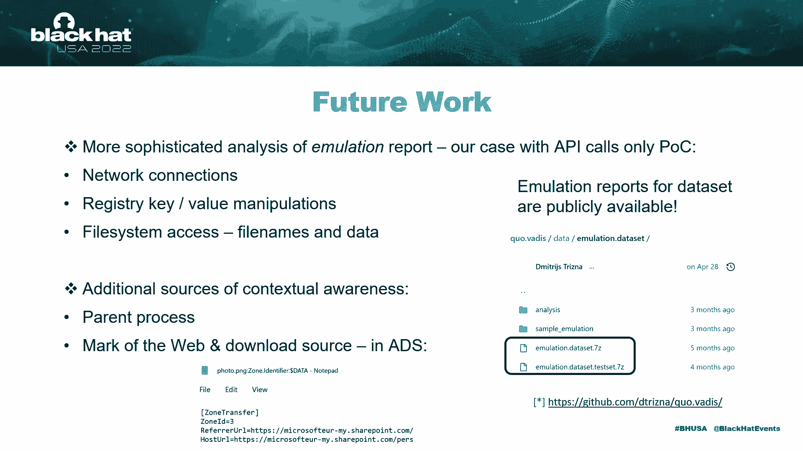

几个外卖，首先，人工智能允许模型行为，我们很容易看到它，至少在公共研究方面，当然啦，这是专有的，现在几乎每个供应商都在他们的后端这样做，但像科学知识真的很差，向这个方向。

没有模型可以直接使用预先训练好的模型，但我们看到这是可以做到的，以及建模行为背后的好处，它可以应用于更广泛的数据集，例如，静态技术就是这样，但是像sysmon或oddd这样的数据也可以建模。

它代表了更广泛的安全从业者反对安全操作标准，你不需要成为安全供应商，在p数据集中就是这样，通常是安全供应商用这种行为进行研究，我们世界各地的每一个袜子都能从模特身上受益，像这样。

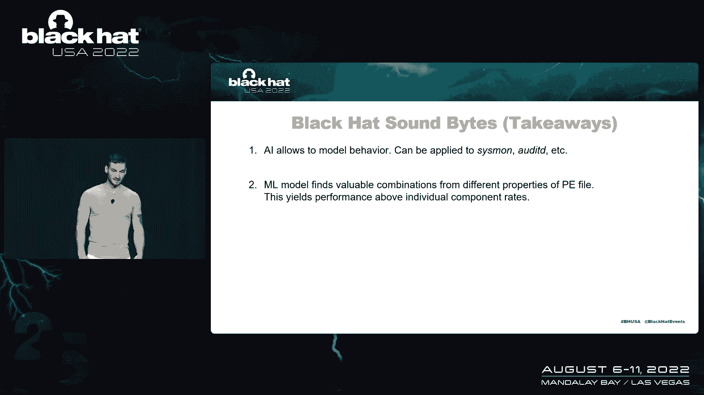

基本上你只需要给它数据，它认为自己，健谈的部分，你需要建立的是管道，正如我们所看到的，ml找到有价值的组件，如果你提供了同一个问题的不同角度，那样的话，是啊，是啊。

我们通过结合文件路径和仿真模型看到的性能提升。

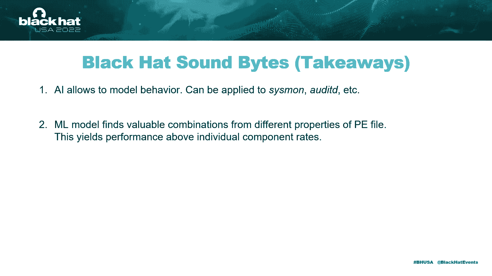

从我们的角度来看是很棒的，事实上，它不是这个特定数据集的人工制品，我们看到了这种行为交叉，验证培训和测试集，所以同样的模式出现在我们测试和持续的每一条数据中，但更重要的是我们想提醒大家的是。

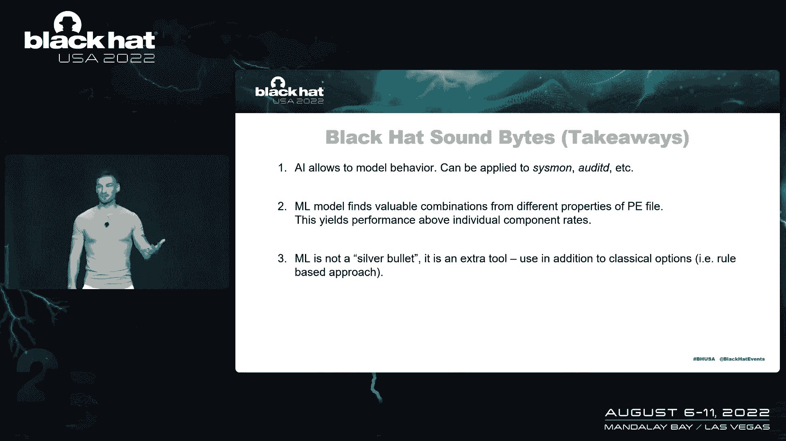

当我们谈到对安全问题的不适用性时，ml不是灵丹妙药，它明天不会取代你，就像人类专家一样，在那里会失业，它是我们可以使用和应用的工具，基本上AI是一个软件，我们远不是自己工作的智能特工，它是一个你可以。

是任何其他类型的代码或自动化并使用它。

除了你现在拥有的工具，基于规则的方法不像人工智能技术所取代，这是使你工作更有效率的另一种方法，你不能用你不需要的小模型，呃，是啊，是啊，你只需实现一只手臂，比如说，这种方法，它已经，呃。

可以是一个更好的，呃，你识别一些你需要识别的东西的检测方法，是啊，是啊，向许多做研究的团队表示感谢。

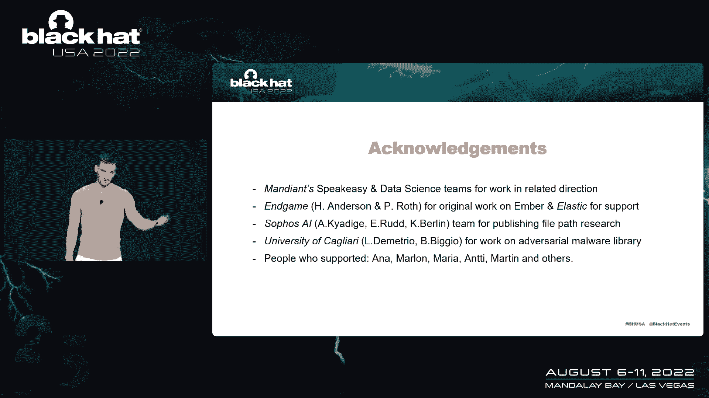

为这项工作奠定了基础，例如，又是星期一，他们在维护地下酒吧方面做得很好，他们的数据科学团队为原始工人成员做了类似的研究和游戏，所以一个人工智能团队展示了摔倒的事实，在改进AMSO中。

我们受到了他们的影响，和来电大学的家伙。

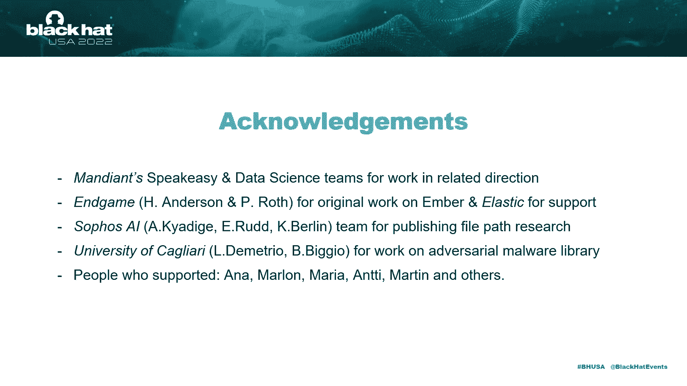

感谢他们和支持它的人，是啊，是啊，就是这样了。