# 【转载】Black Hat USA 2022 会议视频 - P52：057 - Whip the Whisperer： Simulating Side Channel Leakage - 坤坤武特 - BV1WK41167dt

现在我很高兴有请，贾斯珀·冯·文伯格，谢谢玩得开心。

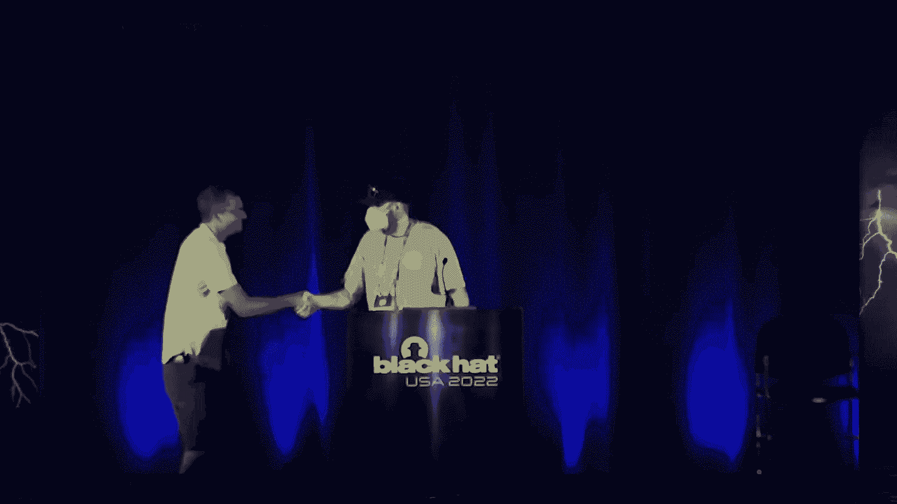

谢谢，感谢大家的到来，当黑人真好。

黑色和背部在黑色帽子，天啊，那是绕口令，几个月前。

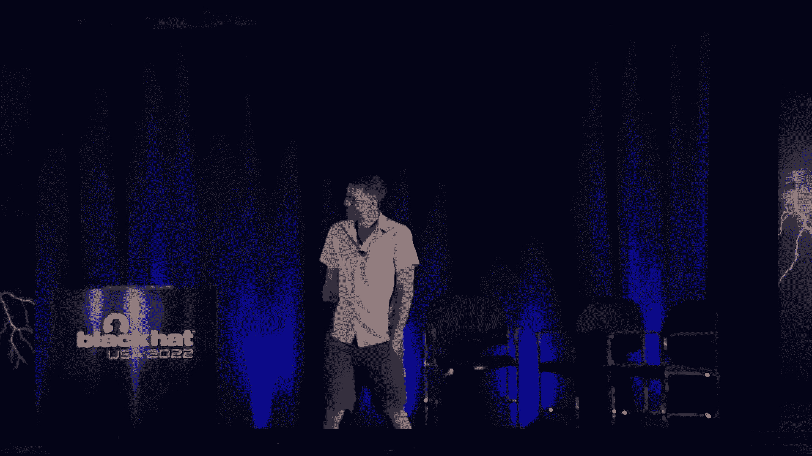

我偶然发现这张照片，我只是盯着它看了一会儿。

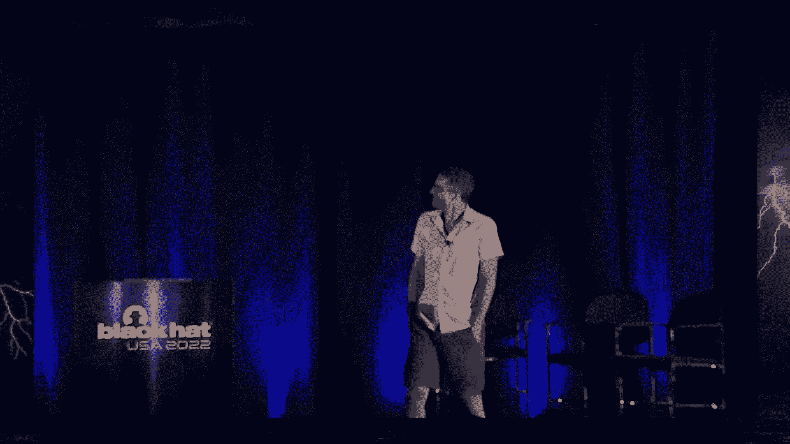

即使我知道那是什么，这是一种很酷的艺术和技术。

它几乎看起来像外星技术，如果你，如果你看它，我做保安大概有二十年了，硬件安全约十五，所以我知道这是什么，这个坏小子是，你知道吗。

如果你不，你可能带着几百万，或者你口袋里也有几十亿，它也是我们今天故事的英雄和恶棍，但我马上就会说的，就像我提到的。

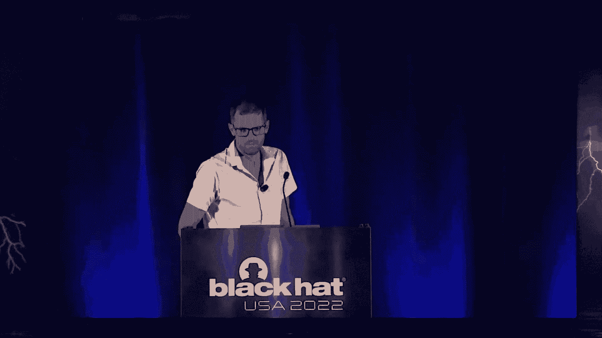

从去年开始我做保安有一段时间了，我也可以称自己为作家，和科林·奥弗林一起，我写了一本关于硬件黑客的书，你可能从远处看不见，那幅画有点过时了，更像这样，现在，让我们回到那张漂亮的照片上。

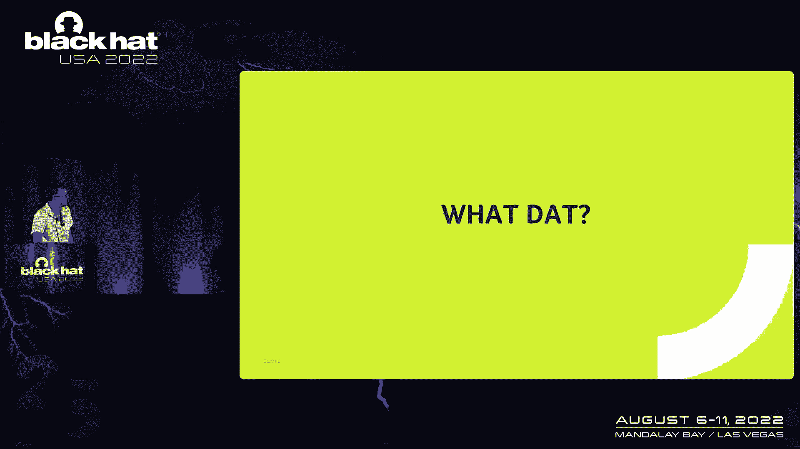

所以这实际上是什么，这是一个，这是人字拖，人字拖只不过是一个，任何芯片内的存储器，所以它可以保存芯片的当前状态，这两者都是我们让芯片运作所需要的，但它也有一个问题。

并了解问题，我们必须深入研究这些东西是如何工作的，所以人字拖，它就像一个比特存储单元，如果你愿意，它需要两个输入，一个零或一的D和一个时钟，它有一个输出Q信号，它所做的就是一旦时钟上有上升的边缘。

它存储d的值，从那一刻起排队的价值，输出变成D，只要时钟稳定，它就能保持这个，或者在下降的边缘，到目前为止，一切都很好，这就是它在功能上解决的问题，虽然我暗指的是它实际上泄露了一点信息。

所以当输出从0切换到1或1切换到0时，的，触发器的功耗实际上是一个尖峰，不多，很明显，它只是一个细胞，但如果它不切换就更重要了，所以从概念上讲，如果时间等于零，你可以做的是，假设我们知道输入值是A是零。

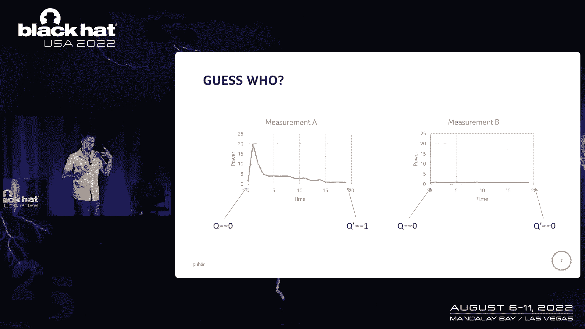

或者它实际上存储为零，我们测量一个功率尖峰，现在我们实际上知道这一点已经从零翻转到一，如果我们测量功率是恒定的，然后我们知道它一直保持不变，所以当你看到像这样的算法时，这就变得有问题了。

加密算法也是如此，它有一百二十八位钥匙，它产生128位密码文本，如果您有硬件实现，经常，你会有128人字拖，每个商店，状态的一点，中的第一个操作之一，这就是所谓的圆键版，它基本上采用纯文本。

并劝诫上面的键，可能有一个问题是，如果我们能测量每一个128位的功耗，人字拖，因为我们可以假设我们知道纯文本，如果有电源尖峰，然后我们知道关键部分实际上是一个，因为值改变了，我们劝诫它。

如果电源保持相当平坦，我们知道键等于零，所以这是个问题，我将在这次演讲中，浏览大量细节，所以你可以事后问我，但我不打算把这变成一个30分钟的能量分析讲座，所以这里有些不正确，但你知道。

凭直觉试着理解这种力量与钥匙有关。

还有一个问题，虽然，在我的论点中，也就是，我在某种程度上假设，我可以测量一个触发器的功耗。

现在这变成了一个实际问题，即使它可能会漏水，你可以很容易地测量，所以让我们看看我们能做些什么。

所以你在这里看到的又是同样的人字拖，但现在在芯片设计的背景下，所以你看到所有弯曲的线条，人字拖里面的那种，所有其他的都是与邻近细胞的连接，所以这可以是其他人字拖和等级或大门。

以及芯片上所有精细的布尔逻辑，所以让我们缩小一点，所以这就是它看起来的样子，你会看到更多这样的细胞，如果我们再缩小一点，你看到在这些黄色的带子里，你看到了所谓的配电网络的一部分，在黑色弯弯曲曲的。

我们的人字拖仍然在那里，然后我们进一步缩小，你开始看到IP块的边缘，所以在左边，稍微宽一点，这里多一点空间，那实际上是公共汽车出来的边缘，如果我们再缩小一点，现在你可以开始看到其他几个街区。

所以右边的实际上是一辆皮科房车3 2核心，这是一种风险，五个非常小的CPU，有一些内存接口逻辑，在，在左下角，在顶部，您可以看到一个1KB的RAM，惊人的大小，我们做了，我提到，这是一项非常古老的技术。

这个芯片，所以这实际上是完整的芯片，我们把这个拿出来做测试芯片，六月的某个地方，在150纳米的工艺上，它大概有一百二十年的历史了，但这是你可以在很小的地方做的事情，所以这里有几个微微核。

和几个作为记忆中的分数，等，我们就玩一次，我们把它拿回来，做一些侧通道，然后在上面做实验，我们已经缩小了，从这一个翻转一直到整个芯片，我们可以测量，这样我们就可以拿一个芯片，你看在这张图的右手边。

在绿色PCB中，你看到另一个芯片，不是我刚才给你看的那个，但你在PCB上看到，我们可以对其进行电磁探测，所以你可以看到上面有一个小探针，我们可以做电流探测，那是它旁边的小黄色盒子。

在左边你可以看到一个示波器，我们在那里捕捉这些信号，为了这次演讲的目的，我要谈谈功率分析，电磁分析在某种程度上是相似的，我不必在这里谈论差异，那么我们如何利用这些信号来提取完整的密钥。

因为我们可以测量单个人字拖，但我们可以做的是，我们可以进行大量的测量，取电源痕迹，采取他们的痕迹，然后执行一个叫做相关功率分析的魔术，什么是注册会计师，注册会计师所做的是你把一个作为引擎。

你给它发各种纯文本，不同的纯文本，你要尝试做什么，你要试着模拟力量会是什么样子，如果某个键字节是正确的，所以我要说好，如果我的密钥字节为零，然后我有点知道通过IAS的设计，什么位翻转。

我应该看到给定的某个纯文本，我可以把它和，我的匹配是正确的，我说好，我这么做是为了分钥匙，所以在这种情况下，一个关键字节做出了二百五十六个预测。

我将为每个键字节这样做，有点像我的，模型与我的联盟最匹配的地方，我认为那是正确的钥匙，我想重复十六次，然后我有了完整的钥匙，所以这个又有点手波浪，但只是为了让你明白我们可以应用统计学。

使用这个建模的功耗，我们可以将其与现实进行匹配，并找出钥匙应该是什么样子，这里有个问题，嗯，我们在做这个后硅，所以我们实验室里有一个芯片，你知道一旦你发现泄漏，你太迟了，你再也修不了那个芯片了。

你知道你把它反馈给制造商，他们说谢谢，我们将修复下一个芯片迭代，或者两个，取决于他们的制造管道是什么样子的，所以是的，带后硅，我们可以修复下一个芯片，我想说的是，今天是前硅，我们可以修复当前的芯片。

我们通过模拟来做到这一点，芯片还不存在，所以这是我们能做的最好的了，我们做这个需要什么成分，四种基本的，一个是芯片设计，所以你需要所谓的网络列表，然后那个名单只不过是，基本上芯片中的所有门及其连接。

一堆和门或门，而不是大门，等，加上它们之间的联系，这是一个网表，理想情况下，你还想知道东西放在哪里，但是为了一些模拟的目的，你没有，那么我们也需要知道行为。

所以如果我们向这个网络列表发送一个特定的纯文本，所有逻辑上发生的切换是什么，所以对于你捕捉到的每一个门，国家，是不是，你知道的，随时间输出1或0，你把这个放在所谓的VCD文件里，所以这是逻辑方面的问题。

然后为了将逻辑转换为功率，我们需要每个细胞的模型，基本上每个细胞，它解释了何时发生转变，耗电量是多少，所以你输入到你最喜欢的电力模拟工具中的所有这些输入，你在你实验室里漂亮的主框架上运行它。

然后你基本上可以做同样的事情，我们之前用电源痕迹做的，但在我进入之前，那台主机不是很快，别在那上面做，但在现代CPU上。

这些模拟实际上是相当可行的，所以如果你专注于你在马厩里看到的是一些分数，我们已经试过了，在最右边的三列中，你可以看到不同的模拟精度，所以一个在RTL，一个后合成和一个后放置路线。

我们花了多长时间模拟两个，一个，五个，六个痕迹，这一切都从半小时到13小时左右不等，绝对不像你有你的结果，但这是你可以通宵运行的东西，仍然可以得到一堆痕迹，就像用示波器一样。

在我们现在进行这些相同的跟踪之前，我们运行纯文本，我们运行我们的建模，我们运行注册会计师，结果是渗漏与否，这通常表现为，你知道的，某种相关痕迹，就像我们所说的，在某个地方有一个顶峰。

这个峰值很好地表明了这个时间点。

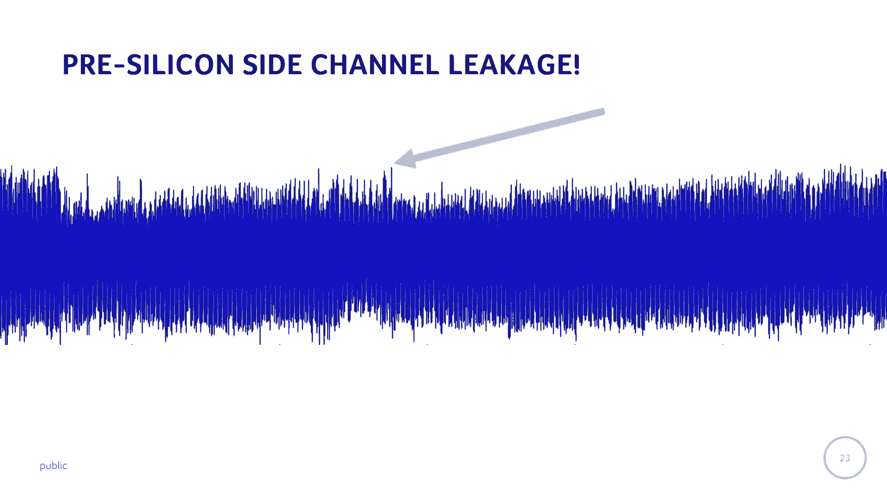

显著渗漏，它是可以被利用来从系统中获取密钥的东西，这有个问题，我怎么做，我如何从这个到实际修复我的设计，这就是我们所做的研究开始的地方，所以当东西漏水时，实际上并不能帮助修复它。

你只能观察到它在什么时间点泄漏，但它不会告诉你喜欢，你知道的，这些是你必须去修好的门，这就是我们的滑冰研究的用武之地，都是蓝队的东西，我们现在要去修理东西，所以如果你是红队，或，你知道，继续黑客攻击。

随着时间的推移，事情发生了，但它在哪里漏水，所以说，这背后的想法是，我们将把网络开关与泄漏模型联系起来。

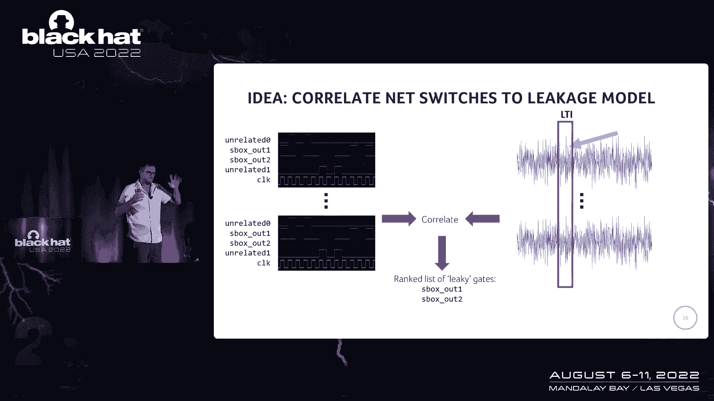

所以本质上我们要做的是，我们要把逻辑放在芯片上，记住一旦有东西切换，它消耗更多的能量，所以如果我们看到在什么时候，所以在右手边，我们称之为红盒子，泄漏时间间隔，但基本上有东西漏水的时候。

我们可以从统计学上看，你知道的，现在那里的权力顶峰也是如此，如果一个特定的网似乎总是对应，它在右手边有一个更高的峰值切换，你可以争辩说，这两者之间实际上有统计关系，所以你可以开始下到芯片内部泄漏的网。

从这里得到的基本上是一个漏门的排名列表，这样你就可以开始争论了，你知道的，在这个人为的小例子中，它实际上是像盒子一样漏水，所以让我们更深入地看看这里的数学，所以说，当我们有这些VCD痕迹的时候。

我们实际上要做的是，我们将在它上应用一个非常简单的变换，因为理论上一旦有东西改变，它会消耗更多的能量，所以我们的电源模型是，一旦一个特定的网络切换，它消耗动力1，如果有什么东西没有切换。

那么它的耗电量是负1，这已经足够像这样的权力模型了，我们在做相关分析，我们不必做太花哨的事，我们为每一个网络和我们运行的每一个模拟计算这个，然后我们取这些测试向量，我们要匹配每一个网，对于每一个模拟。

切换在哪里，基本上与功率的微小增加一致，如果有什么东西不能切换，它与更低的功耗在哪里一致，由此我们做了一个皮尔逊相关，这样我们就可以关联每一个网络，它对能量连接的贡献有多大，这基本上给了我们尖端的点。

联赛处于最低水平的地方，就像我们在说网一样，你可以，由输出门驱动，你可以回到漏水的大门，所以一旦我们确定了我们可以再次开始缩小，因为单个的门也是，如果你是一个软件人，它在观察二进制的单个位。

在你开始逆向工程之前，它没有太多的意义，理想情况下回到源代码，在那里，那个特定的片段又有了意义，在硬件设计上如此相似，所以艺术品设计总是有等级的，所以我之前给你看的，在芯片布局方面。

我们有他们所说的顶级，然后我们就有了，你知道有五个核心和一堆AS分数，然后放大为，这就像一个圆形的逻辑，在圆形逻辑内部，有箱子，你知道它一直往下走，最终你到达了单独的大门，如果你告诉你的合成工具。

比如维护层次结构或跟踪层次结构，你可以从盖茨回到最初设计的基本部分，我觉得很酷的是，这是我们早期的结果之一，在你知道的地方，你永远不知道什么时候开始应用你的方法，它会想出什么。

但我们立刻看到S盒漂浮到了顶部，所以这个长长的列表基本上是层次结构的一部分，你看到的单个点是单个的门，阴影是相关性值，所以颜色越深，相关性越高，漏得越多，点越多，这些门越多，在层次结构的某个特定部分。

所以你把它们看成盒子，他们有最多的大门，也是最高的泄漏，这就是你所期望的，这是一个不受保护的实现，所以这真的是对我们所做的事情的一个很好的验证，还有一些等级制度的其他部分，在那里很明显。

就像有圆键生成和键记忆，但还有其他东西，但名字并没有真正说嘿，我在向我泄密，至少块寄存器，谁知道是什么，所以说，分析已经开始了，显示一些你不一定认为有泄漏的区域，我们可以往上走得更远，这是另一个实验。

我们以另一个为核心，在左边左上角，你看这些PG什么的，这些是来自合成工具的门号，每一个都与，基本上是源代码文件中字符中的一行，这是泄密门名单的一部分，看到至少这四个门，他们都回到了XOR操作。

我们在那里拿了数据和钥匙，我们把它们混合在一起，这就是我之前说过的广告轮操作，所以是的，从很高的水平开始做统计，我们走下大门，然后我们回到源代码，但现在我们在土地上，开发商可以做些什么，现在你知道。

你的问题在哪里。

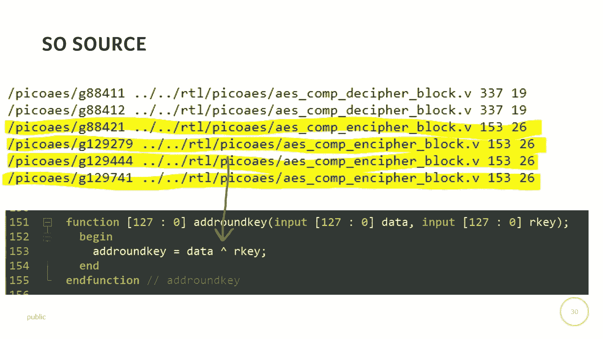

所以下一步是反措施测试，所以我刚才说的攻击，它们已经存在了25年左右，所以一段时间以来，人们一直在思考各种对策，很明显，当你把它们放在硅里时，你可以测量它们，又在那里，问题是，如果你找到了，太迟了。

所以让我们在模拟中进行对抗测试，而且真的，你问的问题是，在您编写代码之前，它不能正常工作，你真的不知道它是否有很重的装甲，或者是不是。

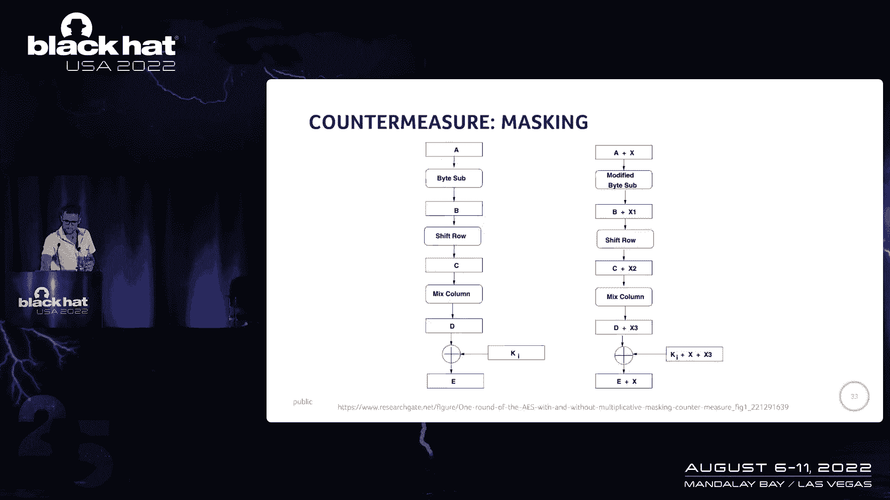

不得不让你有点厌烦，掩蔽，所以掩蔽是一种常见的对抗措施，你可以查阅关于它的各种文献，直觉上它在做什么，它试图打破注册会计师正在利用的关系，所以通过注册会计师，我们获取我们知道的数据和未知的密钥。

我们将开始对这把钥匙做出预测，掩蔽所做的是，它增加了第三个变量，所以我们有数据，一个键和一些随机变量，每次都在变化，我们无法预测这一点，它实际上破坏了我们匹配泄漏模型的能力，到正在处理的数据，掩蔽工作。

这是左手边的AAS掩蔽，有点香草味，就像右边一样，这是用掩蔽，你到处都能看到这些加x，这些基本上是XOR操作，在数据上我们x或一些掩码，真正重要的是，你要确保你的数据总是被屏蔽的，而且面具有规律地旋转。

如果面具在任何地方都是恒定的，你还可以做一些其他的攻击，所以你可以看到这个变量x保持不变，不断变化，最后，当你揭开你的价值时，然后你有密文，所以我们做了一个案例研究，所以我们实现了自己的AS设计。

我们添加了一些现成的文献来掩盖这一点，首先我们关掉掩蔽，所以我们有同样的设计，但我们可以把它关掉，或者我想我们基本上让面具总是零，或者类似的东西，所以我们没有改变设计，我们刚刚关掉了掩蔽。

然后我们可以做的是运行我们的注册会计师，在这种情况下，但我们就说CCPA吧，我们看到这些红点，这基本上表明什么时候有泄漏，所以我们知道这东西会像预测的那样泄漏，反措施被取消了，所以我们现在期待的是。

一旦我们打开反措施，所有这些红点都应该消失，根据理论，至少，那当然没有发生，所以在左手边你可以看到没有掩蔽的图片，在右手边你可以看到它有掩蔽，那里仍然有渗漏，这很重要，这足以打破这种实现。

一开始我们有点不明白，因为当我们查看源代码时，一切看起来都很好，就像面具被传递一样，所以我们用这个门，在这种情况下，我们实际上必须呆在门的水平上弄清楚发生了什么，结果是软件的综合工具，人，您的编译器。

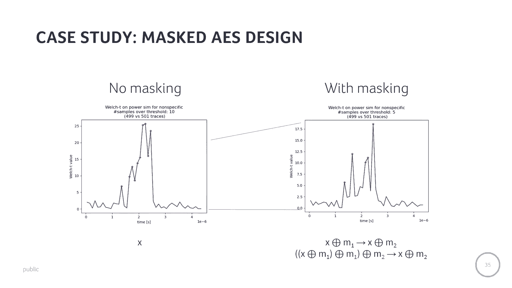

决定优化设计，它现在翻了两个额外的操作，这两个操作碰巧是掩蔽，所以通常，当你蒙面的时候，您首先用XOR应用新的掩码，然后你把旧面具拿出来，所以你永远不会有一个未被掩盖的值，但是合成工具在优化，不知何故。

这些工具从未优化过安全性，它把这些东西翻过来，所以第一个揭开面具的人，这意味着这些值在一段时间内是清楚的，然后它重新映射，所以是的。

一旦你有了洞察力，你钻进去，然后你就可以知道是怎么回事了，你可以告诉你的，因为综合工具，我们没有优化某些东西，然后它维持了操作，在右手边，注意Y轴，这里有点放大了，没有更多的红点，基本上泄漏消失了。

因为我们，正如我们最初预期的那样，当你看网络列表时，口罩的秩序得以维持。

那真是太好了，但这不仅仅是AS核心本身，我认为这是我们逐渐得到的一个洞察力。

随着我们对细节的进一步挖掘，因为历史遗址，至少从我们的角度来看，作为实验室，我们只是在测试芯片，我们没有设计，我们没有这种内部，好像不是漏了就是没漏，我们知道芯片上的位置，在哪里，至少如果你在做，m。

但现在，我们有一种前所未有的外观，进入发生了什么的所有细节，所以让我们缩小一点，把整个SoC，然后试着模拟一下因为也许比分没问题，但我们不知道房子的其他部分是否着火了，我们拿了一个SoC。

它和我刚才给你看的有点不同，但它基本上是一个带CPU线的小SoC，我们在上面加载了这个软件，基本上你在这里看到的，它在蓝色的说明书里，它首先加载纯文本，所以它从内存中加载了三个二位。

然后它把它储存在发动机里，这样做四次，所以它传输和28位，然后它对钥匙也做同样的处理，所以它一次加载三个二位，把它储存在发动机里，然后CPU基本上说，去加密，它将进入一个繁忙的等待。

所以它实际上是在拉动引擎，你说完了吗没有，你不不，你不知道你不知道，所以我们把这个放在我们的功率模拟中，这是一种很常见的表情，你可以看到CPU首先做一些事情，在这种情况下，我们知道它在写纯文本和密钥。

然后它切换到发动机说的那样，你知道的，去吧，你会看到这种更高的活动，比如有很多切换活动的引擎，不仅仅是这里简单的CPU，所以你期望更多的功耗，你看这里，如果你斜视一点，你可以看到像一个重复。

就像十轮重复一样，也就是作为和之后的十轮，CPU再次接管并检索密码文本，我觉得很酷的是，你实际上可以看到一些CPU行为的内部，也是，所以嗯，从您的计算机体系结构，一零一课。

你可能还记得管道危险和管道摊位，那么CPU中发生了什么，当它从内存中提取到32位时，它实际上已经开始执行存储指令，但是存储指令需要等待数据进入CPU，在它真正能做商店之前。

你可以看到在这些小草皮上的功耗，所以你看到这个，真的，您可以通过执行来跟踪每条指令，然后就是，除了对此感到厌烦，让我们回到泄漏，所以这又是一个没有反措施的AS发动机，所以我们预计这里会有泄漏。

但我们也看到了，也许并不完全出乎意料，在发动机启动之前就有一大堆泄漏，你会看到几个小山峰与其中一个圆形对齐，因为那只是发动机的泄漏，但在那之前发生了一大堆事情，如果你看看这个，这很有趣。

从设计师的角度来看，因为通常你有一个硬件设计师，他制作一个AS引擎，他们会制定对策，也许他们甚至会模拟它，他们发现一切都很好，还有一个软件开发人员说你知道，我只是跟着，你知道我在用C微架构写代码。

或者袜子布局不是我的领域，我在那里什么都修不好，但也许有一大堆泄漏，那里正在发生的事，所以当你设计这些芯片时，有一个缺口，谁真的看着渗漏，这发生在提升之外，我们可以再放大一点。

因为我们可以找到这些门在哪里，我们可以定位他们在层次结构中的位置，我们实际上发现有一大堆泄漏，这是在风险中发生的，五个CPU，你可能会期待对，它在处理关键材料，你可以看到它在哪里，这很酷。

它在ALUS和寄存器文件中，等，但让我们惊讶的是，实际上，这很令人惊讶，因为他们不是，处理关键材料根本不是他们的工作，问题是，它们与CPU和发动机挂在同一辆公共汽车上。

所以一旦关键材料被转移到公共汽车上，那里有一些晶体管活动，即使他们实际上可能不会对这些数据做任何事情，那里仍然有一些切换活动，这放大了泄漏，所以是的。

我们在这里的一个结论真的是泄漏只是发现了一个意想不到的地方，如果你不看这里，你不会找到的。

所以关于未来的工作。

今后的工作，意思是，我们梦想着这个，它今天不存在，我们的一个见解是，如果你只看设计中的漏水门，它实际上是整个设计的一个子集，所以当你说话的时候，例如，关于作为反措施或作为掩蔽反措施。

这些东西使面积增加了一倍，很贵，如果我们能把泄漏隔离到设计的百分之十到三十，即使我们把面积翻倍，只是那些门仍然比做一个全面的掩蔽更便宜，所以我们从对策注射的角度来看待这个问题，如果我们有这个门的列表。

我们能做一个网带转换来获得一个更安全的设计吗，一旦你有了那个，你也可以开始思考设计太空探索，所以硬件设计师经常用功率来交换，性能领域和安全性实际上是第四个维度，所以安全的代价更高，力量表演我们的区域。

所以一旦你开始考虑安全性，我们有一份漏水门的名单，在前一百个门和前一千个门，看看它是如何影响我在面积上的力量表现的，作为一个设计师，我可以开始在安全和你知道的成本之间做出权衡，最后在硬件设计上。

有一个重要的点叫做结束，在设计中使用各种度量标准，他说，好的，这足以用于制造，我们希望看到的是一个安全标志，我们说这是足够安全的，可以进入制造，我们可以根据侧通道分析提出一系列指标，这可能会有所帮助。

在我得出结论之前，一些警告，所以这些模拟受到你扔给它的CPU内核数量的限制，还有设计尺寸，所以你没有在我的幻灯片中看到最新的英特尔12代内核，因为那不是我们可以模拟的东西，但你知道作为分数。

简单的SoC绝对是触手可及的东西，理论上你也可以在模拟中投入更多的CPU内核，并以这种方式加快速度，所以我们把芯片录下来的原因是它将在10月份回来，祈祷吧，它们真正起作用的是，所以我们有一个完整的设计。

我们可以通过溜冰来运行它，我们可以看着芯片，基本上交叉，用现实检查我们的结果，现在这些模拟器不知道他们已经，你知道的，感兴趣并尝试了很长时间，但他们在侧通道是新的，或者侧通道的新用法是一种新的。

所以这才是真正的用例，我们在测试，都是硅的，如果我们发现泄漏，我们可以修复下一个芯片，但是有了Pre Silicon我们可以修复当前的芯片，但前提是我们知道泄漏在哪里，如果你知道什么时候是不可诉的。

我们还发现，仅仅对设计进行手工审查是不够的，你真的想用统计数据来解决这个问题，模拟是因为泄漏是在意想不到的地方发现的，你不会找到它的，如果你不知道，你不知道去哪里找，其实让我兴奋的是。

尽管我显然对侧通道分析略知一二，去做这个分析，你不需要那么多关于它的知识，所以这些工具属于硬件开发人员的领域，那些才是真正必须修复它的人，最终，我们不希望每个人都成为旁路专家，然后耶，在自动反措施方面。

有几个有趣的未来方向，签字结束，我刚才说的硅验证，所以我不是一个人做的，我从我的一个同事那里偷了一堆幻灯片。

帕特里克·谢尔曼，WPI，是啊，是啊，我与许多研究所合作过，WPI普渡，然后风险更大和本质，是两个行业合作伙伴，我们都让这一切发生，嗯，一个很酷的喊出来，我想做，是到零，到AAC课程。

如果你想进入硬件领域，甚至可以把你自己的芯片设计录下来，去和医生谈谈，遵循这个课程，我做过了，我玩得很开心，你知道这是芯片的基本基础，我们做了，我根本不认为自己是硬件设计师，我不是，但我成功了。

然后这里有一篇关于建筑相关性分析的科学论文，大家可以看一下。

如果你对手上的东西感兴趣，不是硬件黑客的模拟一面，你也可以看看科林和我写的书。

