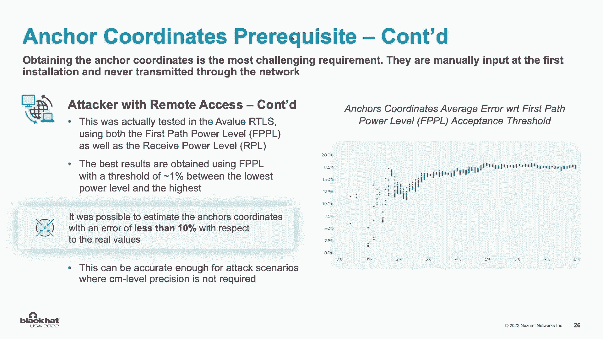

# P53：058 - UWB Real Time Locating Systems： How Secure Radio Communications May Fail i - 坤坤武特 - BV1WK41167dt

想象一下这个，你在制造厂，你站在一个危险的设备旁边，关机了，但感觉不到你就在附近，所以它突然重新启动，谈论糟糕的一天，实时定位系统，不只是用来在家里找到停着的车或丢失的物品，所以这项技术中的安全缺陷。

尤其是在工业环境中，可能是致命的，我是罗亚戈登，这是安德里亚·帕兰卡和卢卡·克雷莫纳，我们是娜奥米网络公司的研究小组成员，今天我们将介绍超宽带实时定位系统，以及看似安全的无线电通信在实践中是如何失败的。

这是我们第一次揭示这些零天，我们很高兴能在黑帽子的舞台上表演，好的，那么什么是超宽带，它和实时定位系统有什么关系，在剩下的谈话中，我们将使用术语UWB和RTLS。

所以超宽带是一种用于短距离快速传输信息的射频，和通过固体物体，对于RTLS来说是首选的，它主要用于室内，那里有很多屏障，一个真正的，时间定位系统是一种利用信号对静止和移动物体进行定位的技术。

如果你看一下屏幕上的图表，你会看到这项技术的三个主要组成部分，你有一个人或资产的标签，它将位置数据传送给锚，锚将数据提交给服务器，在那里它做所有的处理和计算，然后在截图中显示。

所以RTLS在几个行业中都有使用，它被用于智能建筑的门禁控制，它被用于智能零售的免提支付，我是说，用例是无穷无尽的，所以这项技术中的任何安全缺陷都可能非常普遍，所有的权利，那么我们做这件事的动机是什么。

所以在2020年，i的黎波里发布了更新的标准，提高无线网络通信的安全性，他们增加了密码学和随机数生成，防止威胁行为者窃听和使用其他操纵策略，UWB伟大，万无一失，我们都可以回家了，不完全是。

根据进一步研究，我们看到位置数据的同步和交换被认为超出了范围，按照标准，将确保这些通信安全的责任严格留给供应商，这可能会令人费解，挑战甚至有点吓人，进一步审查后。

我们看到在这个特定的主题上没有太多的研究，于是这项研究诞生了，话虽如此，我把它交给卢卡和安德里亚，进入范围和方法。

好的，所以在介绍的时候，我们看到ULTER与RTLS是如何广泛使用的，可以在许多情况下为各种用例部署的技术，在下面的幻灯片中，我们将在工业范围和技术范围方面看到我们的研究范围，所以对于我们的研究。

我们专注于两个不同的领域，医疗保健和工业，我们之所以选择从一边折，在过去的几年里，这些部门受到了越来越多的网络攻击的影响，对另一边来说很好，为了安全起见，这些部门使用超弯曲tls。

比如员工和毛绒和不耐烦的跟踪，然后用于接触者追踪，你知道在Covid的最后几年里，呃，我们需要一个能够提高警报的系统，当两个人靠得太近的时候，所以这个接触痕迹，然后是地理围栏，地理围栏。

可以看作是一套规则，可以管理限制进入区域的人的进入，所以一旦我们定义了工业范围，我们继续分析超，市面上有售的宽弯山雀，我们考虑一些方面，比如可用性，交货时间，成本特征。

最后我们选择了这两个带Ben Keas的，市场代表，第一个是用乐队在跟踪RTS中拯救你，WiFi套件，波段RTLS场景，有一个标签，它与部署在房间特定位置的一组锚通信，通过超宽带信号。

那些主播除了再次相互交流之外，如以太网或WiFi，到现在为止，安全研究专门集中在超带信号的分析上，这是第一次在互联网交流中进行分析的研究，或者WiFi，有许多算法可以在任何环境中定位资产。

澄清程序并理解攻击所必需的先决条件，值得做一个简单的基本面分析，由于种种原因，时钟通常不同步，钟，三个来自好时光，等，因此，同步模式是必要的，其中最常见的是Wala同步模式，所以周期性地。

参考锚发送被所有其他锚接收的自动高级信号，发送到ARLAS服务器的引用，它在同步PAC中传输它的瞬间，引用是胡贝尔服务它的例子，服务器使用这些信息来构建一个通用的时间概念，正如卢卡所料。

标记发出所有锚点接收的前进信号，这被发送到服务器，他们在里面收到的，好的，所以你可以在这张幻灯片的底部看到公式，但是不要害怕，他会给你主要的概念，然而，现在文献中有很多算法的同步，在这部作品中。

我们使用线性插值算法，简而言之，这是实现同步的一种简单而有效的方法，其思想是RTL在每次算法迭代时都是服务器，估计每个新的参考锚和参考锚之间的时钟偏差，这些转换后的时间戳被称为全球时间。

我们不能立即得出与环球时报的距离，因为我们缺少一个传输实例，标签不会将此信息发送到LAS服务器，我们能做的是将全球时间的差异与距离的差异联系起来，这就是为什么这个算法被称为到达时间差。

最后把所有的方程放在一起，这是最终的线性方程组可以得到标签的位置，从系统中可以看到，为了获得标签的位置，我们需要三条信息或锚的坐标，涉及同步时间戳和时间戳中的位置，好的。

所以在研究了TD算法的背景和理论之后，我们继续前进，用呃，逆向工程活动，为了理解锚点和服务器执行的DOA过程，为了能够解剖所有的流量，我们可以了解网络流量是如何处理的。

然后我们也对这个系统做了一些安全检查，这些灯显示了一个截图，同时分析救世主网络流量，大家可以看到，也是价值的，使用自定义的已知二进制网络协议进行锚和服务器之间的通信，找不到通用的数据结构，所以说。

为了能够解剖所有的交通，需要逆向工程活动，所以我们从源代码开始，您可以在RTLS服务器的左侧找到，为了救世主和本·克的价值，呃，我们能够通过分析源代码来完全剖析流量，然后我们把我们所有的活动都形式化了。

可从本届会议简报网页下载的这一部门，或者从我们公司的GitHub页面，关于从锚到服务器的通信，呃，我们主要关注了两个方面，数据的机密性和完整性，猜猜，数据机密性或完整性，所以为了数据保密。

你可以从右上角的图片中看到，所有的位置时间戳和同步时间戳都发送清楚，所以不能保证保密，为了一个保守的正直，银行都使用非安全完整性机制，比如说，假设你使用一个cc十六检查一些而一个值。

你可以从右下角的图片中看到。

好的，所以在上一节，我们能够得出结论，既没有保密性也没有完整性来保护这个城镇，然而，为了得到标签的位置，我们还需要锚的坐标，根据所做的测试，课程坐标是在第一次安装RTLS时手动输入的。

这对攻击者来说是最具挑战性的要求，我可以在估计攻击位置的最终能力上有所作为，或者不是，如果攻击者对该区域的点有物理访问权限。

这个问题可以用多种方法来解决，如果OR是可见的，它是微不足道的，如果锚不可见，我想我还能估计出他们的位置，例如，通过测量传输的无线信号的一个水平，是他们带着乐队WiFi，或者更确切地说，事实上。

根据所做的测试，锚点坐标不需要超级精确，为了得到攻击的位置，你可以在这张幻灯片上看到的这张照片，标签坐标的平均误差，而作为输入的非坐标箭头，从这个图表中可以看到，如果坐标的负值小于百分之一。

或者百分之十左右，这个位置将以小于20%的角度来估计，但在一个6乘4米的房间里，这大约是50厘米，这绝对足以执行一项任务，不需要厘米级精度的地方，然而，如果攻击者是远程的怎么办，事实上。

此信息从不通过网络传输，然而，远程攻击者可以应用一种技术，我们设计的，我们现在呈现在你面前，加上我在RAS服务器上的时间和费用，以及AutoWorld频带信号的功率级信息。

这允许服务器过滤掉使用此信息接收不良的通信，Atlus服务器计算两个不同的矩阵，第一部分动力杆，这是第一部分信号的功率电平，并且有一个功率级别，那是信号的总功率电平，不幸的是。

我们不能立即得到与功率级信息的距离，因为那些不够精确，事实上，它们过于依赖于特定时刻存在的环境条件，然而，如果在给定的时刻，来自所有锚的功率级信息几乎相同，发射的目标。

数字信号可以被认为与所有信号的距离完全相同，但如果这是真的，第一个等式为零，记住根据定义，参考角相对于自身的时钟偏斜为1，参考周期相对于自身的飞行时间为零。

攻击者现在可以有足够的信息来估计每个已知引用之间的所有飞行时间，Anko和参考的那个，因此有距离，好的，但有AIS仍然不够，我们需要坐标，在这种程度上，攻击者可以利用rtls的安装约束，事实上。

多亏了与之相关的妄想精度现象，供应商脚踝几何形状的位置误差，要求锚点以尽可能规则的形状展开，理想情况下，它必须是一个正方形，最多长方形，然而，因为我们知道距离，考虑到现在。

我们知道锚的地图将尽可能有规律，大多数时候矩形，通过在零点位置任意堆叠参考循环，所有其他锚的坐标都可以很容易地估计出来，因为它们将由两个最短的距离给出，和，当然啦，攻击者可以调整形状。

根据发现通信的银行家数量，这实际上是在TLS的值中测试的，通过监视一个移动的标签大约两个小时，值得注意的是，这张图表在这张幻灯片中被描述，关联锚点坐标的平均误差，同时承受第一级的验收门槛。

这只是意味着如果我们设置接受阈值，第一功率电平到百分之一，锚的坐标将用，负数不到10%，但是如果我们记得上一张图表，这转换为标签位置的错误，不到百分之二十，这就是它之前提到的50厘米。

但这意味着总的来说，一个完全远程的攻击者，可以对锚有一个估计，坐标，因此可以对标签位置进行估计，因此对系统的实际攻击数量。

哪些是税，我会看看，给大家解释一下，好的，所以之前的幻灯片，我们看到了如何获得标签位置，从从锚点发送到服务器的时间戳开始，在这张幻灯片中，我们将看到对手的战术，技术和程序，这是攻击者想要，呃。

对那些它的。

因此，对RTAN执行任何有意义的攻击，首先呢，他需要在使用的网络上站稳脚跟，至于来文，呃，在这个之间，锚和服务器，然后如果需要，他需要在中间进攻时处决一个人，为了把所有的口袋都拿出来，所以两者都救了你。

和一个值，UULE强盗允许以太网或WiFi访问网络后孔，在以太网的情况下，以便访问网络，攻击者要么需要危及网络中的计算机，或者添加一个我们缺乏的设备作为一个网络，这类攻击的复杂性取决于网络拓扑结构。

更准确地说，网络锚是如何在网络中部署的，比如说，如果锚点部署在多个子网络中，因为Aerit足以在一个子网上站稳脚跟，为了能够看到所有的交通，关于本·基思的WiFi，二便士，K作为网络通信安全的协议。

这一次，获得WiFi接入，攻击者需要知道vp到pk的密码，或者利用一些漏洞，如果有，在我们想要进行攻击的网络内部的网络设备中，至于第一点，呃，开箱即用，该解决方案提供了自定义密码和默认密码。

文件上公开的，它在互联网上，每个人都可以访问它，所以资产所有者，最终资产所有者，如果不打算改变，这是他Keith上的默认密码，对于攻击者来说，访问这个网络是微不足道的，1。我早已经告诉过你了。

作为第二步，攻击者可能需要在中间执行一个人的攻击，在这些幻灯片中，我们展示了我们的人在中间进攻时的输出，还有一个水鲨的截图，表明一旦中间的事件发起攻击，我们能够看到从锚到服务器的所有网络流量，反之亦然。

重要的是要注意，对于两个关键，我们意识到执行一次标准的AP攻击就足够了，能够在中间攻击时执行它们，而且，值得注意的是，这些攻击完全没有被RTS发现，没有可能提醒操作员的警告或异常行为，在中间发起攻击。

我们可以进入网络，然后我们就可以开始获取标签的位置了，第一张图片显示了标签在特定环境中的可能位置，然后我们需要拦截所有的流量，现在我们知道怎么做了，然后我们需要应用一个标准的到达时差算法，在文献中可用。

能够计算标签的位置，如第四张图片所示，在我们自己的应用程序或环境中，在这一点上，一个逻辑问题是，是否有可能执行主动流量操纵攻击，答案是肯定的，当然啦，做这个，攻击者需要执行两步过程，从第一步开始。

他需要执行一个目标，目标，担保和模仿，呃，这一步的目的是，监视标签在环境中的正常行为和正常移动，它是为了能够复制这种行为，所以一个可能的，嗯嗯一个可能的，监控系统无法检测到此标签的一些异常行为。

这一步的关键思想是离开交通，尽可能地，我们不感兴趣的标签需要直接到达目的地，需要改变和修改改变，时间戳处的有效载荷变化，然后呃，发送到此工作的目的地，对于我们的演示，我们利用NFQ。

这是一个灵活的用户空间，和，NFQ背后的关键思想，这样我们就可以一个一个地处理，所以现在我们什么都知道了，在真正能够发动攻击之前我们需要做的最后一件事就是，所以要做到这一点，你可以在这张幻灯片中注意到。

底部的四个图片是相同的，至于我们之前展示的被动空投攻击，但顺序相反，原因是在前一种情况下，我们从网络时间出发到达标签位置，在这种情况下，我们从某个类型的位置开始，就是我们需要的那个。

我们希望标记是或标记将出现在操作员面前，并获得使该标记处于该位置的时间戳，好的，所以这次我们选择一个特定的位置，比如第一张图片，我们向后应用TIA算法，这样我们就可以计算，我们可以得到时间戳。

我们需要标签的某个位置，我们需要重新计算所有的校验和。

重新应用校验和，所有的权利，演示时间到了，所以说，我们要演示，攻击者如何利用我们发现的漏洞。

在三种攻击场景中，所以我们的第一个场景是定位和瞄准资产中的人，我们展示了线程参与者如何窃听网络流量，为了，嗯，定位和锁定资产，他们为什么要这么做，他们可能想跟踪某人，他们可能想找到并偷走一些东西。

或者他们只是想了解环境。

让我们来看看，这是我们第一个视频中戴着标签的受害者，所以我们首先要看看标签跟踪是如何正常工作的。

安德里亚工作了一整天，坐在办公桌前，他想伸伸腿，所以他在办公室里散步，瑞士美好的一天，因为他戴着标签，RTLS服务器显示他的移动，正如你所看到的，一切都很准确，一切正常。

现在，让我们看看线程演员如何操作这个，偷听，窃听网络流量。

它显示没有填充位置数据，因此右边的红点。

它不动，但一旦中间的人发起攻击，所有的位置数据都被加载，现在我们开始看到红点在移动，所以这是攻击者能够看到的，现在，让我们将其与实际的rtls服务器进行比较。

所以在右边你有攻击者的视图，它与实际的RTLS视图相同，这件事最令人担忧的是什么，甚至没有对这种妥协产生警报，这就是窃听rtls服务器的样子。

所以在我们的第二次攻击场景中，我们展示了线程参与者如何操作RTLS服务器，嗯，那是用来追踪接触者的，就像在Covid十九，为此目的，你知道没有人有Covid，但是为了演示的目的，有人有Covid。

这样我们就可以展示假装接触是什么样子的，或者与患有Covid-19的人接触，但看起来你没有联系，别担心。

我们将在演示中解释它，好的，我们在演示中看到两个受害者戴着标签，现在我们将向您展示接触追踪是如何正常工作的。

好的，他们都戴着标签，你看，他们互相接触，并生成警报显示发生了Covid遭遇。

所以让我们看看一个威胁演员如何操纵这个来伪造，联系人。

安德里亚刚刚从卢卡身边走过，不高，没有什么都没有，现在当攻击者发起攻击时，说明他们，事实上是互相接触的。

这是不准确的，然后产生警报显示有人再次接触到Covid。

现在不太准确。

让我们看看攻击者如何操纵它来假装回避。

安德里亚今天感觉更合群了，现在当攻击开始时，威胁行为者能够操纵位置，以表明他们甚至没有接触过对方，正因为如此，没有警报表明有人接触了Covid。

我们知道这有多大的破坏性，所以我们最后一个也是最后一个演示是地理围栏，所以我们在实验室的生产线演示中配置了一个滑板系统，收听RTLS，地理围栏警报以两种方式控制电机启动或停止。

取决于工人是在地理围栏区内部还是外部，让我们来看看这是什么样子。

在这个演示中，我们的受害者戴着标签，这是我们实验室的生产线演示，它显示了马达旋转烧瓶，然后有一台机器在扫描条形码，下面是安全地理围栏正常工作的方式。

所以你让工人接近生产线，一切都关闭了，因为他在地理围栏区，然而，当他离开时，生产恢复正常，因为他在安全区之外，您可以在这里的RTL服务器中看到它，标签在地理围栏区域内，生成警报以关闭生产。

然后当那个区域以外的工人，现在又产生了一个恢复生产线的警报。

让我们看看线程演员如何操作它来停止生产。

大家可以看到，生产线周围没有人，突然之间，停止生产有警报，让我们看看攻击者是怎么做到的，所以他们发动了攻击，他们操纵了一个标签，把它放在地理围栏区，因此它发出了警报并关闭了生产。

但正如你所看到的，生产线周围没有人，现在一切都很安全，让我们看看威胁演员是如何做到这一点来重新启动生产线的。

附近有工人，好的，所以我们有我们的工人在生产线上，警示灯亮起，一切都停止如常，但当攻击发起时，线程参与者能够操作该标记。

把它带出地理围栏区，正因为如此，生产现在重新开始，使工人处于危险之中，想象一下这发生在一个制造厂，以及它可能对工人造成的伤害，我们的演示就结束了。

谢谢。好的，所以在展示了攻击者可以对这个系统做什么之后，不值一提，Acacetona可以应用哪些可能的缓解措施，第一个，逻辑缓解是将RTL移动到隔离的网络中。

并确保它在物理和逻辑上的成功，这不是一些Marlas供应商规定的，这种解决方案的优点是部署相对较快，基本上可以使用非常传统的网络安全解决方案来实施，然而，有些挑战需要首先考虑，服务器通常有两个网络接口。

当我连接到主干网时，连接到管理网络，运营商从中连接，如果正方形网络，也是默认的，默认情况下，大多数rtlls服务倾向于在所有接口上公开坐标安全服务，为了简单起见，因此。

如果这些服务没有从管理网络中充分过滤，这可能是一般服务攻击的空间，攻击者将无法实施，我们到目前为止展示的攻击，因为它缺少重要的信息，然而，您实际上可能能够阻止该位置的更新，从而篡改乔，我们只是确定。

另外，如果攻击者设法物理触摸电线或危及，而此时的密码，没有什么能阻止他们成功实施目前显示的所有攻击，第二个缓解措施是增加入侵检测系统，到扣网，事实上，就像攻击注定要做一个中间的人一样。

逐点攻击以获取签名，例如节点之间的新链接，优点是部署非常快，几乎是即插即用，然而再一次，它天生容易受到中间的身体男人的攻击，事实上，即使是最坏的情况，主动流量操纵攻击。

精心制作的通信量将与合法通信量无法区分，如果它精确地模仿目标的自然运动，归根结底，主要问题是缺乏运输保护措施，因此，我可以应用的最有效的缓解措施，就是添加一个加密和完整性层。

在现有通信的基础上作为概念证明，目标是使用已经众所周知的工具，我们适应了在TL值的基础上添加SSH隧道，你可以从这张幻灯片上看到，P系列成功了，我们能够加密所有的流量，同时保留rtlas函数项，然而。

也需要考虑一些挑战，嘘隧道啊，增加了锚的载荷，最后明显的延迟，我们能够抵消这种影响，通过降低同步频率，但这也降低了精度，这对我们来说可能是个问题，一个实时精确的标签位置，另外，整个缓解取决于。

直接服务器或乐队的锚，如果其中一个不允许管理员访问和操作，解决方案要么需要大量的胶卷工作，要么需要修改，或者根本不可行。

话虽如此，我将把结论留给罗亚尔，对呀，我们拆了很多东西，所以让我们快速回顾一下。

安全标准并不涵盖一切，但是随着RTLS的广泛应用，我们不能有那些漏洞和标准，我们在两个流行的，Uwb rts's，它们用于人员跟踪，地理围栏和接触追踪。

我们甚至演示了一个威胁演员如何在中间发动一个人的攻击，窃听或做其他操纵策略，我们现在也提供了一些缓解措施，如果你不记得这次演示中的其他事情，我们希望你带着这三件事离开，第一名。

关键软件中薄弱的安全需求会导致不可忽视的安全问题，安全关键软件应该有明确定义的安全标准，第二阶段，外面有没有人看到的攻击面，但如果受到损害，它们会产生重大后果，所以当大家都在关注锚和标签之间的交流时。

没有人关注锚和服务器之间的通信，所以重要的是要看整个税收表面，而不仅仅是专注于一个部分，同时忽略其他，最后利用UWB中的辅助通信，RTLS可能很有挑战性，但在这次谈话之前，这是可行的。

这些攻击场景被认为不太可能，但显然在这个演示文稿中，我们表明，即使它确实需要特定的知识，它是可以做到的，以及它最终可能造成的毁灭性影响，没有安全就没有安全，我们希望这次演讲不仅让您意识到安全缺陷。

但激励你作为研究人员。

继续发现这些漏洞以保护个人，商业与世界，甚至可能有点吓人，但这是可以做到的。

