# 【转载】Black Hat USA 2022 会议视频 - P54：059 - Trust Dies in Darkness： Shedding Light on Samsung's TrustZone Keymaster De - 坤坤武特 - BV1WK41167dt

现在我很荣幸地欢迎阿兰舍夫斯基上台，你能在黑暗中做密码学吗，是受信任的。

是我们每天使用的值得信赖的外表真的值得信赖丁，今天我们将分享我们的研究之旅，我们将看到三星到底没有做到什么，但此外，我们将看看这个行业应该如何改变，当你开始研究的时候，你永远不知道你会得到什么。

有时你会问我们找到有意义的东西的几率有多大，一方面，我们有领先的安卓供应商，三星拥有联邦安全认证和大量资源，在另一端，我们有一个兼职研究生和两个了不起的顾问在一个缩放会议上。

如果大学研究人员能找到有意义的东西，那么资金充足的组织可以做得更多，如果有什么东西失败了，比其他安全性较低的供应商，使用较少的安全资源可能会做得更糟，我们发现了两个高。

影响超过1亿台设备的大规模严重性CVS，和，允许完全恢复加密密钥，被可信的亡命之徒加密的，帮助您了解我们的研究，我们从你为什么要关心开始，我们发现的，主要的教训是什么，这是你的电话，你用它。

你每天都用它来保证各种安全，关键任务，你用谷歌支付之类的服务支付，你用它来管理你的大部分数字生活，这使它成为攻击者的主要目标，最近几年我们看到了许多公开攻击完全破坏了操作系统，比如说。

参见谷歌恶意软件安全团队今天的黑色谈话，但我们仍然需要保护应用程序的加密密钥，这样攻击者就无法从您的银行账户转账，或者登录你的贝宝或推特账户，因为这个原因。

现代Android设备使用Unrust on安全扩展来提供可信的执行，它运行一个单独的执行环境，在操作系统上隔离，在操作系统和可信应用程序上有许多不同的信任，事实上，三星设备使用三种不同的操作系统。

高通QC，肾，拉奥尼的蜜蜂，和三星自己的学位，这些供应商对黑匣子的设计保密，使验证其安全性变得更加困难，在这项研究中，我们选择三星作为测试用例，我们对密钥管理员的密码设计进行了逆向工程。

我们对其他受保护的加密密钥的安全性感兴趣，以及与受信任方的高级协议的关系，我们可以看到。

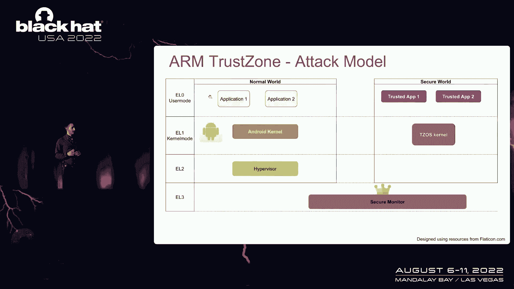

电车提供了两个词的逻辑分离，普通模式，它运行安卓系统，和安全板，它运行受信任的，os，我们遵循Android平台安全模型，它规定钥匙的室外保护应该经受住完全妥协的，正常模式，但事实上，为了我们的攻击。

我们只需要在Android用户模式下有一个足够强大的上下文，与俄罗斯司机交流，最后我们有了谷歌设计的Android Quito，它提供加密密钥管理应用程序可以请求密钥生成。

和信任区域中可信应用程序的密钥主，将生成密钥不安全的硬件，在恢复到正常模式之前，它将用硬件派生的密钥对其进行加密，密钥可以存储在磁盘上，全部用于车站的钥匙，以证明钥匙确实是在安全硬件中生成的。

它们也可用于密码操作，例如加密的标志，重要的一点是，平面键材料应该只能由键控员访问，千万不要让桁架开着，钥匙主人保护关键材料，并且它应该是唯一具有普通tex密钥访问权限的实体，但这个假设能保证吗。

在这个简单的介绍之后，让我们深入研究我们的安全分析，在我们开始之前，请注意大多数细节都被简化了，更多信息，请看扩展的文件，你是怎么开始的，你从哪里开始，您可以下载固件并提取受信任的应用程序。

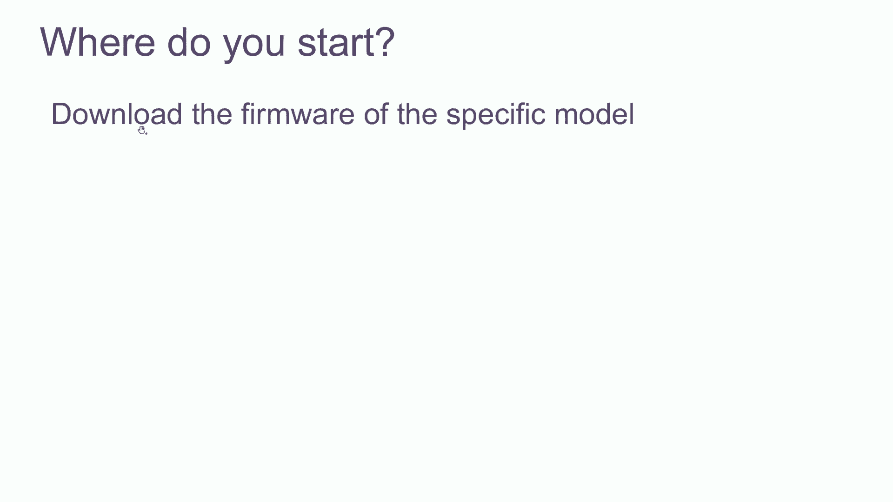

引导加载器，和受信任操作系统的内核，您可以阅读少量可用的公共文档，并使用安全认证和开放源码存档，但对于我们的大部分研究来说，我们花了很多时间对吉塔进行逆向工程，制作了几十部电影，可信操作系统。

你如何与钥匙主人互动，通常应用程序使用绑定器API与水晶服务通信，它使用主API与信任进行通信，在执行SMC或安全监视器的驱动程序上，调用将执行切换到安全监视器，安全监视器将请求转发到受信任的操作系统。

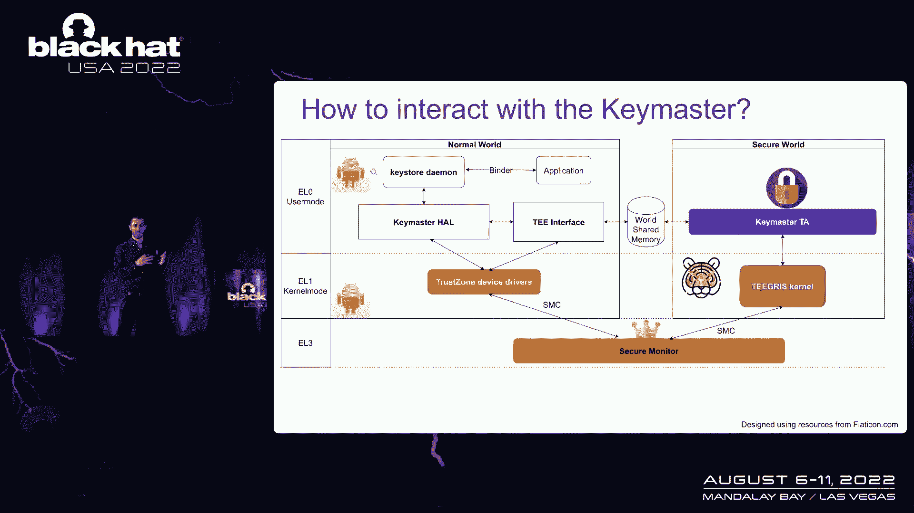

比如说，拿着这个，最终到达关键集合，我们发布了一个名为Keybuster的开源工具，允许在没有任何输入的情况下直接与Keymaster通信，通过Keymaster API进行过滤或验证。

我们用它来重现我们的概念攻击证明，现在，正如你所记得的，密钥主人通过加密来保护密钥材料，经过广泛的逆向工程，我们看到三星选择使用带有加密密钥的GCM，从硬件密钥派生的，使用键导数函数的k。

这是一个非常脆弱的建筑，没有抵抗力，这很容易受到IVReuse的影响，两个有趣的问题是加密密钥是如何派生的，现在是被选中的iv，我们看到，在密钥推导中使用的唯一参数是要消化的镜头，下列值的。

在第一个变体中有一些变化，结果是一个常量字符串，然后是铲球控制，应用程序ID和应用程序数据，在星系九的第二个变体中，它们还绑定了状态的引导，这对我们的讨论是不变的，只有在星系十的最后一个变体中。

和较新的设备，参孙得到了16字节的随机性，每次都更改派生键，关于为什么某物有三种不同的变化，一个可能的解释是，它需要引导器状态绑定，比如说，所以我们看到客户可以控制盐，这意味着我们可以重用密钥。

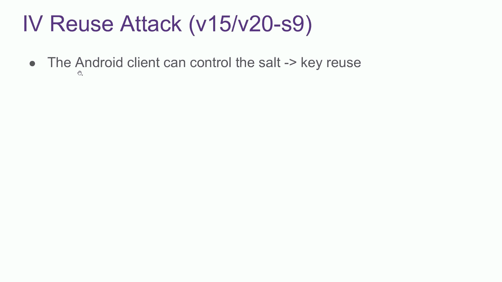

令我们惊讶的是，我们发现客户端还可以设置加密iv，所以我们也有iv reu，ag，CM是内部使用计数器模式的流密码。

加密iv并用纯文本求解，这将导致以下Ivreuse攻击，给出了一个我们希望恢复的关键斑点A，我们可以提取静脉注射，使用相同的静脉注射，所以我们可以用Keystone API导入一个已知的密钥B。

我们得到了一个加密的斑点，现在我们只是一个，用B的密文得到平原的XOR，然后我们看到B的非平面范围，我们完全回收了一个，这是相当令人兴奋的，一个微不足道的观察是，一旦我们恢复了关键材料。

我们可以绕过任何钥匙，任何限制，如受保护确认或生物识别提示，我们可以简单地将这笔钱转移到那个账户上，而不需要受信任的UI接管，未经用户同意，但这只适用于Galaxy的九号和类似的设备。

而不是在最新的十个和神经设备上，因为盐变了，派生键每次都会改变，令我们惊讶的是，我们还发现客户端可以设置加密版本，使用隐藏的API，因此，攻击者可以将所有新的hiloes降级为易受攻击的加密版本。

然后使用我们刚才看到的ivreattack完全恢复任何键块B，这会影响远程受信任方采取的更高级别的协议吗，例如，FIDO Web身份验证的突出之处，它使用公钥密码学来认证网站，而不是密码。

Web身份验证使用称为平台身份验证器的内部安全元素，生成和使用身份验证密钥，通常这是一个外部安全密钥，如Yubikey，但我们口袋里已经有了安全，所以我们可以使用基于Android的Keymaster。

重要的一点是，攻击者应无法恢复身份验证密钥，并且不应该能够克隆平台身份验证器，这样你的网飞，当用户想要注册时，Web身份验证有两个主要阶段，该设备使用键控器生成KEL，TRU中的可信应用程序。

并在车站使用钥匙来证明钥匙真的是在安全的地方生成的，如果证书有效，服务器用公钥注册用户，然后当用户要登录时，服务器发出了一个独特的挑战，并在获得新用户同意后，设备使用安全硬件中的私钥签署挑战。

如果签名有效，用户使用Gala税登录，我们可以降低任何关键高球，用IVUS攻击恢复它，然后我们可以克隆平台身份验证器，因为我们可以用私钥签署任何挑战。

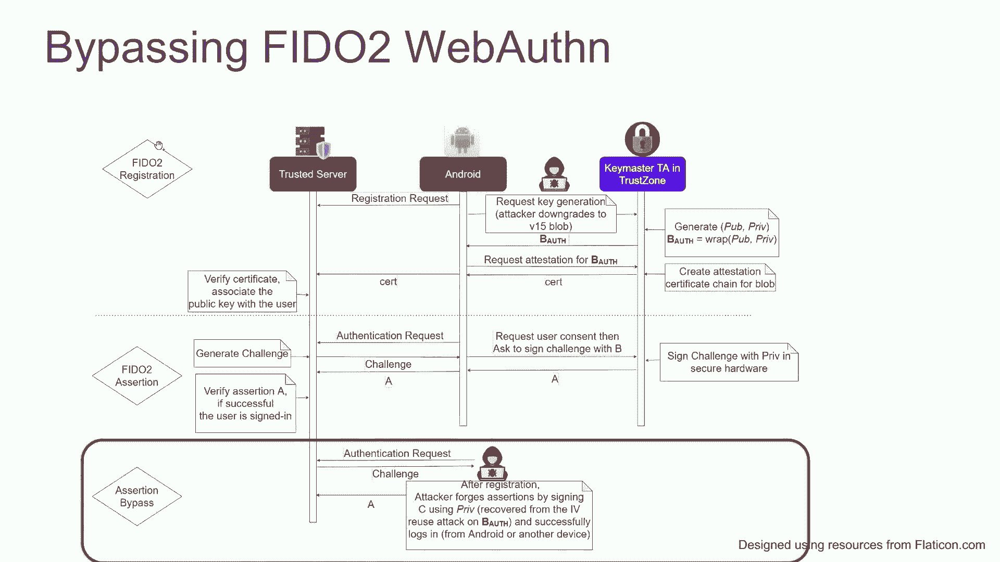

在我们的银河十号演示中，我们使用GDB来实现降级攻击，然后让巴士在那里实施IVUS攻击。

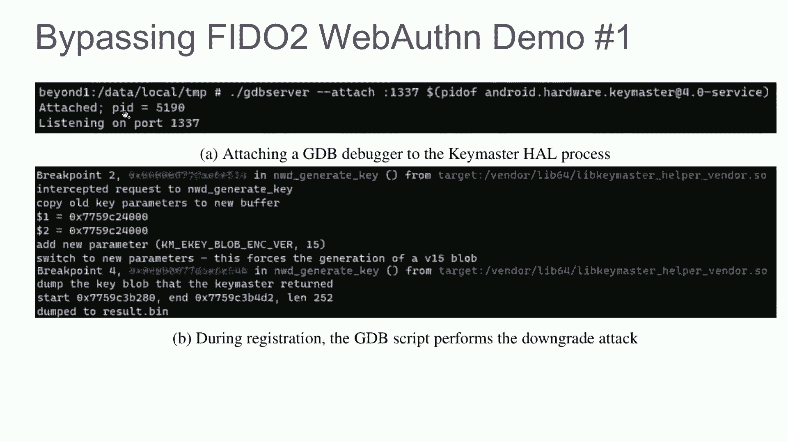

我们用喂食器，服务器和示例应用程序的强关键领域，没有任何修改，注册后，我们恢复了私钥，并根据认证证书对其进行了验证，并完成我们的演示，我们使用完全不使用信任的不同应用程序，并简单地使用恢复的密钥。

我们设法通过Internet成功地对强密钥的远程服务器进行了身份验证，总体，我们看到攻击者可以恢复加密密钥，用它们来偷你的钱或盗用你的身份，我们在去年五月向三星报告了我们的发现。

关于Iberus攻击的披露非常简单，八月，他们修补了Galaxy的九号和类似的设备，分配高严重度简历，并从API中删除设置iv的选项，这是伟大的，但生活没那么简单，六月，三星拒绝降级攻击。

说不可能创建降级的密钥块，我们在银河二十号和二十一号上发现了同样的攻击，并将降级攻击作为单独问题报告，但后来三星他们说他们认为没有，无实际安全影响，这让我们有点难过，我们几乎放弃了，但在最后的尝试中。

我们把我们的论文，这让我们感觉很棒，他们分配了I严重性CV，修补了所有相关设备，并完全删除了遗留的密钥LOB实现，也许这个故事的模式就是永不放弃。

重要的是，值得注意的是，我们的大部分研究都涉及非常耗时的逆向工程，在我们的研究发表后的两周内，失误吸盘小组泄露了三星的整个源代码，我们想如果那些，如果此代码是开放源码的，那么这些问题几年前就已经发现了。

希望在到达生产设备之前，如果没有，它仍然会使我们的研究更容易，更快地完成。

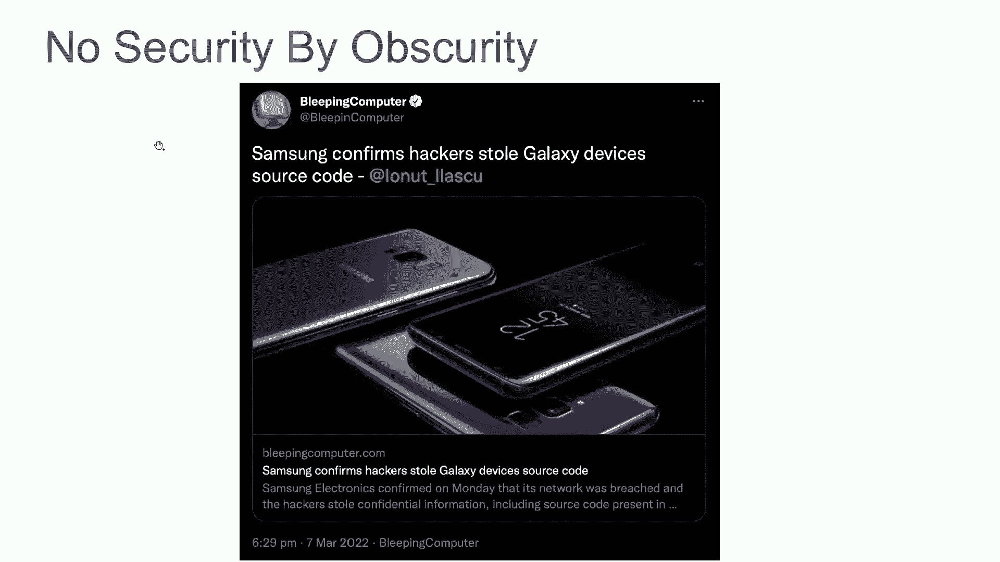

十多年前，我们也看到了针对现实世界系统的类似攻击，也许人们真的不了解常春藤。

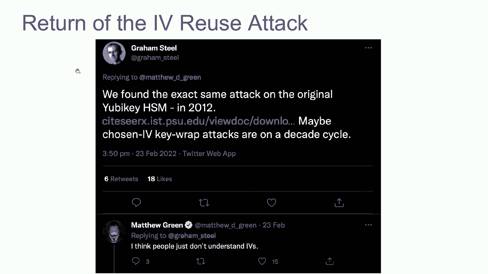

最后让我们看看我们能从中学到什么，这两个问题的根本原因都是API的滥用，客户端不应该能够设置加密iv，或者加密版本，也是钥匙主人，它是一个安全关键的应用程序，而是，Ibin GCM应该是唯一的。

您可以使用抗任务身份验证加密，比如au cmsav，都使用抵抗密码库，如TIN，您还应始终使用最新的加密版本，如果可能的话，更大的问题是与更高级别的协议的兼容性，在Web身份验证等协议中。

远程可信方在站点上使用密钥，以证明身份验证密钥确实是在安全的Al中生成的，但正如我们刚刚看到的三星设备，安全硬件可能有缺陷，并且可以提取密码密钥，但是fido服务器没有办法知道也没有办法访问它。

可以设置策略以拒绝来自此类设备的证书，事实上，只要我们在生态系统中有供应商特定的黑盒设计，3。要证明这篇作文的正确性是不可能的，我们希望我们的工作将鼓励使用公开声明。

谷歌为Keymaster子系统设计的开放标准，我们的研究发表一个月后的附带说明，谷歌宣布改变他们在车站的A密钥协议，使不向未受损设备提供证书成为可能，这可能是朝着正确方向迈出的一步。

我们看到了出现的危险陷阱，当密码设计保密时，我们提倡使用开放启动设计，以防止此类问题，正如我们刚才所想，我们认为默默无闻没有安全感，并且不应该依赖逆向工程的难度，专有系统。

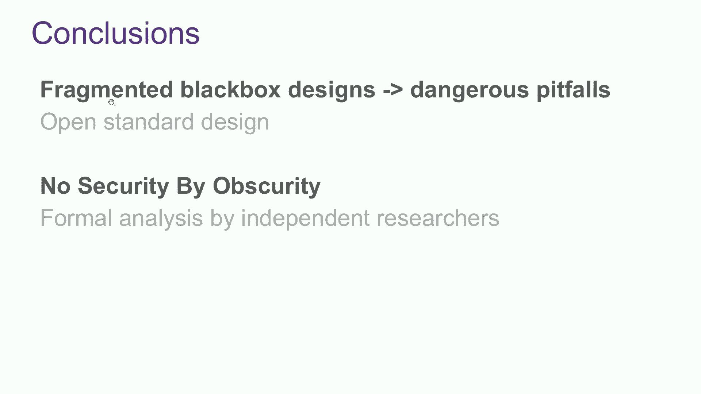

最后是设计选择，易碎品作为GCM的设计选择，用于身份验证密钥加密，在现实世界的系统中进行了太多年的IVRuse之后，值得讨论，我想我想让你今天记住两件事，在公开的情况下进行密码学，并确保它是抗误码的。

否则你可能会遭遇灾难性的失败，谢谢你抽出时间，有什么问题尽管问我。

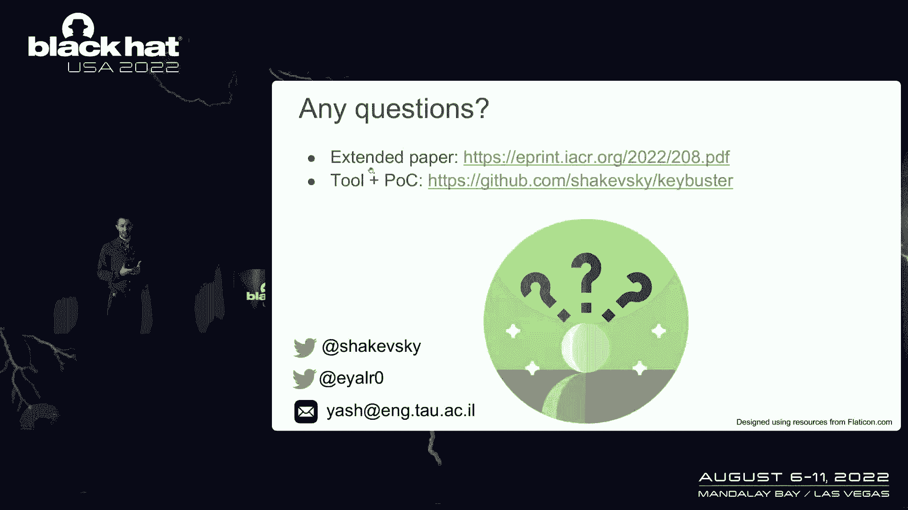

并加入所有人的更多问题，谢谢。非常感谢你精彩的演讲，我们将在这里讨论问题和答案，目前我们在虚拟聊天中没有任何问题，但请随意扔一些进去，如果我们的观众有什么问题，请随意，请站起来。

我们会给你一个麦克风向主持人提问，我们看到你在那里，我们要给你一个麦克风在这里，谢谢。我只想问你手术是什么样的，你能详细谈谈，如何进行逆向工程以在密钥母版中找到此流，你提到了一点。

就像你从公众那里提取一些东西，从你发现的器皿中，但你能给它更多的启示吗，耶又来了，你想让我解释，你如何开始研究，以及如何探索密钥管理，这是个问题吗，只是一个高级的细节，就像。

需要什么样的分析才能找到这个定律，这是很多手工逆向工程和很多像三角洲的工作，是啊，是啊，那是耶，不容易解决，太好了，非常感谢，观众还有什么问题吗，我没有看到任何这样的，哦，我们确实有一位先生在角落里。

呃，你好，谢谢你的精彩演讲，呃，呃，静脉注射是由人工智能设置的解锁，可能是为了调试目的，我们还没有一个明确的答案，但也许他们想要确定性测试，他们希望能够加密并获得相同的，和密文，所以他们用同样的iv。

但这不是正确的道路，谢谢。是啊，是啊，看起来我们还有一个问题，你好，精彩的演讲，嗯，关于开源密码库的问题，职能，新的做事方式，类似于NIST所做的，当有新的加密建议、类型或解决方案时。

或者你想的更像我们对开源软件所做的，在那里向世界开放，你想怎么接受，哦，是啊，是啊，我觉得，嗯，你想两者兼得，如果有一个新的协议被建议，就像谷歌建议的那样，现在，对于一个，呃，用于认证的供应密钥，2。

我们认为有必要向公众说明这一点，并应开放供评论，并吸收安全界的其他人，其他来自学术界，做这个过程，就像这样，但不一定，并需要由政府实体，这样做完之后，任何和密码实现，我认为应该尽可能地开源。

所以每个人都可以查看代码，看到实际的实现也是安全的，所以我想有，呃，两个选项，呃，基本上，所以有一点回声，所以我只想遵循他的观点，应该有学术界和工业界之间的合作。

就像TLS和任何密码学家的标准标准化一样，如果他们看到代码，他们会立即告诉你有一个问题，是的，您应该使密码代码尽可能开源，因为安全性应该在于设计，而不是在它隐藏的地方，就像默默无闻的，默默无闻于事无补。

在这种情况下，谢谢。观众还有什么问题吗，我们看到你在那边，先生，我们给你拿麦克风，我也想称赞你出色的演讲，嗯，一开始你说这是一个完全认证的设计，从菲普斯那里搜索，我想欧洲人也是，那么你的信息是什么。

你知道他们是如何根据你的经验认证这样的设计的，或者至少确保喜欢，也许那些问题，比如不同变体的碎片，因为它还没修好，但它是MDFTP，联邦保护概况，但重要的是要知道有专业的安全实验室。

我想他们有所谓的通道，他们确实喜欢详细的安全分析，他们还公布了一些安全证书，但这仍然不足以找到一个非常琐碎的问题，所以也许他们需要，他们需要重新考虑并思考下一步是什么，如果我能添加到这个。

然后我们有多个例子，如果您接受OpenSSL代码，其中有经过认证的固定版本，您仍在此代码中发现bug和漏洞，一次又一次，但这是因为开放必然是开源的，任何研究人员和任何人都可以下载代码，而从来不看它。

所以我觉得试图有一个认证要求的基线，可能是个好主意，但这不足以确保软件的安全，我们需要很多人看着，呃，在这种类型的代码中，并得到这是认证，这可能是好的，但它不能取代整个研究社区，试图看看，好的。

我只有一个小问题，所以这对大项目很有意义，对数以百万计的用户产生影响，让它开源和研究，较小的项目怎么样，我刚查阅了AES GCM网站，它没有说任何关于维基百科页面的事情，它没有提到关于iv的任何事情。

重播攻击与IV的弱点，那么你推荐什么资源，对于那些不让研究人员查看他们代码的人来说。

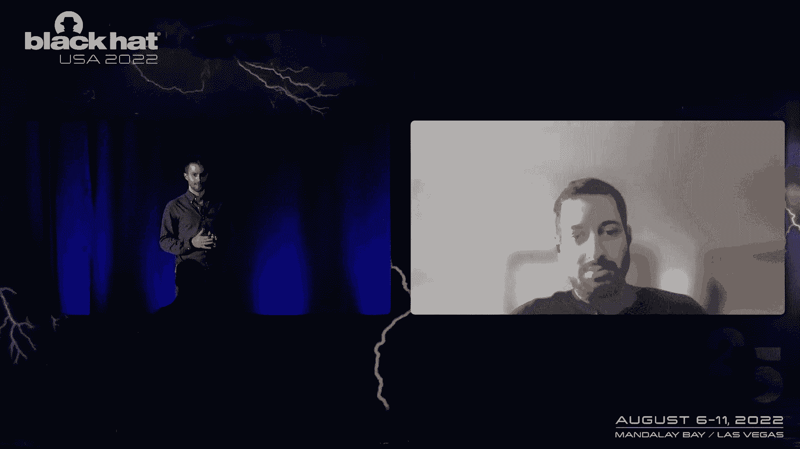

因为我们的项目可能会被一百个商业方面的人看到，我们仍然需要确保我们的东西在密码学上是安全的，你会推荐什么样的资源，我建议使用，类似于抗任务密码库的东西，比如谷歌的Tink或其他真正帮助你喜欢的库。

即使你没有必要的密码学背景，就像，仍然让它工作，是的，是的，这一点很重要，因为密码学工程要求非常温和和精确，至少知道你在用什么，了解安全假设，因为在gcn，安全假设是IV是唯一的。

你应该尽量避免Miye，太好了，谢谢，那是我们的时间，我想感谢这里的主持人，从中得到了一些很好的信息，如果有其他问题，请随时和走廊里的一个说话，谢谢你来黑帽，感谢我们的主持人。

