# 【转载】Black Hat USA 2022 会议视频 - P57：064 - Browser-Powered Desync Attacks： A New Frontier in HTTP Request Smuggling - 坤坤武特 - BV1WK41167dt

早上好，欢迎来到浏览器电源，体面攻击，你有没有想过，然后就把它驳回了，因为三年前这是不可能的，我想这不是很酷吗，如果你能让浏览器发起Desync攻击，这将使一些真正有趣的可能性。

但我想任何Web服务器都不可能做一些事情，愚蠢到让这成为可能，今年我发现我完全错了，你可以实现各种有趣的事情。

在这节课中，我将向你展示许多发现，通往它的旅程风很大，它是在二十世纪末开始的，当有大量走私假阳性的请求时，甚至导致Nginx的简历不正确，我看了一下这一切的根本原因是什么，并宣布有一个简单的解决方案。

你所要做的就是永远不要重用，http：//www。unfccc。int，在查找请求走私时，在那之后一切都很美好，直到去年我意识到连接被锁定，请求走私是一件事。

找到这一点的唯一方法是始终重用htp one连接，所以在这一点上，我们今年有点混乱，我着手解决这个问题，经过相当大的努力，我最终发现，通过放慢速度并密切关注事件的确切顺序，我可以重用连接。

仍然可以区分真正的漏洞和假阳性，那很好，但有时当你特别关注一些事情时你会发现比你想象的要多，在一个网站上，我注意到有些事情不太对劲，我拉上那根线，我的发现打破了我请求走私的心智模式。

因为由此产生的攻击不需要攻击者，这意味着它甚至不需要前端服务器，这打开了一个全新的攻击面前沿，所以今天我在这里和大家分享，我为导航而构建的方法和工具包，用Apache上的功绩展示了这个新世界。

Akamai，我清漆，亚马逊，首先我们要热身一下高压处理异常，之后，我将分享客户端Desync方法，利用四个深入的案例研究，然后我将介绍基于暂停的desync，包括现场演示，因为攻击太酷太不可靠了。

我无法抗拒，在那之后，我会谈谈防守关键的要点，以五分钟的问题结束，这个演示中有很多技巧，我真的希望他们为你工作，所以作为其中的一部分，每当你在幻灯片上看到这个弯曲的标志。

这意味着我的团队已经构建了此漏洞的在线副本，所以你可以在真正的系统上练习这种技术，免费在线，我还发布了支持这个演示文稿中每一个发现的代码，每当有一个指定的目标，你会在白皮书上找到利用代码的充分证明。

即使我没有设法把它挤到幻灯片上。

我们将从一系列六个深奥的漏洞开始，这直接导致了客户端Desync攻击的发现，它们本身也很有价值，但首先我要告诉你一件事，请求是谎言，http请求是一个非常有用的抽象，但在http one中。

这种抽象非常弱，你越努力坚持请求的概念，这些技术就越没有意义，所以说，在任何时候，只要记住，我们真正要做的就是向服务器发送字节流，以及服务器用什么做什么，这取决于它。

比如说，如果你相信请求，很容易忘记http连接，大部分时间都在使用，因为http应该是无状态的，但有时国家只是想办法溜进来，拿这个网站来说，我发现他们有一个反向代理，它是为了让我访问网站而设置的。

旨在公开的，不让我访问他们内部网络上的私人网站，它只验证每个连接上第一个请求的主机头，因此，通过发送合法的请求，然后我请求访问内部系统，我现在可以进入内部系统了，幸运的是，这个特殊的bug类非常罕见。

但有一个更常见的变异，我称之为第一请求路由，这是当前端查看第一个请求时，以确定将其路由到哪里，然后在同一连接上传递所有后续请求，直接穿过同一个后端，这种行为本身并不是一个真正的漏洞。

但您可以使用它使用任意主机头攻击任何后端，所以它可以成为利用链的一部分，在本例中，这里，我想用一个有毒的密码重置电子邮件头击中后端，生成有毒电子邮件，但如果我试着直接这么做，它不工作。

因为前端不会把它路由到右后端，但再一次，只要在我的攻击之前加上一个真诚的请求，具有正确的主机标头，我可以击中后端，生成中毒密码重置电子邮件，并希望劫持某人的帐户，所以希望这项技术能对你有用。

但也有一个更广泛的外卖，有时剥离这些抽象是很好的，因为它们可以隐藏行为，那真的很重要，你知道请求走私的交易对吧，你让前端和后端在消息的长度上意见不一，你用那个，将橙色显示的恶意前缀应用于受害者的请求。

这让受害者发生了不好的事情，并使这种长度的分歧发生，您通常会混淆传输编码头，对两个服务器中的一个隐藏它，所以我有点困惑，当我发现你可以在相当多的网站上引发非常可疑的行为时。

使用AWS的应用程序负载均衡器，使用此hdb two请求，如果你看这个请求，你可能想知道攻击在哪里，因为这是合法的要求，它符合规范，这里面没有混淆，这里真的没有什么粗略的事情发生，然而。

这引发了一些非常可疑的行为，在做了一系列调查后，我发现亚马逊在做的是，他们把这个请求降级到http one，当他们这样做的时候，出于某种原因，他们添加了一个标题，说这条消息现在被分块了。

我真的不知道他们为什么要那样做，但我最好的猜测是，这是因为浏览器总是发送一个内容长度标头，即使他们在使用http 2，尽管这有点毫无意义，当你用H2的时候，所以亚马逊最终用一些逻辑说得很好。

如果请求没有内容长度标头，我猜它一定是块状的，用那个，只需稍微改变我发送的有效载荷，我可以在一大堆网站上触发一个可利用的Desync，我向亚马逊报告了这件事，他们很快就修好了。

最重要的是这教会了我一些非常重要的东西，这是为了请求走私，你不总是需要标题，混淆或歧义，你只需要一个出其不意的服务器，我们稍后再讨论这个问题，现在让我们仔细看看连接锁定的HP。

前面提到的一个请求走私问题，以确认正常的请求走私，你所需要做的就是发送两个请求，并确认第一个请求的正文影响对第二个请求的响应，如图所示，这很好，前提是，您通过不同的连接发送这两个请求。

如果您通过相同的连接发送它们，你有麻烦了，所以这里我们发送和接收完全相同的字节。

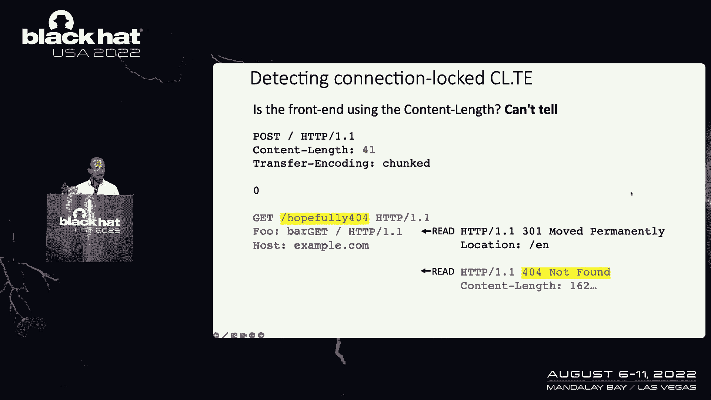

但我们再也无法判断前端认为信息在哪里结束，因此，我们无法判断这个系统是否真的脆弱，解决这个问题的方法是认识到你得到的字节，不是你唯一能得到的信息吗，你也有时间信息，如果前端认为这个初始消息被分块。

这意味着在我们发送橙色有效载荷之前，它实际上已经开始产生响应了，所以在设置橙色数据之前，您可以暂停并在套接字上读取，看看服务器是否回复了您的请求，如果你这样做了，它告诉您前端将此消息视为分块的。

它没有使用内容长度，因此你可以放弃攻击，因为这无论如何都是假阳性，同时，如果您的读取尝试挂起几秒钟，这表明服务器认为消息还没有完成，因此必须在内容长度中使用，只要剩下的攻击成功一定很脆弱。

所以我自动化了这个技术，它确实起作用了，我用它扫描了一下，发现了一堆系统，包括一个有点好笑的，因为他们在IIS前使用梭子鱼的Web应用程序防火墙，由于Web应用程序防火墙，它们很脆弱，更重要的是。

Barracuda实际上已经为这个漏洞发布了补丁，但他们没有将其标记为安全修复，他们只是说这是一个有点强硬的措施，因此，客户没有像往常一样费心安装它。

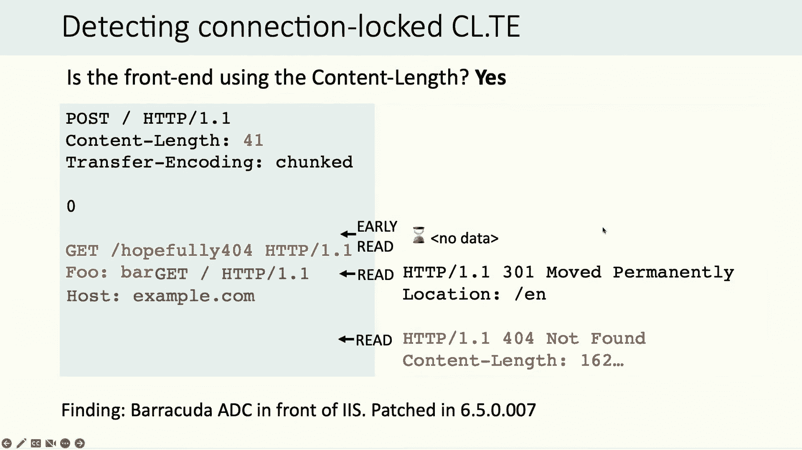

虽然，该技术发现的最好的同步是最初最没有意义的，经过广泛的测试和完善，它看起来是这样的，现在有两件事要解开首先，大家可以看到，后端服务器完全忽略此消息的内容长度。

这意味着这是你可以称之为CL零Desync的东西，这是一种罕见的攻击类，没有被任何公共黑匣子检测到，工具，第二好，为什么后端服务器忽略内容长度，没有理由对吧，他们只是无视它，因为他们觉得。

我从来没有想过这种情况会发生这会产生严重的后果，最后这让我想知道，鉴于我无意中发现了这个漏洞，我还能找到多少网站，如果我故意去找这个问题，我很高兴地说答案是相当多的，例如在亚马逊网站上。

它们忽略了内容长度，如果您使用该路径对路径B执行POST请求，我能够触发正确的服务器端同步。

我做了一个概念证明，它将随机用户的请求存储在我的亚马逊愿望列表中，所以我发送了几次攻击，加载我的亚马逊愿望列表，从他们的请求中随机获取一些人的凭据，我可以访问他们的账户，所以我向亚马逊报告了这件事。

他们在某个时候修好了它，然后我意识到我犯了一个可怕的错误，我错过了一次更酷的进攻，在这里攻击，它利用一个随机的实时用户权限，在这个攻击请求中没有混淆，这意味着请求可以由浏览器发送。

所以如果不是做愿望清单的事情，我会用头部技术，在受害者的浏览器中执行JavaScript。

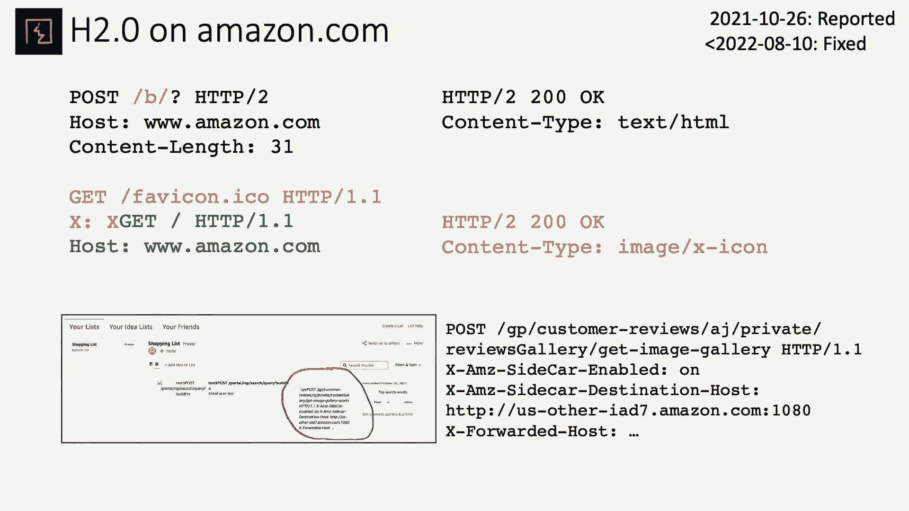

我本可以让每个被这个击中的用户，将攻击扩展到其他十个用户，有效地制作了一个自扩展的去同步蠕虫，在我几乎没有努力的情况下，损害了每一个活跃的亚马逊用户，所以这是一个很酷的，寻找错失的机会。

也暗示了一个全新的攻击类。

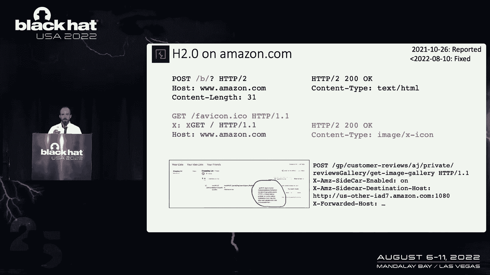

我们称之为客户端体面，到目前为止，我们看到的每一次Desync攻击，包括亚马逊，一个，已取消前端服务器和后端服务器之间的连接的同步，但是如果你能做一个网络浏览器，导致不同步。

您可以针对浏览器自己的连接池，因此，利用实际上没有前端后端架构的站点。

此攻击流从受害者访问攻击者站点开始，它触发对目标的两个请求，第一个非同步的是浏览器的连接，以便第二个请求触发有害响应，从目标网站返回到受害者，通常赋予攻击者对受害者帐户的控制权来构建这些攻击。

我采用了传统的请求走私方法，与客户端Desync的关键区别，我们的整个漏洞都需要在受害者的网络浏览器中运行，这是一个更加复杂和不受控制的环境，比专用黑客工具，因此，定期检查是很重要的。

在您的工具中工作的概念验证也按预期工作，在目标浏览器中，工装方面，我用自定义代码做了这件事，我将在这次演示后直接发布到GitHub，我还设计了一个新的打嗝套件功能，称为发送请求序列，它提供了类似的功能。

但对于目标Web浏览器来说，学习曲线稍微温和一点，你可以，这项技术适用于所有浏览器，我专注于铬，因为它有最好的开发人员工具来构建，攻击的第一步，只是为了识别你的客户端，同步向量，这是一个http。

一个具有三个关键属性的请求，首先也是最重要的，服务器必须忽略内容长度，这通常是因为您的请求要么触发某种服务器错误，或者服务器只是不期望向该端点发送POST请求，所以在这个例子中。

我只是在对一个静态文件做一个POST请求，他们可能想不到，正如你所看到的，我已经发送了一个内容长度，这比我实际发送的数据要高，所以说，如果服务器立即响应此请求，这表明它可能容易受到客户端站点的攻击。

Desync，另一个键请求，另一个关键要求，可以在跨域的Web浏览器中触发此请求，所以这意味着您必须使用POST方法，你不能有任何不寻常的头或混淆头，或者类似的东西。

目标服务器也不能宣传对http 2的支持，因为此攻击利用http one连接，浏览器会非常喜欢使用HTP2，如果服务器支持，客户端体面有效的请求，服务器必须保持连接打开。

因为去同步立即关闭的连接是没有意义的，一旦你找到了你的客户端体面的矢量，下一步是确认它在真正的浏览器中工作，您可以使用如下所示的JavaScript来实现这一点，就像你在这里看到的，我们发送了两个请求。

第一个将同步连接，第二个要承受后果，在最初的请求中，我有几面特别的旗子值得一提，首先，我在指定模式，没有绳子，这实际上并不是成功攻击所必需的，但它所做的是，提高了我们对，Devtools内部发生了什么。

当它不像预期的那样工作时，这是非常有用的，Web浏览器每个网站有多个连接池，如果您毒害了错误的连接池，我可以向你保证，当你运行这个。

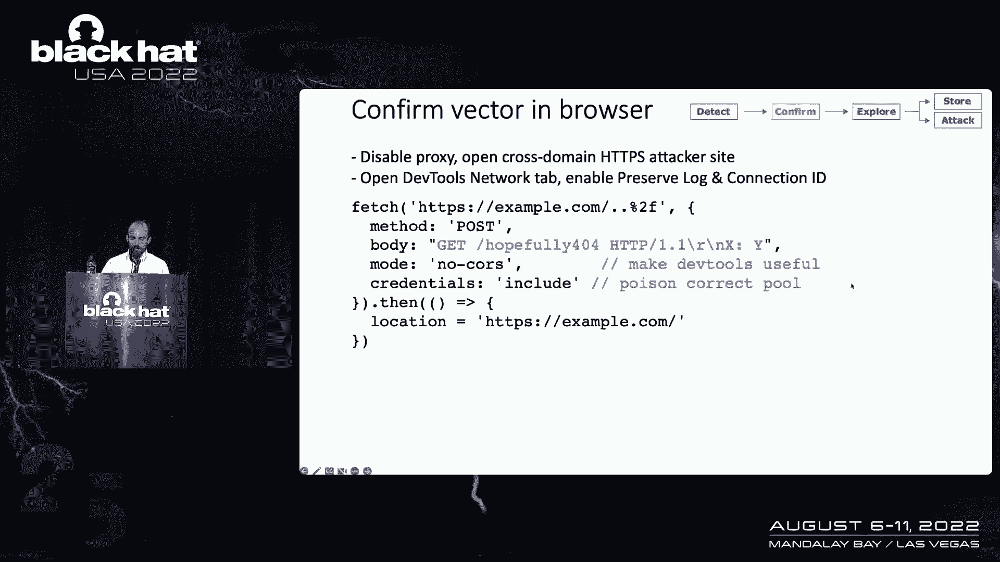

如果成功的话，您将在devtools中看到两个请求，具有相同连接ID，您应该看到第二个响应已受到恶意前缀的影响，在第一次请求中，如图所示，如果效果好的话，祝贺你，你找到了你的第一个客户端，同步。

现在是时候建立一个漏洞了，你有三个主要的选择，首先，您可以尝试将用户请求存储在您可以访问它的地方，很像我在亚马逊上做的，与服务器端同步相同，所以我现在不打算浪费时间谈论这件事，其次，有一个全新的选择。

它是链接和旋转客户端Desync，允许您让受害者的Web浏览器发送任意请求，任意字节字符串到目标网站，这样他们的浏览器就变成了你的人身攻击平台，它把额外的攻击面放在你触手可及的地方，比如说。

你可以让他们把shell有效载荷的日志放在任何你喜欢的地方，并将它们发送到您不能直接访问的内部系统，你甚至可以使用他们的凭据来攻击经过身份验证的攻击面，在一种有点像跨站点请求伪造的方法中，但更强大。

因为您对可以发送的请求没有相同的浏览器实现的限制，我将专注于直接利用最终用户，现在我已经尝试了很多不同的技术，并取得了最大的成功，使用服务器端请求的两个著名小工具，走私，经过某些调整。

应用于克服我们将要遇到的一些挑战，这就是方法，让我们尝试用一些案例研究来应用它，首先，我们将利用一个简单的漏洞，这影响了大量使用Akamai CDN的网站，体面的CT矢量，又好又简单。

您只需执行一个POST请求，就会从前端触发重定向，他们会忽略内容长度，导致客户端desic，在浏览器中确认这一点也很好，很简单。

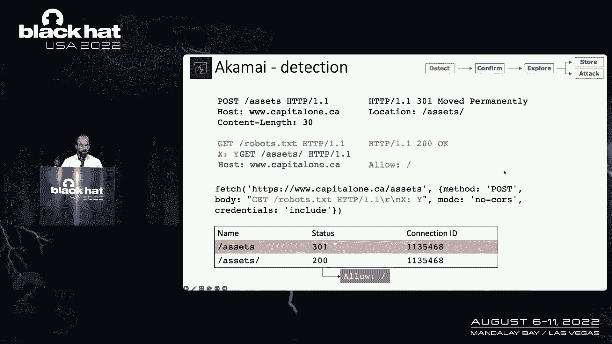

所以这里我用橙色精心制作了恶意前缀，以便当浏览器跟随服务器重定向时，它最终会得到机器人TXT文件的内容，现在开始我们的探索，如果你不熟悉这个技术，我将使用头部技术。

它在去年的http 2上的演示中有更详细的记录，但要点是，我们使用head方法将多个响应排队，当组合在浏览器中是有害的，如果你在做服务器端的同步，这就很简单了，但因为这是客户的视线。

我们需要先解决一些额外的问题，第一个问题是返回浏览器的初始响应是重定向，所以浏览器会立即跟随，这就是我们会被毒窝击中的请求，这将打破我们的进攻，第二个问题是，我将调用堆叠响应问题。

每当Chrome从服务器读取响应时，它故意在tcp套接字上做一点超读，查看服务器发送的数据是否比预期的多，如果Chrome看到任何额外的数据，它悄悄地中断了连接，中断了我们的攻击，幸运的是。

在这个目标上，我们可以很容易地解决这两个问题，这样您就可以修复堆叠响应问题，通过向请求添加缓存克星，这意味着它会导致前端的缓存丢失，一直到后端，这导致了如此大的时间延迟，当它回来的时候。

Chrome已经做了过度阅读，因此没有看到它，和开发作品，其次，我们可以通过改变模式轻松地阻止浏览器跟随重定向，无原因到模式原因，导致异常，当重定向是场景时，然后我们可以捕捉并继续我们的开发。

为了我们的下一个目标，在这里引起dsync更容易，你只要在他们的主页上做一个帖子请求，用这个，我们可以很容易地触发对我们网站的意外重定向，这可能会，理论上。

让我们劫持JavaScript资源负载并完全控制站点，问题是当浏览器呈现页面时，它或多或少地同时加载所有资源，这使得我们很难确保劫持正确的请求，幸运的是这里有一个解决方案。

因为返回给用户的重定向响应是可缓存的，如果我们用这个反应毒害连接，然后将浏览器导航到这个风，我们想要毒害的JS JavaScript文件，浏览器会看到这个重定向，并被反弹回我们的网站。

但它也会将重定向保存在缓存中，所以当他们回到我们的网站时，然后尝试导入JavaScript资源，并最终从缓存中加载中毒版本，并让我们完全控制该页面，希望他们的密码，所以我向SIO报告了这件事。

他们有一阵子没有回复，然后当他们这样做的时候，他们说，实际上他们不赞成这种产品，所以他们不会费心解决这个问题，但值得称赞的是，他们为此发布了简历和咨询意见，接下来我们将访问Verii的主网站。

所以在这个网站上，你可以触发一个Desync，再次使用URL编码的正斜杠，我真的不知道为什么，但不幸的是，这并不是他们设置的唯一不寻常之处，因为我很遗憾没有时间解释的原因，获得一个有效的漏洞。

我不得不用一个不完整的大块身体发送一个头部请求，然后调整后续请求的大小，所以在后面的大块里开槽，有趣的是，这种方法是客户端Desync独有的，因为如果你在做服务器端的同步，你不能控制下一个请求是什么。

因此你不能准确地预测它的大小，因此尝试这种技术将失败，所以值得记住的是，虽然客人都很正派，可能会很痛苦，有时你确实有一些额外的选择，说到我们最后的案例研究的痛苦，这里。

您可以触发Desync执行斜线机器人TXT的POST请求，他们有主机头，重定向我想使用的小工具，劫持JavaScript导入，但这次重定向是不可缓存的，所以我们不能做现金中毒，我们在这种情况下。

我们的攻击时机至关重要，因此，我必须采取三个关键步骤来进行这次攻击，至少有一点点可靠，首先，我预先将受害者的浏览器与目标网站连接起来，减少网络抖动对攻击时间的影响，说实话，这可能实际上没有什么区别。

但它确实有效，更重要的是，我们必须在我们的进攻中有多次尝试，因为它可能会失败，但是攻击失败，并将用户留在目标网站上，所以我可以通过打开一个额外的选项卡来解决这个问题，在该选项卡中运行攻击，终于。

如果攻击失败，浏览器最终缓存了真正的未中毒的JavaScript文件，那么我们将不得不等待该文件在他们的缓存中过期，这可能需要几周时间，所以这种情况永远不要发生是很重要的。

但我通过在脉冲安全上找到一页来避免这种情况，从未被缓存，因为文件，JavaScript文件实际上并不存在，就在我这么想之前。

把所有这些都缝在一起，我做了一个概念验证，我们就在这里看一个快速的视频，希望你能看到额外的标签弹出，加载目标页面几次，最终我们的有效载荷发射，我们完全控制了现场，我报告说脉冲安全，他们说他们上周修好了。

但我找不到任何建议或任何东西，所以我不是百分之百确定那里发生了什么。

但我们开始了，那是Lioxide Desync。

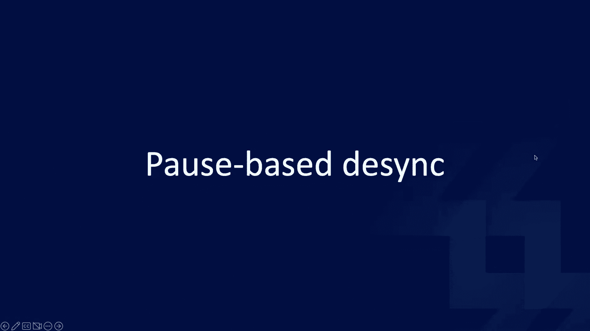

我们之前看到，放慢速度和暂停可以揭示有用的信息，事实证明，暂停还会创建全新的同步漏洞。

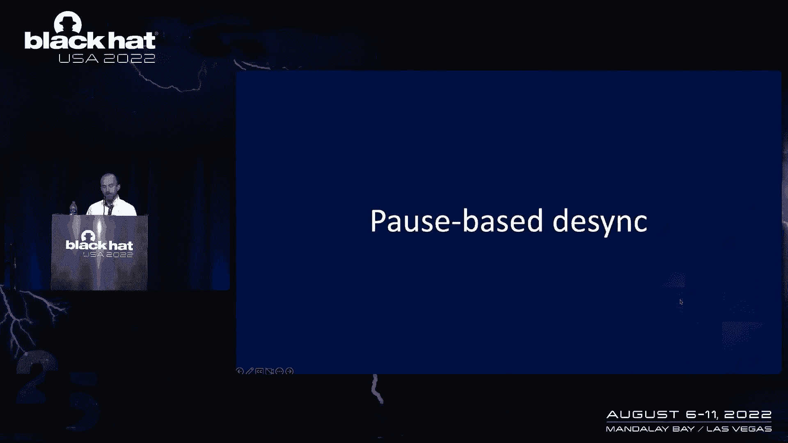

触发基于暂停的Desync非常简单，当直接与易受攻击的服务器进行对话时，您可以从发送标题开始，承诺一个身体，然后就等着，最终易受攻击的服务器会遇到某种超时并发送响应，然后你只需要跟进你剩下的请求。

下一个，这将被解释为单独的第二次请求，导致它，Dei最初在清漆上发现了这种行为，通过极端的侥幸，我的代码中有多个不同的bug，让我找到了这个，一旦我意识到这一点，这个，这是一件事，我去找它。

发现它也适用于Apache，它似乎倾向于发生在一个端点上，当服务器自己生成响应时，而不是将请求转发到后端，或者将其移交给应用程序层，现在这个漏洞支持两种完全不同的攻击，首先。

让我们用它来使一个旧的学校服务器端Desec工作，您需要一个像Apache这样易受攻击的服务器作为后端，和一个前端服务器，它专门流式传输请求，它需要转发请求头，而不等待整个请求体到达。

现在你要做的是你将发送什么请求，你保证发送更多的数据，然后像以前一样等待超时发生，但我们不一定，但是前端实际上可能不会读取此超时响应，并将其传递给我们，直到它看到我们发送完整的请求，在实践中。

你需要做的是发送你的标题，然后暂停，直到您认为后端可能发生了超时，然后继续主动发送尸体和后续信息，应该会引发中毒反应，我已经更新了涡轮入侵者工具，添加几种不同的方式来表示您想在哪里进行延迟。

以及在发送请求的其余部分之前应该等待多长时间，所以你这样做，就是这样，你有一个不错的服务器，在这一点上进行侧同步，你可能在想，嗯，听起来真不错，但是像这样的前端实际上流请求。

我昨天才发现这在H速度2中更常见，但那不是我看到的，当我在这项研究中做这项研究时，我发现它在亚马逊的应用程序负载均衡器上有效，但还有一个额外的陷阱，他们有防御措施，称为早期反应检测，如果他们看到回应。

从后端回来，在客户端的请求完成之前，然后他们会绑定连接，我们的进攻就会失败，我是说切断联系，对不起，幸运的是，据我所知，这是为了防止bug而不是真正的攻击者，所以它真的很容易绕过，您只需要识别后端超时。

然后让橙色的有效载荷在时间窗口中击中前端，在后端产生超时响应和前端看到它之间，这个，基本上这种攻击可能需要几次尝试。

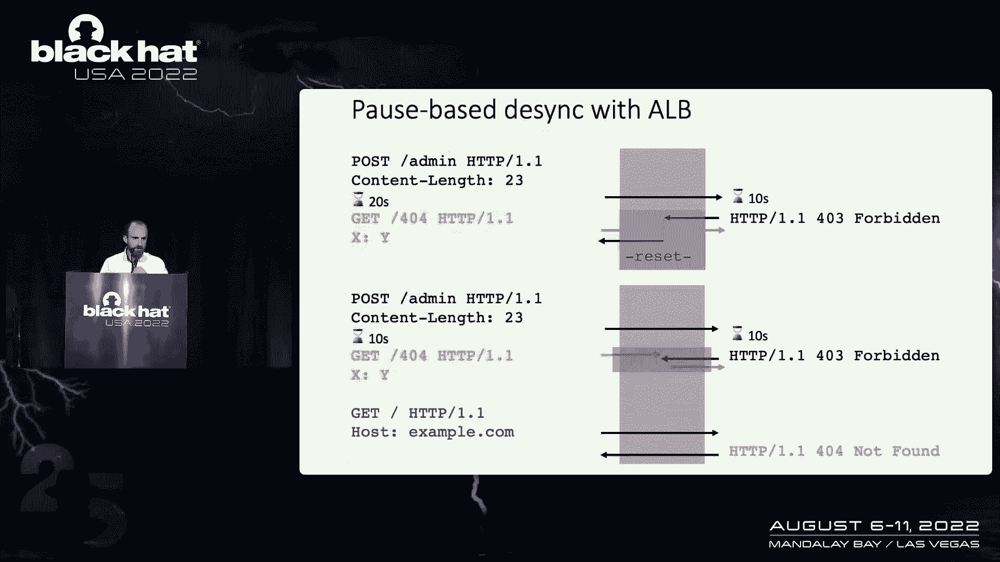

但最终还是值得的，你可能会遇到最后一个陷阱，这是相当糟糕的，这是当前端和后端服务器有相同的超时时，已配置，或者创建争用条件的应用程序负载均衡器，在我们需要达到的比赛条件下，这让生活真的很痛苦。

我想有可能重置前端计时器，无需通过发送前端看到的一些数据来重置后端计时器，但随后正常化，不发送到后端，但我尝试的都不起作用，最终，我只是放弃了尝试，我就像，你知道吗，我只是要设置一个香草攻击运行。

只是让它去，忘了它吧，六十六小时后，它成功了，所以这是给病人的，这是基于服务器端暂停的异步，只剩下最后一个问题。

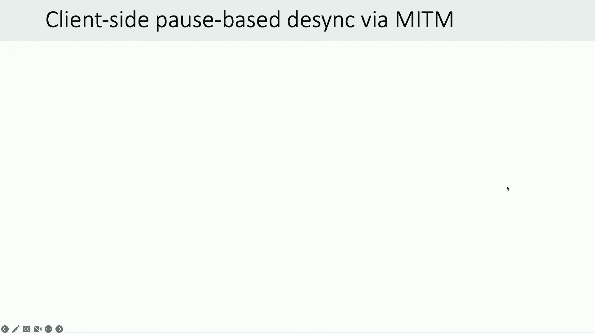

那就是有客户端这样的东西吗，空间差同步，现在我找不到任何方法让浏览器中途暂停，发出请求，但是SSL和TLS不能阻止攻击者延迟您的通信量，所以有潜在的攻击，攻击者在浏览器中触发一个非常大的请求。

它被分成多个数据包，如果攻击者可以延迟正确的数据包，这可能导致基于暂停的客户端去同步，好，我有时间，所以这听起来有点理论化，但这是停电，所以我用这种技术做了一个概念证明，在默认的Apache基础网站上。

执行任意的JavaScript，呃，在受害者的浏览器上，攻击代码看起来有点像普通的客户端dsync，除了我注入了大量的填充物，因此，请求被分成攻击者中间框上的多个数据包，我刚刚使用了以下代码来实现延迟。

它只是说，使交通减慢六十秒，如果它要去目标网站，它的大小在七百到一千三百字节之间，i，这个演示不是最可靠的，因为它是基于浏览器决定如何拆分数据包，但它大部分时间都有效。

我们会，我们看看会发生什么。

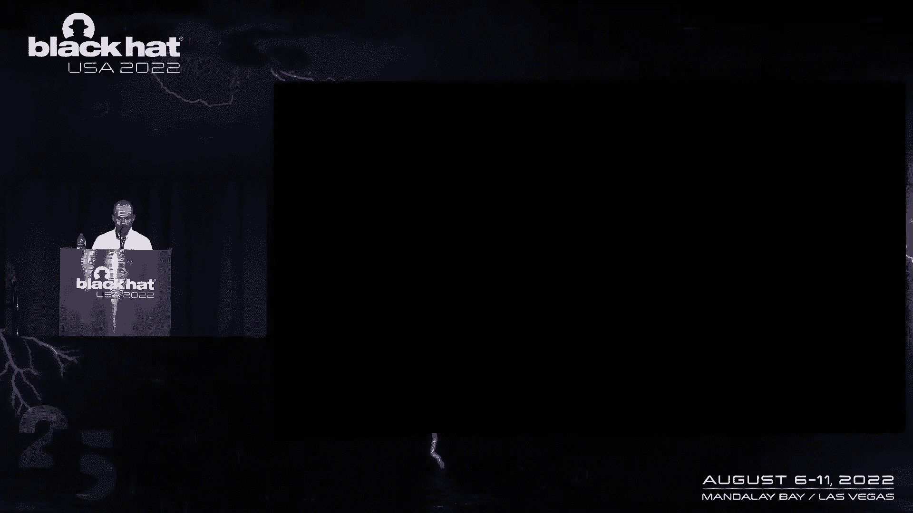

我们好酷，所以在受害者这边，我只是去袜子，代理，受害者通过亚马逊上的一个盒子，盒子中间有人。

这样本地网络就不会把事情搞砸了，在这里，我只是连接到攻击者的机器，呃，让我们看一看。

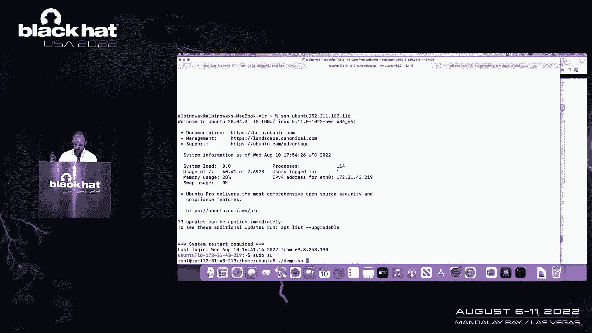

所有的权利，所以你可以看到代码，我来这里是为了减缓一定大小的数据包，和幻灯片唯一的区别，我把易受攻击的网站超时从60秒改为60秒，这是默认的五秒钟，这样演示就不会花很长时间。

所以我现在只在数据包上注入6秒的延迟，我刚刚在攻击者系统上启动了TCP转储，如果攻击成功，我们将在tcp转储中看到的是几个数据包通过，然后一个特定的大数据包被浏览器多次重新发送。

因为浏览并知道它还没有到达服务器，它认为它可能是掉了，但攻击实际上只是减缓了所有这些数据包，它最终会让他们通过，如果一切顺利，这将导致服务器端不同步，并在浏览器中弹出一个漂亮的警报框。

所以让我们看看它是否有效，我们要不要，好的，我们可以看到一个包被重新发送，这里有很多次，希望我们开始了，非常好。

很酷谢谢是的，那是一个，这是一个易受攻击的弱点，但正如你所看到的，它产生了两种完全不同的攻击，我们可以跳过我的备份视频，因为它实际上有效。

希望你们喜欢演示这是演示的最后一击。

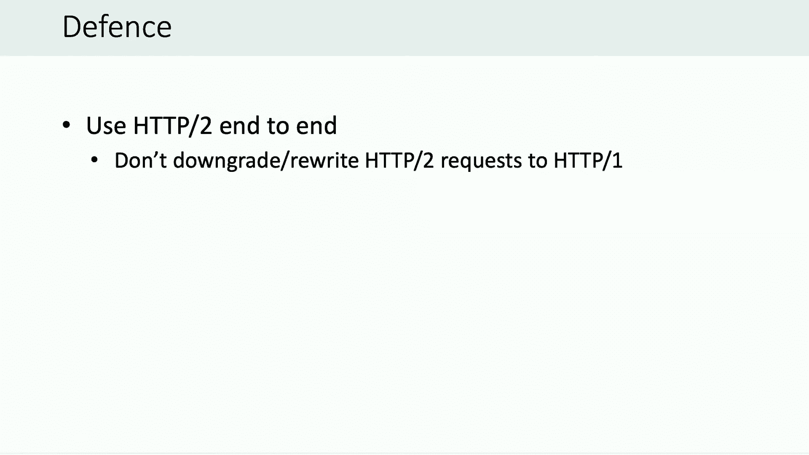

所以让我们来谈谈防守，这些攻击几乎都是利用http one进行的，所以如果你能用HP 2首尾相连，如果你不能首尾相连地使用它，我不建议将HP从H2降级到H1，因为这会带来额外的风险，第二点是。

我真的不知道其他人会怎么想，但老实说，制作一个http one服务器真的很容易，制作一个安全的http one服务器真的很难，所以我的建议是避免编写自己的HP One服务器，如果可以的话。

我认为软件多样性是一件伟大的事情，如果你是一个服务器维护人员，这里有一些建议，您希望加强您的服务器或补丁和现有的客户端Desync。

有一堆进一步的阅读资料，我建议的三件关键事情是看看白皮书，那是顶部的链接，尝试一下我们做的在线实验室，以获得一些实践经验，然后尝试我的代码，扫描、查找和利用一些真正易受攻击的系统，请随时给我发电子邮件。

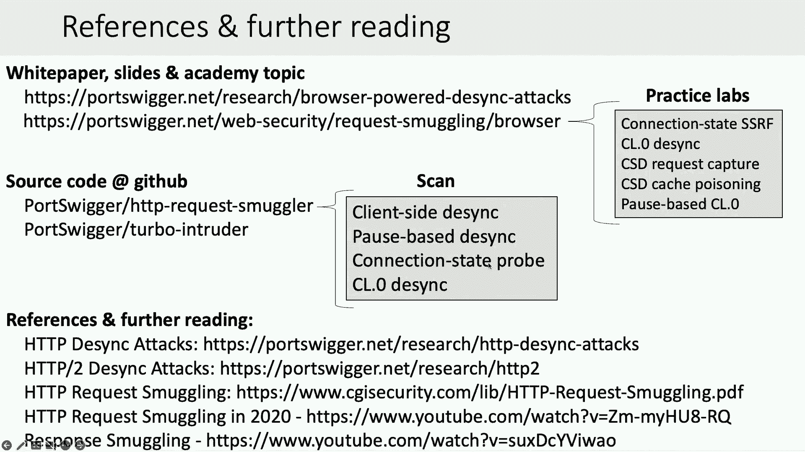

让我知道进展如何，今天下午还有一个演示，这和这个有点关系。

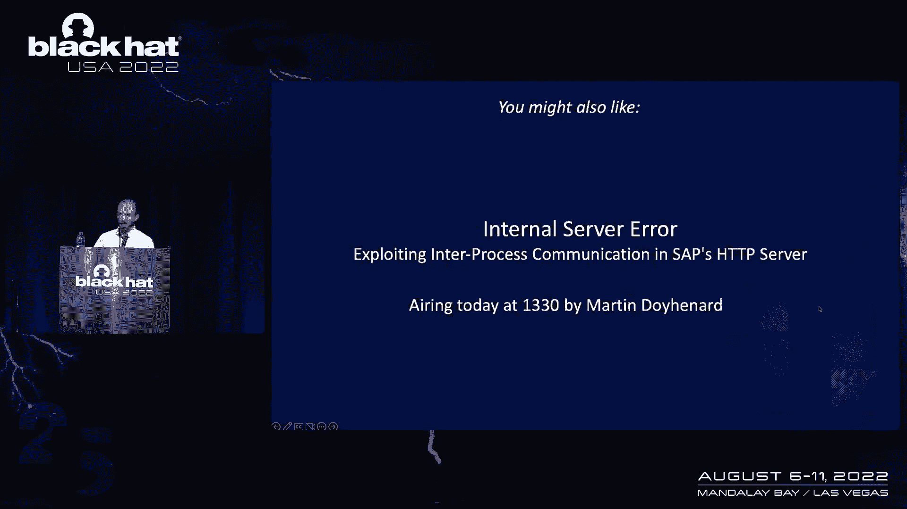

其实，所以你可能想看看，要带走的三个关键是请求是谎言，一个连接词的使用是有害的，你所需要的只是一个出其不意的服务器，我现在回答3分钟左右的问题，如果之后还有的话，请随时来后面和我聊天。

或者只是给我发邮件，是时候忘记在推特上关注我了，感谢收听。

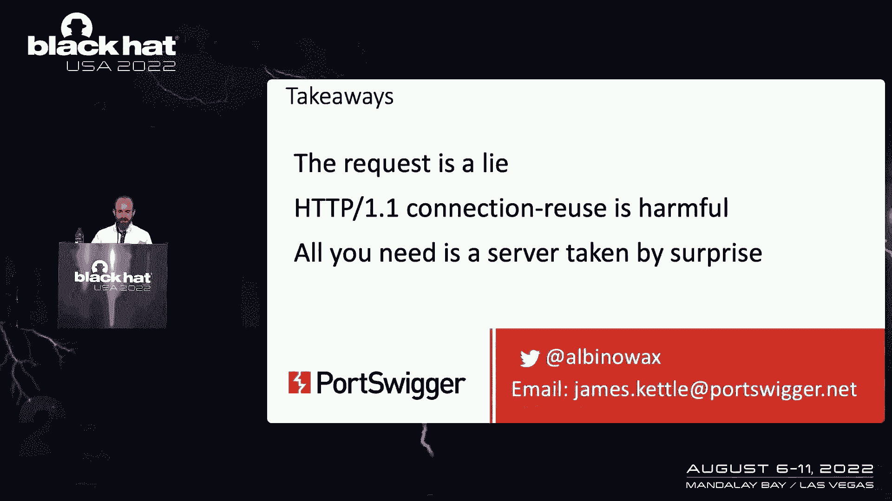

所以我们有两分钟，有什么问题吗？所有的权利。

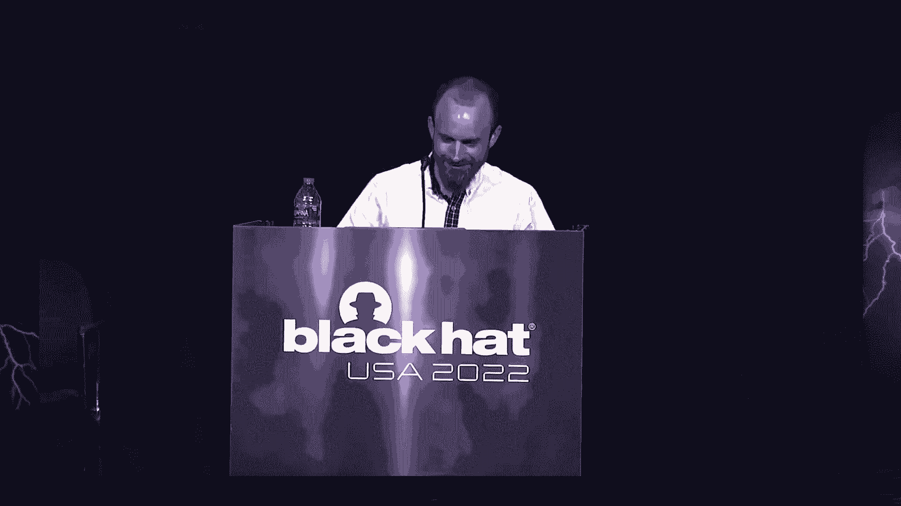