# P60：067 - Breaking Firmware Trust From Pre-EFI： Exploiting Early Boot Phases - 坤坤武特 - BV1WK41167dt

现在我很荣幸地欢迎亚历克斯上台，Marchasoft。

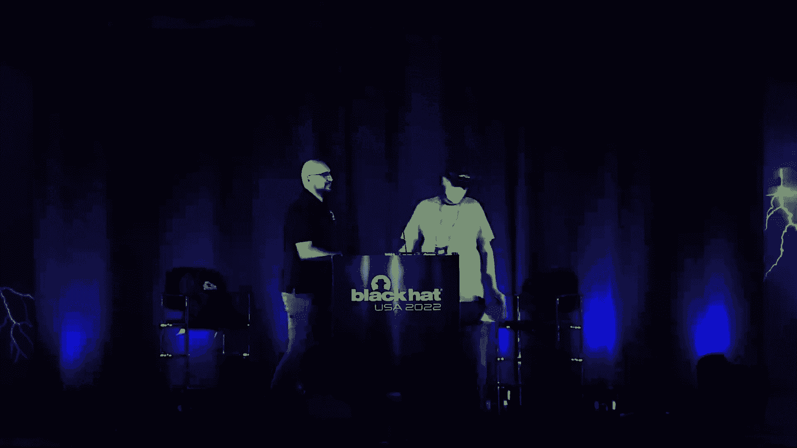

非常感谢大家来参加这次会议。

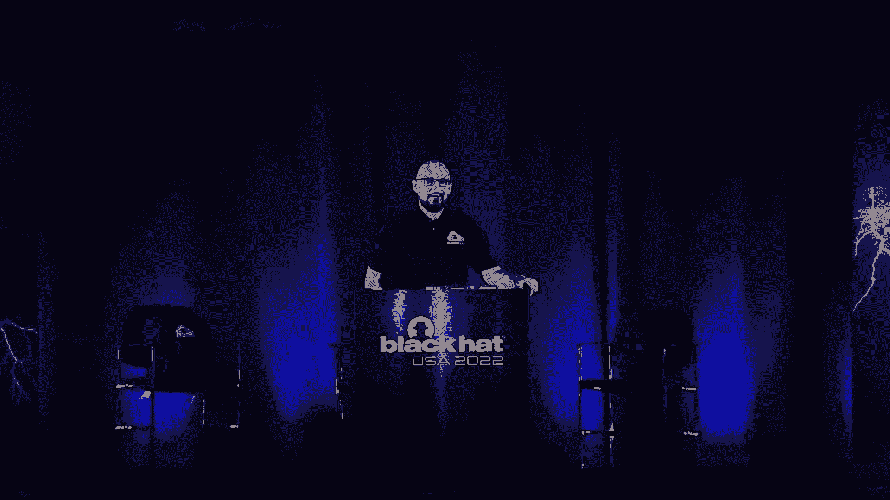

我是亚历克斯·米特罗，这是一项非常有趣的研究。

最终由团队和乔·维塞莱纳完成，亚历克斯·伊莫洛夫和萨姆·塔瓦斯，对这项研究做出了很大的贡献。首先，我想说，这与前一年有很大的不同，去年我一直在拉斯维加斯为黑帽公司做宣传，我看到更多的人来参加会议。

很高兴在维加斯见到你们，这是一个二元团队，可以让整个团队在这项研究上努力工作，我们今天有很多事情要讨论，所以首先像Pre，如果我有漏洞，它一直被忽视，实际上它连接了。

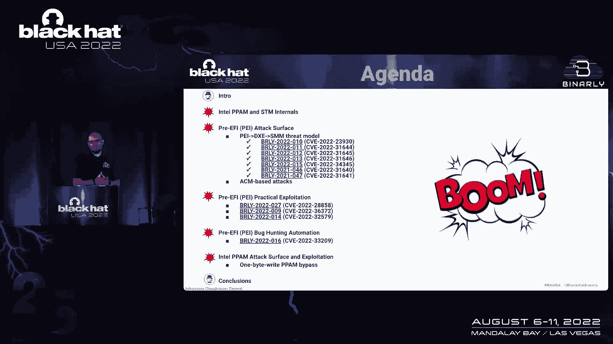

整体很有趣，也很危险，对研究人员和攻击者都有影响的空间，其中一些实际上绕过了很多缓解措施，只是故意的，喜欢istm，ppm和其他花哨的缓解措施，变成了发达的，不幸的是，它可以从pre绕过，五个阶段。

早期引导阶段，但让我们来谈谈这项研究是如何开始的，所以在二零零七年，我们已经在谈论英特尔Huard了，以及如何修改控制引导过程的一些数据，它实际上反映在旁路上。

我们一直在讨论安全边界作为威胁模型是多么重要，因为当他们跨越不同的安全边界时，对某些缓解措施或安全特性有不同的影响，我们以前做过，当然还有去年。

当我们第一次和亚历克斯·埃尔金和亚当·阿布罗伊在一起的时候，有点像深潜，Pre Five中的一些漏洞，当然喜欢BDT，对五岁以下的孩子来说，这有点像一个大开眼界的机会，开发阶段。

顺便说一句这只被淘汰的小马将获得最受欢迎的小马奖，也许我们可以用这个来弥补这个甜蜜的弱点，不幸的是，实际上，它仍然在野外可用，并在许多系统上打补丁，确保你不是二月份的那个人和一个冒犯性的电话。

我们实际上删除了大约两个新的新鲜出炉的简历，主要与系统管理模式有关，我们可以看到这是一个可重复的失败，正在发生在具有如此漏洞的行业中，以及固件中的漏洞空间研究，老实说，它被忽视了，系统管理内存损坏了。

这不是一个新的矢量，它实际上从2000年早期就知道了，但它仍然可用，当然，当你用C语言写你的农民时，它为内存损坏创建了一些有趣的房间，所有的权利，什么是下午，实际上在我们的攻击性研究演讲中。

我们说我们正在做PM，实际上它的平台属性评估模块，它负责我们或系统管理MO，这是xx 86系统中最强大的模式之一，基本上就像我们说的，我们会没事的，肯定有一些旁路。

因为这种功能的复杂性实际上令人难以置信，我们做得对，但在我们用圆周率驱动程序深入研究三个五个阶段之前。

让我们来谈谈ACM和ACM，它是一个经过身份验证的代码模块，想想看，它只是一个二进制斑点，与固件分开执行，实际上它正在加载，直接在CPU上缓存，此缓存已锁定，它在CPU特性上被称为RAM的缓存。

它提供了一些额外的认证功能，或者基本上是为了TXT和很多其他东西，但是ACM有趣的是，它们的复杂性也在增长，基本上我们已经在这个二进制研究小组启动之前展示了它，加林，BIOS，过程保护。

TC中的漏洞，这并不罕见，也作为例子，美国的变化，首先呢，它增加了，安全超重，这个哈希，使用的新哈希函数，我说，但不是关于那个，模块的大小，它实际上长得像一个五倍多的权利，现在已经是52千字节了。

它有256千字节，对吗，当代码库增长并攻击时会发生什么，你的脸也长出来了，和，P的证明，m，价格，这是非常重要的记住，因为我们后来在我们的陈述中有一个非常有趣的发现，从攻击面的角度讨论补丁。

比如今年ACMS中大约有十个漏洞，这意味着这个攻击面，它其实是，对呀，让我们潜到开火前的攻击面，只是提醒一下攻击者的模型和潜在的影响，我不想谈那么深，但基本上我们今天谈论的所有这些弱点。

它可以用于持久的实现交付，通过通过固件空间上的所有安全边界，还有与赚取VM相关的漏洞，它实际上没有受到保护，如果我们说的是间谍闪光灯上的持久存储，它通常不受鲍嘉的保护，有趣的是。

如果你在RAM有效载荷中有，基本上，它可以是一个持续的风险演讲在引导期间，实际上可以为攻击者获得持久性，这就是为什么，我想说这个漏洞是非常危险的，因为，从技术上来说，从毫米你可以得到保护。

而是由于逆持久性，有时候，系统架构师或设备供应商不认为这是。

持久性的潜在空间，但它是，因此，您可以看到在引导过程中不断通信的实际复杂性，具有NVRAM存储速率。

但让我们更多地谈谈开火前的攻击载体，老实说，我们有这么多，所以基本上这就是为什么它是预先危险的，就像你在这张照片上看到的，其实比迪克西脸开始得早，也是在前五个引导阶段，它实际上被称为平台初始化阶段。

对呀，需要初始化很多安全特性，发生了很多事情，比如记忆训练之类的，而且统一前的空间实际上有时可以用于代码执行，嗯，从操作系统，但当然，与期间相比，它为高度护理提供了更有限的能力，当早期的启动刚刚开始。

因为很多内存区域已经被锁定了，但它仍然可以用来绕过许多安全功能，在圆周率阶段，我们就可以，当然啦，把所有的安全保护都传给间谍，因为它只是没有启用，它只是还没有发生，所以所有的历史缓解。

就像双能和M偏见的权利保护，它将被绕过，因为它基本上是。

UFI标准固件的，基本上我想说，有时从规范或标准的角度来看是非常重要的，如果它从2000年初就存在的话，审查和重新考虑不同的引导阶段如何实际反映新的安全特性，对，当然就像一个复杂的，它永远是安全的敌人。

你可以看到我们找到了多少漏洞，所以说。

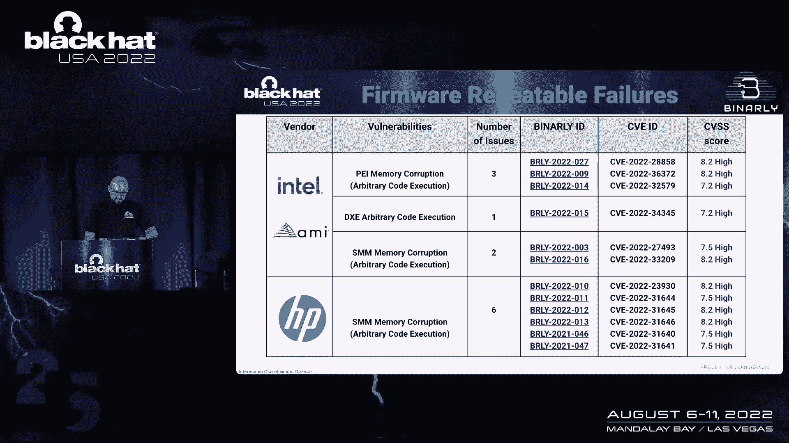

基本上，这张幻灯片是现在讨论的12张光盘的摘要，所有的建议都上传到二进制网站上，所以你可以去了解更多关于他们的细节，一些POS也可用，公共，还有有趣的提醒，它实际上不仅连接到单个设备供应商。

它挤满了整个生态系统，它实际上在不同的设备和产品线上使用类似的代码，也在这张幻灯片上，我想谢谢你，所有的PCR团队和他们的辛勤工作，帮助我们及时接近所有这些弱点。

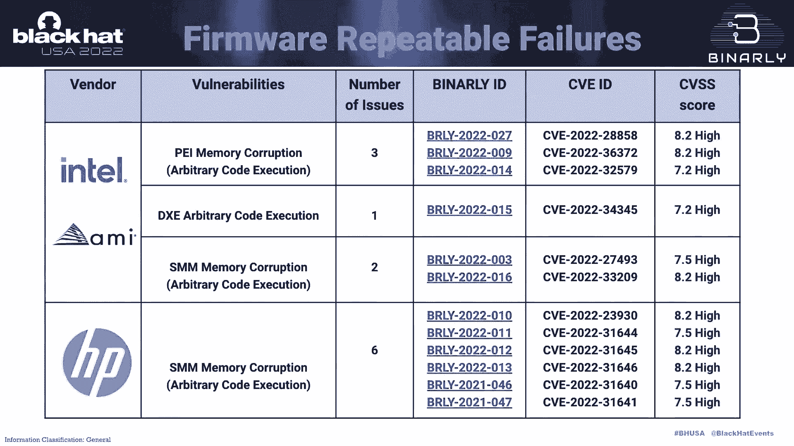

实际上当我们回到圆周率时，这是一个非常有趣的漏洞，因为它实际上也显示了供应链问题，首先，这个和弦实际上存在于一个指示器上，但不幸的是，基本上这个修改发生了什么，它实际上引入了漏洞，当然。

这个漏洞会存在于许多其他系统上，它实际上与此漏洞有关，当有人分叉公共参考代码时也有问题，它其实是在支撑这个叉子，保持最新，供应链安全方面的许多其他问题，我想实际上最好保持这个代码的一致性。

实际上与最初的参考报价相同，因为它基本上会给我们一个更容易和透明的地铁链。

从那个角度来看，漏洞是什么，基本上我们有一个get变量值fpdt变量，我们可以访问ACPI三个性能安德烈亚斯，实际上来自操作系统内存，我们可以把这个换成一个三维性能稳定的指针，基本上。

这将是因为仲裁者控制博阿斯，这个漏洞的有趣之处在于，我们没有访问环境变量本身的权限，因为它在运行时无法访问，但我们可以访问内存中的指针，基本上，与开发人员进行了非常有趣的讨论，因为他们说，哦。

你如何利用它，它在运行时不可用，但我们控制指针，否。

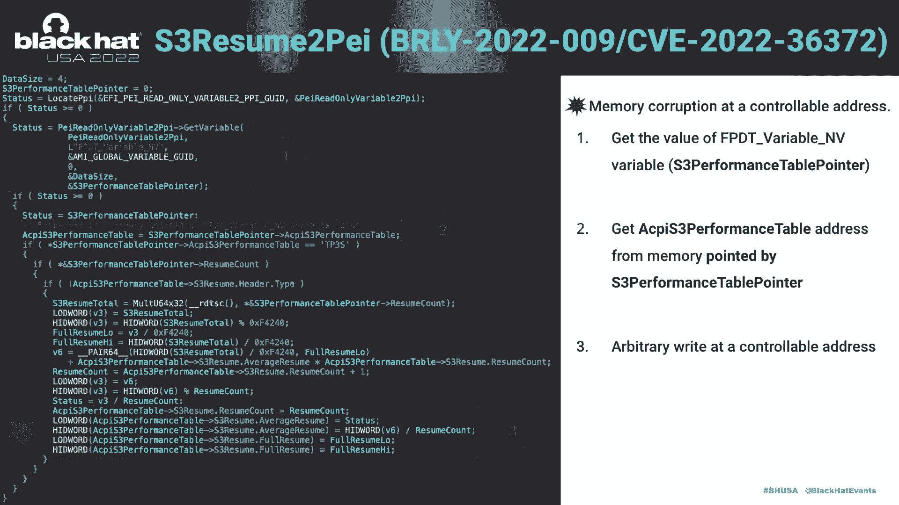

否，这是不可能的，但实际上，在开发了那个之后，更有说服力了，所以耶，让我们来看看演示。

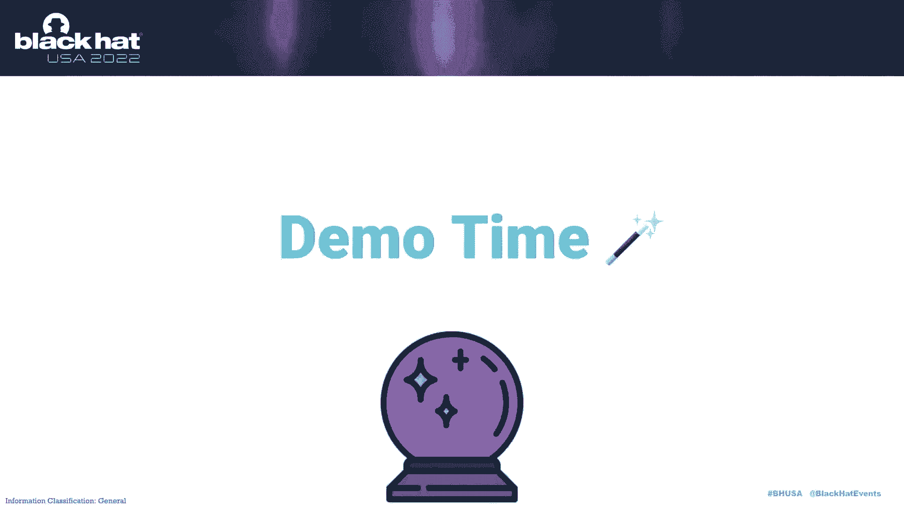

所以基本上我们有，正如你在这个演示中看到的，基本上它工作得很快，我们需要做的，我们需要修改指针并实际触发ISIS睡眠模式，然后它实际上进入睡眠模式，砰的一声，我们有代码执行，它实际上给了你一点。

可控值的两个字节以上，我们可以用两个字节做什么，我们可以看到更多关于这一点的信息，因为两个白人有时可以绕过所有的缓解。

但这只是我们今天讨论的一个弱点，另一个，这是一个平台，我们需要预付保险费，这也很有趣，因为实际上它可以从系统管理模式中绕过所有标识变量，它是受保护的，但基本上，如果您在系统管理模式下执行此代码执行。

基本上，所有的变量只有在经过身份验证时才被读取。

你可以这样做，所以也有这样的变量，它是一个物理攻击载体，当您可以重新编程时，总是可用的，以及持久存储中的这些变量，你基本上可以获得，持久的常量代码执行。

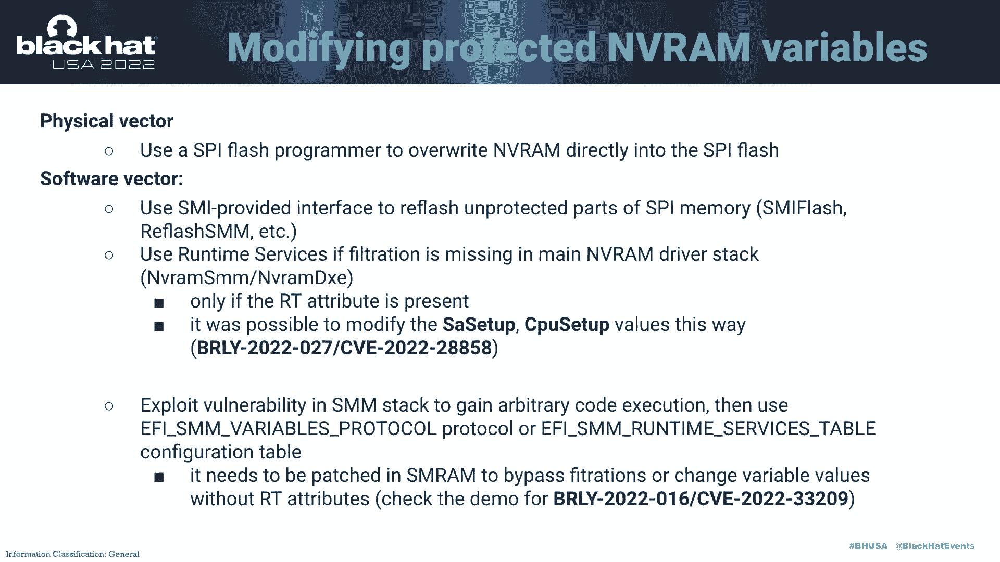

我之前又提到过。

演示时间，今年发布的最新敲门虎湖。

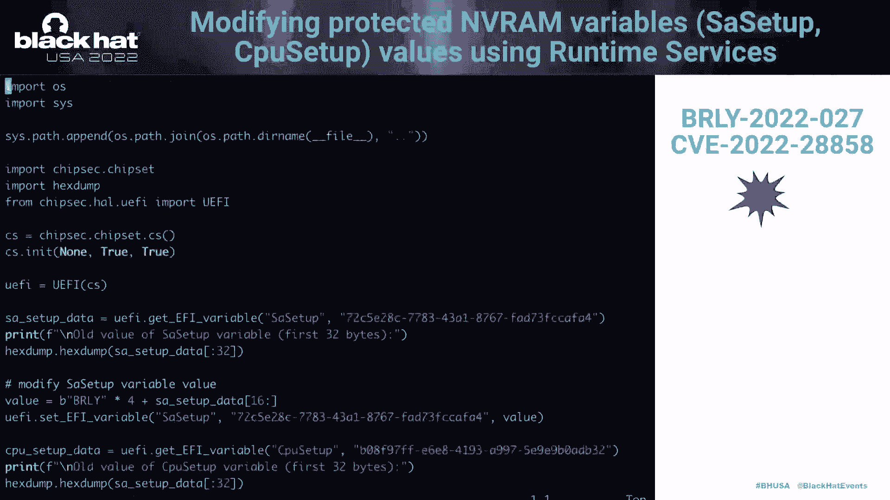

所以嘣。

但我们有十二个，我们将在更多的细节和更多的细节，这其实也很有趣，因为这正是为了提供额外的遥测而开发的功能，并交换来自M的信息以提供一些调试数据，调出数据或任何考虑开发的东西，但有时是我的经纪人。

其实只是为了提醒一下，它的功能从固件到操作系统层再到钩子，从固件到操作系统的一些功能，这个牛bug函数有时有一个非常复杂的继承指针。

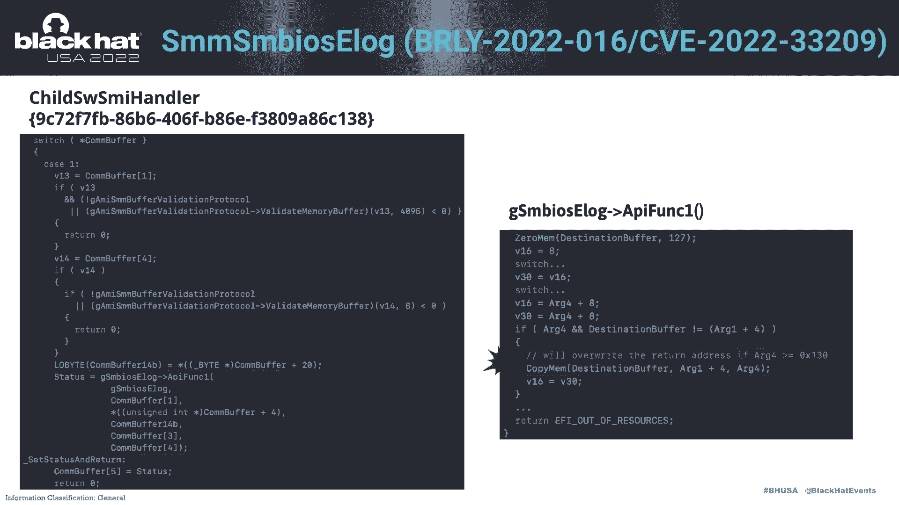

正如我们在这个案例中看到的，基本上我们可以有像API放克这样的一个和许多其他的，但是这个功能API放克一个，正如你在这张幻灯片上看到的，实际上是可以触发的，一些溢出的附加功能。

当老虎实际上会导致经典记忆损坏，正如我们所看到的，它导致了模仿虫，并有一个可控的缓冲区，它实际上给了一个准确的机会来利用它。

到PC的链接在那里，我们去年发现的非常相似的漏洞，它已经在参考代码中了，所以如果p错误日志，所以基本上这是一个很有趣的，因为它还提供了一些收集数据的额外功能，并在您自己的变量中提供此数据。

基本上不幸的是。

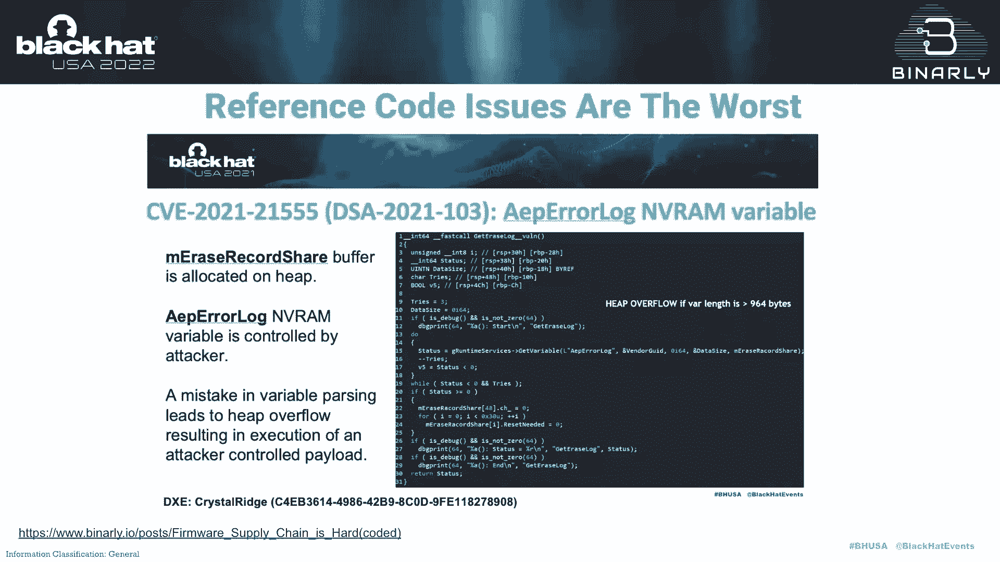

它一直是可利用的攻击载体，对呀。

演示时间，我们买了BIOS，行走所有较小的能力，大家可以看到，相当稳定，它工作得很可靠，但实际上很危险，这就是为什么修复它们非常非常重要，因为老虎经常有很多机会，非常荣幸，固件，mo。

另一个超频是我的处理程序故事，这个很有趣，因为它实际上有一个明显的地铁链问题，这个超频是我的处理程序，它与模块连接，这实际上有点像游戏中隐藏的遗留功能，cpus，但这个在游戏机器上，基本上这个功能。

它实际上已经被移除很长时间了，我想几年前从许多平台，但不幸的是，它又出现在英特尔纳克上了，我们注意到在我们的一个客户平台上，比如为什么，它实际上是一个新更新的偏见，它的新平台，为什么这里有这个功能。

实际上提供了一个易受攻击的漏洞，有人忘了更改构建脚本，实际上他们所有的模块都没有打补丁，得到了更新的固件，它清楚地表明了供应链问题，有时会发生，这也提醒了我美国大机会USBR关键问题。

当漏洞实际上是其中一些被修补时，或者模型模块过时了，但它经常给你和新的攻击矢量作为例子，我们在进攻骗局中的两个新漏洞，在USB R T上找到的，用一个相当新的硬件。

有趣的提醒，当我们有超频这样的漏洞，很高兴看到我们如何实际创建不推荐使用的模块列表，在运行时将永远不可用，这个行业实际上可以清理这个供应链，自然，我想有一个好主意。

如果有人能从设备供应商的角度来影响这一点好吧，我们再看一个，它实际上是通过一个get变量occ设置，我们在这里可以看到，我们在右上角有一个DBS的签名，所以基本上这个块是为了让它可以利用。

我们需要保留签名以绕过所有的安全检查。

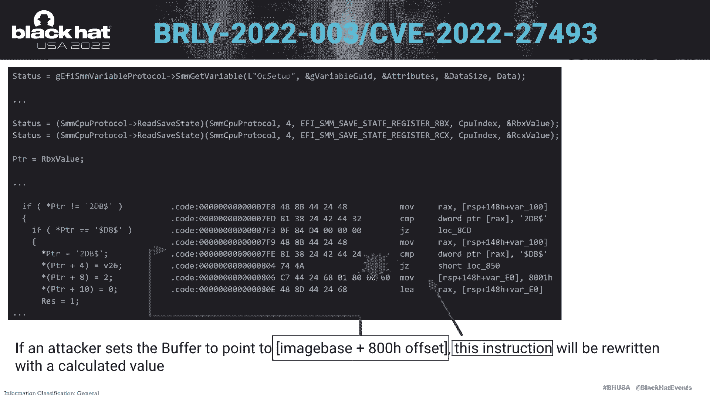

然后基本上我们在RBX中有一个可控的指针。

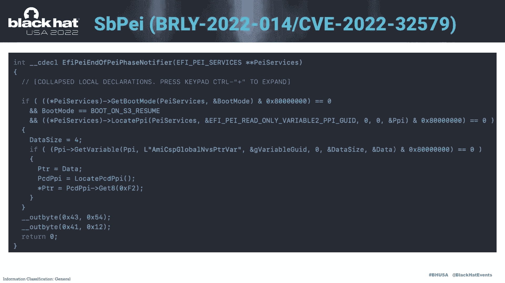

我们实际上是在PCD值上利用它。

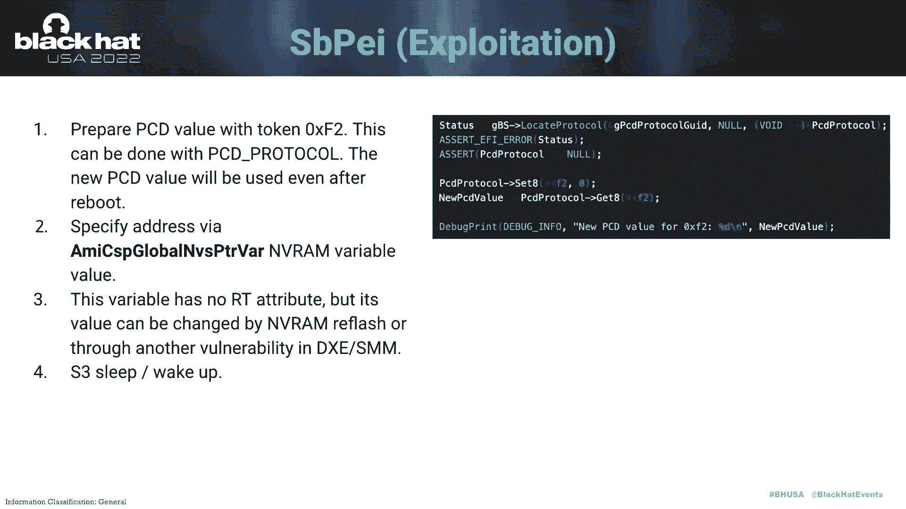

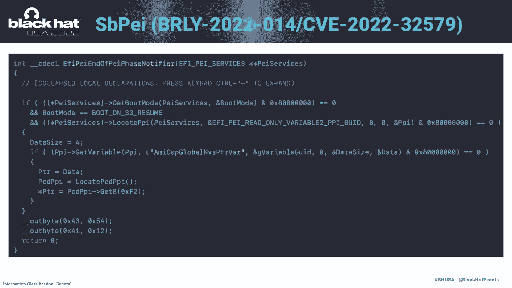

所以让我们做演示，基本上，此漏洞实际上正在更改SPTR变量中的CSP全局，所以基本上选择M中的漏洞，这是一个非常酷的，因为它也可以是经过身份验证的变量，我们之前一直在谈论的漏洞之一。

在S三个睡眠模式下触发此漏洞，一直在讨论，因为一些供应商说，像这样的漏洞只能在客户端系统上利用，因为休眠模式在服务器计算机上不可用，但不幸的是，这不是真的，因为睡眠模式可能是。

它完全在软件和操作系统中实现，您可以在Linux Wake上使用，在Windows和服务器上实际做到这一点的其他一些功能受到了影响，但它实际上需要一些额外的努力。

我想调用这样的函数，进入睡眠模式，所以是的，这正是我告诉你的，所以基本上Linux和Windows只是为了配置S的三个功能，我们可以让它的开发成功，这么说，它是不可开发的，当然。

这实际上把披露推迟了将近一个月，来自其中一个供应商的服务器机器，并以更透明的方式，喜欢是，它是有影响力的，它实际上首先会比生态系统更好地保护。

在其他脆弱性中，我们说的是二进制二十二，十五，所以基本上这个实际上是在XE上执行任意代码，它不是系统管理mod驱动程序，当然，它给了一个很高的机会来绕过经理一个安全的引导，但基本上也是另一次攻击。

如果我们利用这个漏洞而不是直接来自操作系统呢，如果我们在Dixiface上执行代码呢，然后从那里开发一些东西。

大多数正在设计的安全功能，并不考虑这是一个攻击面，这个例子，英特尔BIOS警卫我不认识伙计们，如果每个人都知道偏置保护是什么，但它实际上是在保护存储间谍免受更改。

所以基本上它是一个非常重要的针对固件植入的安全功能，但它可以很容易地被一个。

也提醒所有漏洞都要呈现，它实际上不会保护安全核心，它不会受到Dr。tms的保护，SRTMS和其他东西，因为tpms没有在运行时扩展它们的pcr，所有这些测量都储存在那里。

设备测试的远程健康将对这种利用完全盲目，但让我们谈谈自动化，这是一个非常重要的作品，为什么是可重复的故障，因为空间中存在着很多弱点，我认为它需要修理，当然啦，就像我们已经承诺了一个系统，并提出了。

如果我探险家几年前插上黑帽欧洲，我们用白色开发了整个方法，用静态分析和约束下的符号执行来发现这类问题。

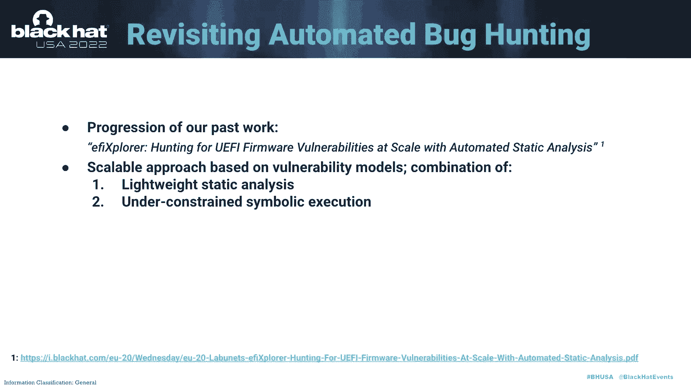

所以只是一个例子，静态分析，而不进行部分仿真或实际的符号执行以进行发现，在某些情况下，它实际上会导致一些假阳性，变量，只需在您的固件上使用它，以便在您听取客户的意见之前找到它。

但我们如何改进它，当前方法的局限性是什么，首先是假阳性的数量，基本上大多数都是基于非常简单的模式匹配，我们只是创造了很多限制，我们的方法实际上是利用，语义属性和轻量级内容，称为模式。

用于实际开发检查器来检测它，所以它就像一个分析的管道，不想花太多时间有趣的点，它是中间的表示，它实际上用于符号执行和语义注释，所以这是如何为客户提升，我说形式，看起来像是克。

这里有一个关于语义注释的蛇峰，其实，这正是更坚定的手在探测中所做的，这是开源技术，看看我们的GitHub，但它在一些中间表示之上，实际上用语义来增强它，附加说明，和静态检查器，其实很简单。

我们只是在运行时添加了一些额外的规则，为了检测这样的问题，它增加了代码流和代码流属性，以及数据流依赖关系和属性，我们在那里有内部属性，基本上，我们在这个中间表示中发挥了重要作用，从那里模拟执行，对呀。

所以我认为寻找漏洞的象征性执行，我在2006年的演讲中也谈到了这一点，实际上，当我在英特尔公司工作的时候，我们在CMX上开发的，寻找此类脆弱性的整个框架，但看起来我离开后就没怎么用过了。

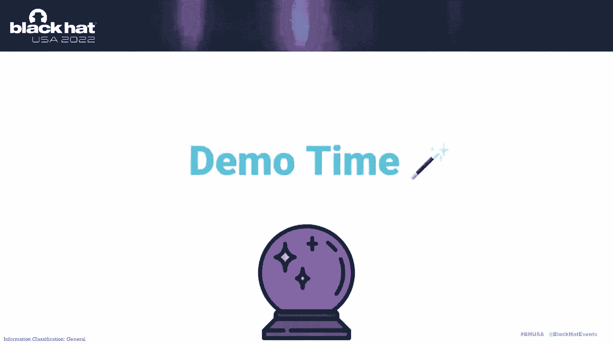

所有的权利，另一个薪酬面临漏洞，现在是二千零一四，得到变量，导致任意代码执行，这个很重要要记住，因为我们用这个来做真正的英特尔PM。

旁路。

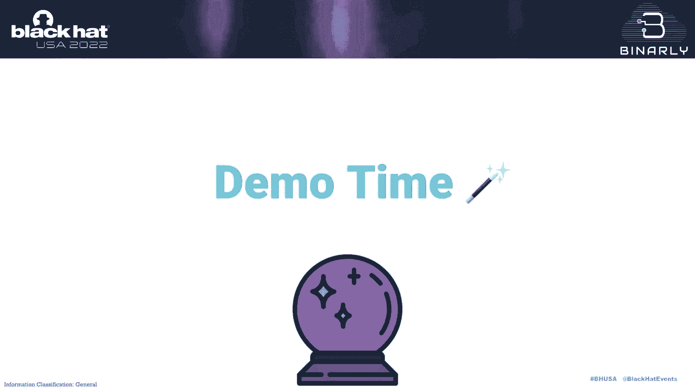

正如你在这里看到的，它也被发现了，它实际上已经被发现了，超过我们的框架费率。

以象征性的处决，另一个演示，它是另一个中的get变量，但在系统管理模式上，所以基本上是检测，和缓冲器会掉下来的自行车有一个缓冲器是约束的，所以去找铜人，所以象征性的执行是非常有效的，正如你在这里看到的。

首先呢，我想谢谢你，美国大趋势的B，去做一项艰苦的工作来修补我们发现的所有漏洞，实际上与美国超级跨性别有关，所以另一个很酷的是惠普P搜索的这些目标，它一直在与一个团队合作，研究不同的披露。

这是团队的艰苦工作，所有这些产品都是安全的现在所有的建议都是公开的，所有的权利，但让我们关注英特尔PM和NCM内部，所以这个m和p m，它实际上是系统管理模式上最花哨的缓解措施。

它适用于大多数街道和时间，所以基本上P上发生了什么，m，对于每个MI处理程序，当您利用一个半处理程序时，您可以访问平坦的内存空间，你实际上可以影响任何其他人，在P ram被介绍后。

它实际上非常接近武装可信执行环境，它是否隔离了不同的TZ应用程序。

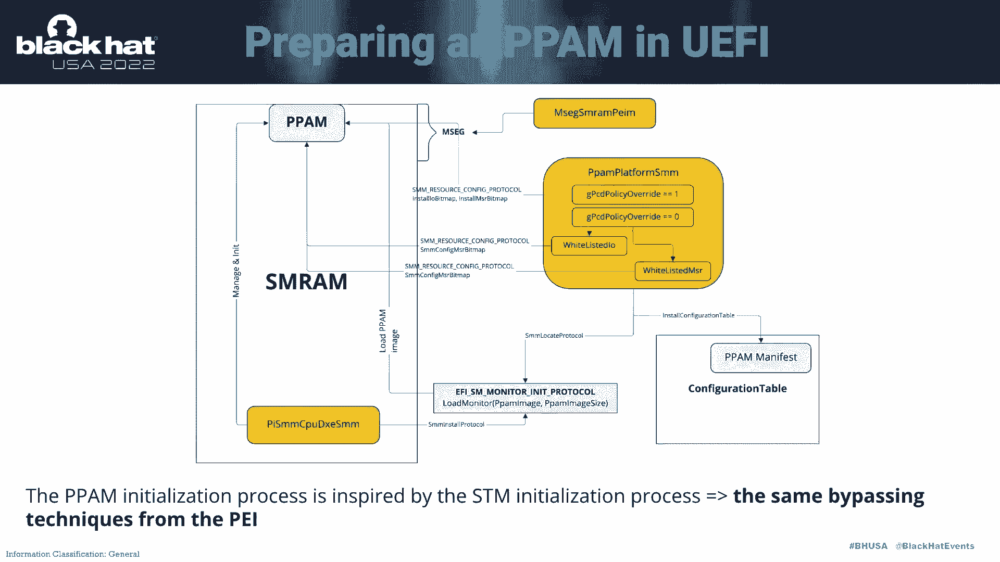

我的经纪人也会发生同样的事情，人们是如何工作的，它实际上可以在三个不同的阶段断裂，第一阶段是，当然啦，就像那种就像明白了，如果人们会启用它，并且有正确的平台属性，第二次，这有点像初始化监视器。

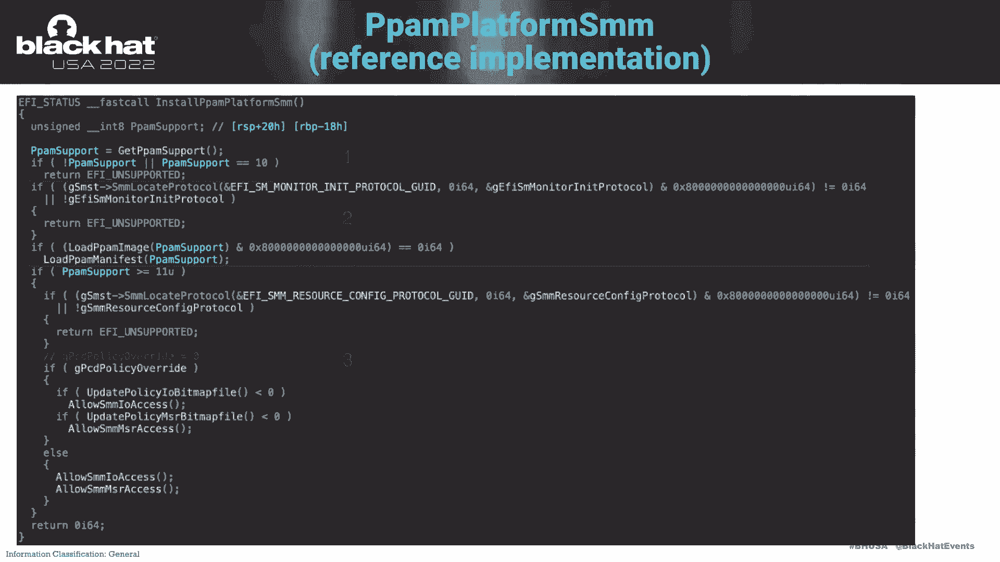

然后加载模块和策略，这个其实很重要，你可以在这里看到，它在加载前检查P泵映像以解析所有策略，所有这些特征都是没有记录的，它实际上是由一个二元小组进行逆向工程的，并向研究界提供所有这些可用的信息。

它实际上就像mc mm，希望会有破碎的文明对吧，所以如果我们能够将单个字节直接发送到内存空间，来自MC S Yram，我们可以改变一些数据存储，它实际上将在初始化中中断，渔民就会残疾。

我记得一开始的白色和靴子加尔，那正是，通过传递此类安全特性，可以使用相同类型的漏洞。

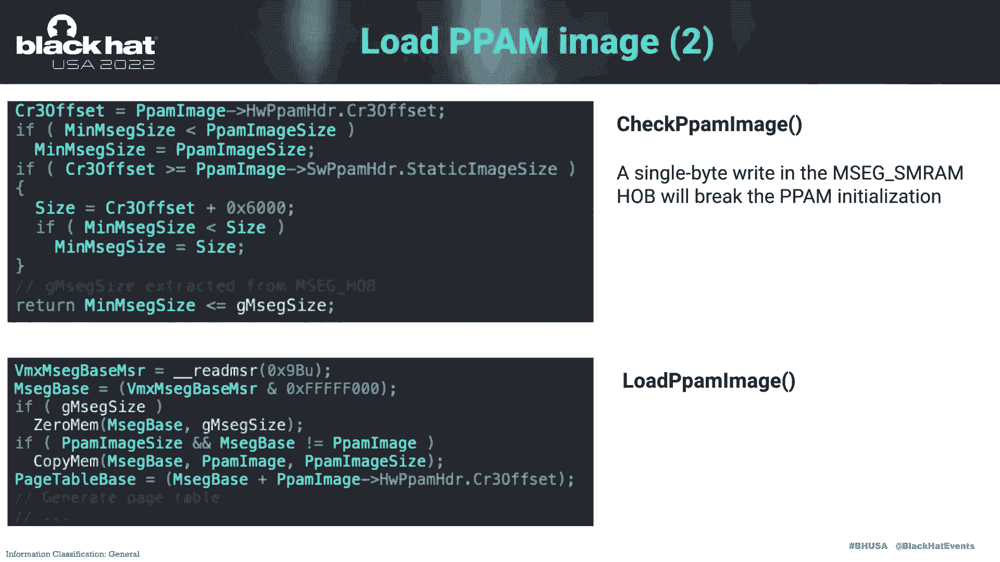

和保存在配置表中的PM清单，基本上它可以很容易地被运行时的操作系统组件接收，另一个是访问策略的安装和配置，基本上，我的处理程序中的所有内容都有一个配置，用于利用对输入输出端口的访问，MSR寄存器。

和其他一些政策，事实上，这是一项非常有趣的技术，我认为这实际上是一个游戏规则的改变者，但需要更安全的设计，因为在规范上，它看起来比实际实现更好。

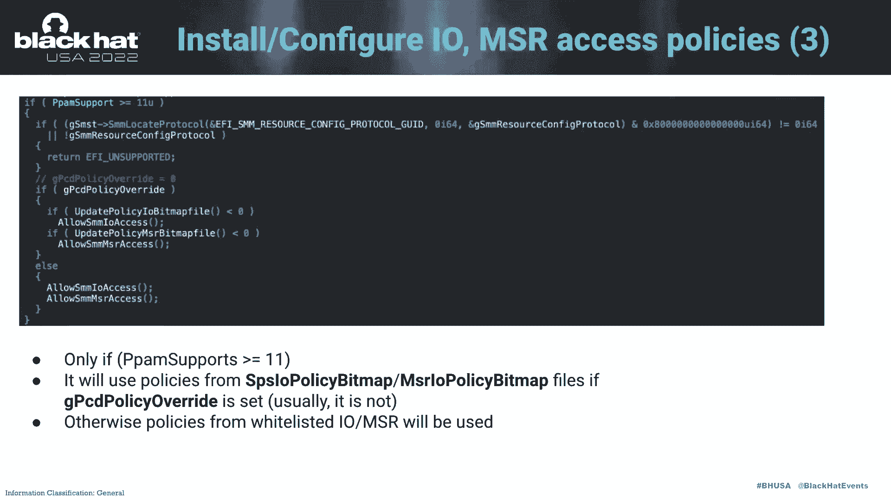

让我们来谈谈攻击面，我们用它作为靶子，惠普最新的平台之一，基本上这是一本轻松的书，我想它是基于老虎湖CPU，这是非常新的，这是十一代，这张照片实际上是如何，总结一下我们以前讨论过的整个信息。

以及它如何连接到ppm旁路，所以我们有五个前漏洞，这可能会影响一些数据存储，它在这里实际上显示为一个Hopdata，然后绕过整个配置加载为人繁荣。

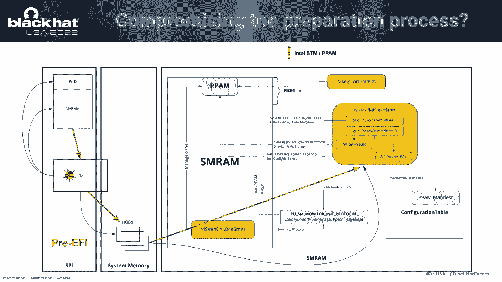

我们有一个CPU M变量，正如我们在参考实现中所看到的，它可以在GitHub上获得，就像一个poc，所以有点像，看起来不一样。

这个希望数据，它可以从操作系统层访问，但基本上我们可以通过圆周率来像一个比波。

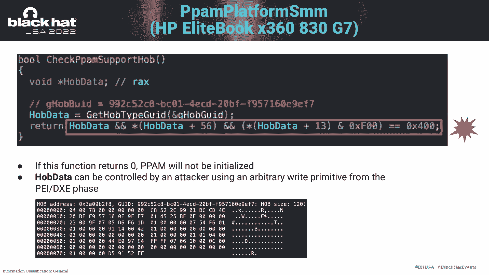

所以我会移动得更快一点，只是为了能够在下一张幻灯片上涵盖非常重要的信息。

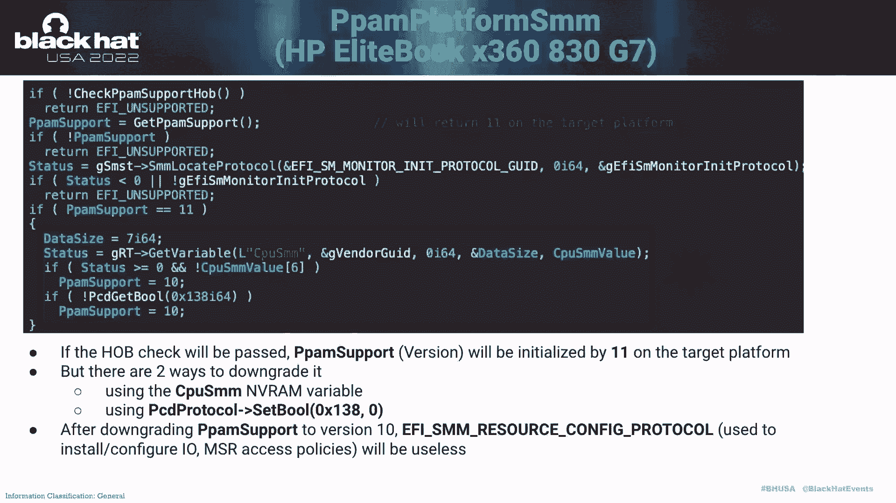

所以人是显化的，当然它应该被签名和证明应该对这份清单有效，不幸的是，我们的发现，跨多个供应商和平台的所有证书。

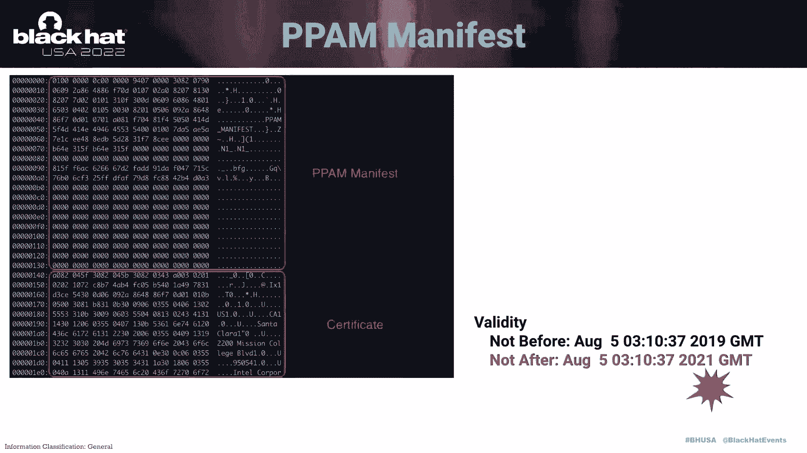

它们已经过时了，只是证书上的更多细节，实际上对这个进行逆向工程。

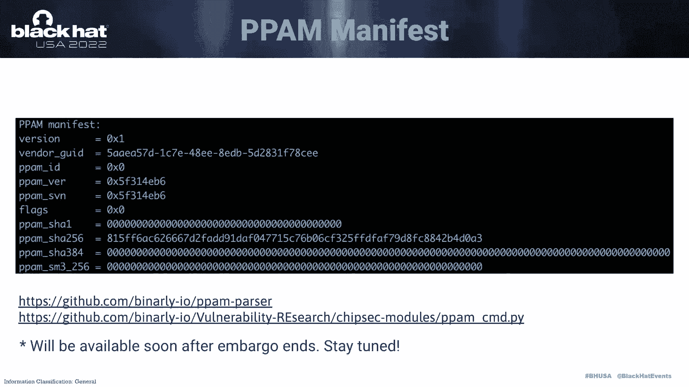

所有的解析都将在稍后提供，人们实际上已经过时了，不是在一个平台上，正如我提到的，我们检查了很多不同的平台，大概是20，它是最早的PM配置和实现之一，基本上这就是为什么它在野外不多。

但我们像检查200个系统一样检查它，所有这些实际上都与前一年的证书过期了，这个特性的证明是什么意思，它就是不起作用或者从来没有用过，所以我认为这个证书已经嵌入到参考实现中了，来自硅供应商。

然后运送到设备制造商，他们只是在适当的地方使用这个参考实现，从来没有更新过，的根证书，这个证书实际上是英特尔公司颁发的，我认为这也表明了一个非常重要的子供应链问题，这是不做的，需要任何花哨的利用。

所以基本上，呃，这有点像证书有效性的问题，之后所有的验证都会失败，但如果我们会遇到不好的事情，代码是分配的，或更新的固件，基本上会加载失败，还有P，M功能现在只有最多，这是一个有趣的方式。

从不同的角度绕过ppm，这里没有供应商的子供应链失败，也感谢和平，几个月来，我们一直非常努力地与他们密切合作，使所有修复都可用，作为结论，我认为重要的是要记住，因此，这些功能应该由供应商正确配置。

并符合生态系统，再次，静态存储，它应该被认为是一个潜在的攻击面，并实际上打开攻击者的可能性，以获得简单的旁路，并在早期引导过程中引导任意代码执行，这实际上允许老虎获得更有趣的安全边界并攻击平台。

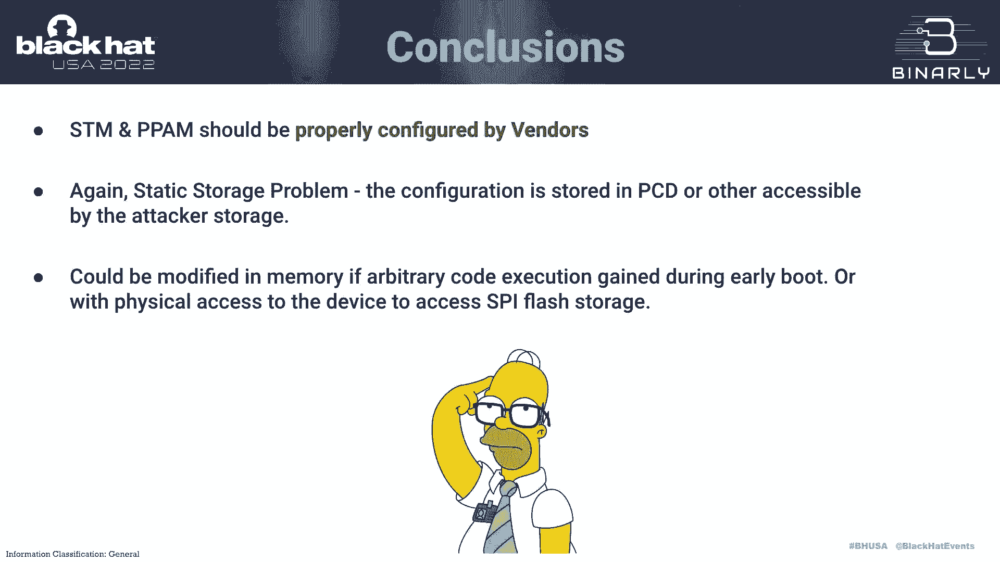

再提醒一下行业的复杂性，它是安全的敌人，实际上，用于大规模检测此类漏洞的固件规则，扫描仪，GitHub上的一切都是开源的，所有的建议都是公开的，所以请欣赏它并大规模地解决这些问题。

