# 【转载】Black Hat USA 2022 会议视频 - P61：069 - XMPP Stanza Smuggling or How I Hacked Zoom - 坤坤武特 - BV1WK41167dt

那么谁对这种叫做XML的惊人技术感到兴奋呢，有些人没事，好的，让我们尝试一些不同的东西，呃，他对信使的零点击攻击感到兴奋，或者更多的人，好的，嗯，那是，太可惜了。

因为它更多的是关于第一个话题而不是第二个话题，我能理解缺乏兴奋，呃，在你们中的一些人关于XML，虽然，因为你看到了，呃，当XML还很年轻的时候，我是一个年轻的计算机科学学生，那时我对此也不兴奋，有些人。

虽然，所以说，你知道，我记得有个家伙，对此感到兴奋，并谈论如何，这项惊人的新技术是如何，我只是，你知道，我站在那里，我礼貌地点点头，但内心我在想，我一定是选错了职业，如此快进，二十年后。

我终于对XML感到兴奋了，因为所有错误的原因，嗯所以是的，xml，你可以用它做一些事情，如果你是安全研究员，无论如何，欢迎大家来到X NPP节走私，或者我是如何黑了Zoom的，我是伊万弗里克。

我是谷歌零号项目的，我已经做了很长时间的安全研究了，十年后我不再数了，因为在那之后数着让我觉得自己老了，嗯，我还写了，编写了一些安全工具来帮助其他人进行安全研究。

我们甚至可能在这次演讲中看到他们中的一些人在行动，对吧，所以让我们来谈谈XNPP，x npp代表可扩展消息传递和存在协议。

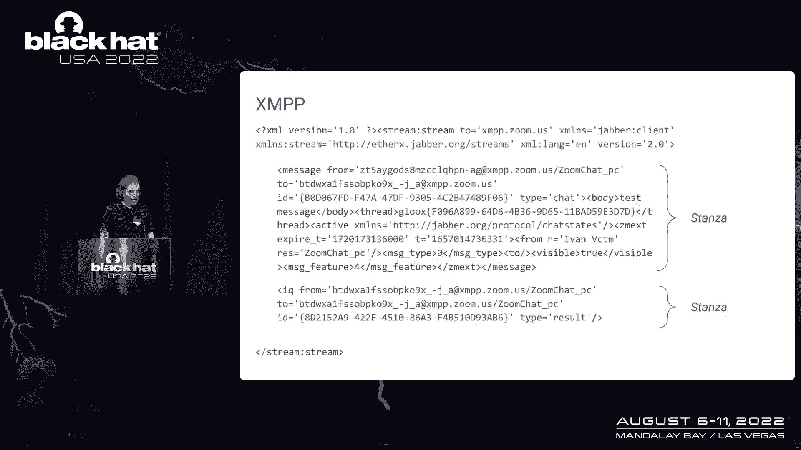

它本质上是一个基于XML的即时消息协议，当一些东西建立在一项超过20年的技术之上时，你知道它是安全研究的一个很好的目标，所以x npp是一个在各种应用程序中使用的协议，应用程序，它是用在，呃。

在一些信使中，它被用于一些具有缩放等消息传递功能的应用程序中，比如说，也适用于其他应用，比如说，现在网络游戏很流行，我也听说在工业应用中，嗯，所以即使这个谈话放大了名字，这不仅仅是缩放。

你今天听到的大多数东西都将适用于其他目标，然而，因为缩放是我所知道的使用X NPP协议的影响最大的目标，在整个演示文稿中，将使用缩放作为一个例子，就像我说的，xnpp是一个基于xml的信使协议。

它的工作方式是，你有，在这里，您可以看到一个XP P流的示例，呃，简化可能看起来像，所以在开始的时候，它从打开一个流标记开始，它将位于XML树的根级别，然后在三个级别中的第一个。

您有一些称为节的XML片段，在这个xnpp协议中，节是传输的基本单元，在这张幻灯片中，你可以看到两节的例子，一个是消息节，和，这是一个从一个客户机发送到另一个客户机的示例，在这种情况下。

它是一个真正的即时消息，第二个是智商节，与第一节不同，iq节通常不会从一个客户机发送到另一个客户机，它是，它更多的是在客户机和服务器之间交换，所以这些是控制信息，当你在安全中看到这个。

当您看到控件消息通过与用户控制数据相同的基于文本的连接发送时，那么你可能会想到注射攻击和缺乏逃跑，这可能取决于，如何实现服务，然而，这并不完全是我们今天要谈论的，相反。

让我们研究这个x npp协议的一些其他特性，所以你可以在这里看到的是一个消息节的例子，从发送者的角度和接收者的角度，所以在顶部你可以看到发送者发送的内容，在底部你可以看到接收器接收到什么。

你可以看到它或多或少是一样的，您可以看到突出显示的消息，但是您也可以在这一节中看到一堆XML标记，所以我想知道的一件事是会发生什么，如果我在这一节中添加一些其他XML标记，和一个令人惊讶的结果。

至少对我来说，这个自定义XML让它一直通过，我不知道你们对此有何感想，但当我看到这个，我就像大吃一惊，因为我以为你知道我可以用这个做点什么，事实证明你真的可以，这里有一个音符，虽然。

您以这种方式放置的任何自定义XML，需要从服务器的角度来看是有效的，因为服务器将解析这个XML，如果服务器遇到解析错误，那么它就会终止连接，不再进一步处理节。

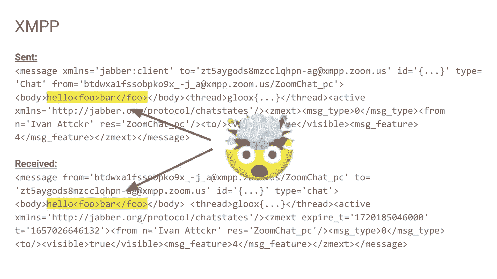

所以说到服务器，让我们来看看典型的x npp基础结构是什么样子的，嗯，我们只关注直接接触XML的部分，显然比这复杂得多，但它的工作原理是客户机向服务器发送一节，它是XML格式的，服务器需要解析它。

然后服务器将根据节类型进行它需要做的任何处理，然后如果服务器决定这是一个节，它需要转发给另一个客户端，它会连载它，它将把它从对象表示转换回文本表示，它会解析它，呃，它会，它会，嗯。

通过流连接将其发送到客户端，然后客户端需要再次解析它，所以在这一点上让我们试着回答这个问题，这里会出什么问题，你已经看到的答案的第一部分，也就是说，您可以通过这个管道发送自定义XML，但是嗯，靠自己。

这不会给你任何东西，然而，让我们把它与XML很复杂的事实结合起来，XML解析器有怪癖，如果你不知道我说的怪癖是什么意思，那么这里有一个挑战给你，为我找到两个XML解析器，两个不同的XML解析器。

对于每一个输入，总是会产生相同的输出，我敢打赌你的日子一定不好过，用那个，在这一点上，让我介绍一下我所说的X npp节走私攻击，理论上，这是一种攻击，客户发送一节，嵌入一些自定义XML。

服务器解析这一节，看到一个节，没有异常将其发送给客户端，然后客户端再次解析这个，但不是看到一节，它是多节，所以在某种程度上，我们通过服务器将诗节从一个客户机走私到另一个客户机，因此攻击的名字。

这不是一个单一的漏洞，事实上，可能有不同的漏洞类型支持这种攻击，例如，我看到的第一个类型是由于XML之间的差异，客户端和服务器上的解析器，但是，您也可能有只在服务器上启用此攻击的bug。

通常由于解析器和序列化器之间的交互，最后，您还可以只在客户端上有bug，再一次，这个演讲不仅仅是关于缩放，所以在这里你可以看到影响缩放的bug，还可以看到影响其他目标的bug。

其中一些bug影响了多个目标，我既不能确认也不能否认，这张幻灯片中没有列出其他bug，但正如我所说，缩放将被用作一个例子，因此，了解这个xmvp基础结构的样子是很有用的，在缩放情况下，依此类推。

客户端缩放使用一个名为glux的库，它是一个XNPP客户端库开源，嗯，它有自己的XML解析器，在服务器上，缩放是基于x npp服务器，称为e或d，是用二郎文写的，如果你能相信，一个名为faxml的库。

用于处理所有与XML相关的内容，快速XML使用另一个库，哪个更受欢迎，在这一点上，它被称为XML解析的导出，你可能想知道，他怎么知道Zoom在他们的服务器上运行什么，嗯。

每当我想知道某人在他们的服务器上运行什么时，我喜欢看的一件事是其他工作床位，在这里你可以看到，ZOOM招聘前NPP高级工程师的招聘广告。

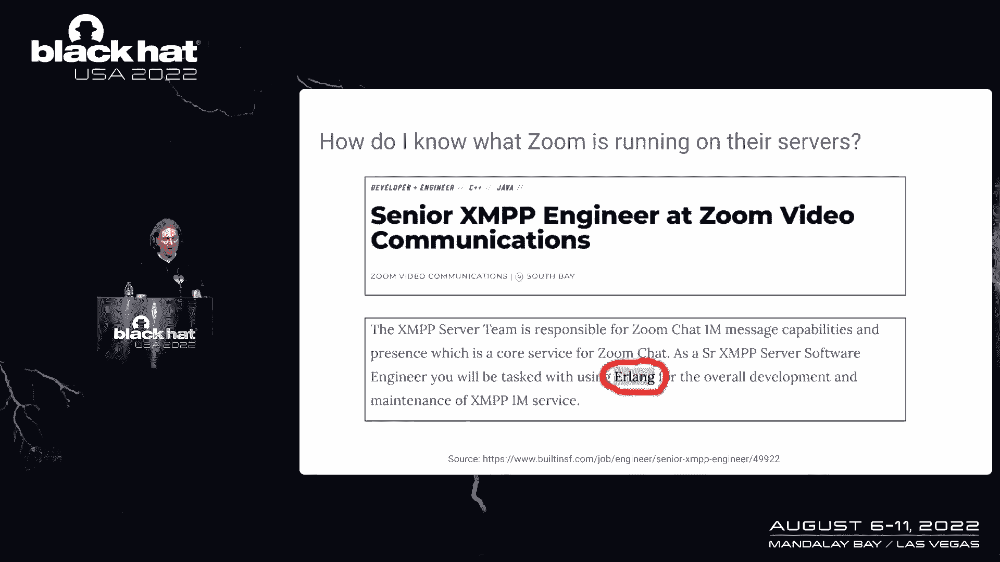

这里有一个词很突出，这个词是erlang和erlang与xmvp的组合，只能表示每一个D，所以在这一点上，让我们来看看支持这一节的几个bug示例，偷偷带回来，我们要看的第一个例子是。

由于客户端和服务器上的解析器之间的差异，这个和uf 8有关，你可能会说，哦不，现在他要谈论UTA了，毫升不够好吗，嗯，是呀，我只是短暂的，对不起，所以基本上。

你唯一需要知道的关于UTF 8的事情就在这个表中，摘自维基百科，为了这次演讲的目的，你唯一需要知道的是，在TF8中，您可以使用不同数量的字节对字符进行编码，所以有些字符可以用一个字节编码。

有些使用两个字节，有些使用三个字节，有些使用四个字节，例如，如果你有一个字节e b x，那么它可能是一个三字节序列的开始，我是说可能是因为如果你有这样的序列，那么它实际上是一个无效的序列。

因为虽然第一个字节是三字节序列的有效开始，剩下的两个字节需要设置它们的最高位，为了使序列有效，但是现在让我们来看看不同的XML解析器是如何处理这个问题的，无效uf八序列。

导出解析器将声明这是一个有效的三字节字符。

胶水解析器会声称这是三个不同的字符，有趣的是，除了这两个解析器不能达成一致之外，这两个都是错的，这是一个无效的序列，它应该导致解析错误，所以如果我们把这个基本原则更进一步。

然后你可以用它做一些有趣的事情，例如，您可以构造一个字符串，如果在x处用x解析，但会看到单个XML标记，但是，如果用Gooks外观解析相同的字符串，会看到两个标签，然后如果你如果你拿着这个更进一步。

那么应该不难看到，直觉上这可以用来走私节，这里，你看到我在缩放攻击中实际使用的有效负载了吗。

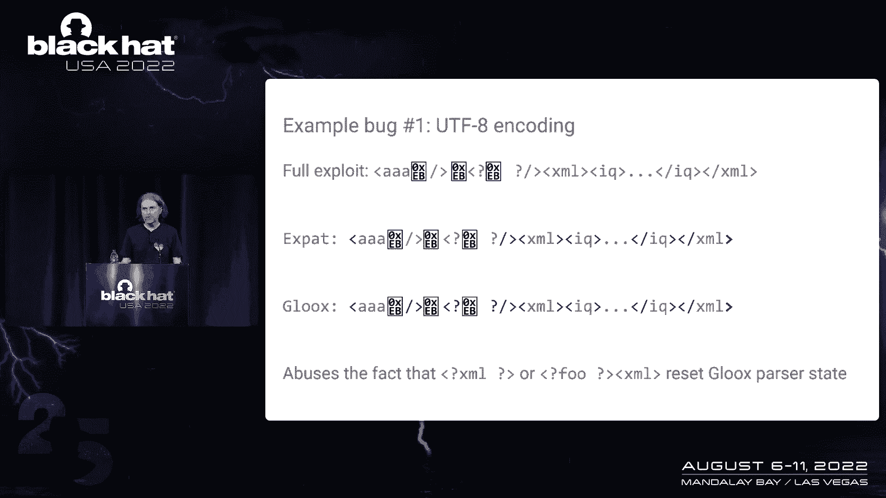

我们不打算详细分析这是如何工作的，因为，为了节省时间，我认为从最后一张幻灯片中了解基本原理更重要，然而，我要说的一件事是，谈话不仅仅是关于变焦，因此，除了缩放之外。

这个完全相同的漏洞也影响了思科的jabber，因为思科的Jabber与思科的IMN存在相结合，使用与它们完全相同的解析器对，所以这是一个漏洞的例子，由于客户端和服务器上的解析器之间的差异。

现在让我们看一个不同漏洞的示例，仅服务器漏洞，这个是非常具体的出口，看看它是如何工作的，我们需要了解导出解析器是如何使用的，所以在幻灯片中，你可以看到相关的初始化代码，这里最相关的部分是最后一个参数。

它的值是x，这是什么，它是一个分隔符，当导出向库用户返回标记名时使用，e ardy或fast XML，在这种情况下，了解它是如何工作的，让我们看几个例子。

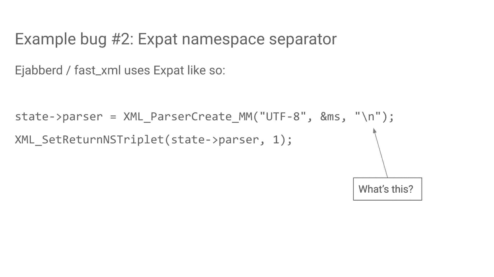

例如，如果有具有命名空间属性的标记，您从expat收到的是一个命名空间，和使用此分隔符连接的标记对，如果标签也得到一个，如果标记也有前缀，因为在这种情况下，而不是命名空间标记对。

用户再次收到命名空间标记前缀三元组，现在使用这个分隔符调用级联，你可能在安全方面很清楚，每当使用分隔符连接字符串时，您需要特别注意连接的组件字符串，不能容纳这个分隔符，所以让我们看看这里是否真的是这样。

因此，如果您只是试图在名称空间属性中添加一个新的行字符，那是行不通的，然而，如果你对它进行数字编码，用户接收到的看起来像用户的命名空间标记前缀三元组，然而，用户认为是标记名的内容。

实际上将是名称空间属性的一部分，这很快就会变得非常糟糕，因为你可以加入其他角色，标记名称中无效的命名空间属性，所以说，比如说，您甚至可以构造标记名，然后呢，放置在标记名中的所有字符都将按原样输出。

一次又一次，直觉上应该很明显，这可以用来走私节，这个bug甚至可能比前一个更危险，因为前一个需要一对特定的XML解析器，这个影响了每个使用这个服务器的人，这是一个相当流行的X NPP服务器，所有的权利。

所以现在我们已经看到了一些bug示例，让我们来谈谈你如何自己找到这样的虫子，两种明显的方法是黑盒测试和代码审查，你可能会想得很好，UF 8的问题可以通过黑匣子测试来发现。

分隔符问题很容易通过代码审查发现，然而，如果你认为这就是我发现这些问题的原因，那我就把你骗了，因为这两个问题都是用模糊发现的，由于模糊处理更常用于发现内存损坏问题，了解如何使用它来查找像这样的逻辑错误。

所以我们再次回到XML管道幻灯片，因为这是我们需要做的事情，然而，我们要做任何形式的网络模糊，这将是一件非常愚蠢和浪费的事情，请不要做网络模糊，除非你绝对必须，而是。

我们只是要把在这里发挥作用的图书馆拿出来，并把它们放在一个二进制文件中，然后每当你为逻辑错误禁食时，您需要定义的一件事是什么构成了bug，对我们来说，我们要考虑的是，bug将是解析错误。

在此管道的最后阶段，在客户端的XML解析器中。

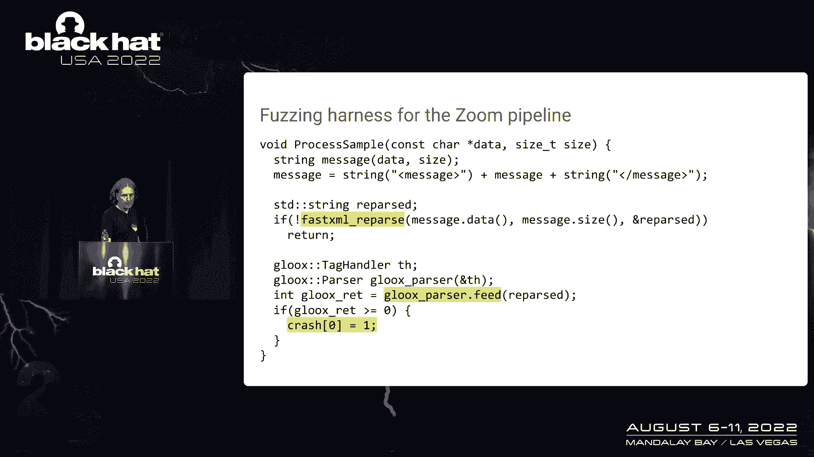

所以在这里你可以看到一个例子，取自我用来大惊小怪的起毛背带，所以它的作用是，它取了一个样本，然后将其馈送到服务器解析器和序列化器，如果这一部分出错了，这意味着服务器捕获了一个错误，所以我们只是返回。

我们不认为这是窃听器，没有撞车，然而，如果这部分成功了，然后我们获取服务器序列化器的输出并将其输入客户机解析器，如果这一部分出来了，那么这意味着客户身上有什么东西，客户不应该看到的，它一直通过服务器。

所以如果我们得到这个，在这里，我只是通过强制一个新的指针取消引用来导致崩溃，如果你发现这样的bug，这并不一定意味着它可以被用于节走私，然而，至少在我的情况下，我通过这种方式发现的所有bug都证明了。

可用于起毛。

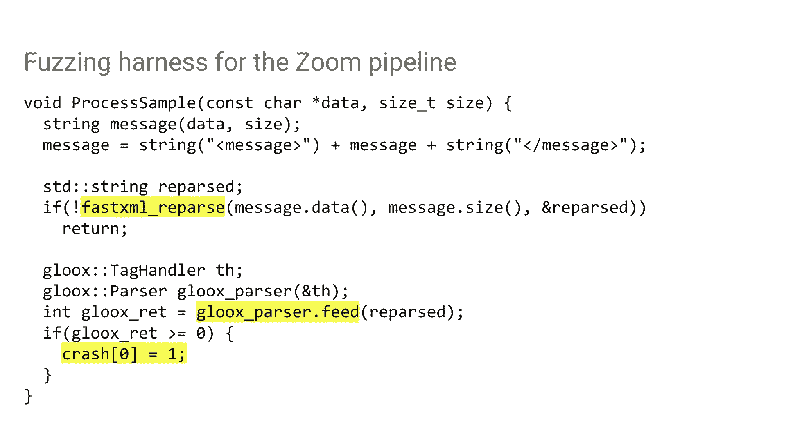

这个，我用了，Jea Fuzzer，嗯，没有必要用这个模糊器，你可以用你喜欢的任何毛茸茸的，然而杰克·洛普是我写的父亲，我实际上用的是，每当我做任何通用的引信，我觉得很不错，虽然，我可能有点偏见，然而。

关于选择父亲有一件事很重要，你父亲有报道反馈，看看为什么这很重要，考虑到当我暂停这个，我的输入语料库很糟糕，像XML和S这样的属性，所有这些都是浏览器自己找到的，只使用覆盖反馈，魔法，所以在这一点上。

你看到了一些bug，你知道怎么找到他们，但你能用它们做什么可能并不明显，对我来说也不明显，当我开始这项研究的时候，我有一些虫子，但有一段时间，我觉得自己有点像一个支撑诺姆，你知道，我有些东西。

我想用它做点什么，但中间的一步是一种威，所以让我们看看你能对节走私做些什么，您可以做的第一件事就是消息欺骗，这意味着您可以向另一个客户端发送消息，另一个客户会认为这条消息来自某人，谁没有真正发送它。

这是因为如果您走私一个消息节，那么它所有的属性，会完全在你的控制之下，这是你可以用这种节走私攻击来做的事情，然而，这可能是你能做的最不有趣的事情，你可以尝试做的更有趣的事情是。

将x npp连接重定向到另一台服务器。

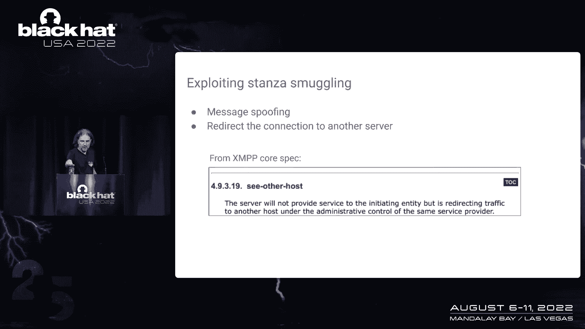

给你的能力是能够拦截，受害者的所有通信，好消息，至少对攻击者来说，x npp规范已经提供了一种通过，参见其他主机错误节，不幸的是，尽管我看到的大多数XMVP实现，不执行规范的这一部分。

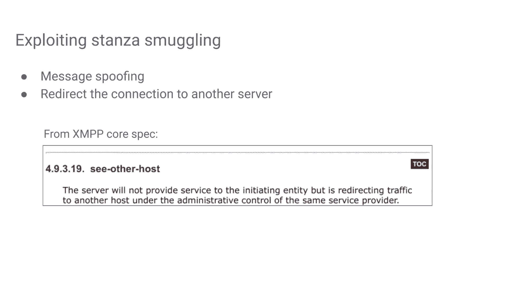

不过，好消息是，即使他们没有按照规范的规定实施，他们仍然实施它，但他们以自定义的方式实现它，并不总是，但有时他们为什么这样做，而不仅仅是遵循规范，我不知道。但很明显他们仍然，呃，x npp安装。

尤其是较大的仍然发现这个功能很有用，您可以尝试的另一件事是查看自定义xmvp扩展，比如说，zoom客户端为x npp协议定义了超过50个自定义的特定于zoom的扩展，然后。

如果您在这些扩展上发现任何配置数据，那么它当然完全在你的控制之下，你可以试着寻找记忆的另一件事，否则您无法访问的损坏bug，因为他们需要一个客户可以发送给另一个客户的支架。

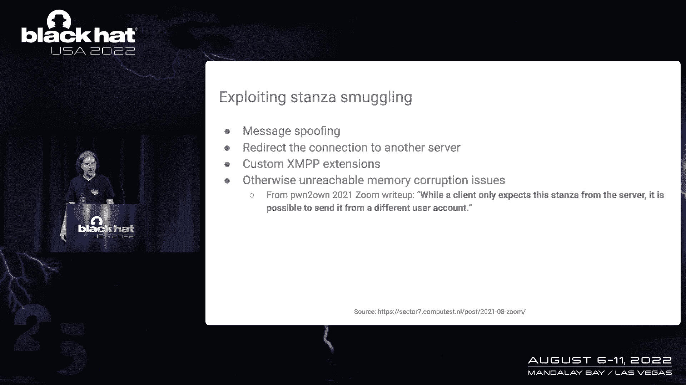

所以这里，比如说，2。你有一篇去年的引文，在通常，一个客户现在不应该能够发送给另一个客户，在这种情况下，由于与节走私无关的问题，这是可能的，然而，当你有一节走私原始人。

那么您就不需要担心一个客户端可以向另一个客户端发送什么，你可以把你喜欢的东西。

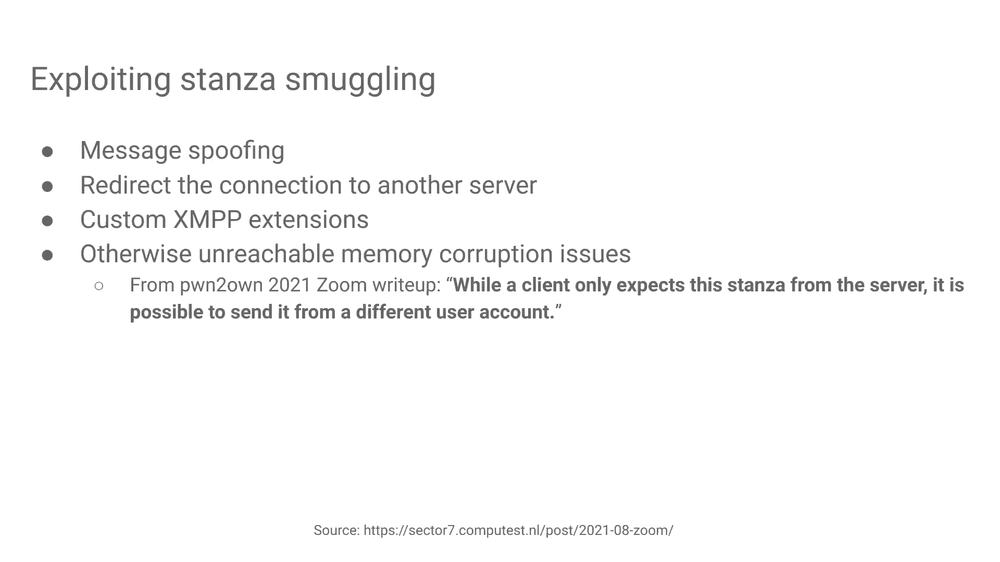

让我们现在，试着把所有这些放在一起，用它来黑缩放，当我开始这项研究的时候，我尝试了各种方法来利用缩放，主要是我在看自定义的PP扩展，我发现了一些有趣的东西，但没有什么能真正给我零分，他们他们RC，突破。

然而，当我注意到缩放时，对Glux库进行了自定义更改，特别是Lux库中错误节的处理，缩放编辑对错误节中名为吊销令牌的标记的支持，这个被撤销的令牌标记支持一个名为Web domain的属性，很自然。

我想知道如果我把自己的域名放在这个网站里会发生什么，域属性，会发生的是，我会得到一个端点的http post请求，称为群集交换机，所以在这一点上，嗯问题变成了，这个群集交换机端点做什么，为了找出这一点。

我在中间设置了一个人代理在反向代理模式下，这意味着它将请求代理到实际的缩放服务器，然后当你这样做的时候，您可以观察来自服务器的响应，以及此端点的服务器响应是什么。

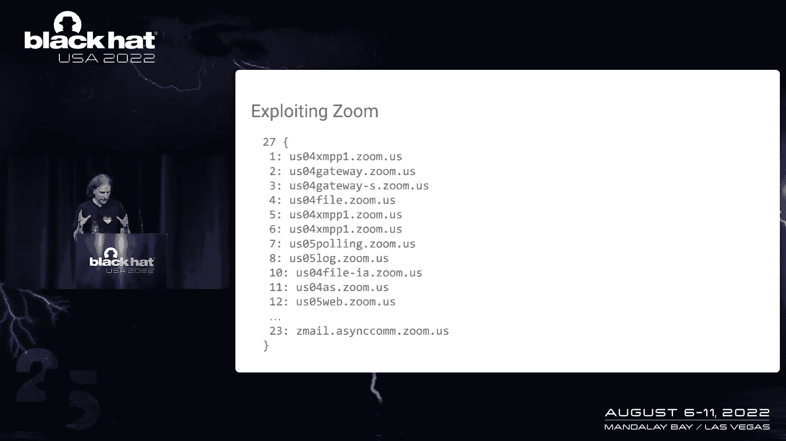

这是一个非常大的配置原型buff，但我觉得最有趣的是那个原始buff的部分，是一个相当大的域名列表，这些是缩放客户端使用的域名，当连接到缩放服务器上的各种服务时，例如，有一个Web域。

有一个x和pp的域，等，如果你把所有这些都替换掉，那么你就可以拦截所有的通信。

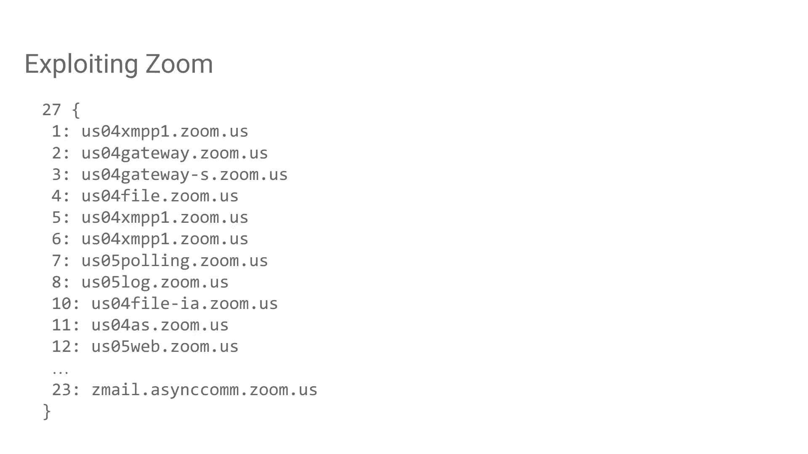

在缩放客户端和缩放服务器之间，已经很不错了，然而，我真正想要的是零点击RC，正如我提到的，我有一个如何做到这一点的想法，那就是劫持自动更新机制来做到这一点，我替换的是缩放客户端使用的域。

连接到缩放的Web服务器，所以让我们回顾一下到目前为止的攻击情况，他从攻击者利用一节开始，走私问题，并发送带有带有撤销令牌标记的错误节的有效负载，当受害者客户收到这个，它立即请求群集的端点。

攻击者可以代理，但替换用于使用的域，用于Web，然后最终客户机将使用发布节点端点请求自动更新信息，我们可以再次代理这个，但是，缩放自动更新的工作方式是缩放下载两个文件，一个叫做安装程序exe。

另一个叫缩放MSI，尽管这个被称为MSI，嗯，因为我们可以替换这两个文件，你可能在想游戏结束了，不幸的是，不完全是因为完整性检查，特别是缩放客户端在运行安装程序出租车之前检查它的签名。

退出的安装程序检查缩放的哈希，开箱前的MSI，乍一看，这看起来很坚固，对吧，但你可以做的一件事是降级攻击，特别是，我发现第四版，缩放安装程序的四个在一方面仍然正确地由缩放签名，但另一方面。

它保持完整性检查，消耗那个MSI它只是打开它，所以实际上看起来游戏在这一点上结束了，所以让我们来看看所有这些在行动中。

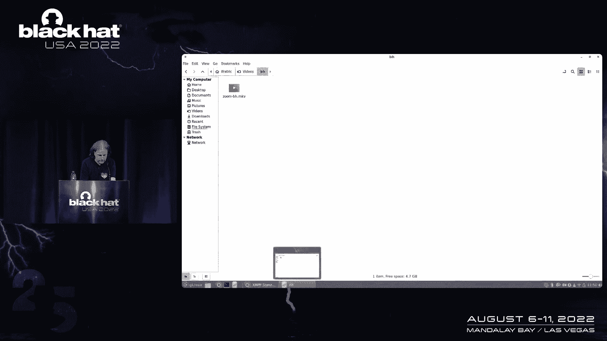

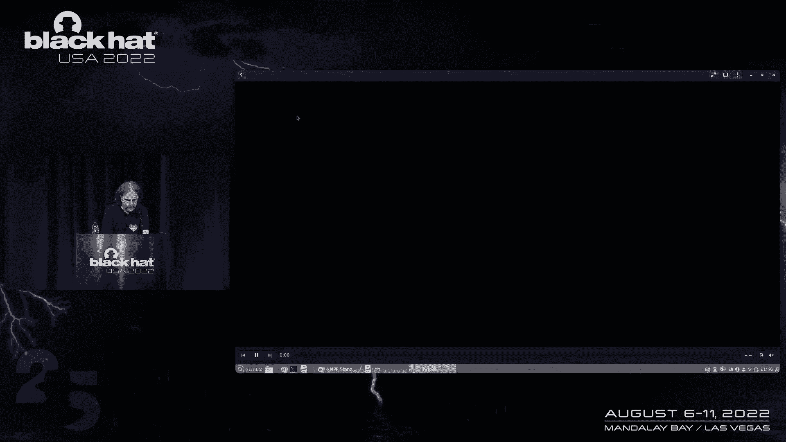

对不起，让我重新开始，这是一个视频演示，它需要一个视频演示，因为bug是在缩放服务器上修补的，所以即使我有，老客户，那是行不通的，很抱歉这里发生了很多事，嗯，文本可能有点难看，但你不需要看到它。

我会解释发生的一切，但如果你只是想看得更好，然后请随意靠近房间里的屏幕，所以我们这里有一个攻击者vm在左下角，左上角的攻击者代理，和屏幕右侧的受害者VM，它只是一个干净的窗户。

安装时具有最新版本缩放的VM，攻击由攻击者在检测下运行缩放客户端开始，此检测允许攻击者拦截和修改原始x npp通信量，所以在这里你可以看到一些交通，接下来攻击者会发送一条非常特殊的信息。

后台运行的检测将用节替换此消息，当受害客户端收到此消息时，它立即请求群集交换机端点，我们代理，然后从这一点开始，受害者线继续使用我们的服务器而不是缩放的Web服务器，呃，接下来会发生什么。

我要重新开始吗，受害者机器上的客户端，原因是缩放检查自动更新，开始后大约一分钟，它也可能在其他间隔发生，我没有检查，嗯，但即使攻击需要受害者重新启动，客户，我仍然认为它是零点击。

因为每个人都要重新启动他们的电脑，有时候，至少要安装操作系统更新，如果你做得不好，那你就有更糟糕的问题了，然后缩放x播放，只是在等待，嗯，我们只是在等受害者客户查看最新情况，我只是跳过前面。

直到发生的点，其实，我不需要它，它随时都会发生，现在您应该会看到一个发布节点设置点的请求就在那里，然后下载这两个文件，你看到了几张幻灯片，所以首先是更新存档，它有点大，所以需要一些时间，第二个文件更小。

所以应该很快就做完了，然后如果您再次重新启动受害者客户端。

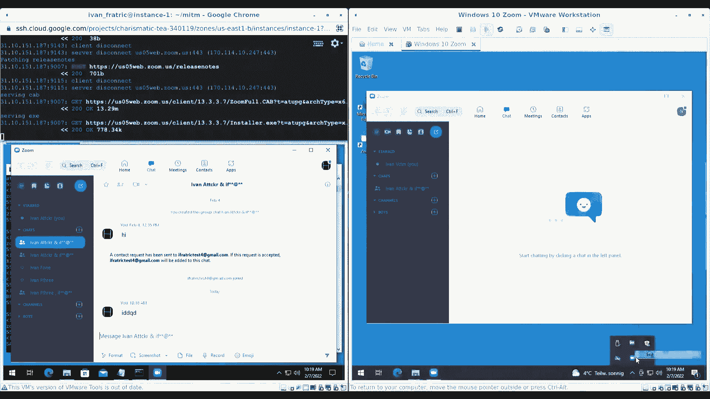

它应该启动自动更新过程，但是，当自动更新完成时，而不是启动更新版本的缩放，你得到了别的东西，计算器只是显示我有RC的一种手段，在这一点上，在更现实的场景中，你实际上会启动一个普通的缩放执行表。

但你也会发射，嗯，后台你想要的任何有效载荷，好的，让我们现在回到我的滑梯甲板上，我们已经看到的，好的，所以嗯，我认为这些节走私或税收是相当不足的探索，攻击面，我能在不同的目标中找到许多不同的窃听器。

X和PP协议的设计方式使得引入，也要找到这样的bug，虫子本身也很危险，所以影响可以一直延伸到一个相对温和的信息，通过拦截私人通信来欺骗，正如刚才所展示的那样，零点击RC，最后。

请不要估计寻找逻辑错误的fuzzing，最后，最后，我想一些人，多亏了这个故事有了圆满的结局，我相信，他对修复组织问题很有帮助变焦安全团队，他们非常认真地对待所有这些问题，并做出了非常全面的修补，和。

呃，最后是我的团队成员，嗯，我感谢他们在研究过程中提出的令人恼火的有用意见。

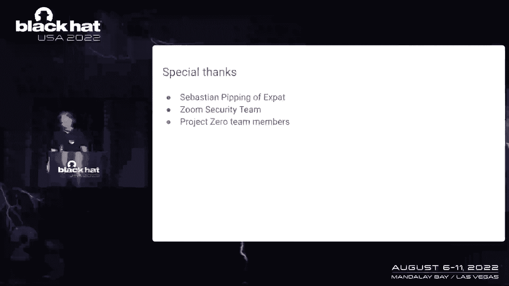

嗯。