# 【转载】Black Hat USA 2022 会议视频 - P62：070 - Pre-Stuxnet, Post-Stuxnet： Everything Has Changed, Nothing Has Changed - 坤坤武特 - BV1WK41167dt

我们向我们的商业客户询问了他们最戏剧性的安全故事，他们现在没有了。

当你在谈论一个好故事的时候，不是最好的故事，一点都没有，嘿记得有一次整个网络都瘫痪了，因为我们被勒索了，看，我们已经使用恶意软件咬人八年或更长时间了，所以我们没有任何恐怖刺激的故事，对不起。

这里没有戏剧，不是在我的房子里AI提供的网络保护只是有效的，所以你可以太恶意软件字节。

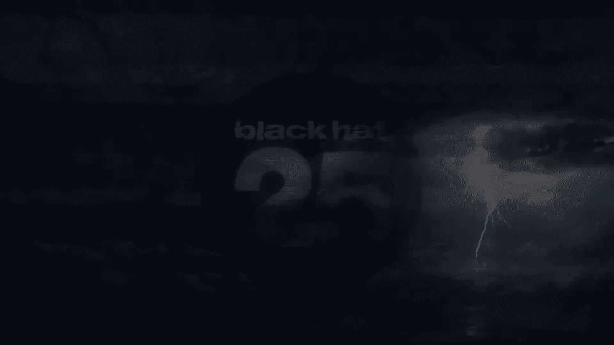

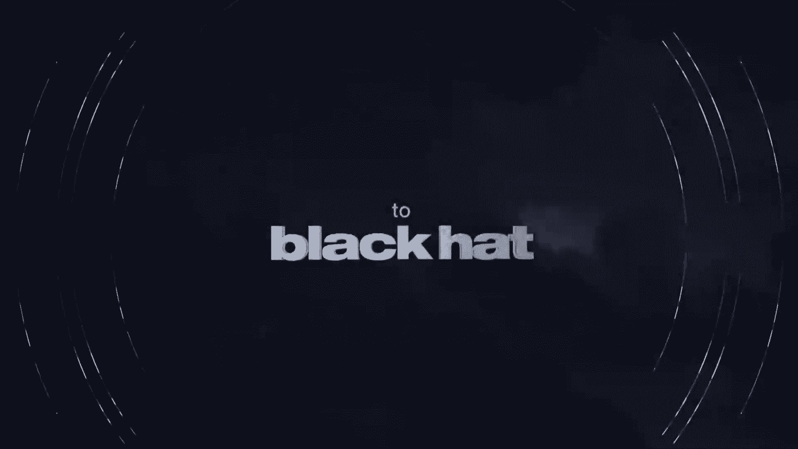

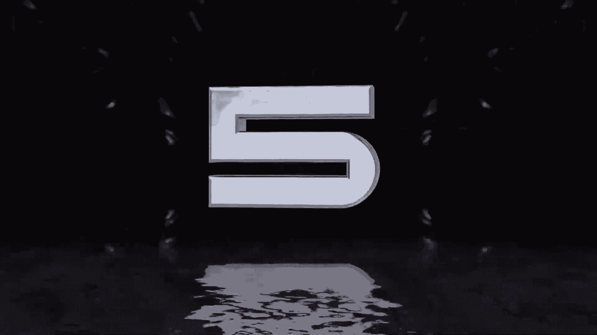

嘿，早上好，各位，呃，熬夜太晚的举手。

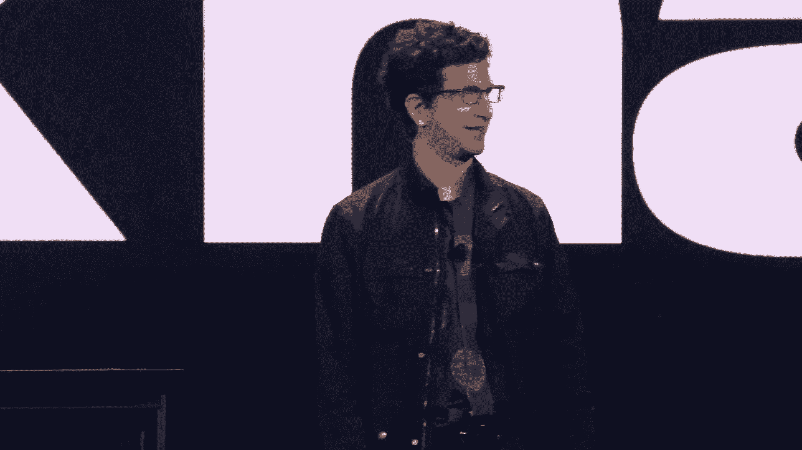

我为你在这里的成功感到骄傲，谢谢。

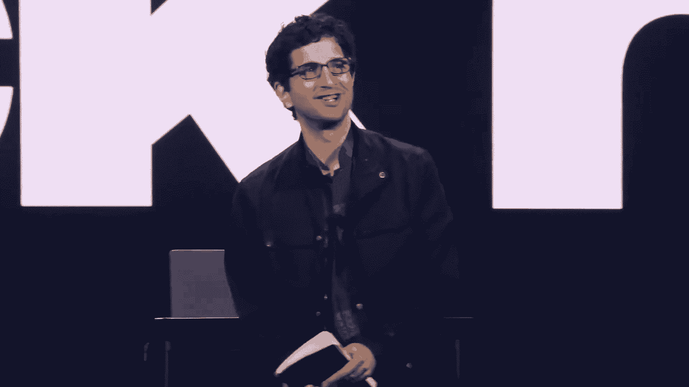

我已经喝了第三杯咖啡了，我昨天说了这么多话，我以为我感冒了，你可以在拉斯维加斯，我在呱呱叫，我只是说说而已。

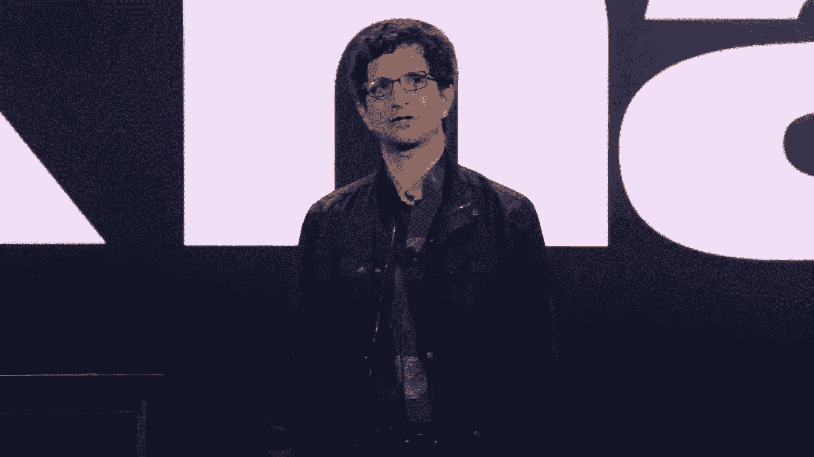

我从来没有在一个地方见过这么多朋友，感觉就像永远，所以是的，这是真棒，很高兴看到大家在这里，所以我很高兴你们第二天都回来了，嘿，在我介绍我们的一天之前，两个基调，金·泽特。

今天是我们两个结婚五周年纪念日，我们试图想出我们会觉得有趣的基调。

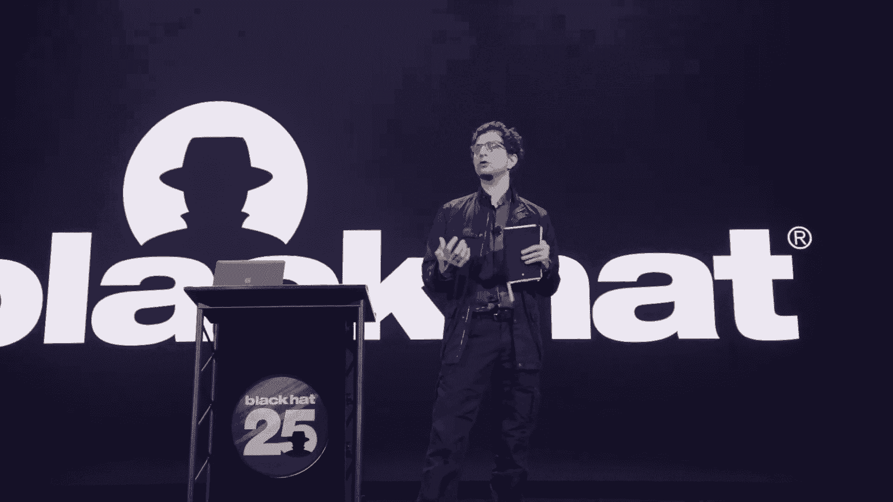

那个，一些你传统上听不到的侧角，在黑帽子或Defcon的基调上，一个围绕媒体的，在媒体周围，如果你在这个空间呆了一段时间，你知道对媒体有一种爱恨交加的关系。

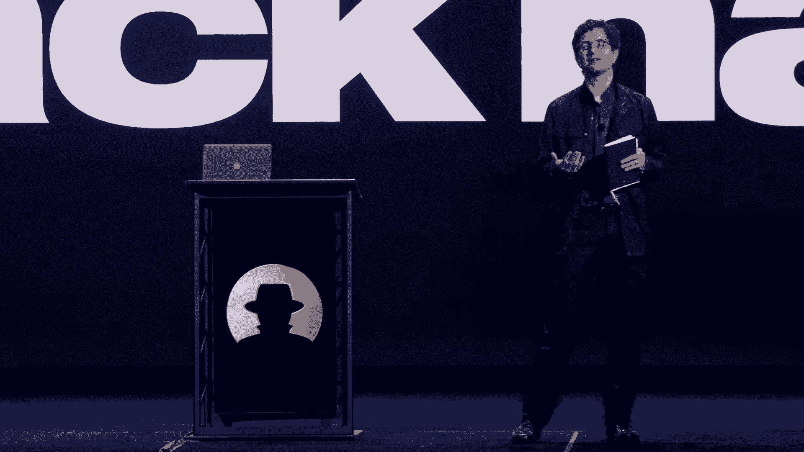

如果你与媒体或你和你的公司有很好的互动。

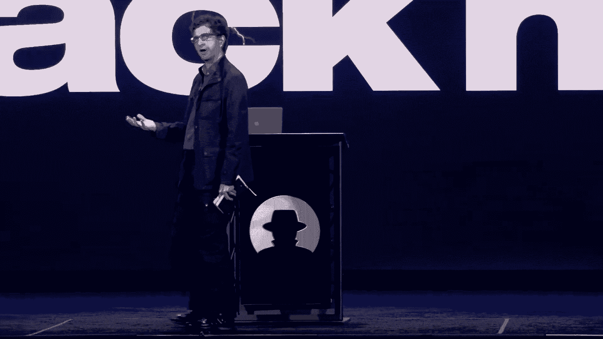

它可能会让你，这可能会对你的职业生涯和你正在做的事情产生很大的影响，但如果你在媒体上有不好的经历，对吧。

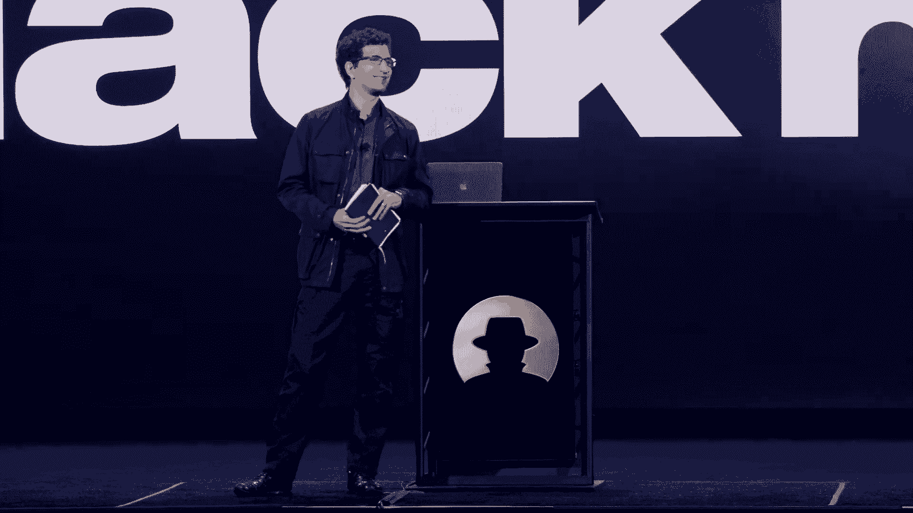

尤其是在推特和社交媒体的今天，它真的会让你崩溃。

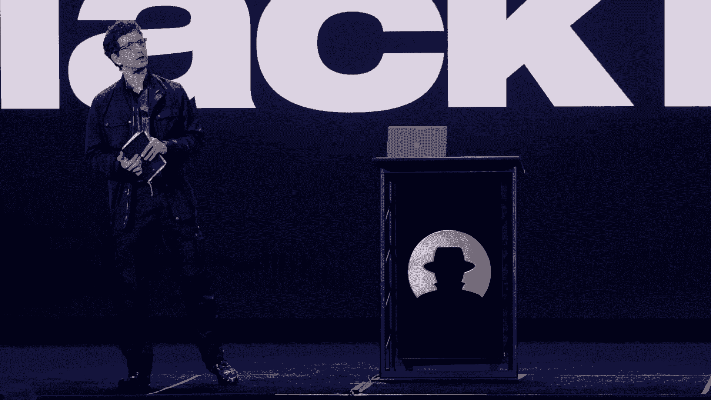

所以弄清楚媒体上的人是谁，你可以信任的记者可能是一件大事，对我来说，从几十年前开始，看到记者甚至关心我们什么，真是令人着迷，黑客在做这件事，所以这是一个很大的自我提升，哇哦，有人在乎，他们想写我们。

然后我们会开始读他们写的东西，他们就像，他们似乎专注于我们头发的颜色，好像真的很重要，比如喝了什么能量饮料，或，你知道它周围的所有颜色。

实际上那里有点缺乏，所以当我们互相分享笔记时，比如你和谁谈过，我们开始意识到的覆盖面是如何的，有很多人想报道黑客攻击和技术，有一些人实际上可以，我们会分享那些人是谁的笔记，实际上有一些邮件列表。

我想自然减员组织有一个已知的列表，好记者，你可以和已知的人谈谈，坏记者，你会远离那个，你对事实不太感兴趣，所以这些年来我们有一些冒险，我们最终禁止了整个拉斯维加斯，当地电视台报道我们的任何活动。

因为他们会这样做，是的，我们非常感兴趣，然后会有一个蓝头发的人，就像在电脑前，摄像机会在蓝色头发的秋千上旋转，穿过所有的锁，挑选和出门，就像这个周末拉斯维加斯的网络罪犯一样，你需要知道的。

你只能让这种情况发生这么多次，你就像不，谢谢电视，所以我们把注意力集中在印刷记者身上，印刷记者是你的朋友，他们习惯于查看多个来源，他们的截止日期和电视人不太一样，所以我们很快转向。

这些是我们想花时间介绍朋友的人，这不是我们唯一一次被，一种恶意的媒体，有一个米歇尔·马迪根的场景，在那里抓住捕食者，如果你还记得那个节目，派了一个卧底记者带着一个隐藏的小摄像头去防御。

他们会试图让未成年的孩子，承认做电脑犯罪，所以他们没有得到媒体通行证，我们知道这是提前发生的，有一点，我们有一个提个醒，发生了一些奇怪的事情，拦截任何人，在她试图让他们做一些有罪的事情之前，然后。

然后我在舞台上揭露了她。

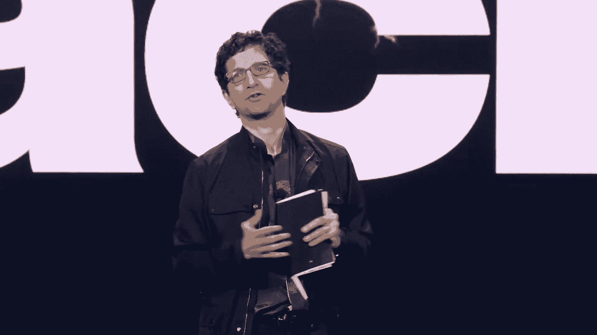

这是一个冒险的举动，但我试图给她一个机会来纠正她的错误并认同自己是媒体，她坐在前排，带着她隐藏的小相机，直指我，就像自己不出去，所以这是一个很长的说法，2。双方的历史积怨很深，有点像黑客和间谍。

黑客与政府，就有这种爱恨交加的关系，所以当我们在想我们想要谁的时候，在这个领域有着悠久的历史，理解双方的细微差别，并一直在那里，金·泽德的名字名列前茅，如果你不知道，金，她一直，在有线公司工作了十三年。

她从政经验丰富，纽约时报，华盛顿邮报，主板，Vice，你知道，她一直在附近，随着时间的推移，她演变成了报道，报道选举，覆盖物。

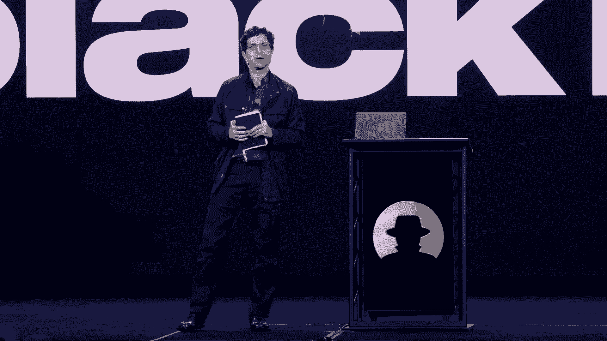

所以我被她面试过几次。

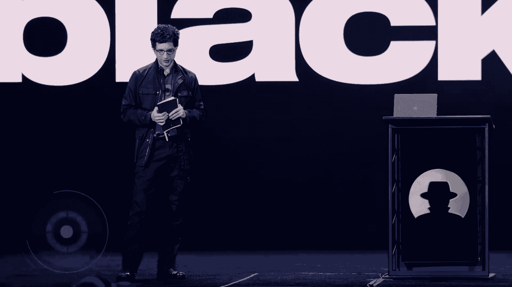

我可以告诉你的是，这从来都不是百分之百舒适的感觉。

知识洞察力，她有正直，她不会回避一个棘手的问题。

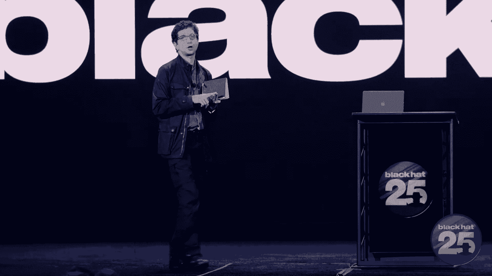

对呀，不是没有垒球，但感觉很真实，就像你完成了金的采访，你觉得我活下来了，我能做到，正因为如此，她的报道，我认为很有见地，所以我真的很想知道她是怎么想的，最近十年，在斯诺登周围张贴，嗯，我们学到了什么。

我们没有学到什么，什么变了，什么是不变的，尤其是他们的长期视角，回首与展望，今年的主题，我们从哪里来，但我们要去哪里，所以我很高兴向大家介绍金·塞特，大家早上好，很高兴见到大家，分开两年后。

我想感谢黑猫，尤其是杰夫的精彩介绍，我真的很感激，但我想感谢黑猫今天早上带我来和你说话，我觉得这是他们第一次请记者来做主题演讲，他们告诉我有两个基调和一个，第一个通常是由工业界和政府的人完成的。

第二个是由社区里的一个记者做的，我当然要努力保持独立和公正，但我确实认为自己是这个社区的一员，因为我认识你们中的许多人已经很久了，我很荣幸信息社会认为我是其中的一员，也是。

所以今天早上我想先给你们讲一个故事关于一个接近我的线人，这是前阵子的事了，回到2006年，当我为《连线》撰稿时，他来找我说了一个似乎难以置信的故事，这是在一系列大规模银行卡号码泄露事件发生后发生的。

消息人士告诉我他有一个前排的座位来观看所有的行动，他知道所有球员的真名，他就在事情的最深处，他声称他为联邦调查局卧底工作了18个月，经营地下梳理论坛，这样他就可以看到网络罪犯是如何，策划了他们的阴谋。

出售对黑客系统的访问权，贩卖黑客工具，被盗的身份和银行卡号码，甚至写客户评论，就像在Yelp上，对他们犯罪同事的货物和客户服务进行分级，在这种情况下是金子，比特币的前身，在2009年推出之前。

消息来源声称他一直在，他被联邦调查局告发了，他讲的是一个伟大的故事，但有一个问题，他是个职业骗子，他开始了写空头支票的职业生涯，然后他最终变成了一头骡子，对于俄罗斯和乌克兰黑客来说。

然后他就把货物用栅栏围起来，然后他把钱汇到乌克兰白俄罗斯或者俄罗斯，使用E金，所以消息来源声称他被联邦调查局推翻了，在他被捕后的一天，他在做他的骡子手术，他在那里经营这个地下论坛。

现在联邦调查局不可能证实这个故事，他们不可能确认，消息来源为他们卧底，但消息来源有收据，就像他们说的，他给了我目击监狱采访的公设辩护人的名字，联邦调查局把他翻过来的地方，他有数百个聊天记录。

他运行的论坛的私人聊天日志，显示黑客计划他们的犯罪活动，为拙劣的交易和欺骗伙伴而争吵，笑着说没有人会抓住他们，因为你，中国的执法部门太无知，太缺乏技能，技术上太困难了，无法理解发生了什么。

所以在接下来的六个月里，我不得不努力确认一切，他告诉我，我追踪犯罪计划的受害者，在聊天记录中绘制的，我找到了目击监狱面谈的公设辩护人，他不情愿地承认联邦调查局确实推翻了他，我找到了西雅图公寓楼的前经理。

他告诉我联邦调查局确实付了公寓的租金，还给了他一个电话号码，万一消息来源出格了，所以我告诉你这个故事，因为这很可能是去年甚至上个月的故事，不是二千零六，今天。

黑客如何经营他们的犯罪企业没有什么实质性的不同，他们仍然组织地下论坛，他们仍然在等级结构中作为企业经营，他们还在赚钱，很多，主要的区别是，他们有十多年的时间来完善他们的运营，变得更加专业。

现在他们为工人提供有薪工作，甚至带薪休假，但他们还在争吵，他们仍然互相欺骗，他们仍然认为执法部门不会抓住他们，有时他们是对的，所以太阳底下很少有新的东西，就像他们说的，细节可能会有所不同。

但20年前发生的同样的事情直到今天仍然发生，这里有一个2008年的勒索软件故事，与今天的勒索软件攻击相同的元素，数字货币收取赎金，一名猝不及防的受害者，不愿意与美国合作的俄罗斯政府，s，当局。

今天有什么新鲜事，当然啦，赎金的大小，500美元在当时是很大的，今天他们会达到500万美元或更多，以及以关键基础设施为目标，医院，食品制造厂，和管道，而不是针对个人，大案之一，当然啦，勒索软件。

是去年殖民管道黑客攻击，达到国家安全的程度，并促使政府最终解决管道安全问题，在十多年的大部分时间里，这是一个分水岭时刻，就像他们说的，但如果有人对这次袭击感到惊讶，他们不应该。

因为当震网病毒在2010年被发现时，这是完全可以预测的，它揭示了漏洞和关键基础设施，以前很少有人注意到，直到那时和现在，安全社区主要关注IT网络，他们以前忽视了所谓的运营网络，网络，工业控制系统。

所有这些管理管道和铁路的系统，以及电网和水处理厂，制造业和许多其他关键行业，stuxnet提供了明显的证据证明对关键基础设施的物理破坏，只使用代码是可能的，但没有人应该感到惊讶。

有关于使用数字武器扰乱或摧毁关键基础设施的警告，震网十年前，在Stuxnet被发现的同一年，极光行动暴露了，你们中的许多人可能还记得，这是中国广泛的间谍活动，打击了34家公司，和谷歌的目标源代码存储库。

土坯和杜松，并包括第一批重要的供应链业务之一，瞄准RSA的种子库，多因素认证系统的引擎，极光向公众介绍了APT的先进，持续的威胁和民族国家黑客日益增长的能力，安全界，在那之前，它主要集中在网络罪犯身上。

开始更多地关注民族国家行为者，以及使，网络罪犯的行为感觉有点古怪，黑客行动变得更加激进和重要，OPM黑客，DNC黑客，不是佩蒂亚太阳风，但这一切都不应该令人惊讶，极光行动背后的黑客，正如我提到的。

通过源代码管理系统的源代码存储库，跟踪源代码更改和更新的系统，原来有安全漏洞，以下是德米特里·埃尔·佩罗维奇，在2010年说过这件事，源代码管理系统是开放的，从来没有人想过保护他们，然而。

这些是大多数这些公司的皇冠上的宝石，在很多方面，比任何财务或个人身份数据都有价值得多。

他们可能有，他们可能有，花这么多时间和精力保护，这是去年有人告诉我的，在黑客在建造过程中向太阳风软件注入后门后，报价，软件制造商有所有这些安全机制来检测源代码的更改，在源代码存储库中。

但没有保护构建环境，因为以前从来没有人在软件构建过程中注入恶意软件，你发现图案了吗，缺乏想象力，或者对黑客的下一步行动缺乏预期，这里经常是这样，所以我把这个叫做前震网，后震网，一切都变了，什么都没变。

因为Stuxnet在那一年，2000年和2010年经常被视为一个界限，在它之前和之后之间的不安全感，在安全方面有了很多真正的进步，自从黑猫二十五年前成立以来，还有很多进步。

自从stuxnet在2010年被发现以来，但尽管有数十亿美元的安全产业和前所未有的政府对威胁的关注，当威胁演员转向新的时，每个人似乎仍然感到惊讶，但往往完全可预测的方向，有几件事真正蒙蔽了我们，然而。

其余的在信号发生之前很久就发出了信号，去年殖民管道发生的事情是可以预见的，越来越多的勒索软件也是如此，以及投票机的安全问题造成的问题，这些年来我报道了很多，俄罗斯人在2016年追求选举基础设施。

我们真的应该问问他们怎么花了这么长时间，对此并不感到惊讶，我们有一个习惯，在威胁发生后对威胁做出反应，而不是为它们做准备，或者忽视声音，警告即将到来的问题的理性，只是在它们发生时争先恐后地采取行动。

那是惊慌失措的司机在东海岸加油站排队的时候，试图把装满汽油罐的后备箱装满，或者当选举官员变得无赖并破坏公众对投票的信任时，所以我今天想谈谈安全环境的变化，在Stuxnet和Stuxnet带来的变化之后。

和我们忽略的事情，直到为时已晚，但首先对那些可能不知道我工作的人来说，我知道杰夫说了一些，但我只给你一个简短的背景，我在PC World的第一份报道工作开始报道安全问题，我在那里工作了几年。

在我搬到有线之前，就像杰夫说的那样，我在那里工作，我为《连线》写了十三年，直到我在二十六年离开，我早年开始参加黑帽和def con，当时Def Con还在亚历克西斯公园酒店举行，从长条上。

那时大约有一千名与会者参加了def con，而不是三万拉斯维加斯，总是有很多东西分散人们对会议的注意力，但在三点，m，在八月的炎热中，可能没有比亚历克西斯公园泳池大会更好的地方了，我们称之为。

你可以在三个游泳池里涉水，迷失在深入的技术或哲学对话中，在技术配乐的背景下，结交终身朋友，在那些日子里，没有安全海滩这样的东西，至少不是在技术之外，主流媒体的新闻记者空降报道安全。

只有当重大病毒或数据泄露影响主流受众时，这往往会在媒体中产生不信任，一种记者并不真正关心安全的感觉，除了传播炒作和关注黑帽黑客的滑稽动作，但在斯诺登湖和DNC黑客攻击之后。

许多媒体意识到他们需要有全职记者在安全巡逻，他们了解这些问题，并能真正将这些技术和复杂的问题转化为主流受众，所以今天我们有一群非常棒的记者来报道这个节拍，当我刚开始参加黑帽和def con的时候。

我有一个巨大的学习曲线，我没有技术背景，我是英国文学专业的，我在研究乔伊斯和乔叟，不是Java和C Plus，但如果你致力于把事情做好并有真正的好奇心，人们很开放，愿意交谈，从最初的日子起。

我有一群经验丰富的黑客和安全专家帮我整理，整理所有的技术细节，避免和回避炒作，所以在那些日子里，我报道了维基解密和朱利安·阿桑奇，在他们成为家喻户晓的名字之前，我报道了他们第一次泄密的早期。

我向一个同事透露了切尔西·曼宁被捕的消息，泄露政府文件，和我，我在密苏里州的T房间揭露了一个秘密，这是在斯诺登揭露其广泛的监视计划之前的几年，我写了很多关于地下推车的故事，以及关于选举安全。

试图引起人们对某事的注意，当时很少有人想关注，终于在2010年随着震网病毒的发现，事情发生了变化，当震网中的极光运动发生时，我的大部分报道重点转向了国家，国家黑客，数字基础设施和，当然啦。

这就引出了我现在想说的，Stuxnet P带来的变化是什么，对不起，我失去了我在这里的位置，stuxnet在安全性上带来了四大变化，第一个是技术和工具的涓滴效应。

在震网病毒创新和计算机攻击之前主要是由地下罪犯驱动的，民族国家黑客从黑客和研究人员那里学习新技术，但是在震网之后，而不是政府向地下学习，在杜克之后，地下组织开始向政府学习，你们中的许多人可能还记得这个。

这是一个间谍工具，由同一个团队的一些人创建，震网背后，在独库被发现后在2011年攻击同一字体的功绩，渲染独库攻击的漏洞，被添加到地下犯罪组织出售的工具包中，不到一年前。

它是用于安装银行业务的最常见的目标漏洞，木马和其他恶意软件，臭名昭著的Link也发生了同样的事情，震网在2016年使用的漏洞，在二千零一六年，在Stuxnet利用它六年后，艾伦·K的脆弱性占了20个。

使用的所有漏洞的5%，微软早在2010年就修补了这个漏洞，但在2015年，研究人员发现这种贴片无效，黑客还在利用它，所以说，震网病毒带来的下一个重大变化是，国家间的军备竞赛，这预示着网络空间的军事化。

stuxnet，突然间每个人都想在游戏中，只有少数几个国家有攻击性黑客程序，但是在震网之后，许多人启动了自己的网络命令进行间谍活动和破坏性攻击，包括伊朗，震网病毒的目标，在哪里。

Stuxnet带来的下一件事是安全的政治化，科研与国防，stuxnet病毒进行了三年的秘密破坏，从二千零一万到二千零一万才被抓，直到白俄罗斯一家防病毒公司的工人发现了它，赛门铁克的研究人员。

和世界各地的其他人对数字武器进行了逆向工程，以确定它的设计目的，Stuxnet背后的开发人员可能认为，伊朗人没有发现，或破译恶意代码，但他们没有指望全球网络安全界帮助他们，还有Stuxnet，新世界。

建立了一个新的世界秩序，安全研究人员在不知情的情况下成为新民兵组织的应征者，一个被招募来拆除各国相互投掷的数字武器的人，这给研究人员带来了新的伦理困境，夹在客户的需求和情报机构的利益之间。

如果stuxnet宣布网络空间军事化，它也标志着安全研究的政治化，数字捍卫者可能会被要求从另一个角度看，以避免破坏他们政府的秘密行动，有一个新的好人，这是埃里克·钦的一句话，从语义。

有一个新的好人和坏人，这个问题可能会让我们陷入非常困难的境地，这是埃里克·钦他在2012年告诉我的，在他们破译完Stuxnet之后，他们的研究没有受到政治影响的影响。

没有人试图阻止语义研究人员挖掘stuxnet，没有人阻止他们公布他们的发现，但秦知道情况可能并不总是这样，如果他的团队被迫在客户和政府利益之间做出选择，他说，这将是一个很难回答的问题。

Stuxnet做的最后一件事是，向安全界介绍一个充满漏洞和关键基础设施的世界，正如我前面提到的，stuxnet让人们意识到了运行管道的系统中的漏洞，水处理厂，等等。

一旦安全研究人员将目光转向工业控制系统，他们在软件中发现了许多安全漏洞，但不仅仅是这样，还有一些基本的架构问题，这些问题永远无法用补丁来解决，有这么多系统直接连接到互联网。

网络安全突然与国家安全联系在一起，但又一次，这不应该让任何人感到惊讶，所以让我们来看看如果我们注意了，我们会看到什么，在一千九百九十七，在蒂莫西·麦克维炸毁俄克拉荷马州的一栋联邦大楼后。

沼泽委员会的任务是研究其他，关键基础设施可能容易受到攻击，无论是物理攻击还是通过数字攻击，在他们提出的最后报告中，委员们对连接石油关键控制系统的日益增长的趋势提出了警告，煤气和电力到互联网，他们写道。

造成伤害的能力正在以惊人的速度增长，我们对它几乎没有防御，这是二十五年前的事了，发送到发电厂控制计算机的命令，可能就像一个装满炸药的背包一样具有破坏性，在我们面临危机之前，我们应该注意我们的关键基础。

不是以后，等待灾难将被证明是昂贵的，也是不负责任的，同年，白宫国家安全电信咨询委员会发布了第二份报告，完全呼应了他们所说的话，写着电子入侵者可以拨号到不受保护的端口。

并将断路器复位到比设备更高的公差水平，在断路器的保护下可以承受，有可能在变电站内实际摧毁给定的设备，确实注意到了警告，随着时间的推移，最终变得更加安全，但许多其他关键基础设施变得更加互联和不安全。

当殖民管道去年被黑客攻击时，许多人对公司支付赎金的速度感到惊讶，当然是一个对美国如此大和关键的企业，China’中国经济，因为殖民管道是他们供应四个，百分之五的燃料运往东海岸，相当于两个点左右。

每天500万桶燃料，它肯定有足够的备份，并制定了不需要支付赎金的应对计划，尽管它确实有应急计划，该响应计划不包括勒索软件攻击，即使赎金，自2015年以来，攻击者一直以关键基础设施为目标。

所以如果殖民时期的输油管在1919年，就在殖民管道被击中的两年前，坦普尔大学开始汇编针对关键基础设施的勒索软件统计数据，关键基础设施，当然啦，是定义的，被定义为政府指定的16个政府类别中的实体。

仅仅基于媒体报道或安全公司公开曝光的事件，寺庙研究人员统计了在2020年对关键基础设施的大约400次再攻击，从11月13日到6月总共发生了146起袭击事件，三十，二千零二十二，这些不仅仅是对医院的袭击。

那个，当然啦，在2016年一直是勒索软件参与者的大目标，但这些也是针对石油和天然气设施的，攻击者不仅仅针对IT系统，他们已经在追捕控制关键过程的OT网络，在二千零二十年，殖民管道被击中的前一年。

授权报告称，七个勒索软件家族袭击了工业组织，自二千零一七年以来，导致货物和服务的生产和交付严重中断和延误，勒索软件行为者变得更加老练，曼迪说，进行内部侦察，以确定哪些系统对生产最关键。

这样他们就可以瞄准这些人并要求更高的赎金，永久的和德拉戈斯的，报告说，针对工业组织的勒索软件包含一千多个关键流程的杀死列表，它们的设计是为了阻止，在他们启动勒索软件或加密并要求赎金之前。

所以如果同年这还不够警告的话，二万二十个DHS是网络安全，基础设施和安全局发布了一份警报警告，特别是关于针对管道的勒索软件攻击，它描述了一次针对天然气压缩设施的攻击，始于网络钓鱼攻击，IT网络。

一旦攻击者进入IT网络，他们从公司网络到OT网络，因为它们没有被正确分割，扩散到梯子上，一旦赎金被订婚，操作员无法获得实时控制数据，这迫使工厂关闭了两天，该计划根本没有应对计划。

在其2020年警报中应对网络攻击，CESA建议管道和其他关键基础设施所有者制定应对计划，进行红队演习，模拟攻击和测试反应，并构建冗余的工作流，以便能够维护关键的操作，在一年后的一次袭击中。

勒索软件袭击了殖民管道，一个工人显然在其他网络的其他地方重复使用的密码，因为Mandient在网上泄露的密码上找到了密码，在另一次入侵中被盗的，还不清楚，如果殖民管道黑客真的通过这种方式获得了密码。

它也没有使用多因素身份验证，所以它为攻击者创造了一条清晰的进入路径，一旦他们有了密码，勒索器在五点左右敲响，I’5月7日，到六点a，m，到下午晚些时候，该公司已经关闭了5000英里长的管道。

首席执行官约瑟夫·布朗特决定支付赎金，第二天就发出去了，我们现在都知道，输油管坏了将近一个星期，并导致了殖民管道无法控制的一连串影响，在这一点上，当疯狂的消费者引发恐慌时，购买黑客本身并没有抬高价格。

这并没有造成燃料短缺，但在1813年的时间里，人们对此做出了回应，在我们的殖民管道被击中之前，对其系统的审计发现它有缺陷，安全最佳做法，罗伯特斯莫尔伍德，谁的咨询公司做了。

审计称殖民管道信息管理做法残暴，并表示，该公司有一个拼凑的连接不良和安全的系统，缺乏安全意识，一个八年级学生可能会被塞进那个系统，他说，殖民管道，去年被黑客攻击时没有CSO，相反。

安全职责落在了一名副手身上，首席技术官质疑斯莫尔伍德的描述，并说它的IT网络是引用未引用的，与管道控制系统严格隔离，但首席执行官布朗也告诉立法者他关闭了管道，因为他担心勒索软件会蔓延到旧网络。

这表明他们对严格的隔离并不像所说的那样有信心，尽管布朗特说他的公司有能力手动操作管道，只有当一小部分管道下降时，这才是真的，如果他们关闭了它的所有五千五百英里，他还说，该公司有很好的数据备份。

但公司支付了赎金，那么，如果一家公司有良好的数据备份，为什么要支付赎金呢，比尔·西格尔，谁是首席执行官兼公司，Cowork Cowar创始人，去年告诉我，这通常是因为一家公司从未实践过从备份中恢复数据。

在他们被黑之前，他们可能有50 PB的数据备份，但如果它在三十英里外的设施里，他们必须通过铜线恢复，可能需要几周或几个月才能获得他们需要的数据，或者他们可能会发现当为时已晚。

他们实际需要进行数据恢复的应用程序在IT网络上，锁住了，所以我不是想打殖民管道，他们只是一个方便的例子，因为这次袭击意义重大，但其他关键基础设施处于同样的位置，或者更糟，在殖民管道之后。

Hack CSA发布了一长串管道基本安全指南，隔离ICS，来自公司网络的滑冰系统和网络，和互联网，并实施强有力的周边控制，限制通信，离开和进入那些边界，使用多因素身份验证，制定网络事件应对计划。

并保持良好的离线备份，与CESA在2020年发布的指导方针几乎相同，在殖民管道被黑之前，当这些出来的时候，许多人想知道为什么CESA会发现现在需要发布这些，在多年来针对关键基础设施的危险信号之后。

这不是应该已经很明显了吗，难道不应该已经做了吗，但是殖民管道，当然啦，表明其中许多措施仍未得到执行，尽管乌克兰电网被黑了，因为他们没有多因素认证，尽管事实上，谷歌和两所大学的一项研究发现。

MFA可以阻止多达90个，9%的大规模网络钓鱼攻击和大约66%的有针对性的攻击，Trellix今年公布的一项调查，它是以前Fire I和McAfee的集合体，Trollo的调查发现，75%的美国受访者。

s，石油和天然气部门仍然没有全面实施MFA，超过一半的人将其归咎于缺乏内部网络技能，在二千零一三年，我写了一个叫保罗·麦克米伦的研究员，他们使用大规模扫描来查找连接到互联网的系统，使用端口五千九百。

VNC和团队查看器使用的端口，关键基础设施经常用于远程管理的两个工具，尽管他们不应该，他想看看他是否能接触到他们，他发现了三万个连接的系统，这些系统不需要对访问控制进行身份验证。

这包括纽约的两个水力发电厂，洛杉矶铸造厂的发电机，宾夕法尼亚州养猪场的自动化种子系统，不列颠哥伦比亚省荷尔斯泰因农场的牛奶库存控制，井下矿工通风监测和控制系统，和宾夕法尼亚州一家食品服务公司的制冷系统。

为学校和其他设施提供午餐，那是两千零一十三，你肯定认为现在情况好多了，但我们都记得去年，当黑客攻破佛罗里达州的旧马尔水处理设施时，通过其团队查看器应用程序，并改变了供水中氢氧化钠水平的设置。

这家工厂使用的是过时的Windows操作系统，微软，不再支持它的控制系统在没有防火墙的情况下直接连接到互联网，它的所有运营商使用相同的团队查看器密码访问网络，事实上，没有更多针对关键基础设施的攻击。

不是因为系统是安全的，主要是，因为攻击者对扰乱或摧毁它们不感兴趣，在Stuxnet被发现后，人们预计会有很多针对关键基础设施的模仿攻击，在其他地方，但那并没有发生，它没有发生主要有两个原因。

缺乏意愿和能力，那些有政治意愿发动这种袭击的人，比如说，和，他们不一定会被同样的事情吓倒，民族国家，这些人没有能力进行复杂的网络攻击，他们本可以购买雇佣军的技能，缺乏启动这些进程的政治意愿。

并知道任何对你的破坏性或破坏性攻击，s基础设施，至少会引起同样的反应，或者更糟，作为一个U，It’这位官员引用了这句话，关闭我们的电网，也许我们会在你的烟囱里放一枚导弹，结束报价。

但这种情况近年来发生了变化，我们开始看到对破坏性和破坏性攻击的更大兴趣，针对关键基础设施，这始于，当然啦，两千一万五千两千一万六千，随着俄罗斯对乌克兰电网的袭击，赌注随着2017年的三叉戟攻击而增加。

针对沙特阿拉伯石化工厂的安全机制，并引入导致身体伤害或死亡的潜在攻击，和最近工业的发现是两个，这可能导致乌克兰大范围停电，如果没有发现，和，当然啦，白日梦，研究人员说。

这种膨胀的攻击平台有可能造成破坏或破坏，白日梦的版本，发现似乎集中在液化天然气系统上，但它可以被修改以对抗任何工业环境，并有能力禁用或砖块控制系统，或以可能危及生命的方式破坏安全系统。

所以我现在想转移到选举安全，因为这些年来我已经广泛地报道了它，这是另一个长期被忽视的关键基础设施部门，尽管多年来一直警告人们不安全感，到2017年的关键基础设施列表，十一年。

在2006年首次创建该列表后，我需要为这次讨论作序，虽然，不幸的是，认识到过去两年的事件，使任何人都很难讨论合法的选举安全问题，没有它，它不会被那些想质疑，但我认为不讨论这些问题有更大的危险。

他们不会那样被纠正的，这将使选举面临进一步的诚信攻击，我们实际上必须回到2000年，佛罗里达总统的失败，对不起，我失声了，两千年后回到佛罗里达，大家都记得，什么时候，穿孔卡片选票和悬空的选票。

在那次选举之后，u，s，立法者采取行动禁止纸质选票，通过帮助美国投票法案的纸质打孔卡，他们提议向各州提供40亿美元，除其他外，用新的电子投票机取代打孔卡系统，最好是无纸化的。

因为悬空的选票让立法者相信所有的纸质选票都是坏的，已经有多年的警告反对计算机制表选票，一篇一千九百六十九篇头版文章，在《洛杉矶时报》上描述了一项新的诚信测试，县使用的计算机化选举制表机。

红队的三名计算机科学家与蓝队的三名计算机科学家对峙，看看他们是否能在不被发现的情况下操纵选举，红队屡战屡胜，向前跳，伊利诺伊州罗克岛县，一个电脑制表员给一个候选人两张选票，每个人在第二年投他的票。

在伊利诺伊州的另一个县，一个穿孔卡片制表员选错了市议会的候选人，但即使在有问题的2000年和佛罗里达州的选举中，让立法者讨厌纸，沃西亚县的电子投票机出现了一个问题，露西娅使用电子系统已经有四年了。

在这一点上，这一事件应该让立法者暂停推动各州购买电子投票机，要是他们十点的时候注意就好了，m，在选举之夜，八万三千张选票，对不起，以八万三千票对乔治布什的六十票，全州两千件事对戈尔来说都很顺利。

但后来出了问题，戈尔在沃西亚县网站上的总票数突然下降了一万六千票，下降发生在216分局，这是一个社区中心，位于一个主要是老年人的社区，结果显示戈尔的总数实际上是负的，一万六千零二十二票。

而乔治·布什有两千，一百八十，888票，有一个问题，然而，两千区，216选区只有585名登记选民，那天只有219人投了票，不幸的是，对戈尔来说，记者们关注的是该州的总体数据，而不是单个县的回报。

所以他们没有注意到突然的下降，他们只看到一个葫芦落在选民新闻服务后面，八便士的佛罗里达获胜者，m，但是当戈尔从他的总票数中失去一万六千票时，在沃西亚县和佛罗里达州的另一个县。

公布的结果无意中漏掉了四千张选票，因为戈尔被击中领先，新闻媒体撤回了对戈尔的呼吁，并为布什打电话给州政府，幸运的是，沃尔西亚县的电子投票机是光学扫描机，光学扫描机使用选民手工填写的纸质选票。

然后通过扫描仪列表，因为那张纸质选票，它们可以用手重新制表，所以这意味着官员们实际上可以弄清发生了什么，并找到真正的结果，在沃西亚县和其他三个县，但最高法院阻止了他们，大家都记得，最后手动理货。

显示戈尔实际上得到了193票，上面说192布什得到了两票，哈里斯在选举后得了零分，Vorsia官员将问题归咎于选举之夜的一张有故障的存储卡，分局，工人们应该传送计票结果，通过连接到投票机的调制解调器。

但那天晚上在216分局，调制解调器坏了，所以一个工人把存储卡从投票机开到了选举办公室，在选举管理系统中插入，为管理系统制作投票日志表格，然而，显示二区的两张存储卡，当晚上传了16个，间隔一小时。

戈尔的一万六千张选票在第二张卡片被装进机器后消失了，该县的光学扫描机是由全球选举系统制造的，一家加拿大公司后来被Debold收购，并更名为权力下放选举系统，所以露西亚县的一名官员给仓库发了一封电子邮件。

要求解释哪里出了问题，和一个被删除的程序员，回答说存储卡损坏是最有可能的解释，但由于存储卡现在已经不在了，现在已经找不到了，他存在的唯一证据是选举之夜的电脑日志，他说不准，但后来他提出了一个替代方案。

更不祥的解释，他说，报价，总有可能，第二张存储卡实际上来自未经授权的来源，暗示某人，也许是一个流氓内部人士，故意将恶意卡片插入制表系统以改变选举，但把手术搞砸了，他的一个同事回答说，第二射手理论。

我们现在只需要一个长满草的小丘，尽管有一些损坏的存储卡的自由，解释，默认遇到过存储卡问题，之前，似乎没有人想知道为什么一张损坏的存储卡会改变选票，只在总统竞选中，而不影响其他种族。

也没有人问这对存储卡意味着什么，和其他选区或县也有任何其他腐败，奇怪地缺乏好奇心，几个月后，他们举行了听证会来决定是否应该给各州资金来购买选举机器，两位受人尊敬的计算机科学家作证反对它，一个告诉官员。

任何程序员都可以编写在屏幕上显示一件事的代码，记录，投票机的电脑日志里还有别的东西，打印出其他完全不同的结果，我有新生能做到这一点，她说，但投票机的问题不仅仅是黑客或流氓内部人士，或者流氓程序员。

如果损坏的存储卡导致了USIA的问题，类似的事情可能会在其他选举中出错，但警告被忽视了，各州继续疯狂购买，他们中的许多人购买无纸化电子移动机器，在Java之前，美国只有9%的选区，s。

使用无纸化抢劫机器，在Java之后，在接下来的几年里，这一比例飙升至67%，计算机安全专家一次又一次地表明投票机是不安全的，包括在拉斯维加斯，在DEF，反对投票机，黑客村。

但供应商和选举官员积极反击任何对机器的批评，他们说这些机器不可能被黑，因为它们从来没有连接到互联网，除了我们知道气隙系统，多亏了Stuxnet可以被黑客攻击，他们是否连接到互联网，事实证明。

一些投票机确实连接到了互联网，我需要加一个脚注，因为不幸的是，这个故事被钢铁运动的停止抓住了，支持他们对2020年选举舞弊的指控，这是一个关于选举系统和软件制造系统的故事，报道说。

只有一些嵌入调制解调器的系统，在选举之夜连接到互联网传输选票，因为EMS系统没有在县和州使用，被车站争议的，他们挪用这个故事的人，暗示自治领投票系统连接到互联网。

这就是为什么我谈到继续报告这方面问题的敏感性，因为这些信息会被滥用，对于其他系统，当然啦，未连接到Internet的，流氓内部人士，当然啦，是潜在的威胁，尽管选举官员总是被冒犯。

对选举工作人员可能不值得信任的建议，最近两年，当然啦，可能改变了主意，选举官员因允许未经授权的人使用投票机而被起诉，和投票机软件，和几十个州的候选人，就像你在这里看到的，被认为是，选举。

这将赋予他们选举或使用投票机的权力。

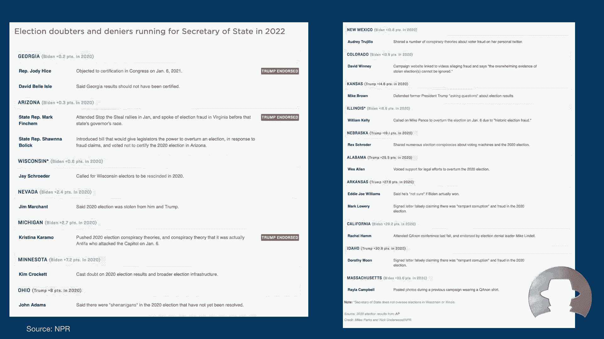

所以幸运的是，由于选举工作，多年来的诚信活动家和安全研究人员，像加利福尼亚这样的州已经禁止了无纸化投票机，或者减少他们对他们的依赖，今天只有六个州的司法管辖区，印第安纳州，路易斯安那州，密西西比州。

新泽西，田纳西州和德克萨斯州，还是用纸，作为其主要投票设备的无纸化电子机器，大多数其他州使用带有纸质选票的光学扫描机，可以审计，但即使是这些系统也存在安全性和可靠性问题，如果没有人看过纸质选票。

它们就毫无意义，很少有州进行强有力的人工审计，旨在捕捉软件错误或操纵结果的那种，有些人只是通过同一个光学扫描仪第二次运行选票，其他有的，人工审核，通常只检查随机选择的1%选区的选票。

而不是所有选区的选票百分比，所以如果选择的选区不是，发生问题的地方，审计不会发现他们，我想明确的是，有强有力的审计并不一定能阻止发生的事情，在2020年选举后，一些州在选举后进行了强有力的人工审计。

无休的钢铁支持者简单地驳回了他们，但一些选举舞弊指控的最初支持者确实说，审计使他们确信欺诈指控不是真的，如果审计能做到这一点，也能捕捉到由错误的投票软件造成的错误，在我剩下的时间里。

我想把焦点稍微转移到乌克兰，以及与易受攻击的关键基础设施本身无关的东西，但与这些系统有关，并对它们构成潜在的未来威胁，今后对他们的潜在威胁，我指的是网络规范和黑客主义，俄罗斯入侵乌克兰引发的。

以及伊朗最近发生的一些事件，司法震网，改变了网络安全格局，乌克兰和伊朗最近发生的事件，有潜力做同样的事情，在我继续之前，关于网络规范和民用基础设施的安全，虽然，我想承认，当然乌克兰的情况是前所未有的。

这并不是要批评这个国家，它认为自卫所必需的，但是安全性，社区和政府必须意识到这将导致我们走向的潜在道路，来自20个国家的2500名政府专家，包括U，What’是u，k，和爱沙尼亚。

被联合国委托制定各国应该遵循的网络规范，他们一致认为，各国不应故意破坏另一国的关键基础设施，或以其他方式损害提供公共服务的关键基础设施的运作，他们还同意国家。

不应该允许他们的领土被用来对其他国家进行网络攻击，并应采取步骤减少来自其领土的恶意活动，当它针对其他国家的关键基础设施时，回顾乌克兰发生的事情，今年2月俄罗斯入侵乌克兰后不久，米科·费奥夫。

发出了黑客志愿者的呼吁，对俄罗斯发动进攻性网络行动，并提供了三个政府和商业部门网站的攻击名单，目的是削弱俄罗斯公众对入侵的支持，让他们的生活如此不愉快和不便，他们质疑战争。

也迫使俄罗斯专注于保卫自己的网络，这样它可能会减少对攻击乌克兰的关注，结果呢，当然啦，是IT军队，独立于乌克兰政府运作的准民间机构，但似乎也有一些联系，与乌克兰的军事和情报机构。

根据瑞士安全研究中心的stefan sasanta，所以圣诞老人从ITR一开始就跟踪它，并在六月发表了一篇很棒的论文，我强烈推荐，在食物局发出行动呼吁后的几天内，我的军队向莫斯科交易所发起了攻击。

证券交易所，克里姆林宫和国有银行，最初的目标清单上的31个已经扩大到600多个，以药房网络为目标，一家大型电子产品零售商和一家俄罗斯支付服务提供商，在公司声明U，s，以及欧盟对俄罗斯的制裁。

对俄罗斯没有影响，他们还袭击了俄罗斯政府跟踪酒精生产和分销的系统，这似乎影响了五月假期前的酒类运输，此外，有很多分支群，包括在自己的旗帜下进行行动的匿名者成员，严格来说不是在IT军队的旗帜下。

大多数攻击，当然啦，一直是DDOS运动，但大规模的黑客攻击和泄密行动也出现了，两个组织声称对虹吸事件负责，超过200千兆字节的电子邮件，来自白俄罗斯国防武器制造商，另一个小组公布了工业蓝图和示意图。

据说是一家工程公司的，匿名者，声称对800千兆字节的泄露数据负责，来自俄罗斯联邦审查局，此外，似乎有内部团队为军队进行更复杂的行动，要么由乌克兰国防和情报人员组成，要么与他们有直接联系。

也可能从他们那里得到任务，所以圣诞老人认为这个组织对袭击我们YouTube的破坏性攻击负有责任，或者Rua俄罗斯YouTube的竞争对手，关于战争的传播和错误信息，我的军队，在两位专家的帮助下，他们说。

更改根管密码，管理员阻止门禁卡，工作人员过去常常进入根管服务器机房，抹去了几十拍字节的数据，使路由脱机近三天，然后用备份恢复，I军的第三个元素，是乌克兰人在乌克兰境内外拥有的安全公司提供支持工具。

一家总部设在爱沙尼亚的公司，是一种叫做不平衡器的工具的制造者，作为分布式防御DDoS攻击的方法，用户将客户端下载到他们的手机或计算机上，为了提供计算能力来处理针对其他成员的DDoS攻击负载，但在三月。

DispBalance团队创建了一种不同的工具，称为解放者，它使用相同的概念对俄罗斯网站进行DDoS攻击，爱沙尼亚的另一家公司推出了一个窃听器赏金计划，寻找俄罗斯关键基础设施的漏洞。

传递给乌克兰网络部队瞄准，尽管这两家公司都设在爱沙尼亚，北约和欧盟的成员国，他们的活动似乎没有引起其他人的任何批评，北约和欧盟成员国，很明显，有独特的情况需要考虑，俄罗斯已被联合国承认。

作为入侵乌克兰的明显侵略者，以及IT发起的网络攻击，军队和其他发生在活跃的战争期间，军队似乎也表现出了一定的克制，没有破坏，或扰乱俄罗斯紧急服务，所以说，桑托指出。

这种活动有可能无意中开创法律和道德先例，这可能会在未来造成重大的政治反弹，如果一个俄罗斯人，这是他的一句名言，如果我们在德国的俄罗斯公司，是组织一个进攻性窃听器赏金计划目标是乌克兰的关键基础设施和股份。

俄罗斯情报界发现的漏洞，柏林会，布鲁塞尔和华盛顿认为私营部门的这种行为是可以接受的，正如批评者指出的那样，另一个问题是，可能很难控制IT大军，和匿名组织成员，在这之后。

人们很容易看到这种力量被其他政府利用，或战争背景以外的原因，也许是外交危机，甚至只是对文化侮辱的回应，就像我们在2007年看到的那样，当俄罗斯黑客分子向乌克兰发射目标时，战争纪念碑的搬迁。

这样对所有人都是免费的，如果针对关键基础设施，至少有可能造成混乱，甚至可能更糟，所以说，桑托说，继续忽视IT军队的本质，将对网络空间未来的稳定造成严重破坏，和它在一起，欧洲及其他地区的国家安全格局。

维克多·奥拉乌克兰国家副元首副元首，特别通信和新闻服务，他昨天早上在黑猫发表了讲话，今年早些时候告诉主板，在我看来，政府支持这项活动是不对的，但作为一个公民，作为一个人。

他希望我们的国家在这场绝对前所未有的战争中获胜，二十一世纪令人难以置信的战争，我很感激他们帮助削弱了我们的敌人，几个月前，乌克兰政府似乎确实支持这一活动，什么时候，在波兰英勇抵抗，对俄国侵略的英勇抵抗。

Fedorov，称赞我军引用，结束报价，快点，只是我想提到伊朗，在我结束之前，袭击使全国4000多个加油站瘫痪，似乎在火灾中导致设备故障，在一棵静止的植物上，它导致了设备故障和一个静止工厂的火灾。

对在战争之外攻击关键基础设施提出了类似的担忧，所以目前还不清楚这些是否是由黑客分子发起的，或者以色列政府或西方政府情报机构，它们表明对关键基础设施的兴趣，民用基础设施已经在攻击者的议程上。

只会成为更大的目标，前进，非常感谢你的收听，谢谢。每个人，在我们开始下一次会议之前，我只有两张纸条，十点二十开始。

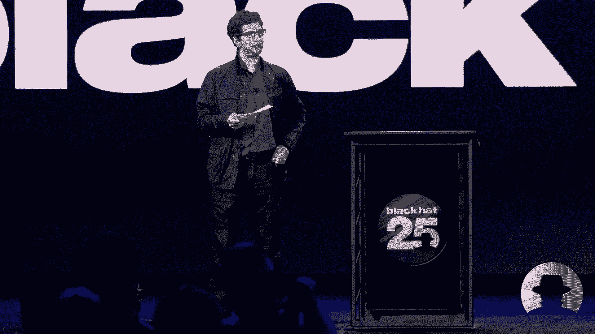

所以你有一点时间来进行下一次会议，你想看的，今晚在主旨演讲的对面，我们有锁定音符我们的锁定音符将是我们的审查板。

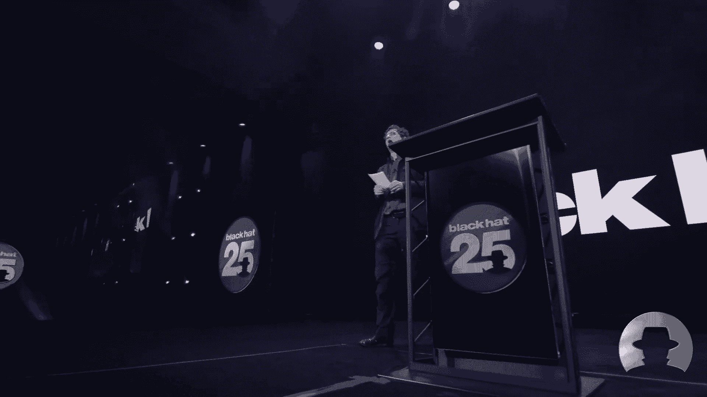

一些审查委员会成员，他们帮助我自己挑选了黑帽的所有内容，坐下来，探索内容，趋势，我们发现有趣的技术，我们有点放松，我们有啤酒，我们有一个对话，想法是你有机会听我们说话，就我们觉得有趣的事情进行对话。

这是一个很好的放松方式，超连接会议。

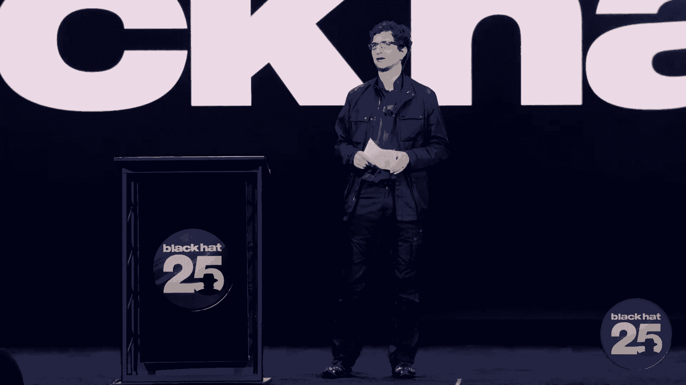

今晚4点20分见，曼德勒G和H在这层楼，二级曼德勒G和H锁音四点二十。