# P63：071 - DirectX： The New Hyper-V Attack Surface - 坤坤武特 - BV1WK41167dt

now it is my pleasure to welcome，online，ok hello，everyone，thank you for coming today，my name is真好红。

i have been working on virtualization，security，windows kernel and hyperresecurity research for many years。

i was awarded the twenty nineteen to twenty twenty，i，my sin most valuable security researchers。

and i was also a black hausa，twenty，twenty five speaker，i also want to introduce my partners。

zi min zhang，he has been working on virtualization and colonel security for many years。

he was the windows project winner in twenty twenty one tfcm。

and he was awarded the q two and cue ball at microsoft。

most available security researchers in this section，zi made an indelible contribution。

we first discovered this new attack surface，and we've been working on this attack surface here。

i would like to express，my，thanks again to him，this section is divided into six ports，first of all。

let's introduce the hyperredirect，as component at texture。

in twenty twenty apple introduced new feature of gpu，po rtualization，which is based on gpu。

virtualization technology，this technology is integrated into windows。

display driver model and ow dd m drivers about version to pound fire support，gpu virtualization。

natively，however，new features mean new attack surfaces，this picture is the wd dm of texture。

diagram applications，such as three games communicate with the direct as graphic kernel。

subsystem by invoking the direct three d rendtime，component in user mode。

the user mode display driver in the diagram is the private driver data of the gpu，manufacturer。

which will be used it in the gpu，colonel model driver。

the diagram is the hyper radio as component a tcture。

the right side of the diagram is the simplified wd dm。

the left side repossessed child petition，where the guest virtual machine is located the dsg kernel。

linux kernel module in the linux virtual machine，transmit data with the drx graphic kernel。

subsystem in the host machine through the van bus component，the data flow of the wd。

dm is shown in the diagram，the application is the starting point，the application will invoke。

the runtime component may use the private data in the user mode driver。

and then data riches to direct as graphic，colonel subsystem and direct as graphic and mm，and finally。

the data will reach the gpu driver，the data fu of hyperary components also starts from the application。

application sends data to the linux kernel module，dsg kernel，through。

the linux kernel linux dsg kernel driver module，communicates with the direct ass，graphic colonel。

subsystem in the host machine through the van bus，components and subsequent process is the same as wd dm。

so how to enable，there as component in hyperrewatch machine configuration。

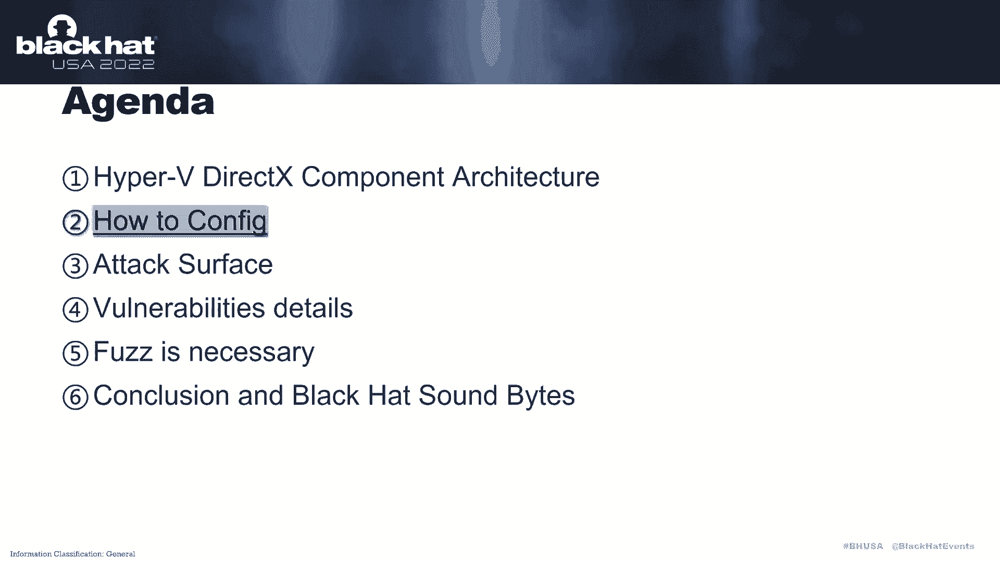

you can use the advm gpu petition，adapter，and then use the gvgpu petition。

adapter combined to check the virtual gpu information。

after we complete the virtual machine configuration，we can determine，whether。

this component is enabled by，checking the colonologue in the linux。

virtual machine for example my linux vm kernel version is a four point，one five in the kernel lab。

there are two new gds，there are virtual gpu，dsg k channel g u i d and global dsg k channel g u i d。

if the virtual machine is a linux，ren only the w sl two linux kernel。

source code tree can natively support drx device for a virtual device。

but the good news is dsg colonel driver for linux is easy to compare，and customization。

the dsg device file exposes a set of io city that closely mimic，the native wd d hero。

vice layer on windows，now let's introduce。

the attack surface of hyper radio as component，first of all，let's introduce。

how the duras component is initialized in the linux，virtual machine。

the dsg vm b channel in infunction invokes，the van bus open function to initialize a dsg cage channel。

there are two function，here will let you invoke the dsg van bus channel，init function。

they are dsg global in it，global channel and dsg a doctor sevan bus。

these two functions initialize a global dgk channel and the virtual gpu，dsg k channel respectively。

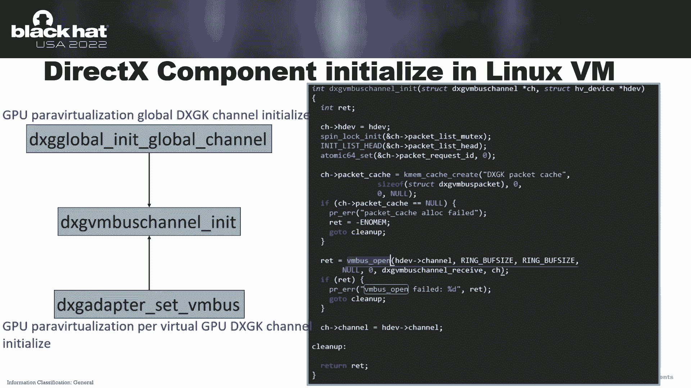

the dsg colonel linux kernel module，uses dsg wb s sink message，and dsg。

when we send a sync message to send，dsg colonel commands to the host machine and dsg van bus channel。

receive function is used to receive messages and，commanders from the host of machine。

by reading the w sl two linux kernel south code，you can see that there are mining commands available here。

a command message，memory ellis，one eight and message bu，the header consists of four members。

the channel type determines，whether it is a virtual gpu channel or global channel and command。

tape determines，which command to sign for example。

dsg rnb slog to function says，dsg k rmb command log to command to host in the command。

vigpu to host in nee to function，you can see the dsg k v m b command，loto command is a virtual gpu。

a channel command and the dsg k when be command，loto structure。

defines the format of the d s g k v mb command log to command，message。

about data receiving in the ho，if guessed sense，dsg k ram be combined data to host。

the win bus component will invoke dsg host，呃，watch your gpu，win bus。

win bus channel process packet or the dsg host，global van bus，win bus channel process。

pit function according to the specific channel，and then van bus processed packet function determines。

whether to find a ha function，corresponding to command，tape in the dsg host，global van bus。

van bus command table vm to host the table or the dsg host，virtugpu van bus grain bus。

common table regpu to host the table according to the channel tag。

finally entered the specific ha function and continued the flow，the cast to van bus。

command function is used to retrieve data from guest for example。

the value of the world at one of set zero，nine zero in the picture。

we processed the lost of the guest data and the keyword at a one of the zero。

x eight eight will processed the pointer of the dsg k command message data。

the van bus complete function is used to send data to guest。

the second parameter of this function is debub the。

third parameter is the date bufference in this picture。

van bus complete package will set the states value to the guests，regarding attack surface。

the tech surface is located in the three driver files，dsg corn d s g m y m i m y d s g m m s two。

there are a total of eighty，seven hundred functions，corresponding to commands。

and each command also has a corresponding message structure，it is a huge attack surface。

now i will further explain attack surface of the，omentioned hypervideos，component。

using the four voling abilities of the，hyper radeon as components。

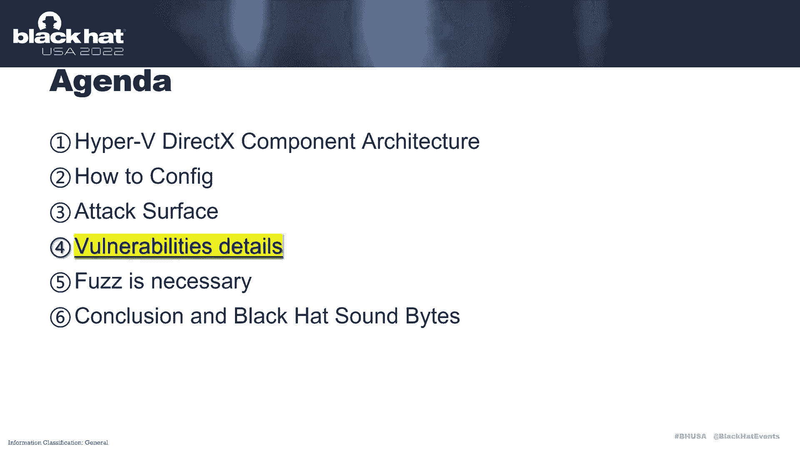

the first one is the cv e，twenty，twenty，two two，one，nine，one eight。

it is a npter reference volability，the problem is with the volliability。

occurs in the dsg k will be command，command，the root cause of this。

vulnerability is that the fifth parameter of the，wild c chi，function references or npter。

this picture is the stock bries when this，warning ability is trigger。

function is showing in the picture，the fifth parameter assigned the avalue to retive。

and then the retwelve the reference，cost，npter，reference the fifth parameter of the vii vid s c h。

function is assigned by the fourth parameter of the，function will be invoked by the。

function is the value of prefence values number of v five。

in the synal synchronization of object from cpu function，three five is is assigned by a one。

the memory out of this structure is showing in the picture。

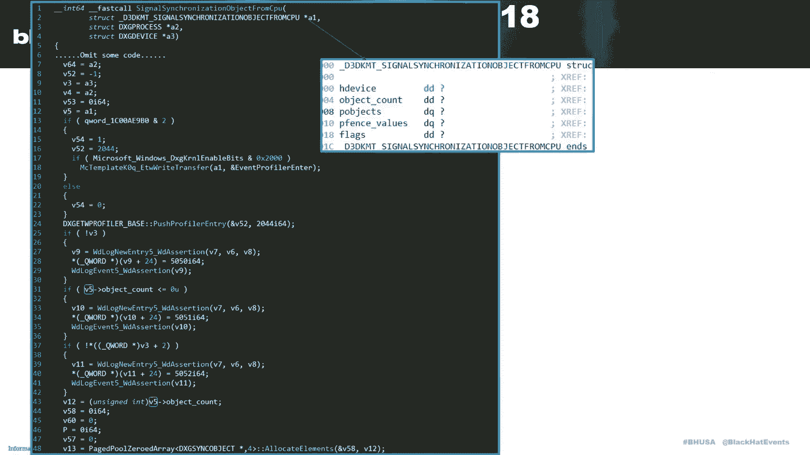

in the dsg host，virtual gpu，van bus，van bus，the fans values member in the first parameter of the。

function is ascended valuv twenty four，as you can see we twenty four。

five zero as we twenty two is this，then we set，now we need to understand the memory。

dialot of the dsg k when be command，command message as show in the picture。

and the same object member is the message body of the dsg k wb command，in the diagram，uh object。

handle array，context，array and monitor，fans，valuy are variable，l arrays。

whose this and offset are controlled by object count and contest count。

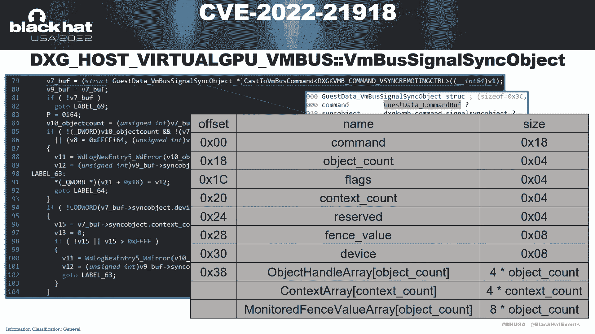

so if return object count is one context，count is zero and sixteen buffaldis zero three si。

the viseventeen thof the monitor，fast value array will be eight，we eighteen of set of monitor。

festivue array will be zero x c ufc，and then one five one in the picture。

we twenty two is equal to three，sixteen subtract with eighteen，we twenty two is equal to zero。

and we seventeen is equal to eight，which means the condition that。

we uh twenty two is less than three seventeen，we twenty four will be ascended zero。

it will cost a npter reference in the，following process，the psec code is divided into two parts。

the first part is used to create a sync handle，and the second part is to use it to send the dsg k。

will check this world in a编辑器。

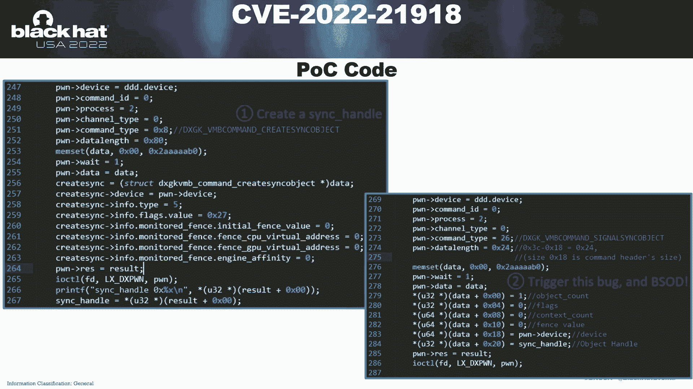

the next one is cv e twenty，twenty one，false me to one night，it also a npterreference，variability。

the problem with this uh vullibility，occurs in the dsg k will be command submit，command，command。

this picture is the stock borris，voluabilities，trigger。

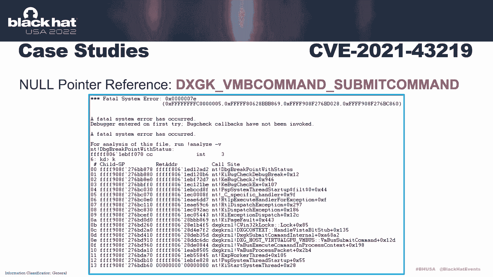

in the dsg k submit command，internal function，the second parameter of the dsg contest，handle。

west bt s t b function is the thirty seven percent history token。

and the value of three thirty seven percent history token，can be controlled by the guest machine。

in the dsg contest handle west bt s t u v function，if a two percent history token is this lazero。

the cold flow will enter this branch and involves，saving through to klock lock function。

the first parameter of the seven three two klocks log，function is a sevc two klocks structure。

pointer when this volliability is triggered，some members of the cvc to klog structure are illegal。

finally caused bs d，the picture shows the pc co，the first part is the create contest handle。

the second part sends submit command，message that is the members in the。

submit cmd structure as show in the picture will trigger，this warning ability in the py code。

a present history token is this the zero，the following is the debugging process。

first set a brick point at dj k submit command，internal of that zero x a a six nine uh nd one debug。

excuses the breakpoint checked the second parameter percent history token，it is less than zero one。

single step tracing，until seven three two k lock lock is invoked and displayed memory。

pointed to by the first parameter，you can see that many members in the sidency。

cook lost structure are not initialized，so this uninitialized values are referenced in the。

sevc to k locks log function and cost a crash，the next one is the cv e，twenty，twenty，two two，one。

nine，one two，it is the arbitrary address，read was the ability，the problem with this warning。

ability occurs in the dsg wb command，wait for object from gpu command。

this picture is the stock bories。

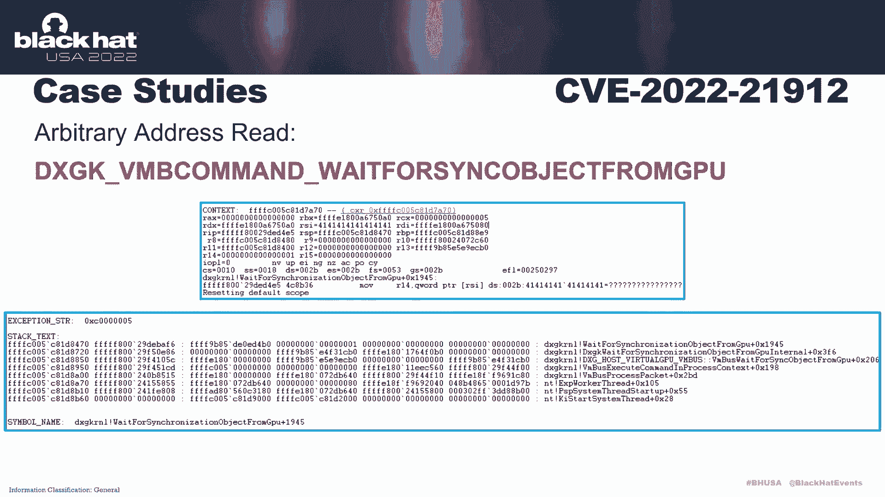

the memory，the art of the dsg k will be command wait for sink object from gpu。

command message is showing in the diagram，in the dsg host，virtual gpu，rn bus，grand bus。

wait for sink object from gpu function，if you like s fans object is one。

think gpu fans value will be assigned to d s t p fence value。

and we twenty three will be assigned the zero，the false parameter of the。

dsg k wait for synchronization of jet from gpu，internal function is zero n at the red mark。

because we five is equal to zero，source p fence value will be assigned to be five。

and the south face value can be controlled by guest machine in the，following cofloor。

wifi will be used as the，third parameter of the，wait for synchronization object from gpu。

function in the wait for synchronization object from gpu，function。

we can is equal to a three at the red mark，the pc code is divided into three parts。

the first part is to create a contest handle，the second part is to create a sihandle。

the third part says，the wait fall sink or attack from gpu combined message。

this is the members are shown in the picture，the trigger。

this violin the rain and read data from address。

zero four one，four one，four one，the following is the devin process。

let's set a break point at wait for synchronization，objets from gpu of czero x one。

nine four five one debug is cuses，the greek p check the eyes are register，and the value of eyes。

eis four one，four one，four one，we can control this register from a guest mission，the last one volin。

the ability，the cv e twenty，twenty，it is arbitrary address，right vinability。

the problem with this one a bit occurs in the dsg k will be come。

and submit will present history retoken command，this picture is the start back tress。

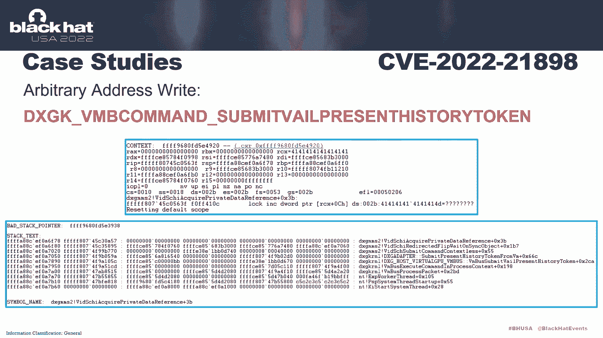

the memory layout of the djk when be command，submit will present history token。

command message showing in the diagram in the dsg host watch gpu，vn bus。

van bus submit will percent history token function，percent，unknown f is used as the。

seventh parameter of the dsg adapter，some may present history token from vfunction in the density adapter。

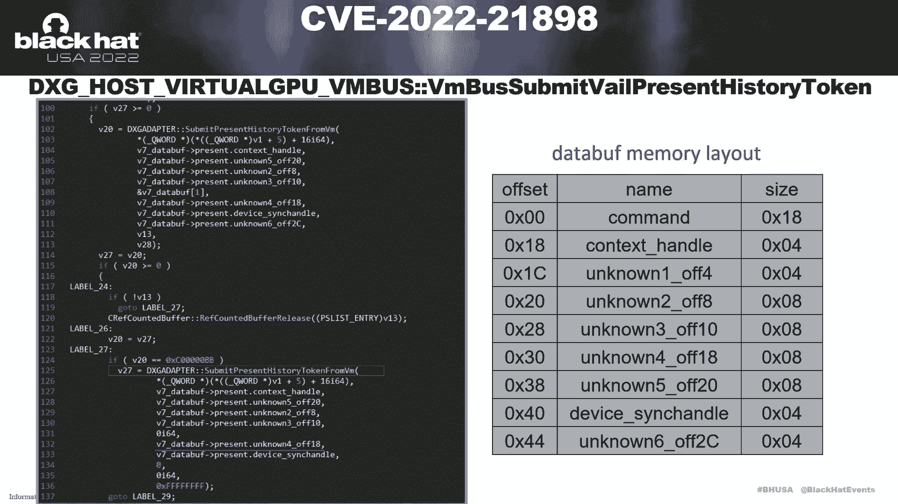

submit present history token from van function a seven，and no four is written to the address of v uh。

twenty nine，offset zero，three zero zero，and then vid s h i uh submit command。

contested this function will be involved，every twenty nine is the first parameter of this function。

as show in the picture，the second predator of the wind c h，i redirected flat with unsyobject。

uh command command contested this function，in this picture，the second parameter of vid c chi acqua。

redirected flip with on sync object function at zero x two。

three eight in vid s c h a quare private data reference function，when we two is zero。

the key word value at the address of a two of that，zero x c eight will be written to be f。

the value of v two is three six in the，i'm sorry，the value of a two or is resix in the wc h。

i redirected flip with unsink or jet function at zero x two，three eight，zero x two。

three eight at zero x c eight is equal to zero x three zero zero。

so the key word value at the dress of a two of set。

zero x c eight is the eight seven and four in the dsg adapter。

submit press present history token from vam function，the following is the coslow。

zero x c coarbitrary address，right sv four is equal to ano four。

the first part of pc code is a creator sing handle，the second part sends。

the dsg k will be command submit will present history token command message。

setting the members as show in the picture。

will trigger this voluerability，the following is the debugging process as roda picture。

when this vinability is trigger，it will finally cause arbitrary address，right，let's talk about fast。

why fast is necessary first，hyper redis as components has a large quantity of co second。

there are eighty seven commands，and there are corresponding structures。

and many commands depend on contest，such as some command，depend on device，handle，allocation，handle。

明白了the properties of the handle，such as the properties of the allocation，handle。

we also affect commands that refer to it below in this case。

it is more efficient to use fast and above volleabilities，were all discovered by fast。

a simple past a texture as shown in the picture，the father is deployed in the guest machine。

the major function of the driver part of the father is the agent layer。

which is used to send dsg kernel，uh command data obtained from the user mode program to the host。

duras component and receive data from host，das component and return data to usmode program。

the major functions of the，userland part of the father are smutated dsg。

colonel command data and receive data return from the colonel module。

such as the return data of create allocation，combined the user and faster contains to core modules。

the data send and receive，module is used to communicate with the driver and harness mode。

module is you used to harness generate for example，by mutity in the members of the。

the above mentioned npter reference，volubility was discovered，now as conclusion。

there are some of my opinions，are hyper reading，and ask uh uh uh attack surface，uh security research。

this attack surface is still worth researching，because the hyper videos。

components has has a lash attack surface，and still being update，so far about application scenarios。

hyper radio as component application，scenarios，include w d g windows sandbox and holnto emerge。

watermachines，connectively support direct acts online，three gaming may become possible in the future。

i guess about，butunfortunately i m save the things uh。

hyperry daras is out of scope for hy rebounty program。

but also thanks had msc for the patient communication。

the three take with included in my presentation are blows first。

i introduced the hyper radiance as component，a texture overview。

and how to enable hyper radio as component in hyper，revirtual machine，configuration。

so introduced the attack surface of hyperry，direct as component。

and how to find the warning abilities in this，attack surface through fast third uh disclose。

the internal details of the four hyperregion，as components voluabilities。

providing reference for founding voluerabilities in this。

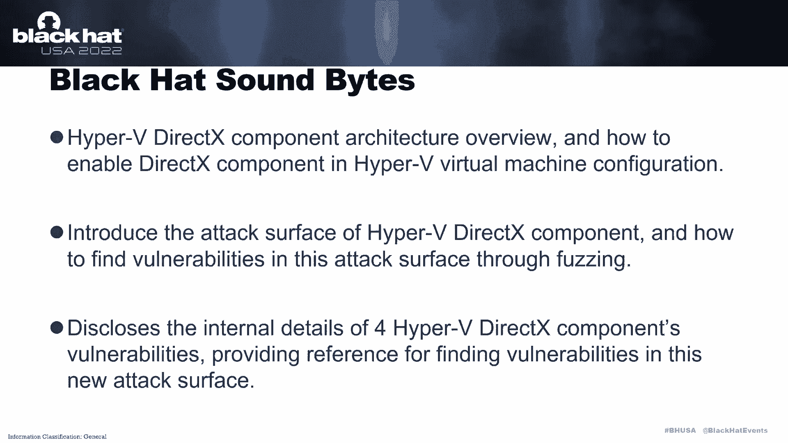

new attack surface。