# P64：072 - How Supercomputer-scale Neural Network Models Apply to Defensive Cybersecu - 坤坤武特 - BV1WK41167dt

现在我很高兴有请，杨慧和约书亚·萨克斯。

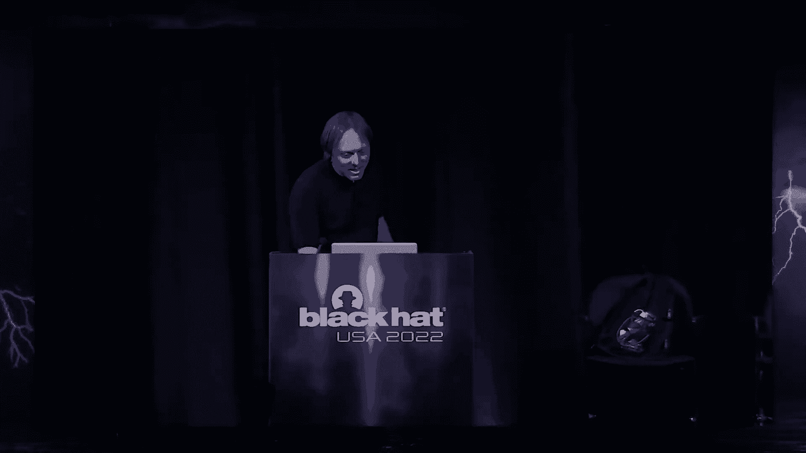

所以我们今天要讨论很多战术思想，但也许在这次演讲中发生的最伟大的工程壮举是，刚刚把我们的幻灯片放在屏幕上的团队，很抱歉耽搁了，很高兴来到这里，希望我们不会再有技术上的困难。

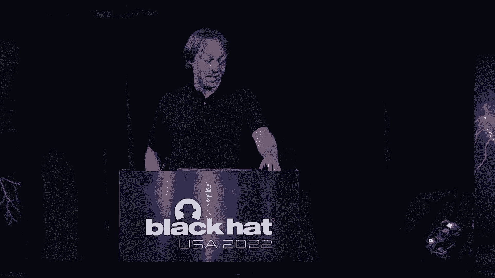

嗯好吧，所以我们今天的演讲题目是GPT三，和我。

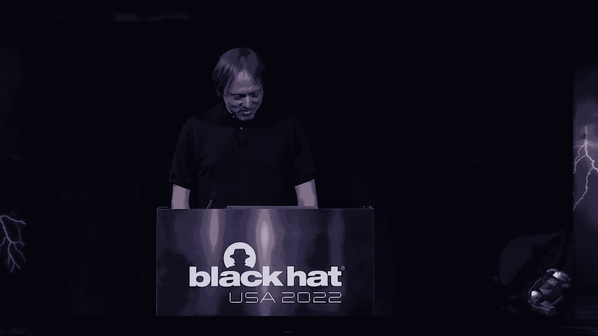

超级计算机规模神经网络模型如何应用于防御性网络安全问题，我是乔希·萨克斯，我是Sophos的首席科学家，我和胡丽在一起，Sophos的首席研究科学家，只是为了让我了解这里的观众，嗯。

你们中有多少人听说过GPT 3，或者知道它知道它是什么，好的，所以我想几乎每个人都举起了手，但我会，和GPT三，但快点快点，我们将进入某种，我们在这里所做的工作的细节，为什么我们认为这很重要，好的。

所以这就是我们，我在这里讲得很快，因为这次谈话一开始我们浪费了几分钟，我想，我想先介绍一下这次演讲的主题，然后我们就开始为他们争论，所以一个，有，它实际上涉及两个组成部分，首先。

我们看到了这些非常大规模的模型的出现，这些模型具有全新的功能，在…的领域里已经讨论了很多，像自然语言处理图像生成，我们认为这些新功能对网络安全也很重要，嗯，利用未标记的Web规模数据。

我会谈论为什么我认为这也很重要，年轻的人也会，我们想引起人们的兴趣，走到一起，看看这些变化的方式，能以积极的方式影响网络安全，特别是防御性网络安全，这谈到了这个领域的早期工作，嗯。

我们认为我们已经开发了一些概念的证明，在提高网络安全防御方面非常有趣，但我们真正希望的是，社区中的其他研究人员在这一领域进行自己的研究，我们也希望从从业者那里得到反馈。

关于我们今天在演示中将要讨论的大型模型，它可能是有效的，相对于防御或网络安全问题，好的，也本着提前展示成果的精神，我们将展示我们所做的两个概念验证实验。

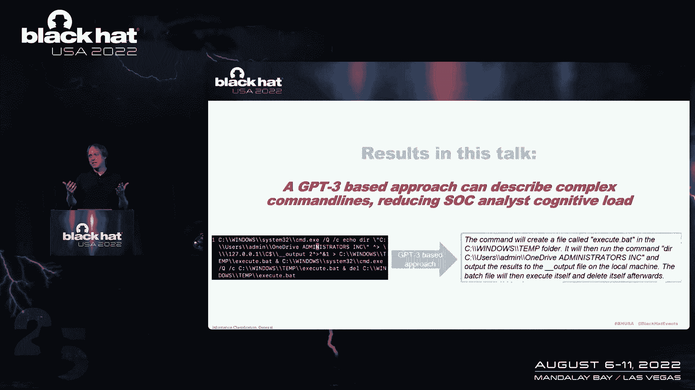

这几乎都是年轻人的工作，我们将展示我们可以使用GPT 3，这个大型超级计算机规模的神经网络模型解决了以下问题，所以在这个例子中，我们有一个可疑的命令行，很难解析这种高认知负荷来理解。

在Windows命令shell上，然后在右边我们有gpt 3是翻译，使用我和年轻的谁开发的方法，这是一种神秘的语法集，变成了一种自然的，一个人，一个清醒的人，可读自然语言字符串。

所以你可以自己做心理实验，试着弄清楚这个命令行中发生了什么，这是Sophos的分析师使用的命令行，许多其他地方花了很多时间来寻找，检测妥协的证据，嗯，很明显这是一个，这是一个重要的认知负担来理解。

这是怎么回事，然后描述嗯更容易理解，描述是命令将创建一个名为Execution的文件，在临时文件夹中，然后它会运行命令，用户管理，一个，驱动器管理员公司，然后批处理文件将自己执行并在之后删除自己。

这是我们将要展示的一个例子，GT3能做什么，以及它如何在思想环境中提供帮助。

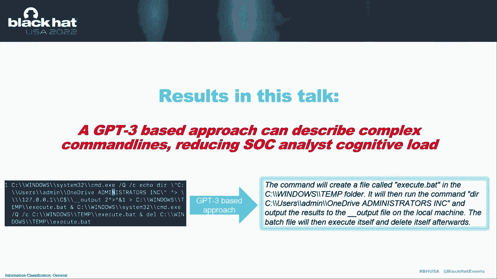

我们要展示的第二个结果，而且年轻，谁是谁将深入了解周围，这个实验是像GPT三号这样的大型模型，和带有少量训练数据的垃圾邮件，所以是的，谁以后会更多地谈论这个，但这个结果意味着当我们训练时，嗯。

一个电子邮件检测模型，以区分坏电子邮件和好电子邮件，我们可以我们可以，不像GPT三个和更小尺寸的模型，我们基本上无法用如此规模的训练数据训练一个模型，我是说，那是一套小得可笑的训练设备。

但有了GPT 3，我们可以实现可部署的精度，这很重要，因为有许多上下文和安全性，其中我们有一些我们正在寻找的坏事的例子，我们希望能够展示一个人工智能系统，这样我们就可以找到类似的坏例子。

我们发现GPT 3真的很擅长这个问题。

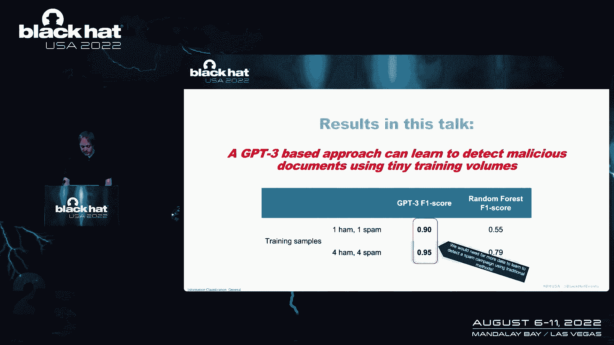

好的，这些就是我们今天要展示的主要论点和主要结果，剩下的演讲将是一个深潜仪器，我们已经做了这么远，将这些大型模型应用于网络安全问题，好的，所以首先一些就像一般的背景，这是一个非常有用的情节。

来自数据科学网站，就像二十世纪五十年代一样，在垂直轴上，你有参数计数，这是一个对数刻度，所以你就像你在看一个数量级，但如果你回到20世纪50年代，你知道你有神经网络，具有数千个参数的早期神经网络模型。

这里的参数就像两个人工神经元之间的互连，参数计数和时间之间有对数线性关系，如此如此突然大小爆炸，那么发生了什么，在过去的五年里，研究人员已经意识到，或者仅仅扩大一个神经网络而不改变它的其他任何东西。

比如增加神经网络层的宽度或增加深度。

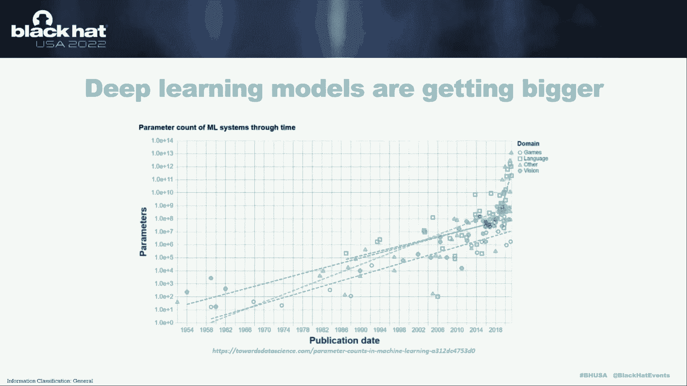

但没有增加任何新的聪明，只是增加规模，由于某种原因，um产生了更好的结果，我要深入研究，应该给你们看一堆证据，让你相信那是真的，但这就是那里正在发生的事情，神经网络模型只是越来越大，嗯。

然后另一件事也发生了，神经网络模型正在以一种新的方式进行训练。

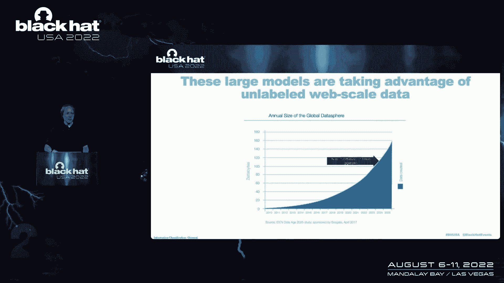

我们训练神经网络模型的方式是，如果我们想要一个神经网络模型来区分恶意软件和良性软件，我们给了它一堆恶意软件和良性软件的标记示例，嗯，问题是有很多软件，嗯，那是灰色地带。

我们不确定这是否是Bennare的恶意软件，就像在我们的数据库中一样，我们数据库中的数十亿个文件，其中许多文件，我们不知道他们是好是坏，问题是我们如何根据这些数据进行训练，更广泛地说，外面有大量的数据。

对呀，我是说，这是一张图表，显示了过去十年来机器数据的增长和种类。

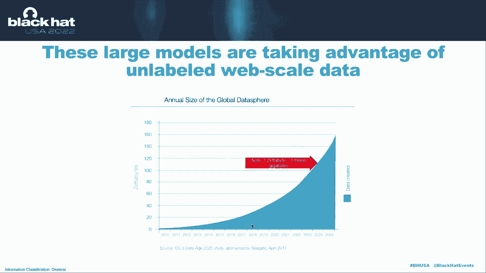

并预测未来，有越来越多的数据可用，我是说你可以去，和，你知道吗，如果你今天运行一个网络爬虫和二十年前，对呀，你得到了更多的数据，还有各种各样的，各种数字仪器都在产生数据，他们是在工厂里还是在汽车里。

而这种事情，我们如何根据这些数据进行训练，当我们没有注释的时候，研究界发现有一种方法，有一类算法叫做自监督算法，允许我们对数据进行训练，这里的基本工作流程是我们使用这些自监督训练算法。

我马上就会定义它们是什么，但我们用这些自我，无注释神经网络模型训练的监督训练算法，未标记数据，然后我们用我们的标签数据来微调这些神经网络，解决一个特定的问题，比如检测恶意软件或者检测猫对狗。

让我举几个例子给你们一些直觉，所以想象一下你有一个巨大的图像数据集，你不知道图像里有什么，你不知道他们的照片，但你希望你的神经网络模型变得更好，多亏了那些图像，你所做的，是你创造。

你的神经网络要解决的一系列谜题，只是从数据中导出的，所以说，比如说，一个常见的技术是这样的，拍摄图像，从中移除一个像素补丁，然后让你的神经网络预测补丁中的像素，对许多不同的图像这样做，这是我两岁的孩子。

因为我们要移除这里的补丁，然后让它预测那里的像素，我在堪萨斯州住的地方附近有几匹马，你知道的，在这里移除这个补丁，然后我们让霓虹灯预测这里的补丁，你可以做到这几十亿，因为为了预测这里的像素。

它需要了解马是什么样子的，它需要知道这里有一匹马，你知道马背，嗯是，你知道的，呃，它有一个非常特殊的形状，这些像素应该以直观的方式填充，对呀，它需要了解风景，关于背景和前景，大约深度。

为了解决像素预测问题，以下面的方式，我们打开AI建立的组织，GPT三给出这个模型给出GTO GPT三模型像Web规模，网络秤，文本量，GPT 3只是被训练来预测文档的下几个字符，所以你可能会给它句子。

让你预测下一个，接下来的几个字符是下一个单词，那是预测目标，现在再来一次，您不需要标记数据来做到这一点，你可以把很多数据刮对，希望从一个你信任的来源得到它，这个来源有好的信息。

然后训练GPT 3来保护接下来的几个角色，你可以看到这类似于图像问题，为了预测接下来的几个角色，一个模型需要对语言领域有很深的了解，对呀，如果我说五个，五加三，两个，神经网络需要能够正确地添加。

为了预测接下来的几个角色，我是说，我们发现的实际上是，GPT三确实学会了做算术，所以网上有很多图片都附有alt文本，在html中，这里有一个例子，你知道我在想象一些旧的文本，像马吃草，如果你叫它堪萨斯。

田野和树木以及上面的前景，栅栏把观者和马隔开，草木伸向远方，预测目标，这里是整个图像中的像素，所以希望，希望周围的直觉是清楚的，它允许我们利用这些Web规模的数据集，即使他们没有贴标签。

以及用这种方法训练大型神经网络模型的结果，或者视频或音频，或者你训练他们的任何领域，这里有一个来自神经网络的真实例子，来自谷歌的一个研究小组，我只是在做一个快速的时间检查，确保我们在这里有足够的时间。

这个团队在网络规模的数据上训练了一个模型来解决这个问题，我刚刚定义了，根据标题预测图像中的像素，所以在这里，他们实际上编造了一个在他们的训练集里不存在的标题，他们测试了这个模型是否能产生一个图像。

根据标题，所以句子是袋鼠的肖像照片，穿着橙色连帽衫，戴着蓝色太阳镜，站在草地上，在悉尼歌剧院前，胸前举着一个牌子，上面写着，欢迎朋友们，所以这就像，这是一个如此疯狂的标题。

这张照片不太可能真的存在于野外，事实上你知道，这是谷歌一些研究人员的发明，当他们要求他们的模型生成结果图像时，这是他们用一个非常大的模型得到的，这个模型有3。5亿个参数，所以三亿五千万，比如浮点值。

那个，定义神经网络中人工神经元之间的互连，这已经是一个令人印象深刻的结果了，对呀，有一种动物隐约是袋鼠，歌剧院里有一种隐约的东西，就像有，这是一种类似连帽衫的面料，你知道你并没有真正理解角色。

但你确实在这里得到了一个带有手势和字母的标志，所以人工智能模型能生成这样的图像已经很不可思议了，但我想展示一下当你把这些神经网络模型放大时会发生什么，不改变其他任何东西，当你只是把它们做得更大。

没有新的聪明的数学想法，当你将模型扩展到30亿个参数时会发生什么，你现在有袋鼠了吗，你得到的东西更接近连帽衫，如何在视觉领域写信，所以朋友们不太受欢迎，它在下面加了一些奇怪的标志，但它越来越近了。

然后当你得到200亿个参数时，该模型能够实际理解文本和图像之间的关系，所以在这种情况下它学会了写字对吧，尽管研究人员没有明确训练它。

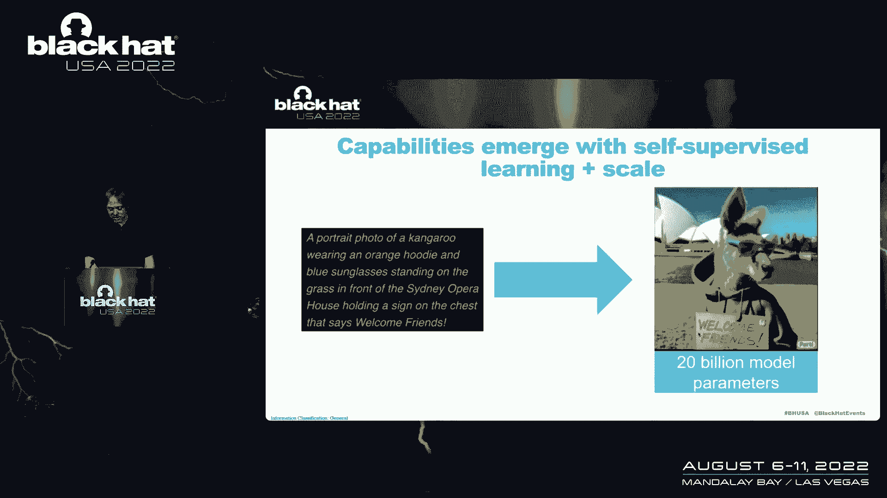

所以我知道连帽衫是什么样子的，它有歌剧院里的蓝色太阳镜，一个来自澳大利亚的年轻人可以告诉我这是否完全正确，但至少关门了，很容易辨认，超大规模模型，而且要明确的是。

一个200亿的参数模型需要像房间规模的超级计算机一样运行，用一吨的GPU，消耗一吨的能量，所以你知道创建这样的模型并不容易，但它很神奇，当你进入这种大模型时会发生什么，嗯，你可以找到很多这样的例子。

如果你看看谷歌Pari纸，这就是这些图像的来源，你可以从他们的工作中看到很多例子，当它提示一张用寿司做的美国地图时，它在一张桌子上，旁边是一杯红酒，你可以看到你知道它不适合小模型，用一个大模型。

它真的有，一次又一次，只要看看谷歌和派对，如果你想要更多这个模型的例子，嗯，现在让我们进入GPT三。

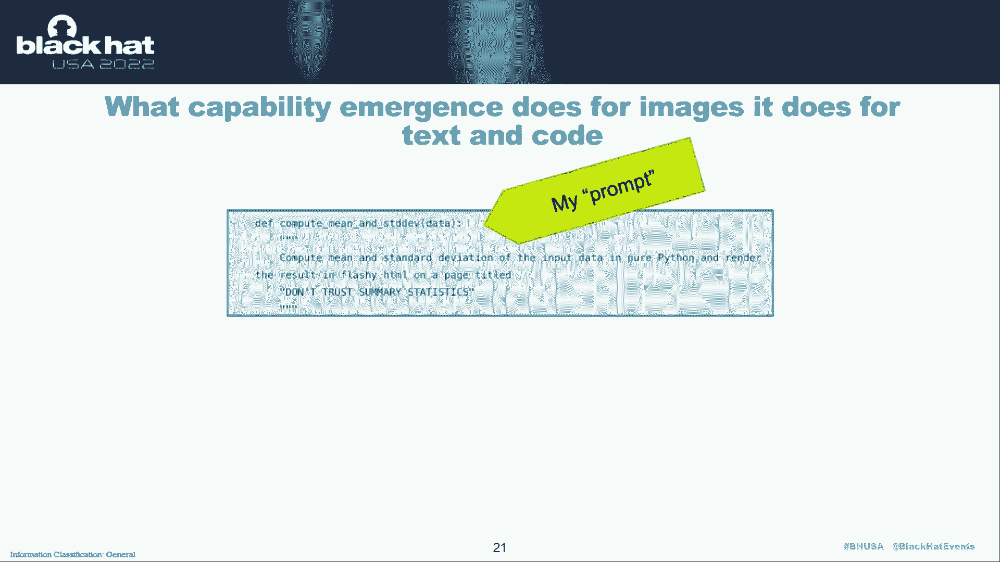

这就是我们使用的模型，做我们今天要展示的研究，所以GPT 3被训练在文本上预测文档中接下来的几个字符，但它学会做的是例如，创建有效的Python代码，所以这里我用提示计算提示GPT 3，平均标准差。

然后我给它一个文档字符串，计算，输入数据的均值和标准差，和纯Python并在，在标题为，如果你只是要求它自动完成，它实际上生成了有效的代码，可以完成这些事情，并将这些概念组合在一起。

所以这是你可以看到这是如何类似于图像的例子，所以我们让他们做两件事，然后在html中呈现这些东西，了解html，也知道如何将这些概念结合在一起，转换为实际工作的有效Python函数，所以说清楚。

就像我们的角色，这里是我们通过他们的API使用开放人工智能模型，他们给了我们作为研究人员的机会，嗯，我们正在GPT三号的基础上建设，你会看到我们是如何在安全用例中做到这一点的，在谈话的年轻鹅部分。

嗯现在。

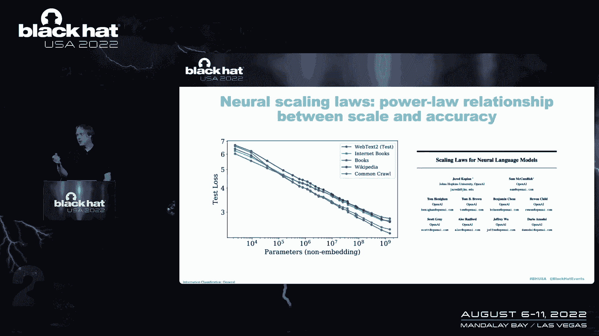

所以当我们把神经网络放大时，就会发生这种神奇的事情，模型规模和模型误差的减少之间有一种非常清晰的关系，所以你在这里看到的，我的意思是我可以进入细节，但基本上笑点是Openai的一个团队。

发表了这篇经典论文，他们展示了，当他们放大模型的尺寸时，就人工神经元之间类似数量级的相互联系而言，这些模型的错误率平稳下降，这是一个非常了不起的，就像。

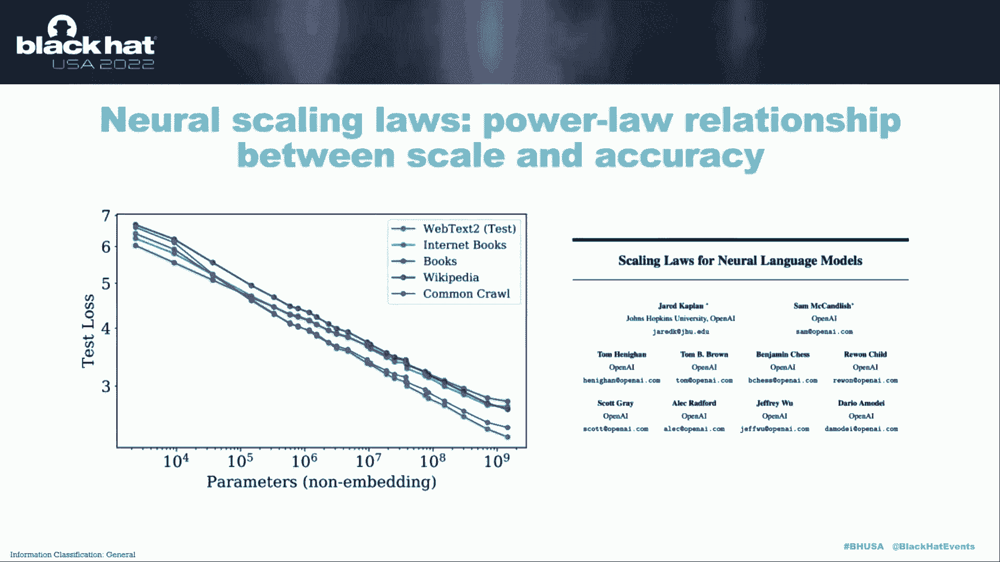

现在，为什么这对安全很重要，今天安全数据的大小，科学模型落在这种大小范围内，所以我们在Sophos的日常工作，端点安全产品，移动安全，电子邮件安全，以及我们公司产品中几乎所有的UM检测管道。

但是我们部署的模型都落在这种大小的波段上，在模型尺寸的分布中，我们还没有，据我所知，我了解其他公司的同事，还没有探索当我们伸缩安全模型时会发生什么，所以不是不是自然语言，不是不是计算机视觉。

但是那些喜欢发现不好的东西的模型帮助股票分析师，当我们有，我们已经用它做了实验，然而，使用可伸缩的安全模型，在这种尺寸范围内，我们今天做的演示是我们早期在，并将这些非常大的模型应用于安全问题。

我们认为我们社区的研究人员非常重要，喜欢安全数据科学世界，往这个方向，你又知道了，就像，我们希望其他人能跟进，做更令人印象深刻的事情，用大规模模型，所以在我要把它交给俊浩之前。

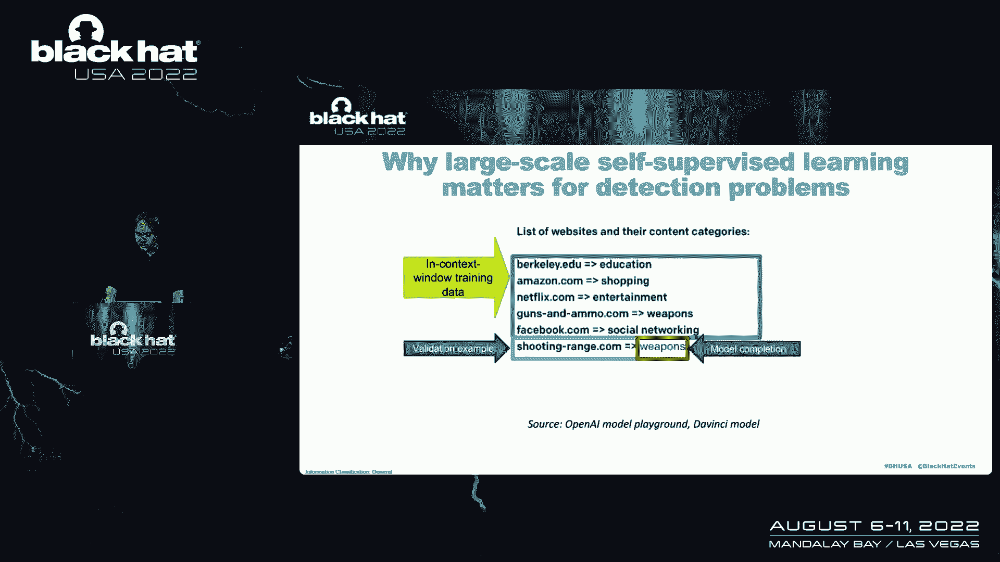

但在我这么做之前，我只想给你更多的直觉，为什么这些大型模型可能对安全很重要，所以我们在SOHO使用的模型之一是一个模型，它查看一个域并决定它属于哪个内容类别，就像我们有12个学校客户，你知道的。

我不想让孩子们看到某些类别的内容和这类事情，所以这是我们团队做的事情之一，嗯，我们训练我们的领域内容分类模型，嗯，就像数千万个例子，我们需要，这是一个小模型，它需要在大量的数据上训练，我们做了。

我们用GPT三号做了一个快速的实验，看看它如何将域分类为内容类别，仅用五个训练示例，它做得很好，当我看到这个结果时，我绝对震惊了，所以在这里，我刚刚展示了GPT三，提示符，我在伯克利展示EDU教育地图。

亚马逊购物地图，等，然后我展示了一个它以前从未见过的新领域，射击田庄点，www。icj-cij。com，它只知道在恶意软件检测环境中自动完成作为武器，如果我们试图检测，比如网络钓鱼域名，嗯。

你知道我们可以举四个例子，就像，这里绝对是网络钓鱼域，我是说我只是编造了这个你知道它看起来像一个钓鱼区，贝宝客户支持，废话废话英国。

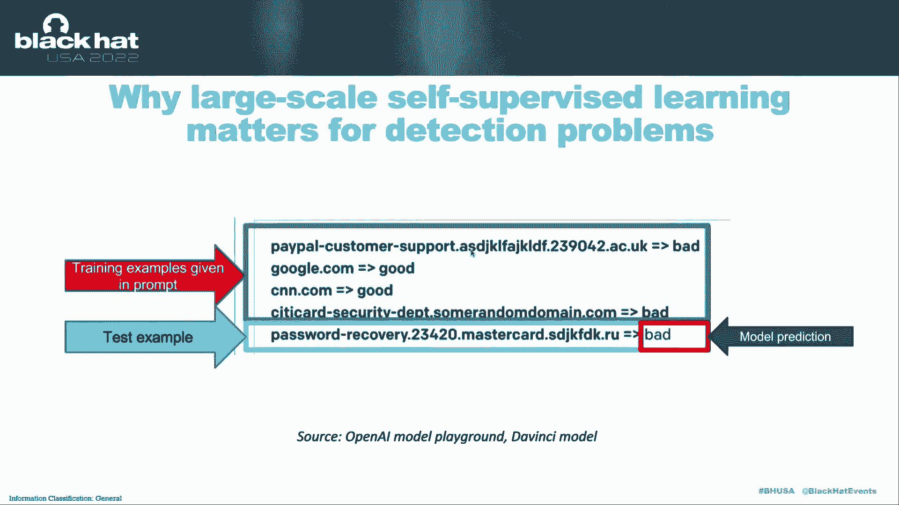

一些好的领域，另一个坏的，然后，然后它钉它，当我给它一个新的网络钓鱼域，所以再一次，一个像GPT三这样的现象的例子，因为它被训练过，就像整个数据网络一样，它能够看到，哦。

这里所发生的是将网站分为好的和坏的，它是，这有点像排队从那个自我中学到的所有知识，监督培训环境，并很快学会做我们在这种情况下要求你做的事情，这很重要，因为就像你知道的，在未来，随着人们开始在。

就像一个思想环境，如果你看到某种类型的东西，你想在你所有的数据中找到那个东西，你可以想象像这样写一个小提示符，然后将GPT 3指向一堆数据，让它找到你要找的例子，我们将讨论使用GPT 3的两种不同方式。

今天，一个在提示，我刚刚展示了，我们刚刚显示了一个提示，要求它自动完成并从GPT 3中获得答案，另一个涉及数据的反向传播和随机梯度下降，房间里的科学家，这只是优化神经网络的标准方法，那叫微调。

我们在微调中所做的，我们调整神经元之间的互连值，再多一点，呃，我的模型喜欢GPT三号，为了解决垃圾邮件检测之类的问题，恶意URL检测，好的，这是我这部分的最后一张幻灯片，希望。

思考这些大型模型如何应用于安全，我想你可能会考虑这些冒犯性的应用，我们主要想的这些模型，我们在想这个，谈论防御性应用程序，我们已经，我们尝试了很多年轻的东西，他在构建自然语言用户界面方面做了大量工作。

其中用户键入like，显示所有网络连接，从窗户打开的，机器，去中国的，并将其转换为数据库查询，嗯，我们认为这对检测很有用，什么，你会看到我们使用这种逆向工程的结果，但我们认为还有很多其他的应用。

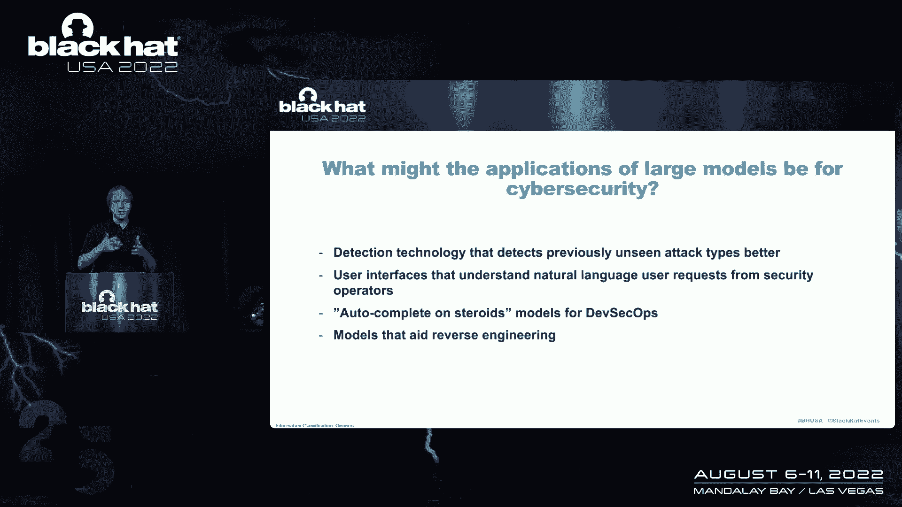

好吧，我会把它传给英浩，谢谢。袋鼠的形象给我留下了深刻的印象，他刚从澳大利亚来，是啊，是啊，很高兴再次在大楼的任何地方看到澳大利亚，在我们谈话的第二部分，我会谈论如何。

我们可以用安全应用程序创建两个方面，使用大规模语言模型，我们将使用Open PThree作为我们更大的语言模型，所以模型这么大，你可以用它，除非你有超级计算机，幸运的是。

我们可以通过开放的API访问示范法，所以我们的第一个应用程序是垃圾邮件检测器，当您开始一个新的ML项目时，可能你会从几个例子开始，我们也只是收集了一些新的垃圾邮件，但我们要探测到那些相似的。

我们训练一个小的传统模型，您将被要求收集大量的训练数据来训练一个新的分类问题，就像你训练罂粟一样，可能你需要给他看很多例子，然而，经验丰富的聪明狗，我们用很少的例子很快就学会了。

我们的智能全科医生也能做同样的工作，所以这是我们的性能或垃圾邮件检测，gpt 3，只用一只手和一只垃圾邮件就取得了令人印象深刻的检测率超过90%的结果，样品更好，我们有95英亩，另一方面。

传统的随机森林模型只有大约5-5，比随机猜测稍微好一点。

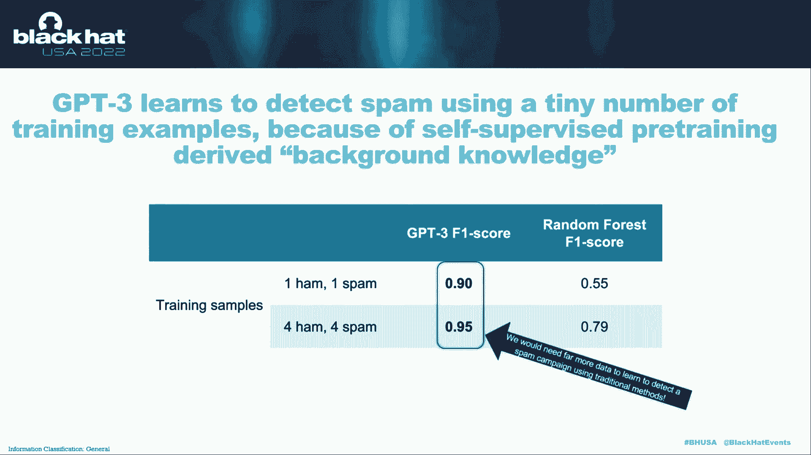

我们将讨论如何实现这一令人印象深刻的结果，这些是我们的评估数据和模型设置，所以教GPT三来解决一个预测问题，可以像设计提示符一样简单，所以tp3可以自动完成剩下的部分，比如说。

将Will Be标题转换为表情符号相当简单，所以我们只提供三个回到未来的例子，有一些相关的图标蝙蝠侠和变形金刚，然后我们问我们的现金星球大战，然后我们得到新闻结果，相关图标。

这就是我们如何向模型提供数据以自动完成剩余路径，所以现在让我们为我们的问题设计我们的提示符，所以我们从一个简单的指令开始，呃，它将消息归类为或手，然后我们提供一些例子。

所以我们从手上选择一个跨度和另一个跨度，所以有了这个输入，GPS可以生成跨度作为输出，所以GP3是一个预先训练的语言模型，它已经被预先训练来预测下一个世界，所以GPS你可以生成最有可能的，呃。

垃圾邮件被输出，所以让我给你们看一些前面例子中的其他例子。

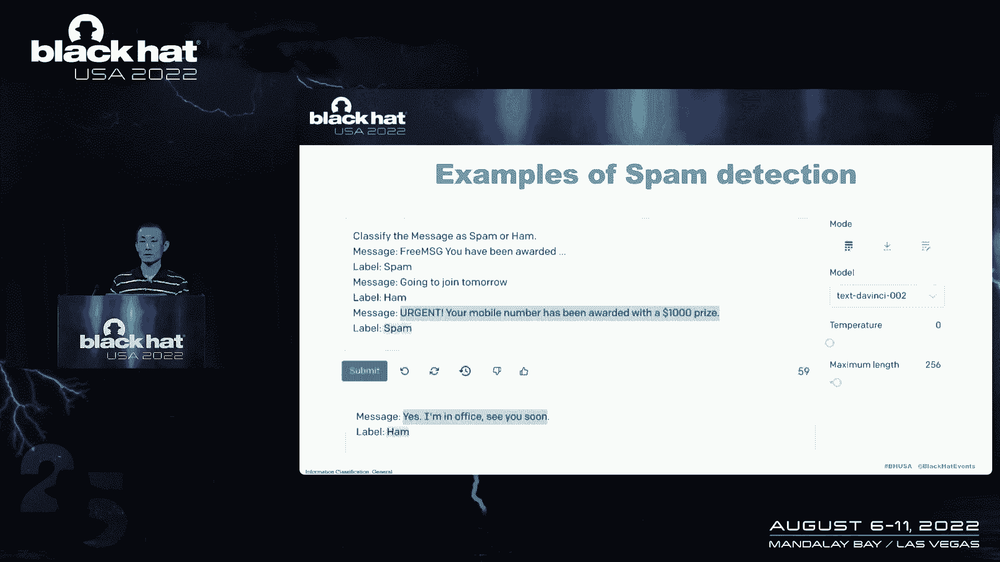

所以现在我们可以测试新的样本，比如说，或者您的手机号码已被授予，这个绝对是垃圾邮件，它正确地识别了跨度和另一个，i，呃，是呀，我在办公室被发现是一样的，所以实际上这是开放AI游乐场网站的截图。

我们可以在这里用一些设置测试我们的输入和输出，一个重要的设置是我们设置为文本车的模型。

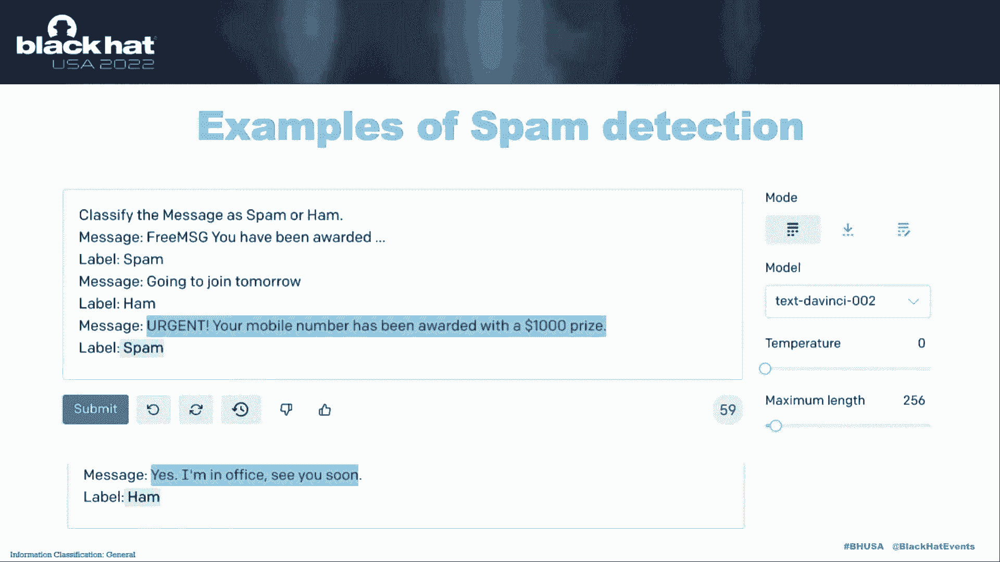

这是最大的GPC模型，用于文本生成，所以我们的应用程序。

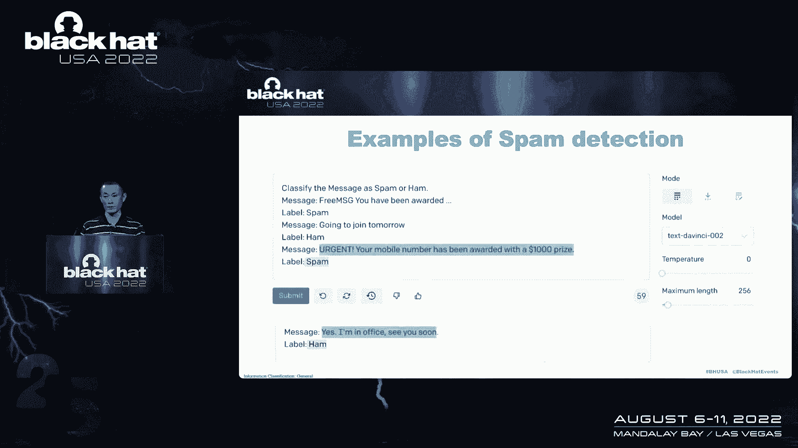

因此，第二个应用程序正在生成人类可读的恶意命令行解释，这是一个非常困难和耗时的，正如你所看到的，这是恶意命令之一，所以它真的很长，很难通过，所以我们的问题是大型语言词汇能通过用简单的语言来描述这一点吗。

所以是的，有可能，因此，从注释中我们可以生成人类可读的描述，这实际上是我们从模型中生成的描述，所以描述说命令将创建一个名为Exclusive的文件，之后它会执行并杀死它，所以这是一种恶意行为。

所以我们可以从描述中识别出，让我向你展示我们如何实现这个实际上是GPT的三个部分，开放AI的两种不同模型，第一个是文本翻译人，所以我们只使用文本生成问题来处理垃圾邮件数据，第二个版本叫做，叫做皮层。

所以法典模型已经预先训练好了，有许多来自GitHub的开源项目，所以它可以用多种不同的语言编写代码，Python和共享脚本，所以这是我们第二个用例的选择，所以让我们设计我们的提示符。

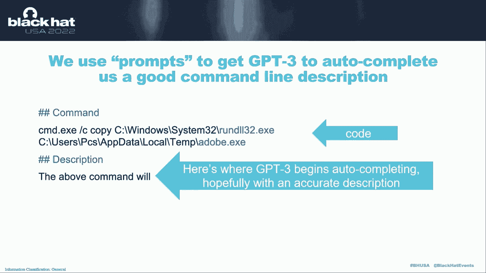

所以我们有两个部分，我们提供的第一个命令，第二部分是描述，这将引导gpt 3自动完成域部分，所以让我们能够得到结果，所以现在我们有了命令中的描述，因此命令将把二进制文件复制到放大器端口。

因此它从命令生成了一个有效的描述，但是该命令是恶意的，因为它将值从系统端口复制到回火端口，作为点exe，所以这是一个恶意活动，然而，我们的描述没有指出恶意部分，所以我们需要提高质量，和我们的方法。

我们需要提供一些额外的上下文信息，所以我们可以使用箭头或西格玛规则，所以在这种情况下，以前的命令实际上是由sigma规则之一检测到的，和卖给什么Windows复制系统。

所以我们可以使用签名中的一些额外信息，所以这是提示符的第二个版本，所以我们用同样的命令，但是我们添加了一个额外的标记部分，因为一个可以被多个签名检测到，所以我们可以在一个拍摄部分添加所有的签名。

所以现在我们得到了更好的描述。

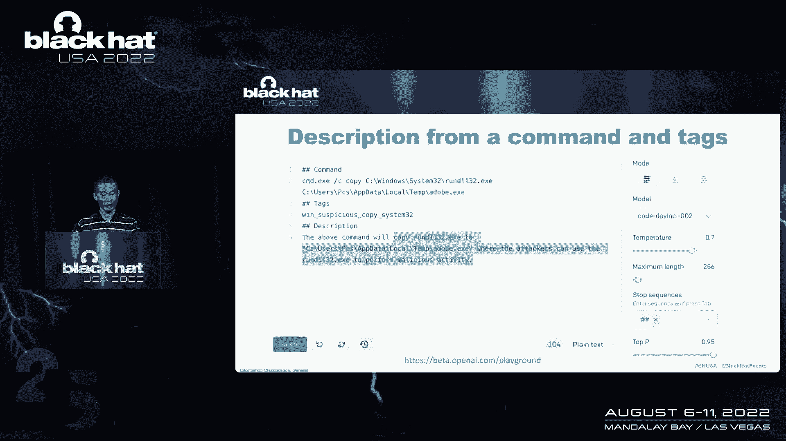

大家可以看到，现在描述说命令会将葡萄藤复制到这个成年人的时间上，因此攻击者可以使用inely执行恶意活动，所以现在它正确地描述了命令，也提到了恶意行为现在我们有了更好的描述，不过。

我们想从这里进一步改进，所以我们能做的实际上是，如果我们看第二个，我们把模型设置为Cori。

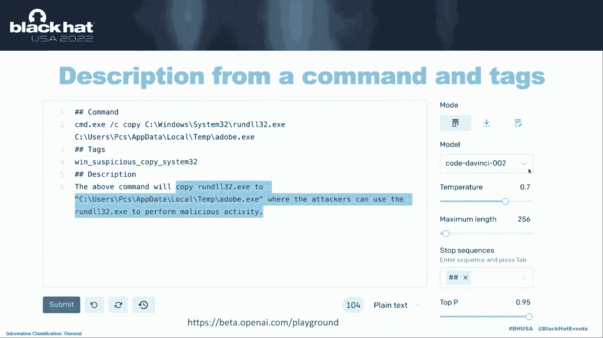

这是皮层模型中的一个，然后我们还可以把时间从七点七改变到八点八，我们也可以改变最大概率，我们可以生成多个描述，然后我们可以选择最好的一个，所以我们的操作员选择了最好的描述是回译。

所以在自然语言翻译任务中，比如说，从英语到法语的翻译，评价朋友的输出并不容易，但如果我们把法语翻译成英语，现在很明显，我们可以比较原来的英语和反向运输程序，所以我们可以在第二个案例中应用同样的机制。

命令是一回事，描述是另一回事，这样我们就可以从描述中生成注释，所以现在我们有命令和后面翻译的指挥官，所以说，所以我们可以很容易地比较原版和反向翻译的拼图之间的相似性，所以让我们来看看，是啊，是啊。

这些是步骤，因此，在第一步中，我们将从命令和标记生成多个描述，在第二步，我们可以从以前生成的命令中生成命令，在最后一步，我们可以将类似的描述在原始命令和翻译后的命令之间进行排序。

所以这是我们的第二步后退翻译翻译步骤的新提示，所以我们提供了相同的钉子和描述，然后我们让模特完成剩下的命令，这样我们就可以退化前面的命令，所以如果指挥官正确地描述了最初的命令，我们将能够解构命令。

所以让我给你们看两个描述的例子。

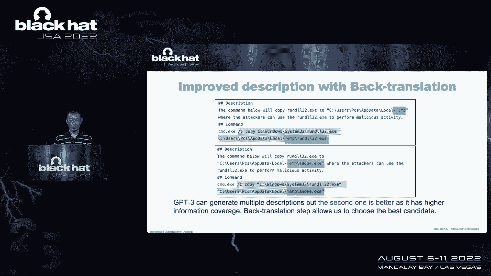

我们从前面的命令生成了这两个描述，所以第一个实际上没有正确地提到二进制名称，因此，它未能重建以前的赠款，然而，第二个描述正确地构造了前一个描述，因为它有正确的卡名。

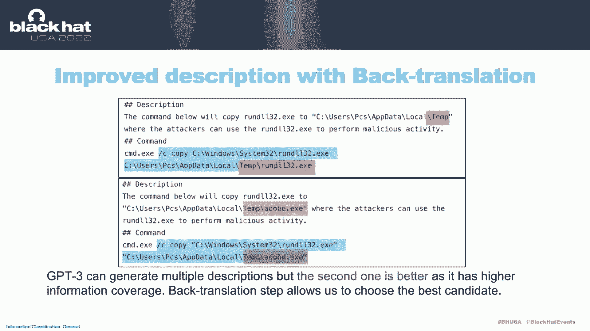

所以这是另一个例子，所以评论可能是如果你不熟悉这个，不容易理解，不过我们的描述说指挥官会搜索测试中的文件，和服务器端口，我们会找到的，应用程序，实际上它是从桌面上找到你的密码，因此。

我们的源代码可以在GitHub存储库中获得，的，所以总而言之，您可以轻松地创建功能强大的应用程序，我们演讲的题目是GPT三号和我，所以这是我们的成功故事，现在是您创建应用程序的时候了。

这将是你的GPT三和你。

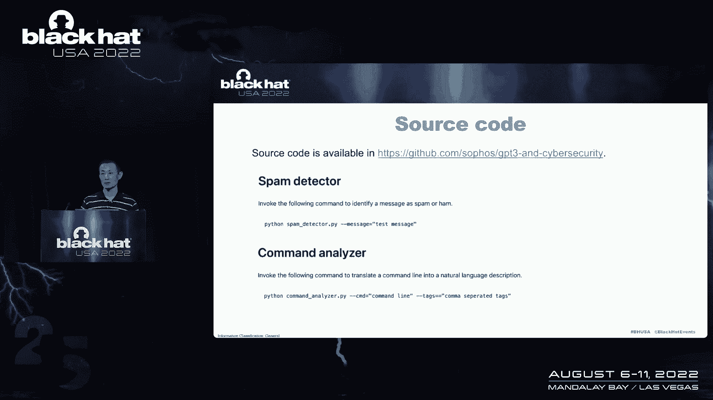

感谢收听。