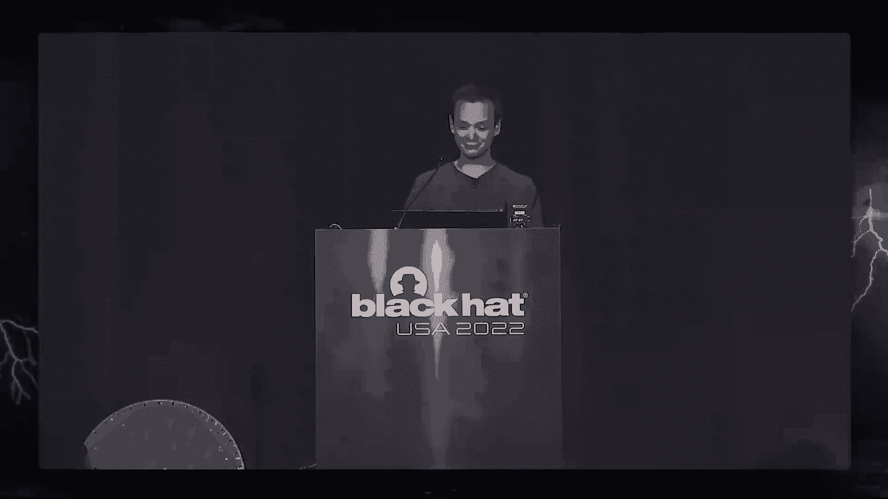

# 【转载】Black Hat USA 2022 会议视频 - P66：075 - Glitched on Earth by Humans： A Black-Box Security Evaluation of the SpaceX - 坤坤武特 - BV1WK41167dt

嗨早上好。

谢谢大家的介绍，让我们立即潜入。

所以我想每个人都知道这个演讲是关于星际链接的，我想你们大多数人都知道Starlink是如何工作的，它是做什么的，但这是一个卫星互联网系统，就像任何基于卫星的系统一样，你有一个空间段和一个地球段。

空间部分，我们有卫星，在这种情况下，卫星可以通过激光链路相互通信，和，基本上，这个想法是用户的终端将把它的数据发送到卫星上，然后卫星把它发回地球上的网关，这样你现在就可以连接到互联网了，出于某种原因。

SpaceX不给我卫星，所以我们不得不买一个用户，这就是这次谈话的目的，这次演讲是关于用户终端的，这里的想法是，如果可以攻击用户终端，您可以访问更多无法访问的网络基础结构，不首先攻击用户。

所以我们买了一个，我们把它放在一所大学大楼的屋顶上，我做了一个速度测试，但仅此而已，因为在这一点上，我们有另一个互联网连接，我们已经有了一个很好的，所以我开始四处看看其他人做了什么，有几滴眼泪。

就像迈克在拆迁和酮，拆迁，信号板，对RF R做了更深入的分析，然后这就是我开始做我的菜的时候，当我在做的时候，其他几个视频出来了，奥弗林上校拆除了，他就去了，他把盘子上的白边漏了出来，他用喷灯把它打开。

哦，就像戈科夫，拆除了他的WiFi路由器，并对其进行了基本分析，这一切都记录在一篇很好的博客文章中，我最近发现了他的第二代斯特林终端的一个定理，他还做了一个三维的小盒子来代替坏的那个。

但基本上我所缺乏的，在所有这些事情中，没有一个真正进入设备的安全，这显然是我感兴趣的部分，现在我已经提到过，这个用户终端已经有了多个硬件版本，但我想很少有人意识到他们过去有多少人，所以循环用户终端。

我们在舞台上也有一个直径约60厘米，它是供住宅使用的，但正如你所看到的，这个特定的盘子有很多硬件上的修改，你也可以看到有一个SOC切割，三个和一个SoC切割，意思是，船上的主系统至少有两次硅修改。

在这道菜里，然后我们有正方形使用终端，它稍微小一点，又是方形的，硬件至少有三个部门，最后我们有了高性能的单元，再次用于更多的商业和其他用途，它们已经是那些的两个硬件愿景，最后收发器，没有。

公众对这些的了解，所以我从代码中知道至少有两个修订，这里的想法是你有一个收发器单元，有一个外部天线来进行这次演讲，我们将专注于我专门研究的循环音乐终端，我有2比2和F2。4。

所有其他终端都使用SoC的切口，所以我今天介绍的攻击是关于，所有这些，所以我们当然是从自己拆除开始的，我们拆下用户终端的塑料外壳，然后你被这个巨大的金属盾牌挡住了，有一个小切口，显示了三个连接器。

第一个是以太网连接器的电源，然后是电机的连接器，所以正常情况下，这个天线在一个支架上，可以让它自己朝向卫星，那么最后一个连接器是未填充的，你们中以前做过艰苦工作的人，知道如果你看到你的连接。

总是令人兴奋的，因为通常你会在设备上发现一个更容易的巨大外壳，SpaceX终端不是这样的，所以我们可以看到它确实使用了U引导，但是输入被设置为null def，这意味着您通过CL连接器提供的任何输入。

它不接受任何输入，因此，您不能只是进入u引导命令行界面并更改内核命令行参数。

呃，当你让盘子完全启动时，迎接您的是登录提示符，正如你所看到的，它将发展钉在一起，启用登录否，因为很明显，你越难买并不是一个发展，这也意味着无论您将使用日志在此用户中输入什么，您将无法登录。

所以这基本上意味着我们必须深入，正如我所说，它真的挺大的，它的直径是60厘米，这绝对是我工作过的最大的董事会。

所以我们可以在这块板上识别的一些区域，有一个GPS接收芯片，有一个领域与以太网的力量有关，有一部分电路产生时钟，对于SoC和RF硬件，这是我们这次谈话中最感兴趣的部分，然后当然。

这道菜有一个地方我没有做记号，这是所有其他的东西，所有其他的东西看起来像这样，所以在中间我们有一个数字光束格式，它是由STM制造的，代号为设拉子，每一种波束格式都有16个前端模块连接到它，代号为脉冲星。

当我在做这些菜的时候，我有点太兴奋了，我弄坏了一个SpaceX很好，可以替换它，但我不想就这么扔掉，所以我溶解了一些这些光束格式，从模块中，我把它们寄给了约翰·麦克马斯特。

它几乎足够好地为我封装这些芯片，并想象他们，从今天开始，我想你们都可以在网上查看这些芯片，真的放大和放大它们，像高分辨率，你可以看到的另一件事，像一些基本的东西你可以在左边看到我们有光束形成，我明白了。

你可以看到我们打败了16个部分，这些基本上是光束形式的十六个通道，右边的邮政芯片或前端模块，我们可以看到它基本上是对称的，这意味着这个芯片有一个接收和发射垫，那么我们最感兴趣的人工智能。

所以这里最大的芯片是芯片上的系统，这是一个定制的四核手臂皮层，STM制造的53，正如我所说，这个芯片已经进行了多次硅修改，这个代号是卡顿，我们还可以看到在谈话的结尾有一个安全的元素，我会给你更多的解释。

安全元素的用途，最后或者绿色的C是一个4G的EMC芯片，这基本上是一张花哨的SD卡，你可以说，然后是8千兆位的C内存，你可以在这里看到一件事，船上的主系统是倒装芯片式的封装，带有集成散热器。

所以上面有一个金属罐，如果你把这个金属去掉，你能把它弄到芯片模具的背面吗，从染料的背面，你也可以制作芯片的图像，这是我们在实验室里制作的图像，所以这是一个两个衬底的图像，它的放大倍数是50倍。

对于我们作为一个物理攻击者来说，这是一张有趣的照片，因为它允许我们缩小某些有趣的区域，所以对于某些物理攻击你要精确地瞄准芯片的特定区域，比如说，很明显，四个CPU汽车在这个大芯片里的位置。

全分辨率图片也将在网上提供，所以我的下一步是从这个盘子里提取固件，查看软件，可能会找到一个容易进入盘子的弱点，为了做到这一点，我不得不提取EMC内存，有几种方法可以做到这一点，通常我会从棋盘上取出芯片。

然后这样倒掉，我不想那样做，在这种情况下，因为我害怕打破木板，所以我基本上把电线卖给了所有这些小测试点，连接了一个逻辑分析仪，他开始了这道菜，然后从这个逻辑分析阶段，很容易发现你需要哪些考点。

所以要读取EMC芯片，你只需要一个时钟命令和D零线，所以如果你想在家重做这个，您现在知道要使用哪些测试点了，正如我所说，这基本上是一张SD卡，这意味着您也可以使用SD读卡器读出此芯片，在这种情况下。

我不得不安装一个电平移位器，因为EMC在一个点上工作，八伏，如果你想在家里重新制作这个，我建议你做什么，你是一个低压EMC适应的利用，只要十二美元，很方便，这就是我今天用的，但我太不耐烦了。

这就是为什么我做了另一边，所以一旦我们有了EMC的二进制转储，我们可以开始把它分成不同的部分，GitHub中可用的GPL代码对此很好，所以您可以看到有可信的固件引导阶段，有一个扁平的UI图像三。

您可以提取转储图像，然后在运行时有一些额外的分区，每道菜都有独特的校准，一个版本和DishConfig，正如您所看到的，所有这些分区都受到密码保护，所以他们要么很有签名，要么很有长相，并保留了它，当然。

可信固件引导阶段也实现了安全引导，所以这意味着我们不能轻易地将自己的固件覆盖到EMC芯片上，得到一个本来太容易的壳，如果您想要更多关于如何从ware中提取此内容的信息。

网上有一篇博客文章对此进行了更详细的解释。

我经常收到关于固件的问题，以及这个系统的某些东西是如何工作的，所以过去人们问的一件事是，热管理是如何工作的，就像，在它关闭之前我能有多热，如果您转储固件，有一个很好的文件。

有很多评论很好地解释了热管理是如何实现的，您还可以找到所有正在使用的RF通道，他们使用的频率和上下链路通道，他们是怎样的，你也可以找到激光的频率，他们用来卫星的，因为用户终端和卫星之间的部分代码基是。

我们可以从代码中看到的另一件事，他们收集了大量的遥测数据，关于您正在使用用户终端做什么，我知道有些人爬上汽车顶部使用终端，我甚至听说有人把它安装在飞机上，你可以肯定SpaceX知道如果你这么做了。

SpaceX做的另一件事是他们跟踪他们的开发艺术品，因为，他们当然不想把发展拱门掌握在自己手中，这个想法是，如果一个盘子启动，它会停在它所在的地方，基本上如果它在开发的地理围栏内，一切都很好。

如果它在这些地理汉斯之外，spacex可能收到警报，这些地理围栏大多很有意义，就像这个基本建筑旁边的停车场，其中一些没有太多的意义，就像右边的图片是西雅图的连接博物馆，出于某种原因，它被允许有心率。

代码中也有一些奇怪的位置，就像在偏僻的地方有一栋别墅，我不知道它是谁的，所以我不打算分享位置，如果你在谷歌地图上放大足够远，你可以看到停车场顶部可能有一些音乐终端，所以如果有人真的想要开发硬件。

那可能是去的地方，现在我们有了固件，我们还可以开始查看登录提示符是如何工作的，很明显，基本上这将打印开发登录启用，然后它做一个检查，如果它的开发后，它将打印S并设置根密码，如果不是，然后不设置密码。

您现在无法登录，如果我们再深入到物理层面，这是一个逻辑分析仪，输出捕获，您可以看到它打印开发登录启用，然后有两毫秒的差距，然后它说不，现在对我们来说会很有趣，当然，如果我们能有这种怀疑，它是发展。

我们要尝试的方法是使用故障注入，所以我们要把这个折痕，在第一次打印和第二次打印之间的某个地方。

希望我们能看到，如果我们说的是故障注入，与倒装芯片封装，暴露潜水背面，我们通常开始考虑相当花哨的技术，如激光故障注入，体偏置注入或电磁故障注入。

但是这个板子很大，这是我们实验室里的设备旁边有一个盘子，第一张图片是一个微型定位表，我们将用于EMFI，但正如你所看到的，板子太大了不能在右边的这个东西上安装支架，我们有一个盒子。

里面有激光故障注入装置，正如你所看到的，盘子甚至装不下那个盒子，当然如果你想在现实世界中进行这种攻击，盘子安装在屋顶上，用示波器在屋顶上安装激光等等，不是很实用，所以我们不得不做攻击黑匣子。

我们没有数据表，我们没有开放的样本，我们甚至没有类似的产品，SD尝试首先进行此攻击，所以我们可以尝试更多的攻击，我们可以试着弄乱时钟，但是船上有一个系统，可能会有抑制格洛克故障的PLS。

你可以试试重置线的故障，但我最终选择的是电压电压注入，所以最初我们从一个相对简单的设置开始，我们把削片机播放器灯连接到SoC的电压电源上，我把所有的解耦电容器都留在板上了，因为当一个SOC完全启动时。

它很容易受到电压故障的影响，因为它已经被推到了极限，基本上削片机可以，当然是由Python控制的，在那里我们可以设置偏移量和故障，我们有一个外部示波器，没有显示在，带我们看输出的幻灯片。

所以这是你可以得到的一个结果，所以这个开发将被启用，是的，但同时我们因为一个没有指针，内核中的引用，整个系统崩溃了，偶尔你会很幸运，它引脚开发记录器启用是。

您可以使用用户名root和密码Falcon登录。

然后你的根，你可以玩这个系统，所以这很好，因为它表明SOC容易受到电压故障的影响，SpaceX甚至很容易复制这次攻击，很容易注入一些故障，但大多数都是不受欢迎的，这也意味着攻击是相当不可靠的。

我们每12秒只有一次尝试，因为我们必须重新启动盘子来尝试一次，它的成功率很低，所以你要花很多很多个小时才能走运，所以我决定进入启动链进入早期的启动阶段，所以这个SOC实现了Arturnoware。

这意味着它有自己的引导加载程序，还有一些euse内存，这些，如果使用存储，除其他外，信任公钥的根源，主引导加载程序将使用信任根公钥，所以更详细地说，错误的引导加载程序。

或者BL 1将从EMC加载BL 2或BL 2的证书，本例中的证书是SD制作的自定义格式，然后罗马管家会验证证书，所以它会验证签名是有效的，然后加载下一个状态的固件，固件本身。

它现在计算的与存储在证书中的匹配，如果你以前做过这样的事，我想你看到了时间上有两个非常明显的时刻，在那里你会试图让SoC出现故障，所以一个是签名验证，第二个是哈希比较，因为这是一个完全黑匣子的场景。

你真的不知道在什么时候你必须插入一个小故障，这两个职位中哪一个最适合你，所以它归结为很多不同的尝试，基本上直到你运气好，这是我们用来实验这些东西的设置，在黑匣子场景中可以做的几件事，当然。

我正试图用无效的签名启动一个盘子，无效哈希或无效固件映像，您还可以尝试将有效证书插入，导致签名验证失败，所有这些结合在一起可以帮助你及时缩小正确的位置，和顶部的其他毛刺参数，幻灯片右边。

你可以看到染料上面有一个M探针，这是四个CPU内核所在的同一个角落，这给了我们一些侧通道信息，我还移除了大部分耦合能力，在本例中，因为当rom引导程序执行时，只有一辆车在运行，它以较低的时钟频率运行。

这使得它不太容易受到电压故障的影响，这是一个侧通道案例，串行输出为黑色，侧通道为蓝色，在这个阶段，基本上盘子是在打印，我已经加载了证书，我要开始检查签名，你可以看到。

一旦你的数据的最后一个字节被加载到缓冲区中，它已经开始签名验证了，这对攻击者来说是非常有用的侧通道信息，因为偶尔当你想跳过某个函数时，在功能开始时更容易出现故障，并使用侧通道信息。

我们知道这个计算已经开始了，当仍然有串行数据出来的时候，所以我们发现如果我们在签名验证的确切开始出现故障，我们可以跳过它，基本上我加载证书的diprint，我要检查一下签名，在它说签名有效之后。

我要继续开机，你也可以明显地看到，从整个操作被跳过的侧通道阶段，这很好，因为这意味着我们可以执行自己的第二阶段引导加载程序，我们可以开始读取记忆区域，用这种方式，我发现重启顺序映射在。

幻灯片上显示的其他内容可以从第二阶段读取，这意味着我们可以转储ROM引导加载程序并开始分析它，我模拟了独角兽引擎中的ROM引导加载程序，试着用AFL Plus来强迫它，但这样我没有发现任何软件漏洞，和。

当然，软件漏洞会很好，使攻击更具可伸缩性，我还尝试在独角兽引擎中模拟我的故障攻击，我通过模拟一个基本的故障模型来做到这一点，假设一条指令跳过，原来一个词形变化跳过，不会导致一个成功的小故障。

这是因为在主引导加载程序中实现了反措施，以防止这种类型的攻击，所以很明显，所实现的反措施没有为该特定硬件使用正确的模型，所以这里有一个例子，当故障注入计数措施检测到故障时。

所以这个输出的第一部分的第一阶段是，基本上，它加载了一个证书，它正在开始签名验证，在这种情况下，所以签名应该失败，但我们把盘子弄故障了，它继续引导，它装载第二级，它验证哈希，但在决赛中。

上面写着认证错误，这是因为在代码中实现了某些控制流检查，这基本上得到了我们的故障，幻灯片上有更多关于如何准确实现这一点的信息，但我今天没有太多时间讨论这个，我们现在面临的一个问题，就是。

我们在自己的引导加载程序中没有发现软件漏洞，这意味着我们必须在自己的引导加载程序上出现故障，每次我们重新启动天线，这里烦人的部分，我们必须移除解耦电容器，使故障在错误的引导加载程序上工作。

但是如果你移除太多的去耦电容，您不能再引导Linux，因为系统太不稳定了，所以我基本上得想办法打开，并关闭耦合电容器，随意，这需要用不同的MOSFET进行大量的手工实验，不同的高端或低端。

切换不同的栅极电压，大部分容量大小的眼睛，我对故障计时的方式等等，所以左边的第一张图片是一个手工腌制的尝试，但没有成功，第二张图片是第一次真正奏效的尝试，所以这意味着我们可以在ROM引导上出现故障。

loreand最终在Linux上的根shell中，这很好，因为我们证明了全面攻击是有效的，但目前仍在实验室中，对呀，我们有和示波器，我们有电源，信号发生器等，所以它不是一个真正的便携式设置。

所以在屋顶上做这个会很不方便，在这一点上，我联系了SpaceX，我告诉他们我有整个攻击工作，他们很好，给了我一个便携，这将允许我SSH进入用户终端，但我觉得我离兔子洞太远了，我没有接受这个提议。

所以我想做一个移动设置，我想移除示波器和所有其他实验室设备，我退出设置，做一个移动设置，这是第一个原型，你可以说，使用覆盆子湿巾触发并注入故障，这招奏效了，但当然还是很乱，所以我想做更多的气来进行比赛。

我把盘子放在平板蝙蝠扫描仪上，这给了你一个很好的一对一，可以加载到inkscape中的图片的图像，然后就可以画出板子的布局，将其导出到Kayat，然后你就可以开始制作你的PCB了，这是成品。

所以我们有一个由微控制器控制的覆盆子，超频到250兆赫，到触发器故障，这个微控制器基本上控制着最胖的驱动程序，那个最胖的司机会打开和关闭解耦的MOSFET，并使用Cobar MOSFET插入故障。

这块木板大约有六厘米高，我用了零点八毫米的刻度板，这次演讲的目标之一，其他人可以开始玩苦苦挣扎的系统，以及基础设施，这意味着MOD芯片设计也可以在GitHub上使用，但今天晚些时候我会把它公之于众。

这是安装的比赛的图片，所以你还必须连接一些电线，所以我连接到一根电线上，这让我可以启用和禁用电压调节器，所以基本上可以为循环SOC提供动力，我从用户终端到达12伏，在某一点上驱动MOSFET。

电平换档8伏，这是我们大学里有人做的设置，这样我们就可以把盘子挂在实验室的窗外，这样我们就不用总是上屋顶了，如果有东西坏了，所以在这一点上，一切都奏效了，我不得不在用户终端上根，我可以连接到网络。

我有互联网接入，我准备开始玩网络基础设施，说新固件好多了，而且它更稳定，当然因为我有一个下马的平面直冲云霄，互联网连接不是很稳定，所以我犯了一个大错误，做了固件更新，我以为我可以故障错误的引导加载程序。

SpaceX不可能阻止我，在这一点上，他们有一个欧盟，他们可以吹，这将阻止盘子输出任何关于艺术的信息，所以如果你今天拿了一道菜你试着连接到，它不会输出任何东西，我的斑点是，当然啦，利用你。

这意味着我们必须即兴发挥，适应和克服。

我很幸运，我很早就开始做这个了，所以我从以前的实验中得到了很多数据，这样我就可以比较逻辑分析仪在保险丝烧断前的记录，在他们烧断保险丝后，当然，我有一个非常好的侧通道部分，事实证明，如果你有侧通道的情况。

你拿一个保险丝烧断的A盘的侧通道盒，你可以直观地发现这个图案。

并找出你必须在哪里插入故障，所以我现在基本上是在EMC数据零线上交易，而不是你的，幸运的是我可以适应我的改装船，有点丑，因为我得加一根批量线，基本上是为了让它工作，但它确实有效。

另一种选择是制造一个新的PCB设计师，但我没有时间这么做，所以在这一点上，我们可以开始寻找，当然是在网络上，在这里，事情并没有变得更容易，因为ST安全可靠元件正在使用。

与每个后端服务器实现相互身份验证的tls，这意味着您不能轻松地截获数据并修改它，这意味着我开始向tls库添加st safe支持，我选择了TLS轻NG，这是一个纯Python实现。

因为这让我的事情变得更容易，然后转到Python脚本，这让我可以下载最新的固件更新，在SpaceX将它们分配给这个特定的用户终端之前，所以每当有人在上面发帖，说我有一个新的更新，这是更新版本。

我可以马上去拿，所以我也开始收集所有这些固件更新，我现在有了自己的档案。

这很方便地看到他们随着时间的推移发生了什么变化，在固件中，与后端的大部分通信都结束了，i，p，v，六，这意味着您不能轻松地扫描所有主机，主主机确实有相当多的端口打开，但在这里，基本上。

我希望其他人会在一个使用终端上开始出现故障，并将开始查看网络，那你还能做什么，如果您构建自己的mochip并开始在用户终端上工作，正如我所说的，你可以开始探索网络基础设施，但你也可以开始玩光束形成器。

所以很明显，用户热能够覆盖固件，在波束格式上，看到自己，所以我想有些人对玩这个固件很感兴趣，看看他们还能用光束形成器做什么，您也可以尝试重新使用您的终端，所以也许你可以使用两个用户终端来实现一个指针。

点链接，或者类似的东西，幻灯片上的图片显示，基本上是固件中的一些二进制文件，它允许你对光束表演者进行一些诊断。

所以我想以此结束这次谈话，所以事实证明我们可以绕过安全靴子，在ROM引导加载器中使用电压电压注入，我们在定制的四核皮层上做了这个，一个完全黑匣子场景中的五三，我们想出了一个方法来启用和禁用耦合电容器。

当然还有，故障注入对策，只和用来开发它们的故障模型一样好，在这种情况下，用于开发故障注入对策的故障模型，这不是一个现实的模型，所以从安全的角度来看，我认为这是一个精心设计的产品，没有明显的。

至少对我来说，低垂的果实，与我过去看过的许多其他嵌入式设备相比，即使你得到一个巨大的外壳，要找到一种规模更大的攻击仍然很有挑战性，我认为有很多设备制造商应该看看这款设备，学到一两件事，SpaceX产品。

安全事件反应小组反应迅速，乐于助人。

当我打破盘子的时候，他们很乐意更换它等等，所以在我真正结束这个演示之前，我要尝试做一个现场演示，这是一个现场故障演示，故障从来都不是决定性的，所以可以花一分钟，可能需要五分钟，五分钟是最长的。

所以让我们看看今天运气好不好，你可以在幻灯片上找到GitHub链接，如果你有更多的问题，你可以，你可以晚点再找我，或者给我发邮件，所以在左边，我们有一个Python脚本，基本上是与MOD芯片通信。

它可以设置故障参数，并可以策划攻击，如果你要做一个新的PCB修订，你也可以读取覆盆子PI微控制器上的数据，那你就可以，这样你就不必把电脑附在盘子上了，我们试图在这一点上给盘子出故障。

在右边我们有一个串行终端，正如你所看到的，它没有输出任何东西，因为这个盘子上的串行保险丝是烧断的，所以在过去，当我最初开始做这项研究时，这将不断重新启动，并说无效签名，你会看到它真的在做什么，现在。

只有当故障成功时，你才会看到做某事，这就是我们等待的点，所以如果有人已经有问题了，同时我可以试着回答一个问题。

目前我们没有任何虚拟问题，但在观众中，请随意使用麦克风，我是你努力的水平，十万个小时来做这件事，比如我们说的是什么样的规模，这是个很常见也很难回答的问题，所以我在我做研究的大学工作。

我们从来没有真正全职工作在一个项目上，所以所有的研究都是在一年的时间跨度内完成的，所以从获得用户终端到让一切正常工作，但很难说我在这上面花了多少时间，但你可以想象它花了相当多的时间，好了小故障成功了。

所以为了让这个工作，我还必须修补每一个启动阶段，以删除签名验证，你也可以看到我修改了U引导，这样您就有更多的时间键入Falcon并进入命令行界面，所以最后当一个盘子完成引导时，我们可以使用用户名根登录。

如果我答对了，和密码猎鹰，我们现在是根，我们就可以，比如说，这样做，这显示了实现的所有日志消息，当盘子启动时，它提供了很多有趣的信息，也是在菜跑的时候，例如，当这个已经连接到卫星网络时，你可以看到的是。

它将固定到哪个卫星连接到，当它认为自己要失去联系时，然后新卫星将连接到，你有在线的实时卫星，你真的可以看到与飞过的卫星的断开，等等，所以我想结束谈话。

