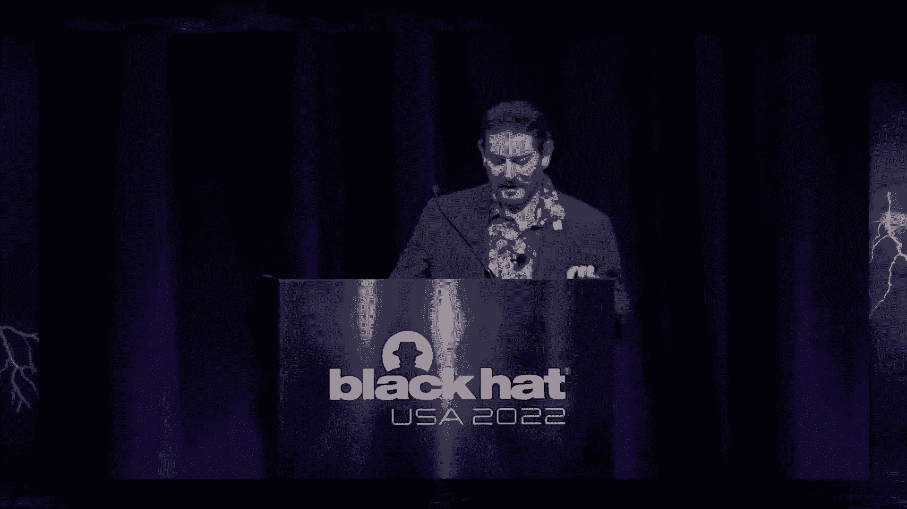
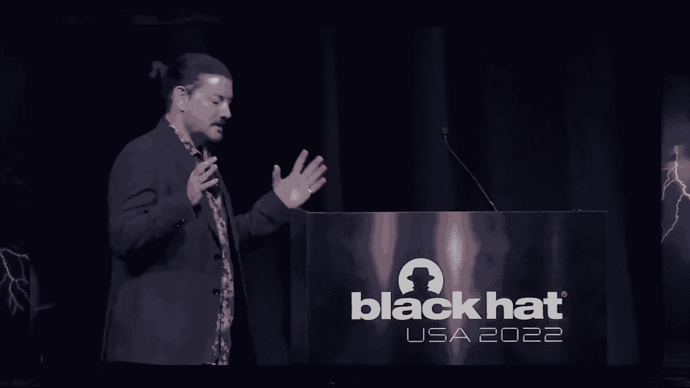
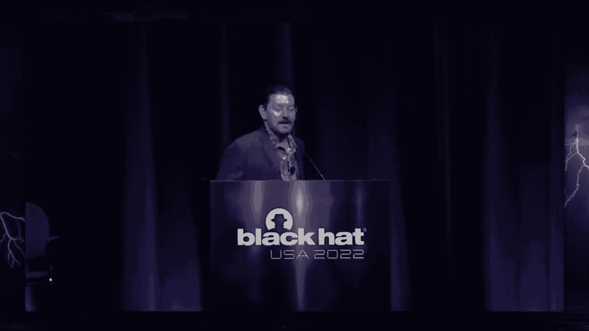
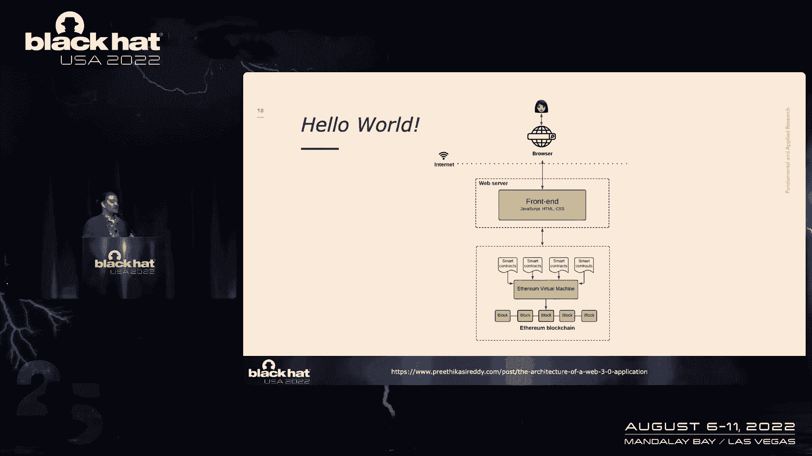
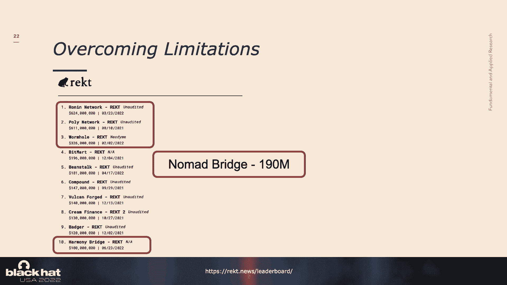
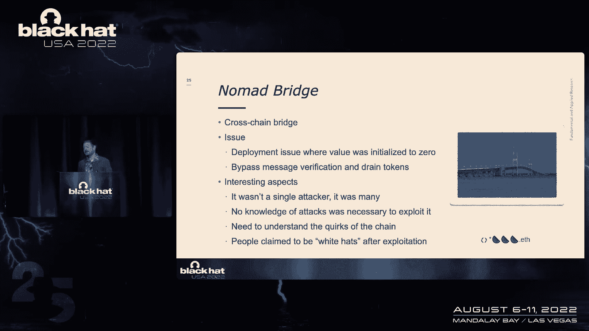
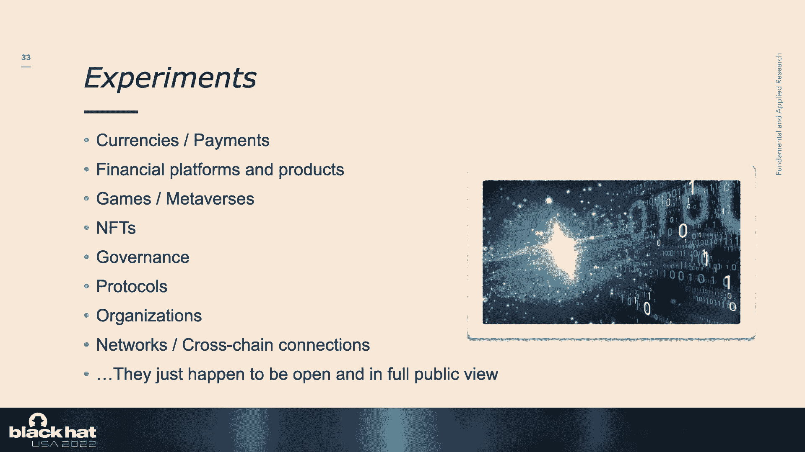
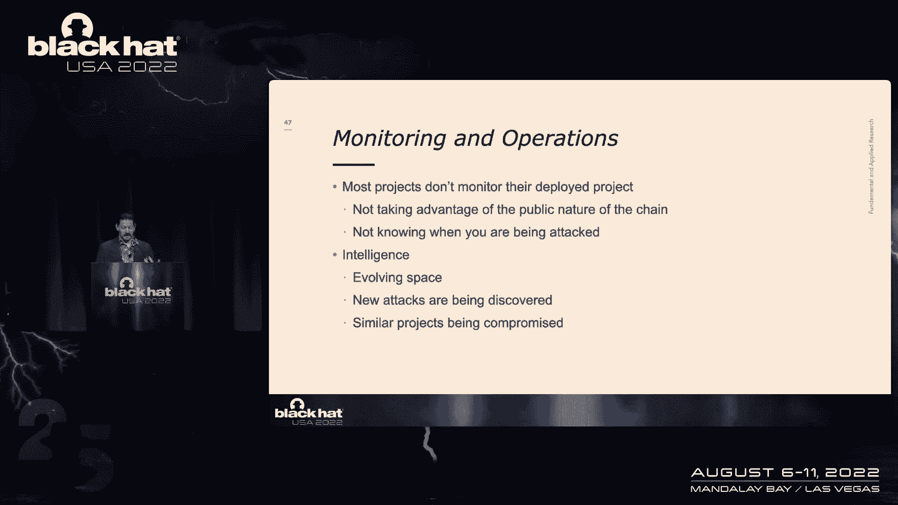
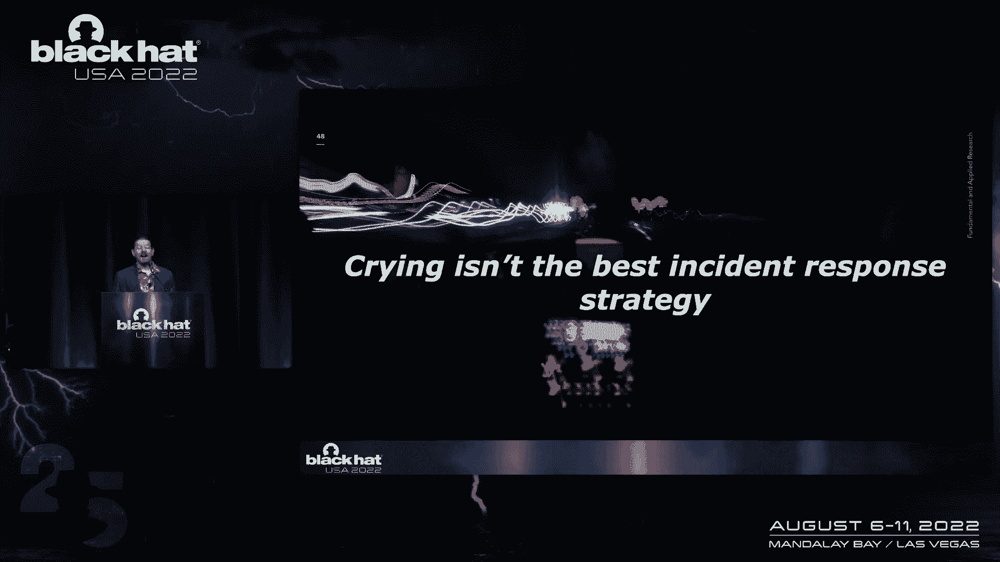
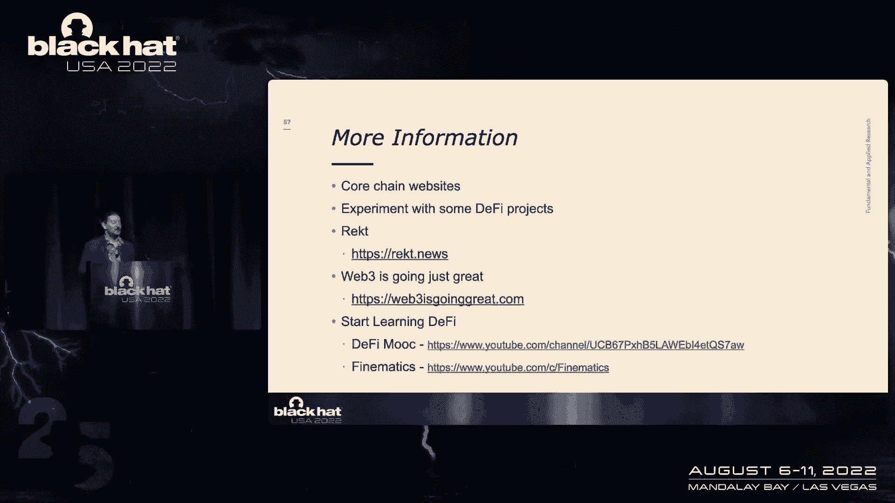

# 【转载】Black Hat USA 2022 会议视频 - P67：076 - From Hackathon to Hacked： Web3's Security Journey - 坤坤武特 - BV1WK41167dt

现在我很荣幸地欢迎内森·哈米尔上台。

谢谢大家今天早上加入我，所以昨晚我是个很好的男孩。

我喝了很多水，我很早就回到了房间，做了所有正确的事情，我还是睡不着，所以这只是告诉你在拉斯维加斯，没有一件好事不受惩罚，应该熬夜的，所以谢谢你今天早上加入我。

从黑客马拉松到哈，我叫内森•哈米尔，我是凯利安全公司的高级研究主管，我们是一家全球性的安全公司，我领导基础和应用研究团队，以及新产品原型团队，我以前在许多会议上讲过话，我做了十多年的黑帽审查委员会成员。

我是人工智能机器学习和数据科学赛道的现任负责人，考虑到你可能会想，像我这样的好男孩怎么会谈论网络三，这是一次有趣的旅程，大约四年半前我加入了科尔斯基保安公司，我的团队中大约有一半是密码学家。

我们在研究先进的密码学，比如阈值密码学和零知识证明，其中很大一部分是由区块链公司资助的，所以我们所做的是我们建立了一个练习，帮助区块链公司保护软件，这就是我参与这个话题的地方，你可能想知道什么网络三。

这里的每个人都知道什么是网络三吗，或者你来这里是想知道有多少人知道网络三是好的，相当多的人，所以这是拟议中的互联网的下一个版本，如果你听倡导者的话，真的为了这次谈话，我们将要讨论的。

运行在区块链技术之上的应用程序，所以这才是这次演讲的重点，你可能会想，因为这往往是一个有争议的话题，在听任何东西之前，你可能会想知道我的观点是什么，我得说，让我明确一点，我是非常中立的。

任何涉及技术的时候，我不觉得这个世界是一个更好的地方，因为脆弱的技术在那里，所以我觉得作为安全专业人士，我们的工作是帮助人们尽可能安全地创新，所以我对这次演讲有几个目标，第一个是。

花了四年半的时间在这些项目上，并提炼成一些观点来帮助你理解，鉴于所有的新闻，你可能会看到为什么这些问题持续存在，它总是变成智能合约，但随着我们的前进，你会看到，这只是一个更大的难题的一部分。

我希望涵盖一些促成因素，并试图让安全人员更多地参与进来，因为我们一直对这个话题持观望态度，最后我会提出一些建议，关于我们如何开始使这个领域更加强大，所以任何时候新兴技术出现，它认为这是例外。

新兴技术是什么并不重要，它声称是例外的，所以我们不能再那样做了，因为这项技术太新了，我们必须扔掉剧本，写一个新的剧本，我们从历史中知道事实并非如此，新兴技术通常涉及一堆传统技术经验，结合了一些新的东西。

我们真正做的是交易一系列已知的问题和复杂性，对于一组未知的问题和复杂性，当我们解决这些未知的问题和复杂性时，这就是围绕安全的事情开始出现的地方，所以希望你会开始看到这种联系在一起。

如果你看看这个话题的新闻，你可能已经注意到了，你知道的，数十亿美元的非法交易，比如说，或者你知道，从戴伊那里偷了22亿美元这些是221的数字，顺便说一句，今天仍然很糟糕，2020年后会更糟。

如果你注意到这周，有一个加密货币混合器，得到了联合国的批准，s，政府，因为，很多这些非法交易，经常会通过混频器进行匿名，社区对此有点不安，出于几个原因，所以我明白在这个空间里需要一定的活力，所以我明白。

为什么三个西瓜的家伙想成为三个西瓜的家伙，而不是真名，每个人都在充当自己的银行，如果你知道三个西瓜的家伙是谁，然后你就可以参观三个西瓜男的家了，如果你知道他有一定数量的加密货币。

你可以强迫他们把它翻过来，但我不明白的是，为什么三个西瓜的家伙在游牧桥开采时拿了钱，这真的是个问题，社区必须处理的问题，今年我们看到十大加密货币暴跌，许多人认为这个项目将是我们开始看到的下一件大事。

影响Web三空间的更传统的攻击，所以也许你听说过ProjeDiscord被黑了，或者客户IO有问题，你认识的人已经妥协了，攻击者能够向项目的客户发送通知，随着这个空间越来越受欢迎。

这些东西会变得越来越普遍，我是说这不像你，我不知道，收集加密货币和NFT的人在那里闲逛，如果有人收集加密货币和NFT，他们真的想让你知道他们收集它们，所以他们把自己塑造成自己的目标，还有一件事。

每个人都在充当自己的银行，那不仅仅是人，那是项目，当这些东西被黑客攻击时，这就是导致如此高的影响的原因，如果我必须总结，你知道我们在一句话中看到的整个情况，为什么这么糟糕，我想说。

我们有缺乏经验的开发人员在新兴平台上编写新的金融产品，在众目睽睽之下，失败的代价非常高，和开发的努力和时间是令人难以置信的低，这是一场完美的风暴，所有因素都聚集在一起，这意味着不仅仅是缺乏经验。

这不仅仅是不负责任，别的东西，如果只是其中之一，我们可能不会看到那么糟糕的事情，但我们有很高价值的目标，公众暴露和未探索的攻击面，所以我们还没有发现空间中的所有问题，但我们仍在寻找他们。

这意味着简单的错误可能会产生立竿见影的毁灭性后果，如果你是一个WebThree开发人员，你启动了一个成功的项目，你学到的第一课是60秒内就消失了，不仅仅是一部糟糕的尼古拉斯·凯奇电影。

这也是你所有的钱都会发生的事情，因为开发这些东西的时间非常快，这是我们不习惯看到的东西，我们习惯了更传统的攻击者方法，哪里有你知道的，一些侦察，有一些探索，一些开发和旋转，拥有不同的系统。

但其中一些是如此暴露，你可以调用一个函数并获得资金，这意味着WebThree项目没有优雅地失败的奢侈，如果你要失去所有的钱，那你的日子就不好过了，我不认为任何人会有任何争论。

所以现在我想说的是我试图说服安全专业人士，他们为什么要关心空间，因为你可能会说，这一切都很好，你知道的，加密兄弟要做加密博罗的事情，我只是要去这里做我的事，所以世界并没有变得更好，当脆弱的技术存在时。

因为我们往往会发现这项技术在陌生的地方被采用，我们没想到，它让我们落后于曲线，也有一些合法的酷技术，我提到了阈值密码学和零知识证明，这些在很大程度上是由区块链公司资助的，这些对正常业务有有用的影响。

如果你被金钱驱使，你喜欢虫子赏金，我想不出更好的空间了，因为我们有一千万美元的窃听器赏金，然后是九百万美元或者对不起，600万美元的窃听器赏金，我是说，找到窃听器花了这么多钱，当然。

民族国家也加入了这个游戏，所以拉撒路集团被归因于浪人，浪人网络攻击，这是历史上最大的密码黑客攻击，我有一点我要谈谈这个，再多一点，但这意味着这种脆弱的技术可能会助长，一个民族国家的核野心。

当然最重要的一点是如果没有安全保障这个空间就不可能成功，安全和安保之间有一个基本的耦合，我们还没有真正看到，我是说如果你如果你看着，如果你参加了，有多少人参加了第一天的主题演讲，好的，相当多。

如果你听到克里斯·克雷布斯说易受攻击的软件比安全软件更有价值，因为开发人员没有感受到影响，在它被破坏之后，这个空间确实，这是一个用例，如果没有安全，你就无法成功，我知道我在这个社区已经20年了。

我知道有一件事我们爱，那就是恨，我们爱恨，这是我们骨子里的，我记得在会议上走来走去，没有云，只有别人的电脑，我想知道这些人中有多少人现在是云安全专业人士，我们往往落后于曲线，我们也没有意识到。

这项新技术经常迫使我们提出新的保护机制，我们可能没有想出的，否则，所以如果你想到物联网和安全元素，你知道所有这些都迫使我们加强我们的游戏，它的影响远远超出了领域，它在，如果你是安全专业人士。

只有两件事你应该讨厌，那就是那些讨厌特定技术和PHP的人，每个人都可能讨厌，PHP肯定没问题，我知道你在想什么，我不得不提NFTS，你就像，是啊，是啊，我抓住你了，但即使是nfts。

我想人们人们不讨厌NFT，人们讨厌收集nfts的人，就像，讨厌玩家，不是游戏类型的东西，但我甚至想让你在NFT上后退一步，因为我们在这个空间里真正看到的是我们不习惯的东西。

我们看到技术实验在公众的众目睽睽之下进行，这不是我们所习惯的，你知道我们习惯了隐形模式下的创新，几十年的开发和营销技巧，用疯狂的主张和量子隐形传态，以及传统创新所发生的所有其他事情。

所以在我们进入这个之前，在我们开始潜入这个，保持开放的心态，这是新的东西吗，很有挑战性，这将真正迫使我们作为一名安全专业人员前进，如果你有兴趣进入太空，你要做的第一件事就是定义三角洲。

那么所有的体验之间的三角洲是什么，我们作为一个社区所知道和拥有的，我们需要知道的是这个空间，希望随着我们的前进，你会看到相当多的三角洲充满了知识，你已经有了这样的Web三架构。

如果您曾经尝试开发WebThree应用程序，你可能经历了一个你好的世界，你看到了一些相对简单的东西。

您基本上构建了一个应用程序，你把它部署在链子上，世界和平随之而来，每个人都很好，那只有在你不需要的时候才起作用，让我们看看你不需要什么，如果你需要不好的数据，如果你需要规模，那也不好，如果你需要速度。

那也不好，你知道开发人员经常不关心的三件事，然后你就会进入看起来复杂得多的事情，所以你最终不得不使用API，钱包，当然，你知道传统的存储是为普通人准备的，所以你必须使用IF或Airweave。

或者类似的东西，当然如果链条太慢，然后你必须在一条链子的上面再建一条链子，这样你就可以把所有的东西都锁在一起，这些组件中的每一个都创建了一个新的攻击面，你需要考虑的其他事情，我不打算经历所有这些。

但网络的一个独特之处在于，三个空间有点不同，其他一些新兴技术，如人工智能，例如，这个空间真的试图重现一切吗，我们在AI身上并没有真正看到这一点，我们试图用AI解决新问题，我们试图用人工智能解决问题。

但我们真的没有象征性地，试着把它扔到世界各地，还有其他的东西，所以他们真的试图重塑很多东西，其中一些组件可能非常脆弱，而且非常昂贵，所以这是一个巨大而复杂的空间，很多时候，当你听到关于这个主题的谈话时。

是关于以太坊的，不止一个区块链，所以我们真的有数百个区块链，如果你想想攻击面和它是如何工作的，你可以把每一个链看作是它自己的操作系统，每一种智能合约语言都是自己的框架，不是所有的知识都能翻译。

即使跨越锁链，这可能会使它很难爬上去，因为你必须高度专注，另一件要记住的事情是，这些智能合约语言中的每一种，链子有怪癖，嗯，怪癖有点轻描淡写，因为如果你用错误的值初始化了一些东西，它将默认为true。

然后每个人都得到钱，除了你，所以这些是你需要解释的事情，当你受到威胁时，建模，当你测试的时候，当然还有，区块链极其有限，他们彼此不了解，所以他们不知道对方的存在，他们也不知道世界的存在。

这就产生了相当多的问题，例如，以太坊不知道索拉纳的存在，比特币不知道Terra的存在，对不起，不会太快了，好的，所以所有这些都是开发人员想要解决的问题，所以这些空间允许的是漏洞对吧。

所以开发人员为这些事情创建变通方法，就像神谕和交叉链桥和侧链，所以这被破坏了，以前有多少人在休息，好的，非常好，维护顶级黑客的排行榜，基本上和我所做的，哦耶，好的，那是上周，在第五名的时候失误了。

这些是交叉链桥和侧链，从一个区块链到另一个区块链的突破方式，它占了这些黑客攻击中损失的大部分价值，如果你想想区块链核心技术，它很有弹性，你知道我们在安全方面没有太多的核心区块链问题。

总是应用程序在上面运行，很多时候，它涉及到试图连接代币的应用程序，从一个到另一个。

对于攻击者来说，它是从结束开始的，所以攻击需要从最后开始，因为你需要弄清楚你的退出策略，因为如果你黑进某个东西然后把它放到钱包里，不要移动它，然后再想以后怎么处理它，有更大的可能性，有人将能够找出谁。

甚至可能恢复一些代币，所以你看到的，我是说，在另一件也发生的事情中，就是，又不是说，你可以黑一些东西，然后打电话给苹果，说嘿，我能在iTunes上得到一亿吗，也不起作用的礼品卡。

所以很多时候会发生黑客攻击，它就会撞上一座跨链桥，它会去另一个链像以太坊，然后它会去一些Defi项目，然后他们会把一些放在搅拌机里，匿名交易，然后它就消失了，所以退出策略先开始。

所以让我们来看看几个攻击，我选择了其中的几个攻击来强调，非常简单到非常复杂，另一个好处是所有这些袭击都发生在今年其中两起发生在上周，这样你就能知道我的演示文稿准备得有多晚了，但对你来说是一个额外的奖励。

你会得到非常新的信息，这是我在《失事》的第五名，这是一座跨链桥，就像，我说，你知道的，区块链不会互相对话，所以你可能有价值，你可能在一个网络上有代币，想用它们在另一个网络上买东西。

或者投资于另一个链上的某个协议，所以交叉链桥允许这种情况发生，这里的问题是有一个值被初始化为零，绕过了，你知道的，所有的信息，或消息的所有授权，人们能够抽干代币，基本上有趣的是。

你不需要知道任何关于袭击的事情，你不需要知道任何坚实，你不需要知道，打任何电话，您所要做的就是捕获一个成功的事务，替换钱包地址并在网络上广播，你也有钱，可能是攻击的最低限度，所以有人利用了这一点。

他们甚至不知道攻击是如何工作的，所以另一个有趣的事实是这意味着不是一个人在攻击它，就像一群，我猜是三只刚刚咬了一口的食人鱼，直到没有钱了，如果你还记得我们的朋友，三个西瓜的家伙。

他在事后声称自己是白帽子，说联邦调查局，不要追我，我要把钱还回去，所以也许他从第一部分就这么做了，或者他的球队赢了，他掀翻了一辆警车，你知道他现在后悔了。

不管，他说他已经把钱还回去了，这可能很难读懂，但如果你能读懂，上面写着私钥和助记符，你可以看到坐在那里的值，在座熟悉加密货币钱包工作原理的人，所以你知道当你用助记符时会发生什么，你可以重新修复钱包。

所以上周有一群人的钱包被抽干了，他们不明白为什么是斜坡钱包，这是一个非托管加密货币钱包，这意味着你要自己管理它，发生的事情是，移动应用程序启用了详细日志记录，开发人员想了解更多关于用户的信息。

这就是你所做的，你把记录调到1000，收集每一点信息并将其发送到第三方云服务，嗯，所有的私钥，所有的助记符都去了这个云服务，所以这意味着所有的钱包都很容易妥协，这很有趣的原因是因为它有点像一张网。

影响网络三的问题，这表明嘿，你需要把一切都做好，这是一个错误的配置，你会看到的另一个有趣的主题是团队没有注意到，所以你在收集所有这些冗长的信息，你不看它，因为任何看过的人都会知道，哦哇哦，那很糟糕。

也许永远不应该发生，永远，浪人网络是另一个很好的例子，因为我认为这就是攻击的方向，所以以太坊使用的浪人网络，熟悉斧头无限的人也是如此，好的，所以非常高级的AE无限是一个视频游戏，就是玩赚电子游戏。

这是一个收集NFT的人的地方，可以去吃他们的NFT，互相决一胜负，而不是在网上和人打架，所以基本上你可以玩赚钱，出于性能原因，他们不得不使用自己的侧链，最后发生的是有九个验证者。

如果您可以控制大多数验证器，然后您可以控制事务，其中四个验证程序由斯凯·梅维斯运行，制作电子游戏的组织，事实上，如果你熟悉拉撒路小组，他们的技术以真正的拉撒路集团的方式始于网络钓鱼攻击。

所以他们找到了一个开发商给了他一份有利可图的工作，他参加了工作面试，当然，你是做什么的，你给他们发一封报价信，嗯，要约信里有一个很好的小惊喜，就像拉撒路小组喜欢做的那样，接下来你知道的是。

浪人网络损失了6。24亿美元，它被归因于一个民族国家，你怎么会，你想不想成为那种完全糟糕的人，我说这是，我想这就是未来，这些东西要去哪里，是因为它不像，激光小组不是从智能合约开始的。

他们可能什么也没找到，然后他们又回到了他们的老把戏，如果你熟悉孟加拉银行袭击，他们有，这是以前针对SWIFT系统的最大的银行攻击，他们花了一年时间，他们不得不在网络上植入东西，希望没有人更新东西。

消灭他们的攻击，所以这是结合多重攻击，铁链，多次攻击一起危及其中一个项目，另一种是豆茎，我觉得边缘杂志的文章总结得很好，它说加密货币项目在黑客投票后被抢劫，给自己寄了一亿八千两百万美元。

在这个空间里正在进行的实验之一，这个社区治理的概念，所以如果你听说过道，但基本上这意味着项目投票决定如何处理，基本上，攻击者能够通过闪存贷款操纵治理协议，它是一个，你知道的，你可以拿出来的贷款。

你必须在交易结束时偿还，所以他们能够为自己赢得多数席位，份额，投票把所有的钱都寄给自己，他们使用了紧急协议让它保持24小时，没人注意到，他最终在这里得到了如此有趣的钱，使用闪存贷款，这是合法的事情。

从套利中收集资金进入税收，这也很有趣，因为通常，你知道，你听说百分之五十一的攻击，但这是获得数十亿美元的一种方式，所以这里有一些主题，代码中已知的安全问题，糟糕的建筑和设计，你知道。

所有这些都是传统软件的共同点，当然还有，几乎回到传统软件是文化，组织，经验、过程和操作，所以你可能会想考虑到所有这些袭击考虑到毁灭性的后果，为什么这个问题没有得到解决，所以让我们从文化开始。

因为一切都是从文化开始的，这些不是企业，很多时候他们看起来不像企业，他们没有保安人员，他们没有保安人员，它真的落在一个光谱上，所以这可能只是两个人的项目，也可以是类似于集中交换的东西。

所以一个集中的交易所有治理，他们必须遵守法规，它们看起来更像一个传统的项目，无论大小，你会被一个民族国家攻击，所以重要的是要记住，你可能不是在和一家公司打交道，可能是几个人的小项目。

他们正在试验许多不同的技术，每一种技术都有自己的攻击面，和它自己的东西要交代，比如闪贷，例如，这是新的东西，好像没有类似的东西，比如从银行贷款走到出纳员面前，她给你一万元，你拿着，你把它还给我。

你付给她一万一百美元，像那样的东西在现实生活中是不存在的，但如果你不知道一个是什么，那你就不知道如何对它进行威胁建模。

当您对协议进行威胁建模时，现在是脏话的时候了，所以你可能想塞住耳朵，那是权力下放，所以分散是可能会让你有点沮丧的事情之一，在这个空间里，这是因为它通常被称为，你知道的，缺乏所有权，它是一个。

这是一个特点，也是一个缺点，如果你仔细想想，一方面，这很好，因为东西是社区拥有的，你拥有自己的东西，但另一方面，权力下放也意味着对问题的解释，这意味着也没有人拥有这些问题，所以这些项目应该是社区拥有的。

但你发现当你开始做一个刀，分权的自治组织，你开始投票，你意识到这不一定像看起来那么公平，所以通常钱多的人有更多的发言权，有时那些人说一些你不喜欢的话，就像嘿，我投票清算这个项目，拿走所有的钱。

这是合法的投票，对呀，那甚至不是攻击，这就像是设计的一部分，所以这些DDO经常控制金钱，但我认为重要的是，带走，谈到其中的一些项目，你不能用刀解决战术问题，不能由社区决定是否修补一个易受攻击的软件。

所以我们在传统空间学到了一个很好的教训，适用于这里，社区不会解决你项目的问题，我们在其他任何社区都没有看到过，它不会它不会在这里做，其他一些困扰这里安全的文化问题是，如果你从来没有处理过Web 3项目。

这会让你大吃一惊，就像有目的的，不想使代码可升级，部署一次，千万不要碰它，这意味着与社区建立信任，这里最大的缺点是我们甚至还没有发现所有的安全问题，像这样，安全是一个活跃的研究领域。

所以如果他们的代码无法更新，那就没有办法保护这个项目，这里的其他事情是在合同中加入保障措施，你知道的，允许人们或允许自己一些保护，比如不允许人们一次耗尽所有的资金，或者在合同中规定费率限制。

你也会看到激进的透明度，所以浏览一个项目的GitHub页面并不罕见，并在其公共bug跟踪器中查看安全问题，所以我的意思是，嘿，如果有人报告了一个问题，而您永远无法更新它，那很糟糕。

或者如果有人能够利用这个问题，在你有机会修复它之前，这一切都太糟糕了，你知道的，还有另一种心态认为人们应该能够编写易受攻击的代码，因为这就像某种网络三达尔文主义，所有这些都使您的项目不那么安全。

引用伊恩·马尔科姆博士的话，大自然找到了一种方法，攻击者也是如此，民族国家又不是只有一种技术，如果这种技术不起作用，他们去找别人，事情不是这样的，它们不被称为高级简单化威胁，所以我们需要确保项目理解。

他们需要覆盖很多地方，否则他们可以放弃他们的钱，再见，缺乏经验可能是你最熟悉的，最引人注目的属性，缺乏经验和不负责任从外表上看往往很相似，所以有时候如果某人没有经验，他们的行为往往看起来很不负责任。

我发现，许多项目开发人员通常对开发非常陌生，他们只是不知道某些东西的存在，但有一件事你永远听不到，在某人赢得黑客马拉松后是耶，我们现在有资金了，是时候考虑安全性了，成熟度直接影响安全性。

所以这些项目没有做最基本的事情，比如问出了问题会发生什么，这是我们都问的，我是说这甚至是威胁建模的一部分，你知道当这个停止工作时会发生什么吗，所以当事情发生时，他们没有计划，他们没有办法防止事情出错。

他们认为他们包括安全，但很多时候你知道他们用安全审计作为某种证明，他们把每件事都做得很好，安全性在安全性审核中开始和结束，你知道他们可能需要对资金进行审计，他们可能需要一个审计来向社区证明这是安全的。

但这里的问题是我们有一些人，我们对这些项目做了审计，然后他们发现他们有安全问题，然后他们说，嗯，这应该是建立的，但它甚至不在代码中，我们在看，这不是代码的一部分，我们有一个项目。

我们发现了一个非常严重的问题，我们向他们报告了这件事，他们就像，哦，那很糟糕，我们不用那个代码，所以我们要把它移除，一个月后一切都好了，他们就像，哦耶，我们在用那个，他们把它放回去，这种情况发生了。

所以这表明你，不管你做多少审计，你不会安全的，如果你没有后续的过程，你得把一切都做好，第一次没有像传统开发商那样的护栏，所以这意味着所有的链上代码，你所有的交流，第三方组件，协议和逻辑的设计。

所以有些引用，引用你听说过的黑客，不是对智能合约功能本身的利用吗，是对协议设计的黑客攻击使其易受攻击，这在我们的空间里是一个新的东西，所以你必须知道什么会出错以及如何保护它，当然还有。

我们都知道从传统的空间，没有吸取的教训，审计不会解决所有这些问题，安全不能在最后到来，所以从过程和标准的角度来看，真的没有，所以我们有开发人员把相等运算符放在错误的方向上，我是说。

如果你考虑建立一个金融产品，你认为你会希望相等运算符在正确的方向上，有些项目向参与者支付了太多的钱，然后不得不向他们讨回所有的钱，所以这不是一个好地方，如果他们有一个简单的QA过程，不止一个人查看代码。

他们可能至少找到了简单的问题，没有正式的，你知道的，安全bug报告，所有这些其他的东西都不见了，我们习惯在太空中看到的，这是因为他们没有从邻近的技术中学习。

他们没有从我们在Devsecops中所做的事情中学到东西，他们没有从威胁建模中学习，他们没有从这些东西中学到任何东西，我之前提到过监控，所以另一件没有发生的事情，这是一个公共区块链。

您可以看到所有的事务，但这些项目都没有真正监控他们项目中发生的任何事情，所以浪人验证者攻击，发生的最大的袭击，那是在那之后的六天，他们发现他们所有的钱都没了，甚至不是他们，它是社区的一员。

想象一下你社区的一个成员走上来，哦耶，你没钱了，我为什么要和你打交道，那不是个好地方，在这个领域，另一件非常重要的事情是有一些收集情报的方法，我们在一个新的空间里有新的功绩，新的攻击技术，如果你不采取。

如果您没有从邻近的项目中吸取教训，如果你偷了别人的钱包，打个招呼可能是个好主意，这会发生在我们身上吗，那里发生了什么，现在，开放的好处之一，很多这样的项目，即使他们被黑了，失去了一切，他们会写一篇报道。

详细说明发生了什么，他们中的大多数人都很诚实，其实挺清爽的。

因为你知道哭不是最好的事件应对策略，但如果您没有在系统中内置保护措施。

如果您不允许代码可升级，这可能是你唯一的策略，我对这个空间很有希望，我是说，我们现在比几年前知道得更多，外面有更多的信息，今天比以往任何时候都有越来越多的资源。

所以我觉得这里开始成为一个更容易获得的空间，我一直想告诉项目们的一件事是安保是一项团队运动，你知道没人会雇一个安全专家，他们进来解决所有的问题，你知道你甚至不能指望这个星球上最好的保安公司。

通过审计来保护你，如果这个过程中的其他人都没有做正确的事情，我希望我们能开始让攻击者更难，而不是难以置信的容易，这应该是目标，因此，作为安全专业人员填补三角洲作为首要和最重要的。

所以我提到不能升级代码和所有其他的东西，您可以使用其他控件来获得相同数量的信任，如果你不明白项目是如何运作的，以及您可以使用的API和链特定保护，那你就不知道要提出那些建议，有很多弱点，写作UPS。

ctfs，bug，赏金计划，这些都是，你知道，所有这些都可供您使用，你可以开始学习更多关于，通常为这些项目提供资金的风投和基金会需要加快步伐，因为仅仅要求审计并不能解决问题，所以要求安全具体指导。

某种反应，监测战略，你知道所有这些事情都需要说明，所以如果你赢了黑客马拉松，你应该制定一个计划，在它推出核心链之前，你将如何解决这些问题，那就是以太坊，所有这些核心链都有一定的责任提供安全。

文档和指导是最重要的，资助更多研究，但如果我们想想，我们用代码解决一些传统的或更传统的安全问题，他们应该在编译时寻找仪器保护的方法，所以通过一个专门的框架，或者通过本机代码来捕捉这些东西。

所以你不应该被允许制造令人痛苦的明显的安全问题，那解决不了问题，很多都是特定于协议的，但这是一个开始，它的东西，他们应该投资于持续的研究，当然，还发布参考体系结构。

所以如果你在建造一个AMM或者你在建造一个交叉链桥，他们应该发布参考体系结构的样子，和项目需要学习，这个教训是，没有神奇的创新出现，那会救你的，如果有，他们应该告诉我们，因为几十年来。

我们一直在等待一些神奇的创新出现，来解决所有这些安全问题，对项目来说，这将是最艰苦的工作，比任何其他组项目都多，吃吧，最坏的，安全不能等到最后，你知道他们需要雇佣一些敬业的保安人员。

你不能指望保安公司来解决所有这些问题，乞求，借，偷，雇一个大学毕业的人，你知道你今天什么都没有，对呀，一个有激情，愿意学习的人，你愿意和谁坐在一起，我认为这是一个很好的地区。

因为您开始了解应用程序安全性，您开始了解部署，你开始了解所有这些事情，我们需要他们，向devsecops学习，你知道的，有扫码的方法，你知道的，正如您在将其签入存储库时所知道的那样。

威胁建模可能是他们需要做的第一件事，你不能在没有威胁建模的情况下设计协议，然而，许多项目确实如此，静态分析也是你可以做的事情，不是，所有这些项目都是用以太坊写的，所以有些生锈了，我们有生锈的工具。

你可以在Keeli Security使用像Segrep这样的东西，我们有一个专门针对Solana的Semgrep规则集，我们可以在这些工具上运行，这些是可以开发的东西，要么是安全界，由，你知道项目社区。

当然，你知道练习防御性编码，在项目中内置这些保护措施吗，掏空你的钱包，你所有的资金，不要让项目能够很快地做事情，如果这不是项目用例的一部分，也有一个质量保证过程，以确保这些平等操作员在正确的位置。

比如功能测试，您知道可以在运行时使用和运行的东西，或部署前，我应该说另一件有趣的事情是标记代码的敏感区域，所以如果那个区域发生了变化，你知道给它让路，更多的审查。

所以这是可以通过源代码来完成和管理的事情，和，当然，用某种方法建立一个监控策略，你知道的，别哭，别哭，因为这不是一个好策略，所以我这里有一些额外的信息，将在书中提供，将在滑梯甲板上提供，我很抱歉开枪。

就像一大堆信息在你身上，因为我相信那就是那种感觉，四十分钟太多了。

我希望我有，嗯，再多三个小时和一堆讨论，那就太好了。