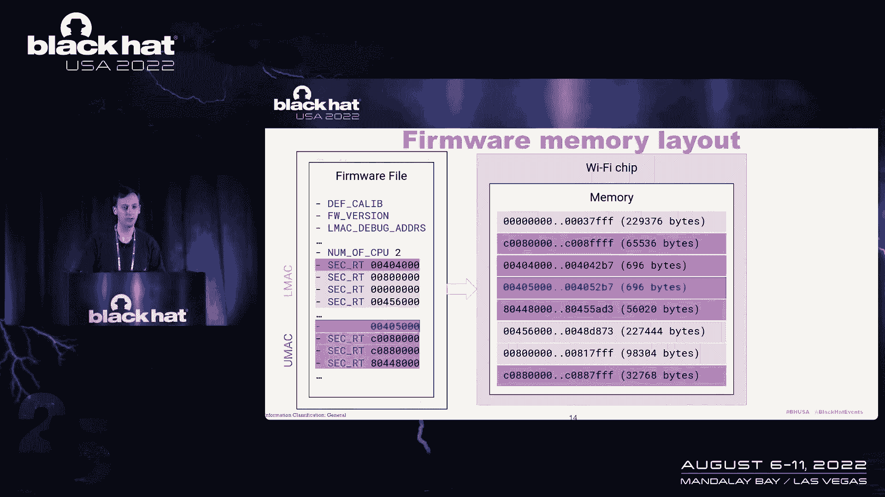
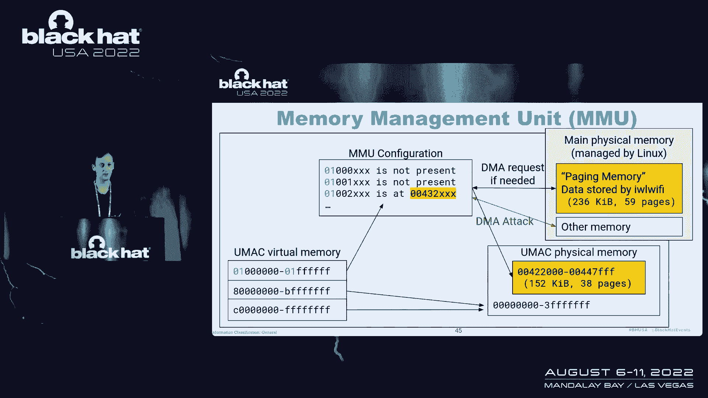
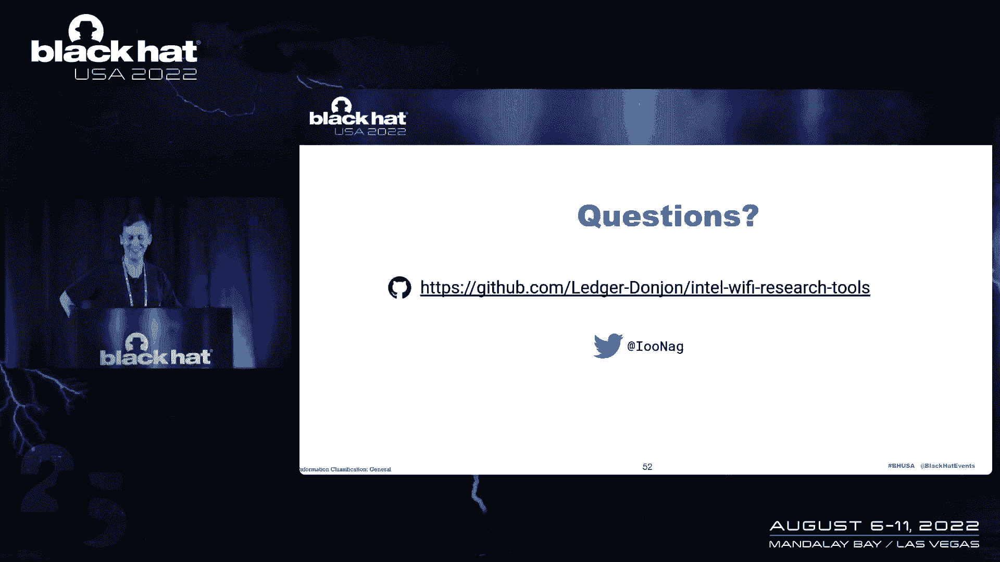

# 【转载】Black Hat USA 2022 会议视频 - P68：077 - Ghost in the Wireless, iwlwifi Edition - 坤坤武特 - BV1WK41167dt

所以你好，我是尼古拉斯你的，我会展示更多的Stasi用我的CRE做的，几个月前，我们想从他的笔记本电脑上传输文件，从它的智能手机到他的笔记本电脑，这是一个http服务器，去了一个有智能手机的服务器。

它上传了文件吗，这个没有看，我们没有那么远离WiFi网络，所以他看了看通道负载，他看到他的WiFi芯片有硬件重启，因为有一些高级的布景，我们发现有趣的是你能喜欢，让某人这是从WiFi网络。

惠普要求的东西，所以我们走得更远，而我们，我们作为研究对象已经有两年了，那么为什么这项有趣的研究首先，在WiFi芯片中实现了许多复杂的功能，所以这就像你有一些术语，没有公共娘们。

关于英特尔WiFi芯片的一切，有一些关于广义WiFi卡的介绍，关于英特尔，到目前为止对WiFi的了解，带有电缆的交叉接口卡，我前段时间看到的，因为如果你有一台带有英特尔处理器的笔记本电脑。

很可能你也在使用整个WiFi芯片，我只记得芯片是一种能力，这是很自然的事，所以如果你在宽i芯片上实现了这种情况，你能在右边赢是很重要的，主对立系统的存储器，所以很有趣，简用左边的芯片。

这是我笔记本电脑上的一张相当旧的WiFi卡，我用右边的芯片，所以有两个芯片还在所以在这项研究中，在这个实验中，我将首先检查固件，它在芯片上运行，以某种方式扭曲芯片。

然后我将介绍我们在这项研究中发现的一些漏洞，这使得执行一些动态和实验，然后我将进行一个实验来更好地理解，是否有可能从野性中执行附加的美德，对Linux上的WiFi感兴趣，在蓝场有一堆用户空间程序。

并配置WAL，这些程序开始通道模块或Lina一堆通道模型，它们被教给芯片，它被视为PCI Express设备，在一些冷杉里，英特尔WiFi的一个有趣的事情是，固件实际上是通过信道传输的，当芯片复位时。

这很常见，通道位于船内，通道上的固件，从那里模块加载芯片上的固件，这样我们就可以读取这个文件，它是一堆带有一些标头的二进制数据，然后键入值和树，比如说，第一个是十六进制是小数，然后是长度OC。

十进制是十二，然后通过它的控制台，二进制数据由通道模块析出，这是开源的，所以我们可以浏览一些头文件，我们有一些定义类型的，所以我们可以用两个三个白色的Python条来解码固件。

我们看到了一堆关于固件的元数据，所以第一个是关于聋哑的贾利布，他们发现一些洪水，从我在田野上发现农场的版本开始，也就是CPU的数量，也就是，事实上，Wii芯片上有两个处理器，这是有广泛记录的。

所以我会简单地介绍一下，在您的消息控制器上有一个U匹配CPU，它负责在各种不同的WiFi原型上实现高级方面，处理器的低最小化，它基本上驱动我们身上的物理表面，两个处理器都使用相同的片上内存。

Linux加载该系列，在固件文件中，所以有一堆元数据，还有加载在固件上的实际内容，在一次设置在截面上的树中，所以N处理器有橙色的国家，处理器用紫色表示的国家，此条目映射到不同的内存区域。

一旦你知道了这一点，你必须做一些你需要做的事情，为此有一些工具。

例如，有一个叫做CP的工具，它说这些内存区域包含拱形压缩代码，所以我们可以把它装进，因为当时是一个类似的，我为此编写了编译器模块，我在你的音频上有一个拉请求，因此，如果您正在使用请求，三千零六。

我们实际上可以DIY代码，从这里开始很容易，更好地理解固件的实际功能。

我很好地修改了固件，它不工作，通道中有错误，这样的引导错误，所以固件是由英特尔在，您不能修改您，用于，它不工作，在进入一些漏洞之前，我想介绍，如何将Utorch连接到芯片上，嗯，一开始是WiFi芯片。

所以你可以寄一个包，那是常见的等等，而第一个系统中的接口，这样的通道，迷你文件，所以这是一个削片润色模型，在双制中有很多，在这些文件中，有一个MEM文件，这意味着什么，意味着记忆，哪个是五。

我们可以读取Wii芯片内存的内存，你不能给它写信，但你可以读，这是相当痛苦的，有一个很有趣的文件，它是PH和奥斯卡罗佩里弗寄存器，我们基本上可以读到一些紫色的寄存器，在Linux源代码中。

他们发现了一些宏，比如说，你在PC和Mac上匹配，你可以阅读，例如在外壳中，这四个寄存器的值，我们看到一些地址，我们看到的第一个人看到了一些东西，这是一个地址。

它与我们在固件中看到的代码中的一些代码相匹配，所以这实际上是在多指针内，它是Intership的两个CPU的指针，这很有趣，这是方式接口，这不能，正在执行哪个代码，当某个函数被使用时。

并且一些功能正在被很好地使用，当我看到这个，我就像，怎么可能，JP处于污染模式，不应该有任何接口，但我们可以读取它所有的记忆，我们可以读取PC或芯片上两个处理器的，长话短说。

有一些接口是通过我的U中的一个空间暴露的，我就不多说了，白皮书中有更多细节，呃，但是呃，这主要是散步，所以这里是文档中的Internet工作意味着，所以，这是一个非常有趣的，和芯片说话。

所以我展示了我们的自然状态，他们身上的双面。

也失去了德国人，就像，以及在这一点上用来定义的问题，例如我有这个，或者在芯片上定义一些，等等，许多德国人，当然还有一些未记录的命令，这些在美国没有记录的东西试图在这个频道的院子里实现现在很有趣。

我们如何在这样的芯片上执行任意的代码。

为什么只是一个开放的，例如，在某个Ostroman的主人身上，所以当你派一个Ostroman，唯一的变化，读取某些命令的有效负载，这里你可以看到这个函数的两种颜色，它在这里被命名为，你以前见过。

首先用两个42位整数，第一个是作为一个机会，单个控件的参数，就是读，因此进入状态缓冲区的数据，我们在这里看到的空间，它正在加载到其他东西中的东西，所有的一步之前，那么我们这里有什么。

我们有一个非常基本的状态，缓冲区溢出，也没有，没有同化，所以呃，嗯，那里我就不多说了，所以很容易得到一点，这是芯片上的情况使用这个，在实践中加以利用。

我们使用Linx F获取更多信息来修补通道模块中的一个函数，嗯这边，我们呃，我们不是，我们要修改以修补模型本身，我们就可以这样，探索这个要稳定得多，然后我们可以用一些阅读。

在内存中写入可执行版本以写入一些数据，有一个后台，可以写入这个区域的数据，这是很有帮助的，因为当我们只需要一些地址，使用for溢出的研究来获得这个笔画的执行，就是这样，我们度过了难关。

现在WiFi卡里没有外壳，那么我们能做好什么呢，我们就可以，比如说，启用模式，所以这里有一些GitHub上的片段，我们发布了这些脚本，基本上是围绕双系统接口的庞然大物，所以第一个读一些内容。

然后我们来写一些数据到这个区域，它不起作用，因为芯片处于污染模式，那我们呃，运行此可变性的漏洞利用，所以我们改变，呃，这个地址的内容到四百，这将在默认模式下启用调试模式，我们实际上可以从中写入内存。

你得到了你在记忆中所拥有的，所以现在我们有了一个代码形状和白色，所以更好地理解芯片的特性是非常酷的，问题是这实际上是几年前通过的，所以这是留在一些旧的，友谊的某处，但不是在我的船上，所以实际上我很沮丧。

因为我的朋友可以在他的WiFi船上运行每个代码，但不是在网上，所以我想运行代码，所以我的船，所以我想深入，让我们现在看看固件实际上是如何加载到芯片上的，我早些时候由固件呈现，当芯片已经被，呃。

所以莱纳斯写信给，多年来，我们可以读取处理器的打印机，我们看到为什么我们会看到一个包含一些有趣的，我们也可以阅读地址条款，所以我们发现了一些代码，一些紧凑的代码，我不知道这是不是一本书，差不多吧。

那很好，所以我只想说这是一个装载机，我证实了我们正在展示固件，这在各种触摸上唤醒了数据区域中的一些全局变量，在比赛中总是存在的，因此加载器实现了非常精细的逻辑，家庭的投资性质。

我们可以尝试执行一次检查到使用时间的攻击吗，当我们在某个地方加载合法的，等待加载程序检查其签名，然后加载一个修改后的固件，让加载程序执行这个修改后的版本，嗯，否，它不起作用。

加载器实际上只在我们找到签名之前使内存区域读取，所以这是，但是当我们看这个的时候，我们能找到一些东西，我们可以在开始时将一些数据写入数据中吗，装载机在井上使用是的，所以从这个来看，这实际上很简单。

您只需在地址上加载修改后的固件传输，方法是编写一些输出的固件，等待或某处要加载，这是九月份报道的，两天前补好的，这样我们就上了第一艘船，但我没有得到我的芯片，一开始不起作用，但不知道。

但以一种奇怪的方式，我能够修改数据来读回我修改的数据，但就好像芯片忽略了这些数据，就好像芯片在用一些现金来使用它，如果它是站着的，这个案子在我写的时候没有更新，所以我找到了一个让道路装载机的方法。

提交其案件，冲洗它的舞台，读徽章，从修改到地址的数据，在这条路上，我得到了一个完整的，我其实，所以这样，即使在最近的船上，所以您可以为此运行一个位ary代码，你需要。

当然在Linux上已经有很高的特权了，您需要能够在通道中运行代码，但这就像是当地的情况，当您可以在芯片上运行代码时，从那里我们进行一些DNA和这个实验，我们能做什么，我们就可以，比如说，实现一些跟踪。

以更好地理解代码，正在执行什么代码，当我们为此使用一些特性时，我们用敲击指令或发明指令替换了函数的每一个第一个指令，那里有些人，我们修改注意向量以记录对函数的分析，它们在一个全局缓冲区中执行。

然后我们在这个缓冲区中读取，我们有一个基本的示踪剂，呃，它可以在软上跟踪年龄，如果我们想通过无线执行一些引信，比如说，当我们在固件中添加一些代码来执行一些，有些，比如阅读，写一些硬件寄存器。

做一些有竞争力的版本，贯穿了客户的首次亮相，使我们能够更好地了解WiFi芯片上发生了什么，嗯，这里要注意的一点是，我们不能使用与芯片通信的标准方式，它们是因为当服务运行时，家里不跑。

所以它实际上不能与主机通信，但我们在那里发现了一些未使用的平台，呃，首先使用PHP文件，有了这个，我们能够读写一些数据来制作一个通道，而不实际使用POST命令，所以这很好，我们还能做什么。

我们也可以用十多年前的一个想法，他的名字在尸体上，这个想法是模拟一些机器中的固件，并将硬件访问旋转到实际硬件，所以这个实际上在标签上，您可以为我们的紧凑型找到to mu版本。

我们可以通过使用TCG插件来修改它，旋转内存访问到实际硬件，但是通过大量的使用，所以它应该在这个，呃，我们有一些插件，这意味着经过一点训练，然后我们可以接近实际，在某个地方，做一个工作坊，嗯嗯。

在实践中，这款手表功能简单，但它对其他一些功能不太好用，因为芯片里有很多计时器，很多人看那些，当你用这个来，并测试一些夹具，会有一些计时器会过期，我们让雀在相当不稳定的，但是为了简单的功能，它非常满。

因为WiFi芯片中有许多其他寄存器，我的朋友想用G传输文件的第一件事，u，固件和Sun，然后我们找到了一些我们实现的图像和观看，现在我们可以做一些实验来回答一些问题，比如说。

是否可以从芯片执行一些DMA攻击，如果你知道船只网络是如何在独联体中找到答案的，因为嗯，当你把它，你用这个和Intei芯片，嗯，这个自然购买的游戏时代是由芯片的其他组件抽象出来的，无法访问实际地址。

它使用主存，呃，让事情变得更简单，所以我们需要找到另一种方法来执行MA，我们不能选择和垫子上使用的方法相同的方法，是啊，是啊，Wii飞船上有一个固定装置，但我们试了一点，它是前面形式i的分页内存。

一次有几段，所以处理器有会话，单元的会话，处理器和紫色，它们已经死了，对…有利，第一个是分离器，上面写着嘿，有四个国家，一个是辞职的签名，第三个包含数据代码，这第三个条目没有加载到芯片上。

但它仍然包含相当奇怪的代码，那么这是怎么回事，在处理器中，有一个内存管理单元，当您阅读有关零件的数据表时，内存管理单元，它，你会看到内存被分成几个区域，内存的顶部是直接映射到物理内存的。

是另一个也映射到内存的版本，低内存版本通过菜单映射到内存，一开始，MU不包含任何条目，当处理器努力编辑代码或读写数据时，比如说，在一个两个地址，它只会执行一个GMA读取访问来读取这个内存的内容。

从主存储器，如果我们把它读入他芯片内存中的某个空间，我们可以看到这里的数字，空间小于实际页数，所以就像交换一样，这是一种拥有比片上固件更大的固件的方法，内存大小，所以一旦内存出现，数据就会出现。

你可以在白色的阅读上更新一些新的东西，以及位于此区域的代码，现在问题很好，我们正在运行Linux中的红色代码，是否可以修改此代码，如果我们能修改这个笔画，我们还可以在芯片上实现代码执行，好吧，一个是不。

我们看到道路上有一个签名就在这个节目有效之前，未经核实，但通过加载所有页面来验证，还有另一种机制，它使用代码中的通用度量，40是和，检查页面的完整性，禁止修改这些页面或注释，由于这种机制。

不可能直接修改，我们也可以是主存上的页面，然后一个代码，嗯没说话，说了这么多关于他们的事，白皮书中有更多细节，基本上这个，哦耶，如果他必须阅读，但在这个地址，你可以改变情况。

但默认情况下不能在污染模式下读取，您不能阅读，在这个地址，现在我们明白了豆子是关于什么的，因此您可以执行读取访问以加载工作负载，我们也可以从正确的访问中写入修改后的页面，因为里面实际上有白色数据。

如果我们修改菜单的配置以加载会发生什么，在其他空间上变换一个，所以实际上有一些函数可以用来执行附加到右边的。

在主物理内存中的任何位置，他们搬到哪里去了，我们在左边，我们看到U的转换，呃，这是GitHub上的Python脚本，我从船上读到的新版本，与系统接口的值一起使用。

我们看到某物的o被映射到2，5，6，一些东西，它可以在右边读取他物理地址的内存内容，现在单位都是零，有一些页面包含可见的数据，所以示范是很好的，这是一个通道，我们不需要那个，所以是的，我刚看到一些绳子。

都在我的频道里，是一个只有面积的通道，我可以修改新版本来尝试阅读频道的内容，我们不需要这个，我第一次刷新加载的页面，然后我基本上修改了，我想修改一下这250个座位，是a的值，事实上这两个CI就在那里。

所以我只需要用我以前用过的这里写四个字节，一旦这项工作完成，我们可以读到我们在芯片上看到和知道的，当我们读到一个或一些我们可以读的东西，我们的意思是当我们可以在第一件事上写一些东西。

使实际的DMI正确操作，现在在上面，当我们读到那个内容的时候，一旦我们看到讨论中有一些修改，现在问题很好，这应该是不可能的，由于IU U U是一种防止攻击的方法，嗯，事情是默认的，你想成为，未启用。

所以默认情况下你有这种攻击，但当然，如果你能做到这一点，你就会移动，你可以检查敌人的攻击，这是我添加这个通道时的一些通道负载，呃，当我尝试同一次会议时，不呃gma，呃是，呃，不是有人试图读取记忆。

没有一点能让这一切成功，所以尝试被阻止了，这样我们就可以检查WiFi芯片的基因，的。

我的职业生涯想传输文件，固件就是它，2。为什么会这样，否，我们有一些工具来更好地理解发生了什么，答案是因为隧道的设置，一般的设置是一种方式，当你把两个种在水里建立这两个计划之间的沟通时。

问题是英特尔的智能机使用的是，在此和断言错误上不兼容的TDS实现，在英特尔的WiFi里，哪个点被设置了，这实际上是固定的，呃，几年前，所以如果你更新你的固件实际上是WiFi芯片，不再宣传它支持T。

所有的工具都可以在这个GitHub存储库上使用，是啊，是啊，我们提出了一些漏洞来实现芯片上的Joretion，直到两天前才补丁的，验证芯片上的一些秘密保护，就目前而言，我们没有WiFi遥控器。

这可能是未来的事情，那是肯定的，WiFi芯片减值，非常压缩的WiFi框架禁食功能，附近也有蓝牙，在同一个芯片上，你有蓝牙和WiFi的地方，也在等待，你最后一次是什么，这是非常有趣的。

因为基本上你的WiFi芯片是实现的，保持连接的协议，当您在计算机上工作时，将挂起，现在我发现我比预期的要快。

所以我有很多时间提问或演示，那就是，呃，就在它旁边，我有一些音乐会在那里我实际上可以，但是用工具做一些演示，呃，它们是基于数据的，所以我不知道你想做什么，我可以回答问题。

