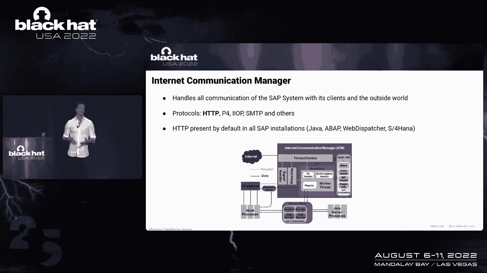
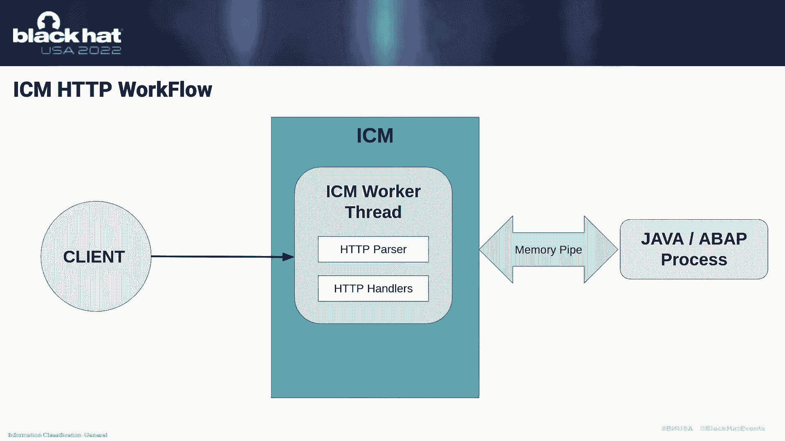
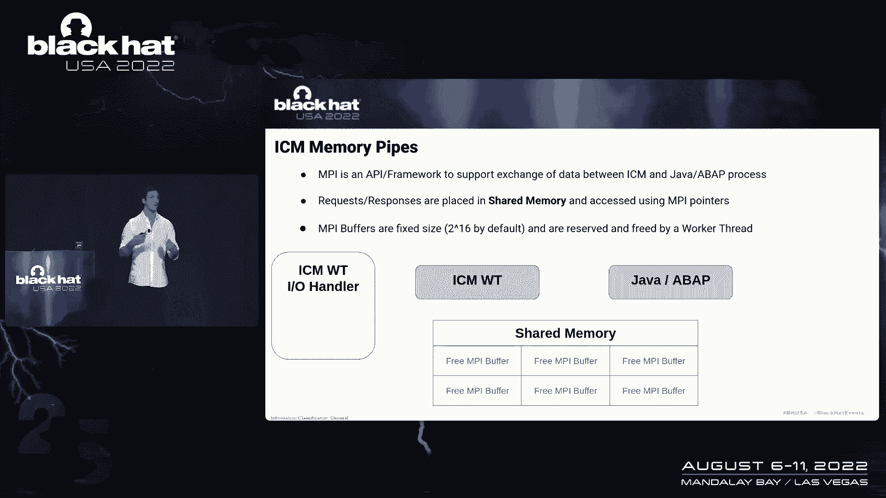
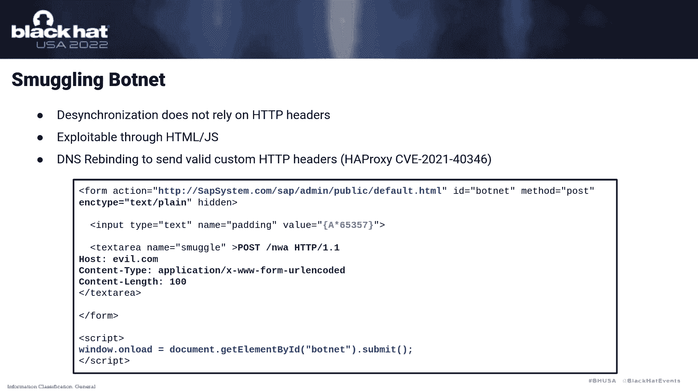
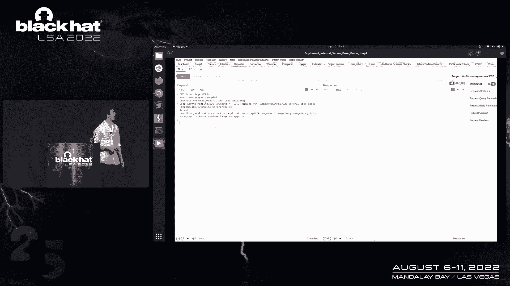
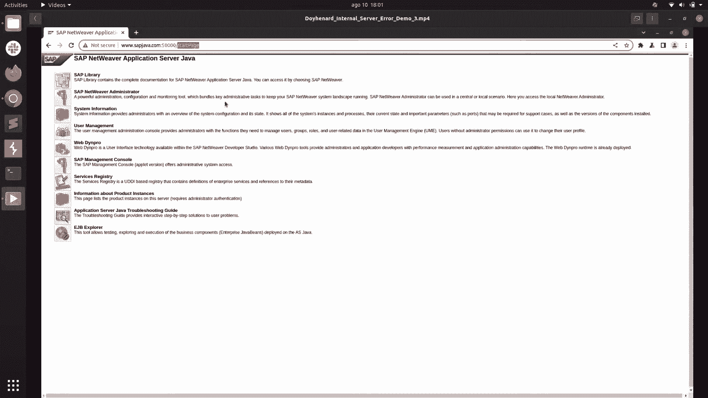
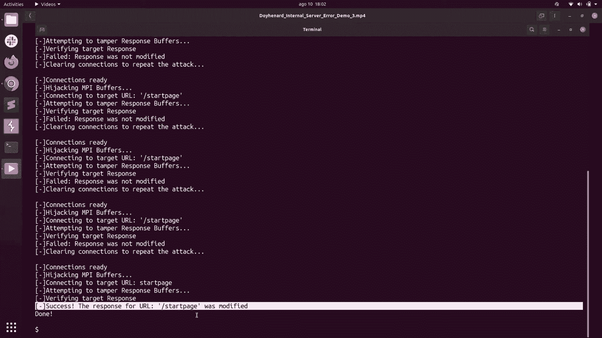
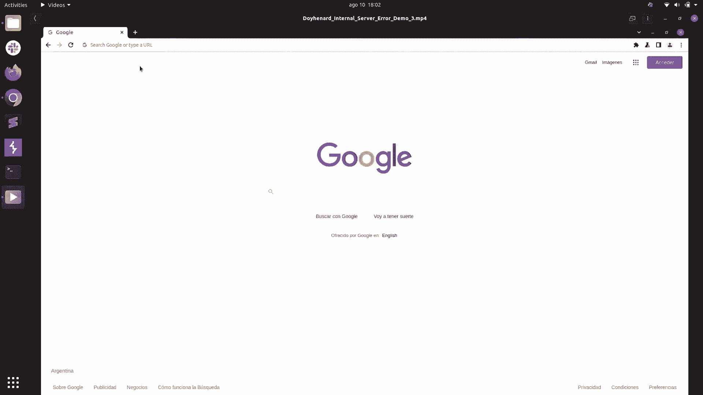

# 【转载】Black Hat USA 2022 会议视频 - P6：006 - Internal Server Error： Exploiting Inter-Process Communication in SAP's HTT - 坤坤武特 - BV1WK41167dt

我叫阿丽娜，我是研究实验室的安全研究员，是一家专注于企业软件安全的公司，其中不同的是企业软件开发人员，SAP可能是最受欢迎的，有超过40万客户，它有40万个装置，包括1000个装置中的90%，五百。

SAP开发了一个企业软件，由不同的公司使用，管理他们的业务流程和最关键的资产，包括他们的运营，他们的财务状况，他们的人力资本，客户关系，供应变化，许多其他人，并这样做，它们提供了不同的模块。

可以包含在SAP系统中，它们都是基于，它们中的大多数都基于可以通过http访问的Web服务，这对Java都是正确的，亚哈和哈拿，这是他们灵活的产品，并公开这些服务。

他们使用一个名为Internet Communication Manager的属性ary http服务器，现在内部通信管理器或icm，用于处理SAP系统与外部世界之间的所有通信，就像客户一样，比如说。

客户或雇员，也可以与其他SAP系统一起使用，我们是一个可以消费这些服务的系统，与其他客户进行交流，ICM可以像以前一样处理不同的协议，这是一个类似于Java中的RMI的协议，iopp，smtp。

也是最重要的一个，ICM的主要目的是处理http和https，ICM真正有趣的是，它存在于所有SAP系统中，默认情况下，所以所有的安装，所有安装都将有这个组件，默认情况下会公开。

所以这是所谓的SAP内核的一部分，所以任何像Java这样的系统，网络调度员，它是一个负载均衡器，至于哈拿和云彩，所有人现在都将使用这个完全相同的HDB服务器，我们当然没有这个HP服务器的源代码。

所以我们不得不逆向工程，我必须了解这个系统是如何工作的，这可能是我们研究中最重要的部分，了解它是如何工作的，因为漏洞也会出现。

所以P不能提供很多信息，他们提供了一个小图表，我们可以在幻灯片中看到，但我们将对此进行抽象，以理解这实际上是如何工作的，所以为了抽象这个，我将提取建筑的许多内部内容，这样我就可以在四十分钟内解释这件事。

我将把icm看作是一个接收客户的系统，请求和答复，首先，当客户端启动TCP连接时，icm将创建我们的将启动一个工作线程，它只是一个简单的线程，将被分配给这个tcp连接，来处理这样做的所有请求和响应。

它将使用一个http解析器，还有一些内部处理程序来解决请求并生成响应，如果不可能在icm内做到这一点，然后将使用一个不同的过程，即作业或过程。

因为其中有SAP系统的业务逻辑，所以当我们的请求从客户那里到达时，工作线程将尝试解析，它会试图解决它，如果不可能，在大多数情况下，它会以这种方式发生，它将通过所谓的内存管道将请求发送到Java进程。

我要解释一下为什么萨马林·皮普一分钟，然后辅助进程将解析请求，生成响应，把它送回ACM，icm会把它发送给客户端，那么什么是内存管道，嗯，MPI就是他们所说的内存管道，是用于支持数据交换的框架。

在icm和a Java进程之间，我称之为工人过程，并这样做，并有效地做到这一点，它使用共享内存发送i指针，它们只是指向共享内存的指针，尽管它被称为内存管道，它使用共享内存，当这些内存管道被发送时。

或者当这些MBA指针被发送时，在辅助线程和辅助线程之间，他们将向MPI缓冲区发送引用，它只是共享内存中的一个缓冲区，这是一个65千字节的固定侧缓冲区。

它们将被辅助线程和辅助线程保留和释放，使用MPI处理程序，让我们看一个如何工作的例子，第一个请求将到达辅助线程的输入句柄，它只是一个tcp插座，对于从TCP连接到达的每个数据，都有一个内部缓冲区。

中的isis或辅助线程准备好处理请求时，它将从这个输入处理程序中读取，它将在共享内存中保留一个MPI缓冲区，使用MPA处理程序，它将把请求存储在那里，现在它会试图解决它，它会通过这个请求。

它会试图解决它，使用内部处理程序，我稍后也会解释，如果无法在icm中解析请求，它将把请求转发给辅助进程，这将通过发送A指针来完成，现在Java RAVA进程将对共享内存的这个位置有一个引用。

它将为此请求生成响应，通过保留MPI缓冲区，它将再次被放置在共享内存中，并且引用将被发送到辅助线程，辅助线程现在可以发送这个，返回处理程序输入的此响应，它将把它转发给客户，最后，MBA缓冲区将被释放。

参考资料将丢失，但我也说过，icm将尝试用数百个，那么他们是什么，当请求稀疏时，解析器实际上会选择，句柄列表中应该包括哪些句柄，应该尝试用来解决他们的请求，这将通过查看URL来完成，所以根据这个URL。

其中一些标准将包括在内，有些没有，重要的是，当处理程序能够解析请求时，它只会将响应发回客户机，并且将从此列表中删除所有其他处理程序，请求响应周期将完成，所以首先我们有缓存处理程序是将使用的第一个句柄。

它只会被包括在列表中，意志只是做预期的事情，它将在缓存中查找请求的URL的存储对象，如果失败了，它会继续，如果它能从中产生响应，它就会把它发给客户，然后我们有管理处理程序和身份验证处理程序。

默认情况下他们都在场，但他们只会被列入名单，取决于URL中的模式，所以对于管理猎人来说，如果，如果URL以前缀a p斜杠管理员开始，和身份验证处理程序，在acm中有一些硬编码值，将与。

取决于它是否会被包括在内，接下来我们进行修改，文件轴，和直接处理者，这并不有趣，因为它们默认不存在，它们需要在SAP系统启动之前在特定的配置文件中设置，最后我们有一个Java处理程序，它只处理。

它将用于将i指针转发到特定进程，大家可以看到，每个处理程序都有一个特定的函数，也有一些，这是，ICM内部有一些功能，还有一些其他句柄，如日志处理程序，这不是很有趣，因为它不能生成响应，所以我们不会看到。

那么让我们看看icm如何使用内部数百解析一个，首先，请求将到达，在这种情况下，这是一个请求，是一个用于斜杠SAP管理的获取请求，因此，当icm准备好处理此请求时，它将保留一个MPA缓冲区。

将请求存储在那里，然后它将使用解析器选择应该包括的句柄，当然，哈希处理程序将包括在内，在本例中，由于URL前缀，管理指针，最后是爪哇蜡烛，也总是包括在最后，现在它将调用缓存处理程序，在这种情况下。

假设它失败了，所以现在他们是猎人将被称为，在这种情况下，假设它能够解决请求，所以它会产生一个响应，它不会把它放在短暂的记忆中，因为没必要这么做，其他数百个将被删除，响应将被转发给客户端，最后。

MPI缓冲区将再次被释放，课程响应周期将完成，但是当我们有一个超过65千字节的请求时会发生什么，所以它比尺寸大，NPPA缓冲区大小，再次抱歉，我们会遇到一些问题，因为我们需要不止一个缓冲区。

我将把这种请求称为长请求，即使没有那么长，它就像65千字节，但是将要发生的是，当这个请求到达时，比如说，体内含有六万六千字节的urius，工作线程将保留一个MBA缓冲区，它将存储前65千字节。

这是因为内部处理程序只需要请求的加热器来解析，或生成响应，所以icm希望，如果内部猎人能够解析请求，然后就没有尸体了，加热器不能超过65千字节，因此，没有必要储存多个或储备多个，缓冲器。

现在处理程序将被调用，在这种情况下，只有缓存和Java或一只手，缓存，在这种情况下，一个猎人会失败，所以现在当工人处理，处理程序被称为，请求的其余部分将被放置在共享内存中，因为业务逻辑。

或者实际的Java ArabProcess将需要请求的正文，因此，icm将保留一个新的mpi缓冲区，或者需要多少就有多少，它会把请求放在那里，请求的其余部分，它将向Java进程发送两个引用。

现在Java进程将能够再次生成响应，它将把响应存储在MPI缓冲区中，它将向工作线程发送一个引用，工作线程现在将能够转发响应，返回到将处理，它将把它转发给客户，现在，由于有多个缓冲区用于此请求。

而不是一个接一个地擦除或释放这些缓冲区，MPI自由缓冲区函数将被调用，以便所有缓冲区都是免费的，这就是与工作线程关联的所有缓冲区，现在引用又会丢失，所以让我们看看第一个漏洞，就像我说的。

ICM没有预料到，内部处理程序能够用主体解析请求，但是如果我们再次发送一个由内部处理程序解析的长请求呢，我们看到一个请求是到达sap min，正文为6566千字节，所以这就是将要发生的事情。

就是工作线程会再次，我们提供一个缓冲的地方，这个缓冲区中的前65千字节，它会调用所有的处理程序，凯猎人就会失败，但现在敌人汉将解决请求，这是icm没有想到会发生的事情，因此将创建响应。

它将被转发给客户端，而相机将被删除，当然，MPI缓冲区将被释放，请求响应周期将完成，但是我们在上一个请求的输入中有更多的数据，所以会发生的是辅助线程会读取更多，因为它在等待一个新的请求。

它将放置此请求或请求的其余部分，身体在这个缓冲器里，它将把它视为一项新的请求，然后你就会知道这是一个很大的漏洞，因为我们将能够同步任何ICM，或者在任何情况下代理和icm之间的通信。

这是因为我们可以在这张幻灯片中看到的这个请求，因为没有什么奇怪的是完全符合RFC的，因此，任何看到此请求的代理，会认为这是一个孤立和孤立的信息，因为这是对普通URL的get请求。

它包含一个65人的身体--在这种情况下是60人，五千，四百六十七字节，包括整个身体这也是获得走私者的请求，当它到达icm时，icm实际上会分裂它，它会认为身体的最后一部分是一个新的请求，因此。

这将允许我们拆分请求，并实际上导致同步，现在您可能认为这不是一个如此严重的漏洞，但请记住，我们发现了一个没有认证的，这是在默认情况下完全暴露在LP中的Internet中的组件中。

你会看到我们如何利用这个，为什么这种同步如此重要，因为我要解释我们如何利用这个，要么仍然是用户的凭据，它们仍然是会话cookie，并修改应用程序的行为，我将展示一个例子，还有其他的。

我不能在这次演示中展示它，你可以在白皮书中读到，但我要展示的是如何从用户那里劫持会话，并这样做，我将使用NW A端点，默认情况下，这也存在于所有的saps中，它是一个端点，用于将用户重定向到登录。

URL，这提供了两个有趣的特性，第一个是开放重定向，这将允许我们在比赛或URL中注入一些东西，实际上在宿主中，所以我们可以改变任何我们想要的东西，通过在请求的加热器中放置一些东西，当然啦，这其实不是。

这是一个功能，因为在一些正常情况下，我们无法在受害者身上修改这一点，另一个重要的特点是我们将能够反映参数，我们将能够反映任何事情，我们在邮件请求中放置在请求的正文中，和获取请求的查询。

在重定向URL的查询字符串中，好的，如您所见，换行符将被空格替换，所以让我们结合这些新的功能，和劫持的同步，受害者请求和受害者这样做，攻击者会发送一个有效负载，它只是一个有效负载到一个内部处理程序。

或对内部处理程序的请求，当icm休息时，它将包含一个走私请求，它会像我们已经看到的那样分裂，第一部分将由内部指针解决，响应将被发回给攻击者，但其余的将存储在icm中，因为在这种情况下。

内容长度表示正文中应该有100个字节，但我们可以选择任意数量的字节，但正如你所看到的，没有尸体，所以我们会等待更多的数据，你也可以看到这是一个向nw a的帖子请求，主机加热器是dot com。

它是由攻击者控制的主机，所以当受害者向代理发出请求时，代理将转发此请求，它将把它与以前的走私请求连接起来，它将使用这个请求的前100个字节作为主体的一部分。

所以M产生的响应将是指向dot com的重定向，还有这个，此Direct还将在查询字符串中包含前100个字节，或者我们想要多少受害者最初的请求，这也包括饼干，因此，当受害者的浏览器收到此请求时。

它会发送一个新的请求，对不起，大乐器什么时候会收到这个回应，它会发送一个新的请求，但在这种情况下是邪恶的网络，它是由攻击者控制的我们的主机，因此，此请求将不仅包含从直接。

而且查询字符串将包含受害者的原始请求，这样我们就可以劫持任何受害者会议和饼干，如果我们劫持一个应用程序，我们将能够实际控制一个应用程序，例如，管理员用户，但对于我们能够劫持的每一个请求，我们需要。

我们将需要发送一个新的攻击，我们不想这么做，或者我们只想发送一次攻击，让这种情况持续下去，关于漏洞的有趣之处在于，为什么它如此关键，我们没有使用任何http加热器来攻击这个。

所以我们实际上不需要注入任何特殊的或奇怪的加热器，导致同步，那么会发生什么，就是，我们将能够利用这一点，使用html表单或javascript，如幻灯片所示，我可以创建一个表单，将向SAP系统发送请求。

URL以P管理员开头，所以它将由内部一百人处理，它将包含一个填充，会提出这个长长的请求，最后将包含走私信息，当然是走私消息是对NW的邮件请求，正如我们已经看到的，所以当受害者收到这个，会发生什么。

最后找到的JavaScript将提交此表单，攻击就会被创建，但在这种情况下，从大蒂姆的浏览器，我们也可以利用这种攻击来解决其他漏洞，就像去年在代理中发现的那样，这也不需要任何交换或无效的HTP加热器。

在任何情况下都是禁止的加热器，像主机或内容长度加热器，所以我们将能够使用同样的技术，但在这种情况下，使用DNS重新绑定，允许JavaScript上的浏览器发送额外的，多余的加热器。

我现在要展示了，这方面的一个例子，所以在这个标签中，我们将看到大团队，受害者将发送一个正常的请求到起始页。

我们可以看到反应是两百，在这个请求中还包括大团队的饼干，在这里之前没有什么奇怪的事情发生，好的，你可以看到饼干，但在这个标签中，我们将看到攻击者，它将发送有效载荷，我们已经看到了。

这是我得到SAP斜线管理，我要用p斜杠我，因为它总是存在，它看到了它，最后它将包含这个走私请求，所以当它被发送到icm时，它会把走私请求放在后端的冰里，它会等待更多的数据，所以当受害者发送请求时。

当我们擦除时，他会收到一个残骸，这样就会把他送到恶意域，由攻击者控制，它还会在一开始发送会话cookie和所有内容，在本例中，请求的200字节，如果我们按照这个方向。

我们将要看到的是邪恶的服务器实际上收到了这个，呃，这个数据，所以我们已经有了受害者的饼干，但它也用一种形式来回应，这种形式将继续攻击，所以现在大队伍将成为进攻者，这将创建一个僵尸网络，只要我们想。

它就会持续攻击，但是在看到这个漏洞之后，我想知道更多关于icm的信息，所以我开始研究它提供的不同功能，有趣的是，ICM，当它被配置为Java时，对于Java进程将接受管道请求，这是RFC的期望。

但在A中，这不是默认的，因此，这意味着icm将允许接收串联请求，在同一有效载荷中，当这种情况发生时，工作线程实际上将把两个请求存储在同一个API缓冲区中，但是当http解析器识别到有一个额外的请求时。

它将保留一个新的MPI缓冲区，它会把请求放在那里，因此现在worker进程将继续处理，第一个，辅助线程将继续处理第一个请求，它会把它发送到一个Java进程，Java进程将生成响应。

它会把它放在A缓冲区里，将其发送到工作线程，工作线程将把这个响应转发给受害者或客户机，实际上现在NI缓冲区将一个接一个地释放，引用将丢失，请求响应周期将完成，现在工人。

我将开始处理存储在另一个nmpa缓冲区中的下一个请求，因为这是一个管道请求，但是如果发送一个长请求，并在最后发送一个管道请求呢，假设我们发送一个超过65千字节的请求，最后，我们现在发送另一个管道请求。

工作线程将再次保留缓冲区，它将把第一个65千字节放在那里，当它准备好将其发送到Java进程时，将另一部分存储在另一个PI缓冲区中，http解析器将识别有一个额外的请求。

所以它将再次保留一个新的MP和缓冲区，它现在会把管道请求放在那里，当然，辅助线程会把它发送到Java进程，前两个缓冲区，它会产生一个响应，把它放在记忆中，发给工人，再读一遍，响应将被转发给客户端。

但请记住一件事，当我们发送一个长请求，缓冲区不是一个接一个地空闲，相反，它们将是i，没有缓冲区将被使用，因此，与此工作线程关联的所有缓冲区都将被释放，其中包括用于管道请求的MPI缓冲区。

所以现在我们提到了一个免费的MBA缓冲区，当我们试图，当然引用并没有丢失，当缓冲区空闲时，因此，当工作线程将此发送到Java进程时，我们将看到一场狭隘的比赛，因为呃，工人线程，没有使用缓冲区的东西。

那么我们能用这口井做什么呢，当然，我们可以参考我们的免费MBA缓冲区，如果另一个CP连接，我们的工作线程试图将请求存储在共享内存中，如果我们足够幸运，它将保留我们使用的相同的i缓冲区，事实上。

这种情况会经常发生，因为MPA处理程序实际上在列表中分配空闲缓冲区，那实际上是一个堆栈，即使SAP声明这是一个队列，我们在逆向工程之后，icm，我注意到这不是一个好的，这是一个堆栈。

所以免费缓冲区将再次被大量使用，一次又一次，它会修改缓冲区，当然，在MPA缓冲区中我们会有一个不同的值，但如果我们试图从中得到回应，我们仍然会有一个错误，因为工人三一认为没有使用缓冲区。

所以我们想要的是在同样的位置写，在一个大团队播放他的请求后，我们将通过发送一个不完整的类型行请求来做到这一点，所以当我们发送不完整的请求时，工作线程等待更多数据，不完整的请求将是任何请求。

在加热器后不包含两条线中断，或者包含短于消息长度的正文，加热器被声明，所以当工作线程读取，呃，试着读这个这个，它就会，呃，它会解析它，它会再次设置，我们将再次设置为读取模式，因为需要更多的数据。

所以当这个数据到达时，然后它将在MPA缓冲区的末尾读取，它将在存储在偏移量中的位置读取，因此每个工作线程对每个NI缓冲区都有一个偏移量，大家可以看到，如果我们先发送一些数据，然后我们发送更多的数据。

它将被放置在相同的内存地址中，并且这个缓冲区的偏移量将被修改为，让我们看一个例子，我们会发送一个请求，带有额外字节的长请求，哪个是管道请求，它就会被储存在，第一部分它将存储在缓冲区中。

然后HDB解析器将识别这一点，它将把额外的字节放在另一个缓冲区中，因为它会相信这又是一个管道请求，第一部分就解决了，将生成请求响应，将把共享内存转发到工作线程，工作线程将其转发给客户端。

现在所有的缓冲区都将被释放，我们会有这个地方的参考，但是当工作者尝试解析此管道请求时，它将停止，现在将设置为读取模式，如果我们足够幸运，到客户端或客户端的工作线程，受害者会把他的请求。

工作线程将保留相同的MPI缓冲区，当这种情况发生时，你可以看到顶部的MPI缓冲区，工人们也将得到55英镑的补偿，因为它写了55个字节，请求将放在那里，如果攻击者随后发送请求，或请求的其余部分。

谁能篡改大团队现在发出的请求，当工作线程2向Java进程发送A指针时，工作，作业过程实际上将使用新的，被攻击者修改的新请求，所以这会产生，比如说，将在MPI缓冲区中放置恶意响应。

工作线程将把这个转回客户机，所以再一次，复制此攻击的步骤是，攻击者需要劫持一个MBA缓冲区，受害者将发送一个请求，该请求将被放置在同一个MPA缓冲区中，然后攻击者会篡改这些数据，大团队会收到恶意响应。

在这种情况下，比如说，如果我们从受害者开始，在某些情况下，我们会收到通往邪恶网络的直接信息，我们可以使用与上一个示例完全相同的攻击，在以前的脆弱性和任何走私利用的攻击将是，一定会成功。

而且我们不需要代理人，因为我们实际上在篡改不同的TCP连接，所以我们可以在没有代理的情况下进行攻击，但不太可靠，但是如果你看到图像，您会注意到有些响应不包含状态代码，这是因为在某些情况下。

我们不会篡改请求，缓冲器，但相反，我们正在篡改响应缓冲区，因为MPI缓冲区是多用途的，因此，我们可以对请求和响应使用相同的PI缓冲区，所以再一次，假设我们已经有一个i缓冲区被劫持了，受害者提出请求。

在这种情况下，假设大团队没有保留相同的MI缓冲区，而是另一个，这只是一个时机，一个场景，取决于我们发送一个请求和另一个请求的时间，在某些情况下，将使用一个缓冲区，在某些情况下，另一个。

将为请求使用缓冲区，它将被发送到Java进程，Java进程将生成一个响应，在这种情况下，在MPA缓冲区里，我们有一个被劫持的，所以现在响应将放在那里，如果在这一切中。

如果你如果在这一点上我们能够发送更多的数据，我们将能够篡改请求，但是反应，这样我们就可以把我们想要的任何东西，我们将能够编写一个任意的响应，并将其发送给客户端，因此。

当在发送请求之前发送的工作线程将传递响应时，对不起，响应将被通过，它就会把它发给客户，如果你注意到NMPA缓冲区，你会看到有一个额外的加热器，我包括在那里，那就是SAP缓存控制加热器。

这是一个内部加热器，用于选择哪些响应应该存储在缓存中，所以说，会发生什么，缓存处理程序会认为这个响应应该存储在缓存中，因此要说看看请求URL是什么，它将存储对该资源的响应，我们甚至可以扮演大团队的角色。

如果我们不只是发动攻击，我们也可以发送很多请求来修改我们想要的任何URL，所以我们将能够毒害和将，并创建响应，任意拘留问题，完全武断，这样我们就可以把一个脚本。

我们可以通过使用SAP缓存控件放置任何我们想要的东西，所以我们要看看这次攻击的演示记住一件事，如果我们能够，这不可靠，这不是真的可靠，我们需要一些尝试，尝试不多，但这不会在一次攻击中发生。

但如果我们只成功了一次攻击，那么这个响应将被存储，所以它会永远坚持下去，如果我们设置一个大A缓存控制最大值，大家可以看到，我们向起始页发送请求，没有什么奇怪的事情发生，好的，我们只是得到一个正常的反应。

但我们将尝试毒害这个起始页URL，所以我要用一个小脚本，我用Python写的，这将首先尝试劫持不同的缓冲区，它会向起始页发送大量请求，以便我们能够修改这些响应，然后它会试图篡改这些响应的数据，因此。

它将尝试在此响应中放置SAP缓存控件，也是恶意脚本，当然啦，我们将无法劫持这个缓冲区并修改响应，在一次尝试中，我们将需要发送大量的攻击，其实，不是很多几个，他们中的一些人，正如我所说。

在其中一次攻击成功后，起始页将被修改，脚本会识别这个，它将改变时代，试图能够做到这一点，一次又一次，大家可以看到。

几次之后我们，我们能够修改起始页，所以现在当受害者或任何客户要求选举权时，他实际上会得到不同的回应，它包含一个脚本和一个任意的html。

好的，所以有了这个，我们可以从应用程序中修改任何我们想要的东西，但我们仍然可以做别的事情，那就是试图修改，或者试图篡改另一个文件缓存的内存，我要向你展示如何，所以我说我们。

我们将尝试在调用响应解析器之前修改响应，但如果我们在那之后试着做呢，这只是运气的问题，当然，但是在发送了大量的请求和攻击之后，我们也许能做到，如果不修改响应，实际上，大团队发出的请求的响应作为缓存控制。

反应，当然会被解析会被发送到客户端，但此时将调用缓存，我们没有修改它，或者我们没有篡改响应，所以缓存实际上会创建一个文件，因为缓存对象将存储一个文件，在这个文件中，它会播放一些特殊的加热器。

这些加热器会告诉关于反应的信息，例如整个响应的长度，身体的长度，和其他一些不太重要的信息，如果我们能够在这个特定的点上修改或篡改响应，然后缓存处理程序将把响应放置在此文件中，它不会匹配它创造的加热器。

所以说，当另一个客户端向icm发送请求时，和这个被损坏的特定资源，请求Cahanwill将被调用，它会在缓存中找到一个引用，它将使用此文件生成响应，这个响应不会像我们已经看到的那样放置在共享内存中。

但它会被放在臀部的臀部缓冲器里，这个缓冲器的长度将使用加热器设置，所以在这种情况下是八十五，85字节，但实际反应超过85，所以我们将能够在这个缓冲区中写入，并实际获得臀部缓冲溢出，好的，我们已经证明了。

那是否有可能修改臀部的其他数据结构，这样我们就可以覆盖不同的地址指针，并最终获得远程执行，如果我们能打败记忆随机化，为这些漏洞创建了两个简历，实际上我报告了一些其他漏洞，但这些是最有趣的，第一个是简历。

因为我已经证明了劫持所有客户是可能的，第二个是八点一，因为他们说攻击的复杂性很高，范围与，我不同意这一点，但这就是P所说的，而且这是相当关键的，因为它影响着世界上所有的PS，我们可以选择任何树液。

它将能够这两次攻击，这包括Java，婴儿，是给在云端的汉的，网络调度员，这是大多数SAP使用的负载均衡器，他们还发布了两个安全节点和一个手动解决方案，可以在网络Webber和Web调度器中实现，最后。

我们现在创建了一个检测工具，这将使客户知道他们是否容易受到这种影响，所以最后有一些结论，有趣的是，惠普服务器是攻击者的主要目标，因为正如我们已经知道的那样，他们不仅暴露在外，但是逆向工程。

组件比人们想象的要容易得多，因为请记住，HCP服务器必须符合RFC，所以我们知道HCP服务器要做什么，我们可以预测它的功能是什么，大多数CP服务器具有相同的功能和工作流，即使内部可能不同，而且。

能够认识到这一点真的很重要，其中请求和响应存储在内存中，这样我们就知道我们是什么，我们要怎么修改它，也不是真的很有趣看到一个，有可能升级低级漏洞，在过去是不可利用的，好吧因为，比如说，在过去，我们不能。

我们将无法利用，或，我们不能在http服务器中冻结后利用使用，但是使用这些先进的技术，我们将能够，当然可以修改加热器，我们将能够通过使用攻击来修改应用程序，不依赖HP加热器的，重新绑定和创建僵尸网络。

最后，我们可以看到这些漏洞的代号非常重要，他们被认为是非常关键的，它们是由网络安全基础设施解决的，U的代理，s，和树液，声明这些可能是多年来最严重的脆弱性，因为它影响了所有的SAP安装。

他们可以通过一个真正暴露的服务访问，这个服务实际上暴露在互联网上。

