# P70：080 - Elevating Kerberos to the Next Level - 坤坤武特 - BV1WK41167dt

早上好黑猫，我已经很久没来这里了，自从我真正展示一只黑猫以来，已经有更长的时间了，所以回来真好。

所以是的，我们将谈论Kerbros，标题中的线索，只是对我们是谁的一个非常快速的概述，如果你不知道，我是詹姆斯，我在谷歌零号项目工作，专门在Windows中查找有趣的bug，我叫尼克。

我在Nuspy做对抗性的研发工作，我也喜欢在窗户里找虫子，所以说，当然，这只是一个40分钟的演示，在事情的宏伟计划中，它是相当短的，所以我们得先对紫外线观众做一些假设。

您对Kerberos的工作原理有合理的理解，或者罗斯是什么曲线，因为不幸的是，我们没有时间真正经历这些，告诉你所有的细节，我们还将做一些事情，这与Kerberos中现有的远程攻击有关。

所以熟悉Kerberos的这些部分也很有用，这不是关于远程攻击Kerros的谈话，这一切都是关于本地计算机上的权限升级，所以，如果这不是真的你的事，那么不幸的是，这可能不是你的谈话，所以说。

让我们从一些背景开始，关于我们要做什么演示文稿，因此，Coos是为远程客户端到远程服务器的身份验证而设计的，然而，在窗户里，至少，没有什么能阻止你，使用Kerberos对同一台计算机进行身份验证，因此。

当您登录到Windows计算机域时，连接Windows机器，你向钥匙分发中心提出请求，您知道您的密码，然后用于向内部的其他服务发出身份验证请求，你是哪个团体的成员，所以当我们想做遏制的时候，刷认证。

我们实际上不会只是身体上出去，并使用tcp套接字与KDC对话，相反，我们会使用一种叫做SPI接口的东西，这是用户模式和LSAS之间的一种通信方式，也就是LSA。

这基本上是Windows上进行身份验证的地方，所以我们通常做的是调用函数初始化的安全上下文，这将向LSA发出请求，并呼叫Kerberos，在lsa进程中运行的dll，它需要你的TGT，你说，好的。

我想向本地服务发出服务身份验证请求，拜托了，因此，您需要一个称为服务主体名的东西，这就像是你想和哪个服务交谈的描述符，这是一个服务主体名称，由当前系统拥有，发送到KDC。

kdc获取服务主体名称并使用它查找长期密钥，这个密钥实际上是本地系统的计算机帐户密码的派生，所以每个域联合系统都有一个计算机帐户，它有密码，由此导出了一个密钥，然后使用此密钥加密您的服务票证。

KDC还做的是，它可以解密它的TGT，将组信息输出到您的服务票证中，服务器可以调用另一个LSA函数，安全上下文除外，它会拿走电脑钥匙，它知道，因为这是本地系统，解密票，然后可以用来在本地系统上模拟用户。

并代表他们执行操作，然而，所以只有KDC授予我们的小组，首先，然而，有一个现有的攻击，这就是所谓的银票攻击，所以让我们看看这在当地是如何应用的，首先我们需要一把钥匙，但我们不知道电脑账户的钥匙。

但事实证明我们确实知道一把钥匙，我们知道用户的密钥，因为Kerberos中的每个用户都有自己的密钥，密钥来自他们的密码，所以我们把密码，我们向LSA认证，然后我们可以在自己的过程中生成相同的密钥。

它只需要密码，我们可以完全为任意服务构建一个假票，然后我们把我们自己的电话，接受安全上下文，因为我们可以说我们是管理员，所以请给我们机器上的管理员，我们模拟那个令牌，就这样，工作完成得很简单。

所以让我们看看它的实际作用。

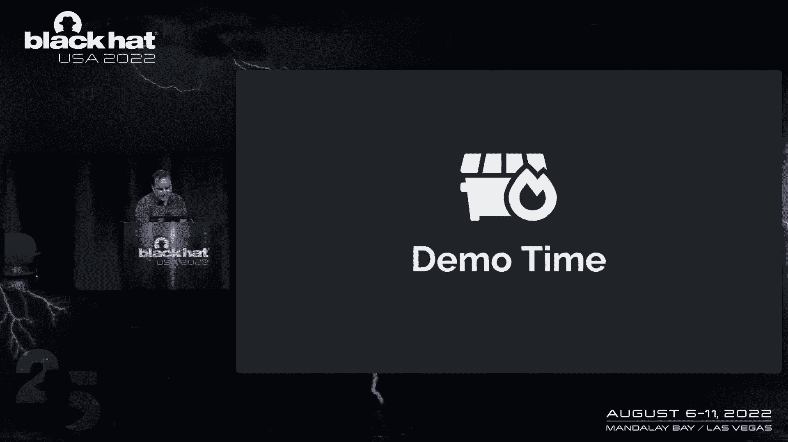

所以我这里有一台Windows10机器，我写了很多点网络代码。

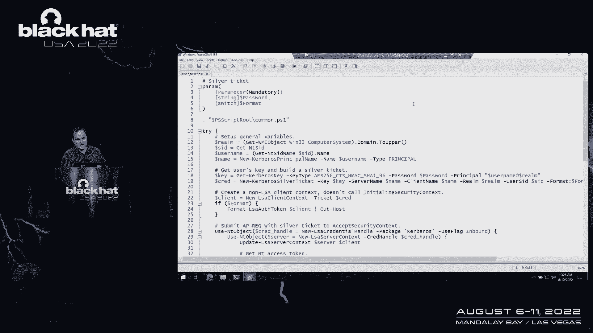

稍后我会给你一个链接，指向这些代码的大部分所在，但我们只是在这里使用PowerShell与之交互，而且比较简单，我们构建一些基本的配置，然后，我们根据传入的密码派生密钥，然后我写了一个函数。

新的克尔伯或银票，它会拿走那把钥匙，选择你想成为的团体，用户说你想成为什么，做一张假票，所以我们下次再也不和KDC说话了，然后我们构建一个ap请求，它将允许我们然后或接受安全上下文，然后这里有一些代码。

它将AP请求与LSA的银票一起传递，希望我们能从这里回来，我们可以询问服务器上下文，你能把访问令牌还给我吗。

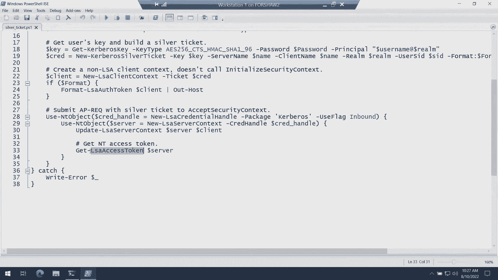

拜托了，所以我们可以运行它，我们确实需要知道用户的密码，但在这种特殊情况下，我们也知道用户的密码密码，我们就可以，我们实际上不清楚我们能做什么，还有他的密码，两个哎呀，要确保它是正确的大小写。

所以这很管用，我们实际上可以，我有一个漂亮的小桂，您可以调出令牌信息，这是鲍勃和他的团队，所以如果你用银票，我们的银票脚本，我们输入了密码2，它不起作用，但这不是一个好的开始，幸运的是，这是意料之中的。

所以我现在把你交给尼克，谁来解释为什么，是啊，是啊，所以如果我们查看错误消息，很普通，显然我们可以猜测一下，也许我们的代码不正确，或者我们最终建造的票在某种程度上是无效的，但实际上我们要去的地方。

是进入LSA的内部，特别是，去理解它在哪里失败了，会让你在这件事上领先一步，这个问题源于一种叫做Pax签名验证的东西，嗯，信息是相当敏感的，所以门票以一种额外的方式确保了这一点，我们只关注两个。

它可以使用用于发出服务票证的相同密钥，计算本地校验和值，然后简单地与服务器签名进行比较，现在我们控制了那把钥匙，因为密钥是从用户的密码派生出来的，所以这不是它失败的地方，它失败的地方，有效地。

KDC签名和本地校验和值被发送出去，通过网络登录到KDC，在那里它可以使用它的限制TGT密钥来验证，KDC签名实际上是校验和的校验和是有效的，它可以将结果返回给机器，所以这给你留下了一个有趣的问题。

这就是为什么银票有效，获得银票上班有什么要求，我们已经分类了三个粗糙的桶，第一个来自您的登录会话，因此，如果您处于系统等效的登录会话中，您正在作为本地或网络服务运行，有一个源于您的凭据句柄。

特别是凭据句柄上的标志，它可以手动应用于凭据句柄，如果您有tcb权限，它也自动应用在一些与服务有关的特定实例中，希德，你知道我们又在谈服务帐户，是应用程序用户，诸如此类的事情，在底部有一个奇怪的桶。

现在，如果你进入MSDN，你会得到一个非常通用的答案，这个标志最终会做什么，它与从密钥派生的密钥有关，但我们当然想开始深入研究，因为幸运的是，这似乎是我们能够控制的。

如果我们在Kerberos RFC跳到4120，我们可以找到对标志的引用，使用应用于AP REC消息中的会话密钥，它有效地说，当这个标志被使用时，票证是用服务器TGT中的会话密钥加密的。

而不是服务器的探索者密钥或其长期密钥。

他们称之为用户对用户身份验证，所以在演示文稿的剩余时间里，你会听到说，用户对用户或您对您，它有效地引用了这个过程，在这个过程中，您有路边tgt键，而不是另一张服务票，或代表该TGT签发的服务票证。

用服务器的长期密钥签名，取而代之的是从票证授予票证中提取会话密钥，并现在使用，你知道，这两个信息都是非常一致的，就像如果你有TGT的会话密钥，您通常希望拥有用户的密码，想要得到会议T。

这不一定像我们可能的那样容易，但是如果我们是以用户身份登录的，我们实际上去请LSA给我们一个带有会话密钥的TGT，不幸的是，会留下一堆空字节，这是LSA实施的安全保护，因为TGT在功能上就像密码，对呀。

就像有一张票授予票，允许您代表用户对服务进行身份验证，所以这就像向LSA查询短期密码一样，或者用户的长期密钥为我们幸运，这个问题已经通过一个叫做tgt委托的技巧以某种形式解决了。

或不受限制的委托tgt提取，我们不会过多地讨论这个特定的布局，或者这里到底发生了什么，但在功能上，我们在滥用什么，LSA很好地保护了授予票的票，但它不能很好地保护服务票，在某些特殊情况下。

服务票证被标记为有效的可委托票证，它将嵌入整个TGT，和目标用户的会话密钥到该票证中，因此，我们可以有效地要求初始化的安全上下文为我们构建服务票据，KDC上的任何服务，那个东道主的特点是不受限制的授权。

传出服务票证将有效地具有TGS，以及身份验证器值，它是用票证本身的会话密钥加密的，我们可以得到会话密钥，因为这是一张服务票，身份验证器内部是校验和值，它实际上不是校验和，它是一个GSS校验和结构。

所以这很棒，我们现在有一种方法可以从lsa获得一个活动的tgt及其会话密钥，我们还认为，利用这次会议是关键，当我们在银票上签名的时候，所以我们要问的最后一个问题是，我们知道这群人很关键。

我们要关注的子结构是这个登录信息结构，域SI有效，定位或标识用户权限的所有ID，所以上面的是很不言自明的，您还有额外的SID和资源域SID，SID滤波，如果你听说过，在它适用于所有这些之前。

有很多细微差别，简在那里漂亮地记录了这一点，但在很大程度上，我们实际上只关注添加任意组，所以我们可以添加像512网格这样的东西，适用于域SID，用户在，在大多数本地机器上。

一个功能上成为域管理员的人也会让你成为普通的管理员，所以我会把事情交给詹姆斯。

这一次，所以是的，我们可以去另一个演示。

所以在这个特殊的情况下，它的用户。

用户，好的，所以它和我们刚才看到的代码几乎完全一样，主要的关键区别是我们调用一个函数，我写了获取用户tgt，它基本上执行了精确的攻击，尼克刚才描述的，在那里你得到一个代表团，ap请求已解密。

并返回带有自己会话密钥的tgt，然后我们可以从中提取会话密钥，这将，当然现在不是零，然后代替我们的长期钥匙，所以当然在这一点上我们不再需要密码，所以在那里做这件事也是一个有用的好处。

您不再需要该用户的密码来执行此攻击，你可以打电话给新的，呃，使用会话密钥而不是TGT覆盖我们的银票功能，呃，而不是密码密钥，驱动钥匙，然后基本上其他一切都完全一样，呃。

我们确保当地的路边票现金有我们的TGT，只是为了确保它肯定会使用我们的TGT，而不是用户拥有的其他TGT之一，然后我们用我们的银票调用接受安全上下文。

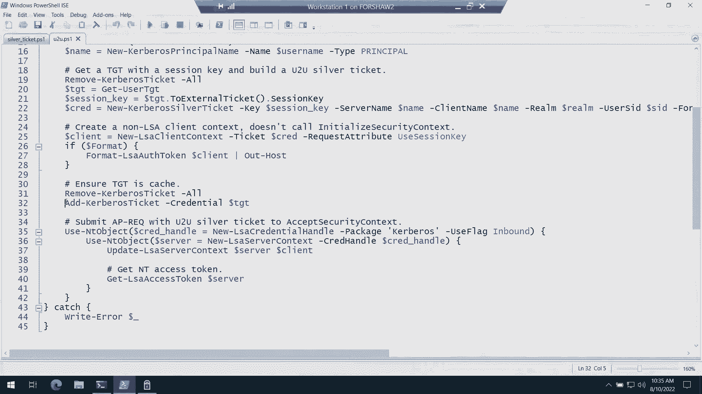

希望这一切都能神奇地发挥作用，我们回到这里，正如我所说，我们不需要传递密码。

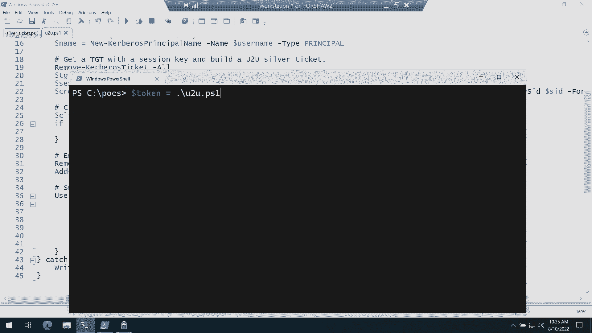

剧本本身，我们总是默认设置，呃，我们想添加域管理组，分组中的主要数字是有用的，因为我们不能管理由于SID过滤，我们不能添加本地管理组，但是如果我们添加域管理组，那么默认情况下。

所有域联合计算机都有本地管理员，所以这将给我们域管理。

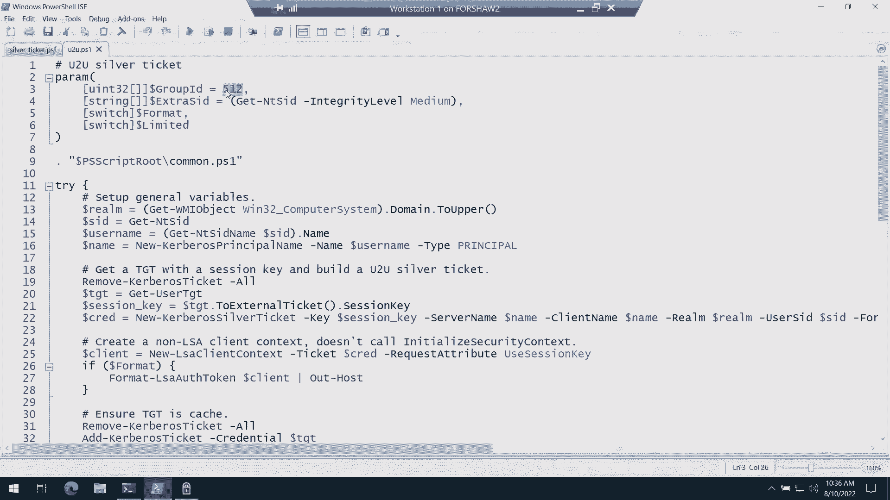

我们还确保将完整性级别设置为中等，把它关掉，我们运行它，没有错误，哈利路亚对，所有的权利，我想我们结束了，所以耶，我想我们的介绍到此结束，非常感谢你能来，所以我们可以在这里看到，或者我可以在这里展示。

我可以做和得到令牌组，从令牌，我们可以看到我们现在内置了管理员，那么有什么不喜欢的呢，所以我的工具有一个调用令牌函数，和访问令牌，并将为您模拟它并运行PowerShell脚本，在模拟该脚本时。

所以我们可以去试着写，说，然而，我们现在有另一个错误，不幸的是，这不是有意的，但不幸的是，这是我们所做的副产品，这都是在谈论模仿水平，这通常不是一个好兆头，所以让我们把它传回尼克继续讨论好吗。

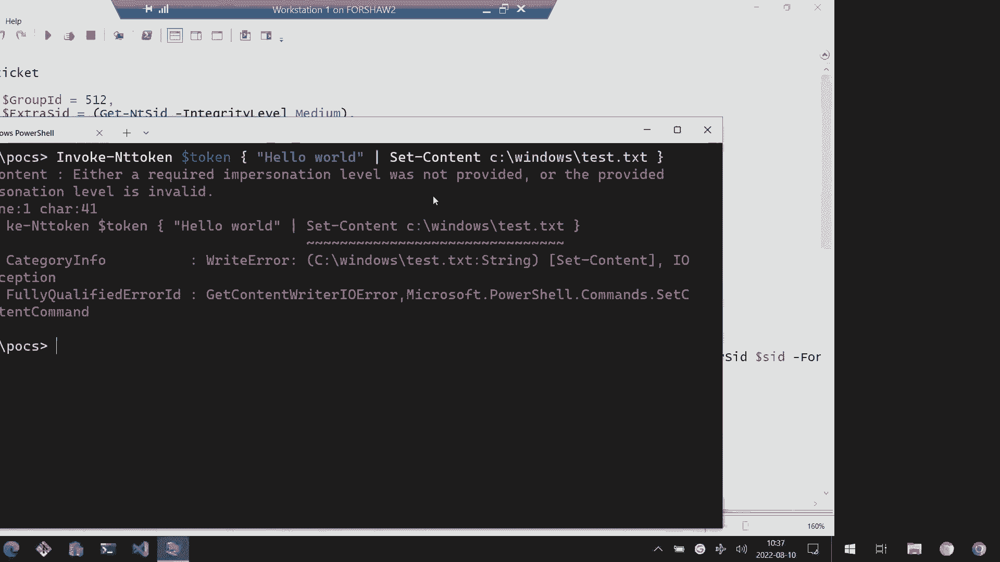

我们越来越近了。

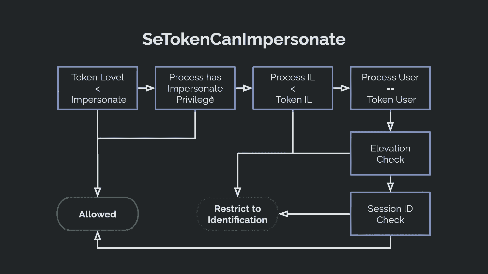

我要拿出一张旧图表，这是我詹姆斯的最爱之一，在那里他一丝不苟地列出了所有的流程以供检查，一个特定实体是否可以模拟令牌，这是一个很长的列表，它们互相交流，但我们肯定可以开始经历它。

思考我们可能从哪里开始遇到这个令牌的问题，我们首先已经建立了很好的，令牌级别处于冒充状态并不意味着这里，这样我们就不会立即得到搭桥，当詹姆斯看着它的时候，一切看起来都很好，就像它说的我们是域鲍勃。

令牌完整性级别为中等，我们只是有域名管理小组在上面，超过该高度的高度检查被忽略，如果用户不是UC管理员，还有最后一张有趣的支票我们也要感谢詹姆斯，这是对令牌的最后一次检查，希望看到。

如果试图被模拟的目标令牌存在于会话零中，并且试图模拟令牌的用户会话不是，会议零，这其实是一件很常见的事情，使用回环身份验证操作Windows上的令牌，是已知的攻击，作为回应。

Microsoft已经阻止会话零令牌在其他任何地方被模拟，如果你不知道，默认情况下，网络身份验证令牌进入会话零，所以我们有一个问题，我们现在很坚持，我们正在寻找令牌从一个会话移动到另一个会话的实例。

我们可能有很多地方可以找到这些信息，我们将从LSAS服务器开始，我们要寻找它调用的实例，使用令牌会话id info类设置信息令牌。

这可能是一个很好的开始，现在承认，但我们最终得到了一个很好的小流程图，我们可以开始仔细研究，看起来超级多汁的底部功能，更新用户令牌会话ID不幸被锁定在tcb后面，正如您所想象的那样。

LP集会话令牌在这里并不特别有用，它不会在会话之间迁移令牌，只是为了复制一个令牌，并将其应用于登录会话，LSAT构建和创建令牌和筛选器，高级令牌折叠都倾向于处理高级令牌和链接令牌。

所以与UC拆分令牌相关的事情，我们也许可以在这里得到一些有用的东西，但我们真的想忽略UC，只是这整件事很痛苦，所以我们留下了这个非常有趣的流，从lsap创建令牌ex到一个真正独特的函数。

调用lsap应用循环回会话id，现在，这种流动的特别独特之处在于，lsat创建令牌ex正是我们的调用流已经去的地方，这就是接受安全上下文的内容，当令牌最终准备好构建时，所以詹姆斯，我开始怀疑。

这个功能是什么，它对你有什么好处，我们已经有效地扭转了它，并理解了它的实施，在某种程度上，本质上是识别像我们这样的实例的跟踪机制，它是为了识别实例，客户端和服务器在同一台机器上相互通信，出于某种原因。

协议没有确定，这就是我们所说的环回身份验证，这可能是对某种令牌的回应，会话ID重构代码，但不管怎样，它真的很独特，当用户调用初始化安全契约时，开始跟踪函数被调用，实际上，一个条目被添加到这个表中。

使用用户的会话ID，以及缓冲区从初始化的安全上下文返回时，记住我们知道的缓冲区是一个aprack，但根据协议，这可能是任何网络协议缓冲区，该缓冲区还被馈送到更新跟踪中，哈希值开始滚动。

这是一个相当坚实的哈希，它像随机商品一样使用，定向IDS，它是建立在ACMAC上的，所以我们可能不会攻击哈希函数本身，当调用Accept安全上下文函数时，从LSAS传出来的AP机架又传回了。

开始跟踪执行，然后当构建令牌时，代码将有效地引用此表以查找哈希匹配的实例，在这种情况下，它被标识为缓冲区从lsto传递给客户机的实例，然后立即从主机上的某个服务器传递回lss。

所以这对我们来说真的很有希望，我们现在有了一个原语，可以在会话之间进行令牌移动，它很好地适用于我们的情况，但我们有几个警告，一个是我们需要开始调用初始化的安全上下文James指出。

到目前为止我们还没有做，我们刚刚在PowerShell中手动构建了霸王龙，并通过接受安全上下文提交它们，但是我们需要让哈希值滚动，这样函数就可以在以后将它们排列起来，我们留下了一个难题。

我们需要修改AP残骸的内部，这意味着我们正在修改缓冲区，但如果我们触摸缓冲区，哈希查找将中断，我们的信物将被锁在离我们很远的地方，所以我们在代码和安全上下文功能周围有一个禁飞区，嗯。

我们对这种跟踪机制到底是如何工作的很好奇，如果你深入研究，您会发现，对于进出LS的每个安全缓冲区描述符，哈希代码将只对缓冲区感兴趣，其中缓冲区类型与SEC缓冲区令牌完全匹配，换句话说，它是令牌类型。

这是给那些不熟悉这些API的人的。

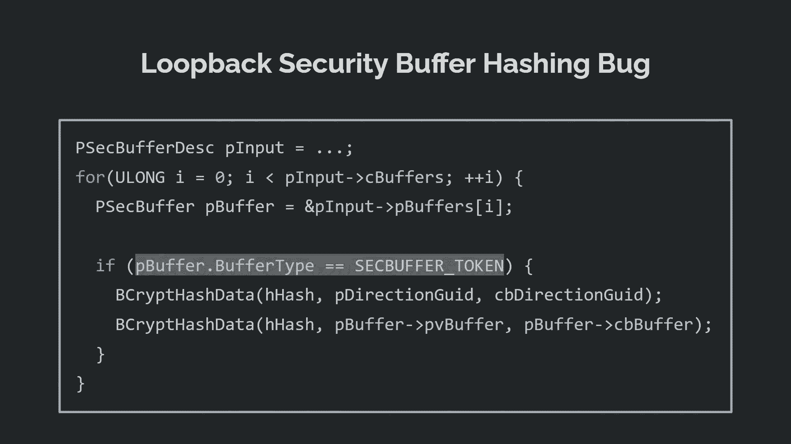

什么能支撑你的AP机架或你的NTLM挑战反应对我们来说幸运的是，在这个SEC缓冲区类型中实际上有一个高属性字节，它可以保存缓冲区是只读还是只读，用校验和，所以我们有令牌值，是呀。

但我们也可以按位或使用秒缓冲区只读标志，和，也许打破一些关于，哈希代码是否会使用我们的缓冲区，我们确实做到了这一点，这实际上是一种类型混淆，并接受安全上下文，都用令牌标记，但是前一个缓冲区是按位的。

带有这个只读标志，这样我们就可以把修改后的AP REC数据放进去，我们的恶意数据和我们从阿尔萨斯得到的良性数据，在第二个，缓冲器，循环返回库将引用第二个缓冲区，当它进行哈希查找时。

哈希代码和Kerberos实际上将使用第一个缓冲区，因为它掩盖了上面的属性，当试图找到令牌时，所以第三次是魅力所在，我们有一个移动令牌的原语，我把它交给詹姆斯，看看我们能不能把它修好，好的。

所以我们现在可以看到，嗯，有一个假的自助餐脚本。

我们再次得到T使用TGT，但是呃，这里最关键的是，用嗯，我们不会直接使用修改后的AP请求，所以我们为我们的AP请求创建了这个假客户端，然后我们实际上必须像尼克说的那样调用初始化的安全上下文，因此。

我们都设置了客户端和服务器身份验证上下文，和LSAS说话，但关键是我们必须做一些更新，因为要使用的用户实际上有，比如一些我们需要确保协商的附属代币，但一旦这一切都结束了。

我们实际上可以构建两个安全缓冲区，我们想让Kerberos看到的第一个，是类型令牌，然后我们构建一个LSA缓冲区，我们希望LSA哈希算法看到，它在和它说话，它就这样走了，哦，好的，我就。

我就把那个弄乱吧，它弄错了，只有哈希是我们给它的，所以希望，这实际上应该允许我们在自己的会话中获得一个令牌，id。

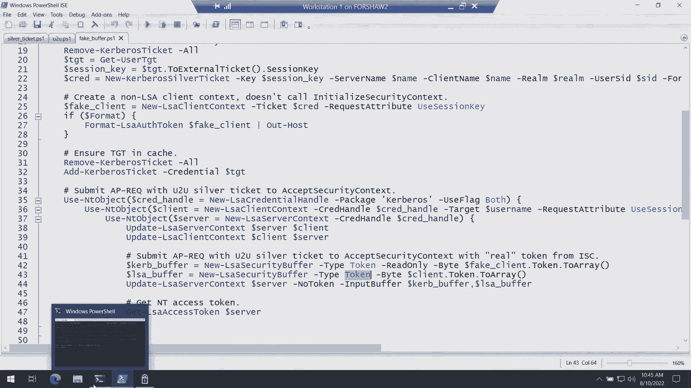

所以我们做令牌，呃，假缓冲区，我们不需要传递密码，我们没有错误，没有错误是好的，如果我们实际查看会话ID，现在前一个是零，现在是两个，也不一定是，严格地说，我们自己的会议想法，它只需要是非零，仅此而已。

这是唯一的标准，所以如果我们回滚并回到那个，十指交叉，它现在应该可以工作了，呃，我们没有错误，然后我们可以把它读回来，只是为了确保我们真的写了一些测试点文本，你好，世界在那里我们去。

所有的权利，这很好很好，但我和詹姆斯不会就此罢休，当我们在Windows11中发现在循环中返回哈希代码时，它们实际上屏蔽了上面的属性字节，所以他们做事很得体，我们不完全确定为什么我们会怀疑。

这是由于一些重构代码，作为对其他重构的响应，实际上不是安全修复，这就是为什么它没有被回送，但不管怎样，我们的双缓冲技巧在Windows11中行不通，你知道。

詹姆斯和我詹姆斯尤其是Windows11的超级粉丝，他想确保他所有的工具都能在那里工作。

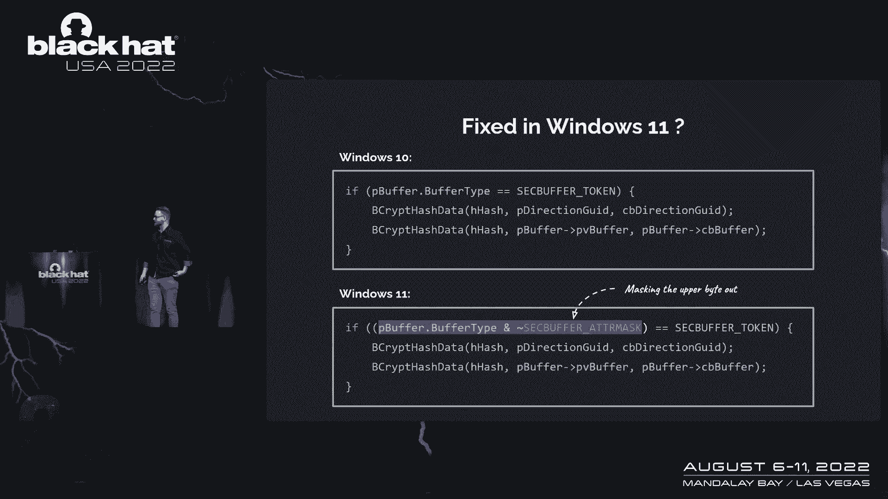

我们回到这个图，我们有这样的禁飞区，我们必须坐在这里好好思考，如果我们不允许修改缓冲区，当他们进出LS时，也许我们可以修改一些关于票或令牌的东西，当它转移到KDC时，事实上。

我们有所有必要的关键材料在这里进行一个人在中间的攻击，对呀，就像我们拥有用户对用户票证的会话密钥一样，我们可以在传输过程中解密，这样我们就可以把KDC运回来，如果我们能在中间，不知何故。

我们可以使用会话密钥，然后机器就会兑现那张票，当它被用于AP沉船时，我们可以自己谈判，在这一点上，我们实际上不需要修改票，因为就像在洛杉矶一样，因为它储存在LSA中，这是恶意的，但我们还有另一个问题。

尤其是当我们想到Windows11时，也就是说，凭据保护在默认情况下是打开的，我们也喜欢思考如何打破证书保护和相关的事情，所以到目前为止，这影响了我们的杀伤链。

因为它阻止了Kerberos中的不受限制的委托，这是我们用TGT获取会话密钥的技巧，所以现在我们又回到了起点，我们需要用户对用户票证的关键材料，但是我们无法访问TGT和James的会话密钥。

我有个好主意，也许把你自己的整个KDC，值得质疑，我们是否需要谈论一个真正的KDC，在那里，如果我们想让这个工作得更好，而不是在外部主机上使用它，或者通过DNS将Kerberos解析到外部主机。

我们可以使用一个叫做KDC钉扎的好特性，这实际上是我们发送到LS的请求，我们可以绑定一个特定的领域，并将其绑定到一个主机名，因为我们现在想在本地运行一个KDC，如果你疯狂到在网上写了一个完整的KDC。

你可能会发作，从开始到结束的整个票证关键材料都由您控制，当我们打电话给LSA时，然后当我们提供凭据并开始出票时，当Carrogo进行套接字呼叫时，它将与端口88的本地机器进行对话。

我们现在拥有所有的关键材料，从路边TGT到用户密码，会话密钥和TGTS的长期密钥，或者里面的信息甚至不必匹配，或者甚至不需要匹配域实际为其发行的服务票证，所以让我们看看我们是否能把这次攻击更进一步。

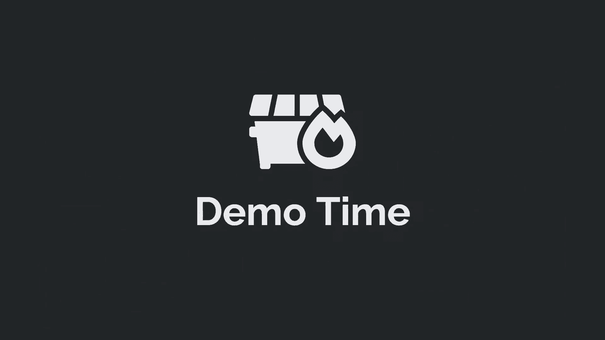

所以是的，所以现在我们在Windows11上。

嗯，所以现在的剧本有些不同，因为我们当然不再只是在，在用户空间中，我们实际上就像建造了一个完整的KDC，但是我试着在PowerShell模块中编写dot net类，以相对容易使用的方式。

就像kdt一样相对，因为我最初确实考虑过使用桑巴和，但它并不真正支持用户正确使用，所以我不打算开始写桑巴代码，所以我很抱歉，所以我们在这里所做的一切，我们指定我们的假王国，我们有一个密码的密码。

因为它可以是任何东西，我们不需要为您的域满足当前密码复杂性的要求，这是一个有用的特性，嗯，只是我们我们建立一个用户，然后字面上与该用户，你调用新的Curve BrokDC服务器，并给它一个领域。

给它域SID，以及您的用户列表，你只要启动它，然后我们就可以把这个针，所以我们把那个领域，所以LSA在我们当前线程和进程中的任何请求，为了那个领域，我们会去当地的主持人，所以我们会去我们当地的KDC。

然后我们几乎只做一个标准的回环身份验证请求，我们得把假证件交给移民局，但它很高兴地喜欢，用那些去，哦别针，没问题，然后我们在最后得到访问令牌。

希望一切都好，所以只是为了证明我没有作弊，嗯，我们可以得到计算机信息和设备保护的属性之一，它在哪里，所以安全服务正在运行，如果我们真的运行我们以前的一个，所以因为我们得到了，我们实际上不能，呃。

获取用户tgt，所以有一个简单的，使用TGT脚本，我写信只是为了做那次攻击，我们不能让代表团TGT，好的，所以我们目前的攻击载体是一个问题，所以我们运行我们的KDC攻击，我们运行没有错误，总是好兆头。

我们有这样一个两个的想法，呃，我们可以看到我们的团队，我们是内置管理员的主要成员，太棒了等等，我们显然可以模仿这个，再检查一下，我不会耍花招，再见克雷格守卫，我们基本上做到了。

即使在不知道用户密码的情况下启用了Craig Guard。

不幸的是，如果你今天去试试这个，不会成功的，这是因为微软昨天实际上解决了这个问题，基本上，我可能在VMS上有点作弊，他们不是最新的，嗯，所以他们基本上所做的是，他们已经有效地删除了使用用户标志检查。

甚至不清楚它最初为什么会存在，但这是它一直在那里的事情之一，因为有些客户在某个时候需要这个功能，它可以通过更改Kerberos中的更多配置旋钮来重新启用，嗯，你可以去路边看看，它的名字是，据我所知。

目前没有证件，因为这可能是微软只会告诉你的事情之一，如果您在企业环境中有这个特殊的问题，所以我们的攻击已经消失了，这有点可惜，但这就是安全研究的全部意义是把事情解决好，但当然。

这些类型的错误有可能再次发生，我们想了想，好的，我们在这里能想到什么样的缓解，没有一个是完美的，但你可以，您可以在一个环境中应用其中的一些，所以第一个是有一个，有一面旗子，如果你回头看以前的幻灯片。

你可以，如果您是非系统服务，所以你就像一个IS池用户，或者您是虚拟服务帐户，但您实际上可以禁用该功能，所以Kerberos有一个配置旋钮，上面写着实际上不把这个关掉，因为这对我不好，然而，经修改。

所以这不是一个完美的解决方案，必然，当然不会阻止银票攻击，一般来说，你也可以打开，你必须强迫Keras盔甲，或者有时被称为快，呃，这将使篡改客户端之间的网络流量变得更加困难，在KDC。

因为它是由计算机帐户密码签名的，呃，所以很明显我们真的不需要它，它不会直接影响我们，但如果你强迫客户，这样它就不能和KDC说话了，它没有路边黄铜装甲启用，那么ARKDC攻击就会失败，因为它只是。

它只会拒绝ARKDC无效，现在我们显然展示了一种绕过证书守卫的方法，但我们仍然认为它有价值，就像，您可以使用TGT会话密钥做很多事情，目前可能还没有意识到，已经有一些攻击，打开它显然有好处。

这使得提取关键材料变得更加困难，也阻止了这种不受限制的代表团攻击，它也很有用，呃，然后最后就像，呃，即使他们移除比如说钉扎攻击，呃，钉的技巧，呃，您仍然可以使用DNS记录来配置您的。

你的假KDC在互联网上的某个地方，互联网，所以有像企业犯规规则，说只允许这个客户与已知的KDCS交谈可能是个好主意。

所以在检测方面，这是缓解，那么如何检测这些攻击的发生，没有像这样的好选择，我们找到的最好的可能是在安全日志中，这个事件是四六七二吗，当然，如果域用户不是该机器上的本地管理员，可能有一个问题你可能想看看。

所以说，我敢肯定如果你，如果你去找，你可能还能找到其他有趣的东西，但这是我们能想到的最好的了，当然，这只是一个40分钟的演示，我们有很多事情不能说，嗯，有一个链接到我的工具，还有各种链接，比如UC旁路。

使用Kerberos，票务操纵，远程凭据，保护代码执行，像任意代码，执行和LAS，因为为什么应用程序容器不逃逸，等，所以很明显幻灯片会出来，你可以直接找到这些链接，有很多人在Kerberos空间工作。

并发现了许多我们建立自己工作的东西，所以这些是，当然啦，我们是我们感激的人，我敢肯定这张幻灯片上有很多人被我们遗忘了，但如果我再不出示一件东西就走了，那就太粗鲁了，就像传统一样。

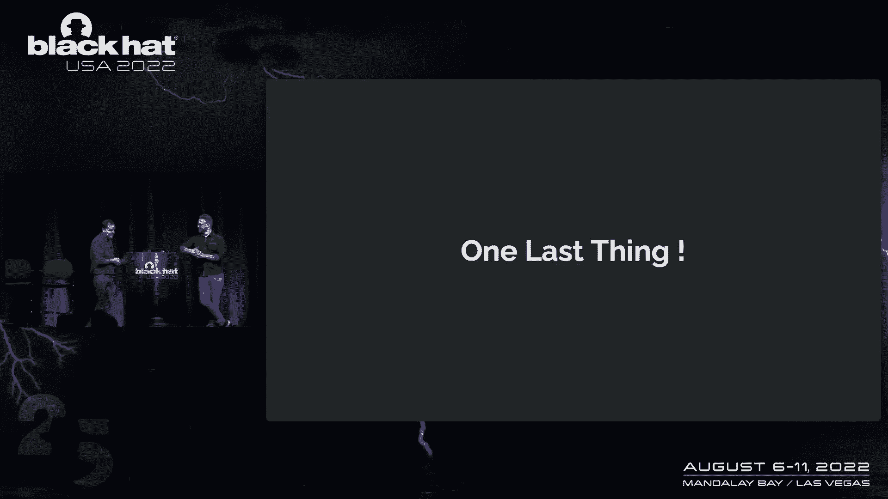

让我回到Windows11。

更新到昨天，所以这有点像，好的，好吧，好吧，我们还有其他有趣的方法可以解决这个问题吗。

所以很明显我们以鲍勃的身份登录，因为Bob是我们的非管理员用户，因为我们不能让他们作为南加州大学的管理员，因为，具有讽刺意味的是，我们不能模拟管理令牌，如果我们在UC用户中，因为你可以绕过你的C。

我不知道这很奇怪。

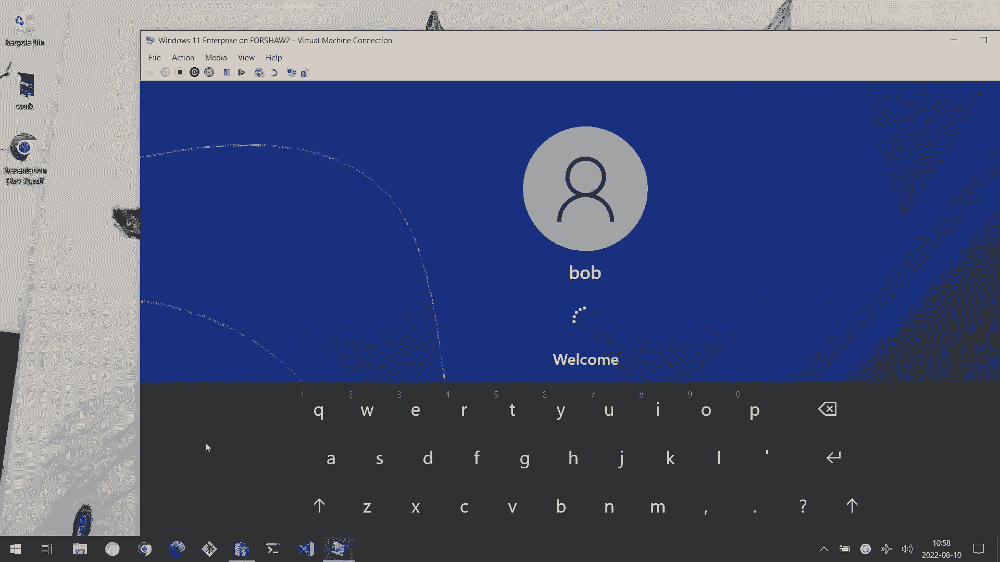

我们去，哎呀，我们去我们的痘痘目录，正如我所说，这是更新，所以如果我们进行KDC攻击，正如你所料，它失败了，所以它消除了我们的银票攻击，然而，如果我们做最后一件事，这有点泄露了，这仍然是一种银票攻击。

因为我们还需要使用这个密码，所以我们查看了会话ID，我们得到了他的令牌组，哦，它是一个管理员，太可惜了，只是为了证明一个观点，在Windows中设置内容，试验点，正文，我们开始了。

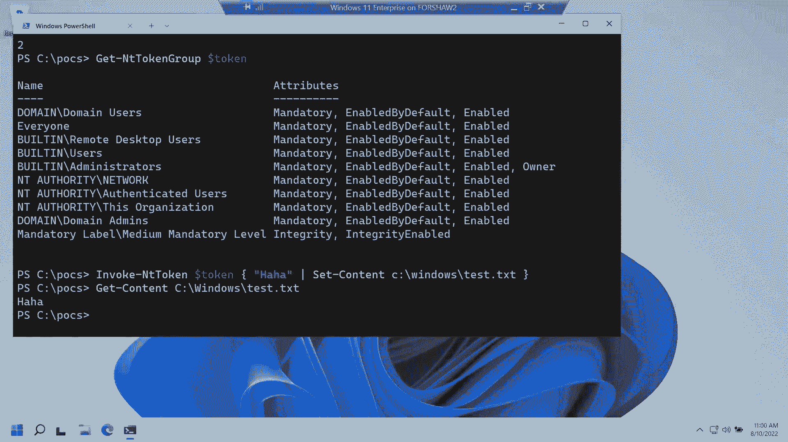

所以在有人问之前，我昨天确实向微软报告了这件事，不幸的是，这是我不能真正报告的事情之一。

因为我不知道这是不是虫子，直到他修复了我们无论如何都要绕过来修复的bug，不用说，这是最后一次跑步，我们的演讲到此结束，非常感谢您的出席，我真的很感激尼克也很感激，是啊，是啊，谢谢大家。

我真的真的很感激大家能来，我们玩得很开心，一定要看看我们跳过的所有材料，所以我们有很多东西想放在这个演示中，我们去不了，是的，嗯，我会努力的，然后呃，把这个，呃，示例脚本下周晚些时候。

