# 【转载】Black Hat USA 2022 会议视频 - P71：081 - ElectroVolt： Pwning Popular Desktop Apps While Uncovering New Attack Surfa - 坤坤武特 - BV1WK41167dt

 [MUSIC PLAYING]。

 Now it's my pleasure to welcome to the stage， Adiyo Varani and Max Garrett。 Good morning， everyone。

 And thank you for coming to our presentation。

 Let me ask you this。 Have you ever wondered how secure it is。

 to open a message within the desktop app you use， to chat with your colleagues at work？

 Have you ever thought how secure， it is to open a source code which you just downloaded。

 from the internet within your favorite source code editor？

 What do these electron based desktop applications have。

 in common and how fundamentally secure are they？ Before the year。

 we sat out to find an exact answer， to discover what alerts beneath electron applications。

 And throughout the course of one year of our research。

 we were able to compromise multiple iconic applications， used by millions of people and were。

 able to find an hidden attack surface within electron。 Hereby。

 I welcome everyone today to ElectroVolt， where we will take you on a journey。

 to pwn popular desktop applications， while uncovering new attack surface on electron。

 So the agenda for our talk today is， I will go through the basics of electron。

 and its security settings。 Then we will hack some real world， commonly used desktop applications。

 starting from the least restrictive， to the most restrictive security settings。

 And then I will present the novel attack vector， we discovered within electron JS framework。

 And at the end， we will talk about the mitigations。 So let's get started。 So who are we？

 I'm Aditya Purani， AKA NAPSTEC。 I'm a senior security engineer， at a leading automotive company。

 My main area of expertise are AppSec and Blockchain。 And on the weekends。

 I play CTFs with Perfect Blue。 Joining me today is my colleague Max。

 who is a security researcher at asset note。 Max's area of expertise are AppSec and Blockchain。

 And he plays CTFs with WaterPadler。 So what is electron？ If you can build a website。

 then you can build a desktop application。 That's the main concept behind electron。

 So electron is a popular open source framework， which is used by many commonly used apps。

 such as Microsoft Teams， Discord， Slack and other。 Fundamentally。

 electron is built on top of Chromium， and Node。js， which means that by just using， JavaScript。

 HTML and CSS， you can ship an entirely cross platform， native desktop application。

 Before diving into the bugs， it is important to understand the architecture of electron。

 Within electron， there are two types of process。 The first one is the main process。

 and the second one is the renderer process。 Main process is the starting point。

 of all the electron applications。 Main process can create multiple renderer process。

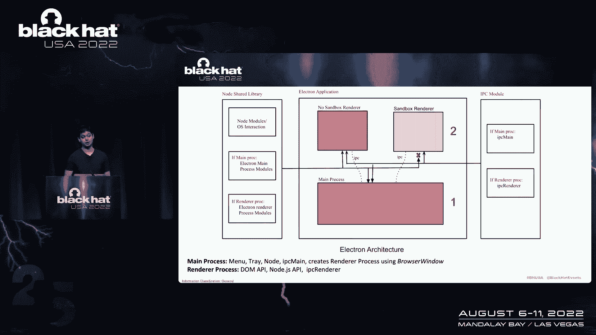

 using a class called browser window。 It also has access to native GUI APIs。

 to create objects like menu and tray。 And it is important to note that there can be。

 only one main process。 On the other hand， we can have multiple renderer process。

 And the main function of a renderer process， is to render a web page using Chromium。

 So as Chromium is used， a lot of Chromium related features are used， such as Chrome site isolation。

 multiple process， et cetera。 The way the main process and renderer process。

 talks with each other is through something known as IPC， or inter-process communication module。

 And you can also apply a lot of security settings， within the browser window configuration。

 within a flag known as web preference。 So that way you can control what type。

 of renderer process you want。 The least restrictive you are， the more vulnerable you are。

 So let's see how it looks in the code， to get a bit idea about that。

 So here we have a file known as main。js。 It sets up a browser window。

 and within the web preferences， it lists down， a couple of security settings。

 which it sets true or false。 Then it loads a URL， which is the web page you want to load。

 which is Google。com in this case。 And then it defines an IPC main。

 which is like an event listener to listen for IPC call。 In this case， it's open URL。

 On the other side， on the renderer process， it is divided into two parts。 The first one is preload。

js。 And preload script contains code that is loaded prior， to the web page。

 So preload script run within the renderer context， but are granted more privileges by having access。

 to electron or node。js API。 Context bridge， which you see in the slide。

 is a way to safely expose an API to the web page， which could be later invoked using a window object。

 So here we have a web page， which is Hello World， and the web page uses the window。electron。

open URL， and supply argument to pass it to the IPC main。event listener。

 So as we can see here， you can put whatever security features。

 you want to get whatever renderer process you want。 So the least secure you are whenever。

 you use something like sandbox is equal to false， context isolation is equal to false。

 and node integration is true。 Because in this case， the web page。

 has directly access to the node primitives。 And in this case， accesses is equals to RC。

 because someone can just do a required child process。

 and exec whatever shell commands they want to do。 Electron developers also thought about this。

 and they came up with something known as context isolation。 So as you can see in this slide。

 in the renderer process， now we have two separate contexts。

 The first one is the application context， where the application JavaScript runs。

 and the second one is an isolated context。 And within this isolated context， the preload。js。

 which we saw earlier， and Electron's internal code would run。 So it is completely isolated。

 and the web page now， doesn't have direct access to node primitives。

 So this is the same concept used in Chrome as well。 In Chrome， it is called isolated world。

 where the extensions content script JavaScript， is different from a web page JavaScript。

 So there is a isolation here。 So throughout our talk， the attack surface， is the renderer process。

 So we will be starting by abusing the least restrictive， Electron configuration， and then move on。

 to the complex exploits。 So to keep the slides clean， let's keep in mind， the following terminology。

 So we have node integration， context isolation， and sandbox。

 And don't worry about the node integration in workers， or node integration in subframes yet。

 because I haven't talked about it， but we'll talk in the coming slides。 So the first situation。

 Node integration is true。 Context isolation is false， and sandbox is false。

 This is as insecure it can get。 So it is really easy to get a shell， as node。

 is directly exposed to the renderer。 The only thing you need to do as an attacker。

 is to find a way to embed a JavaScript within the web view。 So within the diagram。

 the circle marked as red， is where we are targeting currently。

 So I'm going to present one of the case study， which。

 we found in a real world commonly used application known， as a VS code。

 So VS code is a source code editor， where you can open a project， and you can navigate and browse。

 through the source code。 So VS code had a feature where it asked before you open a source。

 code that you want to open it in a restricted mode， or you want to not open it in a restricted mode。

 So as a part of our this use case， we found a way to perform a remote code execution。

 in VS code in the restricted mode。 And so as a part of our attack vector， we had a limited accesses。

 and we turned into a remote code， execution chain。 Let's see how it works。

 So this is like a pretty large schematic， of how the exploit looks like。

 So we have three frames here， which， are marked by the square symbols。

 So the one which is in green is running， with the most strict electron setting。

 Whereas the one in the red is the one， which we just talk about， where node integration is true。

 So as an attacker， you have an accesses on the markdown， reviewer。

 which is running in a very restricted context， and the goal is to move from that green to red somehow。

 And let's look at how we can do that。 So first of all， let's say if you open a markdown， like pwn。

md， as this is subject to a strict CSV policy， what you would do is you would perform a meta redirect。

 to an external website。 And once you are on the external website。

 you can run any JavaScript you want。 So once we had this accesses on step number one。

 what we do is we leak the extension ID of VS code。 As you know。

 you can install extension in VS code。 And those IDs are a pretty long string。

 which you cannot guess。 So once we leak that extension ID。

 we found an accesses on one of the other window， which， is VS code web view。

 And what we did is we found a way， to perform a post message call to that particular frame。

 So in this case， we deploy our accesses using a post message， on VS code web view。

 And then we deploy another accesses on the same web view， to perform a channel do read。

 which will leak a current directory， where the project is downloaded on the victim's machine。

 through VS code file。 So VS code file is similar to a file protocol。

 but the catch here is you can invoke it from a different origin， not from the same origin。

 So once we leak the directory， what we do， is we perform a part reversal on the VS code file。

 by doing dot dot slash dot dot slash the path to an HTML， file within our project。

 And this HTML file， what you can do， is you can do top dot require to get access to node。

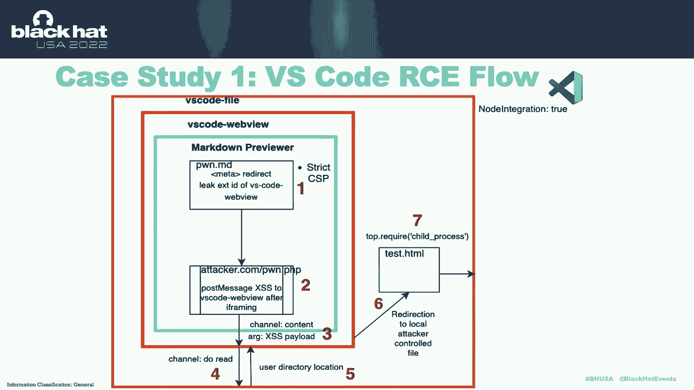

 primitives and pop a shell。 So let's see how this looks in the demo。

 So our victim has opened a project in a restricted mode， and they will navigate a file。

 And as we can see， we have popped a calc in VS code， which。

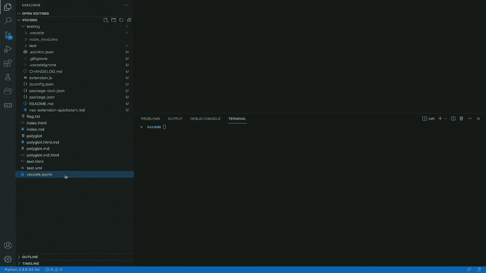

 is the remote code execution part。

 So we received $6，000 bounty for this remote code execution， bug in VS code。

 And we had a really prompt and swift， once from the Microsoft team for this。

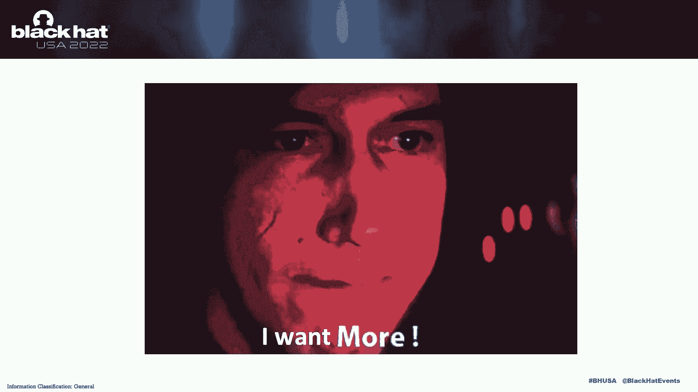

 Let's move on to the second case study。 In this case， let's increase the level of restrictiveness。

 a bit。 So we turn on the feature， which is called context isolation， to true。

 which was false in the previous scenario。 And if context isolation is enabled。

 then node is not directly available to the renderer。

 So you just cannot do require child process and a shell。 So there are two ways to exploit this。

 First one is you can use a Chrome V8 renderer exploit， because sandbox is disabled。

 So you can go to like a CR bug and look for a crash POC， and get your own end date。

 Or you can try to find a way to disable the context， isolation somehow。

 which we will be talking in the coming， slides。 So in this schematic， let's go again。

 So we have an access on the application layer。 And this time， there is an isolation。

 between where the node and electron API， resides。 So the previous attack won't work here。

 So the second case study we have is a remote code execution， on Discord。

 which is a commonly used application。 We found that Discord was using an older version of electron。

 which was 12。14。1。 And this means that it is also using an older version， of Chrome indirectly。

 which is 83。 So when we were looking for attack surface in Discord。

 the most interesting one was a video embed。 So let's say if you send a message to a victim on Discord。

 with a YouTube link， you will see that the video will get， expanded and someone can click on it。

 So we found an access on one of the third party embed， which， is Vimeo。

 And we used that to get our initial JavaScript execution， on Discord。

 But the catch here is whenever there， is an iframe in electron based application。

 it is sandboxed by default。 So we cannot just simply run like a renderer。

 exploit of Chrome 83 and get an RC。 So we dig down a deep in the Discord。 And what we found that--。

 we found a misconfiguration in a new window file handler， which。

 can be used to open a new window using window。open。 And this new window had a sandbox visible。

 So what you can do is you can open a window， with a location of an external website controlled by you。

 And then you can run your Chrome via trenderer exploit。

 to get RC。 Let's see the demo。 So attacker is sending a video link to the victim。

 Victim will go and press on it。 And as you can see， this is the new window which I talked。

 which is without sandbox。 And you can pop a calc on Discord。

 And this can be done improvised by just putting style sheet。

 to make it more lucrative and conduct social engineering， attacks。

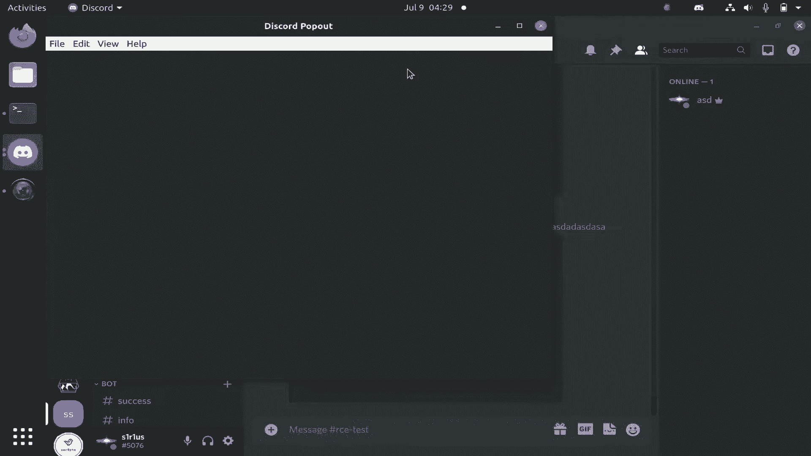

 So we received $5，000 bounty from Discord。 And Discord fixed it by upgrading to the latest electron。

 version and fixed this new window misconfiguration。

 by limiting to not have redirection to external website。

 And most of you already know about this attack。 It's common knowledge to use a V8 exploit when sandbox is。

 visible in the electron app。 But what I'm showing you is it is really common in real world。

 applications to have this sort of misconfigurations。

 Let's go one step further。 In this case， we turn sandbox to true。

 But now we have context isolation to false， which was true earlier。

 So as sandbox is enabled on renderer， we cannot directly run like a Chrome and exploit to get RC。

 Because this time， SAC Comp or Win32K lockdown， will stop us by blocking bad syscalls。

 As node integration is false， no node modules， are exposed to the renderer。

 So you cannot do the trick in the first slide， which I mentioned。

 But now the catch here is there is no isolation， between the website you load and electron's internal code。

 or pre-load code。 In the diagram， now you can see we， had two isolated contexts before。

 But now there's this one block which runs electrons internal code， your application。

 and the pre-load。 So electrons internal code is written in JavaScript as well。

 So what can you do with an excesses？ Can you do something like prototype pollution。

 to overwrite electrons internal code？ Let's see。 So how to get a shell？

 So if the version of electron app is less than 10， then you can use prototype pollution gadget。

 to leak a remote module or IPC module。 So remote module， according to electron documentation。

 is a module which is used to bridge JavaScript objects。

 from the main process to the renderer process。 So once you have access to remote module。

 even in a sandbox window， it is trivial to get access， to node primitives using it。

 For electron version 10 to 14， electron developers。

 thought about this and they disabled remote by default。 So they toggled true to false。

 So you can still try to leak the remote if application developer， has enabled it explicitly， or you。

 can find an IPC misconfiguration。 For electron version greater than 14。

 which are like the newer electron version， remote is completely deprecated due to the security concern。

 of how it can allow you to give node primitives on a sandbox， window。

 So you can still use a prototype pollution gadget， to leak IPC module。 But in this case。

 what you can do， is after leaking this IPC module。

 you need to find misconfigured IPC within the web app。

 or within electron's internal code。 So what I'm showing you here is a novel prototype pollution。

 gadget we discovered on a test electron version。 And this concept of prototype pollution is not unknown。

 It was first presented in 2018 by Masato Kinugawa， on an older electron version。

 But this is something which works even on the latest version。 So as you can see。

 we overwrite certain inbuilt JavaScript， function， which is call and ends with。 And then we。

 on the number three， we get access to a webpack require。

 which contains all these modules which we want to use， to get RC on your favorite apps。

 So for a situation like this where sandbox is false。

 you may be wondering you can just run a renderer exploit。

 But you can leak this webpack requires using prototype。

 pollution and also get access to node primitives or electron， common API to popular kelp。

 And you may be wondering why to use this and not a V8 exploit。

 And the reason is this is much more reliable， compared to a V8 exploit。 For example。

 a second reason is that you don't require binary， exploitation knowledge in order to perform this attack。

 It's a complete WAM attack。 And the third reason is what if the application you are targeting。

 doesn't have a Chrome and in the first place。 Then you need to be creative and use something else。

 So for an example where sandbox is true， you cannot get access to the node primitives。

 But what you can do is you can leak electrons IPC binding。 So you can leak two IPCs。

 which is IPC renderer internal， and IPC just for electrons internal IPC。

 And then you can invoke multiple or developer defined IPC， channels like open URL。

 which I showed you earlier。 Or you can invoke electrons internal channel。

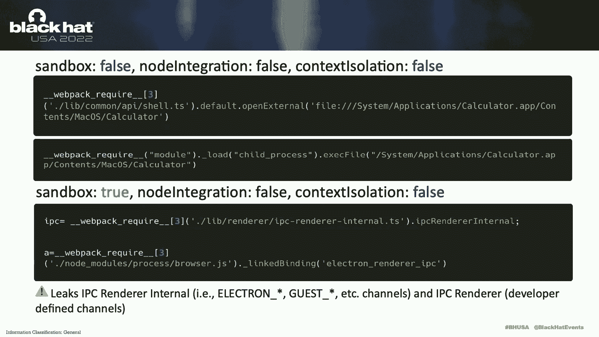

 like electron star or guest star。 So let's take a case study for Microsoft Teams。

 where we were able to achieve local file trade， and were able to perform an account takeover。

 on Microsoft Teams user。 So Microsoft Teams was using electron less than 15。

 We found an access in the renderer， where you send a message to someone using a zero day。

 in CK editor。 So we perform a mutation access in CK editor。

 which was a zero day finding which we did。 And this is something which is used as a rich text formatting。

 for Markdown in Microsoft Teams。 So once you had this accesses， what we notice。

 that when you open a new window， context isolation， is disabled， but sandbox is enabled。

 So we can use that same attack vector which I showed earlier。

 So we use prototype pollution gadget to leak IPC， using our accesses。 And once we leak IPC。

 we leak the electrons internal IPC， which is IPC renderer internal， to make an IPC call。

 to a browser process， which reads a file given a path。 So think of it as like a file， read。

 or local file inclusion， attack。 And this was a misconfiguration within electron， which。

 was fixed in the electron version 15。 And as you can see， you can perform an IPC。

 invoke with this electron's internal API， and supply a path name。

 So let's look at the demo how this is going to work。 So this is where we have our accesses。

 And on the attacker's website， we， can see that we leak the file which is desktop config。json。

 And within this file， that is a JWT or JAuth token， which。

 you can use to get access to any user account which you， want to target。

 So that is the impact of our Microsoft Teams exploit。

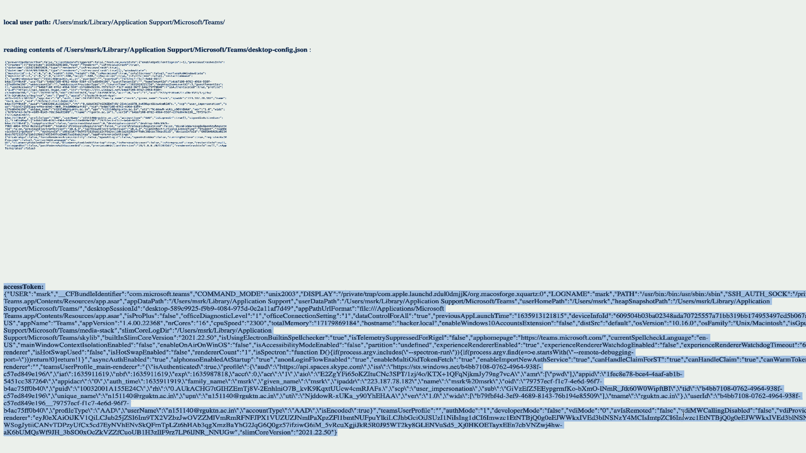

 So we received $3，000 bounty for our Microsoft Teams exploit， which is pretty nice。

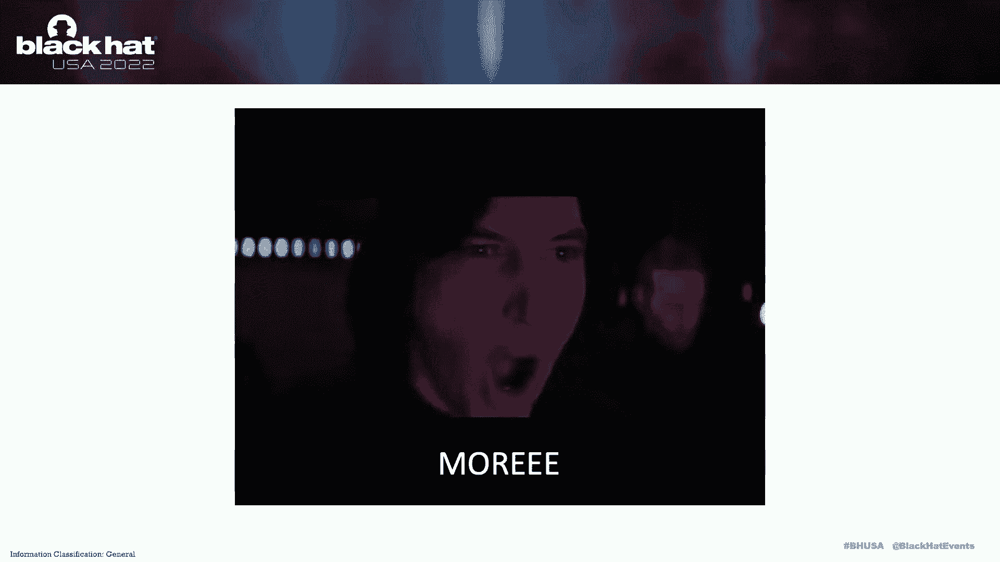

 But let's take one step even further。 What if everything is green？

 What if an app is running with all proper security settings？

 So this settings is used by most of the application。

 Node primitives are not exposed to the renderer。 Context isolation is enable。

 So we have a separate context。 And sandbox is true。

 So to hack this configuration is the main part of our research。 So here in the block diagram。

 we are mostly targeting this sandbox， renderer portion。 So at this point。

 you might have a question that， is this just like having an access in a browser。

 because everything is enabled all security settings？ And the answer to that is no。

 The reason for that is that electron is not， the same as your commonly used day-to-day Chromium browser。

 for example。 So electron code is something which， is a combination of Chrome and electron specific code。

 So what if we find a way to abuse this intersection， between electrons code and Chromium code。

 and somehow subvert all the defenses which electron had？ Let's see。 So first。

 I'm going to present a CV which， we discovered in electron， which is enabling node integration。

 in subframes from a compromise renderer。 So what is node integration in subframes？

 So let's say you have a website， for example， dot com， and you create an iframe。

 within that website， which is to load another web page。 Now let's say if you want to provide access。

 to node primitives or preload scripts within this iframe。

 you need to enable a feature flag known as node integration， in subframes。

 because by default it is false。 So this is a way to provide access to preloads or node。

 primitives to your iframe。 So for every subframes like iframe or child windows。

 if node integration is enabled and sandbox is， disabled on your parent window。

 which is your example dot com， then node jess primitives will be available in subframes。

 If node integration is disabled and sandbox doesn't matter， even if it's enable or disable。

 then all your preloads， will load within this specific iframe。

 So let's see in the code to understand a bit further。

 So here we have a main process where we create browser， into preference。

 and node integration in subframes is false。 We do the same thing a loader URL， Google dot com。

 and define an IPC channel。 On the render process， again， the same story， we expose open URL。

 And on the website， Google dot com， I create an iframe to pwn。af。

 And I use that window dot electron dot open URL， to pass an argument。 This works fine。

 But from the iframe， when I try to do the same thing， by invoking that open URL， it doesn't work。

 It's because node integration in subframes is false。 Let's turn it to true。 And in this case。

 no error is thrown， and you can pop a calc from your iframe。

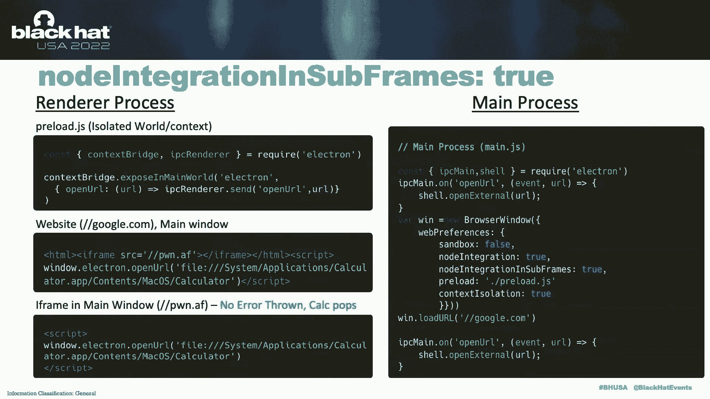

 So most of the time， when we get accesses， in a lot of these applications， it。

 is within iframe or subframes， which you， noticed in the discord earlier。 And in this case。

 node integration in subframes， is disabled mostly because developers do not。

 go against the design pattern and enable it unless it's needed。 So in this case。

 even if we have accesses， we don't have access to context bridge， expose API on embed。

 which is a bit sad。 But can we still hack it？ Can we still find a way to somehow get access。

 to those preload and node primitives through this？ Let's see。 So to see this。

 we take a deep dive into the electron source， code。

 Let's look at how electron implements this security features。 So what electron does it？

 It patches blink web preferences and adds this node， integration in subframes， context， site。

 isolation， everything within this。 So in the red， NISF is implemented there。

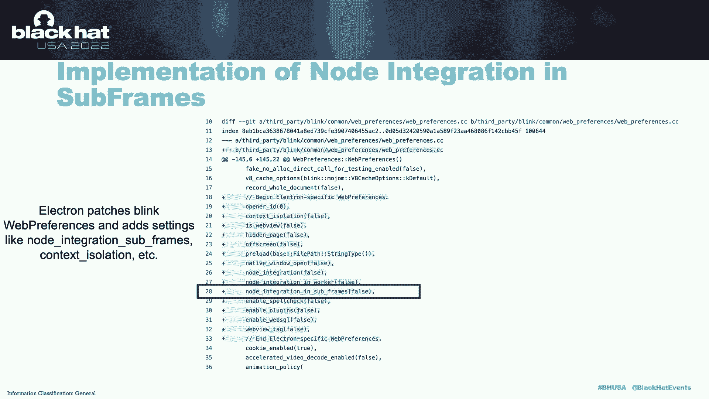

 So when we take a more deep dive into how the code for this， works。

 like based on what you need to enable NISF， we can go to a file which is in the folder。

 which is shell， renderer。 And within this file， what it happens in the boxmark as read。

 is the renderer frame gets access to blink web preferences。

 And then it accesses node integration in subframes variable。 And if this is set to true or false。

 based on that it will make a decision on whether to enable。

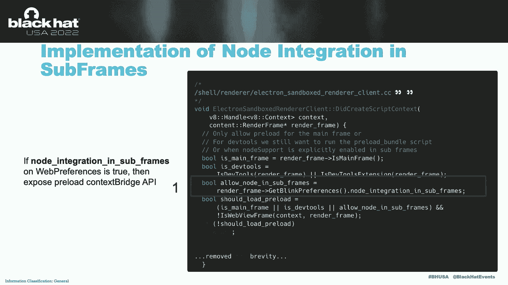

 that feature or not。 Now， if you have been paying close attention。

 you would notice that the check here for this feature， is on the renderer process。

 So what we can do is， if we can run a renderer， via it exploit and find a way to somehow。

 set that variable which we just saw previously to one。

 then we might be able to enable NISF。 So here is an annotated version of our binary exploit。

 So first of all， we leak address to window in the memory。

 We added to get access to a web preferences。 We add an offset to node integration in subframe。

 And then we flip it to 1 from 0 to enable it。 So this is how the changes which you would make to your V8。

 exploit in order to perform this attack。 So let's look at the real world case which we found。

 in Element app。 And Element is a really famous application。

 So it is using Chrome 91 and Electron 13。 There is an XSS on embedded through a deep link。

 misconfiguration。 And no context which API on embed is exposed by default。 So what you can do is。

 same story， you run Chrome V8 exploit， expose context which API， and then perform your exploit。

 So within the main process， Element app， defines a IPC known as user download open。

 This is used to open a path using shell。open path， which， is a dangerous sync in Node。js。

 And on the renderer process， it exposes electron。send as a way， to proxy messages to main process。

 So as we can see in our exploit， what we do is we create an。

 iframe SRC doc to create your own iframe。 And once this renderer exploit runs。

 it will create this iframe with node integration， subframes enabled。 So within this new iframe。

 you will be able to access like， electron。send method， which was exposed earlier， and can。

 pass your own argument to pop a shell。 So iframe will pop up， and then you can pop up shell。

 because NISF is enabled。 Let's see how this looks in the demo。 So victim opens the app。

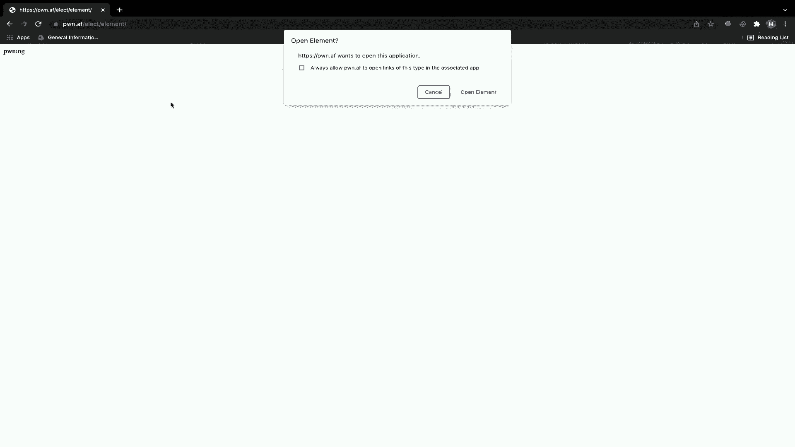

 It's a video conferencing。 Victim will try to join this video conferencing。

 And as you can see in the background， I want to show you， how this exploit would run。

 This is where this calculation of the offset is going to， take place。

 So we are doing a step-by-step calculation。 And once this happens。

 the shell will be popped as now you， have access to those preloads。

 So now let's try to do it a bit more。 So we received a $3，000 bounty from Internet。

 Bug Bounty Program， as we reported this bug to electron。js。

 So now we will try to disable context isolation using a， compromise renderer。 So in this case。

 it's the same story you know that electron， patches blink vapor references adds context。

 isolation there。

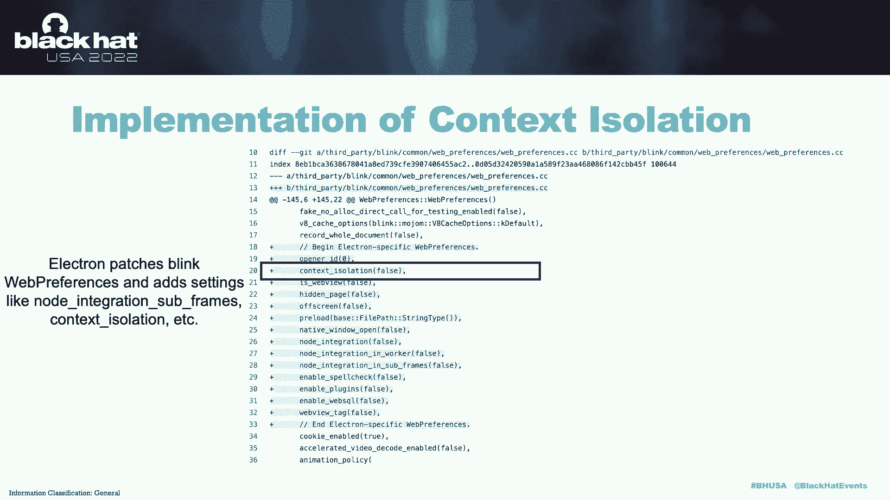

 And when we look into the electron code， what we， figure is it does the same thing。

 It gets access to the web preferences and access context。

 underscore isolation variable in the step number one。 In step number two。

 it has a Boolean value which is like， should create context isolation， which is based on the。

 value from the step number one。 And on the step number three， there is a if statement which。

 is like if should anable context isolation is true， then。

 enable it else disable。 So our goal is to disable the context isolation。

 So same story you can use V8 renderer exploit because this。

 particular feature was enabled on the renderer side and not， on the sandbox side。

 which was a design flaw within。

 electron。js framework。 And then you can set it from one to zero。

 So this is an annotated version of our binary exploit。 We get offset to a CIS in the memory。

 And then we overwrite its value from one to zero to。

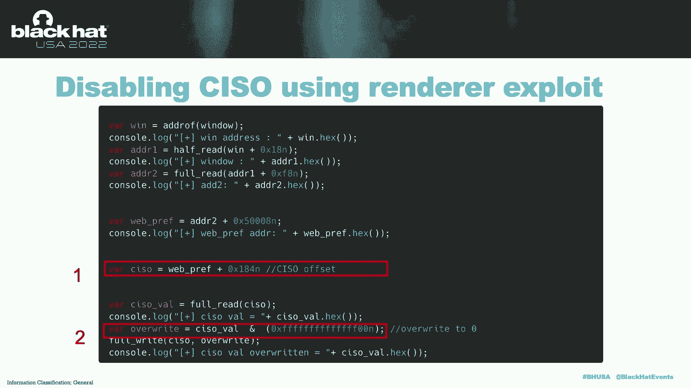

 disable it。 So let's take a look at our final case study， which is， RC in an undisclosed app。

 So we found a feature to embed untested content in an， iframe in this application。

 So in the main process， again， you can see open and， discorextional is a channel。

 which is dangerous sync。 And on the preload， we have something known as is， allowed URL。

 which is a function to perform like a， allow list。

 And it will only allow if the URLs has a protocol which is， HTTPS。 So unlike previous exploit。

 you cannot pass something like， file path to calico。app because then it will have a file， protocol。

 which will not be the HTTPS。 So let's try to find a way to bypass this and make a direct。

 IPC call to the main process from the web page。 So here is our exploit。 First of all。

 we disable context isolation using our， V8 exploit。

 Then we perform a redirection to another web page， which。

 is leak。html。 And once this page is reloaded， this will be reloaded with。

 context isolation disabled。 So what we can do is we can perform prototype pollution。

 which I showed earlier in the previous slide， and get， access to the IPC directly。 So in this way。

 you can make a call， even with five， protocol， by bypassing that preload， which was the middle。

 man performing that allow list check。

 So let's see how the demo would look like。 So here are the calculation for the V8 exploit， which I。

 mentioned earlier。 And as you can see in the background， this is what it， happens。

 It gets the offset。 It gets CISO and it sets to zero。 Now this is leak。html。 When we click on it。

 we pop a shell because that was with， CIS or disabled window。 So we just saved $5。

000 bounty from this undisclosed， bounty program， which is a very commonly used app as well。

 Now let's shift our gears to talk about same site origin， spoofing。 So within electron app。

 let's say if you want to load a， website known as nane。example。com， then chromium will。

 internally create a process。 For example， a process one for this。 Now within this main。example。com。

 if you want to implement， like iframes， for example， youtube。com and sandbox。example。com。

 then let's see how many process it creates for this to iframes。

 So it only creates a separate process for youtube。com， but it。

 doesn't create the separate process for sandbox。example。com。

 The reason is that a Chrome uses the same process if your top， level domain is the same。

 So in this case example。com is the common between both of， your subdomains。

 And site isolation won't apply here。 So Chrome uses the same process for both the pages。

 So let's say if you have an access on sandbox。example。com and。

 you want to access those preload APIs and node primitives which， are running on main。example。com。

 then how would you do it？ The way you can do is you can run like a chrome renderer via。

 exploit and you can set document。url to main。example。com and， security context origin port to 443。

 This way you can mess curate as your parent page and will be able。

 to access all these preloads and node primitives which are， provided to the main。example。com。

 So as we notice we used a lot of V8 expert to perform this。

 attacks and there is a noticeable patch cap within， electron。

 electron apps and chrome which makes a lot of that， this app susceptible to these attacks。

 And if you want to go one step further you can also use like。

 sandbox escape from chromium which are pretty here there but it。

 can also bypass this sandbox to configuration。 So as a part of the mitigations what are the suggested。

 mitigations for this is the findings which we did earlier were。

 all fixed by electron and we were assigned CVE for those， findings。

 So electron made a code level fix to not do this， check on the renderer process so you cannot just directly invoke。

 those leaked IPC on the newer version。 But as a developer what you can do is you can still enable all。

 the security flags because that is the recommended part。

 You shouldn't use an untrusted third party embed which doesn't， have a good security track record。

 For example we saw with discord like you can embed a Vimeo which。

 had access and that was the failure point for the app。

 So make sure your patch cap isn't large with chromium and your， electron app。

 So if you have an organization and have a， capability you can fork electron and you can cherry pick。

 commits which are V8 bugs and can fix it by yourself。

 So that is one way to do it and another issue is you shouldn't。

 implement sensitive IPCs like what we saw earlier。

 Those dangerous JavaScript syncs in your main process because。

 attacker will find a way to get access to those IPCs even if， they are restricted。

 And mitigate security issues across， all your assets。 So your main domain your sub domain。

 whatever you are using in the app make sure it is restricted。

 because as you saw with same site origin spoofing a sandbox。

 domain can also get access to those privilege context which， exposed API。

 So as a part of APILOG we were able to， compromise more than 20 commonly used electron applications。

 This was running at the latest version and we were also able to， optimize Jupyter lab。

 meta most notion base camp and apps which， I showed in this demo which are a few of them。

 So as a part of our black head sound bite I want to talk and。

 emphasize on three key takeaways for this。 So the first one is。

 for bug bounty hunters and security researcher which is to。

 dig deeper into the framework you are auditing and to not。

 limit yourself only to the application layer。 So what we see with electron is there is a design flaw where。

 this features were enabled on the renderer for example and。

 that intersection was not done perfectly。 So design layer。

 flaws can enable you to bypass a lot of security settings if， you have a primitive to tweak those。

 Second is for， rating operators that electron apps are an ideal。

 adversarial target because users will click anywhere or open， any link。

 Users are going to join video confidences。 They are going to open the messages。 So if you are in a。

 detection team make sure that you also consider electron。

 applications used within your organization as a part of the， track model。

 The third one is to minimize attack surface on， your application as much as possible。

 So in security what we， consider open URL redirection it's a very p phi issue but in。

 electron JS someone can still use an open URL redirect to。

 redirect to their own external website and get access to the， main web view and perform this attack。

 So treat all the， security issues with higher scrutiny if possible and when。

 you are doing threat modeling of your electron applications。

 consider all the windows and apply all the security settings。

 on every window because as we saw with VS code we were able to。

 jump from the most restrictive to the least one and was able to， get RC。

 So that's pretty much it for the presentation。 First of。

 all I would like to thank everyone coming by and stopping， by and hearing about talk。

 And if you want to understand all， these use cases which I mentioned here the application part of。

 it how we achieved in details and if you want to secure your。

 electron applications please visit electroworld。io and then。

 you can find like our blog website which is blog。electroworld。io。

 and we have already published a use cases for VS code and。

 Discord RC there where you can look this entire chain in， detail and understand further。

 So with that I'm concluding the， talk and opening up for any questions which you may have。

 [Applause]。

 [Music]。