# P72：082 - How Firefox Uses In-process Sandboxing To Protect Itself From Exploitable - 坤坤武特 - BV1WK41167dt

嗨，我是沙汉，我是奥斯汀大学的新助理教授，今天我将告诉你如何保护你的应用程序免受bug的侵害。

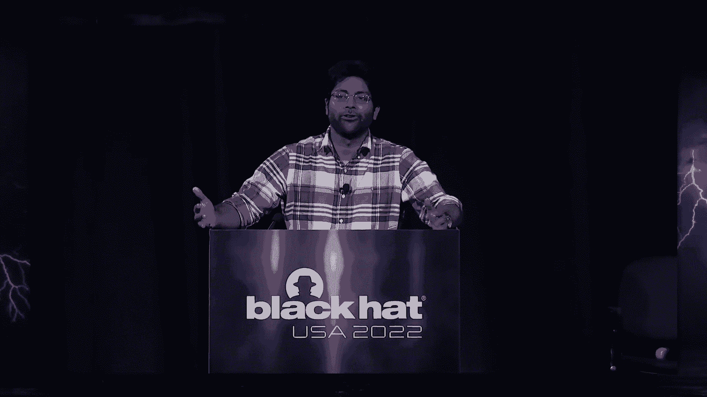

在其依赖关系中，所以这实际上是一个多重的结果，加州大学一群人之间的年度合作，圣地亚哥。

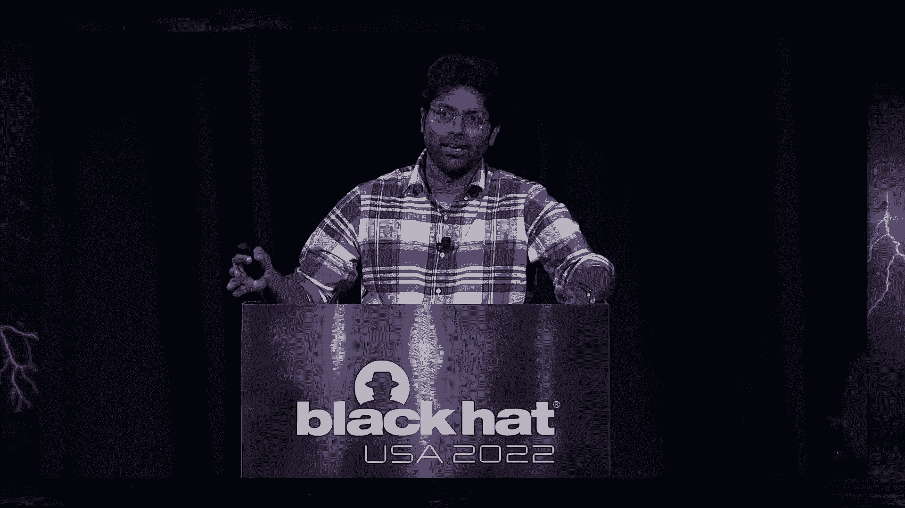

UT奥斯汀和Mozilla，简而言之，今天的演讲将是关于，过程沙箱，这是一种保护应用程序免受本机代码形式的依赖的技术，过程沙箱的想法，实际上在学术安全界已经有一段时间了，在这一点上将近三十年了。

这是它第一次进入生产代码，这是因为几个原因，第一个是WebAssembly，这是一个广泛可用的基于编译器隔离的工具链，现在我们所有人都可以使用，第二部分是我们必须建立的框架，叫做RL Box。

简化了进程中沙箱的采用，并允许您使用WebAssembly和Firefox进行沙箱本机代码，一直是火狐网络浏览器，在这一点上已经使用URL Box两年多了，我们相信其他应用程序也可以做到这一点。

所以在这次演讲中，我将从一些高水平的部分开始，比如为什么我们首先想要像进程沙箱这样的东西，我会谈谈痛点，过程沙箱的痛点是什么，为什么我们需要一个框架来帮助我们采用它，我们来谈谈RL盒子。

这是我们构建的框架，实际上是为了简化流程沙箱，最后，我们将讨论在流程沙箱中实际部署的经验，带RL盒，让我们直接跳进去，我们关心这些的原因是我们今天使用的每一个应用程序，在某种程度上依赖于本机代码。

我们可能很清楚。

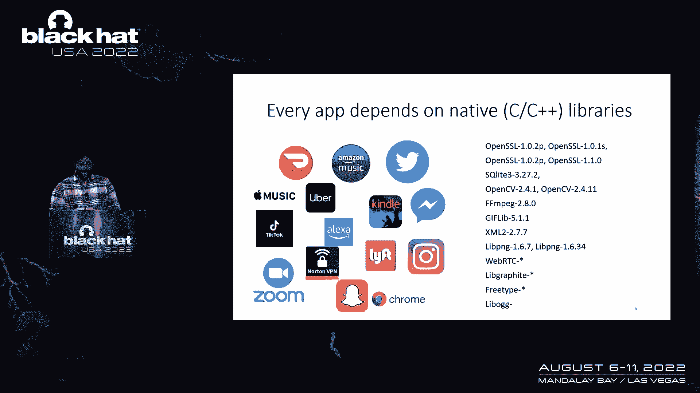

本机代码往往有内存安全错误，如果你以前去过黑帽子，你可能会看到这样的幻灯片，这基本上是对谷歌Chrome和微软Windows中bug的分析，我们发现的是我们看到的70%的虫子，只是内存安全漏洞。

所以在冻结缓冲区溢出所有这些东西后使用，在这一点上，你可能会，你可能会说这样的话，让我们停止用C++写东西，我会把一切都写在铁锈或类似的东西上，那里有个问题，这些安全语言也是建立在同样的不安全库上的。

如果你在铁锈上查CC板条箱，或者添加API节点JS，你会看到这个，这只是另一个例子，像明火一样的东西，50万行c，这是一个常见的依赖关系，即使在铁锈应用中--例如，所以说。

所有这些本地代码的问题是当这些库有bug时，它们被用于真正的攻击，我们在野外见过这个，再次，一次又一次，在那里这些bug被利用来危害系统，像网络浏览器，我发消息给你命名一个系统。

它可能被这样的东西破坏了，我们面临的挑战是所有的技术，我们有缓解措施，像ASLR堆栈这样的应用程序硬化，金丝雀控制流量，正直，最终只是疯狂攻击的一个小减速带，他们必须克服的事情，但最终他们做到了。

突然我们看到野外的攻击，我们可以，我们可以试着说，让我们用铁锈重写一切。

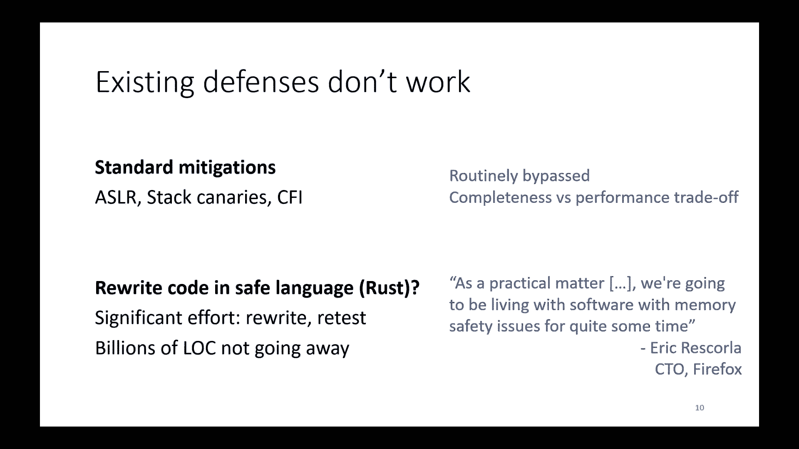

不幸的是，这不是很实际，这其实挺不现实的，现有的C和C有数十亿行，加上不会消失和重写的代码，它不仅仅是改变语法或你必须重新测试的东西，你实际上必须确保它是便携式的，得到这个，它得到同样的性能。

这是一个相当大的过程，以至于即使是建立信任的Mozilla，并不是真的想重写，所有Firefox及其在Rust中的所有依赖项，所以我们必须寻找其他方法来解决这些问题。

所以我们可以做的一件事是把所有这些有缺陷的本机代码，然后把它粘在一个单独的过程中，不能影响应用程序的其余部分，这就是进程沙箱的思想，它已经存在一段时间了，很方便，因为我们所有现有的代码都能工作，这很棒。

我们看到的是这种技术在实践中很少使用，除非有几个例外，我认为打开SH网络浏览器，但除此之外，它还没有真正看到广泛的采用，这是有很好的理由的，这就是性能，当您有进程时，您有进程间通信。

当您进行进程间通信时，你的应用程序变慢了，有很多管理费用，CPU智慧，内存方面，调度器明智，在扩展方面存在挑战，我也是，即使你能通过其中的一些，当您在应用程序中使用进程沙箱时，最终会发生什么。

你要设计它，你要改变它的写作方式，很难在现有的应用程序上改造进程沙箱，就像现在这样，我可以和你长篇大论地谈论这件事，但让我给你看克里斯·帕尔默的一篇精彩演讲，谁从谷歌铬安全，他非常详细地经历了这一切。

相反，让我谈谈我们尝试的一个技术，最终对我们有效，这就是过程沙箱的想法，所以在过程中沙箱，这又是一个很简单的想法，也就是我们把这些我们不信任的库，我们用WebAssembly编译它们。

用WebAssembly对它们进行沙箱，然后我们在同样的过程中运行它们，为了这次演讲的目的，只要想到WebAssembly就足够了，作为这个编译器，它可以使用运行时检查隔离代码，我们想要得到的。

当我们这样做的时候，所有这些都是为了让你的应用程序看起来像这样，不是这个大的代码块，可以访问地址空间的任何部分，而是有明确组件的东西，这些组件被沙箱化，沙箱组件只能访问部分地址空间，例如，在那里。

lib jpeg只能访问ox 4100和x4之间的地址，两百，做这样的事情的最终结果是当你免费使用后，缓冲器，溢流，或者类似的东西在lib jpeg中，它不触及Firefox主进程的任何内存。

或任何其他组件，这真的很好，因为我们现在得到了代码重用，我们也得到了性能，没有任何过程，因此没有IPC CP开销很大，但我们现在还有这个公开的挑战，这是涉及的工程工作，我们仍然必须采用过程沙箱的想法。

并将其放入我们现有的百万光代码库中等等，事实证明这是一个非常难的问题，至少用手做，你确实需要一些帮助，所以让我们来谈谈这个，让我们来谈谈这个，过程沙箱的痛点是什么。

为什么我们首先需要一个框架来帮助我们采用这一点，了解正在发生的事情的最好方法，这里有一个例子。

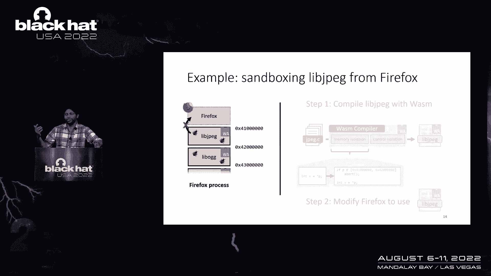

所以我们将把这个作为我们的运行案例研究，我们要尝试沙箱lijpeg，再次在Firefox Web浏览器中，目标是隔离Lijpeg的任何内存，Lijpeg中的安全错误不会影响Firefox的其余部分。

所以第一步，真的很简单，取Lijpeg来源，通过wasm编译器运行它，生成一个沙盒lijpeg二进制文件，在被窝里，WebAssembly正在添加范围检查，所以它实际上确保沙箱的方式是像这样的范围检查。

其中，应用程序中的任何内存读取都被转换为范围检查。

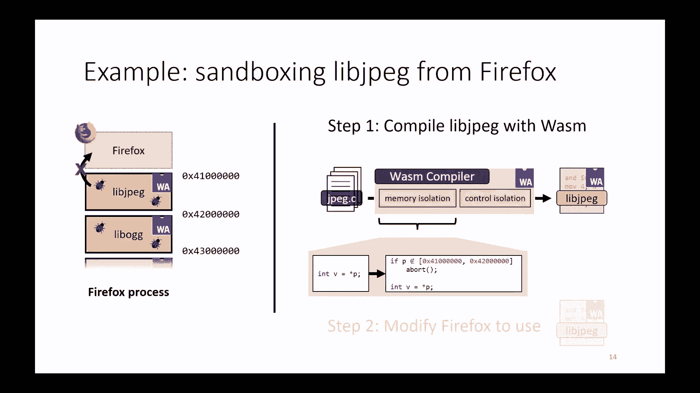

然后是相同的内存读取，这是一个非常简单的想法，我应该指出，在实践中，有很多技巧来制作这些范围堆栈，喜欢优化这些范围检查的性能，但这应该会给你直觉，总的来说，我们知道如何做到这一点，从某种意义上说。

这是简单的一点，真正困难的是，我们现在需要修改一个Firefox来合并这个沙箱，利杰佩格，这是我现在想关注的一点，让我带你走过各个步骤，现在需要结合这个修改后的唇部JPEG，我们要做的第一件事。

如果我们想这样做，就把库解耦，这不仅仅是一个喜欢的问题，获取代码并将其放在单独的文件夹中，现在我们需要获取所有共享的数据结构，我们需要弄清楚如何解开共享控制流的纠缠，所有这些东西都必须小心地分开。

这样我们就可以正确地对JPEG进行沙箱，一旦我们这样做，我们现在需要回到过去，思考所有需要发生的数据共享，因为组件现在有了自己独立的内存，所以我们需要在不同的组件之间来回编组数据。

这实际上是由几个不同的因素造成的挑战，第一个是WebAssembly，是不同的编译器，它有一个不同的API，它有不同的调用约定，其中一些是出于性能原因选择的，但它们与Firefox的其他部分不同。

所以我们现在需要处理这个，我们必须有一个拼凑的代码来修复所有这些事情，每次我们整理数据之后，第二点是我们不能把这个编组代码，我们想去哪里就去哪里，我们需要非常小心地做这件事，我们需要懒洋洋地做这个。

以便我们限制封送的数量，并限制来回封送数据的开销，一旦我们完成了这一切，我们还是要多考虑安全问题，因为当我们开始的时候，Lijpeg是一个值得信赖的库，火狐可信Lijpeg，它信任Lijpe的输出。

我们现在说的是Lipj包是沙箱，我们不相信它，我们不应该相信它的输出，这意味着我们现在必须回到Firefox代码，查找所有使用过Lijpeg输出的地方，并在那里添加某种理智检查或数据消毒。

进行所有这些代码更改变得非常困难，最好的方法可能是用一个例子，所以让我们看看一些代码。

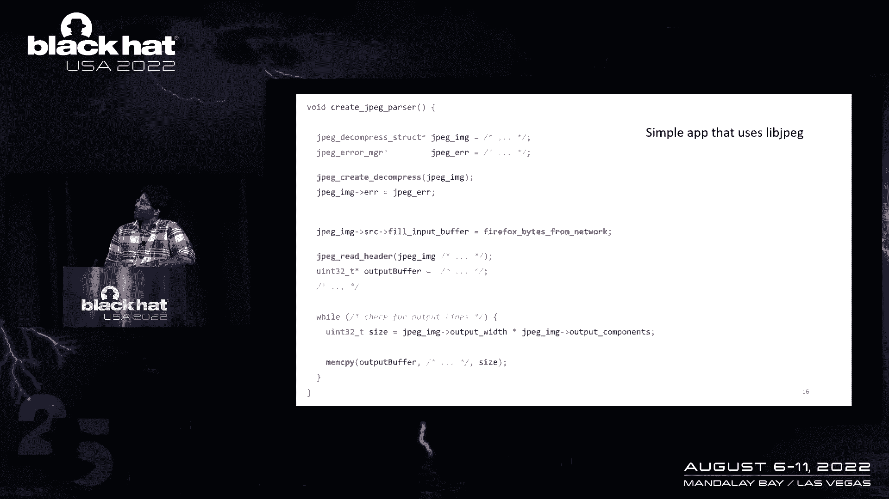

所以这是一个非常简单的，用lipj pe呈现图像的应用程序的十行示例，你不必非常详细地阅读所有这些，我认为要记住的是，有一个应用程序可以呈现图像，有几个调用lip jpeg API。

我们想修改这个应用程序来做所有的事情，我们刚才说到，编组阿比，固定安全检查，所以如果我们真的做了所有这些改变，生成的代码如下所示，几乎每一行代码都改变了，它是，如果你真的读到，有什么，我不建议。

你会发现这几乎是不可能理解的，这里是最好的一点，如果你搞错了，你的安全完全受到损害，就像所有的沙箱缺点一样，所以这就是我们发现实际挑战所在的地方，我们真的很难手工做这件事。

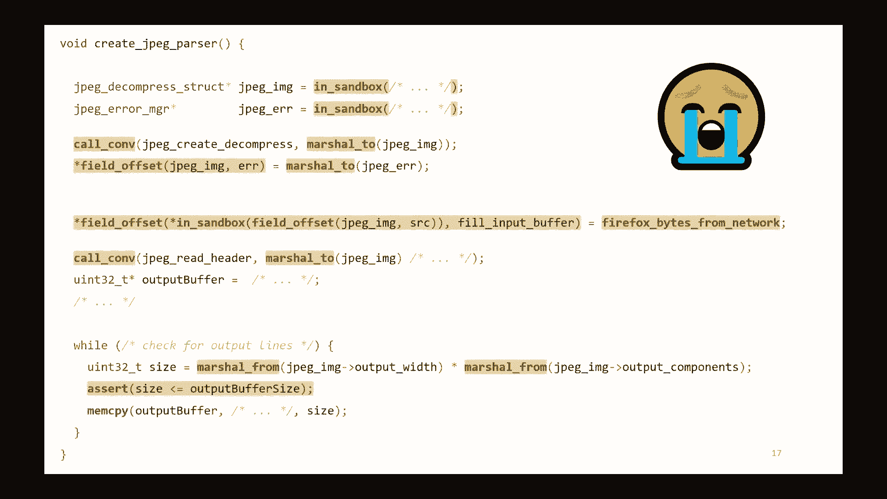

我们基本上得出结论，如果我们必须编写这样的代码，它在练习中真的很失败，所以即使是十行的例子也很难看到，想象一下为一个真正的代码库这样做，为图像渲染器编写数万行代码，差异会很疯狂。

这里的核心问题是这样的代码，在特性代码中公开沙箱的详细信息，我们所做的是我们把安全和功能工作混为一谈，真的变得不清楚，谁应该在这一点上维护此代码，安全团队是功能团队吗，如果你想更新一些东西会发生什么。

谁要审查它，如果您想向该代码添加更多功能，测试，调试，祝你好运，甚至更好，我们已经为一个API移植了它，大概我们想支持Windows，Linux，几个平台，至少再重复一遍，再来两次，再来三次。

如果你奇迹般地做到了这一切，对每个库重复此操作，您现在想用这种方式隔离和沙箱，我们基本上得出了结论，1。我们不能用手工操作，我们甚至并不孤单，所以谷歌的人也尝试了这个，得出了和我们几乎相同的结论。

这真的很难手工做，所以为了解决这个问题，我们构建了RL Box沙箱框架，所以我们的盒子是这个框架，这是为了简化，在现有的大型代码库中采用沙箱，这里的核心思想是使用类型，我们使用类型来隐藏所有低级细节。

所以API数据封送所有这些东西都是自动处理的，我们使用类型来跟踪不受信任的数据和控制流，所以如果你错过了安全检查，您将得到一个编译错误，这真的很不错，我们使用类型甚至让您识别和更改代码，逐行递增。

您甚至可以暂停并测试您的应用程序，最酷的一点是我们的L盒是纯C++库，因此，您可以将其放入应用程序中，而无需更改编译器构建系统，任何东西都应该起作用，在很高的水平上，我们的盒子很简单。

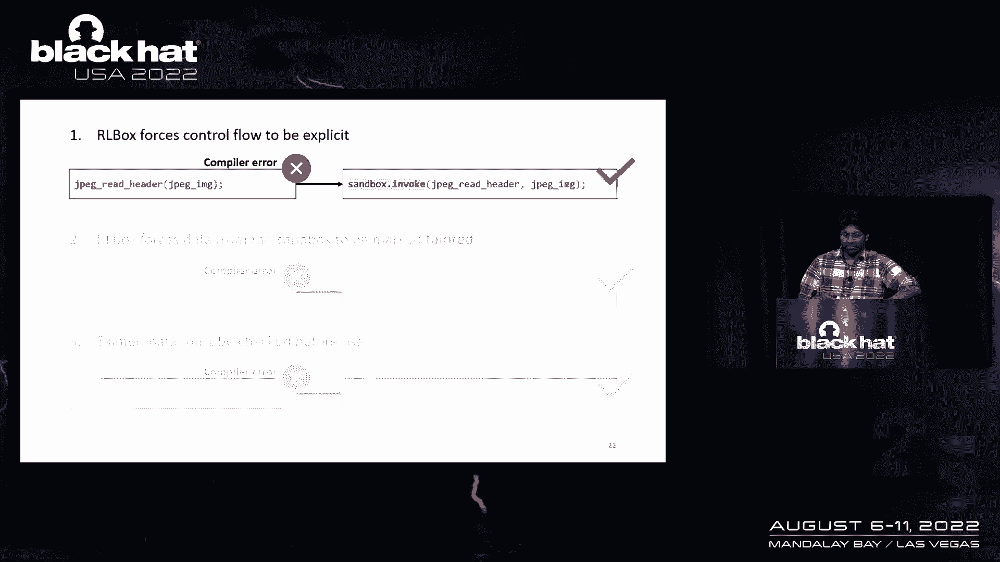

只有三个原则，首先是控制流应该是显式的，所以如果你做一个函数，调用API到像lipjpeg这样的库，您想要沙箱的，您必须通过这个名为沙箱调用的API，第二个是我们的盒子力。

从沙箱中出来的任何数据都要标记为不同的，因此，如果您访问JPEG图像的大小，由Lijpeg输出，你不会得到一个u-3-2，你要去你会得到一个污点你三二，哦，我应该指出，如果你在做这些改变时搞砸了。

RL框将强制编译错误，所以你必须把这件事做好，最后，一旦你做到了这一点，第三个原则是你需要确保在使用前检查所有受污染的数据，所以如果你现在拿这个以前的尺寸，它被污染了，并将其插入MEM复制操作。

您将得到一个编译错误，修复的方法，也就是调用这个名为复制和验证的API，这给了你一个机会来消毒这些数据，一旦你这样做了，这幅画被移除，这将编译并再次，让我们回到同一个例子，应用这三个原则。

我们的目标是以与以前相同的方式迁移代码，除了这次我们的行箱和这三个原则，我将从前面的两个开始，如果我要为前两个原则做出改变。

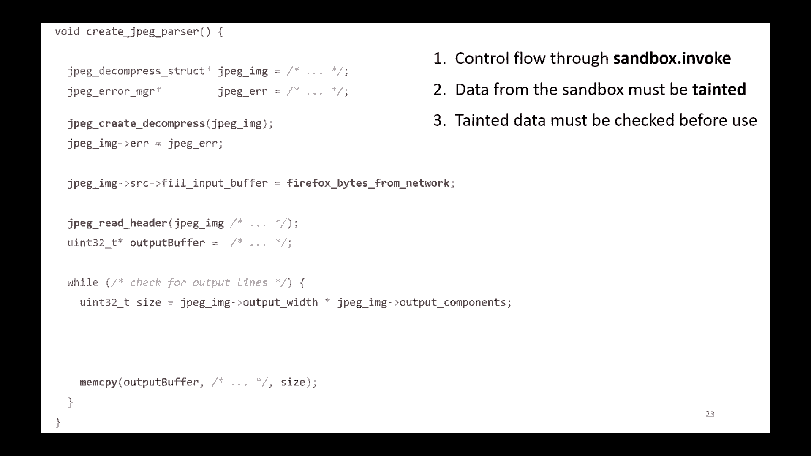

也就是沙箱点调用和受污染的数据，代码如下所示，即使不读它，希望你能马上看到它更干净一点，读起来容易一点，所有这些都是因为我们的盒子在幕后自动化了很多事情，所有API工艺，所有消失的数据封送处理。

它甚至能够自动化，你需要的一些反弹检查，在那个例子中，你实际上需要一个反弹检查，因为您正在取消Lijpeg给您的指针的引用，所以要进行安全检查，通常当你不得不这么做的时候，嗯，所以现在我们已经完成了。

我们已经完成了前两个原则，让我们把注意力集中在第三个比特上，被污染了，必须检查数据。

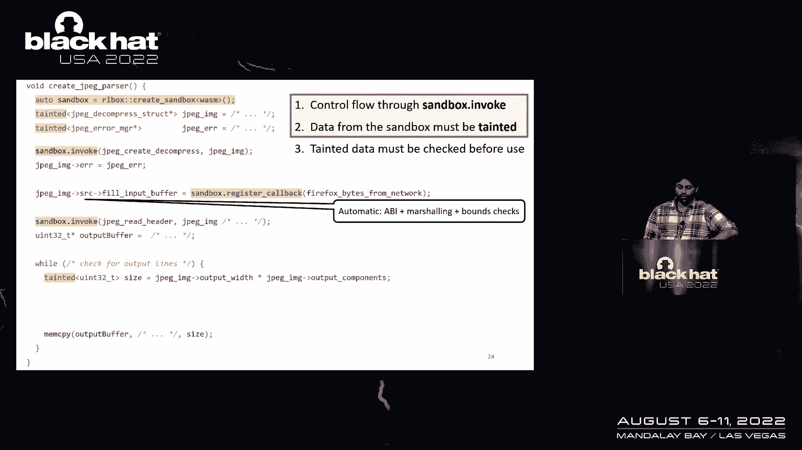

所以如果我们看看这个原理，我们会看到底部的这个可变大小被污染了，它被污染的原因是，它在计算基于JPEG的图像的像素数，图像元数据，它本身来自Lijpeg，所以这是有道理的，它应该被污染了。

尺寸稍后会在MEM副本中再次使用，所以我们需要验证它，并让所有这些编译，我们应该验证一下，把画移走，我们可以，在这种情况下，如果我们盯着这个代码看一点，我们可以确定我们想要什么样的安全检查。

我们要确保的主要事情是当我们复制数据时，我们不超过输出缓冲区的末尾，所以让我们进行安全检查，我们称之为，复制并验证，确保size值小于输出缓冲区大小，然后我们在MEM复制操作中使用这个检查值。

在这一点上，所有的东西都应该编译。

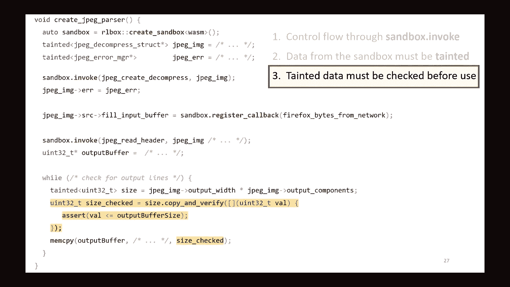

这就是我们的盒子带来的东西，它给修改代码的过程带来了某种结束，因为如果您编译此代码或其他，如果您能够成功编译此代码，这是RL Box告诉你的方式，你玩完了沙箱，这个应该可以，实际上。

这里的要点是当我们使用WebAssembly和NRL Box时，我们得到了我们要找的两样东西，这是快速沙箱和低工程工作量，为了让你真正了解这是什么样子，在实践中，我只想非常非常简短地告诉你们我们的经历。

在进程沙箱中部署，用我们的盒子，所以我们做的第一件事，当我们开发一个新的框架时，我们应该做的第一件事就是试用，所以我们测试了一大堆沙箱应用程序，几个图书馆，所以像Firefox这样的应用程序，节点JS。

阿帕奇等等，我们签署了几个不同类别的库，图像和字体渲染，音频视频，回放，XML解析，有一整张单子，总的来说，我们看到的是RL Box能够自动化一种方式，数百行胶水代码来处理所有相同的API。

编组甚至安全检查，留给我们的就像你看到的那样，我们需要验证的一些受污染的数据，通常最多两到四行代码用于此验证，这让我们可以做的是在这些应用程序中的任何一个中沙箱一个库，在短短几天内。

有信心我们真的做对了，在这一点上，我们实际上转向了部署，我们想把这个生产和部署准备好，我们工作了一段时间，在2020年2月，我们实际上做到了这一点。

我们实际上设法在Firefox Web浏览器中发布了RL Box，我们开始了非常小的沙箱，只有几个平台上的一个库，只有Mac和Linux，从那以后的两年里，我们一直在努力提高性能，便携性。

调试一大堆东西，截至今年，我们实际上已经对一些库进行了沙箱化，在Firefox支持的所有平台上，这也包括安卓系统，而远离性能方面，我们也想确保，我们的沙箱没有带来很大的管理费用。

所以我们测量了Firefox中的几个高价值用例，所以我们测量了XML解析，沙箱，XML解析，和字体解压缩，从广义上讲，我们看到这大约是10%，这使得我们可以在安全性和性能之间进行权衡。

这对我们的应用是明智的，对于浏览器，这两个只是浏览器所做的十亿件事之一，百分之十，在十亿件事中的一件上，不是最终用户可以感知的，所以我们其实没意见，所以这个真的真的很好用，我们确实部署了所有这些。

我们还没完，我们正在做一大堆事情在性能方面改进了几件事，我们还在等待穿线之类的东西，在WebAssembly上完全标准化，我们正在努力保持领先，将这些东西引入图书馆沙箱世界，因此。

当我们需要这些特性的沙箱库时，它们就像预期的那样工作，我们也做了大量的工作，为沙箱工具链做出贡献，以确保它们在低资源环境中工作良好，所以像英特尔这样的32位架构，三个，二对三二以此类推。

我们已经取得了一些进展的挑战之一，但我们仍在解决的是，不仅仅是内存占用，它是虚拟内存占用，虚拟内存在有三个二位指针的平台上也是一个溢价，所以我们也在做一些工作试图改善这一切，最后是可用性空间。

我们还在改进箭头盒API，我们正在努力使它符合所有现代C+的成语，随着它们的进化，我们在空间上做了很多工作，使它更容易使用，所以如果你觉得所有这些都很有趣，试试看，帮我们把这件事做好。

在应用程序中使用它，让我们知道什么有效，什么没有，如果你更倾向于攻击，让我指出，我们的L盒子实际上被Firefox的bug赏金覆盖了，它被覆盖为沙箱虫子赏金。

这意味着您可以从在您喜欢的库中添加内存损坏开始，那是沙箱，如果你能逃离沙箱，你得到窃听器赏金，通过说在过程中沙箱是这种技术，在应用程序中保护本机代码是一种实用的技术，这是一个已经存在了三十年的想法。

它第一次看到生产，因为我们现在有了部署和使用这个的工具，rl box是我们构建的用于进程沙箱的框架，并简化在应用程序中采用进程内沙箱，我们的盒子是一个生产准备工具，它被火狐使用了两年。

希望这也能在你的应用程序中使用。

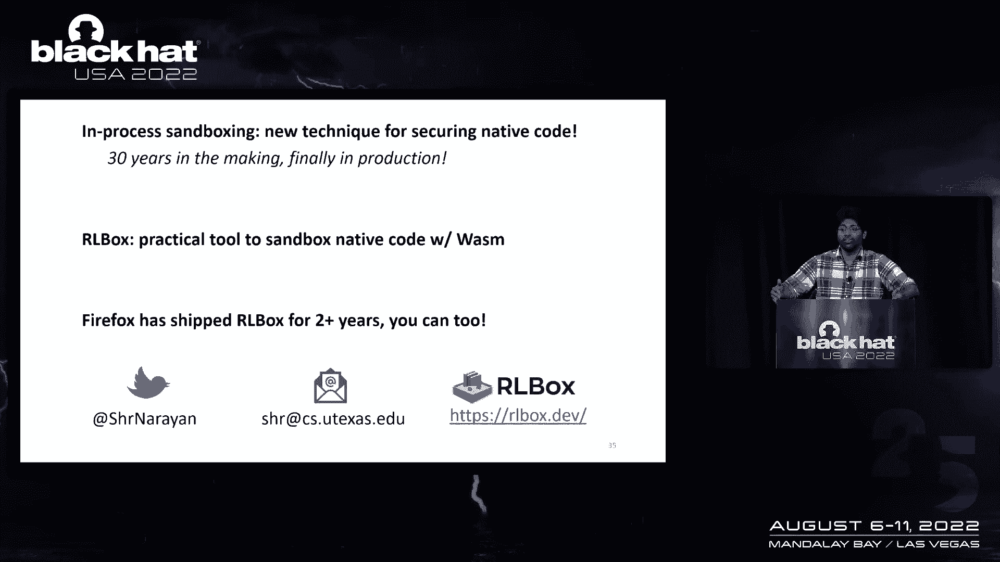

所以谢谢，谢谢。

