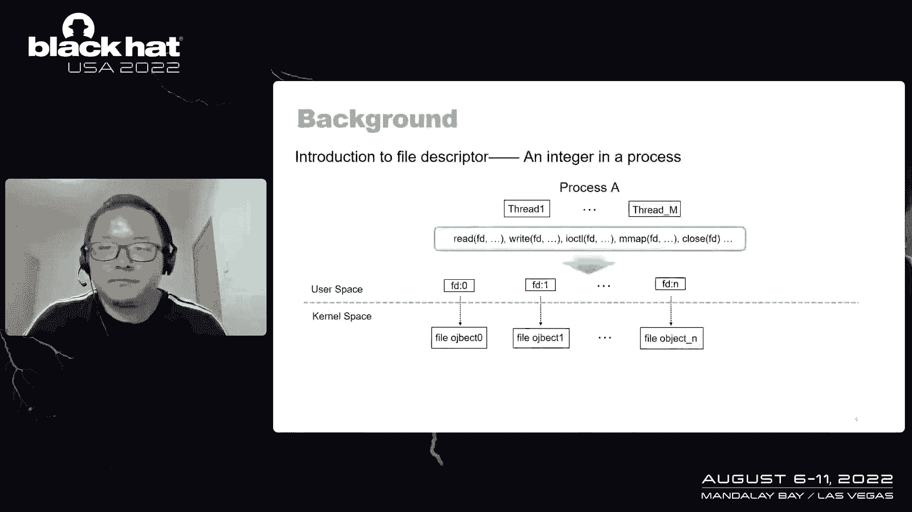
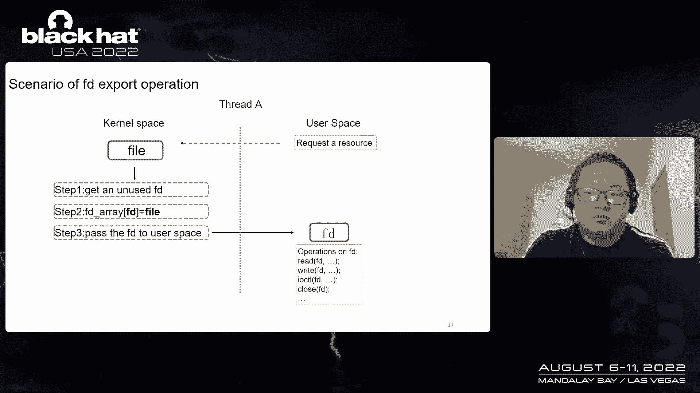
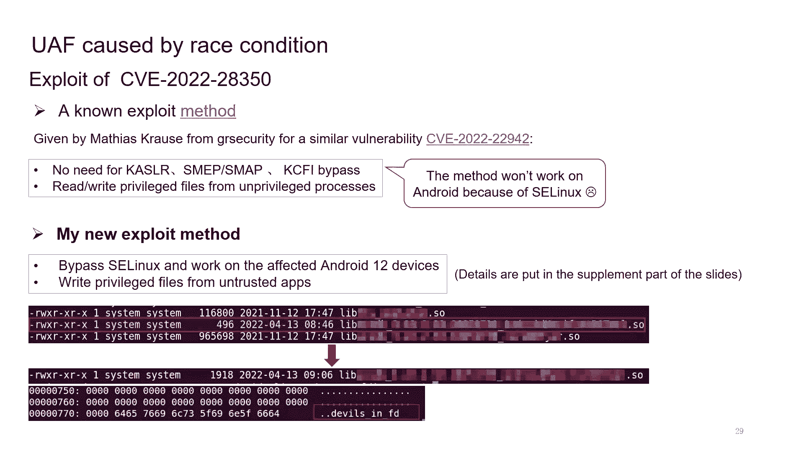
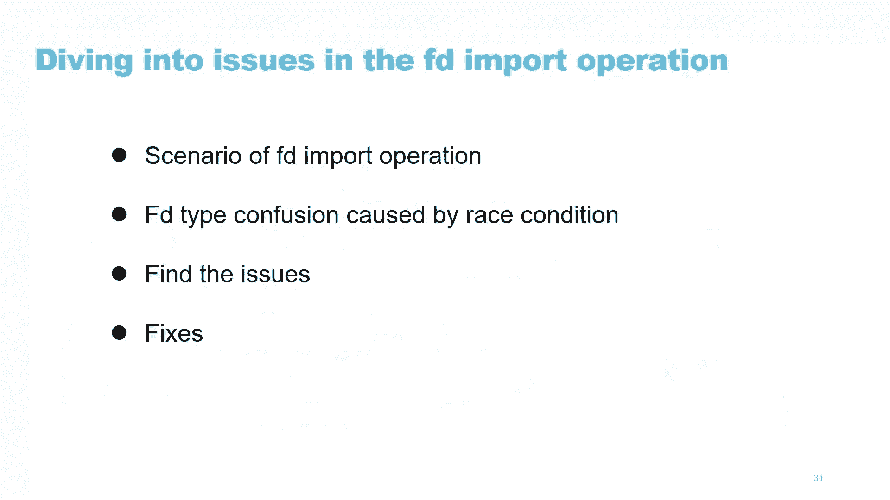
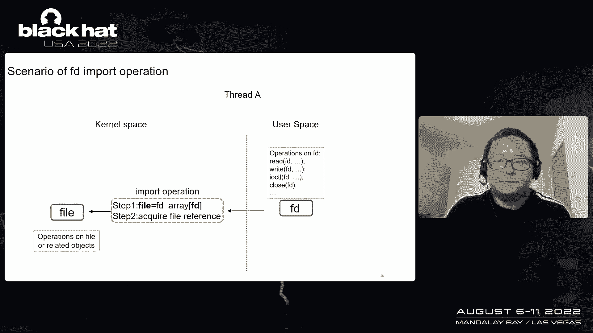
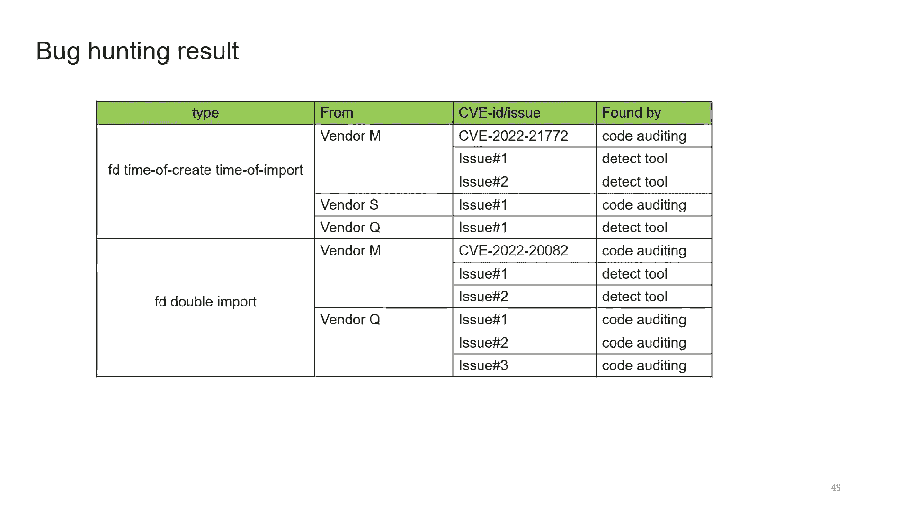
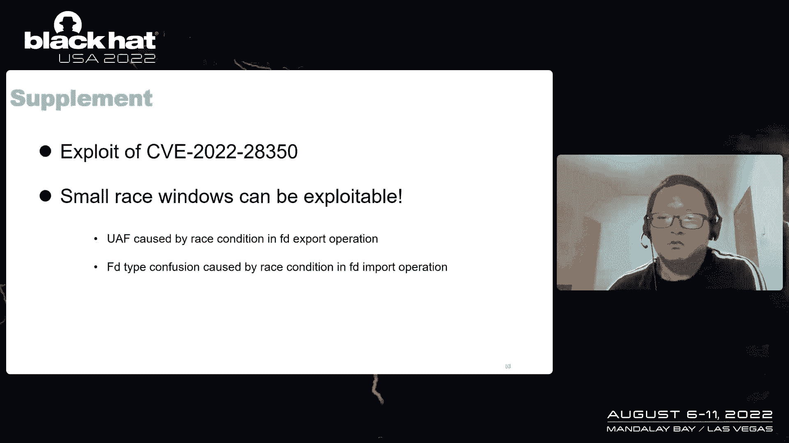

# 【转载】Black Hat USA 2022 会议视频 - P74：085 - Devils Are in the File Descriptors： It Is Time To Catch Them All - 坤坤武特 - BV1WK41167dt

 [MUSIC]。

 >> Welcome to my talk。 This is Luu from Badu Security。 In this talk。

 I will present my research about， the vulnerabilities related to the file descriptors。

 I will discuss how to find them， fix them， and some exploit methods are also included in the slides。

 Here are some introductions about me。 I am interested in enjoyed Linux by counting and exploit。

 I found over 200 vulnerabilities in the last two years。

 and I am also a speaker of Blackhead Asia this year。 Let's start。 Here is a agenda of my talk。

 First of all， I will give some background on， what a file descriptor is and why I do research about it。

 After that， I will dive into the issues in， the FD export and FD import operations separately。

 At last， I will give a summary and discuss the future work。

 Let's have a look at what a file descriptor is。

 We all know that everything is a file in Linux。 File descriptors are almost everywhere in Linux。

 A file descriptor is an integer that identifies an open file in a process。

 There could be many file descriptors in a process。

 and the value of a file descriptor could be 012 and so on。

 All the threads in the process can operate the FD through， Cisco's like read， write， and so on。

 Normally， every file descriptor is associated with a file object in kernel space。

 When we operate an FD in user space， the associated file object will be operated accordingly in kernel space。

 To record the map in between the FD and the file object， FD array is created in each process。

 The FD array is an array of file object pointers， and the index of FD array is FD。

 We can easily know which file object is associated with a specific FD。

 Kernel needs to handle the translation between， file object and FD frequently。 On the one hand。

 kernel needs to export a file object as an FD to user process。

 so the user process can operate the FD for read or write。

 The translation from file object to FD is finished through the FD export operation。

 On the other hand， kernel needs to import the FD to find。

 the associated file object for further operations in Cisco's。

 The translation from FD to file object is finished through， the FD import operation。

 The FD export and import operation are very common and basic operations in kernel。

 So let's have a look at the FD export operation first。

 The FD export operation in kernel is divided into three steps。 For example， here is a file object X。

 and we want to export it as an FD。 The first step is to get and use the FD， which is X。

 Second step is to set up the FD array to make sure the element of FD array。

 indexed by the FD point to the file object。 The last step is to pass the FD to user process。

 After the three steps， the FD export operation is finished。

 and the user process can operate the FD for reading or writing。

 The FD import operation in kernel is divided into two steps。 For example， here is an FD， which is X。

 and we want to import it。 The first step is to look up the FD array to get the file object。

 The second step is to acquire file reference。 After these two steps。

 the FD import operation is finished， and kernel can operate the file object。 Let's make a summary。

 The FD export operation is done in three steps。 Step 1， get and use FD。 Step 2， set up the FD array。

 Step 3， pass the FD to user space。 And the FD import operation is done in two steps。 Step 1。

 look up the FD array to find the file object。 Step 2， acquire file reference。

 We also need to know another FD related operation， which is close FD。 When we close the FD。

 the element of FD array indexed by the FD， will be set to now。

 And then the reference of the associated file object will be dropped， and the FD will become unused。

 After understanding some basic knowledge of file descriptors。

 let's talk about why I research file descriptors。 The research is inspired by an interest in vulnerability。

 I found last year， which is the CVE 20210929。 As you can see。

 that thread B creates a DME buff FD with ION。 This DME buff FD is passed to kernel space。

 And then in thread A， kernel imports the DME buff FD， and creates an ION handle object。 After that。

 the DME buff represented by the ION handle， gets mapped into kernel space as kernel virtual draw。

 Kernel would reference the kernel virtual draw later。 But in thread B。

 it can trigger the on map of the kernel virtual， draw。 As a result。

 use FD free will happen in this risk condition。

 The CVE 20210929 gave me a really important hint。 A file descriptor can be shared between kernel space。

 and user space。 As a result， risk conditions can happen between kernel， and user operations。

 And here are two kinds of risk conditions I can think of。

 Risk condition one is like thread A is operating the file。

 object in kernel space while thread B is operating the FD， in user space。

 And the risk condition two is like thread A， is operating the FD in kernel space。

 while thread B is also operating the FD in user space。 And I started to think that maybe there。

 are more issues in these risk conditions。 And I should try to construct such risk conditions。

 in the FD export and import operations。 So let's dive into the issues in the FD export operation first。

 I will talk about four parts in this section， including the scenario of FD export operation。

 used after free caused by risk condition， and how to find and fix the issues。 First。

 let's have a look at the common scenario， of FD export operation。

 Due to the user process would request a certain resource。

 by opening a file and kernel will create a file object， representing the resource。

 This file object would be exported as an FD， through the FD export operation I have mentioned。

 After the user process knows the value of FD， it will perform operations on FD through CIS cores。

 Here is a typical example。 As you can see， the implementation of CIS core open。

 is the scenario we are talking about。 A file object is created。

 And this file object gets exported as an FD， to user process through the FD export operation。

 But this regular FD export operation， is executed sequentially， which is still far from the risk。

 conditions we want to say。 So let's review the scenario to make sure we are not， missing something。

 We know the FD export operation is down in three steps。 Actually， we already have the ability。

 to perform the operations on FD right after step two。

 because the FD has been associated with a valid file， object in step two。 However。

 we can only perform operations on FD， after step three， because we only know the value of FD。

 after step three。 But hold on， do we have to wait for FD to be passed。

 from kernel to know the value of it？ The answer is no， because FD is predictable。

 We can know the value of N FD in advance。 First， FD is assigned in ascending order for a new process。

 FD01 to are yearly occupied， three will be the next FD， exported from kernel。

 And then it will be four， five， six， and so on。 Second， FD will be reused after close。

 As you can see， in this example， the FD2 is equal to FD。

 Ever since we can know the value of FD in advance。

 we can change the regular scenario of FD export operation， to a parallel scenario。

 Suppose there are two threads。 Thread A performs the three steps of the FD export operation。

 Thread B performs the operations on the FD right after step two。

 We can see a time window between step two and step three， of FD export operation。

 So if there are some operations on the file object， during this time window， we will。

 succeed in constructing the case of risk condition one。

 As you can see， that Thread A is performing the operations， on the file object。

 and Thread B is performing the operations， on the FD。 In this scenario。

 we can construct a potential use， after thread case。 As you can see。

 that Thread B can close the FD right after thread， through a finishing step two。

 The close FD will trigger the release of file object， and release it objects。 After that。

 use after thread would happen when Thread A， operates the file object。 However。

 this use after thread scenario， is only based on our assumptions。 Until now。

 we still don't know if there， are any actual cases in real world。

 So I started to search for such issues in real world。 In order to search for the issues thoroughly。

 I looked for all kinds of kernel APIs， which perform the step two of FD export operation。

 Here are the APIs I found。 FD install is the most common API we can see in kernel。

 And there are many other APIs that wrap the FD install。 Based on these kernel APIs。

 I searched for the back pattern， in some vendors kernels。

 And I quickly found two typical codes of the back pattern， in the kernel of two vendors。

 As you can see that the file or related objects， gets referenced after the step two of FD export operation。

 And this just proves that our assumption is correct。

 So I spent all time searching for the back pattern， in many kernels。 And finally。

 I found quite a few issues of the back pattern。 It turns out the back pattern exists in both vendors。

 kernels， and Linux mainstream。 There are a few interesting facts we can。

 say from these vulnerabilities。 First， using DME Buff is more likely to introduce such issues。

 This is reasonable because the DME Buff component。

 is designed for sharing buffers across multiple device， drivers and subsystems。

 So it exports the DME Buff objects as the FD， to use space for the sharing purpose。

 But unfortunately， many drivers are not， taking good care of the FD export operation。

 resulting in user after free。 Second， I found the GPU driver seem more likely。

 to introduce such issues。 So I started to search for the back pattern， in many GPU drivers。

 And finally， I found two more vulnerabilities， in the AMP-Mally GPU driver。

 Things are getting more interesting， because many Android devices use the Mally driver。

 And Mally driver can be accessed by untrusted apps， on Android。

 So let's have a look at the vulnerability SEV2022 to A349。

 which is an end date I found in Mally driver。 And it affects some older version of Mally driver。

 Some Android 10 devices or vendors， are still using the older versions of Mally driver。

 So they are affected by the vulnerability。 The vulnerability SEV2022 to A350 is a real zero day I found。

 in Mally driver。 It existed in a version of Mally driver。

 And some Android 12 devices or vendors are affected。 For now， the vulnerability has been fixed。

 I also made an exploit of this vulnerability。 Actually， before my exploit， a known exploit method。

 has been given by Matthias across from G。R。 security， for similar vulnerability。 With this method。

 we can finish reading or writing， privileged files from unprivileged processes。

 without worrying about mitigations like KAS or SMET or KCFI。 However。

 this method won't work on Android， because of the acylinics。

 To exploit this vulnerability on the affected enjoyed device。

 I came up with a new method with which I can succeed。

 in writing pre-veraged files from untrusted apps。 And here is a PUC。 In this PUC。

 I succeeded in writing a pre-veraged shared， library from an untrusted app。

 Because of the limited time， the details of the exploit。

 are put in the supplement part of the slides。 To find the user-free issue caused by the risk condition。

 in the FD export operation， we only， need to check if the file or related objects are referenced。

 after these listed functions。 This can be done more effectively by tools like CodeQL。

 There are two fixed methods for such issues。 The first method is obvious， which。

 is don't reference the file or related objects， after the step two of the FD export operation in kernel。

 until written to user space。 Here is an example， which is the part of Cisco Open。 As you can see。

 after the FD is installed， the file object is not referenced。

 and FD is returned to user space directly。

 The second method to fix the issue， is to reference the file or related objects with log。

 protection and share the log in the file release function， of FD。

 As you can see that if we share the same mutex lock， in the two codes。

 the risk condition can never succeed。 So the UAF won't happen。

 Here is an actual example from vendor S。 And then let's dive。

 into the issues in the FD import operation。 I will talk about four parts in this section。

 including the scenario of FD import operation， FD type， confusion caused by risk condition。

 and how to find and fix the issues。 Let's have a look at the common scenario of FD import。

 operation。 When user process performs the operation on FD， through Cisco's like a read， write。

 the FD will be passed， to kernel space。 And kernel will get the associated file object。

 through the FD import operation。 After that， kernel will operate the file object。

 to finish the further work。

 Here is an example of the scenario， which is the implementation of Cisco write。

 As you can see that the FD import operation is performed， in the function FD get post。

 And then the file object will be got and passed to VFS write， for further operations。

 But this regular FD import operation， is executed sequentially， which is still far from the risk。

 conditions we want to see。 So I started to research for all kinds of scenarios。

 of FD import operations in kernels， and by referencing all these listed kernel APIs。

 for FD import operation。 And finally， I found some really interesting issues。

 So let's have a look at them。 The first one is 722， 2172， which I， found in your vendors kernel。

 As you can see that this function will create a specific DMA， buff FD。

 And then it will import the FD to get the DMA buff object。 After that。

 the prior field of the DMA buff object， will be referenced as a key share map object for little use。

 The three steps in the function are simple。 Normally， this is safe in sequential execution。

 But what if there is a risk condition getting involved？

 I found that if we apply the risk condition to， into this case， something interesting would happen。

 Here are the details。 As you can see that thread A will perform， the three steps of the function。

 It will create a specific DMA buff FD in the first step。 Right after this， thread B close the FD。

 and create a different DMA buff FD。 This will make the FD become a totally different one。

 in thread A。 As a result， when thread A， imports the DMA buff FD。

 it will get a totally different DMA， buff object。 But thread A still treats the private field。

 of the DMA buff as T share map object。 This will cause a type confusion issue。

 And the second issue is like this。 There is a sync file FD passed from user space。

 And the function imports the FD for the first time， to get the DMA fence object。

 It will check the DMA fence object to make sure it's valid。

 And then the function imports the FD for the second time。 And the private data of the file object。

 is returned as sync file object for little use。 The four steps in the function are simple。 Normally。

 this is safe in sequential execution。 But I found that if we apply the risk condition， to。

 in this case， something interesting would happen too。 Here are the details。 As you can see。

 that thread A will perform。

 the four steps of the function。 It will import the FD for the first time。

 to get the DMA buff fence object。 It will check the DMA fence object to make sure it's valid。

 Right after this， thread B close the FD and create， a different FD。

 This will make the FD become a totally different one， in thread A。 As a result。

 when thread A imports the FD for the second time， it will get the totally different file object。

 But thread A still treats the private data of a file object， as a sync file object。

 This will cause a type confusion issue too。 These two special issues represent two types。

 of the issues in the scenario of FD import operation。

 The first type is FD time of create time of import。 The back pattern of the type is like this。

 The first step is to create a sport safe care FD。 The second step is to import the FD。

 to get a sport safe file object。 At last， reference the private data of file object。

 or other related private objects。 Because there is a type window， the FD can be recreated。

 The second type is the FD double import。 The back pattern of the type is like this。 Currently。

 import the FD for the first time， to get a file object。

 And this file object gets processed for purpose A。 After that。

 kernel imports the FD again to get a file object。 And this file object gets processed for purpose B。

 Because there is a time window between the two FD import， operations， the FD can be recreated。

 Both types of issues might cause FD type confusion。 However。

 there are still two questions that need to be answered。 There are more issues of these types。

 And how to find these issues more effectively。 Actually， it could be difficult to find such issues。

 by fuzzing。 Because sometimes the budget code is looking， in kernel。

 the user process can barely notice it。 And also， the risk window could be tiny。

 So I'm thinking about that maybe we， can detect such issues at a wrong time by some detecting code。

 Here is the regular life cycle of NFD。 The original state of NFD is FD unused， as you can see。

 And the FD will become FD created when the FD gets associated。

 with a file object through FD install。 When the FD gets returned to user space。

 the state will change from FD created to FD end user。

 When the user process operates the FD through a syscall， the FD will be imported by kernel。

 And the FD state will change from FD end user to FD first use。 And when the syscall returns。

 the state， will change from FD first use to FD end user。

 The two types of issues in the scenario of FD import operation。

 can be located clearly in the life cycle of NFD。 The FD time of create time of import issue。

 might happen when the FD state change from FD created， to FD first use。

 And the FD double import issue might， happen when the FD state change from FD first use to FD second。

 use。 Actually， the implementation of the detecting code， is very simple。

 They only need to add some code to a few kernel APIs， which。

 such as the FD install FD get and so on。 And I have put the detecting code at GitHub。

 Here are the issues I found by both the detect tool。

 and code auditing。 It seems that there are quite a few issues。

 in the scenario of FD import operations in vendors' kernels。 The fix for FD time of create time。

 of import is obvious。 Kernel should create a specific file object for use directly。

 instead of creating an FD and importing it。 The fix for FD double import is also obvious。

 Kernel should import FD only once to get the file object， and all the following code should。

 process this file object directly。 Importing an FD many times is never a good idea。 For now。

 we have talked about the issues in the FD export， and import operations。

 Let's make conclusion and talk about the future work。 In this talk。

 I discussed a typical use of free issue， caused by risk condition in the FD export operation in kernel。

 So there is a really obvious question， we may need to ask ourselves。

 There are other similar kinds of resources， just like the file described， which is predictable。

 and with export operations in kernel。 The answer is yes。

 I found that IDR is a really typical resource of this kind。 It's predictable and export operations。

 can be performed on its in kernel。 And it's widely used in kernel drivers， as handle ID， session ID。

 or object ID and so on。 So here comes the future work。

 We can try to find similar use after free issues in IDR， or others self-implementing indexes。

 I also discussed the FD type confusion issues， caused by risk condition in the FD import operation。

 There is also a really obvious question， we may need to ask ourselves。

 There are other similar kinds of resources， just like the file described。

 on which similar import operations can be performed in kernel。 The answer is yes。

 There are quite a few resources on which， we can perform similar import operations in kernel。

 such as IDR， process， PID， user virtual address， and so on。

 So we can try to find similar issues in these resources。 And thanks to more impact， Yae-chung。

 Chung Fu-bao， Shufang Yang， Lin Wu， Yakuen Zhang， Chung Huang。

 Team Sha for helping me with my slides。 They made great suggestions。 Thanks a lot。 Actually。

 I really want to talk about my exploit method， for CVE 2022-8350。 But due to the time constraints。

 I put all the exploited details in the supplement part。 And also。

 I have proved that the issues I researched， about are exploitable even if the risk window is really small。

 Details of turning these issues to memory corruption。

 for exploitation are also put in the supplement part。

 with them if you are interested。 Thanks。 [MUSIC PLAYING]， [MUSIC PLAYING]， (upbeat music)。

