# 【转载】Black Hat USA 2022 会议视频 - P76：087 - Demystifying Key Stretching and PAKEs - 坤坤武特 - BV1WK41167dt

我是谁，我为什么在这里，我发誓我不是猫。

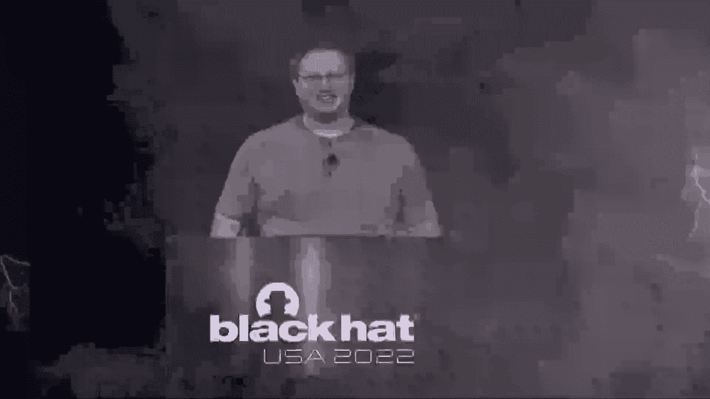

所以我进入Infosec密码作为密码破解器，那你知道我是个密码学爱好者，他们一直由密码管理器赞助，我你知道我就像啊，也许我应该看看，对不起，我只能听到我的抱歉，所以我开始发现所有这些虫子。

这是我第一次真正审计任何东西，你知道就像一个，无论如何，所以有降级攻击之类的，然后我看了看其他的，他们有类似的虫子什么的，基本上我决定怎么做一个，然后这基本上就是那个旅程，我打破了。

我真的不知道该怎么说，我想这就像拉丁语，所以就像签证一样，然后我打破了Maqua原始版本的代表团，但那是固定的，键拉伸，你知道的，密码，关键交换，所以关键拉伸，这通常是为了，你知道，密码。

所以散列将用于身份验证，所以当你登录网站时，你知道他们会破坏你的密码，在数据库中查找，然后呢，看看对不对，然后密码KDF，那就是生成一个密钥，通常用于加密或算法，喜欢图片，你还可以用钥匙伸展做另一件事。

就是指纹，一个例子是信号安全号码，他们生成了一个30位，三十位十进制数字，基本上是一百位，他们想把它扩大到112，为什么你要用钥匙伸展密码，这基本上就是我要谈论的，但实际上麦迪逊，有一个漏洞。

b地窖费用12英镑，那些真的真的很好，钥匙拉伸，他们真的很慢，它是，你知道吗，每秒一百次稍微超过一百次哈希，你可以在GPU上做的，所以如果你猜到一个密码，例如针对数据库中所有密码散列的密码。

要花90个GPU小时才能猜到，嗯，他们还储存了盐盒，麻木不仁的MD五个哈希旁边，有一千五百万个，然后当它被一个，其中1100万个在十天内被破解，你知道吗，MD5非常快所以，他们所要做的就是运行它。

你知道吗，弄清楚在那十天里那些通行证是怎么回事，其中73%是坏的，所以说，计算上的困难，基本上就是做了多少功，所以你做的一些哈希块，有并行和顺序，作为一个攻击者，你只关心做了多少工作，作为一个捍卫者。

你只关心花多长时间，所以说，如果你有一台多核的电脑，具体，呃，称为SIM D的CPU指令，单指令，然后可以运行的多个数据，你知道的，一百个平行的哈希，第一个你能做到的会更难，在短时间内，记忆困难。

这些强大的方式是被使用的内存量，限制GPU上可以使用的线程数，所以当你使用更多的内存，GPU不能使用那么多线程，也像消耗了多少带宽，因为Gpus有很多CPU CR的带宽，这些强大的方式是而不是带宽。

它是事务的数量，所以在GPU上，带宽，公共汽车的尺寸相当大，并使用缓存算法，你只用了其中的一小部分，所以你读数就像一个64位随机，64位整数，然后用一个非常快的操作绑定所有这些，比如add和xor。

平行PB KDF，我以后再谈这个，PB KDF 2B地窖，那是算法，我昨天在B面做了一个演讲，嗯记忆困难，你知道的，氩二号，基本上，如果你在做一个关键的拉伸算法，如果你按照这三个步骤。

还有内存硬件的可选步骤，您对所有输入进行散列，你知道吗，密码，盐，什么不是，那你就用那颗种子工作，你生成工作，一种叫做工作的价值，然后用kdf把它拉伸成你想要的大小，如果你不这样做，这些算法。

不要遵循那三个步骤，上面有简历，当我想出这三个步骤的时候，与这些算法相比，这是非常新的，这些是，那是因为CV是因为一个实现bug，默默解密，截断到72字节，这是英国政府警方网络警报的代码。

我其实不知道那是什么，但是推特上的保罗·摩尔，在推特上发布了这件事。

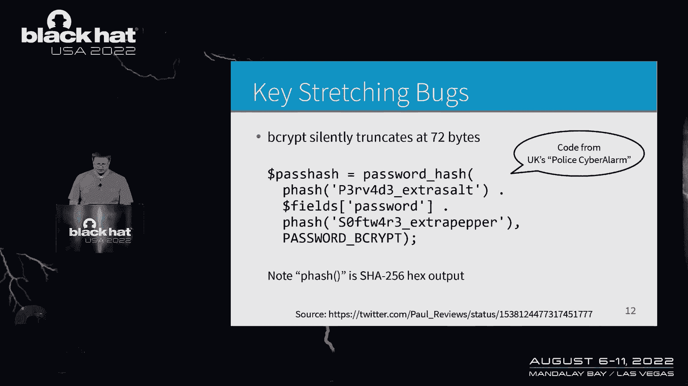

p哈希，即64字节，所以它只给你的密码留下八个字节，有一个简单的解决办法，如果你真的把所有这些都和密码一起散列，那么你知道这实际上接近于你应该用解密做的事情，您想用HMac对密码进行散列。

所以你可以用一个胡椒作为关键，然后消息是密码，然后把它放进去，然后你想吃ASCI。

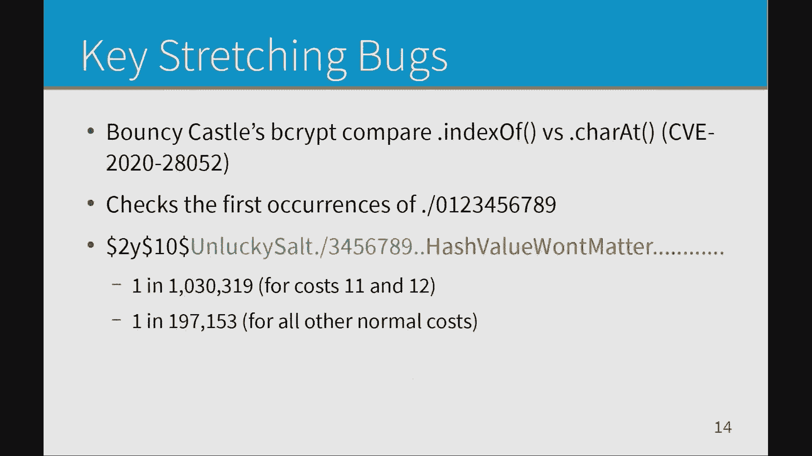

即使你遵循了所有的步骤，仍然会有bug发生，这是有弹性的麻烦，它只检查这些字符的第一次出现，你知道他们中的一些人在开始，你有可能得到一个不幸的哈希，任意密码匹配的位置，所以当窃听器出来时。

我计算了这些概率，我还没有仔细检查过，但我很肯定他们是对的，做重点拉伸，所以这是三个步骤，我已经把可选的东西去掉了，你可能会看到，做工作，想着那里缺少了很多东西，那么你会怎么画一个猫头鹰迷因，你知道的。

所以这是PB KDF二号，实际上有两个问题。

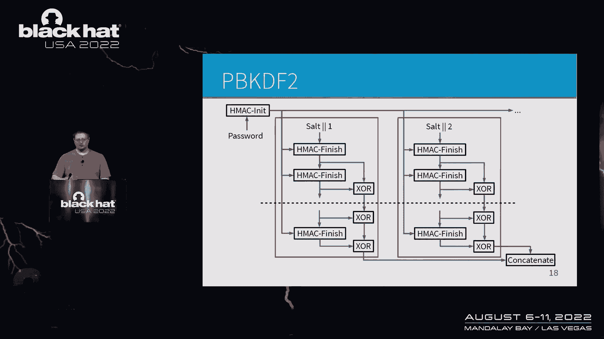

嗯，你知道按照这三个步骤，所以如果你不做HMAC初始化和HMAC完成，如果你只做HMAC，所有的HMAX饰面都在哪里，你会有你作为捍卫者，你会做两倍的工作，但如果有人回答了一个非常非常长的密码。

你每次都要把它搞砸，你可以，这将是一个DOS，其中一份简历基本上是，嗯，还有红色的盒子，所以你在做，如果你要求PB KF 2的更多输出，你做的工作越来越多，但你可以用它，就像你可以用脚枪做算法一样。

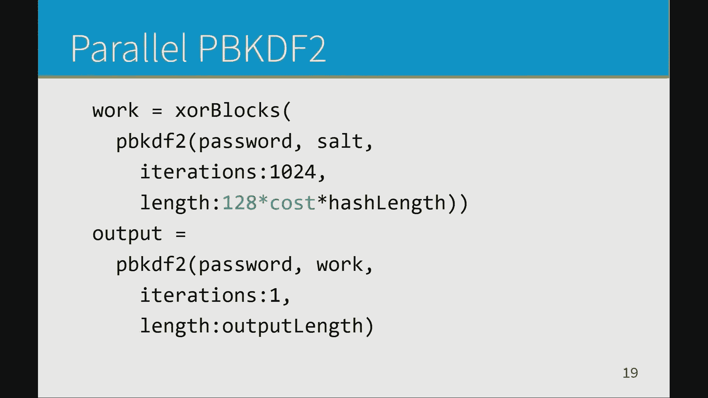

这是我想出的平行的东西，PKDF 2，嗯，基本上你只要求一个大的产量，然后你把所有这些块放在一起，然后你把它变成pf2来拉伸它的长度，你想要，雾应该喜欢快车道一些，你知道三个中的PBK D。

那是类似的东西，因为目前他们建议PBKDF二或气球散列，但是气球散列实际上没有，这只是一个想法，之类的东西，你要确保攻击者得到的少于一万，每GPU每秒猜测，杰里米·戈西是被引用说这句话的人。

在你知道一个漏洞之后，密码哈希是这样的，当时最快的GPU不到一万，他说那是相当慢的，然后我用了那个，然后改变GPU的定义，表示最适合密码破解，所以最大值，这些非常依赖于您的硬件是什么，所以说。

如果你基本上不想花太多时间或太多内存，如果您正在进行服务器身份验证，你知道散列，嗯，您希望确保您的吞吐量是您想要的，既然那些都像，你知道，取决于您的硬件，我只想谈谈最低限度，因为嗯，比较容易，你知道。

给出最小值，所以BS地窖，正如我所说，这是，我在，这些实际上是非常快的，你可以走得更高，这些就像毫秒的运行时。

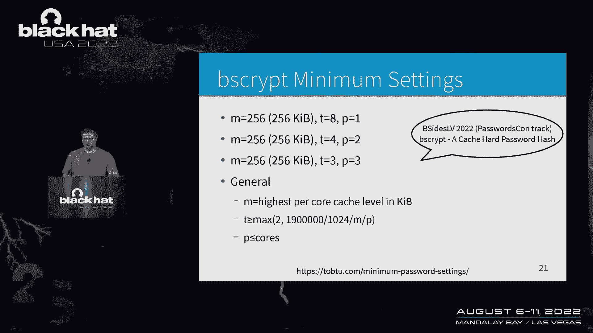

所以有一点，九百万，我应该强调一封信，嗯，所以基本上总的来说，你想用最高的，然后进行多次迭代，这不是基于当前GPU获得的内存事务数吗，b地窖，最少的目击是非常简单的。

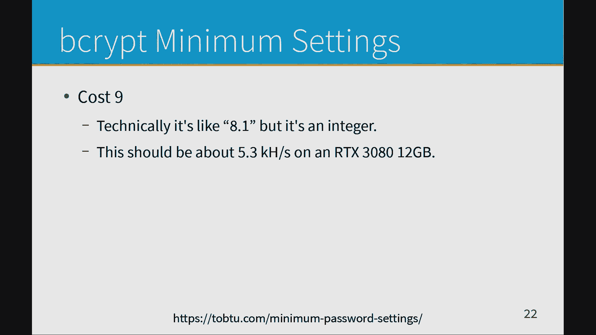

技术上花了九个，因为Becrypt处理成本的方式，它是指数级的，所以严格来说是八点一，但你知道你必须输入一个整数，哦，屏幕底部的链接，那是我的网页，我会更新它，你知道的，现行建议，嗯。

制作的人会发出RFC，所以这些是他们给出的设置，你知道的，基本上你知道，两场演出，一次迭代，64兆三次迭代，你知道，非常相似，开玩笑的啦，那些完全不同，嗯，我使用的密码管理器，钥匙通行证，嗯。

他们甚至不允许你做两场演出，所以这些是我的最低要求，嗯，这些是基于当前GPU的内存带宽，基本上没有什么好的基准。

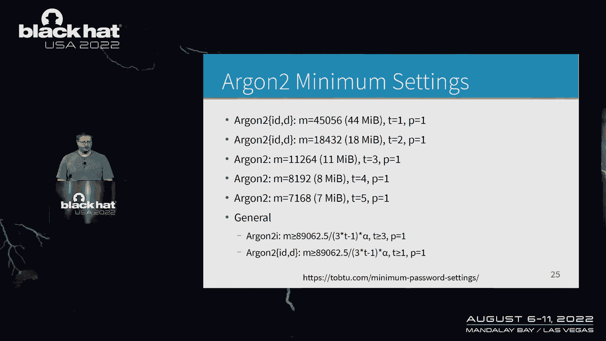

用于密码破解，的，所以如果你看看一般的公式，a变量，实际可消耗的内存带宽百分比，这取决于你知道多少内存，内存设置，它是，你知道的，假设，六十四毫克，当你翻倍时，它会开始下降，记忆。

一个GPU的速度会在四分之一内降低，因为它用一半的线程做了两倍的工作，所以群体最小值，同样的事情，它是基于内存带宽。

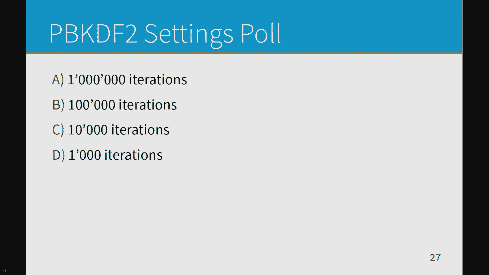

你不必回答，就这么想PBK D F两个脉冲设置，你觉得一个很高的数字是什么，你知道，就像一个很好的数字，你认为行业标准会是什么，这是我的最低要求，有一些，所以这取决于你实际使用的哈希算法，所以说。

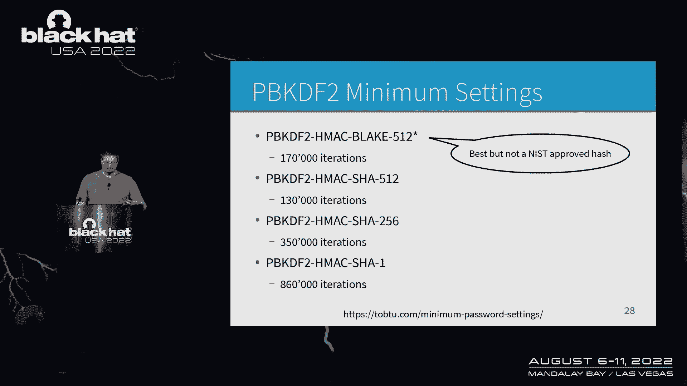

你知道的，shell one在GPU上非常快，所以那更高，从技术上讲，Blake 5 12是最好的算法，因为有内部的并行性，所以作为一个防守者，你可以用一些d指令，单指令，多重数据。

所以它的速度会更快但作为防御者它的速度和其他防御者一样快，所以平行PKDF 2。

简单的事，你知道的，成本三成本一，每项成本相当于，你知道，超过10万次迭代，是啊，是啊，因此您可以使用这些进行密码身份验证，所以当你登录网站时，嗯，你知道，而不是给你密码，进行此密钥交换，然后有一堆。

几年前，一群公司发现他们无意中记录了密码，所以如果他们切换到密码，kdf，即使他们记录了所有这些信息，你知道里面没有什么重要的东西，所以您也可以使用peg来建立一个，呃，加密隧道，呃。

你可以使用一个神奇的虫洞来发送文件或战斗，呃，所以如果你听说过滚开，可能会是，也许不是scram的问题，你必须在加密频道上，因为任何看到这些信息的人，如果他们看到一个成功的，你知道吗。

登录这些消息相当于密码哈希，所以在伐木的情况下，您将记录密码哈希值，那些是点对点的，所以你知道一个人在一边输入密码，另一个人在另一个人身上键入密码，那些是客户机服务器，不要称这些对称不对称。

一个原因是不对称和对称的密码学，但也暗示只有两个，所以两种不同类型的猪加倍增强，这是迈克·汉堡的一封很长的电子邮件，在最后他，你知道吗，就像在一个非常短的，就像句子提到它可以加倍增强，你知道。

几年前他说他不知道，就像一个很好的方式，你知道，什么可以用几年，我找到了完美的，你知道，匹配它，也就是WiFi，所以基本上你的门铃和接入点，你的门铃将是一个具有，基本上，你不希望有人闯进你的门铃。

然后能够使用存储在上面的信息来旋转AP，然后用双倍增强的PE攻击您的网络，门铃不会有任何必要的信息来建立一个接入点，嗯，然后一个身份选择，这是，你知道的，基本上每个人都有身份角色和权限之类的。

很适合这一点，所以山峰的层次结构，基本上如果你需要一个平衡的选择。

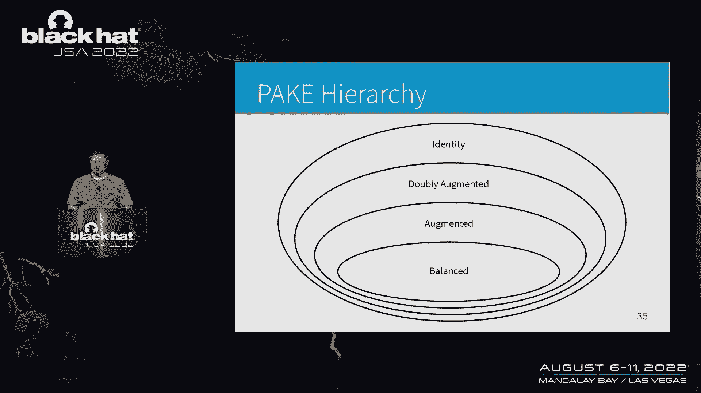

从技术上来说，你可以使用这些中的任何一个，嗯，但你知道一个，有更多的工作，但如果你需要一个双重增强的选择，然后你可以使用它或身份选择，但没有别的。

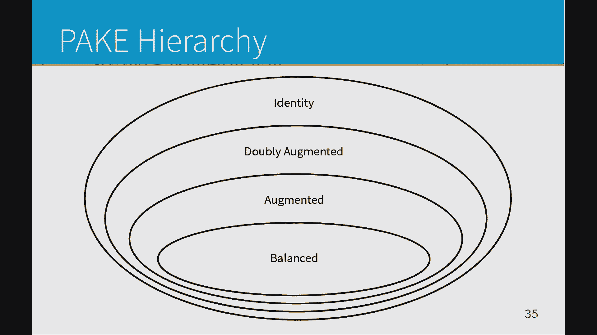

身份选择中的平衡，那些是，你知道的更多，你知道，对等，或者可以像，在类似物联网的情况下，你知道设备在互相交谈，然后扩大和加倍扩大，那些是更多的客户端服务器，的，基本上没有人参与。

然后底部的两个是两台计算机可以相互交谈或设备，你们的蛋糕是怎么做的，这是标准的迪菲·赫尔曼，你让爱丽丝和鲍勃互相交谈，所以它们都生成一个随机的私钥，然后进行标量点乘法以创建公钥，然后他们交换它们。

然后他们将自己的私钥应用于对方的公钥，然后他们得到一个某人，那些应该是一样的，除非有人在中间这种联系，所以。

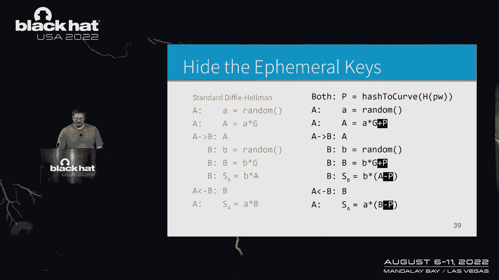

你可以用山峰做的是，您可以隐藏正在交换的临时密钥，所以一种方法是你把密码，你把它捣碎，然后你把它通过这个叫做哈希曲线的函数，它的作用是它不同于标量点，乘法运算，给它密码的哈希值，你不知道私钥。

基本上它就生成了这个点，密码点，我就叫它，因此，当您生成临时密钥时，你只要把它，将该点添加到临时密钥中，然后交换那个，然后你用减法把它去掉，然后应用您的私钥，然后s sa和sb应该是一样的。

假设你知道密码是正确的，另一种方法是隐藏生成器，所以你用哈希曲线做同样的事情，但不是使用标准发电机，使用密码点作为生成器，所以专利在二十七年到期了，所以我们现在可以用这个，这是很好的。

因为这是最简单的方法，因为它只是DIY赫尔曼，也不需要依赖密码加减法，所以用OPF遗忘pserandom函数隐藏所有，基本上你做的事情和你做的事情一样，哈希曲线与您的密码和东西。

然后你用一个随机值蒙蔽它，然后你把它发送到服务器，他们像私钥一样使用盐，然后他们把它发回给你，然后用标量点解盲，他们的标量反转，然后标量点乘法，基本上盲盐就是我所说的等于盐的时间，密码点。

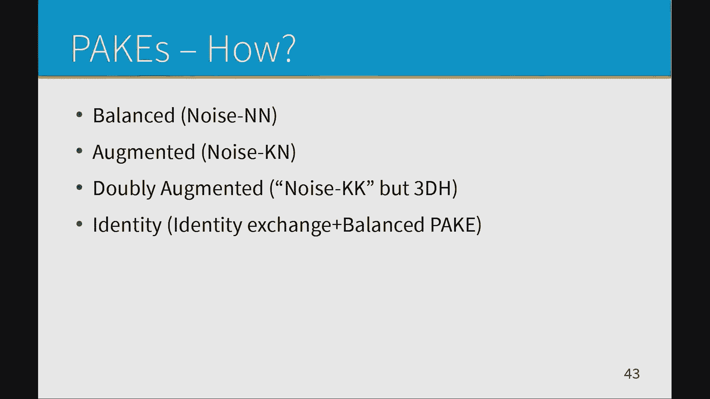

服务器不知道这一点是什么，你不知道什么是盐，嗯，那么这些选择基本上是如何工作的呢，嗯，它基本上就像一种不同类型的密钥交换，n表示没有静态键，K是对方知道什么是静态密钥，你的静态键是什么。

第一个字母是发起者，第二个是接收器如此平衡，是啊，是啊，平衡，所以这些幻灯片上的所有箭头都是DIY的，埃尔曼如此短暂的钥匙到野性的钥匙平衡，静态键，短暂的到短暂的到热的，无论如何，所以三个D H。

所以这些是一个，他们的颜色是由他们隐藏的东西决定的，旁边有红星的，那些也把盐藏起来了，是啊，是啊，所以身份选择，那些你他们不是有色人种，因为那些实际上只是用一个平衡的选择，所以它们的颜色会来自。

或者你知道，就像他们隐藏的东西，你用的平衡镐，所以有一种纸做薯条和脆皮，他们说克里斯，基本上保护了盐，嗯，嗯是的，所以基本上，而不是在运行密码前保护它，KDF是，你必须运行，这是一个更昂贵的密钥交换。

您每次都必须运行，所以我想出了薯条，因为克里斯·奇普，酥炸，基本上它只是呃芯片，但你知道有一个F，这确实扰乱了他们的设置工作方式，这是个玩笑，呃，所以选择属性，嗯，前向保密。

基本上每一条梭子鱼都有防止预先计算的功能，这就是保护盐，嗯，你能把音乐关小一点吗，谢谢。u，基本上它的作用是，它保护了盐，所以当你如此，它可以防止这种攻击，在其中运行密码，kdf。

在你闯入服务器之前用不同的密码多次，然后当你真正闯入服务器时，然后你可以立即或立即检查所有这些密码，这么脆，嗯，密钥交换在，你知道大约四毫秒，这实际上不是一个好财产，因为你的，你知道吗。

IoT设备每次都必须运行该算法，如果你是个中等男人，因为您和服务器之间没有预共享密钥，你知道有人可以进来，然后你知道，中间的人抓住所有的信息，然后稍后当你尝试进入实际的服务器时，你会注意到它不起作用。

呃，量子烦人这是我想出来的一个术语，嗯，有一篇论文试图正式定义它，他们在PQ加密做了一次演讲，所以量子烦人的是，你必须打破一个，您必须为每个密码解决一个DLP，我想是的你，所以当您看到成功的密钥交换时。

嗯，如果你有一台量子计算机，您必须为每个密码解决一个DLP，我猜基本上是脆弱的，那就是算法的所有安全性都依赖于静态Dielman，静态差异，海伦·甲骨文和旅行次数，第三节第四节，显然三个更好。

所以当我创造这个词时，我真的不知道有人知道这处房产，我看报纸的时候就这么说，我注意到这句话，你知道我不会读的，但后来他们引用了EKE的论文，基本上说了同样的话，一个量子烦人，这是一个非常好的属性。

让你知道未来，你知道的，假设你知道如果量子计算机真的出现了，这些会，量子烦人的拍摄基本上是量子计算机问世之间的一个间隙，当你不得不，对于不透明的情况，如果因为它很脆弱，嗯，量子计算机一出来，每一个密码。

用GPU之类的东西破解经典计算机，c配速，做一条平衡的梭子鱼，您没有预先计算或安全注册，因为没有任何，B说第一个不透明的三个DH基本上，哦嘿，你可以看到绿色好吧，所以说，绿色，这些只是额外的操作。

所以它们的速度相当相似，嗯，基本上每次你做标量点乘法，嗯，然后你必须做一个场反转，有点贵，但没有你知道的标量乘法多，但好的是，您实际上可以将多个字段反转组合成一个，那真是。

如果你想知道为什么眼睛比标量乘法少，哦，我把他们和OPF分开了，钥匙交换，无论如何，所以如果你要实施任何拍摄，你应该使用这样的API，在其中初始化所有信息，得到秘密什么的，然后嗯返回一条消息。

或者你应该是第一个收到信息的人，这样就不会有消息了，然后当你收到消息时，您将其发送到一个函数中，然后该函数返回下一条消息，如果有下一条消息和状态，原因是，我见过很多SRP 6A的实现，他们只是说。

计算a，计算m，他们就像他们一样，哦，开发人员会知道这意味着什么，所以这样就很难滥用API，然后你会希望能够得到，你知道这个秘密存储在服务器上，存储的秘密，你知道的，增强图片，然后如果你要做。

使用密码进行身份验证和加密，嗯，您需要一个基于密码返回密钥的API函数，这是为了让您只运行密码，密码KDF一次，并生成一个用于派克的密钥和一个用于加密的密钥，所以小抄，2。据我判断，这些都是正确答案。

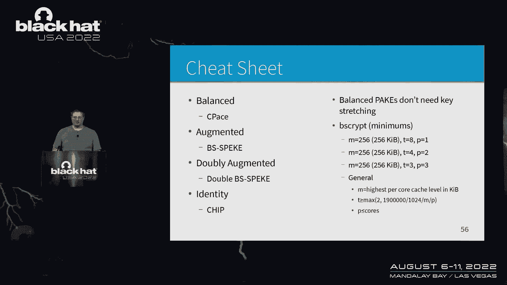

所以说，所以说，双bsp，呃，这些实际上是我想出的算法，嗯，基本上你知道它只是把发电机藏起来，把盐藏起来，你知道噪音kn然后噪音kk，嗯，三个D H，然后使用芯片，如果你需要一个身份，采摘。

所以平衡的山峰不需要关键的伸展，我只是想起来我忘了提到平衡的照片和WiFi，所以WiFi联盟，他们选择了一座当时已经被打破的山峰，那个峰是一个平衡的峰，然后他们实际上将密码存储在访问点和设备上。

而不是用双增的长矛，嗯。

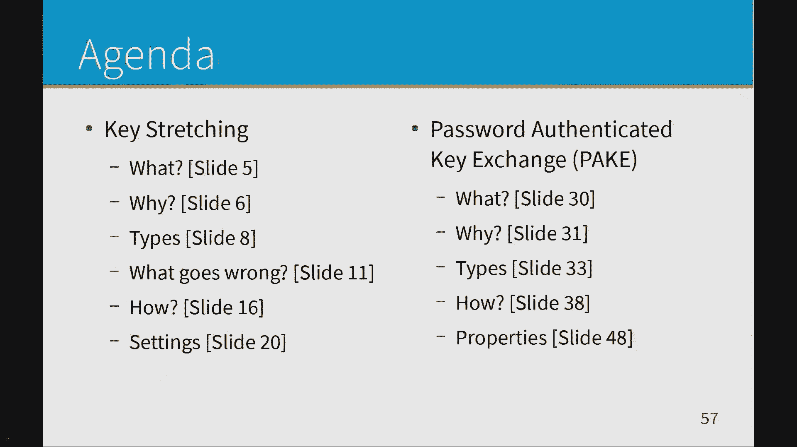

我确实有额外的幻灯片和参考资料，但如果有人有问题。

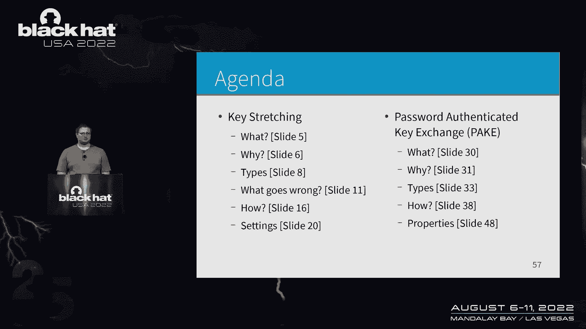

以下是虚拟的问题，你想要奖金幻灯片吗。

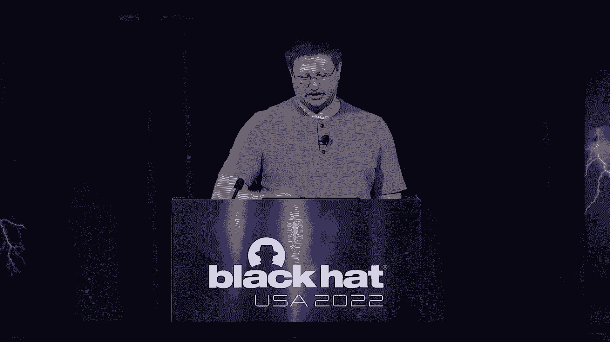

服务器检查验证，所以算法的整个上半部分是，我在GitHub上有一个要点，但基本上你知道穿过长矛，然后这是在服务器检查客户端验证器的地方，它生成，你知道另一个验证者，会话密钥。

会话密钥加密reg和reg max，所以Reg是注册期间使用的短暂私钥，然后Reg Max是，公钥注册表的Mac，因此，与会话一起设置的服务器加密将其发送过来，然后客户机检查服务验证器是否正确。

你知道的，然后创建会话密钥，然后在短暂的时间内解密私钥，注册时的私钥，和，所有的权利，所以从密码生成的Mac密钥。

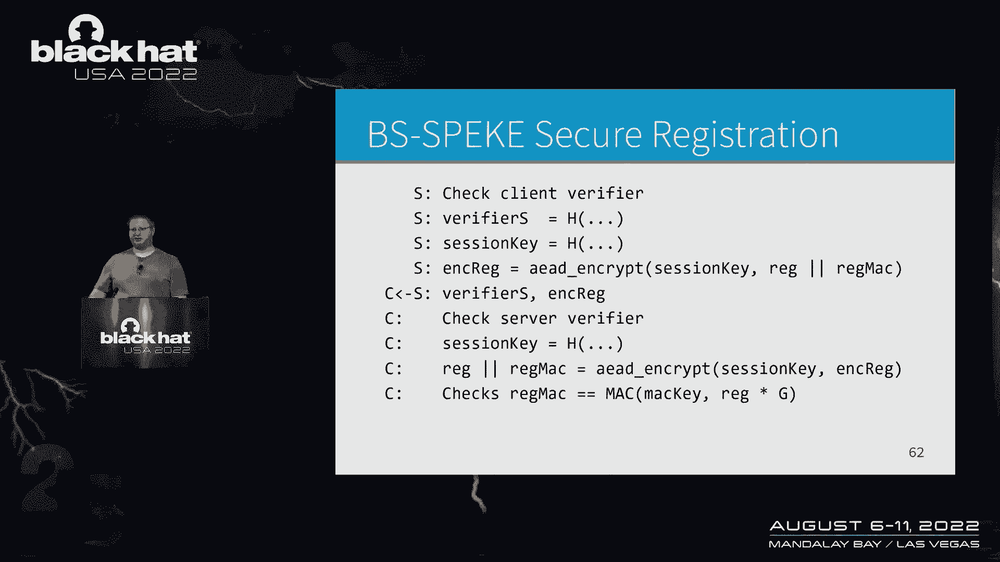

所以当你运行密码时，kdf，你输出一堆东西，其中之一是Mac键，所以Mac密钥被用来签署公钥，或不对公钥进行签名哈希，你知道所以，如果失败了，那就意味着你在登记的时候是中间的一个人，不再是中间的人。

所以你可以检测到什么时候发生的，所以bcrypt，这些都是我演讲中有趣的幻灯片，但是第一张信息幻灯片，所以嗯。

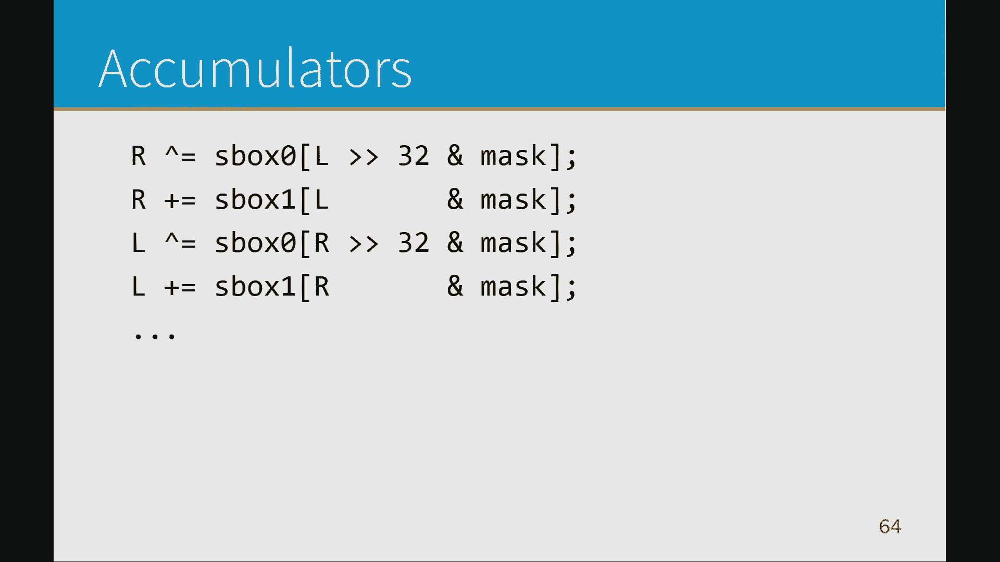

所以它的工作方式是缓存他们使用的硬算法，它们的缓存硬度来自，然后你做的每一个手术都是，添加x或添加xor so，我拿了两个这样的盒子，我做的有趣的事情是这些盒子是重叠的，所以说。

S的盒子需要是一个很好的二进制数，这些也是，但是因为它们是重叠的，你可以买到任何尺寸的，的箱子，所以这是，这是我在笔记本电脑上做的一个基准，这些设置是，这样对于GPU攻击者来说，它们都是一样的。

因为Becrypt是一个你没有太多回旋余地的地方，因为它是，你知道，这是九英镑的，你知道，下一个就像两倍的硬或者，所有这些设置的算法，那些对他们来说都是一样的，作为一个防守者，他们不会在乎，你知道吗。

您可以在bcrypt上花费四毫秒，或者在PB上将近800毫秒，kdf，两枪，二五，六，这是速度，这是一台台式电脑，我用不同数量的线程在基准测试中运行，嗯，所以这是最小设置，基本上需要一到两毫秒。

真的真的很快，哦所以，你可以在100毫秒内得到这些，如果你熟悉becrypt，15英镑的费用高得离谱，而且需要很长时间，夹具，标量反转，所以你知道你做了一些事情。

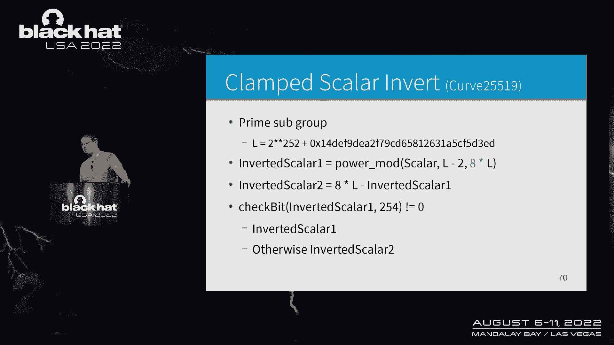

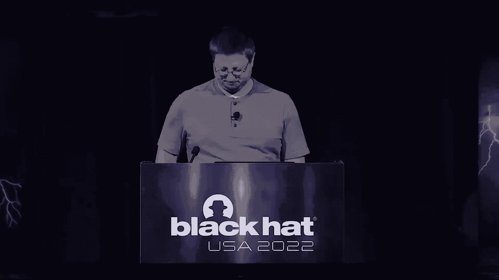