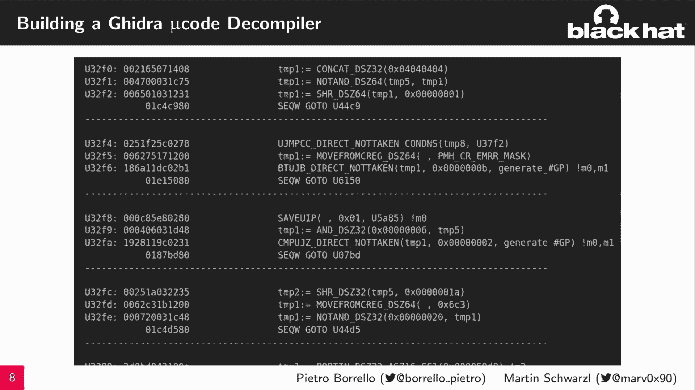
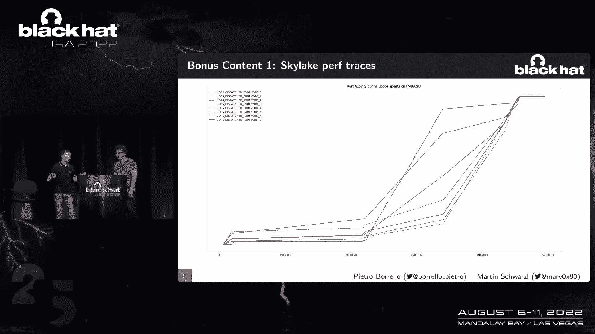

# P78：089 - Custom Processing Unit： Tracing and Patching Intel Atom Microcode - 坤坤武特 - BV1WK41167dt

现在我很荣幸地欢迎大家上台，皮埃特罗和马丁，施瓦策尔，谢谢你这么好的介绍，嗨，欢迎来到这里，谈论自定义处理单元跟踪和修补到微码中。

我是马丁，我是佩德罗，所以今天我们将向您展示第一个用于CPU微码的静态和动态分析框架，都是通过软件完成的，是啊，是啊，所以我们现在给大家一个简短的轮廓，所以我们首先对CPU微码进行深入研究。

尤其是在微码上，然后我们将向您展示第一个用于微码的静态和分析软件框架，然后基于这个，我们将向您展示如何使用该框架对微码更新算法进行反向工程，然后我们会得到一些额外的内容，所以首先免责声明。

这是基于我们对CPU微码的理解，所以理论上这可能是错误的，但在实践中，我们会看到很多似乎是正确的，但在我们进入深潜之前，我们将深入了解CPU是如何工作的，所以在大学里，大多数人知道你有这样的获取解码。

执行右后步，是的，是的，基本上我们可以从这个高层视图中看到它，有一个前端在做获取和解码阶段，然后是坏掉的引擎，在中间的某个地方有一个内存子系统，他们试图在那里加快事情的速度，使用缓存和所有这些东西。

是呀，但事情没那么简单，很明显，这些指令希望得到有效的执行，它们被翻译成微操作，好吧，大多数都是非常简单的说明，所以他们有一两个微操作，比如想想如果你访问内存，或者你应该想注册，比如说。

但就像有些指令需要一些更复杂的逻辑，比如CPU ID，你有多个叶子，你有条件的执行，基于你所做的输入，所以有一个叫做微码测序器的组件，比如发出一个微操作流，实现复杂指令的逻辑，在我们深入研究之前。

我们得谈谈初步的事情，这是积极技术的红色解锁发现，来自Maryaolov和他的团队，所以他们基本上在M引擎中发现了一个漏洞，他们基本上设法阅读了，解锁CPU进入特殊状态，这样他们就可以调试它。

读出特殊的缓冲区，比如缓存或分段缓冲区，在此基础上他们成功地提取并反向工程了Golu代码格式，他们为此提出了一个拆卸方案，并基于逆向工程，他们发现了新的无证指令，这基本上允许它控制对内部缓冲区的访问。

是呀，但我想知道根据这项工作我们能做什么，我们首先要了解，就像，点赞的微信是怎么工作的，我们说的是你喜欢的这个MacSequencer，让我们假设你有一个指令，就像需要一系列微操作的CPI。

你有一个翻译表，指令在那里匹配，您将从，CPU将接收微指令并执行它们来实现复杂的逻辑，微指令就像组织三合会，每一个三和弦都是与之相关的序列词，就像一个序列，可能会影响微操作过程中的一些同步。

像精灵一样思考，喜欢的东西，甚至控制台流，所以很明显，如果是这样，我们有一个角色，CPU代码将被修复，如果你想修补一些bug呢，就像史诗般的点击，比如说，你必须修复它所以中央处理器也支持周围，呃。

就像一种内在记忆，你可以在那里编辑和修补麦克风，但是如何在这两个内部缓冲区之间传递，有一个名为匹配补丁的组件，每次执行指令时，如果指令是像程序一样跳到RAM，匹配的补丁将把轮廓流重定向到RAM。

并执行在那里打补丁的新指令，所以现在我设法调查了拆卸，我发现这些黑社会零管理，所以我们有这三个操作，第四个总是一个旋钮操作，然后我们有你提到的序列词，它们基本上是关于当前微码指令的属性，但如果你看看。

就像，是啊，是啊，你不能真的读到，所以我们显然使用反汇编器，然后我们看到微码的结构类似于x86，是啊，是啊，真的很像，所以你有分支指令，你有内部临时登记册和蓝色的东西，如果你看到他们，有这些序列词指令。

所以在那里，例如，最后一行显示下一条微码指令是，每一个单词都与你有的三个微指令相关联，但如果我们看看微码，我们可以看到这是高度优化的，所以在CPU中。

我们有一个小缓冲区，我们必须把你想要使用的所有说明打包，实现您想要在那里微编码的功能，所以MacBook高度纠结，您有多个函数之间共享的代码块，所以很难分析它，我是说如果能从更高的角度看到微代码会很酷。

但不幸的是，它喜欢在编译器，比如说，因为这并不存在。

因为它就像没有证件一样，所以我们带了一个，所以你看这里，这是一个gidecpiler，它其实看起来很酷，例如，您可以看到RC四解密功能，就是后面，正如我们将在更新算法中显示的那样。

你清楚地看到这就像漂亮的C代码，你可以在上面工作，用它开始你的逆向工程，所以当我经历这整件事的时候，我看到有一种特殊的互动，总是带有一定的成分，这个叫Cr bayes，所以为了更好地理解。

就像你这样做的时候，我们必须了解当前的寄存器总线是什么，这就像CPU用来与内部组件交互的总线，例如，就像MSRS映射到这里，总线地址，他们中的一些人实际上。

也像控制状态寄存器一样有效地就像今年公共汽车上的地址一样，CPU访问它们以实现您想要的功能，类系统管理模式配置映射到球体，但是系统管理模式就像这个戒指，CPU中减去两个mod。

这就像真的锁住了你永远不应该访问它，配置是在今年的公共汽车上，也喜欢有趣的样子，L点映射到您的总线中，那又怎样，什么是长老，所以我猜，是啊，是啊，所以长老是一个非常有趣的组件，就像英特尔CPU用于。

比如硅验证后，这是一个可以访问，就像CPU的所有内部缓冲区一样，让我们想想，比如说，TB或加载和存储缓冲区，所以通过L，你可以检查这个组件是否真的工作，哇太棒了，所以是的，也例如。

你一整年都可以使用微型测序器，到L点，所以你已经提到的微码序列，那么它到底是怎么做的呢，是啊，是啊，就像我们说的，多序列是访问CPU中微代码的组件，对罗姆和公羊，有趣的是，访问是一种权利。

对RAM的访问，所以利用微型定序器，您可以访问微代码并修改它，所以在这里我想说，让我们有一个想法，我们知道L点可以访问微测序器，可以通过你的公共汽车进入的L，所以如果我们现在访问CR总线。

我们基本上可以控制微码，是呀，基本上，如果你能访问这个你的总线，然后你有微软的控制，好的，但我们还需要一个积木，哦耶，所以你说的是我们的，我实际上是在说这些无证指令，所以让我们来看看这些是如何工作的。

以及我们可以用它们访问什么，是啊，是啊，就像积极技术的发现之一，这种扩大的破坏的存在，它可以访问CPU的一些内部组件，在那些人中，纯粹的公共汽车棒极了，所以我们也有我们的原始，所以是的。

我们可以利用这个原始，作为访问红色和锁定CPU的SEBUS的一种简单方法，就像政府一样，但问题是没关系，但我们能用这个做什么，我们如何访问L喜欢，它是如何工作的，这里就像我们的，编译器很方便。

因为我们可以分析这个U用这个做什么，你的巴士进入L点，修改微型测序器，然后复制是的，我们知道人们知道怎么做，所以我们可以做同样的事情，我们可以简单地定义这个，在那里你可以访问微型测序器，和，比如说。

用这些包装纸，只需复制CPU正在做的事情，并访问类似的L端口，你可以点赞，访问微码，访问序列世界，甚至匹配的补丁，是啊，是啊，所以我们有任意的读写，你已经提到了匹配补丁机制，所以我们在考虑，就像。

可能在类似的程度上，就像你说的软件挂钩，就像我想覆盖这个函数，并指向将其重定向到另一个，所以在微观上真的那么简单吗，是啊，是啊，所以我们仍然可以利用编译器，了解这是如何使用匹配的修补程序和设备的。

就像CPU用来，喜欢程序这个匹配的哎哟，所以每次我们想钩东西或修补东西的时候，我们可以将匹配的地址编程并修补到，只要跳转到我们想要的指令，如果我们把它总结一下，这就像我可以钩住微码。

用我的ON代码更新并覆盖它，所以现在是超级定制的，是呀，这给我们的框架带来了，我们可以利用这个未记录的工具，通过软件给微码打补丁，这使得我们可以完全观察CPU的行为，也是为了完全控制他们的行为。

所有这些都是通过软件来实现的，比如定制偏见，像UFI应用程序或内核模块，所以总结一下框架，我想我们现在可以修补代码了，我们可以钩住代码，运行我们自己的自定义代码，我想我们甚至可以做得更对，我们就可以把。

我们可以追踪代码，我们将看到如何，但让我们首先从修补代码开始，所以你有补丁，我们可以改变CPU的行为，并注意到通常只有英特尔被允许这样做，因为微软的补丁是签名的，你不应该加载你的补丁，但是用我们的框架。

我们可以注入微软补丁来彻底改变CPU的行为，就像我们可以用这个改变微编码指令一样，甚至为CPU添加功能，所以也许我们后退一步，我想现在这里太复杂了，让我们做一个简单的程序。

也许像微码中的Hello Work这样的东西，是呀，所以让我给你介绍第一个微型，但他的话，所以我在想我们能用一个L字做什么，让我们选择毁灭的艺术，比如说，所以Aron应该为你提供一个密码学上的强随机数。

所以让我们拼出一些密码学家，让我们让它回来，Hello World与我们的框架，你可以选择我们想吃什么来钩住，然后你想跳到哪里去听指令，你可以看到那里。

我们有两个微操作将hello world加载到寄存器，这样你就不会有随机数，但你好，世界在那里，然后你只要和指令流告诉它你没事，你完蛋了，我想你漏了一点，我们需要把这些东西组装起来，是呀。

所以我们带来了微码的汇编器，这样我们的框架就可以从微码的文本表示中翻译出来，你需要对微测序器做的交互，实际上微码，所以我们组装微码，把它写到我们在本例中设置的地址7 0 0。

这就像Yugo DRAM的起始地址一样，然后我们把蘑菇地搭起来，所以每次你执行r，你实际上返回一个词，所以我认为这个例子很好用，但我想这里的人想看到更多的东西，这是对的，是啊，是啊，它是，是啊，是啊。

所以让我们做一些更有趣的事情，我们可以好的，我们知道我们的转弯就像随机数据，所以让我们改变这个，我不喜欢随机数据，我想看看有趣的东西，所以让我们让卡迪恩返回系统管理模式内存。

所以一种系统管理模式是CPU中的网箱环境，就像这个戒指减去两个月，你显然不应该访问它，但是我们可以改变alan指令的微码，只加载sm mm地址，比如说，如果你现在从这里读到会发生什么，所以耶。

这就像一个笼子里的记忆，所以如果你这样做，你会读到一堆F，如果您访问，例如，来自飞地外部的飞地内存，U保护，对不起，亩地保护着那个地区。因此您将无法访问它，但我们在显微镜下，所以我们可以改变这一点。

利用我们的框架，我们可以了解SM ROM的配置在SEBUS中的位置，实际上把它归零，这样这个sm roi就不会再受到保护了，是呀，但后来你弄坏了CPU，对呀，是啊，是啊，所以CPU不会对此感到高兴。

因为你喜欢禁用mm，因此您可以保存和还原MM配置，但就在你把它扔掉之后，哦，那真是太好了，所以我想人们可能不相信我们，所以让我们给他们看一个演示。

是啊，是啊，就像让我们展示一些很酷的东西，所以这里，例如，我们在UFI应用程序中有一个简单的程序，你就像ARA一样倾倒，和其他类似的是这里随机数据的结果，但我们可以用补丁对CPU进行编程来改变它。

实际上返回L个单词，因此，用我们的CPU框架和我们的自定义处理单元框架，我们钩住补丁，下次你执行我们的运行时，你有我的话，这是超级酷，以及关于系统管理，是呀，所以让我们去那里更酷的东西，是啊，是啊。

我们仍然有一个简单的程序，一堆充满亚伦内容的缓冲区，这显然是随机的，因为我们后来的返回是随机的，但让我们涂上我们的补丁，你以前看到的补丁只是修改成转储不同的地址，不仅仅是一个，我们可以用我们的补丁。

下次我们执行转储内存的程序时，您实际上转储了系统管理模式内存，你可以在那里看到系统管理模式的头，哦耶，太厉害了，走得更远，所以现在我们可以做更多的事情，你已经提过了。

如果我们现在设置这个匹配和补丁机制会发生什么。

并在某些事件中执行自定义微码，对呀，是啊，是啊，我们继续行刑，我们基本上不需要修补东西，但我们实际上发现了一些关于它的东西，是啊，是啊，所以我们不必喜欢，在他们查看后停止指令，您可以简单地继续执行。

这就带来了微码钩子，在那里您可以执行更多的代码并扩展某些东西的功能，或者例如，观察事物，所以在执行指令之后，如果你像，你甚至不会注意到你会喜欢劫持，例如，这里我们可以喜欢，制作我们自己的性能计数器。

所以让我们假设你想在CPU中观察一些东西，但是像这个CPU还不够好，已经有了性能计数器，你想为你设置的，让我们假设你想观察，我不知道，每次执行w提取时，你知道它引入了很多这个指令，就像一个补丁。

就像漏洞一样，可以刷新内部缓冲区，比如说，用于缓解mds，所以也许你想明白，好的，但是好吧，给定一个完整的系统，告诉我你到底做了多少次，我们可以利用我们的钩子钩住，我们要跟踪的指令的入口点。

这样我们就想钩住，然后继续之后，在我们的钩子里，我们可以实现一个简单的计数器，它将被递增，每次执行指令时，因此，您将有效地定义自己的性能计数器，这太棒了，但我想我们甚至可以做得更多，是呀。

我们可以用钩子更聪明，如果我们定义一个钩子，每次它被触发，就像它被触发时转储时间戳一样，然后你可以为CPU中的每一个微操作编程这个钩子，每次执行微操作，您将在执行微操作的地方转储戳，最终。

您将拥有这个钩子触发的所有时间戳，然后你可以重新排序，以便有效地，您可以获得在CPU中执行的微操作的跟踪，这基本上导致微码控制流红色，你很清楚里面发生了什么。

您可以有效地对在CPU中执行的微码进行动态跟踪，所以现在我们有了所有的构建块来查看微码更新例程，是啊，是啊，那么我们能用这些痕迹做什么呢，比如说，我们可以应用这些痕迹，这样你就可以观察到。

使用宏代码所做的一切，我们这样做是为了微更新，所以如果你静态地看MacUpdate，你会发现大量的代码很难进行逆向工程，即使有我们的编译器，但有了痕迹就好多了，因为您可以准确地观察更新中采取的控制流。

所以现在我们可以触发微码更新，例如，然后跟踪是否执行了宏指令，然后重复所有可能的微码指令，然后我们只是恢复秩序，查看时间戳，我们可以确切地看到哪些微软指令被访问。

所以你有效地对Microroupdate算法进行了反向工程英特尔一直对其保密，所以这里我们喜欢，分析宏更新期间发生的事情，微更新通常由明亮的MSR触发，CPU做的第一件事是可以的。

你必须应用更新并加密它，因此它首先将更新移动到一个秘密位置，没有更多的秘密，但就像FVB零一千，比如说，在高盛CPU中，这是一个特殊的物理地址，PU把显微镜更新放在那里。

我们可以看看我们反向工程的MacUpdate的格式，在开始的时候，你有一些数据，公布宏观数据的日期，CPU ID的安全性与数量，然后你有一个修女，我们稍后会重点讨论这个问题，但它习惯了喜欢。

为更新生成解密密钥，然后你就有了错误，签名什么的，这样你就可以像这样，你可以验证MacUpdate实际上来自英特尔，并签署了，所以在任务中发生的第一件事是可以的，你必须检查cnole是否符合你的期望。

所以CPU有一个广泛的模量列表，和他能接受的指数，这样他就知道它没有被篡改，然后你必须生成密钥来解密更新，CPU用两个不同的秘密来做到这一点，一个秘密是节点并嵌入在每一个微型细胞更新中。

每次更新都不一样，那你还有一支秘鲁烟，每个CPU都有这样的，比如秘密和随机数，他和修女们一起使用来生成，喜欢，做一个基于冲击的密钥函数算法生成解密密钥，然后生成RC四键。

这样我们就可以使用RC4解密作为最佳实践，他们这样做了，他们消除了前x 200字节，因为他们对关键字节太紧了，所以现在我想在生成密钥后，我们可以去地窖，显然是在去了地窖之后，更新，你得检查迎接的，的。

加密更新实际上是正确签名的，所以计算出应用程序的56秒以下的镜头，结合元数据和修女，这样你就不能篡改它，如果验证成功，那你终于可以过麦克风的日子了，所以我在想，你一开始就提到了这个奇怪的地址，那是什么。

是啊，是啊，所以尝试加深是如此有趣，好的，这个地址是什么，这些地址，比如CPU使用的特殊物理分配，将MacUpdate保存在那里以将MacUpdate移动到那里，所以如果我们查询操作系统。

糟糕的操作系统将不知道这些其他的是为了什么，我们也可以试着扔掉这个地址，我们只读F，如果访问内存飞地而不保护它，所以一定有什么特别的，是呀，所以我们应该进一步调查一下。

也许就像用我们的框架来看看发生了什么，对呀，是呀，这样我们就可以看到CPU对这个地址做了什么，我们可以看到这个地址是由CPU动态启用的，每次执行微更新时，CPU像位一样运行到总线，启用此地址。

我们可以在这个地址周围闲逛，这样我们就可以测量启用此地址时的访问时间，这是令人惊讶的，只有二十个周期，所以MI通常都很慢，这个地址快得惊人，但我们也可以观察到，此地址的内容并不在CPU之间共享。

就像CPU在这个地址上有本地视图一样，我们只能装一个小的，相对较少的数据量，即使映射的区域要大得多，然后我们观察其他人的替换政策，当我们写它们的时候，我们丢失了数据，有时候还好，这让我想起了一些事情。

你有二十个循环，超级快，那么它就不在核心之间共享，它适合一定的尺寸，然后你有替换政策，所以这表明它是一个缓存，对耶，所以我很担心这个，通过这个物理地址的CPU在L 2缓存上有一个特殊的视图，就像冷冻的。

用于MacUpdate，这样他们就有了，所以说，它看起来像一个私人缓冲区，无法从，比如说，其他课程，让我们看看上面解密的微码，是啊，是啊，所以最后我们得到了微解密，你可以看看结构，是啊，是啊。

所以你又看到了这里的某种结构，但是是的，它看起来像一个咬码，也许吧那又怎样，是啊，是啊，所以我们仍然可以使用我们的编译器来尝试理解，好的，CPU对这个更新做什么，事实证明，约会实际上是。

字节码被CPU解释就像，如果您下载了一个告诉您如何更新CPU的安装程序，你有不同的命令，CPU U在更新时遵循，比如说，重置内部缓冲区，骑着显微镜进行更新，设置匹配和补丁挂钩，甚至控制流指令。

所以在更新的过程中，您可以根据不同的条件进行更新的条件部分，所以这基本上允许你放弃一些东西，启用一些东西，是啊，是啊，就像动态的，哇哦，那很好，所以我们应该把所有这些放在一起建立一个解密，是啊，是啊。

所以我们为Microsoft Update创建了一个解析器，收集所有后来我们举行地窖，现在我们在CPU秘密中，所以高盛的CPU和我们解密了所有的，我们公开释放了他们，这样你就可以看到了，那真是太好了。

有一件事要提，反编译器也在存储库中引用，我们不，这是一个单独的GitHub，是啊，是啊，但是编译器支持微更新。

这样你就可以观察到一个高，Macgta地方实际接触的水平视图，但你在开头也提到了还有一些额外的内容，是啊，是啊，好的，让我们看看一些很酷的好东西，所有的谈话都是关于我们的，但这是否概括了。

所以很难说这在多大程度上概括了。

但我们可以在这里，比如说，使用布兰登·福克的酷技术，在MacUpdate期间跟踪它们的性能计数器，所以在宏更新期间整个世界都停止了，但不是性能计数器，所以如果我们追踪负载，对不起。

更新期间的执行端口使用情况，我们可以尝试推断更新期间发生了什么，我们可以看到好的，比如有时加载和存储端口被大量使用，所以像这样就像记忆绑定的东西，也许喜欢到处抄袭，也许算术的东西用得更多。

所以你有一个宏被解密的脸，所以你可以试着猜测那里发生了什么，也许还有一台机器，学习的家伙在这里会很方便地理解它在做什么，这里有机器学习的家伙吗，但让我们去更多的奖金，哦是的，是啊，是啊，你昨天提到的。

史诗联赛，我想我们可以用史诗，是啊，是啊，所以我们还有一个特别的地址，CPU希望访问该地址，昨天我们在谈论史诗，我们可以从克里斯·托马斯的一个非常酷的开发中获得灵感，因为这被称为记忆罪。

在那里你可以移动EC来阴影不同的东西，所以最初的开发是在做，就像利用了就像刹车系统的管理模式，但在这里我们可以将史诗MI区域移动到处理器的L 2缓存视图上，以便处理器实际上访问EC，而不是微更新内容。

所以这实际上是一个失败的漏洞，不幸的是，但我们试着把史诗和我都移过去，例如，MacUpdate使用的镜头表，计算沙，这样我们就可以，比如说，产生错误的镜头，在密码学上不安全以绕过签名。

甚至我们试着把FO放在微缓冲器上，当它被解密舔的时候，但是MacUpdate算法的复杂性阻止了我们进一步利用它，但我觉得这很酷，比如未来的方向所以结束我们的谈话，所以你今天看到或学到了一点微码。

我们加深了我们的理解，但是使用框架，您甚至可以更进一步，了解更多关于微码的信息，使用我们的反编译器，装配工，豌豆和示踪剂，所以我们的框架是开源的，你可以开始在你的PSO周围黑客攻击，非常感谢。

