# 【转载】Black Hat USA 2022 会议视频 - P7：007 - Industroyer2： Sandworm's Cyberwarfare Targets Ukraine's Power Grid Again - 坤坤武特 - BV1WK41167dt

谢谢你五年前在黑帽217。

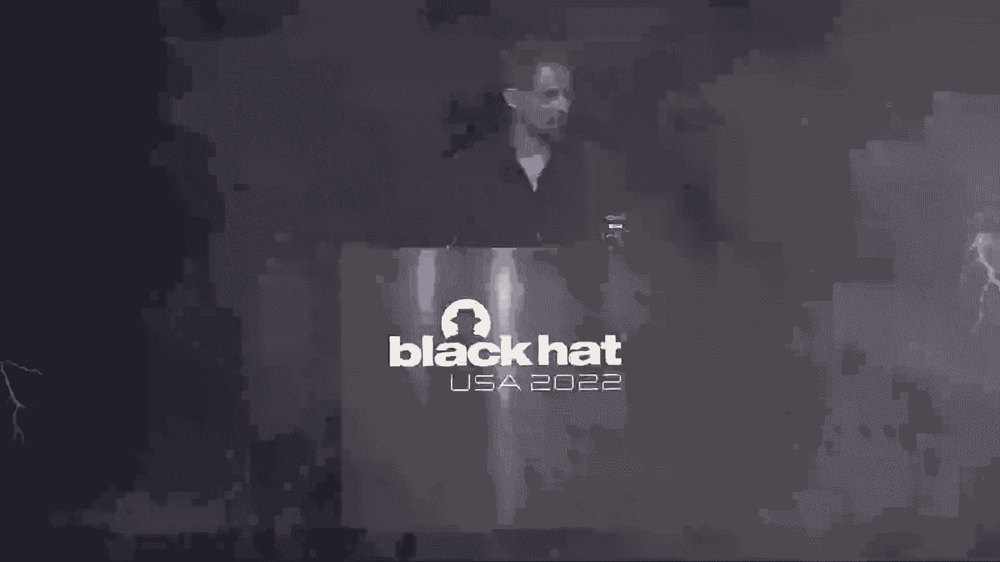

我们在《毁灭者》中谈到过。

第一个专门为攻击电网而设计的恶意软件。

我们给它贴上了最大威胁的标签，今天我们介绍驱逐舰二号的续集，但在我们开始之前，我们将把最近的袭击放在上下文中，并检查APT组的攻击选择。

在它后面，我们将回顾一下最初的驱逐舰，所以我们也会比较这两个版本，我们将讨论二十二事件，它是如何展开的，并仔细看看恶意软件的行业，我们还查看了与它一起部署的其他恶意软件。

然后我们将以一些防御和检测建议来结束演示，我是罗伯特·利波夫斯基，我的共同发言人是安东·切帕诺夫，我们都是E集的研究员，安东专业化是对这些领域的高级威胁和APT攻击的研究，我也主要看猿类。

但不仅仅是那些，也是犯罪软件，一点脆弱性研究，例如在黑帽二十，我公司介绍了我们对骗子WiFi漏洞的研究，但那是虚拟的，所以这次能亲自回来真的很好，他对你们中任何不熟悉公司的人说。

所以我们已经上市三十多年了，我们是欧盟最大的端点安全提供商，特别是在斯洛伐克，顺便说一句，它就在乌克兰旁边，今天你们将听到的是我们的原创研究，我是说，作为乌克兰使用最广泛的安全供应商。

我们拥有独特的优势，许多私营和公营机构使用我们的软件，给我们直接遥测，我们看到攻击实时瓦解，但并不像你注意到的那样，不只是我们两个，因为我们今天有一位非常特别的客人，直接来自乌克兰的维克多·奥拉先生。

他正在监督对驱逐舰攻击的事件反应，所以说，他绝对是最好的人之一，分享对事件的宝贵见解，所以很高兴他能和我们在一起，它始于2014年，甚至可能在2013年底。

下面是最值得注意的贴切群体列表，多年来对乌克兰进行了有针对性的袭击，请注意，这也不是一个全面的列表，这只是我们做的选择，从这个选择中，我们将重点关注，依我看，这些群体中最具攻击性的，电网攻击的幕后黑手。

Sandw沙虫被归因于俄罗斯军事情报局GRU，在2020年10月，联邦调查局甚至公布了对六名GRU黑客的公开起诉书，参加了我们接下来要讨论的一些运动和袭击，顺便说一句。

如果有人想知道沙虫这个名字是从哪里来的，使用黑色能量恶意软件，我们在命令和控制服务器地址中发现这些文本字符串，所以很明显，运营商是弗兰克·赫伯特经典作品的粉丝，我们首先讨论了这些DOE引用。

在2014年的病毒公告会议上，但实际上是玛尼·曼迪恩特手下的视力伙伴，创造了沙虫这个名字，所以我们从一开始就在追踪他们，因为黑色能量实际上是从网络罪犯进化而来的，恶意软件的商品，到沙虫手中的网络武器。

查看我们的遥测，我们能在那里找到的最早的沙虫痕迹可以追溯到2011年，这是一份当时正在使用的诱饵文件，指次年年初的一次会议，然后呢，正如我所指出的，2013年底。

我们观察到针对乌克兰高价值目标的有针对性的APT活动显著增加，所以在俄罗斯占领克里米亚之前，顿巴斯桑战争的开始针对所有类型的组织，包括政府，外交，媒体，运输，甚至乌克兰的选举。

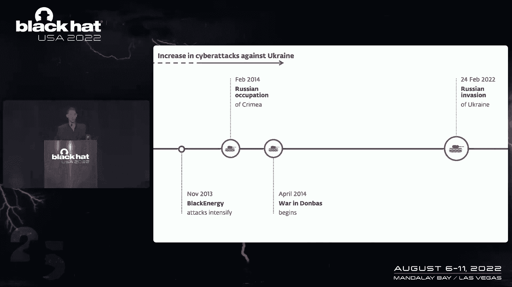

精雕细琢，非常有针对性的鱼叉式网络钓鱼电子邮件，这里有一个例子，甚至利用顿巴斯的战争作为诱饵，邮件里说，东部分裂分子，在附件中，有一个幻灯片演示文稿，上面有一份所谓的分离主义支持者名单，大家可以看到。

这是一个非常好的社会工程，这不是你常见的尼日利亚王子骗局，在背景中，嗯，黑色能源将从远程服务器下载并安装，这还利用了PowerPoint中的零日漏洞，所以即使是收件人也可以，他们可能已经被破坏了。

即使他们在办公室里有完全修补的Windows版本，黑色能源被用于反对乌克兰许多组织的许多运动，但可以肯定的是，最显著的攻击，也是引起全球网络安全行业注意的一个，是针对乌克兰电网的。

在2015年12月达到高潮，当它成为有史以来第一次由网络攻击引起的停电时，它是由黑色能量恶意软件促成的，并对全国各地的多家配电公司进行了打击，所谓的Ogos，攻击者滥用远程访问软件手动关闭电力流动。

结果，全国20多万乌克兰人的家，不同地区黑暗了几个小时。

这是一段臭名昭著的泄露视频，由其中一个目标变电站的操作员拍摄，显示攻击者如何远程连接到此工作站，并与那里的SKA软件交互，露出那种表情，没有人碰鼠标或键盘，几乎整整一年后，在二十六年十二月。

又发生了一次网络攻击造成的停电，这一次攻击者真的加强了他们的游戏，有相当多的显著差异，比如说，只有一个变电站被击中，主要的区别是攻击者有更大的野心，我们发现了他们在驱逐舰上部署的恶意软件。

与前一年通过Ramin手动中断不同，是有史以来第一个专门设计来攻击电网的恶意软件，以自动化的方式，这是这里的关键字，我们稍后再讨论这个问题，所以在接下来的几年里，沙虫使用的工具集有了很大的进化。

该组织分裂了活动，我们在追踪大能量星系团，它继续对能源部门征税，有塔尔博特集群，它主要针对乌克兰的金融部门进行袭击，和塔尔博特，也是分组，在臭名昭著的2017年6月的不梨假期背后，这显然不需要介绍。

我不会去任何，任何关于，历史上最具破坏性和代价最大的网络攻击，我只想提到并赞扬安东，他发现了起源或病人，疫情为零，并发现它源于一个供应链，我的妥协医生，因此将Nopea也是沙虫的作品联系起来。

这一点的意义在于，在一年半之后，这是将驱逐舰归咎于沙虫的第一个确凿证据，基于代码相似性，所以所有这些结论，我们正在建立所有这些联系，拼凑拼图的碎片，我们必须用线索来支持他们，代码相似性，执行链。

共享网络基础设施等，然后在接下来的几年里，我们看到沙虫在乌克兰袭击，但在其他国家也有奥林匹克驱逐舰在韩国，灰色能量也在波兰，佐治亚州的沙滩时间，火鸡ERL也在法国被发现，所以GRU攻击者继续活跃。

但他们的轮廓要慢得多，不再有，你知道，在主流媒体上，就像前几年到现在一样，今年2月2日至3日，就在五点前，m，乌克兰时间，就在俄罗斯军事入侵前几个小时。

我们在乌克兰检测到一种名为密封雨刷的恶意软件的攻击，没想到第二天早上会发生什么，但随着局势升级俄罗斯军队驻扎在乌克兰边境，我们觉得这个发现不应该留给我们私人的威胁，仅限英特尔客户，但我们想和社区分享。

我们在这个推特帖子中做到了这一点，在多个组织的数百个系统上发现了密封雨刷，这纯粹是网络破坏行为，所以他试图使这些组织中的计算机无法启动，实际上无法获得的任何面向公众的服务。

这只是我们在乌克兰发现的一系列雨刷中的第一个，2月以来，他们的技术水平参差不齐，球童雨刷是更先进的之一，我要提到的一个显著特点是，它虐待了一名，合法的，这个分区软件的低级文件系统操作。

编译时间戳表明恶意软件是准备好的，至少在部署前几个月，但密封雨刷并不是这场运动中使用的唯一恶意软件，有一种蠕虫，我们称之为我们的呼叫密封巫师，因为它传播，整个网络，有密封的赎金，这是远远的勒索软件。

喜欢不是佩蒂亚，顺便说一句，密封向导中的一个组件，是由攻击者的浪漫DLL命名的，可能是指永恒的浪漫，即使实际上没有使用任何漏洞，在这种情况下，如果你仔细想想，使用雨刷和诱饵有点奇怪，勒索软件。

他们在一次竞选中基本上做了同样的事情，而且，密封赎金与密封赎金相比写得很差，与密封雨刷相比，密封赎金写得不好，一种可能的解释是恶意软件是通过组策略部署的，所以机器会在打开的不同时间下载它。

袭击者可能试图部署密封赎金，在他们发现我们在探测和阻止。

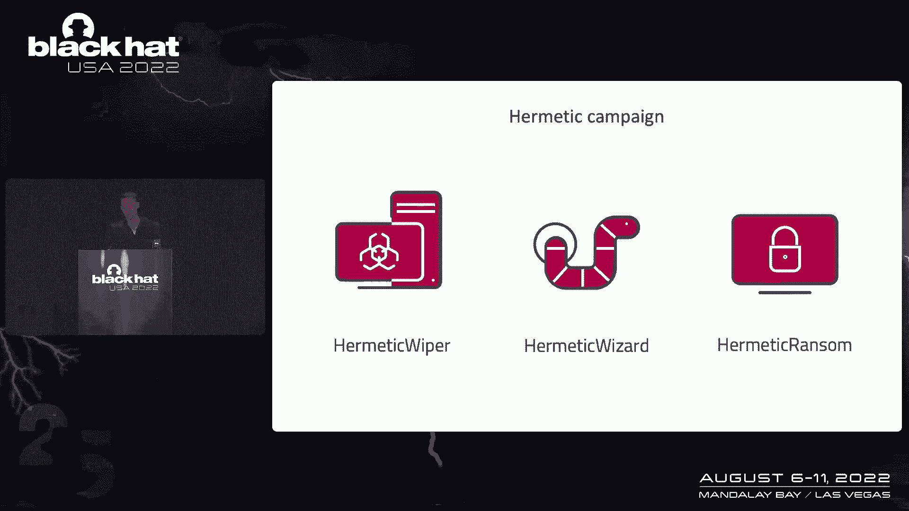

这是密封赎金显示的赎金信息，这里是代码中发现的一些复活节彩蛋，然后在3月14日，我们发现了另一个雨刷，球童雨刷，我就不细说了，我也不会报道每一次雨刷攻击，因为自二月份以来，我们发现了相当多的。

但我鼓励你去看看关于乌克兰人的更广泛的演讲。

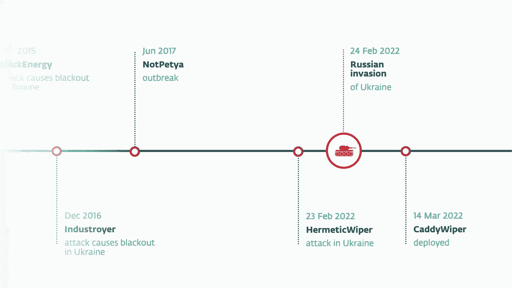

因为它值得注意，因为我们后来在驱逐舰二号事件中又看到了它，所以3月14日的袭击是针对金融部门的组织，从技术的角度来看，不是很有趣，一件值得注意的事情，我要提到的是，它避免了破坏域控制器上的数据。

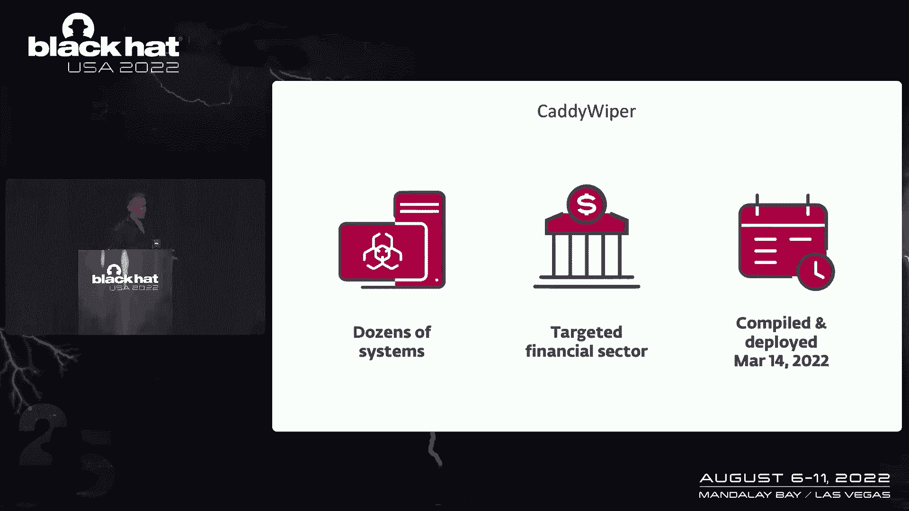

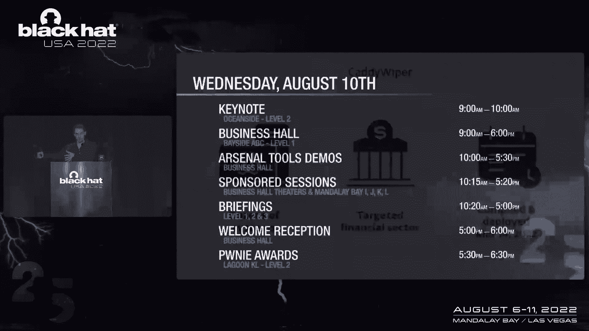

现在来谈谈4月8日的事件。

所以我们被某个UA联系了，帮助他们应对能源供应商的网络事件，并帮助他们分析可疑的恶意软件，我们的分析发现线程比预期的要大，它是一个新版本的驱逐舰，这是我们在过去五年里没有看到的积极的一面。

而第一艘驱逐舰事件导致停电持续了大约一个小时，最新的这个甚至没有做到这一点，所以攻击被挫败了，多亏了公司目标端的捍卫者的迅速反应，塞拉和我们助手的工作，但尽管没有发生停电，这仍然是一件大事。

因为如果袭击成功了，理论上，超过200万人可能被蒙在鼓里，因为目标Oengo是一个有这么多人的地区的电力供应商，所以在我们看来，这是最重大的网络攻击，即使到目前为止在战争中没有成功。

现在我要把麦克风传给维克多，你分享了他对这一事件的见解。

谢谢罗伯特，谢谢你的好意，让我和你们一起做这个演示，我很荣幸能在黑半部分，第一次，第二次。

我要向所有的合作伙伴表示感谢，他们在这场史无前例的战争中继续支持我们为生存而斗争，呃，这个呃，这可能是世界上最大的挑战，战争2，为了全世界，它在网络空间仍然是全新的，呃，我们很多人都会说这个词。

网友继续支持我们，呃，并提供软件协助，第二，我会说出这些公司的名字，他们大部分都在这里，但其中两个是吗，和微软，历史上，在乌克兰网络和端点上获得了最大的覆盖。

这使他们能够继续成为乌克兰的两个测量遥测提供商。

他努力工作了20年才获得这个保险，和，正如罗伯特提到的，它是对2016年第一起驱逐舰案件的贡献，呃，就像大多数观众都熟悉的那样，呃，网络事件数量首次三连冠，呃，战争的头几个月，但是，然而。

社区专家和乌克兰次级辩护人期待的，呃，有很多原因，呃，嗯，它没有这样，但在三月底四月初，我们面临着许多非常大的事件，一个在驱逐舰二号，所以说，但从年初到现在，我们登记了一千六百起重大网络事件。

一千七十四年二月二十四日起，所以大多数攻击者都集中在关键的基础设施和政府机构上，根据我们获得的经验，从过去八年对乌克兰的网络侵略中，我们继续非常关注我们收到的关于能源部门的所有提示。

这是我们三十岁的荣幸，有很多交流，与许多人的大量合作，嗯，网络情报提供者，这对我来说是一个很大的特权，与网络情报公司的主要制造商直接联系，如果发生任何严重的事情，他可以迅速给我们发送提示。

当我们收到提示时，情况就是这样，来自微软和ESET，我们立即联系了弱队检查是否有假阳性，当我们收到他们的确认，有潜在的问题，我们获得了访问网络的权限，并开始提供事件响应，我们最近发现。

最初的妥协可能发生在2月份之前，第十七届。

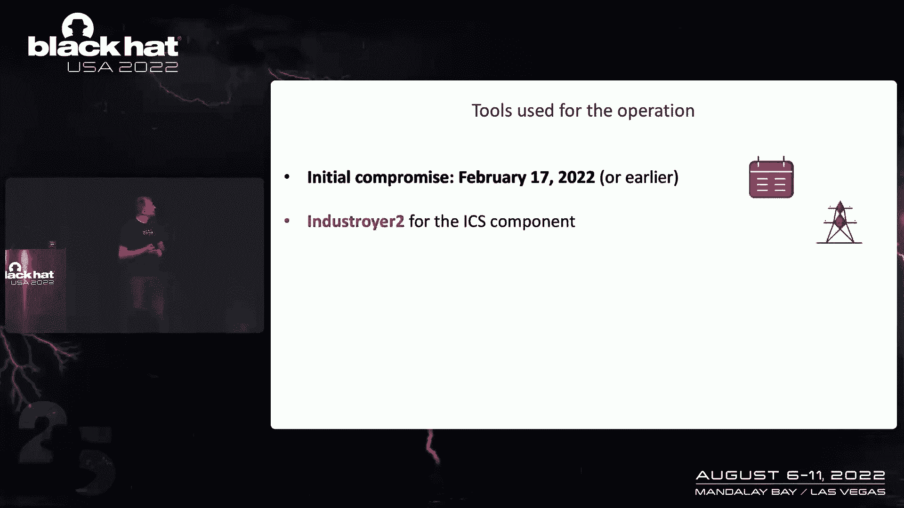

嗯，我就说几句话，呃，解释为什么这个操作如此复杂，所以这不是关于驱逐舰2号，这个恶意软件是专门为IC设计的，这是一次精心策划和技术复杂的行动，我们后来发现了很多工具，比如说，用一个等待字母Z的算法。

字母Z已经成为入侵的象征，我们还发现了专门为FreeBfor Linux服务设计的金属操作员后门，所以我们看到攻击者使用了很多雨刷脚本，像可怕的碎片，他们的独奏碎片，他们是协调者或粉碎者。

以清理他们存在的日志，我们的Windows工作站也是如此，总体想法是在周五结束时提供停电。

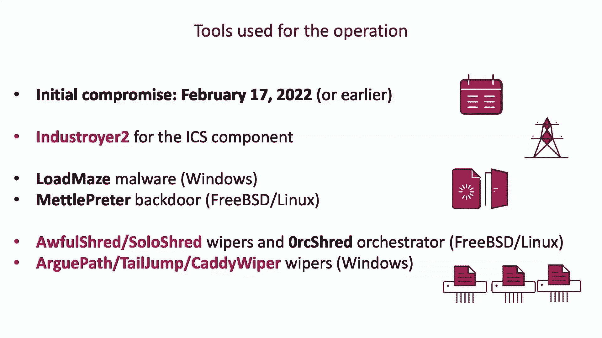

因此调度程序被预先配置为，当大多数行政人员和所有工作站，所有的工作站都还开着，熔岩说着他们的事情回家，所以这次停电将对多达200万人造成严重影响，刚才提到的火星车，我们可以想象的整体影响。

所以有周五晚上，看电视的人，看新闻，或者这正是入侵的活跃面的中间，所以我们认为这是一种支持性的手术，到很多联系，每天发生的常规操作，这是一个完全破坏性的行动，在我们看来，专注于完全民用的基础设施。

安东稍后会检查所有这些复杂的工具，和驱逐舰一起专注于我们的CS组件，但这个想法是这样切换和雨刷，错过了一件很重要的事，星期五是个短工作日，大多数人和他们在五点的工作，m，甚至四个P，m，所以说。

五五十个，百分之八九十五的工作站都关机了，所以他们被抹去了，这让我们得到了一个完整的画面，在获得网络访问权限后，我们花了不到12个小时就得出了初步结论，并与五家选定的合作公司分享驱逐舰二号的国际奥委会。

只是为了把这些国际奥委会添加到他们的数据库中有趣的案例和完全不同的故事，为什么要在报纸上发表，所以它被传递给了媒体，甚至还被发布在推特上，这个TLP琥珀文档，我们与合作伙伴分享。

这也是我们决定组织压迫者的原因之一，根据我们的意见，这对社区很重要，这是侵略行为，俄罗斯方面的又一次侵略行为，在这场混合战争和网络侵略中，这基本上允许了很多。

思科告诉我们这两家公司在事件应对方面帮助我们，提到了微软和许多其他公司。

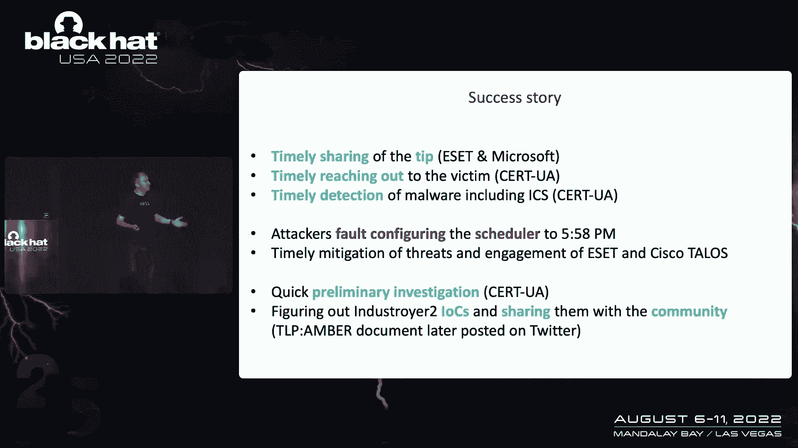

罗伯特回到你身边，谢谢。谢谢。维克多，很有见地。

所以让我们继续快速回顾一下最初的第一版驱逐舰，它是独一无二的，不仅因为它是第一个专门设计来攻击电网的恶意软件，但这也是有史以来第二个对工业硬件造成物理损害的恶意软件，第一个是震网，第三个是海卫一。

所以它的第一个目标是切断电线以打开断路器。

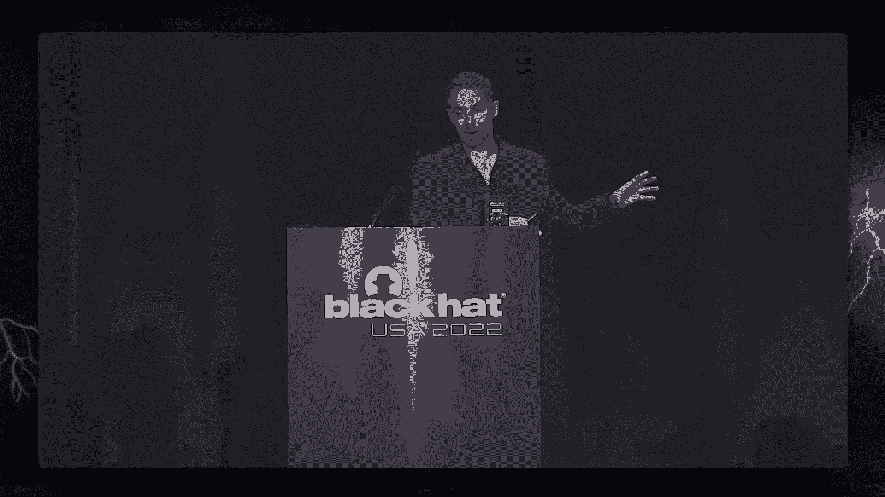

在预设的时间使用它的有效载荷模块之一，我们马上就会展示建筑，其次，攻击者会擦除溜冰软件，这样操作员就看不到环境的状态，他们无法控制，这应该是由雨刷组件完成的，你可以在这里看到。

所以你可以看到沙虫在清除恶意软件方面有很长的历史，这个模块专门擦除属于SKA软件的文件，然后通过损坏控制站的关键文件使其无法引导，崩溃并重新启动它，它会启动，嗯第三。

工业会试图切断保护继电器，这些起着非常重要的作用，因为他们在那里保护电网免受有害条件的影响，如果禁用，网格可能会变得脆弱，这应该由拒绝服务模块来完成，它试图利用西门子的一个漏洞。

通过向我们的5万人发送一个精心制作的UDP包来保护设备。

将保护继电器切换到固件更新模式，它会被困在那里，实际上没有完成它的工作。

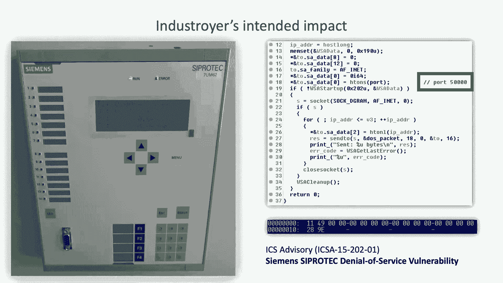

那么公用事业运营商将试图恢复电力，手动重合断路器，如果保护继电器被禁用，网格可能会变得不稳定，甚至可能导致硬件的物理损坏，如果成功了，它不是，但如果是，停电可能会持续更长的时间。

俄国人在这次进攻中有更高的野心，但是失败了，部分原因是乌克兰捍卫者的韧性更好，根据前一年的经验，部分原因是攻击者犯的编码错误，这里有一个快速的架构，它是一个模块化的框架，有一个发射器组件负责定时攻击。

它有一个硬编码的时间，何时发射这些有效载荷模块，实现了四种不同的工业通信协议，你可以看到上面列出的，其中大多数是dll，每个都有自己的配置文件，我会专注于我，c，一零四，因为二号驱逐舰也用这个。

所以协议本身是i的网络扩展，c，一零一，电网中使用的远动协议，现在它是广泛的，我是说，不需要细说，重要的是，问题是它是几十年前设计的，没有关注安全，它使用客户机服务器模型操作，没有身份验证。

所以控制站是客户端，远程站是服务器，恶意软件所做的是它在创建和传输，所谓的ASDU消息来改变远程站的状态，IOS信息对象地址到状态关闭，现在，这些IOS到底映射到什么取决于配置。

变电站环境中配置的PHI，在驱逐舰中，根据自己的配置创建这些电报，这里有一个虚拟的例子，没有一个真正康复。

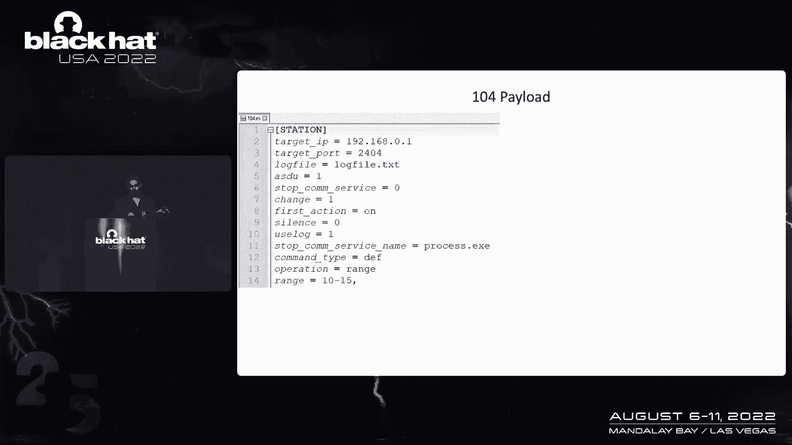

有一个IP站和一个端口，杀人有一个过程，所以这是一个合法的溜冰者应用程序在环境中运行的过程，以避免潜在的冲突，它支持控制台输出，也伐木，就像你在右边看到的，这说明了该操作是如何工作的，所以说，比如说。

它向10到15个iOS系统发送命令，现在让我们在驱逐舰二号中分析，所以和第一个版本相比，有很多代码相似性，我们可以说它是从同一个源代码演变而来的。

体系结构的显著区别在于两个自包含在一个可执行文件中，而最初的是一个模块化框架，它只实现了C一零四协议，呃，本例中的配置是嵌入的，这意味着对于具有不同配置的部署，攻击者每次都必须重新编译它。

我们分析了两个不同构型的样品，它们似乎都是在3月2日至3日编制的，但那只是编译时间戳，正如维克多提到的，袭击者早在几个月前就策划了这次袭击，现在我把话传给安东，让他带你走，谢谢的细节，因此。

新的配置格式是作为硬编码字符串教授的，因此，两者能够同时与多个设备通信，我们分析的一个示例包含三个这样的IP地址，其他样本包含八个，这是您所看到的配置示例，IP地址，端口号范围模式。

但它没有在样品和合法工艺的名称中使用，终止，然后它重命名文件以便，呃，禁用执行以防止软件的自动执行，然后这个，在一个样本中，我们发现了110个iOS，在其他样本中，我们发现了68个iOS。

它的配置真的和以前的很相似，但它只是以不同的格式存储，这里和屏幕上的值是相同的，你可以看到恶意软件发送的数据包，它是用铁丝解剖的，鲨鱼和割草机它在飞行中产生这个包，而最重要的，呃，您可以看到的值。

这是双重命令，呃，它发送一个，命令是，重要的是要知道，它根本没有利用任何漏洞，它只是按照设计的方式使用协议，如果我们将配置转换为人类可读的格式，我们可以看到它发出，执行命令，而是，所以这些是做什么的。

这真的很难找到，因为你有数百个这样的，iOS可以从工业端到工业端不同，因为它依赖于设备，关于设置等等，然而，如果你谷歌一些特定的iOS，我在服务器上使用，您可能会跌跌撞撞地打开来自A B的通信。

在本文档中，上面说一些iOS，它们属于一个断路器，填充物，保护，当他们把这个行业的旧的寒冷比作新的寒冷时，你可以看到很多类似的字符串和类似的旧片段。

它有点改变之前，它是更多的口头，它很干净，甚至五颜六色，现在他们用一些代码代替文本。

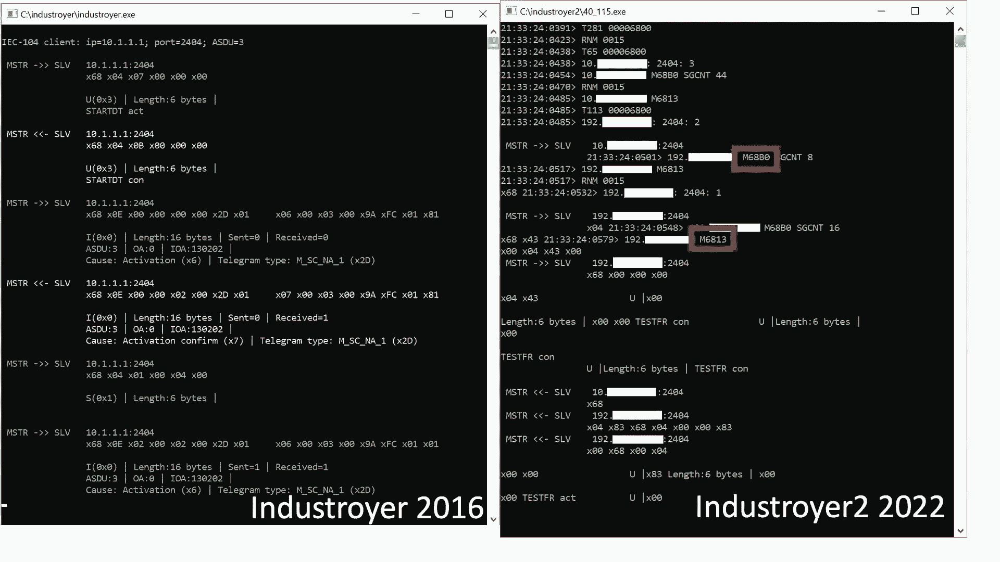

类似于攻击中的两个中的一个，在这次袭击中，他们部署了毒蛇以便让恢复变得更加困难。

所以他们用什么和他们用的Kya毒蛇。

它是毒蛇。

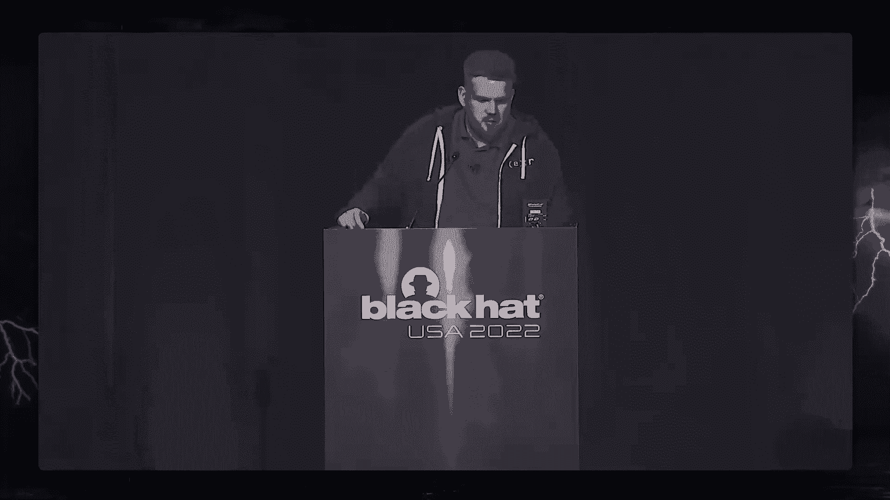

对于Linux，他们使用额外的毒蛇和呼叫或设置，集合，糟糕的布景，Orset是一个试图连接，人。

这是INCI的时间线，攻击者使用调度任务来执行恶意软件，这就是我们如何知道确切的时间，一开始他们部署了恶意软件，然后他们创建计划任务，这一次他们想在商店里执行，十分钟后，他们想处决毒蛇。

除了预定的任务之外。

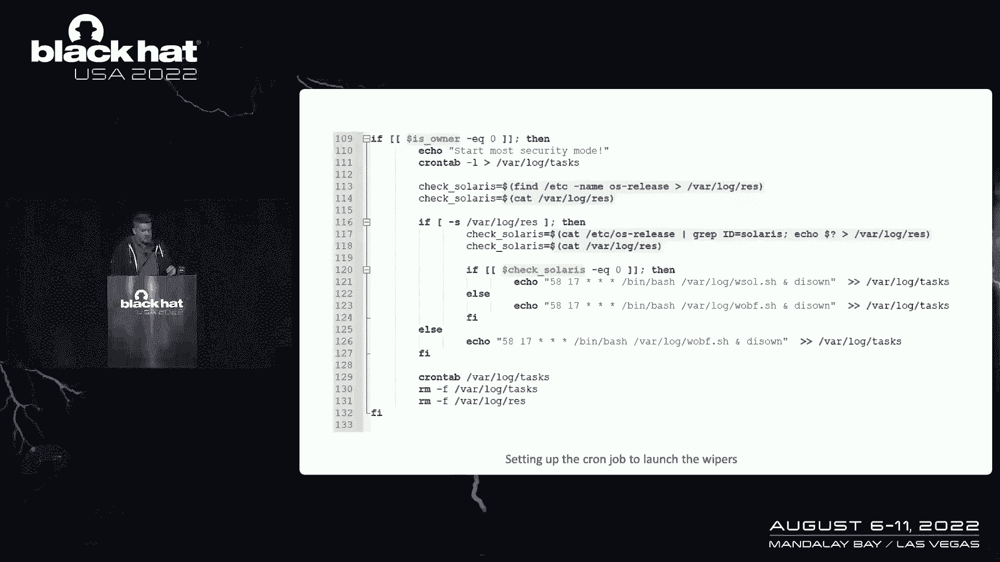

你可以看到莱纳斯毒蛇他们用的是铬合金，在这个铬里，这些毒蛇是根据，毒蛇本身卡迪毒蛇相对简单，它只是用零覆盖光盘C和其他磁盘上的文件，然后它让。

所以让我们来谈谈防守，我将引导你通过检测你的变化。

你可以用，首先今天我们将发布我们捕获的皮卡，此外，我们发布了一个未通过的，这条规则背后的想法，你必须确定这对你的环境是最重要的，比如说，联邦保护，然后你可以用它，这种方法的燃料限制，首先呢。

在这种环境中，强制网络流量并不总是可能的，而且很难确定这些是，另一个限制是当规则被触发时，可能要等，这就是为什么我们建议你庄园其他活动，例如天气或运动通过影响影响是一个开源框架。

各种网络协议在Python中的实现，在这个协议的顶部实现了一些工具，是你，它们用于远程执行，所以对于一个运动，它被沙虫大量使用，尤其是准确的，但是我们可以根据，因为撞击使用的公共线，它可以它包含时间戳。

呃总是一样，呃还有，呃，你可以，呃，试图探测他们在墙壁上使用的金属压力，反向，tcp，反向http，它被称为主迷宫装载机，为此，你可以使用任何现代和保护，下一个，他们使用自定义脚本。

以便通过组策略推送计划的任务，为此，你可以查看攻击，好的，谢谢。安东，所以让我们结束，这里有一些进一步的阅读给你，一些非常好的写作，你会在我们在线分享的幻灯片中找到链接。

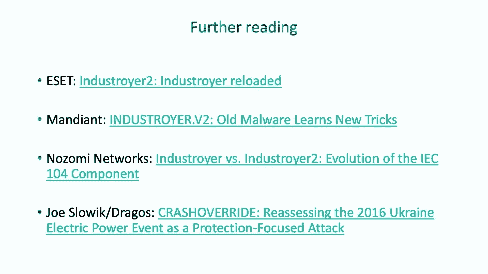

几个最后的配乐片段，因此，工业的两个版本都未能实现他们的目标，这真的很好。

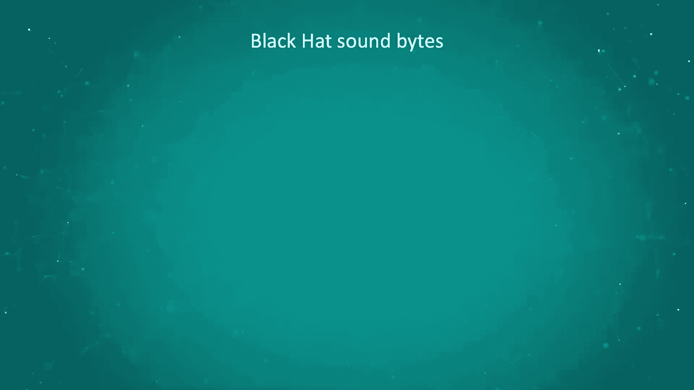

但我在评估他们的成功率时会非常小心，这种威胁不应该被炒作，但也不应被淡化或低估，威胁是严重的，但他们可以通过适当的安全措施来挫败，谢谢。

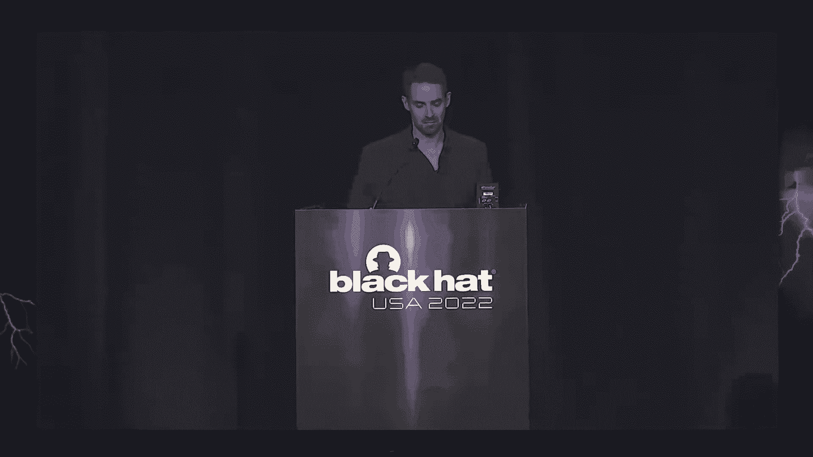