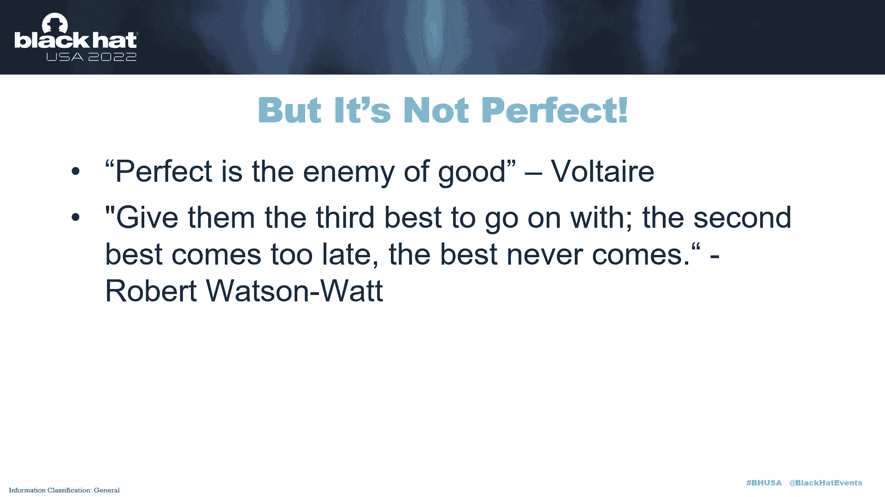
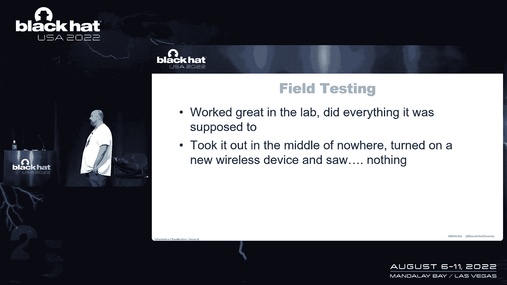
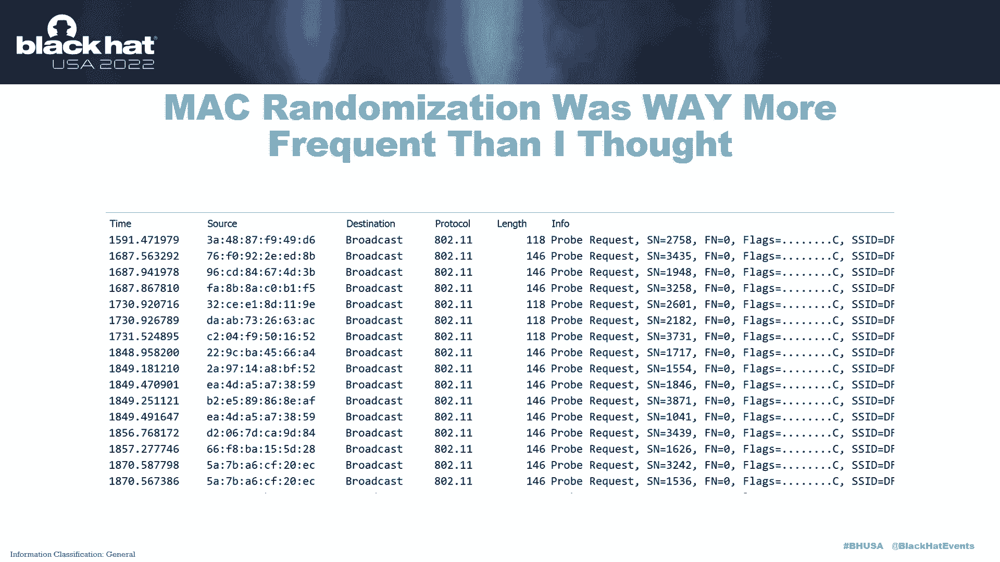
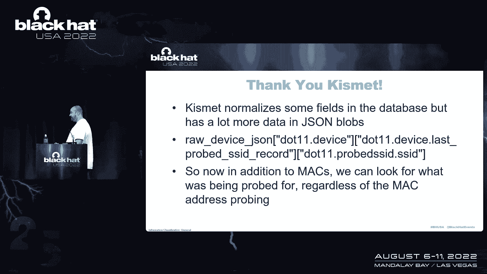
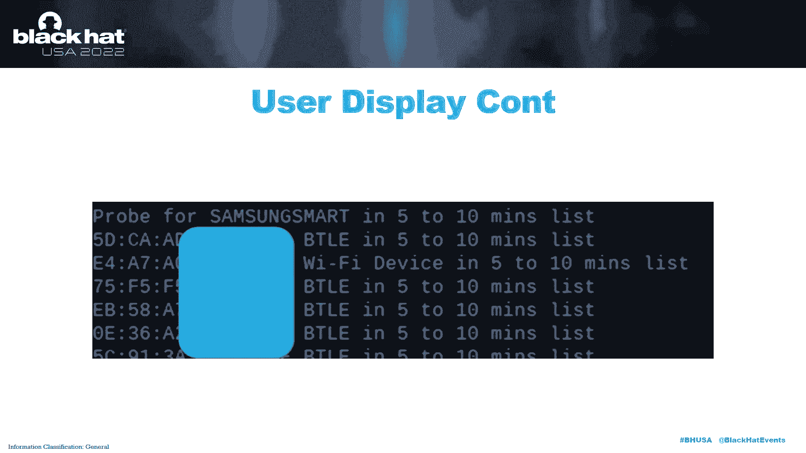
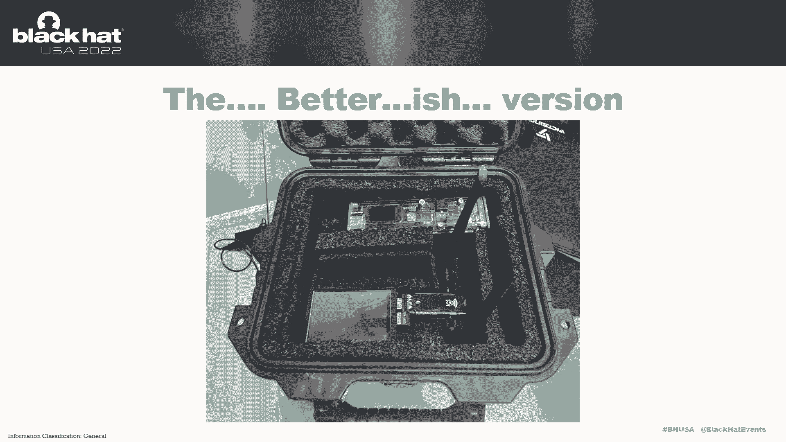
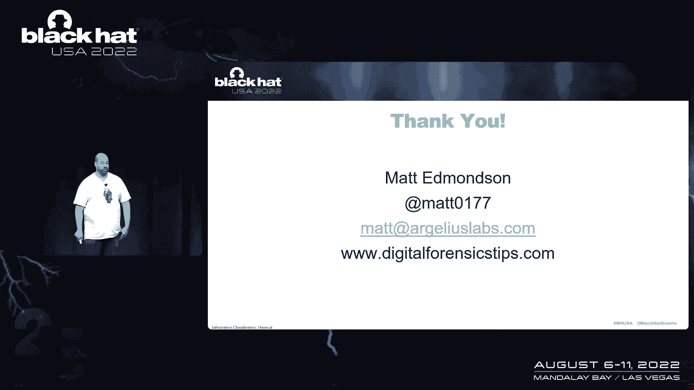

# 【转载】Black Hat USA 2022 会议视频 - P80：091 - Chasing Your Tail With a Raspberry Pi - 坤坤武特 - BV1WK41167dt

星期四下午，我以为你们有三十个人，但他们给我装了麦克风，因为如果我必须在那里站半个小时，我会爆炸，我做过很多不同的会议演讲，我从来没有一开始就说嘿，这是我做这件事的动机，我为什么要做这个演讲。

我总是说谁在乎对吧，谈话是这样的，我想说的是，而我这次真的这么做了，原因是这一次真的很重要，发生的事情是我的一个朋友去年年底联系了，他说他需要聚在一起和我谈谈一个WiFi问题，他在一个政府机构工作。

我不会说出他的名字，我很清楚他想问什么，事实证明，我像往常一样大错特错，他想说的是他有一个秘密线人，这个秘密线人与一个民族国家恐怖组织有联系，对，我不会说出小组的名字，但是一个非常非常严肃的团体。

还有我的朋友，他不担心自己的人身安全或任何数字，他能照顾好自己，他担心他的线人的安全，他担心的是如果我和这个人见面，他们一直跟着我，他们知道我在哪里工作，他们会回去伤害这个人，对呀，对他们不好。

所以他们不关心自己的人身安全，他们担心这个人的人身安全，谁在提供信息，所以我想，哇哦，几年前，他们听我说过也许用无线来告诉，如果你被跟踪了，我马上就会讲到的方法，所以他们说他们去找他们的技术人员。

他们什么都没有，所以他来找我，我有点不想重新发明轮子，我告诉他，是啊，是啊，你知道吗，让我看看，如果没有，也许我可以给你做点什么，我开始做研究，试图找出，如果有这样的事情，我真的什么都找不到。

这真的让我很沮丧，因为外面有太多的技术，囤积人们并侵犯他们的隐私，几乎没有什么可以帮助处于这种情况下的人，对吧，这真的有点令人沮丧，我身边的一个人处理了一个袜子问题，这是毁灭性的权利。

你只是永远不会得到精神上的碎片，这是一个非常非常困难的情况，所以我想了一下，我真的看不出有什么办法，这可能会被滥用对吧，它实际上只是为了判断你是否被跟踪而设计的，不要帮助跟随别人，所以让我们试试看吧。

这就是这个的背景，这是一个满是技术人员的房间，如果我说sdr，我们大多数人都认为是对的，软件定义无线电黑客射频类似的东西，但是最初的特别提款权正确的监视探测路线，其中很多都是相当常识的事情，右变道。

看谁在你后面变道，从高速公路上下来，马上回来，看看谁出去了，他就在你后面，诸如此类的事情，任何在那个空间玩过并住在华盛顿特区的人，我选择这张地图的原因，很明显，环城公路被设计成一个巨大的监视探测，直接。

这就是为什么，我认为它是这样布局的原因之一，他用了这个贸易技巧，他只是想要一点技术上的帮助，他几年前听我说过的方法，就是听，我也了解贸易技巧，但如果你真的想知道你是否被跟踪了，也许也可以想到这样的东西。

去星巴克喝一杯，然后去别的地方然后去别的地方，现在坐在那里看，我在这三个地方都看到任何设备了吗，对呀，因为想想看，即使是一个拥有非常非常好的贸易技巧的国家质量监督小组，非常非常好的设备。

谁知道他们在做什么，不是吗？仍然是他们口袋里有手机的好机会，右或一个在车里，你知道也许AirPods，蓝牙耳机对吧，有东西同步到车上了，如果你连接到一个很好的网络，我可以看到Mac地址。

如果你没有连接到网络，那就更好了，因为胜算是对的，大多数人不会关掉他们的WiFi，除非你要来参加黑客会议，在这种情况下它绝对应该被关闭对吧，你知道你要来黑帽def con，是啊，是啊，关闭。

它几乎整个星期都在关闭，但是当大多数人只是过着他们的日常生活时，就在右边，我们的手机在做什么，他们坐在那里寻找无线网络，我们在历史上联系在一起的地方，这本身就可以成为一个签名，好吧，我现在看到什么了吗。

我五到十分钟前也看到了，十到十五分钟前，一路走下去，这就是我们在这里要采用的方法，所以要做到这一点，我们想让它完全被动，对呀，我们只是被动地试图检测WiFi和蓝牙设备，我们在周围观察到的。

这真的无关紧要，它们是否是活动连接的一部分，不管怎样都会成功的，在方法上有一点不同，我们将讨论硬件，我不想去买东西，我最后买了一点点，这个非常非常便宜，这是严重的事情。

我们中有多少人在壁橱里有多个覆盆子馅饼，做什么都不对，绝对没有，是啊，是啊，我用了覆盆子皮B做这个，不是在三个B像不是那样，有任何理由，我衣柜里就有三个，因为一些奇怪的原因。

所以这些都是我们很多人可能都有的东西，或者可以得到非常非常便宜，首先是覆盆子圆周率，有多个版本的这些我可以正常使用，这些大约是三块五美元，但现在有一个非常非常蹩脚的短缺，他们大概要120英镑，相当多。

但就像我说的，我想我们很多人都有这个或者非常非常相似的东西，四处寻找无线卡，我有一堆阿尔法卡，但我去了Akismet不和，并询问了那里的社区，普遍的共识是什么，目前很多人使用的最好的无线卡。

这是很多人推荐的阿尔法卡，幻灯片将在网上提供，他们可能已经是今天了，所以他们会在黑帽网站上，所以如果你想看这些特定的项目，对于电池组，再一次，我有几本放在我的壁橱里，其他地方的赠品，或者我得到的锚。

多年来在亚马逊上非常便宜，需要显示，因为在几张幻灯片中，你会看到字面上的，你见过的最糟糕的用户界面，对呀，我是说，你就像，哦，没那么糟，哦，是啊，是啊，等一下，等一下，这可能是谈话的亮点。

如果我是诚实的，但如果你想对了，你有这个小装置，在这种情况下对吧，你需要某种类型的反馈，覆盆子圆周率上的小屏幕，那是，我想在亚马逊上买两个5美元，我没有那种东西，所以这是我必须买的一件东西。

和一个基础软件，用于实际处理无线信号，蓝牙信号，以及我们想扩展它的任何东西，走向未来，我们实际上用的是Kismet对吧，如果你从来没有玩过Kismet，吻是惊人的，它是一个免费的工具。

它基本上只是嗅所有你能找到的无线，要使用外接无线卡的原因，所以你可以把它放在监视器模式下，你基本上可以像听一样说出来，不要试图连接到任何东西，你最近工作非常非常努力，只要花几分钟，放轻松，坐下来。

看看空气中漂浮着什么，对呀，你基本上把你的无线卡变成了瘾君子，所以，Kismet非常非常擅长将WiFi卡放入那种模式，它支持WiFi蓝牙，很多不同类型的信号，就像我说的，未来有很大的能力来扩展这个。

毫无疑问，一件非常非常好的事情是，它将所有数据写入SQL Lite数据库，这就是我们要实际使用的，并试图拉住，来自的实时数据，它有不同的选择，比如，生成pcap，其他格式，但真的没有必要。

因为你可以从数据库中生成这些，所以你不想生成那些活的，因为你所做的一切都是无缘无故地浪费计算的努力。

其他都是粗制滥造的，Python代码对，这是几个小批量脚本，只是非常，非常丑陋的Python代码，如果您想对自己的编码能力感觉更好，去我的GitHub，我保证我的两个项目不知何故进入了北极代码库。

所以很高兴知道，就像我死后几千年，我的劣质代码将在某个地方生存，但说真的，当你要开始发布这样的项目时，你开始考虑把它放在黑帽。

绝对是，非常非常真实，所以你只是告诉自己，提醒自己，你知道不要让完美，做正义的敌人，仅仅因为某件事不完美，仅仅因为某件事没有缺点，不代表不值得做，我认为这真的是要记住的核心事情之一。

几乎任何安全方面的东西，或者生活中的任何事情，如果我是完全诚实的，那位先生，罗伯特，沃森瓦特，他是，他是在雷达方面取得很多进步的人之一，他的任务是在世界大战期间保卫伦敦，从德国空袭中，你知道。

给他们第三个最好的搭配，退而求其次为时已晚，最好的永远不会到来，所以是的，如果有什么不对劲的话，如果你从这次谈话中得到什么，你知道不要自我意识，就像我定期把我粗制滥造的Python代码推出去一样。

我永远不会侮辱一个真正的程序员称自己为程序员，但我可以写丑陋的函数代码来帮助我和我的队友，我对此很冷静，默认权利，我已经设置了Kismet，当覆盆子PI开机时就开始了。

我只给了它30秒的延迟让其他的事情都到位，但默认情况下，一旦你开始接吻，它这个，自动开始嗅探和查看您设置的所有内容，要留意，并将其放入SQL Lite数据库。

它用一个点Kismet扩展名的文件名命名数据库，但它是SQL点燃的，所以你可以做的是，你可以有日期，当前日期和时间，是文件，该文件的名称，你只是不断地拥有它，转到同一目录，然后Python代码。

一旦Python代码运行，它所做的就是在那个目录中查找并获取最新的文件，这样你就能得到实时数据，你只要把电源拔掉，没关系，消失了，你把它插上，给它加电，它在一分钟内自动启动、嗅探和监控，做着它的事。

我确实需要稍微改变一下我的方法，当他几年前听我谈论这件事时，但没有真正实施它是在想好，然后我们去第二个位置，然后我们去三号位置，那不是很好用，对呀，半个小时或一个小时或更长时间，这种方法真的不适合。

所以我们最终做的只是基于时间的权利，只是下班时间，我现在看到任何设备吗，我十分钟前也看到了五个，十到十五分钟前，或者十五到二十分钟前，让我知道设备类型，是蓝牙，是WiFi客户端吗，WiFi接入点右。

告诉我Mac地址，让我知道我之前看到的时间框架，如果你想得好，这很容易对吧，那只是一个续集查询，我在过去的一分钟里看到了什么，我在以前的时间里也看到了什么，其实是对的，第一个障碍，有一个解决办法。

但问题是在Kismet数据库中，但大部分都在像JSON这样的斑点中，您可以解析它们，但这开始变得非常，在功率很低的设备上很重，对呀，您已经从SQL Lite数据库中提取数据，它主动地将数据写入它。

它起作用了，我从来没有任何问题，但我意识到这也是一个hijinks的食谱，你想对数据库尽可能温和，和数据库本身，在被解析和规范化的字段中，它第一次看到一个设备，它有最后一次看到一个设备。

但它没有任何时间在这两个权利之间，所以试图弄清楚，嗯，五到十分钟前我们看到了什么，十到十五岁，等，与我们数据库里的不太吻合，所以解决方案，我不是说，没有其他方法可以做到这一点，但我所做的是。

我创建列表的权利，当这个自动启动时，它列出了五到十分钟前看到的设备，十到十五岁，十五到二十岁，然后它开始不断地观察它看到的设备，每分钟，它会把它在过去一分钟里看到的设备列表，看看他们是否从名单上出来了。

开火和警戒，如果有，每五分钟它就会开始旋转列表，5比10变成了10比15，和它在过去五分钟里看到的一切，它存储在一个列表中，然后成为新的五到十，它只是沿着线旋转，不是说这是解决问题的唯一方法。

这只是我想到并实施的解决方案，它起作用了，所以谈到了这种方法，另一件事是对的，这里有一点点贸易技巧，我们不想对自己警觉，好吧，我不想点燃这个，去兜兜风，然后就像啊，有一部iPhone跟着我，是啊，是啊。

就是我口袋里的那个，所有的权利，所以你实际上是如何做到这一点的，当你做信号的时候，智力工作作风是，你知道吗，我前世做过一些这样的工作，你在一个房间里聚在一起，你坐下，你会看到我们看到的所有设备的列表。

所以我现在就会点燃一些东西，我会让它运行几分钟看到我们所有的手机，你认识的每个人都没有关掉无线或蓝牙，然后你基本上创建一个忽略列表，现在我们可以看看是否有新的人进入房间，因为该设备不在我们的忽略列表中。

所以现在我们得到警报，这就是我们需要的功能，所以任何时候我们都可以创建一个忽略列表，列出每个Mac地址，在最新的Kismet数据库中可以看到，所以我要做的是打开它，让它运行几分钟。

沉浸在它所看到的一切中，然后砰的一声，只要点击按钮，点击按钮创建忽略列表，现在我有一张清单，上面有它看到的一切，我不想让它警觉，它将在会议的剩余时间里忽略这些，我可以删除或重新创建忽略列表，是啊，是啊。

不要笑，否，没有严肃的笑声，这是一个让人想起，就像我以前做的一些旧的微软访问数据库，严重，虽然，如果你在想这个，不是说我只想在这上面花五分钟，只是放弃了看着我，我身高六英尺四英寸，我没有纤细的小手指。

这些大猩猩的手需要捣碎一个按钮，你不想，就像苹果设计的这个漂亮的界面，你想要一个由Fisher Price设计的界面，对呀，这是一个粘稠的，按渔民价格，这就是我所需要的，我需要说话，说是的。

这就是为什么我们有这些又大又丑的，丑陋的纽扣是的，我可能会让自己看起来更漂亮一点，但为什么我忙于做其他事情，所以现在我有了它，是时候做一点实地测试了，这是生活在沙漠中的一个非常非常大的好处。

就在你住在亚利桑那州的时候，你可以去偏僻的地方，真的真的很容易去，在你周围没有其他信号的地方，因为我开始做一些测试，事情进展顺利，我就像好吧，它起作用了，我去做个实地测试，打开我以前关机的两部手机。

我没有看到任何有趣的东西，所以拿回来了，把我看到的数据转储到PCAP中。

烧线鲨，现在你意识到乐趣的地方，因为我知道有些事情正在发生，我只是不知道这种事发生的频率有多高，这是Mac地址随机化，以隐私和安全为名的权利，我们有设备，现在他们一直在寻找他们过去连接过的网络。

但他们伪造了一个Mac地址，尽量保护您的隐私和安全，我知道这是一件事，我知道Mac地址欺骗存在，我只是没有意识到它基本上是不变的，这是一个非常非常狭窄的时间领域，如果你看看最右边，我知道这是一个很小的。

但这就是全部，这是两个设备，寻找一个网络，这些都只是在寻找一个WiFi网络，如果你看看，UI编辑了大部分WiFi名称，但你可以看到它的第一部分是以df开头的，你只看到同一个Mac地址两次。

所以基本上每次这些设备探测，他们在欺骗一个新的Mac地址，对呀，就像我说的，我知道Mac地址随机化是一件事，老实说，我个人没有意识到这基本上是每一个请求，它只是不断地进行，所以就像没事一样。

我们以前的Mac地址方法仍然需要到位，因为它仍然需要检测活动连接的一部分，它仍然需要检测不随机化的东西，但对于随机的事情，这会破坏交易吗，不是因为现在我们要找的是，我们要去找它要找的东西，对呀。

探测器请求，WiFi网络的实际名称，所以我的朋友在前排就在这里，在南非，他的WiFi网络被命名为辛的WiFi，他的WiFi现在开着，他的迪拜应该寻找，嘿，Cin's WiFi，你在吗，嘿。

只发送WiFi，你在吗，他可以恶搞他的Mac，他想要的只是欺骗每一个请求，我仍然看到Mac地址，寻找一个非常独特的名字，对，非常独特，这就是人们被绊倒的地方，幻灯片到此结束，在一点点谈论这个对吧。

人们想给他们的WiFi命名，有趣的事情，一些独特的东西，一些聪明的东西来给他们的朋友和邻居留下深刻印象，但是那句话的关键部分是什么，权利唯一的权利唯一的，这就是开始泄露我们的东西，也许能帮助我们找到谁。

我们也在探测，所以我们现在要做的是得到探测请求，我们必须潜入那些JSON斑点，对呀，所以只有Python代码的一个小片段，为了向下解析，所以现在我们之前谈到的所有方法，用于MAC地址。

我们有相同的方法来探测请求，所以我们实际上在寻找无线网络，事物所寻找的，我们真的不在乎，Mac地址是什么，在这一点上，我们要离开网络的名称，我们有同样的他们。

用户显示比GUI漂亮得多，现在，现在它是同样的火，它在那里，你开始看到它的作用是它立即开始识别事物，它有一个，我们添加了308个Mac地址和两个，正在调查忽略列表中的七个无线网络名称，现在它就着火了。

随着它的继续，你看发生了什么，这是我在家的时候，我真的做了这件事。

但我让这个运行了一会儿，然后突然之间，也许我的一个邻居打开了一个以前关闭的设备，也许他们有一个人来拜访他们，但突然间，我家附近有一部电话，或者设备对，一个正在寻找一个名为三星智能的网络的设备。

我开始看到这些探测请求我在5到10分钟前也看到了，十到十五分钟前，十到十五分钟前，一路走下去，所以我又一次试图设计这个，对呀，或者真的和它互动太可怕了，所以就像我说的，我基本上做了一个渔夫的价格。

故意的用户界面，我个人认为，很好的理由，我测试的MVP版本对吧，我是说，这里是MVP，不是对任何其他体育迷来说最有价值的球员。

最小可行产物，就在我费心在我的鹈鹕箱子上钻洞之前，因为那些东西不便宜，让我看看这东西真的能用，从四处测试，和，是啊，是啊，这东西真的起作用了，所以好吧，所以我们有稍微好一点的版本对吧。

这仍然不是我真正想卖的东西，或者类似的东西，但至少看起来容易一点，一些泡沫切割，在这种情况下，那里的电池组，它得到了相当好的生活，即使是一个非常非常便宜的锚，不到20美元。

亚马逊将为这东西供电超过八个小时，我有一个更坚固的电池组，就在那里，它将为它提供超过两个四个小时的动力，所以它实际上得到了很好的生活，现在，你可以去打火机什么的，我只是想让这个尽可能便携。

但它使用的功率非常非常小。

我们之前说过，Kismake保存了很好的日志，所以这是一个，我在说话，有点酷，我还没发推特呢，但今天早上《连线》杂志在这次演讲中发表了一篇关于我的文章，这有点整洁，当我两周前和记者说话的时候，他他问我。

他很好，你能告诉我跟踪你的人的信息吗，我就像，是啊，是啊，是啊，是啊，我们可以对，我们开始沿着这个策略正确地解释它，我们可能会，因为我几分钟前说的话，一些独特的、聪明的、有趣的东西来给人留下深刻印象。

不仅仅是个人和组织，做得太对了，公私营，我们都这么做，我准备在这里展示一个例子，它不想让任何人或任何机构蒙羞，因为每个人都这么做，所以人们不会去想，现在您的设备可能取决于什么样的设备，它是，设置为。

和其他一些因素，无论你走到哪里，它在寻找这个权利，所以我们打开了旧的摆动网，我做了政府机构，遮挡的礼貌，那个WiFi名字的第一部分，上面写着一个政府机构和打击部队的名字，这是在一栋不公开的政府大楼外面。

但绝对有政府在里面，再一次对，我这么做不是为了，有点像名字和耻辱，或者哈哈，他们怎么会这么蠢，每个人都这么说，公共部门，私营部门人员，但人们有一个可怕的名字，特殊权利，尤其是如果你在一个大组织工作。

但不是你对吧，你和八个是你的朋友，你在这个非常非常酷的小团体里工作，对呀，这个小子组件，见鬼，是啊，是啊，你要给办公室里的小WiFi起名字，那个子组件的名称和其他东西，这个马上就送人了，我去过的房间。

我基本上是那里唯一一个不喜欢，一种SF运算符，你就开始往下看，好的，你们谁在十山，好的，你们中的哪一个驻扎在这里，你知道再一次，我不是指名道姓羞辱每个人，对不对，只是需要思考的事情。

即使它不像政府组织或任何跟踪你的东西，如果只是个人，但事物往往是独特的，对呀，甚至像威瑞森，我的PHI和某些类似的东西，如果你开始看到这些探测请求，他们独特的探测请求开始跟踪你，您现在可能能够提供。

在你看到的设备上有一点归因，前进的道路，更多WiFi适配器，我认为最大的可能是更多的无线协议，对呀，我认为最合理的扩展步骤可能是TPMS，比如低压传感器和轮胎，因为它们的射程更大。

很多人意识到添加GPS，在事实发生后开始回去，并生成一张地图，如果你看到有东西跟着你，你第一次看到它是在哪里，对呀，你那里有日志，圆木在那里，只需要写一些条，试图生成一些特殊的数据，多亏了几个人。

迈克克肖和迪斯尼的不和，我有一些关于我正在做的事情的问题，我在问他，就在那里的这个人，多米尼克·怀特·辛，她是我认识的最好的WiFi研究人员之一，我想有两次当我在做这个的时候，我会伸出援手，就像嘿。

听着，这就是我所看到的，这就是我想的，我对吗，他会说，是啊，是啊，我知道，或者在这里，它是向下的线，所以非常感谢，我朋友很感激，只是因为你帮了我和乔希，赖特，为了一些事情，东西一样的东西弹跳。

他们的一些想法，也就是说，我已经用完了我所有的时间，代码都在外面，都在我的GitHub上，阿兹·马特，如果你给我发邮件或者在推特上联系我什么的，我会把链接扔到那里，但代码都在外面。

零件清单都在外面，我可能要写一篇关于数字取证的博客文章，在接下来的几天里也有提示，但如果你有任何问题，我想他们会带我去一个小扬声器室，事后，除此之外你周四下午有很多选择，非常感谢你和我一起旋转。

我很感激。

