# 【转载】Black Hat USA 2022 会议视频 - P81：092 - Trying to Be Everything to Everyone： Let’s Talk About Burnout - 坤坤武特 - BV1WK41167dt

谢谢嗨，谢谢大家的到来，所以让我们谈谈努力成为每个人的一切，让我们谈谈倦怠，所以特别是这次演讲，我们要做的是，专注于一些关于倦怠的理论和大局问题，然后在这之后直接跟随230南太平洋J，会有一个社区讨论。

所以这将是一个进入一些特定项目的机会好吧，所以我在看所以Q A，那将是一个很好的问答机会，看看我们在这次会议上讨论的东西在现实世界中的应用，所以我们现在就有机会来到这里，来谈谈一些大的项目。

然后你可能想分享的任何问答情况，或者在社区讨论中谈论，所以很快，关于我的一点点，我对保安行业很熟悉，从高中开始，打电话给当地的论坛，参加二千六百次会议，我在保安公司工作，就像法罗伊目前在摄影。

我有临床和组织心理学博士学位，和MBA，简单地说，我的目标是能够理解，不仅仅是工作场所发生的社会问题，但企业的底线是，所以我研究了抑郁症，焦虑，雇员敬业度，当然倦怠和技术部门，特别是在安全行业。

我现在是诺福克州立大学的兼职教授，我教网络心理学的地方，每个人都给我什么是网络心理学，这基本上是心理学和技术的交集，所以研究技术对人类的影响，好的，所以让我们开始，你今天为什么在这里，让我们谈谈倦怠。

那么什么是倦怠，我们已经感觉到了，我们理解它，让我们得到一个明确的定义，临床上被定义为由于慢性情绪而发生的心理综合征，工作中的人际压力源，什么可能导致你的倦怠，不一定是你申请的，当你阅读你的工作描述时。

当你申请工作的时候，不一定是电脑。

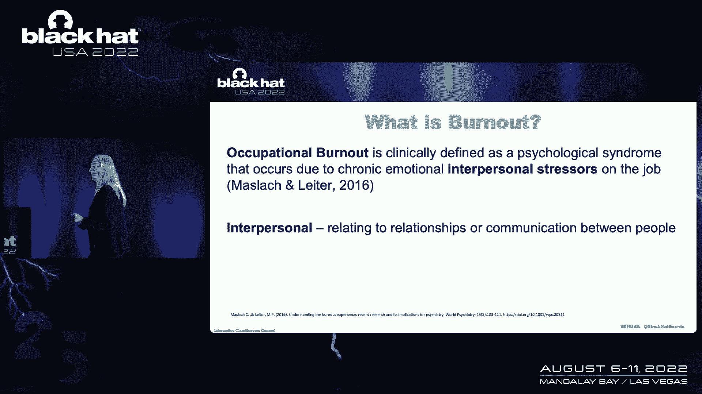

这不一定是你为工作而做的事情，定义为关系，人际关系，人民，你的经理，你生活中的人际关系可能会发生什么，所以我们知道什么是倦怠，我想强调人际关系，所以当我们感到筋疲力尽的时候。

我们倾向于用三种不同的方式来表达它，根据研究，如果你，如果你在这里，你熟悉倦怠，你知道马扎克，里斯倦怠是如何定义情感疲惫的，你累了，你付出了这么多。

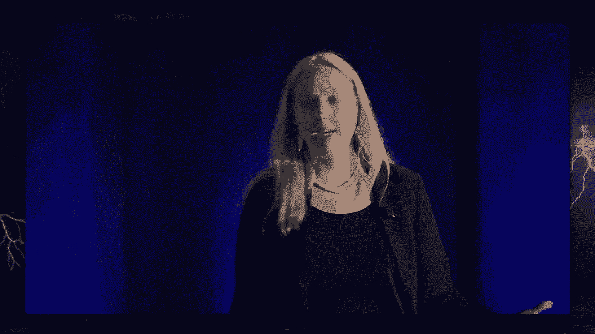

你只是过度扩张和耗尽了你的资源，玩世不恭已经结束了，我很生气，我超然了，我无所谓，你对你的工作不再感到满意了，也许你选择了这个职业，因为你说嘿，我很擅长这个，我喜欢这个，这让我感觉很好，现在你就像。

也许我觉得我明天就要被解雇了，我不擅长这个，我很糟糕，所以我做了一个研究，如果你们中有谁熟悉杰克·唐，以及他对伯内特的研究，我也是那个研究项目的一部分，我们发现在安全行业，最有可能表达。

犬儒主义引起的倦怠反应，所以它独有的东西，对安全行业来说是对倦怠最常见的反应，这种愤世嫉俗，这个断开，我刚刚完成的这种感觉，整个地方都会被烧毁，我只是不会在乎，这种愤怒，这种怨恨。

我们稍后会讨论这个问题，所以我想让你，只是这些是定义，当我们看倦怠，以及我们表达它们的方式，我总是发现观察倦怠很重要，整体上，当你沮丧时，我们是一个人，或者你说在你的工作中，很可能你回家时很生气。

你可能会把它从你的伴侣身上拿走，你可能会把它从你的孩子身上拿走，你可能会在你的朋友身上发泄出来，或者假设你觉得，你工作做得不好，然后你回到家，你的伴侣说，哦，你洗碗了吗，这是你干的吗，你说不。

现在你很好，现在，现在我是个糟糕的搭档，然后你的孩子回家说，我想玩不，否，我现在不行，我是个糟糕的家长，我是说，你只是对你的感受左右为难，它开始产生滚雪球效应，现在你完全耗尽了，所以这并不像你觉得可怕。

就像你在工作中的感觉，你想对这么多人做这么多事情，它开始在你生活的各个方面伤害你，所以很多时候你的愤怒或沮丧通常是针对工作的，在你的生活中被带出这么多不同的领域，所以我只是想把事情安排好。

当我们看到倦怠时，我们从大局和整体的角度来看待它，这对你的生活和你作为一个人有什么影响。

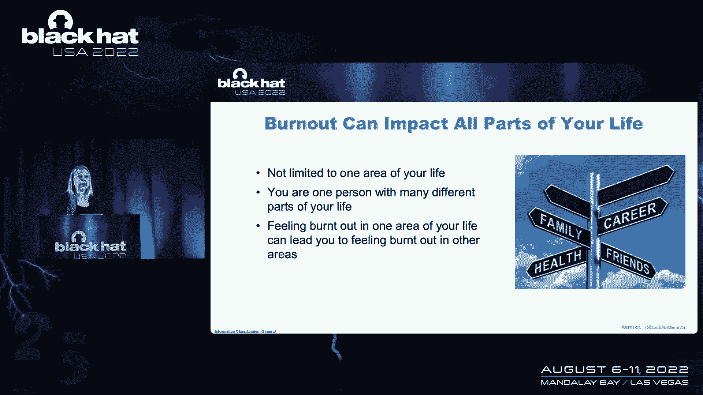

所以让我们特别看看安全行业的倦怠，有趣的是，当很多关于倦怠的研究，他们在寻找照顾者，很多时候你想看看研究，和护士的倦怠，医生，照顾者，外面有很多研究，在其他职业中就不那么重要了，当我们看到安全行业时。

有趣的是，外面有一些研究，但现在需要更多，研究表明，在一些研究中，那个，七十，保安行业百分之七八十的人，正在经历倦怠，这意味着如果有一万人在一万名安全专业人员周围行走，现在在黑帽子里走来走去，我是说。

你能把那八千个，七万，其中五十八千向我烧尽了，这是一个惊人的数字，在一万人中，那么为什么发生了什么，我是说，你们都知道，你可能每天都在生活，3。你说的可能比我说的还要多。

但我认为重要的是认识到它并承认它，因为我们在接下来的三十年里谈论的，我们剩下的一些奇怪的分钟，你就越意识到，你生活中导致倦怠的情况，你就能更好地预测，如何管理它们，如何解决它们。

所以当我们看到安全行业的情况时，导致这些触发器，这导致了我生活中的情况，能够对事情做出反应的脑力工作量，能够预测事情，预料到这些网络攻击，工作人员短缺，工作量的增加，试图在一个组织中找到自己的位置。

如果你在一个组织工作呢，他甚至不明白安全方面发生的事情和它之间的区别，或者你在为一个刚刚成为CEA的人工作，他是被带过来的，也许你知道，比你为之工作的人更了解安全的细微差别，这让你压力很大。

因为你试图说服他们你需要的工具，我是说所有这些不同的事情，很多时候，组织中的人通常不了解安全实践，更不用说怎么养活你了，更不用说如何管理和平衡了，所有不同的要求，这在组织中并不经常受到赞赏。

我是说我甚至把这些都写下来了，然而，我一直处于我们试图通过一份新合同的境地，我们有一个可怜的很棒但灵魂安全的人，他做了审计，审查了一切，我们在排队，我们不得不等待，它阻碍了我们的合同，我们正在努力。

他们想轻轻地走，你能快点吗？你能快点吗？我要去，不要，不要，这个人通过确保我们不引入新的程序来帮助我们公司，这将是脆弱的，并损害公司。

每个人都很沮丧，因为他们想加快速度，因为这会造成延误，我甚至更清楚，我仍然，你知道吗，想去找我们可怜的保安，我是说，所有这些我们不明白的事情，如果我们一开始就不了解安全，人们如何开始理解。

如何帮助在安全行业工作的人，所以如果你上网看OK，我们该怎么治疗倦怠，这就是让我发疯的地方，这通常是你开始发现的，冥想，获得新的爱好，少工作，休息一下，去度假，所以当我精疲力竭的时候，当我在黑暗的地方。

就像真正黑暗的地方，我看着这个，我就像，哦好吧，是啊，是啊，所有的权利，所以少干点，所以我现在压力太大了，我觉得，如果我不给它，我的全部，我要被炒鱿鱼了，我做得很糟糕，所以如果我少工作。

我的焦虑要爆棚了，所以我觉得我不能休息，好吧，去度假吧，我打算用这个假期来检查我的电子邮件，吓坏了，我老板会一直打电话给我，现在我的家人会生我的气，因为我花了所有的时间检查我的电子邮件和做工作。

现在我花了钱，我可能不应该去度假，每个人都在生我的气，因为也许不是，我是，我是说，所有这些，做事情，做事情，做事情冥想，呼吸，新爱好，我们把钱花在新的爱好上，这些爱好将坐在角落里，盯着我，好的，是啊。

是啊，我有珀洛东脚本订阅，每个月它都用那个小东西盯着我，我不会取消它，它不会，我不会取消的，我不会让它赢的，但我还没准备好去重新开始锻炼，因为我累了，我还没准备好做这件事，当我筋疲力尽的时候就吃。

我在我黑暗的地方，我还没准备好去，做沙拉开心，我坐在一堆玉米卷下面，钟形包装纸几乎不能工作，好的，就像这样，我不在这里，我很想在这里，但我不在这里，所以我寻找这些倦怠策略，我得到了这些活泼的快乐。

做所有这些事情，这让我很生气，好的，我知道我想去那里，但我读了这些，我走了，好的，精细，你说的对，这是个好建议，我不是说，这不是好建议，这是个好建议，我不知道怎么去那儿，虽然，我不知道，我很沮丧。

我很焦虑，我很伤心，我对自己的感觉不够好，甚至不能去那里，那么我该怎么办，我该怎么办，我怎么去那儿？帮帮我，帮我到那里，因为这就是我在的地方，好的，这就是我的处境。

那么我该怎么做你告诉我这样做是为了我的倦怠，我和你在一起，但事实是，从长远来看，这感觉很好。

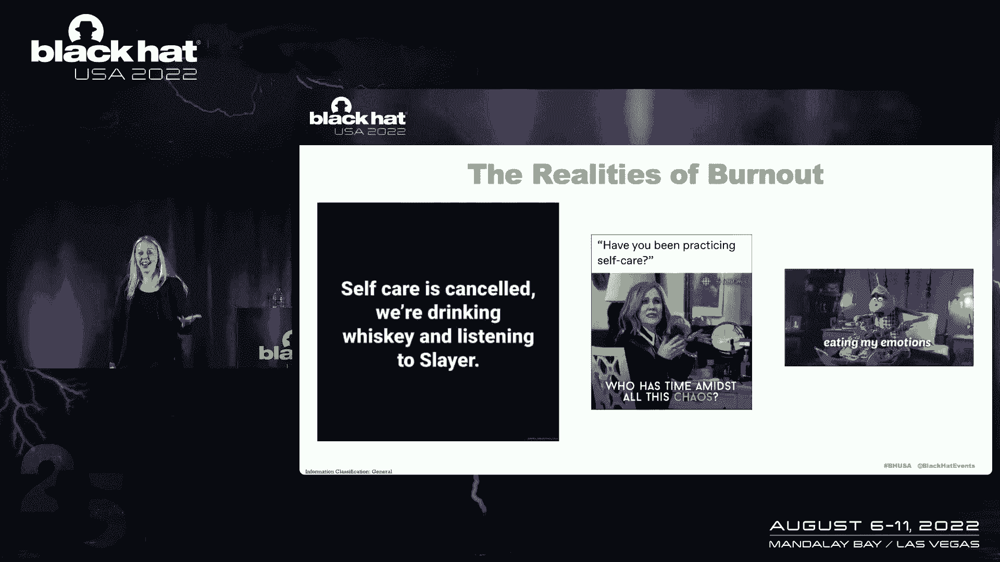

但这不会让我，我知道我没有解决我的问题，我知道我不是真的在做让我，我需要去的地方，有一个短期的解决方案，我知道这一点，因为当我重了30磅从宿醉中恢复过来的时候，或者你知道它是什么。

我知道我只是让自己感觉更糟，感觉更糟，所以我得去个好地方，但我怎么去那里，所以我们来谈谈这个，所以这个会回来的，但作为一个外壳，我们有我所说的倦怠分类法，因为这是你从吃我的感觉中得不到的过程。

几乎不起作用，我要去吃健康的东西，好好的，休息一下，去冥想，一夜之间变得禅宗和伟大，也许你不能，我看不出没有人是，如果你这样做了，请务必告诉我该怎么办，我上来交换，我和你交换，因为我很想听，我不知道。

但我称之为生存，因为很多时候你就是这么做的，有时你还是被烧毁了，你只是在一个如此黑暗的地方，你正在生存，你作为一种应对机制而生存，这就是你的处境，那么我们如何获得解脱和我们所说的自我效能感。

我会仔细检查的，好的，现在让我们来谈谈第一步，我知道今天在座的很多人，你想让我告诉你。

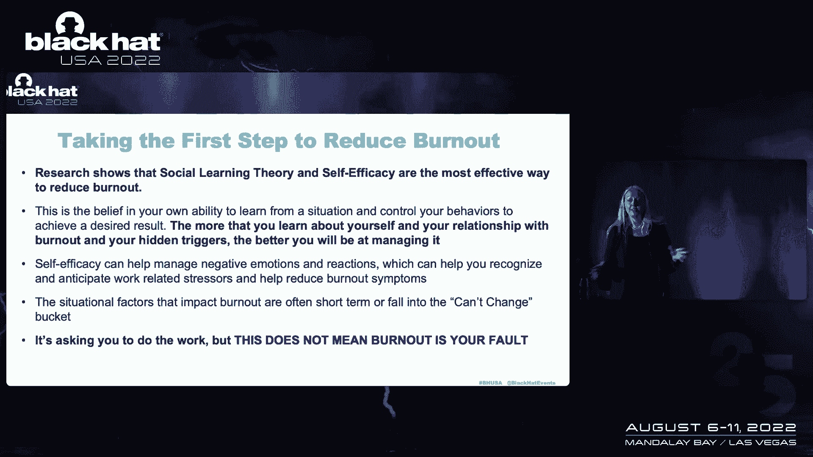

这就是你所做的，这是一种神奇的灵丹妙药，是药丸，这是一个声明，这是一件事，这是你可以做的事情，喜欢拥有它，我真的会，所以不要生我的气，但我没有，好的，但这是我给你的，所以研究表明。

就解决倦怠最有效的方法而言，所以社会学习理论与自我效能感，那么这意味着什么，所以这意味着你对自己了解得越多，你越增强你的意识，你对自己的反应了解得越多，你的触发器。

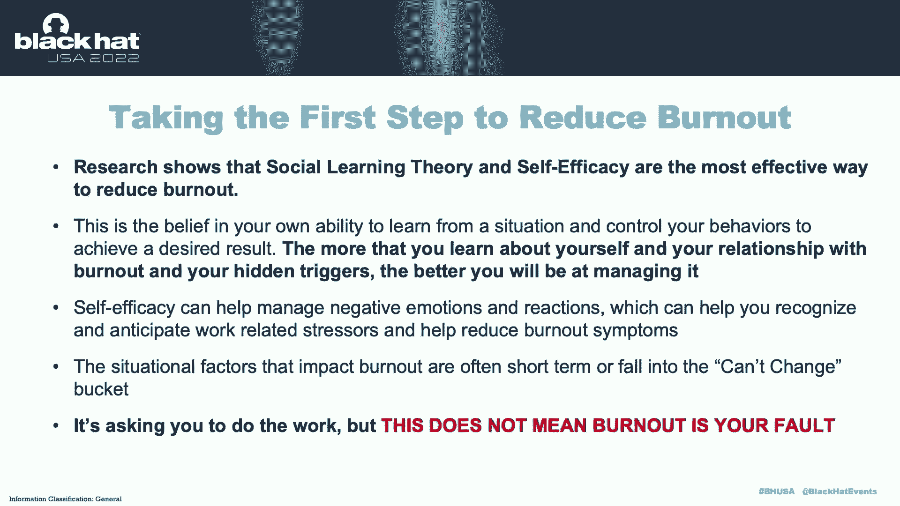

你的信仰，你的叙述，你就越能更好地管理它，对呀，因为我们可以进入一些情境因素，所以一些创可贴，哦好吧，好的，如果我有了新老板，或者那个工作做得不够让我发疯的同事，但其中一些情境因素可能会改变，但它不是。

有时这只是一个短暂的修复，然后也许你换了工作，但有新的东西让你筋疲力尽，你可能会发现同样的模式在不同的地方发生，并不总是以同样的方式，给我点赞，我知道我知道我的焦虑触发了，我知道对我来说，对我来说。

这通常是情感疲惫的作品，无论我现在走到哪里，这都会发生，有时在情境因素中，你有一个有毒的工作环境，一个老板，我们也要谈谈这个，当我们谈论意识时，你知道它变成了它，我能控制的东西，是不是。

一些我无法控制的事情，我们如何让这种意识能够采取下一步，但重要的是，即使社会学习理论和自我效能感，它可能在要求你做，认识到自己处境的工作，认识到你可以控制或改变什么，我不是说倦怠是你的错。

我认为承认这一点非常重要，有很多糟糕的情况和有毒的工作场所，管理不善的局势，太多负面的情况会导致倦怠。

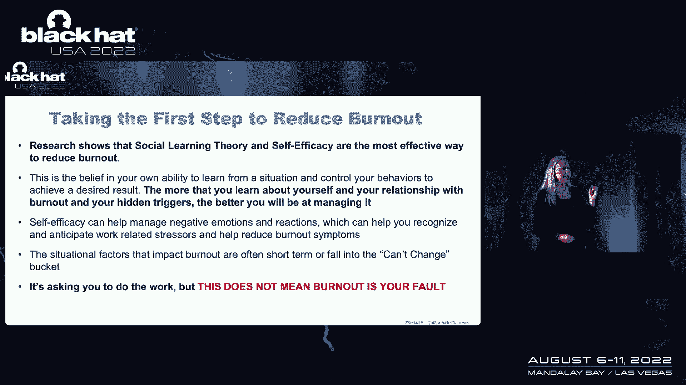

令人沮丧的，你对此感到无助，不仅仅是无助，但很生气，愤怒，挫折只会让你彻夜难眠，炖，因为你很生气，因为你在工作上投入了太多，你想被听到，你想被欣赏，我的意思是很多事情，然后我就来了，说得很好。

如果你只是改变你对如何做到这一点的叙述，你知道吗，是啊，是啊，好吧，我明白了，我有，但这也是它的摩擦，所以让我们谈谈这个，但我想说清楚让你做这项工作，但要求你思考你能改变什么，不能改变什么。

这并不是说这是你的错，某人管理不善，或者某人有毒的工作环境，问路，你对它的反应意味着你是它的原因，但它看的是你能控制什么，不能控制什么，因为事情是这样的，在一天结束的时候。

你受到你能控制和不能控制的东西的影响，如果有人是个糟糕的领导者，你可以提出这些建议，有很多次我进入了一个工作环境。

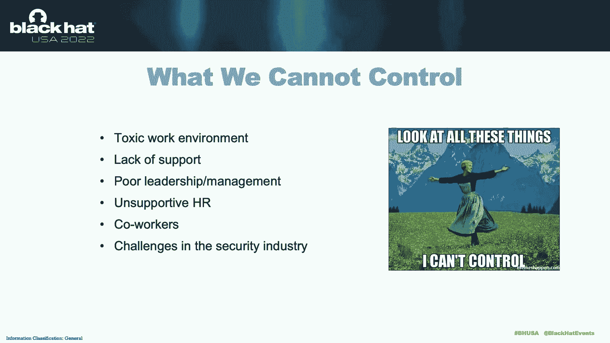

我被带进来了，他们说去修复我的团队，我不得不转过身来说，好的，但你愿意也改变吗，因为除非你作为一个经理愿意改变，我能做的只有这么多，如果经理的答案是否定的，那么我是有限的，然后我通常会说好吧。

我和团队一起工作过，我告诉你上一个和我合作的团队，我和团队一起工作，他们建立了信心，他们控制住了自己的倦怠，然后在那种特殊的情况下，他们中的一些人找到了新的角色，他们中的一些人平静地工作。

找到了一个更快乐的地方，他们能够管理它，但它从来没有真正取得好的成果，成为团队的潜力，但工作人员至少能找到一个地方，在那里他们没有愤怒和怨恨，然后又去了那个黑暗的地方，因为我们需要看看我们能控制什么。

因为当你生气的时候，当你晚上醒着的时候，怒气冲冲，你在受苦，你受伤了，可悲的是如果你被烧毁了，和你的经理，或者他们可能在睡觉，没问题，你才是受伤的人，I’对不起，你才是受伤的人，生气的人是你。

痛苦的是你的人际关系，这就是它可悲的部分，是你生活中的处境让你痛苦，所以我们必须看看所有这些东西，我们如何应对它们，触发因素是什么，所以如果你有，说一个和你相处不好的经理，或者同事，那是怎么回事。

开始拉这些线，问这些问题，它是怎么回事，好吧，为什么这让我这么沮丧，这些都是很难问的问题，因为他们很难回答，我不知道，这是事物的原理，1。我每天都来上班，从九点到五点，这个人十点钟出现，他们每天都迟到。

意思是我得做更多的工作，这是不对的，你说的对，你说的对，但你生气是有原因的，而你是那个受苦的人，这就是我的意思，答案就在那里，正确答案，我希望你能说，你知道吗，你说得很对，那个人应该在九点钟出现。

如果不早，承担他们的工作，但我们无法控制那个人，你在脚踝上，这个故事，当我谈到你的心理剧本和叙述时，1。你去西藏多少次了？或者你坐在那里想，只是告诉自己这个故事，哦，他们应该会及时出现。

你一遍又一遍地反刍，在你的脑海里告诉它，因为你疯了，你这么做了，你能控制什么。

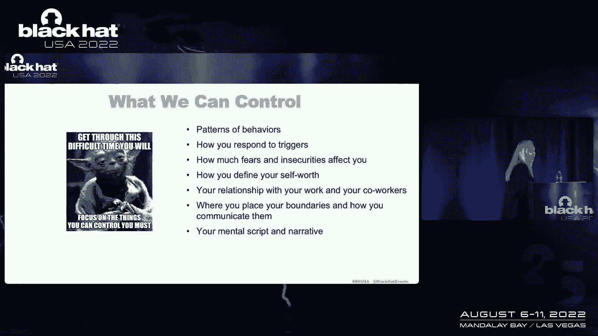

你控制不了什么，所以让我们来看看这里的一些现实世界的例子，所以好吧，这么说吧，你有一大堆工作要做，工作落后了好吧，有一个情绪疲惫的片段，所以你不同的反应，好的，我要呆到很晚，我知道以前要熬夜。

但我想尽我所能鞭策自己，什么都做，我老板找我，因为这是一种认可的感觉，我要把自己逼得太紧，愤世嫉俗和愤怒，这是管理不善，如果我有一个好经理，这东西就不会这么备份了，见鬼，我要走了，我不在乎。

不是我的问题，他们是个差劲的经理，我不需要给任何，和他们在一起，专业功效，我以前很擅长这个，我以前能做这项任务并享受它，不能再这样了，我不认为我擅长我的工作，你所感受到的所有这些情绪，然而。

你选择表达它，无论你如何认同它，这些可能是熟悉的情况，这些可能会引起共鸣，他们可能不会，所以它变成了问自己，好的，这就是我们有正当理由的回应方式，一次又一次，你对倦怠的感觉都是有效的，但是问。

我为什么要这么做，为什么我这么强迫自己，我在这里需要什么，为什么，当我在九点收到短信或消息时，m，晚上，我觉得有必要回答，是什么促使我做那件事，那么信任是什么时候被打破的，你为什么生气，这是哪里。

我不在乎，如果整个地方都着火了，所以这个很难，我想弄清楚界限和犬儒主义之间的区别，因为这是一个情绪化的作品，就是当你说，的边界，我要朝九晚五地工作，因为我需要为我自己这么做，因为这是协议，我们朝九晚五。

这是一个，我要朝九晚五地工作，我不在乎你还需要什么，因为你很烂，就是这样，这是它来自哪里的情感片段，如果你曾经在附近，也是愤世嫉俗的同事，发泄的，愤怒的人，那些曾经和有毒员工在一起的人。

我有一次和一个小组一起工作。

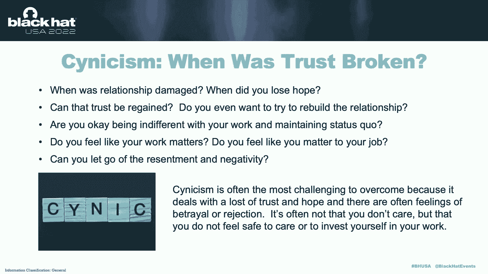

只有一个员工，他是如此愤世嫉俗，如此精疲力竭，非常生气，以至于任何基本上站着不动五分钟的人，他告诉他们在那里工作有多糟糕，所以它变成了一个非常有毒的工作环境。

因为即使是那些试图对他们的工作环境更加积极的人，并试图解决它，他就会在那里，愤怒，愤怒，愤怒，愤怒，所以它试图设定界限，怎样才能不生气并把自己从愤怒中解放出来，因为再一次，愤怒的人不是你。

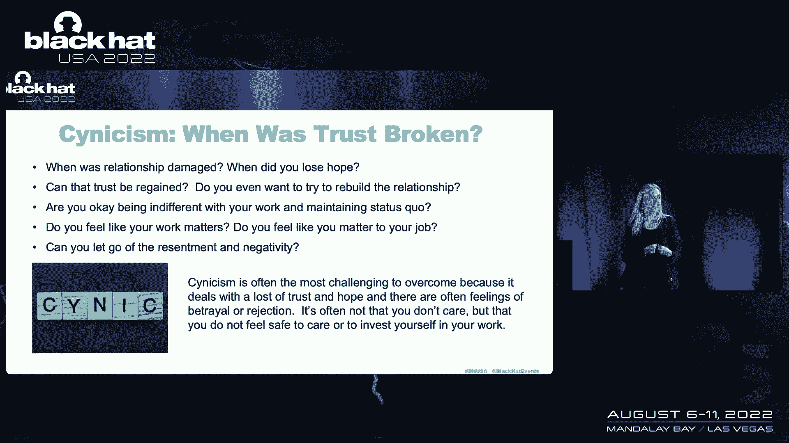

你是那个又把它带回家的人，不是你的错，有些事情会让你生气，在某些情况下，有些事情会让你生气，但你能做些什么来帮助自己摆脱愤怒，从中找到平静，然后再一次，你什么时候觉得自己被重视了。

什么会让你觉得自己被重视，所以说，不管是什么，你表达倦怠的方式，什么能帮助职业救济，所以不管是什么，当你看着，这就是我如何表达我的倦怠，所以首先识别，假设我们在这里生存，好吧，我们吃我们的感觉。

我们在喝威士忌，我们在听杀手，不管是什么，我们是，东西，我意识到了，我累坏了，这样不好，我现在生活中发生的事情不好，忘了做的事，忘记应该，别管那些了，对它的认识，我可以做点什么，停在那里。

我真的远离该做的和该做的，我经常提醒自己的一件事是，一旦你开始进入你的脑海，我应该这么做，我应该这么做，你应该全身都是，别在自己身上拉屎，因为你在你的生存中，我们打自己。

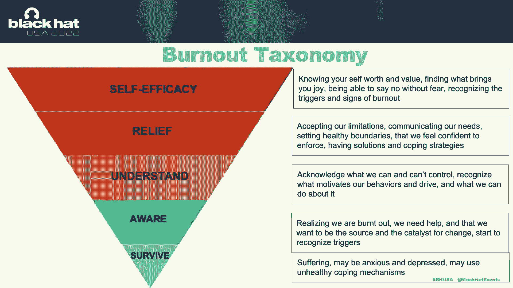

我应该这么做，我应该做得更多，或者他们应该这么做，他们应该这么做，他们应该这么做，无论你的愤怒在哪里，无论它在哪里，外部，你的悲伤，它在那里，这些情绪是有效的，它们是真实的，情感的问题是，我们不想。

谁想感觉不好，我不想感觉不好，当我们否认自己的能力，只是坐在那里意识到这一点，说我现在很难过，那很难，有时只是坐在那里，坐在那里，我们不必坐在那里，好吧，我累坏了，这可不行，我的生活不好，现在我不好。

现在我不高兴，我躺在地板上，带着22升山露水瓶，五袋塔可钟和三袋阿比，不要评头论足，好的，就像，这不是我现在想去的地方，别误会我的意思，有几次我说是的，我有我所有的玉米卷铃铛袋，我喜欢阿比的，没有判断。

但我对此很满意，因为这是一个快乐的选择，但你想在哪里好，这不是我现在真正想去的地方，我想去哪里什么，我想做正在发生的事情吗，使意识。

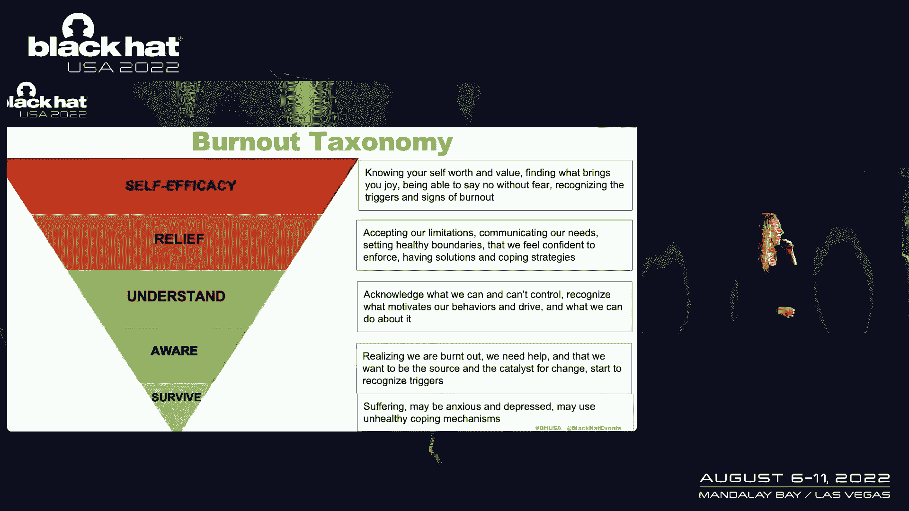

i，这必须改变，我要让改变发生，别发疯，别开始承诺，你不能承诺，别着急，因为我想当你匆匆忙忙的时候，当你开始喜欢，我要去健身房，我每天要跑五英里，好像我不知道，但你知道，如果你在这里犯过罪。

开始了一个节食计划，然后失败了二十次，你只是感觉更糟，有时候，就像为自己的成功做好准备，不管是什么，它可以是婴儿的步骤，但要为自己的成功做好准备，并开始理解它，所以这就是为什么我要问问题，喜欢好。

我为什么要这么做，我有什么感觉，做，我喜欢这个，开始理解它，所以当你去理解它的时候，然后你开始找到解脱，因为你明白，好的，这是当这个人这样做的时候，真的要把我气疯了，我要去散散步，我要去做些不同的事。

我知道当他们这么做的时候会触发我，也许我要去别的地方坐，也许我只是要离开一步，我会在我们每天的会议上安排时间，真的让我很沮丧，所以我会安排十五分钟后，休息一下，不要背靠背，我要开始意识到会发生什么。

我要寻找模式，努力管理让我沮丧的事情，然后最终我把它提升到我们所说的自我效能感，正如我提到的，所以这就是知道你的价值，能够预见，能够有这种意识，因为研究表明这是管理倦怠的最好方法，学习自己，学习自己。

了解你的情况，基本上可以在这些东西上进行柔术，就像，哦，我看到你来了，躲开它，躲开它，明白了，把它移回来，我是说现在只是了解情况，这并不意味着，如果你在一个糟糕的情况下，你不能只是擦亮你的简历。

说这不起作用，我们需要结束这一切，好的，我是说，你知道你的生活，你知道你自己，你知道你的世界，但就像任何关系一样，你和你的工作有关系，你和你的家人有关系，你和你生活中的人有关系，在你的生活中。

你确实有经验，评估关系，这段感情对我来说值得吗，我从中得到了我需要的吗，我应该在这段关系中，你和工作的关系是一样的，这需要工作，它需要交流，需要理解，它需要改变，所以一些快速的建议和提示，又快又脏的。

知道自己的极限和目标，你的目标是什么，你想成为什么，幸福对你来说是什么样子的，你想从你的工作中得到什么，你可能会有与工作本身无关的大的职业道路，或者你的公司，但如果你不知道它是什么样子。

你怎么知道你是否在那里，所以这只是需要考虑的事情，你想要什么，这是什么，它看起来像什么，所以说，我知道，当我过度扩张自己的时候，我正在努力得到批准，我很高兴，它看起来像什么，你知道的，如果我在想，哦。

我要被炒鱿鱼了，如果我不回这条9点打来的短信，就像嗯，等一下，这是真的吗？擅长我的工作是什么样子的，我只是让焦虑占据了我的身体吗，现在就寻求帮助，这是这是一个大的，因为我告诉你的很多事情，我站在这里。

去问问你自己这些问题，是啊，是啊，这在很大程度上得益于专业的帮助，要么通过教练，我会通过专业帮助教练来讨论这个问题，寻求帮助，你可以从中受益，帮助提高这种意识，知道你的触发器，你知道你的触发器。

外部和内部，有时我们是自己最糟糕的批评者，我们批评自己，了解你内心的批评家，别光闭嘴，如果你必须喜欢，能够知道像，我正在做那件事，请不要再做那件事了，比如能够穿越这条小路以及那些让我产生期望的情况。

对你有什么要求，我喜欢这个，4%2%规则的想法，对呀，每天4。2%的时间应该用来休息做一些缓解压力的事情，我不知道是谁想出了那个确切的数字，我是说我个人没有，但就喜欢而言，这就是研究表明的。

但我不知道有谁会把每天42%的时间，只是照顾自己和自我照顾，但我喜欢这个主意，就像，你知道的，有时人们不看，我就像，等一下，好的，百分之四十二我做的数字，1。我现在在哪儿？我还不到四岁，百分之二。

就像我早上醒来，我送我的孩子上学，我去上班，我去接我的孩子，我回到家，然后我每天有两个小时，我玩一些电子游戏，是啊，是啊，很好玩的，它不是，我不认为那是自我照顾，那更像是，我只是在审查。

我在放松自我照顾，而是把它带来，它让我充满活力吗，这是一个棘手的问题，我喜欢我的电子游戏，好玩，但那更像是，我只需要喜欢，冷静一分钟，有几件事，我仍然在追求这个，但就像什么让我满足，这让我觉得是的。

这让我感觉很棒，当我做这件事的时候，我在生活中获胜，对呀，就像我们有那个吗，我还在努力寻找，有几件事，但是，因为有时我们从工作中找不到自我价值，当我很久以前开始我的职业道路时，很好。

如果我们要花这么多时间在工作上，我想了解员工敬业度和所有这些事情，因为如果我们要花那么多时间在工作上，我们应该热爱我们正在做的事情，我们应该感到被它验证了，我们花了这么多时间和精力。

我们花在工作上的时间比其他任何地方都多，那我们早就应该爱上它了，但我仍然相信我有，我有，但如果你在工作中找不到，如果你没有机会，根据安全行业的性质，工作环境的性质，无论你身处何方。

但有没有什么能让你充满活力，在那里你可以说，你知道吗，这是我的工作，情况就是这样，我需要在它周围放一个小栅栏，说我要做我的工作，今天结束时我要离开，然后我要去做我的爱好，这让我感觉很棒。

或者我要去和我的朋友出去玩，或者我要去和我的家人在一起，你知道不管是什么，什么让你充满活力，把它带回到，你想要什么，庆祝一下，以小事为乐，你的工作很重要，你很重要，但在你的生活中找到你自己。

你的工作不一定要定义你，它不必定义你的幸福，听起来很陈词滥调，陈词滥调，他们会找到你的幸福并捍卫它，你知道我就像我说的，当我开始，我很想给你一些神奇的解决方案，上面写着这就是你所做的。

如果你去做这些美好的事情，这会减少你的倦怠，每个人都离开了又回来了，明年再见，你就像嗨史黛西，我现在真的很高兴，我一点也没有筋疲力尽，那就太棒了，我很乐意抱歉，我不是来告诉你那部分的。

但在那里我可以告诉你，我可以告诉你，我相信你们每个人都能走出这个房间，做工作，找到幸福，保护它，以你选择的方式，我相信，我很高兴去和你讨论这个问题，如果你想在接下来的会议中，因为我知道我们只有几分钟。

这就没有太多的时间来做Q和A或任何事情，但我也很乐意在会议结束后讨论这个问题，把我们带到最后一次资源和工具，这些都是可以帮助你的工具，实际上，甚至只是应用了我今天所说的一些东西，在专业治疗师方面。

在我看来，这将永远，成为你最好的赌注，我是说，他们就是这么做的，他们试图帮你穿过并拉动那些线，问你这些问题，说什么让你快乐，如果没有别的，好像有整整一个小时，只是谈谈你生活中的问题，帮助你解决它。

现在有了远程治疗，嗯，这确实有助于让事情变得更容易，因为嗯，你不必离开你的房子，我喜欢那样，我不想离开我的房子，人生导师，物理私人教练，自我护理守则，我是说所有这些，所有这些事情，有机会。

有资源可以帮助你，但是，所以再一次，把它绑回去，它可能会发生，有一些方法可以减少倦怠，又有情况了，我确实有激情和同理心，你在工作上投入了很多，我想如果你在这个房间里，很可能你很痛苦，你得不到什么。

你投入到你的工作环境中，你累了，你生气了，从你的倦怠中你现在是一个情感的财富，你不必，你不应该，你不应该，你，不配，所以我希望，如果有什么，当你离开这个谈话，你可以坐在那里，你不应该被烧坏。

但你们每一个人，无论它是什么，都能找到一种不存在的方式，不管有什么选择，但首先，我只是坐在那里，说我不需要没事，让我们从那个开始，然后决定你想做什么，你可以从那里去哪里。

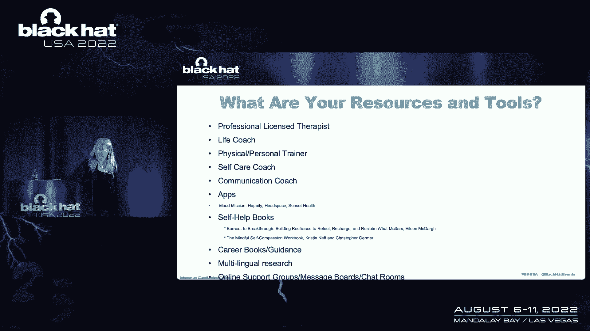