# 【转载】Black Hat USA 2022 会议视频 - P83：094 - TruEMU： An Extensible, Open-Source, Whole-System iOS Emulator - 坤坤武特 - BV1WK41167dt

 [MUSIC PLAYING]。

 Hello， so very welcome to my talk。 I'm true。 We have also three team members who will not be presenting here。

 who is Antonio， Kim， and Dave。 So a little bit on myself。 My channel is on the screen。

 I'm currently an undergraduates， computer science student， at Purdue University in the US。

 I'm from Vietnam。 Currently， I'm focusing on Mac OS and iOS research。

 I used to talk about CTF write-ups， a challenge， but I have ceased doing from weeks since quite a long。

 So to a agenda， first， we will discuss， the current state of iOS research。

 Then we can look at our design goal in building an emulator。

 Then we will talk about how we implemented it， and also the ways that we can use。

 to remove for research。 Then we'll talk about its future and roadmaps。 So let's dive right in。

 So we need to talk about the current way， we're doing iOS research。

 The most common way is to use real device。 And you also have a few options for that。 First。

 you can use something called， security research device by Apple。 There is a real device。 However。

 the main problem with this， is that you have to say NDIS， and you're obligated。

 to report all of your findings to Apple。 Now， the option is to use internal device。

 So this device is mostly stolen， because it's only limited to internal userly。

 So you have some legal issues there， so it might not be preferable for most of researchers。

 And also， these devices are really rare， because they have to be leaked。

 On the left is some of these devices on the right。 It's the cables that you'll be using。

 when to debug this device。 Next， you can use of the shout-as-joboken device。

 So this device you can get from the store， but you have to hack it first to do research it。

 So it's already a high barrier to deal with。 However， there are some recent research。

 with the Checkmate Exploin， which allows you to do debugging。

 Provided that you can build just our cables， on the right， the pictures on the right。

 This is set up by another researcher。 Another option is for non-joboken device。

 This device highly sandboxed and recircle。 So it's really hard to do work with it。

 because you're only limited to the panic lock， which is not interactive at all if you want to do kernel。

 debugging， and hacking， or something like that。 You can also use ARM maps。

 And with all of these problems posed by real device， we try to solve some of them using emulation。

 So some options for emulation as well。

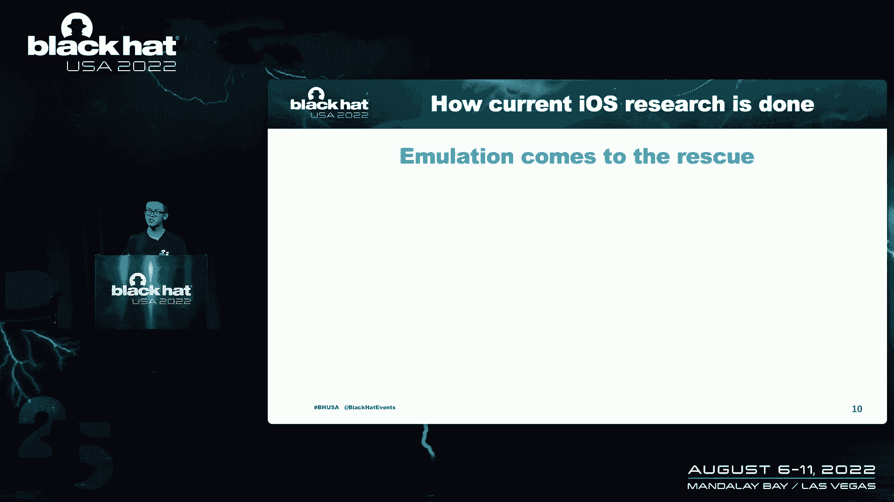

 You have the third-party commercial LSM-writer。 These are pretty popular。

 Pretty state-of-the-art are really cool。 But however， they are pretty expensive。

 so I never try it personally。 And if you want to dive into more level stuff， such as iBook or set。

 it is also limited to on-premises only。 So unless you are a big company or a government agency。

 you probably cannot get access to it。 You can also use VM Apple。

 which is a Mac VM provided by Apple。

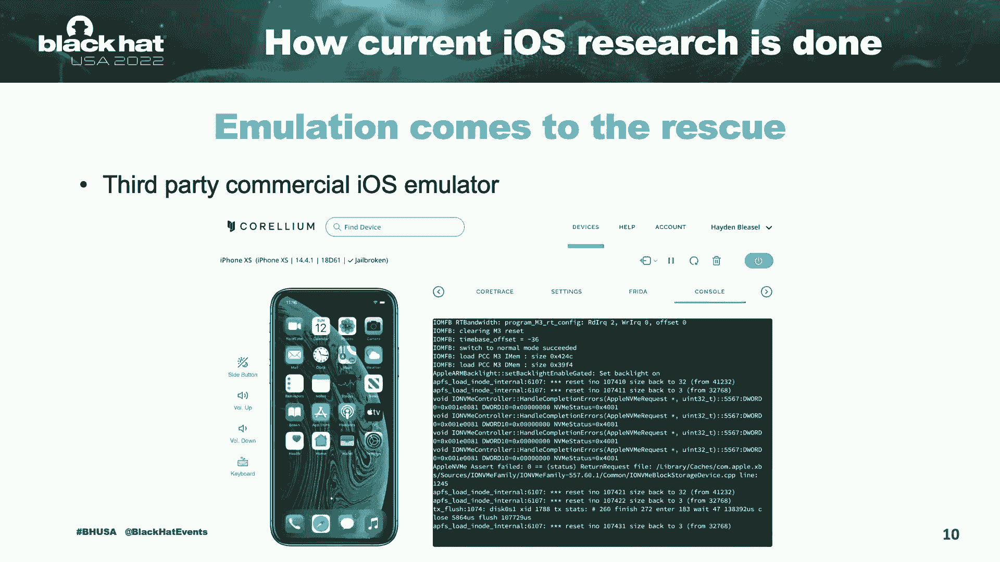

 These are also limited in customization， but some people have managed to do some really cool work with it。

 And you can also use our last security or QMUPOT。 So these are presented at Europe in 2019。

 But however， the problem is that they only， support two iOS versions only。 So that's really limited。

 They also have very limited hardware support。 And it also has a really hard to maintain。

 because of the code quality。 And it's also abandoned by now。 So we try to build an emulator that。

 can solve that much of the problems that both by these， methods are possible。

 So now let's talk about its design goal。 So we want to free to use iOS research emulator。

 So it's as free search fully as possible。 And by that， we want to have a right range of iOS version。

 support。 We also want to debug the kernel easily。 And we also want to use it for fuzzing。

 So with these design goals， we have come up， with some very notable features。 First。

 the emulator model actual hardware。 So it tries to be as close to the real hardware as possible。

 It's a far-right range of iOS version， ranging from iOS 14 to iOS 16， which is going to still。

 in beta。 We also support secure ARM and iBook。sub。 But that is very experimental， brand new。

 You can also debug the kernel with it very easily。 It also has USB support。

 So you can install real iOS。 It also supports some custom CPU features by Apple。

 And the best part is that we are open sourced。 So you can check our report。

 which is in the cure on the slide。 So how did we do that？ Well， there are a lot of challenges。

 And we will walk you through the general ideas。 So how does the new device get modeled？ Well。

 first we will look for the information in the device tree。 Then we'll build a stop model。

 So a model that does nothing but basically locks every。

 access by the-- like every injection from the CPU。 And with these tools。

 we can do dynamic and static reverse， engineering to see how does the hardware behave， how does it。

 works。 And then once we know the protocol， we can write。

 emulation code to emulate the needed response。 And then we have a device that is emulated。

 So let's look to some steps。 First， the device tree。 The device tree can be found in iOS firmware。

 which you can， download from Apple。 The best thing about it is that it contains the rich amount。

 of peripherals information and is used heavily by the iOS， kernel to match drivers。

 So let's have a look at the example entry。

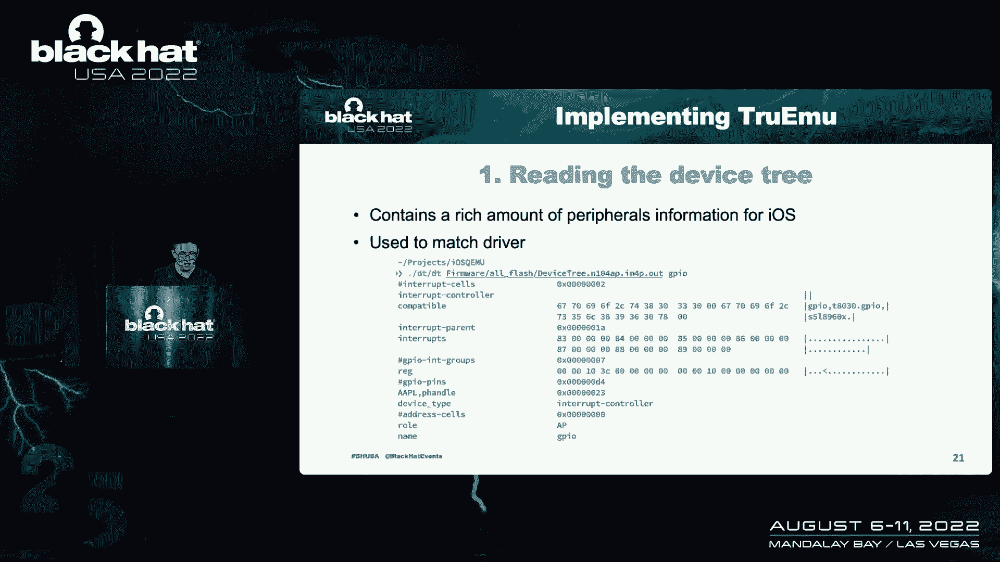

 So on the screen is the device tree entry of the GPI controller。

 So on the left is the property name and on the right is， values。

 Let's have a look at some interesting ones。 So the arrows is currently pointing to the comparable。

 property。 So the comparable property is used to match drivers。

 So it will look at the strings in the comparable， property and then find the appropriate drivers for the。

 correct device。 And another interesting one is interrupts。

 So this is basically a list of interrupts that the device， reviews。 So in this case。

 the GPI will use 803 to height 89 interrupts。 You also have the rec entry。

 which is basically where the， device is in the memory。 So basically it's MMIO address。

 And you also have the number， the hash GPI opins， which is， shorter for a number of UPL pins。

 This device has。 So with this information， we can build a sub model。

 So we map a dummy memory region into the MMIO address in， the device tree。

 Then on each rise or each access by the CPU will lock them， and then print a back trace。

 And with a back trace， we can travel through relay record to， see what is the logic of the software。

 what is it trying to， do， something like that。 And we can also even try to drive the interrupt lines to。

 see how the interrupts are processed。 So here is an example log from the display controller。

 So you can see it。 But we have the offset。 The CPU is right into the value。

 And also the back trace PC。 So we can easily navigate to the iOS kernel code。

 Next is really interesting CPU features。 Custom one by Apple。 So it's called SPRGXF。

 This uses both iOS kernel and also in user length browser。

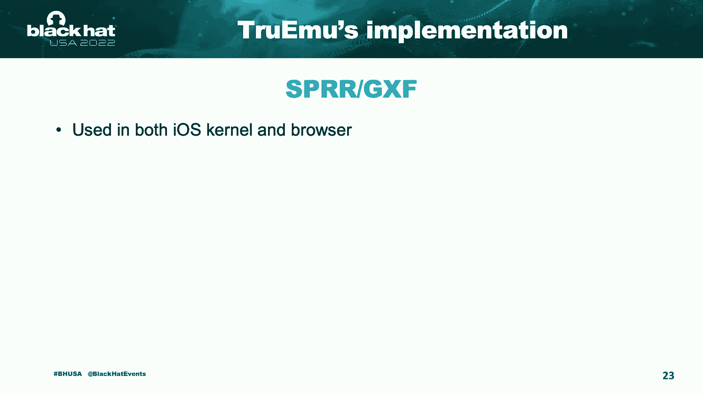

 It's basically a custom privilege level created by Apple。

 So how does this privilege level fits into the normal one？ You may ask。 Well。

 let's have a look at the normal privilege level model。 So we have EL3 to EL0， the higher number。

 the more， privilege it is。 So EL0 is the user's play。 And EL3 is the supervisor。 So for GXF。

 it basically creates a GL2 and GL3。 It's largely from the normal one。

 So GL2 is guarded mode for EL2。 So it is more privilege compared to normal EL2。

 So GXF is shorted for guarded execution feature。 So you have a guarded execution level。 To enter it。

 you use the G。Enter instruction， which is a， non-standard one。

 And you can use GXF to exit from the guard mode to normal mode。

 So the difference between guarded and normal mode is that， guard mode can have different permission。

 So you can create pages that can only be written by guarded。

 mode but cannot be modified by normal mode。 So here is how it works。

 So on the screen is the normal page descriptor。

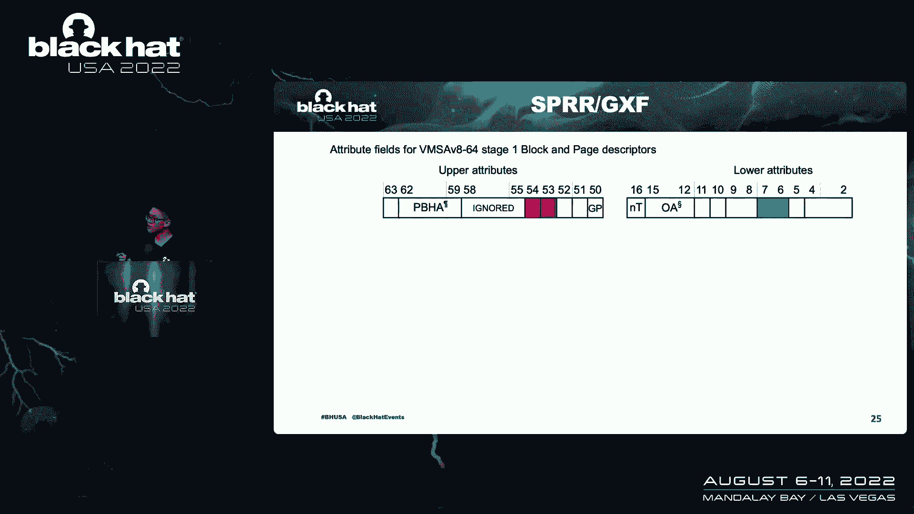

 So this describes the permission of the page。 So it is readable， writable， or icerkeatable。

 So the color bits are the ones that use to determine the， permission。 However。

 Apple changed the definition of this bit。 And they changed the convert into index。

 So they match it into an index instead of， passing it a permission itself。

 And the index is used to look up on the permission， register， which is 64-bit。

 And you can have 16 permission index。 And each permission will have four bits， which will。

 describe the permission each page half。 So two bits for guarded mode and two bits for normal mode。

 So permission bits on page level now becomes indexed for a， system register。

 So how is using iOS kernel？ Well， Apple has a thing called page protection layer， which。

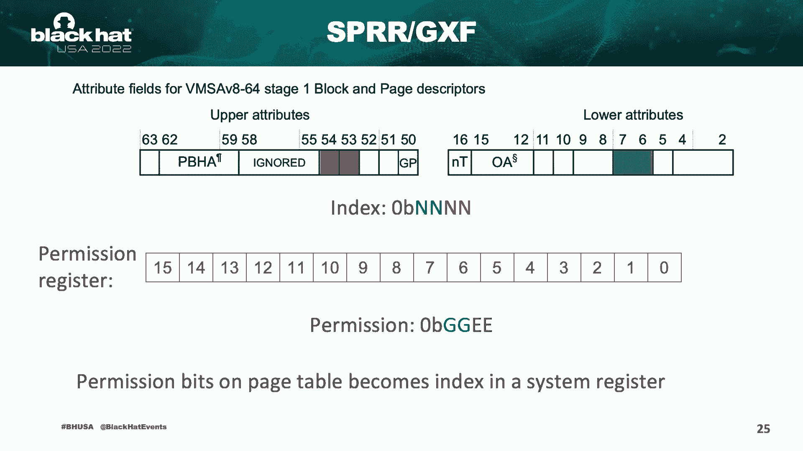

 is normally shotted for PPL。 This contains seriality sensitive code。

 So when you compare the size of guarded code and normal， code， you can see a large difference。

 So from my comparison， it shows that there are more， than 300 times smaller for guarded code。

 So which means that a seriality sensitive code has less， attack surface。 If you attack--。

 when you attack it the normal mode， you also need to PPL。

 in order to do more fancy exploration primitives。 So you can jump from guarded mode to normal mode。

 but not， the other way around。 The other way is being used is for JIT。

 So browsers tends to use JIT to speed up the execution， process of JavaScript。

 So what it does is compile JavaScript to native code。 So to do that， it has--。

 it creates pages that are both writable and executable。 However， these are some problems。

 For JIT page， you constantly need to switch between this mode。 When you're compiling。

 you need to switch to right mode。 And when you're executing， you need to have it in， execute mode。

 So changing the permission， generate text a lot of--， it's pretty slow。

 It takes a lot of work from the CPU。 So performance is too great。

 So I put design SPR to fix this problem to improve the， speed of the JIT compiler。

 So let's have the process of changing。 So this is an excerpt from the method that changed the。

 right protection mode。 So this is a method that changed between grid execute。

 to write or read write and vice versa。 So on the left is a path for iso queue mode and on the。

 right is for the write mode。 So the different between two paths is show by the top arrows。

 which are the values it read from the different location。

 So the first location will contain the values that will。

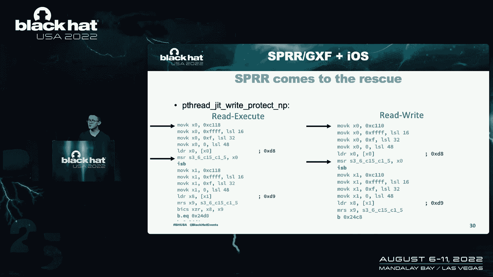

 config their page to iso queue mode and all write mode。 So the MSR here is the trick。

 If you went to simplify the MSR instruction， it will change。

 the permission of the page that is SPR configured。 So you can see there is no Cisco involved， no。

 shopping involved， so it runs really fast。 So with this completed logic， we have to。

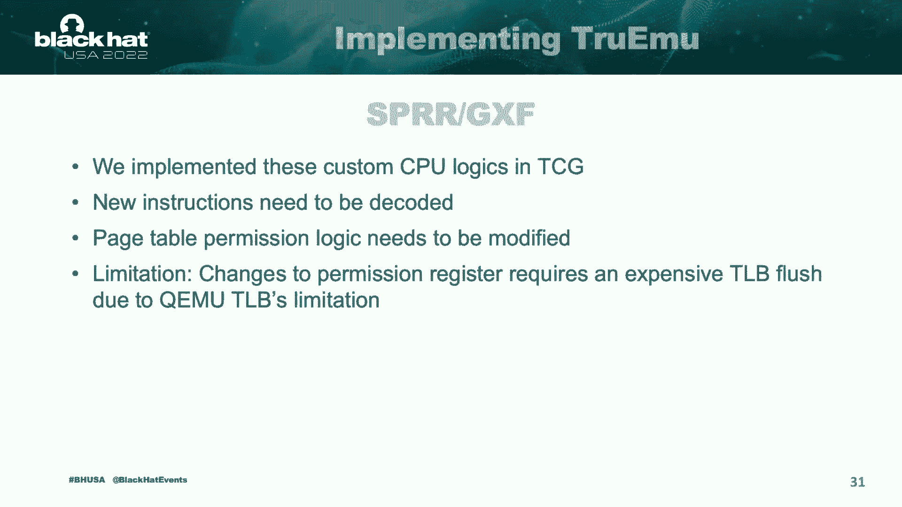

 implement it in queue mode to ask for it。 So how will we do that？ So first thing first。

 you need to decode more， instructions， which is the G enter and G exit。

 These are custom instructions。 You also have to rework the page table logic because the。

 server will no longer understand the page， permission the same way。 However。

 we still haven't figured everything out yet。 So and the queue moves TOB to have some limitations。

 So we still require a flushes or TOB flushes， which might。

 slow it out the performance when the permission are being， changed。 Next， let's talk about USB。

 So why do you really want USB and motion， you might ask。 Well， we can use it for restoring。

 So restoring is a fancy way of installing an operating， system for iOS device。

 So when we restore an iOS device， it's， because it's equally installing an iOS on the device。

 USB is also really useful。 You can use it for networking， for example， as a S-ish。

 And you can also connect the device to， using USB。 However， to implement USB。

 there are some challenges， we face。 The first problem is that our salary has USB drivers for。

 Synosis controllers。 If you've never heard of them， they build hardware IP。

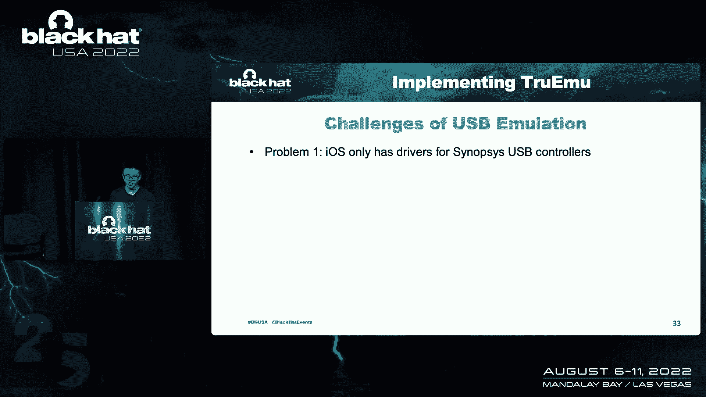

 Basically， the controller， however， the data， sheets tends to be paywall。

 So you need to have a deal with Synosis in order to get a， documentation on how the device works。

 However， there is an other way to route that。 Here on the screen is an excerpt from a QMUCode。

 So in the comments， there are really interesting lives。

 So they link an documentation for the device。 Which， interestingly enough。

 is free available to the public。 So when Synosis doesn't give it to you， let the hardware。

 manufacturer give it to you。 Because hardware， for example， even Intel， when they make， some votes。

 which use hardware IP， they release， documentation for it。

 Which the USB section for it is basically a copy from， the Synosis one。 OK。

 so the second problem is that actual iPhone uses， newer Synosis controller。

 So documentation for the new controller tends to be， spare， sparser， so you have less of them。

 or a few of them。

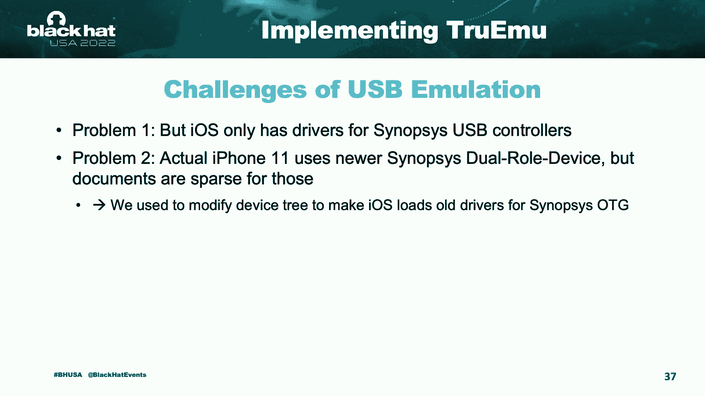

 So it's not as much as available compared to the old， controller。

 We used to route this by forcing iOS to load drivers for the， old controller。 However， luckily。

 we are able to implement the new， controller by now。 So that's for the controller。

 The USB also have the USB bus that we need to implement。 So if you don't know， USB has two sides。

 One is the whole side， which is essentially your PC。

 And the other side is the thing you connect to your PC。

 which can be your flash drive or your iPhone。 Or QMU does not support device mode。

 because it's built to， emulate a PC， so we have to implement the support for that。

 So how do we do that？ Well， we connect the iOS VM to USB host to the Unix pipe。

 On the screen is a simple diagram of how it works。 So on the top level， the software running。

 the software， will talk to the controller， which can be the， Synosis drive， Synosis， USB。

 or the ESCI， which is the， USB 2。0 controller。 And this controller can talk--。

 this controller are emulated in QMU。 And this controller will talk to a physical layer， which。

 will be implemented through some proxy device。 And this device will talk to each other through。

 sockets or Unix sockets。 So how can we use it for research？ So let me show you。 OK。

 So in the first demo， we will try to restore iOS。

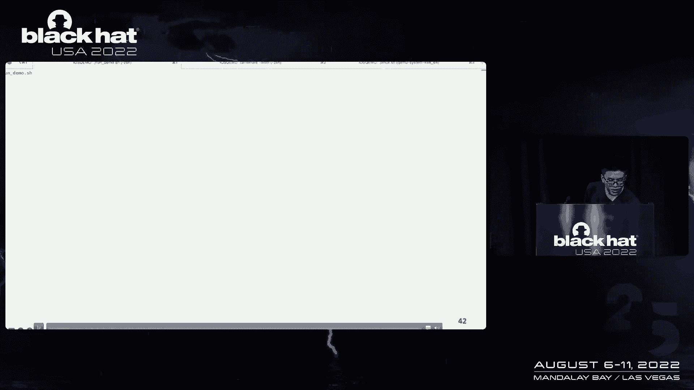

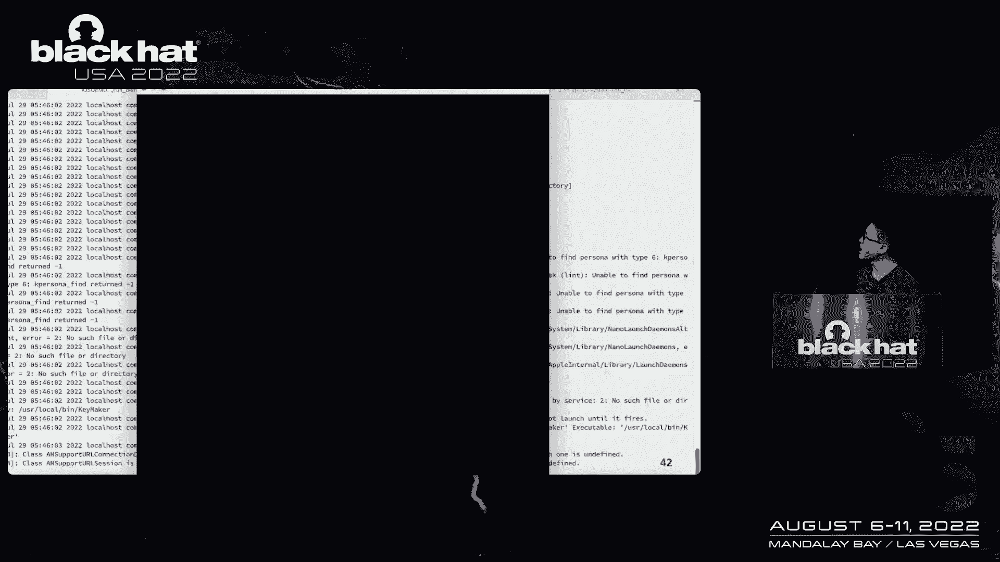

 So here we are starting on iOS VM。 On the left is iOS。 And on the right is the Linux VM。

 which acts as a host。 We run iDeviceRestore on there。 And the restore star。

 you can see the processor is， creeping up。 We're feeding up the processor here。

 because restore tends， to take a few more minutes。 OK。

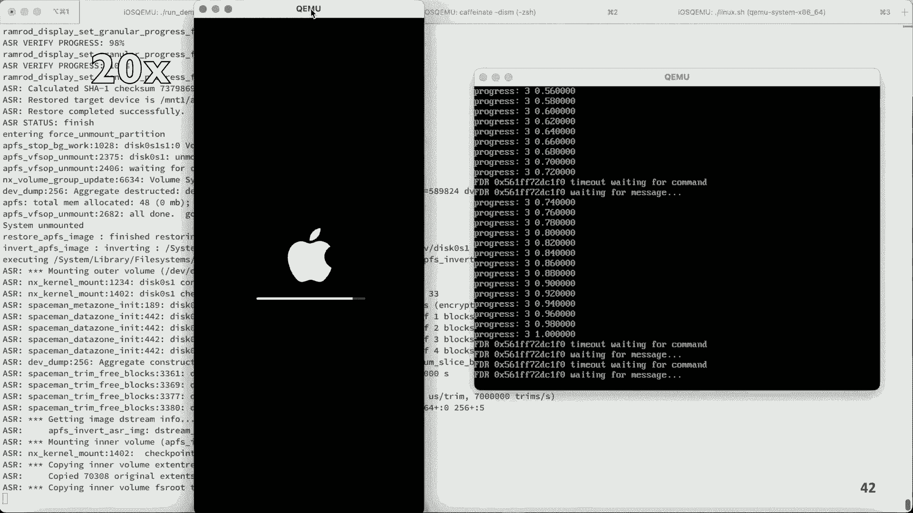

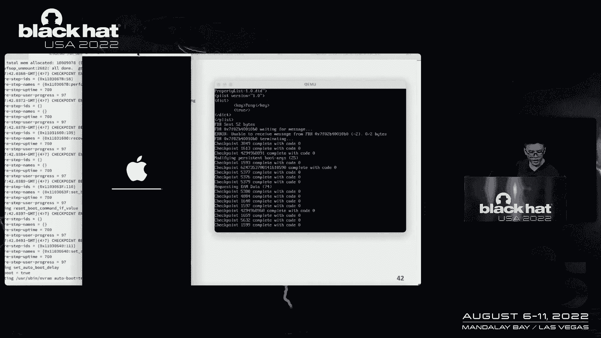

 There we go。 You can see it says restore finish， and the device will， restart。

 We override the restart behavior to make it stop。 So it makes it easier for recording。

 So the process took 11 minutes。 OK。 Next， I will run it。

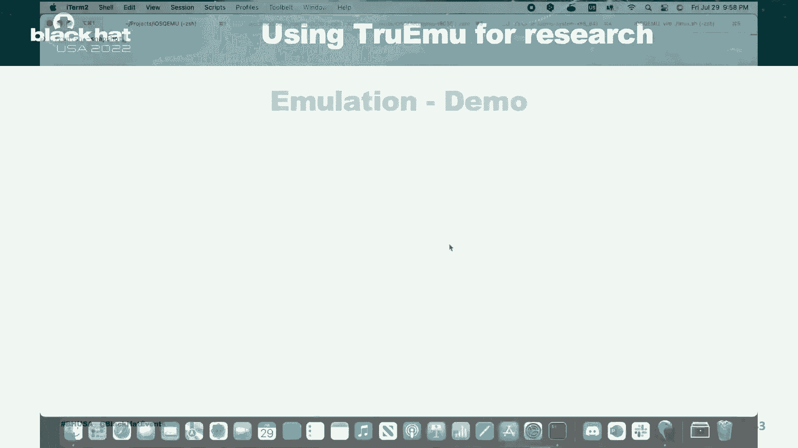

 I will do a lively mode。 So here we will start on iOS VM。 Oh， we are running in snapshot mode。

 so it does not， persist any change。 Where is my mouse？ Give a moment for to boot up。 Oh， wait。

 What's the wrong with this？

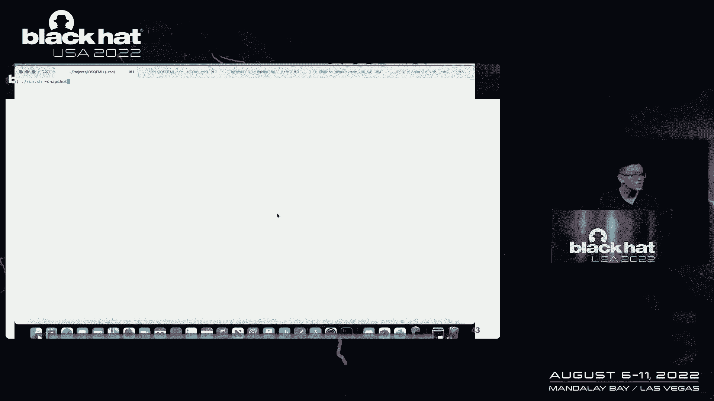

 You didn't show anything？ Give a moment for the USB to initialize。 There we go。

 So the last screen is the Linux VM。 It shows to iOS device。

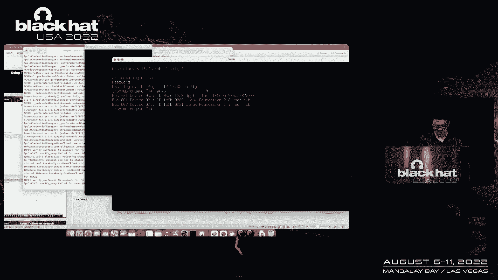

 Now we will use iProxy。 This tool will forward the traffic from our local part 2 to 2。

 And it will forward the port 44 on the iOS device over USB。 So let's do an SSH here。

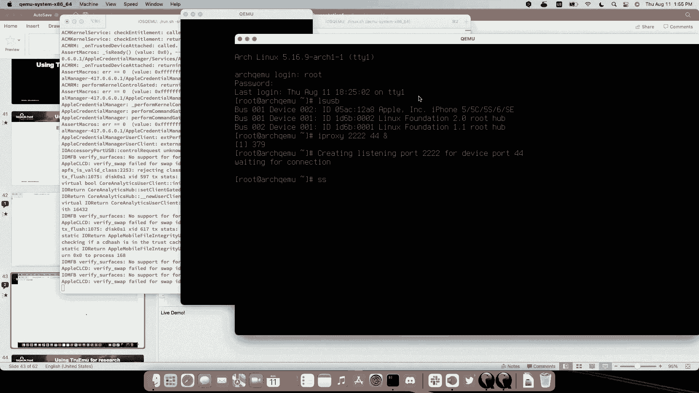

 And the first word is iProxy， I want to know that。 There we are。

 We are a root show inside the iOS VM。 I can show it to you using uName。

 You can see it is running iSignu。

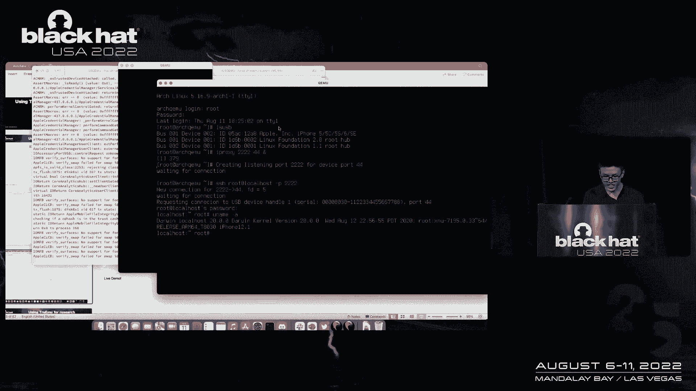

 The model is currently emitting。 It's the iPhone 11。

 You can also run software versions to see the version is running。

 And we can also run other commands to explore the iOS device。 Let's start with simple。

 I will try iOS on the root。 You can see there are some files there。

 You can use Htop to list all the process running。 These are real-service that runs on real device。

 You have running mode。 You have install。 You have kernel tasks。 You have lunch D。 You have a device。

 In the previous demo we looked at the restore process of iOS。

 We even got a bash shell on install iOS device。 We also even added the VM using over USB。

 Next thing。 We do have iBoot support。 If you don't know， iBoot is an iPhone bootle。

 It is used for recovery and to load the kernel。 Why do i want to emulate iBoot？

 I would in the circuit chain。 If you can hide iBoot， it will give you a lot of power over the。

 kernel， the device is running。 Because it is part of the circuit chain。

 One more reason is we use iBoot to verify our model。 I would tend to do it in a really peculiar way。

 If you can run iBoot， then we have more chance that our model is， Emuated the hardware correctly。

 Our support is free experimental。 It is not really ready for production。

 It hasn't been published yet。 I will give you a demo right now。 Here we go。 We start off iBoot。

 You can see the boot banner on the top left。 On the right is the recovery screen that you will generate。

 Open up the Linux VM。 We can use the iRecovery to query information about the device。

 You can also get a shell using das。 That is it。 You can also attach a debugger to all these demos。

 However， for iBoot， we are still renewed to it。 That is all we got for today。 In the recovery。

 i would load it in the demo。 We use iRecovery to interact with the recovery mode。

 We can get some queries and device information and get a， Recovery shell。 However。

 the recovery shell for， Release builds tends to be rescheared。 There is not much to do with it。

 Next， we also build to move for， Rebo-facing。 To support rebo-facing。

 we implement a snapshot feature。 The problem we are trying to solve is that because ios。

 Boot time is not fast enough for fuzzing。 For fuzzing。

 you want it to run something repeatedly as fast as， Possible。 We are using snapshot。

 Because snapshot is faster than normal booting， it reduced the， Cycle time by ten times。

 We also add coverage support to kimoo because i found you， To do it to its magic。

 We are running tcg。 It is very easy for us to report coverage。

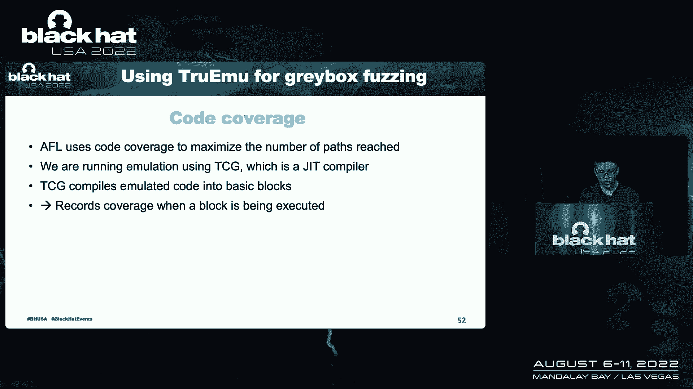

 We try to fast the usb stack。 Here is a simple diagram。 You have a file running in persistent mode。

 It will fall。 Then for a kimoo process。 We are restoring a snapshot。

 The snapshot will be at a first level state。 You can send in commands or input straight immediately。

 Then we have dummy usb host which will read inputs from。

 Afl and send it to the ios vm for processing。 If i was panicked， it will be reported to afl。 If not。

 it will be also reported to afl for star root。 Here is the fl running。 Just be fuzzing。

 We also look into syscophasing。 The diagram is pretty similar。 We also have persistent mode afl。

 It will fall kimoo and then kimoo will start restart。 Inside the ios vm we have a program。

 the use of a program， that receives input from afl using custom instructions。

 And we will do a score based on the input it gets。 If it is panicked， it will be reported to afl。

 Otherwise it will end the current cycle and do a snapshot， Restore again。

 Here is a screenshot of afl running syscophasing。 We tend to have a better speed with syscophasing compared to。

 usb。 However， there is still a lot of challenge for fuzzing。 This is timbre interrupts。

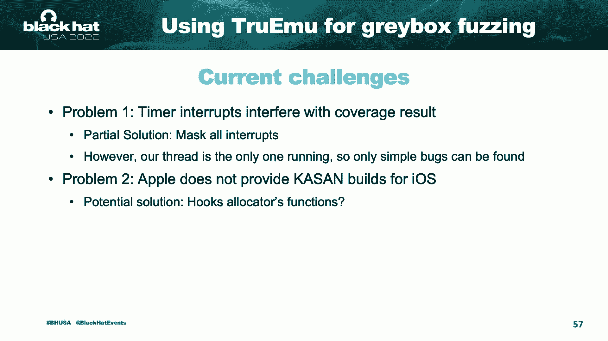

 This interrupts can interfere with the coverage result making it。

 Branding so it is not consistent at all。 Our solution for that is to mask every interrupt possible。

 However， without interrupts， our threat is currently the only， Running。

 So ios will never know if the time slot for this threat has， Ended or not。

 So it will never switch to threat which prevents reduce， Posing harness。

 The second problem is that apple does not provide， Sanitizer bills for ios。

 Maybe we are thinking about hooking allocated functions。

 Hooking maloxed freeze and try to watch what ios is doing。 This is very far from perfect。

 So let's talk about the future。 There are a lot of features we are implementing and we want to。

 Have it done in the future。 We want a proper working frame buffer for the ggi。

 Also we want to touch screen to work so you can interact with， It like a real device。

 We also want to emulate step because step is an essential。

 Part to ios and is the name suggest which is secure and， Clap for processor。

 It contains a lot of security related functions。 It might be interesting to get to emulates。

 Apparently we also need to emulate the gpu because of the， Ios gui。

 Gui is a lot of gpu and it reflects work without the gpu， Implemented。

 We also want to improve our fuzzer to get some bugs。 So through that we need your help。

 It currently open source with the link on the screen。 You can add it。

 reverse engineering process to a lot of， Ways or you can add a contribute directly to our report or。

 Support the links on arm max efforts because this arm max， Shares a lot of peripherals with ios。

 So it's transferable knowledge。 During this there were a lot of projects that were very helpful。

 To us especially as a sihy linux team。 Also we and also others useful project i mentioned on the。

 screen。 So you can see our emulsion is totally possible。 It is not a trivial task。

 You also -- we can also explore a lot about our device， And we can also see how to remove the。

 Enelable application。 We hope that our effort will lower the entry barrier to， Ios research。

 When more people look at ios it will become more secure for。

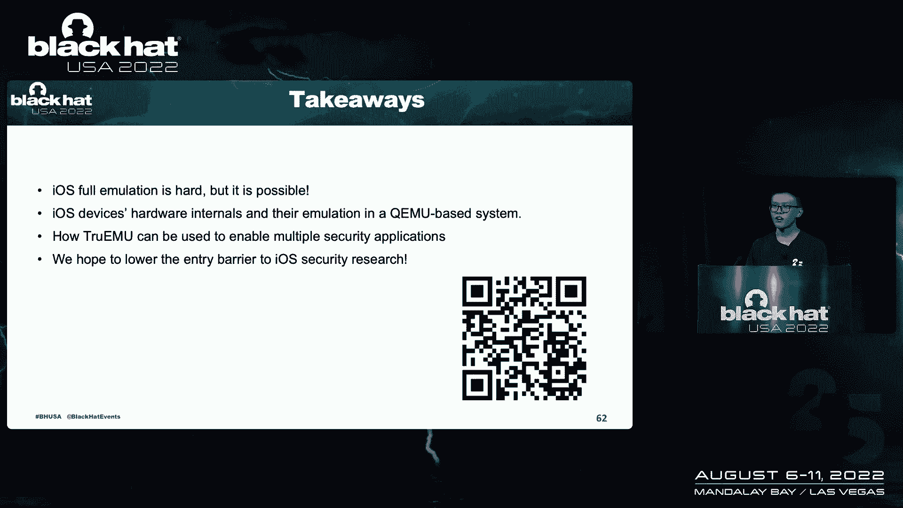

 us。

 [Music]。