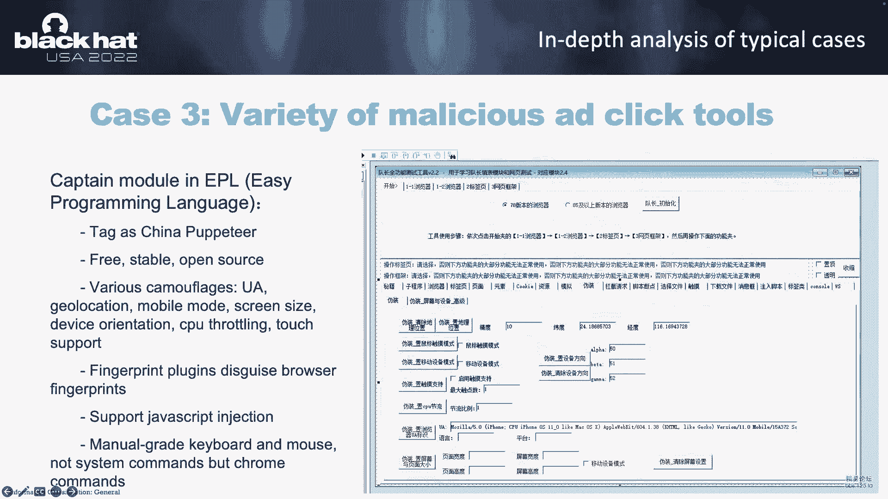

# P85：096 - The Battle Against the Billion-Scale Internet Underground Industry： Advert - 坤坤武特 - BV1WK41167dt

啊下午好，每个人，呃，我们是BAU的安全研究，安全X小组，很荣幸我们的演讲被《今日美国黑人》选中，今天我和阿松，因为那个警察，我们不能在拉斯维加斯和你分享脸，呃，议程如下，首先我们介绍了广告业的背景。

然后我们将选择三个典型案例进行深入分析和地下产业，呃，我们将总结关键技术，并对其进行云分析，然后我们将介绍健身项目，谈谈如何解决那些问题，呃，首先让我介绍一下广告业的概况。

根据过去几年全球互联网公司的财务报告，全球广告业的规模已达数千亿美元，实际上，广告是大多数互联网公司的主要商业模式，呃，典型的互联网模型，包括，呃，社交网络，呃，搜索引擎应用商店，短视频，呃。

所以当我们的互联网平台公司成长起来的时候，他们得到了，他们获得了大量的用户和广告商，广告主不断花钱在互联网平台公司推广产品，然后互联网公司通常试图打破展示广告的限制，只在他们自己的媒体上，比如呃，网站。

应用程序，呃，他们开始向第三方开放广告客户库，那就是所谓的广告联盟平台的形式，大量的广告商展示广告，通过广告航空公司平台在多个子媒体上，比如说，广告商投资一百元，广告联盟平台，一个公司会得到30。

和第三方应用程序，应用程序，aps，呃，应用程序获得70个，呃，形成一个三，赢得三方共赢的局面，呃，还有呃，呃，是通过点击计费，展示广告，showcount cpa和cpi是通过安装或引用计费的。

不是但不仅仅是简单的点击，然后我会解释为什么广告欺诈广告欺诈发生，和NE，媒体与广告平台之间最常见的广告欺诈接入，媒体想欺骗平台并不正当获利分红，我们选择了两种典型的，呃，案件广告，我标记了1和0，呃。

我在这一页上标记了一和二，另一个典型的，呃，另一种类型的广告流是广告商之间的广告流，一般来说，广告商的预算是有限的，如果他的预算被恶意点击消耗，他的竞争对手可以用低成本来获得更多的客户，我们也选了一些。

呃，在这个一般的典型案例中，我在这一页上标记为三英寸，由于时间限制，广告主平台与，和其他形式的水果不能今天一个接一个地详细教，我的同事苏红，下面我们就来谈谈通过搜狐公司做广告的一些典型案例，呃，你好。

每个人，呃，让我们来看看第一个案例，呃，一般来说，应用程序通常集成许多SDK进行统计，呃，呃，广告，一代，方法，推等等，在安全分析过程中，我们在一个大数据分析中发现了一些恶意行为。

他们说DK被合并到许多著名的应用程序中，如今晚的图所示，puis，呃，SDK悄悄地动态加载DX恶意失败，所以就这么简单，呃，所以我们分析了很多手机恶意案例，但这是我们第一次遇到的最复杂的一个。

民兵DX将请求最新的补丁，如果，如果环境是安全的，云服务器会给JR打补丁，在一系列复杂的请求之后，最后获得配置文件和自动单击文件，是呀，如手指所示。

SDK评估了几个不同的来源，并下载了一个DEX文件，一个4R5和一个喷气锉，那么恶意SDK如何实现自动点击，呃，当JR请求类服务器时，刚才的目标URL，关键词，点击阅读。

和其他任务信息已经下载到应用程序中，民兵，呃，JR开始，呃，视图不可见，加载目标URL，几秒钟后注入自动单击脚本操作网页，为了在这里的代码中执行更多的Java函数，是呀，采用桥梁技术，比如说，首先。

我们在SDK中注册一个名为base的js桥，那么当我们在JavaScript代码中调用base dot get device for方法时，同样的方法将在Java代码中执行。

以及如何在后台启动一个不可见的活动，这里使用了活动容器技术，我们需要实现自己的窗口管理器和视图路由NPL，我们还需要钩住一些类，让活动在我们自己的环境中运行，那么天使系统就找不到这样的窗口。

发现躲在活动放松的地方，所以在分析了技术之后，让我们来看看这个案子的组织结构，后门开发公司，然后是广告商的一些频道号，在URL中找出一个等于b c d的频道，当用户采取，呃，当用户点击这些广告时。

这些通道会得到一个外壳，呃，然后他们整合回代码，并将它们引导到JR文件中，卖给大数据分析公司，NI来把他们工作到SDK，最后，许多著名的应用程序集成了这个恶意的DK，但开发商不知道，呃，那么PSet呢。

我们需要下载一些软件，例如办公室和，呃，我们可能会去一些软件下载网站，呃，在下载页面上，它们通常是本地下载的，必须是下载按钮，建议下载，所做的是选定的，它实际上并没有提高速度，相反。

部分软件被绑定并安装，甚至更广泛，呃，更广泛的插件静默安装，呃，嗯，下载并安装该目标，下载者会判断是否有杀毒软件，然后向人群报告，获得无声软件的任务，同时，下载程序还将判断系统使用的浏览器。

并将相应的插件CX文件复制到相应的路径，呃，是呀，它只需要复制，用户没有感觉，这是我们发现的我井的新方法，所以让我们专注于它，这个浏览器插件包括拦截请求的功能，修改页面，并执行TS脚本。

它可以完全控制请求和响应页面，后台屏幕将检查请求URL是否是您的目标，内容脚本用于为不同的任务注入代码，所以让我们看一下同一个例子，当用户访问视频时，说，恶意浏览器插件的脚本。

首先将检测它是否是高质量的产量，就像GitHub的风格，目标帐户和关注计数都是从云服务器获得的，所以不需要更新计划，只需要返回不同的任务，呃，让我们从另一个角度来看，如果插件检测到用户正在访问信息网站。

比如一些按套比较，插头将取代通道，药片的数量，那么它为什么要这样做呢，如果用户最终购买了产品，替换，通道会得到一个形状，那就是，它可以通过恶意插件获利。

这就是为什么软件网站让你用下载器下载而不是直接下载，让我们来看看恶意广告点击工具的种类，是一种编程语言，或者我们称之为e语言是一种在汉语中使用的编程语言，然后呃，使用中文作为代码的开发。

因为语言学习门槛低，已经成为许多地下工业集团的首选编程语言，如图所示，程序代码是用中文写的，开发人员，电子语言的开发社区尤其活跃，除了沟通技术问题，呃，它还支持通过支付定制特殊功能，呃。

所以让我介绍一下地下工业的一些常见工具，一个chi圣经兄弟库是一个默认包含在语言中的Web操作库，除正常功能外，还支持设置屏幕高度等参数模拟功能，我的触点等等，这是一个自动获得的数据。

它也是在语言上发展起来的，可以看到对应的目标，你是我，和其他参数，点击时间后自动与客服对话，为什么有是，它是用来攻击竞争对手的，一般来说，一些高价值的广告需要展示，点击并，比如说，呃，付款，但是下载。

和整个应用程序上所有与客服的对话都可以判断为有效的，呃，然后广告商会付钱，假设两个是为了模拟这个过程而设计的，并迅速得出，呃很快的是公司的广告桶，除了图书馆的大楼，非常队长模块是最受欢迎的关注库。

它使用的是Chrome内核，所以让我们呃。

服务模块开发人员可以轻松操作浏览器实现自动，单击修改后的数据模拟器设备，呃，指纹，注入至尊和其他操作，比如说，模拟五点触球，它看起来像一个移动电话设备，除了PC端的时钟工具，移动端有很多类似的工具。

比如说，流动，但是呃，图中的f主要是用来记录输入的，滑动，点击，和其他行为，然后在必要的时候回放，这类软件主要用于提高我们的工作和生活效率，类似于iPhone中的快捷功能，但它被地下工业使用，比如说。

他们使用记录的触摸注意来点击这些广告。

我们可以从动画中看到，这个软件完全取代了电话，与使用JavaScript代码相比，模拟从A点到B点的滑动，这个灯光更像真人的行为，而且不容易被风险控制管理系统发现。

好的，现在，让我们来看看，看看电话和技术分析，让我们总结一下高层地下产业集团的特点，他们中的一些人注册了大量的公司，他们声称在做广告，货币化平台，SAP平台，但事实上，有从事地下产业的公司，呃。

他们通常有很高的利润规模，但地下低层群有不同的特点，大多数都在个人身上，一个小团队，小规模群体，他们没有技术能力，但为了赚钱非常勤奋，虽然他们不知道，呃，他们，虽然他们经常赚不到多少钱。

它们也会导致大规模的破坏和最佳的社会影响，呃，现在，让我们来看看技术细节，高层地下工业集团一般可大规模远程控制用户设备，类似于安装在数千台设备上的后门程序，比如说，自动嵌入，调用应用程序，呃，i，k。

或安装带有恶意功能的浏览器插件，同时，大量的仿真技术，采用了隐藏技术和反检测技术，与高层地下群相比，低级使用各种工具实现本地模拟点击功能，因为他们可能没有高和渠道来整合。

将恶意代码集成到眉毛和图形片段中，他们可以使用浏览器库，可以是二次开发，如用户代理仿真和硬件信息仿真，或者使用无头浏览器，和一些IP代理工具，触摸和触摸，呼叫和应答工具用于模拟器点击此目标，好的。

谢谢肖恩，让我先谈谈我们提出的广告欺诈后的新检测方法，让我介绍一下尼古拉斯·帕斯近年来的项目，地下工业的技术能力有了显著的提高，我们看到了很多地下工业公司的技术领袖，他们曾经为一家互联网公司巨头工作。

甚至他们中的一些人有安全工程师的背景，我们需要通过点击来准确地分离广告，以减少损失，我们需要不断地追踪他们，呃，因为他们是一个坚强的人，呃对呃，呃，因为他们很难获得巨大的利润，呃因为技术上，呃的，呃。

我团队的技术背景是二进制的，呃，脆弱性研究与网络竞赛，这项研究工作适合我们，因为这是操作系统，浏览器，恶意软件分析和我们擅长的知识，我们很擅长。

这个惊人的项目是由一个GSDK和一个MalWarehouse农场组成的，有一定规模，今天我们将讨论包括无头溅射器在内的检测解决方案，不可见Web视图，非移动应用程序，以及工具和邮件浏览器扩展的移动密钥。

呃，第一个，呃，目标无头或大西洋，呃，浏览器，它们大多基于chrome devtools，Proto，呃，典型的无头，呃，呃，浏览器库，呃，包括PUA，剧作家电影和就像标志一样，普阿之后。

有学生认为与木偶有关的基因，因此我们可以从该字符串控制浏览器行为，那些几乎没有传播，shell支持语言库和节点JS和Python，就像前面说的，大部分低层地下工业，学历为高中，所以他们不能写C加加问题。

一个程序，呃，这个脚本基于Python和JavaScript，呃，呃，黑客攻击我们是最喜欢的，呃，有一些开源项目来检测哈雷飞溅器，就像它一样，就像这个桌子一样，名单，他们选择用户代理的功能。

WebDriver，并且是取消，窗户打开了，或者让我们，i，我喜欢在测试后测试，我们发现很多检测方法，呃，其实就是，呃，铬和铬项目，比如Mimo类型，其中一些可以通过启动参数隐藏。

如WebDriver用户代理，它很容易超读和左边的检测点，因为对我不起作用。

并从安全研究的角度来解决这一问题，呃，首先，我们需要深刻理解无头浏览器的实现，通过调试铬的源代码，我们发现PAA开始铬，呃，远程远程调试端口等于零，然后他得到了Web套接字服务的一部分。

然后他可以通过这个端口发送控制命令，控制浏览器行为并接收浏览器生成的回调信息，这是一个Chrome DevTools协议，而不幸的浏览器是基于，是基于Chrome Deltools构建的，呃协议。

所以我们觉得这个，呃，这个发射通道是一个关键的检测点，在真实场景中，我们只是运行在浏览器中的javascript和html，所以任务是有限的，呃，这意味着我们不能做很多事情，但受到侧通道概念的启发，呃。

我们可以通过做一些事情来泄漏一些东西来观察不同的时间和精力消耗，呃，让我们看看，呃，我们先来看第二张图，有一个用C++编写的简单内存复制操作，另外，它循环十次，并将长数据复制到变量中，呃，呃。

在我的台式电脑上，它花了33英里的秒，cpu，呃，如果我们能通过JavaScript强制内存复制操作，但是只有当浏览器处理了实例w two one实例时，才会执行此代码。

我们可以检测到我们是否在几乎没有探索的时候，是呀，我们发现了很多检测条目，例如控制台配置文件，它将在DevTools实例中运行，我们传入的参数，和执行，基于这些想法，测试结束后。

我们在左边的图片中编写了几行JavaScript代码，这个代码可以稳定探测器，因为Chrome UI上没有显示任何内容，如果你了解了这个原则，就很容易在最新的浏览器中采用这个代码。

船长浏览器的语言是基于，Chrome DevTools协议，是呀，是呀，我们也可以用这种方法来检测它，下一个呃，无头浏览器是ji Web浏览器，它是基于迷你链接的，其实迷你眨眼的作者是我的一个朋友。

有一天，我问他为什么这个图书馆被低级的地下工业广泛使用，你有什么检测想法吗，是呀，她说，呃，你是的，她答应了，你可以从多眨眼的优势开始，因为它很小，是由，呃，是基于您的源代码中的某个开发的。

所以他切断了很多功能，比如Web RTC，是呀，迷你闪烁不支持Web RTC，呃，所以你可以从这一点进行检测，呃，让我们来谈谈下一个，呃检测目标隐形移动网络广告，呃，同事会学会的。

呃通过我通过移动杀毒公司披露的报告，比如几年前报道卡西的她，从报告中并与防病毒工程师通信，我们了解到分析方法是使用静态分析，箱体静力分析与动力行为，这个手机，呃，那些移动杀毒公司，一般只披露那些情况。

但他们没有透露如何，呃它并检测它，所以我们只是想知道我们能主动感知这样的风险吗，没有反病毒公司协助的风险，呃，这种恶意软件，呃，它是从云中动态加载恶意代码的，如果你是高度定制的。

我们和使用JavaScript的地方，呃，爵士桥，将JavaScript脚本注入Web视图，因为Web视图的内容容器是不可见的，不知道发生了什么，但手机流量消耗快，手机的电池很快就干了，这里有一个视频。

我们可以看一下，呃，它是如何工作的，左边，左边是A是像素手机，右边是WebView实例，在表单中打开，中间是html流量，让我们看一看，我们呃，我们打开一个恶意应用程序，你可以看到左边，左边，呃，网络。

我们就会，呃，哦，就是，打开应用程序后可以看到，呃，我们什么都没做，是呀，UI上什么也没发生，但是后台有很多隐藏的WebView，做坏事，比如鞋子和点击，做广告，呃。

这类恶意软件在防病毒和调试方面是缩放的，以及反使用和使用C和C的强加密通道，到目前为止的动态分析，静态分析与网络行为分析，对我们来说不是那么容易，因为它没有任何反技术，而这种类型的邮件，他们通过，呃。

定制我们和使用的东西，呃，JS桥在Java端进行合作，配合JS端的JG上的代码，因为这个JS代码他知道广告槽的位置，A槽在哪里，然后Java代码将使用这个位置来模拟用户行为。

例如在edslot上执行单击，呃，我们有几种检测方法，第一条留言，我们有一部手机，呃，实际上我们有手机应用商店的产品，这意味着我们有大量的PPP样本，通过一个深深的，客户开发人员室和客户开发人员食品。

我们已经绕过了所有的反点，在此基础上我们开发了一套马场，呃，使用很多乐趣循环运行所有应用程序，我们必须观察代码的动态加载，分析Web的行为，我们发现是的，我们发现这个农场附近的一些地下工业非常有效。

第二种检测方法是通过JavaScript，通过总结恶意软件的关键技术，它们是吸气的，他们在页面中找到他们广告的位置，并模拟用户行为，检查长度是有人静音的登陆页面，一旦异常信息没事。

我们可以想办法回溯找到样本，完成分析，下一个探测目标，我们的移动钥匙，新闻工具和云，我们写了一个点击脚本，运行两次，是呀，这两次点击之间有毫秒的时间差，这样我们就可以检测到增强的工具。

按点击和滚动轨道的坐标，在安卓系统上，我们也可以关注任务和运动事件，比如触摸，呃，压力，手机触摸范围，这是价值，这是价值与人类不同，至于云的形态，有软件、软件和系统，通常由固定的硬件和房间声称。

如果您发现许多相同的设备访问您的设备是从同一时间，来探测云的，我们应该收集尽可能多的Web视图功能，不管你怎么用，代理换了，但网络将保持稳定，因为他的操作系统没有改变。

最后一个检测目标是PC端的恶意扩展，让我们来看看，让我们来看看一些公开披露的检测方法，衬衫里的延伸，呃，它们被检测到，呃，扩展和检测器使用的资源，房间是否被修改过，比如说，右边的图片是恶意的，呃。

运行后的扩展，它将创建一个互斥体元素，我们可以通过JavaScript穿越穹顶来检测，如果存在，另一种检测方法是向扩展发送消息进行测试，如果存在的话，但我从未见过支持消息通信的恶意浏览器扩展。

所以这个方法对我不起作用。

呃，公开披露的方法都有局限性，所以我们走吧，让我们回到恶意浏览器扩展的签名，关键特性是拦截请求，他们可以重定向I L，此访问并将JavaScript注入网页，至于你我改选，呃，我们可以引导浏览器访问。

你是，呃，我们生成的L，我们在服务器端的L中添加签名，我们可以观看请求，如果，如果L参数已更改，这意味着浏览器有恶意软件扩展或驱动程序，呃为了，至于JavaScript注入，注射密码。

我们感知器的方法是使用CSP特性，首先我们制作的网页采用了非常严格的csp策略，比如我们拒绝道路或穿越领域，当恶意软件扩展，尝试在页面中插入JavaScript，将发生验证并向服务器报告数据。

关于浏览器的一些特别节目，此验证的日志报告甚至将包括浏览器扩展的名称，这是追踪地下工业的关键，因为我的公司有很多员工，只要我知道浏览器扩展的名称，我可以找到员工，感染恶意浏览器扩展的计算机。

然后我们可以找到样本和完整的分析，是呀，效果很好，豪华，五分钟是山王先生，五分钟商王先生，五分钟，好的，我明白了，最后一章是总结，和建议，现在让我先总结一下这次演讲，我介绍了广告业的背景。

广告联盟是如何形成的，液体发生在哪里，然后选取三个典型案例，对地下工业和结构进行了分析，总结关键文档技术和云云特征，然后我们介绍项目演算是如何，解决我们提供的那些问题，我们提供解决方案，因为这里的项目。

数百人，而且已经被警察逮捕了，他们因触犯刑法而被判刑，呃，法律和适用法律包含通过非法控制计算机信息系统和破坏生产经营，然后这里，呃，是对广告业的一些建议，作为呃，为了，对于广告线路平台，我们应该，呃。

呃，相互分享信息，作为地下工业，经常在多个平台上吃货，同时对于应用程序，应用程序，开发人员，我们应该仔细审查他们与第三方的合作，SDK，选择一个大的，呃。

我们应该选择一个大的广告联盟平台来为浏览器开发者赚钱，我们应该通过临时增强浏览器扩展加载的安全检查，因为时间限制和我们的免费英语，我们今天没有问答环节，如果你有任何问题，请发到这个邮箱。

我会用一天的时间重复回复你，呃，所以这就是我们谈话的全部内容。

