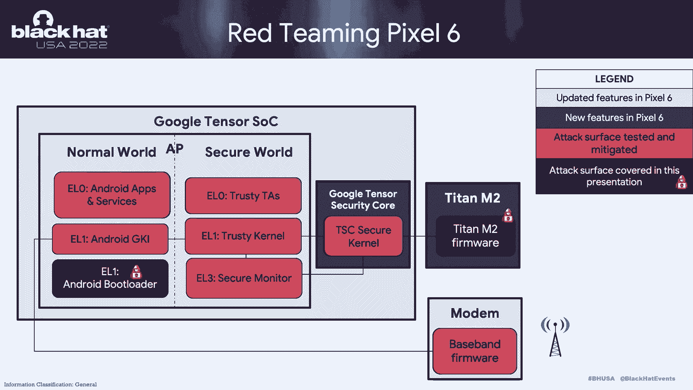

# 【转载】Black Hat USA 2022 会议视频 - P86：097 - Google Reimagined a Phone. It was Our Job to Red Team and Secure it. - 坤坤武特 - BV1WK41167dt

欢迎大家参加我们的会议，我们是安卓红队，我们为谷歌工作，我叫法兰·艾瑞，团队的工程经理，我们的两位高级安全研究员也加入了进来，万安·舒尔技术负责人以及尤金·罗迪奥诺夫，也特别感谢克里斯托弗·科尔。

我们在安卓安全领域的前领导者之一，感谢你的帮助，感谢你对甲板的贡献，也感谢你帮助我们建立了一支非凡的红队，所以我们的演示文稿是，我们将介绍谷歌如何用Pixel 6重新想象一款手机。

我们的工作是如何红队并确保它，所以这种从上一代手机的转变，意味着我们的红队有一个独特的任务来测试一部手机，为数百万客户提供全新的SOC，所以新的硬件，软件组件的固件，我们必须在发射前一年完成所有工作。

所以我们将介绍我们是如何做到这一点的，但首先是关于我们是谁我们的范围，以及我们的红队如何融入安卓安全轮，帮助保护运行在Android操作系统上的谷歌产品，所以我们将讨论像素六上一些有趣的攻击面。

然后我们会潜入一些有影响力的口袋，或者我们在几次红队约会中开发的概念的证明，所以我们今天将演示泰坦M2上的第一个代码执行，所以你肯定想留下来。

我们在Android Bootloader上也有一些令人印象深刻的工作，我们称之为ABL，所以在这个演示文稿中有很多高质量的内容要涵盖，我还想强调，这个演示文稿中的一切都是固定的，我们今天不会放弃零天。

关于我们是谁，我们是红队，我们是安卓安全的眼睛，所以我们的任务是通过攻击关键表面来保护像素和安卓，或者更确切地说，在真正的攻击者发现有影响力的安全问题之前发现它们的特性。

所以我们有很多方法主要是通过红队的参与，所以这有助于我们验证安全假设是真实的，否则我们最终会打破它们，我们通过工具开发进行扩展，主要通过引信，所以我们制造模糊器，我们把它们交给我们的中央安卓引信团队。

加强和管理，这样他们就可以继续在幕后为我们工作，二十四，七，三个，一年六十五天，这是一种我们称之为连续模糊的方法，这为我们提供了很多好处，我们投入时间开发，因此。

这有助于为我们发现的困难的安全决策提供信息，因此，它有助于阐明对领导的影响，它也帮助我们作为一个红色团队在开发写作练习中，发现我们以前不会发现的新漏洞，最后，我们深度融入了整治过程，红队不应该只找虫子。

但应当积极参与补救，归根结底，这是我们如何为企业提供最大的价值，所以业务是运行在Android上的Android和谷歌产品，比如像素，那么我们如何保护这些地区，嗯，我们的安卓安全组织进行了许多投资。

以确保我们以最安全的形式向您运送像Pixel这样的产品，这张幻灯片的结尾是为了真正磨练，红队只是这个大过程中不可或缺的一部分，这个过程的另一个重要部分是你，我们的漏洞奖励计划。

这也是一个很好的机会来感谢其他一些会议，在安卓安全上的黑帽最后，我数了数，我想有十二个，实际上明天还有一个关于泰坦EM的会议，像这样的研究真的是世界级的，这有助于改善谷歌产品的安全态势，就像像素。

所以说几句话，我们今天关注的地方，作为红队，所以我们在静态分析中大量投资于模糊，所以珊和尤金都将深入研究我们在这里做的事情。

但随着我们的成长，我们还在研究服务器端攻击，作为红队。

所以像素之旅的快速概述，所以这里要强调的一点是。

具有独特安全组件的Pixel已经进行了多次迭代，在像素六之前，Pixel 3随着Titan M芯片的诞生向前迈出了一大步，最后是像素六，我们构建了一个自定义SoC，添加了一个额外的安全飞地，最重要的是。

巨人，从我们的角度来看，泰坦M2作为像素6中最安全的元素被引入，那么这段旅程如何转化为今天攻击者的重点，因此，总的来说，脆弱性趋势是向下移动的，别担心，仍然有大量的跨站点脚本，如果那是你的面包和黄油。

但是随着应用程序被转移到沙箱中，攻击也开始从操作系统向下移动到内核固件级别，甚至在SC的这些较低部分进行攻击的ROM代码，对攻击者来说非常有吸引力，所以只是一些支持证据，我们可以看看。

利用一个数据点的定价来支持这些脆弱性趋势，所以我们达成了共识，如果第三方市场对安卓的开发定价高于其他移动平台，那我们就知道我们做得很好，所以越难利用，这是移动支付的零dm元素图。

这告诉我们第三方是如何为移动平台和浏览器上的漏洞定价的，你可以在上面看到价值250万的东西，这是一个带有持久零点击错误的Android全链，所以再一次，这给了我们一定程度的信心，我们在做好事。

运送一部安全电话，所以让我们在像素六攻击面上磨练一下。

所以这张图代表了谷歌张量SoC的高级攻击面，在像素六，您在浅蓝色中看到的是以前像素的更新功能，深蓝色是新的，主要是我们的张量安全核心，还有泰坦M 2芯片，你现在看到的红色，是我们红队测试过的一个税面。

并在之前的红队审查中帮助缓解，所以我们涵盖了正常和安全的领域，包括我们的Trueos，我们可信的执行环境，一直到安全监视器运行一个e l 3，现在，你看到的暗红色，是一个税收表面。

我们将在今天的演示中再次讨论，泰坦M2和ABL或Android引导加载器，所以我之前想强调的最后一点，我把它交给尤金，就是，我们今天将讨论一些非常有影响力的代码执行bug，但尽管如此。

我们有信心与您分享，我们用像素六提供了迄今为止最安全的像素，你可能会问，这不是违反直觉吗，如果你告诉我代码执行bug，我们会说这正是像素六如此安全的原因，我们读过，把它组合在一起。

我们通过引信和静态分析提高了线路覆盖率，我们与补救措施或更确切地说是特色团队合作过，优先考虑补救工作并执行强化建议，这样我们就可以给你一个安全电话，所以说，我要把它交给尤金·罗阿诺夫。

谁来盖，巨人，我是二。

谢谢你，所以我们站在攻击者的立场。

泰坦二号是它被创建来处理的高调目标之一，在安卓平台和像素设备上有秘密，它提供了免受人身攻击的保护，以故障注入为例，Android GP程序提供每个代码高达100万美元的赏金，在泰坦二号上执行死刑。

表示担保债权，为Pixel和Android提供基础安全服务，例如硬件支持的密钥存储，车站的强箱式钥匙，它在Android验证引导过程中起着至关重要的作用，所以泰坦是泰坦芯片的第二个版本。

泰坦的第一个版本在像素三设备上首次发布，不像泰坦M是基于ARM架构的，泰坦二号基于自定义风险五架构，用非标准工具链建造，并运行完全重新设计的操作系统和固件堆栈，正如我们在这里提到的，泰坦M和。

我想参考一篇很棒的论文，安奥德赛在黑帽21，它提供了很多关于逆向工程和芯片的有趣细节和很多技术细节，很高兴看到研究人员用黑匣子方法能取得什么成就。

在这个艰难的目标上，所以这是一个类似钛的表面，所以泰坦二号是一个离散的安全元件，通过间谍总线连接到主张量SoC，应用程序处理器不能直接发送数据来收紧它们，到间谍巴士上，或者有一个插入专用张量安全核心。

它实际上发送数据来将它们收紧到间谍总线上，在滑梯的左手边，我们可以看到一个由泰坦和芯片组成的高层架构，所以在底部我们有面具罗马硬件，负责安全引导以引导引导加载程序，Bootloader自己实现恢复功能。

它验证下一阶段的主固件映像，它由内核和应用程序组成，并收紧它们以实现风险五体系结构，使用两种模式，用户模式和机器模式，所以所有的应用程序都运行在同一个地址空间，嗯，因为没有穆。

所以我也会在幻灯片中把它们作为任务来调用，但它们与那些实现芯片主逻辑的应用程序之间是隔离的，接触SoC和Android平台，这是我们的主要攻击载体，所以这是我们的威胁模型，所以说，我们假设。

攻击者能够在应用程序处理器上运行任意代码，在特权背景下，并且能够向你的泰坦发送任意数据，你，在我们深入研究细节之前，我们在这次交战中发现了模糊和漏洞，我想对你的辩护说几句话，在泰坦海姆实施的深度缓解。

他们让这个芯片更安全，所以我们的下一个政策是，这是由物理内存保护寄存器和自定义Titan扩展强制执行的，我们应该使代码段不可写和不可执行，嗯，有切片隔离，所以本质上，使用物理内存保护寄存器。

确保某些任务不能读或写，其他任务的全局堆栈，因此，如果攻击者能够破坏站点，然后在一个任务中执行代码，他们不能泄露其他任务处理的秘密，除了解决隔离，还有一个文件系统隔离。

所以每个任务都提供了这个文件系统来保存它的秘密，最后，内核向应用程序公开了许多C头骨，有一个ACL策略，这使得我们可以限制某些海洋头骨的应用，我们实际上不需要它们，所以我们在这个正确的团队参与。

我们的团队的任务是积极主动地识别和帮助，并帮助未来的团队缓解泰坦和两个固件中的问题，在像素6发布之前，正如前面提到的Fuzin是我们的中心方法之一，泰坦山也不例外，所以我们用两个方向接近它。

基于主机的融合和基于仿真器的融合，多亏了呃的实现细节，收紧到固件，我们能够为x86构建模块的子集，32位建筑，结果，我们想出了一个非常高性能的模糊器，嗯，和，我们还利用了大量可用于引信的工具。

在86个平台上，例如地址消毒剂，我们进一步覆盖导引引信发动机等，作为这种方法的缺点，有些组件我们显然无法为主机节点构建，例如，密码任务，因为加密任务直接与加密硬件通信，这是我们在主机平台上不容易嘲笑的。

还有一些特定的架构驱动因素，我们也需要处理，所以为了涵盖这些关键的组件，我们在另一个父亲身上实现了，使用特性团队提供的完整系统模拟器，为了能够完全覆盖固件堆栈，我们总共开发了三个模糊器。

所以两个基于主机的模糊器，一个精英原型buff，突变体，覆盖导引引信，嗯，一个进一步的快速ACE和一个解码功能，因为正如我们所知，一个解码是，材料很难弄对，所以我们要确保这种攻击面得到缓解，此外。

我们还有第三个父亲，一个后来的父亲，他们可以互相测试用例，所以基本上他们使用的是相同的界面，嗯，正如我们所料，模拟器，父亲动作相当迟缓，每秒五个测试用例，这是由于外围设备仿真的准确性。

因为这就像是特性团队提供的精确硬件模拟器，但另一方面，但另一方面，基于主机的更快，赔偿了，因为它大约快两到两百倍，每秒一千只獠牙，通过运行这个模糊器一段时间，我们积累了最初的一组问题，我会说。

并不是所有在这次交战中发现的问题都来自Fuzzers，但是Fuzzers在引起我们对有问题代码的注意方面发挥了重要作用，通过做变异分析，在那里我们能够发现其他组件中的问题，然后呃，基本上。

因为我们是问题，我们对可开发的问题特别感兴趣，这里我们有几个有趣的例子，所以其中一个实际上是越界的，在标识任务中，所以我们可以看到，这里在演示文稿推送阅读器搜索中有一个易受攻击的mecpi操作。

所以这是一个非常简单的漏洞，利用相当强大的原语，其中攻击者能够控制公钥和公钥长度参数，本质上，攻击者能够将任意长度的任意数据写入非，受控地址，因此，这还不足以执行代码，我们开始探索如何改进这个原始的。

如果你看看读者的公共关键点在哪里，它实际上指向标识任务的全局变量，我们可以看到有两个有趣的对象位于任务的偏移量a，四加一，六，四和十六进制，所以我们的C板缓冲区，尺寸和缓冲的C板。

这些变量用于另一个操作，C板和弦，所以如果我们一起改变这两个命令，我们能想出正确的，什么是原始的，非常精确，我们基本上可以覆盖堆栈上的数据，事实上，这需要更多的互动，但得到小心的执行是便宜的。

因为身份是一个有状态的任务，他们是为了利用第一个漏洞，我们需要把身份放入正确的状态，所以这就是为什么我们基本上是在重播这些命令，第一步和第二步只是为了把身份状态推进到正确的状态，第三步。

这实际上是我们利用第一个MC PI出界的地方，对，我们用攻击者的控制平衡覆盖全局SEOR，我们有第四步，第五步再次将身份任务推进到正确的状态，在第六步，我们实际上是在传递我们的shell代码。

我们正在覆盖堆栈上的返回地址，我们正在执行我们的代码，所以在这一点上，我们能够在身份任务的上下文中运行任意代码，所以我们还能做什么，我们这次合作的最终目标是泄露高价值的秘密，通过紧固到芯片来保护。

然后我开始环顾四周，看看什么实际上是由身份保护的，我们没有发现任何有趣的秘密，您从身份任务存储中被泄露，嗯，我们开始看起来像一个不同的开发场景，其中之一实际上是泄露韦伯的秘密，通过阻尼秘密文件系统。

所以在上一张幻灯片上，我提到每个任务都是孤立的文件系统，所以你可能会想怎么可能，好吧，我将在下一张幻灯片上解释，怎么可能，但现在只是一个简单的概述我们是什么以及它是如何工作的。

所以Weaver为秘密提供了密码保护的存储，其中用户，当它想用Webber存储秘密时，它提交密码和秘密，Weaver会将这些对象存储在纯文本中的安全肉体中，当用户想要检索秘密时，它的意思是密码。

我们将验证密码，如果与记录相符，它通过从Flash中读取普通tex数据来返回秘密，如果密码正确，显然哪里拒绝归还秘密，它还抑制了随后的身份验证尝试，防止暴力攻击，即使使用低熵密码，在这一点上。

当我们能够在泰坦二号上运行代码任意代码时，我们基本上绕过了织工的保护，我们直接从肉体中读取秘密并将其返回给攻击者，现在让我们来看看这是如何可能的，因为您的身份无法直接从反向文件系统读取秘密。

但是ACL政策有一个缺口，所以有一些C头骨，它能够将Flash页面直接映射到SRAM中，结果，绕过这个孤立的海头骨暴露在内核，身份任务实际上可以调用这个C，所以，下面是我们的shell代码脚本的样子。

我们首先调用Flash Map页面来映射页面，与织工的秘密进入身份任务的SRAM，我们使用这个数字来分配共享内存缓冲区，它将用于向攻击者传输数据，Cisco 3号是给TAN内核的一个信号。

表明此操作已经完成，汽车上的标题将通过攻击者的间谍总线发送数据，第四步是将它们收紧到睡眠状态，防止它们撞车，因为当巨人从睡眠状态中醒来时，下次它将重新初始化任务的状态并执行步骤。

我们可以尽可能多地更换我们的标签，不压碎织工和泰坦，这是我们进攻前的最后一块，实际上是我们用来运行shell代码的rob小工具，我们在寻找有用的小玩意方面遇到了一些小困难。

因为我们真的想控制函数参数寄存器和风险五架构中的函数，这是一件很难实现的事情，所以我们总共有四个小玩意，第一个小工具将加载带有攻击者控制值的保存寄存器。

然后第二个小工具将把这些保存寄存器加载到函数参数寄存器中，第三个小工具将调用c l，四号小工具将重新开始操作，因为我们想连续调用四个海头骨，我们已经准备好了所有的材料来组合我们的技术，并向您展示演示。

所以在这种情况下，我们的利用发生在乌鸦设备上，就是像素六Pro，我们使用c来执行update命令，读出在第二项上运行的固件版本，我们要利用的，在这种情况下，所以这是一个零售固件签名。

但是设备发布前的预生产版本，现在是下一步，我们会试着把一个秘密写进织工的身体里，所以我们简化这项工作的定制秘密，我们开发了一个工具读DonFlash，它基本上直接与恶魔城堡通信，我们需要运行这个。

所以我们用右边，我们建议我们提供三个论点，第一个参数是槽号，因为我们会有多个插槽，第二个参数实际上是密码，最后一个论点是我们想保护的秘密，所以十三是一个插槽号，这是我们的密码，这是我们的秘密。

我们将回报成功，所以这意味着我们的秘密现在在韦弗，现在我们将使用另一个命令，读织工，检索相同的秘密，并表明一切都正常工作，所以我们使用read wiver命令，我们提供相同的斜率数，我们提供相同的密码。

然后嗯，我们应该回来作为我们秘密的一部分，所以我们从织工那里得到了我们的秘密，现在我们会做一些不同的事情，我们就会，我们基本上会改变密码，现在韦伯拒绝回到秘密，会很奇怪，如果这在这一点上是个秘密。

所以连续再做几次看看它的油门如何，所以现在在第五次失败的尝试后，它告诉我们等三十秒，但考虑到我们可以直接在泰坦上运行代码，我们不会等待，所以我们将在shell代码中被看到，并立即利用和脆弱性。

所以我们使用转储flash命令，转储flash命令有两个参数，第一个参数是Flash页面的地址，我们想把它和韦伯的秘密一起扔掉，然后是要转储的字节数和十六进制数，当我们在这里运行它的时候，我们去。

我们在不提供密码的情况下从闪存中读取我们的秘密，所以我们在这里实现了我们的目标，如果我们向上滚动这里实际上是我们将，如果我们派韦弗去探测它们，利用此漏洞。

与我们在上一张幻灯片上展示的六个请求之旅完全相同。

我想这可能是我想说的关于泰坦二号的主要内容，在我把它交给一个，我想说几句，尽管我们能够工作。

查找漏洞，编码以获得代码执行，在像素6发布之前，这些问题已经得到了积极的缓解，这使得他们的泰坦二号和像素六号更加安全，更重要的是，我们开发了模糊器。

它们在内部Android Fuzzing基础设施上启动并运行，为将它们带到固件提供持续的模糊和持续的安全性。

就这样，我转到了一个，谢谢尤金，现在让我们来看看我们讨论的另一个组件，所以这是一个VR，我们将讨论我们发现的非常有趣的问题，并显示基于此问题的代码执行。

所以这里有一个非常高的水平，关于像素六如何工作的过于简化的书序列，引导从一开始就开始加载pb r b r。

从那里它初始化信任环境，它还在非安全的第一年环境中加载Apr，abi最终将跳转到android内核，但在这样做之前，它还与值得信赖的应用程序对话，以保护一些配置。

Aber是Android PUT链中非常重要的一部分，比如说，它确实在加载内核之前锁定了一些安全设置，它实现了Android验证的引导，当然加载内核，它还承载了我们的恢复环境，就是快速引导。

因为与其他组件相比Apr显示出更大的攻击面，比如说，一般来说，恢复接口是安全问题的历史来源，特别适用于安全引导，以及通过快餐实现处理任意用户输入的API，当然它还需要加载和更新一些Android配置。

通常存储在闪光灯中，被认为是不安全的来源，最后，apr还负责加载和验证内核签名，这是另一个大表面，所以因为这一切，我们在这个部件的承诺书中包括了一个R，有一些对硬件的低级依赖，所以不容易大惊小怪。

所以我们决定接受这次订婚的Mancode评论，我们的主要关注点实际上是快餐处理员，但在这样做的时候，我们注意到一个非常有趣的问题来自一个不寻常的技术苏尔，这导致了我们的PLC，在这种情况下。

所以我们调查的问题要么是臀部要么是正确的，在GPT分区处理程序中，来演示我们需要在Flash中修改GP头，我们可以订购芯片，修改闪光灯，并将其分解，但这是破坏性的和技术性的，很难做到这一点。

所以我们觉得，好的，让我们退后一步，假设我们已经有了我们能做的，我们可能可以直接修改块设备，然后重新启动激活我们的攻击，所以这意味着我们有一个先决条件，是根特权，所以让我们来看看。

所以在删除不相关的代码后，下面是代码的样子，在右边，我们有两个根据GPD格式定义的结构，在左侧，我们有一个解析GPD头的函数，它是这样做的，通过首先分配最大缓冲区，能够容纳允许的最大条目的。

计算是根据结构的侧面进行的，和Gpentry的最大数量，之后，它将Flash加载到这个缓冲区中，然而，在做负载的时候，而不是使用结构的侧面和使用头部本身中声明的大小，标头未验证，所以在这种情况下。

如果我们在头部或条目大小中放入一个大的值，我们可以欺骗ABL读取比缓冲区应该读取的更多的数据，创造了一个臀部buff，重写，那么我们如何利用这个问题，不是两件事，首先ABR使用基于HIP的链表实现。

所以这意味着经典的臀部buff溢出在这里工作，我想说的另一件事是我们在设备上有多个闪存盘，每个磁盘都有一个GPD头，这意味着我们可以多次探索这个问题，不只是一次，假设这是第一次，当，当代码运行时。

这是布局，所以我们有一个指向合金缓冲器的GD条目，在该缓冲区之后是一个空闲块缓冲区，在自由块中有一个标题显示自由块的侧面，也是下一个自由块，所以我们准备我们的第一个GPD头，以便读取后覆盖此标题。

并将大小修改为非常小的值，并且还修改堆栈区域旁边的p，所以下次当代码尝试加载下一个gp标头时，或者尝试从堆中分配相同的缓冲区，但是因为修改，大小是一个很小的值是不能容纳的。

所以我们试着沿着这个链到达下一个内存缓冲区，这是我们在读取GPD头后在步骤中指定的缓冲区，我们覆盖包含R和其他寄存器的调用帧，从那里我们控制我们的PC寄存器，所以从这里开始。

我们可以抢劫我们的方式来执行我们的代码，我想你要做的第一件事就是修改MU的配置，添加以添加更多可执行区域，但我们发现有一个简单的方法，有一个错误配置的内存区域，这是标记和阅读，写入可执行。

它的地址是预定义的，所以我们所需要的就是把我们的有效载荷擦到这个区域，然后跳过去，这样我们就可以完全控制ABL，当然啦，在实际情况中，我们实现这一点总是有麻烦的，比如说，我们必须非常小心。

我们修改gpheaders，因为如果您修改它包含PB或其他早期阶段加载器，我们的设备就会被砖砌起来，它不会到达这里和从那里恢复，没有快餐界面不是很好的体验，另一件事是在ABA或者有多线程发生。

所以我们需要修复一些同步环境，在我们获得控制权之后，所以现在我们得到代码执行，但有什么影响，请记住，我们需要根权限，这非常接近内核，它在这里运行或不安全，所以我们得到代码执行，e，e。

一个输入加载程序是比codex内核更好的东西，是呀，首先，我们在默认情况下获得完全的持久性，因为我们的攻击是来自Flash，这是默认的，在重启后幸存下来，甚至还有OT更新，接下来的事情是。

我们的Bootloader现在可以运行恶意内核，在不违反测试服务完整性的情况下，这是因为此利用发生在密钥主初始化之前，使利用者可以欺骗AB测量，通过提供预期的哈希或补丁级别或解锁状态，从那里。

恶意内核被允许使用密钥主保护的秘密。

所以有了这个，让我们来看看演示，所以我们把像素六设备连接到笔记本电脑上，理论上，我们应该首先使用根漏洞来到达那里，但我们没有，所以我们只使用用户调试构建，它自动给我们根访问权限，但即使使用用户调试构建。

设备还在运行很多，生产标志好的装载机，所以我们仍然在攻击正确的目标，我们在这里唯一的行动就是准备我们的开发，并写入GPS标头，我们用ufs 2和s 3，这两个被证明是有效的，所有其他的顶部都会打破设备。

这是板上钉钉的事，一旦我们写了，我们就重新启动设备，如果它有效，就激活攻击，如果没有，它就起作用了，我们打破我们的设备，所以现在我们把好的装载机，呃。

我们这样做是因为我们的有效载荷是作为快餐处理机实现的，但在真实的情况下，你不必这么做，您可以重新启动到常规模式，我们的有效载荷还在附近，现在设备正在引导，让我们首先检查安全引导元素，所以它显示了生产。

这意味着设备安全板仍处于启用状态，这是我们的引导加载程序版本，是啊，是啊，这次你得相信我，这是装载机的零售版，现在让我们检查我们的魔法命令，我们称之为OEM rootkit，所以这个图标显示OK。

我们的代码实际上是为了演示而运行R，我们的rootkit只实现两个命令，第一个是从地址读取的任意内存，另一个是用任意值修补内存，所以这证明了我们获得了APL的完全控制，我们可以在那里为所欲为。

如果重新启动设备，我们的攻击还在，那么让我们来总结一下我们在这个演示中使用的演示和CD。

第一个还可以，被评估为高度严重的，另一个是读的，编写可执行内存配置，这也是一个很高的，这两个问题都已经修补好了，并从这里发布在设备上。

我会把结论交给他们。

所有的权利，谢谢。肖恩好吧。

所以只是简单的总结一下，从Q和A中留出一些空间，我们的红队在我们的像素中发现了有影响力的问题，给那些还没有投资红色团队的人的六个评论，我们非常鼓励你做这件事。

它为您的安全程序提供了关于Fuzzing的对抗性输入，团队继续手工开发永久运行的模糊器，所以这有助于我们缩放，但尽管有这种伸缩能力，侦查并不容易，所以特别是一个模糊的裸金属代码，所以有一个好的硬件。

抽象层和良好的划分确实有助于使这个过程对我们来说更容易，缓解措施，在进行安全审查时，当我们审查低级组件时，我们注意到了一个共同的主题，有一些基本的缓解措施没有实施，例如ASLR，所以说。

我们实际上正在与各种功能团队合作，以评估这些的可行性，向前迈进，最后我们想降落的最后一点，我们想强调你的像素六，作为迄今为止最安全的像素，当然，我们谈到了代码执行bug的影响，但这也是一件好事。

没有号手软件，并主动识别安全问题，就像琼和尤金，通过红队谈论的是拥有进攻安全计划的一个非常积极的好处，我们也对我们的过程保持透明，因此，社区从知识共享中成长，实际上有一个相当活跃的研究员。

一直在提交bug，我想他们提交的最后两个bug每个价值超过4万英镑，所以我们决定雇佣那个人，而不是不断地付钱给他们，可能对公司更好，谷歌Pixel和Android功能团队获得了巨大的荣誉。

他们重视安全并支持补救工作，好像这是下一个重要的优先特性，最后我们的工作永远不会完成，所以说，我们已经在下一代手机上与Pixel密切合作，我们在像素调制解调器上也有一个演示文稿，那里有很多很棒的工作。

最后在这里着陆是一个很好的点，行业中的红色团队经常在产品部署后查看产品，你可以得到深刻的指数影响，如果您将您的红色团队集成到您的软件开发生命周期中，这样你就可以在发射前抓住这些问题，说完。

我们就过去感谢你，每个人，而是为了你的时间。

