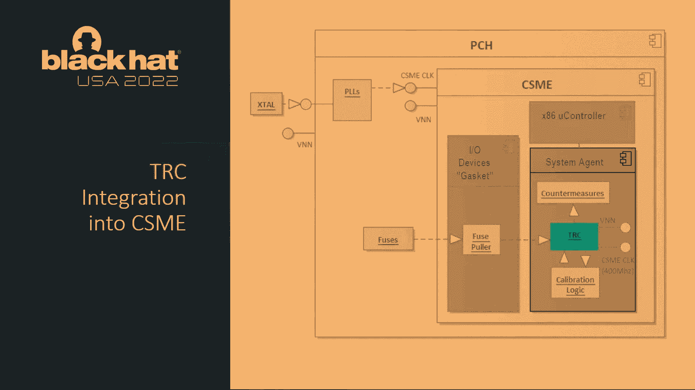

# P87：098 - Fault-Injection Detection Circuits： Design, Calibration, Validation and Tu - 坤坤武特 - BV1WK41167dt

大家好，感谢大家的出席，我可以看到房间里有很多电路设计师，但不管怎样，所以让我们，让我们继续讨论故障注入检测，所以我们将讨论一些故障注入检测的基础知识，我们将潜入可调谐复制电路本身。

我们将讨论英特尔是如何集成TRC的，关于校准和验证的一点知识，和一些结论，一点点关于我自己，我在英特尔工作了很长时间，开发可管理性引擎等产品，并将安全可管理性转换为引擎，自从他们诞生以来。

卡洛斯·图纳加在打电话，他是英特尔实验室的电路设计师和架构师，也有很长一段时间，所以让我们开始吧，我倾向于向观众提问，所以请注意，我希望你们能在这里学到一些东西。

重点是向大家解释英特尔在故障注入检测方面做了什么，还有一点关于技术本身，好的，所以一些基础知识，所以专注于非侵入性故障注入攻击，所以当我们提到非侵入性秋季注射时，一些攻击，主板，凹凸不平的地方，引脚。

等等，这超出了这些类型的攻击的范围，所以当我们现在谈论无创秋季注射时，我们说的是电压攻击，我们说的是时钟攻击，我们说的是电磁辐射攻击，也称为EMFI，最后我们谈论热攻击，所以所有这些攻击都是独一无二的。

因为你可以，这是一种不同类型的攻击，但又一次不是为了非侵入性故障注射，我们谈论的大部分是引脚修改。

我们所说的主要引脚，这里有数字和模拟电压轨，在我们的部分，我们有两个来自晶体的输入，我们的3。27千赫兹晶体，我们的38。4兆赫晶体。

所以这些是非侵入性故障注入的主要攻击面，当我们谈到半侵入时，这次演讲的主要焦点是，实际上，主要的攻击载体是激光，现在已经做了一些研究，但这项研究是相当新的，所以对于大多数基于激光的攻击。

你知道你需要一个D盖所以现在要完成这个圆圈，所以激光攻击也不在范围内，因为可调谐复制电路，不是吗？我们不是，我们没有承诺它会探测到激光攻击，所以完成这个循环是我们有，我们有高度侵入性的故障注入攻击。

这些攻击完全超出了范围，现在，我让你们猜三张幻灯片，我不得不花大部分时间和律师在一起，是啊，是啊，就是这个，攻击者试图通过故障注入来完成什么，他们真正想做的是让电路定时失效，不会导致整个平台崩溃。

因为如果他们使用电压或时钟进行故障注入攻击，EMFI或热度，平台就崩溃了，那就没有意义了，所以他们真的想达到这样的地步他们可以导致电路定时失败，但平台维护或评价对象，受到攻击的实体不会完全崩溃。

那么为什么电路定时很有趣呢，电路定时很有趣，因为当电路定时失败时，您现在可以过早地锁存数据，也可以过晚地锁存数据，在这个演示中，我们将过早地关注锁存数据，因为那是在欠压攻击的范围内。

我们可以谈论锁存数据太晚，只是需要太多的时间，但同样的原则适用于现在，如果你过早地锁存数据，许多平台或微控制器，发生的事情是你锁定了零，好的，所以听众的第一个问题是，什么指令与零的值最相关，有人知道吗。

是啊，是啊，否，完全正确，因此，故障注入攻击的圣杯是，如果可以将跳转转换为无操作，在安全引擎中验证受信任固件时，对呀，所以在正确的时间，在攻击者拍打Flash设备中的恶意固件后，或者其他设备。

或将其加载到控制器的内存中，它将无法通过身份验证，但是跳转到错误，如果他们能导致跳转错误为无操作，它会失败并执行他们恶意固件的主映像，所以这是这里的圣杯，所以在简单的层面上把跳转转换为无操作。

攻击者试图进行错误注入攻击，好的，那么这如何适用于时间，嗯，在标准时序图中。

你可能又有东西了，这很简化，但我在这里试图磨练一些关键点，你可以在这个钟的第二个上升沿看到，当数据在标称电压下运行时，跳跃被锁住了，所以，但你们中的一些人可能知道，一旦你降低数据线的电压，数据移动。

所以如果你能让数据移动得慢一点，你把那些数据线推到右边，时钟没有改变，大概是在这个简单的攻击上，所以你跳了一跳，对不起，你在发动一个无行动而不是跳跃，并且您成功地执行了恶意代码。

好的，这有点重要，所以这就是攻击者现在想要做的，如果我们把时钟故障，很相似，所以你有同样好的时钟和数据执行，在标称电压下驱动数据数据，那么钟会是什么样子，如果他们把它弄到一个更快的时钟上。

有人知道大声点，我不能，那么好吧，所以时钟会移位，时钟周期本身就会小得多。

因此，实际上时钟是时钟上升的边缘，时钟的第二个上升边缘又早了很多，诺亚闩锁，因为你加快了时钟的速度，现在，你想把时钟加快多快？以及如何，你想把电压驱动多快。

在那么低的电压下，它会使整个平台崩溃的，所以攻击者试图做的，理想情况下是在大约一个时钟周期内将电压驱动到一个非常低的值，所以在100兆赫处理器中，他们试图把电压降到很低的电压，大约10纳秒。

他们试图转换10或和时钟攻击，他们试图在一个时钟周期内，把时钟周期从十分改为，假设一个五纳秒的时钟周期，如果他们能精确地做到这一点，他们有一个很好的发动攻击的系统，好吧，那么我们该怎么解决这个问题呢。

你可能已经收集到了，我们更专注于电路定时，比我们在实际电压或时钟频率上，所以这就是这里独特和特别的地方，所以卡洛斯在电话里的可调谐复制品电路，他的团队实际上早在很久以前就发明了减轻。

他们发明它是为了减轻硅的老化，因为当硅老化时，它的时机开始失败，随着年龄的增长，我们开始减速，电路也没有什么不同，所以通过检测电路定时何时开始减慢卡洛斯的速度，团队实际上可以减少警卫带，并增加更多。

本质上为英特尔生产更多的染料，所以这项技术现在被命名为可调谐复制电路，因为我们刚才已经讨论过了，故障注入通过错误的定时表现出相同的行为，如果TRC能检测到电路中定时失败。

它可以检测电压、时钟、EMFI和热攻击，所以TRC是什么，这又是一个非常简单的电路，这是最复杂的电路图，这可能是视力表。

但我会变得简单一点，我们将用一个更简单的，更简洁的图表，但它是由一个发射失败组成的，可调谐延迟链和捕获触发器，现在这个捕获失败真的决定了，如果一条数据线被驱动，与我们所说的参考信号相比。

延迟线来得太慢了，您将在下一个图表中看到这一点，所以不用担心，这不是你要看到的唯一图表，我们要潜入水中，关键是延迟线，这是一条延迟线，可以调谐到匹配，最坏情况下我们产品的名义时间对吧。

所以延迟线应该匹配，最坏的情况下，延迟仍然有效，一旦你低于这个标准，我们的产品在我的计时功能上不起作用，这一点只能在大头钉上，我们已经确定，所以我们要跳到前面，潜得更深一点，让事情变得简单一点。

所以这里有一个稍微简化的图表，所以你有一些关键信号，一个是钟，一条是参考线，一个是数据实际线，在最坏的情况下，它被校准以匹配电路的定时，然后你有发射和捕获失败，所以输入时钟实际上会在上升的边缘。

沿数据参考线、数据实际线和第二上升沿发射信号，它会捕捉到，这两条线是相同的还是不同的，有一个，大家可以看到，你有XOR门，它输入这两条数据线，我们知道用X，或者如果两个信号相同，你得到一个零。

如果信号不同，你得到一个，以此类推，在时钟的第二个上升沿，如果，如果数据参考线和数据操作线不相同，您将生成，您将锁定一个1并输出一个错误，换句话说，你已经确定时机不对，好的。

那么这是如何工作的呢看这两条线，现在，你可以看到数据参考线在输入时钟后略有上升，因为发射失败的问题稍微小一点，现在有一个轻微的传播延迟，真正向右推出的是什么，是由于延迟而导致的数据实际行吗。

所以所有这些，所有这些逆变器和非门都导致数据线移动得更慢，好的现在在那个时间点现在再来一次，这条数据实际线路没有受到攻击，这是一条标称线，我们已经校准了两条，就在这个时候上来，这是几个简单的问题。

所以在名义情况下，XOR的值是多少，这条线上的误差为零，我知道，这些只是为了确保你们注意到了，所以假设我们有一个攻击，那个数据线，数据操作线甚至向右移动了一点，这是正确的在这一点上，现在。

这也是因为较低的电压等于较慢的数据线，那么在这一点上，现在是XOR结果，它现在检测到数据向右移动得太远了，作为一个错误，它的计时失败，在这一点上已经校准了，它移动这么远的唯一方法是攻击。

所以这是一个重要的概念，好的。

所有的权利，所以继续前进，好的，所以我不确定我们最后是否会回答问题，如果这是个问题，我是，我不太确定，好的，那么我为什么以及如何让英特尔集成TRC。

所以我们把trc集成到cs me中，这是一个嵌入式，PCH或客户端平台的平台组件集线器中的嵌入式子系统，它代表转换安全性和可管理性引擎，大多数人所说的南桥，它有相当多的高安全性应用。

你今天早上可能听说过，这是护靴员信任的根源，它是许多应用程序信任的根源，就像我们的集成TPM，这是我们可管理性解决方案信任的根源，所以如果攻击者能够运行，它通常执行，它执行英特尔签名固件。

所以如果攻击者能够，如果攻击者能够加载他们自己的固件，他们可能会改变站台的路线糟糕的事情可能会发生，在黑帽的演示中，我们通过软件手段成功地受到了攻击，物理手段，非物理手段，比如反光部分等等。

所以这是一个非常有恶意软件在CME上执行，对英特尔来说几乎是最坏的情况，所以我们正在尽一切可能减轻这种情况，现在我们也通过故障注入检测来缓解它。

好的，那么我们在哪里以及如何将这个可调谐的复制品电路集成到计算机中，所以CME由三个分区组成，就像你在这里看到的，有一个x86，有时被称为分钟，微控制器，有一个系统代理，这是我们的IO设备的垫圈。

所以我们把TC集成到系统代理和TRC中，我们给同样的电力线和同样的时钟输入了CME，从这张图中可以看到，没有直接的方法使用非，侵入性手段使CSM时钟发生故障，因为它是从PLL出来的，所以对于攻击者来说。

让CME时钟发生故障，他们，他们可以，基本上，他们必须使用一些相当复杂的机制通过使水晶本身发生故障，然而，直接进入封装的电压轨，为PCH内部的大部分电路供电也为C供电，因此。

通过在CME内部的BNN上放置TC，它基本上可以攻击，它将检测到对任何CMA分区的攻击，甚至更多，理论上，虽然我们对此没有任何承诺，它会检测到同样的攻击，将适用于PCH内的任何其他设备或IP。

现在我们不对此做出声明，因为CME通常是电源门控的，如果有电源，储税券也是，所以我们并不真的声称，比如说，CSM，保护USB控制器的TRC。

或者其他控制器，然而，它是，我们有，声称TC将保护CME免受所有电压和时钟攻击，以及，好的，所以我们把它放在系统代理中没有具体的原因，很好，更换系统代理的原因是，所以一旦TC检测到错误，它输出一个信号。

从这一点上，我们隔离CS我，并采取它复位正确，所以故障攻击的结果是厘米进入复位，平台不复位，我们从客户团队那里得到了明确的逐客令，我们不想仅仅重置最终用户的平台，至少在最初是这样，所以如果你攻击CME。

CS会重置，基本上所有的CME服务都将安全失败，这确实是储税券最初的目标，除此之外，我们还有校准逻辑，我们有保险丝要拉，我们一会儿就会讨论细节，好的，那么我们为什么选择集成TC。

安装这些电压和时钟故障的物理攻击越来越便宜，你可以直接从各种公司购买，或者你可以租，英特尔将安全视为一个进化的概念，每年，我们正在寻求增加更多的一两个重要功能，提高CME的安全性。

TSC只是这些路线图的一个很好的例子，这个路线图的，就像我之前提到的，cme集成了一个tcg，兼容TPM 2 O设备，我有点接近，和亲爱的我的心，因为我实际上对此负责了几年，你们中的一些人可能知道。

tpms，特别是离散tpms，有防止人身攻击的要求，所以为CME制造集成的TPM是我们的目标之一，尽可能接近离散TPM和鲁棒性，我们相信有了TRC我们毫无疑问，PCH内的最佳TPM，所以无论如何。

我刚才提到，好的，好的，那么校准这个的一些关键原则是什么，我们要回到我们谈过的事情上，所以如果你不正确地校准CRC，你可能会有假阳性，或者您可以错误地检测到攻击，通常两者都不会发生。

这是一件非常非常糟糕的事情，如果我们有一个假阳性，知道到目前为止是至关重要的，所以如果发生假阳性，非常非常糟糕的事情，比如产品更换，等等可能会发生，所以毫无疑问，我们没有，我们非常非常关心假阳性。

显然我们也想避免错过任何攻击的机会，如果你校准不正确，两者中的一个会发生，它从给定一个固定频率的电路的概念开始，我们知道电路定时什么时候会失效，我们只知道作为电路设计师，我不是电路设计师，但是卡洛斯。

所以我们把这个点叫做电路，电路定时失效V故障，这只能是攻击的结果，当你运行高工作负载时，你会看到正常的电压下降，假设你是，你知道的，假设你在抄袭，你撕下一张DVD并在网络上发送。

或者来自网络上串行ATA驱动器的东西，所以你会看到电压下降，由于这些高工作量，所以有正常的法律，野外的合法或犹太团体，我们不希望这些群体导致假阳性，我们想要一个攻击中的。

只能通过一个我们知道的小故障来检测，只能是攻击者造成的，好的，现在这个值，所以假设，让我们说，我不会给你真实的数字，因为我会告诉你一切，我只能处理特定的东西，我不打算告诉你，假设标称电压是一伏。

你可能会看到一个V故障，七百五十毫伏吧，所以从一伏到一伏的唯一方法，到750毫伏是通过攻击，当我们测量750毫伏的电压时，我们正在测量它，我们不是在大头针处测量它，对呀。

因为你在大头针上看到的和你在芝加哥商品交易所看到的完全不同，或任何其他综合，任何其他高度集成的设备，因为不同级别的电路、缓冲器和隔离，等等，所以你必须驱动一个非常非常低的电压值。

通常在引脚上的负电压下看到下垂，让我们说，从设备本身的250毫伏下垂，这个V故障又是全球性的，所以我们为给定的产品运送的数亿个零件，V故障对所有这些部件都是一样的，所以我提到了这一点。

因为有各种零件特定的零件需要校准，然后是全局校准，所以每一个都是在我们的生产线上唯一校准的，现在我不，他们不是唯一的，因为每个人都没有独特的价值，真正的校准是取V故障值，就是一个下垂，假设我刚才提到。

假设是250毫伏，并将其转换为延迟，对呀，那么什么是，一伏时的数据路径速度是多少，与每个特定部件750毫伏的数据传递速度相比，每个部分都不一样，好的然后我们将延迟值融合到硅中。

保险丝在正确数量的逆变器中爆炸，也不是TC本身的门，好的，所以我们要跳回TRC原理图和波形，多谈谈这个，所以我们再来看看这张图片中我们最喜欢的图表。

我们有一个在标称电压下运行的TRC校准，不产生错误，好的，所以在这个时序图上，与V故障相对应的延迟是多少，我会给你一个提示，它是两个上升边之间的距离，所以和任何人，有没有人想猜猜哪两个上升的边缘是。

对应于故障的延迟，非常好，如果我，如果我忘了带糖果，如果我有它，我会给我糖果，是啊，是啊，所以该点有一个以皮秒为单位的值，对呀，我们需要把每一个部分融合到每一个部分，好的，所以这里有一些非常重要的事情。

如果我们增加延迟会发生什么，发生的一切都很好，所以让我们说，让我们改变这一点，如果，如果延迟值为零，如果我们没有熔断任何大门，TSC数据实际上与TC数据引用完全相同，它将是，在这一点上不可能发现攻击。

因为不管他们有多小故障，不管他们把数据放慢多少，它永远不会走得足够远，无法探测到攻击，反过来说，如果我们在名义上炸进太多这样的门，动作的上升和下降边缘会向右移动这么远，在标称电压下，当你打开机器的时候。

它会检测到攻击，这显然是假阳性，所以延迟太久校准它的危险，你会得到一个假阳性，因为标称电压。

那还不错，我们马上就发现了，对呀，但最糟糕的是罕见的下垂，因为有人在做一些我们没有想到的工作量，好的，所以延迟使它的长度恰到好处每个部分都完成了，并且是校准的中流砥柱，好的。

那么我们如何找到每个零件的故障，所以我们用高中数学来生成一个斜坡，那是那实际上是，这将允许我们再次显示电压延迟曲线，这很重要，这对所有部分都是共同的，好的，所以所有的部分我们都计算了一个斜率。

在y轴上有延迟，在x轴上有电压，所以对于任何给定的部分，你只需要找到一个电压，并得到正确的，那个部分的延迟，好的，在许多U中又是什么，所以我们用一大堆数据来计算这个，这个斜度是对的。

y等于mx加b好的非常大，如果你们还记得高中数学，所以现在TFC在制造业中所做的是它在制造业中运行，在CRC的标称电压下的标称电压会喷出延迟造成的原因，标称电压下的延迟是多少，向我们报告，好的。

只是一个，我们有一个内部有限状态机，它只计算延迟是标称电压，所以有了这个信息权，我们可以再次利用斜坡，y等于mx加b我们可以找到时间点，我们可以把它简化为V故障，所以如果你知道坡度，你知道越南是对的。

你知道V，因此你没有延迟，然后你知道V故障，因为它是全球性的，用一条线上的两点，你在一个直线方程上，你已经知道了，很容易计算出V故障的延迟是多少，我们对每一个零件都这样做，所以全局的是斜率，斜率方程。

故障是全球性的，什么是独特的，毒液是众所周知的，我们知道这是一个金库，和零件的独特之处，它吐出了越南的延迟，它向我们吐出来，V故障的延迟，现在你可以问了，为什么这部分不能吐出来，你为什么需要这个斜坡。

你为什么不能在V故障上运行这个部分，把它吐出来，延迟井，你不能，你不能在V故障下运行超过几纳秒，所以整个机器就死了，我们的测试人员不能产生那么低的值，所以实际上这将是伟大的，校准这些零件真的很容易。

如果他们会出现V故障，但它的全部目的是，他们不运行它V故障正确，所以说，这就是为什么，我们必须用这个基于斜率的计算来计算V毛刺，每部分蔬菜，每个零件的延迟，好的，然后我们做一些测试。

那么我们如何确保这是正确的，我们所说的食谱，嗯，我们运行最初的假阳性测试，我们把零件放在高工作量下，以确保它不会产生任何假阳性，但我们开始把它弄对，我们驱动不同的电压，电压、脉冲宽度和脉冲宽度的矩阵。

像这样的东西。

所以我们生成，你知道在给定的故障长度，你知道十二三十四十纳秒，我们驱动一百种不同的电压，我们对所有不同的故障长度和不同的电压都这样做，现在，什么是真实的，我们看到的是，我们看到绿色的区域，没有什么失败。

刚刚好，然后我们得到米色或黄色的区域，整个平台都崩溃了，所以它要么在电压下运行太久要么电压太低，平台完全崩溃了，真正关键的是这条红色的线条，这就是TRC检测错误的地方，但是就在平台崩溃之前的平台。

或者平台可能不会崩溃，所以在每一条水平线上对我们来说都是至关重要的，对我们来说是正确的，用于CRC检测和攻击，因为如果没有，如您在底部的第三行水平行中所看到的，那么我们在TRC上基本上有一个洞。

有人可以成功地欺骗我们，我们不会发现它，好的，就是这个意思。

我会来看你的，我想我已经说过这些了，所以在我们对这个产品的第一次测试中，它是英特尔第十二代CPU核心CPU，又名桤木湖，我们看到了我们错过的这个，好的，所以我跑得比我想象的要快一点，不过没关系。

有更多的时间提问，那么发生了什么，所以用最初的一批TRC，所以我们要做的是，我们用了大约一百个零件，我们对它们进行假阳性测试和故障检测，如果他们中的任何一个像他们一样失败，我们确定为什么。

我们确定的是我们实际上把V故障设置得太低了，所以不是750毫伏，真的应该是七个，七百八十吧，七百七十五毫伏，对呀，根据这些信息，我们修改v的值，我们确定什么应该是正确的值，然后我们再融合一百个零件。

让他们通过假阳性测试，带他们通过故障注入测试，确保他们都通过，一旦他们这样做了，他们做到了，在这一点上，我们没有记录到任何失败，我们也没有记录任何假阳性，根据这些数据，我们锁定了第十二代的食谱。

所有湖CPU，它现在正在桌面和移动配置中发布，所以一些更多的一些更多的点与TC我想做，是因为我有时间吗，这就是我们为什么选择TRC，对呀，所以TPMS，智能卡已经推出了模拟。

时钟和电压电平探测器快二十年了，所以我们为什么不遵循这个模式呢，所以TC有几个我们喜欢的地方，一个是用一个电路我们可以检测到所有四种攻击，第二，TC是一个纯数字电路，使用标准电池，这意味着它很容易移植。

对呀，所以我们有，所以它不是一个软IP，这是一个艰难的IP，但它可以，但是将它移植到一个新的进程只需要非常非常短的努力，我们通常会很好地改变流程，比我们希望的要少，但我们尽可能经常地改变它们。

我们想做出努力，我们想让我们很容易切换过程，因为CSM MIP在各种产品上，都在不同的过程中，和，我们想确保它尽可能便宜，让我们去不同的过程，另一个原因是CSA是TRC臀部作为一个。

作为一个数字设备是非常小的，远小于模拟器件，因此，虽然TPMS并不经常改变它们的设计，并且不经常改变他们的过程，而且是在非常古老的过程中，我们倾向于尽可能经常地改变我们的过程。

显然英特尔正在努力为我们的CPU提供最先进的技术，我们的芯片组和图形设备，这就是我们选择TRC的一些原因，更多的传统模拟设备，现在的挑战是我们制造了很多零件每年上亿个，对于大规模部署的产品。

我们需要确保我们已经正确地校准了这个东西，我们相信我们现在必须证明我们问的风险更大的是谁，如果你不熟悉烤串，他们是第三方，第三方，为产品进行故障注入检测测试的安全公司。

我们要求他们通过故障注入来通过Trc，在很多很多个月里，他们去做了，他们评估了TC是否使用时钟，结果是电压和EMFI，结果是我们很高兴地说，他们不能成功地故障，他们说在所有情况下，在所有情况下。

故障是由TRC内部实施的对策检测到的，所以我们得到了一点，所以一旦我们这样做了，我们说过，哦，也许我们应该拿着这个黑帽子，因为直到我们百分之百确定我们不想去，你知道，告诉大家我们到底做了什么。

我就在五分钟的时候，所以我只想感谢，有很多人在这个卡洛斯工作，我从2014年开始做这个，我想嗯，去年终于实施了，就像我说的，有很多人，不只是我们，有一整个电路设计团队，在大批量制造中，测试，等等。

所以现在是提问的好时机，你能把卡洛斯。

卡洛斯，你现在要被抚养长大了，所以如果你们有什么问题。