# P89：100 - eBPF ELFs JMPing Through the Windows - 坤坤武特 - BV1WK41167dt

谢谢。感谢大家来到这里，这是一个精灵从窗户里跳出来，我是理查德·约翰逊，Trolx实验室Trex部分的高级研究员，在我开始之前，我只想向我们的队友大喊一声，克什米尔和安德里亚，才华横溢的实习生。

我很高兴与之合作，并为这次演讲做出了贡献，并实施一些引信束，所以今天我们要谈谈什么是EBPF，这个技术栈的起源和应用是什么，这次演讲将特别关注VPF的新实现，现在来到Windows平台。

所以我们将深入研究API和攻击表面，可供安全审查的，然后我们将讨论我们是如何通过这个技术栈的每一层的，做起毛，和一点代码审计，谈谈我们发现的一些bug，然后我会带着一些结论性的想法离开。

我认为这项技术将走向何方，这对房间里的每个人都意味着什么，那么什么是EBPF，它是虚拟CPU架构，所以这是一个不存在的CPU，这是一个软件CPU，很像JavaScript引擎或其他仿真CPU。

它最初是为了进行网络数据包过滤而设计的，作为Linux中伯克利包过滤器的一部分，它基本上被设计成一个更通用的内核模块扩展执行环境，所以这是一种在内核中运行代码的方法，在虚拟CPU上，这是沙箱的方式。

你创建一个程序，这是你用标准C语言写的，你包括一些特殊的标题，然后您可以使用LLVM将其编译到这个自定义体系结构中，从那里，您可以在Linux端使用传统的系统调用，将这些程序加载到内核上下文中，然后呃。

在网络层中实现钩子，或者呃，一般地转换为代码检测回调，该系统是为网络数据包的高速检测和修改而设计的，以及连接用户土地和内核函数的能力，这一切都始于1992年，当BPF添加到Linux内核时。

这是当今的前沿技术，它是专门为过滤网络数据包而设计的，所以如果你用过TCP，自卸车或线鲨，并且使用字符串指定网络筛选器，在端口中的某个IP上，实际上，您正在与内核中的BPF实现进行接口，那些弦。

那些幕后的过滤弦，在飞行中被编译成BPF程序，然后这些代码被Jump到内核中，这些钩子是以高性能的方式实现的，所以我们称之为旧的BPF实现，专门用于进行网络过滤，经典的BPF。

现在，大约八年前，Linux内核三十八，发布了这个的新版本，它将BPF包过滤器的概念扩展到了通用的执行环境，它们从3个2位指令变成了64位指令，他们增加了使用持久数据结构的能力，因此。

您的BPF程序可以存储数组或链表，或信息哈希表，因为你的钩子在监视，执行网络流量或功能，然后呢，嗯，此扩展允许您跨不同的调用存储数据，您的EBPF程序在右手边，这里的一些截图，我知道不是最大的，没关系。

我们有很多幻灯片，所以这将是一个相当快的谈话或粘贴谈话，里面有很多额外的信息供你自己学习，但是在Linux方面，它都是通过一个叫做接口的单一系统实现的，在系统调用中，有一堆子操作和子特性。

它的设计方式是一个设备，i八进制，可能适用于在单个内核接口后面隐藏许多命令的情况，EVPF有一点是独特的，它为这些程序实现了一个静态验证器，因为您可以将代码加载到内核中，他们想增加一些安全保证。

所以不仅有虚拟CPU执行环境，而且在Linux方面也是一个，一个相当简单的静态分析传递，试图确保，呃，内存安全，程序将在短时间内终止，在一般情况下，PF的应用是用于网络仪表，负载平衡，监测，嗯，遥测。

沿着这些路线的事情，在这一点上，环境相当成熟，在Linux方面，有去和铁锈，Python和C后端都与此接口，在一天结束时，他们仍然会调用系统调用，布局基本上是内核中发生的一切，就Linux而言。

如果您在Linux上使用这些产品中的任何一个。

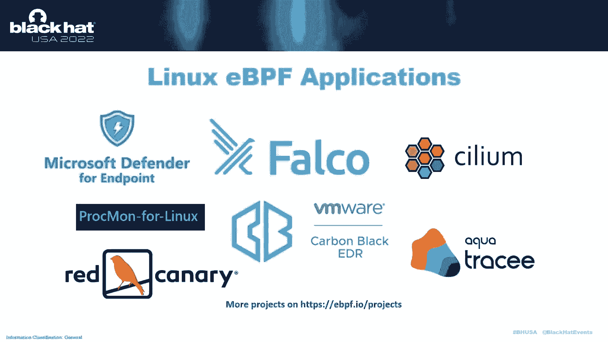

那么您已经在使用EDF基础结构，比如，你知道，Microsoft端点防御者，或者库伯内特斯的纤毛，诸如此类的事情，所以过去几年的黑帽子，我们也看到了一些关于linux edp f实现的讨论。

关注红队应用，我自己几周前在巡回夏令营做了一次演讲，去年秋天在图康，基本上是骑马进攻和防守，但有点绊网风格，二进制执行的um白名单，以及在可执行文件启动时将代码注入可执行文件的能力。

所以把焦点切换到Windows时间线，基本上，嗯，你知道的，我们看到它很抱歉，2014年是它被添加到Linux内核的时候，截至去年5月，微软宣布他们打算把这个平台带到现在的Windows一侧，当然。

我们都知道Linux是GPL内核，Windows，当然，不能直接在内核中采用该代码，所以他们必须想出一种方法来重新实现整个技术栈，所以这就是为什么这很有趣，这是一组全新的代码。

实现了我们已经看到的一些东西，被看见，在Linux方面发展并被大量采用，所有迹象都表明，指出这是未来遥测的通用平台，所以在2021年，微软宣布他们已经实现了两个网络钩子，可以与，通过EBPF程序。

您使用完全相同的编译器堆栈，你用LLVM，在内部为这个虚拟CPU输出完全相同的字节码，都差不多，差异，当然啦，微软是如何重新实现这些接口并将其插入内核的，所以在八月，他们宣布他们已经成熟了一些代码。

并添加了，我想那是接近十一月的时候了，但他们加了大约68个API，这是标准Linux API集的一部分，用于执行仪表的EVP，截至今年2月，他们释放了一种。

他们在Windows上运行的程序的第一个有效实现，evp堆栈，那是纤毛层四层负载平衡器，所以到今年二月，从去年五月到今年二月，他们或多或少地实施了最低限度的，你知道吗，最小可行产品，就在那时。

当然黑猫CFP就在附近，我已经对此做了一些研究，所以我想我们会继续沿着这条路走下去，看看，像建筑这样的安全是什么样的，攻击者有什么暴露，Linux等等，正如我所说，这一切都在Windows的内核中。

我们看到右边的这个图，它来自Windows PF项目，它表明基本上我们有几个不同的组件，在用户区域和内核中编排在一起，以创建这个整体系统，特别是微软采用了两个开源项目。

rbsd授权io visor ubpf实现，这是虚拟CPU和Prevent静态验证器，这是一部学术著作，试图增强静态分析引擎周围的安全保证。

我将深入研究这些组件中的每一个，你会看到他们被炸毁，所以我们开始了，当前执行情况，所以在Linux上，你可以像我提到的那样钩住，用户土地和内核中的函数，以及在Windows上进行网络检测，到目前为止。

他们只关注网络堆栈，所以现在他们对在云空间等地方使用EPF感兴趣，做虚拟网络，做负载平衡，动态重写数据包并将其分发给其他系统，像这样的东西，它是作为一个独立的组件运送的，并与微软对话，他们指出。

这种运输模型的设计是为了当你编写这些程序时，实际上是内核模块，你不需要通过标准的司机签名，和驱动程序验证过程，因此，您有一个更快的适用性模型，这是一个好处，因为这里的一切都是麻省理工学院许可的。

也可以被第三方产品消费，并作为整个系统的一个组成部分装运，例如xdr或edplatform，在窗户上工作，正如我所说，就像你使用clang llvm后端一样。

你写了一个简单的Hello World风格的程序，有一些特殊的API可以让你做一些事情，比如打印到屏幕上或日志上，您将看到这里有一个注释，显示SEC绑定，到底发生了什么，就是。

这表明我们将在elf文件中添加一个特殊的部分，它将包含这个特定的函数，现在，BPF程序本身是一个函数长，但它们确实有能力召唤对方，所以如果你编译Hello World。

您将看到生成了一个精灵文件，在文本段中，实际上没有字节大小为零，但是有一个新的段叫做bind，这是十六进制68字节，所以这就是我们编译的程序被放置的地方，您还可以使用LLVM对象转储来检查该部分。

你会在底部看到这个虚拟的嗯CPU指令表示，供以后参考，如果你看这些幻灯片，这里有几个完整程序的截图，它显示这里有多个部分，他们中的一些人拿着这些数据结构图，和其他做网络数据包检查的人。

所以你可以实现的不同类型的程序或EPP F程序，对应于您要利用的钩子类型，因此，在网络堆栈的最低层，有一种叫做XDP的东西，这是一个直接来自网络驱动程序的层。

在它真正到达Windows内核的其他部分之前，因此，如果您在XDP层实现EBPF程序，您实际上可以重写数据包，并从盒子里重新发送，在它们被操作系统本身从技术上接收之前，非常迷人的东西。

bind是一种程序，允许您响应端口绑定并接受，和一般听，而那些类型的API，然后有一把C，组相关和袜子操作相关的钩子，您也可以再次实现这些钩子，这只是为了让你看到有一组API，我们不需要具体地谈论他们。

但是这些API允许你做一些事情，比如与地图交互，创建地图，拉数据存储数据，调用其他程序，诸如此类的事情弄清楚你运行的是什么CPU，或者你在哪个线程上，你也会用这个来，那么最终。

围绕Windows的EBPF的安全模型是什么，它允许我们在内核上运行无符号代码，对呀，因此，安全模型或实现中的任何中断，这将是一个司机签署执行绕道，因为我们已经把代码放入内核了，如果安全保证是无效的。

我们可以打破它们，当然，这意味着我们在内核中得到了本机代码执行，现在Windows PF的实现在这里非常早期，正如我提到的，没有函数指针挂钩，没有。

只有基本的网络，但正因为如此，访问内核对象或API本身的处理，所以最终我们会讨论攻击目标是什么，但我们必须记住，你必须是管理员，当前与此子系统接口，因此，攻击模型或多或少是，你知道的，内核作为管理员。

我们已经可以从内核读取内存了，所以真的，我们要找的是写出界外的能力，或者获得完整的代码执行，嗯等，当然啦，字节码是由LLVM生成的，然后由静态验证器加载，我们会确保它没有违反这些安全保证。

我应该提到Linux方面，此攻击面的一部分可供没有特权的用户使用，因此，您不总是需要是root用户来调用BPF系统调用，以及Windows实现的源代码中，他们确实有评论，这表明在未来。

这些API中的一些将向标准用户开放，嗯，所以优先是静态验证器的名称，正如我所说，它使用抽象的解释，这样它就可以做像指针分析这样的事情，然后嗯，检查你有，嗯，如果您有从API返回的指针。

您必须检查它是否为空，然后才能实际取消引用它，它有所有这些内置的分析，比Linux内核中的要健全得多，理论上也是EBPF，与经典的实现相反，我们可以在其他abp程序中实现循环和尾部调用，正如我提到的。

这都是网新代码，ubpf的有趣之处在于它可以同时在用户区域中运行，和内核上下文，U代表用户模式或用户空间，这也意味着我们可以利用这个虚拟CPU，在其他上下文中，而不仅仅是EBPF堆栈，所以在这种情况下。

我们把它插入内核进行网络内省，在其他情况下，它可能会成为Lua或V8的替代品，或者其他地方的JavaScript引擎，所以总的来说，这是一个非常有趣的平台。

那么这些安全保证是什么呢这一切都很好地联系在一起，第一，因为这些是高性能的过滤器钩子。

它们有46条指令的限制可以在一个函数中，所以静态分析能够，实际上，展开循环并确保您将终止旧的停机问题，但因为他们对处决有限制，他们能够证明它实际上会终止，正如我提到的，它试图确保你的指针。

当你取消引用时，它们指向缓冲区的范围内，您控制并具有访问权限的，您正在对返回值进行基本检查，另外，堆栈指针在范围内，有一个专用的虚拟机内存块，在所有这些事情上执行，事实上，我们一会儿就会看到。

服务本身可以在虚拟机管理程序中运行，未来的代码完整性模式，有点进展，所以我们要找的攻击，因为我们是管理员，所以我们希望以管理员的身份执行代码，你能做到的第一个方法是。

如果加载来自第三方项目的安全模块或EPF模块，因为你想在你的系统上收集遥测，所以你去GitHub，下载并编译EBPF程序，这是一种攻击，您将获得用户模式管理员权限，然后是公开RPC端点的可信服务。

这是一个PPL过程，所以它是高度特权的，它被认为是可信计算基础的一部分，所以任何漏洞都相当于直接访问内核，当然还有静态验证器或喷气发动机本身，如果其中任何一个在处理代码时，读出界或写出界。

这将是一个漏洞，因为，还有一个解释器模式，所以同样的想法，然后有一个完整的i八进制层，当然，它有自己的处理e i八进制请求的实现，在它与EVP F子系统本身接口之前，最后是这些钩子。

它们本身钩子到网络数据包层，这些是，你知道的，抓包准备，以及EBPF平台可以访问的数据结构，所以那里发生了一些内存管理，这些钩子本身可能暴露在电线上潜在的遥控器上，网络数据包攻击。

所以我要在这里尽可能快地走，但我们感兴趣的第一个组件是用户土地API集，这包含在EB中，PF API DLL，基本上就是这里啊，装载，用户着陆的地方，用户管理员将能够加载BPF程序，卸载。

得到加载内容的列表，添加地图，一种审问系统，一般情况下，它相当于直接执行系统调用，和，呃，它确实附带了两个工具，您可以与之接口，一个是一个独立的工具，称为BPF工具，另一个是插在网壳上的插头，嗯。

所以我们要做的是直接给每一层绒毛，为了使API层变得模糊，我们知道这是与，这基本上是给它一个L文件，发出叮当作响的声音，或者给它一个原始的字节码流，然后将其传递给验证器。

我们最终以两种不同的方式模糊了这一点，我真的把这个弄毛了，Prevan和UBPF独立运行了一段时间，发现了一些崩溃，所以我们在那里做了一些交叉绒毛。

我们只是在Linux上独立地对这些组件进行模糊处理的输出，然后通过这些加载器工具运行它们，在窗户和嗯，所以我们将更多地讨论，我们在单个组件中发现，但我发现的第一个大体积是这种方法的结果。

它击中了第一次攻击，嗯目标，我们发现了一个漏洞，可以让您远程代码执行，或任意代码执行，通过加载包含此ebpf字节码的l文件，所以这个特殊的漏洞会导致热损坏，它对用户控制的指针进行免费调用。

如果管理员要加载筛选器，然后在该框上执行远程代码执行，作为管理员，嗯，下面显示的输出显示了，嗯，显示在一个热块上有一个损坏的后缀图案，如果我们看看它说腐败地址的位置，我们看到有四个。

因为我很方便地放在那里，告诉你你知道它被攻击了，嗯，因此，这种攻击最终将允许您控制空闲指针，这通常不是一个可利用的场景，如果你对记忆有足够的控制，这里有一个小调用堆栈，显示了我们是如何到达那里的。

这是免费的，它在EBPF程序的析构函数中，它正在处理一系列EBPF指令，所以它只是试图释放所有表示指令的对象，以及分配发生的方式，这是大小，是由于处理L文件本身中的重新定位项。

所以你生成一个EBPF程序，l文件，有一个搬迁区，当它被解析时，这是在循环中完成的，因为这是一个L文件，您可以要求在，一种任意的记忆场所，你对记忆有很高的控制力，你也有一个循环结构。

当它解析这些不同的部分时，你当然可以有多个部分，你需要多少节，因此，良好的内存控制的结合，和一个基于循环的解析器，意味着我自己没有时间充分利用这一点，在我们允许的时间里，但它肯定是一个可利用的类bug。

所以越过用户模式API，下一层是服务，PPL过程，这就像你在放大的图表中看到的，主要是这一切实际上是，它是否实现了一个RPC端点，您可以调用的一个API，它的API只是说看，验证和加载程序，你把它递给。

由第一个DLL生成的数据结构，从L文件中提取了字节码，现在已经准备了一个数组或数据结构来保存指令并传递给，这里应该可用的攻击面是占上风验证器，然后最终在验证成功后进行的Jit编译，如果你进去，API是。

你知道的，很有层次感，所以你知道，有几个API调用可以让您达到相同的点，无论您使用的是dll还是rpc api，他们都得到了同一个API调用，所以当我们对DLL进行模糊处理时。

我们实际上也已经通过RPC端点进行了模糊处理，我们确实试着，哦对不起，在我到达那里之前，所以我们对这些组件单独进行了绒毛处理，当然，所以优先验证器和UBPF，所以占上风验证器，你可以去看看报纸。

这是一个多项式运行时，使用抽象解释层的edp验证器，这真正意味着，他们用了很多数学来试图，嗯，你知道的，做这个指针分析，它可以在UBPF方便的任何地方使用，它附带了一个独立的验证工具。

所以这当然是我们利用的工具，这是非常简单和直截了当的，它需要一个文件输入。

所以我们可以用我们值得信赖的AFL Plus来做绒毛，所以我去年秋天在我的图康独立演讲之前做了这个模糊处理，当我在看EBPF的Linux端，所以在截图上你可以看到它发现了一些崩溃。

当我们通过一个叫做AFL Collection的很酷的工具再次运行这些崩溃时，我知道它有点小，你可以以后再看，但这张第一张截图显示我们找到了303个碰撞样本，我注意到这里有些是处理过的ababort。

你知道他们正在做的导致中止的断言，所以我把那些过滤掉了，我们确实看到了，我们在这里看到的红线基本上是可利用的，这里有几页崩溃，对呀，所以我知道进入这个项目，验证器本身有一些漏洞。

其中一个bug是什么的放大截图，它被指出可能是可开发的，事实上，在这个特殊的情况下，它并不是真正可以利用的，它认为这是一种权利，记忆权利，但它实际上在测试说明上，所以它是去参考的，值。

结果是一个REA V，不太疯狂，嗯，所以我们有一堆撞车事故。

虽然，我们知道我们想把它们从侧面穿过去，UBPF侧也是一样的，ubpf可以在解释模式或jit模式下运行，所以最终这个UBPF没有实现任何地图，或任何帮助函数，它只是一个纯虚拟CPU。

所以我们真的只是想出界，或读取或写入超出虚拟CPU环境的范围，所以如果我们模糊解释模式。

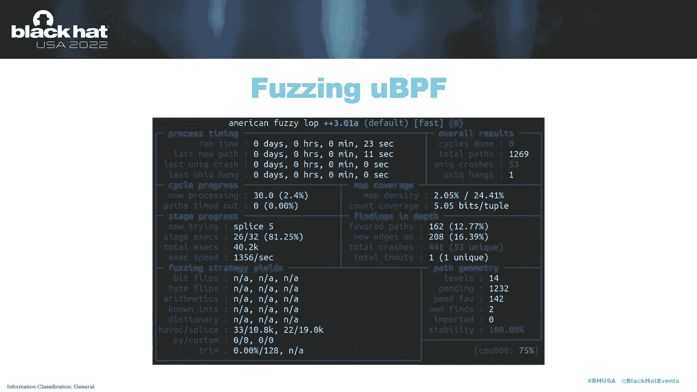

又发现了一些撞车事故，AFL收集的数据显示了这些红线，上面写着，那里有可利用的虫子，在喷气模式下，它变得更加疯狂，各种可利用的崩溃，但事实证明，围绕这一点的启发式并不那么好。

所以当我们发现所有这些虫子的时候，你知道我没有把它们都提交给这些开源项目，因为一个，我还不知道这些最终会进入窗户，但是B因为很多都是低级的，你知道的，问题，那是，最终，我在等待一个更重要的项目。

在有意义的上下文中使用CPU，所以我们有所有这些虫子，我知道我们现在想跟进这个，这是我们在上校方面发现并复制的，这个在UBPF破坏中显示了一个漏洞，当它试图终止程序时，它正在释放虚拟机，在本例中。

指针已损坏。

这些组件位于这个EVP F服务中，dll和呃，我们用WTF来模糊这两者，但实际上当我们一旦到了这个组件，微软在6月份的某个时候开始做他们自己的模糊处理，五月下旬六月，最终虫子无法到达，或者已经补好了。

所以ABF服务本身，PPL服务结果相当干净，就可利用的bug而言，那么我们想切换到的最后一个区域是，当然，发现这个内核驱动程序公开了什么，因为那真的是，一切最终都会结束，当然。

它公开了一个很好的i八进制接口，正如我之前提到的，此设备对象上的dackle确实需要管理权限，所以我们在寻找未签名的代码执行，理想情况下，通过ioctal公开的接口，允许你，你知道吗。

解析函数、映射和加载程序，获取下一个程序ID，与环形缓冲区和数据结构交互，所有这些事情，很多，所以这是大多数有趣的攻击面存在的地方，因为它在内核上下文中，我们不能使用简单的AFL风格的方法或交叉嗡嗡声。

我们真的需要想出另一种方法，所以在这种情况下，我们利用了名为WTF Fuzzer的工具，去年发布的阿克塞尔·苏切特，也称为超频，这个模糊器的工作方式是，我们从内核调试器获取完整操作系统内存的快照。

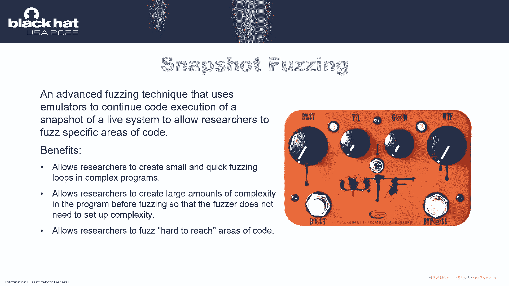

我们把它写到磁盘上，然后有一个组件使用盒子，CPU模拟器x八六模拟器64位，我们这是一个基于仿真的快照模糊器，最终，这允许我们在入口点设置一个断点，我们想要的任何功能，不管是用户，土地或内核。

并替换传递给这些API的缓冲区的内容，做我们的绒毛，这样做的另一个好处是它是分布式的，所以你可以运行一个服务器，它使用tcp插座，通过电线进行通信。

从客户端实现一个线束，您或多或少只需要编写三个函数，插入测试用例的，并将新模糊的数据移动到缓冲区中，在内存快照中，然后进行一些初始化，用于捕获交换上下文的调用，或其他要修改的函数，或者你只是想强迫。

终止您的模糊会话，由于时间有限，这只是对WTF的介绍，作为内核模糊处理的强大工具。

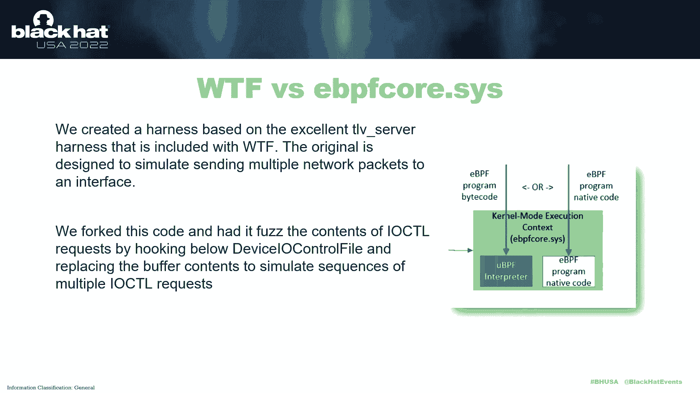

你得自己去看得更远一点，但最终它附带了一个演示模糊器，能够完成类型长度，使用多个数据包的值网络模糊化，所以我们用叉子修改了它，这样就不用钩住网络套接字，我们钩在装置下面，控制文件API。

您将在这里的调用堆栈中看到，最终从您通常调用设备的用户土地，伊奥，控制它通过几个层，直到您到达内核侧处理程序，我们替换这些缓冲区的内容。

每次迭代，然后我们不得不使用基于JSON的序列化格式，可以容纳多个ioctal请求，所以我们在这里的全部目标是能够把你知道的，一次一打八尾，操纵相同的地图或程序，查找各种漏洞类，所以最终。

我们序列化八进制数据缓冲区的内容，并在其周围添加一点元数据，为了重新执行那些。

所以当您运行WTF客户端时，它看起来是这样的，如果我们有时间，我会做一个现场演示，但基本上这是在显示客户端启动并输出更新，左手边是迭代号，它覆盖了多少块，这里每个客户相当低，只有在，你知道的。

每秒钟15到20次处决，但那是因为我们要发送多达十个I，一次八进制请求，所以我们在内核中激活了很多行为，如果你只做一个，它可以快十倍，基本上，当然，我们可以在许多CPU上扩展它。

所以我们最终使用了大约40个核心，在服务器端每秒执行300次处决，当你初始化它的时候，它启动并向您显示它开始接收来自客户端的信息，最终，我们要寻找保存为崩溃的输出，然后我们可以重播和测试，所以说。

我们的内核驱动程序模糊的结果确实出现了，有几次撞车，不幸的是，其中大部分是健壮性，一种层崩溃。

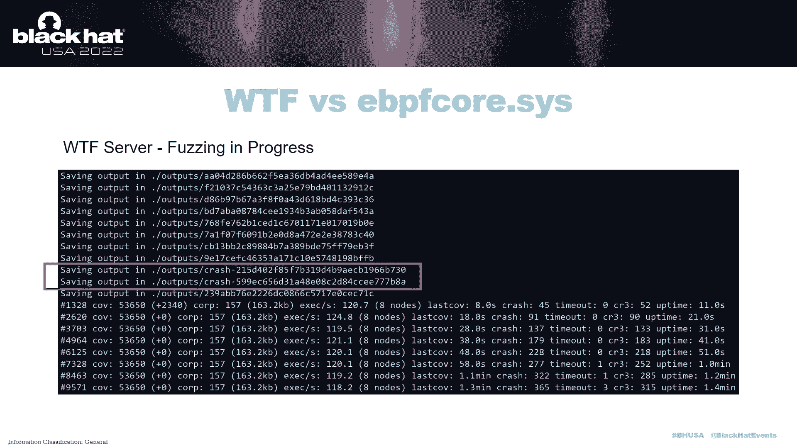

因为你已经是管理员了，所以我们确实出界了，读取访问违规，那个，当然啦，破坏系统并导致内核恐慌，在一天结束的时候，你知道你已经是管理员了，所以从技术上来说，如果你想，你可能会关闭系统。

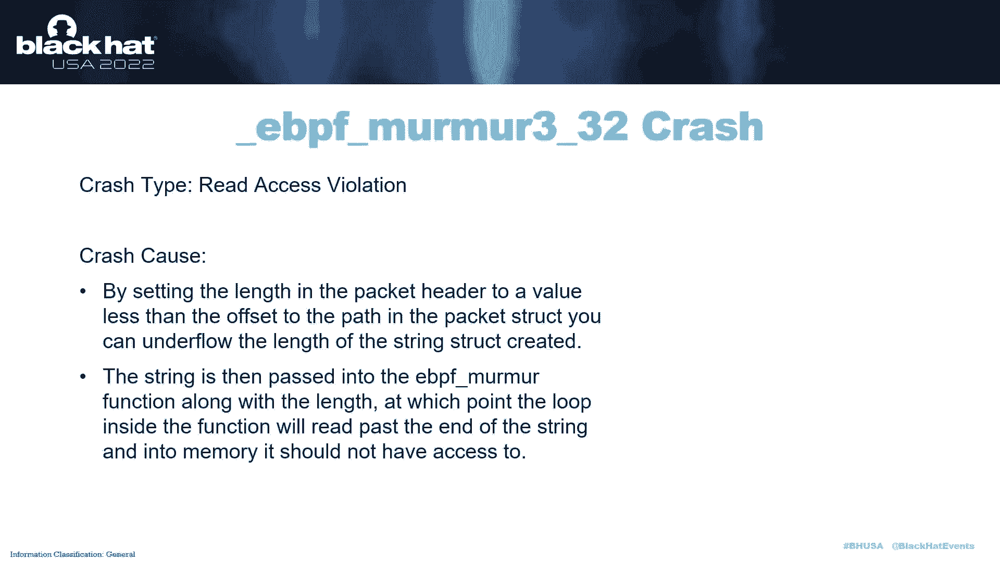

嗯，但你知道这是调用堆栈，正如我提到的，edf核心调用协议处理程序，我相信这就是我们在数据中喷出的地方。

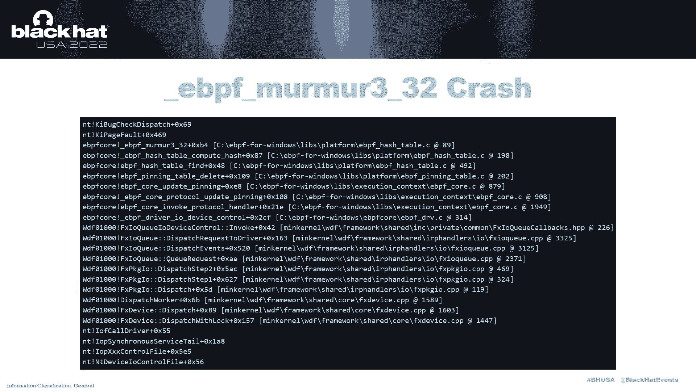

还有一个，这是UPPF摧毁API，这是我提到的我在用户和侧发现的相同的bug，但这里它存在于内核中，因为内核里面有喷气发动机，嗯按顺序，或者里面有解释器，而是，因此，相同的代码既存在于用户区域中。

也存在于内核中，因此，这取决于您如何与API接口，您可以在用户区域或内核中触发这些bug，然后又是一次撞车和蹦床桌等等。

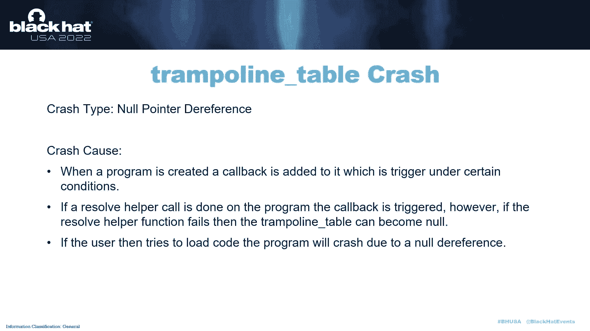

等等，所以总的来说，你知道我们在这里的目标是，如果我们能找到可利用的bug，然后很好，我们做到了，您知道第一个允许管理员访问的漏洞，然后我们想继续做健壮性测试，对这里的安全设计进行了全面的深入研究。

进行嗅觉测试，你知道这段代码被模糊化或检查做得有多好，它是一个移动的代码库，这是一个年轻的代码库，我们确实预料到会有像这样的各种问题。

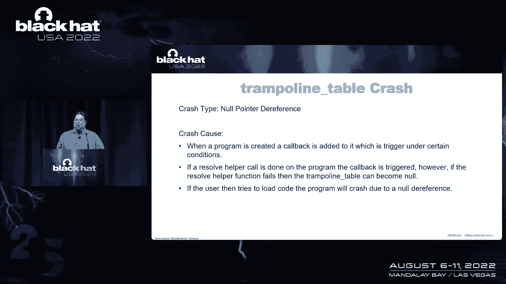

意料之中，和，正如我所说，微软已经在五月底和六月的某个时候开始模糊，他们正在迅速修复许多这些错误，嗯，所以其中一些我们没有费心，呃，提交，你知道的，只是因为他们是真的和旧的亵渎。

如果你想知道模糊器的输出是什么样子的，其中它有多个数据包，这里有一个小截图，显示了JSON格式的样子，当它实际上包含许多请求时，然后继续我们的绒毛，我们想用AFL尼克斯做实验，嗯。

这是美国模糊LOP插头在那个接口，使用基于虚拟机管理程序的快照模糊器，叫做尼克斯或卡夫尔，那是用的，但是因为我们花了大约一个月的时间，或者在我们真正开始转向尼克斯之前至少三周的模糊。

我们没有发现任何新的窃听器，但当然我们还是发现了与我们之前发现的类似的虫子，我们没有重复使用，你知道的，吊带或撞车，或者任何东西都是从同一个模板开始的，所以要注意的一点是，一个核心得到了60。

每秒五次处决，而不是只有十五或二十个，所以我们确实看到混合要快得多，只是设置和缩放有点困难。

这样就留下了最后一点攻击面，哪些是内核扩展模块，网络钩子在内核扩展模块中实现，将来应该会有一些实现迂回或代码钩子的东西，在不同的扩展模块中，网络一被称为网络EBPF扩展，这个很小，但对绒毛来说有点复杂。

因为正如我提到的，这将是从电线和工具上读取数据包的东西，将数据传递给EVP F程序的钩子，所以我们感兴趣的只是做翻译的一小段代码，所以在这种情况下，我们实际上做了一个代码审计，我和安德里亚，只要读代码。

没有太多的内存管理发生，它做了很多零复制，只是嗯，指着东西，所以我们最后没有发现任何新的虫子，正如我所说，代码钩子将在它们自己的扩展模块中实现，所以这将是未来的事情，而且非常快。

因为我们有两分钟时间那应该足够做现场演示了，如果我切换。

这只是一个演示，显示我们运行WTF Fuzzer并实时查找bug，嗯，在此目录中，这是一个WTF目录，i，那里有一堆元数据，所以我们要删除所有的崩溃和输入，以及上一次运行的输出，我要把名单扔掉。

我们创建的JSON数据包线束，然后我们要复制一个，只是创建程序，JSON。

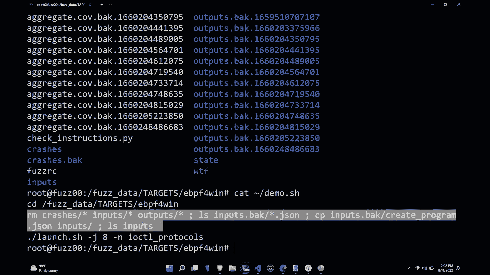

所以我们在这里看到的，虽然，就是这些都是，乌姆伊尾巴，我们创建了一个平面结构来输入Fuzzer，这样它就可以完成这些单独的请求，然后随着时间的推移，这些都发生了变异，并扩大和修改，以发现崩溃。

最后，我会告诉它快速启动屏幕会话。

它将有八个客户机连接回服务器，起毛，我蛋白石，我们不会复制以前的输入，这显示它正在启动一个H顶部。

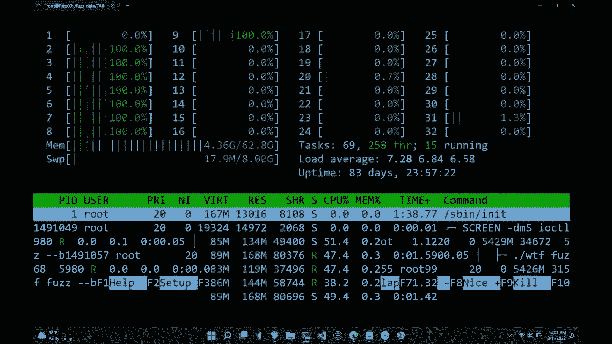

所以我会退出，好的，所以我们在这里看到的是，事实上，我实际上是在扬声器室开始的，所以这是错误的屏幕，但是呃，我们在这里看到的是它已经运行了一段时间，我们有八个节点连接在一起，我们有一百人被处决，对不起。

现在有16个节点，每秒一百次处决，从几个小时前开始，它已经发现了两万次撞车事故。

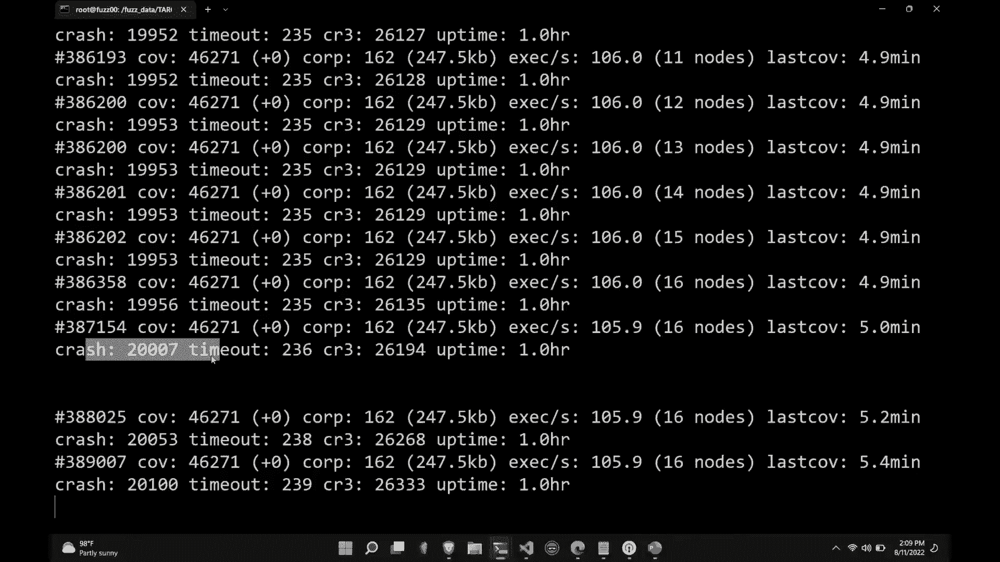

所以总结一下，嗯。

对不起，我们在最后一分钟，但总的来说，EBP F是一项令人兴奋的技术，它要走了，它现在将成为遥测的基础，在未来，它会出现在Windows上，Windows将能够运行完全相同的ABF程序，它们是便携的。

然后嗯，微软加入了ebpf基金会，它是Linux基础的一部分，所以它背后有很大的重量，Netflix和其他一些云计算玩家也是如此，我们发现了一个严重的弱点，发现应用了一些健壮性漏洞，在不同的层上起毛。

最终，我们作为Trellix在这里对安全进行积极的研究，为了公众，为了未来。

