# P9：009 - IAM The One Who Knocks - 坤坤武特 - BV1WK41167dt

所有的权利，欢迎回来，感谢您今天的加入，这个演讲叫做，我是敲门的人。

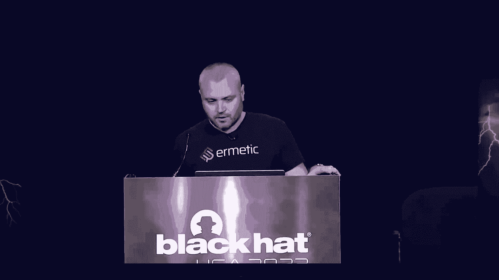

我的名字是上帝以色列安全研究的负责人，基于护理人员，我们专注于云安全，特别关注云基础设施安全，关于我自己的两分钱，我做安全研究已经很长时间了，基本上我的背景是Windows开发，活动目录和情报分析。

我花了大部分时间研究外面的许多云服务，我还在其他几个组织工作，比如微软和检查点，并在以色列较小的安全初创公司呆了几年，所以这是我第二次用黑色说话，我非常兴奋能在你们面前发言，我让他们自己嗨嗨，每个人。

我是诺姆，我是云安全研究员，我的背景是嵌入式设备和攻击性安全，好的，所以实际上这只狗是基于品牌风暴会议开始的，否，我是说我有一个核心服务，麻省理工学院我是服务，以及它在功能上的区别。

现在从一个云供应商到另一个云供应商，在我们开始一点点关于为什么，我们认为这是一个重要的话题，我们知道组织越来越多地在多云平台上部署他们的基础设施，原因是有时你想在房屋基础设施上提升和转移，比如说。

获得冗余，所以你把它分发给不同的供应商，有时你只是想降低成本或选择最好的优质服务，因此您可以在AWS上运行您的工作负载，但不知什么原因，开发团队有使用特定数据库的特殊要求，尤其是我现在表面上的基础设施。

似乎所有的供应商都提供了一套相似的管理工具和核心服务，帮助我们实际支持我们，并在云中管理这些源，但它在引擎盖下到底是如何表现的，所有供应商实际上都遵循同样的规则吗，相同的最佳实践。

所有供应商都以完全相同的方式遵循分担责任模式吗，现在，那我们呢，需要管理云的安全专业人员，做，我们真正了解每个提供商如何实现自己的访问模型，他们在每个平台上做什么和不做什么。

在一个云平台上成为专家已经够难的了，但是我们经常把特性和例程从一个平台复制到另一个平台，这些工作方式可能不同，从我们一开始所期望的，我们知道供应商花了数百万美元。

有时每年数十亿美元用于保护他们的信息主题，但它如何真正转化为我们这边更好的安全态势，消费者方面，如果你仔细想想，我和周围的人我实际上没有这些错误或弱点，围绕着，我其实是云提供商的责任对吧。

基本上都在我们身上，我们是云消费者，负责安全的人，所以如果你是个有钱人，一百连，那太好了，您可能为每个云供应商都有一个专门的安全团队，即使这样，有时事情也会变得有点复杂。

所以想想用户如何访问云中的不同资源，身份验证和授权呢，逻辑评估策略，内部服务沟通呢，所以那些非人类的身份，需要相互交谈的非人服务，我们真的了解每个供应商是如何在内部运作的吗。

管理这些被管理的身份所涉及的风险是什么，加密和加密密钥呢，我们是否从未来的密钥中完全可见我们的多平台，最后一个，但最重要的是日志记录，我们记录下每一个场景，我们现在如何利用日志。

今天我们将主要关注管理的潜在风险，我是多云，I AM Environment将浏览每个云基础设施之间的主要差异，谈谈那些平台的安全漏洞，当我说薄弱的安全点，我指的是所有供应商共享的结构特征，例如权限。

非人类身份，默认策略，等，现在我们讨论几个用例，看看不一致，实际上可以导致预期的访问，防御者可以采取哪些措施来改善他们的整体安全态势，别误会我的意思，我不是说其他安全流没有被使用，铲球不太重要。

但如果我们想让你从这次会议中得到什么，我是骨干服务，它是核心服务，它是控制对云资源的每一次访问的网关，它必须受到保护。

所以让我们开始吧，所以让我们花两分钟。

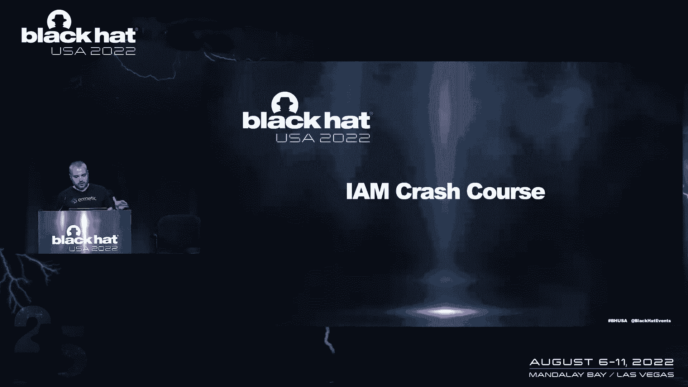

我是如此的在一个高水平的观点，我是由身份组成的，它基本上是任何可以根据i am服务进行身份验证的东西。

此外，它还为我们提供了权限文档，定义了谁可以访问什么以及在什么条件下访问，每个提供者都有自己独特的身份，并在供应商之间分享其中的一些，所以你有用户和组，所有供应商共享，但也有一些特殊类型的实体。

这些代表所有经过身份验证的用户或项目捐助者，所以你需要非常熟悉他们的基础设施，你知道吗，现在制定好的安全策略，如果你看看身份，我们可以打破这两个主要类别，人类身份和非人类身份，今天。

非人类身份对安全非常重要，实际上每个供应商都有自己的实现，你提到了这些，并在本届会议期间。

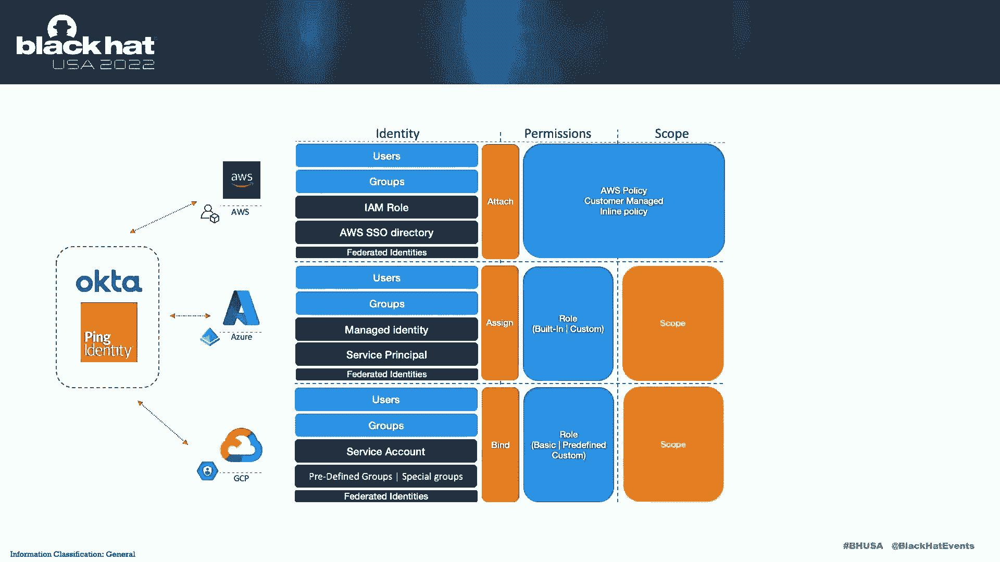

如果你把主要的三个供应商一个接一个地放在一起，这就是比较的样子，在孩子的左侧，我们有许多不同类型的身份在右边我们有那些许可文件，现在每个提供程序都使用某种权限文档，通常以JSON的形式。

这些文件与我们在左边看到的身份有关，现在的联动操作，有时这被称为标志或购买，或者实际上，但这并不重要，基本上是一样的，相同目的的相同目的，现在主要的区别是，这些供应商之间的第一个主要区别。

所有这些访问模型，因此，它们允许您将每个文档权限的效果限制在特定的范围内，这是一个非常重要的安全增强，例如，您可以授予某人管理权限，但限制这些权限在一定范围内的影响，如此蔚蓝，例如。

您可以将其限制为资源组，你可以限制这两个项目，现在在AWS，范围实际上是策略本身的一部分，而且要有限得多，以及通常基于某种字符串操作的，现在，因为他们不是，我是说AWS定义的执行方式是。

与其他供应商大不相同，我们现在需要再次熟悉这些，第二个主要区别是AWS访问模型在很大程度上基于身份策略，德国和蔚蓝是两者的混合体，具有完全管理功能的扩展身份提供程序，AW有一个他们称之为单一标志的东西。

这个名字有点误导性，因为单点登录实际上并不是该服务的主要功能，基本上单点登录是AWS中的迷你目录，如果你还没有使用它，我们强烈建议您开始使用它，因为它允许您以一种更方便的方式管理对多个会计的访问。

所有的权利，所以在幻灯片上，我们看到了三个提供者之间典型的组织结构是什么样子的，所有供应商都允许我们以同样的方式收集资源，通常在某种资源容器中，因此，在资源的主容器中，称为ablous帐户。

您设置了AWS帐户，它的工作方式是你有一个主要的基本容器，叫做项目，您可以将服务器项目滚动到文件夹和文件夹中，有一个讨厌的结构，升级到组织资源，现在Azure使用基础研究，被称为资源组。

并且每个资源必须至少属于一个资源组，如果不是，Azure将使您现在创建一个新的资源组，如果你又有，服务于相同应用程序逻辑的一堆资源，您现在通常将它们存储并放在同一个资源组中。

走路有点不同，主要原因又是，它们使用限制访问组织结构中容器的作用域，所以你可以选择不同的范围，例如在蔚蓝中，您可以使用订阅或管理组，但是在策略中没有作用域或作用域实际上是在策略中定义的。

现在我们要谈谈这些，在会议期间。

所有的权利，所以现在我们讨论了一些基本的。

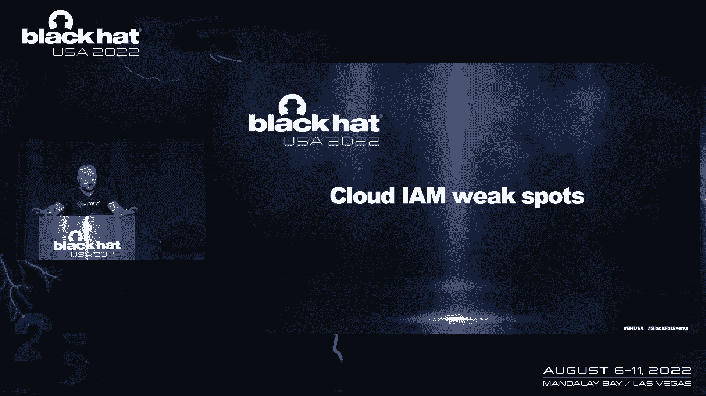

为什么我是许可是如此重要，很可能你们中的许多人都听说过AW的许可，当然还有攻击者是如何滥用它的，实际上，在过去的几年里，我们有一些违规行为，但实际上你们中有多少人能告诉我，现在它实际上调用了服务帐户。

作为许可，它非常非常类似于田园牧歌，也可以以类似的方式被滥用，这就引出了我的下一点，所以实际上我是基础设施使用数千，有时数以万计的不同权限，但实际上攻击者并不真正关心这些权限中的大部分。

通常他们关注管理权限，攻击者并不真正关心实现，我如何在云供应商之间推迟的细节，他们所需要的只是访问我是服务，那个，当然啦，向互联网公开开放，然后在安全上下文中，例如受损的凭据或某种令牌。

他们需要安全上下文才能有足够的权限，所以要附上不相关的许可文件，然后他们现在就可以按照他们的目标采取行动，如果他们没有这些许可，升级，但通常查找特定类型的权限，现在。

当攻击者或安全研究人员寻找新的bug时，他们通常使用特定的开采技术或一系列这些技术，通常这些技术现在被很好地记录为不同的类别，如果你考虑许可，他们实际上可以考虑权限和权限管理，用同样的方式。

实际上我是允许的，但是有一些具体的，我是对攻击者特别感兴趣的任务，我们可以把它们分解成两到几个子组，第一组是分段操作，因此，任何赋值操作都可能非常危险，并可能被，第二个叫执行权，我们还有授权和授予。

特定于AWS和创建新凭据的，和一些关于加密的例程，在屏幕上你可以看到几个例子。

当然，这不是一个完整的列表，只是为了表明一个观点，所以赋值操作可以是非常简单的事情，我们可以分配，如果您有分配操作，允许我们将自己分配到一个新的组，但是每个云提供商实际上都有特定的和非常有趣的分配脉动。

每个供应商都是独一无二的，例如，在蔚蓝中你有一些东西，允许您现在为工作流分配托管标识的权限，如果这项工作受到损害，攻击可以分配新的身份，而且不透露任何秘密，他们可以获得表示管理身份的令牌。

第二类称为执行权，有不同类型的代码执行例程，有些很简单，如此直接执行，比如说，编辑、修改或创建新的无服务器函数，以某种方式运行这些，就这样，你可以再次尝试升级一些不那么明显的。

所以基础设施作为代码和这些配置文件上的云提供商。

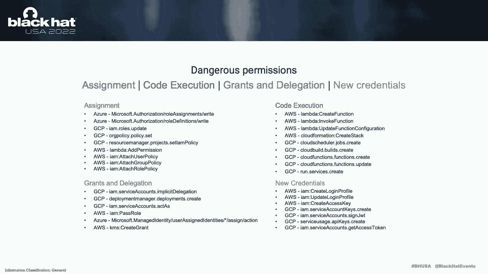

给你的那些模板，基本上执行代码，幕后，和教训，我的最爱，当然啦，是创建新的凭据，你可能会说好，这是书中最古老的技术，对呀，为什么我们甚至把它放在自己的类别中，但实际上对手利用了恒常性。

每个云提供商都有很多不同的，允许您编辑新凭据或编辑凭据，如果你看看两年前发生的太阳风悬挂，他们使用的一个实体部分实际上是在应用程序中添加新的秘密。

但没有人监测到这一点也没有人注意到这次袭击是从不同的角度发现的。

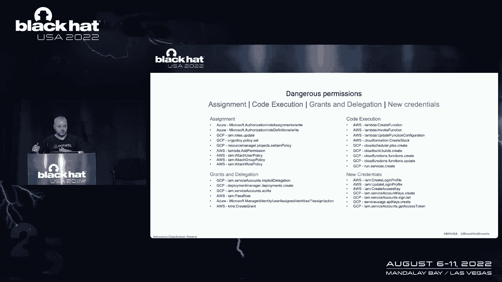

所有的权利，所以让我们转移到这里来谈谈一些非常非常重要的事情。

非人类身份，这本身就是一个大话题，我们没有太多的时间来涵盖一切，但我会尽我所能，非身份实际上是每一个精心设计的云基础设施的关键部分，我们看到越来越多的云服务开始为那些非，人的身份，当他们推动他们的用户。

实际上使用这些身份，这是有充分理由的，因为它基本上提供了云工作负载，您正在运行再次身份验证的能力，在应用程序逻辑或工作负载本身中没有存储任何秘密，所以实际上这是一个安全增强。

现在每个云供应商都有自己的非人类身份实现，一些云提供商对这些身份有一个非常特殊的实现，但它们又都脱壳了，主要概念，所以说，基本上，您可以从工作负载发送一个http请求，给你拿个代币，唯一的限制是。

您必须在该工作负载内运行，不管是虚拟机，容器或服务功能，这并不重要，您现在需要处理工作量本身，那么它是如何工作的，其实，就像以一种神奇的方式工作一样，对所以实际上，如果你仔细想想，云提供商需要为那些。

非人类身份，我喜欢叫那些经理，微软就是这样，所以这些身份需要有某种秘密，但是秘密不存储在工作负载上，它们通常存储在基础结构本身，如果我们不够小心，非人身份会使我们的基础设施面临新的风险。

比如以前的收集技术和管理实际上与，我是许可，因为经理身份实际上是间接地针对iam服务进行身份验证，他们有某种长期代币，但是这些令牌不位于本地机器上，这里有一个简单的项目讨论技巧。

所以基本上如果你有足够的许可，我们可以启动一个新的实例，如果我们有分配权限，我们可以分配新的角色，附着神经元，原来如此，例如，我们可以很容易地证明这一点，升级，获得我们想要的任何管理角色。

并访问特定AWS帐户中的不同API。

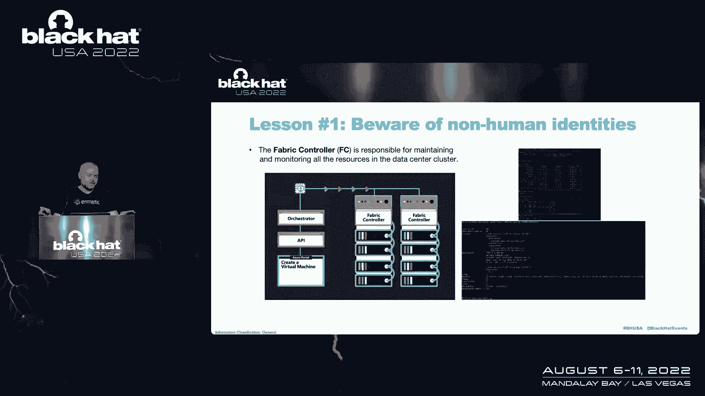

考虑混合实体和托管实体，所以这是一个新事物，实际上云提供商越来越多地采用它，混合和管理身份或非人类身份是非常特殊的，因为正如我提到的，有一个长期的电路需要储存在某个地方，当我们访问。

他们正在运行代表这些混合连接的代理，其实秘密，长期的秘密存储在你的数据中心的机器上，因为他们在奔跑，这些虚拟机正在您的数据中心上运行，所以实际上，当您从云中附加管理身份时。

您正在将这些附加到您的混合实例，您环境中的混合机器，其实秘密，它的证书或其他东西存储在工作负载上，如果这些被破坏了，当然会导致潜在的风险，说完，我们就没有继续讲座了，给你这样。

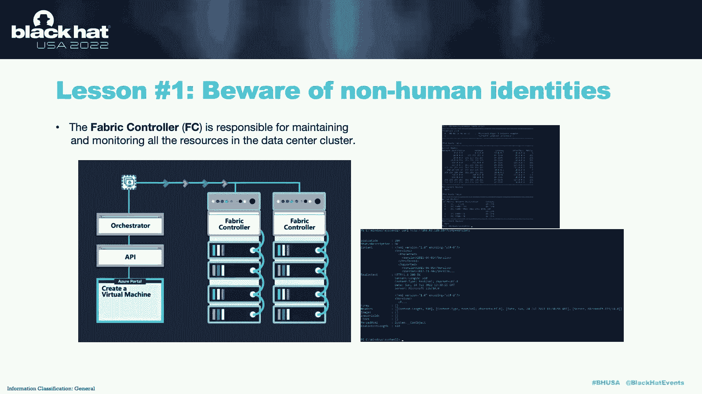

接下来我们要讨论的是我们的违约，我把这个命名为默认值，或者攻击者最好的朋友，这是一个有点挑衅性的标题，也许一些默认值是攻击者最好的朋友，但有些肯定是在我们理解我们需要讨论默认值存在的原因之前。

不同的CSP对这个特定的问题有不同的方法，这是一个预制结构，你绝对应该使用，你应该选择正确的，把它连接到你的范围上，用它和你的身份一起前进并取得成功，aws方法，默认值，至少在我是空间里。

它们是你开始的一个点，无论你采取第一种方法还是第二种方法，当默认值易受攻击时，那么它们的固有特性是非常非常普遍的，是一种危险的鸡尾酒，我们将在本节中看到的是，我很专注，违约风险，这并不是说没有一吨的非。

我是违约风险的人，但这些是我专注的，或者他们中的几个，所以让我们从AWS开始，aws管理策略，如果您不熟悉AWS管理策略，aws管理的策略本质上是由aws拥有和管理的json策略文档。

你可以简单地附加到你的身份中，问题是，如果我们理解JSON策略文档是如何工作的，那么我们就明白，从定义上来说，它们必须是宽泛的，因为他们有一个资源字段，并且该资源字段的值只能是通配符。

不管那是一颗假星还是一条有星星的小路，这是因为AWS拥有文档，他们不可能知道你帐户中资源的名称，将其转化为一些著名的常见管理策略，这些策略有时会造成漏洞，比较常见的，我们只读访问听起来很无辜，对呀。

您应该使用仅查看访问，而不是只读访问是只读访问，访问某些存储服务的三个桶，因此，一些第三方供应商使用的常见权限，这是相当危险的，再次只访问云预览，您可能正在部署此，不是AWS方面的专家。

使用这种管理策略，但一旦我们理解了托管策略的内部机制，我们明白为什么这行不通，aws，不知道我的云迹桶的名字，所以他们只能在里面放一个通配符DED表达式。

这意味着它对帐户中的每个资源授予s三个get对象，您可以获得帐户中的每个对象，只要你知道路，所以再一次，了解潜在的结构可以防止我们迷失在翻译中，并暴露这些默认风险，田园牧歌也是如此，分配其他角色。

或托管身份，权限修饰符，或者担当角色，向下缩小范围，走向蔚蓝，所以关于蔚蓝的第一件事是，我认为Azure真的相信默认角色的方法，有时很难选择合适的，但我们在自定义角色限制中看到了这一点，对呀。

Azure有客户角色机制，你可以用它，但每个目录限购五千，作为一个成熟的企业战略，这是相当，它可能很难支撑，Azure中的攻击者可以利用读取权限，以及Eagle谈到的分配权限，为了使用这些默认权限。

当他们没有正确的范围，接下来我们要从蔚蓝的角度来讨论的是，访问密钥，这是一个i am旁路，本质上是默认创建的，被许多存储服务，让我们深入研究一下，所以我创建了这个存储帐户。

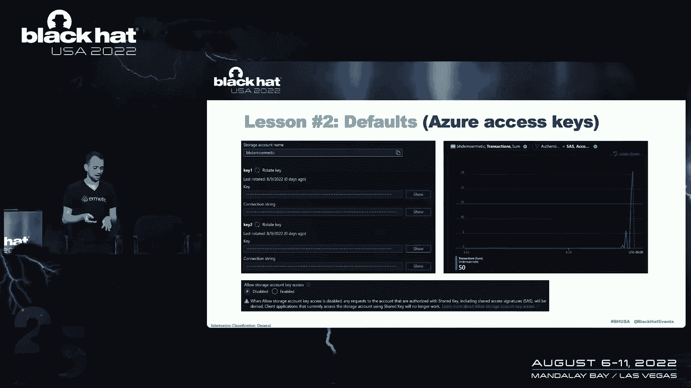

我什么都不做，它创建了这两个访问密钥，什么是访问密钥，嗯，他们通过，基本上罐头上写的，对呀，有一对永久证书，你应该轮换，您只能访问read，像这样可以通过绕过整个iam系统来读取数据。

就像直接使用这些凭据，您还可以管理和正确访问数据，所以这给了相当大的存储帐户控制，混乱也是如此，对不起宇宙DB，红色也一样，现在许多其他类型的存储服务也是如此，如果你看看底部的图像。

他们会给你这个复选框来勾选它以禁用它，他们说残疾风险自负，因为您可能会破坏您的系统并禁用所有访问权限，然后如果你进入蔚蓝，他们给了你一个如何解决这个问题的方便的想法，也就是说。

我们对特定身份验证下的事务有这个度量，在这里我把SASS和ACT和访问键，你可以看到有多少访问密钥，访问密钥被使用了多少次，听起来很完美，打开公制，找一套公寓，比如让每个人停止使用访问密钥。

找一条平坦的线，打开开关，当当问题是我刚刚创建了这个桶，我从来没有用过访问密钥，我只是点击了，点击舔，我从来没有点击过，显示在访问密钥上，我没有钥匙，然而我们可以获得这个。

发生这种情况的原因可能是我们最好的估计，因为azure在内部使用这些访问密钥来访问您的数据。

类似于门户显示，比如说，和其他机制，如门户，确实会坏一点，如果你禁用它们，所以顺便说一句，当我把这个给老鹰看的时候，他说，也许只是创作对吧，就像创造的肿块，否，它一直持续到整个问题，那个，就是他们。

他们是我的旁路，防守者很难注意到这一点，而且很难禁用，你可以在出口做更深的潜水，进入日志并查找所有活动，然后找到你的用户是否在做这个活动，它还是相当多产的，基本角色，查看器，编辑和所有者。

我们重点关注前两个具有强大而广泛的权限，就像你看到右边这些花哨的数字一样，但它们基本上适用于所有的云平台，听起来又是无辜的，听起来像视图，只是听起来像元数据，没有查看器允许您查询像这样的大查询，比如说。

查看器给你非常重要的数据访问编辑器基本上就像一个高级用户权限，你可以升级到管理员，如果你很狡猾，想要足够，他们缩小范围的方式，在GCE的计算引擎中，有另一种更古老的机制，称为轴镜。

这个名字对我来说可能有点像，名字有点混乱，因为这不是针对资源的范围，这是关于确定API的范围，这是关于将范围缩小到服务，所以你拿着这些轴突镜，你只需从谷歌的，你拿着这些轴突镜，你把它们附加到基本角色上。

这些权限的交集创建了权限映射，第三件重要的事情是默认服务帐户，除非您已禁用此行为，创建默认服务帐户，问题是对于许多服务，默认服务拥有帐户的权限与这些基本角色相同，查看器编辑器，通常是编辑。

或者至少对于Compute及其编辑器来说是这些基本角色，所以这一切把我们带到了另一种危险的组合，也就是说，如果我启动了一台计算机引擎机器，我得到了默认的服务帐户，因为我刚刚点击通过。

这意味着我得到了默认的编辑器角色，因为没有人编辑默认服务帐户的权限，顺便说一句，你可以也应该这样做，有人给了它云平台访问范围，这就像是一个需要有人纠正的错误，默认轴作用域很酷，只会让你喜欢，写一些日志。

只做一些视图，一切都很好，但如果你想让机器真正做一些事情，那么医生让你通过这个过程的方式，而不给你一个完整的IAM课程是，他们告诉你把云平台的范围，云平台范围实际上是一切，它非常非常广泛。

所以如果你有云平台规模，那是项目管理的一个障碍，而且很危险，更不用说喜欢了，如果这台机器碰巧是公共的，或者碰巧钥匙泄露了，或者碰巧是脆弱的，或者碰巧在这台机器中运行代码的方法，在这种情况下。

它就像一个完整的账户接管向量，不仅仅是环境中的风险，接下来我们要讲的是圆木，特别是日志有限制，现在，原木很棒，原木是不可思议的，他们可能比在云中更好，这不像是拿，喜欢在测云时扔泥土，挺好的。

但尤其是因为它很好，我们学会了依赖它，我们需要理解它的局限性，并能够正确地将它们联系起来，为什么是因为我们使用日志记录，很明显，两者都知道发生了什么，做检测，做事件响应，这不是这次演讲的主题。

但这非常重要，你们都喜欢这样生活，知道这一点，我们使用日志记录的第二个原因实际上是为了构建更好的权限，因为为了知道我是否可以剥夺某人的权限，你通常会做的是，试着检查日志，看看他们实际上在使用什么。

使用它或失去它的权利哲学，如果日志有限制，那么我不能确定我可以自由地移除，这导致权限广泛蔓延，攻击者也可以躲在后面，解锁API，不透明原料药，日志操作，分布式测井，我们将从一个供应商那里深入探讨。

来自云服务提供商，具体观点，左边的一条建议是记录你能记录的一切，但还有括号右对数，你能负担得起的一切，因为一些日志，像数据操作或数据平面操作是一些嗯用户或一些啊组织，发现有利可图的昂贵。

这是完全可以理解的，在最后，这是我们都被迫进行的风险成本计算，所以一些像原木一样的在AWS我们中有限制点，对于AWS进行角色枚举，有一种众所周知的被动侦察技术，如果你不熟悉的话，然后绝对查一下。

但基本上你可以说我是一个有角色的政策，他们不同意保存，如果角色不是真的，所以您可以对角色和目标帐户进行蛮力枚举，这已经被知道了一段时间，再次行动，因为动作日志记录相当昂贵，有时它没有打开。

然后可以利用它来检索数据影响力操作，所以AWS有一个非常酷的东西，也就是云迹文摘，对呀，它确实像云跟踪日志上的哈希校验和摘要，以表明没有人操纵他们，但让我们回到共同责任模式，谁有责任检查文摘。

这是正确的，我你我们，谁实际上检查文摘，问题不是，很多人查文摘，所以攻击者通常可以去文摘，删除事件，他们不喜欢通过重写，如果他们已经喜欢了，做了体育课，那够强了，对吧，你必须这样做。

并在某些场景中操纵云跟踪，我听到的最后一件事是，我们在两周前的一次会议上构建了这个演示文稿，VX VEA的凯特·阿克斯勒的研究，我这里有链接，一定要查一下，您可以使用S三个复制来做交叉帐户，数据x过滤。

它没有记录在源帐户上，所以你可以在特定条件下泄露这三个数据，就像必须已经有三个关于目的地数量的复制，不会深究的，但又一次，这些用于解锁数据或复制的向量是相当解锁的。

数据过滤在Azure中的AWS中很重要，因此，如果您熟悉记录日志的Azure方法，其他日志都是分发的，它们由每个服务部门管理，你必须控制，他们去哪个存储帐户并从他们那里收集，有蔚蓝，喜欢的内在方式。

让整个管弦乐队一起演奏，但它不是开箱即用的，这意味着他们非常，经常错过，其次，分布式日志的问题再次使日志有限制，并使日志记录在特定上下文中变得更加困难，多云的结论，无论您已经是多云还是考虑多云。

或者决定去多云或管理多云，多个原木云成倍增加，日志分散和必须处理日志的语言数量，因为所有这些都有不同的模式，所有这些都有不同的抽象，所有这些都有不同的含义，没有一对一的翻译，不幸的是。

没有神奇的解决办法，我可以在这个舞台上提供让一切神奇地变得更好，但在管理一个环境时，这两者都要意识到这一点是很重要的，当战略性地做出决定和考虑时，所以到目前为止这一直是井，我想了很多。

很多时候就像经典的停电，事情很可怕，害怕，但我们到底能做什么，我们能做些什么来使我们的组织和我们的捍卫者的事情变得更好，我要在这里提出两点，一个很实用，另一个更哲学，但请原谅我。

第一件事是尽量限制错误的影响，因为我是系统，我们今天讨论的三个供应商都很复杂，然后它们以不同的方式复杂，他们在不同程度上，但都很复杂，我们发现组织会，所以最重要的事情之一是限制，一个错误可能会产生。

那能做的，这是坚持一个AWS帐户，但同样不要迷失在翻译中，为什么AWS帐户是一个强大的安全边界，相对来说，您只能在特定的先决条件下进行交叉帐户操作，你必须得到双方的许可等等等等。

Azure资源组只与您创建的安全边界一样强大，如果你去我们之前在资源图中看到的更高的组织单位，如订阅或组织，你给了权限，那么您的资源组不是安全边界，所以要明白什么时候这是一个安全界限，当不是的时候。

并试图以一种实际上限制错误的方式应用它，部署组织策略以限制错误，所以这些不同于每一朵云和蔚蓝，你可以做一些事情，比如组织范围的政策，或者根据所有原则拒绝分配，您可以在AWS中使用组织策略。

经典的方法是服务控制策略或scps，人们喜欢做的事情的几个例子，我们认为这是很好的做法，在AWS中，拒绝访问根帐户，否认云迹，删除跟踪，这就像是逃避的第一步，不再伐木，现在我们可以做任何事情。

我们刚才谈到了默认服务帐户，加上基本角色问题，你实际上可以禁用，我是自动的，我是默认服务帐户的赠款，它禁用了这种确切的行为，这样你就可以在组织上保护自己，当然啦，避免永久凭据，尽可能保护人类身份。

因为这些是进入，第二点，你之前说过，更哲学的是如何构建权限，构建权限就像雕刻，你可以像粘土一样做，或者你可以像大理石一样做，你可以建设性地做这件事，积木上的积木，在块上在块上。

直到你有一些功能的东西来做你需要的，或者你可以像大理石一样做，你可以拿走一大块权限，然后把它凿开，直到你有一个模模糊糊类似于，开发人员讨厌对，因为我还不知道我需要什么权限，我也不是，我是专家。

这样我就可以确切地告诉你我需要哪些权限，所以挑战是确切地知道你需要什么，风险是这个功能，缺乏灵活性，减速，所以所有这些都是不做大理石的原因，挑战是证明一个否定的，就像我们之前讨论过的。

当我们讨论日志的局限性时，你需要绝对确定某人不需要许可，在你移除它之前，否则你会让很多人很不高兴，但这样做的风险是，你最终会过于宽容，事实上，我们在实践中发现最常见的事情是，人们拿着大块大理石。

向自己承诺有一天会继续努力，但从来没有真正做到过，或者至少不要在真正痛苦和实质性的区域，就像传球一样，充当分配权限，你知道的，或者Ego之前写的所有这些伤害你的权限，我们的推荐在这里有点无聊。

这是一种混合方法，尽量不要放置太大的大理石块，比如不要从最大的权力用户权限开始，你可以从这项服务中获得，试着玩更小的方块，然后把它们凿开，因为如果你没有拿到凿子，至少你没有更大的危险笼罩着你。

你也会因错误而受到控制，你是的，和和和排序符合这一点，做那种泥塑，或混合雕刻过程更容易，我们在AWS上构建了一个名为访问是不可否认的工具，这是一个AWS工具，顾名思义，它来自于一些否认信息不详细的问题。

实际上AWS已经变得更好了，啊，从一年前开始，现在没有一个是详细的，其中一些明显更详细，但出于安全原因，仍然没有一个是完全详细的，所以如果你不知道为什么你会被拒绝，那么A你很沮丧。

但是B你不一定知道添加什么权限，这导致了误捕，因为在可用性的压力下，你加一大块大理石，它起作用了，现在它不仅起作用了，你是，你有点不敢碰它，因为它以前不起作用，现在你做了一件事，现在它起作用了，等等。

等等，等等，这正是权限扩展的原因，你做点什么，然后它就变成了有效的东西，然后你就不再碰它了，所以y上的轴是，它扫描整个权限景观，它扫描SCPS，权限边界，标识策略是资源策略。

然后它会运行一个权限模拟来告诉你它是否应该工作，并扫描策略告诉您，引起否认的是什么样的陈述，或者你需要有什么声明并允许，在那之前我们会有一个演示，演示从已经有了云踪迹事件开始，我们这样做是有原因的。

即当事情从服务源发生时，或者不是来自您特定的机器，那么云迹是唯一一个集中的位置，在那里你可以看到所有的权利，不是全部，而是发生的大部分事情，所以想象一下，我们已经运行了三个清单桶。

我们试图列出桶中的对象，我们有这个通道，拒绝消息，现在我们要运行这个工具，所以我为文本大小道歉，但我会尽我所能，你知道的，足球评论员，旁白。

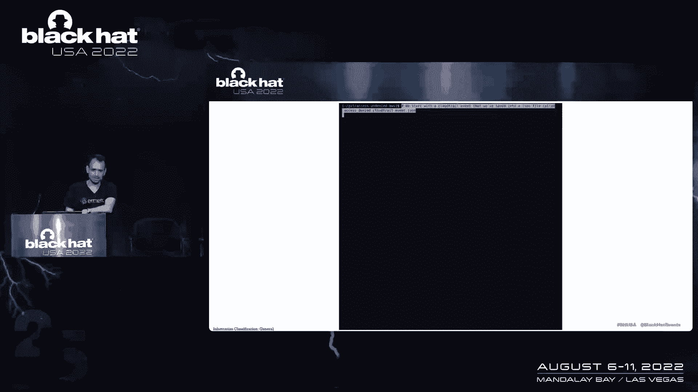

所以我们从保存到JSON文件中的云跟踪事件开始，它被称为访问拒绝云踪迹事件，所以让我们看看那个文件，看看里面有什么，如果你不喜欢的话，和那种神秘的云迹事件巢穴，上面说拒绝访问，其他的就不多了。

上面说来源账户，动作，但不是为什么访问被拒绝，所以现在让我们看看在那之前运行这个工具，让我们看看可用的命令种类，我们有两个命令，一个叫分析，它做工作，它分析云迹，告诉您访问被拒绝的原因。

另一个很有帮助的，就是获取SCPS，它只是下载服务控制策略，所以不必每次都这样一次又一次，因为就API而言，这是一个相当沉重的负担，所以现在我们在这里进行了分析，以加快演示。

我在没有服务控制策略的情况下运行了它，所以你会看到一个小警告，是的，我们有回应，所以基本上在评估结果中，我们有，这是对基于身份的政策的错过，所以我们没有否认，我们只是错过了，然后我们有需要连接的地方。

新政策，那是rnaws，我是帐户ID，看看，我得到了帐户ID描述，因为我知道你们中的一些人，然后我们需要添加的策略，这是允许的三个列表桶，为这个特定的桶做，并避免发生的那种蔓延，这是一个非常简单的例子。

但它也适用于复杂的情况。

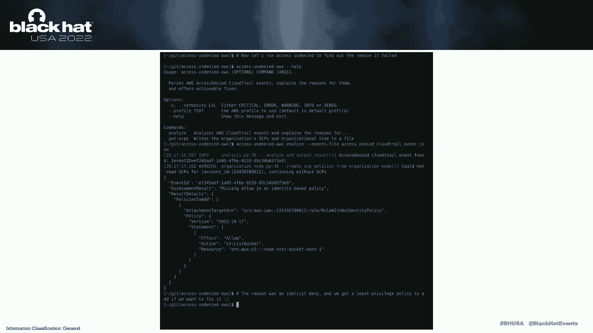

对呀，但那只是一个工具。

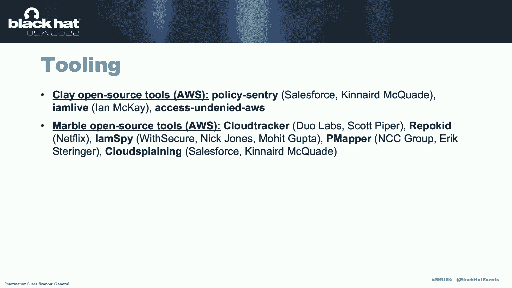

我认为有一个不可思议的工具世界，这些大多是我，AWS周围的工具这是原因，他们是AWS的中心，AWS的强大和复杂性，我是，我想邀请了这个集中的社区努力来做一个开源，在这个问题上的尝试。

我认为像Azure这样的空间有不可思议的工具，比如笔试，或者红队，或活动目录，但不是这个领域的特别工具，所以呃，政策哨兵，允许您通过指定策略和CRUD来脱离游戏，我是现场监视器。

您的机器上运行的API是什么，做了类似的事情，有一堆工具可以扫描环境中的云踪迹，并告诉您删除哪些策略是安全的，因为它们没有被使用过，像云跟踪器，里面剩下的是什么，二话不说，我们很乐意回答问题。

